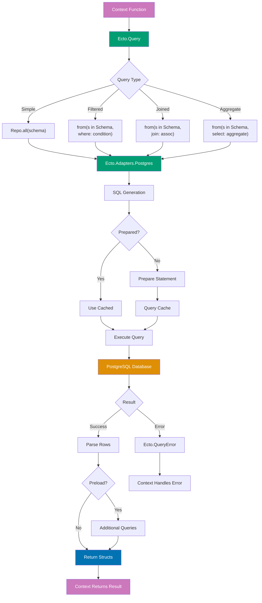

# Phoenix Data Access Guide

## Quick Reference

**Navigation**: [Stack Libraries](../README.md) > [Elixir Phoenix](./README.md) > Data Access

**Related Guides**:

- [Contexts](ex-soen-plwe-to-elph__contexts.md) - Organizing business logic
- [Performance](ex-soen-plwe-to-elph__performance.md) - Query optimization
- [Testing](ex-soen-plwe-to-elph__testing.md) - Database testing
- [Best Practices](ex-soen-plwe-to-elph__best-practices.md) - General patterns

## Overview

Ecto is Phoenix's database wrapper and query generator. It provides composable queries, safe data validation through changesets, and powerful association management while maintaining type safety and performance.

**Target Audience**: Developers building data-driven Phoenix applications, especially Islamic finance platforms with complex data models for donations, Zakat, Waqf, and financial transactions.

**Versions**: Ecto 3.11+, Phoenix 1.7+, Elixir 1.14+

## Schemas

### Basic Schema Definition

```elixir
defmodule Ose.Donations.Donation do
  use Ecto.Schema
  import Ecto.Changeset

  @primary_key {:id, :binary_id, autogenerate: true}
  @foreign_key_type :binary_id

  schema "donations" do
    field :amount, :decimal
    field :donor_name, :string
    field :donor_email, :string
    field :message, :string
    field :is_anonymous, :boolean, default: false
    field :payment_status, Ecto.Enum, values: [:pending, :completed, :failed, :refunded]
    field :payment_method, :string
    field :transaction_id, :string

    belongs_to :campaign, Ose.Donations.Campaign
    belongs_to :user, Ose.Accounts.User

    timestamps(type: :utc_datetime)
  end

  @doc false
  def changeset(donation, attrs) do
    donation
    |> cast(attrs, [
      :amount,
      :donor_name,
      :donor_email,
      :message,
      :is_anonymous,
      :payment_method,
      :campaign_id,
      :user_id
    ])
    |> validate_required([:amount, :campaign_id])
    |> validate_number(:amount, greater_than: 0)
    |> validate_format(:donor_email, ~r/@/, message: "must be valid email")
    |> foreign_key_constraint(:campaign_id)
    |> foreign_key_constraint(:user_id)
  end
end
```

### Custom Types

```elixir
defmodule Ose.Types.Money do
  @moduledoc """
  Custom Ecto type for money handling with currency.
  """

  use Ecto.Type

  def type, do: :map

  # Cast from external data
  def cast(%{"amount" => amount, "currency" => currency}) do
    {:ok, %{amount: Decimal.new(amount), currency: currency}}
  end

  def cast(%{amount: amount, currency: currency})
      when is_binary(currency) do
    {:ok, %{amount: Decimal.new(to_string(amount)), currency: currency}}
  end

  def cast(_), do: :error

  # Load from database
  def load(%{"amount" => amount, "currency" => currency}) do
    {:ok, %{amount: Decimal.new(amount), currency: currency}}
  end

  # Dump to database
  def dump(%{amount: amount, currency: currency}) do
    {:ok, %{
      "amount" => Decimal.to_string(amount),
      "currency" => currency
    }}
  end

  def dump(_), do: :error
end

# Usage in schema
defmodule Ose.Zakat.Calculation do
  use Ecto.Schema

  schema "zakat_calculations" do
    field :total_wealth, Ose.Types.Money
    field :nisab, Ose.Types.Money
    field :zakat_due, Ose.Types.Money

    timestamps()
  end
end
```

### Embedded Schemas

```elixir
defmodule Ose.Waqf.Allocation do
  use Ecto.Schema
  import Ecto.Changeset

  @primary_key false
  embedded_schema do
    field :beneficiary_name, :string
    field :percentage, :decimal
    field :category, :string
  end

  def changeset(allocation, attrs) do
    allocation
    |> cast(attrs, [:beneficiary_name, :percentage, :category])
    |> validate_required([:beneficiary_name, :percentage])
    |> validate_number(:percentage, greater_than: 0, less_than_or_equal_to: 100)
  end
end

defmodule Ose.Waqf.Waqf do
  use Ecto.Schema
  import Ecto.Changeset

  schema "waqfs" do
    field :name, :string
    field :total_amount, :decimal

    embeds_many :allocations, Ose.Waqf.Allocation

    timestamps()
  end

  def changeset(waqf, attrs) do
    waqf
    |> cast(attrs, [:name, :total_amount])
    |> cast_embed(:allocations, required: true)
    |> validate_required([:name, :total_amount])
    |> validate_allocations_sum()
  end

  defp validate_allocations_sum(changeset) do
    allocations = get_field(changeset, :allocations, [])

    total =
      allocations
      |> Enum.map(& &1.percentage)
      |> Enum.reduce(Decimal.new(0), &Decimal.add/2)

    if Decimal.eq?(total, 100) do
      changeset
    else
      add_error(changeset, :allocations, "must sum to 100%")
    end
  end
end
```

## Changesets

### Validation Patterns

```elixir
defmodule Ose.Accounts.User do
  use Ecto.Schema
  import Ecto.Changeset

  schema "users" do
    field :email, :string
    field :username, :string
    field :password, :string, virtual: true
    field :password_hash, :string
    field :age, :integer
    field :country, :string
    field :phone, :string

    timestamps()
  end

  def registration_changeset(user, attrs) do
    user
    |> cast(attrs, [:email, :username, :password, :age, :country, :phone])
    |> validate_required([:email, :username, :password])
    |> validate_format(:email, ~r/@/)
    |> validate_length(:username, min: 3, max: 20)
    |> validate_length(:password, min: 8)
    |> validate_confirmation(:password)
    |> validate_number(:age, greater_than_or_equal_to: 18)
    |> validate_inclusion(:country, ["US", "UK", "SA", "MY", "ID"])
    |> validate_format(:phone, ~r/^\+?[1-9]\d{1,14}$/)
    |> unsafe_validate_unique(:email, Ose.Repo)
    |> unique_constraint(:email)
    |> unsafe_validate_unique(:username, Ose.Repo)
    |> unique_constraint(:username)
    |> hash_password()
  end

  defp hash_password(%Ecto.Changeset{valid?: true, changes: %{password: password}} = changeset) do
    change(changeset, password_hash: Bcrypt.hash_pwd_salt(password))
  end

  defp hash_password(changeset), do: changeset
end
```

### Custom Validations

```elixir
defmodule Ose.Zakat.Asset do
  use Ecto.Schema
  import Ecto.Changeset

  schema "zakat_assets" do
    field :gold_grams, :decimal
    field :silver_grams, :decimal
    field :cash_amount, :decimal
    field :currency, :string
    field :last_zakat_payment_date, :date

    belongs_to :user, Ose.Accounts.User

    timestamps()
  end

  def changeset(asset, attrs) do
    asset
    |> cast(attrs, [:gold_grams, :silver_grams, :cash_amount, :currency, :last_zakat_payment_date])
    |> validate_required([:currency, :user_id])
    |> validate_number(:gold_grams, greater_than_or_equal_to: 0)
    |> validate_number(:silver_grams, greater_than_or_equal_to: 0)
    |> validate_number(:cash_amount, greater_than_or_equal_to: 0)
    |> validate_at_least_one_asset()
    |> validate_zakat_eligibility()
  end

  defp validate_at_least_one_asset(changeset) do
    gold = get_field(changeset, :gold_grams, Decimal.new(0))
    silver = get_field(changeset, :silver_grams, Decimal.new(0))
    cash = get_field(changeset, :cash_amount, Decimal.new(0))

    if Decimal.gt?(gold, 0) or Decimal.gt?(silver, 0) or Decimal.gt?(cash, 0) do
      changeset
    else
      add_error(changeset, :base, "must have at least one asset type")
    end
  end

  defp validate_zakat_eligibility(changeset) do
    last_payment = get_field(changeset, :last_zakat_payment_date)

    if last_payment && Date.diff(Date.utc_today(), last_payment) < 354 do
      add_error(changeset, :last_zakat_payment_date, "must wait one lunar year (354 days)")
    else
      changeset
    end
  end
end
```

### Conditional Validations

```elixir
defmodule Ose.Donations.RecurringDonation do
  use Ecto.Schema
  import Ecto.Changeset

  schema "recurring_donations" do
    field :amount, :decimal
    field :frequency, Ecto.Enum, values: [:weekly, :monthly, :quarterly, :annually]
    field :start_date, :date
    field :end_date, :date
    field :max_occurrences, :integer
    field :payment_method, :string

    belongs_to :campaign, Ose.Donations.Campaign
    belongs_to :user, Ose.Accounts.User

    timestamps()
  end

  def changeset(recurring_donation, attrs) do
    recurring_donation
    |> cast(attrs, [
      :amount,
      :frequency,
      :start_date,
      :end_date,
      :max_occurrences,
      :payment_method,
      :campaign_id,
      :user_id
    ])
    |> validate_required([:amount, :frequency, :start_date, :payment_method])
    |> validate_number(:amount, greater_than: 0)
    |> validate_end_condition()
    |> validate_date_range()
  end

  defp validate_end_condition(changeset) do
    end_date = get_field(changeset, :end_date)
    max_occurrences = get_field(changeset, :max_occurrences)

    cond do
      end_date != nil -> changeset
      max_occurrences != nil and max_occurrences > 0 -> changeset
      true -> add_error(changeset, :base, "must specify either end_date or max_occurrences")
    end
  end

  defp validate_date_range(changeset) do
    start_date = get_field(changeset, :start_date)
    end_date = get_field(changeset, :end_date)

    if start_date && end_date && Date.compare(start_date, end_date) != :lt do
      add_error(changeset, :end_date, "must be after start date")
    else
      changeset
    end
  end
end
```

## Associations

### Has Many and Belongs To

```elixir
defmodule Ose.Donations.Campaign do
  use Ecto.Schema
  import Ecto.Changeset

  schema "campaigns" do
    field :name, :string
    field :description, :string
    field :goal_amount, :decimal
    field :current_amount, :decimal, default: 0
    field :status, Ecto.Enum, values: [:draft, :active, :completed, :cancelled]

    belongs_to :organizer, Ose.Accounts.User
    has_many :donations, Ose.Donations.Donation
    has_many :updates, Ose.Donations.CampaignUpdate

    timestamps()
  end

  def changeset(campaign, attrs) do
    campaign
    |> cast(attrs, [:name, :description, :goal_amount, :status, :organizer_id])
    |> validate_required([:name, :goal_amount, :organizer_id])
    |> validate_number(:goal_amount, greater_than: 0)
    |> foreign_key_constraint(:organizer_id)
  end
end

# Preloading associations
def get_campaign_with_donations(id) do
  Campaign
  |> Repo.get!(id)
  |> Repo.preload([:donations, :organizer])
end

# Preload with query
def get_campaign_with_recent_donations(id) do
  recent_donations =
    from d in Donation,
      where: d.inserted_at > ago(7, "day"),
      order_by: [desc: d.inserted_at],
      limit: 10

  Campaign
  |> Repo.get!(id)
  |> Repo.preload(donations: recent_donations)
end
```

### Many to Many

```elixir
defmodule Ose.Waqf.Waqf do
  use Ecto.Schema

  schema "waqfs" do
    field :name, :string
    field :amount, :decimal

    many_to_many :beneficiaries, Ose.Accounts.User,
      join_through: "waqf_beneficiaries",
      join_keys: [waqf_id: :id, user_id: :id]

    timestamps()
  end
end

# Using join table schema
defmodule Ose.Waqf.WaqfBeneficiary do
  use Ecto.Schema

  @primary_key false
  schema "waqf_beneficiaries" do
    field :allocation_percentage, :decimal

    belongs_to :waqf, Ose.Waqf.Waqf
    belongs_to :beneficiary, Ose.Accounts.User

    timestamps()
  end
end

defmodule Ose.Waqf.Waqf do
  use Ecto.Schema

  schema "waqfs" do
    field :name, :string

    many_to_many :beneficiaries, Ose.Accounts.User,
      join_through: Ose.Waqf.WaqfBeneficiary

    timestamps()
  end
end
```

### Nested Associations

```elixir
defmodule Ose.Donations.Campaign do
  use Ecto.Schema
  import Ecto.Changeset

  schema "campaigns" do
    field :name, :string
    field :goal_amount, :decimal

    belongs_to :organizer, Ose.Accounts.User
    has_many :milestones, Ose.Donations.Milestone, on_replace: :delete

    timestamps()
  end

  def changeset(campaign, attrs) do
    campaign
    |> cast(attrs, [:name, :goal_amount, :organizer_id])
    |> cast_assoc(:milestones, required: true)
    |> validate_required([:name, :goal_amount])
  end
end

defmodule Ose.Donations.Milestone do
  use Ecto.Schema
  import Ecto.Changeset

  schema "milestones" do
    field :amount, :decimal
    field :description, :string
    field :reached, :boolean, default: false

    belongs_to :campaign, Ose.Donations.Campaign

    timestamps()
  end

  def changeset(milestone, attrs) do
    milestone
    |> cast(attrs, [:amount, :description, :reached])
    |> validate_required([:amount, :description])
    |> validate_number(:amount, greater_than: 0)
  end
end

# Creating with nested associations
def create_campaign_with_milestones(attrs) do
  %Campaign{}
  |> Campaign.changeset(attrs)
  |> Repo.insert()
end

# Example attrs
attrs = %{
  name: "Masjid Building",
  goal_amount: 100_000,
  organizer_id: 1,
  milestones: [
    %{amount: 25_000, description: "Foundation complete"},
    %{amount: 50_000, description: "Walls complete"},
    %{amount: 75_000, description: "Roof complete"},
    %{amount: 100_000, description: "Project complete"}
  ]
}
```

## Querying

### Ecto Query Flow



**Query Execution Flow**:

1. **Context layer** (purple): Business logic calls query
2. **Query building** (teal): Ecto.Query constructs query
3. **Adapter layer** (teal): Postgres adapter generates SQL
4. **Query cache**: Prepared statements cached for reuse
5. **Database** (orange): PostgreSQL executes query
6. **Result parsing** (blue): Rows converted to Elixir structs
7. **Preloading**: Additional queries for associations (if needed)
8. **Return** (purple): Structs returned to context

**Performance Optimizations**:

- **Prepared statements**: Queries cached and reused
- **Connection pooling**: DBConnection manages pool (default: 10)
- **Preloading**: Single query vs N+1 (use `Repo.preload/2`)
- **Select specific fields**: Reduce data transfer with `select:`
- **Batching**: Use `Repo.all/1` instead of multiple `Repo.get/2`

### Basic Queries

```elixir
import Ecto.Query

# Simple queries
def list_donations do
  Repo.all(Donation)
end

def get_donation!(id) do
  Repo.get!(Donation, id)
end

# Where clauses
def list_completed_donations do
  from(d in Donation,
    where: d.payment_status == :completed
  )
  |> Repo.all()
end

# Multiple conditions
def list_large_anonymous_donations do
  from(d in Donation,
    where: d.is_anonymous == true and d.amount > 1000,
    order_by: [desc: d.amount]
  )
  |> Repo.all()
end

# Pattern matching
def list_campaign_donations(campaign_id) do
  Donation
  |> where([d], d.campaign_id == ^campaign_id)
  |> order_by([d], desc: d.inserted_at)
  |> Repo.all()
end
```

### Aggregations

```elixir
def campaign_statistics(campaign_id) do
  from(d in Donation,
    where: d.campaign_id == ^campaign_id and d.payment_status == :completed,
    select: %{
      total_amount: sum(d.amount),
      donation_count: count(d.id),
      average_donation: avg(d.amount),
      max_donation: max(d.amount),
      min_donation: min(d.amount)
    }
  )
  |> Repo.one()
end

# Group by
def donations_by_campaign do
  from(d in Donation,
    join: c in Campaign,
    on: d.campaign_id == c.id,
    where: d.payment_status == :completed,
    group_by: c.id,
    select: %{
      campaign_id: c.id,
      campaign_name: c.name,
      total: sum(d.amount),
      count: count(d.id)
    }
  )
  |> Repo.all()
end
```

### Joins

```elixir
# Inner join
def donations_with_campaigns do
  from(d in Donation,
    join: c in Campaign,
    on: d.campaign_id == c.id,
    select: %{
      donation_id: d.id,
      amount: d.amount,
      campaign_name: c.name
    }
  )
  |> Repo.all()
end

# Left join
def campaigns_with_donation_count do
  from(c in Campaign,
    left_join: d in Donation,
    on: c.id == d.campaign_id and d.payment_status == :completed,
    group_by: c.id,
    select: %{
      campaign: c,
      donation_count: count(d.id),
      total_raised: sum(d.amount)
    }
  )
  |> Repo.all()
end

# Multiple joins
def user_donation_summary(user_id) do
  from(u in User,
    join: d in Donation,
    on: u.id == d.user_id,
    join: c in Campaign,
    on: d.campaign_id == c.id,
    where: u.id == ^user_id,
    select: %{
      campaign_name: c.name,
      donation_amount: d.amount,
      donation_date: d.inserted_at
    }
  )
  |> Repo.all()
end
```

### Subqueries

```elixir
# Campaigns with above-average donations
def campaigns_with_high_donations do
  avg_donation =
    from(d in Donation,
      select: avg(d.amount)
    )

  from(c in Campaign,
    join: d in Donation,
    on: c.id == d.campaign_id,
    where: d.amount > subquery(avg_donation),
    distinct: c.id,
    select: c
  )
  |> Repo.all()
end

# Top donors
def top_donors(limit \\ 10) do
  donor_totals =
    from(d in Donation,
      where: not is_nil(d.user_id) and d.payment_status == :completed,
      group_by: d.user_id,
      select: %{
        user_id: d.user_id,
        total: sum(d.amount)
      }
    )

  from(u in User,
    join: dt in subquery(donor_totals),
    on: u.id == dt.user_id,
    order_by: [desc: dt.total],
    limit: ^limit,
    select: %{
      user: u,
      total_donated: dt.total
    }
  )
  |> Repo.all()
end
```

### Dynamic Queries

```elixir
def search_donations(criteria) do
  base_query = from(d in Donation)

  query =
    Enum.reduce(criteria, base_query, fn
      {:campaign_id, campaign_id}, query ->
        where(query, [d], d.campaign_id == ^campaign_id)

      {:min_amount, amount}, query ->
        where(query, [d], d.amount >= ^amount)

      {:max_amount, amount}, query ->
        where(query, [d], d.amount <= ^amount)

      {:status, status}, query ->
        where(query, [d], d.payment_status == ^status)

      {:is_anonymous, is_anon}, query ->
        where(query, [d], d.is_anonymous == ^is_anon)

      {:date_from, date}, query ->
        where(query, [d], d.inserted_at >= ^date)

      {:date_to, date}, query ->
        where(query, [d], d.inserted_at <= ^date)

      _unknown, query ->
        query
    end)

  Repo.all(query)
end

# Usage
search_donations(%{
  campaign_id: 1,
  min_amount: 100,
  status: :completed,
  date_from: ~D[2025-01-01]
})
```

## Transactions

### Basic Transactions

```elixir
def process_donation(donation_attrs, campaign_id) do
  Repo.transaction(fn ->
    # Create donation
    donation =
      %Donation{}
      |> Donation.changeset(Map.put(donation_attrs, :campaign_id, campaign_id))
      |> Repo.insert!()

    # Update campaign total
    campaign = Repo.get!(Campaign, campaign_id)

    updated_campaign =
      campaign
      |> Campaign.update_total_changeset(%{
        current_amount: Decimal.add(campaign.current_amount, donation.amount)
      })
      |> Repo.update!()

    # Check milestones
    check_and_update_milestones(updated_campaign)

    # Return donation
    donation
  end)
end
```

### Multi Operations

```elixir
def transfer_waqf_funds(waqf_id, beneficiary_allocations) do
  Multi.new()
  |> Multi.run(:waqf, fn repo, _changes ->
    case repo.get(Waqf, waqf_id) do
      nil -> {:error, :waqf_not_found}
      waqf -> {:ok, waqf}
    end
  end)
  |> Multi.run(:validate_allocations, fn _repo, %{waqf: waqf} ->
    validate_allocations(waqf, beneficiary_allocations)
  end)
  |> Multi.insert_all(:distributions, WaqfDistribution, fn %{waqf: waqf} ->
    build_distributions(waqf, beneficiary_allocations)
  end)
  |> Multi.update(:update_waqf, fn %{waqf: waqf} ->
    Waqf.distribute_changeset(waqf, %{last_distribution_at: DateTime.utc_now()})
  end)
  |> Multi.run(:notify_beneficiaries, fn _repo, %{distributions: {_count, distributions}} ->
    notify_beneficiaries(distributions)
    {:ok, :notified}
  end)
  |> Repo.transaction()
end

defp validate_allocations(waqf, allocations) do
  total = Enum.reduce(allocations, Decimal.new(0), fn {_id, amount}, acc ->
    Decimal.add(acc, amount)
  end)

  if Decimal.eq?(total, waqf.distributable_amount) do
    {:ok, allocations}
  else
    {:error, :allocation_mismatch}
  end
end

defp build_distributions(waqf, allocations) do
  now = DateTime.utc_now()

  Enum.map(allocations, fn {beneficiary_id, amount} ->
    %{
      waqf_id: waqf.id,
      beneficiary_id: beneficiary_id,
      amount: amount,
      inserted_at: now,
      updated_at: now
    }
  end)
end

defp notify_beneficiaries(_distributions), do: :ok
```

### Rollback and Error Handling

```elixir
def complex_zakat_calculation(user_id, assets) do
  Multi.new()
  |> Multi.run(:validate_user, fn repo, _changes ->
    case repo.get(User, user_id) do
      nil -> {:error, :user_not_found}
      user -> {:ok, user}
    end
  end)
  |> Multi.run(:previous_calculation, fn repo, _changes ->
    query =
      from(zc in ZakatCalculation,
        where: zc.user_id == ^user_id,
        order_by: [desc: zc.inserted_at],
        limit: 1
      )

    {:ok, repo.one(query)}
  end)
  |> Multi.run(:validate_timing, fn _repo, %{previous_calculation: prev} ->
    validate_zakat_timing(prev)
  end)
  |> Multi.run(:fetch_nisab, fn _repo, _changes ->
    fetch_current_nisab()
  end)
  |> Multi.run(:calculate, fn _repo, %{nisab: nisab} ->
    calculate_zakat(assets, nisab)
  end)
  |> Multi.insert(:zakat_calculation, fn %{calculate: calculation} ->
    %ZakatCalculation{}
    |> ZakatCalculation.changeset(Map.put(calculation, :user_id, user_id))
  end)
  |> Multi.run(:notify, fn _repo, %{zakat_calculation: calc} ->
    send_zakat_notification(user_id, calc)
    {:ok, :notified}
  end)
  |> Repo.transaction()
  |> case do
    {:ok, %{zakat_calculation: calculation}} ->
      {:ok, calculation}

    {:error, :validate_timing, :too_soon, _} ->
      {:error, :zakat_already_paid_this_year}

    {:error, :fetch_nisab, reason, _} ->
      {:error, {:nisab_fetch_failed, reason}}

    {:error, _failed_operation, reason, _} ->
      {:error, reason}
  end
end

defp validate_zakat_timing(nil), do: {:ok, :first_calculation}

defp validate_zakat_timing(previous) do
  days_since = Date.diff(Date.utc_today(), previous.calculation_date)

  if days_since >= 354 do
    {:ok, :eligible}
  else
    {:error, :too_soon}
  end
end

defp fetch_current_nisab do
  # External API call
  {:ok, %{gold: Decimal.new("85"), silver: Decimal.new("595")}}
end

defp calculate_zakat(assets, nisab) do
  # Calculation logic
  {:ok, %{zakat_due: Decimal.new("250")}}
end

defp send_zakat_notification(_user_id, _calculation), do: :ok
end
```

## Migrations

### Creating Tables

```elixir
defmodule Ose.Repo.Migrations.CreateDonations do
  use Ecto.Migration

  def change do
    create table(:donations, primary_key: false) do
      add :id, :binary_id, primary_key: true
      add :amount, :decimal, precision: 15, scale: 2, null: false
      add :donor_name, :string
      add :donor_email, :string
      add :message, :text
      add :is_anonymous, :boolean, default: false, null: false
      add :payment_status, :string, null: false, default: "pending"
      add :payment_method, :string
      add :transaction_id, :string

      add :campaign_id, references(:campaigns, type: :binary_id, on_delete: :nothing), null: false
      add :user_id, references(:users, type: :binary_id, on_delete: :nilify_all)

      timestamps(type: :utc_datetime)
    end

    create index(:donations, [:campaign_id])
    create index(:donations, [:user_id])
    create index(:donations, [:payment_status])
    create index(:donations, [:inserted_at])
    create unique_index(:donations, [:transaction_id])
  end
end
```

### Complex Migrations

```elixir
defmodule Ose.Repo.Migrations.CreateWaqfSystem do
  use Ecto.Migration

  def change do
    # Waqfs table
    create table(:waqfs, primary_key: false) do
      add :id, :binary_id, primary_key: true
      add :name, :string, null: false
      add :description, :text
      add :total_amount, :decimal, precision: 15, scale: 2, null: false
      add :distributable_amount, :decimal, precision: 15, scale: 2, default: 0
      add :waqf_type, :string, null: false
      add :status, :string, null: false, default: "active"
      add :established_date, :date, null: false
      add :last_distribution_at, :utc_datetime

      add :founder_id, references(:users, type: :binary_id, on_delete: :nothing), null: false

      timestamps(type: :utc_datetime)
    end

    # Join table for waqf beneficiaries
    create table(:waqf_beneficiaries, primary_key: false) do
      add :id, :binary_id, primary_key: true
      add :allocation_percentage, :decimal, precision: 5, scale: 2, null: false

      add :waqf_id, references(:waqfs, type: :binary_id, on_delete: :delete_all), null: false
      add :beneficiary_id, references(:users, type: :binary_id, on_delete: :delete_all), null: false

      timestamps(type: :utc_datetime)
    end

    # Distribution history
    create table(:waqf_distributions, primary_key: false) do
      add :id, :binary_id, primary_key: true
      add :amount, :decimal, precision: 15, scale: 2, null: false
      add :distribution_date, :date, null: false
      add :notes, :text

      add :waqf_id, references(:waqfs, type: :binary_id, on_delete: :nothing), null: false
      add :beneficiary_id, references(:users, type: :binary_id, on_delete: :nothing), null: false

      timestamps(type: :utc_datetime)
    end

    # Indexes
    create index(:waqfs, [:founder_id])
    create index(:waqfs, [:status])
    create index(:waqfs, [:waqf_type])

    create index(:waqf_beneficiaries, [:waqf_id])
    create index(:waqf_beneficiaries, [:beneficiary_id])
    create unique_index(:waqf_beneficiaries, [:waqf_id, :beneficiary_id])

    create index(:waqf_distributions, [:waqf_id])
    create index(:waqf_distributions, [:beneficiary_id])
    create index(:waqf_distributions, [:distribution_date])

    # Check constraints
    create constraint(:waqfs, :total_amount_positive,
             check: "total_amount > 0"
           )

    create constraint(:waqf_beneficiaries, :allocation_valid,
             check: "allocation_percentage > 0 AND allocation_percentage <= 100"
           )
  end
end
```

### Data Migrations

```elixir
defmodule Ose.Repo.Migrations.MigrateLegacyDonations do
  use Ecto.Migration

  import Ecto.Query

  def up do
    # Add new columns
    alter table(:donations) do
      add :migrated_from_legacy, :boolean, default: false
      add :legacy_id, :integer
    end

    # Migrate data
    flush()

    # Run data migration
    execute("""
    INSERT INTO donations (id, amount, donor_name, campaign_id, migrated_from_legacy, legacy_id, inserted_at, updated_at)
    SELECT
      gen_random_uuid(),
      amount,
      donor,
      campaign_id,
      true,
      id,
      created_at,
      created_at
    FROM legacy_donations
    WHERE amount > 0
    """)
  end

  def down do
    # Remove migrated records
    execute("DELETE FROM donations WHERE migrated_from_legacy = true")

    # Remove columns
    alter table(:donations) do
      remove :migrated_from_legacy
      remove :legacy_id
    end
  end
end
```

## Related Documentation

- **[Contexts Guide](ex-soen-plwe-to-elph__contexts.md)** - Organizing data access
- **[Performance Guide](ex-soen-plwe-to-elph__performance.md)** - Query optimization
- **[Testing Guide](ex-soen-plwe-to-elph__testing.md)** - Database testing
- **[Best Practices](ex-soen-plwe-to-elph__best-practices.md)** - General patterns
- **[Ecto Documentation](https://hexdocs.pm/ecto)** - Official reference
- **Schema Template (TODO: ./templates/ex-soen-plwe-elph-te\_\_schema-template.md)** - Schema starter
