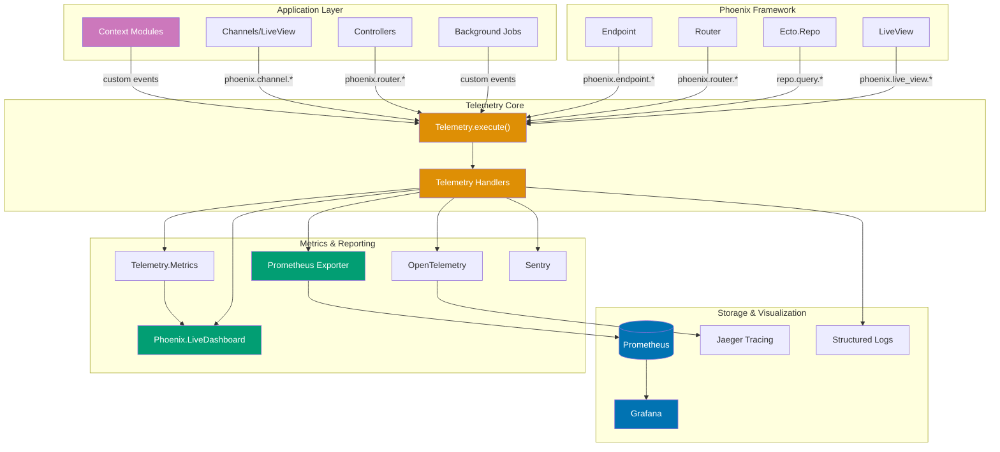

# Phoenix Observability Guide

## Quick Reference

**Navigation**: [Stack Libraries](../README.md) > [Elixir Phoenix](./README.md) > Observability

### At a Glance

| Aspect             | Key Technologies              | Use Cases                    |
| ------------------ | ----------------------------- | ---------------------------- |
| **Logging**        | Logger, JSON formatters       | Structured application logs  |
| **Metrics**        | Telemetry.Metrics, Prometheus | Performance monitoring       |
| **Tracing**        | OpenTelemetry, Zipkin         | Distributed request tracing  |
| **Error Tracking** | Sentry, AppSignal, Rollbar    | Error aggregation & alerting |
| **Dashboards**     | LiveDashboard, Grafana        | Real-time visualization      |
| **Health Checks**  | Custom endpoints              | Kubernetes probes            |

## Overview

Observability enables understanding system behavior through logs, metrics, and traces. Phoenix provides excellent observability through Elixir's Logger, Telemetry events, and ecosystem tools.

**Target Audience**: Developers implementing monitoring and observability for production Phoenix applications.

**Versions**: Phoenix 1.7+, Telemetry 1.0+, Elixir 1.14+, OTP 25+

**Key Benefits**:

- **Debugging** - Understand what happened when issues occur
- **Performance** - Identify bottlenecks and optimize
- **Reliability** - Monitor system health and availability
- **Alerting** - Get notified of problems before users complain

## Structured Logging

### Logger Configuration

Configure Logger in `config/runtime.exs`:

```elixir
# config/runtime.exs
import Config

if config_env() == :prod do
  # Use JSON formatter for production logs
  config :logger, :console,
    format: {LoggerJSON.Formatters.GoogleCloud, :format},
    metadata: [
      :request_id,
      :user_id,
      :organization_id,
      :trace_id,
      :span_id
    ]

  # Set log level from environment
  log_level = System.get_env("LOG_LEVEL", "info") |> String.to_atom()
  config :logger, level: log_level
else
  # Human-readable format for development
  config :logger, :console,
    format: "$time $metadata[$level] $message\n",
    metadata: [:request_id, :user_id]
end
```

### Structured Logging Patterns

```elixir
defmodule OsePlatform.Zakat.Calculator do
  require Logger

  @doc """
  Calculate Zakat with structured logging
  """
  def calculate(user_id, calculation_params) do
    Logger.info("Zakat calculation started",
      user_id: user_id,
      calculation_type: calculation_params.type,
      nisab_rate: calculation_params.nisab_rate
    )

    start_time = System.monotonic_time()

    case perform_calculation(calculation_params) do
      {:ok, result} ->
        duration_ms = System.convert_time_unit(
          System.monotonic_time() - start_time,
          :native,
          :millisecond
        )

        Logger.info("Zakat calculation completed",
          user_id: user_id,
          calculation_id: result.id,
          zakat_amount: result.amount,
          duration_ms: duration_ms
        )

        {:ok, result}

      {:error, reason} ->
        Logger.error("Zakat calculation failed",
          user_id: user_id,
          reason: inspect(reason),
          params: inspect(calculation_params)
        )

        {:error, reason}
    end
  end

  defp perform_calculation(params) do
    # Calculation logic
    {:ok, %{id: UUID.uuid4(), amount: Decimal.new("1250.00")}}
  end
end
```

### Log Levels and When to Use Them

```elixir
defmodule OsePlatform.Donations.Processor do
  require Logger

  def process_donation(donation) do
    # DEBUG: Detailed information for debugging
    Logger.debug("Processing donation",
      donation_id: donation.id,
      raw_params: inspect(donation)
    )

    # INFO: General informational messages
    Logger.info("Donation received",
      donation_id: donation.id,
      amount: donation.amount,
      currency: donation.currency,
      donor_id: donation.donor_id
    )

    case validate_donation(donation) do
      :ok ->
        # Payment gateway call
        case charge_payment(donation) do
          {:ok, transaction} ->
            Logger.info("Payment processed successfully",
              donation_id: donation.id,
              transaction_id: transaction.id,
              gateway: transaction.gateway
            )

            {:ok, transaction}

          {:error, :insufficient_funds} ->
            # WARNING: Something unusual but not critical
            Logger.warning("Payment failed - insufficient funds",
              donation_id: donation.id,
              donor_id: donation.donor_id,
              amount: donation.amount
            )

            {:error, :insufficient_funds}

          {:error, :gateway_timeout} ->
            # ERROR: Something failed that needs attention
            Logger.error("Payment gateway timeout",
              donation_id: donation.id,
              gateway: "stripe",
              timeout_ms: 30_000
            )

            {:error, :gateway_timeout}
        end

      {:error, errors} ->
        # ERROR: Validation failed
        Logger.error("Donation validation failed",
          donation_id: donation.id,
          errors: inspect(errors)
        )

        {:error, :validation_failed}
    end
  rescue
    exception ->
      # CRITICAL/ALERT: System-level failures
      Logger.critical("Unexpected error processing donation",
        donation_id: donation.id,
        exception: Exception.format(:error, exception, __STACKTRACE__)
      )

      reraise exception, __STACKTRACE__
  end
end
```

### Request ID Tracking

```elixir
# lib/ose_platform_web/endpoint.ex
defmodule OsePlatformWeb.Endpoint do
  use Phoenix.Endpoint, otp_app: :ose_platform

  # Plug to ensure request_id is in Logger metadata
  plug Plug.RequestId
  plug Plug.Telemetry, event_prefix: [:phoenix, :endpoint]

  plug OsePlatformWeb.Plugs.LoggerMetadata
end

# lib/ose_platform_web/plugs/logger_metadata.ex
defmodule OsePlatformWeb.Plugs.LoggerMetadata do
  @behaviour Plug

  import Plug.Conn

  def init(opts), do: opts

  def call(conn, _opts) do
    # Add request_id to Logger metadata
    request_id = get_resp_header(conn, "x-request-id") |> List.first()
    Logger.metadata(request_id: request_id)

    # Add user_id if authenticated
    if user = conn.assigns[:current_user] do
      Logger.metadata(user_id: user.id, organization_id: user.organization_id)
    end

    # Add trace context if available
    if trace_id = get_req_header(conn, "x-cloud-trace-context") |> List.first() do
      [trace_id, span_id] = String.split(trace_id, "/", parts: 2)
      Logger.metadata(trace_id: trace_id, span_id: span_id)
    end

    conn
  end
end
```

### JSON Logging for Production

Add `logger_json` to dependencies:

```elixir
# mix.exs
defp deps do
  [
    {:logger_json, "~> 5.1"},
    # ... other deps
  ]
end
```

Configure JSON formatter:

```elixir
# config/runtime.exs
if config_env() == :prod do
  config :logger_json, :backend,
    metadata: :all,
    json_encoder: Jason

  config :logger, backends: [LoggerJSON]

  config :logger_json, :formatters,
    google_cloud: [
      metadata: [
        :request_id,
        :user_id,
        :organization_id,
        :trace_id,
        :span_id,
        :mfa,
        :file,
        :line
      ]
    ]
end
```

## Telemetry Events

### Telemetry Architecture



**Event Flow**:

1. **Event sources** (purple): Application code and Phoenix framework emit telemetry events
2. **Telemetry core** (orange): Central event bus routes events to handlers
3. **Handlers**: Attached functions process events (aggregate, export, log)
4. **Metrics & Reporting** (teal): Various backends collect and format metrics
5. **Storage** (blue): Time-series databases and visualization tools

**Built-in Event Categories**:

- `phoenix.endpoint.*` - HTTP request lifecycle (start, stop)
- `phoenix.router_dispatch.*` - Router dispatch events
- `phoenix.live_view.*` - LiveView mount, render, events
- `phoenix.channel.*` - Channel join, handle_in, broadcast
- `[app].repo.query.*` - Database query execution (Ecto)
- Custom events - Application-specific business events

### Built-in Phoenix Events

```elixir
defmodule OsePlatform.Telemetry do
  use Supervisor
  import Telemetry.Metrics

  def start_link(arg) do
    Supervisor.start_link(__MODULE__, arg, name: __MODULE__)
  end

  @impl true
  def init(_arg) do
    children = [
      # Telemetry poller for periodic measurements
      {:telemetry_poller, measurements: periodic_measurements(), period: 10_000}
    ]

    Supervisor.init(children, strategy: :one_for_one)
  end

  def metrics do
    [
      # Phoenix Endpoint metrics
      summary("phoenix.endpoint.stop.duration",
        unit: {:native, :millisecond},
        tags: [:method, :path_prefix]
      ),

      # Phoenix Router metrics
      summary("phoenix.router_dispatch.stop.duration",
        unit: {:native, :millisecond},
        tags: [:plug, :plug_opts]
      ),

      # Database query metrics
      summary("ose_platform.repo.query.total_time",
        unit: {:native, :millisecond},
        tags: [:source, :command]
      ),

      counter("ose_platform.repo.query.count",
        tags: [:source, :command]
      ),

      # LiveView metrics
      summary("phoenix.live_view.mount.stop.duration",
        unit: {:native, :millisecond},
        tags: [:view]
      ),

      # Custom business metrics
      counter("ose_platform.zakat.calculation.count",
        tags: [:calculation_type, :status]
      ),

      summary("ose_platform.zakat.calculation.duration",
        unit: {:native, :millisecond},
        tags: [:calculation_type]
      ),

      counter("ose_platform.donation.created.count",
        tags: [:donation_type, :currency]
      ),

      distribution("ose_platform.donation.amount",
        unit: :dollar,
        tags: [:donation_type]
      )
    ]
  end

  defp periodic_measurements do
    [
      # VM memory measurements
      {OsePlatform.Telemetry, :measure_memory, []},
      # VM system info
      {OsePlatform.Telemetry, :measure_system, []}
    ]
  end

  def measure_memory do
    :telemetry.execute(
      [:vm, :memory],
      Map.new(:erlang.memory()),
      %{}
    )
  end

  def measure_system do
    :telemetry.execute(
      [:vm, :system_counts],
      %{
        process_count: :erlang.system_info(:process_count),
        port_count: :erlang.system_info(:port_count),
        atom_count: :erlang.system_info(:atom_count)
      },
      %{}
    )
  end
end
```

### Custom Telemetry Events

```elixir
defmodule OsePlatform.Zakat.Calculator do
  @doc """
  Calculate Zakat and emit telemetry events
  """
  def calculate(user_id, params) do
    start_time = System.monotonic_time()

    result = perform_calculation(params)

    duration = System.monotonic_time() - start_time

    # Emit telemetry event
    :telemetry.execute(
      [:ose_platform, :zakat, :calculation],
      %{duration: duration, count: 1},
      %{
        user_id: user_id,
        calculation_type: params.type,
        status: if(match?({:ok, _}, result), do: :success, else: :error)
      }
    )

    result
  end

  defp perform_calculation(%{type: :wealth, assets: assets, liabilities: liabilities}) do
    net_wealth = Decimal.sub(assets, liabilities)
    nisab = get_nisab_threshold()

    if Decimal.compare(net_wealth, nisab) == :gt do
      zakat_amount = Decimal.mult(net_wealth, Decimal.new("0.025"))
      {:ok, %{amount: zakat_amount, nisab: nisab, net_wealth: net_wealth}}
    else
      {:ok, %{amount: Decimal.new("0"), nisab: nisab, net_wealth: net_wealth}}
    end
  end

  defp get_nisab_threshold, do: Decimal.new("5000")
end

# Attach handler to consume events
defmodule OsePlatform.TelemetryHandlers do
  require Logger

  def setup do
    :telemetry.attach_many(
      "ose-platform-handlers",
      [
        [:ose_platform, :zakat, :calculation],
        [:ose_platform, :donation, :created],
        [:phoenix, :endpoint, :stop],
        [:ose_platform, :repo, :query]
      ],
      &handle_event/4,
      nil
    )
  end

  def handle_event([:ose_platform, :zakat, :calculation], measurements, metadata, _config) do
    Logger.info("Zakat calculation telemetry",
      duration_ms: System.convert_time_unit(measurements.duration, :native, :millisecond),
      user_id: metadata.user_id,
      calculation_type: metadata.calculation_type,
      status: metadata.status
    )

    # Could also send to external metrics system here
    # MyApp.Metrics.increment("zakat.calculation.count", tags: [status: metadata.status])
  end

  def handle_event([:ose_platform, :donation, :created], measurements, metadata, _config) do
    Logger.info("Donation created",
      donation_id: metadata.donation_id,
      amount: metadata.amount,
      currency: metadata.currency,
      donor_id: metadata.donor_id
    )
  end

  def handle_event([:phoenix, :endpoint, :stop], measurements, metadata, _config) do
    duration_ms = System.convert_time_unit(measurements.duration, :native, :millisecond)

    # Log slow requests
    if duration_ms > 1000 do
      Logger.warning("Slow request detected",
        path: metadata.conn.request_path,
        method: metadata.conn.method,
        duration_ms: duration_ms
      )
    end
  end

  def handle_event([:ose_platform, :repo, :query], measurements, metadata, _config) do
    # Log slow queries
    total_time_ms = System.convert_time_unit(
      measurements.total_time,
      :native,
      :millisecond
    )

    if total_time_ms > 100 do
      Logger.warning("Slow database query",
        query_time_ms: total_time_ms,
        source: metadata.source,
        command: inspect(metadata.query)
      )
    end
  end
end
```

## Metrics Collection

### Prometheus Integration

Add Prometheus exporter:

```elixir
# mix.exs
defp deps do
  [
    {:telemetry_metrics_prometheus, "~> 1.1"},
    # ... other deps
  ]
end
```

Configure Prometheus endpoint:

```elixir
# lib/ose_platform/telemetry.ex
defmodule OsePlatform.Telemetry do
  use Supervisor
  import Telemetry.Metrics

  def start_link(arg) do
    Supervisor.start_link(__MODULE__, arg, name: __MODULE__)
  end

  @impl true
  def init(_arg) do
    children = [
      {:telemetry_poller, measurements: periodic_measurements(), period: 10_000},
      # Prometheus metrics exporter
      {TelemetryMetricsPrometheus, metrics: metrics(), port: 9568}
    ]

    Supervisor.init(children, strategy: :one_for_one)
  end

  def metrics do
    [
      # HTTP request metrics
      counter("phoenix.endpoint.stop.duration.count",
        tags: [:method, :status],
        tag_values: &prometheus_tag_values/1
      ),

      summary("phoenix.endpoint.stop.duration",
        unit: {:native, :millisecond},
        tags: [:method, :status],
        tag_values: &prometheus_tag_values/1
      ),

      # Database metrics
      counter("ose_platform.repo.query.count",
        tags: [:source]
      ),

      summary("ose_platform.repo.query.total_time",
        unit: {:native, :millisecond},
        tags: [:source]
      ),

      # Business metrics
      counter("ose_platform.zakat.calculation.total",
        tags: [:type, :status]
      ),

      last_value("ose_platform.zakat.nisab_rate.current",
        tags: [:metal_type],
        measurement: :rate
      ),

      distribution("ose_platform.donation.amount.distribution",
        unit: :dollar,
        tags: [:currency],
        buckets: [10, 50, 100, 500, 1000, 5000, 10000]
      ),

      # System metrics
      last_value("vm.memory.total", unit: :byte),
      last_value("vm.memory.processes", unit: :byte),
      last_value("vm.memory.system", unit: :byte),
      last_value("vm.system_counts.process_count"),
      last_value("vm.system_counts.port_count")
    ]
  end

  defp prometheus_tag_values(%{conn: conn}) do
    %{
      method: conn.method,
      status: conn.status
    }
  end
end
```

### LiveDashboard Integration

Add LiveDashboard:

```elixir
# mix.exs
defp deps do
  [
    {:phoenix_live_dashboard, "~> 0.8"},
    # ... other deps
  ]
end
```

Configure in router:

```elixir
# lib/ose_platform_web/router.ex
defmodule OsePlatformWeb.Router do
  use OsePlatformWeb, :router

  import Phoenix.LiveDashboard.Router

  # ... other pipelines

  if Mix.env() in [:dev, :test] do
    scope "/dev" do
      pipe_through :browser

      live_dashboard "/dashboard",
        metrics: OsePlatform.Telemetry,
        additional_pages: [
          zakat_stats: OsePlatformWeb.LiveDashboard.ZakatStatsPage
        ]
    end
  end

  # Production dashboard with authentication
  if Mix.env() == :prod do
    scope "/" do
      pipe_through [:browser, :require_admin]

      live_dashboard "/admin/dashboard",
        metrics: OsePlatform.Telemetry
    end
  end
end
```

Custom LiveDashboard page:

```elixir
# lib/ose_platform_web/live_dashboard/zakat_stats_page.ex
defmodule OsePlatformWeb.LiveDashboard.ZakatStatsPage do
  use Phoenix.LiveDashboard.PageBuilder

  @impl true
  def menu_link(_, _) do
    {:ok, "Zakat Statistics"}
  end

  @impl true
  def render_page(_assigns) do
    table(
      columns: columns(),
      id: :zakat_stats,
      row_attrs: &row_attrs/1,
      row_fetcher: &fetch_stats/2,
      rows_name: "statistics",
      title: "Zakat Calculations"
    )
  end

  defp columns do
    [
      %{field: :period, header: "Period"},
      %{field: :total_calculations, header: "Total Calculations"},
      %{field: :total_zakat_amount, header: "Total Zakat ($)"},
      %{field: :avg_calculation_time, header: "Avg Time (ms)"}
    ]
  end

  defp fetch_stats(_params, _node) do
    stats = OsePlatform.Zakat.Stats.get_recent_stats()

    {stats, length(stats)}
  end

  defp row_attrs(stat) do
    [
      {"phx-click", "show_details"},
      {"phx-value-period", stat.period}
    ]
  end
end
```

## Distributed Tracing

### OpenTelemetry Integration

Add OpenTelemetry dependencies:

```elixir
# mix.exs
defp deps do
  [
    {:opentelemetry, "~> 1.3"},
    {:opentelemetry_api, "~> 1.2"},
    {:opentelemetry_exporter, "~> 1.6"},
    {:opentelemetry_phoenix, "~> 1.1"},
    {:opentelemetry_ecto, "~> 1.1"},
    # ... other deps
  ]
end
```

Configure OpenTelemetry:

```elixir
# config/runtime.exs
import Config

if config_env() == :prod do
  config :opentelemetry,
    resource: [
      service: [
        name: "ose-platform",
        namespace: "production",
        version: System.get_env("APP_VERSION", "unknown")
      ]
    ]

  config :opentelemetry, :processors,
    otel_batch_processor: %{
      exporter: {
        :opentelemetry_exporter,
        %{
          endpoints: [System.fetch_env!("OTEL_COLLECTOR_ENDPOINT")],
          headers: [
            {"x-api-key", System.fetch_env!("OTEL_API_KEY")}
          ]
        }
      }
    }
end
```

Setup Phoenix and Ecto instrumentation:

```elixir
# lib/ose_platform/application.ex
defmodule OsePlatform.Application do
  use Application

  @impl true
  def start(_type, _args) do
    # Setup OpenTelemetry instrumentation
    OpentelemetryPhoenix.setup()
    OpentelemetryEcto.setup([:ose_platform, :repo])

    children = [
      OsePlatform.Repo,
      OsePlatformWeb.Endpoint,
      OsePlatform.Telemetry,
      # ... other children
    ]

    opts = [strategy: :one_for_one, name: OsePlatform.Supervisor]
    Supervisor.start_link(children, opts)
  end
end
```

Custom tracing for business logic:

```elixir
defmodule OsePlatform.Zakat.Calculator do
  require OpenTelemetry.Tracer, as: Tracer

  def calculate(user_id, params) do
    Tracer.with_span "zakat.calculate", %{
      "user.id" => user_id,
      "calculation.type" => params.type
    } do
      # Add custom attributes
      Tracer.set_attributes([
        {"zakat.nisab_rate", params.nisab_rate},
        {"zakat.currency", params.currency}
      ])

      result = perform_calculation(params)

      # Add result attributes
      case result do
        {:ok, calculation} ->
          Tracer.set_attributes([
            {"zakat.amount", Decimal.to_float(calculation.amount)},
            {"zakat.status", "success"}
          ])

        {:error, reason} ->
          Tracer.set_status(:error, inspect(reason))
          Tracer.set_attributes([{"zakat.error", inspect(reason)}])
      end

      result
    end
  end

  defp perform_calculation(params) do
    Tracer.with_span "zakat.calculate.assets" do
      calculate_assets(params.assets)
    end

    Tracer.with_span "zakat.calculate.liabilities" do
      calculate_liabilities(params.liabilities)
    end

    Tracer.with_span "zakat.calculate.final" do
      calculate_final_amount(params)
    end
  end
end
```

## Error Tracking

### Sentry Integration

Add Sentry:

```elixir
# mix.exs
defp deps do
  [
    {:sentry, "~> 10.0"},
    {:hackney, "~> 1.18"},
    # ... other deps
  ]
end
```

Configure Sentry:

```elixir
# config/runtime.exs
if config_env() == :prod do
  config :sentry,
    dsn: System.fetch_env!("SENTRY_DSN"),
    environment_name: :prod,
    enable_source_code_context: true,
    root_source_code_paths: [File.cwd!()],
    tags: %{
      env: "production",
      app: "ose-platform"
    },
    included_environments: [:prod],
    filter: OsePlatform.SentryFilter
end

# lib/ose_platform/sentry_filter.ex
defmodule OsePlatform.SentryFilter do
  @behaviour Sentry.EventFilter

  def exclude_exception?(%Plug.Conn.InvalidQueryError{}, _source), do: true
  def exclude_exception?(%Phoenix.Router.NoRouteError{}, _source), do: true
  def exclude_exception?(_exception, _source), do: false
end
```

Capture errors with context:

```elixir
defmodule OsePlatform.Donations.Processor do
  require Logger

  def process_donation(donation) do
    Sentry.Context.set_user_context(%{
      id: donation.donor_id,
      email: donation.donor_email
    })

    Sentry.Context.set_tags_context(%{
      donation_type: donation.type,
      currency: donation.currency
    })

    Sentry.Context.set_extra_context(%{
      donation_amount: Decimal.to_float(donation.amount),
      payment_gateway: donation.payment_gateway
    })

    case charge_payment(donation) do
      {:ok, transaction} ->
        {:ok, transaction}

      {:error, reason} = error ->
        Sentry.capture_message("Donation payment failed",
          level: :warning,
          extra: %{
            donation_id: donation.id,
            reason: inspect(reason)
          }
        )

        error
    end
  rescue
    exception ->
      Sentry.capture_exception(exception,
        stacktrace: __STACKTRACE__,
        extra: %{donation_id: donation.id}
      )

      reraise exception, __STACKTRACE__
  end
end
```

## Health Checks

### Kubernetes Probes

```elixir
# lib/ose_platform_web/controllers/health_controller.ex
defmodule OsePlatformWeb.HealthController do
  use OsePlatformWeb, :controller

  @doc """
  Liveness probe - is the application alive?
  Returns 200 if the app is running, even if dependencies are down.
  """
  def liveness(conn, _params) do
    # Just check if BEAM VM is responsive
    json(conn, %{status: "alive", timestamp: DateTime.utc_now()})
  end

  @doc """
  Readiness probe - is the application ready to serve traffic?
  Returns 200 only if all critical dependencies are healthy.
  """
  def readiness(conn, _params) do
    checks = %{
      database: check_database(),
      redis: check_redis(),
      nisab_api: check_nisab_api()
    }

    all_healthy = Enum.all?(checks, fn {_, status} -> status == :ok end)

    response = %{
      status: if(all_healthy, do: "ready", else: "not_ready"),
      checks: checks,
      timestamp: DateTime.utc_now()
    }

    if all_healthy do
      json(conn, response)
    else
      conn
      |> put_status(503)
      |> json(response)
    end
  end

  @doc """
  Startup probe - has the application finished starting up?
  Used for slow-starting applications.
  """
  def startup(conn, _params) do
    checks = %{
      migrations: check_migrations(),
      cache_warming: check_cache_warming()
    }

    all_complete = Enum.all?(checks, fn {_, status} -> status == :ok end)

    response = %{
      status: if(all_complete, do: "started", else: "starting"),
      checks: checks,
      timestamp: DateTime.utc_now()
    }

    if all_complete do
      json(conn, response)
    else
      conn
      |> put_status(503)
      |> json(response)
    end
  end

  # Health check implementations

  defp check_database do
    case Ecto.Adapters.SQL.query(OsePlatform.Repo, "SELECT 1", [], timeout: 1_000) do
      {:ok, _} -> :ok
      {:error, _} -> :error
    end
  rescue
    _ -> :error
  end

  defp check_redis do
    case Redix.command(:redix, ["PING"], timeout: 1_000) do
      {:ok, "PONG"} -> :ok
      _ -> :error
    end
  rescue
    _ -> :error
  end

  defp check_nisab_api do
    # Check external Nisab rate API
    case HTTPoison.get("https://api.nisab-rates.example.com/health", [], timeout: 2_000) do
      {:ok, %{status_code: 200}} -> :ok
      _ -> :error
    end
  rescue
    _ -> :error
  end

  defp check_migrations do
    # Check if all migrations have run
    if Ecto.Migrator.migrated_versions(OsePlatform.Repo) == [] do
      :error
    else
      :ok
    end
  rescue
    _ -> :error
  end

  defp check_cache_warming do
    # Check if cache warming is complete (custom flag)
    if GenServer.call(OsePlatform.CacheWarmer, :is_warmed?) do
      :ok
    else
      :error
    end
  rescue
    _ -> :error
  end
end

# Router configuration
defmodule OsePlatformWeb.Router do
  use OsePlatformWeb, :router

  # Health check endpoints (no authentication)
  scope "/health", OsePlatformWeb do
    get "/live", HealthController, :liveness
    get "/ready", HealthController, :readiness
    get "/startup", HealthController, :startup
  end
end
```

Kubernetes deployment with probes:

```yaml
# k8s/deployment.yaml
apiVersion: apps/v1
kind: Deployment
metadata:
  name: ose-platform
spec:
  replicas: 3
  template:
    spec:
      containers:
        - name: ose-platform
          image: ose-platform:latest
          ports:
            - containerPort: 4000

          # Liveness probe - restart if unhealthy
          livenessProbe:
            httpGet:
              path: /health/live
              port: 4000
            initialDelaySeconds: 30
            periodSeconds: 10
            timeoutSeconds: 5
            failureThreshold: 3

          # Readiness probe - remove from load balancer if not ready
          readinessProbe:
            httpGet:
              path: /health/ready
              port: 4000
            initialDelaySeconds: 10
            periodSeconds: 5
            timeoutSeconds: 3
            failureThreshold: 2

          # Startup probe - allow slow startup
          startupProbe:
            httpGet:
              path: /health/startup
              port: 4000
            initialDelaySeconds: 0
            periodSeconds: 10
            timeoutSeconds: 5
            failureThreshold: 30 # Allow 5 minutes for startup
```

## Monitoring Dashboards

### Grafana Dashboard Configuration

Example Prometheus queries for Grafana:

```promql
# Request rate
rate(phoenix_endpoint_stop_duration_count[5m])

# Request duration p95
histogram_quantile(0.95,
  rate(phoenix_endpoint_stop_duration_bucket[5m])
)

# Error rate
rate(phoenix_endpoint_stop_duration_count{status=~"5.."}[5m])
/
rate(phoenix_endpoint_stop_duration_count[5m])

# Database query duration p99
histogram_quantile(0.99,
  rate(ose_platform_repo_query_total_time_bucket[5m])
)

# Zakat calculations per minute
rate(ose_platform_zakat_calculation_total[1m]) * 60

# Donation amount distribution
rate(ose_platform_donation_amount_distribution_sum[5m])
/
rate(ose_platform_donation_amount_distribution_count[5m])

# Memory usage
vm_memory_total

# Process count
vm_system_counts_process_count
```

### AlertManager Rules

```yaml
# prometheus/alerts.yml
groups:
  - name: ose_platform_alerts
    interval: 30s
    rules:
      # High error rate
      - alert: HighErrorRate
        expr: |
          rate(phoenix_endpoint_stop_duration_count{status=~"5.."}[5m])
          /
          rate(phoenix_endpoint_stop_duration_count[5m])
          > 0.05
        for: 5m
        labels:
          severity: warning
        annotations:
          summary: "High error rate detected"
          description: "Error rate is {{ $value | humanizePercentage }} for the last 5 minutes"

      # Slow requests
      - alert: SlowRequests
        expr: |
          histogram_quantile(0.95,
            rate(phoenix_endpoint_stop_duration_bucket[5m])
          ) > 1000
        for: 5m
        labels:
          severity: warning
        annotations:
          summary: "Slow requests detected"
          description: "P95 latency is {{ $value }}ms"

      # Database connection pool exhaustion
      - alert: DatabasePoolExhausted
        expr: |
          ose_platform_repo_pool_size - ose_platform_repo_pool_available < 2
        for: 2m
        labels:
          severity: critical
        annotations:
          summary: "Database connection pool nearly exhausted"
          description: "Only {{ $value }} connections available"

      # High memory usage
      - alert: HighMemoryUsage
        expr: vm_memory_total > 2000000000 # 2GB
        for: 5m
        labels:
          severity: warning
        annotations:
          summary: "High memory usage"
          description: "Memory usage is {{ $value | humanize }}B"

      # Zakat calculation failures
      - alert: ZakatCalculationFailures
        expr: |
          rate(ose_platform_zakat_calculation_total{status="error"}[5m]) > 0.1
        for: 5m
        labels:
          severity: warning
        annotations:
          summary: "Zakat calculation failures detected"
          description: "{{ $value }} calculations failing per second"
```

## Islamic Finance Observability Examples

### Monitoring Zakat Calculations

```elixir
defmodule OsePlatform.Zakat.ObservabilityExample do
  require Logger
  require OpenTelemetry.Tracer, as: Tracer

  @doc """
  Calculate Zakat with comprehensive observability
  """
  def calculate_with_observability(user_id, params) do
    # Start distributed trace
    Tracer.with_span "zakat.full_calculation", %{
      "user.id" => user_id,
      "calculation.type" => params.type
    } do
      # Structured logging
      Logger.info("Zakat calculation started",
        user_id: user_id,
        calculation_type: params.type,
        assets_count: length(params.assets)
      )

      # Start timer for metrics
      start_time = System.monotonic_time()

      # Perform calculation with nested spans
      result = Tracer.with_span "zakat.validate_inputs" do
        validate_and_calculate(params)
      end

      # Calculate duration
      duration = System.monotonic_time() - start_time

      # Emit telemetry event
      :telemetry.execute(
        [:ose_platform, :zakat, :calculation, :complete],
        %{duration: duration, count: 1},
        %{
          user_id: user_id,
          calculation_type: params.type,
          status: if(match?({:ok, _}, result), do: :success, else: :error)
        }
      )

      # Log result
      case result do
        {:ok, calculation} ->
          Logger.info("Zakat calculation succeeded",
            user_id: user_id,
            calculation_id: calculation.id,
            zakat_amount: Decimal.to_string(calculation.amount),
            duration_ms: System.convert_time_unit(duration, :native, :millisecond)
          )

          # Set trace attributes
          Tracer.set_attributes([
            {"zakat.amount", Decimal.to_float(calculation.amount)},
            {"zakat.nisab_threshold", Decimal.to_float(calculation.nisab)},
            {"zakat.above_nisab", calculation.above_nisab?}
          ])

        {:error, reason} ->
          Logger.error("Zakat calculation failed",
            user_id: user_id,
            reason: inspect(reason),
            duration_ms: System.convert_time_unit(duration, :native, :millisecond)
          )

          # Set error status on trace
          Tracer.set_status(:error, inspect(reason))

          # Send error to Sentry
          Sentry.capture_message("Zakat calculation failed",
            level: :error,
            extra: %{
              user_id: user_id,
              reason: inspect(reason),
              params: inspect(params)
            }
          )
      end

      result
    end
  end
end
```

### Monitoring Donation Processing

```elixir
defmodule OsePlatform.Donations.ProcessorWithObservability do
  require Logger

  def process_donation(donation) do
    Logger.info("Processing donation",
      donation_id: donation.id,
      amount: Decimal.to_string(donation.amount),
      currency: donation.currency,
      donor_id: donation.donor_id,
      donation_type: donation.type
    )

    start_time = System.monotonic_time()

    result = case validate_and_charge(donation) do
      {:ok, transaction} ->
        duration = System.monotonic_time() - start_time

        # Emit telemetry
        :telemetry.execute(
          [:ose_platform, :donation, :processed],
          %{
            duration: duration,
            amount: Decimal.to_float(donation.amount)
          },
          %{
            donation_type: donation.type,
            currency: donation.currency,
            payment_gateway: transaction.gateway,
            status: :success
          }
        )

        Logger.info("Donation processed successfully",
          donation_id: donation.id,
          transaction_id: transaction.id,
          gateway: transaction.gateway,
          duration_ms: System.convert_time_unit(duration, :native, :millisecond)
        )

        {:ok, transaction}

      {:error, reason} = error ->
        duration = System.monotonic_time() - start_time

        # Emit failure telemetry
        :telemetry.execute(
          [:ose_platform, :donation, :failed],
          %{duration: duration},
          %{
            donation_type: donation.type,
            reason: reason,
            status: :error
          }
        )

        Logger.error("Donation processing failed",
          donation_id: donation.id,
          reason: inspect(reason),
          duration_ms: System.convert_time_unit(duration, :native, :millisecond)
        )

        error
    end

    result
  end
end
```

## Best Practices

### ✅ DO: Use Structured Logging

```elixir
# GOOD: Structured logging with metadata
Logger.info("Murabaha contract created",
  contract_id: contract.id,
  profit_rate: contract.profit_rate,
  principal_amount: Decimal.to_string(contract.principal),
  duration_months: contract.duration_months,
  customer_id: contract.customer_id
)
```

### ❌ DON'T: Use String Interpolation in Logs

```elixir
# BAD: String interpolation makes parsing difficult
Logger.info("Murabaha contract #{contract.id} created with rate #{contract.profit_rate}%")
```

### ✅ DO: Emit Custom Telemetry Events

```elixir
# GOOD: Emit business metrics
:telemetry.execute(
  [:ose_platform, :murabaha, :contract, :created],
  %{count: 1, principal: Decimal.to_float(contract.principal)},
  %{profit_rate: contract.profit_rate, duration: contract.duration_months}
)
```

### ❌ DON'T: Rely Only on Infrastructure Metrics

```elixir
# BAD: No business-level observability
def create_contract(params) do
  # Just creates contract without telemetry
  Repo.insert(changeset)
end
```

### ✅ DO: Add Distributed Tracing

```elixir
# GOOD: Add spans for business operations
Tracer.with_span "murabaha.create_contract" do
  Tracer.set_attributes([
    {"contract.principal", Decimal.to_float(principal)},
    {"contract.profit_rate", profit_rate}
  ])

  create_contract_internal(params)
end
```

### ❌ DON'T: Ignore Slow Operations

```elixir
# BAD: No monitoring for slow operations
def calculate_complex_zakat(assets) do
  # Complex calculation with no duration tracking
  perform_calculation(assets)
end
```

## Related Documentation

- **[Performance](ex-soen-plwe-to-elph__performance.md)** - Performance optimization and monitoring
- **[Deployment](ex-soen-plwe-to-elph__deployment.md)** - Production deployment with health checks
- **[Security](ex-soen-plwe-to-elph__security.md)** - Security monitoring and audit logging
- **[Testing](ex-soen-plwe-to-elph__testing.md)** - Testing observability instrumentation
