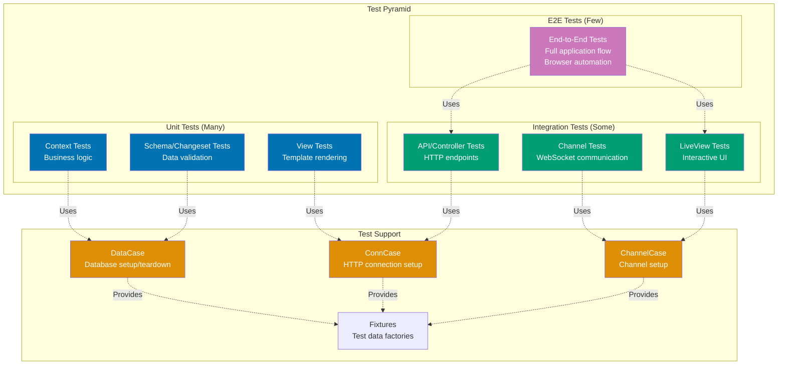

# Phoenix Testing Guide

## Quick Reference

**Navigation**: [Stack Libraries](../README.md) > [Elixir Phoenix](./README.md) > Testing

**Related Guides**:

- [Channels](ex-soen-plwe-to-elph__channels.md) - Channel testing
- [LiveView](ex-soen-plwe-to-elph__liveview.md) - LiveView testing
- [Data Access](ex-soen-plwe-to-elph__data-access.md) - Database testing
- [Best Practices](ex-soen-plwe-to-elph__best-practices.md) - Testing patterns

## Overview

Testing is essential for maintaining Phoenix applications. Phoenix provides excellent testing tools through ExUnit, with specialized helpers for controllers, channels, LiveView, and database operations.

**Target Audience**: Developers implementing comprehensive test suites for Phoenix applications, particularly for Islamic finance platforms requiring reliable Zakat calculations, donation processing, and Waqf management.

**Versions**: Phoenix 1.7+, ExUnit (built-in), Elixir 1.14+

### Phoenix Testing Pyramid



**Testing Layers** (bottom to top):

1. **Unit Tests** (blue) - 70% of tests:
   - Context functions (business logic)
   - Schema validation (changesets)
   - View rendering (templates)
   - Fast execution (microseconds)
   - No database/HTTP required

2. **Integration Tests** (teal) - 25% of tests:
   - Controllers/API endpoints
   - Channels (WebSocket)
   - LiveView (interactive UI)
   - Medium speed (milliseconds)
   - Database + HTTP required

3. **E2E Tests** (purple) - 5% of tests:
   - Full application workflows
   - Browser automation (Wallaby/Hound)
   - Slow execution (seconds)
   - Complete stack required

**Test Support** (orange):

- **DataCase**: Database transactions, fixtures
- **ConnCase**: HTTP connection helpers
- **ChannelCase**: WebSocket connection helpers
- **Fixtures**: Factory functions for test data

**Best Practices**:

- **Fast feedback**: Run unit tests frequently (watch mode)
- **Isolated tests**: Each test independent, can run in any order
- **Descriptive names**: `test "calculates zakat correctly for nisab threshold"`
- **Database cleanup**: Ecto.Adapters.SQL.Sandbox for isolation
- **Async tests**: `use ExUnit.Case, async: true` when possible

## Test Structure

### Test Organization

```
test/
├── ose/
│   ├── donations/
│   │   ├── campaign_test.exs
│   │   └── donation_test.exs
│   ├── zakat/
│   │   ├── calculator_test.exs
│   │   └── nisab_test.exs
│   └── accounts/
│       └── user_test.exs
├── ose_web/
│   ├── controllers/
│   │   └── donation_controller_test.exs
│   ├── live/
│   │   └── zakat_calculator_live_test.exs
│   └── channels/
│       └── donation_channel_test.exs
├── support/
│   ├── conn_case.ex
│   ├── channel_case.ex
│   ├── data_case.ex
│   └── fixtures.ex
└── test_helper.exs
```

### Test Helper Configuration

```elixir
# test/test_helper.exs
ExUnit.start()

# Set up SQL sandbox for concurrent tests
Ecto.Adapters.SQL.Sandbox.mode(Ose.Repo, :manual)
```

### DataCase for Database Tests

```elixir
# test/support/data_case.ex
defmodule Ose.DataCase do
  use ExUnit.CaseTemplate

  using do
    quote do
      alias Ose.Repo

      import Ecto
      import Ecto.Changeset
      import Ecto.Query
      import Ose.DataCase
      import Ose.Fixtures
    end
  end

  setup tags do
    Ose.DataCase.setup_sandbox(tags)
    :ok
  end

  def setup_sandbox(tags) do
    pid = Ecto.Adapters.SQL.Sandbox.start_owner!(Ose.Repo, shared: not tags[:async])
    on_exit(fn -> Ecto.Adapters.SQL.Sandbox.stop_owner(pid) end)
  end

  def errors_on(changeset) do
    Ecto.Changeset.traverse_errors(changeset, fn {message, opts} ->
      Regex.replace(~r"%{(\w+)}", message, fn _, key ->
        opts |> Keyword.get(String.to_existing_atom(key), key) |> to_string()
      end)
    end)
  end
end
```

## Unit Testing

### Context Testing

```elixir
defmodule Ose.DonationsTest do
  use Ose.DataCase, async: true

  alias Ose.Donations

  describe "campaigns" do
    test "list_campaigns/0 returns all campaigns" do
      campaign1 = insert(:campaign)
      campaign2 = insert(:campaign)

      campaigns = Donations.list_campaigns()

      assert length(campaigns) == 2
      assert campaign1 in campaigns
      assert campaign2 in campaigns
    end

    test "get_campaign!/1 returns the campaign with given id" do
      campaign = insert(:campaign)

      assert Donations.get_campaign!(campaign.id) == campaign
    end

    test "get_campaign!/1 raises when id doesn't exist" do
      assert_raise Ecto.NoResultsError, fn ->
        Donations.get_campaign!(Ecto.UUID.generate())
      end
    end

    test "create_campaign/1 with valid data creates a campaign" do
      organizer = insert(:user)

      valid_attrs = %{
        name: "Masjid Renovation",
        description: "Help renovate local masjid",
        goal_amount: Decimal.new("50000"),
        organizer_id: organizer.id
      }

      assert {:ok, campaign} = Donations.create_campaign(valid_attrs)
      assert campaign.name == "Masjid Renovation"
      assert Decimal.eq?(campaign.goal_amount, Decimal.new("50000"))
      assert campaign.organizer_id == organizer.id
    end

    test "create_campaign/1 with invalid data returns error changeset" do
      assert {:error, %Ecto.Changeset{}} = Donations.create_campaign(%{})
    end

    test "update_campaign/2 with valid data updates the campaign" do
      campaign = insert(:campaign, goal_amount: Decimal.new("10000"))

      update_attrs = %{goal_amount: Decimal.new("20000")}

      assert {:ok, updated} = Donations.update_campaign(campaign, update_attrs)
      assert Decimal.eq?(updated.goal_amount, Decimal.new("20000"))
    end

    test "delete_campaign/1 deletes the campaign" do
      campaign = insert(:campaign)

      assert {:ok, %Campaign{}} = Donations.delete_campaign(campaign)
      assert_raise Ecto.NoResultsError, fn ->
        Donations.get_campaign!(campaign.id)
      end
    end
  end

  describe "donations" do
    test "create_donation/1 updates campaign total" do
      campaign = insert(:campaign, current_amount: Decimal.new("1000"))

      donation_attrs = %{
        campaign_id: campaign.id,
        amount: Decimal.new("500"),
        donor_name: "Generous Donor"
      }

      assert {:ok, donation} = Donations.create_donation(donation_attrs)

      updated_campaign = Donations.get_campaign!(campaign.id)
      assert Decimal.eq?(updated_campaign.current_amount, Decimal.new("1500"))
    end

    test "create_donation/1 triggers milestone notifications" do
      campaign = insert(:campaign,
        goal_amount: Decimal.new("10000"),
        current_amount: Decimal.new("4900")
      )

      insert(:milestone, campaign: campaign, amount: Decimal.new("5000"))

      # Subscribe to notifications
      Phoenix.PubSub.subscribe(Ose.PubSub, "campaign:#{campaign.id}")

      donation_attrs = %{
        campaign_id: campaign.id,
        amount: Decimal.new("200")
      }

      Donations.create_donation(donation_attrs)

      # Should receive milestone notification
      assert_receive {:milestone_reached, %{amount: amount}}
      assert Decimal.eq?(amount, Decimal.new("5000"))
    end
  end
end
```

### Schema/Changeset Testing

```elixir
defmodule Ose.Zakat.AssetTest do
  use Ose.DataCase, async: true

  alias Ose.Zakat.Asset

  describe "changeset/2" do
    test "valid changeset with gold assets" do
      user = insert(:user)

      attrs = %{
        gold_grams: Decimal.new("100"),
        silver_grams: Decimal.new("0"),
        cash_amount: Decimal.new("0"),
        currency: "USD",
        user_id: user.id
      }

      changeset = Asset.changeset(%Asset{}, attrs)

      assert changeset.valid?
      assert changeset.changes.gold_grams == Decimal.new("100")
    end

    test "requires at least one asset type" do
      user = insert(:user)

      attrs = %{
        gold_grams: Decimal.new("0"),
        silver_grams: Decimal.new("0"),
        cash_amount: Decimal.new("0"),
        currency: "USD",
        user_id: user.id
      }

      changeset = Asset.changeset(%Asset{}, attrs)

      refute changeset.valid?
      assert "must have at least one asset type" in errors_on(changeset).base
    end

    test "validates one lunar year between zakat payments" do
      user = insert(:user)

      attrs = %{
        gold_grams: Decimal.new("100"),
        currency: "USD",
        user_id: user.id,
        last_zakat_payment_date: Date.utc_today()
      }

      changeset = Asset.changeset(%Asset{}, attrs)

      refute changeset.valid?
      assert "must wait one lunar year (354 days)" in errors_on(changeset).last_zakat_payment_date
    end

    test "accepts negative numbers" do
      user = insert(:user)

      attrs = %{
        gold_grams: Decimal.new("-10"),
        currency: "USD",
        user_id: user.id
      }

      changeset = Asset.changeset(%Asset{}, attrs)

      refute changeset.valid?
      assert "must be greater than or equal to 0" in errors_on(changeset).gold_grams
    end
  end
end
```

## Integration Testing

### Controller Tests

```elixir
defmodule OseWeb.DonationControllerTest do
  use OseWeb.ConnCase, async: true

  alias Ose.Donations

  @create_attrs %{
    amount: "100.00",
    donor_name: "Test Donor",
    donor_email: "donor@example.com"
  }

  @invalid_attrs %{
    amount: "-10",
    donor_name: nil
  }

  setup %{conn: conn} do
    campaign = insert(:campaign)
    {:ok, conn: conn, campaign: campaign}
  end

  describe "create donation" do
    test "redirects to confirmation when data is valid", %{conn: conn, campaign: campaign} do
      conn = post(conn, ~p"/campaigns/#{campaign.id}/donations", donation: @create_attrs)

      assert %{id: id} = redirected_params(conn)
      assert redirected_to(conn) == ~p"/donations/#{id}/confirmation"

      donation = Donations.get_donation!(id)
      assert donation.donor_name == "Test Donor"
      assert Decimal.eq?(donation.amount, Decimal.new("100"))
    end

    test "renders errors when data is invalid", %{conn: conn, campaign: campaign} do
      conn = post(conn, ~p"/campaigns/#{campaign.id}/donations", donation: @invalid_attrs)

      assert html_response(conn, 200) =~ "Oops, something went wrong"
    end

    test "requires authentication for recurring donations", %{conn: conn, campaign: campaign} do
      attrs = Map.put(@create_attrs, :is_recurring, true)

      conn = post(conn, ~p"/campaigns/#{campaign.id}/donations", donation: attrs)

      assert redirected_to(conn) == ~p"/login"
    end
  end

  describe "authenticated user" do
    setup %{conn: conn} do
      user = insert(:user)
      conn = log_in_user(conn, user)
      {:ok, conn: conn, user: user}
    end

    test "associates donation with user", %{conn: conn, campaign: campaign, user: user} do
      conn = post(conn, ~p"/campaigns/#{campaign.id}/donations", donation: @create_attrs)

      donation = Donations.get_donation!(redirected_params(conn).id)
      assert donation.user_id == user.id
    end

    test "can create recurring donation", %{conn: conn, campaign: campaign} do
      attrs =
        @create_attrs
        |> Map.put(:is_recurring, true)
        |> Map.put(:recurrence_period, "monthly")

      conn = post(conn, ~p"/campaigns/#{campaign.id}/donations", donation: attrs)

      assert redirected_to(conn) =~ "/donations/"
    end
  end
end
```

### API Tests

```elixir
defmodule OseWeb.API.DonationControllerTest do
  use OseWeb.ConnCase, async: true

  alias Ose.Donations

  setup %{conn: conn} do
    campaign = insert(:campaign)

    conn =
      conn
      |> put_req_header("accept", "application/json")
      |> put_req_header("content-type", "application/json")

    {:ok, conn: conn, campaign: campaign}
  end

  describe "POST /api/donations" do
    test "creates donation with valid data", %{conn: conn, campaign: campaign} do
      attrs = %{
        campaign_id: campaign.id,
        amount: "100.00",
        donor_name: "API Donor"
      }

      conn = post(conn, ~p"/api/donations", donation: attrs)

      assert %{
               "id" => id,
               "amount" => "100.00",
               "donor_name" => "API Donor"
             } = json_response(conn, 201)["data"]

      donation = Donations.get_donation!(id)
      assert Decimal.eq?(donation.amount, Decimal.new("100"))
    end

    test "returns errors with invalid data", %{conn: conn} do
      attrs = %{amount: "-10"}

      conn = post(conn, ~p"/api/donations", donation: attrs)

      assert %{"errors" => errors} = json_response(conn, 422)
      assert errors["amount"]
    end

    test "requires API key", %{conn: conn, campaign: campaign} do
      # Remove auth headers
      conn = conn |> delete_req_header("authorization")

      attrs = %{campaign_id: campaign.id, amount: "100"}

      conn = post(conn, ~p"/api/donations", donation: attrs)

      assert json_response(conn, 401)
    end
  end

  describe "GET /api/donations/:id" do
    test "returns donation", %{conn: conn} do
      donation = insert(:donation)

      conn = get(conn, ~p"/api/donations/#{donation.id}")

      assert %{
               "id" => id,
               "amount" => amount
             } = json_response(conn, 200)["data"]

      assert id == donation.id
    end

    test "returns 404 for nonexistent donation", %{conn: conn} do
      conn = get(conn, ~p"/api/donations/#{Ecto.UUID.generate()}")

      assert json_response(conn, 404)
    end
  end
end
```

## Channel Testing

```elixir
defmodule OseWeb.DonationChannelTest do
  use OseWeb.ChannelCase, async: true

  alias OseWeb.DonationChannel

  setup do
    user = insert(:user)
    campaign = insert(:campaign)

    {:ok, socket} = connect(OseWeb.UserSocket, %{"token" => generate_token(user)})

    {:ok, _, socket} =
      subscribe_and_join(socket, DonationChannel, "donations:campaign:#{campaign.id}")

    %{socket: socket, user: user, campaign: campaign}
  end

  test "join sets up presence", %{socket: socket, user: user} do
    # Wait for after_join
    :timer.sleep(100)

    presences = OseWeb.Presence.list(socket)
    assert Map.has_key?(presences, to_string(user.id))
  end

  test "new_donation broadcasts to channel", %{socket: socket, campaign: campaign} do
    ref = push(socket, "new_donation", %{
      "amount" => "100.00",
      "donor_name" => "Channel Donor"
    })

    assert_reply ref, :ok, %{donation_id: _id}

    assert_broadcast "donation_created", %{
      donation: %{amount: _},
      new_total: _
    }
  end

  test "validates donation amount", %{socket: socket} do
    ref = push(socket, "new_donation", %{
      "amount" => "-10",
      "donor_name" => "Invalid"
    })

    assert_reply ref, :error, %{errors: %{amount: _}}
  end

  test "only organizer can update goal", %{campaign: campaign} do
    non_organizer = insert(:user)
    {:ok, socket} = connect(OseWeb.UserSocket, %{"token" => generate_token(non_organizer)})

    {:ok, _, socket} =
      subscribe_and_join(socket, DonationChannel, "donations:campaign:#{campaign.id}")

    ref = push(socket, "update_goal", %{"new_goal" => "20000"})

    assert_reply ref, :error, %{reason: "unauthorized"}
  end

  test "handles disconnection gracefully", %{socket: socket, user: user} do
    # Close socket
    close(socket)

    :timer.sleep(100)

    # Presence should be removed
    presences = OseWeb.Presence.list(socket)
    refute Map.has_key?(presences, to_string(user.id))
  end

  defp generate_token(user) do
    Phoenix.Token.sign(OseWeb.Endpoint, "user socket", user.id)
  end
end
```

## LiveView Testing

```elixir
defmodule OseWeb.ZakatCalculatorLiveTest do
  use OseWeb.ConnCase, async: true

  import Phoenix.LiveViewTest

  describe "mount" do
    test "renders calculator form", %{conn: conn} do
      {:ok, view, html} = live(conn, ~p"/zakat/calculator")

      assert html =~ "Zakat Calculator"
      assert has_element?(view, "form")
    end

    test "loads existing calculation", %{conn: conn} do
      user = insert(:user)
      calculation = insert(:zakat_calculation, user: user)

      conn = log_in_user(conn, user)
      {:ok, view, html} = live(conn, ~p"/zakat/calculator?id=#{calculation.id}")

      assert html =~ "Previous Calculation"
      assert has_element?(view, "#calculation-#{calculation.id}")
    end
  end

  describe "form validation" do
    test "validates on change", %{conn: conn} do
      {:ok, view, _html} = live(conn, ~p"/zakat/calculator")

      view
      |> form("form", assets: %{gold_grams: "-10"})
      |> render_change()

      assert render(view) =~ "must be greater than 0"
    end

    test "shows validation errors inline", %{conn: conn} do
      {:ok, view, _html} = live(conn, ~p"/zakat/calculator")

      html =
        view
        |> form("form", assets: %{
          gold_grams: "abc",
          cash: "-100"
        })
        |> render_change()

      assert html =~ "is invalid"
      assert html =~ "must be greater than 0"
    end
  end

  describe "calculation" do
    test "calculates zakat correctly", %{conn: conn} do
      {:ok, view, _html} = live(conn, ~p"/zakat/calculator")

      view
      |> form("form", assets: %{
        gold_grams: "100",
        silver_grams: "500",
        cash: "10000"
      })
      |> render_submit()

      assert has_element?(view, ".zakat-result")
      assert render(view) =~ "Zakat Due"
    end

    test "shows loading state during async calculation", %{conn: conn} do
      {:ok, view, _html} = live(conn, ~p"/zakat/calculator")

      view
      |> form("form", assets: %{gold_grams: "1000"})
      |> render_submit()

      # Should show loading
      assert render(view) =~ "Calculating..."
    end

    test "handles calculation errors", %{conn: conn} do
      {:ok, view, _html} = live(conn, ~p"/zakat/calculator")

      # Simulate API failure
      :meck.expect(Ose.Zakat.NisabAPI, :fetch_current_prices, fn _ -> {:error, :timeout} end)

      view
      |> form("form", assets: %{gold_grams: "100"})
      |> render_submit()

      assert render(view) =~ "Failed to fetch current prices"

      :meck.unload(Ose.Zakat.NisabAPI)
    end
  end

  describe "real-time updates" do
    test "receives nisab price updates", %{conn: conn} do
      {:ok, view, _html} = live(conn, ~p"/zakat/calculator")

      # Simulate broadcast
      send(view.pid, {:nisab_updated, %{gold: Decimal.new("60"), silver: Decimal.new("400")}})

      assert render(view) =~ "Nisab Updated"
    end
  end
end
```

### Component Testing

```elixir
defmodule OseWeb.DonationCardComponentTest do
  use OseWeb.ConnCase, async: true

  import Phoenix.LiveViewTest

  test "renders donation information" do
    donation = build(:donation,
      donor_name: "Test Donor",
      amount: Decimal.new("100"),
      inserted_at: ~U[2025-01-15 10:00:00Z]
    )

    html =
      render_component(&OseWeb.DonationCardComponent.render/1,
        id: "donation-1",
        donation: donation
      )

    assert html =~ "Test Donor"
    assert html =~ "$100"
  end

  test "handles edit event" do
    donation = build(:donation)

    {:ok, view, _html} =
      live_isolated_component(OseWeb.DonationCardComponent,
        id: "donation-1",
        donation: donation
      )

    view
    |> element("button", "Edit")
    |> render_click()

    # Should send message to parent
    assert_received {:edit_donation, donation_id}
    assert donation_id == donation.id
  end

  test "hides donor name for anonymous donations" do
    donation = build(:donation, is_anonymous: true)

    html =
      render_component(&OseWeb.DonationCardComponent.render/1,
        id: "donation-1",
        donation: donation
      )

    assert html =~ "Anonymous"
    refute html =~ donation.donor_name
  end
end
```

## Test Fixtures

```elixir
# test/support/fixtures.ex
defmodule Ose.Fixtures do
  @moduledoc """
  Test fixtures for creating test data.
  """

  alias Ose.Repo

  def insert(factory_name, attrs \\ %{}) do
    factory_name
    |> build(attrs)
    |> Repo.insert!()
  end

  def build(:user, attrs) do
    %Ose.Accounts.User{
      email: attrs[:email] || "user#{System.unique_integer()}@example.com",
      username: attrs[:username] || "user#{System.unique_integer()}",
      password_hash: Bcrypt.hash_pwd_salt("password123")
    }
    |> merge_attributes(attrs)
  end

  def build(:campaign, attrs) do
    %Ose.Donations.Campaign{
      name: attrs[:name] || "Test Campaign",
      description: attrs[:description] || "Test campaign description",
      goal_amount: attrs[:goal_amount] || Decimal.new("10000"),
      current_amount: attrs[:current_amount] || Decimal.new("0"),
      status: attrs[:status] || :active,
      organizer: attrs[:organizer] || build(:user)
    }
    |> merge_attributes(attrs)
  end

  def build(:donation, attrs) do
    %Ose.Donations.Donation{
      amount: attrs[:amount] || Decimal.new("100"),
      donor_name: attrs[:donor_name] || "Test Donor",
      donor_email: attrs[:donor_email] || "donor@example.com",
      payment_status: attrs[:payment_status] || :completed,
      campaign: attrs[:campaign] || build(:campaign),
      user: attrs[:user]
    }
    |> merge_attributes(attrs)
  end

  def build(:zakat_calculation, attrs) do
    %Ose.Zakat.Calculation{
      total_wealth: attrs[:total_wealth] || Decimal.new("10000"),
      nisab: attrs[:nisab] || Decimal.new("5000"),
      zakat_due: attrs[:zakat_due] || Decimal.new("250"),
      calculation_date: attrs[:calculation_date] || Date.utc_today(),
      user: attrs[:user] || build(:user)
    }
    |> merge_attributes(attrs)
  end

  defp merge_attributes(struct, attrs) do
    struct
    |> Map.from_struct()
    |> Map.merge(attrs)
    |> then(&struct(struct.__struct__, &1))
  end
end
```

## Mocking and Stubs

```elixir
defmodule Ose.Zakat.CalculatorTest do
  use Ose.DataCase, async: false

  alias Ose.Zakat.Calculator

  setup do
    # Mock external API
    :meck.new(Ose.Zakat.NisabAPI, [:passthrough])
    on_exit(fn -> :meck.unload() end)
  end

  test "calculates zakat with current nisab prices" do
    # Stub API response
    :meck.expect(Ose.Zakat.NisabAPI, :fetch_current_prices, fn "USD" ->
      {:ok, %{
        gold_per_gram: Decimal.new("60"),
        silver_per_gram: Decimal.new("0.70")
      }}
    end)

    assets = %{
      gold_grams: Decimal.new("100"),
      silver_grams: Decimal.new("1000"),
      cash: Decimal.new("5000")
    }

    assert {:ok, calculation} = Calculator.calculate(assets, "USD")

    assert Decimal.gt?(calculation.zakat_due, 0)
    assert :meck.called(Ose.Zakat.NisabAPI, :fetch_current_prices, ["USD"])
  end

  test "handles API failures gracefully" do
    :meck.expect(Ose.Zakat.NisabAPI, :fetch_current_prices, fn _ ->
      {:error, :timeout}
    end)

    assets = %{gold_grams: Decimal.new("100")}

    assert {:error, :nisab_fetch_failed} = Calculator.calculate(assets, "USD")
  end
end
```

## Performance Testing

```elixir
defmodule Ose.Performance.DonationTest do
  use Ose.DataCase, async: false

  alias Ose.Donations

  @tag :performance
  test "handles bulk donation creation efficiently" do
    campaign = insert(:campaign)

    donations =
      for i <- 1..1000 do
        %{
          campaign_id: campaign.id,
          amount: Decimal.new("#{i}"),
          donor_name: "Donor #{i}"
        }
      end

    {time, _result} = :timer.tc(fn ->
      Enum.each(donations, &Donations.create_donation/1)
    end)

    # Should complete in reasonable time (adjust threshold as needed)
    assert time < 5_000_000, "Bulk creation took #{time / 1_000_000}s"
  end

  @tag :performance
  test "queries large datasets efficiently" do
    campaign = insert(:campaign)

    # Insert 10k donations
    donations =
      for i <- 1..10_000 do
        %Ose.Donations.Donation{
          campaign_id: campaign.id,
          amount: Decimal.new("#{rem(i, 1000)}"),
          donor_name: "Donor #{i}",
          payment_status: :completed
        }
      end

    Repo.insert_all(Ose.Donations.Donation, donations)

    {time, _results} = :timer.tc(fn ->
      Donations.campaign_statistics(campaign.id)
    end)

    # Query should be fast even with large dataset
    assert time < 100_000, "Query took #{time / 1000}ms"
  end
end
```

## Related Documentation

- **[Channels Guide](ex-soen-plwe-to-elph__channels.md)** - Channel implementation
- **[LiveView Guide](ex-soen-plwe-to-elph__liveview.md)** - LiveView patterns
- **[Data Access Guide](ex-soen-plwe-to-elph__data-access.md)** - Database operations
- **[Best Practices](ex-soen-plwe-to-elph__best-practices.md)** - Testing patterns
- **[ExUnit Documentation](https://hexdocs.pm/ex_unit)** - Official testing framework
- **Test Templates (TODO: ./templates/ex-soen-plwe-elph-te\_\_test-template.md)** - Test starters
