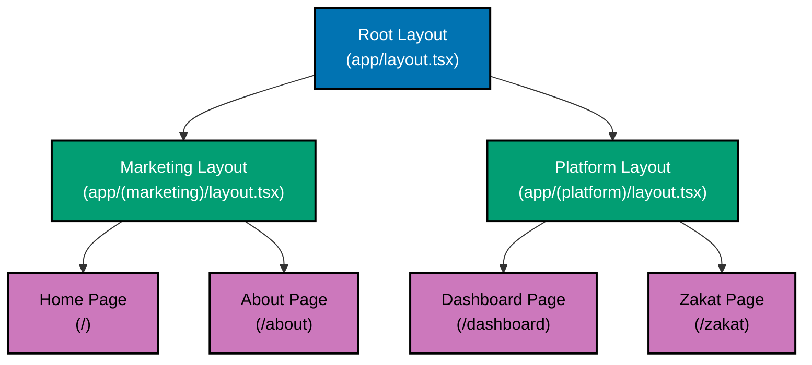
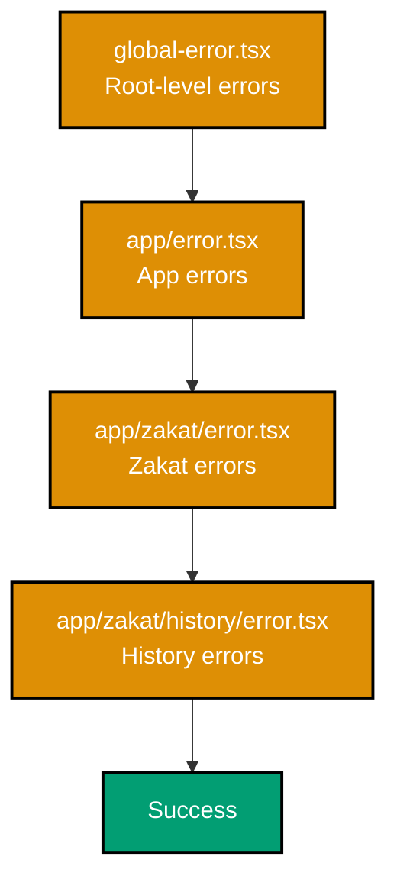

# Next.js App Router

## Quick Reference

**Core Concepts**:

- [File-System Routing](#file-system-routing) - Directory structure defines routes
- [Special Files](#special-files) - page, layout, loading, error
- [Layouts](#layouts-and-templates) - Shared UI across routes
- [Route Groups](#route-groups) - Organize without affecting URLs
- [Private Folders](#private-folders) - Exclude from routing
- [Parallel Routes](#parallel-routes) - Multiple pages simultaneously
- [Intercepting Routes](#intercepting-routes) - Modal-like experiences

**Advanced Topics**:

- [Route Segment Configuration](#route-segment-configuration) - Page-level settings
- [Dynamic Routes](#dynamic-routes-integration) - Parameter-based routing
- [Error Handling](#error-boundaries) - Graceful error recovery
- [Loading States](#loading-ui) - Progressive UI rendering

## Overview

The **Next.js App Router** is a file-system based routing architecture introduced in Next.js 13 and stabilized in Next.js 13.4. It replaces the older Pages Router with a more powerful system built on React Server Components, streaming, and improved layouts.

**Key Principles**:

- **File-system routing** - Folder structure determines URL paths
- **Server Components by default** - Zero client JavaScript unless specified
- **Nested layouts** - Shared UI that persists across navigation
- **Automatic code splitting** - Per-route bundles
- **Streaming support** - Progressive rendering with Suspense

This guide covers Next.js 16+ App Router patterns for enterprise financial applications.

## File-System Routing

### Basic Structure

The `app/` directory uses folders to define routes:

```
app/
├── page.tsx                # /
├── about/
│   └── page.tsx            # /about
├── blog/
│   ├── page.tsx            # /blog
│   └── [slug]/
│       └── page.tsx        # /blog/[slug]
└── api/
    └── health/
        └── route.ts        # /api/health
```

**Rules**:

- **Folders define routes** - Each folder is a route segment
- **`page.tsx` makes route public** - Without it, folder is not routable
- **Nesting creates URL paths** - `app/blog/posts/page.tsx` → `/blog/posts`

### OSE Platform Example

```
app/
├── (marketing)/
│   ├── page.tsx            # /
│   ├── about/
│   │   └── page.tsx        # /about
│   └── pricing/
│       └── page.tsx        # /pricing
├── (platform)/
│   ├── layout.tsx          # Platform layout (authenticated)
│   ├── dashboard/
│   │   └── page.tsx        # /dashboard
│   ├── zakat/
│   │   ├── page.tsx        # /zakat
│   │   ├── calculate/
│   │   │   └── page.tsx    # /zakat/calculate
│   │   └── history/
│   │       └── page.tsx    # /zakat/history
│   ├── murabaha/
│   │   ├── page.tsx        # /murabaha
│   │   └── applications/
│   │       └── [id]/
│   │           └── page.tsx # /murabaha/applications/[id]
│   └── waqf/
│       ├── page.tsx        # /waqf
│       └── donations/
│           └── page.tsx    # /waqf/donations
└── api/
    ├── zakat/
    │   └── route.ts        # /api/zakat
    └── murabaha/
        └── route.ts        # /api/murabaha
```

## Special Files

### page.tsx - Route UI

The `page.tsx` file makes a route segment publicly accessible.

**Basic Page**:

```typescript
// app/zakat/page.tsx
export default function ZakatPage() {
  return (
    <div>
      <h1>Zakat Calculator</h1>
      <p>Calculate your Zakat obligations</p>
    </div>
  );
}
```

**Server Component with Data Fetching**:

```typescript
// app/zakat/history/page.tsx
import { auth } from '@/lib/auth';
import { db } from '@/lib/db/client';
import { redirect } from 'next/navigation';

export default async function ZakatHistoryPage() {
  // Authentication check
  const session = await auth();
  if (!session) {
    redirect('/login');
  }

  // Direct database access in Server Component
  const calculations = await db.zakatCalculation.findMany({
    where: { userId: session.user.id },
    orderBy: { calculatedAt: 'desc' },
    take: 20,
  });

  return (
    <div>
      <h1>Zakat Calculation History</h1>
      <div className="grid gap-4">
        {calculations.map((calc) => (
          <div key={calc.id} className="border p-4 rounded">
            <p>Wealth: {calc.wealth}</p>
            <p>Zakat: {calc.zakatAmount}</p>
            <p>Date: {calc.calculatedAt.toLocaleDateString()}</p>
          </div>
        ))}
      </div>
    </div>
  );
}
```

**With TypeScript Props**:

```typescript
// app/murabaha/applications/[id]/page.tsx
interface PageProps {
  params: { id: string };
  searchParams: { status?: string };
}

export default async function MurabahaApplicationPage({
  params,
  searchParams,
}: PageProps) {
  const application = await db.murabahaApplication.findUnique({
    where: { id: params.id },
  });

  if (!application) {
    notFound();
  }

  return (
    <div>
      <h1>Murabaha Application #{application.applicationNumber}</h1>
      <p>Status: {application.status}</p>
      <p>Amount: {application.requestedAmount}</p>
    </div>
  );
}
```

### layout.tsx - Shared UI

Layouts wrap pages and persist across navigation. They don't re-render on route changes.

**Root Layout** (required):

```typescript
// app/layout.tsx
import type { Metadata } from 'next';
import './globals.css';

export const metadata: Metadata = {
  title: {
    template: '%s | OSE Platform',
    default: 'OSE Platform - Sharia-Compliant Financial Solutions',
  },
  description: 'Enterprise platform for Islamic finance',
};

export default function RootLayout({ children }: { children: React.ReactNode }) {
  return (
    <html lang="en">
      <body>{children}</body>
    </html>
  );
}
```

**Nested Layout**:

```typescript
// app/(platform)/layout.tsx
import { auth } from '@/lib/auth';
import { redirect } from 'next/navigation';
import { PlatformNav } from '@/components/PlatformNav';
import { UserMenu } from '@/components/UserMenu';

export default async function PlatformLayout({
  children,
}: {
  children: React.ReactNode;
}) {
  const session = await auth();
  if (!session) {
    redirect('/login');
  }

  return (
    <div className="flex h-screen">
      <aside className="w-64 bg-gray-100">
        <PlatformNav />
      </aside>
      <div className="flex-1 flex flex-col">
        <header className="border-b p-4">
          <UserMenu user={session.user} />
        </header>
        <main className="flex-1 overflow-auto p-6">{children}</main>
      </div>
    </div>
  );
}
```

**Layout Props**:

```typescript
// Layouts receive children and params
interface LayoutProps {
  children: React.ReactNode;
  params: { locale: string }; // For dynamic segments
}

export default function LocaleLayout({ children, params }: LayoutProps) {
  return (
    <div lang={params.locale}>
      {children}
    </div>
  );
}
```

### loading.tsx - Loading UI

Automatically wraps page in Suspense boundary:

```typescript
// app/zakat/history/loading.tsx
export default function Loading() {
  return (
    <div className="animate-pulse">
      <div className="h-8 bg-gray-200 rounded w-1/4 mb-4"></div>
      <div className="space-y-4">
        {[1, 2, 3].map((i) => (
          <div key={i} className="h-24 bg-gray-200 rounded"></div>
        ))}
      </div>
    </div>
  );
}
```

**With Spinner Component**:

```typescript
// app/murabaha/loading.tsx
import { Spinner } from '@/components/ui/Spinner';

export default function Loading() {
  return (
    <div className="flex items-center justify-center h-full">
      <Spinner size="lg" />
      <p className="ml-4">Loading Murabaha applications...</p>
    </div>
  );
}
```

### error.tsx - Error Boundary

Must be a Client Component:

```typescript
// app/zakat/error.tsx
'use client';

import { useEffect } from 'react';
import { Button } from '@/components/ui/Button';

export default function Error({
  error,
  reset,
}: {
  error: Error & { digest?: string };
  reset: () => void;
}) {
  useEffect(() => {
    // Log error to monitoring service
    console.error('Zakat page error:', error);
  }, [error]);

  return (
    <div className="flex flex-col items-center justify-center h-full">
      <h2 className="text-2xl font-bold mb-4">Something went wrong!</h2>
      <p className="text-gray-600 mb-4">{error.message}</p>
      <Button onClick={reset}>Try again</Button>
    </div>
  );
}
```

**Global Error Handler**:

```typescript
// app/global-error.tsx
'use client';

export default function GlobalError({
  error,
  reset,
}: {
  error: Error & { digest?: string };
  reset: () => void;
}) {
  return (
    <html>
      <body>
        <div className="flex flex-col items-center justify-center min-h-screen">
          <h2>Application Error</h2>
          <p>{error.message}</p>
          <button onClick={reset}>Try again</button>
        </div>
      </body>
    </html>
  );
}
```

### not-found.tsx - 404 Page

```typescript
// app/not-found.tsx
import Link from 'next/link';
import { Button } from '@/components/ui/Button';

export default function NotFound() {
  return (
    <div className="flex flex-col items-center justify-center min-h-screen">
      <h1 className="text-4xl font-bold mb-4">404 - Page Not Found</h1>
      <p className="text-gray-600 mb-8">The page you're looking for doesn't exist.</p>
      <Button asChild>
        <Link href="/">Return Home</Link>
      </Button>
    </div>
  );
}
```

**Route-Specific Not Found**:

```typescript
// app/blog/[slug]/page.tsx
import { notFound } from 'next/navigation';

export default async function BlogPostPage({ params }: { params: { slug: string } }) {
  const post = await db.post.findUnique({
    where: { slug: params.slug },
  });

  if (!post) {
    notFound(); // Triggers not-found.tsx
  }

  return <article>{/* Render post */}</article>;
}
```

### template.tsx - Re-rendering Layout

Unlike layouts, templates create new instances on navigation:

```typescript
// app/template.tsx
'use client';

import { motion } from 'framer-motion';

export default function Template({ children }: { children: React.ReactNode }) {
  return (
    <motion.div
      initial={{ opacity: 0, y: 20 }}
      animate={{ opacity: 1, y: 0 }}
      transition={{ duration: 0.3 }}
    >
      {children}
    </motion.div>
  );
}
```

**Use Cases**:

- Page transitions with animations
- Resetting state on navigation
- Entering/exiting animations
- Scroll position reset

## Layouts and Templates

### Layout Hierarchy



### Layout Best Practices

**✅ Do**:

- Use layouts for shared UI (navigation, headers, footers)
- Fetch shared data in layouts (user info, configuration)
- Keep layouts Server Components when possible
- Use nested layouts for route-specific UI

**❌ Don't**:

- Fetch page-specific data in layouts
- Use layouts for one-off UI
- Make layouts Client Components unnecessarily
- Duplicate navigation logic across layouts

### Template vs Layout

| Feature          | Layout                     | Template                 |
| ---------------- | -------------------------- | ------------------------ |
| **Re-rendering** | Persists across navigation | Re-renders on navigation |
| **State**        | Preserved                  | Reset                    |
| **Use Case**     | Shared UI, navigation      | Animations, reset state  |
| **Performance**  | Better (no re-render)      | Slower (re-renders)      |

## Route Groups

### Syntax

Use parentheses `(folder)` to create route groups:

```
app/
├── (marketing)/
│   ├── layout.tsx          # Marketing layout
│   ├── page.tsx            # /
│   ├── about/
│   │   └── page.tsx        # /about
│   └── pricing/
│       └── page.tsx        # /pricing
├── (platform)/
│   ├── layout.tsx          # Platform layout
│   ├── dashboard/
│   │   └── page.tsx        # /dashboard
│   └── zakat/
│       └── page.tsx        # /zakat
└── (legal)/
    ├── layout.tsx          # Legal layout
    ├── terms/
    │   └── page.tsx        # /terms
    └── privacy/
        └── page.tsx        # /privacy
```

**Note**: Route groups don't affect URL structure - `(marketing)/about/page.tsx` → `/about`

### Use Cases

**1. Organize by feature**:

```
app/
├── (auth)/
│   ├── login/
│   ├── register/
│   └── forgot-password/
├── (finance)/
│   ├── zakat/
│   ├── murabaha/
│   └── waqf/
└── (admin)/
    ├── users/
    └── settings/
```

**2. Multiple layouts**:

```typescript
// app/(marketing)/layout.tsx
export default function MarketingLayout({ children }: { children: React.ReactNode }) {
  return (
    <div>
      <MarketingNav />
      {children}
      <MarketingFooter />
    </div>
  );
}

// app/(platform)/layout.tsx
export default async function PlatformLayout({ children }: { children: React.ReactNode }) {
  const session = await auth();
  return (
    <div>
      <PlatformNav user={session?.user} />
      {children}
    </div>
  );
}
```

**3. Multiple root layouts**:

```
app/
├── (main)/
│   ├── layout.tsx          # English layout
│   └── page.tsx
└── (ar)/
    ├── layout.tsx          # Arabic layout (RTL)
    └── page.tsx
```

## Private Folders

### Syntax

Prefix folder with underscore `_folder`:

```
app/
├── _components/            # Private, not routable
│   ├── ZakatForm.tsx
│   └── MurabahaCard.tsx
├── _lib/                   # Private utilities
│   ├── zakatCalculator.ts
│   └── validation.ts
└── zakat/
    └── page.tsx            # /zakat
```

**Note**: Private folders are excluded from routing but can be imported.

### Use Cases

**1. Colocation of components**:

```
app/
├── zakat/
│   ├── _components/
│   │   ├── ZakatForm.tsx
│   │   └── ZakatResult.tsx
│   ├── _utils/
│   │   └── calculations.ts
│   └── page.tsx
```

**2. Feature-specific utilities**:

```typescript
// app/zakat/_utils/calculations.ts
export function calculateZakat(wealth: number, nisab: number): number {
  return wealth >= nisab ? wealth * 0.025 : 0;
}

// app/zakat/page.tsx
import { calculateZakat } from "./_utils/calculations";

export default function ZakatPage() {
  // Use calculation utility
}
```

## Parallel Routes

### Syntax

Use `@folder` to create parallel routes:

```
app/
├── layout.tsx
├── page.tsx
├── @analytics/
│   └── page.tsx
└── @team/
    └── page.tsx
```

**Layout receives parallel routes as props**:

```typescript
// app/layout.tsx
export default function Layout({
  children,
  analytics,
  team,
}: {
  children: React.ReactNode;
  analytics: React.ReactNode;
  team: React.ReactNode;
}) {
  return (
    <div>
      {children}
      <div className="grid grid-cols-2 gap-4">
        {analytics}
        {team}
      </div>
    </div>
  );
}
```

### OSE Platform Example

```
app/
├── (platform)/
│   └── dashboard/
│       ├── layout.tsx
│       ├── page.tsx
│       ├── @zakatStats/
│       │   └── page.tsx
│       └── @murabahaStats/
│           └── page.tsx
```

```typescript
// app/(platform)/dashboard/layout.tsx
export default function DashboardLayout({
  children,
  zakatStats,
  murabahaStats,
}: {
  children: React.ReactNode;
  zakatStats: React.ReactNode;
  murabahaStats: React.ReactNode;
}) {
  return (
    <div>
      <h1>Dashboard</h1>
      {children}
      <div className="grid grid-cols-2 gap-4 mt-8">
        {zakatStats}
        {murabahaStats}
      </div>
    </div>
  );
}

// app/(platform)/dashboard/@zakatStats/page.tsx
export default async function ZakatStats() {
  const stats = await db.zakatCalculation.aggregate({
    _sum: { zakatAmount: true },
    _count: true,
  });

  return (
    <div className="border p-4 rounded">
      <h2>Zakat Statistics</h2>
      <p>Total Calculations: {stats._count}</p>
      <p>Total Zakat: {stats._sum.zakatAmount}</p>
    </div>
  );
}
```

### Default Fallback

Provide `default.tsx` for unmatched parallel routes:

```typescript
// app/(platform)/dashboard/@zakatStats/default.tsx
export default function Default() {
  return <div>Loading zakat statistics...</div>;
}
```

## Intercepting Routes

### Syntax

Use `(.)folder`, `(..)folder`, or `(..)(..)folder`:

| Pattern    | Description         |
| ---------- | ------------------- |
| `(.)`      | Match same level    |
| `(..)`     | Match one level up  |
| `(..)(..)` | Match two levels up |
| `(...)`    | Match from app root |

### Modal Example

```
app/
├── murabaha/
│   ├── applications/
│   │   ├── page.tsx                    # /murabaha/applications
│   │   ├── [id]/
│   │   │   └── page.tsx                # /murabaha/applications/[id]
│   │   └── (..)(..)modal/
│   │       └── application/
│   │           └── [id]/
│   │               └── page.tsx        # Intercepts /murabaha/applications/[id]
│   └── page.tsx
└── modal/
    └── application/
        └── [id]/
            └── page.tsx
```

```typescript
// app/murabaha/applications/(..)(..)modal/application/[id]/page.tsx
import { Modal } from '@/components/Modal';
import { db } from '@/lib/db/client';

export default async function ApplicationModal({
  params,
}: {
  params: { id: string };
}) {
  const application = await db.murabahaApplication.findUnique({
    where: { id: params.id },
  });

  return (
    <Modal>
      <h2>Application #{application.applicationNumber}</h2>
      <p>Amount: {application.requestedAmount}</p>
      <p>Status: {application.status}</p>
    </Modal>
  );
}
```

**Hard navigation** (direct URL) shows full page, **soft navigation** (Link click) shows modal.

## Route Segment Configuration

### Configuration Options

```typescript
// app/zakat/history/page.tsx
export const dynamic = "force-dynamic"; // 'auto' | 'force-dynamic' | 'error' | 'force-static'
export const revalidate = 3600; // false | 'force-cache' | 0 | number
export const fetchCache = "auto"; // 'auto' | 'default-cache' | 'only-cache' | 'force-cache' | 'force-no-store' | 'default-no-store' | 'only-no-store'
export const runtime = "nodejs"; // 'nodejs' | 'edge'
export const preferredRegion = "auto"; // 'auto' | 'global' | 'home' | string | string[]

export default async function ZakatHistoryPage() {
  // Page component
}
```

### Common Configurations

**Static Generation (default)**:

```typescript
// app/about/page.tsx
// No configuration needed - static by default
export default function AboutPage() {
  return <div>About Us</div>;
}
```

**Dynamic Rendering**:

```typescript
// app/dashboard/page.tsx
export const dynamic = 'force-dynamic';

export default async function DashboardPage() {
  // Always renders on request
  const session = await auth();
  return <div>Welcome, {session.user.name}</div>;
}
```

**Incremental Static Regeneration**:

```typescript
// app/nisab/page.tsx
export const revalidate = 3600; // Revalidate every hour

export default async function NisabPage() {
  const nisab = await fetchNisab();
  return <div>Current Nisab: {nisab}</div>;
}
```

**Edge Runtime**:

```typescript
// app/api/geo/route.ts
export const runtime = "edge";

export async function GET(request: Request) {
  const geo = request.geo;
  return Response.json({ country: geo?.country });
}
```

## Dynamic Routes Integration

### Basic Dynamic Route

```
app/
└── blog/
    └── [slug]/
        └── page.tsx        # /blog/[slug]
```

```typescript
// app/blog/[slug]/page.tsx
interface PageProps {
  params: { slug: string };
}

export default async function BlogPostPage({ params }: PageProps) {
  const post = await db.post.findUnique({
    where: { slug: params.slug },
  });

  return <article>{/* Render post */}</article>;
}
```

### Catch-All Routes

```
app/
└── docs/
    └── [...slug]/
        └── page.tsx        # /docs/a, /docs/a/b, /docs/a/b/c
```

```typescript
// app/docs/[...slug]/page.tsx
interface PageProps {
  params: { slug: string[] };
}

export default function DocsPage({ params }: PageProps) {
  // params.slug = ['a', 'b', 'c'] for /docs/a/b/c
  return <div>Docs: {params.slug.join('/')}</div>;
}
```

### Optional Catch-All

```
app/
└── shop/
    └── [[...slug]]/
        └── page.tsx        # /shop, /shop/a, /shop/a/b
```

## Error Boundaries

### Error Hierarchy



### Error Recovery

```typescript
// app/zakat/error.tsx
'use client';

import { useEffect } from 'react';
import { useRouter } from 'next/navigation';

export default function Error({
  error,
  reset,
}: {
  error: Error & { digest?: string };
  reset: () => void;
}) {
  const router = useRouter();

  useEffect(() => {
    // Log to error reporting service
    logError(error);
  }, [error]);

  return (
    <div>
      <h2>Error Loading Zakat</h2>
      <p>{error.message}</p>
      <div className="flex gap-4 mt-4">
        <button onClick={reset}>Try Again</button>
        <button onClick={() => router.push('/dashboard')}>Go to Dashboard</button>
      </div>
    </div>
  );
}
```

## Loading UI

### Loading Hierarchy

```
app/
├── loading.tsx             # Root loading
├── zakat/
│   ├── loading.tsx         # Zakat loading
│   └── history/
│       └── loading.tsx     # History loading
```

**Granular loading** - More specific loading.tsx takes precedence.

### Streaming with Suspense

```typescript
// app/dashboard/page.tsx
import { Suspense } from 'react';
import { ZakatStats } from '@/components/ZakatStats';
import { MurabahaStats } from '@/components/MurabahaStats';

export default function DashboardPage() {
  return (
    <div>
      <h1>Dashboard</h1>

      <Suspense fallback={<div>Loading Zakat stats...</div>}>
        <ZakatStats />
      </Suspense>

      <Suspense fallback={<div>Loading Murabaha stats...</div>}>
        <MurabahaStats />
      </Suspense>
    </div>
  );
}
```

## Best Practices

### ✅ Do

- **Use route groups** for organization
- **Co-locate components** with private folders
- **Use loading.tsx** for each route level
- **Implement error.tsx** for graceful errors
- **Use layouts** for shared UI
- **Keep layouts Server Components** when possible
- **Use parallel routes** for independent UI sections

### ❌ Don't

- **Don't nest route groups** unnecessarily
- **Don't use client components** for layouts unless needed
- **Don't fetch page-specific data** in layouts
- **Don't skip error boundaries**
- **Don't skip loading states**
- **Don't use templates** when layouts suffice

## Related Documentation

**Core Next.js**:

- [Next.js Routing](ex-soen-plwe-to-fene__routing.md) - Advanced routing patterns
- [Server Components](ex-soen-plwe-to-fene__server-components.md) - RSC architecture
- [Data Fetching](ex-soen-plwe-to-fene__data-fetching.md) - Server-side data patterns
- [Idioms](ex-soen-plwe-to-fene__idioms.md) - Next.js patterns

**Architecture**:

- [Next.js Best Practices](ex-soen-plwe-to-fene__best-practices.md) - Production standards
- [Performance](ex-soen-plwe-to-fene__performance.md) - Optimization strategies
- [Testing](ex-soen-plwe-to-fene__testing.md) - Testing App Router

---

**Last Updated**: 2026-01-26
**Next.js Version**: 14+ (App Router stable)
