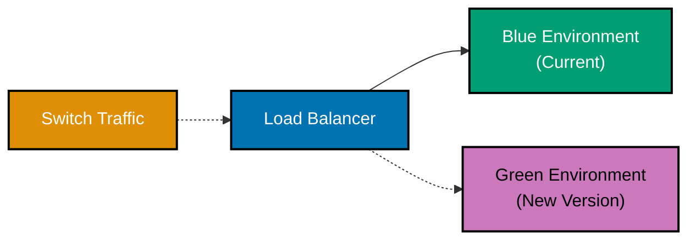
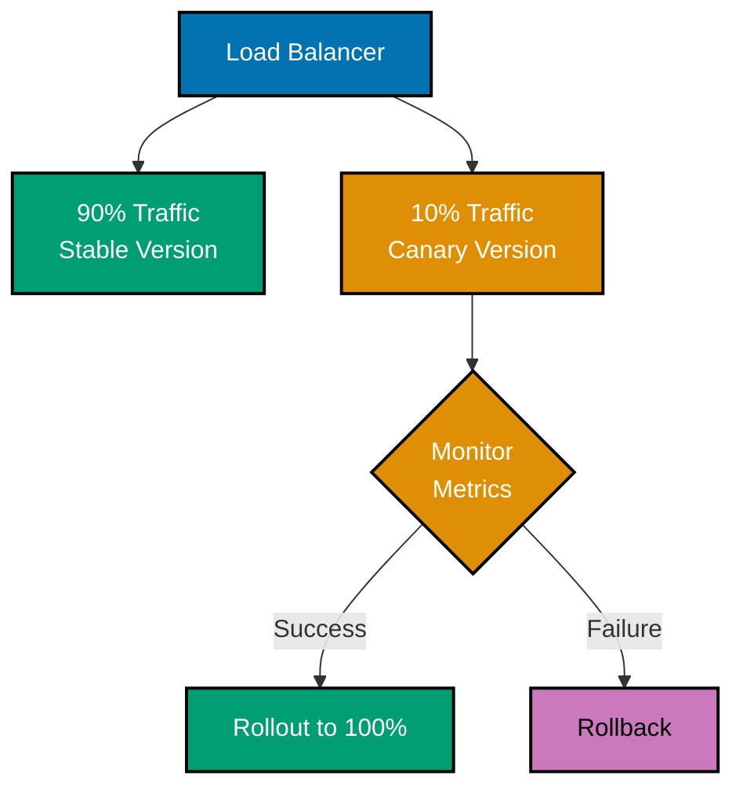

# Next.js Deployment

## Quick Reference

**Deployment Options**:

- [Vercel Deployment](#vercel-deployment) - Recommended, zero-config
- [Self-Hosting](#self-hosting-with-nodejs) - Node.js server
- [Docker Deployment](#docker-containerization) - Containerized apps
- [Static Export](#static-export) - Limited features

**Production Setup**:

- [Environment Variables](#environment-variables) - Configuration management
- [Build Optimization](#build-optimization) - Production builds
- [CI/CD Pipelines](#cicd-integration) - Automated deployment
- [Monitoring](#monitoring-and-observability) - Production monitoring

## Overview

**Deploying Next.js applications** requires understanding the different deployment targets and choosing the right strategy based on your infrastructure. Next.js supports multiple deployment options from fully managed platforms to self-hosted solutions.

**Deployment Strategies**:

- **Vercel** - Zero-config, optimal for Next.js (recommended)
- **Self-hosted** - Full control with Node.js
- **Docker** - Containerized deployment
- **Static export** - CDN-only hosting (limited features)

This guide covers Next.js 16+ deployment patterns for enterprise applications.

## Vercel Deployment

### Zero-Config Deployment

```bash
# Install Vercel CLI
npm install -g vercel

# Deploy to preview
vercel

# Deploy to production
vercel --prod
```

### Git Integration

**Automatic deployment** on push:

1. Connect repository to Vercel
2. Configure build settings
3. Every push to main → production deployment
4. Every pull request → preview deployment

### Build Configuration

```json
// vercel.json
{
  "buildCommand": "npm run build",
  "devCommand": "npm run dev",
  "installCommand": "npm install",
  "framework": "nextjs",
  "regions": ["iad1", "sfo1"],
  "crons": [
    {
      "path": "/api/cron/update-nisab",
      "schedule": "0 0 * * *"
    }
  ]
}
```

### Environment Variables

**Vercel Dashboard**:

1. Project Settings → Environment Variables
2. Add variables for Production, Preview, Development
3. Sensitive values encrypted automatically

```bash
# Environment variables in Vercel
NEXT_PUBLIC_API_URL=https://api.oseplatform.com
DATABASE_URL=postgresql://...
JWT_SECRET=...
GOLD_API_KEY=...
```

### OSE Platform Vercel Configuration

```json
// vercel.json
{
  "buildCommand": "npm run build",
  "framework": "nextjs",
  "regions": ["iad1", "sfo1", "sin1"],
  "headers": [
    {
      "source": "/(.*)",
      "headers": [
        {
          "key": "X-Frame-Options",
          "value": "DENY"
        },
        {
          "key": "X-Content-Type-Options",
          "value": "nosniff"
        },
        {
          "key": "Referrer-Policy",
          "value": "strict-origin-when-cross-origin"
        }
      ]
    }
  ],
  "rewrites": [
    {
      "source": "/api/:path*",
      "destination": "https://api-internal.oseplatform.com/:path*"
    }
  ]
}
```

## Self-Hosting with Node.js

### Standalone Build

```typescript
// next.config.ts
import type { NextConfig } from "next";

const nextConfig: NextConfig = {
  output: "standalone",
};

export default nextConfig;
```

```bash
# Build for production
npm run build

# Output structure
.next/
├── standalone/
│   ├── server.js           # Production server
│   ├── package.json
│   └── node_modules/       # Only production dependencies
├── static/                 # Static assets
└── ...
```

### Production Server

```bash
# Start production server
node .next/standalone/server.js

# With PM2 (process manager)
pm2 start .next/standalone/server.js --name "ose-platform"
pm2 save
pm2 startup
```

### PM2 Configuration

```javascript
// ecosystem.config.js
module.exports = {
  apps: [
    {
      name: "ose-platform",
      script: ".next/standalone/server.js",
      instances: "max",
      exec_mode: "cluster",
      env: {
        NODE_ENV: "production",
        PORT: 3000,
      },
      env_production: {
        NODE_ENV: "production",
        PORT: 3000,
      },
      error_file: "./logs/err.log",
      out_file: "./logs/out.log",
      log_date_format: "YYYY-MM-DD HH:mm:ss Z",
    },
  ],
};
```

```bash
# Start with PM2 config
pm2 start ecosystem.config.js --env production

# Monitor
pm2 monit

# Reload without downtime
pm2 reload ose-platform
```

### Nginx Reverse Proxy

```nginx
# /etc/nginx/sites-available/ose-platform
upstream nextjs_app {
  server 127.0.0.1:3000;
}

server {
  listen 80;
  server_name oseplatform.com www.oseplatform.com;

  # Redirect HTTP to HTTPS
  return 301 https://$server_name$request_uri;
}

server {
  listen 443 ssl http2;
  server_name oseplatform.com www.oseplatform.com;

  ssl_certificate /etc/letsencrypt/live/oseplatform.com/fullchain.pem;
  ssl_certificate_key /etc/letsencrypt/live/oseplatform.com/privkey.pem;

  # Security headers
  add_header X-Frame-Options "DENY" always;
  add_header X-Content-Type-Options "nosniff" always;
  add_header X-XSS-Protection "1; mode=block" always;
  add_header Referrer-Policy "strict-origin-when-cross-origin" always;

  # Gzip compression
  gzip on;
  gzip_types text/plain text/css application/json application/javascript text/xml application/xml application/xml+rss text/javascript;

  location / {
    proxy_pass http://nextjs_app;
    proxy_http_version 1.1;
    proxy_set_header Upgrade $http_upgrade;
    proxy_set_header Connection 'upgrade';
    proxy_set_header Host $host;
    proxy_set_header X-Real-IP $remote_addr;
    proxy_set_header X-Forwarded-For $proxy_add_x_forwarded_for;
    proxy_set_header X-Forwarded-Proto $scheme;
    proxy_cache_bypass $http_upgrade;
  }

  # Cache static files
  location /_next/static {
    alias /var/www/ose-platform/.next/static;
    expires 1y;
    access_log off;
    add_header Cache-Control "public, immutable";
  }
}
```

## Docker Containerization

### Dockerfile

```dockerfile
# syntax=docker/dockerfile:1

# Base image
FROM node:24-alpine AS base
RUN apk add --no-cache libc6-compat
WORKDIR /app

# Dependencies
FROM base AS deps
COPY package.json package-lock.json ./
RUN npm ci --only=production

# Builder
FROM base AS builder
COPY package.json package-lock.json ./
RUN npm ci
COPY . .
RUN npm run build

# Runner
FROM base AS runner
WORKDIR /app

ENV NODE_ENV=production
ENV NEXT_TELEMETRY_DISABLED=1

RUN addgroup --system --gid 1001 nodejs
RUN adduser --system --uid 1001 nextjs

COPY --from=builder /app/public ./public

# Standalone build
COPY --from=builder --chown=nextjs:nodejs /app/.next/standalone ./
COPY --from=builder --chown=nextjs:nodejs /app/.next/static ./.next/static

USER nextjs

EXPOSE 3000

ENV PORT=3000
ENV HOSTNAME="0.0.0.0"

CMD ["node", "server.js"]
```

### docker-compose.yml

```yaml
version: "3.8"

services:
  nextjs:
    build:
      context: .
      dockerfile: Dockerfile
    ports:
      - "3000:3000"
    environment:
      - NODE_ENV=production
      - DATABASE_URL=${DATABASE_URL}
      - JWT_SECRET=${JWT_SECRET}
      - NEXT_PUBLIC_API_URL=${NEXT_PUBLIC_API_URL}
    depends_on:
      - postgres
    restart: unless-stopped

  postgres:
    image: postgres:16-alpine
    environment:
      - POSTGRES_USER=ose_user
      - POSTGRES_PASSWORD=${POSTGRES_PASSWORD}
      - POSTGRES_DB=ose_platform
    volumes:
      - postgres_data:/var/lib/postgresql/data
    restart: unless-stopped

  nginx:
    image: nginx:alpine
    ports:
      - "80:80"
      - "443:443"
    volumes:
      - ./nginx.conf:/etc/nginx/nginx.conf:ro
      - ./ssl:/etc/nginx/ssl:ro
    depends_on:
      - nextjs
    restart: unless-stopped

volumes:
  postgres_data:
```

### .dockerignore

```
node_modules
.next
.git
.github
.vscode
.env*.local
npm-debug.log*
yarn-debug.log*
yarn-error.log*
*.md
.DS_Store
coverage
.turbo
```

## Static Export

### Configuration

```typescript
// next.config.ts
import type { NextConfig } from "next";

const nextConfig: NextConfig = {
  output: "export",
  images: {
    unoptimized: true, // Required for static export
  },
};

export default nextConfig;
```

**Limitations**:

- No Server Components
- No Server Actions
- No API Routes
- No Dynamic Routes (without getStaticPaths)
- No Incremental Static Regeneration
- No Middleware
- No Image Optimization

**Use when**:

- Static site only
- Deploying to CDN
- No backend functionality needed

## Environment Variables

### .env Files

```bash
# .env.local (never commit)
DATABASE_URL=postgresql://localhost:5432/ose_platform
JWT_SECRET=your-secret-key
GOLD_API_KEY=your-api-key

# .env.production (commit - no secrets!)
NEXT_PUBLIC_API_URL=https://api.oseplatform.com
NEXT_PUBLIC_ENABLE_ANALYTICS=true
```

### Environment Variable Types

```bash
# Public (exposed to browser)
NEXT_PUBLIC_API_URL=https://api.example.com
NEXT_PUBLIC_SITE_NAME=OSE Platform

# Private (server-only)
DATABASE_URL=postgresql://...
JWT_SECRET=...
API_SECRET_KEY=...
```

### Type-Safe Environment Variables

```typescript
// lib/env.ts
import { z } from "zod";

const envSchema = z.object({
  // Public
  NEXT_PUBLIC_API_URL: z.string().url(),
  NEXT_PUBLIC_SITE_NAME: z.string(),

  // Private
  DATABASE_URL: z.string(),
  JWT_SECRET: z.string().min(32),
  GOLD_API_KEY: z.string(),
});

export const env = envSchema.parse(process.env);
```

```typescript
// Usage
import { env } from "@/lib/env";

const apiUrl = env.NEXT_PUBLIC_API_URL;
const dbUrl = env.DATABASE_URL;
```

## Build Optimization

### Production Build

```bash
# Build for production
npm run build

# Analyze bundle
npm run build -- --profile

# Check build output
ls -lh .next

# Test production build locally
npm start
```

### next.config.ts Optimization

```typescript
// next.config.ts
import type { NextConfig } from "next";

const nextConfig: NextConfig = {
  reactStrictMode: true,
  poweredByHeader: false,
  compress: true,

  compiler: {
    removeConsole: process.env.NODE_ENV === "production",
  },

  experimental: {
    optimizePackageImports: ["@mui/material", "@mui/icons-material"],
  },

  images: {
    formats: ["image/avif", "image/webp"],
    minimumCacheTTL: 60,
  },
};

export default nextConfig;
```

## CI/CD Integration

### GitHub Actions

```yaml
# .github/workflows/deploy.yml
name: Deploy to Production

on:
  push:
    branches: [main]

jobs:
  test:
    runs-on: ubuntu-latest
    steps:
      - uses: actions/checkout@v4

      - name: Setup Node.js
        uses: actions/setup-node@v4
        with:
          node-version: "24"
          cache: "npm"

      - name: Install dependencies
        run: npm ci

      - name: Run tests
        run: npm test

      - name: Run linter
        run: npm run lint

      - name: Build
        run: npm run build

  deploy:
    needs: test
    runs-on: ubuntu-latest
    steps:
      - uses: actions/checkout@v4

      - name: Deploy to Vercel
        uses: amondnet/vercel-action@v25
        with:
          vercel-token: ${{ secrets.VERCEL_TOKEN }}
          vercel-org-id: ${{ secrets.VERCEL_ORG_ID }}
          vercel-project-id: ${{ secrets.VERCEL_PROJECT_ID }}
          vercel-args: "--prod"
```

### GitLab CI/CD

```yaml
# .gitlab-ci.yml
stages:
  - test
  - build
  - deploy

variables:
  NODE_VERSION: "24"

test:
  stage: test
  image: node:${NODE_VERSION}
  cache:
    paths:
      - node_modules/
  script:
    - npm ci
    - npm test
    - npm run lint

build:
  stage: build
  image: node:${NODE_VERSION}
  cache:
    paths:
      - node_modules/
  script:
    - npm ci
    - npm run build
  artifacts:
    paths:
      - .next/
    expire_in: 1 hour

deploy:
  stage: deploy
  image: docker:latest
  services:
    - docker:dind
  dependencies:
    - build
  script:
    - docker build -t ose-platform:${CI_COMMIT_SHA} .
    - docker tag ose-platform:${CI_COMMIT_SHA} registry.example.com/ose-platform:latest
    - docker push registry.example.com/ose-platform:latest
  only:
    - main
```

## Monitoring and Observability

### Vercel Analytics

```typescript
// app/layout.tsx
import { Analytics } from '@vercel/analytics/react';
import { SpeedInsights } from '@vercel/speed-insights/next';

export default function RootLayout({ children }: { children: React.ReactNode }) {
  return (
    <html lang="en">
      <body>
        {children}
        <Analytics />
        <SpeedInsights />
      </body>
    </html>
  );
}
```

### Error Tracking with Sentry

```bash
npm install @sentry/nextjs
```

```typescript
// sentry.client.config.ts
import * as Sentry from "@sentry/nextjs";

Sentry.init({
  dsn: process.env.NEXT_PUBLIC_SENTRY_DSN,
  environment: process.env.NODE_ENV,
  tracesSampleRate: 1.0,
  replaysSessionSampleRate: 0.1,
  replaysOnErrorSampleRate: 1.0,
});
```

```typescript
// sentry.server.config.ts
import * as Sentry from "@sentry/nextjs";

Sentry.init({
  dsn: process.env.NEXT_PUBLIC_SENTRY_DSN,
  environment: process.env.NODE_ENV,
  tracesSampleRate: 1.0,
});
```

### Custom Logging

```typescript
// lib/logger.ts
import pino from "pino";

export const logger = pino({
  level: process.env.LOG_LEVEL || "info",
  transport:
    process.env.NODE_ENV === "development"
      ? {
          target: "pino-pretty",
          options: {
            colorize: true,
          },
        }
      : undefined,
});
```

```typescript
// Usage
import { logger } from "@/lib/logger";

logger.info("User logged in", { userId: "user-1" });
logger.error("Failed to calculate zakat", { error, userId: "user-1" });
```

### Health Check Endpoint

```typescript
// app/api/health/route.ts
import { NextResponse } from "next/server";
import { db } from "@/lib/db/client";

export async function GET() {
  try {
    // Check database connection
    await db.$queryRaw`SELECT 1`;

    return NextResponse.json({
      status: "healthy",
      timestamp: new Date().toISOString(),
      version: process.env.npm_package_version,
      uptime: process.uptime(),
    });
  } catch (error) {
    return NextResponse.json(
      {
        status: "unhealthy",
        timestamp: new Date().toISOString(),
        error: "Database connection failed",
      },
      { status: 500 },
    );
  }
}
```

## Production Checklist

Before deploying to production:

- [ ] Environment variables configured
- [ ] Database migrations run
- [ ] Build succeeds without warnings
- [ ] All tests passing
- [ ] Lighthouse score > 90
- [ ] Security headers configured
- [ ] HTTPS enabled
- [ ] Error tracking configured
- [ ] Monitoring set up
- [ ] Health check endpoint working
- [ ] Backup strategy in place
- [ ] Rollback plan documented

## Deployment Strategies

### Blue-Green Deployment



### Canary Deployment



## Best Practices

### ✅ Do

- **Use Vercel** for simplest deployment
- **Configure environment variables** properly
- **Enable monitoring** and error tracking
- **Set up health checks**
- **Use Docker** for reproducible builds
- **Implement CI/CD** pipelines
- **Test production builds** locally
- **Document deployment** process

### ❌ Don't

- **Don't commit secrets** to version control
- **Don't skip testing** before deployment
- **Don't ignore build warnings**
- **Don't deploy without monitoring**
- **Don't skip database migrations**
- **Don't forget rollback plan**
- **Don't ignore error logs**

## Troubleshooting

### Build Failures

```bash
# Clear cache and rebuild
rm -rf .next
npm run build

# Check for TypeScript errors
npm run type-check

# Check for linting errors
npm run lint
```

### Memory Issues

```bash
# Increase Node.js memory
NODE_OPTIONS=--max_old_space_size=4096 npm run build
```

### Deployment Rollback

**Vercel**:

```bash
# List deployments
vercel ls

# Rollback to previous deployment
vercel rollback [deployment-url]
```

**Docker**:

```bash
# Rollback to previous image
docker-compose down
docker-compose up -d --scale nextjs=0
docker tag ose-platform:previous ose-platform:latest
docker-compose up -d
```

## Related Documentation

**Configuration**:

- [Configuration](ex-soen-plwe-to-fene__configuration.md) - next.config.ts options
- [Environment Variables](ex-soen-plwe-to-fene__configuration.md#environment-variables) - Config management

**Performance**:

- [Performance](ex-soen-plwe-to-fene__performance.md) - Optimization strategies
- [Caching](ex-soen-plwe-to-fene__rendering.md#caching) - Cache configuration

**Security**:

- [Security](ex-soen-plwe-to-fene__security.md) - Production security

---

**Last Updated**: 2026-01-26
**Next.js Version**: 14+ (Standalone output, Docker support)
