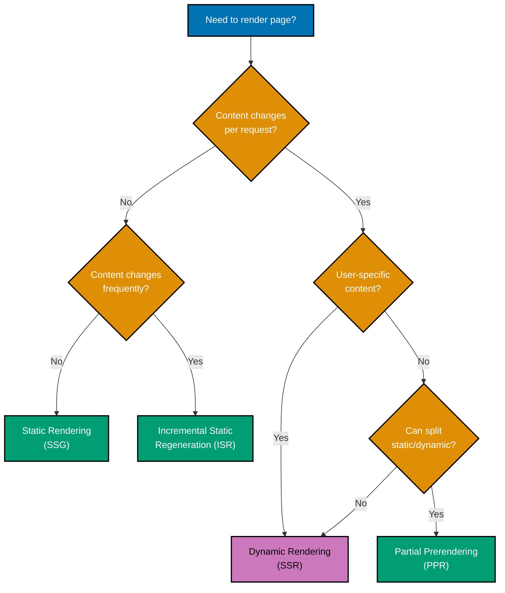
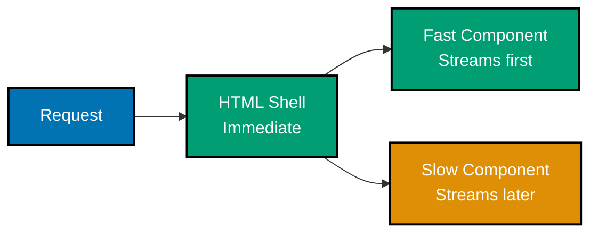

# Next.js Rendering

## Quick Reference

**Rendering Strategies**:

- [Static Rendering (SSG)](#static-rendering-ssg) - Build-time generation (default)
- [Dynamic Rendering (SSR)](#dynamic-rendering-ssr) - Request-time generation
- [Streaming](#streaming) - Progressive rendering with Suspense
- [Incremental Static Regeneration (ISR)](#incremental-static-regeneration-isr) - Update static pages
- [Partial Prerendering (PPR)](#partial-prerendering-ppr) - Hybrid static + dynamic

**Configuration**:

- [Route Segment Config](#route-segment-configuration) - Page-level settings
- [generateStaticParams](#generatestaticparams) - Static path generation
- [Dynamic Functions](#dynamic-functions) - Force dynamic rendering
- [Runtime Selection](#runtime-selection) - Node.js vs Edge

## Overview

Next.js provides multiple **rendering strategies** to optimize performance based on content requirements. The App Router with React Server Components enables intelligent rendering decisions automatically while giving you fine-grained control when needed.

**Key Concepts**:

- **Static by default** - Pages are pre-rendered at build time
- **Dynamic when needed** - Automatically switches to SSR when using dynamic functions
- **Streaming support** - Progressive rendering with Suspense boundaries
- **Hybrid rendering** - Mix static and dynamic content in one route

This guide covers Next.js 14+ rendering strategies for enterprise applications.

## Rendering Strategy Decision Tree



## Static Rendering (SSG)

### Default Behavior

All routes are **statically rendered by default** at build time:

```typescript
// app/about/page.tsx
// Automatically static - no configuration needed
export default function AboutPage() {
  return (
    <div>
      <h1>About OSE Platform</h1>
      <p>Sharia-compliant financial solutions for enterprises.</p>
      <p>Our mission is to democratize access to Islamic finance.</p>
    </div>
  );
}
```

**Characteristics**:

- Pre-rendered at build time
- Served as static HTML
- Fastest possible performance
- Same content for all users
- Perfect for marketing pages, documentation

### Static with Data Fetching

```typescript
// app/nisab/methodology/page.tsx
export default async function NisabMethodologyPage() {
  // Data fetched at build time
  const methodology = await db.nisabMethodology.findFirst({
    orderBy: { version: 'desc' },
  });

  return (
    <div>
      <h1>Nisab Calculation Methodology</h1>
      <div className="prose max-w-none">
        <h2>Version {methodology.version}</h2>
        <p>{methodology.description}</p>

        <h3>Gold-Based Calculation</h3>
        <p>Nisab threshold: {methodology.goldGrams}g of gold</p>
        <p>Formula: Gold price per gram × {methodology.goldGrams}</p>

        <h3>Silver-Based Calculation</h3>
        <p>Nisab threshold: {methodology.silverGrams}g of silver</p>
        <p>Formula: Silver price per gram × {methodology.silverGrams}</p>
      </div>
    </div>
  );
}
```

### generateStaticParams

Pre-generate static pages for dynamic routes:

```typescript
// app/blog/[slug]/page.tsx
export async function generateStaticParams() {
  const posts = await db.post.findMany({
    where: { published: true },
    select: { slug: true },
  });

  return posts.map((post) => ({
    slug: post.slug,
  }));
}

export default async function BlogPostPage({
  params,
}: {
  params: { slug: string };
}) {
  const post = await db.post.findUnique({
    where: { slug: params.slug },
  });

  return (
    <article>
      <h1>{post.title}</h1>
      <div dangerouslySetInnerHTML={{ __html: post.content }} />
    </article>
  );
}
```

### OSE Platform: Waqf Project Pages

```typescript
// app/waqf/projects/[id]/page.tsx
import { db } from '@/lib/db/client';
import { notFound } from 'next/navigation';

// Generate static pages for all active waqf projects
export async function generateStaticParams() {
  const projects = await db.waqfProject.findMany({
    where: { active: true },
    select: { id: true },
  });

  return projects.map((project) => ({
    id: project.id,
  }));
}

export default async function WaqfProjectPage({
  params,
}: {
  params: { id: string };
}) {
  const project = await db.waqfProject.findUnique({
    where: { id: params.id },
    include: {
      donations: {
        orderBy: { createdAt: 'desc' },
        take: 10,
      },
    },
  });

  if (!project) {
    notFound();
  }

  const totalDonated = project.donations.reduce((sum, d) => sum + d.amount, 0);
  const progress = (totalDonated / project.fundingGoal) * 100;

  return (
    <div>
      <h1>{project.name}</h1>
      <p className="text-gray-600">{project.description}</p>

      <div className="grid grid-cols-3 gap-4 my-8">
        <div className="border p-4 rounded">
          <p className="text-sm text-gray-600">Funding Goal</p>
          <p className="text-2xl font-bold">${project.fundingGoal}</p>
        </div>
        <div className="border p-4 rounded">
          <p className="text-sm text-gray-600">Total Donated</p>
          <p className="text-2xl font-bold text-green-600">${totalDonated}</p>
        </div>
        <div className="border p-4 rounded">
          <p className="text-sm text-gray-600">Progress</p>
          <p className="text-2xl font-bold">{progress.toFixed(1)}%</p>
        </div>
      </div>

      <div className="w-full bg-gray-200 rounded-full h-4 mb-8">
        <div
          className="bg-green-600 h-4 rounded-full"
          style={{ width: `${Math.min(progress, 100)}%` }}
        ></div>
      </div>

      <h2 className="text-xl font-semibold mb-4">Recent Donations</h2>
      <div className="space-y-2">
        {project.donations.map((donation) => (
          <div key={donation.id} className="border p-3 rounded">
            <div className="flex justify-between">
              <span className="font-semibold">${donation.amount}</span>
              <span className="text-sm text-gray-600">
                {donation.createdAt.toLocaleDateString()}
              </span>
            </div>
            {donation.isAnonymous ? (
              <p className="text-sm text-gray-500">Anonymous donor</p>
            ) : (
              <p className="text-sm">{donation.donorName}</p>
            )}
          </div>
        ))}
      </div>
    </div>
  );
}
```

## Dynamic Rendering (SSR)

### Automatic Dynamic Rendering

Routes become **automatically dynamic** when using:

- `cookies()` - Reading cookies
- `headers()` - Reading request headers
- `searchParams` - Query parameters
- `useSearchParams()` - Client hook
- `fetch()` with `cache: 'no-store'`

```typescript
// app/(platform)/dashboard/page.tsx
import { cookies, headers } from 'next/headers';
import { auth } from '@/lib/auth';

export default async function DashboardPage() {
  // Using cookies() makes this route dynamic
  const session = await auth();

  // Using headers() also forces dynamic rendering
  const userAgent = headers().get('user-agent');

  return (
    <div>
      <h1>Welcome, {session.user.name}</h1>
      <p className="text-gray-600">You're using: {userAgent}</p>
    </div>
  );
}
```

### Force Dynamic Rendering

```typescript
// app/(platform)/zakat/calculate/page.tsx
export const dynamic = 'force-dynamic';

export default async function ZakatCalculatePage() {
  // This page always renders on request
  const nisab = await db.nisab.findFirst({
    orderBy: { effectiveDate: 'desc' },
  });

  return (
    <div>
      <h1>Calculate Your Zakat</h1>
      <p>Current Nisab: {nisab.amount}</p>
      {/* Form component */}
    </div>
  );
}
```

### OSE Platform: User-Specific Dashboard

```typescript
// app/(platform)/dashboard/page.tsx
import { auth } from '@/lib/auth';
import { db } from '@/lib/db/client';
import { redirect } from 'next/navigation';

// Force dynamic rendering for user-specific content
export const dynamic = 'force-dynamic';

export default async function DashboardPage() {
  const session = await auth();
  if (!session) {
    redirect('/login');
  }

  // Fetch user-specific data
  const [zakatStats, murabahaStats, waqfStats, recentActivity] = await Promise.all([
    db.zakatCalculation.aggregate({
      where: { userId: session.user.id },
      _sum: { zakatAmount: true },
      _count: true,
    }),
    db.murabahaApplication.aggregate({
      where: { userId: session.user.id },
      _sum: { requestedAmount: true },
      _count: true,
    }),
    db.waqfDonation.aggregate({
      where: { userId: session.user.id },
      _sum: { amount: true },
      _count: true,
    }),
    db.activityLog.findMany({
      where: { userId: session.user.id },
      orderBy: { timestamp: 'desc' },
      take: 5,
    }),
  ]);

  return (
    <div>
      <h1>Welcome back, {session.user.name}!</h1>

      <div className="grid grid-cols-3 gap-4 my-8">
        <div className="border p-4 rounded">
          <h2 className="font-semibold mb-2">Zakat</h2>
          <p>Calculations: {zakatStats._count}</p>
          <p>Total: ${zakatStats._sum.zakatAmount || 0}</p>
        </div>
        <div className="border p-4 rounded">
          <h2 className="font-semibold mb-2">Murabaha</h2>
          <p>Applications: {murabahaStats._count}</p>
          <p>Total: ${murabahaStats._sum.requestedAmount || 0}</p>
        </div>
        <div className="border p-4 rounded">
          <h2 className="font-semibold mb-2">Waqf</h2>
          <p>Donations: {waqfStats._count}</p>
          <p>Total: ${waqfStats._sum.amount || 0}</p>
        </div>
      </div>

      <h2 className="text-xl font-semibold mb-4">Recent Activity</h2>
      <div className="space-y-2">
        {recentActivity.map((activity) => (
          <div key={activity.id} className="border p-3 rounded">
            <p>{activity.description}</p>
            <p className="text-sm text-gray-600">
              {activity.timestamp.toLocaleString()}
            </p>
          </div>
        ))}
      </div>
    </div>
  );
}
```

## Streaming

### Progressive Rendering with Suspense

```typescript
// app/(platform)/dashboard/page.tsx
import { Suspense } from 'react';
import { ZakatStats } from '@/components/dashboard/ZakatStats';
import { MurabahaStats } from '@/components/dashboard/MurabahaStats';
import { WaqfStats } from '@/components/dashboard/WaqfStats';

export default function DashboardPage() {
  return (
    <div>
      <h1>Dashboard</h1>

      {/* Static content shows immediately */}
      <p className="text-gray-600 mb-8">
        Your financial overview at a glance
      </p>

      <div className="grid grid-cols-3 gap-4">
        {/* Each component streams independently */}
        <Suspense
          fallback={
            <div className="border p-4 rounded animate-pulse">
              <div className="h-4 bg-gray-200 rounded w-1/2 mb-2"></div>
              <div className="h-8 bg-gray-200 rounded w-3/4"></div>
            </div>
          }
        >
          <ZakatStats />
        </Suspense>

        <Suspense
          fallback={
            <div className="border p-4 rounded animate-pulse">
              <div className="h-4 bg-gray-200 rounded w-1/2 mb-2"></div>
              <div className="h-8 bg-gray-200 rounded w-3/4"></div>
            </div>
          }
        >
          <MurabahaStats />
        </Suspense>

        <Suspense
          fallback={
            <div className="border p-4 rounded animate-pulse">
              <div className="h-4 bg-gray-200 rounded w-1/2 mb-2"></div>
              <div className="h-8 bg-gray-200 rounded w-3/4"></div>
            </div>
          }
        >
          <WaqfStats />
        </Suspense>
      </div>
    </div>
  );
}
```

### Streaming Benefits



## Incremental Static Regeneration (ISR)

### Time-Based Revalidation

```typescript
// app/nisab/current/page.tsx
export const revalidate = 3600; // Revalidate every hour

export default async function CurrentNisabPage() {
  const goldPrice = await fetch('https://api.goldprice.com/current', {
    headers: {
      Authorization: `Bearer ${process.env.GOLD_API_KEY}`,
    },
  }).then((res) => res.json());

  const NISAB_GOLD_GRAMS = 85;
  const nisab = goldPrice.pricePerGram * NISAB_GOLD_GRAMS;

  return (
    <div>
      <h1>Current Nisab Threshold</h1>
      <div className="border p-6 rounded-lg">
        <p className="text-sm text-gray-600">Nisab Amount</p>
        <p className="text-4xl font-bold">{nisab.toFixed(2)} USD</p>
        <p className="text-sm text-gray-600 mt-2">
          Based on gold price: ${goldPrice.pricePerGram}/gram
        </p>
        <p className="text-xs text-gray-500 mt-4">
          Updated hourly. Last updated: {new Date().toLocaleString()}
        </p>
      </div>
    </div>
  );
}
```

### On-Demand Revalidation

```typescript
// features/nisab/actions/updateNisab.ts
"use server";

import { revalidatePath, revalidateTag } from "next/cache";
import { db } from "@/lib/db/client";

export async function updateNisabThreshold(data: NisabData) {
  await db.nisab.create({
    data: {
      goldGrams: data.goldGrams,
      silverGrams: data.silverGrams,
      amount: data.amount,
      currency: data.currency,
      effectiveDate: new Date(),
    },
  });

  // Revalidate specific paths
  revalidatePath("/nisab/current");
  revalidatePath("/nisab/methodology");

  // Revalidate all routes tagged with 'nisab'
  revalidateTag("nisab");
}
```

### OSE Platform: Blog Posts with ISR

```typescript
// app/blog/[slug]/page.tsx
// Revalidate every 15 minutes
export const revalidate = 900;

export async function generateStaticParams() {
  const posts = await db.post.findMany({
    where: { published: true },
    select: { slug: true },
  });

  return posts.map((post) => ({
    slug: post.slug,
  }));
}

export default async function BlogPostPage({
  params,
}: {
  params: { slug: string };
}) {
  const post = await db.post.findUnique({
    where: { slug: params.slug },
    include: {
      author: true,
      comments: {
        where: { approved: true },
        orderBy: { createdAt: 'desc' },
      },
    },
  });

  return (
    <article>
      <header className="mb-8">
        <h1 className="text-4xl font-bold mb-2">{post.title}</h1>
        <div className="flex items-center gap-4 text-gray-600">
          <span>By {post.author.name}</span>
          <span>•</span>
          <time>{post.publishedAt.toLocaleDateString()}</time>
        </div>
      </header>

      <div
        className="prose max-w-none"
        dangerouslySetInnerHTML={{ __html: post.content }}
      />

      <section className="mt-12">
        <h2 className="text-2xl font-semibold mb-4">
          Comments ({post.comments.length})
        </h2>
        <div className="space-y-4">
          {post.comments.map((comment) => (
            <div key={comment.id} className="border p-4 rounded">
              <p className="font-semibold">{comment.authorName}</p>
              <p className="text-gray-700 mt-2">{comment.content}</p>
              <p className="text-sm text-gray-500 mt-2">
                {comment.createdAt.toLocaleString()}
              </p>
            </div>
          ))}
        </div>
      </section>
    </article>
  );
}
```

## Partial Prerendering (PPR)

### Experimental Feature

Partial Prerendering combines static and dynamic rendering in the same route:

```typescript
// next.config.ts
import type { NextConfig } from "next";

const nextConfig: NextConfig = {
  experimental: {
    ppr: true, // Enable PPR
  },
};

export default nextConfig;
```

```typescript
// app/products/[id]/page.tsx
import { Suspense } from 'react';
import { ProductDetails } from '@/components/ProductDetails';
import { ProductReviews } from '@/components/ProductReviews';
import { UserRecommendations } from '@/components/UserRecommendations';

export default async function ProductPage({
  params,
}: {
  params: { id: string };
}) {
  // Static product details
  const product = await db.product.findUnique({
    where: { id: params.id },
  });

  return (
    <div>
      {/* Static: Pre-rendered at build time */}
      <ProductDetails product={product} />

      {/* Static: Reviews don't change per user */}
      <ProductReviews productId={product.id} />

      {/* Dynamic: User-specific recommendations */}
      <Suspense fallback={<div>Loading recommendations...</div>}>
        <UserRecommendations productId={product.id} />
      </Suspense>
    </div>
  );
}
```

## Route Segment Configuration

### Available Options

```typescript
// app/example/page.tsx
export const dynamic = 'auto'; // 'auto' | 'force-dynamic' | 'error' | 'force-static'
export const dynamicParams = true; // true | false
export const revalidate = false; // false | 'force-cache' | 0 | number
export const fetchCache = 'auto'; // 'auto' | 'default-cache' | 'only-cache' | 'force-cache' | 'force-no-store' | 'default-no-store' | 'only-no-store'
export const runtime = 'nodejs'; // 'nodejs' | 'edge'
export const preferredRegion = 'auto'; // 'auto' | 'global' | 'home' | string | string[]
export const maxDuration = 5; // seconds

export default function ExamplePage() {
  return <div>Example</div>;
}
```

### OSE Platform Configuration Examples

**Static Marketing Page**:

```typescript
// app/about/page.tsx
export const dynamic = 'force-static';
export const revalidate = false;

export default function AboutPage() {
  return <div>About Us</div>;
}
```

**Dynamic User Dashboard**:

```typescript
// app/(platform)/dashboard/page.tsx
export const dynamic = 'force-dynamic';
export const runtime = 'nodejs';

export default async function DashboardPage() {
  const session = await auth();
  return <div>Dashboard</div>;
}
```

**ISR Content Page**:

```typescript
// app/blog/[slug]/page.tsx
export const revalidate = 3600; // 1 hour
export const dynamicParams = true; // Allow new slugs

export default async function BlogPostPage() {
  return <div>Blog Post</div>;
}
```

**Edge Runtime API**:

```typescript
// app/api/geo/route.ts
export const runtime = "edge";
export const dynamic = "force-dynamic";

export async function GET(request: Request) {
  const geo = request.geo;
  return Response.json({ country: geo?.country });
}
```

## Dynamic Functions

### Functions that Force Dynamic Rendering

```typescript
import { cookies, headers } from 'next/headers';
import { searchParams } from 'next/navigation';

export default async function Page() {
  // Using cookies() forces dynamic rendering
  const cookieStore = cookies();
  const theme = cookieStore.get('theme');

  // Using headers() forces dynamic rendering
  const headersList = headers();
  const userAgent = headersList.get('user-agent');

  return (
    <div>
      <p>Theme: {theme?.value}</p>
      <p>User Agent: {userAgent}</p>
    </div>
  );
}
```

### Opt-out with unstable_noStore

```typescript
import { unstable_noStore as noStore } from 'next/cache';

export default async function Page() {
  // Explicitly opt-out of caching
  noStore();

  const data = await fetchSensitiveData();

  return <div>{data}</div>;
}
```

## Runtime Selection

### Node.js Runtime (Default)

```typescript
// app/api/complex/route.ts
export const runtime = "nodejs";

export async function POST(request: Request) {
  // Full Node.js APIs available
  const fs = await import("fs/promises");
  const data = await request.json();

  // Can use all Node.js libraries
  return Response.json({ success: true });
}
```

### Edge Runtime

```typescript
// app/api/fast/route.ts
export const runtime = "edge";

export async function GET(request: Request) {
  // Limited APIs, but faster cold starts
  const geo = request.geo;

  return Response.json({
    country: geo?.country,
    city: geo?.city,
  });
}
```

**Edge Runtime Limitations**:

- No Node.js APIs (fs, path, crypto, etc.)
- No native modules
- Smaller bundle size limit
- Faster cold starts
- Global edge deployment

## Best Practices

### ✅ Do

- **Use static rendering** by default
- **Use ISR** for semi-static content
- **Use dynamic rendering** for user-specific data
- **Use Suspense** for streaming
- **Configure route segments** explicitly when needed
- **Use Edge runtime** for global, fast APIs
- **Revalidate after mutations**
- **Monitor build times** for static pages

### ❌ Don't

- **Don't force dynamic** unnecessarily
- **Don't skip revalidation** after content updates
- **Don't use Edge** for Node.js-specific code
- **Don't generate too many** static paths
- **Don't skip Suspense** for slow data
- **Don't ignore** build warnings

## Rendering Performance Comparison

| Strategy          | Build Time | Runtime Performance | When to Use           |
| ----------------- | ---------- | ------------------- | --------------------- |
| **Static (SSG)**  | High       | Fastest             | Static content        |
| **ISR**           | Medium     | Very Fast           | Semi-static content   |
| **Dynamic (SSR)** | Low        | Fast                | User-specific content |
| **Streaming**     | Low        | Progressive         | Mixed fast/slow data  |
| **PPR**           | Medium     | Best of both        | Hybrid pages          |

## Related Documentation

**Core Next.js**:

- [Server Components](ex-soen-plwe-to-fene__server-components.md) - Component rendering
- [Data Fetching](ex-soen-plwe-to-fene__data-fetching.md) - Data strategies
- [Performance](ex-soen-plwe-to-fene__performance.md) - Optimization
- [Caching](ex-soen-plwe-to-fene__performance.md#caching) - Cache strategies

**Configuration**:

- [Configuration](ex-soen-plwe-to-fene__configuration.md) - next.config.ts
- [Deployment](ex-soen-plwe-to-fene__deployment.md) - Production deployment

---

**Last Updated**: 2026-01-26
**Next.js Version**: 14+ (PPR experimental in 14, stable in 15)
