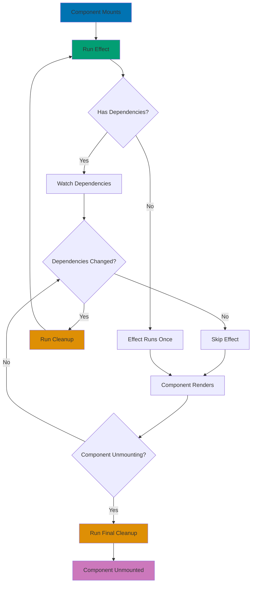

# React Hooks

## Quick Reference

**Navigation**: [Stack Libraries](../README.md) > [TypeScript React](./README.md) > Hooks

**Related Guides**:

- [Idioms](ex-soen-plwe-to-fere__idioms.md) - Hook usage patterns
- [State Management](ex-soen-plwe-to-fere__state-management.md) - Managing state
- [Performance](ex-soen-plwe-to-fere__performance.md) - Hook optimization
- [Best Practices](ex-soen-plwe-to-fere__best-practices.md) - Production standards

## Overview

React Hooks enable functional components to use state and lifecycle features. This guide covers all built-in hooks, custom hook patterns, and best practices for hook usage.

**Target Audience**: Developers building React applications with functional components, particularly for Islamic finance platforms requiring complex data management and side effects.

**React Version**: React 19.0 with TypeScript 5+

## useState

Manage local component state:

### Basic Usage

```typescript
export const DonationForm: React.FC = () => {
  // Simple value
  const [amount, setAmount] = useState<number>(0);

  // With type inference
  const [campaignId, setCampaignId] = useState('');

  // Complex object
  const [donor, setDonor] = useState<Donor>({
    name: '',
    email: '',
  });

  // Boolean
  const [isRecurring, setIsRecurring] = useState(false);

  return (
    <form>
      <input
        type="number"
        value={amount}
        onChange={e => setAmount(Number(e.target.value))}
      />
      <input
        type="checkbox"
        checked={isRecurring}
        onChange={e => setIsRecurring(e.target.checked)}
      />
    </form>
  );
};
```

### Functional Updates

Use when new state depends on previous state:

```typescript
export const Counter: React.FC = () => {
  const [count, setCount] = useState(0);

  // ✅ Good - functional update
  const increment = () => {
    setCount(prev => prev + 1);
  };

  // ✅ Good - multiple updates batched correctly
  const incrementByThree = () => {
    setCount(prev => prev + 1);
    setCount(prev => prev + 1);
    setCount(prev => prev + 1);
  };

  // ❌ Bad - uses stale value
  const incrementBad = () => {
    setCount(count + 1);
  };

  return (
    <div>
      <p>Count: {count}</p>
      <button onClick={increment}>+1</button>
      <button onClick={incrementByThree}>+3</button>
    </div>
  );
};
```

### Lazy Initialization

Expensive initialization only runs once:

```typescript
export const ExpensiveComponent: React.FC = () => {
  // ❌ Bad - runs on every render
  const [data, setData] = useState(expensiveComputation());

  // ✅ Good - runs only once
  const [data, setData] = useState(() => expensiveComputation());

  // Example: load from localStorage
  const [settings, setSettings] = useState(() => {
    const saved = localStorage.getItem('settings');
    return saved ? JSON.parse(saved) : defaultSettings;
  });

  return <div>{/* UI */}</div>;
};

function expensiveComputation() {
  console.log('Expensive computation running');
  return Array.from({ length: 10000 }, (_, i) => i);
}
```

## useEffect

Handle side effects (API calls, subscriptions, DOM updates):

### Basic Side Effects

```typescript
export const UserProfile: React.FC<{ userId: string }> = ({ userId }) => {
  const [user, setUser] = useState<User | null>(null);
  const [loading, setLoading] = useState(true);

  useEffect(() => {
    const fetchUser = async () => {
      setLoading(true);
      try {
        const data = await userApi.getById(userId);
        setUser(data);
      } catch (error) {
        console.error('Failed to fetch user:', error);
      } finally {
        setLoading(false);
      }
    };

    fetchUser();
  }, [userId]); // Re-run when userId changes

  if (loading) return <LoadingSpinner />;
  return <div>{user?.name}</div>;
};
```

### Cleanup Function

Clean up subscriptions, timers, and event listeners:

```typescript
export const Timer: React.FC = () => {
  const [seconds, setSeconds] = useState(0);

  useEffect(() => {
    const intervalId = setInterval(() => {
      setSeconds(prev => prev + 1);
    }, 1000);

    // Cleanup function
    return () => {
      clearInterval(intervalId);
      console.log('Timer cleaned up');
    };
  }, []); // Empty deps - runs once

  return <div>Seconds: {seconds}</div>;
};

// WebSocket subscription with cleanup
export const RealtimeDonations: React.FC = () => {
  const [donations, setDonations] = useState<Donation[]>([]);

  useEffect(() => {
    const ws = new WebSocket('wss://api.example.com/donations');

    ws.onmessage = (event) => {
      const newDonation = JSON.parse(event.data);
      setDonations(prev => [newDonation, ...prev]);
    };

    // Cleanup
    return () => {
      ws.close();
    };
  }, []);

  return (
    <ul>
      {donations.map(d => (
        <li key={d.id}>{d.amount}</li>
      ))}
    </ul>
  );
};
```

### useEffect Lifecycle



The lifecycle follows this pattern:

1. **Mount**: Effect runs after first render
2. **Update**: Effect runs after every render (if dependencies changed)
3. **Cleanup**: Runs before re-running effect or unmounting
4. **Unmount**: Final cleanup before component removal

### Dependency Array Rules

```typescript
export const DonationTracker: React.FC<{ campaignId: string }> = ({ campaignId }) => {
  const [donations, setDonations] = useState<Donation[]>([]);

  // ✅ Good - includes all dependencies
  useEffect(() => {
    fetchDonations(campaignId).then(setDonations);
  }, [campaignId]);

  // ❌ Bad - missing dependency
  useEffect(() => {
    fetchDonations(campaignId).then(setDonations);
  }, []); // ESLint warning

  // ✅ Good - empty deps when no external values used
  useEffect(() => {
    const timer = setInterval(() => {
      console.log('Tick');
    }, 1000);
    return () => clearInterval(timer);
  }, []);

  // ✅ Good - callback ref pattern for functions
  const handleFetch = useCallback(() => {
    fetchDonations(campaignId).then(setDonations);
  }, [campaignId]);

  useEffect(() => {
    handleFetch();
  }, [handleFetch]);

  return <div>{/* UI */}</div>;
};
```

### Common Patterns

```typescript
// Fetch data on mount
useEffect(() => {
  fetchData().then(setData);
}, []);

// Run on every render (usually avoid)
useEffect(() => {
  console.log("Component rendered");
});

// Run when specific value changes
useEffect(() => {
  saveToLocalStorage(settings);
}, [settings]);

// Sync with external system
useEffect(() => {
  const theme = window.matchMedia("(prefers-color-scheme: dark)");
  const handleChange = (e: MediaQueryListEvent) => {
    setDarkMode(e.matches);
  };

  theme.addEventListener("change", handleChange);
  return () => theme.removeEventListener("change", handleChange);
}, []);
```

### Race Condition Prevention

```typescript
export const UserSearch: React.FC = () => {
  const [query, setQuery] = useState('');
  const [results, setResults] = useState<User[]>([]);

  useEffect(() => {
    // Ignore flag for race condition
    let ignore = false;

    const searchUsers = async () => {
      const users = await userApi.search(query);

      // Only update if this effect hasn't been cleaned up
      if (!ignore) {
        setResults(users);
      }
    };

    if (query) {
      searchUsers();
    } else {
      setResults([]);
    }

    return () => {
      ignore = true; // Ignore results from outdated request
    };
  }, [query]);

  return (
    <div>
      <input value={query} onChange={e => setQuery(e.target.value)} />
      <ul>
        {results.map(user => (
          <li key={user.id}>{user.name}</li>
        ))}
      </ul>
    </div>
  );
};
```

## useContext

Access context values:

```typescript
// Create context
interface AuthContextValue {
  user: User | null;
  login: (email: string, password: string) => Promise<void>;
  logout: () => void;
}

const AuthContext = React.createContext<AuthContextValue | undefined>(undefined);

// Custom hook for context
export function useAuth() {
  const context = useContext(AuthContext);
  if (!context) {
    throw new Error('useAuth must be used within AuthProvider');
  }
  return context;
}

// Provider
export const AuthProvider: React.FC<{ children: React.ReactNode }> = ({ children }) => {
  const [user, setUser] = useState<User | null>(null);

  const login = async (email: string, password: string) => {
    const user = await authApi.login(email, password);
    setUser(user);
  };

  const logout = () => {
    authApi.logout();
    setUser(null);
  };

  return (
    <AuthContext.Provider value={{ user, login, logout }}>
      {children}
    </AuthContext.Provider>
  );
};

// Consumer
export const UserMenu: React.FC = () => {
  const { user, logout } = useAuth();

  if (!user) return null;

  return (
    <div>
      <span>Welcome, {user.name}</span>
      <button onClick={logout}>Logout</button>
    </div>
  );
};
```

## useReducer

Manage complex state logic:

```typescript
// State type
interface FormState {
  values: Record<string, any>;
  errors: Record<string, string>;
  touched: Record<string, boolean>;
  isSubmitting: boolean;
}

// Actions
type FormAction =
  | { type: 'SET_FIELD'; field: string; value: any }
  | { type: 'SET_ERROR'; field: string; error: string }
  | { type: 'TOUCH_FIELD'; field: string }
  | { type: 'SET_SUBMITTING'; isSubmitting: boolean }
  | { type: 'RESET' };

// Reducer
function formReducer(state: FormState, action: FormAction): FormState {
  switch (action.type) {
    case 'SET_FIELD':
      return {
        ...state,
        values: { ...state.values, [action.field]: action.value },
      };

    case 'SET_ERROR':
      return {
        ...state,
        errors: { ...state.errors, [action.field]: action.error },
      };

    case 'TOUCH_FIELD':
      return {
        ...state,
        touched: { ...state.touched, [action.field]: true },
      };

    case 'SET_SUBMITTING':
      return {
        ...state,
        isSubmitting: action.isSubmitting,
      };

    case 'RESET':
      return {
        values: {},
        errors: {},
        touched: {},
        isSubmitting: false,
      };

    default:
      return state;
  }
}

// Component using reducer
export const DonationForm: React.FC = () => {
  const [state, dispatch] = useReducer(formReducer, {
    values: {},
    errors: {},
    touched: {},
    isSubmitting: false,
  });

  const handleChange = (field: string, value: any) => {
    dispatch({ type: 'SET_FIELD', field, value });
    dispatch({ type: 'TOUCH_FIELD', field });
  };

  const handleSubmit = async (e: React.FormEvent) => {
    e.preventDefault();
    dispatch({ type: 'SET_SUBMITTING', isSubmitting: true });

    try {
      await donationApi.create(state.values);
      dispatch({ type: 'RESET' });
    } catch (error) {
      dispatch({ type: 'SET_ERROR', field: 'general', error: error.message });
    } finally {
      dispatch({ type: 'SET_SUBMITTING', isSubmitting: false });
    }
  };

  return (
    <form onSubmit={handleSubmit}>
      <input
        value={state.values.amount || ''}
        onChange={e => handleChange('amount', e.target.value)}
      />
      {state.touched.amount && state.errors.amount && (
        <span className="error">{state.errors.amount}</span>
      )}
      <button type="submit" disabled={state.isSubmitting}>
        Submit
      </button>
    </form>
  );
};
```

## useMemo

Memoize expensive computations:

```typescript
export const DonationAnalytics: React.FC<{ donations: Donation[] }> = ({ donations }) => {
  // ❌ Expensive - recalculates on every render
  const stats = calculateStats(donations);

  // ✅ Memoized - only recalculates when donations change
  const stats = useMemo(() => calculateStats(donations), [donations]);

  // Complex calculation
  const monthlyTrends = useMemo(() => {
    const grouped = donations.reduce((acc, donation) => {
      const month = format(donation.createdAt, 'yyyy-MM');
      acc[month] = (acc[month] || 0) + donation.amount;
      return acc;
    }, {} as Record<string, number>);

    return Object.entries(grouped).map(([month, total]) => ({
      month,
      total,
    }));
  }, [donations]);

  return (
    <div>
      <h2>Total: {stats.total}</h2>
      <Chart data={monthlyTrends} />
    </div>
  );
};

function calculateStats(donations: Donation[]) {
  console.log('Calculating stats'); // See when this runs

  return {
    total: donations.reduce((sum, d) => sum + d.amount, 0),
    average: donations.length > 0
      ? donations.reduce((sum, d) => sum + d.amount, 0) / donations.length
      : 0,
    count: donations.length,
  };
}
```

## useCallback

Memoize function references:

```typescript
export const TodoList: React.FC = () => {
  const [todos, setTodos] = useState<Todo[]>([]);
  const [filter, setFilter] = useState<'all' | 'active' | 'completed'>('all');

  // ❌ Bad - new function on every render
  const handleToggle = (id: string) => {
    setTodos(prev =>
      prev.map(todo =>
        todo.id === id ? { ...todo, completed: !todo.completed } : todo
      )
    );
  };

  // ✅ Good - memoized function
  const handleToggle = useCallback((id: string) => {
    setTodos(prev =>
      prev.map(todo =>
        todo.id === id ? { ...todo, completed: !todo.completed } : todo
      )
    );
  }, []); // No dependencies

  // With dependencies
  const handleFilter = useCallback((newFilter: 'all' | 'active' | 'completed') => {
    console.log('Previous filter:', filter);
    setFilter(newFilter);
  }, [filter]);

  const filteredTodos = useMemo(() => {
    switch (filter) {
      case 'active':
        return todos.filter(t => !t.completed);
      case 'completed':
        return todos.filter(t => t.completed);
      default:
        return todos;
    }
  }, [todos, filter]);

  return (
    <div>
      <FilterButtons onFilter={handleFilter} />
      {filteredTodos.map(todo => (
        <TodoItem
          key={todo.id}
          todo={todo}
          onToggle={handleToggle} // Same reference across renders
        />
      ))}
    </div>
  );
};

// Child component only re-renders when todo changes
const TodoItem = React.memo<{ todo: Todo; onToggle: (id: string) => void }>(
  ({ todo, onToggle }) => {
    console.log('TodoItem render:', todo.id);

    return (
      <div>
        <input
          type="checkbox"
          checked={todo.completed}
          onChange={() => onToggle(todo.id)}
        />
        <span>{todo.text}</span>
      </div>
    );
  }
);
```

## useRef

Store mutable values without re-rendering:

### DOM References

```typescript
export const FocusInput: React.FC = () => {
  const inputRef = useRef<HTMLInputElement>(null);

  const focusInput = () => {
    inputRef.current?.focus();
  };

  return (
    <div>
      <input ref={inputRef} />
      <button onClick={focusInput}>Focus Input</button>
    </div>
  );
};

// Scroll to element
export const ScrollToSection: React.FC = () => {
  const sectionRef = useRef<HTMLDivElement>(null);

  const scrollToSection = () => {
    sectionRef.current?.scrollIntoView({ behavior: 'smooth' });
  };

  return (
    <div>
      <button onClick={scrollToSection}>Scroll to Section</button>
      <div style={{ height: '100vh' }}>Spacer</div>
      <div ref={sectionRef}>Target Section</div>
    </div>
  );
};
```

### Storing Mutable Values

```typescript
export const IntervalCounter: React.FC = () => {
  const [count, setCount] = useState(0);
  const intervalRef = useRef<number | null>(null);

  const startInterval = () => {
    if (intervalRef.current !== null) return;

    intervalRef.current = window.setInterval(() => {
      setCount(prev => prev + 1);
    }, 1000);
  };

  const stopInterval = () => {
    if (intervalRef.current !== null) {
      clearInterval(intervalRef.current);
      intervalRef.current = null;
    }
  };

  useEffect(() => {
    return () => {
      // Cleanup on unmount
      if (intervalRef.current !== null) {
        clearInterval(intervalRef.current);
      }
    };
  }, []);

  return (
    <div>
      <p>Count: {count}</p>
      <button onClick={startInterval}>Start</button>
      <button onClick={stopInterval}>Stop</button>
    </div>
  );
};

// Previous value tracking
export const ValueTracker: React.FC<{ value: number }> = ({ value }) => {
  const prevValueRef = useRef<number>();

  useEffect(() => {
    prevValueRef.current = value;
  }, [value]);

  const prevValue = prevValueRef.current;

  return (
    <div>
      <p>Current: {value}</p>
      <p>Previous: {prevValue ?? 'N/A'}</p>
      <p>Changed: {value !== prevValue ? 'Yes' : 'No'}</p>
    </div>
  );
};
```

## useImperativeHandle

Customize ref exposure to parent:

```typescript
interface VideoPlayerRef {
  play: () => void;
  pause: () => void;
  seek: (time: number) => void;
}

interface VideoPlayerProps {
  src: string;
}

export const VideoPlayer = forwardRef<VideoPlayerRef, VideoPlayerProps>(
  ({ src }, ref) => {
    const videoRef = useRef<HTMLVideoElement>(null);

    useImperativeHandle(ref, () => ({
      play: () => {
        videoRef.current?.play();
      },
      pause: () => {
        videoRef.current?.pause();
      },
      seek: (time: number) => {
        if (videoRef.current) {
          videoRef.current.currentTime = time;
        }
      },
    }));

    return <video ref={videoRef} src={src} />;
  }
);

// Usage
export const VideoController: React.FC = () => {
  const playerRef = useRef<VideoPlayerRef>(null);

  return (
    <div>
      <VideoPlayer ref={playerRef} src="/video.mp4" />
      <button onClick={() => playerRef.current?.play()}>Play</button>
      <button onClick={() => playerRef.current?.pause()}>Pause</button>
      <button onClick={() => playerRef.current?.seek(30)}>Skip to 30s</button>
    </div>
  );
};
```

## useLayoutEffect

Synchronous DOM updates before paint:

```typescript
export const Tooltip: React.FC<{ children: React.ReactNode }> = ({ children }) => {
  const [position, setPosition] = useState({ top: 0, left: 0 });
  const tooltipRef = useRef<HTMLDivElement>(null);
  const targetRef = useRef<HTMLDivElement>(null);

  // useLayoutEffect runs synchronously after DOM mutations
  useLayoutEffect(() => {
    const tooltip = tooltipRef.current;
    const target = targetRef.current;

    if (!tooltip || !target) return;

    const targetRect = target.getBoundingClientRect();
    const tooltipRect = tooltip.getBoundingClientRect();

    setPosition({
      top: targetRect.bottom + 8,
      left: targetRect.left + targetRect.width / 2 - tooltipRect.width / 2,
    });
  }, [children]);

  return (
    <div>
      <div ref={targetRef}>{children}</div>
      <div
        ref={tooltipRef}
        style={{
          position: 'fixed',
          top: position.top,
          left: position.left,
        }}
      >
        Tooltip content
      </div>
    </div>
  );
};
```

## useDebugValue

Label custom hooks in React DevTools:

```typescript
function useOnlineStatus() {
  const [isOnline, setIsOnline] = useState(navigator.onLine);

  useEffect(() => {
    const handleOnline = () => setIsOnline(true);
    const handleOffline = () => setIsOnline(false);

    window.addEventListener("online", handleOnline);
    window.addEventListener("offline", handleOffline);

    return () => {
      window.removeEventListener("online", handleOnline);
      window.removeEventListener("offline", handleOffline);
    };
  }, []);

  // Show "Online" or "Offline" in DevTools
  useDebugValue(isOnline ? "Online" : "Offline");

  return isOnline;
}

// With formatter function (expensive computation)
function useUser(userId: string) {
  const [user, setUser] = useState<User | null>(null);

  useEffect(() => {
    fetchUser(userId).then(setUser);
  }, [userId]);

  // Format only when DevTools is open
  useDebugValue(user, (u) => (u ? `User: ${u.name} (${u.email})` : "No user"));

  return user;
}
```

## Custom Hooks

Extract reusable logic:

### useFetch Hook

```typescript
interface UseFetchOptions<T> {
  initialData?: T;
  onSuccess?: (data: T) => void;
  onError?: (error: Error) => void;
}

interface UseFetchReturn<T> {
  data: T | undefined;
  loading: boolean;
  error: Error | null;
  refetch: () => void;
}

export function useFetch<T>(
  url: string,
  options?: UseFetchOptions<T>
): UseFetchReturn<T> {
  const [data, setData] = useState<T | undefined>(options?.initialData);
  const [loading, setLoading] = useState(true);
  const [error, setError] = useState<Error | null>(null);
  const [refetchIndex, setRefetchIndex] = useState(0);

  useEffect(() => {
    let cancelled = false;

    const fetchData = async () => {
      setLoading(true);
      setError(null);

      try {
        const response = await fetch(url);
        if (!response.ok) throw new Error(response.statusText);

        const json = await response.json();

        if (!cancelled) {
          setData(json);
          options?.onSuccess?.(json);
        }
      } catch (err) {
        if (!cancelled) {
          const error = err as Error;
          setError(error);
          options?.onError?.(error);
        }
      } finally {
        if (!cancelled) {
          setLoading(false);
        }
      }
    };

    fetchData();

    return () => {
      cancelled = true;
    };
  }, [url, refetchIndex]);

  const refetch = useCallback(() => {
    setRefetchIndex(prev => prev + 1);
  }, []);

  return { data, loading, error, refetch };
}

// Usage
export const DonationsList: React.FC = () => {
  const { data, loading, error, refetch } = useFetch<Donation[]>(
    '/api/donations',
    {
      onSuccess: (donations) => {
        console.log(`Loaded ${donations.length} donations`);
      },
    }
  );

  if (loading) return <LoadingSpinner />;
  if (error) return <ErrorMessage error={error} />;

  return (
    <div>
      <button onClick={refetch}>Refresh</button>
      <ul>
        {data?.map(d => (
          <li key={d.id}>{d.campaignName}</li>
        ))}
      </ul>
    </div>
  );
};
```

### useLocalStorage Hook

```typescript
export function useLocalStorage<T>(
  key: string,
  initialValue: T
): [T, (value: T | ((prev: T) => T)) => void] {
  // State to store our value
  const [storedValue, setStoredValue] = useState<T>(() => {
    try {
      const item = window.localStorage.getItem(key);
      return item ? JSON.parse(item) : initialValue;
    } catch (error) {
      console.error('Error reading from localStorage:', error);
      return initialValue;
    }
  });

  // Return a wrapped version of useState's setter
  const setValue = (value: T | ((prev: T) => T)) => {
    try {
      // Allow value to be a function (same API as useState)
      const valueToStore = value instanceof Function ? value(storedValue) : value;

      setStoredValue(valueToStore);
      window.localStorage.setItem(key, JSON.stringify(valueToStore));
    } catch (error) {
      console.error('Error writing to localStorage:', error);
    }
  };

  return [storedValue, setValue];
}

// Usage
export const SettingsPanel: React.FC = () => {
  const [theme, setTheme] = useLocalStorage<'light' | 'dark'>('theme', 'light');
  const [language, setLanguage] = useLocalStorage<'en' | 'ar'>('language', 'en');

  return (
    <div>
      <select value={theme} onChange={e => setTheme(e.target.value as 'light' | 'dark')}>
        <option value="light">Light</option>
        <option value="dark">Dark</option>
      </select>

      <select value={language} onChange={e => setLanguage(e.target.value as 'en' | 'ar')}>
        <option value="en">English</option>
        <option value="ar">Arabic</option>
      </select>
    </div>
  );
};
```

### useDebounce Hook

```typescript
export function useDebounce<T>(value: T, delay: number): T {
  const [debouncedValue, setDebouncedValue] = useState<T>(value);

  useEffect(() => {
    const handler = setTimeout(() => {
      setDebouncedValue(value);
    }, delay);

    return () => {
      clearTimeout(handler);
    };
  }, [value, delay]);

  return debouncedValue;
}

// Usage
export const SearchBar: React.FC = () => {
  const [query, setQuery] = useState('');
  const debouncedQuery = useDebounce(query, 500);
  const [results, setResults] = useState<string[]>([]);

  useEffect(() => {
    if (debouncedQuery) {
      searchApi.search(debouncedQuery).then(setResults);
    } else {
      setResults([]);
    }
  }, [debouncedQuery]);

  return (
    <div>
      <input
        value={query}
        onChange={e => setQuery(e.target.value)}
        placeholder="Search..."
      />
      <ul>
        {results.map((result, i) => (
          <li key={i}>{result}</li>
        ))}
      </ul>
    </div>
  );
};
```

### useAsync Hook

```typescript
type AsyncState<T> =
  | { status: 'idle'; data: undefined; error: undefined }
  | { status: 'loading'; data: undefined; error: undefined }
  | { status: 'success'; data: T; error: undefined }
  | { status: 'error'; data: undefined; error: Error };

export function useAsync<T>(
  asyncFunction: () => Promise<T>,
  immediate = true
) {
  const [state, setState] = useState<AsyncState<T>>({
    status: 'idle',
    data: undefined,
    error: undefined,
  });

  const execute = useCallback(async () => {
    setState({ status: 'loading', data: undefined, error: undefined });

    try {
      const data = await asyncFunction();
      setState({ status: 'success', data, error: undefined });
    } catch (error) {
      setState({ status: 'error', data: undefined, error: error as Error });
    }
  }, [asyncFunction]);

  useEffect(() => {
    if (immediate) {
      execute();
    }
  }, [execute, immediate]);

  return { ...state, execute };
}

// Usage
export const DataLoader: React.FC = () => {
  const { status, data, error, execute } = useAsync(
    () => fetch('/api/data').then(res => res.json()),
    true
  );

  if (status === 'loading') return <LoadingSpinner />;
  if (status === 'error') return <ErrorMessage error={error} />;
  if (status === 'success') return <DataDisplay data={data} />;

  return <button onClick={execute}>Load Data</button>;
};
```

## Hook Rules

### Rules of Hooks

1. **Only call hooks at the top level** - Don't call inside loops, conditions, or nested functions
2. **Only call hooks from React functions** - Call from function components or custom hooks

```typescript
// ❌ Bad - conditional hook
function BadComponent({ condition }) {
  if (condition) {
    const [state, setState] = useState(0); // Error!
  }
  return <div />;
}

// ✅ Good - hook at top level
function GoodComponent({ condition }) {
  const [state, setState] = useState(0);

  if (condition) {
    // Use state conditionally
    setState(1);
  }

  return <div />;
}

// ❌ Bad - hook in loop
function BadList({ items }) {
  items.forEach(item => {
    const [state, setState] = useState(item); // Error!
  });
  return <div />;
}

// ✅ Good - separate component for each item
function GoodList({ items }) {
  return (
    <div>
      {items.map(item => (
        <ItemComponent key={item.id} item={item} />
      ))}
    </div>
  );
}

function ItemComponent({ item }) {
  const [state, setState] = useState(item);
  return <div>{state}</div>;
}
```

## Related Documentation

- **[Idioms](ex-soen-plwe-to-fere__idioms.md)** - Hook usage patterns
- **[State Management](ex-soen-plwe-to-fere__state-management.md)** - Managing state
- **[Performance](ex-soen-plwe-to-fere__performance.md)** - Hook optimization
- **[Component Architecture](ex-soen-plwe-to-fere__component-architecture.md)** - Component patterns
- **[Best Practices](ex-soen-plwe-to-fere__best-practices.md)** - Production standards

---

**Last Updated**: 2026-01-25
