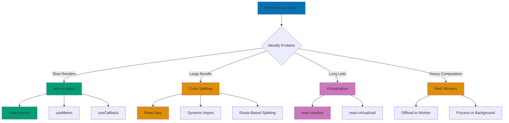

# React Performance

## Quick Reference

**Navigation**: [Stack Libraries](../README.md) > [TypeScript React](./README.md) > Performance

**Related Guides**:

- [Best Practices](ex-soen-plwe-to-fere__best-practices.md) - Performance standards
- [Idioms](ex-soen-plwe-to-fere__idioms.md) - useMemo/useCallback patterns
- [Hooks](ex-soen-plwe-to-fere__hooks.md) - Hook optimization
- [Component Architecture](ex-soen-plwe-to-fere__component-architecture.md) - Component patterns

## Overview

Performance optimization ensures React applications remain responsive as complexity grows. This guide covers memoization, code splitting, lazy loading, virtualization, and profiling techniques.

**Target Audience**: Developers building performant React applications, particularly for Islamic finance platforms with large data sets, complex calculations, and real-time updates.

**React Version**: React 19.0 with TypeScript 5+

### Performance Optimization Strategy



**Optimization Tools**:

- **Memoization** - Prevent unnecessary re-renders and recalculations
- **Code Splitting** - Load code on demand, reduce initial bundle size
- **Virtualization** - Render only visible items in large lists
- **Web Workers** - Offload heavy computations to background threads

## Memoization

### React.memo

Prevent unnecessary re-renders of components:

```typescript
// Without memo - re-renders on every parent render
export const DonationCard: React.FC<{ donation: Donation }> = ({ donation }) => {
  console.log('DonationCard render');

  return (
    <div className="donation-card">
      <h3>{donation.campaignName}</h3>
      <p>{donation.amount}</p>
    </div>
  );
};

// With memo - only re-renders when donation changes
export const DonationCard = React.memo<{ donation: Donation }>(
  ({ donation }) => {
    console.log('DonationCard render');

    return (
      <div className="donation-card">
        <h3>{donation.campaignName}</h3>
        <p>{donation.amount}</p>
      </div>
    );
  }
);

// Parent component
export const DonationsList: React.FC = () => {
  const [filter, setFilter] = useState('all');
  const donations = useDonations();

  return (
    <div>
      <select value={filter} onChange={e => setFilter(e.target.value)}>
        <option value="all">All</option>
        <option value="recent">Recent</option>
      </select>

      {/* DonationCard won't re-render when filter changes */}
      {donations.map(donation => (
        <DonationCard key={donation.id} donation={donation} />
      ))}
    </div>
  );
};
```

### Custom Comparison

```typescript
interface DonationCardProps {
  donation: Donation;
  onEdit: (id: string) => void;
}

// Custom comparison function
export const DonationCard = React.memo<DonationCardProps>(
  ({ donation, onEdit }) => (
    <div>
      <h3>{donation.campaignName}</h3>
      <button onClick={() => onEdit(donation.id)}>Edit</button>
    </div>
  ),
  (prevProps, nextProps) => {
    // Only re-render if these specific fields change
    return (
      prevProps.donation.id === nextProps.donation.id &&
      prevProps.donation.campaignName === nextProps.donation.campaignName &&
      prevProps.donation.amount === nextProps.donation.amount
    );
  }
);
```

### useMemo for Expensive Computations

```typescript
export const DonationAnalytics: React.FC<{ donations: Donation[] }> = ({
  donations,
}) => {
  // ❌ Recalculates on every render
  const stats = calculateStatistics(donations);

  // ✅ Only recalculates when donations change
  const stats = useMemo(() => calculateStatistics(donations), [donations]);

  // Multiple expensive computations
  const monthlyTrends = useMemo(() => {
    const grouped = donations.reduce((acc, donation) => {
      const month = format(donation.createdAt, 'yyyy-MM');
      if (!acc[month]) acc[month] = [];
      acc[month].push(donation);
      return acc;
    }, {} as Record<string, Donation[]>);

    return Object.entries(grouped).map(([month, donations]) => ({
      month,
      total: donations.reduce((sum, d) => sum + d.amount, 0),
      count: donations.length,
    }));
  }, [donations]);

  const topCampaigns = useMemo(() => {
    const campaignTotals = donations.reduce((acc, donation) => {
      acc[donation.campaignId] = (acc[donation.campaignId] || 0) + donation.amount;
      return acc;
    }, {} as Record<string, number>);

    return Object.entries(campaignTotals)
      .sort(([, a], [, b]) => b - a)
      .slice(0, 5);
  }, [donations]);

  return (
    <div>
      <StatsDisplay stats={stats} />
      <TrendsChart data={monthlyTrends} />
      <TopCampaigns campaigns={topCampaigns} />
    </div>
  );
};

function calculateStatistics(donations: Donation[]) {
  console.log('Calculating statistics...'); // See when this runs

  return {
    total: donations.reduce((sum, d) => sum + d.amount, 0),
    average: donations.length > 0
      ? donations.reduce((sum, d) => sum + d.amount, 0) / donations.length
      : 0,
    count: donations.length,
    recurring: donations.filter(d => d.isRecurring).length,
  };
}
```

### useCallback for Stable Function References

```typescript
export const TodoList: React.FC = () => {
  const [todos, setTodos] = useState<Todo[]>([]);
  const [filter, setFilter] = useState('all');

  // ❌ New function on every render
  const handleToggle = (id: string) => {
    setTodos(prev =>
      prev.map(todo =>
        todo.id === id ? { ...todo, completed: !todo.completed } : todo
      )
    );
  };

  // ✅ Stable function reference
  const handleToggle = useCallback((id: string) => {
    setTodos(prev =>
      prev.map(todo =>
        todo.id === id ? { ...todo, completed: !todo.completed } : todo
      )
    );
  }, []); // No dependencies

  const handleDelete = useCallback((id: string) => {
    setTodos(prev => prev.filter(todo => todo.id !== id));
  }, []);

  // Memoized filtered list
  const filteredTodos = useMemo(() => {
    switch (filter) {
      case 'active':
        return todos.filter(t => !t.completed);
      case 'completed':
        return todos.filter(t => t.completed);
      default:
        return todos;
    }
  }, [todos, filter]);

  return (
    <div>
      <FilterButtons filter={filter} onFilterChange={setFilter} />
      {filteredTodos.map(todo => (
        <TodoItem
          key={todo.id}
          todo={todo}
          onToggle={handleToggle}
          onDelete={handleDelete}
        />
      ))}
    </div>
  );
};

// Memoized child component
const TodoItem = React.memo<{
  todo: Todo;
  onToggle: (id: string) => void;
  onDelete: (id: string) => void;
}>(({ todo, onToggle, onDelete }) => {
  console.log('TodoItem render:', todo.id);

  return (
    <div>
      <input
        type="checkbox"
        checked={todo.completed}
        onChange={() => onToggle(todo.id)}
      />
      <span>{todo.text}</span>
      <button onClick={() => onDelete(todo.id)}>Delete</button>
    </div>
  );
});
```

## Code Splitting

### Dynamic Imports

```typescript
import { lazy, Suspense } from 'react';

// Lazy load components
const ZakatReports = lazy(() => import('./features/zakat/ZakatReports'));
const DonationCharts = lazy(() => import('./features/donations/DonationCharts'));
const AdminPanel = lazy(() => import('./features/admin/AdminPanel'));

export const Dashboard: React.FC = () => {
  const { user } = useAuth();

  return (
    <div className="dashboard">
      <h1>Dashboard</h1>

      <Suspense fallback={<LoadingSpinner />}>
        <DonationCharts />
      </Suspense>

      <Suspense fallback={<div>Loading reports...</div>}>
        <ZakatReports />
      </Suspense>

      {user?.isAdmin && (
        <Suspense fallback={<div>Loading admin panel...</div>}>
          <AdminPanel />
        </Suspense>
      )}
    </div>
  );
};
```

### Route-Based Code Splitting

```typescript
import { lazy, Suspense } from 'react';
import { Routes, Route } from 'react-router-dom';

// Lazy load route components
const Home = lazy(() => import('./pages/Home'));
const Dashboard = lazy(() => import('./pages/Dashboard'));
const ZakatCalculator = lazy(() => import('./pages/ZakatCalculator'));
const DonationHistory = lazy(() => import('./pages/DonationHistory'));
const Settings = lazy(() => import('./pages/Settings'));

export const AppRoutes: React.FC = () => (
  <Suspense fallback={<PageLoader />}>
    <Routes>
      <Route path="/" element={<Home />} />
      <Route path="/dashboard" element={<Dashboard />} />
      <Route path="/zakat" element={<ZakatCalculator />} />
      <Route path="/donations" element={<DonationHistory />} />
      <Route path="/settings" element={<Settings />} />
    </Routes>
  </Suspense>
);

// Page loader component
const PageLoader: React.FC = () => (
  <div className="page-loader">
    <LoadingSpinner />
    <p>Loading page...</p>
  </div>
);
```

### Component-Level Splitting

```typescript
import { lazy, Suspense, useState } from 'react';

// Lazy load heavy component
const ChartComponent = lazy(() => import('./ChartComponent'));

export const Analytics: React.FC = () => {
  const [showChart, setShowChart] = useState(false);

  return (
    <div>
      <button onClick={() => setShowChart(true)}>
        Show Chart
      </button>

      {showChart && (
        <Suspense fallback={<div>Loading chart...</div>}>
          <ChartComponent />
        </Suspense>
      )}
    </div>
  );
};
```

## Virtualization

### Virtual List for Large Data Sets

```typescript
import { FixedSizeList } from 'react-window';

interface DonationsVirtualListProps {
  donations: Donation[];
}

export const DonationsVirtualList: React.FC<DonationsVirtualListProps> = ({
  donations,
}) => {
  const Row = ({ index, style }: { index: number; style: React.CSSProperties }) => {
    const donation = donations[index];

    return (
      <div style={style} className="donation-row">
        <span>{donation.campaignName}</span>
        <span>{donation.amount}</span>
        <span>{format(donation.createdAt, 'yyyy-MM-dd')}</span>
      </div>
    );
  };

  return (
    <FixedSizeList
      height={600}
      itemCount={donations.length}
      itemSize={60}
      width="100%"
    >
      {Row}
    </FixedSizeList>
  );
};
```

### Variable Size List

```typescript
import { VariableSizeList } from 'react-window';
import { useRef } from 'react';

export const DonationsVariableList: React.FC<{ donations: Donation[] }> = ({
  donations,
}) => {
  const listRef = useRef<VariableSizeList>(null);

  // Calculate row height based on content
  const getItemSize = (index: number) => {
    const donation = donations[index];
    const baseHeight = 60;
    const messageHeight = donation.message ? 40 : 0;
    return baseHeight + messageHeight;
  };

  const Row = ({ index, style }: { index: number; style: React.CSSProperties }) => {
    const donation = donations[index];

    return (
      <div style={style} className="donation-row">
        <h4>{donation.campaignName}</h4>
        <p>Amount: {donation.amount}</p>
        {donation.message && <p className="message">{donation.message}</p>}
      </div>
    );
  };

  return (
    <VariableSizeList
      ref={listRef}
      height={600}
      itemCount={donations.length}
      itemSize={getItemSize}
      width="100%"
    >
      {Row}
    </VariableSizeList>
  );
};
```

## Debouncing and Throttling

### Debounce Input

```typescript
import { useState, useEffect } from 'react';

function useDebounce<T>(value: T, delay: number): T {
  const [debouncedValue, setDebouncedValue] = useState(value);

  useEffect(() => {
    const handler = setTimeout(() => {
      setDebouncedValue(value);
    }, delay);

    return () => clearTimeout(handler);
  }, [value, delay]);

  return debouncedValue;
}

// Usage
export const SearchBar: React.FC = () => {
  const [query, setQuery] = useState('');
  const debouncedQuery = useDebounce(query, 500);
  const [results, setResults] = useState<Campaign[]>([]);

  // Only search when debounced query changes
  useEffect(() => {
    if (debouncedQuery) {
      searchCampaigns(debouncedQuery).then(setResults);
    } else {
      setResults([]);
    }
  }, [debouncedQuery]);

  return (
    <div>
      <input
        type="text"
        value={query}
        onChange={e => setQuery(e.target.value)}
        placeholder="Search campaigns..."
      />
      <ul>
        {results.map(campaign => (
          <li key={campaign.id}>{campaign.name}</li>
        ))}
      </ul>
    </div>
  );
};
```

### Throttle Events

```typescript
import { useRef, useEffect } from 'react';

function useThrottle<T extends (...args: any[]) => void>(
  callback: T,
  delay: number
): T {
  const lastRun = useRef(Date.now());

  return useRef(((...args: Parameters<T>) => {
    const now = Date.now();

    if (now - lastRun.current >= delay) {
      callback(...args);
      lastRun.current = now;
    }
  }) as T).current;
}

// Usage
export const ScrollTracker: React.FC = () => {
  const [scrollPosition, setScrollPosition] = useState(0);

  const handleScroll = useThrottle(() => {
    setScrollPosition(window.scrollY);
  }, 100);

  useEffect(() => {
    window.addEventListener('scroll', handleScroll);
    return () => window.removeEventListener('scroll', handleScroll);
  }, [handleScroll]);

  return <div>Scroll position: {scrollPosition}px</div>;
};
```

## Lazy Loading

### Image Lazy Loading

```typescript
import { useState, useEffect, useRef } from 'react';

interface LazyImageProps {
  src: string;
  alt: string;
  placeholder?: string;
}

export const LazyImage: React.FC<LazyImageProps> = ({
  src,
  alt,
  placeholder = '/placeholder.png',
}) => {
  const [imageSrc, setImageSrc] = useState(placeholder);
  const [isLoaded, setIsLoaded] = useState(false);
  const imgRef = useRef<HTMLImageElement>(null);

  useEffect(() => {
    const observer = new IntersectionObserver(
      (entries) => {
        entries.forEach(entry => {
          if (entry.isIntersecting) {
            setImageSrc(src);
            observer.disconnect();
          }
        });
      },
      { rootMargin: '100px' }
    );

    if (imgRef.current) {
      observer.observe(imgRef.current);
    }

    return () => observer.disconnect();
  }, [src]);

  return (
     setIsLoaded(true)}
    />
  );
};
```

### Data Lazy Loading (Infinite Scroll)

```typescript
import { useState, useEffect, useRef, useCallback } from 'react';

interface UseInfiniteScrollOptions {
  threshold?: number;
  rootMargin?: string;
}

function useInfiniteScroll(
  callback: () => void,
  options: UseInfiniteScrollOptions = {}
) {
  const { threshold = 1.0, rootMargin = '0px' } = options;
  const observer = useRef<IntersectionObserver>();

  const lastElementRef = useCallback(
    (node: HTMLElement | null) => {
      if (observer.current) observer.current.disconnect();

      observer.current = new IntersectionObserver(
        (entries) => {
          if (entries[0].isIntersecting) {
            callback();
          }
        },
        { threshold, rootMargin }
      );

      if (node) observer.current.observe(node);
    },
    [callback, threshold, rootMargin]
  );

  return lastElementRef;
}

// Usage
export const InfiniteDonationsList: React.FC = () => {
  const [donations, setDonations] = useState<Donation[]>([]);
  const [page, setPage] = useState(0);
  const [hasMore, setHasMore] = useState(true);
  const [loading, setLoading] = useState(false);

  const loadMore = useCallback(async () => {
    if (loading || !hasMore) return;

    setLoading(true);
    try {
      const newDonations = await donationApi.getPage(page, 20);
      setDonations(prev => [...prev, ...newDonations]);
      setPage(prev => prev + 1);
      setHasMore(newDonations.length === 20);
    } catch (error) {
      console.error('Failed to load donations:', error);
    } finally {
      setLoading(false);
    }
  }, [page, loading, hasMore]);

  const lastElementRef = useInfiniteScroll(loadMore);

  useEffect(() => {
    loadMore();
  }, []); // Initial load

  return (
    <div>
      {donations.map((donation, index) => {
        // Attach ref to last element
        if (index === donations.length - 1) {
          return (
            <div ref={lastElementRef} key={donation.id}>
              <DonationCard donation={donation} />
            </div>
          );
        }

        return (
          <div key={donation.id}>
            <DonationCard donation={donation} />
          </div>
        );
      })}

      {loading && <LoadingSpinner />}
      {!hasMore && <div>No more donations</div>}
    </div>
  );
};
```

## Bundle Size Optimization

### Tree Shaking

```typescript
// ❌ Bad - imports entire library
import _ from "lodash";

const sorted = _.sortBy(items, "name");

// ✅ Good - imports only what's needed
import sortBy from "lodash/sortBy";

const sorted = sortBy(items, "name");

// ✅ Better - use native methods when possible
const sorted = [...items].sort((a, b) => a.name.localeCompare(b.name));
```

### Conditional Imports

```typescript
export const AdminDashboard: React.FC = () => {
  const [showCharts, setShowCharts] = useState(false);
  const [ChartsComponent, setChartsComponent] = useState<React.ComponentType | null>(
    null
  );

  const loadCharts = async () => {
    if (!ChartsComponent) {
      const module = await import('./HeavyChartsComponent');
      setChartsComponent(() => module.default);
    }
    setShowCharts(true);
  };

  return (
    <div>
      <button onClick={loadCharts}>Show Charts</button>

      {showCharts && ChartsComponent && (
        <Suspense fallback={<LoadingSpinner />}>
          <ChartsComponent />
        </Suspense>
      )}
    </div>
  );
};
```

## Profiling

### React DevTools Profiler

```typescript
// Enable profiling in production build
// vite.config.ts
export default defineConfig({
  plugins: [react()],
  build: {
    sourcemap: true,
  },
  define: {
    // Enable profiler in production
    __REACT_DEVTOOLS_GLOBAL_HOOK__: '({ isDisabled: false })',
  },
});

// Wrap components to profile
import { Profiler } from 'react';

function onRenderCallback(
  id: string,
  phase: 'mount' | 'update',
  actualDuration: number,
  baseDuration: number,
  startTime: number,
  commitTime: number
) {
  console.log({
    id,
    phase,
    actualDuration,
    baseDuration,
  });

  // Send to analytics
  if (actualDuration > 100) {
    analytics.track('slow_render', {
      component: id,
      duration: actualDuration,
      phase,
    });
  }
}

export const App: React.FC = () => (
  <Profiler id="App" onRender={onRenderCallback}>
    <Router>
      <Routes />
    </Router>
  </Profiler>
);

// Profile specific components
export const DashboardPage: React.FC = () => (
  <div>
    <Profiler id="DonationsList" onRender={onRenderCallback}>
      <DonationsList />
    </Profiler>

    <Profiler id="ZakatCalculator" onRender={onRenderCallback}>
      <ZakatCalculator />
    </Profiler>
  </div>
);
```

### Performance Monitoring

```typescript
// Custom performance hook
function usePerformanceMonitor(componentName: string) {
  useEffect(() => {
    const startTime = performance.now();

    return () => {
      const endTime = performance.now();
      const duration = endTime - startTime;

      if (duration > 16) { // Longer than 1 frame
        console.warn(`${componentName} took ${duration.toFixed(2)}ms`);
      }
    };
  });
}

// Usage
export const ExpensiveComponent: React.FC = () => {
  usePerformanceMonitor('ExpensiveComponent');

  const expensiveComputation = () => {
    // Heavy calculation
    return Array.from({ length: 10000 }, (_, i) => i).reduce((sum, n) => sum + n, 0);
  };

  return <div>{expensiveComputation()}</div>;
};
```

## Optimization Checklist

### Component Optimization

```typescript
// ✅ Optimized component
export const DonationCard = React.memo<DonationCardProps>(
  ({ donation, onEdit }) => {
    // Memoize expensive computations
    const formattedAmount = useMemo(
      () => formatCurrency(donation.amount, donation.currency),
      [donation.amount, donation.currency]
    );

    const relativeTime = useMemo(
      () => formatRelativeTime(donation.createdAt),
      [donation.createdAt]
    );

    // Memoize callbacks
    const handleEdit = useCallback(() => {
      onEdit(donation.id);
    }, [donation.id, onEdit]);

    return (
      <div className="donation-card">
        <h3>{donation.campaignName}</h3>
        <p>{formattedAmount}</p>
        <p>{relativeTime}</p>
        <button onClick={handleEdit}>Edit</button>
      </div>
    );
  },
  // Custom comparison
  (prev, next) =>
    prev.donation.id === next.donation.id &&
    prev.donation.amount === next.donation.amount &&
    prev.donation.updatedAt === next.donation.updatedAt
);
```

## Related Documentation

- **[Best Practices](ex-soen-plwe-to-fere__best-practices.md)** - Performance standards
- **[Idioms](ex-soen-plwe-to-fere__idioms.md)** - useMemo/useCallback patterns
- **[Hooks](ex-soen-plwe-to-fere__hooks.md)** - Hook optimization
- **[Component Architecture](ex-soen-plwe-to-fere__component-architecture.md)** - Component patterns
- **[Build & Deployment](ex-soen-plwe-to-fere__build-deployment.md)** - Production optimization

---

**Last Updated**: 2026-01-25
