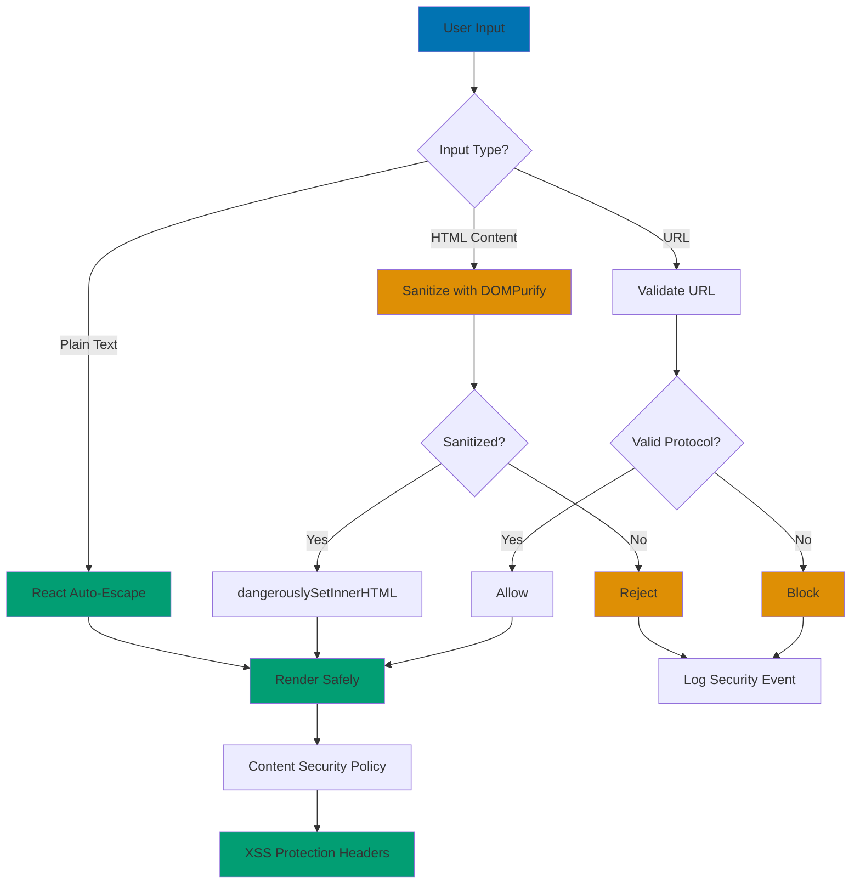

# React Security

## Quick Reference

**Navigation**: [Stack Libraries](../README.md) > [TypeScript React](./README.md) > Security

**Related Guides**:

- [Best Practices](ex-soen-plwe-to-fere__best-practices.md) - Security standards
- [Anti-Patterns](ex-soen-plwe-to-fere__anti-patterns.md) - Security mistakes

## Overview

Security is critical for React applications handling sensitive data. This guide covers XSS prevention, CSRF protection, authentication, authorization, and secure API communication.

**Target Audience**: Developers building secure React applications, particularly Islamic finance platforms handling financial transactions and personal data.

**React Version**: React 19.0 with TypeScript 5+

## XSS Prevention

Cross-Site Scripting (XSS) prevention follows multiple defensive layers:



**XSS Defense Layers**:

1. **React Auto-Escape** - Default protection for text content
2. **DOMPurify Sanitization** - Clean HTML when necessary
3. **URL Validation** - Verify href and src attributes
4. **CSP Headers** - Restrict script sources
5. **Input Validation** - Reject malicious patterns

### Avoid dangerouslySetInnerHTML

```typescript
// ❌ Dangerous - XSS vulnerability
export const UserComment: React.FC<{ comment: string }> = ({ comment }) => (
  <div dangerouslySetInnerHTML={{ __html: comment }} />
);

// ✅ Safe - React escapes by default
export const UserComment: React.FC<{ comment: string }> = ({ comment }) => (
  <div>{comment}</div>
);

// If HTML is needed, sanitize first
import DOMPurify from 'dompurify';

export const SafeHtmlContent: React.FC<{ html: string }> = ({ html }) => {
  const sanitizedHtml = DOMPurify.sanitize(html, {
    ALLOWED_TAGS: ['p', 'strong', 'em', 'a'],
    ALLOWED_ATTR: ['href'],
  });

  return <div dangerouslySetInnerHTML={{ __html: sanitizedHtml }} />;
};
```

### Input Validation

```typescript
export const DonationForm: React.FC = () => {
  const [amount, setAmount] = useState('');
  const [error, setError] = useState('');

  const handleAmountChange = (e: React.ChangeEvent<HTMLInputElement>) => {
    const value = e.target.value;

    // Validate input
    if (!/^\d*\.?\d*$/.test(value)) {
      setError('Amount must be a valid number');
      return;
    }

    const numValue = parseFloat(value);
    if (numValue < 0) {
      setError('Amount must be positive');
      return;
    }

    setError('');
    setAmount(value);
  };

  return (
    <div>
      <input
        type="text"
        value={amount}
        onChange={handleAmountChange}
        pattern="[0-9]*\.?[0-9]*"
      />
      {error && <span className="error">{error}</span>}
    </div>
  );
};
```

## Authentication

### Protected Routes

```typescript
import { Navigate, Outlet } from 'react-router-dom';
import { useAuth } from '../hooks/useAuth';

export const ProtectedRoute: React.FC = () => {
  const { user, loading } = useAuth();

  if (loading) {
    return <LoadingSpinner />;
  }

  if (!user) {
    return <Navigate to="/login" replace />;
  }

  return <Outlet />;
};

// Usage
<Routes>
  <Route element={<ProtectedRoute />}>
    <Route path="/dashboard" element={<Dashboard />} />
    <Route path="/zakat" element={<ZakatCalculator />} />
  </Route>
</Routes>
```

### JWT Token Management

```typescript
// api/authApi.ts
export const authApi = {
  async login(email: string, password: string): Promise<AuthResponse> {
    const response = await fetch("/api/auth/login", {
      method: "POST",
      headers: { "Content-Type": "application/json" },
      body: JSON.stringify({ email, password }),
    });

    if (!response.ok) throw new Error("Login failed");

    const data = await response.json();

    // Store tokens securely
    sessionStorage.setItem("accessToken", data.accessToken);
    // Never store in localStorage - use httpOnly cookies for refresh tokens

    return data;
  },

  async refreshToken(): Promise<string> {
    const response = await fetch("/api/auth/refresh", {
      method: "POST",
      credentials: "include", // Send httpOnly cookie
    });

    if (!response.ok) throw new Error("Token refresh failed");

    const data = await response.json();
    sessionStorage.setItem("accessToken", data.accessToken);

    return data.accessToken;
  },

  logout() {
    sessionStorage.removeItem("accessToken");
    // Clear httpOnly cookie via API call
    fetch("/api/auth/logout", {
      method: "POST",
      credentials: "include",
    });
  },
};

// API interceptor
async function apiCall(url: string, options: RequestInit = {}) {
  const token = sessionStorage.getItem("accessToken");

  const response = await fetch(url, {
    ...options,
    headers: {
      ...options.headers,
      Authorization: token ? `Bearer ${token}` : "",
    },
  });

  // Handle token expiration
  if (response.status === 401) {
    try {
      const newToken = await authApi.refreshToken();
      // Retry with new token
      return fetch(url, {
        ...options,
        headers: {
          ...options.headers,
          Authorization: `Bearer ${newToken}`,
        },
      });
    } catch {
      // Refresh failed, redirect to login
      window.location.href = "/login";
      throw new Error("Authentication required");
    }
  }

  return response;
}
```

## CSRF Protection

### CSRF Token Handling

```typescript
// Get CSRF token from meta tag
function getCsrfToken(): string {
  const token = document.querySelector<HTMLMetaElement>('meta[name="csrf-token"]')?.content;

  if (!token) {
    throw new Error("CSRF token not found");
  }

  return token;
}

// Include in requests
async function apiPost(url: string, data: any) {
  const response = await fetch(url, {
    method: "POST",
    headers: {
      "Content-Type": "application/json",
      "X-CSRF-Token": getCsrfToken(),
    },
    body: JSON.stringify(data),
  });

  return response;
}
```

## Authorization

### Role-Based Access Control (RBAC)

```typescript
interface User {
  id: string;
  email: string;
  roles: string[];
  permissions: string[];
}

interface AuthContextValue {
  user: User | null;
  hasRole: (role: string) => boolean;
  hasPermission: (permission: string) => boolean;
}

// Authorization hook
export function useAuthorization() {
  const { user } = useAuth();

  const hasRole = (role: string): boolean => {
    return user?.roles.includes(role) ?? false;
  };

  const hasPermission = (permission: string): boolean => {
    return user?.permissions.includes(permission) ?? false;
  };

  return { hasRole, hasPermission };
}

// Conditional rendering based on permission
export const ConditionalComponent: React.FC<{
  requiredPermission: string;
  children: React.ReactNode;
}> = ({ requiredPermission, children }) => {
  const { hasPermission } = useAuthorization();

  if (!hasPermission(requiredPermission)) {
    return null;
  }

  return <>{children}</>;
};

// Usage
<ConditionalComponent requiredPermission="zakat:calculate">
  <ZakatCalculator />
</ConditionalComponent>
```

### Protected Components

```typescript
interface RequirePermissionProps {
  permission: string;
  fallback?: React.ReactNode;
  children: React.ReactNode;
}

export const RequirePermission: React.FC<RequirePermissionProps> = ({
  permission,
  fallback = <div>Access denied</div>,
  children,
}) => {
  const { hasPermission } = useAuthorization();

  if (!hasPermission(permission)) {
    return <>{fallback}</>;
  }

  return <>{children}</>;
};

// Usage with Zakat calculator
<RequirePermission
  permission="zakat:calculate"
  fallback={<div>You need permission to calculate zakat</div>}
>
  <ZakatCalculator userId={user.id} />
</RequirePermission>
```

### Resource-Based Authorization

```typescript
// Check if user can edit specific resource
export function useResourceAuthorization<T extends { ownerId: string }>(
  resource: T | null
) {
  const { user, hasPermission } = useAuth();

  const canEdit = (): boolean => {
    if (!resource) return false;

    // Admin can edit anything
    if (hasPermission('admin')) return true;

    // Owner can edit their own resources
    return resource.ownerId === user?.id;
  };

  const canDelete = (): boolean => {
    if (!resource) return false;

    // Only admin or owner
    if (hasPermission('admin')) return true;
    return resource.ownerId === user?.id;
  };

  return { canEdit, canDelete };
}

// Usage with Murabaha contract
interface MurabahaContract {
  id: string;
  ownerId: string;
  amount: number;
  status: string;
}

export const MurabahaContractActions: React.FC<{
  contract: MurabahaContract;
}> = ({ contract }) => {
  const { canEdit, canDelete } = useResourceAuthorization(contract);

  return (
    <div>
      {canEdit() && <button onClick={handleEdit}>Edit</button>}
      {canDelete() && <button onClick={handleDelete}>Delete</button>}
    </div>
  );
};
```

## Secure API Communication

### API Client with Security Headers

```typescript
class SecureApiClient {
  private baseURL: string;
  private csrfToken: string | null = null;

  constructor(baseURL: string) {
    this.baseURL = baseURL;
    this.refreshCsrfToken();
  }

  private async refreshCsrfToken() {
    try {
      const response = await fetch(`${this.baseURL}/csrf-token`);
      const data = await response.json();
      this.csrfToken = data.token;
    } catch (error) {
      console.error("Failed to fetch CSRF token:", error);
    }
  }

  private getHeaders(): HeadersInit {
    const token = sessionStorage.getItem("accessToken");

    return {
      "Content-Type": "application/json",
      "X-Requested-With": "XMLHttpRequest",
      "X-CSRF-Token": this.csrfToken || "",
      Authorization: token ? `Bearer ${token}` : "",
    };
  }

  async post<T>(endpoint: string, data: any): Promise<T> {
    const response = await fetch(`${this.baseURL}${endpoint}`, {
      method: "POST",
      headers: this.getHeaders(),
      credentials: "include", // Include cookies
      body: JSON.stringify(data),
    });

    if (response.status === 403) {
      // CSRF token expired, refresh and retry
      await this.refreshCsrfToken();

      return this.post<T>(endpoint, data);
    }

    if (!response.ok) {
      throw new Error(`HTTP error: ${response.status}`);
    }

    return response.json();
  }

  async get<T>(endpoint: string): Promise<T> {
    const response = await fetch(`${this.baseURL}${endpoint}`, {
      method: "GET",
      headers: this.getHeaders(),
      credentials: "include",
    });

    if (!response.ok) {
      throw new Error(`HTTP error: ${response.status}`);
    }

    return response.json();
  }
}

export const apiClient = new SecureApiClient(process.env.REACT_APP_API_URL || "http://localhost:8080/api");
```

### Request/Response Encryption

```typescript
import CryptoJS from "crypto-js";

class EncryptedApiClient {
  private encryptionKey: string;

  constructor(encryptionKey: string) {
    this.encryptionKey = encryptionKey;
  }

  private encrypt(data: any): string {
    const jsonStr = JSON.stringify(data);
    return CryptoJS.AES.encrypt(jsonStr, this.encryptionKey).toString();
  }

  private decrypt(encryptedData: string): any {
    const bytes = CryptoJS.AES.decrypt(encryptedData, this.encryptionKey);
    const decryptedStr = bytes.toString(CryptoJS.enc.Utf8);
    return JSON.parse(decryptedStr);
  }

  async securePost<T>(endpoint: string, data: any): Promise<T> {
    const encryptedData = this.encrypt(data);

    const response = await fetch(endpoint, {
      method: "POST",
      headers: { "Content-Type": "application/json" },
      body: JSON.stringify({ encrypted: encryptedData }),
    });

    const responseData = await response.json();

    return this.decrypt(responseData.encrypted);
  }
}

// Usage with Zakat calculation (sensitive financial data)
const encryptedClient = new EncryptedApiClient(process.env.REACT_APP_ENCRYPTION_KEY!);

export async function calculateZakatSecure(wealth: number, userId: string): Promise<ZakatResult> {
  return encryptedClient.securePost("/zakat/calculate", {
    wealth,
    userId,
    timestamp: Date.now(),
  });
}
```

## Content Security Policy (CSP)

### CSP Configuration

```typescript
// index.html - Add CSP meta tag
/*
<meta http-equiv="Content-Security-Policy" content="
  default-src 'self';
  script-src 'self' 'unsafe-inline' 'unsafe-eval';
  style-src 'self' 'unsafe-inline';
  img-src 'self' data: https:;
  font-src 'self' data:;
  connect-src 'self' https://api.oseplatform.com;
  frame-ancestors 'none';
  base-uri 'self';
  form-action 'self';
">
*/

// React component to check CSP compliance
export function useCSPCompliance() {
  useEffect(() => {
    const checkCSP = () => {
      // Check if CSP is active
      const cspMeta = document.querySelector('meta[http-equiv="Content-Security-Policy"]');

      if (!cspMeta) {
        console.warn("CSP not configured");
      }
    };

    checkCSP();
  }, []);
}
```

### Inline Script Prevention

```typescript
// ❌ Bad - inline event handlers
<button onClick={() => alert('Clicked')}>Click</button>

// ✅ Good - use React event handlers
export const SecureButton: React.FC = () => {
  const handleClick = () => {
    console.log('Clicked securely');
  };

  return <button onClick={handleClick}>Click</button>;
};

// ❌ Bad - inline styles with CSP
<div style={{ background: 'red' }}>Content</div>

// ✅ Good - CSS classes or CSS-in-JS libraries
import styled from 'styled-components';

const StyledDiv = styled.div`
  background: red;
`;

export const SecureComponent = () => <StyledDiv>Content</StyledDiv>;
```

## Input Validation & Sanitization

### Comprehensive Input Validation

```typescript
interface ValidationRule {
  test: (value: string) => boolean;
  message: string;
}

interface ValidationRules {
  [key: string]: ValidationRule[];
}

// Validation rules
const validationRules: ValidationRules = {
  email: [
    {
      test: (value) => value.length > 0,
      message: 'Email is required',
    },
    {
      test: (value) => /^[^\s@]+@[^\s@]+\.[^\s@]+$/.test(value),
      message: 'Email is invalid',
    },
  ],
  amount: [
    {
      test: (value) => value.length > 0,
      message: 'Amount is required',
    },
    {
      test: (value) => /^\d+\.?\d*$/.test(value),
      message: 'Amount must be a number',
    },
    {
      test: (value) => parseFloat(value) > 0,
      message: 'Amount must be positive',
    },
    {
      test: (value) => parseFloat(value) <= 1000000,
      message: 'Amount must be less than 1,000,000',
    },
  ],
  phone: [
    {
      test: (value) => value.length > 0,
      message: 'Phone is required',
    },
    {
      test: (value) => /^\+?[\d\s-]{10,}$/.test(value),
      message: 'Phone number is invalid',
    },
  ],
};

// Validation hook
export function useValidation<T extends Record<string, string>>(
  initialValues: T,
  rules: ValidationRules
) {
  const [values, setValues] = useState<T>(initialValues);
  const [errors, setErrors] = useState<Partial<Record<keyof T, string>>>({});

  const validate = (field: keyof T, value: string): string | null => {
    const fieldRules = rules[field as string];

    if (!fieldRules) return null;

    for (const rule of fieldRules) {
      if (!rule.test(value)) {
        return rule.message;
      }
    }

    return null;
  };

  const handleChange = (field: keyof T, value: string) => {
    setValues((prev) => ({ ...prev, [field]: value }));

    // Validate on change
    const error = validate(field, value);
    setErrors((prev) => ({ ...prev, [field]: error }));
  };

  const validateAll = (): boolean => {
    const newErrors: Partial<Record<keyof T, string>> = {};
    let isValid = true;

    for (const field in values) {
      const error = validate(field, values[field]);

      if (error) {
        newErrors[field] = error;
        isValid = false;
      }
    }

    setErrors(newErrors);

    return isValid;
  };

  return { values, errors, handleChange, validateAll };
}

// Usage in Zakat donation form
export const ZakatDonationForm: React.FC = () => {
  const { values, errors, handleChange, validateAll } = useValidation(
    { email: '', amount: '' },
    validationRules
  );

  const handleSubmit = async (e: React.FormEvent) => {
    e.preventDefault();

    if (!validateAll()) {
      return;
    }

    await submitDonation(values);
  };

  return (
    <form onSubmit={handleSubmit}>
      <div>
        <label htmlFor="email">Email</label>
        <input
          id="email"
          type="email"
          value={values.email}
          onChange={(e) => handleChange('email', e.target.value)}
        />
        {errors.email && <span className="error">{errors.email}</span>}
      </div>

      <div>
        <label htmlFor="amount">Donation Amount</label>
        <input
          id="amount"
          type="text"
          value={values.amount}
          onChange={(e) => handleChange('amount', e.target.value)}
        />
        {errors.amount && <span className="error">{errors.amount}</span>}
      </div>

      <button type="submit">Submit Donation</button>
    </form>
  );
};
```

### SQL Injection Prevention

```typescript
// ❌ Bad - Never construct SQL in frontend
// (This is just for demonstration - SQL should only be on backend)

// ✅ Good - Always use parameterized queries on backend
// Frontend should only send validated data

export async function searchDonations(searchTerm: string) {
  // Validate and sanitize input
  const sanitized = searchTerm.trim().slice(0, 100);

  // Let backend handle SQL safely
  const response = await fetch("/api/waqf/donations/search", {
    method: "POST",
    headers: { "Content-Type": "application/json" },
    body: JSON.stringify({ query: sanitized }),
  });

  return response.json();
}
```

### File Upload Security

```typescript
interface FileUploadProps {
  onUpload: (file: File) => Promise<void>;
  acceptedTypes: string[];
  maxSize: number; // in bytes
}

export const SecureFileUpload: React.FC<FileUploadProps> = ({
  onUpload,
  acceptedTypes,
  maxSize,
}) => {
  const [error, setError] = useState<string | null>(null);

  const validateFile = (file: File): string | null => {
    // Check file type
    if (!acceptedTypes.includes(file.type)) {
      return `File type ${file.type} not allowed`;
    }

    // Check file size
    if (file.size > maxSize) {
      return `File size exceeds ${maxSize / 1024 / 1024}MB limit`;
    }

    // Check file extension
    const extension = file.name.split('.').pop()?.toLowerCase();
    const allowedExtensions = acceptedTypes
      .map((type) => type.split('/')[1])
      .filter(Boolean);

    if (extension && !allowedExtensions.includes(extension)) {
      return 'File extension does not match type';
    }

    return null;
  };

  const handleFileChange = async (e: React.ChangeEvent<HTMLInputElement>) => {
    const file = e.target.files?.[0];

    if (!file) return;

    const validationError = validateFile(file);

    if (validationError) {
      setError(validationError);
      return;
    }

    setError(null);

    try {
      await onUpload(file);
    } catch (err) {
      setError(err instanceof Error ? err.message : 'Upload failed');
    }
  };

  return (
    <div>
      <input
        type="file"
        accept={acceptedTypes.join(',')}
        onChange={handleFileChange}
      />
      {error && <span className="error">{error}</span>}
    </div>
  );
};

// Usage for Waqf project documents
<SecureFileUpload
  onUpload={uploadProjectDocument}
  acceptedTypes={['application/pdf', 'image/jpeg', 'image/png']}
  maxSize={5 * 1024 * 1024} // 5MB
/>
```

## Secure Data Storage

### Session Storage Best Practices

```typescript
class SecureStorage {
  // Encrypt data before storing
  private static encrypt(data: string): string {
    // Use Web Crypto API for encryption
    return btoa(data); // Simplified - use proper encryption
  }

  private static decrypt(data: string): string {
    return atob(data);
  }

  static setItem(key: string, value: any): void {
    const jsonStr = JSON.stringify(value);
    const encrypted = this.encrypt(jsonStr);
    sessionStorage.setItem(key, encrypted);
  }

  static getItem<T>(key: string): T | null {
    const encrypted = sessionStorage.getItem(key);

    if (!encrypted) return null;

    try {
      const decrypted = this.decrypt(encrypted);
      return JSON.parse(decrypted);
    } catch {
      return null;
    }
  }

  static removeItem(key: string): void {
    sessionStorage.removeItem(key);
  }

  static clear(): void {
    sessionStorage.clear();
  }
}

// Usage
SecureStorage.setItem("user_preferences", {
  currency: "USD",
  language: "en",
});

const preferences = SecureStorage.getItem<UserPreferences>("user_preferences");
```

### Sensitive Data Handling

```typescript
// ❌ Bad - Storing sensitive data in localStorage
localStorage.setItem("creditCard", "1234-5678-9012-3456");

// ✅ Good - Never store sensitive data client-side
// Keep in memory only, or use secure cookies

interface SensitiveData {
  data: string;
  expiresAt: number;
}

class InMemorySecureStorage {
  private static storage = new Map<string, SensitiveData>();

  static setItem(key: string, value: string, ttl: number = 300000): void {
    this.storage.set(key, {
      data: value,
      expiresAt: Date.now() + ttl,
    });

    // Auto-cleanup
    setTimeout(() => this.removeItem(key), ttl);
  }

  static getItem(key: string): string | null {
    const item = this.storage.get(key);

    if (!item) return null;

    if (Date.now() > item.expiresAt) {
      this.removeItem(key);
      return null;
    }

    return item.data;
  }

  static removeItem(key: string): void {
    this.storage.delete(key);
  }

  static clear(): void {
    this.storage.clear();
  }
}

// Usage for temporary Murabaha application data
InMemorySecureStorage.setItem("application_draft", JSON.stringify(draftData), 60000);
```

## Rate Limiting & Abuse Prevention

### Client-Side Rate Limiting

```typescript
class RateLimiter {
  private timestamps: Map<string, number[]> = new Map();

  isAllowed(key: string, maxRequests: number, windowMs: number): boolean {
    const now = Date.now();
    const timestamps = this.timestamps.get(key) || [];

    // Remove old timestamps outside window
    const validTimestamps = timestamps.filter((ts) => now - ts < windowMs);

    if (validTimestamps.length >= maxRequests) {
      return false;
    }

    validTimestamps.push(now);
    this.timestamps.set(key, validTimestamps);

    return true;
  }

  reset(key: string): void {
    this.timestamps.delete(key);
  }
}

const rateLimiter = new RateLimiter();

// Hook for rate-limited API calls
export function useRateLimitedApi() {
  const callApi = async (endpoint: string, maxRequests: number = 5, windowMs: number = 60000) => {
    if (!rateLimiter.isAllowed(endpoint, maxRequests, windowMs)) {
      throw new Error('Rate limit exceeded. Please try again later.');
    }

    return fetch(endpoint);
  };

  return { callApi };
}

// Usage in Zakat calculator
export const ZakatCalculatorWithRateLimit: React.FC = () => {
  const { callApi } = useRateLimitedApi();
  const [error, setError] = useState<string | null>(null);

  const handleCalculate = async () => {
    try {
      const response = await callApi('/api/zakat/calculate', 3, 60000);
      const result = await response.json();
      // Handle result
    } catch (err) {
      setError(err instanceof Error ? err.message : 'Calculation failed');
    }
  };

  return (
    <div>
      <button onClick={handleCalculate}>Calculate Zakat</button>
      {error && <div className="error">{error}</div>}
    </div>
  );
};
```

### Request Debouncing

```typescript
export function useDebouncedCallback<T extends (...args: any[]) => any>(
  callback: T,
  delay: number
): T {
  const timeoutRef = useRef<NodeJS.Timeout>();

  const debouncedCallback = useCallback(
    (...args: Parameters<T>) => {
      if (timeoutRef.current) {
        clearTimeout(timeoutRef.current);
      }

      timeoutRef.current = setTimeout(() => {
        callback(...args);
      }, delay);
    },
    [callback, delay]
  ) as T;

  useEffect(() => {
    return () => {
      if (timeoutRef.current) {
        clearTimeout(timeoutRef.current);
      }
    };
  }, []);

  return debouncedCallback;
}

// Usage in search
export const DonationSearch: React.FC = () => {
  const [query, setQuery] = useState('');
  const [results, setResults] = useState([]);

  const searchDonations = async (searchQuery: string) => {
    const response = await fetch(`/api/waqf/donations/search?q=${searchQuery}`);
    const data = await response.json();
    setResults(data);
  };

  // Debounce to prevent excessive API calls
  const debouncedSearch = useDebouncedCallback(searchDonations, 500);

  const handleQueryChange = (e: React.ChangeEvent<HTMLInputElement>) => {
    const value = e.target.value;
    setQuery(value);
    debouncedSearch(value);
  };

  return (
    <div>
      <input
        type="text"
        value={query}
        onChange={handleQueryChange}
        placeholder="Search donations..."
      />
      <div>{/* Render results */}</div>
    </div>
  );
};
```

## OSE Platform Security Examples

### Zakat Calculation Security

```typescript
interface ZakatCalculationRequest {
  userId: string;
  wealth: number;
  currency: string;
  timestamp: number;
}

interface ZakatCalculationResult {
  nisabThreshold: number;
  zakatAmount: number;
  zakatDue: boolean;
  calculationId: string;
}

export const SecureZakatCalculator: React.FC = () => {
  const { user, hasPermission } = useAuth();
  const [wealth, setWealth] = useState(0);
  const [result, setResult] = useState<ZakatCalculationResult | null>(null);
  const [error, setError] = useState<string | null>(null);

  // Permission check
  if (!hasPermission('zakat:calculate')) {
    return <div>You do not have permission to calculate zakat</div>;
  }

  const handleCalculate = async () => {
    if (wealth <= 0) {
      setError('Wealth must be positive');
      return;
    }

    if (wealth > 1000000000) {
      setError('Wealth amount too large');
      return;
    }

    try {
      // Create signed request
      const request: ZakatCalculationRequest = {
        userId: user!.id,
        wealth,
        currency: user!.preferredCurrency,
        timestamp: Date.now(),
      };

      const response = await apiClient.post<ZakatCalculationResult>(
        '/zakat/calculate',
        request
      );

      setResult(response);
      setError(null);

      // Log calculation for audit
      await apiClient.post('/audit/log', {
        action: 'zakat_calculation',
        userId: user!.id,
        timestamp: Date.now(),
      });
    } catch (err) {
      setError(err instanceof Error ? err.message : 'Calculation failed');
    }
  };

  return (
    <div className="secure-zakat-calculator">
      <h2>Zakat Calculator</h2>

      <div>
        <label htmlFor="wealth">Total Wealth</label>
        <input
          id="wealth"
          type="number"
          value={wealth}
          onChange={(e) => setWealth(Number(e.target.value))}
          min="0"
          step="0.01"
        />
      </div>

      <button onClick={handleCalculate}>Calculate Zakat</button>

      {error && <div className="error">{error}</div>}

      {result && (
        <div className="result">
          <h3>Results</h3>
          <p>Nisab Threshold: {result.nisabThreshold.toFixed(2)}</p>
          <p>Zakat Due: {result.zakatDue ? 'Yes' : 'No'}</p>
          {result.zakatDue && (
            <p>Zakat Amount: {result.zakatAmount.toFixed(2)}</p>
          )}
        </div>
      )}
    </div>
  );
};
```

### Murabaha Contract Access Control

```typescript
interface MurabahaContract {
  id: string;
  ownerId: string;
  applicantName: string;
  requestedAmount: number;
  status: 'pending' | 'approved' | 'active' | 'completed';
  installments: Installment[];
}

export const SecureMurabahaContract: React.FC<{ contractId: string }> = ({
  contractId,
}) => {
  const { user, hasPermission } = useAuth();
  const [contract, setContract] = useState<MurabahaContract | null>(null);
  const [loading, setLoading] = useState(true);
  const [error, setError] = useState<string | null>(null);

  useEffect(() => {
    const fetchContract = async () => {
      try {
        const response = await apiClient.get<MurabahaContract>(
          `/murabaha/contracts/${contractId}`
        );

        // Verify ownership or admin permission
        if (
          response.ownerId !== user?.id &&
          !hasPermission('murabaha:view_all')
        ) {
          throw new Error('Access denied');
        }

        setContract(response);
      } catch (err) {
        setError(err instanceof Error ? err.message : 'Failed to load contract');
      } finally {
        setLoading(false);
      }
    };

    fetchContract();
  }, [contractId, user, hasPermission]);

  if (loading) return <div>Loading...</div>;
  if (error) return <div className="error">{error}</div>;
  if (!contract) return <div>Contract not found</div>;

  const canEdit = contract.ownerId === user?.id || hasPermission('murabaha:edit_all');
  const canDelete =
    (contract.ownerId === user?.id && contract.status === 'pending') ||
    hasPermission('murabaha:delete_all');

  return (
    <div className="murabaha-contract">
      <h2>Contract #{contract.id}</h2>
      <p>Status: {contract.status}</p>
      <p>Amount: ${contract.requestedAmount.toFixed(2)}</p>

      <div className="actions">
        {canEdit && <button onClick={handleEdit}>Edit</button>}
        {canDelete && <button onClick={handleDelete}>Delete</button>}
      </div>

      {/* Sensitive installment information only for owner */}
      {contract.ownerId === user?.id && (
        <div className="installments">
          <h3>Payment Schedule</h3>
          {contract.installments.map((installment) => (
            <div key={installment.id}>
              <p>Due: {installment.dueDate}</p>
              <p>Amount: ${installment.amount.toFixed(2)}</p>
            </div>
          ))}
        </div>
      )}
    </div>
  );
};
```

### Waqf Donation Protection

```typescript
interface WaqfDonation {
  amount: number;
  projectId: string;
  donorId: string;
  recurring: boolean;
  frequency?: 'monthly' | 'quarterly' | 'annually';
}

export const SecureWaqfDonationForm: React.FC = () => {
  const { user, hasPermission } = useAuth();
  const [amount, setAmount] = useState(0);
  const [projectId, setProjectId] = useState('');
  const [error, setError] = useState<string | null>(null);
  const [submitting, setSubmitting] = useState(false);

  // Check permission
  if (!hasPermission('waqf:donate')) {
    return <div>You do not have permission to make donations</div>;
  }

  const validateDonation = (): string | null => {
    if (amount < 1) {
      return 'Minimum donation amount is $1';
    }

    if (amount > 100000) {
      return 'Maximum donation amount is $100,000';
    }

    if (!projectId) {
      return 'Please select a project';
    }

    return null;
  };

  const handleSubmit = async (e: React.FormEvent) => {
    e.preventDefault();

    const validationError = validateDonation();

    if (validationError) {
      setError(validationError);
      return;
    }

    setSubmitting(true);
    setError(null);

    try {
      const donation: WaqfDonation = {
        amount,
        projectId,
        donorId: user!.id,
        recurring: false,
      };

      // Create idempotency key to prevent duplicate submissions
      const idempotencyKey = `${user!.id}-${projectId}-${Date.now()}`;

      const response = await apiClient.post('/waqf/donations', donation, {
        headers: {
          'Idempotency-Key': idempotencyKey,
        },
      });

      // Success - show confirmation
      alert('Donation submitted successfully!');

      // Reset form
      setAmount(0);
      setProjectId('');

      // Log for audit trail
      await apiClient.post('/audit/log', {
        action: 'waqf_donation',
        userId: user!.id,
        amount,
        timestamp: Date.now(),
      });
    } catch (err) {
      setError(err instanceof Error ? err.message : 'Donation failed');
    } finally {
      setSubmitting(false);
    }
  };

  return (
    <form onSubmit={handleSubmit} className="waqf-donation-form">
      <h2>Make a Donation</h2>

      <div>
        <label htmlFor="amount">Donation Amount ($)</label>
        <input
          id="amount"
          type="number"
          value={amount}
          onChange={(e) => setAmount(Number(e.target.value))}
          min="1"
          max="100000"
          step="0.01"
          disabled={submitting}
        />
      </div>

      <div>
        <label htmlFor="project">Select Project</label>
        <select
          id="project"
          value={projectId}
          onChange={(e) => setProjectId(e.target.value)}
          disabled={submitting}
        >
          <option value="">-- Select Project --</option>
          {/* Project options */}
        </select>
      </div>

      {error && <div className="error">{error}</div>}

      <button type="submit" disabled={submitting}>
        {submitting ? 'Processing...' : 'Donate Now'}
      </button>
    </form>
  );
};
```

## Security Checklist

### Development Phase

- [ ] Enable TypeScript strict mode
- [ ] Configure ESLint security plugin
- [ ] Never use `dangerouslySetInnerHTML` without sanitization
- [ ] Validate all user inputs on client and server
- [ ] Use HTTPS for all API communication
- [ ] Implement CSRF protection
- [ ] Use Content Security Policy
- [ ] Avoid inline JavaScript and styles
- [ ] Never store sensitive data in localStorage
- [ ] Use httpOnly cookies for refresh tokens
- [ ] Implement rate limiting
- [ ] Log security events for audit trail
- [ ] Handle errors without exposing sensitive info

### Authentication

- [ ] Use secure authentication library (e.g., Auth0, Firebase)
- [ ] Implement JWT with short expiration
- [ ] Store access tokens in sessionStorage
- [ ] Use httpOnly cookies for refresh tokens
- [ ] Implement token refresh mechanism
- [ ] Add multi-factor authentication (MFA)
- [ ] Protect routes with authentication checks
- [ ] Clear tokens on logout
- [ ] Implement session timeout

### Authorization

- [ ] Implement role-based access control (RBAC)
- [ ] Check permissions before rendering components
- [ ] Verify resource ownership on backend
- [ ] Use fine-grained permissions
- [ ] Implement principle of least privilege
- [ ] Log authorization failures

### Data Protection

- [ ] Encrypt sensitive data in transit (HTTPS)
- [ ] Validate and sanitize all inputs
- [ ] Use prepared statements for queries (backend)
- [ ] Implement file upload restrictions
- [ ] Sanitize HTML content with DOMPurify
- [ ] Avoid exposing API keys in code
- [ ] Use environment variables for secrets
- [ ] Implement data retention policies

### Testing

- [ ] Write security unit tests
- [ ] Test XSS prevention
- [ ] Test CSRF protection
- [ ] Test authentication flows
- [ ] Test authorization rules
- [ ] Perform penetration testing
- [ ] Use automated security scanning tools

## Related Documentation

- **[Best Practices](ex-soen-plwe-to-fere__best-practices.md)** - Security standards
- **[Anti-Patterns](ex-soen-plwe-to-fere__anti-patterns.md)** - Security mistakes
- **[Component Architecture](ex-soen-plwe-to-fere__component-architecture.md)** - Secure component design
- **[State Management](ex-soen-plwe-to-fere__state-management.md)** - Secure state handling

---

**Last Updated**: 2026-01-26
