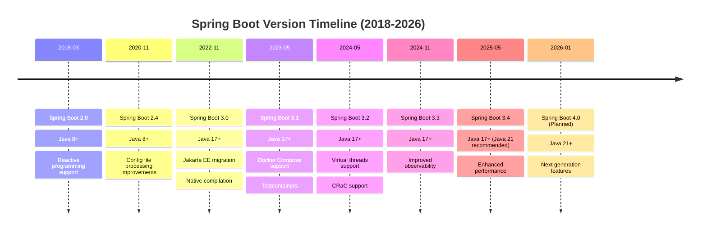

# Spring Boot Framework

**Understanding-oriented documentation** for Spring Boot framework in the open-sharia-enterprise platform.

## Overview

Spring Boot is an opinionated, production-ready framework for building Java applications with minimal configuration. It provides auto-configuration, embedded servers, and production features out of the box, enabling rapid development of enterprise-grade applications.

This documentation covers Spring Boot 3.x (latest stable) with Java 17+ targeting microservices, REST APIs, and domain-driven design implementations.

## Prerequisite Knowledge

**REQUIRED Foundation - Spring Framework**:

Spring Boot builds on Spring Framework and auto-configures Spring concepts. You MUST understand Spring Framework core before learning Spring Boot.

**1. Master Spring Framework First**:

- **[Spring Framework Explanation Docs](../jvm-spring/README.md)** - Understand manual Spring setup, IoC, DI, Bean lifecycle
- **[Spring Framework Idioms](../jvm-spring/ex-soen-plwe-to-jvsp__idioms.md)** - Core Spring patterns and conventions
- **[Spring Framework Configuration](../jvm-spring/ex-soen-plwe-to-jvsp__configuration.md)** - Manual Java config and XML setup
- **[Spring Framework Dependency Injection](../jvm-spring/ex-soen-plwe-to-jvsp__dependency-injection.md)** - IoC container fundamentals

**2. Learn Spring Boot Fundamentals**:

You MUST complete the [AyoKoding Spring Boot Learning Path](https://ayokoding.com/en/learn/software-engineering/platform-web/tools/jvm-spring-boot/) before using these standards.

- [Spring Boot Initial Setup](https://ayokoding.com/en/learn/software-engineering/platform-web/tools/jvm-spring-boot/initial-setup) - Environment and tooling setup
- [Spring Boot Overview](https://ayokoding.com/en/learn/software-engineering/platform-web/tools/jvm-spring-boot/overview) - Auto-configuration, starters, opinionated defaults
- [Spring Boot By Example](https://ayokoding.com/en/learn/software-engineering/platform-web/tools/jvm-spring-boot/by-example/) (85+ annotated examples) - Hands-on code learning
- [Spring Boot In-the-Field](https://ayokoding.com/en/learn/software-engineering/platform-web/tools/jvm-spring-boot/in-the-field/) (37 practical guides) - Production patterns

**Separation of Concerns**: See [Programming Language Documentation Separation Convention](../../../../../../governance/conventions/structure/programming-language-docs-separation.md).

**What this documentation covers**: OSE Platform Spring Boot standards, naming conventions, auto-configuration patterns, how to apply Spring Boot knowledge in THIS codebase.

**What this documentation does NOT cover**: Spring Boot tutorials, basic auto-configuration concepts, generic patterns (those are in ayokoding-web).

**This documentation is OSE Platform-specific explanation**, not Spring Boot tutorials.

## Framework Standards

**This documentation is the authoritative reference** for Spring Boot usage standards in the open-sharia-enterprise platform.

All Spring Boot applications MUST follow the patterns and practices documented here:

1. **[Idioms](ex-soen-plwe-to-jvspbo__idioms.md)** - Spring Boot-specific patterns
2. **[Best Practices](ex-soen-plwe-to-jvspbo__best-practices.md)** - Framework standards
3. **[Anti-Patterns](ex-soen-plwe-to-jvspbo__anti-patterns.md)** - Common mistakes
4. **[Configuration](ex-soen-plwe-to-jvspbo__configuration.md)** - Configuration management
5. **[Dependency Injection](ex-soen-plwe-to-jvspbo__dependency-injection.md)** - DI patterns

**For Agents**: Reference this documentation when building Spring Boot applications.

**Language Standards**: Also follow [Java](../../../programming-languages/java/README.md) language standards.

### Quick Standards Reference

- **Project Structure**: See [Architecture Integration](#architecture-integration)
- **REST APIs**: See [REST APIs](ex-soen-plwe-to-jvspbo__rest-apis.md)
- **Data Access**: See [Data Access](ex-soen-plwe-to-jvspbo__data-access.md)
- **Security**: See [Security](ex-soen-plwe-to-jvspbo__security.md)
- **Testing**: See [Testing](ex-soen-plwe-to-jvspbo__testing.md)

## Software Engineering Principles

Spring Boot usage in this platform follows the five software engineering principles from [governance/principles/software-engineering/](../../../../../../governance/principles/software-engineering/README.md):

1. **[Automation Over Manual](../../../../../../governance/principles/software-engineering/automation-over-manual.md)** - Spring Boot automates through auto-configuration, starter dependencies, DevTools hot reload
2. **[Explicit Over Implicit](../../../../../../governance/principles/software-engineering/explicit-over-implicit.md)** - Spring Boot enforces through explicit configuration properties, clear component scanning, visible bean definitions
3. **[Immutability Over Mutability](../../../../../../governance/principles/software-engineering/immutability.md)** - Use immutable DTOs (Java records), stateless services, declarative transaction boundaries
4. **[Pure Functions Over Side Effects](../../../../../../governance/principles/software-engineering/pure-functions.md)** - Apply functional core/imperative shell: pure domain logic, side effects at boundaries
5. **[Reproducibility First](../../../../../../governance/principles/software-engineering/reproducibility.md)** - Spring Boot enables through version pinning (Maven/Gradle wrapper), dependency management, environment-specific profiles

**See Also**: [Functional Programming](ex-soen-plwe-to-jvspbo__functional-programming.md) for FP patterns with Spring Boot.

## Quick Reference

**Jump to:**

- [Overview](#overview) - Spring Boot in the platform
- [Software Engineering Principles](#software-engineering-principles) - Five core principles
- [Spring Boot Version Strategy](#spring-boot-version-strategy) - Version management
- [Documentation Structure](#documentation-structure) - Guide to documentation files
- [Key Capabilities](#key-capabilities) - Framework features
- [Use Cases](#use-cases) - When to use Spring Boot
- [Architecture Integration](#architecture-integration) - DDD, layered architecture
- [Development Workflow](#development-workflow) - Setup, configuration, testing
- [Learning Path](#learning-path) - Recommended reading order
- [Code Examples from Platform](#code-examples-from-platform) - Real implementations
- [Integration with Other Documentation](#integration-with-other-documentation) - Cross-references
- [Spring Boot Ecosystem](#spring-boot-ecosystem) - Spring projects
- [Tools and Development Environment](#tools-and-development-environment) - Build tools, IDEs
- [Resources and References](#resources-and-references) - External resources
- [Related Documentation](#related-documentation) - Cross-references

**Core Documentation:**

- [Idioms](ex-soen-plwe-to-jvspbo__idioms.md) - Spring Boot patterns (auto-configuration, component scanning, profiles)
- [Best Practices](ex-soen-plwe-to-jvspbo__best-practices.md) - Framework coding standards
- [Anti-Patterns](ex-soen-plwe-to-jvspbo__anti-patterns.md) - Common Spring Boot mistakes
- [Configuration](ex-soen-plwe-to-jvspbo__configuration.md) - application.yml, profiles, externalized config
- [Dependency Injection](ex-soen-plwe-to-jvspbo__dependency-injection.md) - Constructor injection, bean scopes
- [REST APIs](ex-soen-plwe-to-jvspbo__rest-apis.md) - RESTful services, validation, exception handling
- [Data Access](ex-soen-plwe-to-jvspbo__data-access.md) - Spring Data JPA, repositories, transactions
- [Security](ex-soen-plwe-to-jvspbo__security.md) - Spring Security, OAuth2, JWT
- [Testing](ex-soen-plwe-to-jvspbo__testing.md) - @SpringBootTest, slices, TestContainers
- [Observability](ex-soen-plwe-to-jvspbo__observability.md) - Actuator, metrics, health checks
- [Performance](ex-soen-plwe-to-jvspbo__performance.md) - Optimization, caching, async processing
- [Domain-Driven Design](ex-soen-plwe-to-jvspbo__domain-driven-design.md) - DDD with Spring Boot
- [Functional Programming](ex-soen-plwe-to-jvspbo__functional-programming.md) - FP patterns with Spring
- [Version Migration](ex-soen-plwe-to-jvspbo__version-migration.md) - Upgrading Spring Boot versions

## Spring Boot Version Strategy



**Platform Strategy**: Spring Boot 3.3+ (current) → Spring Boot 3.4 → Spring Boot 4.0 (future)

### Current Version: Spring Boot 3.3+

**Platform Standard**: Spring Boot 3.3 is the target version for all Spring Boot projects.

**Rationale**:

- Requires Java 17+ (aligns with platform baseline)
- Jakarta EE 10 support (javax._→ jakarta._ migration complete)
- Native compilation with GraalVM
- Virtual threads support (Java 21+)
- Comprehensive observability (Micrometer, OpenTelemetry)
- Mature Spring Boot 3.x ecosystem

**Key Features**:

- Auto-configuration refinements
- Improved Docker Compose integration
- Enhanced Testcontainers support
- Better observability with Micrometer
- SSL bundle improvements
- Virtual threads integration (with Java 21)

### Future: Spring Boot 4.0

**Expected**: 2026 (speculative)

**Anticipated Changes**:

- Minimum Java 21 LTS requirement
- Baseline Jakarta EE 11 support
- Enhanced native compilation
- Deeper integration with modern Java features (pattern matching, virtual threads)
- Potential breaking changes in core APIs

## Documentation Structure

### [Spring Boot Idioms](ex-soen-plwe-to-jvspbo__idioms.md)

Framework-specific patterns for writing idiomatic Spring Boot applications.

**Covers**:

- Auto-configuration and starter dependencies
- Component scanning and stereotypes (@Service, @Repository, @Controller)
- Configuration properties with @ConfigurationProperties
- Dependency injection patterns (constructor injection)
- Bean lifecycle and scopes
- Profile-based configuration
- Event-driven patterns with ApplicationEvent
- Conditional bean registration (@Conditional)
- Custom auto-configuration
- Spring Boot DevTools for development

### [Spring Boot Best Practices](ex-soen-plwe-to-jvspbo__best-practices.md)

Proven approaches for building production-ready Spring Boot applications.

**Covers**:

- Project structure and package organization
- Configuration management (externalized config, profiles)
- Dependency injection best practices (constructor injection)
- REST API design (DTOs, versioning, error handling)
- Data access patterns (repositories, transactions)
- Security implementation (Spring Security, OAuth2, JWT)
- Testing strategies (unit, integration, slices)
- Logging and monitoring (SLF4J, Actuator)
- Performance optimization (caching, connection pooling)
- Error handling and validation

### [Spring Boot Anti-Patterns](ex-soen-plwe-to-jvspbo__anti-patterns.md)

Common mistakes and problematic patterns to avoid.

**Covers**:

- Field injection anti-pattern (@Autowired on fields)
- Exposing JPA entities in REST APIs
- Overusing @Transactional
- Circular dependencies and god services
- Missing exception handling and validation
- Hardcoded configuration
- N+1 query problems
- Inappropriate component stereotypes
- Blocking I/O in virtual threads context
- Configuration property misuse

### Documentation Organization

```mermaid
%% Color Palette: Blue #0173B2, Orange #DE8F05, Teal #029E73, Purple #CC78BC
%% All colors are color-blind friendly and meet WCAG AA contrast standards

flowchart TD
    A["Spring Boot Documentation"]:::blue
    B["Core Patterns"]:::teal
    C["Application Layers"]:::teal
    D["Advanced Topics"]:::purple
    E["Integration"]:::orange
    F["Templates"]:::purple

    A --> B
    A --> C
    A --> D
    A --> E
    A --> F

    B --> B1["Idioms"]
    B --> B2["Best Practices"]
    B --> B3["Anti-Patterns"]

    C --> C1["Configuration"]
    C --> C2["Dependency Injection"]
    C --> C3["REST APIs"]
    C --> C4["Data Access"]

    D --> D1["Security"]
    D --> D2["Testing"]
    D --> D3["Observability"]
    D --> D4["Performance"]

    E --> E1["Domain-Driven Design"]
    E --> E2["Functional Programming"]
    E --> E3["Version Migration"]

    classDef blue fill:#0173B2,stroke:#000000,color:#FFFFFF,stroke-width:2px
    classDef orange fill:#DE8F05,stroke:#000000,color:#FFFFFF,stroke-width:2px
    classDef teal fill:#029E73,stroke:#000000,color:#FFFFFF,stroke-width:2px
    classDef purple fill:#CC78BC,stroke:#000000,color:#000000,stroke-width:2px
```



### Specialized Topics

Deep-dive documentation on critical Spring Boot areas:

#### [Spring Boot Configuration](ex-soen-plwe-to-jvspbo__configuration.md)

Comprehensive guide to configuration management.

**Covers**:

- application.yml vs application.properties
- Profile-based configuration (dev, test, prod)
- @ConfigurationProperties for type-safe config
- Environment variables and externalized configuration
- Configuration validation with @Validated
- Configuration precedence and overrides
- Secrets management (Vault, Kubernetes secrets)
- Spring Cloud Config Server
- Custom property sources
- Configuration testing

#### [Spring Boot Dependency Injection](ex-soen-plwe-to-jvspbo__dependency-injection.md)

Comprehensive guide to Spring's IoC container and dependency injection.

**Covers**:

- Constructor injection (recommended)
- Field injection (discouraged)
- Setter injection (rare cases)
- @Autowired, @Qualifier, @Primary
- Bean scopes (singleton, prototype, request, session)
- Lazy initialization with @Lazy
- Bean lifecycle callbacks (@PostConstruct, @PreDestroy)
- Custom bean post-processors
- Circular dependency resolution
- Testing with dependency injection

#### [Spring Boot REST APIs](ex-soen-plwe-to-jvspbo__rest-apis.md)

Comprehensive guide to building RESTful web services.

**Covers**:

- @RestController and @RequestMapping
- Request validation with Bean Validation (@Valid, @Validated)
- DTO pattern for requests/responses
- Exception handling with @ControllerAdvice
- HTTP status codes and RESTful conventions
- API versioning strategies (URI, header, content negotiation)
- HATEOAS for hypermedia APIs
- Content negotiation (JSON, XML, custom)
- Pagination and filtering
- CORS configuration
- API documentation with SpringDoc OpenAPI
- Financial examples: Zakat APIs, Murabaha contracts

#### [Spring Boot Data Access](ex-soen-plwe-to-jvspbo__data-access.md)

Comprehensive guide to data persistence with Spring Data JPA.

**Covers**:

- Spring Data JPA repositories
- Query methods and @Query annotations
- Entity mapping and relationships
- Transaction management with @Transactional
- Optimistic locking for concurrency
- Database migrations (Flyway, Liquibase)
- Multiple datasources configuration
- Projections and DTOs for read models
- N+1 query prevention strategies
- Connection pooling (HikariCP configuration)
- Database testing with @DataJpaTest
- TestContainers for integration tests

#### [Spring Boot Security](ex-soen-plwe-to-jvspbo__security.md)

Comprehensive guide to Spring Security integration.

**Covers**:

- Authentication strategies (form-based, OAuth2, JWT)
- Authorization with roles and authorities
- Method-level security with @PreAuthorize
- Security filter chain configuration
- CSRF protection configuration
- CORS configuration for APIs
- Password encoding (BCrypt, Argon2)
- Security testing with @WithMockUser
- OAuth2 resource server setup
- JWT token validation
- Security best practices (OWASP)

#### [Spring Boot Testing](ex-soen-plwe-to-jvspbo__testing.md)

Comprehensive guide to testing Spring Boot applications.

**Covers**:

- @SpringBootTest for integration tests
- @WebMvcTest for controller testing
- @DataJpaTest for repository testing
- @MockBean and @SpyBean for mocking
- TestContainers for realistic integration tests
- MockMvc for REST API testing
- Testing security with @WithMockUser
- Testing configuration properties
- Test slices and context caching
- Testing custom auto-configuration
- TDD workflow with Spring Boot
- BDD with Cucumber and Spring Boot

#### [Spring Boot Observability](ex-soen-plwe-to-jvspbo__observability.md)

Comprehensive guide to production monitoring and observability.

**Covers**:

- Spring Boot Actuator endpoints
- Health checks and readiness probes
- Custom health indicators
- Metrics with Micrometer
- Distributed tracing (OpenTelemetry, Zipkin, Jaeger)
- Logging best practices (SLF4J, Logback, Log4j2)
- Structured logging (JSON format)
- Custom metrics and monitoring
- Application monitoring dashboards (Grafana, Prometheus)
- Performance profiling and debugging

#### [Spring Boot Performance](ex-soen-plwe-to-jvspbo__performance.md)

Comprehensive guide to optimization and performance tuning.

**Covers**:

- Connection pooling optimization (HikariCP tuning)
- Query optimization (N+1 prevention, batch fetching, caching)
- Caching strategies (@Cacheable, Redis, Caffeine)
- Async processing with @Async
- Virtual threads integration (Java 21+)
- Database indexing strategies
- Response compression and HTTP/2
- JVM tuning for Spring Boot applications
- Profiling Spring Boot apps (JFR, async-profiler)
- Load testing (JMeter, Gatling)

#### [Spring Boot Domain-Driven Design](ex-soen-plwe-to-jvspbo__domain-driven-design.md)

Comprehensive guide to implementing DDD patterns with Spring Boot.

**Covers**:

- Implementing aggregates with JPA entities
- Value objects using Java records
- Repositories with Spring Data
- Domain events with @EventListener and @TransactionalEventListener
- Application services as Spring beans
- Bounded context implementation
- Anti-corruption layers with adapters
- Event-driven architecture with Spring Events
- CQRS patterns with Spring Boot
- Hexagonal architecture structure
- Financial examples: Zakat, Murabaha, Waqf aggregates

#### [Spring Boot Functional Programming](ex-soen-plwe-to-jvspbo__functional-programming.md)

Comprehensive guide to functional programming patterns with Spring Boot.

**Covers**:

- Immutable DTOs with Java records
- Functional error handling (Optional, Vavr Either)
- Functional core, imperative shell architecture
- Stateless service design
- Reactive programming with Spring WebFlux (optional)
- Stream API in service layers
- Pure functions in domain layer
- Function composition patterns
- Functional testing strategies

#### [Spring Boot Version Migration](ex-soen-plwe-to-jvspbo__version-migration.md)

Comprehensive guide to upgrading Spring Boot versions.

**Covers**:

- Spring Boot 2.x to 3.x migration
- Jakarta EE migration (javax._to jakarta._)
- Java version requirements (17+ for Spring Boot 3)
- Breaking changes and deprecations
- Configuration property changes
- Security migration steps
- Testing migration
- Third-party library compatibility
- Step-by-step migration checklist

## Key Capabilities

### REST API Development

Spring Boot excels at building RESTful web services:

- **@RestController** - Simplified REST endpoints
- **Request Validation** - Bean Validation integration
- **Exception Handling** - @ControllerAdvice for centralized error handling
- **Content Negotiation** - JSON, XML, custom formats
- **HATEOAS** - Hypermedia API support
- **API Documentation** - SpringDoc OpenAPI integration

### Data Access

Comprehensive data persistence support:

- **Spring Data JPA** - Repository pattern with query derivation
- **Transaction Management** - Declarative @Transactional
- **Database Migration** - Flyway/Liquibase integration
- **Multiple Datasources** - Support for multiple databases
- **Query Optimization** - Projections, DTOs, batch fetching

### Security

Production-ready security features:

- **Spring Security** - Comprehensive security framework
- **OAuth2/JWT** - Modern authentication
- **Method Security** - @PreAuthorize for fine-grained authorization
- **CORS** - Cross-origin resource sharing configuration
- **CSRF** - Cross-site request forgery protection

### Testing

First-class testing support:

- **@SpringBootTest** - Full application context testing
- **Test Slices** - @WebMvcTest, @DataJpaTest for focused testing
- **TestContainers** - Realistic integration tests with Docker
- **MockMvc** - REST API testing without HTTP server
- **Context Caching** - Fast test execution

### Observability

Production monitoring and diagnostics:

- **Spring Boot Actuator** - Production-ready endpoints
- **Health Checks** - Liveness and readiness probes
- **Metrics** - Micrometer integration (Prometheus, Graphite)
- **Distributed Tracing** - OpenTelemetry, Zipkin, Jaeger
- **Logging** - SLF4J with structured logging support

## Use Cases

**Use Spring Boot when you need:**

✅ Production-ready REST APIs with minimal configuration
✅ Microservices architecture with Spring Cloud
✅ Integration with relational databases (PostgreSQL, MySQL)
✅ Enterprise features (transactions, scheduling, caching, security)
✅ Comprehensive testing support (unit, integration, E2E)
✅ Strong ecosystem (Spring Data, Spring Security, Spring Cloud)
✅ Rapid development with auto-configuration
✅ Java-based backend services

**Consider alternatives when:**

❌ You need extreme low-latency (<1ms P99) - consider reactive frameworks or Go
❌ You're building serverless functions - too heavyweight for cold starts
❌ You need millions of concurrent connections - consider Elixir/Phoenix
❌ You're building CLI tools - use Go or native compilation
❌ Memory footprint is critical - consider Micronaut or Quarkus with native compilation

## Architecture Integration

### Domain-Driven Design

Spring Boot integrates seamlessly with DDD tactical patterns:

**Aggregates**:

```java
@Entity
@Table(name = "murabaha_contracts")
public class MurabahaContract {
    @EmbeddedId
    private ContractId id;

    @Embedded
    private Money assetCost;

    @Embedded
    private ProfitRate profitRate;

    @OneToMany(cascade = CascadeType.ALL, orphanRemoval = true)
    private List<Payment> payments = new ArrayList<>();

    // Aggregate methods ensure invariants
    public void recordPayment(Money amount, LocalDate date) {
        if (amount.isGreaterThan(remainingBalance())) {
            throw new InvalidPaymentException("Payment exceeds remaining balance");
        }
        payments.add(new Payment(amount, date));
    }
}
```

**Repositories**:

```java
public interface MurabahaContractRepository extends JpaRepository<MurabahaContract, ContractId> {
    List<MurabahaContract> findByStatusAndPaymentDateBefore(
        ContractStatus status,
        LocalDate date
    );

    @Query("SELECT c FROM MurabahaContract c JOIN FETCH c.payments WHERE c.id = :id")
    Optional<MurabahaContract> findByIdWithPayments(@Param("id") ContractId id);
}
```

**Domain Events**:

```java
@Service
public class MurabahaContractService {
    private final MurabahaContractRepository repository;
    private final ApplicationEventPublisher eventPublisher;

    @Transactional
    public void recordPayment(ContractId contractId, Money amount, LocalDate date) {
        MurabahaContract contract = repository.findById(contractId)
            .orElseThrow(() -> new ContractNotFoundException(contractId));

        contract.recordPayment(amount, date);
        repository.save(contract);

        // Publish domain event
        eventPublisher.publishEvent(new PaymentRecordedEvent(contractId, amount, date));
    }
}

@Component
class PaymentEventHandler {
    @EventListener
    public void handlePaymentRecorded(PaymentRecordedEvent event) {
        // Handle event (send notification, update projection, etc.)
    }
}
```

**Value Objects**:

```java
public record Money(BigDecimal amount, String currency) {
    public Money {
        if (amount.compareTo(BigDecimal.ZERO) < 0) {
            throw new IllegalArgumentException("Amount cannot be negative");
        }
        if (currency == null || currency.isBlank()) {
            throw new IllegalArgumentException("Currency is required");
        }
    }

    public Money add(Money other) {
        if (!this.currency.equals(other.currency)) {
            throw new IllegalArgumentException("Currency mismatch");
        }
        return new Money(this.amount.add(other.amount), this.currency);
    }

    public boolean isGreaterThan(Money other) {
        if (!this.currency.equals(other.currency)) {
            throw new IllegalArgumentException("Currency mismatch");
        }
        return this.amount.compareTo(other.amount) > 0;
    }
}
```

### Layered Architecture

Typical Spring Boot project structure aligned with clean architecture:

```
src/main/java/com/oseplatform/[bounded-context]/
├── domain/                    # Domain layer (pure business logic)
│   ├── model/                # Aggregates, entities, value objects
│   ├── repository/           # Repository interfaces (ports)
│   └── service/              # Domain services
├── application/              # Application layer (use cases)
│   ├── service/             # Application services
│   ├── dto/                 # Data transfer objects
│   └── usecase/             # Use case implementations
├── infrastructure/           # Infrastructure layer (adapters)
│   ├── persistence/         # JPA repositories (adapters)
│   ├── config/              # Spring configuration
│   └── integration/         # External service clients
└── api/                      # API layer (REST controllers)
    ├── rest/                # REST controllers
    ├── request/             # Request DTOs
    └── response/            # Response DTOs
```

**Package by Feature** (Alternative):

```
src/main/java/com/oseplatform/[bounded-context]/
├── murabaha/
│   ├── MurabahaContract.java       # Aggregate
│   ├── MurabahaContractRepository.java
│   ├── MurabahaContractService.java
│   └── MurabahaContractController.java
├── zakat/
│   ├── ZakatCalculation.java
│   ├── ZakatCalculationRepository.java
│   ├── ZakatCalculationService.java
│   └── ZakatCalculationController.java
└── shared/
    ├── Money.java                  # Shared value object
    └── AuditMetadata.java
```

### Functional Programming

Apply functional patterns in Spring Boot applications:

**Immutable DTOs**:

```java
// Request DTO
public record CreateZakatCalculationRequest(
    BigDecimal wealth,
    BigDecimal nisab,
    LocalDate calculationDate
) {
    public CreateZakatCalculationRequest {
        if (wealth.compareTo(BigDecimal.ZERO) < 0) {
            throw new IllegalArgumentException("Wealth cannot be negative");
        }
    }
}

// Response DTO
public record ZakatCalculationResponse(
    String id,
    BigDecimal wealth,
    BigDecimal nisab,
    BigDecimal zakatAmount,
    boolean eligible,
    LocalDate calculationDate
) {}
```

**Functional Core, Imperative Shell**:

```java
@Service
public class ZakatCalculationService {
    private final ZakatCalculationRepository repository;

    // Imperative shell - coordinates side effects
    @Transactional
    public ZakatCalculationResponse calculate(CreateZakatCalculationRequest request) {
        // Functional core - pure calculation
        ZakatCalculation calculation = ZakatCalculation.calculate(
            request.wealth(),
            request.nisab(),
            request.calculationDate()
        );

        // Imperative shell - persist
        ZakatCalculation saved = repository.save(calculation);

        // Functional transformation to DTO
        return ZakatCalculationMapper.toResponse(saved);
    }
}
```

**Stream API in Services**:

```java
@Service
public class DonationReportService {
    private final DonationRepository donationRepository;

    public DonationSummary generateMonthlySummary(YearMonth month) {
        List<Donation> donations = donationRepository.findByMonth(month);

        Money totalAmount = donations.stream()
            .map(Donation::getAmount)
            .reduce(Money.ZERO, Money::add);

        Map<String, Money> byCategory = donations.stream()
            .collect(Collectors.groupingBy(
                Donation::getCategory,
                Collectors.reducing(Money.ZERO, Donation::getAmount, Money::add)
            ));

        long donorCount = donations.stream()
            .map(Donation::getDonorId)
            .distinct()
            .count();

        return new DonationSummary(month, totalAmount, byCategory, donorCount);
    }
}
```

## Development Workflow

### Project Setup

**Create new Spring Boot application in Nx workspace:**

```bash
# Generate Spring Boot application (future Nx plugin)
nx generate @nx/spring-boot:application payment-service

# Or use Spring Initializr and import
curl https://start.spring.io/starter.zip \
  -d dependencies=web,data-jpa,validation,actuator,security \
  -d type=gradle-project \
  -d language=java \
  -d bootVersion=3.3.0 \
  -d baseDir=payment-service \
  -d groupId=com.oseplatform \
  -d artifactId=payment-service \
  -o payment-service.zip

# Extract and move to apps/
unzip payment-service.zip -d apps/payment-service
```

**Build and run:**

```bash
# Using Gradle
./gradlew bootRun

# Using Maven
./mvnw spring-boot:run

# Using Nx (future)
nx serve payment-service
```

### Configuration

**application.yml structure:**

```yaml
# Application name and server config
spring:
  application:
    name: payment-service
  profiles:
    active: ${SPRING_PROFILES_ACTIVE:dev}

server:
  port: 8080
  compression:
    enabled: true

# Database configuration (use environment variables in production)
spring:
  datasource:
    url: jdbc:postgresql://localhost:5432/ose_platform
    username: ${DB_USERNAME:dev_user}
    password: ${DB_PASSWORD:dev_password}
    hikari:
      maximum-pool-size: 10
      minimum-idle: 5

  jpa:
    hibernate:
      ddl-auto: validate
    properties:
      hibernate:
        dialect: org.hibernate.dialect.PostgreSQLDialect
        format_sql: true
    show-sql: false

# Flyway migration
spring:
  flyway:
    enabled: true
    locations: classpath:db/migration
    baseline-on-migrate: true

# Actuator
management:
  endpoints:
    web:
      exposure:
        include: health,info,metrics,prometheus
  endpoint:
    health:
      show-details: when-authorized

# Logging
logging:
  level:
    com.oseplatform: DEBUG
    org.springframework.web: INFO
    org.hibernate.SQL: DEBUG
```

**Profile-specific configuration:**

```yaml
# application-dev.yml
spring:
  jpa:
    show-sql: true
  devtools:
    restart:
      enabled: true

# application-prod.yml
spring:
  jpa:
    show-sql: false
  datasource:
    hikari:
      maximum-pool-size: 20
logging:
  level:
    com.oseplatform: INFO
```

### Testing Strategy

**1. Unit Tests** (no Spring context):

```java
class ZakatCalculationTest {
    @Test
    void calculate_wealthAboveNisab_calculatesZakat() {
        // Given
        BigDecimal wealth = new BigDecimal("10000");
        BigDecimal nisab = new BigDecimal("5000");

        // When
        ZakatCalculation calculation = ZakatCalculation.calculate(
            wealth,
            nisab,
            LocalDate.now()
        );

        // Then
        assertThat(calculation.getZakatAmount())
            .isEqualByComparingTo(new BigDecimal("250.00"));
        assertThat(calculation.isEligible()).isTrue();
    }
}
```

**2. Integration Tests** (with Spring Boot):

```java
@SpringBootTest
@Testcontainers
class ZakatCalculationServiceIntegrationTest {
    @Container
    static PostgreSQLContainer<?> postgres = new PostgreSQLContainer<>("postgres:16")
        .withDatabaseName("test_db");

    @DynamicPropertySource
    static void configureProperties(DynamicPropertyRegistry registry) {
        registry.add("spring.datasource.url", postgres::getJdbcUrl);
        registry.add("spring.datasource.username", postgres::getUsername);
        registry.add("spring.datasource.password", postgres::getPassword);
    }

    @Autowired
    private ZakatCalculationService service;

    @Autowired
    private ZakatCalculationRepository repository;

    @Test
    void calculate_savesCalculation() {
        // Given
        CreateZakatCalculationRequest request = new CreateZakatCalculationRequest(
            new BigDecimal("10000"),
            new BigDecimal("5000"),
            LocalDate.now()
        );

        // When
        ZakatCalculationResponse response = service.calculate(request);

        // Then
        assertThat(response.zakatAmount()).isEqualByComparingTo("250.00");
        assertThat(repository.findById(response.id())).isPresent();
    }
}
```

**3. API Tests** (@WebMvcTest):

```java
@WebMvcTest(ZakatCalculationController.class)
class ZakatCalculationControllerTest {
    @Autowired
    private MockMvc mockMvc;

    @MockBean
    private ZakatCalculationService service;

    @Test
    void calculate_validRequest_returns200() throws Exception {
        // Given
        CreateZakatCalculationRequest request = new CreateZakatCalculationRequest(
            new BigDecimal("10000"),
            new BigDecimal("5000"),
            LocalDate.now()
        );

        ZakatCalculationResponse response = new ZakatCalculationResponse(
            "zakat-123",
            new BigDecimal("10000"),
            new BigDecimal("5000"),
            new BigDecimal("250.00"),
            true,
            LocalDate.now()
        );

        when(service.calculate(any())).thenReturn(response);

        // When/Then
        mockMvc.perform(post("/api/v1/zakat/calculate")
                .contentType(MediaType.APPLICATION_JSON)
                .content(objectMapper.writeValueAsString(request)))
            .andExpect(status().isOk())
            .andExpect(jsonPath("$.zakatAmount").value("250.00"))
            .andExpect(jsonPath("$.eligible").value(true));
    }
}
```

## Learning Path

### 1. Start with Idioms

Read [Spring Boot Idioms](ex-soen-plwe-to-jvspbo__idioms.md) to understand framework patterns:

- Auto-configuration and how it works
- Component scanning and stereotypes
- Configuration properties
- Dependency injection patterns
- Bean lifecycle and scopes

### 2. Apply Best Practices

Read [Spring Boot Best Practices](ex-soen-plwe-to-jvspbo__best-practices.md) for production standards:

- Project structure and organization
- Configuration management
- REST API design
- Data access patterns
- Security implementation
- Testing strategies

### 3. Avoid Anti-Patterns

Read [Spring Boot Anti-Patterns](ex-soen-plwe-to-jvspbo__anti-patterns.md) to prevent common mistakes:

- Field injection problems
- Exposing entities in APIs
- Transaction misuse
- Circular dependencies
- Configuration anti-patterns

### 4. Integrate with DDD

Read complementary documentation:

- [Domain-Driven Design](ex-soen-plwe-to-jvspbo__domain-driven-design.md)
- [Java DDD Patterns](../../../programming-languages/java/ex-soen-prla-ja__ddd-standards.md)
- [Functional Programming](ex-soen-plwe-to-jvspbo__functional-programming.md)

## Code Examples from Platform

### Complete REST Controller

```java
@RestController
@RequestMapping("/api/v1/zakat")
@Validated
public class ZakatCalculationController {
    private final ZakatCalculationService service;

    public ZakatCalculationController(ZakatCalculationService service) {
        this.service = service;
    }

    @PostMapping("/calculate")
    public ResponseEntity<ZakatCalculationResponse> calculate(
        @Valid @RequestBody CreateZakatCalculationRequest request
    ) {
        ZakatCalculationResponse response = service.calculate(request);
        return ResponseEntity.ok(response);
    }

    @GetMapping("/{id}")
    public ResponseEntity<ZakatCalculationResponse> getById(@PathVariable String id) {
        return service.findById(id)
            .map(ResponseEntity::ok)
            .orElse(ResponseEntity.notFound().build());
    }

    @GetMapping("/user/{userId}")
    public ResponseEntity<List<ZakatCalculationResponse>> getByUserId(
        @PathVariable String userId,
        @RequestParam(defaultValue = "0") int page,
        @RequestParam(defaultValue = "20") int size
    ) {
        Pageable pageable = PageRequest.of(page, size, Sort.by("calculationDate").descending());
        Page<ZakatCalculationResponse> results = service.findByUserId(userId, pageable);
        return ResponseEntity.ok(results.getContent());
    }
}
```

### Service Layer with Domain Logic

```java
@Service
@Transactional
public class MurabahaContractService {
    private final MurabahaContractRepository contractRepository;
    private final PaymentScheduleGenerator scheduleGenerator;
    private final ApplicationEventPublisher eventPublisher;
    private final Logger logger = LoggerFactory.getLogger(MurabahaContractService.class);

    public MurabahaContractService(
        MurabahaContractRepository contractRepository,
        PaymentScheduleGenerator scheduleGenerator,
        ApplicationEventPublisher eventPublisher
    ) {
        this.contractRepository = contractRepository;
        this.scheduleGenerator = scheduleGenerator;
        this.eventPublisher = eventPublisher;
    }

    public MurabahaContractResponse createContract(CreateContractRequest request) {
        // Functional core: pure domain logic
        PaymentSchedule schedule = scheduleGenerator.generate(
            request.assetCost(),
            request.downPayment(),
            request.profitRate(),
            request.termMonths()
        );

        MurabahaContract contract = MurabahaContract.create(
            request.assetCost(),
            request.downPayment(),
            request.profitRate(),
            schedule
        );

        // Validate business rules
        ValidationResult validation = contract.validate();
        if (validation.hasErrors()) {
            throw new ContractValidationException(validation.errors());
        }

        // Imperative shell: side effects
        MurabahaContract saved = contractRepository.save(contract);
        eventPublisher.publishEvent(new ContractCreatedEvent(saved.getId()));

        logger.info("Created Murabaha contract: {}", saved.getId());

        return MurabahaContractMapper.toResponse(saved);
    }

    @Transactional(readOnly = true)
    public Optional<MurabahaContractResponse> findById(ContractId id) {
        return contractRepository.findById(id)
            .map(MurabahaContractMapper::toResponse);
    }

    public void recordPayment(ContractId contractId, RecordPaymentCommand command) {
        MurabahaContract contract = contractRepository.findByIdWithPayments(contractId)
            .orElseThrow(() -> new ContractNotFoundException(contractId));

        contract.recordPayment(command.amount(), command.paymentDate());

        contractRepository.save(contract);
        eventPublisher.publishEvent(new PaymentRecordedEvent(contractId, command.amount()));

        logger.info("Recorded payment for contract {}: {}", contractId, command.amount());
    }
}
```

### Repository with Custom Queries

```java
public interface MurabahaContractRepository extends JpaRepository<MurabahaContract, ContractId> {

    // Query method derivation
    List<MurabahaContract> findByStatusAndCreatedAtAfter(
        ContractStatus status,
        LocalDateTime createdAt
    );

    // Custom JPQL query
    @Query("""
        SELECT c FROM MurabahaContract c
        WHERE c.status = :status
        AND c.nextPaymentDate BETWEEN :startDate AND :endDate
        ORDER BY c.nextPaymentDate ASC
        """)
    List<MurabahaContract> findUpcomingPayments(
        @Param("status") ContractStatus status,
        @Param("startDate") LocalDate startDate,
        @Param("endDate") LocalDate endDate
    );

    // Join fetch to prevent N+1
    @Query("SELECT c FROM MurabahaContract c JOIN FETCH c.payments WHERE c.id = :id")
    Optional<MurabahaContract> findByIdWithPayments(@Param("id") ContractId id);

    // Projection for read models
    @Query("""
        SELECT new com.oseplatform.murabaha.dto.ContractSummary(
            c.id,
            c.assetCost,
            c.status,
            c.createdAt
        )
        FROM MurabahaContract c
        WHERE c.userId = :userId
        """)
    List<ContractSummary> findSummariesByUserId(@Param("userId") String userId);

    // Native query when needed
    @Query(value = """
        SELECT * FROM murabaha_contracts
        WHERE status = :status
        AND remaining_balance > 0
        ORDER BY next_payment_date
        LIMIT :limit
        """, nativeQuery = true)
    List<MurabahaContract> findOverdueContracts(
        @Param("status") String status,
        @Param("limit") int limit
    );
}
```

### Exception Handling

```java
@RestControllerAdvice
public class GlobalExceptionHandler {

    @ExceptionHandler(ContractNotFoundException.class)
    public ResponseEntity<ErrorResponse> handleContractNotFound(
        ContractNotFoundException ex,
        WebRequest request
    ) {
        ErrorResponse error = ErrorResponse.builder()
            .timestamp(Instant.now())
            .status(HttpStatus.NOT_FOUND.value())
            .error("Contract Not Found")
            .message(ex.getMessage())
            .path(request.getDescription(false))
            .build();

        return ResponseEntity.status(HttpStatus.NOT_FOUND).body(error);
    }

    @ExceptionHandler(ContractValidationException.class)
    public ResponseEntity<ErrorResponse> handleValidationError(
        ContractValidationException ex,
        WebRequest request
    ) {
        ErrorResponse error = ErrorResponse.builder()
            .timestamp(Instant.now())
            .status(HttpStatus.BAD_REQUEST.value())
            .error("Validation Failed")
            .message("Contract validation failed")
            .validationErrors(ex.getErrors())
            .path(request.getDescription(false))
            .build();

        return ResponseEntity.badRequest().body(error);
    }

    @ExceptionHandler(MethodArgumentNotValidException.class)
    public ResponseEntity<ErrorResponse> handleMethodArgumentNotValid(
        MethodArgumentNotValidException ex,
        WebRequest request
    ) {
        Map<String, String> errors = ex.getBindingResult()
            .getFieldErrors()
            .stream()
            .collect(Collectors.toMap(
                FieldError::getField,
                error -> error.getDefaultMessage() != null ? error.getDefaultMessage() : "Invalid value"
            ));

        ErrorResponse error = ErrorResponse.builder()
            .timestamp(Instant.now())
            .status(HttpStatus.BAD_REQUEST.value())
            .error("Invalid Request")
            .message("Request validation failed")
            .validationErrors(errors)
            .path(request.getDescription(false))
            .build();

        return ResponseEntity.badRequest().body(error);
    }

    @ExceptionHandler(Exception.class)
    public ResponseEntity<ErrorResponse> handleGlobalException(
        Exception ex,
        WebRequest request
    ) {
        ErrorResponse error = ErrorResponse.builder()
            .timestamp(Instant.now())
            .status(HttpStatus.INTERNAL_SERVER_ERROR.value())
            .error("Internal Server Error")
            .message("An unexpected error occurred")
            .path(request.getDescription(false))
            .build();

        return ResponseEntity.status(HttpStatus.INTERNAL_SERVER_ERROR).body(error);
    }
}
```

## Integration with Other Documentation

### Java Language Standards

- **[Java](../../../programming-languages/java/README.md)** - Core Java language documentation
- **[Java Idioms](../../../programming-languages/java/README.md)** - Modern Java patterns
- **[Java Best Practices](../../../programming-languages/java/README.md)** - Java coding standards
- **[Java Security](../../../programming-languages/java/ex-soen-prla-ja__security-standards.md)** - Secure Java coding
- **[Java Performance](../../../programming-languages/java/ex-soen-prla-ja__performance-standards.md)** - JVM tuning

### Architecture Patterns

- **[Domain-Driven Design](../../../architecture/domain-driven-design-ddd/README.md)** - DDD tactical patterns
- **[C4 Architecture Model](../../../architecture/c4-architecture-model/README.md)** - System documentation

### Development Practices

- **[Test-Driven Development](../../../development/test-driven-development-tdd/README.md)** - TDD with Spring Boot
- **[Behavior-Driven Development](../../../development/behavior-driven-development-bdd/README.md)** - BDD with Cucumber
- **[Functional Programming](../../../../../../governance/development/pattern/functional-programming.md)** - FP principles

### Code Quality

- **[Code Quality Standards](../../../../../../governance/development/quality/code.md)** - Quality requirements
- **[Implementation Workflow](../../../../../../governance/development/workflow/implementation.md)** - Development process
- **[Commit Messages](../../../../../../governance/development/workflow/commit-messages.md)** - Conventional Commits

## Spring Boot Ecosystem

### Core Spring Projects

**Spring Framework**:

- Spring Core - IoC container and dependency injection
- Spring AOP - Aspect-oriented programming
- Spring Data Access - Transaction management, JDBC, ORM
- Spring Web MVC - Web framework and REST support

**Spring Boot**:

- Spring Boot Starter - Dependency bundles
- Spring Boot Autoconfigure - Auto-configuration
- Spring Boot Actuator - Production-ready features
- Spring Boot DevTools - Development-time tooling

### Spring Data

**Spring Data JPA** (Primary):

- Repository abstraction
- Query derivation from method names
- Custom queries with @Query
- Projections and DTOs

**Other Spring Data Modules**:

- Spring Data Redis - Redis integration
- Spring Data MongoDB - MongoDB support
- Spring Data REST - Auto-generated REST APIs

### Spring Security

- Authentication and authorization
- OAuth2 and JWT support
- Method-level security
- CSRF and CORS protection
- Security testing utilities

### Spring Cloud

**Microservices Patterns** (Future):

- Spring Cloud Config - Centralized configuration
- Spring Cloud Gateway - API gateway
- Spring Cloud Sleuth - Distributed tracing
- Spring Cloud Stream - Event-driven microservices
- Spring Cloud Netflix - Resilience patterns (Circuit Breaker, Load Balancing)

### Testing

- Spring Boot Test - Testing utilities
- Spring Security Test - Security testing
- TestContainers - Docker-based integration testing
- REST Assured - REST API testing

## Tools and Development Environment

### Build Tools

**Gradle with Kotlin DSL** (Recommended):

```kotlin
// build.gradle.kts
plugins {
    java
    id("org.springframework.boot") version "3.3.0"
    id("io.spring.dependency-management") version "1.1.4"
}

group = "com.oseplatform"
version = "0.0.1-SNAPSHOT"
java.sourceCompatibility = JavaVersion.VERSION_17

repositories {
    mavenCentral()
}

dependencies {
    // Spring Boot starters
    implementation("org.springframework.boot:spring-boot-starter-web")
    implementation("org.springframework.boot:spring-boot-starter-data-jpa")
    implementation("org.springframework.boot:spring-boot-starter-validation")
    implementation("org.springframework.boot:spring-boot-starter-security")
    implementation("org.springframework.boot:spring-boot-starter-actuator")

    // Database
    runtimeOnly("org.postgresql:postgresql")
    implementation("org.flywaydb:flyway-core")

    // Testing
    testImplementation("org.springframework.boot:spring-boot-starter-test")
    testImplementation("org.springframework.security:spring-security-test")
    testImplementation("org.testcontainers:postgresql:1.19.7")
    testImplementation("org.testcontainers:junit-jupiter:1.19.7")
}

tasks.withType<Test> {
    useJUnitPlatform()
}
```

**Maven** (Alternative):

```xml
<!-- pom.xml -->
<project>
    <parent>
        <groupId>org.springframework.boot</groupId>
        <artifactId>spring-boot-starter-parent</artifactId>
        <version>3.3.0</version>
    </parent>

    <dependencies>
        <dependency>
            <groupId>org.springframework.boot</groupId>
            <artifactId>spring-boot-starter-web</artifactId>
        </dependency>
        <dependency>
            <groupId>org.springframework.boot</groupId>
            <artifactId>spring-boot-starter-data-jpa</artifactId>
        </dependency>
        <!-- Other dependencies -->
    </dependencies>

    <build>
        <plugins>
            <plugin>
                <groupId>org.springframework.boot</groupId>
                <artifactId>spring-boot-maven-plugin</artifactId>
            </plugin>
        </plugins>
    </build>
</project>
```

### Development Environment

**IntelliJ IDEA** (Recommended):

- Spring Boot plugin built-in
- Excellent Spring framework support
- Database tools integration
- HTTP client for testing REST APIs
- Live templates for Spring annotations

**VS Code** (Alternative):

- Spring Boot Extension Pack
- Java Extension Pack
- Database clients
- REST Client extension

**Eclipse**:

- Spring Tools Suite (STS)
- Spring Boot Dashboard

### Code Quality Tools

- **Checkstyle** - Code style validation
- **SpotBugs** - Static analysis
- **JaCoCo** - Code coverage
- **SonarQube** - Comprehensive quality analysis
- **Error Prone** - Compile-time bug detection
- **NullAway** - Null safety checking

### Reproducible Spring Boot Development

**Version Management**:

```bash
# .sdkmanrc (SDKMAN!)
java=21.0.1-tem
gradle=8.5
maven=3.9.6
```

**Build Reproducibility**:

```bash
# Gradle Wrapper (committed to git)
./gradlew build

# Maven Wrapper (committed to git)
./mvnw clean install
```

**Dependency Management**:

```kotlin
// gradle/libs.versions.toml
[versions]
springBoot = "3.3.0"
postgresql = "42.7.2"
testcontainers = "1.19.7"

[libraries]
spring-boot-web = { module = "org.springframework.boot:spring-boot-starter-web", version.ref = "springBoot" }
postgresql = { module = "org.postgresql:postgresql", version.ref = "postgresql" }
testcontainers = { module = "org.testcontainers:postgresql", version.ref = "testcontainers" }
```

**Docker Development Container**:

```dockerfile
FROM eclipse-temurin:21-jdk

WORKDIR /app

# Copy gradle wrapper
COPY gradlew .
COPY gradle gradle/

# Copy build files
COPY build.gradle.kts settings.gradle.kts ./

# Download dependencies (cached layer)
RUN ./gradlew dependencies --no-daemon

# Copy source
COPY src src/

# Build application
RUN ./gradlew build --no-daemon

# Run
CMD ["./gradlew", "bootRun", "--no-daemon"]
```

## Resources and References

### Official Documentation

- [Spring Boot Reference](https://docs.spring.io/spring-boot/docs/current/reference/html/)
- [Spring Framework Reference](https://docs.spring.io/spring-framework/reference/)
- [Spring Guides](https://spring.io/guides)
- [Spring Boot Starters](https://docs.spring.io/spring-boot/docs/current/reference/html/using.html#using.build-systems.starters)

### Best Practices

- [Spring Boot Best Practices (Baeldung)](https://www.baeldung.com/spring-boot-best-practices)
- [Spring Security Reference](https://docs.spring.io/spring-security/reference/)
- [Spring Data JPA Reference](https://docs.spring.io/spring-data/jpa/docs/current/reference/html/)

### Migration Guides

- [Spring Boot 3.0 Migration Guide](https://github.com/spring-projects/spring-boot/wiki/Spring-Boot-3.0-Migration-Guide)
- [Jakarta EE Migration](https://github.com/spring-projects/spring-boot/wiki/Spring-Boot-3.0-Migration-Guide#jakarta-ee)

## Related Documentation

### Core Spring Boot Documentation

- **[Spring Boot Idioms](ex-soen-plwe-to-jvspbo__idioms.md)** - Framework patterns
- **[Spring Boot Best Practices](ex-soen-plwe-to-jvspbo__best-practices.md)** - Production standards
- **[Spring Boot Anti-Patterns](ex-soen-plwe-to-jvspbo__anti-patterns.md)** - Common mistakes

### Application Layer Documentation

- **[Configuration](ex-soen-plwe-to-jvspbo__configuration.md)** - Configuration management
- **[Dependency Injection](ex-soen-plwe-to-jvspbo__dependency-injection.md)** - IoC container
- **[REST APIs](ex-soen-plwe-to-jvspbo__rest-apis.md)** - RESTful web services
- **[Data Access](ex-soen-plwe-to-jvspbo__data-access.md)** - Spring Data JPA

### Advanced Topics

- **[Security](ex-soen-plwe-to-jvspbo__security.md)** - Spring Security integration
- **[Testing](ex-soen-plwe-to-jvspbo__testing.md)** - Testing strategies
- **[Observability](ex-soen-plwe-to-jvspbo__observability.md)** - Monitoring and metrics
- **[Performance](ex-soen-plwe-to-jvspbo__performance.md)** - Optimization

### Integration Documentation

- **[Domain-Driven Design](ex-soen-plwe-to-jvspbo__domain-driven-design.md)** - DDD with Spring Boot
- **[Functional Programming](ex-soen-plwe-to-jvspbo__functional-programming.md)** - FP patterns
- **[Version Migration](ex-soen-plwe-to-jvspbo__version-migration.md)** - Upgrading versions

### Platform Documentation

- **[Libraries and Frameworks Index](../README.md)** - Parent frameworks documentation
- **[Java Programming Language](../../../programming-languages/java/README.md)** - Java idioms and standards
- **[Software Design Index](../../README.md)** - Software documentation root
- **[Monorepo Structure](../../../../../reference/re__monorepo-structure.md)** - Nx workspace organization

---

**Last Updated**: 2026-01-25
**Spring Boot Version**: 3.3+ (Java 17+, targeting Java 21)
**Maintainers**: Platform Documentation Team
