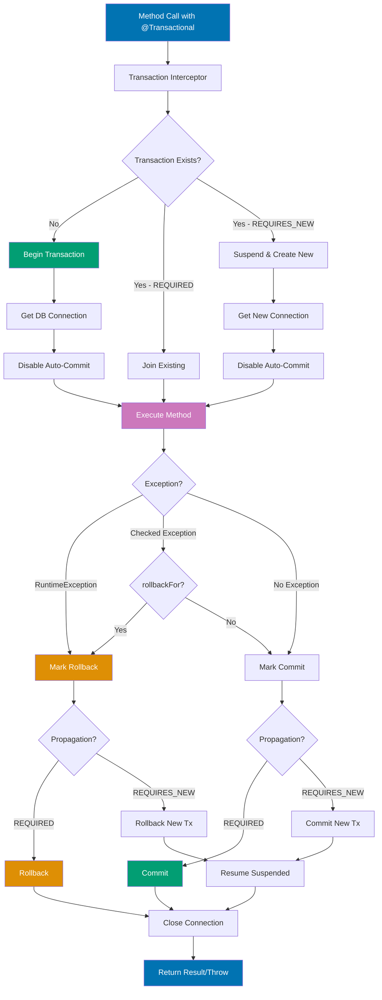

# Spring Boot Data Access

Data persistence is fundamental to Spring Boot applications. This guide covers comprehensive data access patterns using Spring Data JPA, including entity design, repository patterns, query optimization, transaction management, and connection pooling.

## 📋 Quick Reference

- [Entity Design](#-entity-design) - JPA entity patterns and relationships
- [Repository Pattern](#-repository-pattern) - Spring Data JPA repositories
- [Query Methods](#-query-methods) - Derived and custom queries
- [Query Optimization](#-query-optimization) - N+1 prevention and performance
- [Transactions](#-transactions) - Transaction management and isolation
- [Connection Pooling](#-connection-pooling) - HikariCP configuration
- [Database Migrations](#-database-migrations) - Flyway integration
- [Batch Operations](#-batch-operations) - Bulk insert/update patterns
- [OSE Platform Examples](#-ose-platform-examples) - Islamic finance data patterns
- [Best Practices](#-best-practices) - Production guidelines
- [Related Documentation](#-related-documentation) - Cross-references

## 🗂️ Entity Design

JPA entities represent database tables with proper mapping and relationships.

### Basic Entity

```java
// ZakatCalculation.java
package com.oseplatform.zakat.entity;

import jakarta.persistence.*;
import java.math.BigDecimal;
import java.time.LocalDate;
import java.time.Instant;

@Entity
@Table(name = "zakat_calculations")
public class ZakatCalculation {

    @Id
    @GeneratedValue(strategy = GenerationType.UUID)
    private String id;

    @Column(name = "user_id", nullable = false)
    private String userId;

    @Column(name = "wealth", nullable = false, precision = 15, scale = 2)
    private BigDecimal wealth;

    @Column(name = "nisab", nullable = false, precision = 15, scale = 2)
    private BigDecimal nisab;

    @Column(name = "zakat_amount", nullable = false, precision = 15, scale = 2)
    private BigDecimal zakatAmount;

    @Column(name = "calculation_date", nullable = false)
    private LocalDate calculationDate;

    @Column(name = "eligible", nullable = false)
    private Boolean eligible;

    @Column(name = "currency", nullable = false, length = 3)
    private String currency;

    @Column(name = "created_at", nullable = false, updatable = false)
    private Instant createdAt;

    @Column(name = "updated_at", nullable = false)
    private Instant updatedAt;

    @PrePersist
    protected void onCreate() {
        createdAt = Instant.now();
        updatedAt = Instant.now();
    }

    @PreUpdate
    protected void onUpdate() {
        updatedAt = Instant.now();
    }

    // Getters and setters
    public String getId() { return id; }
    public void setId(String id) { this.id = id; }

    public String getUserId() { return userId; }
    public void setUserId(String userId) { this.userId = userId; }

    public BigDecimal getWealth() { return wealth; }
    public void setWealth(BigDecimal wealth) { this.wealth = wealth; }

    public BigDecimal getNisab() { return nisab; }
    public void setNisab(BigDecimal nisab) { this.nisab = nisab; }

    public BigDecimal getZakatAmount() { return zakatAmount; }
    public void setZakatAmount(BigDecimal zakatAmount) { this.zakatAmount = zakatAmount; }

    public LocalDate getCalculationDate() { return calculationDate; }
    public void setCalculationDate(LocalDate calculationDate) { this.calculationDate = calculationDate; }

    public Boolean getEligible() { return eligible; }
    public void setEligible(Boolean eligible) { this.eligible = eligible; }

    public String getCurrency() { return currency; }
    public void setCurrency(String currency) { this.currency = currency; }

    public Instant getCreatedAt() { return createdAt; }
    public Instant getUpdatedAt() { return updatedAt; }
}
```

### Entity with Relationships (One-to-Many)

```java
// MurabahaApplication.java
package com.oseplatform.murabaha.entity;

import jakarta.persistence.*;
import java.math.BigDecimal;
import java.time.Instant;
import java.util.ArrayList;
import java.util.List;

@Entity
@Table(name = "murabaha_applications")
public class MurabahaApplication {

    @Id
    @GeneratedValue(strategy = GenerationType.UUID)
    private String id;

    @Column(name = "user_id", nullable = false)
    private String userId;

    @Column(name = "product_name", nullable = false, length = 100)
    private String productName;

    @Column(name = "purchase_price", nullable = false, precision = 15, scale = 2)
    private BigDecimal purchasePrice;

    @Column(name = "selling_price", nullable = false, precision = 15, scale = 2)
    private BigDecimal sellingPrice;

    @Column(name = "down_payment", nullable = false, precision = 15, scale = 2)
    private BigDecimal downPayment;

    @Column(name = "term_months", nullable = false)
    private Integer termMonths;

    @Enumerated(EnumType.STRING)
    @Column(name = "status", nullable = false, length = 20)
    private ApplicationStatus status;

    @Column(name = "created_at", nullable = false, updatable = false)
    private Instant createdAt;

    @Column(name = "updated_at", nullable = false)
    private Instant updatedAt;

    // One-to-Many: One application has many installments
    @OneToMany(mappedBy = "application", cascade = CascadeType.ALL, orphanRemoval = true)
    private List<MurabahaInstallment> installments = new ArrayList<>();

    @PrePersist
    protected void onCreate() {
        createdAt = Instant.now();
        updatedAt = Instant.now();
        if (status == null) {
            status = ApplicationStatus.PENDING;
        }
    }

    @PreUpdate
    protected void onUpdate() {
        updatedAt = Instant.now();
    }

    // Helper method for bidirectional relationship
    public void addInstallment(MurabahaInstallment installment) {
        installments.add(installment);
        installment.setApplication(this);
    }

    public void removeInstallment(MurabahaInstallment installment) {
        installments.remove(installment);
        installment.setApplication(null);
    }

    // Getters and setters
    public String getId() { return id; }
    public void setId(String id) { this.id = id; }

    public String getUserId() { return userId; }
    public void setUserId(String userId) { this.userId = userId; }

    public String getProductName() { return productName; }
    public void setProductName(String productName) { this.productName = productName; }

    public BigDecimal getPurchasePrice() { return purchasePrice; }
    public void setPurchasePrice(BigDecimal purchasePrice) { this.purchasePrice = purchasePrice; }

    public BigDecimal getSellingPrice() { return sellingPrice; }
    public void setSellingPrice(BigDecimal sellingPrice) { this.sellingPrice = sellingPrice; }

    public BigDecimal getDownPayment() { return downPayment; }
    public void setDownPayment(BigDecimal downPayment) { this.downPayment = downPayment; }

    public Integer getTermMonths() { return termMonths; }
    public void setTermMonths(Integer termMonths) { this.termMonths = termMonths; }

    public ApplicationStatus getStatus() { return status; }
    public void setStatus(ApplicationStatus status) { this.status = status; }

    public List<MurabahaInstallment> getInstallments() { return installments; }
    public void setInstallments(List<MurabahaInstallment> installments) { this.installments = installments; }

    public Instant getCreatedAt() { return createdAt; }
    public Instant getUpdatedAt() { return updatedAt; }
}

enum ApplicationStatus {
    PENDING,
    APPROVED,
    REJECTED,
    ACTIVE,
    COMPLETED,
    CANCELLED
}
```

```java
// MurabahaInstallment.java
package com.oseplatform.murabaha.entity;

import jakarta.persistence.*;
import java.math.BigDecimal;
import java.time.LocalDate;
import java.time.Instant;

@Entity
@Table(name = "murabaha_installments")
public class MurabahaInstallment {

    @Id
    @GeneratedValue(strategy = GenerationType.UUID)
    private String id;

    // Many-to-One: Many installments belong to one application
    @ManyToOne(fetch = FetchType.LAZY)
    @JoinColumn(name = "application_id", nullable = false)
    private MurabahaApplication application;

    @Column(name = "installment_number", nullable = false)
    private Integer installmentNumber;

    @Column(name = "amount", nullable = false, precision = 15, scale = 2)
    private BigDecimal amount;

    @Column(name = "due_date", nullable = false)
    private LocalDate dueDate;

    @Column(name = "paid", nullable = false)
    private Boolean paid;

    @Column(name = "paid_date")
    private LocalDate paidDate;

    @Column(name = "created_at", nullable = false, updatable = false)
    private Instant createdAt;

    @Column(name = "updated_at", nullable = false)
    private Instant updatedAt;

    @PrePersist
    protected void onCreate() {
        createdAt = Instant.now();
        updatedAt = Instant.now();
        if (paid == null) {
            paid = false;
        }
    }

    @PreUpdate
    protected void onUpdate() {
        updatedAt = Instant.now();
    }

    // Getters and setters
    public String getId() { return id; }
    public void setId(String id) { this.id = id; }

    public MurabahaApplication getApplication() { return application; }
    public void setApplication(MurabahaApplication application) { this.application = application; }

    public Integer getInstallmentNumber() { return installmentNumber; }
    public void setInstallmentNumber(Integer installmentNumber) { this.installmentNumber = installmentNumber; }

    public BigDecimal getAmount() { return amount; }
    public void setAmount(BigDecimal amount) { this.amount = amount; }

    public LocalDate getDueDate() { return dueDate; }
    public void setDueDate(LocalDate dueDate) { this.dueDate = dueDate; }

    public Boolean getPaid() { return paid; }
    public void setPaid(Boolean paid) { this.paid = paid; }

    public LocalDate getPaidDate() { return paidDate; }
    public void setPaidDate(LocalDate paidDate) { this.paidDate = paidDate; }

    public Instant getCreatedAt() { return createdAt; }
    public Instant getUpdatedAt() { return updatedAt; }
}
```

### Entity with Many-to-Many Relationship

```java
// WaqfProject.java
package com.oseplatform.waqf.entity;

import jakarta.persistence.*;
import java.math.BigDecimal;
import java.time.Instant;
import java.util.HashSet;
import java.util.Set;

@Entity
@Table(name = "waqf_projects")
public class WaqfProject {

    @Id
    @GeneratedValue(strategy = GenerationType.UUID)
    private String id;

    @Column(name = "name", nullable = false, length = 200)
    private String name;

    @Column(name = "description", columnDefinition = "TEXT")
    private String description;

    @Column(name = "target_amount", nullable = false, precision = 15, scale = 2)
    private BigDecimal targetAmount;

    @Column(name = "current_amount", nullable = false, precision = 15, scale = 2)
    private BigDecimal currentAmount;

    @Enumerated(EnumType.STRING)
    @Column(name = "status", nullable = false, length = 20)
    private ProjectStatus status;

    @Column(name = "created_at", nullable = false, updatable = false)
    private Instant createdAt;

    @Column(name = "updated_at", nullable = false)
    private Instant updatedAt;

    // Many-to-Many: Projects can have multiple categories
    @ManyToMany
    @JoinTable(
        name = "waqf_project_categories",
        joinColumns = @JoinColumn(name = "project_id"),
        inverseJoinColumns = @JoinColumn(name = "category_id")
    )
    private Set<WaqfCategory> categories = new HashSet<>();

    @PrePersist
    protected void onCreate() {
        createdAt = Instant.now();
        updatedAt = Instant.now();
        if (currentAmount == null) {
            currentAmount = BigDecimal.ZERO;
        }
        if (status == null) {
            status = ProjectStatus.ACTIVE;
        }
    }

    @PreUpdate
    protected void onUpdate() {
        updatedAt = Instant.now();
    }

    // Helper methods for bidirectional relationship
    public void addCategory(WaqfCategory category) {
        categories.add(category);
        category.getProjects().add(this);
    }

    public void removeCategory(WaqfCategory category) {
        categories.remove(category);
        category.getProjects().remove(this);
    }

    // Getters and setters
    public String getId() { return id; }
    public void setId(String id) { this.id = id; }

    public String getName() { return name; }
    public void setName(String name) { this.name = name; }

    public String getDescription() { return description; }
    public void setDescription(String description) { this.description = description; }

    public BigDecimal getTargetAmount() { return targetAmount; }
    public void setTargetAmount(BigDecimal targetAmount) { this.targetAmount = targetAmount; }

    public BigDecimal getCurrentAmount() { return currentAmount; }
    public void setCurrentAmount(BigDecimal currentAmount) { this.currentAmount = currentAmount; }

    public ProjectStatus getStatus() { return status; }
    public void setStatus(ProjectStatus status) { this.status = status; }

    public Set<WaqfCategory> getCategories() { return categories; }
    public void setCategories(Set<WaqfCategory> categories) { this.categories = categories; }

    public Instant getCreatedAt() { return createdAt; }
    public Instant getUpdatedAt() { return updatedAt; }
}

enum ProjectStatus {
    ACTIVE,
    COMPLETED,
    SUSPENDED,
    CANCELLED
}
```

```java
// WaqfCategory.java
package com.oseplatform.waqf.entity;

import jakarta.persistence.*;
import java.util.HashSet;
import java.util.Set;

@Entity
@Table(name = "waqf_categories")
public class WaqfCategory {

    @Id
    @GeneratedValue(strategy = GenerationType.UUID)
    private String id;

    @Column(name = "name", nullable = false, unique = true, length = 100)
    private String name;

    @Column(name = "description", columnDefinition = "TEXT")
    private String description;

    // Many-to-Many: Categories can be applied to multiple projects
    @ManyToMany(mappedBy = "categories")
    private Set<WaqfProject> projects = new HashSet<>();

    // Getters and setters
    public String getId() { return id; }
    public void setId(String id) { this.id = id; }

    public String getName() { return name; }
    public void setName(String name) { this.name = name; }

    public String getDescription() { return description; }
    public void setDescription(String description) { this.description = description; }

    public Set<WaqfProject> getProjects() { return projects; }
    public void setProjects(Set<WaqfProject> projects) { this.projects = projects; }
}
```

### Embedded Objects

```java
// Address.java (Embeddable)
package com.oseplatform.common.entity;

import jakarta.persistence.Column;
import jakarta.persistence.Embeddable;

@Embeddable
public class Address {

    @Column(name = "street", length = 200)
    private String street;

    @Column(name = "city", length = 100)
    private String city;

    @Column(name = "state", length = 100)
    private String state;

    @Column(name = "postal_code", length = 20)
    private String postalCode;

    @Column(name = "country", length = 2)
    private String country;

    // Getters and setters
    public String getStreet() { return street; }
    public void setStreet(String street) { this.street = street; }

    public String getCity() { return city; }
    public void setCity(String city) { this.city = city; }

    public String getState() { return state; }
    public void setState(String state) { this.state = state; }

    public String getPostalCode() { return postalCode; }
    public void setPostalCode(String postalCode) { this.postalCode = postalCode; }

    public String getCountry() { return country; }
    public void setCountry(String country) { this.country = country; }
}
```

```java
// User.java (using embedded object)
package com.oseplatform.user.entity;

import com.oseplatform.common.entity.Address;
import jakarta.persistence.*;
import java.time.Instant;

@Entity
@Table(name = "users")
public class User {

    @Id
    @GeneratedValue(strategy = GenerationType.UUID)
    private String id;

    @Column(name = "email", nullable = false, unique = true, length = 255)
    private String email;

    @Column(name = "password_hash", nullable = false, length = 255)
    private String passwordHash;

    @Embedded
    private Address address;

    @Column(name = "created_at", nullable = false, updatable = false)
    private Instant createdAt;

    @PrePersist
    protected void onCreate() {
        createdAt = Instant.now();
    }

    // Getters and setters
    public String getId() { return id; }
    public void setId(String id) { this.id = id; }

    public String getEmail() { return email; }
    public void setEmail(String email) { this.email = email; }

    public String getPasswordHash() { return passwordHash; }
    public void setPasswordHash(String passwordHash) { this.passwordHash = passwordHash; }

    public Address getAddress() { return address; }
    public void setAddress(Address address) { this.address = address; }

    public Instant getCreatedAt() { return createdAt; }
}
```

## 🗄️ Repository Pattern

Spring Data JPA repositories provide CRUD operations and query methods without boilerplate code.

### Basic Repository

```java
// ZakatCalculationRepository.java
package com.oseplatform.zakat.repository;

import com.oseplatform.zakat.entity.ZakatCalculation;
import org.springframework.data.jpa.repository.JpaRepository;
import org.springframework.stereotype.Repository;

import java.util.List;

@Repository
public interface ZakatCalculationRepository extends JpaRepository<ZakatCalculation, String> {

    // Spring Data JPA generates implementation automatically

    // Find by single field
    List<ZakatCalculation> findByUserId(String userId);

    // Find by multiple fields
    List<ZakatCalculation> findByUserIdAndEligible(String userId, boolean eligible);

    // Find by field with comparison
    List<ZakatCalculation> findByUserIdAndWealthGreaterThan(String userId, BigDecimal wealth);

    // Count queries
    long countByUserId(String userId);

    // Exists queries
    boolean existsByUserIdAndEligible(String userId, boolean eligible);

    // Delete queries
    void deleteByUserId(String userId);
}
```

### Repository with Custom Queries

```java
// MurabahaApplicationRepository.java
package com.oseplatform.murabaha.repository;

import com.oseplatform.murabaha.entity.MurabahaApplication;
import com.oseplatform.murabaha.entity.ApplicationStatus;
import org.springframework.data.jpa.repository.JpaRepository;
import org.springframework.data.jpa.repository.Query;
import org.springframework.data.repository.query.Param;
import org.springframework.stereotype.Repository;

import java.math.BigDecimal;
import java.time.Instant;
import java.util.List;
import java.util.Optional;

@Repository
public interface MurabahaApplicationRepository extends JpaRepository<MurabahaApplication, String> {

    // Derived query methods
    List<MurabahaApplication> findByUserId(String userId);

    List<MurabahaApplication> findByStatus(ApplicationStatus status);

    List<MurabahaApplication> findByUserIdAndStatus(String userId, ApplicationStatus status);

    // Custom JPQL query
    @Query("""
        SELECT m FROM MurabahaApplication m
        WHERE m.userId = :userId
        AND m.status = :status
        ORDER BY m.createdAt DESC
    """)
    List<MurabahaApplication> findUserApplicationsByStatus(
        @Param("userId") String userId,
        @Param("status") ApplicationStatus status
    );

    // Query with date range
    @Query("""
        SELECT m FROM MurabahaApplication m
        WHERE m.userId = :userId
        AND m.createdAt BETWEEN :start AND :end
        ORDER BY m.createdAt DESC
    """)
    List<MurabahaApplication> findUserApplicationsInDateRange(
        @Param("userId") String userId,
        @Param("start") Instant start,
        @Param("end") Instant end
    );

    // Query with aggregation
    @Query("""
        SELECT SUM(m.purchasePrice)
        FROM MurabahaApplication m
        WHERE m.userId = :userId
        AND m.status = :status
    """)
    BigDecimal sumPurchasePriceByUserAndStatus(
        @Param("userId") String userId,
        @Param("status") ApplicationStatus status
    );

    // Native SQL query
    @Query(value = """
        SELECT * FROM murabaha_applications
        WHERE user_id = :userId
        AND purchase_price BETWEEN :minPrice AND :maxPrice
        ORDER BY created_at DESC
        LIMIT :limit
    """, nativeQuery = true)
    List<MurabahaApplication> findByPriceRange(
        @Param("userId") String userId,
        @Param("minPrice") BigDecimal minPrice,
        @Param("maxPrice") BigDecimal maxPrice,
        @Param("limit") int limit
    );
}
```

### Repository with Pagination and Sorting

```java
// WaqfProjectRepository.java
package com.oseplatform.waqf.repository;

import com.oseplatform.waqf.entity.WaqfProject;
import com.oseplatform.waqf.entity.ProjectStatus;
import org.springframework.data.domain.Page;
import org.springframework.data.domain.Pageable;
import org.springframework.data.jpa.repository.JpaRepository;
import org.springframework.data.jpa.repository.Query;
import org.springframework.data.repository.query.Param;
import org.springframework.stereotype.Repository;

import java.math.BigDecimal;
import java.util.List;

@Repository
public interface WaqfProjectRepository extends JpaRepository<WaqfProject, String> {

    // Pagination with derived query
    Page<WaqfProject> findByStatus(ProjectStatus status, Pageable pageable);

    // Pagination with custom query
    @Query("""
        SELECT w FROM WaqfProject w
        WHERE w.status = :status
        AND w.currentAmount < w.targetAmount
        ORDER BY w.currentAmount DESC
    """)
    Page<WaqfProject> findActiveProjectsNeedingFunding(
        @Param("status") ProjectStatus status,
        Pageable pageable
    );

    // Sorting without pagination
    List<WaqfProject> findByStatusOrderByCurrentAmountDesc(ProjectStatus status);

    // Find top N
    List<WaqfProject> findTop10ByStatusOrderByCurrentAmountDesc(ProjectStatus status);
}
```

## 🔍 Query Methods

Spring Data JPA query methods provide flexible ways to query data.

### Query Method Keywords

```java
// Query method examples
public interface ExampleRepository extends JpaRepository<Example, String> {

    // Equality
    List<Example> findByName(String name);
    List<Example> findByNameIs(String name);
    List<Example> findByNameEquals(String name);

    // Inequality
    List<Example> findByNameNot(String name);

    // Comparison
    List<Example> findByAgeGreaterThan(int age);
    List<Example> findByAgeGreaterThanEqual(int age);
    List<Example> findByAgeLessThan(int age);
    List<Example> findByAgeLessThanEqual(int age);
    List<Example> findByAgeBetween(int start, int end);

    // String operations
    List<Example> findByNameLike(String pattern);
    List<Example> findByNameStartingWith(String prefix);
    List<Example> findByNameEndingWith(String suffix);
    List<Example> findByNameContaining(String substring);
    List<Example> findByNameIgnoreCase(String name);

    // Collection operations
    List<Example> findByStatusIn(List<String> statuses);
    List<Example> findByStatusNotIn(List<String> statuses);

    // Null checking
    List<Example> findByDescriptionIsNull();
    List<Example> findByDescriptionIsNotNull();

    // Boolean
    List<Example> findByActiveTrue();
    List<Example> findByActiveFalse();

    // Ordering
    List<Example> findByStatusOrderByCreatedAtDesc(String status);
    List<Example> findByStatusOrderByCreatedAtAscNameDesc(String status);

    // Limiting results
    Example findFirstByStatus(String status);
    List<Example> findTop5ByStatusOrderByCreatedAtDesc(String status);

    // Distinct
    List<Example> findDistinctByStatus(String status);

    // Logical operators (AND, OR)
    List<Example> findByNameAndStatus(String name, String status);
    List<Example> findByNameOrStatus(String name, String status);
}
```

### Custom JPQL Queries

```java
// Complex custom queries
@Repository
public interface CustomQueryRepository extends JpaRepository<ZakatCalculation, String> {

    // Projection with specific fields
    @Query("""
        SELECT NEW com.oseplatform.zakat.dto.ZakatSummaryDto(
            z.userId,
            SUM(z.zakatAmount),
            COUNT(z.id)
        )
        FROM ZakatCalculation z
        WHERE z.calculationDate BETWEEN :start AND :end
        GROUP BY z.userId
    """)
    List<ZakatSummaryDto> getZakatSummary(
        @Param("start") LocalDate start,
        @Param("end") LocalDate end
    );

    // Subquery
    @Query("""
        SELECT z FROM ZakatCalculation z
        WHERE z.zakatAmount > (
            SELECT AVG(zz.zakatAmount)
            FROM ZakatCalculation zz
            WHERE zz.userId = z.userId
        )
    """)
    List<ZakatCalculation> findAboveAverageZakat();

    // Join query
    @Query("""
        SELECT m FROM MurabahaApplication m
        JOIN m.installments i
        WHERE i.dueDate < CURRENT_DATE
        AND i.paid = false
        GROUP BY m.id
        HAVING COUNT(i.id) > 0
    """)
    List<MurabahaApplication> findApplicationsWithOverdueInstallments();
}
```

## ⚡ Query Optimization

Optimize queries to prevent N+1 problems and improve performance.

### N+1 Problem Prevention

```java
// BAD - N+1 problem
@Service
public class BadMurabahaService {

    private final MurabahaApplicationRepository repository;

    public List<MurabahaApplication> getApplicationsWithInstallments(String userId) {
        // 1 query to fetch applications
        List<MurabahaApplication> applications = repository.findByUserId(userId);

        // N queries - one for each application's installments (lazy loading)
        for (MurabahaApplication app : applications) {
            app.getInstallments().size(); // Triggers separate query
        }

        return applications;
    }
}

// GOOD - Using JOIN FETCH
@Repository
public interface MurabahaApplicationRepository extends JpaRepository<MurabahaApplication, String> {

    // Single query with JOIN FETCH
    @Query("""
        SELECT DISTINCT m FROM MurabahaApplication m
        LEFT JOIN FETCH m.installments
        WHERE m.userId = :userId
    """)
    List<MurabahaApplication> findByUserIdWithInstallments(@Param("userId") String userId);
}

@Service
public class GoodMurabahaService {

    private final MurabahaApplicationRepository repository;

    public List<MurabahaApplication> getApplicationsWithInstallments(String userId) {
        // Single query fetches applications and installments
        return repository.findByUserIdWithInstallments(userId);
    }
}
```

### Entity Graph

```java
// Using @EntityGraph to avoid N+1
@Repository
public interface WaqfProjectRepository extends JpaRepository<WaqfProject, String> {

    @EntityGraph(attributePaths = {"categories"})
    @Query("SELECT w FROM WaqfProject w WHERE w.status = :status")
    List<WaqfProject> findByStatusWithCategories(@Param("status") ProjectStatus status);

    // Multiple associations
    @EntityGraph(attributePaths = {"categories", "donations"})
    List<WaqfProject> findByStatus(ProjectStatus status);
}
```

### Projections (DTOs)

```java
// Interface-based projection
public interface ZakatCalculationSummary {
    String getUserId();
    BigDecimal getZakatAmount();
    LocalDate getCalculationDate();
}

@Repository
public interface ZakatCalculationRepository extends JpaRepository<ZakatCalculation, String> {

    // Returns only selected fields
    List<ZakatCalculationSummary> findByUserId(String userId);
}

// Class-based projection (DTO)
public class ZakatSummaryDto {
    private String userId;
    private BigDecimal totalZakat;
    private Long calculationCount;

    public ZakatSummaryDto(String userId, BigDecimal totalZakat, Long calculationCount) {
        this.userId = userId;
        this.totalZakat = totalZakat;
        this.calculationCount = calculationCount;
    }

    // Getters
    public String getUserId() { return userId; }
    public BigDecimal getTotalZakat() { return totalZakat; }
    public Long getCalculationCount() { return calculationCount; }
}

@Repository
public interface ZakatCalculationRepository extends JpaRepository<ZakatCalculation, String> {

    @Query("""
        SELECT NEW com.oseplatform.zakat.dto.ZakatSummaryDto(
            z.userId,
            SUM(z.zakatAmount),
            COUNT(z.id)
        )
        FROM ZakatCalculation z
        WHERE z.userId = :userId
        GROUP BY z.userId
    """)
    ZakatSummaryDto getZakatSummaryByUser(@Param("userId") String userId);
}
```

### Fetch Mode Optimization

```java
// Entity with optimized fetch modes
@Entity
@Table(name = "murabaha_applications")
public class MurabahaApplication {

    @Id
    @GeneratedValue(strategy = GenerationType.UUID)
    private String id;

    // LAZY loading (default for collections, good for performance)
    @OneToMany(mappedBy = "application", fetch = FetchType.LAZY)
    private List<MurabahaInstallment> installments;

    // EAGER loading (only for small, frequently accessed data)
    @ManyToOne(fetch = FetchType.EAGER)
    @JoinColumn(name = "user_id")
    private User user;

    // Use @BatchSize to optimize lazy loading
    @OneToMany(mappedBy = "application")
    @BatchSize(size = 10)
    private List<MurabahaDocument> documents;
}
```

## 💼 Transactions

Spring's `@Transactional` annotation provides declarative transaction management.

### Transaction Management Flow



**Transaction Lifecycle**:

1. **Intercept** (blue): AOP proxy intercepts `@Transactional` method call
2. **Begin** (teal): Create new transaction or join existing
3. **Execute** (purple): Run business logic
4. **Exception Handling** (orange):
   - RuntimeException → automatic rollback
   - Checked exception → rollback if specified in `rollbackFor`
   - No exception → commit
5. **Commit/Rollback** (teal/orange): Finalize transaction
6. **Cleanup** (blue): Close connection, return to pool

**Transaction Propagation**:

- **REQUIRED** (default): Join existing or create new
- **REQUIRES_NEW**: Always create new transaction
- **NESTED**: Create nested transaction (savepoint)
- **MANDATORY**: Require existing transaction
- **SUPPORTS**: Join if exists, otherwise non-transactional
- **NOT_SUPPORTED**: Always non-transactional
- **NEVER**: Throw exception if transaction exists

**Best Practices**:

- Keep transactions short (minimize lock duration)
- Use REQUIRED propagation (default) for most cases
- Set `readOnly=true` for read-only operations
- Configure timeout for long-running operations
- Be explicit about `rollbackFor` for checked exceptions

### Basic Transaction Management

```java
// ZakatService.java
package com.oseplatform.zakat.service;

import com.oseplatform.zakat.entity.ZakatCalculation;
import com.oseplatform.zakat.repository.ZakatCalculationRepository;
import org.springframework.stereotype.Service;
import org.springframework.transaction.annotation.Transactional;

import java.math.BigDecimal;

@Service
public class ZakatService {

    private final ZakatCalculationRepository repository;

    public ZakatService(ZakatCalculationRepository repository) {
        this.repository = repository;
    }

    // Read-only transaction (optimized)
    @Transactional(readOnly = true)
    public ZakatCalculation getCalculation(String id) {
        return repository.findById(id)
            .orElseThrow(() -> new CalculationNotFoundException(id));
    }

    // Write transaction (default)
    @Transactional
    public ZakatCalculation createCalculation(ZakatCalculation calculation) {
        // Calculate zakat
        if (calculation.getWealth().compareTo(calculation.getNisab()) >= 0) {
            calculation.setEligible(true);
            calculation.setZakatAmount(
                calculation.getWealth().multiply(BigDecimal.valueOf(0.025))
            );
        } else {
            calculation.setEligible(false);
            calculation.setZakatAmount(BigDecimal.ZERO);
        }

        return repository.save(calculation);
    }

    // Transaction with exception handling
    @Transactional(rollbackFor = Exception.class)
    public void deleteCalculation(String id) {
        ZakatCalculation calculation = repository.findById(id)
            .orElseThrow(() -> new CalculationNotFoundException(id));

        repository.delete(calculation);
        // If any exception occurs, transaction will rollback
    }
}
```

### Transaction Propagation

```java
// Transaction propagation examples
@Service
public class MurabahaService {

    private final MurabahaApplicationRepository applicationRepository;
    private final MurabahaInstallmentRepository installmentRepository;

    // REQUIRED (default) - Use existing transaction or create new one
    @Transactional(propagation = Propagation.REQUIRED)
    public MurabahaApplication createApplication(MurabahaApplication application) {
        return applicationRepository.save(application);
    }

    // REQUIRES_NEW - Always create new transaction (suspends current)
    @Transactional(propagation = Propagation.REQUIRES_NEW)
    public void logApplicationEvent(String applicationId, String event) {
        // This runs in separate transaction
        // Even if parent transaction rolls back, this commits
        auditLogRepository.save(new AuditLog(applicationId, event));
    }

    // NESTED - Create nested transaction with savepoint
    @Transactional(propagation = Propagation.NESTED)
    public void processInstallment(String installmentId) {
        // Can rollback independently of parent transaction
        MurabahaInstallment installment = installmentRepository.findById(installmentId)
            .orElseThrow();
        installment.setPaid(true);
        installmentRepository.save(installment);
    }

    // MANDATORY - Must be called within existing transaction
    @Transactional(propagation = Propagation.MANDATORY)
    public void updateApplicationStatus(String id, ApplicationStatus status) {
        // Throws exception if called without active transaction
        MurabahaApplication application = applicationRepository.findById(id)
            .orElseThrow();
        application.setStatus(status);
        applicationRepository.save(application);
    }

    // SUPPORTS - Use transaction if exists, otherwise non-transactional
    @Transactional(propagation = Propagation.SUPPORTS)
    public MurabahaApplication getApplication(String id) {
        // Works with or without transaction
        return applicationRepository.findById(id).orElseThrow();
    }

    // NOT_SUPPORTED - Always non-transactional (suspends current)
    @Transactional(propagation = Propagation.NOT_SUPPORTED)
    public void sendNotification(String userId, String message) {
        // Runs without transaction
        notificationService.send(userId, message);
    }

    // NEVER - Must not be called within transaction
    @Transactional(propagation = Propagation.NEVER)
    public void validateApplicationRules(MurabahaApplication application) {
        // Throws exception if called within transaction
        // Use for pure validation logic
    }
}
```

### Transaction Isolation Levels

```java
// Transaction isolation examples
@Service
public class WaqfDonationService {

    private final WaqfProjectRepository projectRepository;
    private final WaqfDonationRepository donationRepository;

    // READ_UNCOMMITTED - Lowest isolation, allows dirty reads
    @Transactional(isolation = Isolation.READ_UNCOMMITTED)
    public BigDecimal getProjectDonationEstimate(String projectId) {
        // May read uncommitted changes from other transactions
        // Fastest but least consistent
        return projectRepository.findById(projectId)
            .map(WaqfProject::getCurrentAmount)
            .orElse(BigDecimal.ZERO);
    }

    // READ_COMMITTED - Prevents dirty reads (default for most databases)
    @Transactional(isolation = Isolation.READ_COMMITTED)
    public BigDecimal getProjectCurrentAmount(String projectId) {
        // Only reads committed data
        // Other transactions can modify data during this transaction
        return projectRepository.findById(projectId)
            .map(WaqfProject::getCurrentAmount)
            .orElse(BigDecimal.ZERO);
    }

    // REPEATABLE_READ - Prevents dirty and non-repeatable reads
    @Transactional(isolation = Isolation.REPEATABLE_READ)
    public void processMultipleDonations(String projectId, List<BigDecimal> amounts) {
        // Reads same data throughout transaction
        // Prevents other transactions from modifying read data
        WaqfProject project = projectRepository.findById(projectId).orElseThrow();

        for (BigDecimal amount : amounts) {
            project.setCurrentAmount(
                project.getCurrentAmount().add(amount)
            );
        }

        projectRepository.save(project);
    }

    // SERIALIZABLE - Highest isolation, prevents all anomalies
    @Transactional(isolation = Isolation.SERIALIZABLE)
    public void processCriticalDonation(String projectId, BigDecimal amount) {
        // Transactions execute as if serial
        // Slowest but most consistent
        WaqfProject project = projectRepository.findById(projectId).orElseThrow();

        if (project.getCurrentAmount().add(amount).compareTo(project.getTargetAmount()) > 0) {
            throw new ExcessDonationException();
        }

        project.setCurrentAmount(
            project.getCurrentAmount().add(amount)
        );
        projectRepository.save(project);
    }
}
```

### Transaction Timeout

```java
// Transaction with timeout
@Service
public class BatchService {

    private final MurabahaApplicationRepository repository;

    // Timeout after 30 seconds
    @Transactional(timeout = 30)
    public void processBulkApplications(List<MurabahaApplication> applications) {
        // If processing takes longer than 30 seconds, transaction rolls back
        for (MurabahaApplication application : applications) {
            // Process application...
            repository.save(application);
        }
    }
}
```

## 🌊 Connection Pooling

HikariCP is the default connection pool in Spring Boot, providing high performance and reliability.

### HikariCP Configuration

```yaml
# application.yml
spring:
  datasource:
    url: jdbc:postgresql://localhost:5432/oseplatform
    username: ${DB_USERNAME}
    password: ${DB_PASSWORD}
    driver-class-name: org.postgresql.Driver

    hikari:
      # Maximum number of connections in pool
      maximum-pool-size: 10

      # Minimum idle connections
      minimum-idle: 5

      # Connection timeout (milliseconds)
      connection-timeout: 30000

      # Idle timeout (milliseconds)
      idle-timeout: 600000

      # Maximum lifetime of connection (milliseconds)
      max-lifetime: 1800000

      # Pool name (for monitoring)
      pool-name: OSEPlatformHikariPool

      # Test query to validate connections
      connection-test-query: SELECT 1

      # Auto-commit behavior
      auto-commit: true

      # Leak detection threshold (milliseconds)
      leak-detection-threshold: 60000
```

### Programmatic Configuration

```java
// HikariConfig.java
package com.oseplatform.config;

import com.zaxxer.hikari.HikariConfig;
import com.zaxxer.hikari.HikariDataSource;
import org.springframework.beans.factory.annotation.Value;
import org.springframework.context.annotation.Bean;
import org.springframework.context.annotation.Configuration;

import javax.sql.DataSource;

@Configuration
public class DatabaseConfig {

    @Value("${spring.datasource.url}")
    private String jdbcUrl;

    @Value("${spring.datasource.username}")
    private String username;

    @Value("${spring.datasource.password}")
    private String password;

    @Bean
    public DataSource dataSource() {
        HikariConfig config = new HikariConfig();

        config.setJdbcUrl(jdbcUrl);
        config.setUsername(username);
        config.setPassword(password);

        // Pool sizing
        config.setMaximumPoolSize(10);
        config.setMinimumIdle(5);

        // Timeouts
        config.setConnectionTimeout(30000);
        config.setIdleTimeout(600000);
        config.setMaxLifetime(1800000);

        // Pool name
        config.setPoolName("OSEPlatformHikariPool");

        // Connection properties
        config.addDataSourceProperty("cachePrepStmts", "true");
        config.addDataSourceProperty("prepStmtCacheSize", "250");
        config.addDataSourceProperty("prepStmtCacheSqlLimit", "2048");

        return new HikariDataSource(config);
    }
}
```

### Connection Pool Tuning

```java
// Monitoring connection pool health
@Component
public class HikariPoolMonitor {

    private final HikariDataSource dataSource;

    public HikariPoolMonitor(DataSource dataSource) {
        this.dataSource = (HikariDataSource) dataSource;
    }

    @Scheduled(fixedRate = 60000) // Every minute
    public void logPoolStats() {
        HikariPoolMXBean poolBean = dataSource.getHikariPoolMXBean();

        log.info(
            "HikariCP Stats - Active: {}, Idle: {}, Total: {}, Waiting: {}",
            poolBean.getActiveConnections(),
            poolBean.getIdleConnections(),
            poolBean.getTotalConnections(),
            poolBean.getThreadsAwaitingConnection()
        );
    }
}
```

## 🚀 Database Migrations

Flyway manages database schema migrations in a version-controlled manner.

### Flyway Configuration

```yaml
# application.yml
spring:
  flyway:
    enabled: true
    baseline-on-migrate: true
    locations: classpath:db/migration
    table: flyway_schema_history
    baseline-version: 0
```

### Migration Files

```sql
-- V1__create_zakat_calculations_table.sql
CREATE TABLE zakat_calculations (
    id UUID PRIMARY KEY,
    user_id VARCHAR(255) NOT NULL,
    wealth DECIMAL(15, 2) NOT NULL,
    nisab DECIMAL(15, 2) NOT NULL,
    zakat_amount DECIMAL(15, 2) NOT NULL,
    calculation_date DATE NOT NULL,
    eligible BOOLEAN NOT NULL,
    currency VARCHAR(3) NOT NULL,
    created_at TIMESTAMP NOT NULL,
    updated_at TIMESTAMP NOT NULL
);

CREATE INDEX idx_zakat_user_id ON zakat_calculations(user_id);
CREATE INDEX idx_zakat_calculation_date ON zakat_calculations(calculation_date);
```

```sql
-- V2__create_murabaha_tables.sql
CREATE TABLE murabaha_applications (
    id UUID PRIMARY KEY,
    user_id VARCHAR(255) NOT NULL,
    product_name VARCHAR(100) NOT NULL,
    purchase_price DECIMAL(15, 2) NOT NULL,
    selling_price DECIMAL(15, 2) NOT NULL,
    down_payment DECIMAL(15, 2) NOT NULL,
    term_months INTEGER NOT NULL,
    status VARCHAR(20) NOT NULL,
    created_at TIMESTAMP NOT NULL,
    updated_at TIMESTAMP NOT NULL
);

CREATE TABLE murabaha_installments (
    id UUID PRIMARY KEY,
    application_id UUID NOT NULL REFERENCES murabaha_applications(id),
    installment_number INTEGER NOT NULL,
    amount DECIMAL(15, 2) NOT NULL,
    due_date DATE NOT NULL,
    paid BOOLEAN NOT NULL,
    paid_date DATE,
    created_at TIMESTAMP NOT NULL,
    updated_at TIMESTAMP NOT NULL
);

CREATE INDEX idx_murabaha_user_id ON murabaha_applications(user_id);
CREATE INDEX idx_murabaha_status ON murabaha_applications(status);
CREATE INDEX idx_installment_application_id ON murabaha_installments(application_id);
```

```sql
-- V3__create_waqf_tables.sql
CREATE TABLE waqf_projects (
    id UUID PRIMARY KEY,
    name VARCHAR(200) NOT NULL,
    description TEXT,
    target_amount DECIMAL(15, 2) NOT NULL,
    current_amount DECIMAL(15, 2) NOT NULL,
    status VARCHAR(20) NOT NULL,
    created_at TIMESTAMP NOT NULL,
    updated_at TIMESTAMP NOT NULL
);

CREATE TABLE waqf_categories (
    id UUID PRIMARY KEY,
    name VARCHAR(100) NOT NULL UNIQUE,
    description TEXT
);

CREATE TABLE waqf_project_categories (
    project_id UUID NOT NULL REFERENCES waqf_projects(id),
    category_id UUID NOT NULL REFERENCES waqf_categories(id),
    PRIMARY KEY (project_id, category_id)
);

CREATE INDEX idx_waqf_status ON waqf_projects(status);
CREATE INDEX idx_waqf_current_amount ON waqf_projects(current_amount);
```

## 📦 Batch Operations

Optimize bulk operations with batch processing.

### Batch Insert

```java
// Batch insert with JDBC batch support
@Service
public class BatchZakatService {

    private final EntityManager entityManager;

    @Transactional
    public void batchInsertCalculations(List<ZakatCalculation> calculations) {
        int batchSize = 50;

        for (int i = 0; i < calculations.size(); i++) {
            entityManager.persist(calculations.get(i));

            // Flush and clear every batch
            if (i > 0 && i % batchSize == 0) {
                entityManager.flush();
                entityManager.clear();
            }
        }

        // Flush remaining
        entityManager.flush();
        entityManager.clear();
    }
}
```

```yaml
# Enable JDBC batch processing
spring:
  jpa:
    properties:
      hibernate:
        jdbc:
          batch_size: 50
        order_inserts: true
        order_updates: true
```

### Batch Update

```java
// Batch update with JPQL
@Repository
public interface MurabahaInstallmentRepository extends JpaRepository<MurabahaInstallment, String> {

    @Modifying
    @Query("""
        UPDATE MurabahaInstallment i
        SET i.paid = true, i.paidDate = :paidDate
        WHERE i.id IN :ids
    """)
    int batchMarkAsPaid(@Param("ids") List<String> ids, @Param("paidDate") LocalDate paidDate);
}

@Service
public class InstallmentBatchService {

    private final MurabahaInstallmentRepository repository;

    @Transactional
    public int markInstallmentsAsPaid(List<String> installmentIds) {
        return repository.batchMarkAsPaid(installmentIds, LocalDate.now());
    }
}
```

## 💼 OSE Platform Examples

Complete data access patterns for Islamic finance operations.

### Zakat Calculation Repository

```java
// Comprehensive Zakat repository
@Repository
public interface ZakatCalculationRepository extends JpaRepository<ZakatCalculation, String> {

    // Find user's calculations
    List<ZakatCalculation> findByUserIdOrderByCalculationDateDesc(String userId);

    // Find eligible calculations
    @Query("""
        SELECT z FROM ZakatCalculation z
        WHERE z.userId = :userId
        AND z.eligible = true
        ORDER BY z.calculationDate DESC
    """)
    List<ZakatCalculation> findEligibleCalculations(@Param("userId") String userId);

    // Annual zakat summary
    @Query("""
        SELECT NEW com.oseplatform.zakat.dto.AnnualZakatSummary(
            YEAR(z.calculationDate),
            SUM(z.zakatAmount),
            AVG(z.wealth),
            COUNT(z.id)
        )
        FROM ZakatCalculation z
        WHERE z.userId = :userId
        GROUP BY YEAR(z.calculationDate)
        ORDER BY YEAR(z.calculationDate) DESC
    """)
    List<AnnualZakatSummary> getAnnualSummary(@Param("userId") String userId);

    // Find calculations needing review
    @Query("""
        SELECT z FROM ZakatCalculation z
        WHERE z.userId = :userId
        AND z.wealth > :threshold
        AND z.calculationDate > :date
    """)
    List<ZakatCalculation> findLargeCalculationsAfterDate(
        @Param("userId") String userId,
        @Param("threshold") BigDecimal threshold,
        @Param("date") LocalDate date
    );
}
```

### Murabaha Application with Installments

```java
// Murabaha service with transaction management
@Service
public class MurabahaApplicationService {

    private final MurabahaApplicationRepository applicationRepository;
    private final MurabahaInstallmentRepository installmentRepository;

    @Transactional
    public MurabahaApplication createApplicationWithInstallments(
        MurabahaApplicationRequest request
    ) {
        // Create application
        MurabahaApplication application = new MurabahaApplication();
        application.setUserId(request.getUserId());
        application.setProductName(request.getProductName());
        application.setPurchasePrice(request.getPurchasePrice());
        application.setSellingPrice(calculateSellingPrice(request));
        application.setDownPayment(request.getDownPayment());
        application.setTermMonths(request.getTermMonths());
        application.setStatus(ApplicationStatus.PENDING);

        application = applicationRepository.save(application);

        // Create installments
        BigDecimal installmentAmount = calculateInstallmentAmount(application);
        LocalDate startDate = LocalDate.now().plusMonths(1);

        for (int i = 1; i <= application.getTermMonths(); i++) {
            MurabahaInstallment installment = new MurabahaInstallment();
            installment.setApplication(application);
            installment.setInstallmentNumber(i);
            installment.setAmount(installmentAmount);
            installment.setDueDate(startDate.plusMonths(i - 1));
            installment.setPaid(false);

            installmentRepository.save(installment);
        }

        return application;
    }

    @Transactional(readOnly = true)
    public MurabahaApplication getApplicationWithInstallments(String id) {
        return applicationRepository.findByIdWithInstallments(id)
            .orElseThrow(() -> new ApplicationNotFoundException(id));
    }

    private BigDecimal calculateSellingPrice(MurabahaApplicationRequest request) {
        // Calculate with Islamic finance profit margin
        BigDecimal profitRate = BigDecimal.valueOf(0.10); // 10% profit
        return request.getPurchasePrice()
            .multiply(BigDecimal.ONE.add(profitRate));
    }

    private BigDecimal calculateInstallmentAmount(MurabahaApplication application) {
        BigDecimal remainingAmount = application.getSellingPrice()
            .subtract(application.getDownPayment());
        return remainingAmount.divide(
            BigDecimal.valueOf(application.getTermMonths()),
            2,
            RoundingMode.HALF_UP
        );
    }
}
```

### Waqf Project with Donations

```java
// Waqf project service with optimized queries
@Service
public class WaqfProjectService {

    private final WaqfProjectRepository projectRepository;
    private final WaqfDonationRepository donationRepository;

    @Transactional(readOnly = true)
    public Page<WaqfProject> getActiveProjects(Pageable pageable) {
        // Efficient pagination with categories
        return projectRepository.findByStatusWithCategories(
            ProjectStatus.ACTIVE,
            pageable
        );
    }

    @Transactional
    public WaqfProject processDonation(String projectId, BigDecimal amount) {
        WaqfProject project = projectRepository.findById(projectId)
            .orElseThrow(() -> new ProjectNotFoundException(projectId));

        // Update project amount
        project.setCurrentAmount(
            project.getCurrentAmount().add(amount)
        );

        // Check if target reached
        if (project.getCurrentAmount().compareTo(project.getTargetAmount()) >= 0) {
            project.setStatus(ProjectStatus.COMPLETED);
        }

        return projectRepository.save(project);
    }

    @Transactional(readOnly = true)
    public List<WaqfProject> getProjectsNeedingFunding(int limit) {
        // Find projects closest to target
        Pageable pageable = PageRequest.of(0, limit);
        return projectRepository.findActiveProjectsNeedingFunding(
            ProjectStatus.ACTIVE,
            pageable
        ).getContent();
    }
}
```

## ✅ Best Practices

Production guidelines for Spring Data JPA.

### Entity Design Best Practices

- **Use UUIDs for distributed systems** - Better for horizontal scaling
- **Add audit fields** - `createdAt`, `updatedAt` for tracking
- **Use @PrePersist/@PreUpdate** - Automatic timestamp management
- **Lazy loading by default** - Optimize fetch strategies
- **Use @BatchSize** - Reduce N+1 queries for lazy collections
- **Immutable value objects** - Use @Embeddable for address, money, etc.

### Repository Best Practices

- **Read-only transactions** - Use `@Transactional(readOnly = true)` for queries
- **Projections for reports** - Return only needed fields
- **Pagination for large datasets** - Always use `Pageable` for lists
- **JOIN FETCH for associations** - Prevent N+1 problems
- **Named parameters** - Use `:param` syntax in JPQL queries

### Transaction Best Practices

- **Keep transactions short** - Minimize lock duration
- **Read-only optimization** - Use `readOnly = true` when possible
- **Appropriate propagation** - Choose based on use case
- **Correct isolation level** - Balance consistency and performance
- **Timeout configuration** - Prevent long-running transactions

### Performance Best Practices

- **Index frequently queried fields** - Improve query performance
- **Batch operations** - Use batch insert/update for bulk operations
- **Connection pool tuning** - Adjust based on load
- **Query optimization** - Analyze and optimize slow queries
- **Database-specific features** - Use native features when needed

## 🔗 Related Documentation

- [Spring Boot Best Practices](ex-soen-plwe-to-jvspbo__best-practices.md) - Production standards and patterns
- [Spring Boot Security](ex-soen-plwe-to-jvspbo__security.md) - Security patterns for data access
- [Spring Boot REST APIs](ex-soen-plwe-to-jvspbo__rest-apis.md) - API integration with repositories
- [Spring Boot Configuration](ex-soen-plwe-to-jvspbo__configuration.md) - Database configuration

---

**Next Steps:**

- Review [Testing](ex-soen-plwe-to-jvspbo__testing.md) for repository testing patterns
- Explore [Performance](ex-soen-plwe-to-jvspbo__performance.md) for optimization techniques
- Check [Observability](ex-soen-plwe-to-jvspbo__observability.md) for database monitoring

## See Also

**OSE Explanation Foundation**:

- [Spring Framework Data Access](../jvm-spring/ex-soen-plwe-to-jvsp__data-access.md) - Manual Spring data access
- [Java Database Access](../../programming-languages/java/ex-soen-prla-ja__ddd-standards.md) - Java JDBC baseline
- [Spring Boot Idioms](./ex-soen-plwe-to-jvspbo__idioms.md) - Repository patterns
- [Spring Boot Performance](./ex-soen-plwe-to-jvspbo__performance.md) - Query optimization

**Hands-on Learning (AyoKoding)**:

- [Spring Boot By Example - Data Access](https://ayokoding.com/en/learn/software-engineering/platform-web/tools/jvm-spring-boot/by-example/data-access) - Code examples
- [Spring Boot In-the-Field - Database Integration](https://ayokoding.com/en/learn/software-engineering/platform-web/tools/jvm-spring-boot/in-the-field/data-access) - Production patterns

---

**Last Updated**: 2026-01-26
