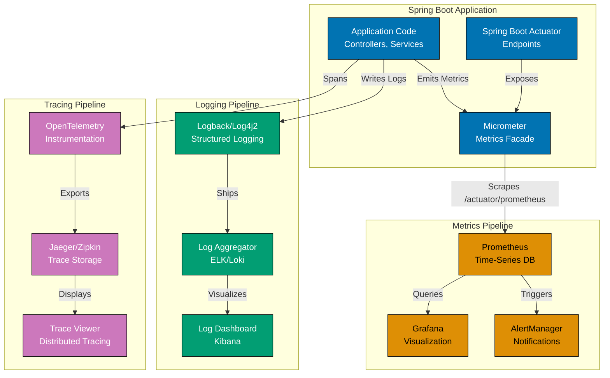

# Spring Boot Observability

## 📋 Quick Reference

- [Overview](#overview)
- [Spring Boot Actuator](#spring-boot-actuator)
- [Health Checks](#health-checks)
- [Metrics with Micrometer](#metrics-with-micrometer)
- [Distributed Tracing](#distributed-tracing)
- [Structured Logging](#structured-logging)
- [Alerting and Dashboards](#alerting-and-dashboards)
- [Production Monitoring](#production-monitoring)
- [OSE Platform Observability Examples](#ose-platform-observability-examples)
- [Related Documentation](#related-documentation)

## Overview

Observability is the ability to understand system internal state from external outputs. In Spring Boot, observability encompasses:

1. **Metrics** - Quantitative measurements (counters, gauges, timers)
2. **Logs** - Detailed event records
3. **Traces** - Request flow through distributed systems
4. **Health** - System component status

### Three Pillars of Observability

```
┌─────────────┐
│   METRICS   │ ← What is happening?
│  (Numbers)  │   • Request rates
│             │   • Error rates
│             │   • Resource usage
└─────────────┘

┌─────────────┐
│    LOGS     │ ← Why is it happening?
│  (Events)   │   • Stack traces
│             │   • User actions
│             │   • System events
└─────────────┘

┌─────────────┐
│   TRACES    │ ← Where is it happening?
│ (Requests)  │   • Service calls
│             │   • Latency breakdown
│             │   • Dependencies
└─────────────┘
```

### Observability Architecture



**Architecture Components**:

- **Blue (Application)**: Spring Boot app with Actuator and Micrometer
- **Orange (Metrics)**: Prometheus scrapes metrics, Grafana visualizes, AlertManager notifies
- **Teal (Logging)**: Structured logs shipped to aggregator (ELK/Loki), viewed in Kibana
- **Purple (Tracing)**: OpenTelemetry spans exported to Jaeger/Zipkin for distributed tracing

## Spring Boot Actuator

Spring Boot Actuator provides production-ready monitoring endpoints.

### Adding Actuator Dependency

```xml
<dependency>
    <groupId>org.springframework.boot</groupId>
    <artifactId>spring-boot-starter-actuator</artifactId>
</dependency>

<!-- For Prometheus metrics -->
<dependency>
    <groupId>io.micrometer</groupId>
    <artifactId>micrometer-registry-prometheus</artifactId>
</dependency>
```

### Actuator Configuration

```yaml
# application.yml
management:
  endpoints:
    web:
      base-path: /actuator
      exposure:
        include: health,info,metrics,prometheus,env,loggers
        exclude: shutdown # Never expose shutdown in production
  endpoint:
    health:
      show-details: when-authorized
      probes:
        enabled: true # Kubernetes liveness/readiness
    info:
      enabled: true
  metrics:
    export:
      prometheus:
        enabled: true
    tags:
      application: ${spring.application.name}
      environment: ${spring.profiles.active}
  info:
    env:
      enabled: true
    git:
      mode: full
```

### Built-in Actuator Endpoints

| Endpoint               | Purpose                | Production Safe |
| ---------------------- | ---------------------- | --------------- |
| `/actuator/health`     | Health status          | ✅ Yes          |
| `/actuator/info`       | Application info       | ✅ Yes          |
| `/actuator/metrics`    | Metrics registry       | ⚠️ Secure       |
| `/actuator/prometheus` | Prometheus format      | ⚠️ Secure       |
| `/actuator/env`        | Environment properties | ❌ Sensitive    |
| `/actuator/loggers`    | Log level management   | ❌ Sensitive    |
| `/actuator/heapdump`   | Heap dump              | ❌ Sensitive    |
| `/actuator/shutdown`   | Graceful shutdown      | ❌ Never expose |

### Securing Actuator Endpoints

```java
@Configuration
public class ActuatorSecurityConfig {

    @Bean
    public SecurityFilterChain actuatorSecurity(HttpSecurity http) throws Exception {
        http
            .securityMatcher("/actuator/**")
            .authorizeHttpRequests(auth -> auth
                .requestMatchers("/actuator/health", "/actuator/info").permitAll()
                .requestMatchers("/actuator/health/liveness", "/actuator/health/readiness").permitAll()
                .requestMatchers("/actuator/prometheus").hasRole("METRICS")
                .requestMatchers("/actuator/**").hasRole("ADMIN")
            )
            .httpBasic(withDefaults());

        return http.build();
    }
}
```

### Custom Actuator Endpoint

```java
@Component
@Endpoint(id = "zakat-stats")
public class ZakatStatsEndpoint {

    private final ZakatCalculationRepository repository;

    public ZakatStatsEndpoint(ZakatCalculationRepository repository) {
        this.repository = repository;
    }

    @ReadOperation
    public Map<String, Object> zakatStatistics() {
        long totalCalculations = repository.count();
        long zakatDueCount = repository.countByZakatDue(true);
        BigDecimal totalZakat = repository.sumTotalZakat();

        return Map.of(
            "totalCalculations", totalCalculations,
            "zakatDueCount", zakatDueCount,
            "totalZakatAmount", totalZakat,
            "timestamp", Instant.now()
        );
    }

    @ReadOperation
    public Map<String, Object> zakatStatsByUser(@Selector String userId) {
        List<ZakatCalculation> userCalculations = repository.findByUserId(userId);

        BigDecimal totalZakat = userCalculations.stream()
            .map(ZakatCalculation::getZakatAmount)
            .map(Money::amount)
            .reduce(BigDecimal.ZERO, BigDecimal::add);

        return Map.of(
            "userId", userId,
            "calculationCount", userCalculations.size(),
            "totalZakat", totalZakat
        );
    }
}
```

## Health Checks

Health checks verify system component status.

### Built-in Health Indicators

Spring Boot provides health indicators for common components:

```java
// Automatically configured if dependencies present
// - Database (DataSource)
// - Disk space
// - Mail server
// - Redis
// - Kafka
// - etc.
```

### Custom Health Indicator

```java
@Component
public class DatabaseHealthIndicator implements HealthIndicator {

    private final DataSource dataSource;

    public DatabaseHealthIndicator(DataSource dataSource) {
        this.dataSource = dataSource;
    }

    @Override
    public Health health() {
        try (Connection connection = dataSource.getConnection()) {
            // Test database connectivity
            boolean valid = connection.isValid(1);

            if (valid) {
                return Health.up()
                    .withDetail("database", "responsive")
                    .withDetail("url", connection.getMetaData().getURL())
                    .withDetail("validationTime", "< 1s")
                    .build();
            } else {
                return Health.down()
                    .withDetail("database", "validation failed")
                    .build();
            }
        } catch (SQLException ex) {
            return Health.down()
                .withDetail("database", "connection failed")
                .withDetail("error", ex.getMessage())
                .withException(ex)
                .build();
        }
    }
}
```

### External Service Health Check

```java
@Component
public class PaymentGatewayHealthIndicator implements HealthIndicator {

    private final RestTemplate restTemplate;
    private final String gatewayHealthUrl;

    public PaymentGatewayHealthIndicator(
        RestTemplate restTemplate,
        @Value("${payment.gateway.health-url}") String gatewayHealthUrl
    ) {
        this.restTemplate = restTemplate;
        this.gatewayHealthUrl = gatewayHealthUrl;
    }

    @Override
    public Health health() {
        try {
            ResponseEntity<String> response = restTemplate.getForEntity(
                gatewayHealthUrl,
                String.class
            );

            if (response.getStatusCode().is2xxSuccessful()) {
                return Health.up()
                    .withDetail("gateway", "operational")
                    .withDetail("url", gatewayHealthUrl)
                    .withDetail("responseTime", "< 500ms")
                    .build();
            } else {
                return Health.down()
                    .withDetail("gateway", "unhealthy")
                    .withDetail("statusCode", response.getStatusCode())
                    .build();
            }
        } catch (Exception ex) {
            return Health.down()
                .withDetail("gateway", "unreachable")
                .withDetail("error", ex.getMessage())
                .withException(ex)
                .build();
        }
    }
}
```

### Health Groups (Kubernetes Probes)

```yaml
# application.yml
management:
  endpoint:
    health:
      show-details: when-authorized
      probes:
        enabled: true
      group:
        liveness:
          include: livenessState,diskSpace
        readiness:
          include: readinessState,database,paymentGateway
```

```java
// Liveness: Application is running (restart if fails)
// GET /actuator/health/liveness

// Readiness: Application is ready to serve traffic (remove from load balancer if fails)
// GET /actuator/health/readiness
```

### Kubernetes Deployment with Probes

```yaml
# deployment.yaml
apiVersion: apps/v1
kind: Deployment
metadata:
  name: ose-platform-api
spec:
  replicas: 3
  template:
    spec:
      containers:
        - name: api
          image: ose-platform-api:latest
          ports:
            - containerPort: 8080
          livenessProbe:
            httpGet:
              path: /actuator/health/liveness
              port: 8080
            initialDelaySeconds: 30
            periodSeconds: 10
            timeoutSeconds: 5
            failureThreshold: 3
          readinessProbe:
            httpGet:
              path: /actuator/health/readiness
              port: 8080
            initialDelaySeconds: 10
            periodSeconds: 5
            timeoutSeconds: 3
            failureThreshold: 3
```

## Metrics with Micrometer

Micrometer provides vendor-neutral metrics abstraction.

### Counter Metrics

Count events:

```java
@Service
public class ZakatCalculationService {

    private final ZakatCalculationRepository repository;
    private final MeterRegistry meterRegistry;
    private final Counter calculationsCounter;
    private final Counter zakatDueCounter;

    public ZakatCalculationService(
        ZakatCalculationRepository repository,
        MeterRegistry meterRegistry
    ) {
        this.repository = repository;
        this.meterRegistry = meterRegistry;

        // Create counters
        this.calculationsCounter = Counter.builder("zakat.calculations.total")
            .description("Total zakat calculations performed")
            .tag("service", "zakat")
            .register(meterRegistry);

        this.zakatDueCounter = Counter.builder("zakat.due.total")
            .description("Total calculations where zakat is due")
            .tag("service", "zakat")
            .register(meterRegistry);
    }

    public ZakatCalculationResponse calculate(CreateZakatRequest request, String userId) {
        // Increment counter
        calculationsCounter.increment();

        ZakatCalculation calculation = ZakatCalculation.calculate(/*...*/);
        ZakatCalculation saved = repository.save(calculation);

        if (saved.isZakatDue()) {
            zakatDueCounter.increment();
        }

        return ZakatCalculationMapper.toResponse(saved);
    }
}
```

### Gauge Metrics

Track current value:

```java
@Component
public class MurabahaMetrics {

    private final MurabahaApplicationRepository repository;

    public MurabahaMetrics(
        MurabahaApplicationRepository repository,
        MeterRegistry meterRegistry
    ) {
        this.repository = repository;

        // Register gauges
        Gauge.builder("murabaha.applications.pending", repository, repo ->
                repo.countByStatus(ApplicationStatus.PENDING))
            .description("Number of pending Murabaha applications")
            .tag("status", "pending")
            .register(meterRegistry);

        Gauge.builder("murabaha.applications.approved", repository, repo ->
                repo.countByStatus(ApplicationStatus.APPROVED))
            .description("Number of approved Murabaha applications")
            .tag("status", "approved")
            .register(meterRegistry);

        Gauge.builder("murabaha.applications.in_payment", repository, repo ->
                repo.countByStatus(ApplicationStatus.IN_PAYMENT))
            .description("Number of Murabaha applications in payment")
            .tag("status", "in_payment")
            .register(meterRegistry);
    }
}
```

### Timer Metrics

Measure duration:

```java
@Service
public class ZakatCalculationService {

    private final ZakatCalculationRepository repository;
    private final Timer calculationTimer;

    public ZakatCalculationService(
        ZakatCalculationRepository repository,
        MeterRegistry meterRegistry
    ) {
        this.repository = repository;

        this.calculationTimer = Timer.builder("zakat.calculation.duration")
            .description("Time taken to calculate zakat")
            .tag("service", "zakat")
            .register(meterRegistry);
    }

    public ZakatCalculationResponse calculate(CreateZakatRequest request, String userId) {
        // Record execution time
        return calculationTimer.record(() -> {
            ZakatCalculation calculation = ZakatCalculation.calculate(/*...*/);
            ZakatCalculation saved = repository.save(calculation);
            return ZakatCalculationMapper.toResponse(saved);
        });
    }

    // Alternative: Manual timing
    public ZakatCalculationResponse calculateManual(CreateZakatRequest request, String userId) {
        Timer.Sample sample = Timer.start(meterRegistry);

        try {
            ZakatCalculation calculation = ZakatCalculation.calculate(/*...*/);
            ZakatCalculation saved = repository.save(calculation);
            return ZakatCalculationMapper.toResponse(saved);
        } finally {
            sample.stop(calculationTimer);
        }
    }
}
```

### Distribution Summary

Track distribution of values:

```java
@Service
public class MurabahaApplicationService {

    private final DistributionSummary principalDistribution;

    public MurabahaApplicationService(
        MurabahaApplicationRepository repository,
        MeterRegistry meterRegistry
    ) {
        this.principalDistribution = DistributionSummary.builder("murabaha.principal.amount")
            .description("Distribution of Murabaha application principal amounts")
            .tag("service", "murabaha")
            .baseUnit("USD")
            .register(meterRegistry);
    }

    public ApplicationResponse create(CreateApplicationRequest request) {
        // Record principal amount
        principalDistribution.record(request.principal().doubleValue());

        MurabahaApplication application = MurabahaApplication.create(/*...*/);
        MurabahaApplication saved = repository.save(application);

        return MurabahaApplicationMapper.toResponse(saved);
    }
}
```

### Timed Annotation

Automatic timing with AOP:

```java
@Service
public class WaqfDonationService {

    private final WaqfDonationRepository repository;

    public WaqfDonationService(WaqfDonationRepository repository) {
        this.repository = repository;
    }

    @Timed(value = "waqf.donation.creation", description = "Time to create Waqf donation")
    public DonationResponse createDonation(DonationRequest request) {
        WaqfDonation donation = WaqfDonation.create(/*...*/);
        WaqfDonation saved = repository.save(donation);
        return WaqfDonationMapper.toResponse(saved);
    }

    @Timed(value = "waqf.project.query", description = "Time to query Waqf projects")
    public List<ProjectResponse> findProjects(ProjectFilter filter) {
        return repository.findByFilter(filter).stream()
            .map(WaqfProjectMapper::toResponse)
            .toList();
    }
}
```

## Distributed Tracing

Distributed tracing tracks requests across services.

### Adding Tracing Dependencies

```xml
<!-- Micrometer Tracing -->
<dependency>
    <groupId>io.micrometer</groupId>
    <artifactId>micrometer-tracing-bridge-brave</artifactId>
</dependency>

<!-- Zipkin reporter -->
<dependency>
    <groupId>io.zipkin.reporter2</groupId>
    <artifactId>zipkin-reporter-brave</artifactId>
</dependency>
```

### Tracing Configuration

```yaml
# application.yml
management:
  tracing:
    sampling:
      probability: 1.0 # Sample 100% in dev, reduce in prod (e.g., 0.1)
    baggage:
      enabled: true
      remote-fields: user-id,request-id
  zipkin:
    tracing:
      endpoint: http://localhost:9411/api/v2/spans
```

### Automatic Tracing

Spring Boot automatically traces:

- HTTP requests (RestTemplate, WebClient)
- Kafka messages
- Database queries (JDBC)
- Method calls (with @NewSpan)

### Custom Spans

```java
@Service
public class ZakatCalculationService {

    private final ZakatCalculationRepository repository;
    private final Tracer tracer;

    public ZakatCalculationService(
        ZakatCalculationRepository repository,
        Tracer tracer
    ) {
        this.repository = repository;
        this.tracer = tracer;
    }

    public ZakatCalculationResponse calculate(CreateZakatRequest request, String userId) {
        // Create custom span
        Span span = tracer.nextSpan().name("zakat.calculation.domain").start();

        try (Tracer.SpanInScope ws = tracer.withSpan(span)) {
            // Add tags
            span.tag("user.id", userId);
            span.tag("currency", request.currency());
            span.tag("wealth", request.wealth().toString());

            ZakatCalculation calculation = ZakatCalculation.calculate(/*...*/);

            // Add event
            span.event("calculation.completed");

            ZakatCalculation saved = repository.save(calculation);

            // Add result tag
            span.tag("zakat.due", String.valueOf(saved.isZakatDue()));
            span.tag("zakat.amount", saved.getZakatAmount().amount().toString());

            return ZakatCalculationMapper.toResponse(saved);
        } catch (Exception ex) {
            span.error(ex);  // Record exception
            throw ex;
        } finally {
            span.end();
        }
    }
}
```

### Baggage (Context Propagation)

```java
@Component
public class UserContextFilter extends OncePerRequestFilter {

    private final BaggageField userIdField = BaggageField.create("user-id");
    private final BaggageField requestIdField = BaggageField.create("request-id");

    @Override
    protected void doFilterInternal(
        HttpServletRequest request,
        HttpServletResponse response,
        FilterChain filterChain
    ) throws ServletException, IOException {

        // Set baggage from request headers
        String userId = request.getHeader("X-User-ID");
        String requestId = request.getHeader("X-Request-ID");

        if (userId != null) {
            userIdField.updateValue(userId);
        }
        if (requestId != null) {
            requestIdField.updateValue(requestId);
        }

        filterChain.doFilter(request, response);
    }
}

// Access baggage in service
@Service
public class SomeService {

    private final BaggageField userIdField = BaggageField.create("user-id");

    public void someMethod() {
        String userId = userIdField.getValue();  // Available across service boundaries
        // Use userId...
    }
}
```

## Structured Logging

Structured logging outputs logs in machine-readable format (JSON).

### Logback Configuration

```xml
<!-- logback-spring.xml -->
<configuration>
    <include resource="org/springframework/boot/logging/logback/defaults.xml"/>

    <!-- Console appender with JSON format -->
    <appender name="CONSOLE" class="ch.qos.logback.core.ConsoleAppender">
        <encoder class="net.logstash.logback.encoder.LogstashEncoder">
            <includeContext>true</includeContext>
            <includeMdc>true</includeMdc>
            <fieldNames>
                <timestamp>@timestamp</timestamp>
                <message>message</message>
                <logger>logger</logger>
                <thread>thread</thread>
                <level>level</level>
                <levelValue>level_value</levelValue>
            </fieldNames>
            <customFields>{"application":"ose-platform"}</customFields>
        </encoder>
    </appender>

    <!-- File appender -->
    <appender name="FILE" class="ch.qos.logback.core.rolling.RollingFileAppender">
        <file>logs/application.log</file>
        <rollingPolicy class="ch.qos.logback.core.rolling.SizeAndTimeBasedRollingPolicy">
            <fileNamePattern>logs/application-%d{yyyy-MM-dd}.%i.log.gz</fileNamePattern>
            <maxFileSize>100MB</maxFileSize>
            <maxHistory>30</maxHistory>
            <totalSizeCap>10GB</totalSizeCap>
        </rollingPolicy>
        <encoder class="net.logstash.logback.encoder.LogstashEncoder"/>
    </appender>

    <root level="INFO">
        <appender-ref ref="CONSOLE"/>
        <appender-ref ref="FILE"/>
    </root>

    <!-- Application-specific logging -->
    <logger name="com.example.ose" level="DEBUG"/>
    <logger name="org.springframework.web" level="INFO"/>
    <logger name="org.hibernate.SQL" level="DEBUG"/>
</configuration>
```

### MDC (Mapped Diagnostic Context)

```java
@Component
public class RequestLoggingFilter extends OncePerRequestFilter {

    @Override
    protected void doFilterInternal(
        HttpServletRequest request,
        HttpServletResponse response,
        FilterChain filterChain
    ) throws ServletException, IOException {

        try {
            // Add request context to MDC
            MDC.put("requestId", UUID.randomUUID().toString());
            MDC.put("userId", getUserId(request));
            MDC.put("requestUri", request.getRequestURI());
            MDC.put("httpMethod", request.getMethod());

            filterChain.doFilter(request, response);
        } finally {
            // Clear MDC
            MDC.clear();
        }
    }

    private String getUserId(HttpServletRequest request) {
        Principal principal = request.getUserPrincipal();
        return principal != null ? principal.getName() : "anonymous";
    }
}
```

### Structured Logging in Services

```java
@Service
@Slf4j
public class ZakatCalculationService {

    private final ZakatCalculationRepository repository;

    public ZakatCalculationResponse calculate(CreateZakatRequest request, String userId) {
        log.info("Calculating zakat for user: {}, wealth: {}, currency: {}",
            userId, request.wealth(), request.currency());

        try {
            ZakatCalculation calculation = ZakatCalculation.calculate(/*...*/);
            ZakatCalculation saved = repository.save(calculation);

            log.info("Zakat calculation completed - calculationId: {}, zakatDue: {}, amount: {}",
                saved.getId(), saved.isZakatDue(), saved.getZakatAmount());

            return ZakatCalculationMapper.toResponse(saved);
        } catch (Exception ex) {
            log.error("Failed to calculate zakat for user: {}, error: {}",
                userId, ex.getMessage(), ex);
            throw ex;
        }
    }
}
```

## Alerting and Dashboards

### Prometheus Alert Rules

```yaml
# prometheus-rules.yml
groups:
  - name: ose_platform_alerts
    interval: 30s
    rules:
      # High error rate alert
      - alert: HighErrorRate
        expr: rate(http_server_requests_seconds_count{status=~"5.."}[5m]) > 0.05
        for: 2m
        labels:
          severity: critical
        annotations:
          summary: "High error rate detected"
          description: "Error rate is {{ $value }} errors/second"

      # Slow response time alert
      - alert: SlowResponseTime
        expr: histogram_quantile(0.95, rate(http_server_requests_seconds_bucket[5m])) > 2
        for: 5m
        labels:
          severity: warning
        annotations:
          summary: "95th percentile response time is high"
          description: "P95 latency is {{ $value }}s"

      # Database connection pool alert
      - alert: DatabasePoolExhausted
        expr: hikaricp_connections_active / hikaricp_connections_max > 0.9
        for: 2m
        labels:
          severity: critical
        annotations:
          summary: "Database connection pool nearly exhausted"
          description: "Pool usage: {{ $value | humanizePercentage }}"
```

### Grafana Dashboard (JSON snippet)

```json
{
  "dashboard": {
    "title": "OSE Platform - Zakat Service",
    "panels": [
      {
        "title": "Zakat Calculations per Minute",
        "targets": [
          {
            "expr": "rate(zakat_calculations_total[1m]) * 60"
          }
        ]
      },
      {
        "title": "P95 Calculation Latency",
        "targets": [
          {
            "expr": "histogram_quantile(0.95, rate(zakat_calculation_duration_seconds_bucket[5m]))"
          }
        ]
      },
      {
        "title": "Zakat Due Percentage",
        "targets": [
          {
            "expr": "rate(zakat_due_total[5m]) / rate(zakat_calculations_total[5m]) * 100"
          }
        ]
      }
    ]
  }
}
```

## Production Monitoring

### Observability Best Practices

1. **Always log with context**: Include user ID, request ID, trace ID
2. **Use appropriate log levels**: ERROR for failures, WARN for issues, INFO for important events, DEBUG for details
3. **Monitor the four golden signals**: Latency, traffic, errors, saturation
4. **Set meaningful alerts**: Alert on symptoms, not causes
5. **Use structured logging**: Machine-readable logs (JSON)
6. **Tag metrics appropriately**: Use meaningful dimensions
7. **Sample traces in production**: 10% sampling is usually sufficient
8. **Monitor dependencies**: External services, databases, message queues

### Common Pitfalls

```java
// ❌ BAD - Logging without context
log.info("Calculation completed");

// ✅ GOOD - Logging with context
log.info("Zakat calculation completed - userId: {}, calculationId: {}, zakatAmount: {}",
    userId, calculationId, zakatAmount);

// ❌ BAD - High cardinality metrics
counter.increment(Tags.of("userId", userId));  // ❌ Too many unique values

// ✅ GOOD - Low cardinality metrics
counter.increment(Tags.of("currency", currency));  // ✅ Limited unique values

// ❌ BAD - Sampling all traces in production
management.tracing.sampling.probability=1.0  // ❌ Too expensive

// ✅ GOOD - Sample 10% of traces
management.tracing.sampling.probability=0.1  // ✅ Sufficient for analysis
```

### Production Observability Checklist

- [ ] Health checks configured (liveness and readiness)
- [ ] Metrics exported (Prometheus or equivalent)
- [ ] Structured logging enabled (JSON format)
- [ ] Distributed tracing configured (10% sampling)
- [ ] Actuator endpoints secured
- [ ] Critical alerts defined (error rate, latency, saturation)
- [ ] Dashboards created for key metrics
- [ ] Log aggregation configured (ELK, Loki, or equivalent)
- [ ] Trace storage configured (Zipkin, Jaeger, or equivalent)
- [ ] On-call runbooks created

## OSE Platform Observability Examples

### Complete Zakat Service with Observability

```java
@Service
@Slf4j
@Transactional
public class ZakatCalculationService {

    private final ZakatCalculationRepository repository;
    private final MeterRegistry meterRegistry;
    private final Counter calculationsCounter;
    private final Counter zakatDueCounter;
    private final Timer calculationTimer;
    private final DistributionSummary wealthDistribution;

    public ZakatCalculationService(
        ZakatCalculationRepository repository,
        MeterRegistry meterRegistry
    ) {
        this.repository = repository;
        this.meterRegistry = meterRegistry;

        // Initialize metrics
        this.calculationsCounter = Counter.builder("zakat.calculations.total")
            .description("Total zakat calculations")
            .register(meterRegistry);

        this.zakatDueCounter = Counter.builder("zakat.due.total")
            .description("Total calculations where zakat is due")
            .register(meterRegistry);

        this.calculationTimer = Timer.builder("zakat.calculation.duration")
            .description("Zakat calculation duration")
            .publishPercentiles(0.5, 0.95, 0.99)
            .register(meterRegistry);

        this.wealthDistribution = DistributionSummary.builder("zakat.wealth.amount")
            .description("Distribution of wealth amounts")
            .baseUnit("USD")
            .register(meterRegistry);
    }

    public ZakatCalculationResponse calculate(CreateZakatRequest request, String userId) {
        // Add MDC context
        MDC.put("userId", userId);
        MDC.put("currency", request.currency());

        log.info("Starting zakat calculation - wealth: {}", request.wealth());

        return calculationTimer.record(() -> {
            try {
                // Increment counter
                calculationsCounter.increment();

                // Record wealth distribution
                wealthDistribution.record(request.wealth().doubleValue());

                // Business logic
                ZakatCalculation calculation = ZakatCalculation.calculate(/*...*/);
                ZakatCalculation saved = repository.save(calculation);

                // Track zakat due
                if (saved.isZakatDue()) {
                    zakatDueCounter.increment();
                }

                log.info("Zakat calculation completed - calculationId: {}, zakatDue: {}, amount: {}",
                    saved.getId(), saved.isZakatDue(), saved.getZakatAmount());

                return ZakatCalculationMapper.toResponse(saved);
            } catch (Exception ex) {
                log.error("Zakat calculation failed", ex);
                meterRegistry.counter("zakat.calculations.errors").increment();
                throw ex;
            } finally {
                MDC.clear();
            }
        });
    }
}
```

## 🔗 Related Documentation

- [Spring Boot Best Practices](ex-soen-plwe-to-jvspbo__best-practices.md) - Production patterns
- [Performance](ex-soen-plwe-to-jvspbo__performance.md) - Performance monitoring
- [Configuration](ex-soen-plwe-to-jvspbo__configuration.md) - Externalized configuration
- [Testing](ex-soen-plwe-to-jvspbo__testing.md) - Testing observability

---

**Next Steps:**

- Review [Security](ex-soen-plwe-to-jvspbo__security.md) for security monitoring
- Explore [Performance](ex-soen-plwe-to-jvspbo__performance.md) for performance optimization
- Check [Configuration](ex-soen-plwe-to-jvspbo__configuration.md) for environment-specific settings

## See Also

**OSE Explanation Foundation**:

- [Spring Framework Observability](../jvm-spring/ex-soen-plwe-to-jvsp__observability.md) - Manual Spring monitoring
- [Java Monitoring](../../programming-languages/java/ex-soen-prla-ja__performance-standards.md) - Java JMX baseline
- [Spring Boot Idioms](./ex-soen-plwe-to-jvspbo__idioms.md) - Observability patterns
- [Spring Boot Performance](./ex-soen-plwe-to-jvspbo__performance.md) - Performance metrics

**Hands-on Learning (AyoKoding)**:

- [Spring Boot By Example - Observability](https://ayokoding.com/en/learn/software-engineering/platform-web/tools/jvm-spring-boot/by-example/observability) - Code examples
- [Spring Boot In-the-Field - Monitoring](https://ayokoding.com/en/learn/software-engineering/platform-web/tools/jvm-spring-boot/in-the-field/observability) - Production monitoring

**Last Updated**: 2026-01-26
