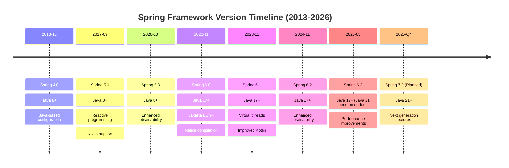

# Spring Framework

**Understanding-oriented documentation** for Spring Framework in the open-sharia-enterprise platform.

## Overview

Spring Framework is the foundational Java application framework that provides comprehensive infrastructure support for developing Java applications. It offers Inversion of Control (IoC) through dependency injection, aspect-oriented programming (AOP), data access abstraction, transaction management, and web MVC capabilities.

**This is the prerequisite foundation for Spring Boot**. Understanding Spring Framework's core concepts (IoC, DI, AOP, configuration) is essential before learning Spring Boot's auto-configuration and opinionated conventions.

This documentation covers Spring Framework 6.x (latest stable) with Java 17+ and Kotlin support, targeting enterprise applications and microservices architectures.

## Prerequisite Knowledge

**REQUIRED**: You MUST understand Spring Framework fundamentals from the [AyoKoding Spring Framework Learning Path](../../../../../../apps/ayokoding-web/content/en/learn/software-engineering/platform-web/tools/jvm-spring/).

**This documentation is OSE Platform-specific explanation**, not Spring Framework tutorials. We assume you have completed the learning content.

**Before Reading These Docs**:

- Complete [Spring Framework Initial Setup](../../../../../../apps/ayokoding-web/content/en/learn/software-engineering/platform-web/tools/jvm-spring/initial-setup.md) - Environment and tooling setup
- Understand [Spring Framework Overview](../../../../../../apps/ayokoding-web/content/en/learn/software-engineering/platform-web/tools/jvm-spring/overview.md) - Core concepts (IoC, DI, AOP)
- Work through [Spring Framework By Example](../../../../../../apps/ayokoding-web/content/en/learn/software-engineering/platform-web/tools/jvm-spring/by-example/) (75+ annotated examples) - Hands-on code learning
- Reference [Spring Framework In-the-Field](../../../../../../apps/ayokoding-web/content/en/learn/software-engineering/platform-web/tools/jvm-spring/in-the-field/) (30 production guides) - Production patterns

**Separation of Concerns**: See [Programming Language Documentation Separation Convention](../../../../../../governance/conventions/structure/programming-language-docs-separation.md) for content separation between learning (ayokoding-web) and standards (this documentation).

**What this documentation covers**: OSE Platform Spring Framework standards, naming conventions, framework integration patterns, how to apply Spring knowledge in THIS codebase.

**What this documentation does NOT cover**: Spring Framework tutorials, basic IoC/DI concepts, generic patterns (those are in ayokoding-web).

## Framework Standards

**This documentation is the authoritative reference** for Spring Framework usage standards in the open-sharia-enterprise platform.

All Spring Framework applications MUST follow the patterns and practices documented here:

1. **[Idioms](ex-soen-plwe-to-jvsp__idioms.md)** - Spring Framework-specific patterns
2. **[Best Practices](ex-soen-plwe-to-jvsp__best-practices.md)** - Framework standards
3. **[Anti-Patterns](ex-soen-plwe-to-jvsp__anti-patterns.md)** - Common mistakes
4. **[Configuration](ex-soen-plwe-to-jvsp__configuration.md)** - Configuration approaches
5. **[Dependency Injection](ex-soen-plwe-to-jvsp__dependency-injection.md)** - IoC patterns

**For Agents**: Reference this documentation when building Spring applications.

**Language Standards**: Also follow [Java](../../../../programming-languages/java/README.md) language standards. Kotlin language standards documentation is planned for future addition.

### Quick Standards Reference

- **Project Structure**: See [Architecture Integration](#architecture-integration)
- **IoC Container**: See [Dependency Injection](ex-soen-plwe-to-jvsp__dependency-injection.md)
- **AOP**: See [Aspect-Oriented Programming](ex-soen-plwe-to-jvsp__aop.md)
- **Data Access**: See [Data Access](ex-soen-plwe-to-jvsp__data-access.md)
- **Web MVC**: See [Web MVC](ex-soen-plwe-to-jvsp__web-mvc.md)
- **Testing**: See [Testing](ex-soen-plwe-to-jvsp__testing.md)

## Software Engineering Principles

Spring Framework usage in this platform follows the five software engineering principles from [governance/principles/software-engineering/](../../../../../../governance/principles/software-engineering/README.md):

1. **[Automation Over Manual](../../../../../../governance/principles/software-engineering/automation-over-manual.md)** - Spring automates through component scanning, auto-wiring, transaction management
2. **[Explicit Over Implicit](../../../../../../governance/principles/software-engineering/explicit-over-implicit.md)** - Spring enforces through explicit bean definitions, clear dependency declarations, visible configuration
3. **[Immutability Over Mutability](../../../../../../governance/principles/software-engineering/immutability.md)** - Use immutable value objects, stateless services, declarative transaction boundaries
4. **[Pure Functions Over Side Effects](../../../../../../governance/principles/software-engineering/pure-functions.md)** - Apply functional core/imperative shell: pure domain logic, side effects at boundaries
5. **[Reproducibility First](../../../../../../governance/principles/software-engineering/reproducibility.md)** - Spring enables through explicit configuration, version pinning, environment profiles

## Quick Reference

**Jump to:**

- [Overview](#overview) - Spring Framework in the platform
- [Software Engineering Principles](#software-engineering-principles) - Five core principles
- [Spring Framework Version Strategy](#spring-framework-version-strategy) - Version management
- [Documentation Structure](#documentation-structure) - Guide to documentation files
- [Key Capabilities](#key-capabilities) - Framework features
- [Use Cases](#use-cases) - When to use Spring Framework
- [Architecture Integration](#architecture-integration) - DDD, layered architecture
- [Development Workflow](#development-workflow) - Setup, configuration, testing
- [Learning Path](#learning-path) - Recommended reading order
- [Code Examples from Platform](#code-examples-from-platform) - Real implementations
- [Integration with Other Documentation](#integration-with-other-documentation) - Cross-references
- [Spring Framework Ecosystem](#spring-framework-ecosystem) - Spring modules
- [Tools and Development Environment](#tools-and-development-environment) - Build tools, IDEs
- [Resources and References](#resources-and-references) - External resources
- [Related Documentation](#related-documentation) - Cross-references

**Core Documentation:**

- [Idioms](ex-soen-plwe-to-jvsp__idioms.md) - Spring Framework patterns (IoC, DI, AOP, bean lifecycle)
- [Best Practices](ex-soen-plwe-to-jvsp__best-practices.md) - Framework coding standards
- [Anti-Patterns](ex-soen-plwe-to-jvsp__anti-patterns.md) - Common Spring Framework mistakes
- [Configuration](ex-soen-plwe-to-jvsp__configuration.md) - Java config, XML, annotations, profiles
- [Dependency Injection](ex-soen-plwe-to-jvsp__dependency-injection.md) - IoC container, bean wiring
- [AOP](ex-soen-plwe-to-jvsp__aop.md) - Aspect-oriented programming, cross-cutting concerns
- [Data Access](ex-soen-plwe-to-jvsp__data-access.md) - JDBC, transactions, Spring Data
- [Web MVC](ex-soen-plwe-to-jvsp__web-mvc.md) - Web layer, controllers, REST
- [REST APIs](ex-soen-plwe-to-jvsp__rest-apis.md) - RESTful services with Spring MVC
- [Security](ex-soen-plwe-to-jvsp__security.md) - Spring Security fundamentals
- [Testing](ex-soen-plwe-to-jvsp__testing.md) - Spring TestContext framework
- [Performance](ex-soen-plwe-to-jvsp__performance.md) - Optimization, caching
- [Observability](ex-soen-plwe-to-jvsp__observability.md) - Monitoring and metrics
- [Deployment](ex-soen-plwe-to-jvsp__deployment.md) - Deployment strategies
- [Version Migration](ex-soen-plwe-to-jvsp__version-migration.md)- Upgrading Spring versions

## Spring Framework Version Strategy



**Platform Strategy**: Spring Framework 6.1+ (current) → Spring Framework 6.2 → Spring Framework 7.0 (future)

### Current Version: Spring Framework 6.1+

**Platform Standard**: Spring Framework 6.1 is the target version for all Spring projects.

**Rationale**:

- Requires Java 17+ (aligns with platform baseline)
- Jakarta EE 10 support (javax._→ jakarta._ migration complete)
- Native compilation with GraalVM support
- Virtual threads support (Java 21+)
- Enhanced Kotlin support with coroutines
- Comprehensive observability integration
- Mature Spring Framework 6.x ecosystem

**Key Features**:

- Core IoC container refinements
- Enhanced AOP with virtual threads
- Improved Spring Data integration
- Better observability with Micrometer
- Virtual threads integration (with Java 21)
- Kotlin coroutines support

### Future: Spring Framework 7.0

**Expected**: Late 2026 (speculative)

**Anticipated Changes**:

- Minimum Java 21 LTS requirement
- Baseline Jakarta EE 11 support
- Enhanced native compilation
- Deeper integration with modern Java features (pattern matching, virtual threads, structured concurrency)
- Potential breaking changes in core APIs
- Continued Kotlin evolution

## Documentation Structure

### [Spring Framework Idioms](ex-soen-plwe-to-jvsp__idioms.md)

Framework-specific patterns for writing idiomatic Spring applications.

**Covers**:

- IoC container and ApplicationContext
- Dependency injection patterns (constructor, setter, field)
- Bean definition and configuration
- Component scanning with @Component, @Service, @Repository
- Bean lifecycle callbacks (@PostConstruct, @PreDestroy)
- Bean scopes (singleton, prototype, request, session)
- Profile-based configuration with @Profile
- Conditional bean registration with @Conditional
- Property resolution with @Value and Environment
- Resource loading abstractions

### [Spring Framework Best Practices](ex-soen-plwe-to-jvsp__best-practices.md)

Proven approaches for building production-ready Spring applications.

**Covers**:

- Project structure and package organization
- Configuration management (Java config, externalized properties)
- Dependency injection best practices (constructor injection preferred)
- Bean naming and conventions
- Transaction management strategies
- Exception handling patterns
- Testing strategies (unit, integration)
- Logging best practices
- Performance optimization
- Resource management (connection pools, caches)

### [Spring Framework Anti-Patterns](ex-soen-plwe-to-jvsp__anti-patterns.md)

Common mistakes and problematic patterns to avoid.

**Covers**:

- Field injection anti-pattern
- Circular dependencies
- God beans (overly complex services)
- Inappropriate bean scopes
- Transaction management mistakes
- Configuration anti-patterns
- Resource leak patterns
- Threading issues in singleton beans
- Overusing XML configuration
- Missing exception handling

### Documentation Organization

```mermaid
%% Color Palette: Blue #0173B2, Orange #DE8F05, Teal #029E73, Purple #CC78BC
%% All colors are color-blind friendly and meet WCAG AA contrast standards

flowchart TD
    A["Spring Framework Documentation"]:::blue
    B["Core Patterns"]:::teal
    C["Application Layers"]:::teal
    D["Advanced Topics"]:::purple
    E["Integration"]:::orange

    A --> B
    A --> C
    A --> D
    A --> E

    B --> B1["Idioms"]
    B --> B2["Best Practices"]
    B --> B3["Anti-Patterns"]

    C --> C1["Configuration"]
    C --> C2["Dependency Injection"]
    C --> C3["AOP"]
    C --> C4["Data Access"]
    C --> C5["Web MVC"]

    D --> D1["Security"]
    D --> D2["Testing"]
    D --> D3["Observability"]
    D --> D4["Performance"]

    E --> E1["Functional Programming"]
    E --> E2["Version Migration"]

    classDef blue fill:#0173B2,stroke:#000000,color:#FFFFFF,stroke-width:2px
    classDef orange fill:#DE8F05,stroke:#000000,color:#FFFFFF,stroke-width:2px
    classDef teal fill:#029E73,stroke:#000000,color:#FFFFFF,stroke-width:2px
    classDef purple fill:#CC78BC,stroke:#000000,color:#000000,stroke-width:2px
```



### Specialized Topics

Deep-dive documentation on critical Spring Framework areas:

#### [Spring Framework Configuration](ex-soen-plwe-to-jvsp__configuration.md)

Comprehensive guide to Spring configuration approaches.

**Covers**:

- Java-based configuration with @Configuration
- Component scanning with @ComponentScan
- Bean definition with @Bean
- Profile-based configuration with @Profile
- Property sources and @PropertySource
- Environment abstraction
- Conditional configuration with @Conditional
- Configuration import with @Import
- XML configuration (legacy support)
- Mixed configuration strategies

#### [Spring Framework Dependency Injection](ex-soen-plwe-to-jvsp__dependency-injection.md)

Comprehensive guide to Spring's IoC container and dependency injection.

**Covers**:

- ApplicationContext types (ClassPathXmlApplicationContext, AnnotationConfigApplicationContext)
- Constructor injection (recommended)
- Setter injection
- Field injection (discouraged)
- @Autowired, @Qualifier, @Primary annotations
- Bean scopes (singleton, prototype, request, session, application)
- Lazy initialization with @Lazy
- Bean lifecycle: instantiation, population, initialization, destruction
- BeanPostProcessor and BeanFactoryPostProcessor
- Circular dependency resolution
- Dependency lookup vs dependency injection

#### [Spring Framework AOP](ex-soen-plwe-to-jvsp__aop.md)

Comprehensive guide to Aspect-Oriented Programming with Spring.

**Covers**:

- AOP concepts: aspect, join point, pointcut, advice, weaving
- @Aspect annotation and aspect definition
- Pointcut expressions and designators
- Advice types: @Before, @After, @AfterReturning, @AfterThrowing, @Around
- AspectJ pointcut syntax
- Proxy-based AOP (JDK dynamic proxies vs CGLIB)
- Transaction management with @Transactional (AOP-based)
- Security method interception
- Logging and auditing aspects
- Performance monitoring aspects
- AOP limitations and when to use it

#### [Spring Framework Data Access](ex-soen-plwe-to-jvsp__data-access.md)

Comprehensive guide to data persistence with Spring.

**Covers**:

- JdbcTemplate for simplified JDBC access
- NamedParameterJdbcTemplate for named parameters
- Transaction management with @Transactional
- PlatformTransactionManager abstraction
- Transaction propagation levels (REQUIRED, REQUIRES_NEW, NESTED, etc.)
- Transaction isolation levels
- Programmatic transaction management
- Exception translation (SQLException to DataAccessException)
- Connection pooling integration (HikariCP, Commons DBCP)
- Spring Data JPA integration
- Multiple datasource configuration
- Database initialization scripts

#### [Spring Framework Web MVC](ex-soen-plwe-to-jvsp__web-mvc.md)

Comprehensive guide to building web applications with Spring MVC.

**Covers**:

- DispatcherServlet and request lifecycle
- @Controller and @RestController
- Request mapping with @RequestMapping, @GetMapping, @PostMapping
- Handler methods and method arguments
- Model, ModelAndView, and view resolution
- Data binding and validation
- Exception handling with @ExceptionHandler and @ControllerAdvice
- Interceptors and HandlerInterceptor
- CORS configuration
- Content negotiation
- Multipart file upload
- Async request processing

#### [Spring Framework REST APIs](ex-soen-plwe-to-jvsp__rest-apis.md)

Comprehensive guide to building RESTful web services with Spring MVC.

**Covers**:

- @RestController for RESTful endpoints
- Request validation with Bean Validation
- DTO pattern for requests/responses
- Exception handling for REST APIs
- HTTP status codes and RESTful conventions
- ResponseEntity for flexible responses
- HATEOAS for hypermedia APIs
- Content negotiation (JSON, XML, custom)
- API versioning strategies
- CORS configuration for REST APIs
- Financial examples: Zakat APIs, Murabaha contracts

#### [Spring Framework Security](ex-soen-plwe-to-jvsp__security.md)

Comprehensive guide to Spring Security fundamentals.

**Covers**:

- Spring Security architecture
- Authentication mechanisms
- Authorization and access control
- Security filter chain
- Method-level security
- Password encoding
- CSRF protection
- Session management
- Security testing
- Integration with Spring MVC

#### [Spring Framework Testing](ex-soen-plwe-to-jvsp__testing.md)

Comprehensive guide to testing Spring applications.

**Covers**:

- Spring TestContext Framework
- @ContextConfiguration for loading context
- @MockBean and @SpyBean for mocking
- @DirtiesContext for context management
- Integration testing strategies
- Unit testing Spring beans
- Testing transactions with @Transactional
- Testing web layer with MockMvc (without Spring Boot)
- TestContext caching
- Test execution listeners

#### [Spring Framework Performance](ex-soen-plwe-to-jvsp__performance.md)

Comprehensive guide to optimization and performance tuning.

**Covers**:

- Bean initialization optimization
- Lazy initialization strategies
- Connection pooling configuration
- Caching with Spring Cache abstraction
- Async execution with @Async
- Virtual threads integration (Java 21+)
- Transaction optimization
- Query optimization strategies
- Profiling Spring applications
- Memory management

#### [Spring Framework Observability](ex-soen-plwe-to-jvsp__observability.md)

Comprehensive guide to monitoring Spring applications.

**Covers**:

- Micrometer integration for metrics
- Custom metrics and gauges
- Logging best practices
- Distributed tracing fundamentals
- Application events for observability
- JMX integration
- Health indicators
- Performance monitoring

#### [Spring Framework Deployment](ex-soen-plwe-to-jvsp__deployment.md)

Comprehensive guide to deploying Spring applications.

**Covers**:

- WAR vs JAR deployment
- Servlet container configuration (Tomcat, Jetty)
- Standalone application deployment
- Container-based deployment (Docker)
- Environment-specific configuration
- Production best practices
- Application packaging strategies

#### [Spring Framework Version Migration](ex-soen-plwe-to-jvsp__version-migration.md)

Comprehensive guide to upgrading Spring Framework versions.

**Covers**:

- Spring Framework 5.x to 6.x migration
- Jakarta EE migration (javax._to jakarta._)
- Java version requirements (17+ for Spring 6)
- Breaking changes and deprecations
- Configuration updates
- API changes
- Third-party library compatibility
- Migration checklist

## Key Capabilities

### Dependency Injection (IoC Container)

Spring Framework's core capability is managing object lifecycles and dependencies:

- **ApplicationContext** - Core container for bean management
- **Constructor Injection** - Preferred dependency injection method
- **Setter Injection** - Alternative for optional dependencies
- **Autowiring** - Automatic dependency resolution
- **Bean Scopes** - Singleton, prototype, request, session
- **Lifecycle Callbacks** - @PostConstruct, @PreDestroy, InitializingBean, DisposableBean

### Aspect-Oriented Programming (AOP)

Modularize cross-cutting concerns:

- **Declarative Transactions** - @Transactional annotation
- **Security** - Method-level authorization
- **Logging/Auditing** - Centralized logging aspects
- **Caching** - @Cacheable annotation
- **Performance Monitoring** - Execution time tracking
- **Pointcut Expressions** - Flexible join point selection

### Data Access

Simplified data persistence:

- **JdbcTemplate** - Simplified JDBC operations
- **Transaction Management** - Declarative and programmatic
- **Exception Translation** - Consistent exception hierarchy
- **Spring Data Integration** - Repository pattern support
- **Connection Pooling** - HikariCP, Commons DBCP integration

### Web MVC

Build web applications and REST APIs:

- **DispatcherServlet** - Front controller pattern
- **@Controller/@RestController** - Web endpoints
- **Request Mapping** - Flexible URL mapping
- **Data Binding** - Automatic request/response conversion
- **Validation** - Bean Validation integration
- **Exception Handling** - @ExceptionHandler, @ControllerAdvice

### Testing Support

Comprehensive testing infrastructure:

- **Spring TestContext Framework** - Integration testing
- **@ContextConfiguration** - Test context loading
- **@MockBean** - Mocking Spring beans
- **@DirtiesContext** - Context invalidation
- **MockMvc** - Web layer testing without HTTP server

## Use Cases

**Use Spring Framework when you need:**

✅ Fine-grained control over configuration and bean management
✅ Understanding Spring's core concepts before adopting Spring Boot
✅ Building applications without Spring Boot's auto-configuration
✅ Integrating with legacy applications or custom frameworks
✅ Educational purposes (learning IoC, DI, AOP fundamentals)
✅ Lightweight applications without Spring Boot overhead
✅ Custom framework development built on Spring

**Consider Spring Boot when:**

✅ You want rapid development with auto-configuration
✅ You're building microservices with standard patterns
✅ You need production-ready features out of the box (Actuator)
✅ You prefer convention over configuration
✅ You want embedded server support (Tomcat, Jetty, Undertow)

**Spring Boot builds on Spring Framework** - Spring Boot provides auto-configuration and opinionated defaults on top of Spring Framework's core capabilities.

## Architecture Integration

### Domain-Driven Design

Spring Framework integrates seamlessly with DDD tactical patterns:

**Aggregates with Spring Beans**:

```java
@Component
public class MurabahaContract {
    private final ContractId id;
    private final Money assetCost;
    private final ProfitRate profitRate;
    private final List<Payment> payments;

    // Constructor injection for dependencies
    public MurabahaContract(
        ContractId id,
        Money assetCost,
        ProfitRate profitRate
    ) {
        this.id = id;
        this.assetCost = assetCost;
        this.profitRate = profitRate;
        this.payments = new ArrayList<>();
    }

    // Aggregate methods ensure invariants
    public void recordPayment(Money amount, LocalDate date) {
        if (amount.isGreaterThan(remainingBalance())) {
            throw new InvalidPaymentException("Payment exceeds remaining balance");
        }
        payments.add(new Payment(amount, date));
    }

    private Money remainingBalance() {
        Money totalPaid = payments.stream()
            .map(Payment::getAmount)
            .reduce(Money.ZERO, Money::add);
        return assetCost.add(profitRate.calculate(assetCost)).subtract(totalPaid);
    }
}
```

**Repositories with Spring**:

```java
@Repository
public class JdbcMurabahaContractRepository implements MurabahaContractRepository {
    private final JdbcTemplate jdbcTemplate;

    public JdbcMurabahaContractRepository(JdbcTemplate jdbcTemplate) {
        this.jdbcTemplate = jdbcTemplate;
    }

    @Override
    public Optional<MurabahaContract> findById(ContractId id) {
        String sql = "SELECT * FROM murabaha_contracts WHERE id = ?";
        try {
            MurabahaContract contract = jdbcTemplate.queryForObject(
                sql,
                new MurabahaContractRowMapper(),
                id.getValue()
            );
            return Optional.ofNullable(contract);
        } catch (EmptyResultDataAccessException e) {
            return Optional.empty();
        }
    }

    @Override
    @Transactional
    public void save(MurabahaContract contract) {
        String sql = """
            INSERT INTO murabaha_contracts (id, asset_cost, profit_rate, status, created_at)
            VALUES (?, ?, ?, ?, ?)
            ON CONFLICT (id) DO UPDATE SET
                asset_cost = EXCLUDED.asset_cost,
                profit_rate = EXCLUDED.profit_rate,
                status = EXCLUDED.status
            """;

        jdbcTemplate.update(sql,
            contract.getId().getValue(),
            contract.getAssetCost().getAmount(),
            contract.getProfitRate().getValue(),
            contract.getStatus().name(),
            contract.getCreatedAt()
        );

        savePayments(contract);
    }

    private void savePayments(MurabahaContract contract) {
        String deleteSql = "DELETE FROM contract_payments WHERE contract_id = ?";
        jdbcTemplate.update(deleteSql, contract.getId().getValue());

        String insertSql = """
            INSERT INTO contract_payments (contract_id, amount, payment_date, recorded_at)
            VALUES (?, ?, ?, ?)
            """;

        List<Object[]> batchArgs = contract.getPayments().stream()
            .map(payment -> new Object[]{
                contract.getId().getValue(),
                payment.getAmount().getAmount(),
                payment.getPaymentDate(),
                payment.getRecordedAt()
            })
            .toList();

        jdbcTemplate.batchUpdate(insertSql, batchArgs);
    }
}
```

**Domain Events with Spring**:

```java
@Service
public class MurabahaContractService {
    private final MurabahaContractRepository repository;
    private final ApplicationEventPublisher eventPublisher;

    public MurabahaContractService(
        MurabahaContractRepository repository,
        ApplicationEventPublisher eventPublisher
    ) {
        this.repository = repository;
        this.eventPublisher = eventPublisher;
    }

    @Transactional
    public void recordPayment(ContractId contractId, Money amount, LocalDate date) {
        MurabahaContract contract = repository.findById(contractId)
            .orElseThrow(() -> new ContractNotFoundException(contractId));

        contract.recordPayment(amount, date);
        repository.save(contract);

        // Publish domain event
        eventPublisher.publishEvent(new PaymentRecordedEvent(contractId, amount, date));
    }
}

@Component
class PaymentEventHandler {
    private static final Logger logger = LoggerFactory.getLogger(PaymentEventHandler.class);

    @EventListener
    @Transactional(propagation = Propagation.REQUIRES_NEW)
    public void handlePaymentRecorded(PaymentRecordedEvent event) {
        logger.info("Payment recorded: contract={}, amount={}",
            event.getContractId(), event.getAmount());
        // Send notification, update projection, etc.
    }
}
```

**Value Objects**:

```java
// Immutable value object
public record Money(BigDecimal amount, String currency) {
    public Money {
        if (amount.compareTo(BigDecimal.ZERO) < 0) {
            throw new IllegalArgumentException("Amount cannot be negative");
        }
        if (currency == null || currency.isBlank()) {
            throw new IllegalArgumentException("Currency is required");
        }
    }

    public Money add(Money other) {
        if (!this.currency.equals(other.currency)) {
            throw new IllegalArgumentException("Currency mismatch");
        }
        return new Money(this.amount.add(other.amount), this.currency);
    }

    public Money subtract(Money other) {
        if (!this.currency.equals(other.currency)) {
            throw new IllegalArgumentException("Currency mismatch");
        }
        return new Money(this.amount.subtract(other.amount), this.currency);
    }

    public boolean isGreaterThan(Money other) {
        if (!this.currency.equals(other.currency)) {
            throw new IllegalArgumentException("Currency mismatch");
        }
        return this.amount.compareTo(other.amount) > 0;
    }

    public static final Money ZERO = new Money(BigDecimal.ZERO, "USD");
}
```

### Layered Architecture

Typical Spring application structure aligned with clean architecture:

```
src/main/java/com/oseplatform/[bounded-context]/
├── domain/                    # Domain layer (pure business logic)
│   ├── model/                # Aggregates, entities, value objects
│   ├── repository/           # Repository interfaces (ports)
│   └── service/              # Domain services
├── application/              # Application layer (use cases)
│   ├── service/             # Application services
│   ├── dto/                 # Data transfer objects
│   └── usecase/             # Use case implementations
├── infrastructure/           # Infrastructure layer (adapters)
│   ├── persistence/         # JDBC/JPA repositories (adapters)
│   ├── config/              # Spring configuration
│   └── integration/         # External service clients
└── api/                      # API layer (REST controllers)
    ├── controller/          # Spring MVC controllers
    ├── request/             # Request DTOs
    └── response/            # Response DTOs
```

**Configuration Class Example**:

```java
@Configuration
@ComponentScan(basePackages = "com.oseplatform.murabaha")
@PropertySource("classpath:application.properties")
public class MurabahaApplicationConfig {

    @Bean
    public DataSource dataSource(
        @Value("${db.url}") String url,
        @Value("${db.username}") String username,
        @Value("${db.password}") String password
    ) {
        HikariConfig config = new HikariConfig();
        config.setJdbcUrl(url);
        config.setUsername(username);
        config.setPassword(password);
        config.setMaximumPoolSize(10);
        config.setMinimumIdle(5);
        return new HikariDataSource(config);
    }

    @Bean
    public JdbcTemplate jdbcTemplate(DataSource dataSource) {
        return new JdbcTemplate(dataSource);
    }

    @Bean
    public PlatformTransactionManager transactionManager(DataSource dataSource) {
        return new DataSourceTransactionManager(dataSource);
    }
}
```

### Functional Programming

Apply functional patterns in Spring applications:

**Immutable DTOs**:

```java
// Request DTO
public record CreateZakatCalculationRequest(
    BigDecimal wealth,
    BigDecimal nisab,
    LocalDate calculationDate
) {
    public CreateZakatCalculationRequest {
        if (wealth.compareTo(BigDecimal.ZERO) < 0) {
            throw new IllegalArgumentException("Wealth cannot be negative");
        }
    }
}

// Response DTO
public record ZakatCalculationResponse(
    String id,
    BigDecimal wealth,
    BigDecimal nisab,
    BigDecimal zakatAmount,
    boolean eligible,
    LocalDate calculationDate
) {}
```

**Functional Core, Imperative Shell**:

```java
@Service
public class ZakatCalculationService {
    private final ZakatCalculationRepository repository;
    private final IdGenerator idGenerator;

    public ZakatCalculationService(
        ZakatCalculationRepository repository,
        IdGenerator idGenerator
    ) {
        this.repository = repository;
        this.idGenerator = idGenerator;
    }

    // Imperative shell - coordinates side effects
    @Transactional
    public ZakatCalculationResponse calculate(CreateZakatCalculationRequest request) {
        // Functional core - pure calculation
        ZakatCalculation calculation = ZakatCalculation.calculate(
            idGenerator.generate(),
            request.wealth(),
            request.nisab(),
            request.calculationDate()
        );

        // Imperative shell - persist
        repository.save(calculation);

        // Functional transformation to DTO
        return toResponse(calculation);
    }

    private ZakatCalculationResponse toResponse(ZakatCalculation calculation) {
        return new ZakatCalculationResponse(
            calculation.getId(),
            calculation.getWealth(),
            calculation.getNisab(),
            calculation.getZakatAmount(),
            calculation.isEligible(),
            calculation.getCalculationDate()
        );
    }
}
```

**Stream API in Services**:

```java
@Service
public class DonationReportService {
    private final DonationRepository donationRepository;

    public DonationReportService(DonationRepository donationRepository) {
        this.donationRepository = donationRepository;
    }

    public DonationSummary generateMonthlySummary(YearMonth month) {
        List<Donation> donations = donationRepository.findByMonth(month);

        Money totalAmount = donations.stream()
            .map(Donation::getAmount)
            .reduce(Money.ZERO, Money::add);

        Map<String, Money> byCategory = donations.stream()
            .collect(Collectors.groupingBy(
                Donation::getCategory,
                Collectors.reducing(Money.ZERO, Donation::getAmount, Money::add)
            ));

        long donorCount = donations.stream()
            .map(Donation::getDonorId)
            .distinct()
            .count();

        return new DonationSummary(month, totalAmount, byCategory, donorCount);
    }
}
```

## Development Workflow

### Project Setup

**Java Configuration Approach** (Recommended):

```java
@Configuration
@EnableTransactionManagement
@ComponentScan(basePackages = "com.oseplatform.zakat")
@PropertySource("classpath:application.properties")
public class ZakatApplicationConfig {

    @Bean
    public DataSource dataSource() {
        HikariConfig config = new HikariConfig();
        config.setJdbcUrl("jdbc:postgresql://localhost:5432/ose_platform");
        config.setUsername("dev_user");
        config.setPassword("dev_password");
        config.setMaximumPoolSize(10);
        return new HikariDataSource(config);
    }

    @Bean
    public JdbcTemplate jdbcTemplate(DataSource dataSource) {
        return new JdbcTemplate(dataSource);
    }

    @Bean
    public PlatformTransactionManager transactionManager(DataSource dataSource) {
        return new DataSourceTransactionManager(dataSource);
    }
}
```

**Application Bootstrap**:

```java
public class ZakatApplication {
    public static void main(String[] args) {
        ApplicationContext context = new AnnotationConfigApplicationContext(
            ZakatApplicationConfig.class
        );

        ZakatCalculationService service = context.getBean(ZakatCalculationService.class);

        CreateZakatCalculationRequest request = new CreateZakatCalculationRequest(
            new BigDecimal("10000"),
            new BigDecimal("5000"),
            LocalDate.now()
        );

        ZakatCalculationResponse response = service.calculate(request);
        System.out.println("Zakat Amount: " + response.zakatAmount());
    }
}
```

**Kotlin Configuration** (Alternative):

```kotlin
@Configuration
@EnableTransactionManagement
@ComponentScan(basePackages = ["com.oseplatform.zakat"])
@PropertySource("classpath:application.properties")
class ZakatApplicationConfig {

    @Bean
    fun dataSource(): DataSource {
        val config = HikariConfig().apply {
            jdbcUrl = "jdbc:postgresql://localhost:5432/ose_platform"
            username = "dev_user"
            password = "dev_password"
            maximumPoolSize = 10
        }
        return HikariDataSource(config)
    }

    @Bean
    fun jdbcTemplate(dataSource: DataSource): JdbcTemplate {
        return JdbcTemplate(dataSource)
    }

    @Bean
    fun transactionManager(dataSource: DataSource): PlatformTransactionManager {
        return DataSourceTransactionManager(dataSource)
    }
}
```

### Configuration Profiles

**Profile-based Configuration**:

```java
@Configuration
@Profile("dev")
public class DevConfig {
    @Bean
    public DataSource dataSource() {
        // Development datasource configuration
        HikariConfig config = new HikariConfig();
        config.setJdbcUrl("jdbc:h2:mem:testdb");
        config.setUsername("sa");
        config.setPassword("");
        return new HikariDataSource(config);
    }
}

@Configuration
@Profile("prod")
public class ProdConfig {
    @Bean
    public DataSource dataSource(Environment env) {
        // Production datasource from environment
        HikariConfig config = new HikariConfig();
        config.setJdbcUrl(env.getProperty("db.url"));
        config.setUsername(env.getProperty("db.username"));
        config.setPassword(env.getProperty("db.password"));
        config.setMaximumPoolSize(20);
        return new HikariDataSource(config);
    }
}
```

**Activate Profile**:

```java
// Programmatically
AnnotationConfigApplicationContext context = new AnnotationConfigApplicationContext();
context.getEnvironment().setActiveProfiles("dev");
context.register(ZakatApplicationConfig.class);
context.refresh();

// Via system property
-Dspring.profiles.active=prod

// Via environment variable
SPRING_PROFILES_ACTIVE=prod
```

### Testing Strategy

**1. Unit Tests** (no Spring context):

```java
class ZakatCalculationTest {
    @Test
    void calculate_wealthAboveNisab_calculatesZakat() {
        // Given
        String id = "zakat-123";
        BigDecimal wealth = new BigDecimal("10000");
        BigDecimal nisab = new BigDecimal("5000");

        // When
        ZakatCalculation calculation = ZakatCalculation.calculate(
            id,
            wealth,
            nisab,
            LocalDate.now()
        );

        // Then
        assertThat(calculation.getZakatAmount())
            .isEqualByComparingTo(new BigDecimal("250.00"));
        assertThat(calculation.isEligible()).isTrue();
    }
}
```

**2. Integration Tests** (with Spring):

```java
@ExtendWith(SpringExtension.class)
@ContextConfiguration(classes = TestConfig.class)
@Transactional
class ZakatCalculationServiceIntegrationTest {

    @Autowired
    private ZakatCalculationService service;

    @Autowired
    private ZakatCalculationRepository repository;

    @Test
    void calculate_savesCalculation() {
        // Given
        CreateZakatCalculationRequest request = new CreateZakatCalculationRequest(
            new BigDecimal("10000"),
            new BigDecimal("5000"),
            LocalDate.now()
        );

        // When
        ZakatCalculationResponse response = service.calculate(request);

        // Then
        assertThat(response.zakatAmount()).isEqualByComparingTo("250.00");
        assertThat(repository.findById(response.id())).isPresent();
    }
}
```

**3. Web Layer Tests** (MockMvc):

```java
@ExtendWith(SpringExtension.class)
@ContextConfiguration(classes = {WebMvcConfig.class, TestConfig.class})
@WebAppConfiguration
class ZakatCalculationControllerTest {

    @Autowired
    private WebApplicationContext wac;

    private MockMvc mockMvc;

    @MockBean
    private ZakatCalculationService service;

    @BeforeEach
    void setup() {
        mockMvc = MockMvcBuilders.webAppContextSetup(wac).build();
    }

    @Test
    void calculate_validRequest_returns200() throws Exception {
        // Given
        CreateZakatCalculationRequest request = new CreateZakatCalculationRequest(
            new BigDecimal("10000"),
            new BigDecimal("5000"),
            LocalDate.now()
        );

        ZakatCalculationResponse response = new ZakatCalculationResponse(
            "zakat-123",
            new BigDecimal("10000"),
            new BigDecimal("5000"),
            new BigDecimal("250.00"),
            true,
            LocalDate.now()
        );

        when(service.calculate(any())).thenReturn(response);

        // When/Then
        mockMvc.perform(post("/api/v1/zakat/calculate")
                .contentType(MediaType.APPLICATION_JSON)
                .content(new ObjectMapper().writeValueAsString(request)))
            .andExpect(status().isOk())
            .andExpect(jsonPath("$.zakatAmount").value("250.00"))
            .andExpect(jsonPath("$.eligible").value(true));
    }
}
```

## Learning Path

### 1. Start with IoC and Dependency Injection

Read [Spring Framework Idioms](ex-soen-plwe-to-jvsp__idioms.md) and [Dependency Injection](ex-soen-plwe-to-jvsp__dependency-injection.md) to understand core concepts:

- Inversion of Control (IoC) principle
- ApplicationContext and BeanFactory
- Bean definition and lifecycle
- Dependency injection patterns
- Bean scopes

### 2. Learn Configuration Approaches

Read [Configuration](ex-soen-plwe-to-jvsp__configuration.md) for setup strategies:

- Java-based configuration (recommended)
- Annotation-based configuration
- Component scanning
- Profile-based configuration
- Property management

### 3. Understand AOP

Read [AOP](ex-soen-plwe-to-jvsp__aop.md) for cross-cutting concerns:

- Aspect, advice, pointcut, join point
- Declarative transactions
- Custom aspects for logging, auditing
- AOP limitations and when to use

### 4. Master Data Access

Read [Data Access](ex-soen-plwe-to-jvsp__data-access.md) for persistence:

- JdbcTemplate usage
- Transaction management
- Exception translation
- Connection pooling

### 5. Build Web Applications

Read [Web MVC](ex-soen-plwe-to-jvsp__web-mvc.md) and [REST APIs](ex-soen-plwe-to-jvsp__rest-apis.md):

- DispatcherServlet and request flow
- Controller development
- REST API design
- Exception handling

### 6. Apply Best Practices

Read [Best Practices](ex-soen-plwe-to-jvsp__best-practices.md) and [Anti-Patterns](ex-soen-plwe-to-jvsp__anti-patterns.md):

- Constructor injection preference
- Bean naming conventions
- Transaction management strategies
- Common mistakes to avoid

### 7. Learn Spring Boot

After mastering Spring Framework, progress to [Spring Boot](../jvm-spring-boot/README.md):

- Auto-configuration on top of Spring Framework
- Opinionated defaults
- Embedded servers
- Production-ready features (Actuator)

## Code Examples from Platform

### Complete Spring MVC Controller

```java
@RestController
@RequestMapping("/api/v1/zakat")
public class ZakatCalculationController {
    private final ZakatCalculationService service;

    public ZakatCalculationController(ZakatCalculationService service) {
        this.service = service;
    }

    @PostMapping("/calculate")
    public ResponseEntity<ZakatCalculationResponse> calculate(
        @RequestBody @Valid CreateZakatCalculationRequest request
    ) {
        ZakatCalculationResponse response = service.calculate(request);
        return ResponseEntity.ok(response);
    }

    @GetMapping("/{id}")
    public ResponseEntity<ZakatCalculationResponse> getById(@PathVariable String id) {
        return service.findById(id)
            .map(ResponseEntity::ok)
            .orElse(ResponseEntity.notFound().build());
    }
}
```

### Service Layer with Transactions

```java
@Service
public class MurabahaContractService {
    private final MurabahaContractRepository contractRepository;
    private final ApplicationEventPublisher eventPublisher;

    public MurabahaContractService(
        MurabahaContractRepository contractRepository,
        ApplicationEventPublisher eventPublisher
    ) {
        this.contractRepository = contractRepository;
        this.eventPublisher = eventPublisher;
    }

    @Transactional
    public MurabahaContractResponse createContract(CreateContractRequest request) {
        // Domain logic
        MurabahaContract contract = MurabahaContract.create(
            request.assetCost(),
            request.downPayment(),
            request.profitRate(),
            request.termMonths()
        );

        // Validate
        ValidationResult validation = contract.validate();
        if (validation.hasErrors()) {
            throw new ContractValidationException(validation.errors());
        }

        // Persist
        contractRepository.save(contract);

        // Publish event
        eventPublisher.publishEvent(new ContractCreatedEvent(contract.getId()));

        return toResponse(contract);
    }

    @Transactional(readOnly = true)
    public Optional<MurabahaContractResponse> findById(ContractId id) {
        return contractRepository.findById(id)
            .map(this::toResponse);
    }

    private MurabahaContractResponse toResponse(MurabahaContract contract) {
        return new MurabahaContractResponse(
            contract.getId().getValue(),
            contract.getAssetCost(),
            contract.getStatus(),
            contract.getCreatedAt()
        );
    }
}
```

### Repository with JdbcTemplate

```java
@Repository
public class JdbcZakatCalculationRepository implements ZakatCalculationRepository {
    private final JdbcTemplate jdbcTemplate;

    public JdbcZakatCalculationRepository(JdbcTemplate jdbcTemplate) {
        this.jdbcTemplate = jdbcTemplate;
    }

    @Override
    public Optional<ZakatCalculation> findById(String id) {
        String sql = "SELECT * FROM zakat_calculations WHERE id = ?";
        try {
            ZakatCalculation calculation = jdbcTemplate.queryForObject(
                sql,
                new ZakatCalculationRowMapper(),
                id
            );
            return Optional.ofNullable(calculation);
        } catch (EmptyResultDataAccessException e) {
            return Optional.empty();
        }
    }

    @Override
    public void save(ZakatCalculation calculation) {
        String sql = """
            INSERT INTO zakat_calculations (id, wealth, nisab, zakat_amount, eligible, calculation_date)
            VALUES (?, ?, ?, ?, ?, ?)
            ON CONFLICT (id) DO UPDATE SET
                wealth = EXCLUDED.wealth,
                nisab = EXCLUDED.nisab,
                zakat_amount = EXCLUDED.zakat_amount,
                eligible = EXCLUDED.eligible
            """;

        jdbcTemplate.update(sql,
            calculation.getId(),
            calculation.getWealth(),
            calculation.getNisab(),
            calculation.getZakatAmount(),
            calculation.isEligible(),
            calculation.getCalculationDate()
        );
    }

    @Override
    public List<ZakatCalculation> findByDateRange(LocalDate startDate, LocalDate endDate) {
        String sql = """
            SELECT * FROM zakat_calculations
            WHERE calculation_date BETWEEN ? AND ?
            ORDER BY calculation_date DESC
            """;

        return jdbcTemplate.query(sql, new ZakatCalculationRowMapper(), startDate, endDate);
    }

    private static class ZakatCalculationRowMapper implements RowMapper<ZakatCalculation> {
        @Override
        public ZakatCalculation mapRow(ResultSet rs, int rowNum) throws SQLException {
            return new ZakatCalculation(
                rs.getString("id"),
                rs.getBigDecimal("wealth"),
                rs.getBigDecimal("nisab"),
                rs.getBigDecimal("zakat_amount"),
                rs.getBoolean("eligible"),
                rs.getDate("calculation_date").toLocalDate()
            );
        }
    }
}
```

### Custom Aspect for Logging

```java
@Aspect
@Component
public class LoggingAspect {
    private static final Logger logger = LoggerFactory.getLogger(LoggingAspect.class);

    @Around("execution(* com.oseplatform..service.*.*(..))")
    public Object logServiceMethods(ProceedingJoinPoint joinPoint) throws Throwable {
        String methodName = joinPoint.getSignature().toShortString();
        long startTime = System.currentTimeMillis();

        logger.info("Entering method: {}", methodName);

        try {
            Object result = joinPoint.proceed();
            long duration = System.currentTimeMillis() - startTime;
            logger.info("Exiting method: {} ({}ms)", methodName, duration);
            return result;
        } catch (Exception e) {
            logger.error("Exception in method: {}", methodName, e);
            throw e;
        }
    }

    @AfterThrowing(
        pointcut = "execution(* com.oseplatform..repository.*.*(..))",
        throwing = "ex"
    )
    public void logRepositoryExceptions(JoinPoint joinPoint, Exception ex) {
        String methodName = joinPoint.getSignature().toShortString();
        logger.error("Repository exception in {}: {}", methodName, ex.getMessage());
    }
}
```

### Exception Handling

```java
@ControllerAdvice
public class GlobalExceptionHandler {

    @ExceptionHandler(ContractNotFoundException.class)
    public ResponseEntity<ErrorResponse> handleContractNotFound(
        ContractNotFoundException ex,
        HttpServletRequest request
    ) {
        ErrorResponse error = new ErrorResponse(
            Instant.now(),
            HttpStatus.NOT_FOUND.value(),
            "Contract Not Found",
            ex.getMessage(),
            request.getRequestURI()
        );

        return ResponseEntity.status(HttpStatus.NOT_FOUND).body(error);
    }

    @ExceptionHandler(ContractValidationException.class)
    public ResponseEntity<ErrorResponse> handleValidationError(
        ContractValidationException ex,
        HttpServletRequest request
    ) {
        ErrorResponse error = new ErrorResponse(
            Instant.now(),
            HttpStatus.BAD_REQUEST.value(),
            "Validation Failed",
            "Contract validation failed",
            request.getRequestURI(),
            ex.getErrors()
        );

        return ResponseEntity.badRequest().body(error);
    }

    @ExceptionHandler(Exception.class)
    public ResponseEntity<ErrorResponse> handleGlobalException(
        Exception ex,
        HttpServletRequest request
    ) {
        ErrorResponse error = new ErrorResponse(
            Instant.now(),
            HttpStatus.INTERNAL_SERVER_ERROR.value(),
            "Internal Server Error",
            "An unexpected error occurred",
            request.getRequestURI()
        );

        return ResponseEntity.status(HttpStatus.INTERNAL_SERVER_ERROR).body(error);
    }
}
```

## Integration with Other Documentation

### Language Standards

- **[Java](../../../../programming-languages/java/README.md)** - Core Java language documentation
- **[Java Idioms](../../../../programming-languages/java/README.md)** - Modern Java patterns
- **[Java Best Practices](../../../../programming-languages/java/README.md)** - Java coding standards

### Framework Documentation

- **[Spring Boot](../jvm-spring-boot/README.md)** - Spring Boot framework (builds on Spring Framework)

### Architecture Patterns

- **[Domain-Driven Design](../../../architecture/domain-driven-design-ddd/README.md)** - DDD tactical patterns

### Development Practices

- **[Test-Driven Development](../../../development/test-driven-development-tdd/README.md)** - TDD with Spring
- **[Functional Programming](../../../../../../governance/development/pattern/functional-programming.md)** - FP principles

## Spring Framework Ecosystem

### Core Spring Modules

**Spring Core Container**:

- Spring Core - IoC container, dependency injection
- Spring Beans - Bean factory and lifecycle
- Spring Context - ApplicationContext
- Spring Expression Language (SpEL)

**Spring AOP**:

- Spring AOP - Aspect-oriented programming
- AspectJ Integration - AspectJ weaving support

**Spring Data Access/Integration**:

- Spring JDBC - JdbcTemplate, DataSource management
- Spring ORM - JPA, Hibernate integration
- Spring Transaction - Transaction management abstraction
- Spring JMS - Java Message Service integration

**Spring Web**:

- Spring Web - Web infrastructure
- Spring Web MVC - Model-View-Controller framework
- Spring WebSocket - WebSocket support
- Spring WebFlux - Reactive web framework (optional)

### Testing Support

- Spring Test - Integration testing support
- Spring Test Context - Test context framework
- Spring Mock Objects - Mock implementations

## Tools and Development Environment

### Build Tools

**Gradle with Kotlin DSL** (Recommended):

```kotlin
// build.gradle.kts
plugins {
    java
    id("org.springframework.boot") version "3.3.0" apply false
}

repositories {
    mavenCentral()
}

dependencies {
    // Spring Framework (without Spring Boot)
    implementation("org.springframework:spring-context:6.1.0")
    implementation("org.springframework:spring-jdbc:6.1.0")
    implementation("org.springframework:spring-tx:6.1.0")
    implementation("org.springframework:spring-webmvc:6.1.0")
    implementation("org.springframework:spring-aop:6.1.0")

    // Database
    implementation("com.zaxxer:HikariCP:5.1.0")
    implementation("org.postgresql:postgresql:42.7.2")

    // Testing
    testImplementation("org.springframework:spring-test:6.1.0")
    testImplementation("org.junit.jupiter:junit-jupiter:5.10.0")
    testImplementation("org.assertj:assertj-core:3.24.2")
    testImplementation("org.mockito:mockito-core:5.8.0")
}

tasks.test {
    useJUnitPlatform()
}
```

**Maven** (Alternative):

```xml
<!-- pom.xml -->
<project>
    <properties>
        <spring.version>6.1.0</spring.version>
        <java.version>17</java.version>
    </properties>

    <dependencies>
        <!-- Spring Framework Core -->
        <dependency>
            <groupId>org.springframework</groupId>
            <artifactId>spring-context</artifactId>
            <version>${spring.version}</version>
        </dependency>
        <dependency>
            <groupId>org.springframework</groupId>
            <artifactId>spring-jdbc</artifactId>
            <version>${spring.version}</version>
        </dependency>
        <dependency>
            <groupId>org.springframework</groupId>
            <artifactId>spring-webmvc</artifactId>
            <version>${spring.version}</version>
        </dependency>

        <!-- Database -->
        <dependency>
            <groupId>com.zaxxer</groupId>
            <artifactId>HikariCP</artifactId>
            <version>5.1.0</version>
        </dependency>
        <dependency>
            <groupId>org.postgresql</groupId>
            <artifactId>postgresql</artifactId>
            <version>42.7.2</version>
        </dependency>

        <!-- Testing -->
        <dependency>
            <groupId>org.springframework</groupId>
            <artifactId>spring-test</artifactId>
            <version>${spring.version}</version>
            <scope>test</scope>
        </dependency>
    </dependencies>
</project>
```

### Development Environment

**IntelliJ IDEA** (Recommended):

- Excellent Spring framework support
- Bean dependency visualization
- Spring configuration assistance
- Refactoring support for Spring beans

**VS Code** (Alternative):

- Spring Boot Extension Pack (also supports Spring Framework)
- Java Extension Pack

**Eclipse**:

- Spring Tools (STS) plugin

## Resources and References

### Official Documentation

- [Spring Framework Reference](https://docs.spring.io/spring-framework/reference/)
- [Spring Framework JavaDoc](https://docs.spring.io/spring-framework/docs/current/javadoc-api/)
- [Spring Guides](https://spring.io/guides)

### Best Practices

- [Spring Framework Best Practices](https://www.baeldung.com/spring-best-practices)
- [Effective Spring](https://www.petrikainulainen.net/spring-framework-tutorial/)

### Migration Guides

- [Spring Framework 6.0 Migration](https://github.com/spring-projects/spring-framework/wiki/Upgrading-to-Spring-Framework-6.x)
- [Jakarta EE Migration](https://github.com/spring-projects/spring-framework/wiki/Upgrading-to-Spring-Framework-6.x#jakarta-ee)

## Related Documentation

### Core Spring Framework Documentation

- **[Spring Framework Idioms](ex-soen-plwe-to-jvsp__idioms.md)** - Framework patterns
- **[Spring Framework Best Practices](ex-soen-plwe-to-jvsp__best-practices.md)** - Production standards
- **[Spring Framework Anti-Patterns](ex-soen-plwe-to-jvsp__anti-patterns.md)** - Common mistakes

### Core Concepts Documentation

- **[Configuration](ex-soen-plwe-to-jvsp__configuration.md)** - Configuration management
- **[Dependency Injection](ex-soen-plwe-to-jvsp__dependency-injection.md)** - IoC container
- **[AOP](ex-soen-plwe-to-jvsp__aop.md)** - Aspect-oriented programming
- **[Data Access](ex-soen-plwe-to-jvsp__data-access.md)** - JDBC and transactions

### Application Layer Documentation

- **[Web MVC](ex-soen-plwe-to-jvsp__web-mvc.md)** - Web applications
- **[REST APIs](ex-soen-plwe-to-jvsp__rest-apis.md)** - RESTful services
- **[Testing](ex-soen-plwe-to-jvsp__testing.md)** - Testing strategies
- **[Performance](ex-soen-plwe-to-jvsp__performance.md)** - Optimization

### Advanced Topics

- **[Security](ex-soen-plwe-to-jvsp__security.md)** - Spring Security fundamentals
- **[Observability](ex-soen-plwe-to-jvsp__observability.md)** - Monitoring and metrics
- **[Deployment](ex-soen-plwe-to-jvsp__deployment.md)** - Deployment strategies
- **[Version Migration](ex-soen-plwe-to-jvsp__version-migration.md)** - Upgrading versions

### Next Steps

- **[Spring Boot Framework](../jvm-spring-boot/README.md)** - Learn Spring Boot (builds on Spring Framework)

### Platform Documentation

- **[Libraries and Frameworks Index](../README.md)** - Parent frameworks documentation
- **[Java Programming Language](../../../../programming-languages/java/README.md)** - Java idioms and standards
- **[Software Design Index](../../README.md)** - Software documentation root

---

**Last Updated**: 2026-01-29
**Spring Framework Version**: 6.1+ (Java 17+, Java 21 recommended, Kotlin support)
**Maintainers**: Platform Documentation Team
