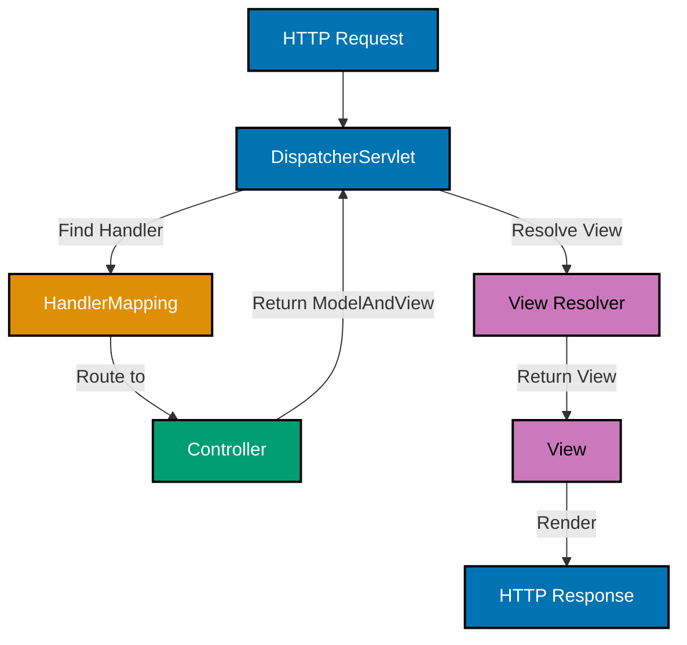

# Spring Framework Web MVC

**Understanding-oriented documentation** for building web applications with Spring MVC.

## Overview

Spring Web MVC provides Model-View-Controller architecture for building web applications and RESTful services. This document covers DispatcherServlet, controllers, request mapping, data binding, validation, and exception handling.

**Version**: Spring Framework 6.1+ (Java 17+, Kotlin 1.9+)

## Quick Reference

**Jump to:**

- [DispatcherServlet and Request Lifecycle](#dispatcherservlet-and-request-lifecycle)
- [@Controller and @RestController](#controller-and-restcontroller)
- [Request Mapping](#request-mapping)
- [Handler Methods](#handler-methods)
- [Data Binding and Validation](#data-binding-and-validation)
- [Exception Handling](#exception-handling)
- [Interceptors](#interceptors)
- [CORS Configuration](#cors-configuration)

## DispatcherServlet and Request Lifecycle

### Request Processing Flow



### Web Configuration

**Java Example**:

```java
@Configuration
@EnableWebMvc
@ComponentScan(basePackages = "com.oseplatform.zakat.api")
public class WebConfig implements WebMvcConfigurer {

  @Override
  public void configureViewResolvers(ViewResolverRegistry registry) {
    InternalResourceViewResolver resolver = new InternalResourceViewResolver();
    resolver.setPrefix("/WEB-INF/views/");
    resolver.setSuffix(".jsp");
    registry.viewResolver(resolver);
  }

  @Override
  public void addResourceHandlers(ResourceHandlerRegistry registry) {
    registry.addResourceHandler("/static/**")
      .addResourceLocations("/static/");
  }

  @Override
  public void configureDefaultServletHandling(DefaultServletHandlerConfigurer configurer) {
    configurer.enable();
  }
}
```

**Kotlin Example**:

```kotlin
@Configuration
@EnableWebMvc
@ComponentScan(basePackages = ["com.oseplatform.zakat.api"])
class WebConfig : WebMvcConfigurer {

  override fun configureViewResolvers(registry: ViewResolverRegistry) {
    val resolver = InternalResourceViewResolver().apply {
      setPrefix("/WEB-INF/views/")
      setSuffix(".jsp")
    }
    registry.viewResolver(resolver)
  }

  override fun addResourceHandlers(registry: ResourceHandlerRegistry) {
    registry.addResourceHandler("/static/**")
      .addResourceLocations("/static/")
  }

  override fun configureDefaultServletHandling(configurer: DefaultServletHandlerConfigurer) {
    configurer.enable()
  }
}
```

## @Controller and @RestController

### @Controller for HTML Views

**Java Example** (Zakat Calculation Form):

```java
@Controller
@RequestMapping("/zakat")
public class ZakatCalculationController {
  private final ZakatCalculationService service;

  public ZakatCalculationController(ZakatCalculationService service) {
    this.service = service;
  }

  @GetMapping("/calculator")
  public String showCalculator(Model model) {
    model.addAttribute("calculationForm", new ZakatCalculationForm());
    return "zakat/calculator";  // Returns view name
  }

  @PostMapping("/calculate")
  public String calculate(
    @ModelAttribute @Valid ZakatCalculationForm form,
    BindingResult bindingResult,
    Model model
  ) {
    if (bindingResult.hasErrors()) {
      return "zakat/calculator";
    }

    ZakatCalculationResponse response = service.calculate(form.toRequest());
    model.addAttribute("result", response);

    return "zakat/result";  // Returns view name
  }
}
```

### @RestController for JSON APIs

**Java Example** (Donation API):

```java
@RestController
@RequestMapping("/api/v1/donations")
public class DonationController {
  private final DonationService service;

  public DonationController(DonationService service) {
    this.service = service;
  }

  @PostMapping
  public ResponseEntity<DonationResponse> createDonation(
    @RequestBody @Valid CreateDonationRequest request
  ) {
    DonationResponse response = service.processDonation(request);
    return ResponseEntity.status(HttpStatus.CREATED).body(response);
  }

  @GetMapping("/{id}")
  public ResponseEntity<DonationResponse> getDonation(@PathVariable String id) {
    return service.findById(id)
      .map(ResponseEntity::ok)
      .orElse(ResponseEntity.notFound().build());
  }

  @GetMapping
  public ResponseEntity<List<DonationResponse>> getDonations(
    @RequestParam(required = false) String donorId,
    @RequestParam(required = false) @DateTimeFormat(iso = DateTimeFormat.ISO.DATE) LocalDate startDate,
    @RequestParam(required = false) @DateTimeFormat(iso = DateTimeFormat.ISO.DATE) LocalDate endDate
  ) {
    List<DonationResponse> donations = service.findDonations(donorId, startDate, endDate);
    return ResponseEntity.ok(donations);
  }
}
```

**Kotlin Example** (Donation API):

```kotlin
@RestController
@RequestMapping("/api/v1/donations")
class DonationController(private val service: DonationService) {

  @PostMapping
  fun createDonation(
    @RequestBody @Valid request: CreateDonationRequest
  ): ResponseEntity<DonationResponse> {
    val response = service.processDonation(request)
    return ResponseEntity.status(HttpStatus.CREATED).body(response)
  }

  @GetMapping("/{id}")
  fun getDonation(@PathVariable id: String): ResponseEntity<DonationResponse> =
    service.findById(id)
      ?.let { ResponseEntity.ok(it) }
      ?: ResponseEntity.notFound().build()

  @GetMapping
  fun getDonations(
    @RequestParam(required = false) donorId: String?,
    @RequestParam(required = false) @DateTimeFormat(iso = DateTimeFormat.ISO.DATE) startDate: LocalDate?,
    @RequestParam(required = false) @DateTimeFormat(iso = DateTimeFormat.ISO.DATE) endDate: LocalDate?
  ): ResponseEntity<List<DonationResponse>> {
    val donations = service.findDonations(donorId, startDate, endDate)
    return ResponseEntity.ok(donations)
  }
}
```

## Request Mapping

### HTTP Method Mapping

**Java Example** (Murabaha Contract API):

```java
@RestController
@RequestMapping("/api/v1/contracts")
public class MurabahaContractController {

  @GetMapping  // GET /api/v1/contracts
  public List<MurabahaContractResponse> getContracts() {
    // List contracts
  }

  @PostMapping  // POST /api/v1/contracts
  public MurabahaContractResponse createContract(@RequestBody CreateContractRequest request) {
    // Create contract
  }

  @GetMapping("/{id}")  // GET /api/v1/contracts/{id}
  public MurabahaContractResponse getContract(@PathVariable String id) {
    // Get contract by ID
  }

  @PutMapping("/{id}")  // PUT /api/v1/contracts/{id}
  public MurabahaContractResponse updateContract(
    @PathVariable String id,
    @RequestBody UpdateContractRequest request
  ) {
    // Update contract
  }

  @DeleteMapping("/{id}")  // DELETE /api/v1/contracts/{id}
  public ResponseEntity<Void> deleteContract(@PathVariable String id) {
    // Delete contract
    return ResponseEntity.noContent().build();
  }
}
```

### Path Variables and Request Parameters

**Java Example**:

```java
@RestController
@RequestMapping("/api/v1/zakat")
public class ZakatCalculationController {

  @GetMapping("/calculate")
  public ZakatCalculationResponse calculate(
    @RequestParam BigDecimal wealth,
    @RequestParam BigDecimal nisab,
    @RequestParam(defaultValue = "USD") String currency
  ) {
    // Calculate zakat with request parameters
  }

  @GetMapping("/calculations/{id}")
  public ZakatCalculationResponse getCalculation(@PathVariable String id) {
    // Get calculation by path variable
  }

  @GetMapping("/calculations/{id}/details")
  public ZakatCalculationDetails getCalculationDetails(
    @PathVariable String id,
    @RequestParam(defaultValue = "false") boolean includeHistory
  ) {
    // Mix path variable and request parameter
  }
}
```

## Handler Methods

### Method Arguments

**Java Example**:

```java
@RestController
public class DonationController {

  // Request body
  @PostMapping("/api/v1/donations")
  public DonationResponse createDonation(@RequestBody CreateDonationRequest request) {}

  // Path variable
  @GetMapping("/api/v1/donations/{id}")
  public DonationResponse getDonation(@PathVariable String id) {}

  // Request parameters
  @GetMapping("/api/v1/donations")
  public List<DonationResponse> getDonations(
    @RequestParam String donorId,
    @RequestParam(required = false) LocalDate date
  ) {}

  // Request headers
  @GetMapping("/api/v1/donations/export")
  public byte[] exportDonations(@RequestHeader("Accept-Language") String language) {}

  // HttpServletRequest
  @GetMapping("/api/v1/info")
  public String getInfo(HttpServletRequest request) {
    String userAgent = request.getHeader("User-Agent");
    return "User Agent: " + userAgent;
  }
}
```

### Return Types

**Java Example**:

```java
@RestController
public class ZakatController {

  // ResponseEntity for full control
  @GetMapping("/api/v1/zakat/{id}")
  public ResponseEntity<ZakatCalculationResponse> getCalculation(@PathVariable String id) {
    return service.findById(id)
      .map(calc -> ResponseEntity.ok()
        .header("X-Calculation-Version", "1.0")
        .body(calc))
      .orElse(ResponseEntity.notFound().build());
  }

  // Direct object for simple cases
  @GetMapping("/api/v1/zakat/all")
  public List<ZakatCalculationResponse> getAll() {
    return service.findAll();
  }

  // View name for HTML
  @GetMapping("/zakat/calculator")
  public String showCalculator(Model model) {
    return "zakat/calculator";
  }
}
```

## Data Binding and Validation

### Bean Validation

**Java Example** (Create Donation Request):

```java
public record CreateDonationRequest(
  @NotNull(message = "Amount is required")
  @DecimalMin(value = "1.0", message = "Amount must be at least 1.0")
  BigDecimal amount,

  @NotNull(message = "Category is required")
  DonationCategory category,

  @NotBlank(message = "Donor ID is required")
  String donorId,

  @NotNull(message = "Donation date is required")
  @PastOrPresent(message = "Donation date cannot be in the future")
  LocalDate donationDate
) {}

@RestController
@RequestMapping("/api/v1/donations")
public class DonationController {

  @PostMapping
  public ResponseEntity<DonationResponse> createDonation(
    @RequestBody @Valid CreateDonationRequest request
  ) {
    // Validation automatically applied
    DonationResponse response = service.processDonation(request);
    return ResponseEntity.status(HttpStatus.CREATED).body(response);
  }
}
```

**Kotlin Example**:

```kotlin
data class CreateDonationRequest(
  @field:NotNull(message = "Amount is required")
  @field:DecimalMin(value = "1.0", message = "Amount must be at least 1.0")
  val amount: BigDecimal,

  @field:NotNull(message = "Category is required")
  val category: DonationCategory,

  @field:NotBlank(message = "Donor ID is required")
  val donorId: String,

  @field:NotNull(message = "Donation date is required")
  @field:PastOrPresent(message = "Donation date cannot be in the future")
  val donationDate: LocalDate
)

@RestController
@RequestMapping("/api/v1/donations")
class DonationController(private val service: DonationService) {

  @PostMapping
  fun createDonation(
    @RequestBody @Valid request: CreateDonationRequest
  ): ResponseEntity<DonationResponse> {
    // Validation automatically applied
    val response = service.processDonation(request)
    return ResponseEntity.status(HttpStatus.CREATED).body(response)
  }
}
```

## Exception Handling

### @ControllerAdvice

**Java Example**:

```java
@ControllerAdvice
public class GlobalExceptionHandler {

  @ExceptionHandler(EntityNotFoundException.class)
  public ResponseEntity<ErrorResponse> handleEntityNotFound(
    EntityNotFoundException ex,
    HttpServletRequest request
  ) {
    ErrorResponse error = new ErrorResponse(
      Instant.now(),
      HttpStatus.NOT_FOUND.value(),
      "Entity Not Found",
      ex.getMessage(),
      request.getRequestURI()
    );

    return ResponseEntity.status(HttpStatus.NOT_FOUND).body(error);
  }

  @ExceptionHandler(MethodArgumentNotValidException.class)
  public ResponseEntity<ErrorResponse> handleValidationError(
    MethodArgumentNotValidException ex,
    HttpServletRequest request
  ) {
    List<String> errors = ex.getBindingResult().getAllErrors().stream()
      .map(ObjectError::getDefaultMessage)
      .toList();

    ErrorResponse error = new ErrorResponse(
      Instant.now(),
      HttpStatus.BAD_REQUEST.value(),
      "Validation Failed",
      "Request validation failed",
      request.getRequestURI(),
      errors
    );

    return ResponseEntity.badRequest().body(error);
  }
}
```

**Kotlin Example**:

```kotlin
@ControllerAdvice
class GlobalExceptionHandler {

  @ExceptionHandler(EntityNotFoundException::class)
  fun handleEntityNotFound(
    ex: EntityNotFoundException,
    request: HttpServletRequest
  ): ResponseEntity<ErrorResponse> {
    val error = ErrorResponse(
      timestamp = Instant.now(),
      status = HttpStatus.NOT_FOUND.value(),
      error = "Entity Not Found",
      message = ex.message ?: "Entity not found",
      path = request.requestURI
    )

    return ResponseEntity.status(HttpStatus.NOT_FOUND).body(error)
  }

  @ExceptionHandler(MethodArgumentNotValidException::class)
  fun handleValidationError(
    ex: MethodArgumentNotValidException,
    request: HttpServletRequest
  ): ResponseEntity<ErrorResponse> {
    val errors = ex.bindingResult.allErrors
      .mapNotNull { it.defaultMessage }

    val error = ErrorResponse(
      timestamp = Instant.now(),
      status = HttpStatus.BAD_REQUEST.value(),
      error = "Validation Failed",
      message = "Request validation failed",
      path = request.requestURI,
      validationErrors = errors
    )

    return ResponseEntity.badRequest().body(error)
  }
}
```

## Interceptors

### HandlerInterceptor

**Java Example** (Logging Interceptor):

```java
@Component
public class LoggingInterceptor implements HandlerInterceptor {
  private static final Logger logger = LoggerFactory.getLogger(LoggingInterceptor.class);

  @Override
  public boolean preHandle(
    HttpServletRequest request,
    HttpServletResponse response,
    Object handler
  ) throws Exception {
    logger.info("Incoming request: {} {}", request.getMethod(), request.getRequestURI());
    request.setAttribute("startTime", System.currentTimeMillis());
    return true;  // Continue processing
  }

  @Override
  public void postHandle(
    HttpServletRequest request,
    HttpServletResponse response,
    Object handler,
    ModelAndView modelAndView
  ) throws Exception {
    long duration = System.currentTimeMillis() - (long) request.getAttribute("startTime");
    logger.info("Request processed in {}ms", duration);
  }
}

@Configuration
public class WebConfig implements WebMvcConfigurer {

  @Autowired
  private LoggingInterceptor loggingInterceptor;

  @Override
  public void addInterceptors(InterceptorRegistry registry) {
    registry.addInterceptor(loggingInterceptor)
      .addPathPatterns("/api/**");
  }
}
```

## CORS Configuration

**Java Example**:

```java
@Configuration
public class WebConfig implements WebMvcConfigurer {

  @Override
  public void addCorsMappings(CorsRegistry registry) {
    registry.addMapping("/api/**")
      .allowedOrigins("https://oseplatform.com", "https://app.oseplatform.com")
      .allowedMethods("GET", "POST", "PUT", "DELETE", "OPTIONS")
      .allowedHeaders("*")
      .allowCredentials(true)
      .maxAge(3600);
  }
}
```

**Kotlin Example**:

```kotlin
@Configuration
class WebConfig : WebMvcConfigurer {

  override fun addCorsMappings(registry: CorsRegistry) {
    registry.addMapping("/api/**")
      .allowedOrigins("https://oseplatform.com", "https://app.oseplatform.com")
      .allowedMethods("GET", "POST", "PUT", "DELETE", "OPTIONS")
      .allowedHeaders("*")
      .allowCredentials(true)
      .maxAge(3600)
  }
}
```

## Related Documentation

### Core Spring Framework Documentation

- **[Spring Framework README](./README.md)** - Framework overview
- **[REST APIs](ex-soen-plwe-to-jvsp__rest-apis.md)** - RESTful services
- **[Best Practices](ex-soen-plwe-to-jvsp__best-practices.md)** - Web development standards

---

**Last Updated**: 2026-01-29
**Spring Framework Version**: 6.1+ (Java 17+, Kotlin 1.9+)
**Maintainers**: Platform Documentation Team
