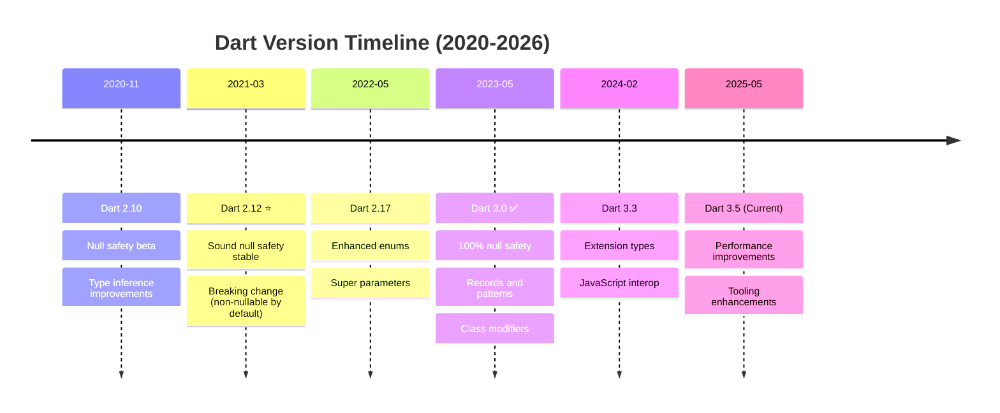

# Dart Programming Language Documentation

**Quick Reference**: [Overview](#overview) | [Prerequisite Knowledge](#prerequisite-knowledge) | [Software Engineering Principles](#software-engineering-principles) | [Version Strategy](#dart-version-strategy) | [Dart in the Platform](#dart-in-the-platform) | [Dart Philosophy](#dart-philosophy) | [Documentation Structure](#documentation-structure) | [Learning Paths](#learning-paths) | [Code Examples](#code-examples) | [Tools & Ecosystem](#tools-and-ecosystem) | [Resources](#resources-and-references)

## Overview

Dart is a modern, object-oriented programming language developed by Google, designed for building fast apps on any platform. Within the Open Sharia Enterprise platform, Dart serves critical roles in cross-platform mobile applications (Flutter), web frontends, server-side services, and command-line tools requiring type safety and high performance.

### Why Dart for OSE Platform

Dart excels in domains essential to the platform:

- **Cross-Platform Mobile**: Flutter framework for iOS and Android with single codebase
- **Financial Calculations**: Strong typing and null safety for Zakat, Murabaha computations
- **Type Safety**: Sound null safety system eliminating null reference errors
- **High Performance**: AOT compilation for production, JIT for development
- **Async Programming**: First-class async/await support with Futures and Streams
- **Modern Syntax**: Clean, readable syntax with powerful language features

### Dart Philosophy

Dart's design principles guide development:

- **Optimized for UI** - Built specifically for user interface development
- **Productive development** - Hot reload, strong tooling, fast iteration cycles
- **Fast on all platforms** - AOT and JIT compilation for optimal performance
- **Sound null safety** - Eliminate null reference errors at compile time
- **Strongly typed** - Static type system with type inference
- **Single codebase** - Write once, deploy to mobile, web, desktop, server

## Prerequisite Knowledge

**REQUIRED**: This documentation assumes you have completed the AyoKoding Dart learning path. These are **OSE Platform-specific style guides**, not educational tutorials.

**You MUST understand Dart fundamentals before using these standards:**

- **[Dart Learning Path](../../../../apps/ayokoding-web/content/en/learn/software-engineering/programming-languages/dart.md)** - Complete 0-95% language coverage
- **[Dart By Example](../../../../../apps/ayokoding-web/content/en/learn/software-engineering/programming-languages/dart/by-example.md)** - 75-85 annotated code examples (beginner → advanced)
- **[Dart In Practice](../../../../../apps/ayokoding-web/content/en/learn/software-engineering/programming-languages/dart/in-practice.md)** - Production patterns and design approaches

**What this documentation covers**: OSE Platform naming conventions, framework choices, repository-specific patterns, how to apply Dart knowledge in THIS codebase.

**What this documentation does NOT cover**: Dart syntax, language fundamentals, generic patterns (those are in ayokoding-web).

**See**: [Programming Language Documentation Separation Convention](../../../../../governance/conventions/structure/programming-language-docs-separation.md) for content separation rules.

## Coding Standards

**This documentation is the authoritative reference** for Dart coding standards in the open-sharia-enterprise platform.

All Dart code MUST follow the standards documented here:

1. **[Idioms](./ex-soen-prla-da__idioms.md)** - Dart-specific patterns and conventions
2. **[Best Practices](./ex-soen-prla-da__best-practices.md)** - Clean code standards
3. **[Anti-Patterns](./ex-soen-prla-da__anti-patterns.md)** - Common mistakes to avoid

**For Agents**: Reference this documentation when writing Dart code.

### Quick Standards Reference

- **Naming Conventions**: See [Best Practices - Code Organization](./ex-soen-prla-da__best-practices.md#code-organization)
- **Null Safety**: See [Null Safety](./ex-soen-prla-da__null-safety.md)
- **Error Handling**: See [Error Handling](./ex-soen-prla-da__error-handling.md)
- **Async Patterns**: See [Async Programming](./ex-soen-prla-da__async-programming.md)
- **Testing Standards**: See [Testing](./ex-soen-prla-da__testing.md)
- **Security Practices**: See [Security](./ex-soen-prla-da__security.md)

**Related**: [Functional Programming](../../../../../governance/development/pattern/functional-programming.md) - Cross-language FP principles

## Software Engineering Principles

Dart development in this platform follows the five software engineering principles from [governance/principles/software-engineering/](../../../../../governance/principles/software-engineering/README.md):

1. **[Automation Over Manual](../../../../../governance/principles/software-engineering/automation-over-manual.md)** - Dart automates through dart test, dart format, dart analyze, and CI/CD pipelines
2. **[Explicit Over Implicit](../../../../../governance/principles/software-engineering/explicit-over-implicit.md)** - Dart enforces through explicit imports, null safety annotations, clear type declarations, explicit async markers
3. **[Immutability Over Mutability](../../../../../governance/principles/software-engineering/immutability.md)** - Dart encourages immutable patterns through final variables, const constructors, immutable collections, and freezed package
4. **[Pure Functions Over Side Effects](../../../../../governance/principles/software-engineering/pure-functions.md)** - Dart supports through first-class functions, functional programming patterns, and pure function design
5. **[Reproducibility First](../../../../../governance/principles/software-engineering/reproducibility.md)** - Dart enables through pubspec.lock, deterministic dependency resolution, and consistent build outputs

**See Also**: [Functional Programming](./ex-soen-prla-da__functional-programming.md) for pure functions patterns, [Best Practices](./ex-soen-prla-da__best-practices.md) for explicit coding standards, [Null Safety](./ex-soen-prla-da__null-safety.md) for type-safe patterns.

## Dart Version Strategy

The platform targets modern Dart versions for optimal features and null safety:

### Version Timeline



### Supported Versions

- **Dart 2.12+** (Minimum): Baseline with sound null safety
- **Dart 3.0+** (Recommended): Modern features, 100% null safety enforcement
- **Dart 3.5** (Latest Stable): Current stable release with latest improvements

### Version Selection Guidelines

**Use Dart 2.12-2.19** when:

- Maintaining legacy Flutter applications
- Gradual null safety migration required
- Supporting older Flutter SDK versions

**Use Dart 3.0+** when:

- Building new applications with full null safety
- Leveraging records and pattern matching
- Using class modifiers (sealed, final, base)
- Starting greenfield Flutter projects

**Use Dart 3.5** when:

- Building cutting-edge applications
- Leveraging extension types for performance
- Using latest JavaScript interop features
- Requiring newest tooling improvements

## Dart in the Platform

### Primary Use Cases

**Mobile Applications (Flutter)**:

```dart
// => Zakat Calculator mobile app with Flutter
import 'package:flutter/material.dart';

// => Immutable state class using final fields
class ZakatCalculation {
  // => All fields are final (immutable)
  final double wealth;
  final double nisab;
  final double zakatAmount;
  final DateTime calculationDate;

  // => Const constructor for compile-time constants
  const ZakatCalculation({
    required this.wealth,
    required this.nisab,
    required this.zakatAmount,
    required this.calculationDate,
  });

  // => Factory constructor for business logic
  factory ZakatCalculation.fromWealth(double wealth, double nisab) {
    // => Pure function - no side effects
    final zakatAmount = wealth >= nisab ? wealth * 0.025 : 0.0;
    return ZakatCalculation(
      wealth: wealth,
      nisab: nisab,
      zakatAmount: zakatAmount,
      calculationDate: DateTime.now(),
    );
  }

  // => CopyWith pattern for immutable updates
  ZakatCalculation copyWith({
    double? wealth,
    double? nisab,
    double? zakatAmount,
    DateTime? calculationDate,
  }) {
    return ZakatCalculation(
      wealth: wealth ?? this.wealth,
      nisab: nisab ?? this.nisab,
      zakatAmount: zakatAmount ?? this.zakatAmount,
      calculationDate: calculationDate ?? this.calculationDate,
    );
  }
}

// => Stateless widget - immutable UI component
class ZakatCalculatorScreen extends StatelessWidget {
  const ZakatCalculatorScreen({super.key});

  @override
  Widget build(BuildContext context) {
    return Scaffold(
      appBar: AppBar(title: const Text('Zakat Calculator')),
      body: const ZakatForm(),
    );
  }
}
```

**Server-Side Services**:

```dart
// => RESTful API server using shelf package
import 'dart:convert';
import 'package:shelf/shelf.dart';
import 'package:shelf/shelf_io.dart' as io;

// => Pure function for Zakat calculation
double calculateZakat(double wealth, double nisab) {
  // => Guard clause for invalid input
  if (wealth < 0 || nisab < 0) {
    throw ArgumentError('Wealth and nisab must be non-negative');
  }
  // => Business logic
  return wealth >= nisab ? wealth * 0.025 : 0.0;
}

// => Request handler with explicit async
Future<Response> zakatHandler(Request request) async {
  // => Explicit error handling with try-catch
  try {
    // => Parse JSON body
    final payload = jsonDecode(await request.readAsString()) as Map<String, dynamic>;

    // => Extract with null safety
    final wealth = (payload['wealth'] as num?)?.toDouble();
    final nisab = (payload['nisab'] as num?)?.toDouble();

    // => Validate required fields
    if (wealth == null || nisab == null) {
      return Response.badRequest(
        body: jsonEncode({'error': 'Missing wealth or nisab'}),
      );
    }

    // => Calculate zakat (pure function)
    final zakatAmount = calculateZakat(wealth, nisab);

    // => Return successful response
    return Response.ok(
      jsonEncode({
        'wealth': wealth,
        'nisab': nisab,
        'zakatAmount': zakatAmount,
        'eligible': wealth >= nisab,
      }),
      headers: {'content-type': 'application/json'},
    );
  } catch (e) {
    // => Error response
    return Response.internalServerError(
      body: jsonEncode({'error': e.toString()}),
    );
  }
}

// => Main server entry point
Future<void> main() async {
  // => Create request handler pipeline
  final handler = Pipeline()
      .addMiddleware(logRequests())
      .addHandler(zakatHandler);

  // => Start server
  final server = await io.serve(handler, 'localhost', 8080);
  print('Server running on localhost:${server.port}');
}
```

**Command-Line Tools**:

```dart
// => CLI tool for Zakat calculation
import 'dart:io';

// => Domain model with validation
class Money {
  final double amount;
  final String currency;

  // => Constructor with validation
  Money(this.amount, this.currency) {
    if (amount < 0) {
      throw ArgumentError('Amount cannot be negative');
    }
    if (currency.isEmpty) {
      throw ArgumentError('Currency is required');
    }
  }

  // => Operator overloading for domain operations
  Money operator +(Money other) {
    if (currency != other.currency) {
      throw ArgumentError('Currency mismatch');
    }
    return Money(amount + other.amount, currency);
  }

  Money operator *(double multiplier) {
    return Money(amount * multiplier, currency);
  }

  // => String representation
  @override
  String toString() => '$amount $currency';
}

// => Main CLI entry point
Future<void> main(List<String> arguments) async {
  // => Prompt for input
  stdout.write('Enter wealth amount: ');
  final wealthInput = stdin.readLineSync();

  stdout.write('Enter nisab amount: ');
  final nisabInput = stdin.readLineSync();

  // => Parse with null safety
  if (wealthInput == null || nisabInput == null) {
    print('Invalid input');
    exit(1);
  }

  // => Convert to numbers
  final wealth = double.tryParse(wealthInput);
  final nisab = double.tryParse(nisabInput);

  // => Validate parsed values
  if (wealth == null || nisab == null) {
    print('Please enter valid numbers');
    exit(1);
  }

  // => Create Money objects
  final wealthMoney = Money(wealth, 'USD');
  final nisabMoney = Money(nisab, 'USD');

  // => Calculate zakat
  if (wealth >= nisab) {
    final zakatMoney = wealthMoney * 0.025;
    print('Zakat amount: $zakatMoney');
    print('You are eligible to pay Zakat');
  } else {
    print('Wealth is below nisab threshold');
    print('No Zakat obligation this time');
  }
}
```

### Domain-Driven Design with Dart

**Value Objects**:

```dart
// => Immutable value object using records (Dart 3.0+)
typedef Money = ({double amount, String currency});

// => Extension methods for domain operations
extension MoneyOperations on Money {
  // => Validate money
  bool get isValid => amount >= 0 && currency.isNotEmpty;

  // => Add money (same currency)
  Money add(Money other) {
    if (currency != other.currency) {
      throw ArgumentError('Currency mismatch: $currency != ${other.currency}');
    }
    return (amount: amount + other.amount, currency: currency);
  }

  // => Multiply by rate
  Money multiply(double rate) {
    return (amount: amount * rate, currency: currency);
  }

  // => Format for display
  String format() => '${amount.toStringAsFixed(2)} $currency';
}
```

**Entities and Aggregates**:

```dart
// => Entity with identity
class MurabahaContract {
  // => Unique identifier
  final String id;

  // => Value objects
  final Money assetCost;
  final double profitRate;

  // => Entity state
  final List<Payment> payments;
  final ContractStatus status;
  final DateTime createdAt;

  // => Constructor enforcing invariants
  MurabahaContract({
    required this.id,
    required this.assetCost,
    required this.profitRate,
    List<Payment>? payments,
    this.status = ContractStatus.active,
    DateTime? createdAt,
  }) : payments = payments ?? [],
       createdAt = createdAt ?? DateTime.now() {
    // => Validate invariants
    if (profitRate < 0) {
      throw ArgumentError('Profit rate cannot be negative');
    }
    if (!assetCost.isValid) {
      throw ArgumentError('Invalid asset cost');
    }
  }

  // => Domain method with business rules
  MurabahaContract recordPayment(Payment payment) {
    // => Validate payment
    if (payment.amount.amount <= 0) {
      throw ArgumentError('Payment amount must be positive');
    }

    final totalPaid = _calculateTotalPaid();
    final totalAmount = assetCost.multiply(1 + profitRate);

    if (totalPaid.add(payment.amount).amount > totalAmount.amount) {
      throw InvalidPaymentException('Payment exceeds remaining balance');
    }

    // => Return new instance (immutable)
    return MurabahaContract(
      id: id,
      assetCost: assetCost,
      profitRate: profitRate,
      payments: [...payments, payment],
      status: status,
      createdAt: createdAt,
    );
  }

  // => Private helper (pure function)
  Money _calculateTotalPaid() {
    return payments.fold(
      (amount: 0.0, currency: assetCost.currency),
      (total, payment) => total.add(payment.amount),
    );
  }
}

// => Payment value object
class Payment {
  final Money amount;
  final DateTime paymentDate;

  const Payment({
    required this.amount,
    required this.paymentDate,
  });
}

// => Enum for contract status
enum ContractStatus {
  active,
  completed,
  cancelled,
}

// => Custom exception
class InvalidPaymentException implements Exception {
  final String message;
  const InvalidPaymentException(this.message);

  @override
  String toString() => 'InvalidPaymentException: $message';
}
```

## Dart Philosophy

### Null Safety

Dart's sound null safety system eliminates null reference errors:

```dart
// => Non-nullable by default
String name = 'Ahmed';  // Cannot be null
// name = null;  // ❌ Compile error

// => Nullable type with ?
String? optionalName;  // Can be null
optionalName = null;  // ✅ OK

// => Null-aware operators
String greeting = optionalName ?? 'Guest';  // Null coalescing
int? length = optionalName?.length;  // Null-aware access

// => Null assertion (use carefully)
String definitelyPresent = optionalName!;  // Asserts non-null

// => Late initialization
late String loadedData;  // Initialized before use

Future<void> loadData() async {
  loadedData = await fetchFromServer();
}
```

### Async Programming

First-class support for asynchronous operations:

```dart
// => Future for single async result
Future<double> calculateZakatAsync(double wealth, double nisab) async {
  // => Simulate async calculation
  await Future.delayed(Duration(seconds: 1));
  return wealth >= nisab ? wealth * 0.025 : 0.0;
}

// => Stream for multiple async values
Stream<ZakatCalculation> zakatCalculationStream() async* {
  // => Generate calculations over time
  for (var i = 1; i <= 5; i++) {
    await Future.delayed(Duration(seconds: 1));
    yield ZakatCalculation.fromWealth(
      1000.0 * i,
      5000.0,
    );
  }
}

// => Using futures
void main() async {
  // => Await single result
  final zakat = await calculateZakatAsync(10000, 5000);
  print('Zakat: $zakat');

  // => Listen to stream
  await for (final calculation in zakatCalculationStream()) {
    print('Calculation: ${calculation.zakatAmount}');
  }
}
```

### Functional Programming

Dart supports functional programming patterns:

```dart
// => Higher-order functions
List<double> calculateMultipleZakat(
  List<double> wealthAmounts,
  double nisab,
) {
  // => map transforms collection
  return wealthAmounts
      .where((wealth) => wealth >= nisab)  // Filter
      .map((wealth) => wealth * 0.025)      // Transform
      .toList();
}

// => Function composition
typedef CalculationFunction = double Function(double);

CalculationFunction composeCalculations(
  CalculationFunction first,
  CalculationFunction second,
) {
  return (value) => second(first(value));
}

// => Closures
CalculationFunction makeMultiplier(double factor) {
  // => Captures factor from outer scope
  return (value) => value * factor;
}

// => Using functional patterns
void main() {
  final zakatRate = makeMultiplier(0.025);
  final wealthAmounts = [5000.0, 10000.0, 15000.0];

  final zakatAmounts = wealthAmounts.map(zakatRate).toList();
  print(zakatAmounts);  // [125.0, 250.0, 375.0]
}
```

## Documentation Structure

### [Dart Idioms](./ex-soen-prla-da__idioms.md)

Language-specific patterns for writing idiomatic Dart code.

**Covers**:

- Cascade notation (..)
- Named constructors and factory constructors
- Extension methods
- Null safety patterns
- Collection literals
- String interpolation
- Const constructors
- Late initialization
- Mixins and interfaces
- Operator overloading

### [Dart Best Practices](./ex-soen-prla-da__best-practices.md)

Proven approaches for writing production-quality Dart applications.

**Covers**:

- Project structure and package organization
- Naming conventions (lowerCamelCase, UpperCamelCase, snake_case)
- Null safety best practices
- Async programming patterns
- Error handling strategies
- Testing approaches (unit, widget, integration)
- Performance optimization
- Memory management
- Code documentation (dartdoc)
- Dependency management (pubspec.yaml)

### [Dart Anti-Patterns](./ex-soen-prla-da__anti-patterns.md)

Common mistakes and problematic patterns to avoid.

**Covers**:

- Null safety violations
- Async anti-patterns (forgetting await, misusing Future.wait)
- Mutable state issues
- Memory leaks (unclosed streams, listeners)
- Inappropriate use of dynamic
- Breaking encapsulation
- Testing anti-patterns
- Performance pitfalls

### Specialized Topics

Deep-dive documentation on critical Dart areas:

#### [Null Safety](./ex-soen-prla-da__null-safety.md)

Comprehensive guide to Dart's sound null safety system.

**Covers**:

- Non-nullable by default
- Nullable types with ?
- Null-aware operators (??, ?., ?[])
- Null assertion operator (!)
- Late variables
- Required named parameters
- Definite assignment analysis
- Migration strategies
- Null safety in Flutter

#### [Async Programming](./ex-soen-prla-da__async-programming.md)

Comprehensive guide to asynchronous programming with Future and Stream.

**Covers**:

- Future basics and async/await
- Error handling in async code
- Stream fundamentals
- Stream transformations
- StreamController
- Broadcast streams
- Async\* and yield
- Combining multiple futures
- Timeout handling
- Isolates for parallel processing

#### [Collections](./ex-soen-prla-da__collections.md)

Working with Dart's collection types.

**Covers**:

- List, Set, Map fundamentals
- Collection literals
- Spread operators
- Collection if and for
- Iterable operations (map, where, reduce, fold)
- Lazy evaluation
- Immutable collections
- Custom collections
- Performance considerations

#### [Object-Oriented Programming](./ex-soen-prla-da__oop.md)

OOP patterns and practices in Dart.

**Covers**:

- Classes and constructors
- Named and factory constructors
- Inheritance and abstract classes
- Mixins for code reuse
- Interfaces (implicit interfaces)
- Class modifiers (sealed, final, base - Dart 3.0+)
- Operator overloading
- Generics and type parameters
- Extension methods

#### [Functional Programming](./ex-soen-prla-da__functional-programming.md)

Functional programming patterns in Dart.

**Covers**:

- First-class functions
- Higher-order functions
- Pure functions and immutability
- Function composition
- Closures and lexical scope
- Functional error handling
- Immutable data structures
- Pattern matching (Dart 3.0+)
- Records (Dart 3.0+)

#### [Error Handling](./ex-soen-prla-da__error-handling.md)

Comprehensive error handling strategies.

**Covers**:

- Exception hierarchy
- Try-catch-finally
- Custom exceptions
- Async error handling
- Error propagation
- Result types
- Validation patterns
- Logging and monitoring
- Recovery strategies

#### [Testing](./ex-soen-prla-da__testing.md)

Testing strategies for Dart applications.

**Covers**:

- Unit testing with package:test
- Widget testing (Flutter)
- Integration testing
- Test-driven development (TDD)
- Mocking with package:mockito
- Test coverage
- Golden tests (Flutter)
- Performance testing
- Testing async code
- CI/CD integration

#### [Performance](./ex-soen-prla-da__performance.md)

Optimization strategies for Dart applications.

**Covers**:

- Dart VM performance model
- AOT vs JIT compilation
- Memory management
- Collection optimization
- Async performance
- Isolates for CPU-intensive tasks
- Flutter performance optimization
- Profiling tools
- Benchmarking
- Tree shaking (unused code elimination)

#### [Security](./ex-soen-prla-da__security.md)

Security best practices for Dart applications.

**Covers**:

- Input validation and sanitization
- SQL injection prevention
- Cross-site scripting (XSS) prevention
- Authentication and authorization
- Secure data storage
- HTTPS and certificate pinning
- Secrets management
- Dependency security
- Security testing
- OWASP Mobile Top 10 (Flutter)

#### [Flutter Integration](./ex-soen-prla-da__flutter.md)

Dart patterns specific to Flutter development.

**Covers**:

- Widget lifecycle
- State management patterns (Provider, Riverpod, Bloc)
- BuildContext usage
- Navigation and routing
- Platform channels
- Async UI patterns
- Performance optimization
- Testing Flutter apps
- Platform-specific code

#### [Server-Side Dart](./ex-soen-prla-da__server-side.md)

Building server applications with Dart.

**Covers**:

- shelf package for HTTP servers
- Routing and middleware
- JSON serialization
- Database integration
- RESTful API design
- WebSocket support
- Authentication patterns
- Logging and monitoring
- Deployment strategies

#### [Version Migration](./ex-soen-prla-da__version-migration.md)

Upgrading Dart versions and migrating to null safety.

**Covers**:

- Dart 2.x to 3.0 migration
- Null safety migration
- Breaking changes
- Dependency compatibility
- Migration tools (dart migrate)
- Testing after migration

## Learning Paths

### 1. Start with Basics

**For Beginners**:

- [Dart Idioms](./ex-soen-prla-da__idioms.md) - Learn Dart-specific patterns
- [Null Safety](./ex-soen-prla-da__null-safety.md) - Master null safety system
- [Collections](./ex-soen-prla-da__collections.md) - Work with List, Set, Map

### 2. Master Async Programming

**For Intermediate Developers**:

- [Async Programming](./ex-soen-prla-da__async-programming.md) - Future and Stream
- [Error Handling](./ex-soen-prla-da__error-handling.md) - Robust error management
- [Testing](./ex-soen-prla-da__testing.md) - Write reliable tests

### 3. Advanced Patterns

**For Advanced Developers**:

- [Object-Oriented Programming](./ex-soen-prla-da__oop.md) - Advanced OOP
- [Functional Programming](./ex-soen-prla-da__functional-programming.md) - FP patterns
- [Performance](./ex-soen-prla-da__performance.md) - Optimization techniques

### 4. Platform-Specific

**For Flutter Development**:

- [Flutter Integration](./ex-soen-prla-da__flutter.md) - Flutter-specific patterns

**For Backend Development**:

- [Server-Side Dart](./ex-soen-prla-da__server-side.md) - Building APIs

## Tools and Ecosystem

### Development Tools

**Dart SDK**:

- `dart` - Dart VM and command-line interface
- `dart analyze` - Static analysis
- `dart format` - Code formatting
- `dart test` - Testing framework
- `dart pub` - Package manager
- `dart compile` - AOT compilation

**IDEs and Editors**:

- **Visual Studio Code** - Excellent Dart and Flutter support
- **Android Studio** - Full-featured IDE for Flutter
- **IntelliJ IDEA** - JetBrains IDE with Dart plugin

### Package Ecosystem

**Essential Packages**:

- `http` - HTTP client
- `json_serializable` - JSON serialization
- `freezed` - Immutable data classes
- `riverpod` - State management (Flutter)
- `dio` - Advanced HTTP client
- `mockito` - Testing mocks
- `shelf` - HTTP server framework
- `args` - Command-line argument parsing

**Linting and Formatting**:

- `analysis_options.yaml` - Configure linter rules
- `dart_code_metrics` - Code quality metrics
- Recommended lints: `lints`, `flutter_lints`

### Reproducible Development

**Dependency Management**:

```yaml
# pubspec.yaml
name: zakat_calculator
version: 1.0.0
environment:
  sdk: ">=3.0.0 <4.0.0"

dependencies:
  http: ^1.1.0
  freezed_annotation: ^2.4.1

dev_dependencies:
  test: ^1.24.0
  mockito: ^5.4.0
  build_runner: ^2.4.0
  freezed: ^2.4.1
```

**Lock File**:

```yaml
# pubspec.lock (committed to version control)
# Ensures reproducible builds
```

## Resources and References

### Official Documentation

- [Dart Language Tour](https://dart.dev/guides/language/language-tour)
- [Effective Dart](https://dart.dev/guides/language/effective-dart)
- [Dart API Reference](https://api.dart.dev/)
- [Flutter Documentation](https://flutter.dev/docs)

### Best Practices

- [Dart Style Guide](https://dart.dev/guides/language/effective-dart/style)
- [Null Safety Guide](https://dart.dev/null-safety)
- [Async Programming Guide](https://dart.dev/codelabs/async-await)

### Learning Resources

- [DartPad](https://dartpad.dev/) - Online Dart playground
- [Dart Codelabs](https://dart.dev/codelabs)
- [Flutter Codelabs](https://docs.flutter.dev/codelabs)

## Related Documentation

### Core Dart Documentation

- **[Dart Idioms](./ex-soen-prla-da__idioms.md)** - Language patterns
- **[Dart Best Practices](./ex-soen-prla-da__best-practices.md)** - Coding standards
- **[Dart Anti-Patterns](./ex-soen-prla-da__anti-patterns.md)** - Common mistakes

### Language Features

- **[Null Safety](./ex-soen-prla-da__null-safety.md)** - Sound null safety system
- **[Async Programming](./ex-soen-prla-da__async-programming.md)** - Future and Stream
- **[Collections](./ex-soen-prla-da__collections.md)** - List, Set, Map
- **[OOP](./ex-soen-prla-da__oop.md)** - Object-oriented programming
- **[Functional Programming](./ex-soen-prla-da__functional-programming.md)** - FP patterns

### Application Development

- **[Flutter Integration](./ex-soen-prla-da__flutter.md)** - Flutter-specific patterns
- **[Server-Side Dart](./ex-soen-prla-da__server-side.md)** - Backend development
- **[Testing](./ex-soen-prla-da__testing.md)** - Testing strategies
- **[Performance](./ex-soen-prla-da__performance.md)** - Optimization
- **[Security](./ex-soen-prla-da__security.md)** - Security best practices

### Platform Documentation

- **[Programming Languages Index](../README.md)** - Parent languages documentation
- **[Java Programming Language](../java/README.md)** - Java documentation
- **[TypeScript Programming Language](../typescript/README.md)** - TypeScript documentation
- **[Software Design Index](../../README.md)** - Software documentation root

---

**Last Updated**: 2026-01-29
**Dart Version**: 3.5+ (Dart 3.0+ recommended for null safety and modern features)
**Maintainers**: Platform Documentation Team
