# Elixir

**This is THE authoritative reference** for Elixir coding standards in OSE Platform.

All Elixir code written for the OSE Platform MUST comply with the standards documented here. These standards are mandatory, not optional. Non-compliance blocks code review and merge approval.

## Framework Stack

OSE Platform Elixir applications MUST use the following framework stack:

**Primary Framework:**

- **Phoenix 1.7+** (Web framework with verified routes, Tailwind support, LiveView streams)
- **Phoenix LiveView** (Real-time UI without JavaScript complexity)

**OTP Stack:**

- **GenServer** for stateful processes and state management
- **Supervisor** for fault tolerance and supervision trees
- **Application** for OTP application structure

**Database & Persistence:**

- **Ecto 3.12+** (Database toolkit with query composition, changesets, migrations)
- **Ecto.Repo** for repository abstraction

**Testing Stack:**

- **ExUnit** (Built-in test framework with doctests and property-based testing)
- **StreamData** for property-based testing
- **White Bread** for BDD scenarios (Gherkin for Elixir)

**Elixir Version Strategy:**

- **Baseline**: Elixir 1.12+ (MUST use minimum) - Scripted Mix install, compilation improvements
- **Recommended**: Elixir 1.17+ (SHOULD migrate to) - Set-theoretic types, calendar durations, OTP 27 support
- **Latest**: Elixir 1.19 (RECOMMENDED for new projects) - Type checking of calls, LSP listeners, enhanced JSON.Encoder protocol

## Prerequisite Knowledge

**REQUIRED**: This documentation assumes you have completed the AyoKoding Elixir learning path. These are **OSE Platform-specific style guides**, not educational tutorials.

**You MUST understand Elixir fundamentals before using these standards:**

- **[Elixir Learning Path](https://ayokoding.com/en/learn/software-engineering/programming-languages/elixir)** - Complete 0-95% language coverage
- **[Elixir By Example](https://ayokoding.com/en/learn/software-engineering/programming-languages/elixir/by-example)** - 75-85 annotated code examples (beginner → advanced)
- **[Elixir In the Field](https://ayokoding.com/en/learn/software-engineering/programming-languages/elixir/in-the-field)** - 36 production guides (OTP-first, Phoenix, Ecto, testing, deployment)
- **[Elixir Release Highlights](https://ayokoding.com/en/learn/software-engineering/programming-languages/elixir/release-highlights)** - 6 major releases (1.12 baseline → 1.17 latest)

**What this documentation covers**: OSE Platform naming conventions, framework choices, repository-specific patterns, how to apply Elixir knowledge in THIS codebase.

**What this documentation does NOT cover**: Elixir syntax, language fundamentals, generic patterns (those are in ayokoding-web).

**See**: [Programming Language Documentation Separation Convention](../../../../../governance/conventions/structure/programming-language-docs-separation.md) for content separation rules.

## Software Engineering Principles

Elixir development in OSE Platform enforces five foundational software engineering principles:

1. **[Automation Over Manual](../../../../../governance/principles/software-engineering/automation-over-manual.md)** - MUST automate through Mix build tool, ExUnit testing framework, mix format, Credo for code quality, Dialyzer for static type analysis, and doctests for documentation validation

2. **[Explicit Over Implicit](../../../../../governance/principles/software-engineering/explicit-over-implicit.md)** - MUST enforce explicitness through pattern matching for control flow visibility, explicit error tuples `{:ok, result}` | `{:error, reason}`, supervision strategies explicitly defined, and configuration via `config/runtime.exs`

3. **[Immutability Over Mutability](../../../../../governance/principles/software-engineering/immutability.md)** - MUST use immutable data structures (all Elixir data is immutable by default), pure functions without side effects, data transformations through pipe operator, and functional core/imperative shell architecture

4. **[Pure Functions Over Side Effects](../../../../../governance/principles/software-engineering/pure-functions.md)** - MUST implement pure domain logic without side effects, explicit state management with GenServer, side effects isolated at system boundaries (Ecto, Phoenix), and testable business logic separated from I/O

5. **[Reproducibility First](../../../../../governance/principles/software-engineering/reproducibility.md)** - MUST ensure reproducibility through Mix lock file (`mix.lock`), version pinning in `mix.exs`, asdf/MISE with `.tool-versions` for Elixir and Erlang versions, and deterministic builds

## Elixir Version Strategy

OSE Platform follows a three-tier Elixir versioning strategy:

**Elixir 1.12+ (Baseline - REQUIRED)**:

- All projects MUST support Elixir 1.12 minimum
- Scripted Mix installation improvements
- Enhanced compilation performance
- Improved mix xref for dependency analysis

**Elixir 1.17+ (Target - RECOMMENDED)**:

- Projects SHOULD migrate to Elixir 1.17 when feasible
- Set-theoretic types for additional compile-time warnings
- Duration data type for calendar operations
- Enhanced Dialyzer integration
- Erlang/OTP 27 features (JSON module, process labels)

**Elixir 1.19 (Latest - RECOMMENDED)**:

- New projects SHOULD use Elixir 1.19 for latest stable features
- Type checking of protocols and anonymous functions
- Broader type inference capabilities
- Enhanced compile times (up to 4x faster for large projects)
- Function capture type propagation
- Enhanced JSON.Encoder protocol (JSON module introduced in 1.18)

**Unlike Java's LTS model**: Elixir maintains excellent backward compatibility across versions. Code written for Elixir 1.12 runs on 1.19 without modifications in most cases. Platform strategy focuses on staying current with stable releases.

## OSE Platform Coding Standards (Authoritative)

**MUST follow these mandatory standards for all Elixir code in OSE Platform:**

1. **[Coding Standards](./ex-soen-prla-el__coding-standards.md)** - Naming conventions, module organization, pattern matching idioms
2. **[Framework Integration Standards](./ex-soen-prla-el__framework-integration-standards.md)** - Phoenix, Ecto, OTP integration patterns
3. **[Testing Standards](./ex-soen-prla-el__testing-standards.md)** - ExUnit, doctests, property-based testing, White Bread BDD
4. **[Build Configuration Standards](./ex-soen-prla-el__build-configuration-standards.md)** - Mix project structure, dependency management, umbrella projects
5. **[Code Quality Standards](./ex-soen-prla-el__code-quality-standards.md)** - mix format, Credo, Dialyzer integration
6. **[Error Handling Standards](./ex-soen-prla-el__error-handling-standards.md)** - "Let it crash" philosophy, supervision trees
7. **[Concurrency Standards](./ex-soen-prla-el__concurrency-standards.md)** - Processes, message passing, Task module, concurrent patterns
8. **[Performance Standards](./ex-soen-prla-el__performance-standards.md)** - BEAM VM optimization, profiling, benchmarking, ETS tables
9. **[Security Standards](./ex-soen-prla-el__security-standards.md)** - Input validation, XSS prevention, SQL injection protection
10. **[Functional Programming Standards](./ex-soen-prla-el__functional-programming-standards.md)** - Pure functions, immutability, recursion, Enum/Stream
11. **[Type Safety Standards](./ex-soen-prla-el__type-safety-standards.md)** - Typespecs, Dialyzer, pattern matching as type guard
12. **[Memory Management Standards](./ex-soen-prla-el__memory-management-standards.md)** - BEAM VM garbage collection, process heaps, memory profiling
13. **[DDD Standards](./ex-soen-prla-el__ddd-standards.md)** - Domain-Driven Design without classes, Ecto schemas as aggregates
14. **[Protocols and Behaviours Standards](./ex-soen-prla-el__protocols-behaviours-standards.md)** - Polymorphism, protocol implementation, behaviour contracts
15. **[Finite State Machine Standards](./ex-soen-prla-el__finite-state-machine-standards.md)** - GenServer FSM, gen_statem, functional FSMs

## Documentation Structure

### Quick Reference

**Mandatory Standards (All Elixir Developers MUST follow)**:

1. [Coding Standards](./ex-soen-prla-el__coding-standards.md) - Naming, module structure, pattern matching
2. [Framework Integration Standards](./ex-soen-prla-el__framework-integration-standards.md) - Phoenix, Ecto, OTP setup
3. [Testing Standards](./ex-soen-prla-el__testing-standards.md) - ExUnit, doctests, property-based testing

**Context-Specific Standards (Apply when relevant)**:

- **Security**: [Security Standards](./ex-soen-prla-el__security-standards.md) - Input validation, Phoenix security for user-facing apps
- **Concurrency**: [Concurrency Standards](./ex-soen-prla-el__concurrency-standards.md) - Processes, GenServer for concurrent code
- **Domain Modeling**: [DDD Standards](./ex-soen-prla-el__ddd-standards.md) - Aggregates, bounded contexts for business domains
- **Error Handling**: [Error Handling Standards](./ex-soen-prla-el__error-handling-standards.md) - Supervision trees for resilience
- **Performance**: [Performance Standards](./ex-soen-prla-el__performance-standards.md) - BEAM optimization, ETS for caching
- **Type Safety**: [Type Safety Standards](./ex-soen-prla-el__type-safety-standards.md) - Typespecs, Dialyzer for type checking
- **Functional Programming**: [Functional Programming Standards](./ex-soen-prla-el__functional-programming-standards.md) - Pure functions, immutability
- **Protocols**: [Protocols and Behaviours Standards](./ex-soen-prla-el__protocols-behaviours-standards.md) - Polymorphism patterns
- **FSM**: [Finite State Machine Standards](./ex-soen-prla-el__finite-state-machine-standards.md) - State machine patterns

### Documentation Organization

```mermaid
%% Color Palette: Blue #0173B2, Orange #DE8F05, Teal #029E73, Purple #CC78BC
%% All colors are color-blind friendly and meet WCAG AA contrast standards

graph TD
    A["Elixir Standards Index<br/>#40;OSE Platform#41;"]:::blue
    B["Core Standards"]:::orange
    C["Specialized Standards"]:::teal
    D["Learning Resources<br/>#40;AyoKoding#41;"]:::purple

    A --> B
    A --> C
    A --> D

    B --> E["Coding Standards"]:::orange
    B --> F["Framework Integration"]:::orange
    B --> G["Testing Standards"]:::orange
    B --> H["Build & Quality"]:::orange

    C --> I["Security Standards"]:::teal
    C --> J["Concurrency Standards"]:::teal
    C --> K["DDD Standards"]:::teal
    C --> L["Error Handling"]:::teal
    C --> M["Performance Standards"]:::teal
    C --> N["Functional Programming"]:::teal
    C --> O["Type Safety"]:::teal
    C --> P["Protocols & Behaviours"]:::teal
    C --> Q["FSM Standards"]:::teal

    D --> R["By Example<br/>#40;75-85 examples#41;"]:::purple
    D --> S["In Practice<br/>#40;Production patterns#41;"]:::purple

    classDef blue fill:#0173B2,stroke:#000000,color:#FFFFFF,stroke-width:2px
    classDef orange fill:#DE8F05,stroke:#000000,color:#FFFFFF,stroke-width:2px
    classDef teal fill:#029E73,stroke:#000000,color:#FFFFFF,stroke-width:2px
    classDef purple fill:#CC78BC,stroke:#000000,color:#000000,stroke-width:2px
```

## Primary Use Cases in OSE Platform

**Real-Time Web Applications**:

- Phoenix LiveView for donation dashboards MUST use real-time updates without complex JavaScript
- WebSocket-based Zakat calculation services SHOULD use Phoenix Channels for bi-directional communication
- Live campaign progress tracking MUST leverage Phoenix PubSub for real-time broadcasts
- Financial analytics dashboards SHOULD use LiveView streams for efficient rendering

**Concurrent Financial Processing**:

- Parallel Zakat calculations for multiple donors MUST use Task.async_stream for concurrent processing
- Distributed Murabaha contract processing SHOULD use GenServer with Registry for process management
- Event-driven Waqf property management MAY use GenStage or Broadway for event pipelines
- High-throughput payment processing MUST leverage BEAM VM's lightweight processes

**Fault-Tolerant Services**:

- Resilient donation processing pipelines MUST use supervision trees for automatic recovery
- Self-healing financial transaction systems SHOULD implement "let it crash" philosophy
- Supervised calculation workers MUST use one_for_one or rest_for_one strategies
- Automatic recovery from failures MUST be handled by supervisors, not defensive code

**Event Sourcing and CQRS**:

- Audit trail for Islamic finance transactions MUST use event sourcing patterns
- Event-driven Zakat payment workflows SHOULD use domain events with Phoenix PubSub
- CQRS for donation campaign management MAY separate read and write models
- Projections for financial reporting MUST rebuild from event streams

## Reproducible Builds and Automation

**Version Management (REQUIRED)**:

- MUST use asdf or MISE with `.tool-versions` to pin Elixir and Erlang versions
- MUST specify Elixir version in `mix.exs` with `elixir: "~> 1.17"` directive
- MUST NOT rely on system-installed Elixir without version verification
- SHOULD document Erlang/OTP version compatibility in README

**Dependency Management (REQUIRED)**:

- MUST use `mix.exs` for dependency declarations with semantic versioning
- MUST commit `mix.lock` for reproducible dependency resolution
- SHOULD use `mix deps.get` to fetch dependencies, not `mix deps.update` in production
- MUST use `mix deps.audit` to check for security vulnerabilities
- MAY use umbrella projects for multi-application monorepos

**Automated Quality (REQUIRED)**:

- MUST use `mix format` for code formatting (enforced in pre-commit hooks)
- MUST use Credo for code quality analysis (minimum score: 90%)
- SHOULD use Dialyzer for static type analysis (with dialyxir for better output)
- MUST achieve >80% test coverage for domain logic (measured with `mix test --cover`)
- SHOULD use mix format check (`mix format --check-formatted`) in CI/CD

**Testing Automation (REQUIRED)**:

- MUST write unit tests with ExUnit (async: true for parallel execution)
- MUST use doctests for public function documentation validation
- SHOULD use property-based testing with StreamData for complex domain logic
- SHOULD use White Bread for BDD acceptance tests where applicable
- MUST run tests in CI/CD with `mix test --trace` for verbose output

**Build Automation (REQUIRED)**:

- MUST use Mix tasks for build automation (`mix compile`, `mix test`, `mix format`)
- SHOULD use `mix release` for production releases with OTP applications
- MUST integrate Credo and Dialyzer in CI/CD pipeline
- SHOULD use pre-commit hooks for `mix format` and `mix credo`

**See**: [Automation Over Manual](../../../../../governance/principles/software-engineering/automation-over-manual.md), [Reproducibility First](../../../../../governance/principles/software-engineering/reproducibility.md)

## Integration with Repository Governance

**Development Practices**:

- [Functional Programming](../../../../../governance/development/pattern/functional-programming.md) - MUST follow FP principles for domain logic (pure functions, immutability)
- [Implementation Workflow](../../../../../governance/development/workflow/implementation.md) - MUST follow "make it work → make it right → make it fast" process
- [Code Quality Standards](../../../../../governance/development/quality/code.md) - MUST meet platform-wide quality requirements
- [Commit Messages](../../../../../governance/development/workflow/commit-messages.md) - MUST use Conventional Commits format

**Code Review Requirements**:

- All Elixir code MUST pass automated checks (mix format, Credo, Dialyzer)
- Code reviewers MUST verify compliance with standards in this index
- Non-compliance with mandatory standards (Coding, Testing, Code Quality) blocks merge
- Process leaks and supervision tree design MUST be reviewed for fault tolerance

## Related Documentation

**Software Engineering Principles**:

- [Automation Over Manual](../../../../../governance/principles/software-engineering/automation-over-manual.md)
- [Explicit Over Implicit](../../../../../governance/principles/software-engineering/explicit-over-implicit.md)
- [Immutability Over Mutability](../../../../../governance/principles/software-engineering/immutability.md)
- [Pure Functions Over Side Effects](../../../../../governance/principles/software-engineering/pure-functions.md)
- [Reproducibility First](../../../../../governance/principles/software-engineering/reproducibility.md)

**Development Practices**:

- [Functional Programming](../../../../../governance/development/pattern/functional-programming.md)
- [Maker-Checker-Fixer Pattern](../../../../../governance/development/pattern/maker-checker-fixer.md)

**Platform Documentation**:

- [Tech Stack Languages Index](../README.md)
- [Monorepo Structure](../../../../reference/re__monorepo-structure.md)

---

**Status**: Authoritative Standard (Mandatory Compliance)
**Last Updated**: 2026-02-05
**Elixir Version**: 1.12+ (baseline), 1.17+ (recommended), 1.19 (recommended for new projects)
**Framework Stack**: Phoenix 1.7+, Ecto 3.12+, OTP (GenServer, Supervisor, Application), ExUnit
**Maintainers**: Platform Architecture Team
