# Elixir Best Practices

## Quick Reference

**Software Engineering Principles**:

- [Alignment with Software Engineering Principles](#alignment-with-software-engineering-principles)

**Major Topics**:

- [Naming Conventions](#naming-conventions)
- [OTP Patterns](#otp-patterns)
- [Supervision Tree Design](#supervision-tree-design)
- [Context Modules](#context-modules)
- [Ecto Changeset Patterns](#ecto-changeset-patterns)
- [Testing Best Practices](#testing-best-practices)
- [Code Organization](#code-organization)

**Additional Resources**:

- [Best Practices Summary](#best-practices-summary)
- [Related Topics](#related-topics)
- [Sources](#sources)

## Overview

Elixir best practices represent the collective wisdom of the community, distilled from years of building production systems. Following these practices leads to code that is maintainable, testable, and idiomatic.

## Alignment with Software Engineering Principles

Elixir development follows the five software engineering principles from `governance/principles/software-engineering/`:

### 1. Automation Over Manual

**Principle**: Automate repetitive tasks with tools, scripts, and CI/CD to reduce human error and increase consistency.

**How Elixir Implements**:

- `mix format` for automated code formatting
- `mix compile --warnings-as-errors` for strict compilation
- `mix test` for automated testing with ExUnit
- `mix credo` for code quality analysis
- `mix dialyzer` for static type checking
- GitHub Actions CI/CD pipelines

**PASS Example** (Automated Zakat Calculation Validation):

```elixir
# mix.exs - Automated build and quality configuration
defmodule FinancialDomain.MixProject do
  use Mix.Project

  def project do
    [
      app: :financial_domain,
      version: "1.0.0",
      elixir: "~> 1.19",
      start_permanent: Mix.env() == :prod,
      deps: deps(),
      test_coverage: [tool: ExCoveralls, minimum_coverage: 80]
    ]
  end

  defp deps do
    [
      {:decimal, "~> 2.3"},
      {:ecto, "~> 3.12"},
      {:credo, "~> 1.7", only: [:dev, :test], runtime: false},
      {:dialyxir, "~> 1.4", only: [:dev, :test], runtime: false},
      {:excoveralls, "~> 0.18", only: :test}
    ]
  end
end

# test/zakat/calculator_test.exs - Automated Zakat validation
defmodule FinancialDomain.Zakat.CalculatorTest do
  use ExUnit.Case, async: true
  doctest FinancialDomain.Zakat.Calculator

  alias FinancialDomain.Zakat.Calculator
  alias FinancialDomain.Money

  describe "calculate/2" do
    test "returns 2.5% zakat for wealth above nisab" do
      wealth = Money.new(100_000, :USD)
      nisab = Money.new(5_000, :USD)
      expected_zakat = Money.new(2_500, :USD)

      assert {:ok, zakat} = Calculator.calculate(wealth, nisab)
      assert Money.equal?(zakat, expected_zakat)
    end

    test "returns zero for wealth below nisab" do
      wealth = Money.new(1_000, :USD)
      nisab = Money.new(5_000, :USD)

      assert {:ok, zakat} = Calculator.calculate(wealth, nisab)
      assert Money.equal?(zakat, Money.new(0, :USD))
    end
  end
end

# .github/workflows/ci.yml - CI automation
name: CI
on: [push, pull_request]
jobs:
  test:
    runs-on: ubuntu-latest
    steps:
      - uses: actions/checkout@v4
      - uses: erlef/setup-beam@v1
        with:
          elixir-version: '1.19.0'
          otp-version: '27.0'
      - run: mix deps.get
      - run: mix format --check-formatted
      - run: mix credo --strict
      - run: mix test --cover
```

**FAIL Example** (Manual Testing):

```elixir
# No automated tests - manual verification only
defmodule FinancialDomain.Zakat.Calculator do
  def calculate(wealth, nisab) do
    if Decimal.gt?(wealth, nisab) do
      Decimal.mult(wealth, Decimal.new("0.025"))
    else
      Decimal.new(0)
    end
  end
end

# Manual testing process:
# 1. Developer runs: iex -S mix
# 2. Manually enters: Calculator.calculate(100000, 5000)
# 3. Visually checks result
# 4. No regression detection
```

**Islamic Finance Application**: Automated Zakat calculation verification ensures consistent nisab threshold checking across all transactions, preventing manual miscalculations that could lead to underpayment (haram). ExCoveralls enforces 80% test coverage.

**See Also**: [Elixir Linting and Formatting](./ex-soen-prla-el__linting-and-formatting.md)

### 2. Explicit Over Implicit

**Principle**: Choose explicit composition and configuration over magic, convenience, and hidden behavior.

**How Elixir Implements**:

- Explicit pattern matching in function heads (no hidden control flow)
- No default function arguments (all parameters visible at call site)
- Function clause guards make conditions explicit (`when is_integer(x)`)
- Ecto changeset validations are explicit (no hidden validation rules)
- Explicit `:ok`/`:error` tuples instead of exceptions for business logic
- Named processes via `name:` option (explicit registration)
- Pipe operator makes data flow visible

**PASS Example** (Explicit Murabaha Contract):

```elixir
# Explicit Murabaha contract with visible validation and business rules
defmodule FinancialDomain.Islamic.MurabahaContract do
  @moduledoc """
  Murabaha (cost-plus financing) contract with explicit terms.

  All terms are explicit - no hidden defaults or implicit calculations.
  Islamic scholars can verify Shariah compliance by reading the code.
  """

  use Ecto.Schema
  import Ecto.Changeset
  alias FinancialDomain.Money

  @type t :: %__MODULE__{
    contract_id: String.t(),
    customer_id: String.t(),
    cost_price: Money.t(),
    profit_margin: Money.t(),
    total_price: Money.t(),
    installment_count: pos_integer(),
    installment_amount: Money.t(),
    contract_date: Date.t()
  }

  schema "murabaha_contracts" do
    field :contract_id, :string
    field :customer_id, :string
    field :cost_price, :decimal
    field :profit_margin, :decimal
    field :total_price, :decimal
    field :installment_count, :integer
    field :installment_amount, :decimal
    field :contract_date, :date

    timestamps()
  end

  @doc """
  Creates a Murabaha contract with explicit validation.

  All parameters required - no defaults that could hide Shariah violations.
  """
  def create_contract(
        customer_id,
        cost_price,
        profit_margin,
        installment_count,
        contract_date
      ) when is_binary(customer_id) and
             is_integer(installment_count) and installment_count > 0 do
    # Explicit calculation - no hidden formulas
    total_price = Money.add(cost_price, profit_margin)
    installment_amount = Money.divide(total_price, installment_count)

    attrs = %{
      contract_id: generate_contract_id(),
      customer_id: customer_id,
      cost_price: Money.to_decimal(cost_price),
      profit_margin: Money.to_decimal(profit_margin),
      total_price: Money.to_decimal(total_price),
      installment_count: installment_count,
      installment_amount: Money.to_decimal(installment_amount),
      contract_date: contract_date
    }

    %__MODULE__{}
    |> changeset(attrs)
    |> case do
      %Ecto.Changeset{valid?: true} = changeset ->
        {:ok, changeset}

      %Ecto.Changeset{valid?: false} = changeset ->
        {:error, changeset}
    end
  end

  # Pattern match makes requirements explicit
  def changeset(contract, attrs) do
    contract
    |> cast(attrs, [
      :contract_id,
      :customer_id,
      :cost_price,
      :profit_margin,
      :total_price,
      :installment_count,
      :installment_amount,
      :contract_date
    ])
    # Explicit validation - all rules visible
    |> validate_required([
      :contract_id,
      :customer_id,
      :cost_price,
      :profit_margin,
      :total_price,
      :installment_count,
      :installment_amount,
      :contract_date
    ])
    |> validate_number(:cost_price, greater_than: 0)
    |> validate_number(:profit_margin, greater_than_or_equal_to: 0)
    |> validate_number(:total_price, greater_than: 0)
    |> validate_number(:installment_count, greater_than: 0)
    |> validate_number(:installment_amount, greater_than: 0)
    |> validate_total_price_calculation()
    |> validate_installment_calculation()
    |> unique_constraint(:contract_id)
  end

  # Explicit validation function - verifies Shariah compliance
  defp validate_total_price_calculation(changeset) do
    cost = get_field(changeset, :cost_price)
    margin = get_field(changeset, :profit_margin)
    total = get_field(changeset, :total_price)

    if cost && margin && total do
      expected_total = Decimal.add(cost, margin)

      if Decimal.equal?(total, expected_total) do
        changeset
      else
        add_error(
          changeset,
          :total_price,
          "Total price must equal cost price + profit margin (explicit calculation)"
        )
      end
    else
      changeset
    end
  end

  defp validate_installment_calculation(changeset) do
    total = get_field(changeset, :total_price)
    count = get_field(changeset, :installment_count)
    installment = get_field(changeset, :installment_amount)

    if total && count && installment do
      expected_installment = Decimal.div(total, Decimal.new(count))

      if Decimal.equal?(installment, expected_installment) do
        changeset
      else
        add_error(
          changeset,
          :installment_amount,
          "Installment amount must equal total price / installment count"
        )
      end
    else
      changeset
    end
  end

  defp generate_contract_id do
    "MUR-#{:crypto.strong_rand_bytes(8) |> Base.encode16()}"
  end
end
```

**FAIL Example** (Implicit Configuration):

```elixir
# Anti-pattern: Hidden defaults and implicit behavior
defmodule FinancialDomain.Islamic.MurabahaContract.Bad do
  use Ecto.Schema
  import Ecto.Changeset

  schema "murabaha_contracts" do
    field :customer_id, :string
    field :cost_price, :decimal
    field :profit_margin, :decimal
    # Missing explicit fields - calculated implicitly!

    timestamps()
  end

  # BAD: Default argument hides business rule
  def create_contract(customer_id, cost_price, profit_margin, installment_count \\ 12) do
    # Magic number 12 - where did it come from? Shariah compliant?

    # BAD: Implicit calculation - not visible in function signature
    total = calculate_total(cost_price, profit_margin)

    # BAD: Uses Process dictionary for configuration (mutable global state)
    markup_rate = Process.get(:default_markup_rate, Decimal.new("0.15"))

    attrs = %{
      customer_id: customer_id,
      cost_price: cost_price,
      profit_margin: profit_margin
      # Where's the total_price field? Hidden!
      # Where's installment_amount? Hidden!
    }

    %__MODULE__{}
    |> changeset(attrs)
  end

  # BAD: No explicit validation
  def changeset(contract, attrs) do
    # Just casts without validation - accepts anything!
    cast(contract, attrs, [:customer_id, :cost_price, :profit_margin])
  end

  # BAD: Private calculation - not testable, not verifiable
  defp calculate_total(cost, margin) do
    # Hidden formula - Islamic scholars can't verify
    Decimal.add(cost, margin)
  end
end
```

**Islamic Finance Application**: Explicit Murabaha contract terms ensure no hidden fees (riba) or implicit interest calculations. All profit margins, installment calculations, and contract terms are visible in code. When Islamic scholars audit the system, they can verify every calculation follows Shariah law - no magic, no implicit defaults that could violate compliance.

**See Also**: [Explicit Over Implicit Principle](../../../../../governance/principles/software-engineering/explicit-over-implicit.md)

### 3. Immutability Over Mutability

**Principle**: Prefer immutable data structures over mutable state for safer, more predictable code.

**How Elixir Implements**:

- Everything immutable by default (no variable reassignment in Elixir)
- Data transformations return new copies (original untouched)
- Pattern matching creates new bindings, doesn't mutate
- ETS tables for shared state (explicit concurrency primitive, not mutation)
- Processes hold state via recursion or GenServer (explicit state changes)
- No object-oriented mutation (no `user.balance = new_value`)
- Pipe operator encourages functional transformations

**PASS Example** (Immutable Zakat Transaction):

```elixir
# Immutable transaction record - tamper-proof audit trail
defmodule FinancialDomain.Zakat.Transaction do
  @moduledoc """
  Immutable Zakat transaction for audit trail.

  Once created, transaction cannot be modified. Corrections create
  new transactions, preserving complete audit history.
  """

  @enforce_keys [:transaction_id, :payer_id, :wealth, :zakat_amount, :paid_at, :audit_hash]
  defstruct [:transaction_id, :payer_id, :wealth, :zakat_amount, :paid_at, :audit_hash]

  alias FinancialDomain.Money

  @type t :: %__MODULE__{
    transaction_id: String.t(),
    payer_id: String.t(),
    wealth: Money.t(),
    zakat_amount: Money.t(),
    paid_at: DateTime.t(),
    audit_hash: String.t()
  }

  @doc """
  Creates immutable transaction with audit hash.

  Returns new struct - cannot be modified after creation.
  """
  def create(payer_id, wealth, zakat_amount) do
    transaction_id = generate_transaction_id()
    paid_at = DateTime.utc_now()

    # Build transaction data
    transaction_data = %{
      transaction_id: transaction_id,
      payer_id: payer_id,
      wealth: wealth,
      zakat_amount: zakat_amount,
      paid_at: paid_at
    }

    # Calculate audit hash from immutable data
    audit_hash = calculate_audit_hash(transaction_data)

    # Return immutable struct
    %__MODULE__{
      transaction_id: transaction_id,
      payer_id: payer_id,
      wealth: wealth,
      zakat_amount: zakat_amount,
      paid_at: paid_at,
      audit_hash: audit_hash
    }
  end

  @doc """
  Creates correction transaction - original remains unchanged.

  Does NOT modify existing transaction. Returns new transaction
  with corrected amount, preserving audit trail.
  """
  def correct(original, corrected_amount) do
    # Original transaction remains unchanged (immutability)
    create(original.payer_id, original.wealth, corrected_amount)
  end

  @doc """
  Transforms transaction to different currency - returns NEW transaction.

  Original preserved, new transaction created with converted amounts.
  """
  def convert_currency(transaction, target_currency, exchange_rate) do
    # Transform creates new Money values
    new_wealth = Money.convert(transaction.wealth, target_currency, exchange_rate)
    new_zakat = Money.convert(transaction.zakat_amount, target_currency, exchange_rate)

    # Return new transaction, original unchanged
    create(transaction.payer_id, new_wealth, new_zakat)
  end

  @doc """
  Verifies transaction integrity via audit hash.

  Immutability guarantees hash remains valid - tampering impossible.
  """
  def verify_integrity(%__MODULE__{} = transaction) do
    transaction_data = %{
      transaction_id: transaction.transaction_id,
      payer_id: transaction.payer_id,
      wealth: transaction.wealth,
      zakat_amount: transaction.zakat_amount,
      paid_at: transaction.paid_at
    }

    expected_hash = calculate_audit_hash(transaction_data)

    if transaction.audit_hash == expected_hash do
      {:ok, :verified}
    else
      {:error, :tampered}
    end
  end

  # Audit trail: immutable list of transactions
  defmodule AuditLog do
    @moduledoc """
    Maintains immutable audit trail of all transactions.

    Each operation returns NEW log, never modifies existing.
    """

    @type t :: [Transaction.t()]

    @doc """
    Appends transaction to log - returns NEW log.

    Original log unchanged.
    """
    def append(log, transaction) do
      # Prepend to list (efficient), returns new list
      [transaction | log]
    end

    @doc """
    Retrieves transaction by ID - returns copy.

    Log remains unchanged.
    """
    def get_transaction(log, transaction_id) do
      Enum.find(log, fn tx -> tx.transaction_id == transaction_id end)
    end

    @doc """
    Filters transactions by payer - returns NEW list.

    Original log unchanged.
    """
    def filter_by_payer(log, payer_id) do
      Enum.filter(log, fn tx -> tx.payer_id == payer_id end)
    end

    @doc """
    Calculates total zakat from log - pure function.

    Log unchanged, returns computed value.
    """
    def total_zakat(log) do
      log
      |> Enum.map(& &1.zakat_amount)
      |> Enum.reduce(Money.new(0, :SAR), &Money.add/2)
    end
  end

  # Private helpers

  defp generate_transaction_id do
    "ZKT-#{:crypto.strong_rand_bytes(8) |> Base.encode16()}"
  end

  defp calculate_audit_hash(data) do
    data
    |> :erlang.term_to_binary()
    |> then(&:crypto.hash(:sha256, &1))
    |> Base.encode16()
  end
end
```

**FAIL Example** (Mutable State with Agent):

```elixir
# Anti-pattern: Using Agent for mutable state (wrong approach)
defmodule FinancialDomain.Zakat.Transaction.Bad do
  @moduledoc """
  BAD: Mutable transaction using Agent - violates audit trail.
  """

  use Agent

  # BAD: Transaction can be mutated after creation
  def start_link(payer_id, wealth, zakat_amount) do
    transaction = %{
      transaction_id: generate_id(),
      payer_id: payer_id,
      wealth: wealth,
      zakat_amount: zakat_amount,
      paid_at: DateTime.utc_now()
    }

    Agent.start_link(fn -> transaction end, name: via_tuple(transaction.transaction_id))
  end

  # BAD: Allows mutation - violates immutability and audit trail
  def update_amount(transaction_id, new_amount) do
    Agent.update(via_tuple(transaction_id), fn transaction ->
      # DANGER: Mutates transaction, loses audit trail
      # Can't verify if this was the original amount
      %{transaction | zakat_amount: new_amount}
    end)
  end

  # BAD: Can change payer after creation - Shariah violation!
  def change_payer(transaction_id, new_payer_id) do
    Agent.update(via_tuple(transaction_id), fn transaction ->
      # DANGER: Allows fraudulent transaction modification
      %{transaction | payer_id: new_payer_id}
    end)
  end

  # BAD: Can backdate transaction
  def change_date(transaction_id, new_date) do
    Agent.update(via_tuple(transaction_id), fn transaction ->
      # DANGER: Falsifies payment timestamp - fraud!
      %{transaction | paid_at: new_date}
    end)
  end

  defp via_tuple(transaction_id) do
    {:via, Registry, {FinancialDomain.Registry, transaction_id}}
  end

  defp generate_id do
    "ZKT-#{:crypto.strong_rand_bytes(8) |> Base.encode16()}"
  end
end

# BAD: Global mutable state with Process dictionary
defmodule FinancialDomain.Zakat.BadGlobal do
  # ANTI-PATTERN: Process dictionary for "global" config
  def set_nisab_threshold(amount) do
    Process.put(:nisab_threshold, amount)
  end

  def calculate_zakat(wealth) do
    # BAD: Depends on mutable global state
    nisab = Process.get(:nisab_threshold)
    # Calculation depends on invisible mutable state
  end
end
```

**Islamic Finance Application**: Immutable Zakat transaction records create tamper-proof audit trails required for Shariah compliance verification. Once a payment is recorded, it cannot be retroactively modified - ensuring transparency and accountability (Amanah). Islamic scholars can verify that no transaction has been altered, deleted, or backdated. Every correction creates a new transaction, preserving complete financial history for compliance audits.

**See Also**: [Immutability Principle](../../../../../governance/principles/software-engineering/immutability.md)

### 4. Pure Functions Over Side Effects

**Principle**: Prefer pure functions that are deterministic and side-effect-free for predictable, testable code.

**How Elixir Implements**:

- Pure functions in modules (no side effects in calculations)
- Side effects isolated in GenServers, Tasks, and OTP processes
- Functional core, imperative shell pattern (pure logic, I/O at edges)
- Pipe operator encourages pure transformations
- Pattern matching enables pure control flow
- ExUnit makes testing pure functions trivial
- with statements compose pure operations

**PASS Example** (Pure Zakat Calculator):

```elixir
# Pure Zakat calculation module - no side effects
defmodule FinancialDomain.Zakat.Calculator do
  @moduledoc """
  Pure Zakat calculation functions.

  All functions deterministic - same inputs always produce same output.
  No database queries, no logging, no network calls.
  Islamic scholars can verify calculations by inspection.
  """

  alias FinancialDomain.Money

  @zakat_rate Decimal.new("0.025")  # 2.5% - Shariah mandated rate

  @type calculation_result ::
    {:ok, Money.t()} | {:error, :wealth_below_nisab} | {:error, :invalid_amount}

  @doc """
  Calculates Zakat (2.5%) on wealth above nisab threshold.

  Pure function - deterministic, no side effects, easily testable.

  ## Examples

      iex> wealth = Money.new(100_000, :SAR)
      iex> nisab = Money.new(5_000, :SAR)
      iex> Calculator.calculate(wealth, nisab)
      {:ok, %Money{amount: Decimal.new("2500.00"), currency: :SAR}}

      iex> wealth = Money.new(3_000, :SAR)
      iex> nisab = Money.new(5_000, :SAR)
      iex> Calculator.calculate(wealth, nisab)
      {:error, :wealth_below_nisab}
  """
  @spec calculate(Money.t(), Money.t()) :: calculation_result()
  def calculate(wealth, nisab) do
    # Pure validation - no side effects
    with :ok <- validate_positive_amount(wealth),
         :ok <- validate_positive_amount(nisab),
         :ok <- validate_same_currency(wealth, nisab),
         :ok <- validate_wealth_above_nisab(wealth, nisab) do
      # Pure calculation - deterministic
      zakat_amount = Money.multiply(wealth, @zakat_rate)
      {:ok, zakat_amount}
    end
  end

  @doc """
  Determines if wealth qualifies for Zakat (must exceed nisab).

  Pure boolean function - no side effects.
  """
  @spec eligible?(Money.t(), Money.t()) :: boolean()
  def eligible?(wealth, nisab) do
    Money.greater_than?(wealth, nisab)
  end

  @doc """
  Calculates nisab threshold from current gold price.

  Pure calculation - 85 grams of gold (Shariah standard).
  """
  @spec calculate_nisab_from_gold(Money.t()) :: Money.t()
  def calculate_nisab_from_gold(gold_price_per_gram) do
    nisab_gold_grams = 85
    Money.multiply(gold_price_per_gram, Decimal.new(nisab_gold_grams))
  end

  @doc """
  Calculates total Zakat for multiple wealth categories.

  Pure function - composes pure operations.
  """
  @spec calculate_total([Money.t()], Money.t()) :: {:ok, Money.t()} | {:error, atom()}
  def calculate_total(wealth_items, nisab) do
    # Pure aggregation
    total_wealth = Enum.reduce(wealth_items, Money.new(0, nisab.currency), &Money.add/2)

    # Pure calculation
    calculate(total_wealth, nisab)
  end

  # Private pure helper functions

  defp validate_positive_amount(%Money{amount: amount}) do
    if Decimal.positive?(amount) or Decimal.eq?(amount, Decimal.new(0)) do
      :ok
    else
      {:error, :invalid_amount}
    end
  end

  defp validate_same_currency(%Money{currency: c1}, %Money{currency: c2}) do
    if c1 == c2 do
      :ok
    else
      {:error, :currency_mismatch}
    end
  end

  defp validate_wealth_above_nisab(wealth, nisab) do
    if Money.greater_than?(wealth, nisab) do
      :ok
    else
      {:error, :wealth_below_nisab}
    end
  end
end

# Functional core - pure business logic
defmodule FinancialDomain.Zakat.Core do
  @moduledoc """
  Pure Zakat business logic - functional core.

  All functions pure - easy to test, compose, and verify.
  """

  alias FinancialDomain.Money
  alias FinancialDomain.Zakat.Calculator

  @doc """
  Builds Zakat payment plan - pure calculation.

  Returns plan structure, doesn't persist or execute.
  """
  def build_payment_plan(wealth, nisab, payer_id) do
    case Calculator.calculate(wealth, nisab) do
      {:ok, zakat_amount} ->
        plan = %{
          payer_id: payer_id,
          wealth: wealth,
          nisab: nisab,
          zakat_amount: zakat_amount,
          calculated_at: DateTime.utc_now()
        }

        {:ok, plan}

      {:error, reason} ->
        {:error, reason}
    end
  end

  @doc """
  Validates Zakat payment against calculation - pure validation.
  """
  def validate_payment(wealth, nisab, claimed_zakat) do
    with {:ok, calculated_zakat} <- Calculator.calculate(wealth, nisab) do
      if Money.equal?(calculated_zakat, claimed_zakat) do
        {:ok, :valid}
      else
        {:error, :incorrect_amount, calculated_zakat}
      end
    end
  end
end

# Imperative shell - handles side effects
defmodule FinancialDomain.Zakat.Service do
  @moduledoc """
  Zakat service - imperative shell around pure core.

  Handles I/O, database, logging. Delegates business logic to pure functions.
  """

  alias FinancialDomain.Repo
  alias FinancialDomain.Zakat.{Calculator, Core, Transaction}

  require Logger

  @doc """
  Processes Zakat payment with side effects.

  Pure calculation in Core, side effects here (DB, logging).
  """
  def process_payment(payer_id, wealth, nisab) do
    # Pure calculation
    with {:ok, plan} <- Core.build_payment_plan(wealth, nisab, payer_id) do
      # Side effect: Create transaction record
      transaction = Transaction.create(payer_id, wealth, plan.zakat_amount)

      # Side effect: Persist to database
      case Repo.insert(transaction_to_ecto(transaction)) do
        {:ok, saved} ->
          # Side effect: Log success
          Logger.info("Zakat payment processed for payer #{payer_id}: #{plan.zakat_amount}")

          # Side effect: Send notification
          notify_payment_success(payer_id, plan.zakat_amount)

          {:ok, saved}

        {:error, changeset} ->
          # Side effect: Log error
          Logger.error("Failed to save Zakat payment: #{inspect(changeset)}")
          {:error, :persistence_failed}
      end
    end
  end

  # Side effect functions isolated at boundary
  defp notify_payment_success(payer_id, amount) do
    # Network I/O
    FinancialDomain.Notifications.send(payer_id, "Zakat payment of #{amount} processed")
  end

  defp transaction_to_ecto(transaction) do
    # Transform pure struct to Ecto schema
    %FinancialDomain.Zakat.TransactionSchema{
      transaction_id: transaction.transaction_id,
      payer_id: transaction.payer_id,
      wealth: Money.to_decimal(transaction.wealth),
      zakat_amount: Money.to_decimal(transaction.zakat_amount),
      paid_at: transaction.paid_at
    }
  end
end
```

**FAIL Example** (Impure with Side Effects):

```elixir
# Anti-pattern: Business logic mixed with side effects
defmodule FinancialDomain.Zakat.BadCalculator do
  @moduledoc """
  BAD: Calculation mixed with database queries and logging.
  Hard to test, non-deterministic, violates single responsibility.
  """

  alias FinancialDomain.Repo
  alias FinancialDomain.Money

  require Logger

  # BAD: Impure function - side effects everywhere
  def calculate(payer_id, wealth) do
    # Side effect: Logging in calculation
    Logger.info("Calculating Zakat for payer #{payer_id}, wealth #{inspect(wealth)}")

    # Side effect: Database query during calculation
    nisab_record = Repo.get_by(NisabThreshold, currency: wealth.currency, is_current: true)

    unless nisab_record do
      # Side effect: External API call
      nisab = fetch_nisab_from_api(wealth.currency)
      # Side effect: Database write during calculation
      Repo.insert!(%NisabThreshold{currency: wealth.currency, amount: nisab, is_current: true})
    end

    nisab = Money.new(nisab_record.amount, wealth.currency)

    # Side effect: Random adjustment (non-deterministic!)
    adjustment = :rand.uniform() * 0.001

    # Calculation mixed with I/O
    zakat_base = if Money.greater_than?(wealth, nisab) do
      Money.multiply(wealth, Decimal.new("0.025"))
    else
      Money.new(0, wealth.currency)
    end

    # Non-deterministic result
    zakat_adjusted = Money.multiply(zakat_base, Decimal.new(1 + adjustment))

    # Side effect: Audit log during calculation
    log_calculation(payer_id, wealth, zakat_adjusted)

    # Side effect: Notification
    send_notification(payer_id, "Zakat calculated: #{zakat_adjusted}")

    # Side effect: Cache update
    cache_result(payer_id, zakat_adjusted)

    zakat_adjusted
  end

  # More side effects
  defp fetch_nisab_from_api(currency) do
    # Network call - non-deterministic, can fail
    HTTPoison.get!("https://api.gold-price.com/nisab/#{currency}")
    |> Map.get(:body)
    |> Jason.decode!()
    |> Map.get("amount")
  end

  defp log_calculation(payer_id, wealth, zakat) do
    # Database write
    Repo.insert!(%CalculationLog{
      payer_id: payer_id,
      wealth: Money.to_decimal(wealth),
      zakat: Money.to_decimal(zakat)
    })
  end

  defp send_notification(payer_id, message) do
    # External service call
    NotificationService.send(payer_id, message)
  end

  defp cache_result(payer_id, zakat) do
    # Global state mutation via ETS
    :ets.insert(:zakat_cache, {payer_id, zakat, :os.system_time(:second)})
  end
end
```

**Islamic Finance Application**: Pure Zakat calculation functions ensure deterministic, verifiable results that Islamic scholars can independently audit. Calculate Zakat on 100,000 SAR wealth with 5,000 SAR nisab threshold - always get exactly 2,500 SAR (2.5%), every time, on every machine. No hidden database queries, no external API calls, no random adjustments that could manipulate calculations. Functional core (pure logic) + imperative shell (I/O at edges) pattern ensures business rules remain pure and testable while side effects are isolated and explicit.

**See Also**: [Pure Functions Principle](../../../../../governance/principles/software-engineering/pure-functions.md)

### 5. Reproducibility First

**Principle**: Development environments and builds should be reproducible from the start.

**How Elixir Implements**:

- `mix.lock` for exact dependency versions (committed to git)
- Exact version specifications in `mix.exs` (no loose ranges)
- `.tool-versions` file for asdf version manager (Elixir + Erlang/OTP)
- Docker with pinned Elixir and OTP versions
- Hex package manager with deterministic resolution
- `MIX_ENV` for consistent build environments
- Release configuration for reproducible deployments

**PASS Example** (Reproducible Elixir Environment):

```elixir
# mix.exs - Exact dependency versions for reproducibility
defmodule FinancialDomain.MixProject do
  use Mix.Project

  def project do
    [
      app: :financial_domain,
      version: "1.0.0",
      # Exact Elixir version requirement
      elixir: "~> 1.19.1",
      # Exact OTP version requirement
      erlang: "~> 27.0",
      start_permanent: Mix.env() == :prod,
      deps: deps(),
      releases: releases()
    ]
  end

  def application do
    [
      mod: {FinancialDomain.Application, []},
      extra_applications: [:logger, :runtime_tools]
    ]
  end

  # Exact dependency versions - reproducible builds
  defp deps do
    [
      # Database
      {:ecto, "~> 3.12.5"},
      {:ecto_sql, "~> 3.12.1"},
      {:postgrex, "~> 0.19.3"},

      # Financial calculations
      {:decimal, "~> 2.3.1"},
      {:money, "~> 1.13.0"},

      # Web framework (if needed)
      {:phoenix, "~> 1.7.18"},
      {:phoenix_ecto, "~> 4.6.3"},

      # Code quality
      {:credo, "~> 1.7.11", only: [:dev, :test], runtime: false},
      {:dialyxir, "~> 1.4.5", only: [:dev, :test], runtime: false},

      # Testing
      {:excoveralls, "~> 0.18.3", only: :test}
    ]
  end

  defp releases do
    [
      financial_domain: [
        include_executables_for: [:unix],
        applications: [runtime_tools: :permanent],
        steps: [:assemble, :tar]
      ]
    ]
  end
end

# mix.lock - Exact resolved versions (auto-generated, commit to git)
# %{
#   "decimal": {:hex, :decimal, "2.3.1", "...", [:mix], [], "hexpm", "..."},
#   "ecto": {:hex, :ecto, "3.12.5", "...", [:mix], [...], "hexpm", "..."},
#   ...
# }
```

```bash
# .tool-versions - asdf version manager (exact Elixir and Erlang/OTP)
# Commit this file to git for reproducible environments
elixir 1.19.1-otp-27
erlang 27.0
```

```dockerfile
# Dockerfile - Reproducible build container
# Pin exact Elixir and OTP versions

# Build stage
FROM hexpm/elixir:1.19.1-erlang-27.0.1-alpine-3.21.2 AS build

# Install build dependencies
RUN apk add --no-cache build-base git

WORKDIR /app

# Install hex and rebar (exact versions)
RUN mix local.hex --force && \
    mix local.rebar --force

# Copy dependency manifests
COPY mix.exs mix.lock ./

# Install dependencies from lockfile (exact versions)
ENV MIX_ENV=prod
RUN mix deps.get --only prod
RUN mix deps.compile

# Copy source code
COPY . .

# Compile application
RUN mix compile

# Build release
RUN mix release

# Runtime stage
FROM alpine:3.21.2 AS runtime

# Install runtime dependencies (exact versions)
RUN apk add --no-cache \
    ncurses-libs \
    openssl \
    libstdc++ \
    libgcc

WORKDIR /app

# Copy release from build stage
COPY --from=build /app/_build/prod/rel/financial_domain ./

# Set environment
ENV MIX_ENV=prod

# Expose ports
EXPOSE 4000

# Start application
CMD ["bin/financial_domain", "start"]
```

```elixir
# config/runtime.exs - Environment-specific configuration
import Config

# Reproducible configuration across environments
config :financial_domain, FinancialDomain.Repo,
  # Database configuration from environment
  url: System.get_env("DATABASE_URL"),
  pool_size: String.to_integer(System.get_env("POOL_SIZE") || "10"),
  # SSL configuration
  ssl: true,
  ssl_opts: [
    verify: :verify_peer,
    cacertfile: System.get_env("DB_SSL_CA_CERT_PATH")
  ]

# Reproducible Zakat constants
config :financial_domain, :zakat_config,
  # Exact rate - never changes (Shariah mandate)
  zakat_rate: Decimal.new("0.025"),
  # Nisab in grams of gold (Shariah standard)
  nisab_gold_grams: 85,
  nisab_silver_grams: 595,
  # Lunar year days
  lunar_year_days: 354
```

```bash
# scripts/setup.sh - Reproducible development setup
#!/usr/bin/env bash
set -euo pipefail

echo "==> Installing exact Elixir and Erlang versions via asdf"
asdf install elixir 1.19.1-otp-27
asdf install erlang 27.0

echo "==> Setting local versions"
asdf local elixir 1.19.1-otp-27
asdf local erlang 27.0

echo "==> Installing hex and rebar"
mix local.hex --force
mix local.rebar --force

echo "==> Installing dependencies from lockfile"
mix deps.get

echo "==> Compiling dependencies"
mix deps.compile

echo "==> Setup database"
mix ecto.create
mix ecto.migrate

echo "==> Setup complete! Reproducible environment ready."
```

**FAIL Example** (Non-Reproducible):

```elixir
# mix.exs - BAD: Loose version ranges
defmodule FinancialDomain.BadMixProject do
  use Mix.Project

  def project do
    [
      app: :financial_domain,
      version: "1.0.0",
      # BAD: Wide Elixir range - could be 1.14, 1.15, 1.16, 1.17, 1.19
      elixir: "~> 1.14",
      # BAD: No OTP version specified
      deps: deps()
    ]
  end

  # BAD: Loose dependency versions
  defp deps do
    [
      # BAD: Any 3.x version - could be 3.10, 3.11, 3.12, etc.
      {:ecto, "~> 3.0"},

      # BAD: Major version range - breaking changes possible
      {:decimal, ">= 2.0.0"},

      # BAD: No upper bound - could install ANY future version
      {:phoenix, ">= 1.7.0"},

      # BAD: Using latest (non-deterministic)
      {:credo, "~> 1.0", only: [:dev, :test]}
    ]
  end
end

# BAD: No .tool-versions file
# BAD: No mix.lock committed to git
# BAD: No Dockerfile or Docker version pinning

# Result: Different developers get different versions
# CI/CD builds differ from local builds
# Production deployment different from staging
# Zakat calculations could produce different results!
```

```bash
# BAD: Non-reproducible setup script
#!/usr/bin/env bash

# BAD: Installs whatever is "latest"
asdf install elixir latest
asdf install erlang latest

# BAD: Could install different versions of hex/rebar
mix local.hex --force
mix local.rebar --force

# BAD: Installs dependencies without lockfile verification
mix deps.get
mix deps.update --all  # DANGER: Updates to latest!

# Result: Every developer has different environment
```

**Islamic Finance Application**: Reproducible Murabaha markup calculations ensure profit-sharing ratios remain identical across all deployment environments (development, staging, production). When Islamic scholars audit the system in 2026, they must see the exact same calculations that ran in 2024 - reproducibility ensures Shariah compliance verification across time. `mix.lock` guarantees that decimal calculations, Ecto validations, and Phoenix controller behavior remain identical. Every build produces the same binary with identical behavior - no drift, no surprises, no compliance violations.

**See Also**: [Reproducibility Principle](../../../../../governance/principles/software-engineering/reproducibility.md)

---

This document covers essential best practices for Elixir development with focus on:

- **Naming Conventions**: Consistent naming across modules, functions, and variables
- **OTP Patterns**: When and how to use GenServer, Supervisors, and other OTP components
- **Supervision Design**: Building fault-tolerant systems with supervision trees
- **Context Modules**: Organizing domain logic with Phoenix contexts
- **Ecto Patterns**: Working effectively with databases
- **Testing**: Writing comprehensive, maintainable tests
- **Code Organization**: Structuring projects for growth

All examples use the financial domain (Zakat calculation, donation processing, Islamic finance operations).

## Naming Conventions

### Module Names

Use PascalCase for module names, following a hierarchical structure:

```elixir
# Good - Clear hierarchy
defmodule FinancialDomain.Zakat.Calculator do
end

defmodule FinancialDomain.Donations.Campaign do
end

defmodule FinancialDomain.Accounts.User do
end

# Bad - Flat structure
defmodule ZakatCalculator do
end

defmodule DonationCampaign do
end
```

**Pattern**: `Domain.Subdomain.Module`

- Top level represents bounded context (FinancialDomain)
- Second level represents subdomain (Zakat, Donations)
- Third level represents specific module (Calculator, Campaign)

### Function Names

Use snake_case for function names, with descriptive verbs:

```elixir
defmodule FinancialDomain.Zakat.Calculator do
  # Good - Descriptive verb + noun
  def calculate_zakat(wealth, nisab)
  def determine_eligibility(applicant)
  def process_payment(transaction)
  def validate_amount(value)

  # Bad - Unclear or inconsistent
  def calc(w, n)
  def checkEligibility(applicant)  # camelCase
  def Payment(transaction)         # PascalCase
end
```

**Conventions**:

- Boolean functions end with `?`: `eligible?/1`, `valid?/1`, `paid?/1`
- Bang functions (raising exceptions) end with `!`: `fetch!/1`, `save!/1`
- Private functions start with same name as public: `calculate/2` and `calculate_internal/2`

```elixir
defmodule FinancialDomain.Donations.Validator do
  # Boolean predicate
  def valid_amount?(amount) when amount > 0, do: true
  def valid_amount?(_), do: false

  # Regular function returns tuple
  def validate_donation(params) do
    case valid_amount?(params.amount) do
      true -> {:ok, params}
      false -> {:error, :invalid_amount}
    end
  end

  # Bang version raises on error
  def validate_donation!(params) do
    case validate_donation(params) do
      {:ok, donation} -> donation
      {:error, reason} -> raise "Validation failed: #{reason}"
    end
  end
end
```

### Variable Names

Use snake_case for variables, with descriptive names:

```elixir
defmodule FinancialDomain.Reports.Generator do
  def generate_monthly_report(year, month) do
    # Good - Descriptive variable names
    zakat_payments = fetch_zakat_payments(year, month)
    donation_totals = calculate_donation_totals(zakat_payments)
    campaign_statistics = aggregate_campaign_stats(donation_totals)

    # Bad - Unclear abbreviations
    zp = fetch_zakat_payments(year, month)
    dt = calculate_donation_totals(zp)
    cs = aggregate_campaign_stats(dt)

    format_report(campaign_statistics)
  end
end
```

### Module Attributes

Use uppercase with underscores for module constants:

```elixir
defmodule FinancialDomain.Zakat.Constants do
  @zakat_rate Decimal.new("0.025")  # 2.5%
  @nisab_gold_grams 85
  @nisab_silver_grams 595
  @lunar_year_days 354

  def zakat_rate, do: @zakat_rate
  def nisab_gold_grams, do: @nisab_gold_grams
end
```

## OTP Patterns

### When to Use GenServer

GenServer is the go-to choice for stateful processes:

```elixir
defmodule FinancialDomain.Zakat.RateCache do
  @moduledoc """
  Caches current Zakat rates and nisab thresholds.

  Use GenServer because:
  - State needs to persist between requests (rates, thresholds)
  - State updates happen periodically (daily rate refresh)
  - Multiple processes need access to same rates
  """
  use GenServer

  # Client API

  def start_link(opts) do
    GenServer.start_link(__MODULE__, opts, name: __MODULE__)
  end

  def get_rate(currency) do
    GenServer.call(__MODULE__, {:get_rate, currency})
  end

  def update_rates(new_rates) do
    GenServer.cast(__MODULE__, {:update_rates, new_rates})
  end

  # Server Callbacks

  @impl true
  def init(_opts) do
    # Schedule periodic rate refresh
    schedule_rate_refresh()

    {:ok, %{
      rates: load_initial_rates(),
      last_updated: DateTime.utc_now()
    }}
  end

  @impl true
  def handle_call({:get_rate, currency}, _from, state) do
    rate = Map.get(state.rates, currency)
    {:reply, {:ok, rate}, state}
  end

  @impl true
  def handle_cast({:update_rates, new_rates}, state) do
    {:noreply, %{state | rates: new_rates, last_updated: DateTime.utc_now()}}
  end

  @impl true
  def handle_info(:refresh_rates, state) do
    new_rates = fetch_latest_rates()
    schedule_rate_refresh()
    {:noreply, %{state | rates: new_rates, last_updated: DateTime.utc_now()}}
  end

  # Private Functions

  defp schedule_rate_refresh do
    Process.send_after(self(), :refresh_rates, :timer.hours(24))
  end

  defp load_initial_rates, do: %{USD: Decimal.new("0.025")}
  defp fetch_latest_rates, do: %{USD: Decimal.new("0.025")}
end
```

### When NOT to Use GenServer

Don't use GenServer for stateless operations:

```elixir
# Bad - GenServer for stateless calculations
defmodule FinancialDomain.Zakat.CalculatorServer do
  use GenServer

  def calculate(wealth, nisab) do
    GenServer.call(__MODULE__, {:calculate, wealth, nisab})
  end

  def handle_call({:calculate, wealth, nisab}, _from, state) do
    result = do_calculation(wealth, nisab)
    {:reply, result, state}
  end
end

# Good - Plain module for stateless calculations
defmodule FinancialDomain.Zakat.Calculator do
  def calculate(wealth, nisab) do
    if Money.greater_than?(wealth, nisab) do
      Money.multiply(wealth, Decimal.new("0.025"))
    else
      Money.new(0, wealth.currency)
    end
  end
end
```

### Task for One-off Work

Use Task for concurrent, one-time operations:

```elixir
defmodule FinancialDomain.Reports.Parallel do
  @moduledoc """
  Generates multiple reports concurrently using Task.
  """

  def generate_all_reports(year, month) do
    tasks = [
      Task.async(fn -> generate_zakat_report(year, month) end),
      Task.async(fn -> generate_donation_report(year, month) end),
      Task.async(fn -> generate_campaign_report(year, month) end),
      Task.async(fn -> generate_financial_summary(year, month) end)
    ]

    # Wait for all tasks to complete
    results = Task.await_many(tasks, :timer.minutes(5))

    {:ok, combine_reports(results)}
  end

  defp generate_zakat_report(_year, _month), do: %{type: :zakat}
  defp generate_donation_report(_year, _month), do: %{type: :donation}
  defp generate_campaign_report(_year, _month), do: %{type: :campaign}
  defp generate_financial_summary(_year, _month), do: %{type: :summary}
  defp combine_reports(reports), do: reports
end
```

### Agent for Simple State

Use Agent for simple state without complex logic:

```elixir
defmodule FinancialDomain.Metrics.Counter do
  @moduledoc """
  Simple counter for tracking donation counts.

  Use Agent because:
  - State is simple (just a map of counters)
  - No complex business logic
  - No message handling needed
  """

  def start_link(_opts) do
    Agent.start_link(fn -> %{} end, name: __MODULE__)
  end

  def increment(category) do
    Agent.update(__MODULE__, fn state ->
      Map.update(state, category, 1, &(&1 + 1))
    end)
  end

  def get_count(category) do
    Agent.get(__MODULE__, fn state ->
      Map.get(state, category, 0)
    end)
  end

  def get_all_counts do
    Agent.get(__MODULE__, & &1)
  end
end
```

## Supervision Tree Design

### Supervision Strategies Overview

```mermaid
%% Color Palette: Blue #0173B2, Orange #DE8F05, Teal #029E73, Purple #CC78BC
%% All colors are color-blind friendly and meet WCAG AA contrast standards

graph TD
    subgraph OneForOne["Strategy: :one_for_one"]
        S1["Supervisor"]:::blue
        S1 --> C1["Worker 1"]:::teal
        S1 --> C2["Worker 2"]:::teal
        S1 --> C3["Worker 3"]:::teal

        C2X["Worker 2<br/>❌ Crashes"]:::orange
        C2R["Worker 2<br/>🔄 Restarted"]:::purple

        Note1["Only crashed<br/>worker restarts"]:::teal
    end

    subgraph OneForAll["Strategy: :one_for_all"]
        S2["Supervisor"]:::blue
        S2 --> W1["Worker 1"]:::teal
        S2 --> W2["Worker 2"]:::teal
        S2 --> W3["Worker 3"]:::teal

        W2X["Worker 2<br/>❌ Crashes"]:::orange
        AllR["All Workers<br/>🔄 Restarted"]:::purple

        Note2["All workers<br/>restart together"]:::orange
    end

    subgraph RestForOne["Strategy: :rest_for_one"]
        S3["Supervisor"]:::blue
        S3 --> R1["Worker 1"]:::teal
        S3 --> R2["Worker 2"]:::teal
        S3 --> R3["Worker 3"]:::teal

        R2X["Worker 2<br/>❌ Crashes"]:::orange
        R2R["Workers 2 & 3<br/>🔄 Restarted"]:::purple

        Note3["Crashed worker<br/>& later siblings<br/>restart"]:::purple
    end

    classDef blue fill:#0173B2,stroke:#000,color:#fff
    classDef orange fill:#DE8F05,stroke:#000,color:#000
    classDef teal fill:#029E73,stroke:#000,color:#fff
    classDef purple fill:#CC78BC,stroke:#000,color:#000
```



**Choosing the Right Strategy**:

- **`:one_for_one`**: Independent workers (database connection, cache, metrics) - most common
- **`:one_for_all`**: Interdependent workers (workflow steps that must stay synchronized)
- **`:rest_for_one`**: Sequential dependencies (worker 3 depends on worker 2, worker 2 on worker 1)

### Basic Supervision Strategy

```elixir
defmodule FinancialDomain.Application do
  use Application

  @impl true
  def start(_type, _args) do
    children = [
      # Database connection
      FinancialDomain.Repo,

      # PubSub for real-time communication
      {Phoenix.PubSub, name: FinancialDomain.PubSub},

      # Cache for rates and thresholds
      FinancialDomain.Zakat.RateCache,

      # Metrics counter
      FinancialDomain.Metrics.Counter,

      # Donation processor
      {FinancialDomain.Donations.Processor, []},

      # Web endpoint (supervised by Phoenix)
      FinancialDomainWeb.Endpoint
    ]

    # Strategy: :one_for_one
    # If one child crashes, only restart that child
    opts = [strategy: :one_for_one, name: FinancialDomain.Supervisor]
    Supervisor.start_link(children, opts)
  end
end
```

### Choosing Supervision Strategy

```elixir
defmodule FinancialDomain.Zakat.DistributionSupervisor do
  @moduledoc """
  Supervises Zakat distribution workflow processes.

  Strategy: :one_for_all
  If any component fails, restart all components together.
  Use when components are interdependent.
  """
  use Supervisor

  def start_link(init_arg) do
    Supervisor.start_link(__MODULE__, init_arg, name: __MODULE__)
  end

  @impl true
  def init(_init_arg) do
    children = [
      # These processes depend on each other
      FinancialDomain.Zakat.AllocationCalculator,
      FinancialDomain.Zakat.TransferProcessor,
      FinancialDomain.Zakat.NotificationService
    ]

    # If one fails, restart all (they share state)
    Supervisor.init(children, strategy: :one_for_all)
  end
end

defmodule FinancialDomain.Campaigns.Supervisor do
  @moduledoc """
  Supervises individual campaign workers.

  Strategy: :one_for_one
  Campaigns are independent - if one crashes, others continue.
  """
  use Supervisor

  def start_link(init_arg) do
    Supervisor.start_link(__MODULE__, init_arg, name: __MODULE__)
  end

  @impl true
  def init(_init_arg) do
    children = [
      # Each campaign worker is independent
      {DynamicSupervisor, name: FinancialDomain.Campaigns.WorkerSupervisor, strategy: :one_for_one}
    ]

    Supervisor.init(children, strategy: :one_for_one)
  end

  def start_campaign(campaign_id) do
    child_spec = {FinancialDomain.Campaigns.Worker, campaign_id}
    DynamicSupervisor.start_child(FinancialDomain.Campaigns.WorkerSupervisor, child_spec)
  end
end
```

### Restart Strategies

```elixir
defmodule FinancialDomain.CriticalService do
  use GenServer

  def start_link(opts) do
    GenServer.start_link(__MODULE__, opts, name: __MODULE__)
  end

  # In supervisor child spec, configure restart strategy
  def child_spec(opts) do
    %{
      id: __MODULE__,
      start: {__MODULE__, :start_link, [opts]},
      restart: :permanent,  # Always restart (default for critical services)
      shutdown: 5000,       # Wait 5 seconds for graceful shutdown
      type: :worker
    }
  end

  @impl true
  def init(_opts) do
    {:ok, %{}}
  end
end

defmodule FinancialDomain.TemporaryWorker do
  use GenServer

  def child_spec(opts) do
    %{
      id: __MODULE__,
      start: {__MODULE__, :start_link, [opts]},
      restart: :temporary,  # Don't restart if process completes normally
      shutdown: :brutal_kill,  # Kill immediately on shutdown
      type: :worker
    }
  end

  # rest of implementation...
end
```

## Context Modules

Context modules organize related functionality following Phoenix context pattern and DDD principles.

### Context Module Structure

```elixir
defmodule FinancialDomain.Donations do
  @moduledoc """
  Donations context - boundary for donation-related operations.

  This context encapsulates:
  - Donation creation and validation
  - Campaign management
  - Donor relationships
  - Payment processing coordination

  External modules should interact through this context, not directly
  with Ecto schemas or internal modules.
  """

  import Ecto.Query
  alias FinancialDomain.Repo
  alias FinancialDomain.Donations.{Donation, Campaign, Donor}

  ## Donations

  @doc """
  Lists all donations with optional filters.
  """
  def list_donations(filters \\ %{}) do
    Donation
    |> apply_filters(filters)
    |> preload([:donor, :campaign])
    |> Repo.all()
  end

  @doc """
  Gets a single donation by ID.
  """
  def get_donation(id) do
    case Repo.get(Donation, id) do
      nil -> {:error, :not_found}
      donation -> {:ok, Repo.preload(donation, [:donor, :campaign])}
    end
  end

  @doc """
  Gets a donation, raising if not found.
  """
  def get_donation!(id) do
    Donation
    |> Repo.get!(id)
    |> Repo.preload([:donor, :campaign])
  end

  @doc """
  Creates a donation with validation.
  """
  def create_donation(attrs) do
    %Donation{}
    |> Donation.changeset(attrs)
    |> Repo.insert()
    |> case do
      {:ok, donation} = result ->
        broadcast_donation_created(donation)
        result

      error ->
        error
    end
  end

  @doc """
  Updates a donation.
  """
  def update_donation(%Donation{} = donation, attrs) do
    donation
    |> Donation.changeset(attrs)
    |> Repo.update()
    |> case do
      {:ok, donation} = result ->
        broadcast_donation_updated(donation)
        result

      error ->
        error
    end
  end

  @doc """
  Deletes a donation.
  """
  def delete_donation(%Donation{} = donation) do
    Repo.delete(donation)
  end

  ## Campaigns

  @doc """
  Lists active campaigns.
  """
  def list_active_campaigns do
    Campaign
    |> where([c], c.status == :active)
    |> where([c], c.end_date > ^DateTime.utc_now())
    |> order_by([c], desc: c.created_at)
    |> Repo.all()
  end

  @doc """
  Creates a campaign.
  """
  def create_campaign(attrs) do
    %Campaign{}
    |> Campaign.changeset(attrs)
    |> Repo.insert()
  end

  ## Donors

  @doc """
  Gets or creates a donor by email.
  """
  def get_or_create_donor(email, attrs \\ %{}) do
    case Repo.get_by(Donor, email: email) do
      nil ->
        attrs
        |> Map.put(:email, email)
        |> create_donor()

      donor ->
        {:ok, donor}
    end
  end

  ## Private Functions

  defp apply_filters(queryable, %{status: status}) do
    where(queryable, [d], d.status == ^status)
  end

  defp apply_filters(queryable, %{campaign_id: campaign_id}) do
    where(queryable, [d], d.campaign_id == ^campaign_id)
  end

  defp apply_filters(queryable, _filters), do: queryable

  defp broadcast_donation_created(donation) do
    Phoenix.PubSub.broadcast(
      FinancialDomain.PubSub,
      "donations",
      {:donation_created, donation}
    )
  end

  defp broadcast_donation_updated(donation) do
    Phoenix.PubSub.broadcast(
      FinancialDomain.PubSub,
      "donations:#{donation.id}",
      {:donation_updated, donation}
    )
  end

  defp create_donor(attrs) do
    %Donor{}
    |> Donor.changeset(attrs)
    |> Repo.insert()
  end
end
```

### Context Boundaries

```elixir
# Good - Contexts interact through public APIs
defmodule FinancialDomain.Zakat do
  def calculate_and_record(wealth_data, user_id) do
    with {:ok, user} <- FinancialDomain.Accounts.get_user(user_id),
         {:ok, calculation} <- calculate_zakat(wealth_data),
         {:ok, payment} <- record_payment(calculation, user) do
      {:ok, payment}
    end
  end

  # Uses Accounts context public API
  defp record_payment(calculation, user) do
    FinancialDomain.Payments.create_payment(%{
      amount: calculation.zakat_amount,
      user_id: user.id,
      type: :zakat
    })
  end
end

# Bad - Direct access to other context's internals
defmodule FinancialDomain.Zakat.Bad do
  alias FinancialDomain.Accounts.User  # Accessing internal schema
  alias FinancialDomain.Repo

  def calculate_and_record(wealth_data, user_id) do
    user = Repo.get(User, user_id)  # Direct database access - breaks boundary!
    # ...
  end
end
```

The following diagram illustrates the error kernel pattern, which separates pure business logic (core) from error handling and side effects (boundary):

```mermaid
graph TD
    %% External Layer
    External["External World<br/>(Controllers, LiveViews, APIs)"]

    %% Boundary Layer (Error Handling)
    Boundary["Boundary Layer<br/>(Context Modules)<br/>• Handle errors<br/>• Coordinate workflows<br/>• Manage transactions<br/>• Return tagged tuples"]

    %% Core Layer (Pure Business Logic)
    Core["Error Kernel (Core)<br/>(Pure Functions)<br/>• Business logic<br/>• Calculations<br/>• Validations<br/>• No side effects"]

    %% Data Layer
    Data["Data Layer<br/>(Ecto Schemas, Repo)<br/>• Database operations<br/>• Data persistence<br/>• Queries"]

    %% Flow for Success Path
    External -->|"Request"| Boundary
    Boundary -->|"Validate & delegate"| Core
    Core -->|"Pure result"| Boundary
    Boundary -->|"Persist if needed"| Data
    Data -->|"Success"| Boundary
    Boundary -->|"{:ok, result}"| External

    %% Flow for Error Path
    CoreError["Validation fails<br/>(returns error)"]
    DataError["DB constraint fails<br/>(raises error)"]

    Core -.->|"Invalid data"| CoreError
    Data -.->|"Exception"| DataError

    CoreError -.->|"Propagate error"| Boundary
    DataError -.->|"Catch & convert"| Boundary
    Boundary -.->|"{:error, reason}"| External

    %% Example annotations
    Ex1["Example: Zakat Calculator<br/>• Core: calculate_zakat/2 (pure)<br/>• Boundary: Zakat context<br/>• External: ZakatController"]

    Ex2["Benefits:<br/>✅ Easy to test (core is pure)<br/>✅ Clear error boundaries<br/>✅ Composable functions<br/>✅ Predictable error handling"]

    Core -.-> Ex1
    Boundary -.-> Ex2

    %% Styling
    style External fill:#0173B2,stroke:#023B5A,color:#FFF
    style Boundary fill:#029E73,stroke:#01593F,color:#FFF
    style Core fill:#CA9161,stroke:#7A5739,color:#FFF
    style Data fill:#CC78BC,stroke:#8B5A8A,color:#FFF

    style CoreError fill:#DE8F05,stroke:#8A5903,color:#000
    style DataError fill:#DE8F05,stroke:#8A5903,color:#000

    style Ex1 fill:#0173B2,stroke:#023B5A,color:#FFF
    style Ex2 fill:#029E73,stroke:#01593F,color:#FFF
```



## Ecto Changeset Patterns

### Basic Changeset

```elixir
defmodule FinancialDomain.Donations.Donation do
  use Ecto.Schema
  import Ecto.Changeset

  schema "donations" do
    field :amount, :decimal
    field :currency, :string
    field :status, Ecto.Enum, values: [:pending, :processing, :completed, :failed]
    field :donor_email, :string
    field :campaign_id, :id

    timestamps()
  end

  @doc """
  Changeset for creating a donation.
  """
  def changeset(donation, attrs) do
    donation
    |> cast(attrs, [:amount, :currency, :status, :donor_email, :campaign_id])
    |> validate_required([:amount, :currency, :donor_email, :campaign_id])
    |> validate_number(:amount, greater_than: 0)
    |> validate_inclusion(:currency, ["USD", "EUR", "GBP", "SAR"])
    |> validate_format(:donor_email, ~r/@/)
    |> foreign_key_constraint(:campaign_id)
    |> unique_constraint([:donor_email, :campaign_id, :amount],
         name: :donations_unique_index,
         message: "Duplicate donation detected"
       )
  end
end
```

### Custom Validations

```elixir
defmodule FinancialDomain.Zakat.Payment do
  use Ecto.Schema
  import Ecto.Changeset

  schema "zakat_payments" do
    field :wealth_amount, :decimal
    field :nisab_threshold, :decimal
    field :zakat_amount, :decimal
    field :currency, :string
    field :payment_date, :date
    field :user_id, :id

    timestamps()
  end

  def changeset(payment, attrs) do
    payment
    |> cast(attrs, [:wealth_amount, :nisab_threshold, :zakat_amount, :currency, :payment_date, :user_id])
    |> validate_required([:wealth_amount, :nisab_threshold, :currency, :user_id])
    |> validate_number(:wealth_amount, greater_than: 0)
    |> validate_number(:nisab_threshold, greater_than: 0)
    |> validate_zakat_calculation()
    |> validate_minimum_wealth()
    |> validate_payment_date()
  end

  defp validate_zakat_calculation(changeset) do
    wealth = get_field(changeset, :wealth_amount)
    nisab = get_field(changeset, :nisab_threshold)
    zakat = get_field(changeset, :zakat_amount)

    if wealth && nisab && zakat do
      expected_zakat = if Decimal.compare(wealth, nisab) == :gt do
        Decimal.mult(wealth, Decimal.new("0.025"))
      else
        Decimal.new(0)
      end

      if Decimal.equal?(zakat, expected_zakat) do
        changeset
      else
        add_error(changeset, :zakat_amount, "Zakat calculation incorrect")
      end
    else
      changeset
    end
  end

  defp validate_minimum_wealth(changeset) do
    wealth = get_field(changeset, :wealth_amount)
    nisab = get_field(changeset, :nisab_threshold)

    if wealth && nisab && Decimal.compare(wealth, nisab) != :gt do
      add_error(changeset, :wealth_amount, "Wealth must exceed nisab threshold for Zakat")
    else
      changeset
    end
  end

  defp validate_payment_date(changeset) do
    payment_date = get_field(changeset, :payment_date)
    today = Date.utc_today()

    if payment_date && Date.compare(payment_date, today) == :gt do
      add_error(changeset, :payment_date, "Payment date cannot be in the future")
    else
      changeset
    end
  end
end
```

### Changeset Composition

```elixir
defmodule FinancialDomain.Accounts.User do
  use Ecto.Schema
  import Ecto.Changeset

  schema "users" do
    field :email, :string
    field :full_name, :string
    field :password_hash, :string
    field :password, :string, virtual: true
    field :password_confirmation, :string, virtual: true
    field :tax_id, :string
    field :verified, :boolean, default: false

    timestamps()
  end

  @doc """
  Basic changeset for user registration.
  """
  def registration_changeset(user, attrs) do
    user
    |> cast(attrs, [:email, :full_name, :password, :password_confirmation])
    |> validate_required([:email, :full_name, :password])
    |> validate_email()
    |> validate_password()
    |> hash_password()
  end

  @doc """
  Changeset for profile updates (no password).
  """
  def profile_changeset(user, attrs) do
    user
    |> cast(attrs, [:full_name, :tax_id])
    |> validate_required([:full_name])
    |> validate_tax_id()
  end

  @doc """
  Changeset for verification.
  """
  def verification_changeset(user) do
    change(user, verified: true)
  end

  # Private validation functions

  defp validate_email(changeset) do
    changeset
    |> validate_format(:email, ~r/@/)
    |> validate_length(:email, max: 255)
    |> unique_constraint(:email)
  end

  defp validate_password(changeset) do
    changeset
    |> validate_length(:password, min: 8, max: 100)
    |> validate_confirmation(:password, message: "Passwords do not match")
  end

  defp validate_tax_id(changeset) do
    changeset
    |> validate_format(:tax_id, ~r/^\d{3}-\d{2}-\d{4}$/,
         message: "Tax ID must be in format XXX-XX-XXXX"
       )
  end

  defp hash_password(changeset) do
    case get_change(changeset, :password) do
      nil ->
        changeset

      password ->
        changeset
        |> put_change(:password_hash, Bcrypt.hash_pwd_salt(password))
        |> delete_change(:password)
        |> delete_change(:password_confirmation)
    end
  end
end
```

## Testing Best Practices

### ExUnit Structure

```elixir
defmodule FinancialDomain.Zakat.CalculatorTest do
  use ExUnit.Case, async: true
  doctest FinancialDomain.Zakat.Calculator

  alias FinancialDomain.Zakat.Calculator
  alias FinancialDomain.Money

  describe "calculate/2" do
    test "calculates 2.5% zakat for wealth above nisab" do
      wealth = Money.new(10000, :USD)
      nisab = Money.new(5000, :USD)

      assert {:ok, zakat} = Calculator.calculate(wealth, nisab)
      assert Money.equal?(zakat, Money.new(250, :USD))
    end

    test "returns zero for wealth below nisab" do
      wealth = Money.new(3000, :USD)
      nisab = Money.new(5000, :USD)

      assert {:ok, zakat} = Calculator.calculate(wealth, nisab)
      assert Money.equal?(zakat, Money.new(0, :USD))
    end

    test "returns zero for wealth equal to nisab" do
      wealth = Money.new(5000, :USD)
      nisab = Money.new(5000, :USD)

      assert {:ok, zakat} = Calculator.calculate(wealth, nisab)
      assert Money.equal?(zakat, Money.new(0, :USD))
    end

    test "returns error for negative wealth" do
      wealth = Money.new(-1000, :USD)
      nisab = Money.new(5000, :USD)

      assert {:error, message} = Calculator.calculate(wealth, nisab)
      assert message =~ "cannot be negative"
    end

    test "returns error for currency mismatch" do
      wealth = Money.new(10000, :USD)
      nisab = Money.new(5000, :EUR)

      assert {:error, message} = Calculator.calculate(wealth, nisab)
      assert message =~ "Currency mismatch"
    end
  end
end
```

### Doctests

```elixir
defmodule FinancialDomain.Money do
  @moduledoc """
  Money data type for precise financial calculations.

  ## Examples

      iex> alias FinancialDomain.Money
      iex> money = Money.new(100, :USD)
      iex> Money.to_string(money)
      "USD 100.00"

      iex> m1 = Money.new(100, :USD)
      iex> m2 = Money.new(50, :USD)
      iex> Money.add(m1, m2)
      %Money{amount: Decimal.new("150.00"), currency: :USD}

  """

  defstruct [:amount, :currency]

  @type t :: %__MODULE__{
    amount: Decimal.t(),
    currency: atom()
  }

  @doc """
  Creates a new Money struct.

  ## Examples

      iex> Money.new(100, :USD)
      %Money{amount: Decimal.new("100.00"), currency: :USD}

      iex> Money.new(0, :EUR)
      %Money{amount: Decimal.new("0.00"), currency: :EUR}

  """
  def new(amount, currency) when is_number(amount) do
    %__MODULE__{
      amount: Decimal.new(amount),
      currency: currency
    }
  end

  # Additional functions...
end
```

### Testing Context Modules

```elixir
defmodule FinancialDomain.DonationsTest do
  use FinancialDomain.DataCase, async: true

  alias FinancialDomain.Donations

  describe "list_donations/1" do
    test "returns all donations" do
      donation1 = donation_fixture()
      donation2 = donation_fixture()

      donations = Donations.list_donations()

      assert length(donations) == 2
      assert Enum.any?(donations, &(&1.id == donation1.id))
      assert Enum.any?(donations, &(&1.id == donation2.id))
    end

    test "filters by status" do
      _pending = donation_fixture(%{status: :pending})
      completed = donation_fixture(%{status: :completed})

      donations = Donations.list_donations(%{status: :completed})

      assert length(donations) == 1
      assert hd(donations).id == completed.id
    end

    test "filters by campaign_id" do
      campaign = campaign_fixture()
      donation = donation_fixture(%{campaign_id: campaign.id})
      _other = donation_fixture()  # Different campaign

      donations = Donations.list_donations(%{campaign_id: campaign.id})

      assert length(donations) == 1
      assert hd(donations).id == donation.id
    end
  end

  describe "create_donation/1" do
    test "creates donation with valid attributes" do
      campaign = campaign_fixture()

      attrs = %{
        amount: "100.00",
        currency: "USD",
        donor_email: "donor@example.com",
        campaign_id: campaign.id
      }

      assert {:ok, donation} = Donations.create_donation(attrs)
      assert Decimal.equal?(donation.amount, Decimal.new("100.00"))
      assert donation.currency == "USD"
      assert donation.donor_email == "donor@example.com"
    end

    test "returns error with invalid amount" do
      campaign = campaign_fixture()

      attrs = %{
        amount: "-10.00",
        currency: "USD",
        donor_email: "donor@example.com",
        campaign_id: campaign.id
      }

      assert {:error, changeset} = Donations.create_donation(attrs)
      assert "must be greater than 0" in errors_on(changeset).amount
    end
  end

  # Test fixtures
  defp donation_fixture(attrs \\ %{}) do
    campaign = Map.get_lazy(attrs, :campaign, &campaign_fixture/0)

    {:ok, donation} =
      attrs
      |> Enum.into(%{
        amount: "50.00",
        currency: "USD",
        donor_email: "test@example.com",
        campaign_id: campaign.id,
        status: :pending
      })
      |> Donations.create_donation()

    donation
  end

  defp campaign_fixture do
    # Create and return a campaign
    %{id: 1, name: "Test Campaign", status: :active}
  end
end
```

## Code Organization

### Directory Structure

```
financial_domain/
├── lib/
│   ├── financial_domain/
│   │   ├── application.ex         # OTP Application
│   │   ├── repo.ex                # Ecto Repository
│   │   │
│   │   ├── zakat/                 # Zakat bounded context
│   │   │   ├── calculator.ex
│   │   │   ├── payment.ex
│   │   │   └── rate_cache.ex
│   │   │
│   │   ├── donations/             # Donations bounded context
│   │   │   ├── campaign.ex
│   │   │   ├── donation.ex
│   │   │   ├── donor.ex
│   │   │   └── processor.ex
│   │   │
│   │   ├── accounts/              # Accounts bounded context
│   │   │   └── user.ex
│   │   │
│   │   └── shared/                # Shared utilities
│   │       ├── money.ex
│   │       └── validators.ex
│   │
│   ├── financial_domain_web/      # Web interface
│   │   ├── controllers/
│   │   ├── views/
│   │   └── router.ex
│   │
│   └── financial_domain.ex        # Public API facade
│
├── test/
│   ├── financial_domain/
│   │   ├── zakat/
│   │   ├── donations/
│   │   └── accounts/
│   │
│   ├── financial_domain_web/
│   │
│   ├── support/
│   │   ├── data_case.ex
│   │   └── fixtures.ex
│   │
│   └── test_helper.exs
│
├── config/
│   ├── config.exs
│   ├── dev.exs
│   ├── test.exs
│   └── prod.exs
│
└── mix.exs
```

The following diagram illustrates the layered architecture pattern used in well-organized Elixir applications:

```mermaid
graph TD
    %% Layers
    Web["Web Layer<br/>(Phoenix)<br/>Controllers, LiveViews, Channels<br/>• HTTP request handling<br/>• Parameter parsing<br/>• Response formatting<br/>• No business logic"]

    Context["Context Layer<br/>(Phoenix Contexts)<br/>Donations, Zakat, Accounts<br/>• Public API boundary<br/>• Workflow coordination<br/>• Transaction management<br/>• Cross-domain operations"]

    Domain["Domain Layer<br/>(Business Logic)<br/>Calculators, Validators, Services<br/>• Pure business logic<br/>• Domain rules<br/>• Calculations<br/>• Algorithms"]

    Data["Data Layer<br/>(Ecto)<br/>Schemas, Repo, Migrations<br/>• Data persistence<br/>• Database queries<br/>• Schema definitions<br/>• Validations (changesets)"]

    %% Flow
    Web -->|"Calls context API"| Context
    Context -->|"Uses domain logic"| Domain
    Context -->|"Persists data"| Data
    Domain -->|"Returns results"| Context
    Data -->|"Returns records"| Context
    Context -->|"Returns tuples"| Web

    %% Rules
    Rules["Architecture Rules:<br/>❌ Web cannot call Data directly<br/>❌ Domain cannot depend on Web<br/>❌ Context is the only public API<br/>✅ Dependencies flow downward<br/>✅ Each layer has single responsibility"]

    Context -.-> Rules

    %% Example flow
    ExampleFlow["Example: Create Donation Flow"]
    Step1["1. DonationController.create/2<br/>(Web Layer)"]
    Step2["2. Donations.create_donation/1<br/>(Context Layer)"]
    Step3["3. Donation.changeset/2<br/>(Data Layer)"]
    Step4["4. ValidationRules.validate_amount/1<br/>(Domain Layer)"]
    Step5["5. Repo.insert/1<br/>(Data Layer)"]

    ExampleFlow --> Step1
    Step1 --> Step2
    Step2 --> Step3
    Step3 --> Step4
    Step4 --> Step5

    %% Benefits
    Benefits["Benefits:<br/>✅ Clear separation of concerns<br/>✅ Testable layers independently<br/>✅ Easy to locate code<br/>✅ Supports domain-driven design<br/>✅ Scales with team size"]

    ExampleFlow -.-> Benefits

    %% Styling
    style Web fill:#0173B2,stroke:#023B5A,color:#FFF
    style Context fill:#029E73,stroke:#01593F,color:#FFF
    style Domain fill:#CA9161,stroke:#7A5739,color:#FFF
    style Data fill:#CC78BC,stroke:#8B5A8A,color:#FFF

    style Rules fill:#DE8F05,stroke:#8A5903,color:#000
    style Benefits fill:#029E73,stroke:#01593F,color:#FFF

    style ExampleFlow fill:#0173B2,stroke:#023B5A,color:#FFF
    style Step1 fill:#0173B2,stroke:#023B5A,color:#FFF
    style Step2 fill:#029E73,stroke:#01593F,color:#FFF
    style Step3 fill:#CC78BC,stroke:#8B5A8A,color:#FFF
    style Step4 fill:#CA9161,stroke:#7A5739,color:#FFF
    style Step5 fill:#CC78BC,stroke:#8B5A8A,color:#FFF
```



### Public API Facade

```elixir
defmodule FinancialDomain do
  @moduledoc """
  Public API for Financial Domain.

  This module provides a unified interface to domain functionality.
  External consumers should use this module rather than internal contexts.
  """

  # Delegate to Zakat context
  defdelegate calculate_zakat(wealth, nisab), to: FinancialDomain.Zakat.Calculator, as: :calculate
  defdelegate list_zakat_payments(user_id), to: FinancialDomain.Zakat

  # Delegate to Donations context
  defdelegate create_donation(attrs), to: FinancialDomain.Donations
  defdelegate list_donations(filters), to: FinancialDomain.Donations
  defdelegate get_donation(id), to: FinancialDomain.Donations

  # Delegate to Accounts context
  defdelegate register_user(attrs), to: FinancialDomain.Accounts, as: :create_user
  defdelegate authenticate_user(email, password), to: FinancialDomain.Accounts
end
```

## Best Practices Summary

### Do's

- ✅ Use descriptive, consistent naming (PascalCase modules, snake_case functions)
- ✅ Leverage GenServer for stateful processes
- ✅ Design supervision trees with appropriate restart strategies
- ✅ Organize code into contexts following DDD principles
- ✅ Validate data with Ecto changesets
- ✅ Write comprehensive tests with descriptive names
- ✅ Use doctests for documentation examples
- ✅ Make functions small and focused (single responsibility)
- ✅ Use pattern matching for control flow
- ✅ Leverage the pipe operator for data transformations

### Don'ts

- ❌ Don't use GenServer for stateless operations
- ❌ Don't bypass context boundaries with direct Repo access
- ❌ Don't skip validation in changesets
- ❌ Don't write tests that depend on execution order
- ❌ Don't use abbreviations in variable names
- ❌ Don't nest functions deeply (use pipe operator)
- ❌ Don't ignore supervision tree design
- ❌ Don't mix business logic into controllers or views
- ❌ Don't use exceptions for control flow
- ❌ Don't forget to document public APIs

## Best Practices Checklist

Use this checklist to ensure your Elixir code follows best practices:

### Code Quality

- [ ] All public functions have `@doc` annotations
- [ ] Code formatted with `mix format`
- [ ] Module names use PascalCase (`FinancialDomain.Zakat.Calculator`)
- [ ] Function names use snake_case (`calculate_zakat/2`)
- [ ] Pattern matching used instead of conditionals where possible
- [ ] Pipe operator (`|>`) used for data transformations

### Software Engineering Principles

- [ ] **Automation**: `mix test` runs on every commit
- [ ] **Automation**: Credo and Dialyzer integrated in CI pipeline
- [ ] **Automation**: ExCoveralls enforces minimum test coverage (80%)
- [ ] **Explicit**: No default function arguments (all parameters visible)
- [ ] **Explicit**: Ecto changeset validations are explicit and documented
- [ ] **Explicit**: `:ok`/`:error` tuples used instead of exceptions for business logic
- [ ] **Immutability**: Data transformations return new copies (no mutation)
- [ ] **Immutability**: Processes hold state via recursion or GenServer
- [ ] **Pure Functions**: Business logic separated from side effects (I/O at edges)
- [ ] **Pure Functions**: Pure calculation functions in modules, side effects in GenServers
- [ ] **Reproducibility**: `mix.lock` committed to version control
- [ ] **Reproducibility**: Exact Elixir and Erlang/OTP versions in `.tool-versions`
- [ ] **Reproducibility**: Docker images pin Elixir and OTP versions

### OTP Patterns

- [ ] GenServer used for stateful processes (not stateless operations)
- [ ] Supervision trees designed with appropriate restart strategies
- [ ] Named processes use `:via` tuple or `name:` option
- [ ] `handle_call` returns `{:reply, response, state}`
- [ ] `handle_cast` returns `{:noreply, state}`
- [ ] Process cleanup implemented with `terminate/2` callback
- [ ] No process leaks (all spawned processes supervised)

### Testing

- [ ] Unit tests cover critical business logic
- [ ] ExUnit tests use `async: true` where possible
- [ ] Doctests demonstrate correct API usage
- [ ] Test coverage meets project standards (>80%)
- [ ] Tests are deterministic and repeatable
- [ ] Mocks use behaviors/protocols (not runtime dependencies)

### Error Handling

- [ ] Functions return `{:ok, result}` or `{:error, reason}` tuples
- [ ] Error tuples include descriptive atoms (`:not_found`, `:invalid_amount`)
- [ ] `with` statements compose error-returning operations
- [ ] Exceptions used only for programmer errors (not business logic)
- [ ] Custom exception modules defined for domain errors

### Context Modules (Phoenix Contexts)

- [ ] Contexts provide public API boundary
- [ ] Internal Ecto schemas not exposed directly
- [ ] Contexts coordinate workflows and transactions
- [ ] No cross-context direct database access (use public APIs)
- [ ] Context functions broadcast domain events via PubSub

### Documentation

- [ ] Module docstrings explain purpose and usage
- [ ] Public functions have `@doc` with examples
- [ ] Complex algorithms documented with inline comments
- [ ] README updated for new features
- [ ] Typespecs added to public function signatures

### Financial Domain (Islamic Finance)

- [ ] Zakat calculations use `Decimal`, not `float`
- [ ] Murabaha contracts have explicit cost + profit terms
- [ ] All financial transactions logged for audit trails
- [ ] Shariah compliance verified for new features
- [ ] Money value object prevents currency mixing errors

### Version Control

- [ ] Commits follow Conventional Commits format
- [ ] Changes reviewed before merging to `main`
- [ ] No sensitive data in repository (credentials, API keys)
- [ ] `.env` files excluded from version control

## Related Topics

- [Idioms](./ex-soen-prla-el__idioms.md) - Elixir patterns and idioms
- [Anti-Patterns](./ex-soen-prla-el__anti-patterns.md) - Common mistakes to avoid
- [OTP GenServer](./ex-soen-prla-el__otp-genserver.md) - Deep dive into GenServer
- [OTP Supervisor](./ex-soen-prla-el__otp-supervisor.md) - Supervision tree patterns
- [Domain-Driven Design](./ex-soen-prla-el__domain-driven-design.md) - DDD in Elixir
- [Test-Driven Development](./ex-soen-prla-el__test-driven-development.md) - Testing strategies

## Sources

- [Elixir Style Guide](https://github.com/christopheradams/elixir_style_guide)
- [Phoenix Contexts Guide](https://hexdocs.pm/phoenix/contexts.html)
- [Ecto Best Practices](https://hexdocs.pm/ecto/Ecto.html)
- [ExUnit Documentation](https://hexdocs.pm/ex_unit/ExUnit.html)
- [Programming Phoenix ≥ 1.4](https://pragprog.com/titles/phoenix14/programming-phoenix-1-4/)

---

**Last Updated**: 2026-01-23
**Elixir Version**: 1.12+ (baseline), 1.17+ (recommended), 1.19.0 (latest)
**Maintainers**: Platform Documentation Team
