# Domain-Driven Design Standards

Domain-Driven Design (DDD) in Elixir MUST leverage functional programming and OTP to create maintainable, scalable systems aligned with business domains. Unlike object-oriented DDD, Elixir uses **data transformation pipelines**, **bounded contexts through umbrella apps**, and **processes for domain events** to implement DDD tactical and strategic patterns.

## 📋 Quick Reference

- [Functional DDD Requirements](#functional-ddd-requirements)
- [Strategic Design Standards](#strategic-design-standards)
  - [Bounded Contexts](#bounded-contexts)
  - [Context Mapping](#context-mapping)
  - [Ubiquitous Language](#ubiquitous-language)
- [Tactical Design Standards](#tactical-design-standards)
  - [Entities with Structs](#entities-with-structs)
  - [Value Objects](#value-objects)
  - [Aggregates with Ecto](#aggregates-with-ecto)
  - [Domain Services](#domain-services)
  - [Repositories](#repositories)
- [Domain Events Standards](#domain-events-standards)
- [Phoenix Contexts Standards](#phoenix-contexts-standards)
- [Umbrella Apps Standards](#umbrella-apps-standards)
- [CQRS Standards](#cqrs-standards)
- [Testing Standards](#testing-standards)

## Functional DDD Requirements

### 🔴 CRITICAL: Functional vs OO Patterns

**MANDATORY PATTERN ADAPTATIONS**:

| Pattern             | ❌ PROHIBITED (OO)                 | ✅ REQUIRED (Elixir)            |
| ------------------- | ---------------------------------- | ------------------------------- |
| **Entity**          | Class with identity, mutable state | Struct with ID, immutable       |
| **Value Object**    | Immutable class                    | Struct (all structs immutable)  |
| **Aggregate**       | Object graph with root             | Ecto schema with associations   |
| **Domain Service**  | Stateful service object            | Pure function module            |
| **Repository**      | ORM with active record             | Ecto Repo with queries          |
| **Domain Events**   | Observer pattern                   | PubSub, GenServer, GenStage     |
| **Bounded Context** | Package/namespace                  | Umbrella app or Phoenix context |

### 📜 Mandatory Functional Principles

**MUST FOLLOW** these principles:

1. **Immutability by default** - Data structures MUST NEVER change
2. **Transformation pipelines** - Data MUST flow through pure functions
3. **Explicit state** - State MUST be passed as function arguments
4. **Processes for behavior** - GenServers MUST encapsulate stateful domain logic
5. **Pattern matching for rules** - Domain rules MUST use function clauses

**PASS** - Functional DDD with immutable state transformations:

```elixir
defmodule FinancialDomain.Donation do
  defstruct [:id, :amount, :status, :donor_id, :campaign_id]

  # ✅ Pure function returns new state
  def approve(%__MODULE__{status: :pending} = donation) do
    %{donation | status: :approved}
  end

  def approve(%__MODULE__{status: status}) do
    {:error, "Cannot approve donation with status: #{status}"}
  end
end
```

**FAIL** - Attempting OO-style mutation (impossible in Elixir but conceptually wrong):

```elixir
# ❌ PROHIBITED: Trying to mutate state (this won't compile but shows wrong thinking)
defmodule FinancialDomain.Donation do
  defstruct [:id, :amount, :status, :donor_id, :campaign_id]

  # ❌ WRONG: Expecting mutation like OO languages
  def approve(donation) do
    donation.status = :approved  # ❌ This will fail - no mutation in Elixir
    donation
  end
end
```

## Strategic Design Standards

### Bounded Contexts

#### 🔴 CRITICAL: Context Boundaries

**MANDATORY**: Each bounded context MUST:

1. Define clear boundaries between domain parts
2. Own specific domain concepts
3. Expose ONLY public API functions
4. NEVER share database tables with other contexts
5. Communicate via events OR public APIs ONLY

**PASS** - Properly isolated bounded contexts:

```elixir
# ✅ Context 1: Donation Management (properly isolated)
defmodule DonationContext do
  @moduledoc """
  Bounded context for donation lifecycle management.
  Owns: Donations, Donors, Campaigns
  """

  alias DonationContext.{Donation, Donor, Campaign}

  # ✅ Public API only
  def create_donation(attrs), do: {:ok, %Donation{}}
  def approve_donation(donation_id), do: :ok
end

# ✅ Context 2: Zakat Calculation (properly isolated)
defmodule ZakatContext do
  @moduledoc """
  Bounded context for Zakat calculations.
  Owns: ZakatCalculations, Nisab, WealthTypes
  """

  alias ZakatContext.{Calculation, Nisab, WealthType}

  # ✅ Public API only
  def calculate_zakat(wealth, wealth_type), do: {:ok, %Calculation{}}
  def get_current_nisab(wealth_type), do: {:ok, %Nisab{}}
end
```

**FAIL** - Leaking context boundaries:

```elixir
# ❌ PROHIBITED: Context sharing internal schemas
defmodule DonationContext do
  # ❌ WRONG: Exposing internal schema directly
  def get_donation_schema(id) do
    Repo.get(Donation, id)  # Exposes Ecto implementation
  end
end

# ❌ PROHIBITED: Cross-context database access
defmodule PaymentContext do
  def process_payment(donation_id) do
    # ❌ WRONG: Accessing other context's tables directly
    donation = Repo.get(DonationContext.Donation, donation_id)
    # This violates bounded context isolation
  end
end
```

#### 🔴 CRITICAL: Umbrella App Structure

**MANDATORY**: Bounded contexts MUST be implemented as umbrella apps:

```
financial_platform/
├── apps/
│   ├── donation_context/      # ✅ Bounded context (separate app)
│   ├── zakat_context/         # ✅ Bounded context (separate app)
│   ├── payment_context/       # ✅ Bounded context (separate app)
│   └── financial_web/         # ✅ Application layer
└── mix.exs
```

**PROHIBITED** structure (monolithic):

```
# ❌ WRONG: All contexts in single app
financial_platform/
├── lib/
│   ├── donation/      # ❌ Not isolated
│   ├── zakat/         # ❌ Not isolated
│   └── payment/       # ❌ Not isolated
└── mix.exs
```

#### 📊 Context Architecture Diagram

```mermaid
%%{init: {'theme':'base'}}%%
graph TD
    App[Financial Platform<br/>Umbrella Application]

    subgraph DonationBC["Donation Bounded Context"]
        DonD[Donation Domain]
        DonE[Donation Entity]
        DonR[Donation Repository]
        DonS[Donation Service]
    end

    subgraph ZakatBC["Zakat Bounded Context"]
        ZakD[Zakat Domain]
        ZakC[Calculation Entity]
        ZakN[Nisab Value Object]
        ZakS[Zakat Service]
    end

    subgraph PaymentBC["Payment Bounded Context"]
        PayD[Payment Domain]
        PayT[Transaction Entity]
        PayG[Gateway Service]
        PayR[Payment Repository]
    end

    subgraph WebLayer["Application Layer Phoenix"]
        WebC[Controllers]
        WebV[Views]
        WebL[LiveViews]
    end

    App --> DonationBC
    App --> ZakatBC
    App --> PaymentBC
    App --> WebLayer

    WebLayer -.->|uses API| DonD
    WebLayer -.->|uses API| ZakD
    WebLayer -.->|uses API| PayD

    DonD --> DonE
    DonD --> DonR
    DonD --> DonS

    ZakD --> ZakC
    ZakD --> ZakN
    ZakD --> ZakS

    PayD --> PayT
    PayD --> PayG
    PayD --> PayR

    Note1[Each context:<br/>• Own database tables<br/>• Own domain logic<br/>• Clear API boundaries]

    App -.-> Note1

    classDef blue fill:#0173B2,stroke:#000000,color:#FFFFFF,stroke-width:2px
    classDef teal fill:#029E73,stroke:#000000,color:#FFFFFF,stroke-width:2px
    classDef orange fill:#DE8F05,stroke:#000000,color:#FFFFFF,stroke-width:2px

    class App blue
    class DonD,ZakD,PayD teal
    class WebLayer orange
    class Note1 blue
```



### Context Mapping

#### 🔴 CRITICAL: Context Relationships

**MANDATORY**: Contexts MUST define relationships using these patterns:

**1. Shared Kernel** - Types shared between contexts:

**PASS** - Properly defined shared kernel:

```elixir
# ✅ Shared Kernel - types shared between contexts
defmodule SharedKernel do
  defmodule Money do
    @enforce_keys [:amount, :currency]
    defstruct [:amount, :currency]

    @type t :: %__MODULE__{
            amount: Decimal.t(),
            currency: atom()
          }
  end

  defmodule DonorId do
    @type t :: String.t()
  end
end
```

**2. Anti-Corruption Layer (ACL)** - REQUIRED when integrating external/different context:

**PASS** - ACL protecting domain from external concepts:

```elixir
defmodule DonationContext.PaymentACL do
  @moduledoc """
  Translates between Donation and Payment contexts.
  Prevents Payment domain concepts from leaking into Donation domain.
  """

  # ✅ Translate TO external context
  def to_payment_request(donation) do
    %PaymentContext.PaymentRequest{
      amount: donation.amount,
      reference_id: donation.id,
      payer_id: donation.donor_id,
      description: "Donation for campaign #{donation.campaign_id}"
    }
  end

  # ✅ Translate FROM external context
  def from_payment_result(payment_result, donation) do
    case payment_result.status do
      :succeeded -> {:ok, mark_as_paid(donation, payment_result)}
      :failed -> {:error, :payment_failed}
    end
  end

  defp mark_as_paid(donation, payment_result) do
    %{donation | status: :paid, payment_id: payment_result.id}
  end
end
```

**FAIL** - Direct coupling without ACL:

```elixir
# ❌ PROHIBITED: Direct dependency on external context
defmodule DonationContext do
  def process_payment(donation) do
    # ❌ WRONG: Directly using Payment domain concepts
    payment = %PaymentContext.Payment{
      # Using payment domain language directly
      transaction_type: :donation,
      merchant_account: donation.campaign_id
    }
    PaymentContext.process(payment)
  end
end
```

#### 📊 Context Mapping Patterns


### Ubiquitous Language

#### 🔴 CRITICAL: Domain Terminology

**MANDATORY**: Code MUST use domain terms consistently across:

- Module names
- Function names
- Variable names
- Documentation
- Tests

**PASS** - Ubiquitous language throughout:

```elixir
# ✅ Domain terms in module, functions, and documentation
defmodule DonationContext do
  @moduledoc """
  Domain terms:
  - Donor: Person making a donation
  - Campaign: Fundraising initiative
  - Pledge: Commitment to donate
  - Fulfillment: Actual payment of pledge
  - Distribution: Allocating funds to beneficiaries
  """

  # ✅ Function names use domain language
  def pledge_donation(donor_id, campaign_id, amount) do
    {:ok, %Pledge{}}
  end

  def fulfill_pledge(pledge_id, payment_method) do
    {:ok, %Fulfillment{}}
  end

  def distribute_funds(campaign_id, beneficiaries) do
    {:ok, %Distribution{}}
  end
end
```

**FAIL** - Technical language instead of domain language:

```elixir
# ❌ PROHIBITED: Technical CRUD language
defmodule FinancialApp.CRUD do
  # ❌ WRONG: Generic technical terms
  def insert_record(table, data), do: Repo.insert(table, data)
  def update_record(table, id, data), do: Repo.update(table, id, data)
  def delete_record(table, id), do: Repo.delete(table, id)
end

# ❌ PROHIBITED: Generic terms hiding domain concepts
defmodule DonationSystem do
  def create_item(attrs), do: {:ok, %Item{}}  # What is "item"?
  def process_thing(id), do: :ok              # What is "thing"?
end
```

## Tactical Design Standards

### Entities with Structs

#### 🔴 CRITICAL: Entity Requirements

**MANDATORY**: Entities MUST:

1. Have unique identity (`:id` field)
2. Use `@enforce_keys` for required fields
3. Define `@type` specification
4. Implement state transition functions
5. Enforce invariants via validation functions
6. Use pattern matching for business rules

**PASS** - Properly implemented entity:

```elixir
defmodule DonationContext.Donor do
  @moduledoc """
  Entity: Donor
  Identity: donor_id
  Lifecycle: registration -> verification -> active -> inactive
  """

  @enforce_keys [:id, :name, :email]
  defstruct [
    :id,
    :name,
    :email,
    :phone,
    :status,
    :registered_at,
    :verified_at,
    donations: []
  ]

  @type t :: %__MODULE__{
          id: String.t(),
          name: String.t(),
          email: String.t(),
          phone: String.t() | nil,
          status: :pending | :verified | :active | :inactive,
          registered_at: DateTime.t(),
          verified_at: DateTime.t() | nil,
          donations: [DonationContext.Donation.t()]
        }

  # ✅ State transition with pattern matching
  def verify(%__MODULE__{status: :pending} = donor) do
    {:ok, %{donor | status: :verified, verified_at: DateTime.utc_now()}}
  end

  def verify(%__MODULE__{status: status}) do
    {:error, "Cannot verify donor with status: #{status}"}
  end

  # ✅ Invariants enforced
  def validate(%__MODULE__{} = donor) do
    with :ok <- validate_email(donor.email),
         :ok <- validate_name(donor.name) do
      {:ok, donor}
    end
  end

  defp validate_email(email) when is_binary(email) and byte_size(email) > 5 do
    if String.contains?(email, "@"), do: :ok, else: {:error, :invalid_email}
  end

  defp validate_email(_), do: {:error, :invalid_email}

  defp validate_name(name) when is_binary(name) and byte_size(name) > 2, do: :ok
  defp validate_name(_), do: {:error, :invalid_name}
end
```

**FAIL** - Missing critical entity requirements:

```elixir
# ❌ PROHIBITED: Entity without proper structure
defmodule Donor do
  # ❌ WRONG: No @enforce_keys
  defstruct [:id, :name, :email, :status]

  # ❌ WRONG: No @type specification

  # ❌ WRONG: No state transition logic
  def update_status(donor, new_status) do
    %{donor | status: new_status}  # Allows any transition
  end

  # ❌ WRONG: No validation
end
```

### Value Objects

#### 🔴 CRITICAL: Value Object Requirements

**MANDATORY**: Value Objects MUST:

1. Have NO identity (equality based on attributes only)
2. Be completely immutable
3. Use `@enforce_keys` for ALL fields
4. Return NEW instances from operations
5. Implement equality checking
6. Define `@type` specification

**PASS** - Properly implemented value object:

```elixir
defmodule DonationContext.Money do
  @moduledoc """
  Value Object: Money
  No identity - two Money instances with same amount/currency are equal
  Immutable - operations return new instance
  """

  @enforce_keys [:amount, :currency]
  defstruct [:amount, :currency]

  @type t :: %__MODULE__{
          amount: Decimal.t(),
          currency: atom()
        }

  # ✅ Constructor enforces invariants
  def new(%Decimal{} = amount, currency) when is_atom(currency) do
    %__MODULE__{amount: amount, currency: currency}
  end

  # ✅ Operations return NEW instances
  def add(%__MODULE__{currency: curr} = m1, %__MODULE__{currency: curr} = m2) do
    %__MODULE__{
      amount: Decimal.add(m1.amount, m2.amount),
      currency: curr
    }
  end

  def add(%__MODULE__{}, %__MODULE__{}), do: {:error, :currency_mismatch}

  # ✅ Equality based on attributes
  def equal?(%__MODULE__{amount: a1, currency: c1}, %__MODULE__{amount: a2, currency: c2}) do
    Decimal.equal?(a1, a2) and c1 == c2
  end
end
```

**FAIL** - Missing value object requirements:

```elixir
# ❌ PROHIBITED: Value object without proper implementation
defmodule Money do
  # ❌ WRONG: No @enforce_keys
  defstruct [:amount, :currency]

  # ❌ WRONG: No @type specification

  # ❌ WRONG: No constructor validation

  # ❌ WRONG: Operation that tries to mutate (conceptually)
  def add(money1, money2) do
    money1.amount = money1.amount + money2.amount  # Wrong thinking
    money1
  end
end
```

### Aggregates with Ecto

#### 🔴 CRITICAL: Aggregate Requirements

**MANDATORY**: Aggregates MUST:

1. Have ONE aggregate root (entry point)
2. Maintain consistency boundaries
3. Control access to child entities
4. Enforce invariants via changesets
5. Use `has_many` or `embeds_many` for children
6. Implement validation functions

#### 📊 Aggregate State Lifecycle


**PASS** - Properly implemented aggregate:

```elixir
defmodule DonationContext.Campaign do
  @moduledoc """
  Aggregate Root: Campaign
  Maintains consistency of campaign and its donations
  All access to donations must go through campaign
  """

  use Ecto.Schema
  import Ecto.Changeset

  schema "campaigns" do
    field :name, :string
    field :goal_amount, :decimal
    field :currency, :string
    field :start_date, :date
    field :end_date, :date
    field :status, Ecto.Enum, values: [:draft, :active, :paused, :completed, :cancelled]

    # ✅ Aggregate boundary - campaign owns donations
    has_many :donations, DonationContext.Donation

    # ✅ Derived state (virtual fields)
    field :total_raised, :decimal, virtual: true
    field :donor_count, :integer, virtual: true

    timestamps()
  end

  # ✅ Aggregate root controls creation
  def create_changeset(campaign \\ %__MODULE__{}, attrs) do
    campaign
    |> cast(attrs, [:name, :goal_amount, :currency, :start_date, :end_date])
    |> validate_required([:name, :goal_amount, :currency, :start_date, :end_date])
    |> validate_number(:goal_amount, greater_than: 0)
    |> validate_campaign_dates()
    |> put_change(:status, :draft)
  end

  # ✅ Domain logic enforced by aggregate
  def activate_changeset(%__MODULE__{status: :draft} = campaign) do
    change(campaign, status: :active)
  end

  def activate_changeset(%__MODULE__{status: status}) do
    add_error(change(%__MODULE__{}), :status, "Cannot activate campaign with status: #{status}")
  end

  # ✅ Invariants enforced
  defp validate_campaign_dates(changeset) do
    start_date = get_field(changeset, :start_date)
    end_date = get_field(changeset, :end_date)

    if start_date && end_date && Date.compare(start_date, end_date) == :gt do
      add_error(changeset, :end_date, "must be after start date")
    else
      changeset
    end
  end
end

defmodule DonationContext.Donation do
  @moduledoc """
  Entity within Campaign aggregate.
  Cannot exist without campaign (aggregate root).
  """

  use Ecto.Schema
  import Ecto.Changeset

  schema "donations" do
    field :amount, :decimal
    field :currency, :string
    field :status, Ecto.Enum, values: [:pending, :completed, :failed, :refunded]
    field :donor_name, :string
    field :donor_email, :string
    field :payment_method, :string
    field :transaction_id, :string

    # ✅ Belongs to aggregate root
    belongs_to :campaign, DonationContext.Campaign

    timestamps()
  end

  # ✅ Factory function validates aggregate relationship
  def create_changeset(campaign, attrs) do
    %__MODULE__{}
    |> cast(attrs, [:amount, :currency, :donor_name, :donor_email, :payment_method])
    |> validate_required([:amount, :currency, :donor_name, :donor_email])
    |> validate_number(:amount, greater_than: 0)
    |> put_assoc(:campaign, campaign)
    |> validate_campaign_active()
  end

  defp validate_campaign_active(changeset) do
    case get_field(changeset, :campaign) do
      %{status: :active} -> changeset
      %{status: status} -> add_error(changeset, :campaign, "Campaign must be active (current: #{status})")
      nil -> add_error(changeset, :campaign, "Campaign is required")
    end
  end
end
```

**FAIL** - Violating aggregate boundaries:

```elixir
# ❌ PROHIBITED: Creating child without aggregate root
defmodule DonationContext do
  def create_donation(attrs) do
    # ❌ WRONG: Creating donation without campaign validation
    %Donation{}
    |> Donation.changeset(attrs)
    |> Repo.insert()
  end
end

# ❌ PROHIBITED: Direct access to child entities
defmodule SomeController do
  def update_donation(conn, %{"id" => id} = params) do
    # ❌ WRONG: Updating donation directly, bypassing campaign
    donation = Repo.get!(Donation, id)
    donation
    |> Donation.changeset(params)
    |> Repo.update()
  end
end
```

### Domain Services

#### 🔴 CRITICAL: Domain Service Requirements

**MANDATORY**: Domain Services MUST:

1. Be stateless (pure functions ONLY)
2. Implement domain logic that doesn't belong to single entity
3. Coordinate multiple entities/value objects
4. Return results, NEVER mutate state
5. Use `@spec` for function specifications

**PASS** - Properly implemented domain service:

```elixir
defmodule ZakatContext.ZakatCalculator do
  @moduledoc """
  Domain Service: Zakat Calculation
  Stateless service implementing complex domain logic
  """

  alias ZakatContext.{Nisab, WealthType}
  alias SharedKernel.Money

  @zakat_rate Decimal.new("0.025")  # 2.5%

  @doc """
  Calculates Zakat based on wealth type and current nisab.
  """
  @spec calculate(Money.t(), WealthType.t()) :: {:ok, Money.t()} | {:error, atom()}
  def calculate(wealth, wealth_type) do
    with {:ok, nisab} <- Nisab.get_current(wealth_type),
         :ok <- validate_currency_match(wealth, nisab),
         :ok <- validate_above_nisab(wealth, nisab) do
      zakat_amount = Money.multiply(wealth, @zakat_rate)
      {:ok, zakat_amount}
    end
  end

  defp validate_currency_match(%Money{currency: c1}, %Money{currency: c2}) when c1 == c2 do
    :ok
  end

  defp validate_currency_match(_, _), do: {:error, :currency_mismatch}

  defp validate_above_nisab(wealth, nisab) do
    if Decimal.compare(wealth.amount, nisab.amount) == :gt do
      :ok
    else
      {:error, :below_nisab}
    end
  end
end
```

**FAIL** - Stateful service (PROHIBITED):

```elixir
# ❌ PROHIBITED: Stateful domain service (use GenServer instead)
defmodule ZakatCalculator do
  use GenServer

  # ❌ WRONG: Domain service with state
  def init(_) do
    {:ok, %{calculations: []}}
  end

  # ❌ WRONG: Storing domain state in service
  def handle_call({:calculate, wealth}, _from, state) do
    result = do_calculation(wealth)
    # ❌ WRONG: Accumulating state
    {:reply, result, %{state | calculations: [result | state.calculations]}}
  end

  defp do_calculation(_wealth), do: %{}
end
```

### Repositories

#### 🔴 CRITICAL: Repository Requirements

**MANDATORY**: Repositories MUST:

1. Provide collection-like interface
2. Abstract persistence details
3. Load aggregates with children (via `preload`)
4. Use domain language (not SQL/database terms)
5. Return domain entities, NEVER changesets to callers

**PASS** - Properly implemented repository:

```elixir
defmodule DonationContext.DonorRepository do
  @moduledoc """
  Repository: Donor aggregate persistence
  """

  import Ecto.Query
  alias DonationContext.{Repo, Donor}

  @doc "Get donor by ID with all donations"
  @spec get(String.t()) :: Donor.t() | nil
  def get(donor_id) do
    Donor
    |> where([d], d.id == ^donor_id)
    |> preload(:donations)
    |> Repo.one()
  end

  @doc "Find donors by email"
  @spec find_by_email(String.t()) :: Donor.t() | nil
  def find_by_email(email) do
    Donor
    |> where([d], d.email == ^email)
    |> Repo.one()
  end

  @doc "Get active donors who donated in date range"
  @spec active_donors_in_period(Date.t(), Date.t()) :: [Donor.t()]
  def active_donors_in_period(start_date, end_date) do
    Donor
    |> join(:inner, [d], don in assoc(d, :donations))
    |> where([d, don], d.status == :active)
    |> where([d, don], don.inserted_at >= ^start_date and don.inserted_at <= ^end_date)
    |> distinct(true)
    |> Repo.all()
  end

  @doc "Save donor (insert or update)"
  @spec save(Donor.t()) :: {:ok, Donor.t()} | {:error, Ecto.Changeset.t()}
  def save(%Donor{id: nil} = donor), do: Repo.insert(donor)
  def save(%Donor{} = donor), do: Repo.update(donor)
end
```

**FAIL** - Leaking persistence details:

```elixir
# ❌ PROHIBITED: Repository exposing implementation details
defmodule DonorRepository do
  # ❌ WRONG: Exposing query directly
  def get_donor_query(donor_id) do
    from(d in Donor, where: d.id == ^donor_id)
  end

  # ❌ WRONG: Returning changeset
  def prepare_donor_update(donor, attrs) do
    Donor.changeset(donor, attrs)  # Caller gets changeset
  end

  # ❌ WRONG: SQL-like naming
  def select_where_email_equals(email) do
    Repo.all(from d in Donor, where: d.email == ^email)
  end
end
```

## Domain Events Standards

#### 📊 Event-Driven Architecture

```mermaid
%%{init: {'theme':'base'}}%%
sequenceDiagram
    participant Don as Donation Context
    participant PubSub as Event Bus<br/>Phoenix.PubSub
    participant Not as Notification Context
    participant Ana as Analytics Context
    participant Camp as Campaign Context

    Don->>Don: process_donation#40;donation#41;
    Don->>Don: validate & persist
    Don->>PubSub: publish#40;DonationReceived event#41;

    Note over PubSub: Broadcast to subscribers

    PubSub-->>Not: DonationReceived
    PubSub-->>Ana: DonationReceived
    PubSub-->>Camp: DonationReceived

    par Process in parallel
        Not->>Not: send_receipt#40;donor#41;
        Not->>Not: send_thank_you_email
    and
        Ana->>Ana: record_metric#40;donation#41;
        Ana->>Ana: update_dashboard
    and
        Camp->>Camp: update_campaign_total
        Camp->>Camp: check_goal_reached
    end

    Note over Don,Camp: Loose coupling via events<br/>Each context reacts independently

    classDef teal fill:#029E73,stroke:#000000,color:#FFFFFF,stroke-width:2px
    classDef blue fill:#0173B2,stroke:#000000,color:#FFFFFF,stroke-width:2px
    classDef orange fill:#DE8F05,stroke:#000000,color:#FFFFFF,stroke-width:2px

    class Don teal
    class PubSub blue
    class Not,Ana,Camp orange
```

#### 🔴 CRITICAL: Event Requirements

**MANDATORY**: Domain Events MUST:

1. Be immutable structs with `@enforce_keys`
2. Include `occurred_at` timestamp
3. Define `@type` specification
4. Use past tense naming (e.g., `DonationReceived`, NOT `DonationReceive`)
5. Include aggregate ID
6. Be published via Phoenix.PubSub

**PASS** - Properly implemented domain events:

```elixir
defmodule DonationContext.Events do
  @moduledoc """
  Domain events for Donation Context
  """

  defmodule DonationReceived do
    @enforce_keys [:donation_id, :donor_id, :campaign_id, :amount, :occurred_at]
    defstruct [:donation_id, :donor_id, :campaign_id, :amount, :occurred_at, metadata: %{}]

    @type t :: %__MODULE__{
            donation_id: String.t(),
            donor_id: String.t(),
            campaign_id: String.t(),
            amount: Money.t(),
            occurred_at: DateTime.t(),
            metadata: map()
          }
  end

  defmodule CampaignGoalReached do
    @enforce_keys [:campaign_id, :goal_amount, :total_raised, :occurred_at]
    defstruct [:campaign_id, :goal_amount, :total_raised, :occurred_at, metadata: %{}]
  end
end

defmodule DonationContext.EventPublisher do
  @moduledoc """
  Publishes domain events using Phoenix.PubSub
  """

  alias Phoenix.PubSub

  @pubsub FinancialPlatform.PubSub

  @spec publish(struct()) :: :ok | {:error, term()}
  def publish(%module{} = event) do
    topic = event_topic(module)
    PubSub.broadcast(@pubsub, topic, {:domain_event, event})
  end

  defp event_topic(module) do
    module
    |> Module.split()
    |> List.last()
    |> Macro.underscore()
  end
end
```

**FAIL** - Improperly structured events:

```elixir
# ❌ PROHIBITED: Events without proper structure
defmodule Events do
  # ❌ WRONG: No @enforce_keys
  defmodule DonationReceived do
    defstruct [:donation_id, :amount]  # Missing required fields
  end

  # ❌ WRONG: No @type specification

  # ❌ WRONG: Present tense naming
  defmodule DonationReceive do  # Should be DonationReceived
    defstruct [:id]
  end

  # ❌ WRONG: Mutable event (conceptually)
  defmodule CampaignEvent do
    defstruct [:campaign_id, :data]

    def update_data(event, new_data) do
      %{event | data: new_data}  # Events should never be "updated"
    end
  end
end
```

#### 🔴 CRITICAL: Event Handling Requirements

**MANDATORY**: Event Handlers MUST:

1. Use GenServer for stateful handlers
2. Subscribe to events in `init/1`
3. Handle events in `handle_info/2`
4. Process events asynchronously
5. NEVER block event processing

**PASS** - Properly implemented event handler:

```elixir
defmodule NotificationContext.DonationEventHandler do
  @moduledoc """
  Handles donation events to send notifications
  """

  use GenServer
  alias Phoenix.PubSub
  alias DonationContext.Events

  def start_link(opts) do
    GenServer.start_link(__MODULE__, opts, name: __MODULE__)
  end

  def init(_opts) do
    # ✅ Subscribe to events
    PubSub.subscribe(FinancialPlatform.PubSub, "donation_received")
    PubSub.subscribe(FinancialPlatform.PubSub, "campaign_goal_reached")

    {:ok, %{}}
  end

  # ✅ Handle events asynchronously
  def handle_info({:domain_event, %Events.DonationReceived{} = event}, state) do
    NotificationContext.send_donation_receipt(event.donor_id, event.donation_id)
    {:noreply, state}
  end

  def handle_info({:domain_event, %Events.CampaignGoalReached{} = event}, state) do
    NotificationContext.send_goal_celebration(event.campaign_id)
    {:noreply, state}
  end
end
```

**FAIL** - Blocking event handler:

```elixir
# ❌ PROHIBITED: Blocking event processing
defmodule NotificationHandler do
  use GenServer

  def handle_info({:domain_event, event}, state) do
    # ❌ WRONG: Blocking operation in event handler
    :timer.sleep(5000)  # Blocks all subsequent events

    # ❌ WRONG: Synchronous HTTP call
    HTTPoison.post!("http://api.example.com", Jason.encode!(event))

    {:noreply, state}
  end
end
```

## Phoenix Contexts Standards

#### 🔴 CRITICAL: Context API Requirements

**MANDATORY**: Phoenix Contexts MUST:

1. Expose ONLY public API functions
2. Hide all implementation details
3. Use domain language in function names
4. Return domain types, NEVER changesets
5. Document public API with `@doc` and `@spec`

**PASS** - Properly implemented context:

```elixir
defmodule DonationContext do
  @moduledoc """
  Donation Management Context
  Public API for donation-related operations
  """

  alias DonationContext.{Donation, Campaign, DonationRepository, CampaignRepository}

  @type donation :: %Donation{}
  @type campaign :: %Campaign{}

  # ✅ Public API with clear documentation
  @doc "Create a new donation for a campaign"
  @spec create_donation(String.t(), map()) :: {:ok, donation()} | {:error, atom() | String.t()}
  def create_donation(campaign_id, attrs) do
    with {:ok, campaign} <- get_active_campaign(campaign_id),
         {:ok, donation} <- build_donation(campaign, attrs),
         {:ok, saved_donation} <- DonationRepository.save(donation) do
      publish_donation_created(saved_donation)
      {:ok, saved_donation}
    end
  end

  @doc "List all donations for a campaign"
  @spec list_campaign_donations(String.t()) :: [donation()]
  def list_campaign_donations(campaign_id) do
    DonationRepository.list_by_campaign(campaign_id)
  end

  @doc "Get donation statistics for a campaign"
  @spec campaign_statistics(String.t()) :: {:ok, campaign()} | {:error, :not_found}
  def campaign_statistics(campaign_id) do
    case CampaignRepository.get_with_stats(campaign_id) do
      nil -> {:error, :not_found}
      campaign -> {:ok, campaign}
    end
  end

  # ✅ Private implementation details
  defp get_active_campaign(campaign_id) do
    case CampaignRepository.get(campaign_id) do
      %Campaign{status: :active} = campaign -> {:ok, campaign}
      %Campaign{status: status} -> {:error, "Campaign is #{status}"}
      nil -> {:error, :campaign_not_found}
    end
  end

  defp build_donation(_campaign, _attrs), do: {:ok, %Donation{}}
  defp publish_donation_created(_donation), do: :ok
end
```

**FAIL** - Exposing implementation details:

```elixir
# ❌ PROHIBITED: Context exposing internal details
defmodule DonationContext do
  # ❌ WRONG: Exposing Ecto changeset
  def get_donation_changeset(donation_id) do
    Donation
    |> Repo.get(donation_id)
    |> Donation.changeset(%{})
  end

  # ❌ WRONG: Exposing query
  def donation_query() do
    from(d in Donation, where: d.status == :active)
  end

  # ❌ WRONG: Exposing Repo operations
  def insert_donation(attrs) do
    %Donation{}
    |> Donation.changeset(attrs)
    |> Repo.insert()  # Exposing Repo
  end
end
```

#### 🔴 CRITICAL: Cross-Context Communication

**MANDATORY**: Contexts MUST communicate via:

1. **Domain Events** (asynchronous, preferred)
2. **Public APIs** (synchronous, when needed)

**PROHIBITED**:

- Direct database access across contexts
- Sharing internal schemas
- Bypassing public APIs

**PASS** - Proper cross-context communication:

```elixir
# ✅ Event-driven communication (asynchronous)
defmodule DonationContext do
  def complete_donation(donation_id) do
    with {:ok, donation} <- get_donation(donation_id),
         {:ok, completed} <- mark_completed(donation) do
      # ✅ Publish event for other contexts
      publish_event(%DonationCompleted{
        donation_id: completed.id,
        amount: completed.amount,
        occurred_at: DateTime.utc_now()
      })

      {:ok, completed}
    end
  end
end

defmodule AnalyticsContext.DonationHandler do
  # ✅ Subscribe to events
  def handle_info({:domain_event, %DonationCompleted{} = event}, state) do
    AnalyticsContext.record_donation_metric(event)
    {:noreply, state}
  end
end

# ✅ Direct API call (synchronous, when needed)
defmodule PaymentContext do
  def process_donation_payment(donation_id) do
    # ✅ Use public API
    with {:ok, donation} <- DonationContext.get_donation(donation_id),
         {:ok, payment} <- create_payment_for_donation(donation),
         {:ok, result} <- process_payment(payment) do
      # ✅ Notify via public API
      DonationContext.mark_donation_paid(donation_id, payment.id)
      {:ok, result}
    end
  end

  defp create_payment_for_donation(_donation), do: {:ok, %{}}
  defp process_payment(_payment), do: {:ok, %{}}
end
```

**FAIL** - Violating context boundaries:

```elixir
# ❌ PROHIBITED: Direct database access across contexts
defmodule PaymentContext do
  def process_donation_payment(donation_id) do
    # ❌ WRONG: Accessing other context's tables directly
    donation = Repo.get(DonationContext.Donation, donation_id)

    # ❌ WRONG: Using internal schema directly
    Repo.update!(donation, %{status: :paid})
  end
end

# ❌ PROHIBITED: Sharing internal functions
defmodule AnalyticsContext do
  def track_donation(donation_id) do
    # ❌ WRONG: Calling private context function
    donation = DonationContext.Internal.get_raw_donation(donation_id)
  end
end
```

## Umbrella Apps Standards

#### 🔴 CRITICAL: Umbrella Structure

**MANDATORY** structure for DDD:

```
financial_platform/
├── apps/
│   ├── donation_context/        # ✅ Bounded Context 1
│   │   ├── lib/
│   │   │   ├── donation_context.ex          # Public API
│   │   │   └── donation_context/
│   │   │       ├── donation.ex              # Entity
│   │   │       ├── campaign.ex              # Aggregate Root
│   │   │       ├── repositories/
│   │   │       ├── services/
│   │   │       └── events/
│   │   ├── test/
│   │   └── mix.exs
│   │
│   ├── zakat_context/           # ✅ Bounded Context 2
│   │   ├── lib/
│   │   │   ├── zakat_context.ex
│   │   │   └── zakat_context/
│   │   │       ├── calculation.ex
│   │   │       ├── nisab.ex
│   │   │       └── services/
│   │   └── mix.exs
│   │
│   ├── shared_kernel/           # ✅ Shared types
│   │   ├── lib/
│   │   │   └── shared_kernel/
│   │   │       ├── money.ex
│   │   │       └── types.ex
│   │   └── mix.exs
│   │
│   └── financial_web/           # ✅ Application Layer
│       ├── lib/
│       │   └── financial_web/
│       │       ├── controllers/
│       │       ├── live/
│       │       └── views/
│       └── mix.exs
│
├── config/
└── mix.exs
```

#### 🔴 CRITICAL: Dependency Rules

**MANDATORY**: Dependencies MUST follow these rules:

1. Web layer depends on ALL domain contexts
2. Domain contexts depend ONLY on shared kernel
3. Domain contexts NEVER depend on other domain contexts
4. Domain contexts NEVER depend on web layer

**PASS** - Proper dependency configuration:

```elixir
# apps/financial_web/mix.exs
defp deps do
  [
    # ✅ Web depends on domain contexts
    {:donation_context, in_umbrella: true},
    {:zakat_context, in_umbrella: true},
    {:shared_kernel, in_umbrella: true},

    # ✅ Web dependencies
    {:phoenix, "~> 1.7.0"}
  ]
end

# apps/donation_context/mix.exs
defp deps do
  [
    # ✅ Context depends ONLY on shared kernel
    {:shared_kernel, in_umbrella: true},

    # ✅ NO dependency on other contexts
    # ✅ NO dependency on web layer
    {:ecto_sql, "~> 3.12"}
  ]
end
```

**FAIL** - Circular or upward dependencies:

```elixir
# apps/donation_context/mix.exs
defp deps do
  [
    {:shared_kernel, in_umbrella: true},

    # ❌ PROHIBITED: Context depending on other context
    {:payment_context, in_umbrella: true},

    # ❌ PROHIBITED: Context depending on web layer
    {:financial_web, in_umbrella: true}
  ]
end
```

## CQRS Standards

#### 📊 CQRS Architecture

```mermaid
%%{init: {'theme':'base'}}%%
graph LR
    subgraph CommandSide["Command Side Write Model"]
        UI1[User Interface]
        Cmd[Commands<br/>CreateDonation<br/>UpdateCampaign]
        Domain[Domain Model<br/>Business Logic]
        WriteDB[#40;Write DB<br/>PostgreSQL#41;]

        UI1 -->|create/update| Cmd
        Cmd -->|validate & execute| Domain
        Domain -->|persist| WriteDB
    end

    subgraph QuerySide["Query Side Read Model"]
        UI2[User Interface]
        Query[Queries<br/>List Donations<br/>Statistics]
        ReadDB[#40;Read DB<br/>Optimized Views#41;]

        UI2 -->|fetch data| Query
        Query -->|fast reads| ReadDB
    end

    Events[Domain Events<br/>DonationCreated<br/>CampaignUpdated]

    Domain -.->|publishes| Events
    Events -.->|updates| ReadDB

    Note1[Write Model:<br/>• Enforces business rules<br/>• Validates invariants<br/>• Normalized data]
    Note2[Read Model:<br/>• Denormalized for speed<br/>• Pre-computed aggregates<br/>• Multiple projections]

    CommandSide -.-> Note1
    QuerySide -.-> Note2

    classDef blue fill:#0173B2,stroke:#000000,color:#FFFFFF,stroke-width:2px
    classDef teal fill:#029E73,stroke:#000000,color:#FFFFFF,stroke-width:2px
    classDef orange fill:#DE8F05,stroke:#000000,color:#FFFFFF,stroke-width:2px
    classDef purple fill:#CC78BC,stroke:#000000,color:#FFFFFF,stroke-width:2px

    class Cmd,WriteDB,Note1 blue
    class Domain teal
    class Query,ReadDB,Note2 orange
    class Events purple
```



#### 🔴 CRITICAL: CQRS Requirements

**MANDATORY**: When implementing CQRS, you MUST:

1. Separate commands (write) from queries (read)
2. Commands MUST validate and enforce business rules
3. Queries MUST optimize for read performance
4. Commands MUST publish events
5. Events MUST update read models

**PASS** - Proper CQRS implementation:

```elixir
defmodule DonationContext.Commands do
  @moduledoc """
  Write operations (commands) for donation context
  """

  alias DonationContext.{Donation, DonationRepository}

  defmodule CreateDonation do
    @enforce_keys [:campaign_id, :amount, :donor_email]
    defstruct [:campaign_id, :amount, :donor_email, :donor_name, :payment_method]
  end

  # ✅ Command handler validates and persists
  @spec handle(CreateDonation.t()) :: {:ok, Donation.t()} | {:error, term()}
  def handle(%CreateDonation{} = command) do
    with :ok <- validate_command(command),
         {:ok, donation} <- build_donation(command),
         {:ok, saved} <- DonationRepository.save(donation) do
      publish_event(:donation_created, saved)
      {:ok, saved}
    end
  end

  defp validate_command(_command), do: :ok
  defp build_donation(_command), do: {:ok, %Donation{}}
  defp publish_event(_type, _data), do: :ok
end

defmodule DonationContext.Queries do
  @moduledoc """
  Read operations (queries) for donation context
  """

  import Ecto.Query
  alias DonationContext.{Donation, Repo}

  # ✅ Query optimized for reading
  @spec list_campaign_donations(String.t()) :: [Donation.t()]
  def list_campaign_donations(campaign_id) do
    Donation
    |> where([d], d.campaign_id == ^campaign_id)
    |> order_by([d], desc: d.inserted_at)
    |> Repo.all()
  end

  # ✅ Pre-computed aggregates
  @spec donation_statistics(String.t()) :: map()
  def donation_statistics(campaign_id) do
    Donation
    |> where([d], d.campaign_id == ^campaign_id and d.status == :completed)
    |> select([d], %{
      total: sum(d.amount),
      count: count(d.id),
      average: avg(d.amount)
    })
    |> Repo.one()
  end
end
```

**FAIL** - Mixed commands and queries:

```elixir
# ❌ PROHIBITED: Mixing commands and queries
defmodule DonationContext do
  # ❌ WRONG: Command function also doing query work
  def create_and_list_donations(attrs) do
    {:ok, donation} = create_donation(attrs)

    # ❌ WRONG: Command shouldn't return query results
    all_donations = list_all_donations()

    {:ok, donation, all_donations}
  end
end
```

## Testing Standards

#### 🔴 CRITICAL: Testing Requirements

**MANDATORY**: DDD applications MUST:

1. Test domain logic WITHOUT database (pure functions)
2. Test entity state transitions
3. Test value object operations
4. Test domain services
5. Test aggregate invariants
6. Use `async: true` for pure domain tests

**PASS** - Proper domain testing:

```elixir
defmodule DonationContextTest do
  use ExUnit.Case, async: true  # ✅ Async for pure domain logic

  alias DonationContext.{Donation, Money}
  alias ZakatContext.ZakatCalculator

  # ✅ Test entity without database
  describe "Donation entity" do
    test "approve/1 approves pending donation" do
      donation = %Donation{id: "1", status: :pending, amount: 10000}

      assert {:ok, approved} = Donation.approve(donation)
      assert approved.status == :approved
    end

    test "approve/1 rejects non-pending donation" do
      donation = %Donation{id: "1", status: :completed, amount: 10000}

      assert {:error, _reason} = Donation.approve(donation)
    end
  end

  # ✅ Test value object operations
  describe "Money value object" do
    test "add/2 adds money with same currency" do
      m1 = Money.new(100, :USD)
      m2 = Money.new(50, :USD)

      result = Money.add(m1, m2)

      assert Money.equal?(result, Money.new(150, :USD))
    end

    test "add/2 rejects different currencies" do
      m1 = Money.new(100, :USD)
      m2 = Money.new(50, :EUR)

      assert {:error, :currency_mismatch} = Money.add(m1, m2)
    end
  end

  # ✅ Test domain services
  describe "ZakatCalculator service" do
    test "calculates zakat for wealth above nisab" do
      wealth = Money.new(100_000_000, :IDR)

      assert {:ok, zakat} = ZakatCalculator.calculate(wealth, :gold)
      assert Money.equal?(zakat, Money.new(2_500_000, :IDR))
    end

    test "rejects wealth below nisab" do
      wealth = Money.new(1_000_000, :IDR)

      assert {:error, :below_nisab} = ZakatCalculator.calculate(wealth, :gold)
    end
  end
end
```

**FAIL** - Testing without proper isolation:

```elixir
# ❌ PROHIBITED: Testing domain logic with database dependency
defmodule DonationTest do
  use DonationContext.DataCase  # ❌ WRONG: Database for pure logic

  test "approve donation" do
    # ❌ WRONG: Creating database records for pure domain logic test
    donation = insert(:donation, status: :pending)

    {:ok, approved} = Donation.approve(donation)

    # ❌ WRONG: Verifying via database query
    db_donation = Repo.get!(Donation, approved.id)
    assert db_donation.status == :approved
  end
end
```

## 📚 Related Topics

- [Protocols and Behaviours](ex-soen-prla-el__protocols-behaviours-standards.md) - Polymorphism in DDD
- [Functional Programming](ex-soen-prla-el__functional-programming-standards.md) - FP approach to DDD
- [Testing](ex-soen-prla-el__testing-standards.md) - Testing DDD applications

## 📖 Sources

- [Domain-Driven Design - Eric Evans](https://www.domainlanguage.com/ddd/)
- [Implementing Domain-Driven Design - Vaughn Vernon](https://vaughnvernon.com/)
- [Phoenix Contexts](https://hexdocs.pm/phoenix/contexts.html)
- [DDD in Elixir - Ben Marx](https://blog.carbonfive.com/domain-driven-design-in-elixir/)
- [Functional and Reactive Domain Modeling - Debasish Ghosh](https://www.manning.com/books/functional-and-reactive-domain-modeling)

---

**Last Updated**: 2026-02-05
**Elixir Version**: 1.12+ (baseline), 1.17+ (recommended), 1.19.0 (latest)
**Maintainers**: Platform Documentation Team
