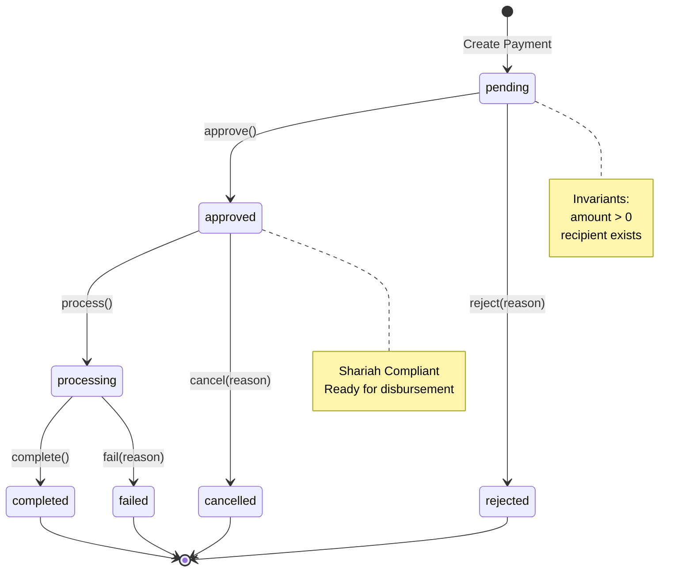

## Prerequisite Knowledge

**REQUIRED**: You MUST understand Elixir fundamentals from [AyoKoding Elixir Learning Path](../../../../../apps/ayokoding-web/content/en/learn/software-engineering/programming-languages/elixir/_index.md) before using these standards.

**This document is OSE Platform-specific**, not an Elixir tutorial. We define HOW to apply FSMs in THIS codebase, not WHAT FSMs are.

**See**: [Programming Language Documentation Separation Convention](../../../../../governance/conventions/structure/programming-language-docs-separation.md)

# Elixir Finite State Machine Standards for OSE Platform

**OSE-specific prescriptive standards** for implementing finite state machines in Elixir-based Shariah-compliant financial services. This document defines **mandatory requirements** using RFC 2119 keywords (MUST, SHOULD, MAY).

**Prerequisites**: Understanding of FSM fundamentals and Elixir patterns from AyoKoding.

**Quick Reference**: [Purpose](#purpose) | [FSM Pattern Selection](#fsm-pattern-selection-requirements) | [GenServer FSM](#genserver-fsm-requirements) | [gen_statem](#gen_statem-requirements) | [Functional FSM](#functional-fsm-requirements) | [State Transition](#state-transition-requirements) | [Supervision](#supervision-requirements) | [Testing](#testing-requirements) | [Validation Checklist](#validation-checklist)

## Purpose

Finite State Machines enforce deterministic state transitions in OSE Platform's Shariah-compliant financial workflows:

- **Zakat Payment Processing**: Enforce donation lifecycle (pending → verified → approved → distributed)
- **Murabaha Contract Management**: Control Islamic financing approval workflows
- **Waqf Lifecycle**: Manage endowment contracts through draft → review → active → archived
- **Compliance Workflows**: Ensure auditable, deterministic state tracking for regulatory requirements

**Critical Requirements**:

- All stateful business logic MUST use explicit FSM patterns (not implicit state tracking)
- FSMs MUST prevent invalid state transitions (compile-time or runtime enforcement)
- State changes MUST be atomic and logged for audit trails

## FSM Pattern Selection Requirements

**REQUIRED**: Use the following decision matrix to select FSM implementation pattern:

| **Requirement**         | **Pattern**    | **Use When**                                                  |
| ----------------------- | -------------- | ------------------------------------------------------------- |
| Process-isolated state  | GenServer FSM  | Payment processing, loan workflows, concurrent state machines |
| Complex state functions | gen_statem     | Multi-stage approval workflows, state-specific validation     |
| Pure functional state   | Functional FSM | Embedded FSMs, testable state logic, no concurrency needed    |
| Simple state tracking   | Functional FSM | Campaign status, document lifecycle without concurrent access |

**REQUIRED**: All FSM implementations MUST satisfy these properties:

- **Explicit states**: States MUST be atoms (`:pending`, `:approved`), not strings or integers
- **Deterministic transitions**: Same (state, event) → same next_state
- **Explicit errors**: Invalid transitions MUST return `{:error, reason}`, not crash
- **State invariants**: Preconditions MUST be validated before state entry
- **Audit trail**: State changes MUST log timestamp and transition metadata

## GenServer FSM Requirements

### When to Use GenServer FSM

**REQUIRED**: Use GenServer FSM for:

- Long-lived stateful processes (payment processors, contract managers)
- Process-isolated state requiring concurrency safety
- State machines needing supervision and automatic recovery
- FSMs with side effects (external API calls, database writes)

**PROHIBITED**: GenServer FSM for pure data transformations without side effects (use Functional FSM instead).

### GenServer FSM Implementation Requirements

**REQUIRED**: GenServer FSM implementations MUST:

- Store current state as atom in GenServer state map (`:status` key)
- Use pattern matching on state in `handle_call` for transition validation
- Return `{:reply, {:ok, new_state}, state}` or `{:reply, {:error, reason}, state}`
- Update `last_transition_at` timestamp on every state change
- Register processes with unique identifiers via Registry

```elixir
# PASS: GenServer FSM with explicit state handling
defmodule FinancialDomain.Payments.Processor do
  use GenServer

  # Client API - REQUIRED: Explicit state transition functions
  def approve(payment_id) do
    GenServer.call(via_tuple(payment_id), :approve)
  end

  def reject(payment_id, reason) do
    GenServer.call(via_tuple(payment_id), {:reject, reason})
  end

  # Server Callbacks - REQUIRED: Pattern match on current state
  @impl true
  def init({payment_id, amount, recipient_id}) do
    state = %{
      payment_id: payment_id,
      amount: amount,
      recipient_id: recipient_id,
      status: :pending,  # REQUIRED: Current state as atom
      failure_reason: nil,
      last_transition_at: DateTime.utc_now()
    }

    {:ok, state}
  end

  # REQUIRED: Only allow approve from :pending state
  @impl true
  def handle_call(:approve, _from, %{status: :pending} = state) do
    new_state = %{state |
      status: :approved,
      last_transition_at: DateTime.utc_now()
    }
    {:reply, {:ok, :approved}, new_state}
  end

  # REQUIRED: Reject invalid transitions explicitly
  def handle_call(:approve, _from, state) do
    {:reply, {:error, :invalid_transition}, state}
  end

  # REQUIRED: Use Registry for process lookup
  defp via_tuple(payment_id) do
    {:via, Registry, {FinancialDomain.Payments.Registry, payment_id}}
  end
end
```

**FAIL**: Implicit state transitions without validation:

```elixir
# FAIL: No pattern matching on state - accepts approve from any state
def handle_call(:approve, _from, state) do
  new_state = %{state | status: :approved}  # Dangerous!
  {:reply, :ok, new_state}
end

# FAIL: String-based states (not pattern-matchable)
def init({payment_id, amount, recipient_id}) do
  state = %{
    status: "pending"  # FAIL: Use atoms, not strings
  }
  {:ok, state}
end

# FAIL: No timestamp tracking
def handle_call(:approve, _from, %{status: :pending} = state) do
  new_state = %{state | status: :approved}  # Missing last_transition_at
  {:reply, {:ok, :approved}, new_state}
end
```

### GenServer FSM State Transition Diagram

**REQUIRED**: All GenServer FSMs MUST document state transitions in module documentation:



## gen_statem Requirements

### When to Use gen_statem

**REQUIRED**: Use gen_statem for:

- Complex state machines with 5+ states requiring separate handling logic
- State-specific event validation (different events valid in different states)
- FSMs requiring entry/exit actions per state
- State machines with state-specific timeouts

**PROHIBITED**: gen_statem for simple 2-3 state machines (use GenServer FSM instead).

### gen_statem Implementation Requirements

**REQUIRED**: gen_statem implementations MUST:

- Use `:state_functions` callback mode (not `:handle_event_function`)
- Define one function per state (function name = state atom)
- Return `{:next_state, new_state, data, actions}` or `{:keep_state_and_data, actions}`
- Use action lists for replies: `[{:reply, from, {:ok, result}}]`
- Document state transition rules in each state function

```elixir
# PASS: gen_statem FSM with state functions
defmodule FinancialDomain.Loans.Lifecycle do
  @behaviour :gen_statem

  # Client API
  def start_link(loan_id, customer_id, amount) do
    :gen_statem.start_link(
      {:via, Registry, {FinancialDomain.Loans.Registry, loan_id}},
      __MODULE__,
      {loan_id, customer_id, amount},
      []
    )
  end

  def submit(loan_id) do
    :gen_statem.call({:via, Registry, {FinancialDomain.Loans.Registry, loan_id}}, :submit)
  end

  def approve(loan_id) do
    :gen_statem.call({:via, Registry, {FinancialDomain.Loans.Registry, loan_id}}, :approve)
  end

  def reject(loan_id, reason) do
    :gen_statem.call({:via, Registry, {FinancialDomain.Loans.Registry, loan_id}}, {:reject, reason})
  end

  # Callbacks
  @impl true
  def callback_mode, do: :state_functions  # REQUIRED

  @impl true
  def init({loan_id, customer_id, amount}) do
    data = %{
      loan_id: loan_id,
      customer_id: customer_id,
      amount: amount,
      submitted_at: nil,
      approved_at: nil,
      rejection_reason: nil
    }

    {:ok, :draft, data}
  end

  # REQUIRED: One function per state
  def draft({:call, from}, :submit, data) do
    new_data = %{data | submitted_at: DateTime.utc_now()}
    {:next_state, :submitted, new_data, [{:reply, from, {:ok, :submitted}}]}
  end

  # REQUIRED: Reject invalid transitions explicitly
  def draft({:call, from}, _event, _data) do
    {:keep_state_and_data, [{:reply, from, {:error, :invalid_transition}}]}
  end

  def submitted({:call, from}, :approve, data) do
    new_data = %{data | approved_at: DateTime.utc_now()}
    {:next_state, :approved, new_data, [{:reply, from, {:ok, :approved}}]}
  end

  def submitted({:call, from}, {:reject, reason}, data) do
    new_data = %{data | rejection_reason: reason}
    {:next_state, :rejected, new_data, [{:reply, from, {:ok, :rejected}}]}
  end

  def submitted({:call, from}, _event, _data) do
    {:keep_state_and_data, [{:reply, from, {:error, :invalid_transition}}]}
  end

  # REQUIRED: Terminal states must reject all transitions
  def rejected({:call, from}, _event, _data) do
    {:keep_state_and_data, [{:reply, from, {:error, :terminal_state}}]}
  end
end
```

**FAIL**: Using `:handle_event_function` mode (harder to maintain):

```elixir
# FAIL: Single handle_event function instead of state functions
@impl true
def callback_mode, do: :handle_event_function

@impl true
def handle_event({:call, from}, :submit, :draft, data) do
  # Mixing all states in one function makes it harder to reason about
  {:next_state, :submitted, data, [{:reply, from, {:ok, :submitted}}]}
end

def handle_event({:call, from}, :approve, :submitted, data) do
  # State logic scattered across single function
  {:next_state, :approved, data, [{:reply, from, {:ok, :approved}}]}
end
```

## Functional FSM Requirements

### When to Use Functional FSM

**REQUIRED**: Use Functional FSM for:

- Pure state transformations without side effects
- Embedded FSMs within larger processes
- FSMs requiring extensive unit testing of state logic
- Lightweight state machines without process overhead

**PROHIBITED**: Functional FSM for concurrent state access (no process isolation).

### Functional FSM Implementation Requirements

**REQUIRED**: Functional FSM implementations MUST:

- Use structs for state representation
- Return `{:ok, new_state}` or `{:error, reason}` from transition functions
- Validate state invariants before transitions
- Use pattern matching for state-based transition validation
- Define `@type t()` typespec for state struct

```elixir
# PASS: Pure functional FSM
defmodule FinancialDomain.Payments.State do
  @moduledoc """
  Pure functional FSM for payment state transitions.

  ## States
  - `:pending` - Initial state, awaiting approval
  - `:approved` - Approved, ready for processing
  - `:processing` - Actively being processed
  - `:completed` - Successfully completed (terminal)
  - `:failed` - Failed processing (terminal)
  - `:rejected` - Rejected during approval (terminal)
  """

  defstruct [
    :payment_id,
    :amount,
    :recipient_id,
    :status,
    :failure_reason,
    :last_transition_at
  ]

  @type t :: %__MODULE__{
          payment_id: String.t(),
          amount: integer(),
          recipient_id: String.t(),
          status: atom(),
          failure_reason: String.t() | nil,
          last_transition_at: DateTime.t()
        }

  # REQUIRED: Constructor validates invariants
  @spec new(String.t(), integer(), String.t()) :: {:ok, t()} | {:error, atom()}
  def new(payment_id, amount, recipient_id) when amount > 0 do
    payment = %__MODULE__{
      payment_id: payment_id,
      amount: amount,
      recipient_id: recipient_id,
      status: :pending,
      failure_reason: nil,
      last_transition_at: DateTime.utc_now()
    }

    {:ok, payment}
  end

  def new(_payment_id, _amount, _recipient_id) do
    {:error, :invalid_amount}
  end

  # REQUIRED: Pattern match on current state
  @spec approve(t()) :: {:ok, t()} | {:error, atom()}
  def approve(%__MODULE__{status: :pending} = payment) do
    new_payment = %{payment |
      status: :approved,
      last_transition_at: DateTime.utc_now()
    }
    {:ok, new_payment}
  end

  def approve(_payment) do
    {:error, :invalid_transition}
  end

  @spec reject(t(), String.t()) :: {:ok, t()} | {:error, atom()}
  def reject(%__MODULE__{status: :pending} = payment, reason) do
    new_payment = %{
      payment
      | status: :rejected,
        failure_reason: reason,
        last_transition_at: DateTime.utc_now()
    }

    {:ok, new_payment}
  end

  def reject(_payment, _reason) do
    {:error, :invalid_transition}
  end

  # REQUIRED: Terminal state checker
  @spec terminal?(t()) :: boolean()
  def terminal?(%__MODULE__{status: status}) when status in [:completed, :failed, :rejected] do
    true
  end

  def terminal?(_payment), do: false
end
```

**FAIL**: Functional FSM without validation:

```elixir
# FAIL: No pattern matching on state - allows invalid transitions
def approve(payment) do
  %{payment | status: :approved}  # No validation!
end

# FAIL: No timestamp tracking
def approve(%__MODULE__{status: :pending} = payment) do
  {:ok, %{payment | status: :approved}}  # Missing last_transition_at
end

# FAIL: No terminal state enforcement
def complete(%__MODULE__{status: :completed} = payment) do
  {:ok, payment}  # Should return error - already terminal
end
```

## State Transition Requirements

### Transition Validation

**REQUIRED**: All state transitions MUST:

- Validate current state before transition (pattern matching)
- Check state invariants (guard conditions)
- Return explicit errors for invalid transitions
- Log transition events for audit trail
- Update transition timestamp

```elixir
# PASS: Comprehensive transition validation
defmodule FinancialDomain.Payments.Validator do
  def validate_transition(payment, event) do
    with :ok <- check_current_state(payment, event),
         :ok <- check_invariants(payment),
         :ok <- check_guards(payment, event) do
      {:ok, :valid}
    end
  end

  defp check_current_state(%{status: :pending}, :approve), do: :ok
  defp check_current_state(%{status: :pending}, :reject), do: :ok
  defp check_current_state(_, _), do: {:error, :invalid_transition}

  defp check_invariants(%{amount: amount}) when amount > 0, do: :ok
  defp check_invariants(_), do: {:error, :invalid_invariants}

  defp check_guards(%{amount: amount}, :approve) when amount <= 10_000_00 do
    :ok  # Small payments approved automatically
  end

  defp check_guards(%{amount: amount}, :approve) when amount > 10_000_00 do
    {:error, :requires_manual_approval}
  end

  defp check_guards(_, _), do: :ok
end
```

### Entry and Exit Actions

**REQUIRED**: State entry/exit actions MUST be explicit functions:

```elixir
# PASS: Explicit entry/exit actions
defmodule FinancialDomain.Payments.Processor do
  use GenServer

  @impl true
  def handle_call(:process, _from, %{status: :approved} = state) do
    # Entry action for :processing state
    new_state = %{state | status: :processing, last_transition_at: DateTime.utc_now()}
    new_state = enter_processing_state(new_state)

    {:reply, {:ok, :processing}, new_state}
  end

  @impl true
  def handle_call(:complete, _from, %{status: :processing} = state) do
    # Exit action for :processing state
    state = exit_processing_state(state)

    # Enter :completed state
    new_state = %{state | status: :completed, last_transition_at: DateTime.utc_now()}

    {:reply, {:ok, :completed}, new_state}
  end

  defp enter_processing_state(state) do
    # Start background job
    Task.start(fn -> send_to_gateway(state) end)

    # Log event
    Logger.info("Payment entered processing", payment_id: state.payment_id)

    state
  end

  defp exit_processing_state(state) do
    # Cancel background job
    cancel_gateway_request(state)

    # Log event
    Logger.info("Payment exited processing", payment_id: state.payment_id)

    state
  end
end
```

## Supervision Requirements

### FSM Supervision

**REQUIRED**: All GenServer and gen_statem FSMs MUST be supervised.

**REQUIRED**: FSM supervisors MUST:

- Use `:one_for_one` strategy (default for independent FSMs)
- Configure maximum restart frequency (3 restarts in 5 seconds)
- Specify explicit restart policy (`:permanent`, `:transient`, `:temporary`)
- Use DynamicSupervisor for dynamically created FSM instances

```elixir
# PASS: FSM supervision with proper configuration
defmodule FinancialDomain.Payments.Supervisor do
  use Supervisor

  def start_link(_opts) do
    Supervisor.start_link(__MODULE__, :ok, name: __MODULE__)
  end

  @impl true
  def init(:ok) do
    children = [
      # Registry for payment FSMs
      {Registry, keys: :unique, name: FinancialDomain.Payments.Registry},

      # Dynamic supervisor for payment FSM instances
      {DynamicSupervisor,
       name: FinancialDomain.Payments.DynamicSupervisor,
       strategy: :one_for_one,
       max_restarts: 3,
       max_seconds: 5}
    ]

    Supervisor.init(children, strategy: :one_for_one)
  end
end

# Helper to start supervised payment FSM
defmodule FinancialDomain.Payments.Manager do
  def start_payment(payment_id, amount, recipient_id) do
    spec = {FinancialDomain.Payments.Processor, {payment_id, amount, recipient_id}}
    DynamicSupervisor.start_child(FinancialDomain.Payments.DynamicSupervisor, spec)
  end
end
```

**FAIL**: Unsupervised FSM processes:

```elixir
# FAIL: Starting FSM without supervision
def create_payment(payment_id, amount, recipient_id) do
  FinancialDomain.Payments.Processor.start_link({payment_id, amount, recipient_id})
  # No supervisor - if process crashes, it's gone forever
end
```

## Testing Requirements

### FSM Testing Requirements

**REQUIRED**: FSM implementations MUST have test coverage for:

- All valid state transitions (happy path)
- All invalid state transitions (error cases)
- State invariant validation
- Entry/exit action execution
- Terminal state enforcement

### Functional FSM Testing

**REQUIRED**: Functional FSM tests MUST verify pure state transformations:

```elixir
# PASS: Comprehensive functional FSM testing
defmodule FinancialDomain.Payments.StateTest do
  use ExUnit.Case, async: true

  alias FinancialDomain.Payments.State

  describe "new/3" do
    test "creates payment in pending state" do
      {:ok, payment} = State.new("PAY-001", 100_00, "REC-001")

      assert payment.status == :pending
      assert payment.amount == 100_00
      assert payment.recipient_id == "REC-001"
    end

    test "rejects negative amounts" do
      assert {:error, :invalid_amount} = State.new("PAY-001", -100, "REC-001")
    end
  end

  describe "approve/1" do
    test "transitions pending to approved" do
      {:ok, payment} = State.new("PAY-001", 100_00, "REC-001")
      {:ok, payment} = State.approve(payment)

      assert payment.status == :approved
    end

    test "rejects approval from non-pending state" do
      {:ok, payment} = State.new("PAY-001", 100_00, "REC-001")
      {:ok, payment} = State.approve(payment)

      assert {:error, :invalid_transition} = State.approve(payment)
    end
  end

  describe "complete workflow" do
    test "executes full payment lifecycle" do
      {:ok, payment} = State.new("PAY-001", 100_00, "REC-001")

      {:ok, payment} = State.approve(payment)
      assert payment.status == :approved

      {:ok, payment} = State.process(payment)
      assert payment.status == :processing

      {:ok, payment} = State.complete(payment)
      assert payment.status == :completed
      assert State.terminal?(payment)
    end
  end
end
```

### GenServer FSM Testing

**REQUIRED**: GenServer FSM tests MUST verify process-based behavior:

```elixir
# PASS: GenServer FSM testing with process isolation
defmodule FinancialDomain.Payments.ProcessorTest do
  use ExUnit.Case

  alias FinancialDomain.Payments.Processor

  setup do
    # Start Registry for test isolation
    start_supervised!({Registry, keys: :unique, name: FinancialDomain.Payments.Registry})
    :ok
  end

  describe "state transitions" do
    test "approve transitions from pending to approved" do
      payment_id = "PAY-#{:rand.uniform(1000)}"
      {:ok, _pid} = Processor.start_link({payment_id, 100_00, "REC-001"})

      assert {:ok, :approved} = Processor.approve(payment_id)

      state = Processor.get_state(payment_id)
      assert state.status == :approved
    end

    test "rejects invalid transition" do
      payment_id = "PAY-#{:rand.uniform(1000)}"
      {:ok, _pid} = Processor.start_link({payment_id, 100_00, "REC-001"})

      {:ok, :approved} = Processor.approve(payment_id)

      # Cannot approve twice
      assert {:error, :invalid_transition} = Processor.approve(payment_id)
    end
  end
end
```

## Validation Checklist

**REQUIRED**: Before deploying FSM to production, verify:

- [ ] FSM pattern selection justified (GenServer/gen_statem/Functional)
- [ ] All states defined as atoms (not strings)
- [ ] Pattern matching validates current state before transitions
- [ ] Invalid transitions return `{:error, reason}`
- [ ] State invariants checked before entry
- [ ] Transition timestamps recorded (`last_transition_at`)
- [ ] Process registered via Registry (GenServer/gen_statem only)
- [ ] FSM supervised with appropriate restart strategy
- [ ] State transition diagram documented in module `@moduledoc`
- [ ] Tests cover all valid transitions
- [ ] Tests cover all invalid transitions
- [ ] Terminal states reject further transitions

## Related Documentation

**Elixir-Specific**:

- [OTP GenServer Standards](./ex-soen-prla-el__otp-genserver.md) - GenServer implementation requirements
- [OTP Supervisor Standards](./ex-soen-prla-el__otp-supervisor.md) - Supervision strategy requirements
- [Error Handling Standards](./ex-soen-prla-el__error-handling-standards.md) - Tagged tuple requirements
- [Concurrency Standards](./ex-soen-prla-el__concurrency-standards.md) - Process isolation requirements

**Principles**:

- [Immutability Over Mutability](../../../../../governance/principles/software-engineering/immutability.md)
- [Explicit Over Implicit](../../../../../governance/principles/software-engineering/explicit-over-implicit.md)

## References

**Authoritative Sources**:

1. **Elixir Documentation**: <https://hexdocs.pm/elixir/> (2025)
2. **OTP Design Principles**: <https://www.erlang.org/doc/design_principles/des_princ.html> (2024)
3. **gen_statem Behavior**: <https://www.erlang.org/doc/man/gen_statem.html> (2024)

**Islamic Finance Context**:

1. **AAOIFI Standards**: Accounting and Auditing Organization for Islamic Financial Institutions (2023)
2. **Qard Hasan Guidelines**: Islamic Development Bank (2022)

---

**Last Updated**: 2026-02-05
**Elixir Version**: 1.12+ (baseline), 1.17+ (recommended), 1.19.5 (latest)
**Maintainers**: Platform Documentation Team
