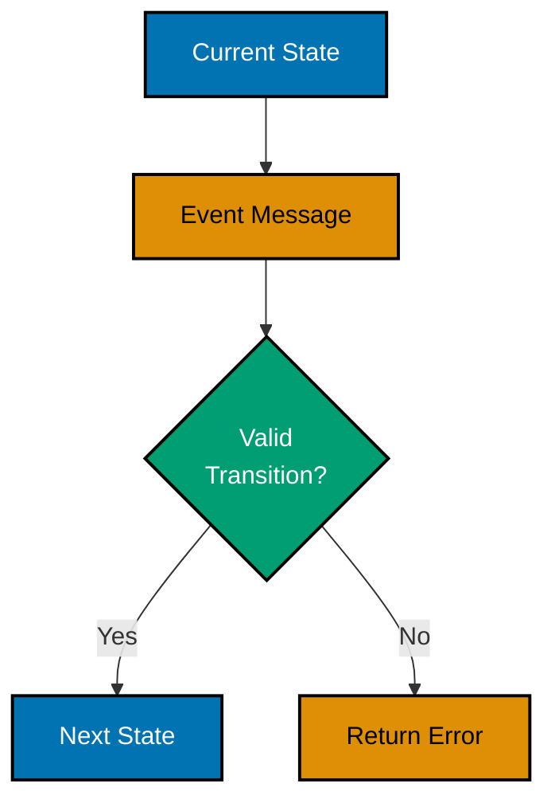
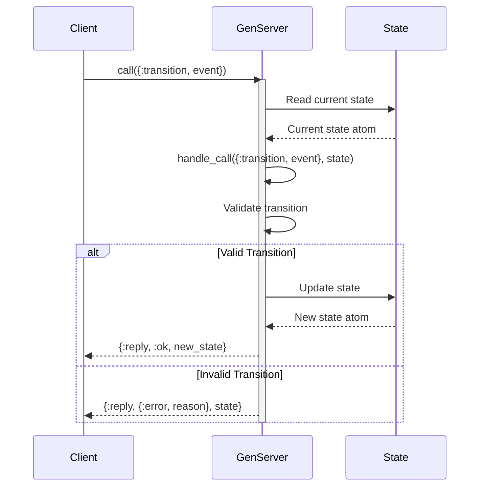
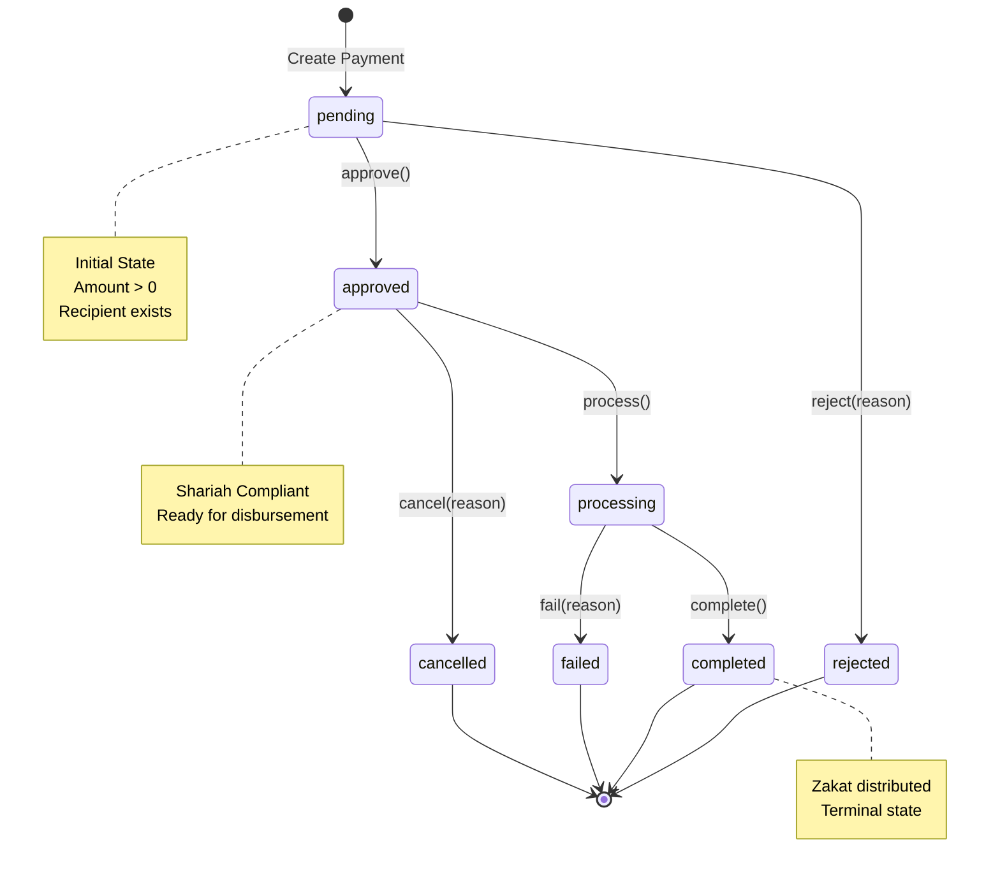
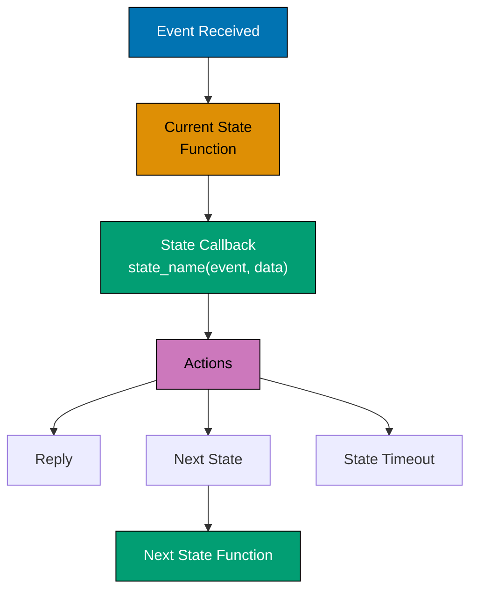
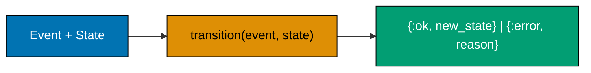
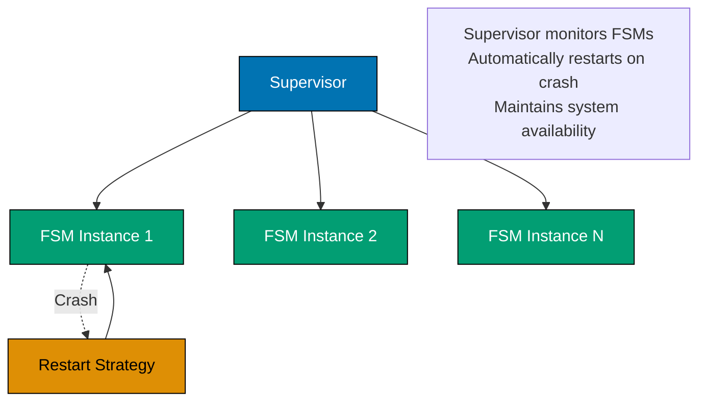
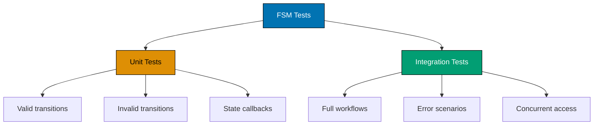
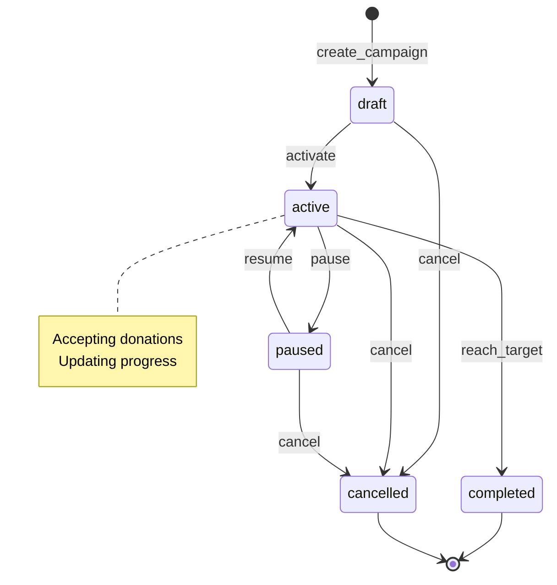

title: "Elixir Finite State Machines"
description: State machine patterns using GenServer, gen_statem, and functional approaches for managing state transitions in Elixir 1.12-1.19 with OTP supervision
category: explanation
subcategory: prog-lang
tags:

- elixir
- finite-state-machine
- fsm
- genserver
- gen_statem
- otp
- supervision
- pattern-matching
- elixir-1.12
- elixir-1.17
- elixir-1.19
  principles:
- explicit-over-implicit
- immutability

---

# Elixir Finite State Machines

**Quick Reference**: [Overview](#overview) | [FSM Fundamentals](#fsm-fundamentals) | [GenServer FSM Pattern](#genserver-fsm-pattern) | [gen_statem Pattern](#gen_statem-pattern) | [Functional FSM Pattern](#functional-fsm-pattern) | [Supervision and Fault Tolerance](#supervision-and-fault-tolerance) | [Testing State Machines](#testing-state-machines) | [Business Domain Examples](#business-domain-examples) | [Patterns and Anti-Patterns](#patterns-and-anti-patterns) | [Checklist: FSM Implementation](#checklist-fsm-implementation) | [Related Documentation](#related-documentation) | [Sources and Further Reading](#sources-and-further-reading)

## Overview

Finite State Machines (FSMs) are fundamental design patterns for managing complex state transitions in enterprise software. In Elixir, FSMs leverage the language's unique strengths - immutable data structures, pattern matching, OTP behaviors (GenServer, gen_statem), and supervision trees - to build robust, fault-tolerant state management systems for financial and business-critical applications.

### Why FSMs Matter in Finance

Financial applications involve complex workflows with strict state transition rules:

- **Zakat Payment Processing**: Donation transactions move through well-defined states (pending → verification → approved → distributed)
- **Murabaha Loan Lifecycle**: Islamic financing contracts follow specific approval and disbursement workflows
- **Waqf Contract Management**: Endowment contracts transition through draft → review → active → archived states
- **Compliance Workflows**: Shariah compliance checks require deterministic, auditable state tracking

### Key Benefits

1. **Deterministic Behavior**: Predictable state transitions prevent invalid states
2. **Pattern Matching**: Elixir's pattern matching provides compile-time-like guarantees
3. **Explicit Error Handling**: Every transition returns `{:ok, state}` or `{:error, reason}`
4. **Fault Tolerance**: OTP supervision ensures FSMs recover from crashes
5. **Concurrency**: Process-based isolation prevents race conditions
6. **Testability**: State transitions are isolated and easy to unit test
7. **Audit Trail**: Every state change is explicitly modeled and trackable

### Elixir's Unique Strengths for FSMs

**Compared to other languages:**

| Feature              | Java/TypeScript Approach | Elixir Solution                      |
| -------------------- | ------------------------ | ------------------------------------ |
| State representation | Enum types               | Atoms + pattern matching             |
| Concurrency safety   | Mutex/locks              | Process isolation (Actor model)      |
| Fault tolerance      | Try-catch                | Supervision trees + "let it crash"   |
| State transitions    | Method calls             | Message passing + pattern matching   |
| Side effects         | Mixed with logic         | Separate processes + functional core |

**Elixir's unique strengths:**

- **OTP behaviors**: GenServer and gen_statem provide battle-tested FSM foundations
- **Process isolation**: Each FSM instance runs in isolated process (no shared state)
- **Supervision trees**: Automatic recovery from crashes
- **Pattern matching**: Exhaustive state handling at compile time
- **Immutability**: State changes create new state, preventing bugs
- **Hot code swapping**: Update FSM logic without downtime

### Target Audience

This guide targets Elixir developers building enterprise financial systems. It assumes familiarity with Elixir 1.12+ features, OTP basics, and focuses on practical FSM implementation patterns using modern Elixir idioms.

## Quick Reference

**Jump to:**

- [FSM Fundamentals](#fsm-fundamentals) - Core concepts and terminology
- [GenServer FSM Pattern](#genserver-fsm-pattern) - Standard OTP approach
- [gen_statem Pattern](#gen_statem-pattern) - Advanced state machine behavior
- [Functional FSM Pattern](#functional-fsm-pattern) - Pure functional approach
- [Supervision and Fault Tolerance](#supervision-and-fault-tolerance) - OTP supervision
- [Testing Strategies](#testing-state-machines) - Comprehensive testing approaches
- [Business Examples](#business-domain-examples) - Payment, Loan, Waqf implementations

**Related Documentation:**

- [OTP GenServer](./ex-soen-prla-el__otp-genserver.md) - GenServer patterns
- [OTP Supervisor](./ex-soen-prla-el__otp-supervisor.md) - Supervision strategies
- [Pattern Matching](./ex-soen-prla-el__idioms.md) - Pattern matching idioms
- [Best Practices](./ex-soen-prla-el__best-practices.md) - Code quality standards

FSM patterns align with [software engineering principles](../../../../../governance/principles/software-engineering/README.md):

- **Immutable state** embodies [Immutability Over Mutability](../../../../../governance/principles/software-engineering/immutability.md)
- **Explicit transitions** implement [Explicit Over Implicit](../../../../../governance/principles/software-engineering/explicit-over-implicit.md)
- **Pure functions** align with [Pure Functions](../../../../../governance/principles/software-engineering/pure-functions.md)

## FSM Fundamentals

### Core Components

A finite state machine consists of:

1. **States**: Discrete conditions the system can be in
2. **Events**: Messages that trigger state transitions
3. **Transitions**: Rules defining valid state changes
4. **Initial State**: Starting point
5. **Final States**: Terminal states (optional)
6. **Guards**: Preconditions that must be true for transitions
7. **Actions**: Side effects during transitions (entry/exit actions)

### State Machine Properties

**Deterministic FSM**: Given current state and input, next state is always the same

- **Use case**: Payment processing (consistent behavior required)
- **Example**: `:pending` + `{:approve}` → `:approved` (always)

**Non-Deterministic FSM**: Multiple possible next states for same input

- **Use case**: Manual review workflows (human decision involved)
- **Example**: `:under_review` + `{:review}` → `:approved` or `:rejected` (depends on reviewer)

### State Transition Diagram



### State Invariants

**Invariants** are conditions that must always be true in a given state:

- **:pending payment**: Amount > 0, recipient exists
- **:approved loan**: All documents uploaded, risk score within limits
- **:active contract**: Start date ≤ today ≤ end date

FSMs enforce invariants through:

1. **Entry guards**: Validate invariants when entering state
2. **Guard clauses**: Check preconditions before transition
3. **Exit actions**: Clean up resources when leaving state

## GenServer FSM Pattern

### GenServer FSM State Management



### Overview

GenServer is the standard OTP behavior for implementing state machines in Elixir. It provides a process-based FSM where each instance runs in an isolated process with its own state.

### Characteristics

- **Process-based**: Each FSM runs in its own process
- **Message-driven**: State transitions via `handle_call` and `handle_cast`
- **Fault-tolerant**: Can be supervised and restarted
- **Standard OTP**: Well-understood by Elixir developers

### Example: Payment Processing FSM

#### Payment State Transition Diagram



**Implementation**:

```elixir
defmodule Payment do
  @moduledoc """
  Payment FSM using GenServer for Zakat donations.
  """
  use GenServer

  # Client API

  @doc "Start a new payment process"
  def start_link(payment_id, amount, recipient_id) do
    GenServer.start_link(__MODULE__, {payment_id, amount, recipient_id}, name: via_tuple(payment_id))
  end

  @doc "Approve pending payment"
  def approve(payment_id) do
    GenServer.call(via_tuple(payment_id), :approve)
  end

  @doc "Reject pending payment"
  def reject(payment_id, reason) do
    GenServer.call(via_tuple(payment_id), {:reject, reason})
  end

  @doc "Process approved payment"
  def process(payment_id) do
    GenServer.call(via_tuple(payment_id), :process)
  end

  @doc "Complete processing payment"
  def complete(payment_id) do
    GenServer.call(via_tuple(payment_id), :complete)
  end

  @doc "Fail processing payment"
  def fail(payment_id, reason) do
    GenServer.call(via_tuple(payment_id), {:fail, reason})
  end

  @doc "Cancel approved payment"
  def cancel(payment_id, reason) do
    GenServer.call(via_tuple(payment_id), {:cancel, reason})
  end

  @doc "Get current state"
  def get_state(payment_id) do
    GenServer.call(via_tuple(payment_id), :get_state)
  end

  # Server Callbacks

  @impl true
  def init({payment_id, amount, recipient_id}) do
    state = %{
      payment_id: payment_id,
      amount: amount,
      recipient_id: recipient_id,
      status: :pending,
      failure_reason: nil,
      last_transition_at: DateTime.utc_now()
    }

    {:ok, state}
  end

  @impl true
  def handle_call(:approve, _from, %{status: :pending} = state) do
    new_state = %{state | status: :approved, last_transition_at: DateTime.utc_now()}
    {:reply, {:ok, :approved}, new_state}
  end

  def handle_call(:approve, _from, state) do
    {:reply, {:error, "Can only approve pending payments"}, state}
  end

  @impl true
  def handle_call({:reject, reason}, _from, %{status: :pending} = state) do
    new_state = %{
      state
      | status: :rejected,
        failure_reason: reason,
        last_transition_at: DateTime.utc_now()
    }

    {:reply, {:ok, :rejected}, new_state}
  end

  def handle_call({:reject, _reason}, _from, state) do
    {:reply, {:error, "Can only reject pending payments"}, state}
  end

  @impl true
  def handle_call(:process, _from, %{status: :approved} = state) do
    new_state = %{state | status: :processing, last_transition_at: DateTime.utc_now()}
    {:reply, {:ok, :processing}, new_state}
  end

  def handle_call(:process, _from, state) do
    {:reply, {:error, "Can only process approved payments"}, state}
  end

  @impl true
  def handle_call(:complete, _from, %{status: :processing} = state) do
    new_state = %{state | status: :completed, last_transition_at: DateTime.utc_now()}
    {:reply, {:ok, :completed}, new_state}
  end

  def handle_call(:complete, _from, state) do
    {:reply, {:error, "Can only complete processing payments"}, state}
  end

  @impl true
  def handle_call({:fail, reason}, _from, %{status: :processing} = state) do
    new_state = %{
      state
      | status: :failed,
        failure_reason: reason,
        last_transition_at: DateTime.utc_now()
    }

    {:reply, {:ok, :failed}, new_state}
  end

  def handle_call({:fail, _reason}, _from, state) do
    {:reply, {:error, "Can only fail processing payments"}, state}
  end

  @impl true
  def handle_call({:cancel, reason}, _from, %{status: :approved} = state) do
    new_state = %{
      state
      | status: :cancelled,
        failure_reason: reason,
        last_transition_at: DateTime.utc_now()
    }

    {:reply, {:ok, :cancelled}, new_state}
  end

  def handle_call({:cancel, _reason}, _from, state) do
    {:reply, {:error, "Can only cancel approved payments"}, state}
  end

  @impl true
  def handle_call(:get_state, _from, state) do
    {:reply, state, state}
  end

  # Private Functions

  defp via_tuple(payment_id) do
    {:via, Registry, {Payment.Registry, payment_id}}
  end
end
```

### Usage

```elixir
# Start payment process
{:ok, _pid} = Payment.start_link("PAY-001", 100_00, "REC-001")

# Approve payment
{:ok, :approved} = Payment.approve("PAY-001")

# Process payment
{:ok, :processing} = Payment.process("PAY-001")

# Complete payment
{:ok, :completed} = Payment.complete("PAY-001")

# Get current state
state = Payment.get_state("PAY-001")
```

### Advantages

- ✅ **Process isolation**: No shared state, no race conditions
- ✅ **OTP integration**: Works with supervision trees
- ✅ **Clear API**: Synchronous calls for state changes
- ✅ **Fault tolerance**: Can crash and restart cleanly
- ✅ **Familiar pattern**: Standard Elixir/OTP approach

### Limitations

- ❌ **Boilerplate**: Requires GenServer callbacks
- ❌ **Process overhead**: Each FSM instance is a process
- ❌ **No compile-time exhaustiveness**: Pattern matching not enforced

## gen_statem Pattern

### gen_statem State Function Callbacks



### Overview

`:gen_statem` is OTP's dedicated state machine behavior, providing more structured FSM support than GenServer. It explicitly models states and transitions.

### Characteristics

- **State functions**: Each state is a separate function
- **Event-driven**: Clear separation of events and states
- **Transition actions**: Built-in support for entry/exit actions
- **Type-safe states**: States are function names (atoms)

### Example: Loan Lifecycle FSM

**Qard Hasan** is an Islamic interest-free loan. The lifecycle has complex state-specific validation rules.

```elixir
defmodule Loan do
  @moduledoc """
  Qard Hasan (interest-free loan) FSM using gen_statem.
  """
  @behaviour :gen_statem

  # Client API

  def start_link(loan_id, customer_id, amount) do
    :gen_statem.start_link({:via, Registry, {Loan.Registry, loan_id}}, __MODULE__, {loan_id, customer_id, amount}, [])
  end

  def submit(loan_id) do
    :gen_statem.call({:via, Registry, {Loan.Registry, loan_id}}, :submit)
  end

  def approve(loan_id) do
    :gen_statem.call({:via, Registry, {Loan.Registry, loan_id}}, :approve)
  end

  def reject(loan_id, reason) do
    :gen_statem.call({:via, Registry, {Loan.Registry, loan_id}}, {:reject, reason})
  end

  def disburse(loan_id) do
    :gen_statem.call({:via, Registry, {Loan.Registry, loan_id}}, :disburse)
  end

  def close(loan_id) do
    :gen_statem.call({:via, Registry, {Loan.Registry, loan_id}}, :close)
  end

  def default(loan_id, reason) do
    :gen_statem.call({:via, Registry, {Loan.Registry, loan_id}}, {:default, reason})
  end

  # gen_statem Callbacks

  @impl true
  def callback_mode, do: :state_functions

  @impl true
  def init({loan_id, customer_id, amount}) do
    data = %{
      loan_id: loan_id,
      customer_id: customer_id,
      amount: amount,
      submitted_at: nil,
      approved_at: nil,
      disbursed_at: nil,
      rejection_reason: nil,
      default_reason: nil
    }

    {:ok, :draft, data}
  end

  # State Functions

  def draft({:call, from}, :submit, data) do
    new_data = %{data | submitted_at: DateTime.utc_now()}
    {:next_state, :submitted, new_data, [{:reply, from, {:ok, :submitted}}]}
  end

  def draft({:call, from}, _event, _data) do
    {:keep_state_and_data, [{:reply, from, {:error, "Invalid transition from draft"}}]}
  end

  def submitted({:call, from}, :approve, data) do
    new_data = %{data | approved_at: DateTime.utc_now()}
    {:next_state, :approved, new_data, [{:reply, from, {:ok, :approved}}]}
  end

  def submitted({:call, from}, {:reject, reason}, data) do
    new_data = %{data | rejection_reason: reason}
    {:next_state, :rejected, new_data, [{:reply, from, {:ok, :rejected}}]}
  end

  def submitted({:call, from}, _event, _data) do
    {:keep_state_and_data, [{:reply, from, {:error, "Invalid transition from submitted"}}]}
  end

  def approved({:call, from}, :disburse, data) do
    new_data = %{data | disbursed_at: DateTime.utc_now()}
    {:next_state, :active, new_data, [{:reply, from, {:ok, :active}}]}
  end

  def approved({:call, from}, _event, _data) do
    {:keep_state_and_data, [{:reply, from, {:error, "Invalid transition from approved"}}]}
  end

  def active({:call, from}, :close, data) do
    {:next_state, :closed, data, [{:reply, from, {:ok, :closed}}]}
  end

  def active({:call, from}, {:default, reason}, data) do
    new_data = %{data | default_reason: reason}
    {:next_state, :defaulted, new_data, [{:reply, from, {:ok, :defaulted}}]}
  end

  def active({:call, from}, _event, _data) do
    {:keep_state_and_data, [{:reply, from, {:error, "Invalid transition from active"}}]}
  end

  def rejected({:call, from}, _event, _data) do
    {:keep_state_and_data, [{:reply, from, {:error, "Terminal state: rejected"}}]}
  end

  def closed({:call, from}, _event, _data) do
    {:keep_state_and_data, [{:reply, from, {:error, "Terminal state: closed"}}]}
  end

  def defaulted({:call, from}, _event, _data) do
    {:keep_state_and_data, [{:reply, from, {:error, "Terminal state: defaulted"}}]}
  end
end
```

### Advantages

- ✅ **State functions**: Each state isolated in own function
- ✅ **Clear structure**: Explicit state machine design
- ✅ **Built-in actions**: Entry/exit actions, timeouts
- ✅ **OTP standard**: Battle-tested behavior

### Limitations

- ❌ **Less familiar**: Not as commonly used as GenServer
- ❌ **Erlang API**: Uses Erlang-style tuples
- ❌ **More complex**: Steeper learning curve

## Functional FSM Pattern

### Functional FSM Data Flow



### Overview

Pure functional FSMs use immutable data structures and pattern matching without processes. Useful for embedded FSMs or testing.

### Example: Pure Functional Payment FSM

```elixir
defmodule FunctionalPayment do
  @moduledoc """
  Pure functional FSM for payments (no processes).
  """

  defstruct [:payment_id, :amount, :recipient_id, :status, :failure_reason, :last_transition_at]

  @type t :: %__MODULE__{
          payment_id: String.t(),
          amount: integer(),
          recipient_id: String.t(),
          status: atom(),
          failure_reason: String.t() | nil,
          last_transition_at: DateTime.t()
        }

  @doc "Create new payment in pending state"
  @spec new(String.t(), integer(), String.t()) :: {:ok, t()} | {:error, String.t()}
  def new(payment_id, amount, recipient_id) when amount > 0 do
    payment = %__MODULE__{
      payment_id: payment_id,
      amount: amount,
      recipient_id: recipient_id,
      status: :pending,
      failure_reason: nil,
      last_transition_at: DateTime.utc_now()
    }

    {:ok, payment}
  end

  def new(_payment_id, _amount, _recipient_id) do
    {:error, "Amount must be positive"}
  end

  @doc "Approve payment"
  @spec approve(t()) :: {:ok, t()} | {:error, String.t()}
  def approve(%__MODULE__{status: :pending} = payment) do
    new_payment = %{payment | status: :approved, last_transition_at: DateTime.utc_now()}
    {:ok, new_payment}
  end

  def approve(_payment) do
    {:error, "Can only approve pending payments"}
  end

  @doc "Reject payment"
  @spec reject(t(), String.t()) :: {:ok, t()} | {:error, String.t()}
  def reject(%__MODULE__{status: :pending} = payment, reason) do
    new_payment = %{
      payment
      | status: :rejected,
        failure_reason: reason,
        last_transition_at: DateTime.utc_now()
    }

    {:ok, new_payment}
  end

  def reject(_payment, _reason) do
    {:error, "Can only reject pending payments"}
  end

  @doc "Process payment"
  @spec process(t()) :: {:ok, t()} | {:error, String.t()}
  def process(%__MODULE__{status: :approved} = payment) do
    new_payment = %{payment | status: :processing, last_transition_at: DateTime.utc_now()}
    {:ok, new_payment}
  end

  def process(_payment) do
    {:error, "Can only process approved payments"}
  end

  @doc "Complete payment"
  @spec complete(t()) :: {:ok, t()} | {:error, String.t()}
  def complete(%__MODULE__{status: :processing} = payment) do
    new_payment = %{payment | status: :completed, last_transition_at: DateTime.utc_now()}
    {:ok, new_payment}
  end

  def complete(_payment) do
    {:error, "Can only complete processing payments"}
  end

  @doc "Fail payment"
  @spec fail(t(), String.t()) :: {:ok, t()} | {:error, String.t()}
  def fail(%__MODULE__{status: :processing} = payment, reason) do
    new_payment = %{
      payment
      | status: :failed,
        failure_reason: reason,
        last_transition_at: DateTime.utc_now()
    }

    {:ok, new_payment}
  end

  def fail(_payment, _reason) do
    {:error, "Can only fail processing payments"}
  end

  @doc "Check if state is terminal"
  @spec terminal?(t()) :: boolean()
  def terminal?(%__MODULE__{status: status}) when status in [:completed, :failed, :rejected, :cancelled] do
    true
  end

  def terminal?(_payment), do: false
end
```

### Usage

```elixir
# Create payment
{:ok, payment} = FunctionalPayment.new("PAY-001", 100_00, "REC-001")

# Chain transitions
{:ok, payment} = FunctionalPayment.approve(payment)
{:ok, payment} = FunctionalPayment.process(payment)
{:ok, payment} = FunctionalPayment.complete(payment)

# Check terminal state
true = FunctionalPayment.terminal?(payment)
```

### Advantages

- ✅ **Pure functions**: Easy to test, no side effects
- ✅ **Immutable**: State changes create new state
- ✅ **Composable**: Chain transitions with `with` or pipes
- ✅ **No processes**: Lightweight for embedded use

### Limitations

- ❌ **No concurrency**: Caller manages concurrency
- ❌ **No supervision**: No automatic recovery
- ❌ **Manual persistence**: Must handle storage separately

## Supervision and Fault Tolerance

### FSM Supervision Tree



### Supervising FSMs

```elixir
defmodule Payment.Supervisor do
  use Supervisor

  def start_link(_opts) do
    Supervisor.start_link(__MODULE__, :ok, name: __MODULE__)
  end

  @impl true
  def init(:ok) do
    children = [
      {Registry, keys: :unique, name: Payment.Registry}
    ]

    Supervisor.init(children, strategy: :one_for_one)
  end
end
```

### Dynamic Supervision

```elixir
defmodule Payment.DynamicSupervisor do
  use DynamicSupervisor

  def start_link(_opts) do
    DynamicSupervisor.start_link(__MODULE__, :ok, name: __MODULE__)
  end

  def start_payment(payment_id, amount, recipient_id) do
    spec = {Payment, {payment_id, amount, recipient_id}}
    DynamicSupervisor.start_child(__MODULE__, spec)
  end

  @impl true
  def init(:ok) do
    DynamicSupervisor.init(strategy: :one_for_one)
  end
end
```

## Testing State Machines

### FSM Testing Strategy



### Unit Testing Transitions

```elixir
defmodule FunctionalPaymentTest do
  use ExUnit.Case

  describe "payment state transitions" do
    test "pending to approved transition" do
      {:ok, payment} = FunctionalPayment.new("PAY-001", 100_00, "REC-001")
      assert payment.status == :pending

      {:ok, payment} = FunctionalPayment.approve(payment)
      assert payment.status == :approved
    end

    test "cannot approve non-pending payment" do
      {:ok, payment} = FunctionalPayment.new("PAY-001", 100_00, "REC-001")
      {:ok, payment} = FunctionalPayment.approve(payment)

      {:error, reason} = FunctionalPayment.approve(payment)
      assert reason == "Can only approve pending payments"
    end

    test "complete workflow" do
      {:ok, payment} = FunctionalPayment.new("PAY-001", 100_00, "REC-001")

      {:ok, payment} = FunctionalPayment.approve(payment)
      assert payment.status == :approved

      {:ok, payment} = FunctionalPayment.process(payment)
      assert payment.status == :processing

      {:ok, payment} = FunctionalPayment.complete(payment)
      assert payment.status == :completed
      assert FunctionalPayment.terminal?(payment)
    end
  end
end
```

## Business Domain Examples

### Donation Campaign Lifecycle



### Zakat Payment Processing

```elixir
defmodule ZakatPayment do
  use GenServer

  # States: :initiated, :verifying, :verified, :approved, :distributing, :distributed, :rejected

  def start_link(payment_id, donor_id, amount) do
    GenServer.start_link(__MODULE__, {payment_id, donor_id, amount}, name: via_tuple(payment_id))
  end

  def start_verification(payment_id) do
    GenServer.call(via_tuple(payment_id), :start_verification)
  end

  def complete_verification(payment_id, verifier_id) do
    GenServer.call(via_tuple(payment_id), {:complete_verification, verifier_id})
  end

  def approve(payment_id, approver_id) do
    GenServer.call(via_tuple(payment_id), {:approve, approver_id})
  end

  def start_distribution(payment_id) do
    GenServer.call(via_tuple(payment_id), :start_distribution)
  end

  def complete_distribution(payment_id, beneficiary_ids) do
    GenServer.call(via_tuple(payment_id), {:complete_distribution, beneficiary_ids})
  end

  def reject(payment_id, reason) do
    GenServer.call(via_tuple(payment_id), {:reject, reason})
  end

  # Server Implementation

  @impl true
  def init({payment_id, donor_id, amount}) do
    state = %{
      payment_id: payment_id,
      donor_id: donor_id,
      amount: amount,
      status: :initiated,
      verified_by: nil,
      approved_by: nil,
      distributed_to: [],
      verification_date: nil,
      approval_date: nil,
      distribution_date: nil,
      rejection_reason: nil
    }

    {:ok, state}
  end

  @impl true
  def handle_call(:start_verification, _from, %{status: :initiated} = state) do
    new_state = %{state | status: :verifying}
    {:reply, {:ok, :verifying}, new_state}
  end

  def handle_call(:start_verification, _from, state) do
    {:reply, {:error, "Can only verify initiated payments"}, state}
  end

  @impl true
  def handle_call({:complete_verification, verifier_id}, _from, %{status: :verifying} = state) do
    new_state = %{
      state
      | status: :verified,
        verified_by: verifier_id,
        verification_date: DateTime.utc_now()
    }

    {:reply, {:ok, :verified}, new_state}
  end

  def handle_call({:complete_verification, _verifier_id}, _from, state) do
    {:reply, {:error, "Payment not in verification"}, state}
  end

  @impl true
  def handle_call({:approve, approver_id}, _from, %{status: :verified} = state) do
    new_state = %{
      state
      | status: :approved,
        approved_by: approver_id,
        approval_date: DateTime.utc_now()
    }

    {:reply, {:ok, :approved}, new_state}
  end

  def handle_call({:approve, _approver_id}, _from, state) do
    {:reply, {:error, "Can only approve verified payments"}, state}
  end

  @impl true
  def handle_call(:start_distribution, _from, %{status: :approved} = state) do
    new_state = %{state | status: :distributing}
    {:reply, {:ok, :distributing}, new_state}
  end

  def handle_call(:start_distribution, _from, state) do
    {:reply, {:error, "Can only distribute approved payments"}, state}
  end

  @impl true
  def handle_call({:complete_distribution, beneficiary_ids}, _from, %{status: :distributing} = state)
      when length(beneficiary_ids) > 0 do
    new_state = %{
      state
      | status: :distributed,
        distributed_to: beneficiary_ids,
        distribution_date: DateTime.utc_now()
    }

    {:reply, {:ok, :distributed}, new_state}
  end

  def handle_call({:complete_distribution, []}, _from, state) do
    {:reply, {:error, "Must have at least one beneficiary"}, state}
  end

  def handle_call({:complete_distribution, _beneficiary_ids}, _from, state) do
    {:reply, {:error, "Payment not in distribution"}, state}
  end

  @impl true
  def handle_call({:reject, reason}, _from, %{status: status} = state)
      when status not in [:distributed, :rejected] do
    new_state = %{state | status: :rejected, rejection_reason: reason}
    {:reply, {:ok, :rejected}, new_state}
  end

  def handle_call({:reject, _reason}, _from, state) do
    {:reply, {:error, "Cannot reject terminal state"}, state}
  end

  defp via_tuple(payment_id) do
    {:via, Registry, {ZakatPayment.Registry, payment_id}}
  end
end
```

## Patterns and Anti-Patterns

### Entry and Exit Actions

```elixir
defmodule Payment do
  use GenServer

  # Entry action when transitioning to :processing
  defp enter_processing_state(state) do
    # Start background job
    Task.start(fn -> send_to_gateway(state) end)

    # Log event
    Logger.info("Payment entered processing state", payment_id: state.payment_id)

    state
  end

  # Exit action when leaving :processing
  defp exit_processing_state(state) do
    # Cancel background job
    cancel_gateway_request(state)

    # Log event
    Logger.info("Payment exited processing state", payment_id: state.payment_id)

    state
  end

  def handle_call(:process, _from, %{status: :approved} = state) do
    new_state = %{state | status: :processing, last_transition_at: DateTime.utc_now()}
    new_state = enter_processing_state(new_state)

    {:reply, {:ok, :processing}, new_state}
  end
end
```

### Guard Conditions

```elixir
defmodule Payment do
  defp can_approve?(%{amount: amount, recipient_id: recipient_id}) do
    with true <- amount > 0,
         true <- recipient_id != nil,
         true <- shariah_compliant?(amount, recipient_id) do
      :ok
    else
      false -> {:error, "Invalid payment data"}
    end
  end

  def handle_call(:approve, _from, %{status: :pending} = state) do
    case can_approve?(state) do
      :ok ->
        new_state = %{state | status: :approved, last_transition_at: DateTime.utc_now()}
        {:reply, {:ok, :approved}, new_state}

      {:error, reason} ->
        {:reply, {:error, reason}, state}
    end
  end
end
```

### Anti-Pattern: Shared Mutable State

❌ **Avoid**:

```elixir
# Bad: Shared ETS table (mutable state)
defmodule BadPayment do
  def approve(payment_id) do
    [{^payment_id, state}] = :ets.lookup(:payments, payment_id)
    :ets.insert(:payments, {payment_id, %{state | status: :approved}})  # Race condition!
  end
end
```

✅ **Correct**:

```elixir
# Good: Process-isolated state
defmodule Payment do
  use GenServer

  def approve(payment_id) do
    GenServer.call({:via, Registry, {Payment.Registry, payment_id}}, :approve)
  end

  def handle_call(:approve, _from, %{status: :pending} = state) do
    new_state = %{state | status: :approved}
    {:reply, {:ok, :approved}, new_state}
  end
end
```

## Checklist: FSM Implementation

**Design**:

- [ ] States represent distinct system conditions
- [ ] Events are clearly defined messages
- [ ] Transitions have explicit rules
- [ ] Initial state is unambiguous
- [ ] Terminal states identified

**Implementation**:

- [ ] Atoms for state representation (not strings)
- [ ] Pattern matching for transitions
- [ ] Explicit error handling (`:ok`/`:error` tuples)
- [ ] State invariants validated
- [ ] Guard conditions checked before transitions

**OTP**:

- [ ] GenServer or gen_statem for process-based FSMs
- [ ] Registry for process naming
- [ ] Supervision tree for fault tolerance
- [ ] Graceful shutdown handling

**Testing**:

- [ ] Unit tests for each valid transition
- [ ] Unit tests for invalid transitions
- [ ] Workflow tests for complete scenarios
- [ ] Process crash and recovery tests

**Documentation**:

- [ ] State diagram in module documentation
- [ ] Transition rules documented
- [ ] Business logic rationale explained
- [ ] Examples provided

## Related Documentation

**Elixir-Specific**:

- [OTP GenServer](./ex-soen-prla-el__otp-genserver.md) - GenServer patterns
- [OTP Supervisor](./ex-soen-prla-el__otp-supervisor.md) - Supervision strategies
- [Pattern Matching](./ex-soen-prla-el__idioms.md) - Pattern matching idioms
- [Best Practices](./ex-soen-prla-el__best-practices.md) - Code quality standards

**Cross-Language**:

- [Go Finite State Machines](../golang/ex-soen-prla-go__finite-state-machine.md) - Comparison with Go
- [Java Finite State Machines](https://ayokoding.com/en/learn/software-engineering/programming-languages/java/by-example/advanced) - Comparison with Java

**Principles**:

- [Immutability Over Mutability](../../../../../governance/principles/software-engineering/immutability.md)
- [Explicit Over Implicit](../../../../../governance/principles/software-engineering/explicit-over-implicit.md)
- [Pure Functions](../../../../../governance/principles/software-engineering/pure-functions.md)

## Sources and Further Reading

**Authoritative Sources**:

1. **Elixir Documentation**: https://hexdocs.pm/elixir/ (2025)
2. **OTP Design Principles**: https://www.erlang.org/doc/design_principles/des_princ.html (2024)
3. **gen_statem Behavior**: https://www.erlang.org/doc/man/gen_statem.html (2024)

**Books**:

1. **Programming Elixir ≥ 1.6**: Dave Thomas (2023)
2. **Designing for Scalability with Erlang/OTP**: Francesco Cesarini, Steve Vinoski (2016)

**Islamic Finance Context**:

1. **AAOIFI Standards**: Accounting and Auditing Organization for Islamic Financial Institutions (2023)
2. **Qard Hasan Best Practices**: Islamic Development Bank Guidelines (2022)

principles:

- explicit-over-implicit
- immutability

---

**Last Updated**: 2026-01-24
**Elixir Version**: 1.12+ (baseline), 1.17+ (recommended), 1.19.5 (latest)
**Maintainers**: Platform Documentation Team
