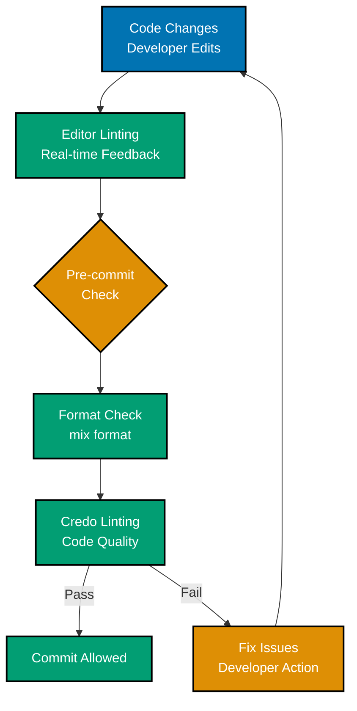
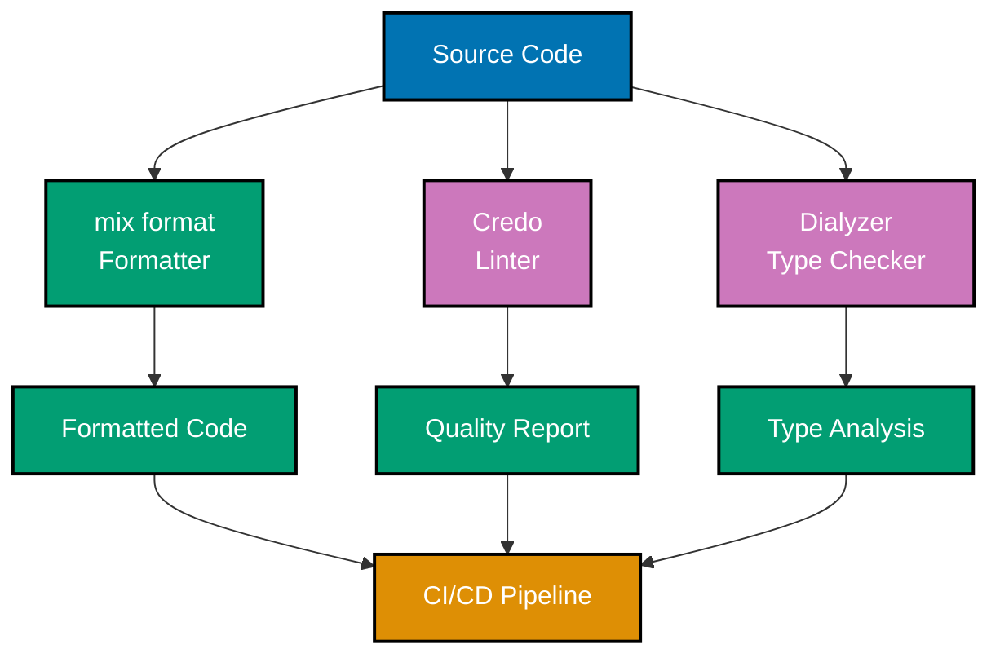
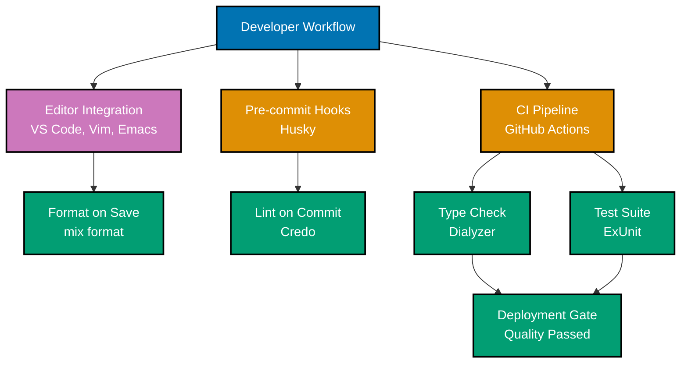
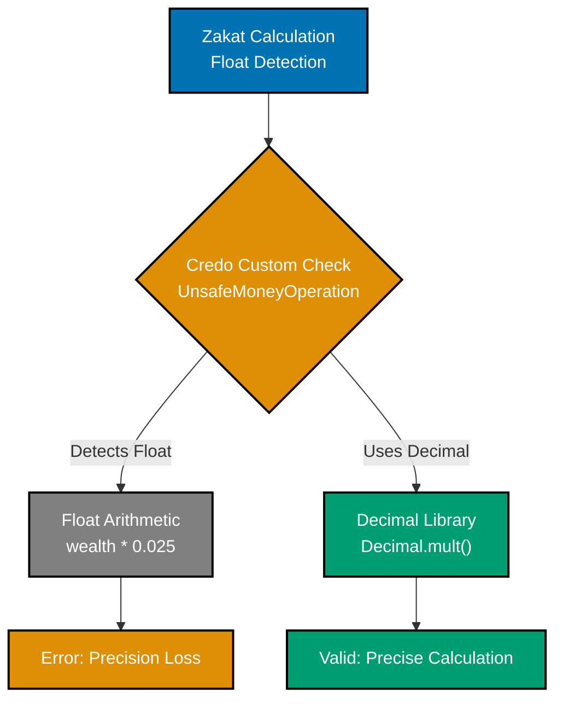

# Linting and Formatting

Elixir provides excellent tooling for **code formatting** (`mix format`), **linting** (Credo), and **static analysis** (Dialyzer). These tools ensure consistent code style, catch common mistakes, and find type errors at compile time, essential for maintaining high-quality financial applications.

**Quick Reference**:

- [Code Formatting with mix format](#code-formatting-with-mix-format)
  - [Configuration](#configuration)
  - [Usage](#usage)
  - [Editor Integration](#editor-integration)
- [Linting with Credo](#linting-with-credo)
  - [Installation](#installation)
  - [Configuration](#configuration-1)
  - [Running Credo](#running-credo)
  - [Custom Checks](#custom-checks)
- [Static Analysis with Dialyzer](#static-analysis-with-dialyzer)
  - [Setup](#setup)
  - [Type Specifications](#type-specifications)
  - [Running Dialyzer](#running-dialyzer)
  - [Common Issues](#common-issues)
- [Pre-commit Hooks](#pre-commit-hooks)
  - [Git Hooks with Husky](#git-hooks-with-husky)
  - [Pre-commit Configuration](#pre-commit-configuration)
- [CI/CD Integration](#cicd-integration)
  - [GitHub Actions](#github-actions)
  - [GitLab CI](#gitlab-ci)
- [Financial Domain Examples](#financial-domain-examples)
- [Best Practices](#best-practices)
- [Related Topics](#related-topics)
- [Sources](#sources)

## Code Formatting with mix format

### Configuration

Configure formatter in `.formatter.exs`:

```elixir
# .formatter.exs
[
  inputs: [
    "{mix,.formatter}.exs",
    "{config,lib,test}/**/*.{ex,exs}"
  ],
  # Line length
  line_length: 100,
  # Import order
  import_deps: [:ecto, :phoenix, :ecto_sql],
  # Subdirectory configuration
  subdirectories: ["priv/*/migrations"]
]
```

Custom formatting rules:

```elixir
# .formatter.exs
[
  inputs: ["{mix,.formatter}.exs", "{config,lib,test}/**/*.{ex,exs}"],
  line_length: 100,
  # Force trailing comma in multiline lists
  trailing_comma: true,
  # Format Ecto queries consistently
  import_deps: [:ecto, :phoenix],
  # Local dependencies
  locals_without_parens: [
    # Custom macros without parens
    plug: 1,
    plug: 2,
    field: 2,
    field: 3
  ]
]
```

### Usage

Format code with mix format:

```bash
# Format all files
mix format

# Check if files are formatted (CI)
mix format --check-formatted

# Format specific files
mix format lib/financial_platform/donations.ex

# Format with explicit config
mix format --dot-formatter path/to/.formatter.exs

# Dry run (show changes without applying)
mix format --check-formatted --dry-run
```

Example of formatting in action:

```elixir
# Before formatting
def calculate_zakat(wealth,nisab) do
if wealth>nisab do
{:ok,wealth*0.025}
else
{:error,:below_nisab}
end
end

# After formatting
def calculate_zakat(wealth, nisab) do
  if wealth > nisab do
    {:ok, wealth * 0.025}
  else
    {:error, :below_nisab}
  end
end
```

### Editor Integration

Configure your editor to format on save:

**VS Code** (with ElixirLS):

```json
{
  "editor.formatOnSave": true,
  "[elixir]": {
    "editor.defaultFormatter": "JakeBecker.elixir-ls"
  }
}
```

**Vim/Neovim** (with mix-format):

```vim
" Auto-format on save
autocmd BufWritePre *.ex,*.exs :!mix format %
```

**Emacs** (with elixir-mode):

```elisp
(add-hook 'elixir-mode-hook
  (lambda ()
    (add-hook 'before-save-hook 'elixir-format nil t)))
```

## Linting with Credo

### Installation

Add Credo to your project:

```elixir
# mix.exs
defp deps do
  [
    {:credo, "~> 1.7", only: [:dev, :test], runtime: false}
  ]
end
```

```bash
mix deps.get
```

### Configuration

Configure Credo in `.credo.exs`:

```elixir
# .credo.exs
%{
  configs: [
    %{
      name: "default",
      # Files to check
      files: %{
        included: [
          "lib/",
          "src/",
          "test/",
          "web/",
          "apps/*/lib/",
          "apps/*/test/"
        ],
        excluded: [~r"/_build/", ~r"/deps/", ~r"/node_modules/"]
      },
      # Plugins
      plugins: [],
      # Strict mode
      strict: true,
      # Parse timeout
      parse_timeout: 10000,
      # Color output
      color: true,
      # Checks
      checks: %{
        enabled: [
          # Consistency checks
          {Credo.Check.Consistency.ExceptionNames, []},
          {Credo.Check.Consistency.LineEndings, []},
          {Credo.Check.Consistency.ParameterPatternMatching, []},
          {Credo.Check.Consistency.SpaceAroundOperators, []},
          {Credo.Check.Consistency.SpaceInParentheses, []},
          {Credo.Check.Consistency.TabsOrSpaces, []},

          # Design checks
          {Credo.Check.Design.AliasUsage, [priority: :low, if_nested_deeper_than: 2]},
          {Credo.Check.Design.TagTODO, [exit_status: 0]},
          {Credo.Check.Design.TagFIXME, []},

          # Readability checks
          {Credo.Check.Readability.AliasOrder, []},
          {Credo.Check.Readability.FunctionNames, []},
          {Credo.Check.Readability.LargeNumbers, []},
          {Credo.Check.Readability.MaxLineLength, [priority: :low, max_length: 120]},
          {Credo.Check.Readability.ModuleAttributeNames, []},
          {Credo.Check.Readability.ModuleDoc, []},
          {Credo.Check.Readability.ModuleNames, []},
          {Credo.Check.Readability.ParenthesesInCondition, []},
          {Credo.Check.Readability.ParenthesesOnZeroArityDefs, []},
          {Credo.Check.Readability.PipeIntoAnonymousFunctions, []},
          {Credo.Check.Readability.PredicateFunctionNames, []},
          {Credo.Check.Readability.PreferImplicitTry, []},
          {Credo.Check.Readability.RedundantBlankLines, []},
          {Credo.Check.Readability.Semicolons, []},
          {Credo.Check.Readability.SpaceAfterCommas, []},
          {Credo.Check.Readability.StringSigils, []},
          {Credo.Check.Readability.TrailingBlankLine, []},
          {Credo.Check.Readability.TrailingWhiteSpace, []},
          {Credo.Check.Readability.UnnecessaryAliasExpansion, []},
          {Credo.Check.Readability.VariableNames, []},
          {Credo.Check.Readability.WithSingleClause, []},

          # Refactor checks
          {Credo.Check.Refactor.ABCSize, [max_size: 100]},
          {Credo.Check.Refactor.AppendSingleItem, []},
          {Credo.Check.Refactor.CondStatements, []},
          {Credo.Check.Refactor.CyclomaticComplexity, [max_complexity: 15]},
          {Credo.Check.Refactor.FunctionArity, [max_arity: 8]},
          {Credo.Check.Refactor.LongQuoteBlocks, []},
          {Credo.Check.Refactor.MatchInCondition, []},
          {Credo.Check.Refactor.MapInto, []},
          {Credo.Check.Refactor.NegatedConditionsInUnless, []},
          {Credo.Check.Refactor.NegatedConditionsWithElse, []},
          {Credo.Check.Refactor.Nesting, [max_nesting: 3]},
          {Credo.Check.Refactor.UnlessWithElse, []},
          {Credo.Check.Refactor.WithClauses, []},

          # Warning checks
          {Credo.Check.Warning.ApplicationConfigInModuleAttribute, []},
          {Credo.Check.Warning.BoolOperationOnSameValues, []},
          {Credo.Check.Warning.Dbg, []},
          {Credo.Check.Warning.ExpensiveEmptyEnumCheck, []},
          {Credo.Check.Warning.IExPry, []},
          {Credo.Check.Warning.IoInspect, []},
          {Credo.Check.Warning.OperationOnSameValues, []},
          {Credo.Check.Warning.OperationWithConstantResult, []},
          {Credo.Check.Warning.RaiseInsideRescue, []},
          {Credo.Check.Warning.SpecWithStruct, []},
          {Credo.Check.Warning.UnsafeExec, []},
          {Credo.Check.Warning.UnusedEnumOperation, []},
          {Credo.Check.Warning.UnusedFileOperation, []},
          {Credo.Check.Warning.UnusedKeywordOperation, []},
          {Credo.Check.Warning.UnusedListOperation, []},
          {Credo.Check.Warning.UnusedPathOperation, []},
          {Credo.Check.Warning.UnusedRegexOperation, []},
          {Credo.Check.Warning.UnusedStringOperation, []}
        ],
        disabled: [
          # Disable specific checks if needed
          # {Credo.Check.Readability.ModuleDoc, []},
        ]
      }
    }
  ]
}
```

### Running Credo

Run Credo checks:

```bash
# Run all checks
mix credo

# Strict mode (all issues)
mix credo --strict

# Only show issues, no explanations
mix credo list

# Show suggestions
mix credo suggest

# Explain an issue
mix credo explain lib/financial_platform/donations.ex:42:5

# Check specific files
mix credo lib/financial_platform/

# Output formats
mix credo --format=json
mix credo --format=flycheck  # For Emacs
mix credo --format=oneline

# Exit with error on issues (CI)
mix credo --strict --all
```

### Custom Checks

Create custom Credo checks:

```elixir
# lib/credo/check/warning/unsafe_money_operation.ex
defmodule FinancialPlatform.Credo.Check.Warning.UnsafeMoneyOperation do
  @moduledoc """
  Warns when using float operations on money amounts.

  ## Example

      # Bad - float arithmetic loses precision
      amount = 100.50 * 0.025

      # Good - use Decimal or Money library
      amount = Decimal.mult(Decimal.new("100.50"), Decimal.new("0.025"))
  """

  @explanation [check: @moduledoc]

  use Credo.Check,
    base_priority: :high,
    category: :warning,
    exit_status: 2

  def run(source_file, params) do
    issue_meta = IssueMeta.for(source_file, params)

    Credo.Code.prewalk(source_file, &traverse(&1, &2, issue_meta))
  end

  defp traverse({:*, meta, [left, right]} = ast, issues, issue_meta) do
    if float_operation?(left, right) do
      {ast, [issue_for(issue_meta, meta[:line], "*") | issues]}
    else
      {ast, issues}
    end
  end

  defp traverse(ast, issues, _issue_meta) do
    {ast, issues}
  end

  defp float_operation?({:., _, _}, _), do: false
  defp float_operation?(_, {:., _, _}), do: false

  defp float_operation?(left, right) do
    is_float_literal?(left) or is_float_literal?(right)
  end

  defp is_float_literal?({value, _, _}) when is_float(value), do: true
  defp is_float_literal?(_), do: false

  defp issue_for(issue_meta, line_no, trigger) do
    format_issue(
      issue_meta,
      message: "Avoid float operations on money amounts. Use Decimal or Money library.",
      trigger: trigger,
      line_no: line_no
    )
  end
end

# Register in .credo.exs
%{
  configs: [
    %{
      name: "default",
      checks: %{
        extra: [
          {FinancialPlatform.Credo.Check.Warning.UnsafeMoneyOperation, []}
        ]
      }
    }
  ]
}
```

## Static Analysis with Dialyzer

### Setup

Configure Dialyzer with dialyxir:

```elixir
# mix.exs
defp deps do
  [
    {:dialyxir, "~> 1.4", only: [:dev, :test], runtime: false}
  ]
end

def project do
  [
    # ...
    dialyzer: [
      plt_file: {:no_warn, "priv/plts/dialyzer.plt"},
      plt_add_apps: [:ex_unit, :mix],
      flags: [
        :error_handling,
        :underspecs,
        :unknown,
        :unmatched_returns
      ],
      # Ignore warnings in specific files
      ignore_warnings: ".dialyzer_ignore.exs",
      # List apps to include in PLT
      plt_core_path: "priv/plts",
      plt_local_path: "priv/plts"
    ]
  ]
end
```

```bash
# Install dependencies
mix deps.get

# Build PLT (Persistent Lookup Table)
mix dialyzer --plt

# Run Dialyzer
mix dialyzer
```

### Type Specifications

Add type specifications to your code:

```elixir
defmodule FinancialPlatform.Donations do
  @moduledoc """
  Context for managing donations.
  """

  alias FinancialPlatform.Donations.Donation

  @type donation_attrs :: %{
          optional(:campaign_id) => String.t(),
          optional(:amount) => Decimal.t(),
          optional(:currency) => String.t(),
          optional(:donor_name) => String.t(),
          optional(:donor_email) => String.t()
        }

  @type donation_result :: {:ok, Donation.t()} | {:error, Ecto.Changeset.t()}

  @doc """
  Creates a new donation.
  """
  @spec create_donation(donation_attrs()) :: donation_result()
  def create_donation(attrs) do
    %Donation{}
    |> Donation.changeset(attrs)
    |> Repo.insert()
  end

  @doc """
  Gets a single donation by ID.
  """
  @spec get_donation(String.t()) :: {:ok, Donation.t()} | {:error, :not_found}
  def get_donation(id) do
    case Repo.get(Donation, id) do
      nil -> {:error, :not_found}
      donation -> {:ok, donation}
    end
  end

  @doc """
  Lists all donations with optional filters.
  """
  @spec list_donations(keyword()) :: [Donation.t()]
  def list_donations(opts \\ []) do
    Donation
    |> apply_filters(opts)
    |> Repo.all()
  end

  @spec apply_filters(Ecto.Queryable.t(), keyword()) :: Ecto.Query.t()
  defp apply_filters(query, []), do: query

  defp apply_filters(query, [{:campaign_id, campaign_id} | rest]) do
    query
    |> where([d], d.campaign_id == ^campaign_id)
    |> apply_filters(rest)
  end

  defp apply_filters(query, [{:status, status} | rest]) do
    query
    |> where([d], d.status == ^status)
    |> apply_filters(rest)
  end

  defp apply_filters(query, [_ | rest]), do: apply_filters(query, rest)
end
```

### Running Dialyzer

Run Dialyzer analysis:

```bash
# First time: build PLT
mix dialyzer --plt

# Run analysis
mix dialyzer

# Explain warnings
mix dialyzer --explain

# Format output
mix dialyzer --format short
mix dialyzer --format dialyzer
mix dialyzer --format github

# Run on specific files
mix dialyzer lib/financial_platform/donations.ex
```

### Common Issues

Common Dialyzer warnings and fixes:

```elixir
# Warning: "The pattern can never match the type"
# Bad
@spec get_donation(String.t()) :: Donation.t()
def get_donation(id) do
  Repo.get(Donation, id)  # Can return nil!
end

# Good
@spec get_donation(String.t()) :: Donation.t() | nil
def get_donation(id) do
  Repo.get(Donation, id)
end

# Warning: "Function has no local return"
# Bad
@spec process_donation(Donation.t()) :: :ok
def process_donation(donation) do
  validate_donation(donation)  # Returns {:ok, _} | {:error, _}
  :ok
end

# Good
@spec process_donation(Donation.t()) :: {:ok, Donation.t()} | {:error, term()}
def process_donation(donation) do
  with {:ok, validated} <- validate_donation(donation),
       {:ok, processed} <- do_process(validated) do
    {:ok, processed}
  end
end

# Warning: "The created fun has no local return"
# Bad
@spec map_donations([Donation.t()], fun()) :: [term()]
def map_donations(donations, fun) do
  Enum.map(donations, fun)
end

# Good
@spec map_donations([Donation.t()], (Donation.t() -> result)) :: [result] when result: var
def map_donations(donations, fun) do
  Enum.map(donations, fun)
end
```

## Linting Pipeline



## Tool Integration Workflow



## Quality Automation Stack



## Financial Domain Validation



## Pre-commit Hooks

### Git Hooks with Husky

Install and configure pre-commit hooks:

```bash
# Install husky (Node.js)
npm install --save-dev husky

# Initialize husky
npx husky init

# Create pre-commit hook
npx husky add .husky/pre-commit "mix format --check-formatted && mix credo --strict"
```

### Pre-commit Configuration

Create comprehensive pre-commit hooks:

```bash
#!/bin/sh
# .husky/pre-commit

echo "🔍 Running pre-commit checks..."

# 1. Format check
echo "📝 Checking code formatting..."
mix format --check-formatted || {
  echo "❌ Code is not formatted. Run 'mix format' to fix."
  exit 1
}

# 2. Credo checks
echo "🔎 Running Credo..."
mix credo --strict --all || {
  echo "❌ Credo found issues. Fix them before committing."
  exit 1
}

# 3. Compile warnings as errors
echo "⚙️  Compiling with warnings as errors..."
mix compile --warnings-as-errors || {
  echo "❌ Compilation warnings found. Fix them before committing."
  exit 1
}

# 4. Run fast tests
echo "🧪 Running fast tests..."
mix test --only fast || {
  echo "❌ Fast tests failed. Fix them before committing."
  exit 1
}

echo "✅ All pre-commit checks passed!"
```

```bash
#!/bin/sh
# .husky/pre-push

echo "🚀 Running pre-push checks..."

# 1. Full test suite
echo "🧪 Running full test suite..."
mix test || {
  echo "❌ Tests failed. Fix them before pushing."
  exit 1
}

# 2. Dialyzer
echo "🔬 Running Dialyzer..."
mix dialyzer --halt-exit-status || {
  echo "❌ Dialyzer found type errors. Fix them before pushing."
  exit 1
}

echo "✅ All pre-push checks passed!"
```

## CI/CD Integration

### GitHub Actions

Complete CI/CD pipeline with GitHub Actions:

```yaml
# .github/workflows/ci.yml
name: CI

on:
  push:
    branches: [main]
  pull_request:
    branches: [main]

env:
  MIX_ENV: test

jobs:
  test:
    name: Test (Elixir ${{matrix.elixir}} / OTP ${{matrix.otp}})
    runs-on: ubuntu-latest

    strategy:
      matrix:
        elixir: ["1.17.3", "1.19.0"]
        otp: ["27.2"]

    services:
      postgres:
        image: postgres:16
        env:
          POSTGRES_USER: postgres
          POSTGRES_PASSWORD: postgres
          POSTGRES_DB: financial_platform_test
        options: >-
          --health-cmd pg_isready
          --health-interval 10s
          --health-timeout 5s
          --health-retries 5
        ports:
          - 5432:5432

    steps:
      - name: Checkout code
        uses: actions/checkout@v3

      - name: Set up Elixir
        uses: erlef/setup-beam@v1
        with:
          elixir-version: ${{matrix.elixir}}
          otp-version: ${{matrix.otp}}

      - name: Cache dependencies
        uses: actions/cache@v3
        with:
          path: |
            deps
            _build
          key: ${{ runner.os }}-mix-${{ hashFiles('**/mix.lock') }}
          restore-keys: ${{ runner.os }}-mix-

      - name: Cache Dialyzer PLT
        uses: actions/cache@v3
        with:
          path: priv/plts
          key: ${{ runner.os }}-plt-${{ hashFiles('**/mix.lock') }}
          restore-keys: ${{ runner.os }}-plt-

      - name: Install dependencies
        run: mix deps.get

      - name: Check formatting
        run: mix format --check-formatted

      - name: Compile with warnings as errors
        run: mix compile --warnings-as-errors

      - name: Run Credo
        run: mix credo --strict --all

      - name: Run tests
        run: mix test --cover

      - name: Build Dialyzer PLT
        run: mix dialyzer --plt

      - name: Run Dialyzer
        run: mix dialyzer --halt-exit-status

      - name: Upload coverage to Codecov
        uses: codecov/codecov-action@v3
        with:
          files: ./cover/excoveralls.json
```

### GitLab CI

GitLab CI configuration:

```yaml
# .gitlab-ci.yml
image: elixir:1.19.0

variables:
  MIX_ENV: test
  POSTGRES_DB: financial_platform_test
  POSTGRES_USER: postgres
  POSTGRES_PASSWORD: postgres

services:
  - postgres:16

stages:
  - setup
  - lint
  - test
  - analyze

cache:
  paths:
    - deps/
    - _build/
    - priv/plts/

before_script:
  - mix local.hex --force
  - mix local.rebar --force
  - mix deps.get

setup:
  stage: setup
  script:
    - mix deps.compile

format:
  stage: lint
  script:
    - mix format --check-formatted

credo:
  stage: lint
  script:
    - mix credo --strict --all

compile:
  stage: lint
  script:
    - mix compile --warnings-as-errors

test:
  stage: test
  script:
    - mix ecto.create
    - mix ecto.migrate
    - mix test --cover
  coverage: '/\[TOTAL\]\s+(\d+\.\d+)%/'
  artifacts:
    reports:
      coverage_report:
        coverage_format: cobertura
        path: cover/cobertura.xml

dialyzer:
  stage: analyze
  script:
    - mix dialyzer --plt
    - mix dialyzer --halt-exit-status
  allow_failure: true
```

## Financial Domain Examples

Complete linting and formatting setup for financial platform:

```elixir
# .formatter.exs
[
  inputs: ["{mix,.formatter}.exs", "{config,lib,test}/**/*.{ex,exs}"],
  line_length: 100,
  import_deps: [:ecto, :phoenix, :ecto_sql],
  subdirectories: ["priv/*/migrations"],
  # Financial domain specific
  locals_without_parens: [
    field: 2,
    field: 3,
    belongs_to: 2,
    belongs_to: 3,
    has_many: 2,
    has_many: 3
  ]
]

# .credo.exs - Financial domain specific checks
%{
  configs: [
    %{
      name: "default",
      strict: true,
      checks: %{
        enabled: [
          # All standard checks
          # ...

          # Financial domain: require module docs
          {Credo.Check.Readability.ModuleDoc, []},

          # Financial domain: strict function naming
          {Credo.Check.Readability.FunctionNames, []},

          # Financial domain: limit complexity
          {Credo.Check.Refactor.CyclomaticComplexity, [max_complexity: 10]},
          {Credo.Check.Refactor.ABCSize, [max_size: 50]}
        ],
        extra: [
          # Custom check for unsafe money operations
          {FinancialPlatform.Credo.Check.Warning.UnsafeMoneyOperation, []}
        ]
      }
    }
  ]
}

# mix.exs - Dialyzer configuration
def project do
  [
    app: :financial_platform,
    version: "0.1.0",
    elixir: "~> 1.17",
    dialyzer: [
      plt_file: {:no_warn, "priv/plts/dialyzer.plt"},
      plt_add_apps: [:ex_unit, :mix, :phoenix, :ecto],
      flags: [
        :error_handling,
        :underspecs,
        :unknown,
        :unmatched_returns
      ]
    ]
  ]
end
```

## Best Practices

1. **Always format code** - Run `mix format` before committing
2. **Use Credo in CI** - Enforce code quality standards
3. **Add type specs** - Use `@spec` for public functions
4. **Run Dialyzer regularly** - Catch type errors early
5. **Use pre-commit hooks** - Automate quality checks
6. **Configure CI/CD** - Run all checks in pipeline
7. **Keep PLT updated** - Rebuild after dependency changes
8. **Document exceptions** - Explain why you disable checks

## Related Topics

- [Best Practices](ex-soen-prla-el__best-practices.md) - Elixir best practices
- [Testing](ex-soen-prla-el__test-driven-development.md) - Testing quality
- [Type Safety](ex-soen-prla-el__type-safety.md) - Typespecs and Dialyzer
- [Dependencies](ex-soen-prla-el__modules-and-dependencies.md) - Dependency management

## Sources

- [mix format Documentation](https://hexdocs.pm/mix/Mix.Tasks.Format.html)
- [Credo Documentation](https://hexdocs.pm/credo/)
- [Dialyxir Documentation](https://hexdocs.pm/dialyxir/)
- [Dialyzer User Guide](https://www.erlang.org/doc/man/dialyzer.html)
- [GitHub Actions for Elixir](https://github.com/erlef/setup-beam)

---

**Last Updated**: 2026-01-23
**Elixir Version**: 1.12+ (baseline), 1.17+ (recommended), 1.19.0 (latest)
**Maintainers**: Platform Documentation Team
