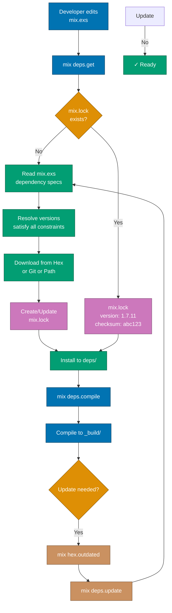
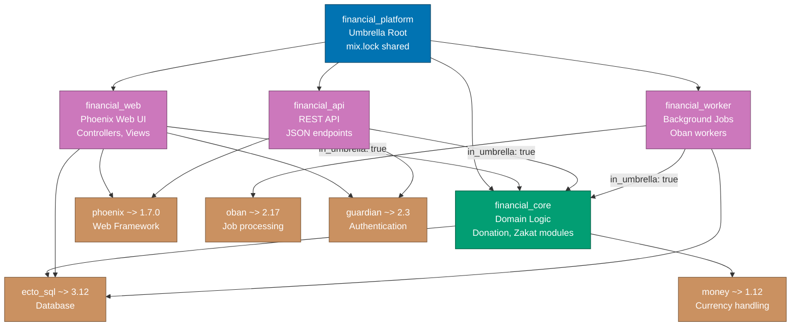

# Dependencies

Elixir uses **Mix** (build tool) and **Hex** (package manager) for dependency management. Understanding how to manage dependencies effectively is crucial for building maintainable applications, especially in large projects using umbrella apps and microservices architectures.

**Quick Reference**:

- [Mix Basics](#mix-basics)
  - [Project Structure](#project-structure)
  - [mix.exs Configuration](#mixexs-configuration)
  - [Mix Tasks](#mix-tasks)
- [Hex Package Manager](#hex-package-manager)
  - [Adding Dependencies](#adding-dependencies)
  - [Version Constraints](#version-constraints)
  - [Dependency Resolution](#dependency-resolution)
  - [Lock File](#lock-file)
- [Dependency Types](#dependency-types)
  - [Runtime vs Dev/Test](#runtime-vs-devtest)
  - [Hex vs Git vs Path](#hex-vs-git-vs-path)
  - [Optional Dependencies](#optional-dependencies)
- [Umbrella Projects](#umbrella-projects)
  - [Structure](#structure)
  - [Inter-App Dependencies](#inter-app-dependencies)
  - [Benefits and Trade-offs](#benefits-and-trade-offs)
- [Private Hex Repositories](#private-hex-repositories)
- [Dependency Conflicts](#dependency-conflicts)
- [Common Dependencies](#common-dependencies)
- [Financial Domain Examples](#financial-domain-examples)
- [Best Practices](#best-practices)
- [Dependency Anti-patterns](#dependency-anti-patterns)
- [Security Considerations](#security-considerations)
- [Related Topics](#related-topics)
- [Sources](#sources)

## Mix Basics

### Project Structure

A typical Mix project structure:

```
financial_domain/
├── _build/           # Compiled artifacts
├── deps/             # Downloaded dependencies
├── lib/              # Application source code
│   ├── financial_domain.ex
│   └── financial_domain/
│       ├── donation.ex
│       └── zakat.ex
├── test/             # Test files
│   ├── test_helper.exs
│   └── financial_domain_test.exs
├── config/           # Configuration files
│   ├── config.exs
│   ├── dev.exs
│   ├── test.exs
│   └── prod.exs
├── mix.exs           # Project configuration
├── mix.lock          # Dependency lock file
└── README.md
```

### mix.exs Configuration

The `mix.exs` file defines project metadata and dependencies:

```elixir
defmodule FinancialDomain.MixProject do
  use Mix.Project

  def project do
    [
      # Project metadata
      app: :financial_domain,
      version: "0.1.0",
      elixir: "~> 1.17",
      start_permanent: Mix.env() == :prod,

      # Build configuration
      elixirc_paths: elixirc_paths(Mix.env()),
      compilers: Mix.compilers(),

      # Dependencies
      deps: deps(),

      # Releases
      releases: [
        financial_domain: [
          include_executables_for: [:unix],
          applications: [runtime_tools: :permanent]
        ]
      ],

      # Documentation
      name: "Financial Domain",
      source_url: "https://github.com/example/financial_domain",
      docs: [
        main: "FinancialDomain",
        extras: ["README.md"]
      ],

      # Testing
      test_coverage: [tool: ExCoveralls],
      preferred_cli_env: [
        coveralls: :test,
        "coveralls.detail": :test,
        "coveralls.post": :test,
        "coveralls.html": :test
      ],

      # Dialyzer
      dialyzer: [
        plt_add_apps: [:ex_unit],
        plt_file: {:no_warn, "priv/plts/dialyzer.plt"}
      ]
    ]
  end

  # Run "mix help compile.app" to learn about applications
  def application do
    [
      extra_applications: [:logger, :runtime_tools],
      mod: {FinancialDomain.Application, []}
    ]
  end

  # Specifies which paths to compile per environment
  defp elixirc_paths(:test), do: ["lib", "test/support"]
  defp elixirc_paths(_), do: ["lib"]

  # Dependencies
  defp deps do
    [
      # Production dependencies
      {:phoenix, "~> 1.7.0"},
      {:ecto_sql, "~> 3.12"},
      {:postgrex, ">= 0.0.0"},
      {:jason, "~> 1.4"},

      # Development and test dependencies
      {:phoenix_live_reload, "~> 1.4", only: :dev},
      {:credo, "~> 1.7", only: [:dev, :test], runtime: false},
      {:dialyxir, "~> 1.4", only: [:dev, :test], runtime: false},
      {:ex_doc, "~> 0.31", only: :dev, runtime: false},
      {:excoveralls, "~> 0.18", only: :test}
    ]
  end
end
```

### Mix Tasks

Common Mix tasks for dependency management:

```bash
# Fetch dependencies
mix deps.get

# Compile dependencies
mix deps.compile

# Update dependencies
mix deps.update --all          # Update all
mix deps.update phoenix ecto   # Update specific

# Check for outdated dependencies
mix hex.outdated

# Show dependency tree
mix deps.tree

# Check dependency conflicts
mix deps.check

# Clean dependencies
mix deps.clean --all           # Remove all
mix deps.clean phoenix         # Remove specific

# Unlock dependencies
mix deps.unlock --all          # Unlock all
mix deps.unlock phoenix        # Unlock specific
```

## Hex Package Manager

### Adding Dependencies

Add dependencies to `deps/0` function in `mix.exs`:

```elixir
defp deps do
  [
    # From Hex (default)
    {:phoenix, "~> 1.7.0"},

    # Latest version
    {:jason, "~> 1.4"},

    # Exact version (not recommended)
    {:plug, "1.15.3"},

    # Version range
    {:ecto, ">= 3.11.0 and < 4.0.0"},

    # Development only
    {:credo, "~> 1.7", only: :dev},

    # Test only
    {:excoveralls, "~> 0.18", only: :test},

    # Dev and test
    {:ex_doc, "~> 0.31", only: [:dev, :test]},

    # Runtime: false (compile-time only)
    {:dialyxir, "~> 1.4", only: [:dev, :test], runtime: false}
  ]
end
```

### Version Constraints

Hex uses semantic versioning (SemVer):

```elixir
# Version constraints
{:package, "~> 1.0"}       # >= 1.0.0 and < 2.0.0 (recommended)
{:package, "~> 1.0.0"}     # >= 1.0.0 and < 1.1.0
{:package, "~> 1.0.3"}     # >= 1.0.3 and < 1.1.0

{:package, ">= 1.0.0"}     # 1.0.0 or higher
{:package, "== 1.0.0"}     # Exactly 1.0.0 (not recommended)
{:package, "!= 1.0.5"}     # Not 1.0.5

# Complex constraints
{:package, ">= 1.0.0 and < 2.0.0"}
{:package, "~> 1.0 or ~> 2.0"}

# Pre-release versions
{:package, "~> 1.0.0-rc.0"}
```

Best practices:

- **Use `~>`** for most dependencies (allows patches)
- **Avoid `==`** (prevents security updates)
- **Use `:override`** only when necessary

```elixir
# Override transitive dependency version
{:phoenix, "~> 1.7.0"},
{:plug, "~> 1.15", override: true}
```

### Dependency Resolution

Mix resolves dependencies using the lock file:

```elixir
# First time: mix deps.get creates mix.lock
mix deps.get

# Later: uses versions from mix.lock
mix deps.get

# Force update
mix deps.update --all

# Add new dependency: updates only that package
# In mix.exs:
{:new_package, "~> 1.0"}

# Run:
mix deps.get  # Fetches new_package, keeps others locked
```

The following diagram illustrates how Mix resolves and manages dependencies through its lifecycle:



**Key Points**:

- **First Run**: Mix reads specs, resolves versions, and creates `mix.lock`
- **Subsequent Runs**: Mix uses locked versions for reproducibility
- **Updates**: Explicit `mix deps.update` triggers re-resolution
- **Lock File**: Ensures all developers use identical dependency versions

### Lock File

`mix.lock` ensures reproducible builds:

```elixir
# mix.lock example
%{
  "phoenix": {:hex, :phoenix, "1.7.11", "..."},
  "plug": {:hex, :plug, "1.15.3", "..."},
  "ecto": {:hex, :ecto, "3.11.2", "..."}
}
```

Lock file best practices:

- **Commit mix.lock** to version control
- **Don't edit manually** (use Mix tasks)
- **Update regularly** but test thoroughly

## Dependency Types

### Runtime vs Dev/Test

Dependencies can be scoped to environments:

```elixir
defp deps do
  [
    # Runtime (production) dependencies
    {:phoenix, "~> 1.7.0"},
    {:ecto_sql, "~> 3.12"},

    # Development tools (not in production)
    {:phoenix_live_reload, "~> 1.4", only: :dev},
    {:credo, "~> 1.7", only: :dev, runtime: false},

    # Test tools
    {:excoveralls, "~> 0.18", only: :test},

    # Multiple environments
    {:ex_doc, "~> 0.31", only: [:dev, :test], runtime: false}
  ]
end
```

### Hex vs Git vs Path

Different dependency sources:

```elixir
defp deps do
  [
    # 1. Hex package (default)
    {:phoenix, "~> 1.7.0"},

    # 2. Git repository
    {:custom_lib,
     git: "https://github.com/example/custom_lib.git",
     tag: "v1.0.0"},

    # Git with branch
    {:custom_lib,
     git: "https://github.com/example/custom_lib.git",
     branch: "main"},

    # Git with specific commit
    {:custom_lib,
     git: "https://github.com/example/custom_lib.git",
     ref: "abc123"},

    # 3. Local path (development)
    {:shared_lib, path: "../shared_lib"},

    # Path in umbrella
    {:financial_core, in_umbrella: true}
  ]
end
```

### Optional Dependencies

Dependencies can be optional:

```elixir
defp deps do
  [
    # Core dependency
    {:phoenix, "~> 1.7.0"},

    # Optional: only if you use live view
    {:phoenix_live_view, "~> 0.20.0", optional: true},

    # Optional: alternative JSON library
    {:poison, "~> 5.0", optional: true}
  ]
end

# In application code
def application do
  [
    extra_applications: extra_applications(Mix.env())
  ]
end

defp extra_applications(:prod) do
  # Only include if phoenix_live_view is available
  apps = [:logger]
  if Code.ensure_loaded?(Phoenix.LiveView) do
    [:phoenix_live_view | apps]
  else
    apps
  end
end

defp extra_applications(_), do: [:logger, :phoenix_live_view]
```

## Umbrella Projects

### Structure

Umbrella projects organize large applications into smaller apps:

```
financial_platform/          # Umbrella root
├── apps/
│   ├── financial_core/      # Domain logic
│   │   ├── lib/
│   │   ├── test/
│   │   └── mix.exs
│   ├── financial_web/       # Phoenix web interface
│   │   ├── lib/
│   │   ├── test/
│   │   └── mix.exs
│   └── financial_api/       # REST API
│       ├── lib/
│       ├── test/
│       └── mix.exs
├── config/
│   ├── config.exs
│   ├── dev.exs
│   ├── test.exs
│   └── prod.exs
├── mix.exs                  # Umbrella configuration
└── mix.lock                 # Shared lock file
```

Create umbrella project:

```bash
# Create umbrella
mix new financial_platform --umbrella

# Navigate to apps directory
cd financial_platform/apps

# Create child apps
mix new financial_core
mix phx.new financial_web
mix new financial_api --sup
```

### Inter-App Dependencies

Child apps can depend on each other:

```elixir
# apps/financial_web/mix.exs
defmodule FinancialWeb.MixProject do
  use Mix.Project

  def project do
    [
      app: :financial_web,
      version: "0.1.0",
      build_path: "../../_build",        # Shared build directory
      config_path: "../../config/config.exs",  # Shared config
      deps_path: "../../deps",           # Shared dependencies
      lockfile: "../../mix.lock",        # Shared lock file
      elixir: "~> 1.17",
      deps: deps()
    ]
  end

  defp deps do
    [
      # Depend on sibling app
      {:financial_core, in_umbrella: true},

      # External dependencies
      {:phoenix, "~> 1.7.0"},
      {:phoenix_html, "~> 4.0"}
    ]
  end
end
```

The following diagram illustrates dependency relationships in a financial platform umbrella project:



**Dependency Patterns**:

- **Core App** (green): Domain logic with minimal external dependencies (Ecto, Money)
- **UI Apps** (purple): Web and API apps depend on core (`in_umbrella: true`)
- **Worker App** (purple): Background jobs depend on core
- **Shared Lock**: All apps use single `mix.lock` at umbrella root
- **Compilation Order**: Mix compiles `financial_core` first, then dependent apps

This architecture ensures:

1. **Clear boundaries**: Domain logic isolated in core
2. **Reusability**: Multiple interfaces (web, API) share core logic
3. **Testing**: Core can be tested independently
4. **Deployment**: Apps can be deployed separately or together

### Benefits and Trade-offs

**Benefits**:

- **Modular architecture**: Clear separation of concerns
- **Shared dependencies**: Single `mix.lock` for all apps
- **Incremental compilation**: Only changed apps recompile
- **Testing isolation**: Test apps independently
- **Deployment flexibility**: Deploy apps separately or together

**Trade-offs**:

- **Complexity**: More complex than single app
- **Learning curve**: Requires understanding umbrella structure
- **Tooling**: Some tools may need configuration

Example: Financial platform umbrella

```elixir
# apps/financial_core/lib/financial_core.ex
defmodule FinancialCore do
  @moduledoc """
  Core domain logic for financial operations.
  """

  defmodule Donation do
    defstruct [:id, :amount, :donor_id, :campaign_id]
  end

  defmodule Zakat do
    def calculate(wealth, nisab) when wealth > nisab do
      {:ok, wealth * 0.025}
    end

    def calculate(_wealth, _nisab), do: {:error, :below_nisab}
  end
end

# apps/financial_web/lib/financial_web/controllers/donation_controller.ex
defmodule FinancialWeb.DonationController do
  use FinancialWeb, :controller

  # Use core domain logic
  alias FinancialCore.Donation

  def create(conn, %{"donation" => donation_params}) do
    # Create donation using core logic
    donation = struct(Donation, donation_params)
    # ...
  end
end

# apps/financial_api/lib/financial_api/router.ex
defmodule FinancialAPI.Router do
  use Plug.Router

  # Use core domain logic
  alias FinancialCore.Zakat

  plug :match
  plug :dispatch

  post "/zakat/calculate" do
    # Parse request
    {:ok, body, conn} = Plug.Conn.read_body(conn)
    params = Jason.decode!(body)

    # Calculate using core logic
    case Zakat.calculate(params["wealth"], params["nisab"]) do
      {:ok, zakat} ->
        send_resp(conn, 200, Jason.encode!(%{zakat: zakat}))

      {:error, reason} ->
        send_resp(conn, 400, Jason.encode!(%{error: reason}))
    end
  end
end
```

## Private Hex Repositories

For private packages, use self-hosted or managed Hex repositories:

### Self-Hosted (hex_pm)

```bash
# Set up private Hex repo
mix hex.config repo_url https://hex.mycompany.com
mix hex.config repo_key $HEX_API_KEY

# Publish to private repo
mix hex.publish --organization mycompany
```

### Hex.pm Organizations

```elixir
# In mix.exs
defp deps do
  [
    # Public package
    {:phoenix, "~> 1.7.0"},

    # Private organization package
    {:financial_lib, "~> 1.0", organization: "mycompany"}
  ]
end
```

Configure authentication:

```bash
# Authenticate with organization
mix hex.organization auth mycompany

# Or set key directly
export HEX_ORGANIZATION_KEY=your-key-here
```

## Dependency Conflicts

### Resolving Conflicts

When dependencies require different versions:

```elixir
# Conflict example:
# - Package A requires {:shared, "~> 1.0"}
# - Package B requires {:shared, "~> 2.0"}

# Solution 1: Use override (if compatible)
defp deps do
  [
    {:package_a, "~> 1.0"},
    {:package_b, "~> 2.0"},
    {:shared, "~> 2.0", override: true}  # Force version 2.0 for all
  ]
end

# Solution 2: Update dependent packages
mix deps.update package_a package_b

# Solution 3: Fork and fix (last resort)
{:package_a, git: "https://github.com/yourfork/package_a", branch: "update-deps"}
```

### Debugging Conflicts

```bash
# Show dependency tree
mix deps.tree

# Show why a dependency is included
mix deps.tree | grep package_name

# Detailed resolution info
mix deps.get --verbose

# Check for conflicts
mix deps.check
```

## Common Dependencies

Essential dependencies for financial applications:

```elixir
defp deps do
  [
    # Web Framework
    {:phoenix, "~> 1.7.0"},
    {:phoenix_html, "~> 4.0"},
    {:phoenix_live_view, "~> 0.20.0"},

    # Database
    {:ecto_sql, "~> 3.12"},
    {:postgrex, ">= 0.0.0"},  # PostgreSQL

    # JSON
    {:jason, "~> 1.4"},

    # Money handling (CRITICAL for financial apps)
    {:money, "~> 1.12"},
    {:decimal, "~> 2.1"},

    # HTTP Client
    {:httpoison, "~> 2.2"},
    {:tesla, "~> 1.8"},       # Alternative

    # Authentication
    {:guardian, "~> 2.3"},
    {:bcrypt_elixir, "~> 3.1"},

    # Background Jobs
    {:oban, "~> 2.17"},

    # Caching
    {:cachex, "~> 3.6"},

    # CSV Processing
    {:nimble_csv, "~> 1.2"},

    # PDF Generation
    {:pdf_generator, "~> 0.6"},

    # Date/Time
    {:timex, "~> 3.7"},

    # Validation
    {:vex, "~> 0.9"},

    # Monitoring
    {:telemetry, "~> 1.2"},
    {:telemetry_metrics, "~> 0.6"},

    # Development
    {:phoenix_live_reload, "~> 1.4", only: :dev},
    {:credo, "~> 1.7", only: [:dev, :test], runtime: false},
    {:dialyxir, "~> 1.4", only: [:dev, :test], runtime: false},

    # Testing
    {:ex_machina, "~> 2.7", only: :test},
    {:mox, "~> 1.1", only: :test},
    {:excoveralls, "~> 0.18", only: :test}
  ]
end
```

## Financial Domain Examples

Complete example: Financial application with proper dependency management

```elixir
# mix.exs
defmodule FinancialPlatform.MixProject do
  use Mix.Project

  def project do
    [
      app: :financial_platform,
      version: "0.1.0",
      elixir: "~> 1.17",
      elixirc_paths: elixirc_paths(Mix.env()),
      start_permanent: Mix.env() == :prod,
      aliases: aliases(),
      deps: deps(),
      releases: releases()
    ]
  end

  def application do
    [
      mod: {FinancialPlatform.Application, []},
      extra_applications: [:logger, :runtime_tools]
    ]
  end

  defp elixirc_paths(:test), do: ["lib", "test/support"]
  defp elixirc_paths(_), do: ["lib"]

  defp deps do
    [
      # Phoenix Framework
      {:phoenix, "~> 1.7.11"},
      {:phoenix_ecto, "~> 4.5"},
      {:phoenix_html, "~> 4.0"},
      {:phoenix_live_reload, "~> 1.4", only: :dev},
      {:phoenix_live_view, "~> 0.20.2"},
      {:phoenix_live_dashboard, "~> 0.8"},

      # Database
      {:ecto_sql, "~> 3.12"},
      {:postgrex, ">= 0.0.0"},

      # Financial Operations (CRITICAL)
      {:money, "~> 1.12"},         # Money type with currency
      {:decimal, "~> 2.1"},        # Precise decimal arithmetic
      {:ex_money_sql, "~> 1.10"},  # Ecto Money integration

      # API & Serialization
      {:jason, "~> 1.4"},
      {:plug_cowboy, "~> 2.7"},

      # Authentication & Security
      {:guardian, "~> 2.3"},
      {:bcrypt_elixir, "~> 3.1"},
      {:comeonin, "~> 5.4"},

      # Background Jobs
      {:oban, "~> 2.17"},

      # Caching & Performance
      {:cachex, "~> 3.6"},
      {:con_cache, "~> 1.1"},

      # External Services
      {:httpoison, "~> 2.2"},
      {:tesla, "~> 1.8"},

      # CSV & File Processing
      {:nimble_csv, "~> 1.2"},
      {:csv, "~> 3.2"},

      # PDF Reports
      {:pdf_generator, "~> 0.6"},

      # Date/Time
      {:timex, "~> 3.7"},

      # Validation
      {:vex, "~> 0.9"},

      # Telemetry & Monitoring
      {:telemetry, "~> 1.2"},
      {:telemetry_metrics, "~> 0.6"},
      {:telemetry_poller, "~> 1.0"},

      # Development Tools
      {:credo, "~> 1.7", only: [:dev, :test], runtime: false},
      {:dialyxir, "~> 1.4", only: [:dev, :test], runtime: false},
      {:ex_doc, "~> 0.31", only: :dev, runtime: false},

      # Testing
      {:ex_machina, "~> 2.7", only: :test},
      {:mox, "~> 1.1", only: :test},
      {:excoveralls, "~> 0.18", only: :test},
      {:faker, "~> 0.18", only: :test}
    ]
  end

  defp aliases do
    [
      setup: ["deps.get", "ecto.setup"],
      "ecto.setup": ["ecto.create", "ecto.migrate", "run priv/repo/seeds.exs"],
      "ecto.reset": ["ecto.drop", "ecto.setup"],
      test: ["ecto.create --quiet", "ecto.migrate --quiet", "test"],
      "assets.deploy": ["esbuild default --minify", "phx.digest"]
    ]
  end

  defp releases do
    [
      financial_platform: [
        include_executables_for: [:unix],
        applications: [
          runtime_tools: :permanent,
          financial_platform: :permanent
        ],
        steps: [:assemble, :tar]
      ]
    ]
  end
end

# Example usage of Money dependency
defmodule FinancialPlatform.Donations do
  import Ecto.Query
  alias FinancialPlatform.Repo

  def create_donation(attrs) do
    # Money type handles currency properly
    amount = Money.new(attrs.amount, attrs.currency || :IDR)

    %Donation{}
    |> Donation.changeset(Map.put(attrs, :amount, amount))
    |> Repo.insert()
  end

  def total_donations(campaign_id) do
    # Sum money values safely
    Donation
    |> where([d], d.campaign_id == ^campaign_id)
    |> select([d], sum(d.amount))
    |> Repo.one()
    |> Money.new(:IDR)
  end
end
```

## Best Practices

1. **Always commit mix.lock** - Ensures reproducible builds
2. **Use `~>` for versions** - Allows security patches
3. **Scope dependencies** - Use `:only` for dev/test deps
4. **Regular updates** - Run `mix hex.outdated` monthly
5. **Review changelogs** - Before updating dependencies
6. **Test after updates** - Run full test suite
7. **Use Money library** - For financial calculations
8. **Vendor critical deps** - Consider vendoring for critical dependencies

```bash
# Update workflow
mix hex.outdated           # Check for updates
mix deps.update --all      # Update all dependencies
mix test                   # Run tests
mix dialyzer               # Run Dialyzer
mix credo                  # Run Credo
```

## Dependency Anti-patterns

### 1. Not Committing mix.lock

```bash
# ❌ BAD - .gitignore includes mix.lock
/mix.lock

# ✅ GOOD - Commit mix.lock
git add mix.lock
git commit -m "chore: update dependencies"
```

### 2. Using == for Versions

```elixir
# ❌ BAD - locks to exact version
{:phoenix, "== 1.7.0"}

# ✅ GOOD - allows patches
{:phoenix, "~> 1.7.0"}
```

### 3. Not Scoping Dev Dependencies

```elixir
# ❌ BAD - included in production
{:credo, "~> 1.7"}

# ✅ GOOD - only in development
{:credo, "~> 1.7", only: [:dev, :test], runtime: false}
```

### 4. Ignoring Outdated Dependencies

```bash
# ❌ BAD - never checking for updates
# No regular maintenance

# ✅ GOOD - regular checks
mix hex.outdated
mix deps.update --all
```

### 5. Not Using Money Library

```elixir
# ❌ DANGEROUS - floating point for money
defmodule BadDonation do
  defstruct [:amount]  # amount is float

  def calculate_zakat(donation) do
    donation.amount * 0.025  # PRECISION ERRORS!
  end
end

# ✅ GOOD - Money library with Decimal
defmodule GoodDonation do
  defstruct [:amount]  # amount is Money.t()

  def calculate_zakat(donation) do
    Money.multiply(donation.amount, Decimal.new("0.025"))
  end
end
```

## Security Considerations

1. **Audit dependencies** - Review package contents before adding
2. **Check for vulnerabilities** - Use `mix deps.audit`
3. **Verify checksums** - Mix verifies checksums from Hex
4. **Pin versions** - Use `mix.lock` for reproducible builds
5. **Private packages** - Use private Hex repos for sensitive code

```bash
# Install hex audit plugin
mix archive.install hex mix_audit

# Run security audit
mix deps.audit

# Check for known vulnerabilities
mix deps.audit --format json
```

Example: Dependency security in CI/CD

```yaml
# .github/workflows/ci.yml
name: CI

on: [push, pull_request]

jobs:
  test:
    runs-on: ubuntu-latest
    steps:
      - uses: actions/checkout@v3
      - uses: erlef/setup-beam@v1
        with:
          elixir-version: "1.17"
          otp-version: "27"

      - name: Cache dependencies
        uses: actions/cache@v3
        with:
          path: |
            deps
            _build
          key: ${{ runner.os }}-mix-${{ hashFiles('**/mix.lock') }}

      - name: Install dependencies
        run: mix deps.get

      - name: Security audit
        run: |
          mix archive.install hex mix_audit --force
          mix deps.audit

      - name: Check retired packages
        run: mix hex.audit

      - name: Run tests
        run: mix test
```

## Related Topics

- [Best Practices](ex-soen-prla-el__best-practices.md) - Elixir best practices
- [Testing](ex-soen-prla-el__test-driven-development.md) - Testing with dependencies
- [Domain-Driven Design](ex-soen-prla-el__domain-driven-design.md) - Umbrella apps for DDD
- [Web Services](ex-soen-prla-el__web-services.md) - Phoenix dependencies
- [Security](ex-soen-prla-el__security.md) - Dependency security

## Sources

- [Mix Documentation](https://hexdocs.pm/mix/)
- [Hex Package Manager](https://hex.pm/docs)
- [Umbrella Projects Guide](https://elixir-lang.org/getting-started/mix-otp/dependencies-and-umbrella-projects.html)
- [Money Library](https://hexdocs.pm/money/readme.html)
- [ex_money_sql](https://hexdocs.pm/ex_money_sql/)
- [Mix Task Documentation](https://hexdocs.pm/mix/Mix.Tasks.html)
- [Semantic Versioning](https://semver.org/)

---

**Last Updated**: 2026-01-23
**Elixir Version**: 1.12+ (baseline), 1.17+ (recommended), 1.19.0 (latest)
**Maintainers**: Platform Documentation Team
