## Overview

Supervisors are processes that monitor other processes (called child processes) and restart them when they crash. Supervisors form supervision trees that provide fault tolerance and self-healing capabilities to applications.

**Key Benefits**:

- 🛡️ **Fault Tolerance**: Automatic recovery from crashes
- 🔄 **Self-Healing**: System recovers without manual intervention
- 📊 **Hierarchical**: Tree structure for organizing processes
- ⚙️ **Configurable**: Multiple strategies and restart intensities
- 🎯 **"Let It Crash"**: Embrace failures, rely on supervision

## Quick Reference

**Jump to**:

- [Supervision Strategies](#supervision-strategies)
- [Supervision Tree Design](#supervision-tree-design)
- [Dynamic Supervisors](#dynamic-supervisors)
- [Restart Strategies](#restart-strategies)
- [Monitoring and Debugging](#monitoring-and-debugging)
- [Financial Domain Examples](#financial-domain-examples)

### one_for_one

When a child crashes, only that child is restarted.

```elixir
defmodule Financial.SimpleSupervisor do
  use Supervisor

  def start_link(opts) do
    Supervisor.start_link(__MODULE__, opts, name: __MODULE__)
  end

  @impl true
  def init(_opts) do
    children = [
      {CampaignServer, []},
      {DonationServer, []},
      {PaymentServer, []}
    ]

    # one_for_one: Independent processes
    # If PaymentServer crashes, only it restarts
    # CampaignServer and DonationServer keep running
    Supervisor.init(children, strategy: :one_for_one)
  end
end
```

**Use one_for_one when**:

- Children are independent
- Child crashes don't affect siblings
- Most common strategy
- Default choice for most applications

The following diagram illustrates how the one_for_one strategy restarts only the crashed process:

```mermaid
sequenceDiagram
    participant S as Supervisor
    participant A as CampaignServer
    participant B as DonationServer
    participant C as PaymentServer

    Note over A,C: All processes running normally
    C->>C: Crashes ❌
    C->>S: EXIT signal
    S->>S: Detect crash
    S->>C: Restart PaymentServer
    Note over A,B: CampaignServer & DonationServer<br/>keep running ✅
    Note over C: PaymentServer restarted ✅

    style C fill:#CC78BC,stroke:#8E5484,color:#FFF
    style A fill:#029E73,stroke:#01593F,color:#FFF
    style B fill:#029E73,stroke:#01593F,color:#FFF
    style S fill:#0173B2,stroke:#023B5A,color:#FFF
```

### one_for_all

When any child crashes, all children are terminated and restarted.

```elixir
defmodule Financial.DatabaseSupervisor do
  use Supervisor

  def start_link(opts) do
    Supervisor.start_link(__MODULE__, opts, name: __MODULE__)
  end

  @impl true
  def init(_opts) do
    children = [
      {DatabaseConnection, []},
      {QueryCache, []},
      {ConnectionPool, []}
    ]

    # one_for_all: Tightly coupled processes
    # If any crashes, restart all (connection, cache, pool)
    # Ensures consistent state across all children
    Supervisor.init(children, strategy: :one_for_all)
  end
end
```

**Use one_for_all when**:

- Children are tightly coupled
- State must be consistent across all children
- Shared dependencies
- Example: Database connection + cache + pool

### rest_for_one

When a child crashes, that child and all children started after it are terminated and restarted.

```elixir
defmodule Financial.PipelineSupervisor do
  use Supervisor

  def start_link(opts) do
    Supervisor.start_link(__MODULE__, opts, name: __MODULE__)
  end

  @impl true
  def init(_opts) do
    children = [
      {DataLoader, []},        # Step 1
      {DataValidator, []},     # Step 2 (depends on 1)
      {DataProcessor, []},     # Step 3 (depends on 2)
      {DataExporter, []}       # Step 4 (depends on 3)
    ]

    # rest_for_one: Pipeline dependencies
    # If DataValidator crashes, restart Validator, Processor, Exporter
    # DataLoader keeps running (started before)
    Supervisor.init(children, strategy: :rest_for_one)
  end
end
```

**Use rest_for_one when**:

- Children form a pipeline
- Later children depend on earlier ones
- Example: Loader → Validator → Processor → Exporter

The following diagram illustrates rest_for_one pipeline restart behavior:

```mermaid
sequenceDiagram
    participant Sup as Supervisor
    participant L as DataLoader
    participant V as DataValidator
    participant P as DataProcessor
    participant E as DataExporter

    Note over L,E: All processes running normally
    V->>V: Crashes ❌
    V->>Sup: EXIT signal
    Sup->>Sup: Detect Validator crash
    Sup->>V: Terminate Validator
    Sup->>P: Terminate Processor (downstream)
    Sup->>E: Terminate Exporter (downstream)
    Note over L: Loader keeps running ✅
    Sup->>V: Restart Validator
    Sup->>P: Restart Processor
    Sup->>E: Restart Exporter
    Note over L,E: Pipeline restored

    style Sup fill:#0173B2,stroke:#023B5A,color:#FFF
    style L fill:#029E73,stroke:#01593F,color:#FFF
    style V fill:#DE8F05,stroke:#8A5903,color:#FFF
    style P fill:#DE8F05,stroke:#8A5903,color:#FFF
    style E fill:#DE8F05,stroke:#8A5903,color:#FFF
```

### Strategy Comparison

```elixir

# After:  [A, B, C', D']  (C and everything after)
```

The diagram below shows how each supervision strategy behaves when Worker C crashes:

```mermaid
graph TD
    subgraph one_for_one["one_for_one Strategy"]
        A1[Worker A ✅]
        B1[Worker B ✅]
        C1[Worker C ❌ → C' ✅]
        D1[Worker D ✅]
    end

    subgraph one_for_all["one_for_all Strategy"]
        A2[Worker A ❌ → A' ✅]
        B2[Worker B ❌ → B' ✅]
        C2[Worker C ❌ → C' ✅]
        D2[Worker D ❌ → D' ✅]
    end

    subgraph rest_for_one["rest_for_one Strategy"]
        A3[Worker A ✅]
        B3[Worker B ✅]
        C3[Worker C ❌ → C' ✅]
        D3[Worker D ❌ → D' ✅]
    end

    style C1 fill:#DE8F05,stroke:#8A5903,color:#FFF
    style A1 fill:#029E73,stroke:#01593F,color:#FFF
    style B1 fill:#029E73,stroke:#01593F,color:#FFF
    style D1 fill:#029E73,stroke:#01593F,color:#FFF

    style A2 fill:#DE8F05,stroke:#8A5903,color:#FFF
    style B2 fill:#DE8F05,stroke:#8A5903,color:#FFF
    style C2 fill:#DE8F05,stroke:#8A5903,color:#FFF
    style D2 fill:#DE8F05,stroke:#8A5903,color:#FFF

    style A3 fill:#029E73,stroke:#01593F,color:#FFF
    style B3 fill:#029E73,stroke:#01593F,color:#FFF
    style C3 fill:#DE8F05,stroke:#8A5903,color:#FFF
    style D3 fill:#DE8F05,stroke:#8A5903,color:#FFF
```



### Basic Tree

```elixir
# Root Application Supervisor
defmodule Financial.Application do
  use Application

  def start(_type, _args) do
    children = [
      # Database and infrastructure
      Financial.Repo,

      # Business logic supervisors
      Financial.CampaignSupervisor,
      Financial.PaymentSupervisor,

      # Web layer
      FinancialWeb.Endpoint
    ]

    opts = [strategy: :one_for_one, name: Financial.Supervisor]
    Supervisor.start_link(children, opts)
  end
end

# Campaign Subsystem Supervisor
defmodule Financial.CampaignSupervisor do
  use Supervisor

  def start_link(opts) do
    Supervisor.start_link(__MODULE__, opts, name: __MODULE__)
  end

  def init(_opts) do
    children = [
      # Registry for campaign processes
      {Registry, keys: :unique, name: CampaignRegistry},

      # Dynamic supervisor for campaign workers
      {DynamicSupervisor, name: CampaignWorkerSupervisor, strategy: :one_for_one},

      # Campaign manager
      CampaignManager
    ]

    Supervisor.init(children, strategy: :one_for_one)
  end
end
```

### Hierarchical Tree

```
Financial.Application (Supervisor)
├── Financial.Repo (Database)
├── CampaignSupervisor (Supervisor)
│   ├── CampaignRegistry (Registry)
│   ├── CampaignWorkerSupervisor (DynamicSupervisor)
│   │   ├── CampaignWorker-1 (GenServer)
│   │   ├── CampaignWorker-2 (GenServer)
│   │   └── CampaignWorker-N (GenServer)
│   └── CampaignManager (GenServer)
├── PaymentSupervisor (Supervisor)
│   ├── PaymentRegistry (Registry)
│   ├── PaymentProcessorSupervisor (DynamicSupervisor)
│   └── PaymentGateway (GenServer)
└── FinancialWeb.Endpoint (Phoenix)
```

The following diagram illustrates the hierarchical supervision tree architecture:


### Nested Supervisors Example

```elixir
defmodule Financial.PaymentSupervisor do
  use Supervisor

  def start_link(opts) do
    Supervisor.start_link(__MODULE__, opts, name: __MODULE__)
  end

  def init(_opts) do
    children = [
      # Stateless payment gateway
      {PaymentGateway, []},

      # Supervisor for payment processors
      {PaymentProcessorSupervisor, []}
    ]

    Supervisor.init(children, strategy: :one_for_one)
  end
end

defmodule PaymentProcessorSupervisor do
  use Supervisor

  def start_link(opts) do
    Supervisor.start_link(__MODULE__, opts, name: __MODULE__)
  end

  def init(_opts) do
    children = [
      # Registry for processors
      {Registry, keys: :unique, name: PaymentProcessorRegistry},

      # Dynamic supervisor for individual processors
      {DynamicSupervisor,
       name: PaymentProcessorDynamicSupervisor,
       strategy: :one_for_one,
       max_restarts: 10,
       max_seconds: 60}
    ]

    Supervisor.init(children, strategy: :one_for_one)
  end
end
```

### Starting Children Dynamically

```elixir
defmodule Financial.CampaignWorkerSupervisor do
  use DynamicSupervisor

  def start_link(opts) do
    DynamicSupervisor.start_link(__MODULE__, opts, name: __MODULE__)
  end

  @impl true
  def init(_opts) do
    DynamicSupervisor.init(strategy: :one_for_one)
  end

  # Start a new campaign worker
  def start_campaign_worker(campaign_id) do
    child_spec = {CampaignWorker, campaign_id}
    DynamicSupervisor.start_child(__MODULE__, child_spec)
  end

  # Stop a campaign worker
  def stop_campaign_worker(pid) do
    DynamicSupervisor.terminate_child(__MODULE__, pid)
  end

  # List all running campaign workers
  def list_campaign_workers do
    DynamicSupervisor.which_children(__MODULE__)
  end
end

# Usage
{:ok, pid} = CampaignWorkerSupervisor.start_campaign_worker("campaign_123")
:ok = CampaignWorkerSupervisor.stop_campaign_worker(pid)
```

The diagram below illustrates the dynamic child addition flow:

```mermaid
sequenceDiagram
    participant Client
    participant DynSup as DynamicSupervisor
    participant Worker as CampaignWorker

    Client->>DynSup: start_child(child_spec)
    DynSup->>DynSup: Validate child_spec
    DynSup->>Worker: spawn process
    DynSup->>Worker: link to supervisor
    Worker->>Worker: init(campaign_id)
    Worker-->>DynSup: {:ok, state}
    DynSup-->>Client: {:ok, pid}
    Note over Worker: Worker running ✅

    Client->>DynSup: terminate_child(pid)
    DynSup->>Worker: shutdown signal
    Worker->>Worker: terminate(:shutdown)
    Worker-->>DynSup: :ok
    DynSup-->>Client: :ok
    Note over Worker: Worker terminated

    style DynSup fill:#0173B2,stroke:#023B5A,color:#FFF
    style Worker fill:#029E73,stroke:#01593F,color:#FFF
    style Client fill:#CA9161,stroke:#7D5A3D,color:#FFF
```

### Partition Supervisor

```elixir
# Elixir 1.14+ PartitionSupervisor for scalability
defmodule Financial.DonationPartitionSupervisor do
  use Supervisor

  def start_link(opts) do
    Supervisor.start_link(__MODULE__, opts, name: __MODULE__)
  end

  def init(_opts) do
    children = [
      {PartitionSupervisor,
       child_spec: DonationWorker,
       name: DonationPartitionSupervisor,
       partitions: System.schedulers_online() * 2}
    ]

    Supervisor.init(children, strategy: :one_for_one)
  end

  def process_donation(donation) do
    # Route to partition based on campaign_id
    partition = :erlang.phash2(donation.campaign_id, System.schedulers_online() * 2)

    partition
    |> via_tuple()
    |> GenServer.call({:process, donation})
  end

  defp via_tuple(partition) do
    {:via, PartitionSupervisor, {DonationPartitionSupervisor, partition}}
  end
end
```

### Restart Options

```elixir
# Child specification with restart strategy
children = [
  # permanent: Always restart (default)
  {CampaignServer, [], restart: :permanent},

  # temporary: Never restart
  {OneTimeTask, [], restart: :temporary},

  # transient: Restart only on abnormal exit
  {DataLoader, [], restart: :transient}
]

Supervisor.init(children, strategy: :one_for_one)
```

### Restart Intensity

```elixir
defmodule Financial.ResilientSupervisor do
  use Supervisor

  def start_link(opts) do
    Supervisor.start_link(__MODULE__, opts, name: __MODULE__)
  end

  def init(_opts) do
    children = [
      {UnstableWorker, []}
    ]

    # max_restarts: Maximum number of restarts
    # max_seconds: Time window for counting restarts
    # If more than 5 restarts in 60 seconds, supervisor crashes
    Supervisor.init(children,
      strategy: :one_for_one,
      max_restarts: 5,
      max_seconds: 60
    )
  end
end
```

The following diagram illustrates how restart intensity limits work:

```mermaid
graph LR
    subgraph Normal["Normal Operation (Within Limits)"]
        T1[0s: Crash 1 ✅] --> T2[20s: Crash 2 ✅]
        T2 --> T3[40s: Crash 3 ✅]
        T3 --> T4[50s: Crash 4 ✅]
        T4 --> T5[55s: Crash 5 ✅]
    end

    subgraph Exceeded["Exceeded Limits (Supervisor Crashes)"]
        R1[0s: Crash 1 ✅] --> R2[8s: Crash 2 ✅]
        R2 --> R3[15s: Crash 3 ✅]
        R3 --> R4[22s: Crash 4 ✅]
        R4 --> R5[30s: Crash 5 ✅]
        R5 --> R6[35s: Crash 6 ❌<br/>SUPERVISOR TERMINATES]
    end

    Note1[5 restarts in 60s<br/>Supervisor continues]
    Note2[6 restarts in 60s<br/>max_restarts exceeded<br/>Supervisor crashes]

    T5 -.-> Note1
    R6 -.-> Note2

    style T1 fill:#029E73,stroke:#01593F,color:#FFF
    style T2 fill:#029E73,stroke:#01593F,color:#FFF
    style T3 fill:#029E73,stroke:#01593F,color:#FFF
    style T4 fill:#029E73,stroke:#01593F,color:#FFF
    style T5 fill:#029E73,stroke:#01593F,color:#FFF

    style R1 fill:#029E73,stroke:#01593F,color:#FFF
    style R2 fill:#029E73,stroke:#01593F,color:#FFF
    style R3 fill:#029E73,stroke:#01593F,color:#FFF
    style R4 fill:#029E73,stroke:#01593F,color:#FFF
    style R5 fill:#029E73,stroke:#01593F,color:#FFF
    style R6 fill:#CC78BC,stroke:#8E5484,color:#FFF

    style Note1 fill:#029E73,stroke:#01593F,color:#FFF
    style Note2 fill:#CC78BC,stroke:#8E5484,color:#FFF
```



### Child Specification

```elixir
defmodule CampaignWorker do
  use GenServer

  # Custom child specification
  def child_spec(campaign_id) do
    %{
      id: {__MODULE__, campaign_id},
      start: {__MODULE__, :start_link, [campaign_id]},
      restart: :transient,
      shutdown: 5000,
      type: :worker
    }
  end

  def start_link(campaign_id) do
    GenServer.start_link(__MODULE__, campaign_id)
  end

  # ... GenServer implementation
end
```

### Shutdown Strategies

```elixir
# Immediate shutdown
{QuickWorker, [], shutdown: :brutal_kill}

# Graceful shutdown with timeout
{SlowWorker, [], shutdown: 10_000}  # 10 seconds

# Infinite timeout (use with caution)
{CriticalWorker, [], shutdown: :infinity}
```

### Supervisor Lifecycle

The diagram below shows the lifecycle states of a supervisor:


### Introspection

```elixir
# List all children
Supervisor.which_children(Financial.Supervisor)

# Count children
Supervisor.count_children(Financial.Supervisor)
# => %{active: 5, specs: 5, supervisors: 2, workers: 3}
```

### Restart Monitoring

```elixir
defmodule SupervisorMonitor do
  use GenServer

  def start_link(_) do
    GenServer.start_link(__MODULE__, [], name: __MODULE__)
  end

  def init(_) do
    # Subscribe to supervisor events
    :telemetry.attach(
      "supervisor-restarts",
      [:supervisor, :restart],
      &handle_restart/4,
      nil
    )

    {:ok, %{restart_counts: %{}}}
  end

  def handle_restart(_event, measurements, metadata, _config) do
    Logger.warning("Child restarted",
      child: metadata.child,
      reason: metadata.reason,
      restart_count: measurements.restart_count
    )

    # Alert if too many restarts
    if measurements.restart_count > 3 do
      send_alert("High restart count for #{inspect(metadata.child)}")
    end
  end

  defp send_alert(message) do
    # Send to monitoring system
    Logger.error("ALERT: #{message}")
  end
end
```

### Observer Integration

```elixir
# Start observer GUI
:observer.start()

# Click on supervisor to see restart statistics
```

The following diagram shows key health metrics for monitoring supervision trees:


### Payment Processing Supervision Tree

```elixir
defmodule Financial.PaymentSystem do
  @moduledoc """
  Complete payment processing supervision tree.
  """

  use Supervisor

  def start_link(opts) do
    Supervisor.start_link(__MODULE__, opts, name: __MODULE__)
  end

  @impl true
  def init(_opts) do
    children = [
      # Registry for payment processors
      {Registry, keys: :unique, name: PaymentProcessorRegistry},

      # Payment gateway (singleton)
      {PaymentGateway, []},

      # Transaction logger
      {TransactionLogger, []},

      # Dynamic supervisor for payment processors
      {DynamicSupervisor,
       name: PaymentProcessorSupervisor,
       strategy: :one_for_one,
       max_restarts: 10,
       max_seconds: 60},

      # Payment reconciliation worker
      {PaymentReconciliationWorker, []}
    ]

    # one_for_one: If one worker crashes, others continue
    # Gateway crash doesn't affect logger or reconciliation
    Supervisor.init(children, strategy: :one_for_one)
  end
end

defmodule PaymentProcessorSupervisor do
  @moduledoc """
  Dynamically starts payment processors for each transaction.
  """

  def start_payment_processor(transaction_id, amount) do
    child_spec = {
      PaymentProcessor,
      [transaction_id: transaction_id, amount: amount]
    }

    DynamicSupervisor.start_child(__MODULE__, child_spec)
  end

  def stop_payment_processor(pid) do
    DynamicSupervisor.terminate_child(__MODULE__, pid)
  end
end

defmodule PaymentProcessor do
  use GenServer

  def start_link(opts) do
    GenServer.start_link(__MODULE__, opts,
      name: via_tuple(opts[:transaction_id])
    )
  end

  def init(opts) do
    state = %{
      transaction_id: opts[:transaction_id],
      amount: opts[:amount],
      status: :pending,
      attempts: 0
    }

    # Process payment immediately
    {:ok, state, {:continue, :process_payment}}
  end

  def handle_continue(:process_payment, state) do
    case process_payment(state) do
      {:ok, result} ->
        # Success - log and terminate
        log_success(state.transaction_id, result)
        {:stop, :normal, state}

      {:error, :temporary_failure} ->
        # Retry later
        schedule_retry()
        {:noreply, %{state | attempts: state.attempts + 1}}

      {:error, :permanent_failure} ->
        # Fail permanently
        log_failure(state.transaction_id)
        {:stop, :permanent_failure, state}
    end
  end

  def handle_info(:retry_payment, state) do
    if state.attempts < 3 do
      {:noreply, state, {:continue, :process_payment}}
    else
      {:stop, :max_retries_exceeded, state}
    end
  end

  defp via_tuple(transaction_id) do
    {:via, Registry, {PaymentProcessorRegistry, transaction_id}}
  end

  defp process_payment(state) do
    # Simulate payment processing
    {:ok, %{transaction_id: state.transaction_id}}
  end

  defp schedule_retry do
    Process.send_after(self(), :retry_payment, 5000)
  end

  defp log_success(tx_id, result) do
    TransactionLogger.log(:success, tx_id, result)
  end

  defp log_failure(tx_id) do
    TransactionLogger.log(:failure, tx_id, nil)
  end
end
```

### Campaign Management Supervision Tree

```elixir
defmodule Financial.CampaignSystem do
  @moduledoc """
  Supervision tree for campaign management.
  """

  use Supervisor

  def start_link(opts) do
    Supervisor.start_link(__MODULE__, opts, name: __MODULE__)
  end

  @impl true
  def init(_opts) do
    children = [
      # Campaign registry
      {Registry, keys: :unique, name: CampaignRegistry},

      # Campaign state supervisor (rest_for_one pipeline)
      {CampaignStateSupervisor, []},

      # Campaign worker supervisor (dynamic)
      {DynamicSupervisor,
       name: CampaignWorkerSupervisor,
       strategy: :one_for_one},

      # Campaign manager (coordinates everything)
      {CampaignManager, []}
    ]

    Supervisor.init(children, strategy: :one_for_one)
  end
end

defmodule CampaignStateSupervisor do
  @moduledoc """
  Pipeline for campaign state management.
  rest_for_one ensures dependent processes restart together.
  """

  use Supervisor

  def start_link(opts) do
    Supervisor.start_link(__MODULE__, opts, name: __MODULE__)
  end

  @impl true
  def init(_opts) do
    children = [
      # Step 1: Load campaigns from database
      {CampaignLoader, []},

      # Step 2: Build index (depends on loader)
      {CampaignIndexer, []},

      # Step 3: Track metrics (depends on index)
      {CampaignMetrics, []}
    ]

    # rest_for_one: If Indexer crashes, restart Indexer + Metrics
    # Loader keeps running (data still valid)
    Supervisor.init(children, strategy: :rest_for_one)
  end
end

defmodule CampaignLoader do
  use GenServer

  def start_link(_) do
    GenServer.start_link(__MODULE__, [], name: __MODULE__)
  end

  def init(_) do
    campaigns = load_campaigns_from_db()
    {:ok, %{campaigns: campaigns}}
  end

  def get_campaigns do
    GenServer.call(__MODULE__, :get_campaigns)
  end

  def handle_call(:get_campaigns, _from, state) do
    {:reply, state.campaigns, state}
  end

  defp load_campaigns_from_db do
    # Load from database
    []
  end
end

defmodule CampaignIndexer do
  use GenServer

  def start_link(_) do
    GenServer.start_link(__MODULE__, [], name: __MODULE__)
  end

  def init(_) do
    # Depends on CampaignLoader
    campaigns = CampaignLoader.get_campaigns()
    index = build_index(campaigns)
    {:ok, %{index: index}}
  end

  defp build_index(campaigns) do
    # Build search index
    Enum.into(campaigns, %{}, fn c -> {c.id, c} end)
  end
end

defmodule CampaignMetrics do
  use GenServer

  def start_link(_) do
    GenServer.start_link(__MODULE__, [], name: __MODULE__)
  end

  def init(_) do
    # Schedule periodic metrics collection
    schedule_metrics()
    {:ok, %{}}
  end

  def handle_info(:collect_metrics, state) do
    collect_and_publish_metrics()
    schedule_metrics()
    {:noreply, state}
  end

  defp schedule_metrics do
    Process.send_after(self(), :collect_metrics, 60_000)
  end

  defp collect_and_publish_metrics do
    # Collect metrics
    :ok
  end
end
```

### Fault-Tolerant Donation Pipeline

```elixir
defmodule Financial.DonationPipeline do
  @moduledoc """
  Fault-tolerant donation processing pipeline.
  Uses rest_for_one to ensure pipeline consistency.
  """

  use Supervisor

  def start_link(opts) do
    Supervisor.start_link(__MODULE__, opts, name: __MODULE__)
  end

  @impl true
  def init(_opts) do
    children = [
      # Step 1: Donation receiver (entry point)
      {DonationReceiver, []},

      # Step 2: Validator (depends on receiver)
      {DonationValidator, []},

      # Step 3: Processor (depends on validator)
      {DonationProcessor, []},

      # Step 4: Notifier (depends on processor)
      {DonationNotifier, []}
    ]

    # rest_for_one: Pipeline dependencies
    # If Validator crashes:
    #   - Restart: Validator, Processor, Notifier
    #   - Keep: Receiver (buffering donations)
    #
    # If Processor crashes:
    #   - Restart: Processor, Notifier
    #   - Keep: Receiver, Validator
    Supervisor.init(children,
      strategy: :rest_for_one,
      max_restarts: 5,
      max_seconds: 30
    )
  end
end

defmodule DonationReceiver do
  use GenServer

  # Buffers donations when downstream is restarting

  def start_link(_) do
    GenServer.start_link(__MODULE__, [], name: __MODULE__)
  end

  def receive_donation(donation) do
    GenServer.cast(__MODULE__, {:receive, donation})
  end

  def init(_) do
    {:ok, %{buffer: :queue.new()}}
  end

  def handle_cast({:receive, donation}, state) do
    # Buffer donation
    new_buffer = :queue.in(donation, state.buffer)

    # Try to process
    case DonationValidator.validate(donation) do
      {:ok, _} ->
        # Successful, remove from buffer
        {_, newer_buffer} = :queue.out(new_buffer)
        {:noreply, %{state | buffer: newer_buffer}}

      {:error, _} ->
        # Keep in buffer, will retry when validator restarts
        {:noreply, %{state | buffer: new_buffer}}
    end
  end
end
```

### 1. Keep Supervision Trees Shallow

```elixir
# Good: 2-3 levels deep
Application
├── Supervisor1
│   ├── Worker1
│   └── Worker2
└── Supervisor2
    ├── Worker3
    └── Worker4

# Avoid: Too deep
Application
└── Supervisor1
    └── Supervisor2
        └── Supervisor3
            └── Supervisor4
                └── Worker1  # Too nested!
```

### 2. Choose the Right Strategy

```elixir
# Independent workers → one_for_one
children = [
  {CampaignWorker, []},
  {DonationWorker, []},
  {PaymentWorker, []}
]
Supervisor.init(children, strategy: :one_for_one)

# Pipeline → rest_for_one
children = [
  {DataLoader, []},
  {DataValidator, []},
  {DataProcessor, []}
]
Supervisor.init(children, strategy: :rest_for_one)

# Tightly coupled → one_for_all
children = [
  {DatabaseConnection, []},
  {QueryCache, []},
  {ConnectionPool, []}
]
Supervisor.init(children, strategy: :one_for_all)
```

### 3. Set Appropriate Restart Intensities

```elixir
# Strict: Fail fast if unstable
Supervisor.init(children,
  strategy: :one_for_one,
  max_restarts: 3,
  max_seconds: 5
)

# Lenient: Allow more failures
Supervisor.init(children,
  strategy: :one_for_one,
  max_restarts: 10,
  max_seconds: 60
)
```

### 4. Use Registry for Dynamic Processes

```elixir
# Start registry first
{Registry, keys: :unique, name: MyRegistry}

# Register processes
GenServer.start_link(Worker, args,
  name: {:via, Registry, {MyRegistry, worker_id}}
)

# Lookup processes
Registry.lookup(MyRegistry, worker_id)
```

### 5. Handle Shutdown Gracefully

```elixir
def terminate(_reason, state) do
  # Save state
  save_state(state)

  # Close connections
  close_connections(state.connections)

  # Flush queues
  flush_queue(state.queue)

  :ok
end
```

### Start Order

```elixir
# Start shared resources first
children = [
  {Registry, []},          # 1. Registry
  {Database, []},          # 2. Database
  {Cache, []},             # 3. Cache
  {Workers, []}            # 4. Workers (depend on 1-3)
]
```

### Restart Limits

```elixir
# Prevent restart storms
Supervisor.init(children,
  strategy: :one_for_one,
  max_restarts: 5,    # Reasonable limit
  max_seconds: 60     # Time window
)
```

### Two-Phase Startup

```elixir
def init(_) do
  # Phase 1: Quick start with minimal state
  children = [
    {Registry, []},
    {QuickWorkers, []}
  ]

  # Phase 2 workers start via handle_continue
  Supervisor.init(children, strategy: :one_for_one)
end
```

### Circuit Breaker

```elixir
defmodule CircuitBreakerSupervisor do
  use Supervisor

  def init(_) do
    children = [
      {CircuitBreaker, []},
      {UnstableService, []}  # Protected by circuit breaker
    ]

    Supervisor.init(children, strategy: :rest_for_one)
  end
end
```

### Official Documentation

- [Supervisor Behavior](https://hexdocs.pm/elixir/Supervisor.html)
- [DynamicSupervisor](https://hexdocs.pm/elixir/DynamicSupervisor.html)
- [Supervisors and Applications](https://elixir-lang.org/getting-started/mix-otp/supervisor-and-application.html)

### Related Documentation

- [Back to Elixir README](README.md)
- [GenServer Patterns](ex-soen-prla-el__otp-genserver.md)
- [Application Patterns](ex-soen-prla-el__otp-application.md)

---

**Last Updated**: 2026-01-23
**Elixir Version**: 1.12+ (baseline), 1.17+ (recommended), 1.19.0 (latest)
**Maintainers**: Platform Documentation Team
