# Protocols and Behaviours Standards

This document defines REQUIRED implementation patterns for polymorphism in Elixir. All protocol and behaviour implementations MUST follow these standards to ensure type safety, extensibility, and maintainability.

**Validation**: All violations are FAIL conditions unless marked with severity level.

## Table of Contents

- [Protocols Standards](#protocols-standards)
- [Behaviours Standards](#behaviours-standards)
- [Protocol vs Behaviour Decision Matrix](#protocol-vs-behaviour-decision-matrix)
- [Implementation Patterns](#implementation-patterns)
- [Testing Requirements](#testing-requirements)
- [Performance Requirements](#performance-requirements)
- [Validation Checklist](#validation-checklist)

## Protocols Standards

### Protocol Definition Requirements

**REQUIRED** - Protocols MUST follow these patterns:

```elixir
# PASS - Complete protocol definition
defprotocol FinancialDomain.Auditable do
  @moduledoc """
  Protocol for entities requiring audit trail capability.
  """

  @doc "Returns human-readable audit trail"
  @spec audit_trail(t()) :: String.t()
  def audit_trail(entity)

  @doc "Returns entity change history"
  @spec change_history(t()) :: [map()]
  def change_history(entity)

  @doc "Validates compliance requirements"
  @spec validate_compliance(t()) :: {:ok, t()} | {:error, String.t()}
  def validate_compliance(entity)
end

# FAIL - Missing @moduledoc
defprotocol BadProtocol do
  def some_function(data)  # Also missing @doc and @spec
end
```

**Protocol Definition Rules**:

- **MUST** include `@moduledoc` with clear purpose statement
- **MUST** include `@doc` for each function
- **MUST** include `@spec` with typed signatures for all functions
- **MUST** use descriptive names that indicate purpose
- **SHOULD** limit to 3-5 functions maximum (focused protocols)
- **MUST** return tagged tuples for operations that can fail

### Protocol Implementation Requirements

```elixir
# PASS - Complete implementation with validation
defimpl FinancialDomain.Auditable, for: FinancialDomain.Donation do
  def audit_trail(%{id: id, amount: amount, donor_id: donor_id, timestamp: ts}) do
    """
    Donation Audit Trail
    ====================
    ID: #{id}
    Amount: #{Money.to_string(amount)}
    Donor: #{donor_id}
    Timestamp: #{DateTime.to_iso8601(ts)}
    """
  end

  def change_history(%{changes: changes}), do: changes

  def validate_compliance(donation) do
    with :ok <- validate_amount(donation),
         :ok <- validate_timestamp(donation),
         :ok <- validate_references(donation) do
      {:ok, donation}
    end
  end

  # Private validation functions
  defp validate_amount(%{amount: %Money{amount: amt}}) when amt > 0, do: :ok
  defp validate_amount(_), do: {:error, "Donation amount must be positive"}

  defp validate_timestamp(%{timestamp: ts}) do
    if DateTime.compare(ts, DateTime.utc_now()) == :lt do
      :ok
    else
      {:error, "Timestamp cannot be in future"}
    end
  end

  defp validate_references(%{donor_id: d, campaign_id: c})
       when is_binary(d) and is_binary(c), do: :ok
  defp validate_references(_), do: {:error, "Invalid references"}
end

# FAIL - Missing validation logic
defimpl FinancialDomain.Auditable, for: BadStruct do
  def audit_trail(_), do: "audit trail"
  def change_history(_), do: []
  def validate_compliance(data), do: {:ok, data}  # No actual validation
end
```

**Implementation Rules**:

- **MUST** implement ALL protocol functions (no partial implementations)
- **MUST** include input validation for all external data
- **MUST** handle edge cases with explicit error returns
- **MUST** use pattern matching for type safety
- **SHOULD** extract validation to private helper functions
- **MUST** maintain consistency across implementations for same protocol

### Built-in Protocol Implementation

**REQUIRED** - Custom structs SHOULD implement these built-in protocols:

```elixir
# PASS - Proper String.Chars implementation
defimpl String.Chars, for: FinancialDomain.Donation do
  def to_string(%{id: id, amount: amount, donor_id: donor_id}) do
    "Donation[#{id}]: #{Money.to_string(amount)} from #{donor_id}"
  end
end

# PASS - Proper Inspect implementation
defimpl Inspect, for: FinancialDomain.Donation do
  import Inspect.Algebra

  def inspect(donation, opts) do
    concat([
      "#Donation<",
      to_doc(donation.id, opts),
      ", ",
      to_doc(Money.to_string(donation.amount), opts),
      ">"
    ])
  end
end

# FAIL - Exposes sensitive data
defimpl String.Chars, for: UserCredentials do
  def to_string(%{username: u, password: p}) do
    "User: #{u}, Pass: #{p}"  # Security violation
  end
end
```

**Built-in Protocol Rules**:

- **MUST** implement `String.Chars` for domain entities (user-facing display)
- **SHOULD** implement `Inspect` for better debugging experience
- **MUST** implement `Enumerable` for collection types
- **MUST NOT** expose sensitive data in `String.Chars` or `Inspect`
- **MUST** handle `nil` fields gracefully in implementations

### Protocol Dispatch Architecture

The following diagram illustrates REQUIRED runtime dispatch behavior:

```mermaid
graph TD
    Call["Protocol Call<br/>Auditable.audit_trail#40;entity#41;"]
    TypeDetect["Runtime Type Detection"]

    Donation["Donation Implementation<br/>defimpl Auditable, for: Donation"]
    Zakat["ZakatPayment Implementation<br/>defimpl Auditable, for: ZakatPayment"]
    Campaign["Campaign Implementation<br/>defimpl Auditable, for: Campaign"]
    Fallback["Fallback: Any<br/>defimpl Auditable, for: Any"]

    Result["Execute Implementation<br/>Return Result"]

    Call --> TypeDetect
    TypeDetect -->|%Donation{}| Donation
    TypeDetect -->|%ZakatPayment{}| Zakat
    TypeDetect -->|%Campaign{}| Campaign
    TypeDetect -->|Other types| Fallback

    Donation --> Result
    Zakat --> Result
    Campaign --> Result
    Fallback --> Result

    style Call fill:#0173B2,stroke:#000000,color:#FFFFFF,stroke-width:2px
    style TypeDetect fill:#DE8F05,stroke:#000000,color:#FFFFFF,stroke-width:2px
    style Donation fill:#029E73,stroke:#000000,color:#FFFFFF,stroke-width:2px
    style Zakat fill:#029E73,stroke:#000000,color:#FFFFFF,stroke-width:2px
    style Campaign fill:#029E73,stroke:#000000,color:#FFFFFF,stroke-width:2px
    style Fallback fill:#CA9161,stroke:#000000,color:#FFFFFF,stroke-width:2px
    style Result fill:#0173B2,stroke:#000000,color:#FFFFFF,stroke-width:2px
```

### Protocol Consolidation Requirement

**REQUIRED** - Production deployments MUST consolidate protocols:

```elixir
# mix.exs - PASS
def project do
  [
    app: :financial_domain,
    version: "1.0.0",
    consolidate_protocols: Mix.env() != :test  # REQUIRED
  ]
end

# mix.exs - FAIL
def project do
  [
    app: :financial_domain,
    version: "1.0.0"
    # Missing consolidate_protocols config
  ]
end
```

**Consolidation Rules**:

- **MUST** enable protocol consolidation in production environment
- **MUST** disable consolidation in test environment (for flexibility)
- **MUST** verify consolidation status in deployment validation
- **MUST** rebuild after protocol changes to re-consolidate

**Verification**:

```elixir
# Runtime check (REQUIRED in health checks)
MyProtocol.__protocol__(:consolidated?)  # MUST return true in production
```

## Behaviours Standards

### Behaviour Definition Requirements

**REQUIRED** - Behaviours MUST define clear contracts:

```elixir
# PASS - Complete behaviour definition
defmodule FinancialDomain.PaymentGateway do
  @moduledoc """
  Behaviour for payment gateway integrations.

  ## Required Callbacks

  - `init_payment/2` - Initialize payment transaction
  - `process_payment/1` - Process initiated payment
  - `refund_payment/2` - Refund completed payment
  - `get_status/1` - Retrieve payment status
  - `validate_credentials/1` - Validate gateway credentials

  ## Example Implementation

      defmodule MyGateway do
        @behaviour FinancialDomain.PaymentGateway

        @impl true
        def init_payment(amount, metadata), do: {:ok, "txn_123"}
      end
  """

  @doc "Initializes payment transaction"
  @callback init_payment(amount :: Money.t(), metadata :: map()) ::
              {:ok, transaction_id :: String.t()} | {:error, reason :: atom()}

  @doc "Processes payment transaction"
  @callback process_payment(transaction_id :: String.t()) ::
              {:ok, result :: map()} | {:error, reason :: atom()}

  @doc "Refunds completed payment"
  @callback refund_payment(transaction_id :: String.t(), amount :: Money.t()) ::
              {:ok, refund_id :: String.t()} | {:error, reason :: atom()}

  @doc "Retrieves payment status"
  @callback get_status(transaction_id :: String.t()) ::
              {:ok, status :: atom()} | {:error, reason :: atom()}

  @doc "Validates gateway credentials"
  @callback validate_credentials(credentials :: map()) ::
              :ok | {:error, reason :: atom()}
end

# FAIL - Missing documentation and types
defmodule BadBehaviour do
  @callback do_something(arg)
  @callback do_other_thing(arg1, arg2)
end
```

**Behaviour Definition Rules**:

- **MUST** include `@moduledoc` with purpose and callback list
- **MUST** include `@doc` for each callback
- **MUST** include `@callback` with complete type specifications
- **MUST** define return types as tagged tuples for fallible operations
- **SHOULD** provide example implementation in moduledoc
- **MUST** group related callbacks logically

### Behaviour Implementation Requirements

```elixir
# PASS - Complete implementation with @impl markers
defmodule FinancialDomain.PaymentGateway.Stripe do
  @behaviour FinancialDomain.PaymentGateway

  @impl true
  def init_payment(amount, metadata) do
    with {:ok, intent} <- create_payment_intent(amount, metadata) do
      {:ok, intent.id}
    end
  end

  @impl true
  def process_payment(transaction_id) do
    with {:ok, intent} <- confirm_payment_intent(transaction_id) do
      {:ok, %{status: intent.status, amount: intent.amount}}
    end
  end

  @impl true
  def refund_payment(transaction_id, amount) do
    with {:ok, refund} <- create_refund(transaction_id, amount) do
      {:ok, refund.id}
    end
  end

  @impl true
  def get_status(transaction_id) do
    with {:ok, intent} <- retrieve_payment_intent(transaction_id) do
      {:ok, intent.status}
    end
  end

  @impl true
  def validate_credentials(%{api_key: key}) when is_binary(key) do
    case test_api_key(key) do
      :ok -> :ok
      _error -> {:error, :invalid_credentials}
    end
  end

  def validate_credentials(_), do: {:error, :missing_api_key}

  # Private implementation functions
  defp create_payment_intent(_amount, _metadata), do: {:ok, %{id: "pi_123"}}
  defp confirm_payment_intent(_id), do: {:ok, %{status: :succeeded, amount: 10000}}
  defp create_refund(_txn_id, _amount), do: {:ok, %{id: "re_123"}}
  defp retrieve_payment_intent(_id), do: {:ok, %{status: :succeeded}}
  defp test_api_key(_key), do: :ok
end

# FAIL - Missing @impl markers
defmodule BadImplementation do
  @behaviour FinancialDomain.PaymentGateway

  # Missing @impl true - compiler won't catch typos
  def init_payment(amount, metadata), do: {:ok, "txn"}
  def process_payment(txn_id), do: {:ok, %{}}
  # Missing other callbacks - will get compiler warning
end
```

**Implementation Rules**:

- **MUST** declare `@behaviour ModuleName` at module top
- **MUST** use `@impl true` before each callback implementation
- **MUST** implement ALL required callbacks
- **MUST** match callback signatures exactly (name, arity, types)
- **MUST** implement optional callbacks or document why omitted
- **MUST** handle all error cases with tagged tuples

### Behaviour Callback Architecture

The following diagram illustrates REQUIRED compile-time verification:

```mermaid
graph TD
    Behaviour["PaymentGateway Behaviour<br/>@callback Definitions"]

    CB1["@callback init_payment<br/>amount, metadata<br/>→ {:ok, tx_id} | {:error, reason}"]
    CB2["@callback process_payment<br/>transaction_id<br/>→ {:ok, result} | {:error, reason}"]
    CB3["@callback refund_payment<br/>transaction_id, amount<br/>→ {:ok, refund_id} | {:error, reason}"]
    CB4["@callback get_status<br/>transaction_id<br/>→ {:ok, status} | {:error, reason}"]
    CB5["@callback validate_credentials<br/>credentials<br/>→ :ok | {:error, reason}"]

    Impl1["Stripe Implementation<br/>@behaviour PaymentGateway<br/>@impl true"]
    Impl2["Midtrans Implementation<br/>@behaviour PaymentGateway<br/>@impl true"]
    Impl3["Custom Gateway<br/>@behaviour PaymentGateway<br/>@impl true"]

    Behaviour --> CB1
    Behaviour --> CB2
    Behaviour --> CB3
    Behaviour --> CB4
    Behaviour --> CB5

    CB1 -.->|MUST implement| Impl1
    CB2 -.->|MUST implement| Impl1
    CB3 -.->|MUST implement| Impl1
    CB4 -.->|MUST implement| Impl1
    CB5 -.->|MUST implement| Impl1

    CB1 -.->|MUST implement| Impl2
    CB2 -.->|MUST implement| Impl2
    CB3 -.->|MUST implement| Impl2
    CB4 -.->|MUST implement| Impl2
    CB5 -.->|MUST implement| Impl2

    CB1 -.->|MUST implement| Impl3
    CB2 -.->|MUST implement| Impl3
    CB3 -.->|MUST implement| Impl3
    CB4 -.->|MUST implement| Impl3
    CB5 -.->|MUST implement| Impl3

    Note1["Compile-time verification:<br/>Missing callbacks = compiler error"]
    Behaviour -.-> Note1

    style Behaviour fill:#0173B2,stroke:#000000,color:#FFFFFF,stroke-width:2px
    style CB1 fill:#DE8F05,stroke:#000000,color:#FFFFFF,stroke-width:2px
    style CB2 fill:#DE8F05,stroke:#000000,color:#FFFFFF,stroke-width:2px
    style CB3 fill:#DE8F05,stroke:#000000,color:#FFFFFF,stroke-width:2px
    style CB4 fill:#DE8F05,stroke:#000000,color:#FFFFFF,stroke-width:2px
    style CB5 fill:#DE8F05,stroke:#000000,color:#FFFFFF,stroke-width:2px
    style Impl1 fill:#029E73,stroke:#000000,color:#FFFFFF,stroke-width:2px
    style Impl2 fill:#029E73,stroke:#000000,color:#FFFFFF,stroke-width:2px
    style Impl3 fill:#029E73,stroke:#000000,color:#FFFFFF,stroke-width:2px
    style Note1 fill:#CC78BC,stroke:#000000,color:#FFFFFF,stroke-width:2px
```



### Optional Callbacks

**REQUIRED** - Optional callbacks MUST be explicitly marked:

```elixir
# PASS - Optional callbacks properly declared
defmodule FinancialDomain.ReportGenerator do
  @callback generate_report(data :: map()) ::
              {:ok, binary()} | {:error, atom()}

  @callback format_report(data :: map(), format :: atom()) ::
              {:ok, binary()} | {:error, atom()}

  # Optional callbacks MUST be declared
  @callback custom_header(data :: map()) :: String.t()
  @callback custom_footer(data :: map()) :: String.t()

  @optional_callbacks custom_header: 1, custom_footer: 1

  def generate(module, data, format \\ :pdf) do
    with {:ok, content} <- module.format_report(data, format) do
      # REQUIRED: Check if optional callback exists before calling
      header =
        if function_exported?(module, :custom_header, 1) do
          module.custom_header(data)
        else
          default_header()
        end

      footer =
        if function_exported?(module, :custom_footer, 1) do
          module.custom_footer(data)
        else
          default_footer()
        end

      {:ok, "#{header}\n#{content}\n#{footer}"}
    end
  end

  defp default_header, do: "=== Financial Report ==="
  defp default_footer, do: "=== End of Report ==="
end

# FAIL - Optional callbacks not declared
defmodule BadBehaviour do
  @callback required_func(arg :: any()) :: any()
  # Missing @optional_callbacks declaration
  @callback maybe_implement_this(arg :: any()) :: any()
end
```

**Optional Callback Rules**:

- **MUST** declare optional callbacks with `@optional_callbacks`
- **MUST** use `function_exported?/3` before calling optional callbacks
- **MUST** provide default behavior when optional callback not implemented
- **SHOULD** document in moduledoc which callbacks are optional and why
- **MUST** use format `@optional_callbacks func_name: arity`

## Protocol vs Behaviour Decision Matrix

**REQUIRED** - Use this decision matrix for choosing implementation approach:

| Criteria                         | Use Protocol        | Use Behaviour       |
| -------------------------------- | ------------------- | ------------------- |
| **Dispatch Type**                | Runtime (data type) | Compile-time        |
| **Extension Point**              | Data types          | Modules             |
| **Verification Timing**          | Runtime errors      | Compile-time errors |
| **Primary Use Case**             | Type polymorphism   | Module contracts    |
| **Example Patterns**             | Serialization       | OTP callbacks       |
| **Can extend external types?**   | Yes (REQUIRED)      | No                  |
| **Compiler verification?**       | No                  | Yes (REQUIRED)      |
| **Performance overhead?**        | Small (runtime)     | None (compile-time) |
| **Suitable for plugin systems?** | Limited             | Yes (REQUIRED)      |

**Protocol Selection Rules**:

- **MUST** use protocols when:
  - Extending existing types without modifying source
  - Dispatch based on data type structure
  - Open extension required (third-party implementations)
  - Working with heterogeneous collections
- **MUST NOT** use protocols when:
  - Compile-time verification required
  - Module-based dispatch needed
  - Building plugin systems with guaranteed contracts

**Behaviour Selection Rules**:

- **MUST** use behaviours when:
  - Defining contracts for OTP processes (GenServer, Supervisor)
  - Building plugin systems with compile-time guarantees
  - Strategy pattern with swappable implementations
  - Third-party integrations requiring defined interface
- **MUST NOT** use behaviours when:
  - Extending existing types post-definition
  - Type-based dispatch required

## Implementation Patterns

### Strategy Pattern (Behaviour)

**REQUIRED** - Strategy pattern MUST use behaviours for compile-time safety:

```elixir
# PASS - Strategy pattern with behaviour
defmodule FinancialDomain.TaxCalculator do
  @callback calculate_tax(income :: Money.t(), deductions :: Money.t()) ::
              {:ok, tax :: Money.t()} | {:error, atom()}
end

defmodule FinancialDomain.TaxCalculator.Progressive do
  @behaviour FinancialDomain.TaxCalculator

  @impl true
  def calculate_tax(income, deductions) do
    taxable = Money.subtract(income, deductions)
    tax = calculate_progressive(taxable)
    {:ok, tax}
  end

  defp calculate_progressive(%Money{amount: amt, currency: curr}) do
    rate =
      cond do
        amt <= 50_000_000 -> Decimal.new("0.05")
        amt <= 250_000_000 -> Decimal.new("0.15")
        true -> Decimal.new("0.25")
      end

    Money.new(Decimal.mult(amt, rate), curr)
  end
end

# Context with strategy injection
defmodule FinancialDomain.Taxation do
  @default_strategy FinancialDomain.TaxCalculator.Progressive

  @spec calculate_tax(Money.t(), Money.t(), module()) ::
          {:ok, Money.t()} | {:error, atom()}
  def calculate_tax(income, deductions, strategy \\ @default_strategy) do
    strategy.calculate_tax(income, deductions)
  end
end

# FAIL - Strategy without behaviour contract
defmodule BadStrategy do
  def calculate(income, deductions) do
    # No behaviour, no guarantee of consistent interface
    income
  end
end
```

**Strategy Pattern Rules**:

- **MUST** define behaviour for strategy interface
- **MUST** inject strategy as module parameter
- **MUST** provide default strategy
- **MUST** document all available strategies
- **SHOULD** validate strategy module implements behaviour

### Adapter Pattern (Protocol)

**REQUIRED** - Adapter pattern MUST use protocols for type conversion:

```elixir
# PASS - Adapter pattern with protocol
defprotocol FinancialDomain.Convertible do
  @doc "Converts value to Money type"
  @spec to_money(value :: t()) :: Money.t()
  def to_money(value)
end

defimpl FinancialDomain.Convertible, for: Integer do
  def to_money(value) when value >= 0, do: Money.new(value, :IDR)
  def to_money(_), do: raise(ArgumentError, "Amount must be non-negative")
end

defimpl FinancialDomain.Convertible, for: Map do
  def to_money(%{amount: amt, currency: curr}), do: Money.new(amt, curr)
  def to_money(%{value: val}), do: Money.new(val, :IDR)
  def to_money(_), do: raise(ArgumentError, "Invalid money map structure")
end

defimpl FinancialDomain.Convertible, for: Tuple do
  def to_money({amt, curr}) when is_integer(amt) and is_atom(curr) do
    Money.new(amt, curr)
  end

  def to_money(_), do: raise(ArgumentError, "Tuple must be {amount, currency}")
end

# Usage with adapter
defmodule FinancialDomain.Donations do
  alias FinancialDomain.Convertible

  @spec create_donation(Convertible.t(), String.t()) :: {:ok, map()}
  def create_donation(amount, donor_id) do
    money = Convertible.to_money(amount)
    {:ok, %{amount: money, donor_id: donor_id}}
  end
end

# FAIL - Adapter without protocol
defmodule BadAdapter do
  def to_money(value) when is_integer(value), do: Money.new(value, :IDR)
  def to_money({amt, curr}), do: Money.new(amt, curr)
  # No protocol = no guarantee of consistent behavior
end
```

**Adapter Pattern Rules**:

- **MUST** define protocol for conversion interface
- **MUST** implement for all supported source types
- **MUST** validate input structure before conversion
- **MUST** raise `ArgumentError` for invalid input (fail fast)
- **SHOULD** document supported input formats in protocol moduledoc

### Plugin System (Behaviour + Registry)

**REQUIRED** - Plugin systems MUST use behaviours with runtime registry:

```elixir
# PASS - Plugin system with behaviour
defmodule FinancialDomain.Plugin do
  @callback name() :: String.t()
  @callback version() :: String.t()
  @callback execute(params :: map()) :: {:ok, any()} | {:error, atom()}
end

defmodule FinancialDomain.PluginRegistry do
  use GenServer

  @type plugin_info :: %{name: String.t(), version: String.t(), module: module()}

  def start_link(opts \\ []) do
    GenServer.start_link(__MODULE__, :ok, Keyword.put(opts, :name, __MODULE__))
  end

  @spec register_plugin(module()) :: :ok | {:error, :invalid_plugin}
  def register_plugin(module) do
    GenServer.call(__MODULE__, {:register, module})
  end

  @spec list_plugins() :: [plugin_info()]
  def list_plugins do
    GenServer.call(__MODULE__, :list)
  end

  @spec execute_plugin(String.t(), map()) ::
          {:ok, any()} | {:error, :plugin_not_found | atom()}
  def execute_plugin(name, params) do
    GenServer.call(__MODULE__, {:execute, name, params})
  end

  # GenServer callbacks
  def init(:ok), do: {:ok, %{}}

  def handle_call({:register, module}, _from, state) do
    if validate_plugin(module) do
      name = module.name()
      {:reply, :ok, Map.put(state, name, module)}
    else
      {:reply, {:error, :invalid_plugin}, state}
    end
  end

  def handle_call(:list, _from, state) do
    plugins =
      Enum.map(state, fn {name, mod} ->
        %{name: name, version: mod.version(), module: mod}
      end)

    {:reply, plugins, state}
  end

  def handle_call({:execute, name, params}, _from, state) do
    case Map.fetch(state, name) do
      {:ok, module} ->
        result = module.execute(params)
        {:reply, result, state}

      :error ->
        {:reply, {:error, :plugin_not_found}, state}
    end
  end

  # REQUIRED: Validate plugin implements behaviour
  defp validate_plugin(module) do
    Code.ensure_loaded?(module) and
      function_exported?(module, :name, 0) and
      function_exported?(module, :version, 0) and
      function_exported?(module, :execute, 1)
  end
end

# FAIL - Plugin without validation
defmodule BadPluginRegistry do
  def register(module) do
    # No validation of behaviour implementation
    :ets.insert(:plugins, {module.name(), module})
  end
end
```

**Plugin System Rules**:

- **MUST** define behaviour for plugin interface
- **MUST** validate plugin implements behaviour before registration
- **MUST** use GenServer or similar for thread-safe registry
- **MUST** provide discovery mechanism (list_plugins)
- **MUST** handle plugin execution errors gracefully
- **SHOULD** support plugin versioning
- **SHOULD** validate plugin compatibility on registration

## Testing Requirements

### Protocol Testing Standards

**REQUIRED** - Protocol implementations MUST have complete test coverage:

```elixir
# PASS - Complete protocol testing
defmodule AuditableTest do
  use ExUnit.Case, async: true

  alias FinancialDomain.{Auditable, Donation}

  describe "Auditable protocol for Donation" do
    setup do
      donation = %Donation{
        id: "don_test",
        amount: Money.new(10000, :IDR),
        donor_id: "donor_test",
        campaign_id: "camp_test",
        timestamp: ~U[2025-01-23 10:00:00Z],
        status: :completed
      }

      {:ok, donation: donation}
    end

    test "audit_trail/1 returns formatted string", %{donation: donation} do
      trail = Auditable.audit_trail(donation)

      assert trail =~ "Donation Audit Trail"
      assert trail =~ "don_test"
      assert trail =~ "IDR 10000"
    end

    test "change_history/1 returns changes list", %{donation: donation} do
      assert Auditable.change_history(donation) == []
    end

    test "validate_compliance/1 accepts valid donation", %{donation: donation} do
      assert {:ok, ^donation} = Auditable.validate_compliance(donation)
    end

    # REQUIRED: Test validation edge cases
    test "validate_compliance/1 rejects negative amount" do
      donation = %Donation{
        id: "don_test",
        amount: Money.new(-1000, :IDR),
        donor_id: "donor_test",
        campaign_id: "camp_test",
        timestamp: ~U[2025-01-23 10:00:00Z],
        status: :pending
      }

      assert {:error, msg} = Auditable.validate_compliance(donation)
      assert msg =~ "positive"
    end

    test "validate_compliance/1 rejects future timestamp" do
      future = DateTime.add(DateTime.utc_now(), 3600, :second)

      donation = %Donation{
        id: "don_test",
        amount: Money.new(10000, :IDR),
        donor_id: "donor_test",
        campaign_id: "camp_test",
        timestamp: future,
        status: :pending
      }

      assert {:error, msg} = Auditable.validate_compliance(donation)
      assert msg =~ "future"
    end

    test "validate_compliance/1 rejects invalid references" do
      donation = %Donation{
        id: "don_test",
        amount: Money.new(10000, :IDR),
        donor_id: nil,
        campaign_id: "camp_test",
        timestamp: ~U[2025-01-23 10:00:00Z],
        status: :pending
      }

      assert {:error, msg} = Auditable.validate_compliance(donation)
      assert msg =~ "reference"
    end
  end
end

# FAIL - Incomplete testing
defmodule BadTest do
  use ExUnit.Case

  test "protocol works" do
    result = MyProtocol.my_function(%MyStruct{})
    assert result  # No edge case testing
  end
end
```

**Protocol Testing Rules**:

- **MUST** test all protocol functions for each implementation
- **MUST** test successful execution paths
- **MUST** test all validation and error cases
- **MUST** test edge cases (nil, empty, boundary values)
- **MUST** use descriptive test names
- **SHOULD** use `setup` for common test data
- **SHOULD** run tests async when possible

### Behaviour Testing Standards

**REQUIRED** - Behaviour implementations MUST have contract verification:

```elixir
# PASS - Behaviour contract testing
defmodule PaymentGatewayTest do
  use ExUnit.Case, async: true

  alias FinancialDomain.PaymentGateway

  # REQUIRED: Shared contract verification
  defp verify_payment_gateway_contract(gateway_module) do
    amount = Money.new(10000, :IDR)
    metadata = %{customer_id: "cust_123"}

    # Test init_payment
    assert {:ok, txn_id} = gateway_module.init_payment(amount, metadata)
    assert is_binary(txn_id)
    assert String.length(txn_id) > 0

    # Test process_payment
    assert {:ok, result} = gateway_module.process_payment(txn_id)
    assert is_map(result)
    assert Map.has_key?(result, :status)

    # Test get_status
    assert {:ok, status} = gateway_module.get_status(txn_id)
    assert is_atom(status)

    # Test refund
    refund_amount = Money.new(5000, :IDR)
    assert {:ok, refund_id} = gateway_module.refund_payment(txn_id, refund_amount)
    assert is_binary(refund_id)

    # Test credential validation
    assert :ok = gateway_module.validate_credentials(%{api_key: "test_key"})
    assert {:error, _} = gateway_module.validate_credentials(%{})
  end

  test "Stripe implements PaymentGateway behaviour" do
    verify_payment_gateway_contract(PaymentGateway.Stripe)
  end

  test "Midtrans implements PaymentGateway behaviour" do
    verify_payment_gateway_contract(PaymentGateway.Midtrans)
  end

  # REQUIRED: Test error cases
  describe "PaymentGateway.Stripe error handling" do
    test "init_payment handles invalid amount" do
      amount = Money.new(-1000, :IDR)
      assert {:error, _} = PaymentGateway.Stripe.init_payment(amount, %{})
    end

    test "process_payment handles invalid transaction ID" do
      assert {:error, _} = PaymentGateway.Stripe.process_payment("invalid")
    end
  end
end

# FAIL - No contract verification
defmodule BadBehaviourTest do
  use ExUnit.Case

  test "implementation works" do
    assert {:ok, _} = MyImpl.some_function(%{})
    # No verification of complete behaviour contract
  end
end
```

**Behaviour Testing Rules**:

- **MUST** create shared contract verification function
- **MUST** test all behaviour callbacks for each implementation
- **MUST** verify callback return types match behaviour specification
- **MUST** test error cases for all callbacks
- **MUST** verify all implementations pass contract verification
- **SHOULD** use property-based testing for complex contracts
- **MUST** document contract assumptions in tests

### Mock Implementation Standards

**REQUIRED** - Test mocks MUST implement behaviours for type safety:

```elixir
# PASS - Mock implements behaviour
defmodule MockPaymentGateway do
  @behaviour FinancialDomain.PaymentGateway

  @impl true
  def init_payment(_amount, _metadata), do: {:ok, "mock_txn_123"}

  @impl true
  def process_payment("mock_txn_123"), do: {:ok, %{status: :success}}
  def process_payment(_), do: {:error, :not_found}

  @impl true
  def refund_payment(_txn_id, _amount), do: {:ok, "mock_ref_123"}

  @impl true
  def get_status(_txn_id), do: {:ok, :completed}

  @impl true
  def validate_credentials(_creds), do: :ok
end

defmodule ServiceTest do
  use ExUnit.Case

  test "service uses payment gateway" do
    # Type-safe mock injection
    assert {:ok, result} = MyService.process_payment(
      MockPaymentGateway,
      Money.new(10000, :IDR)
    )

    assert result.status == :success
  end
end

# FAIL - Mock without behaviour
defmodule BadMock do
  def init_payment(_amount, _metadata), do: {:ok, "mock"}
  # No behaviour = no compile-time safety
  # Typos in function names won't be caught
end
```

**Mock Implementation Rules**:

- **MUST** implement behaviour in test mocks
- **MUST** use `@impl true` for all mock callbacks
- **MUST** provide realistic return values
- **SHOULD** support different test scenarios via pattern matching
- **MUST** document mock behavior in moduledoc

## Performance Requirements

### Protocol Consolidation Validation

**REQUIRED** - Production deployments MUST verify consolidation:

```elixir
# Health check validation (PASS)
defmodule HealthCheck do
  def verify_protocol_consolidation do
    protocols = [
      FinancialDomain.Auditable,
      FinancialDomain.Serializable,
      FinancialDomain.Convertible
    ]

    results =
      Enum.map(protocols, fn protocol ->
        consolidated? = protocol.__protocol__(:consolidated?)
        {protocol, consolidated?}
      end)

    case Enum.all?(results, fn {_proto, consolidated?} -> consolidated? end) do
      true -> :ok
      false -> {:error, {:unconsolidated_protocols, results}}
    end
  end
end

# FAIL - No consolidation check in production
defmodule BadHealthCheck do
  def check do
    # Missing protocol consolidation verification
    :ok
  end
end
```

**Performance Validation Rules**:

- **MUST** verify protocol consolidation in production health checks
- **MUST** fail deployment if protocols not consolidated
- **MUST** document consolidation status in deployment logs
- **SHOULD** monitor protocol dispatch performance
- **MUST** rebuild after protocol changes

### Performance Benchmarking

**REQUIRED** - High-traffic protocol paths MUST be benchmarked:

```elixir
# Benchmark requirement (PASS)
defmodule ProtocolBenchmark do
  def run do
    donation = %Donation{
      id: "don_bench",
      amount: Money.new(10000, :IDR),
      donor_id: "donor_bench",
      campaign_id: "camp_bench",
      timestamp: DateTime.utc_now(),
      status: :completed
    }

    Benchee.run(
      %{
        "protocol dispatch (consolidated)" => fn ->
          Auditable.audit_trail(donation)
        end,
        "direct implementation call" => fn ->
          Auditable.Donation.audit_trail(donation)
        end
      },
      time: 10,
      memory_time: 2,
      warmup: 2
    )

    # REQUIRED: Consolidated overhead must be < 20%
  end
end

# FAIL - No benchmarking for critical path
defmodule NoBenchmark do
  # High-traffic protocol with no performance validation
end
```

**Benchmarking Rules**:

- **MUST** benchmark high-traffic protocol implementations
- **MUST** verify consolidated protocol overhead < 20% vs direct call
- **MUST** run benchmarks in CI for performance regression detection
- **SHOULD** document benchmark results in protocol moduledoc
- **MUST** re-benchmark after protocol changes

## Validation Checklist

### Protocol Implementation Checklist

**REQUIRED** - All protocol implementations MUST pass:

- [ ] Protocol has `@moduledoc` with clear purpose
- [ ] All functions have `@doc` and `@spec` annotations
- [ ] Implementation covers all protocol functions
- [ ] Input validation for all external data
- [ ] Error cases return tagged tuples `{:error, reason}`
- [ ] Pattern matching used for type safety
- [ ] Edge cases explicitly handled
- [ ] `String.Chars` implemented for domain entities
- [ ] `Inspect` implemented for debugging support
- [ ] No sensitive data exposed in string representations
- [ ] Protocol consolidation enabled for production
- [ ] Complete test coverage including edge cases

### Behaviour Implementation Checklist

**REQUIRED** - All behaviour implementations MUST pass:

- [ ] Behaviour has `@moduledoc` with callback list and example
- [ ] All callbacks have `@doc` and `@callback` with types
- [ ] Implementation declares `@behaviour ModuleName`
- [ ] All callbacks use `@impl true` marker
- [ ] All required callbacks implemented
- [ ] Optional callbacks properly declared with `@optional_callbacks`
- [ ] Callback signatures match exactly (name, arity, types)
- [ ] Error cases return tagged tuples
- [ ] Contract verification tests exist
- [ ] All implementations pass shared contract tests
- [ ] Mock implementations for testing declare behaviour

### Decision Matrix Validation

**REQUIRED** - Architecture decisions MUST be validated:

- [ ] Protocol vs behaviour choice documented
- [ ] Decision criteria from matrix applied
- [ ] Compile-time vs runtime dispatch justified
- [ ] Extension requirements considered
- [ ] Performance implications documented

### Testing Coverage Checklist

**REQUIRED** - Test suites MUST include:

- [ ] Happy path tests for all functions/callbacks
- [ ] Error case tests for all validation
- [ ] Edge case tests (nil, empty, boundary values)
- [ ] Contract verification tests for behaviours
- [ ] Mock implementations use behaviours
- [ ] Tests run async when possible
- [ ] Property-based tests for complex contracts (recommended)

### Performance Checklist

**REQUIRED** - Production systems MUST verify:

- [ ] Protocol consolidation enabled in production
- [ ] Consolidation verified in health checks
- [ ] High-traffic paths benchmarked
- [ ] Performance overhead < 20% for consolidated protocols
- [ ] Benchmarks run in CI
- [ ] Performance regressions blocked in deployment

## Sources

- [Elixir Protocol Documentation](https://hexdocs.pm/elixir/Protocol.html) - Official protocol reference
- [Elixir Behaviour Module](https://hexdocs.pm/elixir/Module.html#module-behaviours) - Official behaviour reference
- [Protocol Consolidation](https://hexdocs.pm/elixir/Protocol.html#module-consolidation) - Performance optimization
- [José Valim - Protocols](https://blog.plataformatec.com.br/2015/05/introducing-reducers/) - Design rationale
- [Elixir School - Protocols](https://elixirschool.com/en/lessons/advanced/protocols) - Tutorial guide
- [Programming Elixir ≥ 1.6](https://pragprog.com/titles/elixir16/programming-elixir-1-6/) - Reference book

---

**Version**: 1.0.0
**Last Updated**: 2026-02-05
**Elixir Version**: 1.12+ (baseline), 1.17+ (recommended), 1.19.0 (latest)
**Status**: REQUIRED - All violations are FAIL conditions
