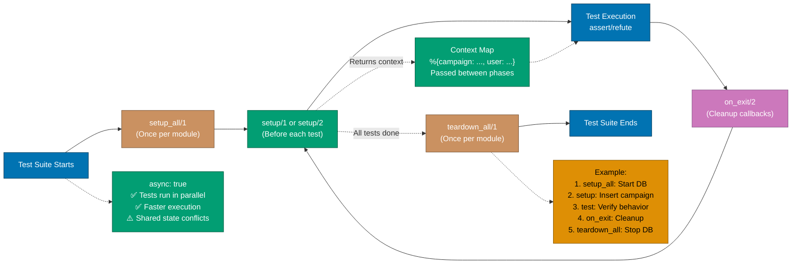
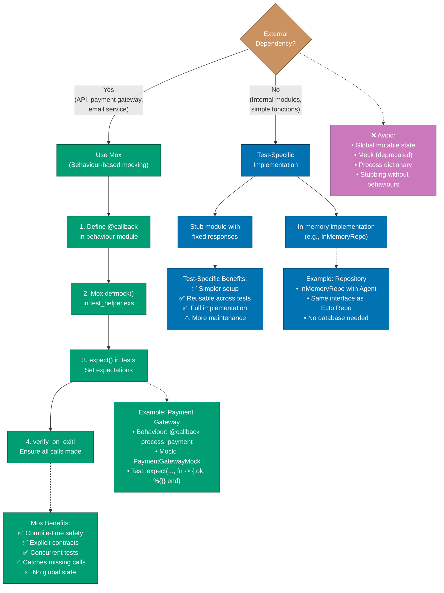
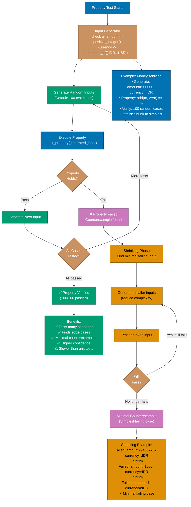

# Test-Driven Development

Test-Driven Development (TDD) in Elixir uses **ExUnit** for unit and integration testing, **Mox** for mocking, **StreamData** for property-based testing, and **ExMachina** for test data factories. The TDD cycle (Red-Green-Refactor) ensures code correctness, especially critical for financial applications handling donations and payments.

**Quick Reference**:

- [ExUnit Fundamentals](#exunit-fundamentals)
  - [Test Structure](#test-structure)
  - [Assertions](#assertions)
  - [Test Organization](#test-organization)
- [TDD Cycle](#tdd-cycle)
  - [Red Phase](#red-phase)
  - [Green Phase](#green-phase)
  - [Refactor Phase](#refactor-phase)
- [Testing Patterns](#testing-patterns)
  - [Unit Tests](#unit-tests)
  - [Integration Tests](#integration-tests)
  - [Doctests](#doctests)
- [Mocking with Mox](#mocking-with-mox)
  - [Defining Mocks](#defining-mocks)
  - [Using Mocks in Tests](#using-mocks-in-tests)
- [Property-Based Testing](#property-based-testing)
  - [StreamData Basics](#streamdata-basics)
  - [Generators](#generators)
  - [Properties](#properties)
- [Test Data with ExMachina](#test-data-with-exmachina)
  - [Defining Factories](#defining-factories)
  - [Using Factories](#using-factories)
- [Testing Phoenix Applications](#testing-phoenix-applications)
  - [Controller Tests](#controller-tests)
  - [LiveView Tests](#liveview-tests)
  - [Channel Tests](#channel-tests)
- [Financial Domain Examples](#financial-domain-examples)
- [Best Practices](#best-practices)
- [Testing Anti-patterns](#testing-anti-patterns)
- [Related Topics](#related-topics)
- [Sources](#sources)

## ExUnit Fundamentals

### Test Structure

Basic ExUnit test structure:

```elixir
defmodule FinancialPlatform.DonationsTest do
  use ExUnit.Case, async: true

  alias FinancialPlatform.Donations
  alias FinancialPlatform.Donations.Donation

  describe "create_donation/1" do
    test "creates donation with valid attributes" do
      attrs = %{
        campaign_id: "camp_123",
        amount: Decimal.new("10000"),
        currency: "IDR",
        donor_name: "John Doe",
        donor_email: "john@example.com"
      }

      assert {:ok, %Donation{} = donation} = Donations.create_donation(attrs)
      assert donation.amount == Decimal.new("10000")
      assert donation.currency == "IDR"
    end

    test "returns error with invalid attributes" do
      attrs = %{amount: Decimal.new("-100")}

      assert {:error, changeset} = Donations.create_donation(attrs)
      assert %{amount: ["must be greater than 0"]} = errors_on(changeset)
    end
  end

  defp errors_on(changeset) do
    Ecto.Changeset.traverse_errors(changeset, fn {msg, opts} ->
      Enum.reduce(opts, msg, fn {key, value}, acc ->
        String.replace(acc, "%{#{key}}", to_string(value))
      end)
    end)
  end
end
```

### Assertions

Common ExUnit assertions:

```elixir
defmodule AssertionsExampleTest do
  use ExUnit.Case

  test "equality assertions" do
    assert 1 + 1 == 2
    assert_in_delta 0.1 + 0.2, 0.3, 0.0001
  end

  test "boolean assertions" do
    assert true
    refute false
  end

  test "pattern matching assertions" do
    assert {:ok, result} = {:ok, 42}
    assert %{name: "John"} = %{name: "John", age: 30}
  end

  test "exception assertions" do
    assert_raise ArgumentError, fn ->
      raise ArgumentError, "error message"
    end

    assert_raise ArgumentError, "error message", fn ->
      raise ArgumentError, "error message"
    end
  end

  test "async message assertions" do
    send(self(), {:hello, "world"})

    assert_receive {:hello, msg}
    assert msg == "world"

    assert_received {:hello, "world"}
  end

  test "capture output" do
    import ExUnit.CaptureIO

    output = capture_io(fn ->
      IO.puts("Hello, World!")
    end)

    assert output == "Hello, World!\n"
  end
end
```

### Test Organization

Organize tests with setup and tags:

```elixir
defmodule FinancialPlatform.CampaignsTest do
  use FinancialPlatform.DataCase, async: true

  alias FinancialPlatform.Campaigns

  # Setup runs before each test
  setup do
    campaign = insert(:campaign)
    {:ok, campaign: campaign}
  end

  # Setup with pattern matching
  setup :create_active_campaign

  @tag :integration
  test "lists campaigns", %{campaign: campaign} do
    campaigns = Campaigns.list_campaigns()
    assert length(campaigns) == 1
    assert hd(campaigns).id == campaign.id
  end

  @tag :slow
  @tag timeout: 60_000
  test "processes large batch" do
    # Long-running test
  end

  @tag :skip
  test "not yet implemented" do
    flunk("TODO")
  end

  defp create_active_campaign(_context) do
    campaign = insert(:campaign, status: :active)
    {:ok, active_campaign: campaign}
  end
end
```

Run tests with tags:

```bash
# Run all tests
mix test

# Run specific test file
mix test test/financial_platform/donations_test.exs

# Run specific test
mix test test/financial_platform/donations_test.exs:42

# Run tests with tag
mix test --only integration

# Exclude tests with tag
mix test --exclude slow

# Run failed tests only
mix test --failed

# Watch mode (with mix_test_watch)
mix test.watch
```

The following diagram illustrates the ExUnit test execution phases, including setup, test execution, and teardown:



## TDD Cycle

### Red Phase

Write failing test first:

```elixir
# test/financial_platform/zakat_calculator_test.exs
defmodule FinancialPlatform.ZakatCalculatorTest do
  use ExUnit.Case, async: true

  alias FinancialPlatform.ZakatCalculator

  describe "calculate/2" do
    test "calculates 2.5% zakat when wealth exceeds nisab" do
      wealth = Money.new(100_000_000, :IDR)
      nisab = Money.new(85_000_000, :IDR)

      assert {:ok, zakat} = ZakatCalculator.calculate(wealth, nisab)
      assert Money.equal?(zakat, Money.new(2_500_000, :IDR))
    end

    test "returns error when wealth below nisab" do
      wealth = Money.new(50_000_000, :IDR)
      nisab = Money.new(85_000_000, :IDR)

      assert {:error, :below_nisab} = ZakatCalculator.calculate(wealth, nisab)
    end

    test "returns error when currencies don't match" do
      wealth = Money.new(100_000_000, :IDR)
      nisab = Money.new(85_000_000, :USD)

      assert {:error, :currency_mismatch} = ZakatCalculator.calculate(wealth, nisab)
    end
  end
end

# Run test - should fail (RED)
mix test
# ** (UndefinedFunctionError) function FinancialPlatform.ZakatCalculator.calculate/2 is undefined
```

### Green Phase

Write minimal code to pass:

```elixir
# lib/financial_platform/zakat_calculator.ex
defmodule FinancialPlatform.ZakatCalculator do
  @zakat_rate Decimal.new("0.025")

  def calculate(%Money{amount: wealth_amt, currency: c1}, %Money{amount: nisab_amt, currency: c2})
      when c1 == c2 do
    if Decimal.compare(wealth_amt, nisab_amt) == :gt do
      zakat_amount = Decimal.mult(wealth_amt, @zakat_rate)
      {:ok, Money.new(zakat_amount, c1)}
    else
      {:error, :below_nisab}
    end
  end

  def calculate(%Money{currency: c1}, %Money{currency: c2}) when c1 != c2 do
    {:error, :currency_mismatch}
  end
end

# Run test - should pass (GREEN)
mix test
# Finished in 0.1 seconds
# 3 tests, 0 failures
```

### Refactor Phase

Improve code while keeping tests green:

```elixir
defmodule FinancialPlatform.ZakatCalculator do
  @moduledoc """
  Calculates Zakat (Islamic alms) on wealth.
  """

  @zakat_rate Decimal.new("0.025")

  @type result :: {:ok, Money.t()} | {:error, :below_nisab | :currency_mismatch}

  @doc """
  Calculates 2.5% Zakat on wealth exceeding nisab threshold.
  """
  @spec calculate(Money.t(), Money.t()) :: result()
  def calculate(wealth, nisab) do
    with :ok <- validate_currency_match(wealth, nisab),
         :ok <- validate_above_nisab(wealth, nisab) do
      {:ok, calculate_zakat_amount(wealth)}
    end
  end

  defp validate_currency_match(%Money{currency: c}, %Money{currency: c}), do: :ok
  defp validate_currency_match(_, _), do: {:error, :currency_mismatch}

  defp validate_above_nisab(%Money{amount: w}, %Money{amount: n}) do
    if Decimal.compare(w, n) == :gt, do: :ok, else: {:error, :below_nisab}
  end

  defp calculate_zakat_amount(%Money{amount: amount, currency: currency}) do
    zakat = Decimal.mult(amount, @zakat_rate)
    Money.new(zakat, currency)
  end
end

# Run tests - still pass (REFACTOR)
mix test
# Finished in 0.1 seconds
# 3 tests, 0 failures
```

## Testing Patterns

### Unit Tests

Test pure functions in isolation:

```elixir
defmodule FinancialPlatform.MoneyTest do
  use ExUnit.Case, async: true

  alias FinancialPlatform.Money

  describe "add/2" do
    test "adds money with same currency" do
      m1 = Money.new(100, :IDR)
      m2 = Money.new(50, :IDR)

      assert Money.add(m1, m2) == Money.new(150, :IDR)
    end

    test "returns error with different currencies" do
      m1 = Money.new(100, :IDR)
      m2 = Money.new(50, :USD)

      assert {:error, :currency_mismatch} = Money.add(m1, m2)
    end
  end

  describe "multiply/2" do
    test "multiplies money by decimal" do
      money = Money.new(100, :IDR)
      multiplier = Decimal.new("0.025")

      result = Money.multiply(money, multiplier)

      assert Money.equal?(result, Money.new(Decimal.new("2.5"), :IDR))
    end
  end
end
```

### Integration Tests

Test modules working together:

```elixir
defmodule FinancialPlatform.DonationFlowTest do
  use FinancialPlatform.DataCase, async: true

  alias FinancialPlatform.{Campaigns, Donations, PaymentGateway}

  test "complete donation flow" do
    # Setup
    campaign = insert(:campaign, status: :active)

    # Create donation
    donation_attrs = %{
      campaign_id: campaign.id,
      amount: Decimal.new("10000"),
      currency: "IDR",
      donor_name: "John Doe",
      donor_email: "john@example.com"
    }

    assert {:ok, donation} = Donations.create_donation(donation_attrs)
    assert donation.status == :pending

    # Process payment
    assert {:ok, payment} = PaymentGateway.process_payment(donation)
    assert payment.status == :succeeded

    # Update donation status
    assert {:ok, completed} = Donations.mark_as_completed(donation, payment.id)
    assert completed.status == :completed

    # Verify campaign total updated
    updated_campaign = Campaigns.get_campaign!(campaign.id)
    expected_total = Decimal.add(campaign.total_raised || 0, donation.amount)
    assert Decimal.equal?(updated_campaign.total_raised, expected_total)
  end
end
```

### Doctests

Test code examples in documentation:

```elixir
defmodule FinancialPlatform.ZakatCalculator do
  @moduledoc """
  Calculates Zakat on wealth.

  ## Examples

      iex> wealth = Money.new(100_000_000, :IDR)
      iex> nisab = Money.new(85_000_000, :IDR)
      iex> {:ok, zakat} = FinancialPlatform.ZakatCalculator.calculate(wealth, nisab)
      iex> Money.to_string(zakat)
      "IDR 2,500,000"

      iex> wealth = Money.new(50_000_000, :IDR)
      iex> nisab = Money.new(85_000_000, :IDR)
      iex> FinancialPlatform.ZakatCalculator.calculate(wealth, nisab)
      {:error, :below_nisab}
  """

  def calculate(wealth, nisab) do
    # Implementation
  end
end

# Enable doctests in test file
defmodule FinancialPlatform.ZakatCalculatorTest do
  use ExUnit.Case, async: true
  doctest FinancialPlatform.ZakatCalculator
end
```

## Mocking with Mox

### Defining Mocks

Define behaviours and mocks:

```elixir
# Define behaviour
defmodule FinancialPlatform.PaymentGateway do
  @callback process_payment(donation :: map()) :: {:ok, map()} | {:error, atom()}
  @callback refund_payment(payment_id :: String.t()) :: {:ok, map()} | {:error, atom()}
end

# Define mock in test_helper.exs
Mox.defmock(FinancialPlatform.PaymentGatewayMock, for: FinancialPlatform.PaymentGateway)

# Configure which implementation to use
# config/test.exs
config :financial_platform, :payment_gateway, FinancialPlatform.PaymentGatewayMock

# config/prod.exs
config :financial_platform, :payment_gateway, FinancialPlatform.PaymentGateway.Stripe
```

### Using Mocks in Tests

Use Mox in tests:

```elixir
defmodule FinancialPlatform.DonationsTest do
  use FinancialPlatform.DataCase, async: true

  import Mox

  alias FinancialPlatform.Donations

  # Verify mocks after each test
  setup :verify_on_exit!

  describe "process_donation_payment/1" do
    test "processes payment successfully" do
      donation = insert(:donation, status: :pending)

      # Set expectation
      expect(FinancialPlatform.PaymentGatewayMock, :process_payment, fn ^donation ->
        {:ok, %{payment_id: "pay_123", status: :succeeded}}
      end)

      # Execute
      assert {:ok, updated} = Donations.process_donation_payment(donation)
      assert updated.status == :completed
      assert updated.payment_id == "pay_123"
    end

    test "handles payment failure" do
      donation = insert(:donation, status: :pending)

      expect(FinancialPlatform.PaymentGatewayMock, :process_payment, fn ^donation ->
        {:error, :insufficient_funds}
      end)

      assert {:error, :payment_failed} = Donations.process_donation_payment(donation)

      # Verify donation status unchanged
      reloaded = Repo.get!(Donation, donation.id)
      assert reloaded.status == :pending
    end

    test "handles multiple calls" do
      donation1 = insert(:donation)
      donation2 = insert(:donation)

      FinancialPlatform.PaymentGatewayMock
      |> expect(:process_payment, 2, fn _donation ->
        {:ok, %{payment_id: "pay_#{System.unique_integer()}", status: :succeeded}}
      end)

      assert {:ok, _} = Donations.process_donation_payment(donation1)
      assert {:ok, _} = Donations.process_donation_payment(donation2)
    end
  end
end
```

The following diagram compares different mocking strategies in Elixir testing, showing Mox-based mocking versus test-specific implementations:



## Property-Based Testing

### StreamData Basics

Property-based testing with StreamData:

```elixir
# Add to mix.exs
{:stream_data, "~> 1.1", only: :test}

defmodule FinancialPlatform.MoneyPropertyTest do
  use ExUnit.Case, async: true
  use ExUnitProperties

  alias FinancialPlatform.Money

  property "adding zero doesn't change amount" do
    check all amount <- positive_integer(),
              currency <- member_of([:IDR, :USD, :EUR]) do
      money = Money.new(amount, currency)
      zero = Money.new(0, currency)

      assert Money.add(money, zero) == money
    end
  end

  property "multiplication is commutative with rate" do
    check all amount <- positive_integer(),
              rate <- float(min: 0.0, max: 1.0),
              currency <- member_of([:IDR, :USD, :EUR]) do
      money = Money.new(amount, currency)

      result1 = Money.multiply(money, Decimal.from_float(rate))
      result2 = Money.multiply(money, Decimal.from_float(rate))

      assert Money.equal?(result1, result2)
    end
  end

  property "adding money is associative" do
    check all a <- positive_integer(),
              b <- positive_integer(),
              c <- positive_integer(),
              currency <- member_of([:IDR, :USD, :EUR]) do
      m1 = Money.new(a, currency)
      m2 = Money.new(b, currency)
      m3 = Money.new(c, currency)

      # (a + b) + c == a + (b + c)
      left = Money.add(Money.add(m1, m2), m3)
      right = Money.add(m1, Money.add(m2, m3))

      assert Money.equal?(left, right)
    end
  end
end
```

### Generators

Custom generators:

```elixir
defmodule FinancialPlatform.Generators do
  use ExUnitProperties

  def money_generator do
    gen all amount <- positive_integer(),
            currency <- member_of([:IDR, :USD, :EUR]) do
      Money.new(amount, currency)
    end
  end

  def donation_generator do
    gen all campaign_id <- string(:alphanumeric, min_length: 10, max_length: 20),
            amount <- positive_integer(),
            currency <- member_of([:IDR, :USD, :EUR]),
            donor_name <- string(:printable, min_length: 2, max_length: 100),
            donor_email <- email_generator() do
      %{
        campaign_id: campaign_id,
        amount: Money.new(amount, currency),
        donor_name: donor_name,
        donor_email: donor_email
      }
    end
  end

  defp email_generator do
    gen all name <- string(:alphanumeric, min_length: 1, max_length: 20),
            domain <- string(:alphanumeric, min_length: 3, max_length: 20) do
      "#{name}@#{domain}.com"
    end
  end
end
```

### Properties

Test properties:

```elixir
defmodule FinancialPlatform.DonationPropertyTest do
  use ExUnit.Case, async: true
  use ExUnitProperties

  import FinancialPlatform.Generators

  property "valid donations always succeed creation" do
    check all donation_attrs <- donation_generator() do
      case Donations.create_donation(donation_attrs) do
        {:ok, donation} ->
          assert donation.campaign_id == donation_attrs.campaign_id
          assert Money.equal?(donation.amount, donation_attrs.amount)

        {:error, changeset} ->
          # Should not reach here with valid data
          flunk("Expected success but got errors: #{inspect(changeset.errors)}")
      end
    end
  end

  property "zakat calculation never negative" do
    check all wealth <- positive_integer(),
              nisab <- positive_integer(),
              currency <- member_of([:IDR, :USD, :EUR]) do
      wealth_money = Money.new(wealth, currency)
      nisab_money = Money.new(nisab, currency)

      case ZakatCalculator.calculate(wealth_money, nisab_money) do
        {:ok, zakat} ->
          assert Money.positive?(zakat) or Money.zero?(zakat)

        {:error, _reason} ->
          # Error is acceptable (below nisab, currency mismatch)
          true
      end
    end
  end
end
```

The following diagram illustrates how property-based testing works with StreamData, including input generation, property verification, and shrinking on failure:



## Test Data with ExMachina

### Defining Factories

Define test data factories:

```elixir
# Add to mix.exs
{:ex_machina, "~> 2.7", only: :test}

# test/support/factory.ex
defmodule FinancialPlatform.Factory do
  use ExMachina.Ecto, repo: FinancialPlatform.Repo

  def campaign_factory do
    %FinancialPlatform.Campaigns.Campaign{
      name: sequence(:campaign_name, &"Campaign #{&1}"),
      goal_amount: Decimal.new("1000000"),
      currency: "IDR",
      start_date: Date.utc_today(),
      end_date: Date.add(Date.utc_today(), 30),
      status: :active
    }
  end

  def donation_factory do
    %FinancialPlatform.Donations.Donation{
      campaign: build(:campaign),
      amount: Decimal.new("10000"),
      currency: "IDR",
      donor_name: sequence(:donor_name, &"Donor #{&1}"),
      donor_email: sequence(:donor_email, &"donor#{&1}@example.com"),
      status: :pending
    }
  end

  def completed_donation_factory do
    struct!(
      donation_factory(),
      %{
        status: :completed,
        payment_id: sequence(:payment_id, &"pay_#{&1}")
      }
    )
  end

  def user_factory do
    %FinancialPlatform.Accounts.User{
      email: sequence(:email, &"user#{&1}@example.com"),
      password_hash: Bcrypt.hash_pwd_salt("password123"),
      role: :donor
    }
  end

  def admin_factory do
    struct!(user_factory(), %{role: :admin})
  end
end
```

### Using Factories

Use factories in tests:

```elixir
defmodule FinancialPlatform.CampaignsTest do
  use FinancialPlatform.DataCase, async: true

  import FinancialPlatform.Factory

  describe "list_campaigns/0" do
    test "returns all campaigns" do
      campaign1 = insert(:campaign)
      campaign2 = insert(:campaign)

      campaigns = Campaigns.list_campaigns()

      assert length(campaigns) == 2
      assert campaign1 in campaigns
      assert campaign2 in campaigns
    end

    test "returns active campaigns only" do
      active = insert(:campaign, status: :active)
      _completed = insert(:campaign, status: :completed)

      campaigns = Campaigns.list_active_campaigns()

      assert length(campaigns) == 1
      assert hd(campaigns).id == active.id
    end
  end

  describe "get_campaign_with_donations/1" do
    test "includes donations" do
      campaign = insert(:campaign)
      donation1 = insert(:donation, campaign: campaign)
      donation2 = insert(:donation, campaign: campaign)

      result = Campaigns.get_campaign_with_donations(campaign.id)

      assert length(result.donations) == 2
      assert donation1 in result.donations
      assert donation2 in result.donations
    end
  end

  describe "campaign statistics" do
    test "calculates total raised" do
      campaign = insert(:campaign)
      insert(:completed_donation, campaign: campaign, amount: Decimal.new("10000"))
      insert(:completed_donation, campaign: campaign, amount: Decimal.new("20000"))
      insert(:donation, campaign: campaign, status: :pending)

      stats = Campaigns.calculate_statistics(campaign)

      assert Decimal.equal?(stats.total_raised, Decimal.new("30000"))
      assert stats.donation_count == 2
    end
  end

  # Build without inserting
  test "build donation" do
    donation = build(:donation, amount: Decimal.new("50000"))

    assert donation.amount == Decimal.new("50000")
    refute donation.id  # Not inserted
  end

  # Build map
  test "params_for creates map" do
    params = params_for(:donation, amount: Decimal.new("50000"))

    assert is_map(params)
    assert params.amount == Decimal.new("50000")
    refute Map.has_key?(params, :id)
  end
end
```

## Testing Phoenix Applications

### Controller Tests

Test Phoenix controllers:

```elixir
defmodule FinancialWeb.DonationControllerTest do
  use FinancialWeb.ConnCase, async: true

  import FinancialPlatform.Factory

  describe "GET /api/donations" do
    test "lists all donations", %{conn: conn} do
      donation = insert(:donation)

      conn = get(conn, ~p"/api/donations")

      assert json_response(conn, 200)["data"] == [
               %{
                 "id" => donation.id,
                 "amount" => %{
                   "value" => Decimal.to_string(donation.amount),
                   "currency" => donation.currency
                 }
               }
             ]
    end

    test "filters by campaign_id", %{conn: conn} do
      campaign = insert(:campaign)
      donation = insert(:donation, campaign: campaign)
      _other = insert(:donation)

      conn = get(conn, ~p"/api/donations?campaign_id=#{campaign.id}")

      response = json_response(conn, 200)["data"]
      assert length(response) == 1
      assert hd(response)["id"] == donation.id
    end
  end

  describe "POST /api/donations" do
    test "creates donation with valid params", %{conn: conn} do
      campaign = insert(:campaign)

      params = %{
        "donation" => %{
          "campaign_id" => campaign.id,
          "amount" => "10000",
          "currency" => "IDR",
          "donor_name" => "John Doe",
          "donor_email" => "john@example.com"
        }
      }

      conn = post(conn, ~p"/api/donations", params)

      assert %{"id" => id} = json_response(conn, 201)["data"]
      assert Donations.get_donation(id)
    end

    test "returns errors with invalid params", %{conn: conn} do
      params = %{"donation" => %{"amount" => "-100"}}

      conn = post(conn, ~p"/api/donations", params)

      assert json_response(conn, 422)["errors"] != %{}
    end
  end

  describe "authentication required" do
    @tag :authenticated
    test "requires authentication", %{conn: conn} do
      conn = get(conn, ~p"/api/donations")

      assert json_response(conn, 401)
    end
  end
end
```

### LiveView Tests

Test Phoenix LiveView:

```elixir
defmodule FinancialWeb.CampaignLive.IndexTest do
  use FinancialWeb.ConnCase, async: true

  import Phoenix.LiveViewTest
  import FinancialPlatform.Factory

  test "displays campaigns", %{conn: conn} do
    campaign = insert(:campaign)

    {:ok, _view, html} = live(conn, ~p"/campaigns")

    assert html =~ campaign.name
  end

  test "creates campaign", %{conn: conn} do
    {:ok, view, _html} = live(conn, ~p"/campaigns")

    assert view
           |> form("#campaign-form", campaign: %{name: "New Campaign"})
           |> render_submit()

    assert_redirect(view, ~p"/campaigns/#{campaign_id}")
  end

  test "validates form", %{conn: conn} do
    {:ok, view, _html} = live(conn, ~p"/campaigns/new")

    html =
      view
      |> form("#campaign-form", campaign: %{name: ""})
      |> render_change()

    assert html =~ "can&#39;t be blank"
  end

  test "updates on pubsub event", %{conn: conn} do
    campaign = insert(:campaign)

    {:ok, view, _html} = live(conn, ~p"/campaigns/#{campaign}")

    # Simulate pubsub event
    send(view.pid, {:campaign_updated, %{campaign | name: "Updated Name"}})

    assert render(view) =~ "Updated Name"
  end
end
```

### Channel Tests

Test Phoenix Channels:

```elixir
defmodule FinancialWeb.CampaignChannelTest do
  use FinancialWeb.ChannelCase, async: true

  import FinancialPlatform.Factory

  setup do
    campaign = insert(:campaign)
    user = insert(:user)

    socket = socket(FinancialWeb.UserSocket, "user:#{user.id}", %{current_user: user})

    {:ok, socket: socket, campaign: campaign}
  end

  test "joins campaign channel", %{socket: socket, campaign: campaign} do
    {:ok, _, socket} = subscribe_and_join(socket, "campaign:#{campaign.id}", %{})

    assert_push "campaign_data", %{campaign: _campaign}
  end

  test "broadcasts new donation", %{socket: socket, campaign: campaign} do
    {:ok, _, socket} = subscribe_and_join(socket, "campaign:#{campaign.id}", %{})

    push(socket, "new_donation", %{"amount" => 10000})

    assert_broadcast "donation_received", %{donation: _donation}
  end

  test "unauthorized join", %{socket: socket} do
    assert {:error, %{reason: "unauthorized"}} =
             subscribe_and_join(socket, "campaign:unauthorized", %{})
  end
end
```

## Financial Domain Examples

Complete TDD workflow for financial feature:

```elixir
# Step 1: Write failing test (RED)
defmodule FinancialPlatform.DonationAllocationTest do
  use ExUnit.Case, async: true

  alias FinancialPlatform.DonationAllocation

  test "allocates donation to multiple causes" do
    donation = %{amount: Money.new(100_000, :IDR)}

    allocation_rules = [
      %{cause: "education", percentage: 40},
      %{cause: "healthcare", percentage: 30},
      %{cause: "infrastructure", percentage: 30}
    ]

    assert {:ok, allocations} = DonationAllocation.allocate(donation, allocation_rules)

    assert length(allocations) == 3
    assert %{cause: "education", amount: Money.new(40_000, :IDR)} in allocations
    assert %{cause: "healthcare", amount: Money.new(30_000, :IDR)} in allocations
    assert %{cause: "infrastructure", amount: Money.new(30_000, :IDR)} in allocations
  end
end

# Step 2: Implement (GREEN)
defmodule FinancialPlatform.DonationAllocation do
  def allocate(donation, allocation_rules) do
    total_percentage = Enum.sum(Enum.map(allocation_rules, & &1.percentage))

    if total_percentage != 100 do
      {:error, :invalid_total_percentage}
    else
      allocations =
        Enum.map(allocation_rules, fn rule ->
          amount = calculate_allocation(donation.amount, rule.percentage)
          %{cause: rule.cause, amount: amount}
        end)

      {:ok, allocations}
    end
  end

  defp calculate_allocation(total, percentage) do
    multiplier = Decimal.div(Decimal.new(percentage), Decimal.new(100))
    Money.multiply(total, multiplier)
  end
end

# Step 3: Add more tests
test "returns error when percentages don't sum to 100" do
  donation = %{amount: Money.new(100_000, :IDR)}
  rules = [%{cause: "education", percentage: 50}]

  assert {:error, :invalid_total_percentage} = DonationAllocation.allocate(donation, rules)
end

# Step 4: Refactor
# Extract validation, add type specs, improve naming
```

## Best Practices

1. **Write tests first** - TDD cycle ensures testable code
2. **Use async tests** - Run tests concurrently when possible
3. **Use factories** - ExMachina for consistent test data
4. **Mock external services** - Use Mox for boundaries
5. **Test properties** - StreamData for edge cases
6. **Use descriptive names** - Tests are documentation
7. **One assertion per test** - Clear failure messages
8. **Test happy and sad paths** - Both success and failure

## Testing Anti-patterns

### 1. Testing Implementation Details

```elixir
# ❌ BAD - testing private functions
test "calculate_percentage_multiplier" do
  assert DonationAllocation.calculate_percentage_multiplier(25) == 0.25
end

# ✅ GOOD - testing public behavior
test "allocates 25% correctly" do
  donation = %{amount: Money.new(100, :IDR)}
  rules = [%{cause: "education", percentage: 25}]

  {:ok, [allocation]} = DonationAllocation.allocate(donation, rules)

  assert allocation.amount == Money.new(25, :IDR)
end
```

### 2. Flaky Tests

```elixir
# ❌ BAD - depends on timing
test "processes donation within 100ms" do
  donation = create_donation()
  start = System.monotonic_time(:millisecond)

  process_donation(donation)

  duration = System.monotonic_time(:millisecond) - start
  assert duration < 100  # Flaky!
end

# ✅ GOOD - test behavior, not timing
test "processes donation successfully" do
  donation = create_donation()

  assert {:ok, processed} = process_donation(donation)
  assert processed.status == :completed
end
```

### 3. Shared Mutable State

```elixir
# ❌ BAD - tests share state
setup_all do
  campaign = create_campaign()
  {:ok, campaign: campaign}
end

test "updates campaign", %{campaign: campaign} do
  update_campaign(campaign, %{name: "Updated"})
end

test "deletes campaign", %{campaign: campaign} do
  delete_campaign(campaign)  # Affects other tests!
end

# ✅ GOOD - isolated state
setup do
  campaign = create_campaign()
  {:ok, campaign: campaign}
end
```

## TDD Checklist

### Red Phase (Write Failing Test)

- [ ] Test written before implementation
- [ ] Test fails for the right reason (expected error)
- [ ] Test is focused and tests one behavior
- [ ] Test has clear, descriptive name using describe/test blocks
- [ ] Assertions use pattern matching where appropriate

### Green Phase (Make Test Pass)

- [ ] Simplest implementation that makes test pass
- [ ] No premature optimization
- [ ] All tests still passing (mix test)
- [ ] Code follows Elixir idioms (immutability, pattern matching)
- [ ] Type specs added (@spec) where appropriate

### Refactor Phase

- [ ] Code is clean and maintainable
- [ ] No duplication (DRY principle)
- [ ] All tests still passing after refactoring
- [ ] Test coverage maintained or improved
- [ ] Module documentation (@moduledoc) added

### Test Quality

- [ ] Tests are independent (no shared mutable state)
- [ ] Tests are repeatable (deterministic, no randomness)
- [ ] Tests are fast (async: true for independent tests)
- [ ] Test setup/teardown properly managed (setup/on_exit)
- [ ] Mock/stub dependencies using Mox (behavior-based)

### ExUnit Best Practices

- [ ] Using ExUnit.Case with async: true when possible
- [ ] describe blocks group related tests logically
- [ ] Fixtures defined in setup callbacks
- [ ] Tags used for organizing tests (@tag :integration, @tag :slow)
- [ ] Pattern matching in assertions (assert {:ok, result} = function())

### Financial Domain Testing

- [ ] Zakat calculations tested with edge cases (nisab threshold, exact boundary)
- [ ] Decimal precision tested (Money.t() type, no float errors)
- [ ] Murabaha contract validation tested (profit margins, down payments)
- [ ] Audit trail creation verified in tests
- [ ] Currency handling tested (Money.new with currency matching)

## Related Topics

- [Behaviour-Driven Development](ex-soen-prla-el__behaviour-driven-development.md) - BDD with Gherkin
- [Linting and Formatting](ex-soen-prla-el__linting-and-formatting.md) - Code quality
- [Best Practices](ex-soen-prla-el__best-practices.md) - Testing best practices
- [Web Services](ex-soen-prla-el__web-services.md) - Testing Phoenix apps

## Sources

- [ExUnit Documentation](https://hexdocs.pm/ex_unit/)
- [Mox Documentation](https://hexdocs.pm/mox/)
- [StreamData Documentation](https://hexdocs.pm/stream_data/)
- [ExMachina Documentation](https://hexdocs.pm/ex_machina/)
- [Testing Phoenix Applications](https://hexdocs.pm/phoenix/testing.html)
- [Property-Based Testing](https://pragprog.com/titles/fhproper/property-based-testing-with-proper-erlang-and-elixir/)

---

**Last Updated**: 2026-01-23
**Elixir Version**: 1.12+ (baseline), 1.17+ (recommended), 1.19.0 (latest)
**Maintainers**: Platform Documentation Team
