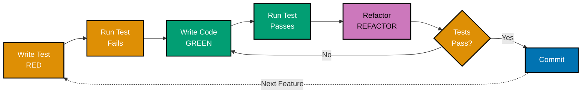

## 📚 Prerequisite Knowledge

**REQUIRED**: You MUST understand Elixir fundamentals from [AyoKoding Elixir Learning Path](../../../../../apps/ayokoding-web/content/en/learn/software-engineering/programming-languages/elixir/_index.md) before using these standards.

**This document is OSE Platform-specific**, not an Elixir tutorial. It assumes:

- Elixir syntax and language features (pattern matching, pipelines, processes)
- Mix project structure and configuration
- Basic understanding of testing concepts
- Familiarity with functional programming principles

If you need to learn Elixir fundamentals first, visit the AyoKoding Elixir learning path.

## 🎯 Purpose

This document defines **authoritative testing standards** for Elixir development in the OSE Platform. These are prescriptive rules that MUST be followed across all Elixir projects to ensure consistent, maintainable, and reliable test suites.

**Target Audience**: OSE Platform Elixir developers, technical reviewers, QA engineers

**Scope**: Test-Driven Development (TDD) practices, Behaviour-Driven Development (BDD) practices, property-based testing, mocking patterns, integration testing, test organization, and quality standards

**Quick Reference**: [Part 1: Unit Testing](#part-1-unit-testing-with-exunit) | [Part 2: Doctests](#part-2-doctests) | [Part 3: Property-Based Testing](#part-3-property-based-testing) | [Part 4: TDD](#part-4-test-driven-development-tdd) | [Part 5: BDD](#part-5-behaviour-driven-development-bdd)

## ⚙️ Alignment with Software Engineering Principles

These testing standards directly support OSE Platform's [Software Engineering Principles](../../../../../governance/principles/README.md):

- **[Automation Over Manual](../../../../../governance/principles/software-engineering/automation-over-manual.md)**: Automated test suites replace manual validation
- **[Explicit Over Implicit](../../../../../governance/principles/software-engineering/explicit-over-implicit.md)**: Tests explicitly document expected behavior and edge cases
- **[Reproducibility](../../../../../governance/principles/software-engineering/reproducibility.md)**: Tests provide consistent, repeatable validation across environments

All testing practices in this document MUST align with these foundational principles.

---

### 📋 Overview

ExUnit is Elixir's built-in testing framework. All unit and integration tests MUST use ExUnit with proper organization, naming conventions, and assertion patterns.

### Test File Naming

**MUST** suffix test files with `_test.exs`.

**Format**: `[module_under_test]_test.exs`

**Examples**:

- ✅ `zakat_calculator_test.exs` (tests `ZakatCalculator` module)
- ✅ `donation_service_test.exs` (tests `DonationService` module)
- ✅ `payment_repository_test.exs` (tests `PaymentRepository` module)

**Prohibited**:

- ❌ `test_zakat_calculator.exs` (wrong prefix)
- ❌ `zakat_calculator_tests.exs` (wrong suffix - plural)
- ❌ `zakat_calculator_unit_test.exs` (redundant - all files in `test/` are tests)

### Test Module Naming

**MUST** suffix test modules with `Test`.

**Format**: `[ModuleUnderTest]Test`

**Correct**:

```elixir
defmodule FinancialPlatform.ZakatCalculatorTest do
  use ExUnit.Case, async: true

  alias FinancialPlatform.ZakatCalculator

  test "calculates 2.5% zakat when wealth exceeds nisab" do
    # Test implementation
  end
end
```

**Prohibited**:

- ❌ `TestZakatCalculator` (wrong prefix)
- ❌ `ZakatCalculatorTests` (wrong suffix - plural)

### Async Testing

**MUST** use `async: true` when tests are independent (no shared state).

**Correct** (tests isolated, safe to run concurrently):

```elixir
defmodule FinancialPlatform.MoneyTest do
  use ExUnit.Case, async: true  # CORRECT - no shared state

  test "adds money with same currency" do
    m1 = Money.new(100, :IDR)
    m2 = Money.new(50, :IDR)
    assert Money.add(m1, m2) == Money.new(150, :IDR)
  end
end
```

**Prohibited** (tests share database, cannot run concurrently):

```elixir
defmodule FinancialPlatform.DonationTest do
  use ExUnit.Case, async: true  # WRONG - tests share database

  test "creates donation" do
    Repo.insert!(%Donation{})  # Shared database state
  end
end
```

**Correct** (tests share database, must run serially):

```elixir
defmodule FinancialPlatform.DonationTest do
  use FinancialPlatform.DataCase, async: false  # CORRECT

  test "creates donation" do
    Repo.insert!(%Donation{})
  end
end
```

**Rationale**: `async: true` enables parallel test execution, significantly reducing test suite runtime. Use `async: false` only when tests share mutable state (e.g., database, ETS tables, global processes).

### Setup and Context

**MUST** use `setup` callbacks for test initialization (not inline setup in test bodies).

**Correct**:

```elixir
defmodule FinancialPlatform.CampaignsTest do
  use FinancialPlatform.DataCase, async: true

  setup do
    campaign = insert(:campaign, status: :active)
    {:ok, campaign: campaign}
  end

  test "lists active campaigns", %{campaign: campaign} do
    campaigns = Campaigns.list_campaigns()
    assert length(campaigns) == 1
    assert hd(campaigns).id == campaign.id
  end
end
```

**Prohibited** (setup duplicated in every test):

```elixir
test "lists active campaigns" do
  campaign = insert(:campaign, status: :active)  # WRONG - duplicated setup
  campaigns = Campaigns.list_campaigns()
  assert length(campaigns) == 1
end
```

### Assertions

**MUST** use ExUnit's built-in assertions (not custom assertion functions).

**Correct**:

```elixir
test "validates donation amount" do
  assert {:ok, donation} = Donations.create_donation(attrs)
  assert donation.amount == Decimal.new("10000")
  assert_raise ArgumentError, fn -> Donations.create_donation(nil) end
end
```

**Prohibited** (custom assertion wrapper):

```elixir
test "validates donation amount" do
  assert_donation_created(attrs)  # WRONG - custom assertion
end
```

**Rationale**: ExUnit assertions provide clear error messages and stack traces. Custom wrappers obscure failure details.

### Test Coverage

**MUST** achieve >80% line coverage for domain logic.

**Coverage enforcement**: CI/CD pipeline SHOULD fail if coverage drops below threshold.

**Command**:

```bash
mix test --cover
```

**Excluding files from coverage**:

```elixir
# mix.exs
def project do
  [
    test_coverage: [
      ignore_modules: [~r/\.Repo$/, ~r/\.Endpoint$/]
    ]
  ]
end
```

---

### Purpose

Doctests MUST be included for all public functions to serve as executable documentation.

### Doctest Format

**MUST** use `iex>` prompt format with explicit module qualification.

**Correct**:

```elixir
defmodule FinancialPlatform.ZakatCalculator do
  @moduledoc """
  Calculates Zakat (Islamic alms) on wealth.
  """

  @doc """
  Calculates 2.5% Zakat on wealth exceeding nisab threshold.

  ## Examples

      iex> wealth = Money.new(100_000_000, :IDR)
      iex> nisab = Money.new(85_000_000, :IDR)
      iex> {:ok, zakat} = FinancialPlatform.ZakatCalculator.calculate(wealth, nisab)
      iex> Money.to_string(zakat)
      "IDR 2,500,000"

      iex> wealth = Money.new(50_000_000, :IDR)
      iex> nisab = Money.new(85_000_000, :IDR)
      iex> FinancialPlatform.ZakatCalculator.calculate(wealth, nisab)
      {:error, :below_nisab}
  """
  @spec calculate(Money.t(), Money.t()) :: {:ok, Money.t()} | {:error, atom()}
  def calculate(wealth, nisab) do
    # Implementation
  end
end
```

**Prohibited** (missing module qualification):

```elixir
## Examples

    iex> calculate(wealth, nisab)  # WRONG - missing module name
    {:ok, zakat}
```

### Enabling Doctests

**MUST** enable doctests in test files:

```elixir
defmodule FinancialPlatform.ZakatCalculatorTest do
  use ExUnit.Case, async: true
  doctest FinancialPlatform.ZakatCalculator  # REQUIRED
end
```

### Doctest Organization

**MUST** group related doctests by scenario (happy path, edge cases, errors).

**Structure**:

```elixir
@doc """
Function description.

## Examples

Happy path:

    iex> valid_case()
    {:ok, result}

Edge cases:

    iex> boundary_case()
    {:ok, result}

Error cases:

    iex> invalid_case()
    {:error, :reason}
"""
```

---

### When to Use

**SHOULD** use property-based testing (StreamData) for complex logic with many input combinations.

**Use cases**:

- Mathematical operations (associativity, commutativity, identity)
- Data transformations (round-trip encoding/decoding)
- Business rules with multiple conditions

### StreamData Setup

**Dependency**:

```elixir
# mix.exs
{:stream_data, "~> 1.1", only: :test}
```

### Property Definition

**MUST** use descriptive property names describing the invariant.

**Correct**:

```elixir
defmodule FinancialPlatform.MoneyPropertyTest do
  use ExUnit.Case, async: true
  use ExUnitProperties

  property "adding zero doesn't change amount" do
    check all amount <- positive_integer(),
              currency <- member_of([:IDR, :USD, :EUR]) do
      money = Money.new(amount, currency)
      zero = Money.new(0, currency)

      assert Money.add(money, zero) == money
    end
  end

  property "addition is associative" do
    check all a <- positive_integer(),
              b <- positive_integer(),
              c <- positive_integer(),
              currency <- member_of([:IDR, :USD, :EUR]) do
      m1 = Money.new(a, currency)
      m2 = Money.new(b, currency)
      m3 = Money.new(c, currency)

      # (a + b) + c == a + (b + c)
      left = Money.add(Money.add(m1, m2), m3)
      right = Money.add(m1, Money.add(m2, m3))

      assert Money.equal?(left, right)
    end
  end
end
```

### Custom Generators

**SHOULD** extract custom generators to dedicated modules for reuse.

**Correct**:

```elixir
defmodule FinancialPlatform.Generators do
  use ExUnitProperties

  def money_generator do
    gen all amount <- positive_integer(),
            currency <- member_of([:IDR, :USD, :EUR]) do
      Money.new(amount, currency)
    end
  end

  def donation_generator do
    gen all campaign_id <- string(:alphanumeric, min_length: 10),
            amount <- positive_integer(),
            currency <- member_of([:IDR, :USD, :EUR]) do
      %{
        campaign_id: campaign_id,
        amount: Money.new(amount, currency),
        donor_email: email_generator()
      }
    end
  end
end
```

---

### 🔄 TDD Cycle

**MUST** follow Red-Green-Refactor cycle.



### Red Phase (Write Failing Test)

**MUST** write test before implementation.

**Example**:

```elixir
# test/financial_platform/zakat_calculator_test.exs
defmodule FinancialPlatform.ZakatCalculatorTest do
  use ExUnit.Case, async: true

  alias FinancialPlatform.ZakatCalculator

  describe "calculate/2" do
    test "calculates 2.5% zakat when wealth exceeds nisab" do
      wealth = Money.new(100_000_000, :IDR)
      nisab = Money.new(85_000_000, :IDR)

      assert {:ok, zakat} = ZakatCalculator.calculate(wealth, nisab)
      assert Money.equal?(zakat, Money.new(2_500_000, :IDR))
    end

    test "returns error when wealth below nisab" do
      wealth = Money.new(50_000_000, :IDR)
      nisab = Money.new(85_000_000, :IDR)

      assert {:error, :below_nisab} = ZakatCalculator.calculate(wealth, nisab)
    end
  end
end

# ** (UndefinedFunctionError) function ZakatCalculator.calculate/2 is undefined
```

### Green Phase (Make Test Pass)

**MUST** write minimal implementation to pass test.

**Example**:

```elixir
# lib/financial_platform/zakat_calculator.ex
defmodule FinancialPlatform.ZakatCalculator do
  @zakat_rate Decimal.new("0.025")

  def calculate(%Money{amount: wealth_amt, currency: c1}, %Money{amount: nisab_amt, currency: c2})
      when c1 == c2 do
    if Decimal.compare(wealth_amt, nisab_amt) == :gt do
      zakat_amount = Decimal.mult(wealth_amt, @zakat_rate)
      {:ok, Money.new(zakat_amount, c1)}
    else
      {:error, :below_nisab}
    end
  end
end

# 2 tests, 0 failures
```

### Refactor Phase (Improve While Green)

**MUST** refactor with tests passing.

**Example**:

```elixir
defmodule FinancialPlatform.ZakatCalculator do
  @moduledoc """
  Calculates Zakat (Islamic alms) on wealth.
  """

  @zakat_rate Decimal.new("0.025")

  @type result :: {:ok, Money.t()} | {:error, :below_nisab | :currency_mismatch}

  @spec calculate(Money.t(), Money.t()) :: result()
  def calculate(wealth, nisab) do
    with :ok <- validate_currency_match(wealth, nisab),
         :ok <- validate_above_nisab(wealth, nisab) do
      {:ok, calculate_zakat_amount(wealth)}
    end
  end

  defp validate_currency_match(%Money{currency: c}, %Money{currency: c}), do: :ok
  defp validate_currency_match(_, _), do: {:error, :currency_mismatch}

  defp validate_above_nisab(%Money{amount: w}, %Money{amount: n}) do
    if Decimal.compare(w, n) == :gt, do: :ok, else: {:error, :below_nisab}
  end

  defp calculate_zakat_amount(%Money{amount: amount, currency: currency}) do
    zakat = Decimal.mult(amount, @zakat_rate)
    Money.new(zakat, currency)
  end
end

# 2 tests, 0 failures
```

### Mocking with Mox

**MUST** use Mox for behavior-based mocking (not Meck or process dictionary).

**Setup**:

```elixir
# Define behaviour
defmodule FinancialPlatform.PaymentGateway do
  @callback process_payment(donation :: map()) :: {:ok, map()} | {:error, atom()}
end

# Define mock in test_helper.exs
Mox.defmock(FinancialPlatform.PaymentGatewayMock, for: FinancialPlatform.PaymentGateway)

# config/test.exs
config :financial_platform, :payment_gateway, FinancialPlatform.PaymentGatewayMock
```

**Usage**:

```elixir
defmodule FinancialPlatform.DonationsTest do
  use FinancialPlatform.DataCase, async: true

  import Mox

  setup :verify_on_exit!  # REQUIRED - verify all expectations met

  test "processes payment successfully" do
    donation = insert(:donation, status: :pending)

    expect(FinancialPlatform.PaymentGatewayMock, :process_payment, fn ^donation ->
      {:ok, %{payment_id: "pay_123", status: :succeeded}}
    end)

    assert {:ok, updated} = Donations.process_donation_payment(donation)
    assert updated.status == :completed
  end
end
```

**Prohibited**:

- ❌ Meck (deprecated, not concurrency-safe)
- ❌ Process dictionary for stubbing
- ❌ Global mutable state

---

### Purpose

**SHOULD** use BDD (White Bread + Gherkin) for acceptance tests with business stakeholders.

### When to Use BDD

**Use cases**:

- Acceptance criteria validation
- Business rule specification
- Stakeholder collaboration
- Living documentation

**Not recommended for**:

- Unit tests (use ExUnit directly)
- Technical integration tests (use ExUnit + DataCase)

### White Bread Setup

**Dependencies**:

```elixir
# mix.exs
{:white_bread, "~> 4.5", only: :test}
```

**Configuration**:

```elixir
# config/test.exs
config :white_bread,
  features_path: "test/features",
  run_options: [
    tags: ["~@wip"],  # Skip @wip tagged scenarios
    colors: [
      passed: :green,
      skipped: :yellow,
      failed: :red
    ]
  ]
```

**Initialize**:

```bash
mix white_bread.init
# Creates test/features/ and test/features/contexts/
```

### Feature File Structure

**Location**: `test/features/[domain]/[feature_name].feature`

**Format**:

```gherkin
Feature: Donation Processing
  As a donor
  I want to make donations to campaigns
  So that I can support causes I care about

  Scenario: Successful donation
    Given a campaign "Education Fund" with goal "1000000 IDR"
    And the campaign is active
    When I donate "10000 IDR" to "Education Fund"
    Then my donation should be recorded
    And the campaign total should increase by "10000 IDR"
    And I should receive a confirmation email

  Scenario: Donation to inactive campaign
    Given a campaign "Old Campaign" that is closed
    When I try to donate "10000 IDR" to "Old Campaign"
    Then I should see an error "Campaign is not active"
    And no donation should be created
```

### Step Definitions

**Location**: `test/features/contexts/[context_name]_context.exs`

**Structure**:

```elixir
defmodule FinancialPlatform.Features.DonationContext do
  use WhiteBread.Context

  alias FinancialPlatform.{Repo, Campaigns, Donations}

  defstruct [:current_campaign, :current_donation, :last_error]

  def init(_) do
    :ok = Ecto.Adapters.SQL.Sandbox.checkout(Repo)
    %__MODULE__{}
  end

  # Given steps (preconditions)
  given_ ~r/^a campaign "(?<name>[^"]+)" exists$/, fn state, %{name: name} ->
    campaign = Campaigns.create_campaign!(%{name: name})
    %{state | current_campaign: campaign}
  end

  # When steps (actions)
  when_ ~r/^I donate "(?<amount>[^"]+)" to "(?<campaign>[^"]+)"$/,
    fn state, %{amount: amount, campaign: campaign_name} ->
      [amount_str, currency] = String.split(amount, " ")

      case Donations.create_donation(%{
             campaign_id: state.current_campaign.id,
             amount: Decimal.new(amount_str),
             currency: currency
           }) do
        {:ok, donation} -> %{state | current_donation: donation}
        {:error, error} -> %{state | last_error: error}
      end
    end

  # Then steps (expectations)
  then_ ~r/^my donation should be recorded$/, fn state ->
    assert state.current_donation
    {:ok, state}
  end

  then_ ~r/^I should see an error "(?<message>[^"]+)"$/, fn state, %{message: message} ->
    assert state.last_error
    assert error_message(state.last_error) =~ message
    {:ok, state}
  end

  defp error_message(%Ecto.Changeset{} = changeset) do
    Ecto.Changeset.traverse_errors(changeset, fn {msg, _} -> msg end)
    |> Enum.map_join(", ", fn {field, messages} ->
      "#{field}: #{Enum.join(messages, ", ")}"
    end)
  end
end
```

### Scenario Outlines

**MUST** use Scenario Outlines for multiple test cases with same structure.

**Example**:

```gherkin
Scenario Outline: Calculate Zakat for different wealth amounts
  Given I have wealth of "<wealth>" in "<currency>"
  And the nisab threshold is "<nisab>" in "<currency>"
  When I calculate Zakat
  Then I should get "<zakat>" or see "<error>"

  Examples: Wealth above nisab
    | wealth     | nisab      | currency | zakat    | error |
    | 100000000  | 85000000   | IDR      | 2500000  |       |
    | 200000000  | 85000000   | IDR      | 5000000  |       |

  Examples: Wealth below nisab
    | wealth     | nisab      | currency | zakat    | error           |
    | 50000000   | 85000000   | IDR      |          | below nisab     |
```

### BDD Anti-patterns

**Prohibited**:

```gherkin
# ❌ BAD - exposes implementation
Scenario: Create donation
  Given I open the database connection
  And I insert a campaign record with id "123"
  When I call Donations.create_donation()
  Then the donations table should have one row

# ✅ GOOD - describes behavior
Scenario: Create donation
  Given a campaign "Education Fund" exists
  When I donate "10000 IDR" to "Education Fund"
  Then my donation should be recorded
```

---

### Directory Structure

```
test/
├── [module]_test.exs         # Unit tests
├── integration/
│   └── [module]_integration_test.exs
├── features/                  # BDD features
│   ├── donations/
│   │   └── create_donation.feature
│   └── contexts/
│       └── donation_context.exs
└── support/
    ├── data_case.ex          # Database test helpers
    ├── conn_case.ex          # Phoenix controller test helpers
    └── factory.ex            # ExMachina factories
```

### Test Tags

**MUST** use tags for organizing tests.

**Examples**:

```elixir
@tag :integration
test "processes payment with external API" do
  # Integration test
end

@tag :slow
@tag timeout: 60_000
test "processes large batch" do
  # Long-running test
end

@tag :skip
test "not yet implemented" do
  flunk("TODO")
end
```

**Run by tag**:

```bash
mix test --only integration
mix test --exclude slow
```

---

### Test Quality (MUST)

- [ ] Tests written before implementation (TDD)
- [ ] Test names describe behavior, not implementation
- [ ] `async: true` used when tests are independent
- [ ] Setup callbacks used for test initialization
- [ ] ExUnit assertions used (not custom wrappers)
- [ ] > 80% line coverage for domain logic

### Doctests (MUST for public functions)

- [ ] Doctests included for all public functions
- [ ] Examples use explicit module qualification
- [ ] Examples cover happy path, edge cases, errors
- [ ] `doctest ModuleName` enabled in test file

### Property-Based Testing (SHOULD for complex logic)

- [ ] StreamData used for mathematical operations
- [ ] Custom generators extracted to dedicated modules
- [ ] Properties describe invariants clearly

### TDD (MUST follow cycle)

- [ ] Red phase: Failing test written first
- [ ] Green phase: Minimal implementation passes test
- [ ] Refactor phase: Code improved with tests passing
- [ ] Mox used for behavior-based mocking
- [ ] `verify_on_exit!` used to verify mock expectations

### BDD (SHOULD for acceptance tests)

- [ ] White Bread used for Gherkin scenarios
- [ ] Feature files use natural language (no implementation details)
- [ ] Given-When-Then structure followed
- [ ] Step definitions reusable across scenarios
- [ ] Scenarios reviewed by business stakeholders

---

## Enforcement

Testing standards are enforced through:

- **Mix test** - Runs unit and integration tests
- **Code coverage** - Measures >80% threshold
- **Code reviews** - Human verification of test quality
- **CI/CD pipeline** - Blocks merges if tests fail or coverage drops

---

## Learning Resources

For learning Elixir fundamentals and concepts referenced in these standards, see:

- **[Elixir Learning Path](../../../../../apps/ayokoding-web/content/en/learn/software-engineering/programming-languages/elixir/_index.md)** - Complete Elixir learning journey
- **[Elixir By Example](../../../../../apps/ayokoding-web/content/en/learn/software-engineering/programming-languages/elixir/by-example/_index.md)** - Annotated code examples
- **[Elixir In Practice](../../../../../apps/ayokoding-web/content/en/learn/software-engineering/programming-languages/elixir/in-the-field/_index.md)** - TDD and BDD practices

**Note**: These standards assume you've learned Elixir basics from ayokoding-web. We don't re-explain fundamental concepts here.

---

## Related Standards

- [Elixir Best Practices](./ex-soen-prla-el__coding-standards.md) - Testing best practices
- [Elixir Anti-patterns](./ex-soen-prla-el__coding-standards.md) - Testing anti-patterns to avoid

---

**Maintainers**: Platform Documentation Team
**Last Updated**: 2026-02-05
**Elixir Version**: 1.12+ (baseline), 1.17+ (recommended), 1.19.0 (latest)
