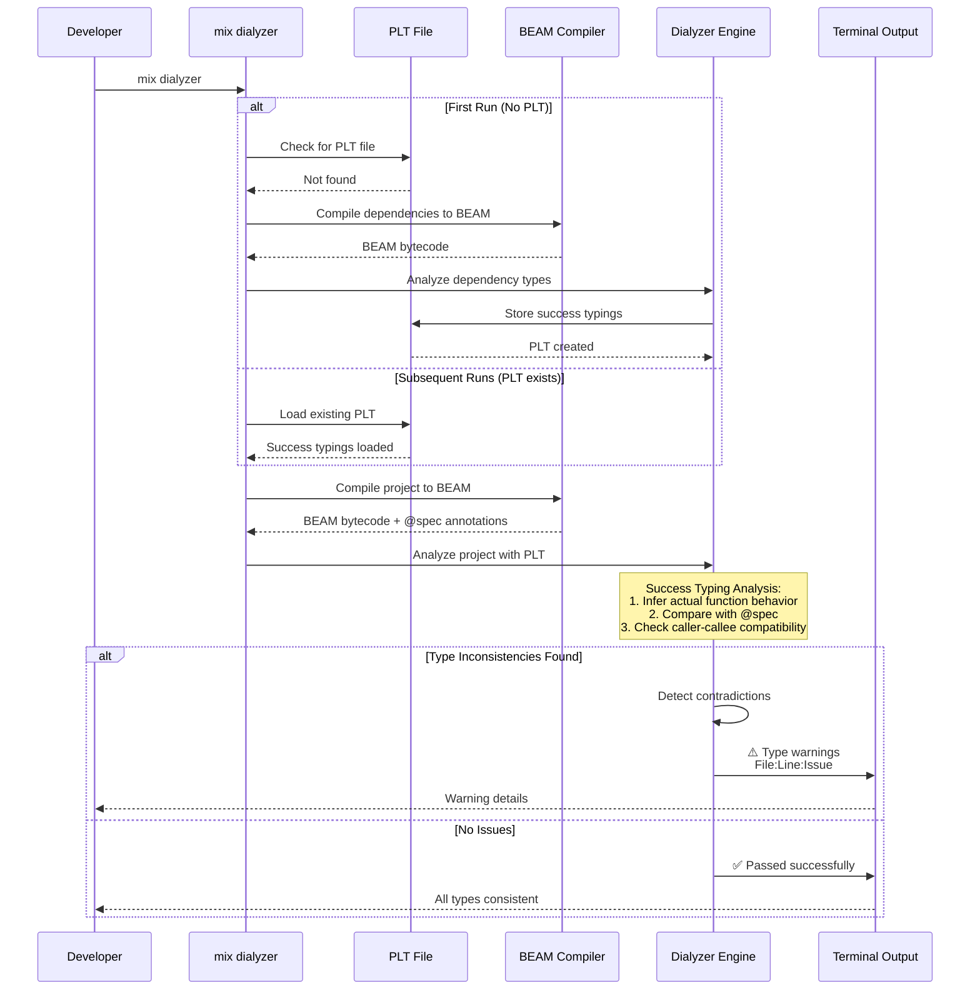

# Elixir Type Safety

**Quick Reference**: [Overview](#overview) | [Typespecs](#typespecs) | [Dialyzer](#dialyzer) | [Pattern Matching](#pattern-matching-as-type-guard) | [Compile-Time Checks](#compile-time-type-checking) | [Financial Examples](#financial-domain-integration)

## Overview

Elixir is a dynamically typed language, but provides powerful tools for optional static analysis through typespecs and Dialyzer. Unlike statically typed languages, types in Elixir are documentation and analysis hints rather than compiler-enforced constraints.

**Type Safety Approach**:

- **Dynamic Typing**: Runtime type checking via pattern matching
- **Typespecs**: Document function signatures with `@spec` and custom types with `@type`
- **Dialyzer**: Static analysis tool for success typing
- **Pattern Matching**: Runtime type guards through pattern matching
- **Guards**: Additional runtime constraints on function clauses

All examples use financial domain context (Money types, Zakat calculations, donation validation).

## Typespecs

### Basic Type Specifications

```elixir
defmodule FinancialDomain.Money do
  @moduledoc """
  Money data type with precise decimal arithmetic.
  """

  defstruct [:amount, :currency]

  # Define custom types
  @type t :: %__MODULE__{
    amount: Decimal.t(),
    currency: atom()
  }

  @type currency :: :USD | :EUR | :GBP | :SAR | :AED | :MYR | :IDR

  @doc """
  Creates a new Money struct.
  """
  @spec new(number() | Decimal.t(), currency()) :: t()
  def new(amount, currency) when is_number(amount) do
    %__MODULE__{
      amount: Decimal.new(amount),
      currency: currency
    }
  end

  def new(%Decimal{} = amount, currency) do
    %__MODULE__{
      amount: amount,
      currency: currency
    }
  end

  @doc """
  Adds two Money values.
  """
  @spec add(t(), t()) :: t() | {:error, :currency_mismatch}
  def add(%__MODULE__{currency: curr} = m1, %__MODULE__{currency: curr} = m2) do
    %__MODULE__{
      amount: Decimal.add(m1.amount, m2.amount),
      currency: curr
    }
  end

  def add(%__MODULE__{}, %__MODULE__{}) do
    {:error, :currency_mismatch}
  end

  @doc """
  Multiplies Money by a number.
  """
  @spec multiply(t(), number() | Decimal.t()) :: t()
  def multiply(%__MODULE__{} = money, multiplier) when is_number(multiplier) do
    %__MODULE__{
      amount: Decimal.mult(money.amount, Decimal.new(multiplier)),
      currency: money.currency
    }
  end

  def multiply(%__MODULE__{} = money, %Decimal{} = multiplier) do
    %__MODULE__{
      amount: Decimal.mult(money.amount, multiplier),
      currency: money.currency
    }
  end

  @doc """
  Compares two Money values.
  Returns :gt, :eq, or :lt.
  """
  @spec compare(t(), t()) :: :gt | :eq | :lt | {:error, :currency_mismatch}
  def compare(%__MODULE__{currency: curr} = m1, %__MODULE__{currency: curr} = m2) do
    Decimal.compare(m1.amount, m2.amount)
  end

  def compare(%__MODULE__{}, %__MODULE__{}) do
    {:error, :currency_mismatch}
  end
end
```

### Function Specifications

```elixir
defmodule FinancialDomain.Zakat.Calculator do
  @moduledoc """
  Calculates Zakat with type specifications.
  """

  alias FinancialDomain.Money

  # Type aliases for clarity
  @type wealth :: Money.t()
  @type nisab :: Money.t()
  @type zakat_result :: {:ok, Money.t()} | {:error, reason()}
  @type reason :: :negative_wealth | :currency_mismatch | atom()

  @doc """
  Calculates Zakat (2.5%) on wealth exceeding nisab threshold.

  ## Examples

      iex> wealth = Money.new(10000, :USD)
      iex> nisab = Money.new(5000, :USD)
      iex> Calculator.calculate(wealth, nisab)
      {:ok, %Money{amount: Decimal.new("250.00"), currency: :USD}}

  """
  @spec calculate(wealth(), nisab()) :: zakat_result()
  def calculate(%Money{amount: amount}, _nisab) when amount < 0 do
    {:error, :negative_wealth}
  end

  def calculate(%Money{currency: c1}, %Money{currency: c2}) when c1 != c2 do
    {:error, :currency_mismatch}
  end

  def calculate(%Money{} = wealth, %Money{} = nisab) do
    case Money.compare(wealth, nisab) do
      :gt ->
        zakat = Money.multiply(wealth, Decimal.new("0.025"))
        {:ok, zakat}

      _ ->
        {:ok, Money.new(0, wealth.currency)}
    end
  end

  @doc """
  Calculates Zakat for multiple wealth sources.
  """
  @spec calculate_total([wealth()], nisab()) :: zakat_result()
  def calculate_total(wealth_sources, nisab) when is_list(wealth_sources) do
    total_wealth = Enum.reduce(wealth_sources, Money.new(0, nisab.currency), fn w, acc ->
      Money.add(acc, w)
    end)

    calculate(total_wealth, nisab)
  end

  @doc """
  Checks if wealth is subject to Zakat.
  """
  @spec subject_to_zakat?(wealth(), nisab()) :: boolean()
  def subject_to_zakat?(%Money{} = wealth, %Money{} = nisab) do
    Money.compare(wealth, nisab) == :gt
  end
end
```

### Complex Type Definitions

```elixir
defmodule FinancialDomain.Donations.Types do
  @moduledoc """
  Type definitions for donation domain.
  """

  # Status enum
  @type status :: :pending | :processing | :completed | :failed | :refunded

  # Donation record
  @type donation :: %{
    id: String.t(),
    amount: FinancialDomain.Money.t(),
    donor_id: String.t(),
    campaign_id: String.t(),
    status: status(),
    created_at: DateTime.t(),
    metadata: map()
  }

  # Campaign record
  @type campaign :: %{
    id: String.t(),
    name: String.t(),
    goal: FinancialDomain.Money.t(),
    raised: FinancialDomain.Money.t(),
    active: boolean(),
    start_date: Date.t(),
    end_date: Date.t()
  }

  # Validation result
  @type validation_result :: {:ok, donation()} | {:error, validation_error()}
  @type validation_error :: {:invalid_amount, String.t()}
                         | {:invalid_campaign, String.t()}
                         | {:invalid_donor, String.t()}
                         | {:campaign_closed, Date.t()}

  # Processing result
  @type processing_result :: {:ok, receipt()}
                          | {:error, processing_error()}

  @type processing_error :: :payment_failed
                         | :gateway_timeout
                         | {:insufficient_funds, FinancialDomain.Money.t()}

  # Receipt
  @type receipt :: %{
    donation_id: String.t(),
    receipt_number: String.t(),
    amount: FinancialDomain.Money.t(),
    issued_at: DateTime.t()
  }
end
```

### Type Hierarchy

The following diagram illustrates how Elixir types are organized hierarchically, from basic built-in types to domain-specific custom types:

```mermaid
graph TD
    %% Basic Types Layer
    BT[Basic Types]
    NUM[number<br/>integer, float]
    STR[String.t<br/>binary]
    ATOM[atom]
    BOOL[boolean<br/>true, false]
    LIST[list]
    MAP[map]
    TUPLE[tuple]

    BT --> NUM
    BT --> STR
    BT --> ATOM
    BT --> BOOL
    BT --> LIST
    BT --> MAP
    BT --> TUPLE

    %% Compound Types Layer
    CT[Compound Types]
    STRUCT[struct]
    UNION[Union Types<br/>type1 | type2]
    COMPLEX[Complex Maps<br/>%{key: type}]

    MAP --> STRUCT
    ATOM --> UNION
    MAP --> COMPLEX

    %% User-Defined Types Layer
    UT[User-Defined Types]
    MONEY[@type Money.t<br/>%Money{amount, currency}]
    CURRENCY[@type currency<br/>:USD | :EUR | :SAR]
    DONATION[@type donation<br/>%{id, amount, status}]
    RESULT[@type result<br/>{:ok, t} | {:error, reason}]

    STRUCT --> MONEY
    UNION --> CURRENCY
    COMPLEX --> DONATION
    TUPLE --> RESULT

    %% Domain Types Layer
    DT[Domain Types]
    WEALTH[@type wealth<br/>alias for Money.t]
    NISAB[@type nisab<br/>alias for Money.t]
    ZAKAT_RESULT[@type zakat_result<br/>{:ok, Money.t} | {:error, atom}]

    MONEY --> WEALTH
    MONEY --> NISAB
    RESULT --> ZAKAT_RESULT

    %% Styling (WCAG AA compliant)
    style BT fill:#0173B2,stroke:#023B5A,color:#FFF
    style NUM fill:#029E73,stroke:#01593F,color:#FFF
    style STR fill:#029E73,stroke:#01593F,color:#FFF
    style ATOM fill:#029E73,stroke:#01593F,color:#FFF
    style BOOL fill:#029E73,stroke:#01593F,color:#FFF
    style LIST fill:#029E73,stroke:#01593F,color:#FFF
    style MAP fill:#029E73,stroke:#01593F,color:#FFF
    style TUPLE fill:#029E73,stroke:#01593F,color:#FFF

    style CT fill:#0173B2,stroke:#023B5A,color:#FFF
    style STRUCT fill:#DE8F05,stroke:#8A5903,color:#FFF
    style UNION fill:#DE8F05,stroke:#8A5903,color:#FFF
    style COMPLEX fill:#DE8F05,stroke:#8A5903,color:#FFF

    style UT fill:#0173B2,stroke:#023B5A,color:#FFF
    style MONEY fill:#CC78BC,stroke:#7A4871,color:#FFF
    style CURRENCY fill:#CC78BC,stroke:#7A4871,color:#FFF
    style DONATION fill:#CC78BC,stroke:#7A4871,color:#FFF
    style RESULT fill:#CC78BC,stroke:#7A4871,color:#FFF

    style DT fill:#0173B2,stroke:#023B5A,color:#FFF
    style WEALTH fill:#CA9161,stroke:#7A5739,color:#FFF
    style NISAB fill:#CA9161,stroke:#7A5739,color:#FFF
    style ZAKAT_RESULT fill:#CA9161,stroke:#7A5739,color:#FFF
```

This hierarchy shows how types build from simple primitives to domain-specific types in financial applications:

1. **Basic Types** (green) - Elixir built-in types
2. **Compound Types** (orange) - Combinations of basic types
3. **User-Defined Types** (purple) - Custom types for domain concepts
4. **Domain Types** (brown) - Type aliases for specific business contexts

## Dialyzer

### Setting Up Dialyzer

```elixir
# mix.exs
defmodule FinancialDomain.MixProject do
  use Mix.Project

  def project do
    [
      app: :financial_domain,
      version: "0.1.0",
      elixir: "~> 1.19",
      start_permanent: Mix.env() == :prod,
      deps: deps(),
      dialyzer: dialyzer()
    ]
  end

  defp dialyzer do
    [
      plt_file: {:no_warn, "priv/plts/dialyzer.plt"},
      plt_add_apps: [:ex_unit, :mix],
      flags: [
        :error_handling,
        :underspecs,
        :unknown,
        :unmatched_returns
      ],
      # Ignore specific warnings
      ignore_warnings: ".dialyzer_ignore.exs"
    ]
  end

  defp deps do
    [
      {:dialyxir, "~> 1.4", only: [:dev, :test], runtime: false},
      {:decimal, "~> 2.1"}
    ]
  end
end
```

### Dialyzer Analysis

```bash
# Generate PLT (first time)
mix dialyzer --plt

# Run Dialyzer analysis
mix dialyzer

# Example output:
# done (passed successfully)
# or
# lib/financial_domain/zakat/calculator.ex:45:call
# The function call will not succeed.
#
# FinancialDomain.Money.multiply(money :: %Money{...}, "0.025")
#
# will never return since the success typing is:
# (t(), number() | %Decimal{}) :: t()
# and the contract is:
# (t(), number() | %Decimal{}) :: t()
```

### Dialyzer Analysis Workflow

The following diagram illustrates how Dialyzer performs static analysis on Elixir code to detect type inconsistencies:



**Key Concepts**:

- **PLT (Persistent Lookup Table)**: Cached type information for dependencies (speeds up analysis)
- **Success Typing**: Dialyzer infers the most permissive types that won't cause runtime errors
- **BEAM Bytecode**: Dialyzer analyzes compiled bytecode, not source code
- **@spec Annotations**: Dialyzer compares specs against inferred behavior

### Common Dialyzer Patterns

```elixir
defmodule FinancialDomain.Validation.Dialyzer do
  @moduledoc """
  Examples of Dialyzer catching type errors.
  """

  @spec validate_amount(number()) :: {:ok, number()} | {:error, atom()}
  def validate_amount(amount) when is_number(amount) and amount > 0 do
    {:ok, amount}
  end

  def validate_amount(_amount) do
    {:error, :invalid_amount}
  end

  # ❌ Dialyzer will warn: this always returns {:error, :invalid_amount}
  @spec always_fails(number()) :: {:ok, number()}
  def always_fails(amount) do
    validate_amount(-1)  # Always fails, but spec says {:ok, number()}
  end

  # ✅ Correct: spec matches actual return
  @spec may_fail(number()) :: {:ok, number()} | {:error, atom()}
  def may_fail(amount) do
    validate_amount(amount)
  end

  # ❌ Dialyzer will warn: wrong return type
  @spec wrong_return() :: String.t()
  def wrong_return do
    123  # Returns number, not string
  end

  # ✅ Correct: multiple return types
  @spec flexible_return(boolean()) :: String.t() | number()
  def flexible_return(true), do: "true"
  def flexible_return(false), do: 0

  # ❌ Dialyzer will warn: pattern will never match
  @spec unreachable_pattern(number()) :: :ok
  def unreachable_pattern(n) when n > 0, do: :ok
  def unreachable_pattern(n) when n > 0, do: :also_ok  # Never reached!
  def unreachable_pattern(_), do: :ok
end
```

### Opaque Types

```elixir
defmodule FinancialDomain.AccountNumber do
  @moduledoc """
  Opaque type for account numbers - internal structure hidden.
  """

  @opaque t :: %__MODULE__{
    country_code: String.t(),
    bank_code: String.t(),
    account_number: String.t(),
    check_digit: String.t()
  }

  defstruct [:country_code, :bank_code, :account_number, :check_digit]

  @doc """
  Creates account number from IBAN string.
  """
  @spec from_iban(String.t()) :: {:ok, t()} | {:error, :invalid_iban}
  def from_iban(iban) when is_binary(iban) do
    # Parse and validate IBAN
    case parse_iban(iban) do
      {:ok, parts} ->
        {:ok, struct(__MODULE__, parts)}

      :error ->
        {:error, :invalid_iban}
    end
  end

  @doc """
  Converts account number to IBAN string.
  """
  @spec to_iban(t()) :: String.t()
  def to_iban(%__MODULE__{} = account) do
    "#{account.country_code}#{account.check_digit}#{account.bank_code}#{account.account_number}"
  end

  # External modules can't access internal structure
  # Must use public API
  defp parse_iban(_iban) do
    {:ok, %{
      country_code: "US",
      bank_code: "123456",
      account_number: "789012",
      check_digit: "34"
    }}
  end
end

# Usage
# account = %FinancialDomain.AccountNumber{}  # ❌ Can't create directly
# account = FinancialDomain.AccountNumber.from_iban("...")  # ✅ Must use API
```

## Pattern Matching as Type Guard

### Runtime Type Checking

```elixir
defmodule FinancialDomain.Donations.Validator do
  @moduledoc """
  Validates donations using pattern matching for type safety.
  """

  alias FinancialDomain.Money

  @doc """
  Validates donation parameters.
  Pattern matching ensures correct structure and types.
  """
  def validate(params) when is_map(params) do
    with {:ok, amount} <- extract_amount(params),
         {:ok, donor_id} <- extract_donor_id(params),
         {:ok, campaign_id} <- extract_campaign_id(params) do
      {:ok, %{
        amount: amount,
        donor_id: donor_id,
        campaign_id: campaign_id
      }}
    end
  end

  # Pattern match on structure
  defp extract_amount(%{"amount" => amount, "currency" => currency})
       when is_number(amount) and amount > 0 and is_atom(currency) do
    {:ok, Money.new(amount, currency)}
  end

  defp extract_amount(%{amount: amount, currency: currency})
       when is_number(amount) and amount > 0 and is_atom(currency) do
    {:ok, Money.new(amount, currency)}
  end

  defp extract_amount(_), do: {:error, :invalid_amount}

  # Pattern match on string structure
  defp extract_donor_id(%{"donor_id" => id}) when is_binary(id) and byte_size(id) > 0 do
    {:ok, id}
  end

  defp extract_donor_id(%{donor_id: id}) when is_binary(id) and byte_size(id) > 0 do
    {:ok, id}
  end

  defp extract_donor_id(_), do: {:error, :missing_donor_id}

  # Pattern match with guard
  defp extract_campaign_id(%{"campaign_id" => id}) when is_binary(id) do
    if String.match?(id, ~r/^[a-f0-9-]{36}$/), do: {:ok, id}, else: {:error, :invalid_uuid}
  end

  defp extract_campaign_id(%{campaign_id: id}) when is_binary(id) do
    if String.match?(id, ~r/^[a-f0-9-]{36}$/), do: {:ok, id}, else: {:error, :invalid_uuid}
  end

  defp extract_campaign_id(_), do: {:error, :missing_campaign_id}
end
```

### Guard Clauses for Business Rules

```elixir
defmodule FinancialDomain.Zakat.Eligibility do
  @moduledoc """
  Determines Zakat eligibility with guard clauses.
  """

  alias FinancialDomain.Money

  # Custom guards
  defguard is_positive(amount) when is_struct(amount, Money) and amount.amount > 0
  defguard exceeds_nisab(wealth, nisab) when wealth.amount > nisab.amount

  @doc """
  Checks Zakat eligibility with pattern matching and guards.
  """
  def check(wealth, nisab, debts \\ nil)

  # No debts, wealth exceeds nisab
  def check(%Money{} = wealth, %Money{} = nisab, nil)
      when is_positive(wealth) and exceeds_nisab(wealth, nisab) do
    {:eligible, wealth}
  end

  # With debts, net wealth exceeds nisab
  def check(%Money{currency: curr} = wealth, %Money{currency: curr} = nisab, %Money{currency: curr} = debts)
      when is_positive(wealth) do
    net_wealth = Money.subtract(wealth, debts)

    if exceeds_nisab(net_wealth, nisab) do
      {:eligible, net_wealth}
    else
      {:below_nisab, net_wealth}
    end
  end

  # Currency mismatch
  def check(%Money{currency: c1}, %Money{currency: c2}, _)
      when c1 != c2 do
    {:error, :currency_mismatch}
  end

  # Negative wealth
  def check(%Money{amount: amount}, _, _)
      when amount < 0 do
    {:error, :negative_wealth}
  end

  # Default: not eligible
  def check(_, _, _) do
    {:not_eligible, :insufficient_wealth}
  end
end
```

## Compile-Time Type Checking

### Using Set-Theoretic Types (Elixir 1.17+)

```elixir
defmodule FinancialDomain.Types.SetTheoretic do
  @moduledoc """
  Examples of set-theoretic types introduced in Elixir 1.17.

  Set-theoretic types enable compile-time warnings for
  type mismatches in certain constructs.
  """

  # Elixir 1.17+ can warn about this at compile time
  def process_donation(%{amount: amount} = donation) when is_number(amount) do
    # Compiler knows amount is a number here
    calculate_fee(amount)
  end

  defp calculate_fee(amount) when is_number(amount) do
    amount * 0.025
  end

  # Elixir 1.17+ warns if you pass non-number
  def broken_call do
    process_donation(%{amount: "invalid"})  # Warning: will fail at runtime
  end

  # Pattern matching with map keys
  def extract_currency(%{currency: :USD} = money), do: money
  def extract_currency(%{currency: :EUR} = money), do: money
  def extract_currency(%{currency: :GBP} = money), do: money
  # Elixir 1.17+ warns if other currency values are possible

  # Binary pattern matching
  def parse_account_number(<<country::binary-size(2), rest::binary>>) do
    {country, rest}
  end
end
```

### Struct Enforcement

```elixir
defmodule FinancialDomain.Transaction do
  @moduledoc """
  Transaction struct with compile-time field verification.
  """

  @enforce_keys [:id, :amount, :type, :timestamp]
  defstruct [:id, :amount, :type, :timestamp, :metadata]

  @type t :: %__MODULE__{
    id: String.t(),
    amount: FinancialDomain.Money.t(),
    type: :debit | :credit,
    timestamp: DateTime.t(),
    metadata: map() | nil
  }

  def new(attrs) do
    # Must provide all @enforce_keys
    struct!(__MODULE__, attrs)
  end

  # This will fail at compile time:
  # def invalid_new do
  #   %__MODULE__{id: "123"}  # Missing required keys!
  # end
end
```

## Financial Domain Integration

### Complete Money Module with Types

```elixir
defmodule FinancialDomain.Money.Complete do
  @moduledoc """
  Complete Money implementation with comprehensive type safety.
  """

  defstruct [:amount, :currency]

  @type t :: %__MODULE__{
    amount: Decimal.t(),
    currency: currency()
  }

  @type currency :: :USD | :EUR | :GBP | :SAR | :AED | :MYR | :IDR
  @type comparison :: :gt | :eq | :lt
  @type operation_result :: t() | {:error, error_reason()}
  @type error_reason :: :currency_mismatch | :division_by_zero | :invalid_amount

  @spec new(number() | Decimal.t(), currency()) :: t()
  def new(amount, currency) when is_number(amount) do
    %__MODULE__{amount: Decimal.new(amount), currency: currency}
  end

  def new(%Decimal{} = amount, currency) do
    %__MODULE__{amount: amount, currency: currency}
  end

  @spec add(t(), t()) :: operation_result()
  def add(%__MODULE__{currency: c} = m1, %__MODULE__{currency: c} = m2) do
    %__MODULE__{
      amount: Decimal.add(m1.amount, m2.amount),
      currency: c
    }
  end

  def add(%__MODULE__{}, %__MODULE__{}) do
    {:error, :currency_mismatch}
  end

  @spec subtract(t(), t()) :: operation_result()
  def subtract(%__MODULE__{currency: c} = m1, %__MODULE__{currency: c} = m2) do
    %__MODULE__{
      amount: Decimal.sub(m1.amount, m2.amount),
      currency: c
    }
  end

  def subtract(%__MODULE__{}, %__MODULE__{}) do
    {:error, :currency_mismatch}
  end

  @spec multiply(t(), number() | Decimal.t()) :: t()
  def multiply(%__MODULE__{} = money, multiplier) when is_number(multiplier) do
    %__MODULE__{
      amount: Decimal.mult(money.amount, Decimal.new(multiplier)),
      currency: money.currency
    }
  end

  def multiply(%__MODULE__{} = money, %Decimal{} = multiplier) do
    %__MODULE__{
      amount: Decimal.mult(money.amount, multiplier),
      currency: money.currency
    }
  end

  @spec divide(t(), number() | Decimal.t()) :: operation_result()
  def divide(%__MODULE__{}, 0), do: {:error, :division_by_zero}
  def divide(%__MODULE__{}, %Decimal{} = divisor) do
    case Decimal.compare(divisor, Decimal.new(0)) do
      :eq -> {:error, :division_by_zero}
      _ -> :ok
    end
  end

  def divide(%__MODULE__{} = money, divisor) when is_number(divisor) and divisor != 0 do
    %__MODULE__{
      amount: Decimal.div(money.amount, Decimal.new(divisor)),
      currency: money.currency
    }
  end

  def divide(%__MODULE__{} = money, %Decimal{} = divisor) do
    %__MODULE__{
      amount: Decimal.div(money.amount, divisor),
      currency: money.currency
    }
  end

  @spec compare(t(), t()) :: comparison() | {:error, error_reason()}
  def compare(%__MODULE__{currency: c} = m1, %__MODULE__{currency: c} = m2) do
    Decimal.compare(m1.amount, m2.amount)
  end

  def compare(%__MODULE__{}, %__MODULE__{}) do
    {:error, :currency_mismatch}
  end

  @spec equal?(t(), t()) :: boolean()
  def equal?(%__MODULE__{} = m1, %__MODULE__{} = m2) do
    compare(m1, m2) == :eq
  end

  @spec greater_than?(t(), t()) :: boolean()
  def greater_than?(%__MODULE__{} = m1, %__MODULE__{} = m2) do
    compare(m1, m2) == :gt
  end

  @spec less_than?(t(), t()) :: boolean()
  def less_than?(%__MODULE__{} = m1, %__MODULE__{} = m2) do
    compare(m1, m2) == :lt
  end

  @spec positive?(t()) :: boolean()
  def positive?(%__MODULE__{amount: amount}) do
    Decimal.compare(amount, Decimal.new(0)) == :gt
  end

  @spec negative?(t()) :: boolean()
  def negative?(%__MODULE__{amount: amount}) do
    Decimal.compare(amount, Decimal.new(0)) == :lt
  end

  @spec zero?(t()) :: boolean()
  def zero?(%__MODULE__{amount: amount}) do
    Decimal.compare(amount, Decimal.new(0)) == :eq
  end
end
```

## Best Practices

- **Document with Typespecs**: Add `@spec` to all public functions
- **Define Custom Types**: Use `@type` for domain concepts
- **Run Dialyzer Regularly**: Integrate into CI/CD pipeline
- **Use Pattern Matching**: Runtime type safety through patterns
- **Opaque Types**: Hide implementation details
- **Guard Clauses**: Express business rules explicitly
- **Struct Enforcement**: Use `@enforce_keys` for required fields
- **Success Typing**: Understand Dialyzer's approach

## Common Mistakes

- ❌ Overly complex type specs (keep them readable)
- ❌ Ignoring Dialyzer warnings
- ❌ Wrong @spec (says one thing, does another)
- ❌ Not using custom types (repeating complex specs)
- ❌ Mixing string/atom keys inconsistently
- ❌ Not using guards for business rules
- ❌ Forgetting to update specs when changing code
- ❌ Using specs as runtime validation (they're not!)

## Related Topics

- [Idioms](./ex-soen-prla-el__idioms.md) - Pattern matching and guards
- [Best Practices](./ex-soen-prla-el__best-practices.md) - Elixir conventions
- [Functional Programming](./ex-soen-prla-el__functional-programming.md) - Pure functions
- [Protocols and Behaviours](./ex-soen-prla-el__protocols-and-behaviours.md) - Polymorphism

## Sources

- [Elixir Typespecs](https://hexdocs.pm/elixir/typespecs.html)
- [Dialyzer Documentation](https://www.erlang.org/doc/apps/dialyzer/dialyzer_chapter.html)
- [Dialyxir - Elixir Dialyzer Integration](https://github.com/jeremyjh/dialyxir)
- [Set-Theoretic Types in Elixir 1.17](https://elixir-lang.org/blog/2024/06/12/elixir-v1-17-0-released/)

---

**Last Updated**: 2026-01-23
**Elixir Version**: 1.12+ (baseline), 1.17+ (recommended), 1.19.0 (latest)
**Maintainers**: Platform Documentation Team
