# Golang

**This is THE authoritative reference** for Go coding standards in OSE Platform.

All Go code written for the OSE Platform MUST comply with the standards documented here. These standards are mandatory, not optional. Non-compliance blocks code review and merge approval.

## Framework Stack

OSE Platform Go applications MUST use the following stack:

**Standard Library (Primary)**:

- `net/http` for HTTP servers (Go 1.22+ enhanced routing with method handlers and wildcards)
- `database/sql` for database access with driver abstraction
- `encoding/json` for JSON processing (`encoding/json/v2` available in Go 1.25+)
- `crypto` for cryptographic operations (TLS, hashing, encryption)
- `testing` for unit tests with table-driven patterns and fuzzing

**Production Frameworks**:

- **Gin v1.11.0** - Fast web framework with JSON validation, popular in Go community
- **Echo v5.0.0** - High-performance, extensible web framework
- **Fiber v2.52.10** - Express-inspired framework with fasthttp (high throughput)
- **GORM v1.25.0** - ORM for database abstraction when needed (prefer `database/sql` for simple cases)
- **testify v1.9.0** - Assertions (`assert`, `require`) and mocking (`mock`) for tests

**gRPC Stack**:

- `google.golang.org/grpc` (grpc-go) for gRPC services
- Protocol Buffers for service definitions
- connect-go for gRPC-compatible framework with simpler API

**Testing Stack**:

- `testing` package (standard library) for unit and integration tests
- testify for fluent assertions and interface mocking
- gomock for interface mocking with code generation
- Godog for BDD scenarios (Gherkin for Go)
- TestContainers for database and infrastructure integration tests

**Build Tools**:

- Go toolchain (primary): `go build`, `go test`, `go mod`
- Make for build automation (Makefile)
- Task (Taskfile) for modern task running
- Nx for monorepo management (cross-project dependencies)

**Go Version Strategy**:

- **Baseline**: Go 1.21+ (MUST use minimum) - PGO production-ready, built-in min/max/clear
- **Recommended**: Go 1.23+ (SHOULD migrate to) - Iterator functions, unique package, timer changes
- **Latest**: Go 1.25 (RECOMMENDED for new projects) - Green Tea GC (experimental), encoding/json/v2, container-aware GOMAXPROCS

**See**: [Programming Language Documentation Separation Convention](../../../../../governance/conventions/structure/programming-language-docs-separation.md) for Go-specific release documentation location

## Prerequisite Knowledge

**REQUIRED**: This documentation assumes you have completed the AyoKoding Go learning path. These are **OSE Platform-specific style guides**, not educational tutorials.

**You MUST understand Go fundamentals before using these standards:**

- **[Go Learning Path](../../../../../apps/ayokoding-web/content/en/learn/software-engineering/programming-languages/golang/)** - Complete 0-95% language coverage
- **[Go By Example](../../../../../apps/ayokoding-web/content/en/learn/software-engineering/programming-languages/golang/by-example/)** - 75-85 annotated code examples (beginner to advanced)
- **[Go In the Field](../../../../../apps/ayokoding-web/content/en/learn/software-engineering/programming-languages/golang/in-the-field/)** - Production patterns and design approaches
- **[Go Release Highlights](../../../../../apps/ayokoding-web/content/en/learn/software-engineering/programming-languages/golang/release-highlights/)** - Go 1.18-1.25 features (generics, fuzzing, PGO, iterators, Green Tea GC)

**What this documentation covers**: OSE Platform naming conventions, framework choices, repository-specific patterns, how to apply Go knowledge in THIS codebase.

**What this documentation does NOT cover**: Go syntax, language fundamentals, generic patterns (those are in ayokoding-web).

**See**: [Programming Language Documentation Separation Convention](../../../../../governance/conventions/structure/programming-language-docs-separation.md) for content separation rules.

## Software Engineering Principles

Go development in OSE Platform enforces five foundational software engineering principles:

1. **[Automation Over Manual](../../../../../governance/principles/software-engineering/automation-over-manual.md)** - MUST automate through code generation (`protoc`, `mockgen`, `stringer`), `go generate`, `golangci-lint`, `gofmt`, `go test`, and CI/CD integration for testing and linting

2. **[Explicit Over Implicit](../../../../../governance/principles/software-engineering/explicit-over-implicit.md)** - MUST enforce explicitness through explicit error returns (no exceptions), clear imports (no dot imports), explicit configuration (no magic defaults), explicit type conversions, and explicit goroutine management

3. **[Immutability Over Mutability](../../../../../governance/principles/software-engineering/immutability.md)** - MUST use value receivers for immutable methods, avoid pointer receivers for small types, copy data structures when mutation is needed, and prefer functional patterns with immutable data where appropriate

4. **[Pure Functions Over Side Effects](../../../../../governance/principles/software-engineering/pure-functions.md)** - MUST implement functional core/imperative shell architecture, pure domain logic without side effects, first-class functions for functional patterns, and testable business logic isolated from I/O

5. **[Reproducibility First](../../../../../governance/principles/software-engineering/reproducibility.md)** - MUST ensure reproducibility through `go.mod` versioning, `go.sum` checksums for integrity, Go version pinning in `go.mod`, module proxies (proxy.golang.org), and `.tool-versions` for local Go version management

## Go Version Strategy

OSE Platform follows a three-tier Go versioning strategy focused on modern features:

**Go 1.21+ (Baseline - REQUIRED)**:

- All projects MUST support Go 1.21 minimum
- Profile-guided optimization (PGO) production-ready (2-7% performance improvement)
- Built-in `min`, `max`, `clear` functions
- Improved type inference for generics
- Go toolchain management for multi-version support

**Go 1.23+ (Target - RECOMMENDED)**:

- Projects SHOULD migrate to Go 1.23 when feasible
- Iterator functions with `range over func` paradigm
- `iter` package for `Seq`, `Seq2` iterator types
- `unique` package for value canonicalization
- Timer behavior changes (unbuffered channels, GC-eligible)
- Generic type aliases (preview)

**Go 1.25 (Latest - RECOMMENDED)**:

- New projects SHOULD use Go 1.25 for latest stable features
- Green Tea GC (experimental, 10-40% GC overhead reduction)
- `encoding/json/v2` packages (major API revision for better performance)
- Container-aware GOMAXPROCS (automatic CPU quota detection for containers)
- Core types removal (language spec cleanup)
- Leak detection with AddressSanitizer (ASAN)

**Unlike Java's LTS model**: Go releases every 6 months with backward compatibility guarantees (Go 1 compatibility promise). No LTS distinction exists; all releases receive security patches for one year. Platform strategy focuses on staying current with stable releases.

**See**: [Go Release Highlights](../../../../../apps/ayokoding-web/content/en/learn/software-engineering/programming-languages/golang/release-highlights/) for detailed feature documentation

## OSE Platform Coding Standards (Authoritative)

**MUST follow these mandatory standards for all Go code in OSE Platform:**

1. **[Coding Standards](./ex-soen-prla-go__coding-standards.md)** - Naming conventions, package organization, Effective Go idioms
2. **[Testing Standards](./ex-soen-prla-go__testing-standards.md)** - Table-driven tests, testify, gomock, TestContainers, Godog
3. **[Code Quality Standards](./ex-soen-prla-go__code-quality-standards.md)** - golangci-lint, gofmt, staticcheck, go vet
4. **[Build Configuration](./ex-soen-prla-go__build-configuration.md)** - go.mod structure, Makefile patterns, CI/CD integration
5. **[Error Handling Standards](./ex-soen-prla-go__error-handling-standards.md)** - Error wrapping, sentinel errors, custom error types
6. **[Concurrency Standards](./ex-soen-prla-go__concurrency-standards.md)** - Goroutines, channels, context, race detection
7. **[Type Safety Standards](./ex-soen-prla-go__type-safety-standards.md)** - Generics, type parameters, constraints, type assertions
8. **[Performance Standards](./ex-soen-prla-go__performance-standards.md)** - Profiling with pprof, benchmarking, memory optimization
9. **[Security Standards](./ex-soen-prla-go__security-standards.md)** - Input validation, injection prevention, crypto practices
10. **[API Standards](./ex-soen-prla-go__api-standards.md)** - REST conventions, HTTP routing, middleware patterns
11. **[DDD Standards](./ex-soen-prla-go__ddd-standards.md)** - Domain-Driven Design tactical patterns without classes
12. **[Dependency Standards](./ex-soen-prla-go__dependency-standards.md)** - Go modules, version selection, replace directives
13. **[Design Patterns](./ex-soen-prla-go__design-patterns.md)** - Common Go patterns (functional options, interface design)

## Documentation Structure

### Quick Reference

**Mandatory Standards (All Go Developers MUST follow)**:

1. [Coding Standards](./ex-soen-prla-go__coding-standards.md) - Naming, package structure, Effective Go compliance
2. [Testing Standards](./ex-soen-prla-go__testing-standards.md) - Table-driven tests, coverage requirements, TestContainers
3. [Code Quality Standards](./ex-soen-prla-go__code-quality-standards.md) - golangci-lint configuration, formatting rules

**Context-Specific Standards (Apply when relevant)**:

- **Security**: [Security Standards](./ex-soen-prla-go__security-standards.md) - Input validation, crypto for user-facing services
- **Concurrency**: [Concurrency Standards](./ex-soen-prla-go__concurrency-standards.md) - Goroutines, channels for concurrent code
- **Domain Modeling**: [DDD Standards](./ex-soen-prla-go__ddd-standards.md) - Aggregates, value objects for business domains
- **APIs**: [API Standards](./ex-soen-prla-go__api-standards.md) - REST patterns, HTTP routing for web services
- **Performance**: [Performance Standards](./ex-soen-prla-go__performance-standards.md) - Profiling, optimization when needed
- **Error Handling**: [Error Handling Standards](./ex-soen-prla-go__error-handling-standards.md) - Error wrapping, custom errors
- **Type Safety**: [Type Safety Standards](./ex-soen-prla-go__type-safety-standards.md) - Generics, type parameters for reusable code
- **Dependencies**: [Dependency Standards](./ex-soen-prla-go__dependency-standards.md) - Module management, version selection
- **Patterns**: [Design Patterns](./ex-soen-prla-go__design-patterns.md) - Idiomatic Go patterns (functional options, etc.)

### Documentation Organization

```mermaid
%% Color Palette: Blue #0173B2, Orange #DE8F05, Teal #029E73, Purple #CC78BC
%% All colors are color-blind friendly and meet WCAG AA contrast standards

graph TD
    A["Go Standards Index<br/>(OSE Platform)"]:::blue
    B["Core Standards"]:::orange
    C["Specialized Standards"]:::teal
    D["Learning Resources<br/>(AyoKoding)"]:::purple

    A --> B
    A --> C
    A --> D

    B --> E["Coding Standards"]:::orange
    B --> F["Testing Standards"]:::orange
    B --> G["Code Quality"]:::orange
    B --> H["Build Configuration"]:::orange

    C --> I["Security Standards"]:::teal
    C --> J["Concurrency Standards"]:::teal
    C --> K["DDD Standards"]:::teal
    C --> L["API Standards"]:::teal
    C --> M["Performance Standards"]:::teal
    C --> N["Error Handling"]:::teal
    C --> O["Type Safety"]:::teal
    C --> P["Dependencies"]:::teal
    C --> Q["Design Patterns"]:::teal

    D --> R["By Example<br/>(75-85 examples)"]:::purple
    D --> S["In the Field<br/>(Production patterns)"]:::purple
    D --> T["Release Highlights<br/>(Go 1.18-1.25)"]:::purple

    classDef blue fill:#0173B2,stroke:#000000,color:#FFFFFF,stroke-width:2px
    classDef orange fill:#DE8F05,stroke:#000000,color:#FFFFFF,stroke-width:2px
    classDef teal fill:#029E73,stroke:#000000,color:#FFFFFF,stroke-width:2px
    classDef purple fill:#CC78BC,stroke:#000000,color:#000000,stroke-width:2px
```

## Primary Use Cases in OSE Platform

**CLI Tools**:

- ayokoding-cli MUST use Go for content automation (Hugo navigation generation, title updates)
- rhino-cli MUST use Go for repository management (RHINO = Repository Hygiene & INtegration Orchestrator)
- Administrative tools SHOULD use Go for fast startup and easy distribution (single binary)
- Code generation and scaffolding MAY use Go with `text/template` or `html/template`

**High-Performance Services**:

- Real-time data processing MUST use goroutines and channels for concurrency
- WebSocket servers SHOULD use `gorilla/websocket` or standard `net/http` with Go 1.22+ routing
- API gateways and proxies MAY use Go for low latency and high throughput
- Microservices with low latency requirements SHOULD use Go's fast startup and small memory footprint

**Concurrent Systems**:

- Job schedulers and background workers MUST use goroutines with context for cancellation
- Data pipelines with parallel processing SHOULD use fan-out/fan-in patterns with channels
- Event streaming and processing MAY use Go with Kafka consumers (sarama or confluent-kafka-go)
- Distributed systems coordination SHOULD use Go's concurrency primitives and net/rpc or gRPC

## Reproducible Builds and Automation

**Version Management (REQUIRED)**:

- MUST use `go.mod` with `go 1.26.0` directive to pin Go version
- SHOULD use MISE/asdf with `.tool-versions` OR SDKMAN with `.sdkmanrc` for local version management
- MUST NOT rely on system-installed Go without version verification

**Dependency Management (REQUIRED)**:

- MUST use `go.mod` for dependency declarations with semantic versioning
- MUST commit `go.sum` for cryptographic checksums and integrity verification
- SHOULD use `go mod tidy` regularly to remove unused dependencies
- MUST use `go mod verify` in CI/CD to ensure checksum integrity
- MAY use `go mod vendor` for offline builds or air-gapped environments

**Automated Quality (REQUIRED)**:

- MUST use `golangci-lint` v2.8.0+ for comprehensive linting (20+ linters enabled)
- MUST use `gofmt` for code formatting (enforced in pre-commit hooks)
- SHOULD use `staticcheck` for advanced static analysis (included in golangci-lint)
- MUST use `go vet` for correctness checking (detects common mistakes)
- SHOULD use `gosec` for security scanning (OWASP vulnerabilities)
- MUST achieve >80% test coverage for domain logic (measured with `go test -cover`)

**Testing Automation (REQUIRED)**:

- MUST write unit tests with `testing` package (table-driven tests pattern)
- MUST use testify for fluent assertions (`assert`, `require`)
- SHOULD use gomock or testify/mock for interface mocking
- MUST use TestContainers for database integration tests (no mocked repositories)
- SHOULD use fuzzing (`go test -fuzz`) for input validation and parser testing
- SHOULD use property-based testing for complex domain logic

**Build Automation (REQUIRED)**:

- MUST use Makefile or Taskfile for build tasks (`build`, `test`, `lint`, `fmt`)
- SHOULD use `go generate` for code generation (mocks, enums, embedded files)
- MUST integrate `golangci-lint` in CI/CD pipeline
- SHOULD use pre-commit hooks for `gofmt` and `golangci-lint`

**See**: [Automation Over Manual](../../../../../governance/principles/software-engineering/automation-over-manual.md), [Reproducibility First](../../../../../governance/principles/software-engineering/reproducibility.md)

## Integration with Repository Governance

**Development Practices**:

- [Functional Programming](../../../../../governance/development/pattern/functional-programming.md) - MUST follow FP principles for domain logic (pure functions, immutability)
- [Implementation Workflow](../../../../../governance/development/workflow/implementation.md) - MUST follow "make it work → make it right → make it fast" process
- [Code Quality Standards](../../../../../governance/development/quality/code.md) - MUST meet platform-wide quality requirements
- [Commit Messages](../../../../../governance/development/workflow/commit-messages.md) - MUST use Conventional Commits format

**Code Review Requirements**:

- All Go code MUST pass automated checks (`golangci-lint`, `go test`, coverage >80% for domain logic)
- Code reviewers MUST verify compliance with standards in this index
- Non-compliance with mandatory standards (Coding, Testing, Code Quality) blocks merge
- Goroutine leaks and race conditions MUST be detected with `go test -race`

## Related Documentation

**Software Engineering Principles**:

- [Automation Over Manual](../../../../../governance/principles/software-engineering/automation-over-manual.md)
- [Explicit Over Implicit](../../../../../governance/principles/software-engineering/explicit-over-implicit.md)
- [Immutability Over Mutability](../../../../../governance/principles/software-engineering/immutability.md)
- [Pure Functions Over Side Effects](../../../../../governance/principles/software-engineering/pure-functions.md)
- [Reproducibility First](../../../../../governance/principles/software-engineering/reproducibility.md)

**Development Practices**:

- [Functional Programming](../../../../../governance/development/pattern/functional-programming.md)
- [Maker-Checker-Fixer Pattern](../../../../../governance/development/pattern/maker-checker-fixer.md)

**Platform Documentation**:

- [Tech Stack Languages Index](../README.md)
- [Monorepo Structure](../../../../reference/re__monorepo-structure.md)

---

**Status**: Authoritative Standard (Mandatory Compliance)
**Last Updated**: 2026-02-04
**Go Version**: 1.21+ (baseline), 1.23+ (recommended), 1.25 (recommended for new projects)
**Framework Stack**: Standard library (primary), Gin v1.11.0, Echo v5.0.0, GORM v1.25.0, testify v1.9.0
**Maintainers**: Platform Architecture Team
