# Go Best Practices

## Quick Reference

**Software Engineering Principles**:

- [Alignment with Software Engineering Principles](#alignment-with-software-engineering-principles)

**Major Topics**:

- [Code Organization](#code-organization)
- [Naming Conventions](#naming-conventions)
- [Code Style](#code-style)
- [Package Design](#package-design)
- [Error Handling](#error-handling)
- [Testing](#testing)
- [Performance](#performance)
- [Concurrency](#concurrency)
- [Security](#security)
- [Dependency Management](#dependency-management)
- [Build and Deployment](#build-and-deployment)
- [Documentation](#documentation)
- [Installation](#installation)
- [Usage](#usage)
- [Features](#features)
- [Contributing](#contributing)
- [License](#license)
- [Code Review](#code-review)
- [Refactoring](#refactoring)

**Additional Resources**:

- [Summary](#summary)
- [Additional Resources](#additional-resources)

**Understanding-oriented guide** to Go best practices - proven patterns and conventions for writing maintainable, performant, and idiomatic Go code.

## Overview

Go best practices are established patterns that help you write clear, maintainable, and efficient code. These practices have emerged from the Go community and are reflected in the standard library.

## Alignment with Software Engineering Principles

Go development follows the five software engineering principles from `governance/principles/software-engineering/`:

### 1. Automation Over Manual

**Principle**: Automate repetitive tasks with tools, scripts, and CI/CD to reduce human error and increase consistency.

**How Go Implements**:

- `go fmt` / `gofmt` for automated formatting
- `go vet` for automated error detection
- `golangci-lint` for comprehensive linting
- `go test` for automated testing
- `go mod` for dependency management
- GitHub Actions CI/CD pipelines

**PASS Example** (Automated Zakat Calculation Validation):

```go
// Makefile - Automated build and quality checks
.PHONY: test lint build

test:
 go test -v -race -coverprofile=coverage.out ./...
 go tool cover -func=coverage.out

lint:
 golangci-lint run ./...
 go fmt ./...
 go vet ./...

build:
 go build -o bin/zakat-service ./cmd/server

ci: lint test build

// zakat_calculator_test.go - Automated Zakat validation
package zakat_test

import (
 "testing"
 "github.com/shopspring/decimal"
 "github.com/stretchr/testify/assert"
)

func TestCalculateZakat_WealthAboveNisab_Returns2Point5Percent(t *testing.T) {
 // Given
 calculator := NewZakatCalculator()
 wealth := decimal.NewFromInt(100000)
 nisab := decimal.NewFromInt(5000)
 expectedZakat := decimal.NewFromInt(2500)

 // When
 actualZakat := calculator.Calculate(wealth, nisab)

 // Then
 assert.True(t, expectedZakat.Equal(actualZakat))
}

// .github/workflows/ci.yml - CI automation
name: CI
on: [push, pull_request]
jobs:
  test:
    runs-on: ubuntu-latest
    steps:
      - uses: actions/checkout@v4
      - uses: actions/setup-go@v5
        with:
          go-version: '1.25'
      - run: make lint
      - run: make test
      - run: make build
```

**FAIL Example** (Manual Testing):

```go
// No automated tests - manual verification only
package zakat

func Calculate(wealth, nisab float64) float64 {
 return wealth * 0.025
}

// Manual testing process:
// 1. Developer runs: go run main.go
// 2. Visually inspects output
// 3. No regression detection
// 4. Human errors slip through
```

**Islamic Finance Application**: Automated Zakat calculation verification ensures consistent nisab threshold checking across all transactions, preventing manual miscalculations that could lead to underpayment (haram).

**See Also**: [Go Linting and Formatting](./ex-soen-prla-go__linting-and-formatting.md)

### 2. Explicit Over Implicit

**Principle**: Choose explicit composition and configuration over magic, convenience, and hidden behavior.

**How Go Implements**:

- Explicit error returns (no exceptions)
- Zero values explicitly defined for all types
- No default function parameters (all args explicit)
- Explicit struct field tags for JSON/DB mapping
- Explicit context.Context passing for cancellation
- No hidden globals or magic imports

**PASS Example** (Explicit Murabaha Contract):

```go
// Explicit type definitions with struct tags
type MurabahaContract struct {
 ContractID       string          `json:"contract_id" db:"contract_id"`
 CustomerID       string          `json:"customer_id" db:"customer_id"`
 CostPrice        decimal.Decimal `json:"cost_price" db:"cost_price"`
 ProfitMargin     decimal.Decimal `json:"profit_margin" db:"profit_margin"`
 TotalPrice       decimal.Decimal `json:"total_price" db:"total_price"`
 InstallmentCount int             `json:"installment_count" db:"installment_count"`
}

// Explicit configuration - no hidden defaults
type MurabahaConfig struct {
 MinCostPrice         decimal.Decimal
 MaxProfitMarginRate  decimal.Decimal
 MinInstallmentCount  int
 MaxInstallmentCount  int
}

// Explicit function signature - all parameters required
func CreateMurabahaContract(
 ctx context.Context,
 customerID string,
 costPrice decimal.Decimal,
 profitMargin decimal.Decimal,
 installmentCount int,
 config MurabahaConfig,
) (*MurabahaContract, error) {
 // Explicit validation
 if costPrice.LessThan(config.MinCostPrice) {
  return nil, fmt.Errorf("cost price %s must be at least %s",
   costPrice, config.MinCostPrice)
 }

 if installmentCount < config.MinInstallmentCount {
  return nil, fmt.Errorf("installment count %d must be at least %d",
   installmentCount, config.MinInstallmentCount)
 }

 // Explicit error handling
 totalPrice := costPrice.Add(profitMargin)

 return &MurabahaContract{
  ContractID:       uuid.New().String(),
  CustomerID:       customerID,
  CostPrice:        costPrice,
  ProfitMargin:     profitMargin,
  TotalPrice:       totalPrice,
  InstallmentCount: installmentCount,
 }, nil
}
```

**FAIL Example** (Implicit Defaults):

```go
// Hidden defaults - not transparent
func CreateMurabahaContract(
 customerID string,
 costPrice decimal.Decimal,
 profitMargin *decimal.Decimal, // Optional with hidden default
) (*MurabahaContract, error) {
 // Hidden markup calculation - WHERE IS THIS DOCUMENTED?
 margin := profitMargin
 if margin == nil {
  fifteenPercent := decimal.NewFromFloat(0.15)
  calculatedMargin := costPrice.Mul(fifteenPercent)
  margin = &calculatedMargin
 }

 // Magic number - no explanation
 installmentCount := 12

 return &MurabahaContract{
  ContractID:       uuid.New().String(),
  CustomerID:       customerID,
  CostPrice:        costPrice,
  ProfitMargin:     *margin,
  TotalPrice:       costPrice.Add(*margin),
  InstallmentCount: installmentCount,
 }, nil
}
```

**Islamic Finance Application**: Explicit Murabaha terms ensure no hidden fees (riba), maintaining transparency required by Shariah law. All profit margins must be disclosed upfront with explicit parameters. When a scholar audits the code, they can verify no implicit interest calculations exist.

**See Also**: [Explicit Over Implicit Principle](../../../../../governance/principles/software-engineering/explicit-over-implicit.md)

### 3. Immutability Over Mutability

**Principle**: Prefer immutable data structures to prevent unintended state changes and enable safer concurrent code.

**How Go Implements**:

- Unexported struct fields with getter methods
- Functional options pattern for constructors
- Copy-on-write semantics (return new instances)
- Value receivers for methods that don't modify
- Returning new slices/maps instead of modifying
- Note: Go lacks enforced immutability, relies on conventions

**PASS Example** (Immutable Zakat Transaction):

```go
// Immutable transaction - unexported fields prevent external modification
type ZakatTransaction struct {
 transactionID string
 payerID       string
 wealth        decimal.Decimal
 zakatAmount   decimal.Decimal
 paidAt        time.Time
 auditHash     string
}

// Getter methods for read access
func (z *ZakatTransaction) TransactionID() string       { return z.transactionID }
func (z *ZakatTransaction) PayerID() string             { return z.payerID }
func (z *ZakatTransaction) Wealth() decimal.Decimal     { return z.wealth }
func (z *ZakatTransaction) ZakatAmount() decimal.Decimal { return z.zakatAmount }
func (z *ZakatTransaction) PaidAt() time.Time           { return z.paidAt }
func (z *ZakatTransaction) AuditHash() string           { return z.auditHash }

// Factory function creates new immutable instances
func NewZakatTransaction(
 payerID string,
 wealth decimal.Decimal,
 zakatAmount decimal.Decimal,
) *ZakatTransaction {
 paidAt := time.Now()
 tx := &ZakatTransaction{
  transactionID: uuid.New().String(),
  payerID:       payerID,
  wealth:        wealth,
  zakatAmount:   zakatAmount,
  paidAt:        paidAt,
 }

 // Calculate audit hash from immutable data
 tx.auditHash = calculateHash(tx)

 return tx
}

// Correction creates NEW transaction, doesn't modify old one
func CorrectZakatTransaction(
 original *ZakatTransaction,
 correctedAmount decimal.Decimal,
) *ZakatTransaction {
 // Original remains unchanged - audit trail preserved
 return NewZakatTransaction(
  original.payerID,
  original.wealth,
  correctedAmount,
 )
}

func calculateHash(tx *ZakatTransaction) string {
 data := fmt.Sprintf("%s|%s|%s|%s|%v",
  tx.transactionID, tx.payerID,
  tx.wealth, tx.zakatAmount, tx.paidAt)
 hash := sha256.Sum256([]byte(data))
 return hex.EncodeToString(hash[:])
}
```

**FAIL Example** (Mutable State):

```go
// Mutable transaction - exported fields allow external modification
type ZakatTransaction struct {
 TransactionID string          // Exported - can be changed!
 PayerID       string          // Exported - can be changed!
 Wealth        decimal.Decimal // Exported - can be changed!
 ZakatAmount   decimal.Decimal // Exported - can be changed!
 PaidAt        time.Time       // Exported - can be changed!
}

// Constructor
func NewZakatTransaction(
 payerID string,
 wealth decimal.Decimal,
 zakatAmount decimal.Decimal,
) *ZakatTransaction {
 return &ZakatTransaction{
  TransactionID: uuid.New().String(),
  PayerID:       payerID,
  Wealth:        wealth,
  ZakatAmount:   zakatAmount,
  PaidAt:        time.Now(),
 }
}

// DANGER: Can modify amount after creation
func (z *ZakatTransaction) UpdateAmount(newAmount decimal.Decimal) {
 z.ZakatAmount = newAmount // Violates audit trail!
 z.PaidAt = time.Now()     // Falsifies payment timestamp!
}

// External code can also mutate:
// tx.ZakatAmount = decimal.NewFromInt(999) // Tampering!
```

**Islamic Finance Application**: Immutable transaction records provide tamper-proof audit trails required for Shariah compliance verification. Once a Murabaha payment is recorded, it cannot be altered - ensuring transparency and accountability (Amanah). Scholars can verify that no transaction has been retroactively modified.

**See Also**: [Immutability Principle](../../../../../governance/principles/software-engineering/immutability.md)

### 4. Pure Functions Over Side Effects

**Principle**: Prefer pure functions that are deterministic and side-effect-free for predictable, testable code.

**How Go Implements**:

- Functions without receivers (package-level functions)
- Explicit dependencies as function parameters
- Table-driven tests for deterministic verification
- Pure domain logic separated from I/O
- No package-level mutable state in calculations
- Error returns instead of panics (predictable)

**PASS Example** (Pure Zakat Calculation):

```go
// Pure function - same inputs always return same output
func CalculateZakat(wealth, nisab decimal.Decimal) decimal.Decimal {
 // No external dependencies
 // No side effects (logging, database, network)
 // Deterministic - verifiable by anyone

 if wealth.LessThan(nisab) {
  return decimal.Zero
 }

 // 2.5% calculation - simple, pure, auditable
 zakatRate := decimal.NewFromFloat(0.025)
 return wealth.Mul(zakatRate)
}

// Pure helper functions
func IsZakatEligible(wealth, nisab decimal.Decimal) bool {
 return wealth.GreaterThanOrEqual(nisab)
}

func CalculateNisabFromGoldPrice(goldPricePerGram decimal.Decimal) decimal.Decimal {
 nisabGoldGrams := decimal.NewFromInt(85)
 return goldPricePerGram.Mul(nisabGoldGrams)
}

// Testing pure functions is trivial
func TestCalculateZakat(t *testing.T) {
 tests := []struct {
  name   string
  wealth decimal.Decimal
  nisab  decimal.Decimal
  want   decimal.Decimal
 }{
  {
   name:   "wealth above nisab returns 2.5%",
   wealth: decimal.NewFromInt(100000),
   nisab:  decimal.NewFromInt(5000),
   want:   decimal.NewFromInt(2500),
  },
  {
   name:   "wealth below nisab returns zero",
   wealth: decimal.NewFromInt(3000),
   nisab:  decimal.NewFromInt(5000),
   want:   decimal.Zero,
  },
 }

 for _, tt := range tests {
  t.Run(tt.name, func(t *testing.T) {
   got := CalculateZakat(tt.wealth, tt.nisab)
   if !got.Equal(tt.want) {
    t.Errorf("CalculateZakat() = %v, want %v", got, tt.want)
   }
  })
 }
}
```

**FAIL Example** (Impure with Side Effects):

```go
// Impure function - behavior unpredictable
type ZakatCalculator struct {
 db                    *sql.DB
 logger                *log.Logger
 notificationService   NotificationService
}

func (z *ZakatCalculator) Calculate(
 wealth, nisab decimal.Decimal,
) (decimal.Decimal, error) {
 // Side effect: logging
 z.logger.Printf("Calculating Zakat for wealth: %s", wealth)

 // Side effect: database query during calculation
 var historicalRate float64
 err := z.db.QueryRow(
  "SELECT rate FROM zakat_rates WHERE is_current = true",
 ).Scan(&historicalRate)
 if err != nil {
  historicalRate = 0.025
 }

 // Side effect: external API call
 goldPrice, err := z.fetchCurrentGoldPrice()
 if err != nil {
  return decimal.Zero, err
 }

 // Calculation mixed with I/O - hard to test
 rate := decimal.NewFromFloat(historicalRate)
 zakat := wealth.Mul(rate)

 // Side effect: notification
 z.notificationService.Send(fmt.Sprintf("Zakat calculated: %s", zakat))

 // Side effect: database write
 _, err = z.db.Exec(
  "INSERT INTO zakat_calculations (wealth, zakat) VALUES (?, ?)",
  wealth, zakat,
 )

 return zakat, err
}

func (z *ZakatCalculator) fetchCurrentGoldPrice() (decimal.Decimal, error) {
 // Network call - non-deterministic
 resp, err := http.Get("https://api.gold-price.com/current")
 if err != nil {
  return decimal.Zero, err
 }
 defer resp.Body.Close()
 // Parse response...
 return decimal.Zero, nil
}
```

**Islamic Finance Application**: Pure Zakat calculation functions ensure deterministic, verifiable results. Calculate Zakat on 100,000 SAR wealth with 5,000 SAR nisab - always get 2,500 SAR (2.5%). Scholars and users can independently verify calculations match Shariah requirements. No hidden side effects that could manipulate results.

**See Also**: [Pure Functions Principle](../../../../../governance/principles/software-engineering/pure-functions.md)

### 5. Reproducibility First

**Principle**: Ensure builds, tests, and deployments are reproducible across environments and time.

**How Go Implements**:

- `go.mod` with exact dependency versions
- `go.sum` lockfile with cryptographic checksums
- Docker multi-stage builds with pinned Go version
- Go version specified in `go.mod`
- Vendoring option for hermetic builds
- Deterministic compilation (same input = same binary)

**PASS Example** (Reproducible Environment):

```go
// go.mod - Exact dependency versions
module github.com/open-sharia-enterprise/zakat-service

go 1.25.0

require (
 github.com/google/uuid v1.6.0
 github.com/shopspring/decimal v1.3.1
 github.com/stretchr/testify v1.8.4
)

// go.sum - Cryptographic checksums (committed to git)
github.com/google/uuid v1.6.0 h1:NIvaJDMOsjHA8n1jAhLSgzrAzy1Hgr+hNrb57e+94F0=
github.com/google/uuid v1.6.0/go.mod h1:TIyPZe4MgqvfeYDBFedMoGGpEw/LqOeaOT+nhxU+yHo=
github.com/shopspring/decimal v1.3.1 h1:2Usl1nmF/WZucqkFZhnfFYxxxu8LG21F6nPQBE5gKV8=
github.com/shopspring/decimal v1.3.1/go.mod h1:DKyhrW/HYNuLGql+MJL6WCR6knT2jwCFRcu2hWCYk4o=
```

```dockerfile
# Dockerfile - Reproducible build environment
FROM golang:1.25.0-alpine AS builder

WORKDIR /app

# Install dependencies with exact versions from go.sum
COPY go.mod go.sum ./
RUN go mod download
RUN go mod verify

COPY . .

# Build with reproducible flags
RUN CGO_ENABLED=0 GOOS=linux go build \
 -ldflags="-w -s -X main.Version=1.0.0" \
 -o zakat-service \
 ./cmd/server

# Final stage - minimal image
FROM alpine:3.19

RUN apk --no-cache add ca-certificates

WORKDIR /root/

COPY --from=builder /app/zakat-service .

EXPOSE 8080

CMD ["./zakat-service"]
```

```makefile
# Makefile - Reproducible build commands
.PHONY: build test verify

build:
 @echo "Building with Go 1.25.0"
 go build -o bin/zakat-service ./cmd/server

test:
 go test -v -race -coverprofile=coverage.out ./...
 go tool cover -func=coverage.out

verify:
 go mod verify
 go mod tidy
 git diff --exit-code go.mod go.sum

docker-build:
 docker build -t zakat-service:latest .

ci: verify test build
```

**FAIL Example** (Non-Reproducible):

```go
// go.mod - Loose version constraints
module github.com/open-sharia-enterprise/zakat-service

go 1.25 // No patch version

require (
 github.com/google/uuid v1.6      // No patch version
 github.com/shopspring/decimal latest // WRONG: "latest" not valid
)

// No go.sum committed to git
// No version specified in Dockerfile
```

```dockerfile
# Dockerfile - Non-reproducible
FROM golang:latest  # WRONG: "latest" changes over time

WORKDIR /app

COPY . .

# No go.sum verification
RUN go mod download

# No reproducible build flags
RUN go build -o zakat-service ./cmd/server

# Result: Different builds at different times
# Go version changes, dependencies change
# Behavior changes unpredictably
```

**Islamic Finance Application**: Reproducible Murabaha markup calculations ensure that profit-sharing ratios remain consistent across all deployment environments. When Islamic scholars audit the system in 2026, they must see the same calculations that ran in 2024 - reproducibility ensures Shariah compliance across time. Every build produces identical binaries with identical behavior.

**See Also**: [Reproducibility Principle](../../../../../governance/principles/software-engineering/reproducibility.md)

### Why Best Practices Matter

```go
// Following best practices
func (s *UserService) GetUser(ctx context.Context, id int) (*Beneficiary, error) {
    if id <= 0 {
        return nil, ErrInvalidUserID
    }

    beneficiary, err := s.repo.FindByID(ctx, id)
    if err != nil {
        return nil, fmt.Errorf("find beneficiary: %w", err)
    }

    return beneficiary, nil
}

// Ignoring best practices
func get_user(ID int) *Beneficiary {
    u := getUserFromDb(ID) // No context, no error handling
    return u
}
```

**Benefits**:

1. **Readability**: Code is easier to understand
2. **Maintainability**: Changes are easier to make
3. **Reliability**: Fewer bugs and edge cases
4. **Performance**: Efficient resource usage
5. **Collaboration**: Consistent style across team

### Go Version Context

This guide covers Go 1.18-1.25 with emphasis on:

- **Go 1.18+**: Generics, workspace mode, fuzzing
- **Go 1.21+**: PGO, min/max/clear built-ins
- **Go 1.22+**: Loop variable scoping, enhanced routing
- **Go 1.23+**: Iterators, range over func
- **Go 1.24+**: Swiss Tables, runtime.AddCleanup
- **Go 1.25**: Current stable release

## Code Organization

### 📁 Project Structure Recommendation


**Directory Guidelines**:

| Directory   | Purpose                                  | Visibility |
| ----------- | ---------------------------------------- | ---------- |
| `cmd/`      | Application entry points (main packages) | Public     |
| `internal/` | Private implementation (not importable)  | Private    |
| `pkg/`      | Public reusable libraries                | Public     |
| `api/`      | API contracts (protobuf, OpenAPI)        | Public     |
| `web/`      | Web assets (templates, static files)     | N/A        |
| `scripts/`  | Build/deployment scripts                 | N/A        |
| `test/`     | Additional test fixtures                 | N/A        |
| `vendor/`   | Vendored dependencies (if used)          | N/A        |

**Standard Layout**:

```
myapp/
├── cmd/                   # Main applications
│   ├── server/
│   │   └── main.go
│   └── worker/
│       └── main.go
├── internal/              # Private code
│   ├── auth/
│   ├── beneficiary/
│   └── order/
├── pkg/                   # Public libraries
│   └── api/
├── api/                   # API definitions (protobuf, OpenAPI)
├── web/                   # Web assets
├── scripts/               # Build/deploy scripts
├── test/                  # Additional test data
├── vendor/                # Vendored dependencies (if used)
├── go.mod
├── go.sum
├── Makefile
└── README.md
```

### File Organization

```go
// beneficiary/beneficiary.go - Core types and interfaces
package beneficiary

type Beneficiary struct {
    ID    int
    Name  string
    Email string
}

type Repository interface {
    FindByID(ctx context.Context, id int) (*Beneficiary, error)
    Save(ctx context.Context, beneficiary *Beneficiary) error
}

// beneficiary/service.go - Business logic
package beneficiary

type Service struct {
    repo Repository
}

func NewService(repo Repository) *Service {
    return &Service{repo: repo}
}

func (s *Service) GetUser(ctx context.Context, id int) (*Beneficiary, error) {
    // Implementation
}

// beneficiary/repository.go - Data access
package beneficiary

type PostgresRepository struct {
    db *sql.DB
}

func NewPostgresRepository(db *sql.DB) *PostgresRepository {
    return &PostgresRepository{db: db}
}

// beneficiary/user_test.go - Tests
package user_test

import (
    "testing"
    "myapp/internal/beneficiary"
)

func TestService_GetUser(t *testing.T) {
    // Test implementation
}
```

### Package Organization Best Practices

```go
// CORRECT: Organize by domain/feature
myapp/
├── beneficiary/       # Beneficiary domain
├── order/      # Order domain
├── donation/    # DonationPayment domain
└── shipping/   # Shipping domain

// INCORRECT: Organize by layer (creates coupling)
myapp/
├── models/     # All models
├── services/   # All services
├── repositories/ # All repositories
└── handlers/   # All handlers

// CORRECT: Flat package structure
myapp/
├── auth/
├── beneficiary/
└── order/

// INCORRECT: Deep nesting
myapp/
├── internal/
│   └── app/
│       └── domain/
│           └── beneficiary/
│               └── service/
│                   └── user_service.go  // Too deep!
```

### Internal Packages

```go
// Use internal/ to hide implementation details
myapp/
├── internal/
│   ├── auth/        # Only myapp/* can import
│   └── database/    # Only myapp/* can import
└── cmd/
    └── server/
        └── main.go  // Can import internal packages

// External packages cannot import internal/*
```

### File Naming

```go
// CORRECT: Lowercase with underscores for separation
user_service.go
http_handler.go
postgres_repository.go

// INCORRECT: CamelCase or other conventions
UserService.go
httpHandler.go
postgres-repository.go

// Test files
user_test.go         // Tests
user_integration_test.go  // Integration tests
example_test.go      // Examples
```

## Naming Conventions

### General Principles

```go
// Use camelCase for unexported names
var userName string
func fetchUser() {}

// Use PascalCase for exported names
var UserName string
func FetchUser() {}

// Short names for local variables
for i := range users {
    u := users[i]
    // Use i and u locally
}

// Descriptive names for package-level variables
var ErrUserNotFound = errors.New("beneficiary not found")
var DefaultTimeout = 30 * time.Second
```

### Variables

```go
// CORRECT: Short, clear names
beneficiary := FetchUser()
config := LoadConfig()
ctx := context.Background()

// Context: always ctx
func ProcessUser(ctx context.Context) error

// Error: always err
data, err := ReadFile(path)

// Index: i, j, k
for i := 0; i < len(items); i++ {
    for j := 0; j < len(items[i]); j++ {
        // Use i, j
    }
}

// INCORRECT: Overly long names
userInformationFromDatabase := FetchUser()

// INCORRECT: Abbreviations (unless standard)
usr := FetchUser()  // Use beneficiary
cfg := LoadConfig() // Use config (or cfg if very common in codebase)
```

### Functions and Methods

```go
// CORRECT: Verb or verb phrase
func GetUser() *Beneficiary
func UpdateUserEmail() error
func isValid() bool

// CORRECT: Common patterns
func NewService() *Service          // Constructor
func (s *Service) Run() error      // Start operation
func (s *Service) Close() error    // Cleanup
func (s *Service) String() string  // Stringer interface

// CORRECT: Getters don't use "Get" prefix
type Beneficiary struct {
    name string
}

func (u *Beneficiary) Name() string { return u.name }  // Not GetName()

// CORRECT: Setters use "Set" prefix
func (u *Beneficiary) SetName(name string) { u.name = name }

// INCORRECT: Noun for function name
func Beneficiary() *Beneficiary  // Confusing, use NewUser or GetUser

// INCORRECT: Redundant package name
func UserGetUser() *Beneficiary  // Just GetUser()
```

### Types

```go
// CORRECT: Noun or noun phrase
type Beneficiary struct{}
type UserService struct{}
type HTTPHandler struct{}

// CORRECT: Interface names
type Reader interface{}      // -er suffix
type Writer interface{}
type Closer interface{}
type UserRepository interface{}

// INCORRECT: "I" prefix (not idiomatic in Go)
type IUser interface{}  // Just Beneficiary

// CORRECT: Avoid stutter with package name
package beneficiary

type Beneficiary struct{}       // beneficiary.Beneficiary (good)
type Service struct{}    // beneficiary.Service (good)

// INCORRECT: Stutter
type UserUser struct{}   // beneficiary.UserUser (bad!)
type UserService struct{} // Could be just Service if in beneficiary package
```

### Constants

```go
// CORRECT: PascalCase for exported
const MaxRetries = 3
const DefaultTimeout = 30 * time.Second

// CORRECT: camelCase for unexported
const maxRetries = 3
const defaultTimeout = 30 * time.Second

// CORRECT: Group related constants
const (
    StatusPending   = "pending"
    StatusApproved  = "approved"
    StatusRejected  = "rejected"
)

// CORRECT: Use iota for enums
type Status int

const (
    StatusPending Status = iota
    StatusApproved
    StatusRejected
)

// INCORRECT: ALL_CAPS (not idiomatic in Go)
const MAX_RETRIES = 3
```

### Packages

```go
// CORRECT: Short, lowercase, single word
package beneficiary
package auth
package http

// CORRECT: Abbreviations are acceptable
package fmt
package io
package db

// INCORRECT: Multiple words with separator
package user_service  // Use userservice or split into separate packages
package http-handler

// INCORRECT: Plural
package users  // Use beneficiary

// INCORRECT: Generic names
package util
package common
package helpers
```

### Acronyms

```go
// CORRECT: All uppercase or all lowercase
type HTTPServer struct{}    // HTTP
type URLPath string         // URL
var userID int             // ID

// INCORRECT: Mixed case
type HttpServer struct{}    // Should be HTTPServer
type UrlPath string         // Should be URLPath
var userId int             // Should be userID
```

## Code Style

### Formatting

```go
// Always run gofmt (or goimports)
// No need to debate formatting - use gofmt!

// CORRECT: gofmt formatted
func Add(a, b int) int {
    return a + b
}

// Tabs for indentation (gofmt default)
func Process() {
    if condition {
        // Indented with tabs
    }
}

// Line length: No hard limit, but be reasonable (~80-120 chars)
```

### Comments

```go
// CORRECT: Package documentation
// Package beneficiary provides beneficiary management functionality.
//
// It handles beneficiary creation, authentication, and authorization.
package beneficiary

// CORRECT: Exported function documentation
// GetUser retrieves a beneficiary by ID.
// It returns ErrNotFound if the beneficiary doesn't exist.
func GetUser(id int) (*Beneficiary, error) {
    // Implementation
}

// CORRECT: Inline comments for complex logic
func Calculate(n int) int {
    // Apply the Sieve of Eratosthenes algorithm
    primes := make([]bool, n+1)
    // ...
}

// INCORRECT: Obvious comments
// Increment i
i++

// Add two numbers
result := a + b

// INCORRECT: Commented code (delete it!)
// oldImplementation := func() {
//     // ...
// }
```

### Function Length

```go
// CORRECT: Short, focused functions
func ValidateUser(beneficiary *Beneficiary) error {
    if beneficiary == nil {
        return ErrNilUser
    }
    if beneficiary.Email == "" {
        return ErrEmptyEmail
    }
    return nil
}

// CORRECT: Extract complex logic
func ProcessOrder(order *Order) error {
    if err := validateOrder(order); err != nil {
        return err
    }
    if err := checkInventory(order); err != nil {
        return err
    }
    if err := processPayment(order); err != nil {
        return err
    }
    return shipOrder(order)
}

// INCORRECT: Long, monolithic functions (>50 lines)
func ProcessOrderMonolithic(order *Order) error {
    // 200 lines of inline logic...
}
```

### Variable Declaration

```go
// CORRECT: Short declaration when possible
beneficiary := GetUser()
count := len(items)

// CORRECT: var for zero values
var buf bytes.Buffer
var mu sync.Mutex

// CORRECT: var for explicit type
var timeout time.Duration = 30 * time.Second

// CORRECT: Group related declarations
var (
    ErrNotFound = errors.New("not found")
    ErrInvalid  = errors.New("invalid")
)

// INCORRECT: Unnecessary type specification
var beneficiary *Beneficiary = GetUser()  // Just beneficiary := GetUser()
```

### Control Flow

```go
// CORRECT: Early return
func Process(data []byte) error {
    if len(data) == 0 {
        return ErrEmptyData
    }

    result, err := parse(data)
    if err != nil {
        return err
    }

    return save(result)
}

// INCORRECT: Nested conditions
func Process(data []byte) error {
    if len(data) > 0 {
        result, err := parse(data)
        if err == nil {
            return save(result)
        } else {
            return err
        }
    } else {
        return ErrEmptyData
    }
}

// CORRECT: Switch without expression
switch {
case age < 18:
    return "minor"
case age < 65:
    return "adult"
default:
    return "senior"
}

// CORRECT: Type switch
switch v := i.(type) {
case int:
    return v * 2
case string:
    return v + v
}
```

## Package Design

### Interface Design

```go
// CORRECT: Small, focused interfaces
type Reader interface {
    Read(p []byte) (n int, err error)
}

type Writer interface {
    Write(p []byte) (n int, err error)
}

// CORRECT: Interface in consumer package
// Package http defines handler interface
package http

type Handler interface {
    ServeHTTP(ResponseWriter, *Request)
}

// Implementations can be in other packages

// INCORRECT: Large, kitchen-sink interface
type DataAccess interface {
    Create() error
    Read() error
    Update() error
    Delete() error
    List() error
    Count() error
    Search() error
    // ... 20 more methods
}
```

### Accept Interfaces, Return Structs

```go
// CORRECT
func SaveUser(w io.Writer, beneficiary *Beneficiary) error {
    // Accepts interface (flexible)
}

func GetConfig() *Config {
    // Returns struct (specific)
}

// INCORRECT
func SaveUser(w *os.File, beneficiary *Beneficiary) error {
    // Too specific, hard to test
}

func GetConfig() Configurer {
    // Returning interface limits future changes
}
```

### Dependency Injection

```go
// CORRECT: Constructor injection
type Service struct {
    repo UserRepository
    log  Logger
}

func NewService(repo UserRepository, log Logger) *Service {
    return &Service{
        repo: repo,
        log:  log,
    }
}

// CORRECT: Interface dependencies
type UserRepository interface {
    FindByID(ctx context.Context, id int) (*Beneficiary, error)
}

// INCORRECT: Global dependencies
var globalDB *sql.DB  // Hard to test

func GetUser(id int) (*Beneficiary, error) {
    return globalDB.Query(id)
}
```

### Package-Level State

```go
// AVOID: Package-level mutable state
var cache = make(map[string]string)  // Shared, mutable

func Set(key, value string) {
    cache[key] = value  // Race condition!
}

// CORRECT: Encapsulated state
type Cache struct {
    mu   sync.RWMutex
    data map[string]string
}

func NewCache() *Cache {
    return &Cache{
        data: make(map[string]string),
    }
}

// ACCEPTABLE: Package-level constants
var (
    ErrNotFound = errors.New("not found")
    DefaultTimeout = 30 * time.Second
)
```

## Error Handling

See [Error Handling Documentation](./ex-soen-prla-go__error-handling.md) for comprehensive coverage.

### ⚠️ Error Handling Patterns

```mermaid
%% Color Palette: Blue #0173B2, Orange #DE8F05, Teal #029E73, Purple #CC78BC
%% All colors are color-blind friendly and meet WCAG AA contrast standards

graph TD
    A["Function Call<br/>Returns Error"]:::blue --> B{"Error<br/>Occurred?"}:::orange

    B -->|"No #40;err == nil#41;"| C["✅ Continue<br/>Execution"]:::teal
    B -->|"Yes #40;err != nil#41;"| D{"Need to<br/>Add Context?"}:::orange

    D -->|"Yes"| E["Wrap with<br/>fmt.Errorf<br/>#40;%w verb#41;"]:::purple
    D -->|"No"| F["Return<br/>Unwrapped"]:::purple

    E --> G{"Known Error<br/>Type?"}:::orange
    F --> G

    G -->|"Sentinel Error"| H["Use errors.Is#40;#41;<br/>for Comparison"]:::teal
    G -->|"Custom Type"| I["Use errors.As#40;#41;<br/>for Type Check"]:::teal
    G -->|"Generic"| J["Check err != nil"]:::teal

    H --> K["Handle<br/>Specifically"]:::teal
    I --> K
    J --> K

    K --> L["Log Once<br/>at Top Level"]:::purple
    L --> M["✅ Error<br/>Handled"]:::teal

    classDef blue fill:#0173B2,stroke:#000000,color:#FFFFFF,stroke-width:2px
    classDef orange fill:#DE8F05,stroke:#000000,color:#000000,stroke-width:2px
    classDef teal fill:#029E73,stroke:#000000,color:#FFFFFF,stroke-width:2px
    classDef purple fill:#CC78BC,stroke:#000000,color:#000000,stroke-width:2px
```



**Three Error Patterns**:

1. **Sentinel Errors** (predefined constants):

   ```go
   var ErrNotFound = errors.New("not found")

   if errors.Is(err, ErrNotFound) {
     // Handle not found
   }
   ```

2. **Custom Error Types** (rich information):

   ```go
   type ValidationError struct {
     Field string
     Err   error
   }

   var validationErr *ValidationError
   if errors.As(err, &validationErr) {
     fmt.Println(validationErr.Field)
   }
   ```

3. **Error Wrapping** (preserve chain):

   ```go
   if err != nil {
     return fmt.Errorf("query user %d: %w", id, err)  // %w preserves chain
   }
   ```

### Key Practices

```go
// Check errors immediately
result, err := DoSomething()
if err != nil {
    return fmt.Errorf("do something: %w", err)
}

// Wrap errors with context
if err != nil {
    return fmt.Errorf("failed to process beneficiary %d: %w", userID, err)
}

// Use sentinel errors for expected conditions
var ErrNotFound = errors.New("not found")

if errors.Is(err, ErrNotFound) {
    // Handle not found
}

// Custom error types for rich information
type ValidationError struct {
    Field string
    Err   error
}

var validationErr *ValidationError
if errors.As(err, &validationErr) {
    // Handle validation error
}

// Don't ignore errors
_ = file.Close()  // Document why if intentional

// Don't panic on expected errors
// Panic only for programmer errors or initialization
```

## Testing

### Test Organization

```go
// Test file naming: _test.go suffix
// beneficiary.go -> user_test.go

// Package naming
package user_test  // Black box testing (preferred for exported API)
// or
package beneficiary       // White box testing (for internals)

// Test function naming
func TestGetUser(t *testing.T)              // Basic test
func TestGetUser_NotFound(t *testing.T)     // Specific scenario
func TestUserService_GetUser_InvalidID(t *testing.T)  // Very specific

// Benchmark naming
func BenchmarkGetUser(b *testing.B)
```

### Table-Driven Tests

#### 🧪 Table-Driven Test Organization


**Table-Driven Test Structure**:

```go
func TestAdd(t *testing.T) {
  // 1. Define test cases table
  tests := []struct {
    name string    // Descriptive test name
    a, b int       // Input parameters
    want int       // Expected output
  }{
    {"positive numbers", 2, 3, 5},
    {"negative numbers", -1, -2, -3},
    {"zero", 0, 0, 0},
    {"mixed signs", -5, 10, 5},
  }

  // 2. Loop through test cases
  for _, tt := range tests {
    // 3. Run each as subtest
    t.Run(tt.name, func(t *testing.T) {
      // 4. Execute function
      got := Add(tt.a, tt.b)

      // 5. Assert result
      if got != tt.want {
        t.Errorf("Add(%d, %d) = %d, want %d",
          tt.a, tt.b, got, tt.want)
      }
    })
  }
}
```

**Benefits**:

- Easy to add new test cases (just add row)
- Clear test names show what's being tested
- DRY: Test logic written once
- Parallel execution: `t.Parallel()` in subtest

**Example with Table**:

```go
func TestAdd(t *testing.T) {
    tests := []struct {
        name string
        a, b int
        want int
    }{
        {"positive numbers", 2, 3, 5},
        {"negative numbers", -1, -2, -3},
        {"mixed signs", -1, 2, 1},
        {"with zero", 5, 0, 5},
    }

    for _, tt := range tests {
        t.Run(tt.name, func(t *testing.T) {
            got := Add(tt.a, tt.b)
            if got != tt.want {
                t.Errorf("Add(%d, %d) = %d, want %d", tt.a, tt.b, got, tt.want)
            }
        })
    }
}
```

### Test Helpers

```go
// Helper marks function as test helper
func assertNoError(t *testing.T, err error) {
    t.Helper()  // Failure shows caller's line
    if err != nil {
        t.Fatalf("unexpected error: %v", err)
    }
}

// Setup/teardown
func setupTestDB(t *testing.T) *sql.DB {
    t.Helper()

    db := createTestDB()

    t.Cleanup(func() {
        db.Close()  // Cleanup after test
    })

    return db
}
```

### Test Coverage

```bash
# Run tests with coverage
go test -cover ./...

# Generate coverage report
go test -coverprofile=coverage.out ./...
go tool cover -html=coverage.out

# Coverage by function
go tool cover -func=coverage.out
```

### Mocking

```go
// Interface-based mocking
type UserRepository interface {
    GetUser(id int) (*Beneficiary, error)
}

// Mock implementation
type MockUserRepository struct {
    GetUserFunc func(id int) (*Beneficiary, error)
}

func (m *MockUserRepository) GetUser(id int) (*Beneficiary, error) {
    if m.GetUserFunc != nil {
        return m.GetUserFunc(id)
    }
    return nil, errors.New("not implemented")
}

// Usage in tests
func TestService(t *testing.T) {
    repo := &MockUserRepository{
        GetUserFunc: func(id int) (*Beneficiary, error) {
            return &Beneficiary{ID: id, Name: "Test"}, nil
        },
    }

    service := NewService(repo)
    // Test service with mocked repository
}
```

### Test Naming

```go
// CORRECT: Descriptive test names
func TestGetUser_ValidID_ReturnsUser(t *testing.T)
func TestGetUser_InvalidID_ReturnsError(t *testing.T)
func TestGetUser_NotFound_ReturnsNotFoundError(t *testing.T)

// CORRECT: Use t.Run for subtests
func TestGetUser(t *testing.T) {
    t.Run("valid ID returns beneficiary", func(t *testing.T) {
        // Test
    })

    t.Run("invalid ID returns error", func(t *testing.T) {
        // Test
    })
}

// INCORRECT: Vague test names
func TestGetUser1(t *testing.T)
func TestGetUser2(t *testing.T)
```

## Performance

### Benchmarking

```go
func BenchmarkGetUser(b *testing.B) {
    repo := setupRepo()

    b.ResetTimer()  // Reset after setup

    for i := 0; i < b.N; i++ {
        _, _ = repo.GetUser(1)
    }
}

// Run benchmarks
// go test -bench=. -benchmem
```

### Pre-allocation

```go
// CORRECT: Pre-allocate slices when size known
result := make([]int, 0, len(input))
for _, v := range input {
    result = append(result, v*2)
}

// INCORRECT: Dynamic growth
var result []int  // Starts with zero capacity
for _, v := range input {
    result = append(result, v*2)  // May reallocate
}

// CORRECT: Pre-allocate maps
m := make(map[string]int, 100)  // Hint capacity

// CORRECT: strings.Builder for concatenation
var builder strings.Builder
builder.Grow(estimatedSize)
for _, s := range strings {
    builder.WriteString(s)
}
```

### Avoid Unnecessary Allocations

```go
// CORRECT: Reuse buffers
var buf bytes.Buffer
for _, item := range items {
    buf.Reset()  // Reuse buffer
    fmt.Fprintf(&buf, "Item: %v", item)
    process(buf.Bytes())
}

// CORRECT: Use pointers for large structs
type LargeStruct struct {
    data [1000]int
}

func Process(s *LargeStruct) {  // Pass pointer
    // No copy
}

// INCORRECT: Pass large struct by value
func Process(s LargeStruct) {  // Copies 8KB
    // ...
}
```

### Profiling

```bash
# CPU profiling
go test -cpuprofile=cpu.prof -bench=.
go tool pprof cpu.prof

# Memory profiling
go test -memprofile=mem.prof -bench=.
go tool pprof mem.prof

# Trace
go test -trace=trace.out
go tool trace trace.out

# Profile running application
import _ "net/http/pprof"

http.ListenAndServe("localhost:6060", nil)
# Visit http://localhost:6060/debug/pprof/
```

### Common Optimizations

```go
// Use sync.Pool for temporary objects
var bufferPool = sync.Pool{
    New: func() interface{} {
        return new(bytes.Buffer)
    },
}

func Process() {
    buf := bufferPool.Get().(*bytes.Buffer)
    defer bufferPool.Put(buf)

    buf.Reset()
    // Use buf
}

// Use string interning for many duplicate strings (Go 1.23+)
import "unique"

var stringPool = make(map[string]unique.Handle[string])

func internString(s string) string {
    if h, ok := stringPool[s]; ok {
        return h.Value()
    }
    h := unique.Make(s)
    stringPool[s] = h
    return h.Value()
}

// Avoid string <-> []byte conversions
func ProcessBytes(data []byte) {
    // Work with []byte directly
}

// Better than
func ProcessString(data string) {
    bytes := []byte(data)  // Allocation
    // Work with bytes
    result := string(bytes)  // Another allocation
}
```

## Concurrency

See [Concurrency and Parallelism Documentation](./ex-soen-prla-go__concurrency-and-parallelism.md) for comprehensive coverage.

### Key Practices

```go
// Always check for goroutine leaks
func Process(ctx context.Context) {
    done := make(chan struct{})

    go func() {
        defer close(done)
        // Work
    }()

    select {
    case <-done:
        return
    case <-ctx.Done():
        return  // Goroutine continues! Potential leak!
    }
}

// BETTER: Signal cancellation
func Process(ctx context.Context) {
    done := make(chan struct{})
    cancel := make(chan struct{})

    go func() {
        defer close(done)
        select {
        case <-cancel:
            return
        default:
            // Work
        }
    }()

    select {
    case <-done:
    case <-ctx.Done():
        close(cancel)  // Signal goroutine to stop
        <-done         // Wait for cleanup
    }
}

// Use errgroup for coordinated error handling
import "golang.org/x/sync/errgroup"

func ProcessAll(items []Item) error {
    g := new(errgroup.Group)

    for _, item := range items {
        item := item  // Capture
        g.Go(func() error {
            return ProcessItem(item)
        })
    }

    return g.Wait()  // Returns first error
}

// Avoid shared mutable state
// Use channels or sync primitives
```

## Security

### Input Validation

```go
// Validate all inputs
func GetUser(id int) (*Beneficiary, error) {
    if id <= 0 {
        return nil, ErrInvalidID
    }
    // Continue
}

// Sanitize strings
import "html"

func SaveComment(comment string) error {
    sanitized := html.EscapeString(comment)
    return db.Save(sanitized)
}
```

### SQL Injection Prevention

```go
// CORRECT: Use parameterized queries
db.Query("SELECT * FROM users WHERE id = ?", userID)

// INCORRECT: String concatenation
query := fmt.Sprintf("SELECT * FROM users WHERE id = %d", userID)
db.Query(query)  // SQL injection risk!
```

### Sensitive Data

```go
// Don't log sensitive data
log.Printf("Beneficiary password: %s", password)  // Never!

// Redact in logs
type Beneficiary struct {
    Name     string
    Password string `json:"-"`  // Never serialize
}

// Use secrets management
// Don't hardcode credentials
const apiKey = "abc123"  // Bad!

// Load from environment or secrets manager
apiKey := os.Getenv("API_KEY")
```

### Crypto

```go
// Use crypto/rand, not math/rand for security
import "crypto/rand"

token := make([]byte, 32)
_, err := rand.Read(token)

// Use bcrypt for passwords
import "golang.org/x/crypto/bcrypt"

hash, err := bcrypt.GenerateFromPassword([]byte(password), bcrypt.DefaultCost)

// Compare securely
err = bcrypt.CompareHashAndPassword(hash, []byte(password))
```

## Dependency Management

### Go Modules

```bash
# Initialize module
go mod init github.com/beneficiary/repo

# Add dependency
go get github.com/pkg/errors

# Update dependencies
go get -u ./...

# Tidy dependencies
go mod tidy

# Vendor dependencies (optional)
go mod vendor
```

### Version Selection

```go
// Use semantic versioning
require (
    github.com/pkg/errors v0.9.1
    github.com/stretchr/testify v1.8.0
)

// Pin to specific version
require github.com/pkg/errors v0.9.1

// Use latest
go get -u github.com/pkg/errors

// Use specific version
go get github.com/pkg/errors@v0.9.1

// Use commit
go get github.com/pkg/errors@commit-hash
```

### Private Modules

```bash
# Configure private module prefix
go env -w GOPRIVATE=github.com/mycompany/*

# Use SSH for Git
git config --global url."git@github.com:".insteadOf "https://github.com/"
```

### Minimal Dependencies

```go
// CORRECT: Use standard library when possible
import "encoding/json"  // Standard library

// INCORRECT: Add dependency for simple functionality
import "github.com/pkg/json"  // Unnecessary if encoding/json works
```

## Build and Deployment

### Build Configuration

```bash
# Basic build
go build -o myapp ./cmd/server

# Build with flags
go build -ldflags="-s -w" -o myapp

# Cross-compilation
GOOS=linux GOARCH=amd64 go build -o myapp-linux

# Multiple platforms
GOOS=darwin GOARCH=amd64 go build -o myapp-darwin
GOOS=windows GOARCH=amd64 go build -o myapp.exe

# Build tags
go build -tags=integration
```

### Version Information

```go
// Inject version at build time
var (
    Version   = "dev"
    GitCommit = "unknown"
    BuildTime = "unknown"
)

// Build with:
// go build -ldflags "-X main.Version=1.0.0 -X main.GitCommit=$(git rev-parse HEAD)"

func main() {
    fmt.Printf("Version: %s, Commit: %s\n", Version, GitCommit)
}
```

### Docker

```dockerfile
# Multi-stage build
FROM golang:1.25 AS builder

WORKDIR /app
COPY go.mod go.sum ./
RUN go mod download

COPY . .
RUN CGO_ENABLED=0 GOOS=linux go build -o server ./cmd/server

# Final stage
FROM alpine:latest

RUN apk --no-cache add ca-certificates
WORKDIR /root/

COPY --from=builder /app/server .

EXPOSE 8080
CMD ["./server"]
```

### Makefile

```makefile
.PHONY: build test lint clean

build:
 go build -o bin/app ./cmd/app

test:
 go test -v ./...

lint:
 golangci-lint run

clean:
 rm -rf bin/

install-tools:
 go install github.com/golangci/golangci-lint/cmd/golangci-lint@latest
```

## Documentation

### Package Documentation

```go
// Package beneficiary provides beneficiary management functionality.
//
// It handles beneficiary authentication, authorization, and profile management.
// Users can be created, retrieved, updated, and deleted through the
// Service interface.
//
// Example usage:
//
// service := beneficiary.NewService(repo)
// beneficiary, err := service.GetUser(ctx, 123)
// if err != nil {
//     log.Fatal(err)
// }
package beneficiary
```

### Function Documentation

```go
// GetUser retrieves a beneficiary by ID.
//
// It returns the beneficiary if found, or an error if the beneficiary doesn't exist
// or if there's a database error.
//
// Example:
//
// beneficiary, err := service.GetUser(ctx, 123)
// if errors.Is(err, ErrNotFound) {
//     // Handle not found
// }
func (s *Service) GetUser(ctx context.Context, id int) (*Beneficiary, error) {
    // Implementation
}
```

### Examples

```go
// Example function (shows up in godoc)
func ExampleGetUser() {
    service := NewService(repo)
    beneficiary, err := service.GetUser(context.Background(), 123)
    if err != nil {
        log.Fatal(err)
    }
    fmt.Println(beneficiary.Name)
    // Output: John Doe
}
```

### README

```markdown
# Project Name

Brief description of the project.

## Installation

\`\`\`bash
go get github.com/beneficiary/project
\`\`\`

## Usage

\`\`\`go
package main

import "github.com/beneficiary/project"

func main() {
// Example usage
}
\`\`\`

## Features

- Feature 1
- Feature 2

## Documentation

See [godoc](https://pkg.go.dev/github.com/beneficiary/project).

## Contributing

Contributions welcome! Please read CONTRIBUTING.md.

## License

MIT License
```

## Code Review

### Review Checklist

**Correctness**:

- [ ] Code works as intended
- [ ] Edge cases handled
- [ ] Error handling is proper
- [ ] No nil pointer dereferences

**Style**:

- [ ] Follows Go conventions
- [ ] gofmt/goimports applied
- [ ] Meaningful names
- [ ] Clear comments

**Testing**:

- [ ] Tests included
- [ ] Tests pass
- [ ] Edge cases tested
- [ ] Good test coverage

**Performance**:

- [ ] No obvious performance issues
- [ ] Proper use of goroutines
- [ ] No unnecessary allocations
- [ ] Database queries optimized

**Security**:

- [ ] Input validation
- [ ] No hardcoded secrets
- [ ] SQL injection prevention
- [ ] Proper error messages (don't leak internals)

**Documentation**:

- [ ] Public API documented
- [ ] Complex logic explained
- [ ] README updated if needed
- [ ] Examples provided

### Common Review Comments

```go
// "Consider using early return"
// BEFORE
func Process(data []byte) error {
    if len(data) > 0 {
        result, err := parse(data)
        if err == nil {
            return save(result)
        } else {
            return err
        }
    } else {
        return ErrEmptyData
    }
}

// AFTER
func Process(data []byte) error {
    if len(data) == 0 {
        return ErrEmptyData
    }

    result, err := parse(data)
    if err != nil {
        return err
    }

    return save(result)
}

// "Use consistent naming"
// BEFORE
func (s *Service) getUser() {}
func (s *Service) FetchOrder() {}

// AFTER
func (s *Service) GetUser() {}  // Or both unexported
func (s *Service) GetOrder() {}

// "Add error context"
// BEFORE
return err

// AFTER
return fmt.Errorf("fetch beneficiary %d: %w", id, err)

// "Pre-allocate slice"
// BEFORE
var result []int
for i := 0; i < 1000; i++ {
    result = append(result, i)
}

// AFTER
result := make([]int, 0, 1000)
for i := 0; i < 1000; i++ {
    result = append(result, i)
}
```

## Refactoring

### When to Refactor

- Before adding new features
- After fixing bugs (to prevent recurrence)
- When code becomes hard to understand
- When tests are difficult to write
- During code review

### Safe Refactoring Steps

1. **Add tests** if missing
2. **Make one change** at a time
3. **Run tests** after each change
4. **Commit often** with clear messages
5. **Review carefully** before merging

### Common Refactorings

```go
// Extract function
// BEFORE
func Process() error {
    // 50 lines of validation logic
    // 50 lines of transformation logic
    // 50 lines of saving logic
}

// AFTER
func Process() error {
    if err := validate(); err != nil {
        return err
    }
    data, err := transform()
    if err != nil {
        return err
    }
    return save(data)
}

// Extract interface
// BEFORE
type Service struct {
    db *sql.DB  // Concrete dependency
}

// AFTER
type Service struct {
    repo Repository  // Interface dependency
}

type Repository interface {
    GetUser(id int) (*Beneficiary, error)
}

// Introduce parameter object
// BEFORE
func CreateUser(name, email, phone, address string, age int) error

// AFTER
type CreateUserRequest struct {
    Name    string
    Email   string
    Phone   string
    Address string
    Age     int
}

func CreateUser(req CreateUserRequest) error
```

## Summary

### Key Best Practices by Category

**Code Organization**:

- Organize by domain, not layer
- Use internal/ for private packages
- Keep package structure flat
- One package, one responsibility

**Naming**:

- Short names for local scope
- Descriptive names for package scope
- camelCase for unexported, PascalCase for exported
- Avoid stuttering with package name

**Code Style**:

- Run gofmt/goimports
- Early return for errors
- Keep functions short (<50 lines)
- Comment exported symbols

**Testing**:

- Table-driven tests
- Black-box testing (package_test)
- Use test helpers
- Aim for good coverage

**Performance**:

- Pre-allocate when size known
- Avoid unnecessary allocations
- Use profiling before optimizing
- Benchmark critical paths

**Concurrency**:

- Check for goroutine leaks
- Use errgroup for coordination
- Avoid shared mutable state
- Always handle context cancellation

**Security**:

- Validate all inputs
- Use parameterized queries
- Never log sensitive data
- Use crypto/rand for security

### Quick Checklist

Before committing code:

- [ ] Code formatted with gofmt
- [ ] Passes golangci-lint
- [ ] All tests pass
- [ ] New tests added
- [ ] Documentation updated
- [ ] No hardcoded secrets
- [ ] Error handling complete
- [ ] Context properly used
- [ ] Interfaces over structs where appropriate
- [ ] Pre-allocation where beneficial

### Common Anti-Patterns to Avoid

- Ignoring errors
- Not using context
- Goroutine leaks
- Shared mutable state without synchronization
- Returning interface types
- Generic package names (util, common)
- Deep package nesting
- Large interfaces
- Hardcoded configuration
- String concatenation in loops

## Additional Resources

### Official Resources

- [Effective Go](https://go.dev/doc/effective_go)
- [Go Code Review Comments](https://github.com/golang/go/wiki/CodeReviewComments)
- [Go Blog](https://go.dev/blog/)
- [Go Wiki](https://github.com/golang/go/wiki)

### Style Guides

- [Uber Go Style Guide](https://github.com/uber-go/guide/blob/master/style.md)
- [Google Go Style Guide](https://google.github.io/styleguide/go/)
- [Go Standard Project Layout](https://github.com/golang-standards/project-layout)

### Tools

- [golangci-lint](https://golangci-lint.run/) - Meta-linter
- [staticcheck](https://staticcheck.io/) - Advanced static analysis
- [go vet](https://pkg.go.dev/cmd/vet) - Built-in analyzer
- [gofmt](https://pkg.go.dev/cmd/gofmt) - Formatter
- [goimports](https://pkg.go.dev/golang.org/x/tools/cmd/goimports) - Import manager

### Community Resources

- [Awesome Go](https://github.com/avelino/awesome-go)
- [Go Forum](https://forum.golangbridge.org/)
- [r/golang](https://reddit.com/r/golang)
- [Gophers Slack](https://gophers.slack.com/)

---

## Best Practices Checklist

Use this checklist to ensure your Go code follows best practices:

### Code Quality

- [ ] All code formatted with `gofmt` or `goimports`
- [ ] Package names are lowercase, single word (e.g., `zakat`, not `zakat_calculator`)
- [ ] Function names use camelCase (unexported) or PascalCase (exported)
- [ ] Exported types and functions have godoc comments
- [ ] Error messages start with lowercase, no trailing punctuation
- [ ] Imports organized: standard library → third-party → local

### Software Engineering Principles

- [ ] **Automation**: `go test` runs on every commit
- [ ] **Automation**: `golangci-lint` integrated in CI pipeline
- [ ] **Automation**: Code coverage enforced (80% minimum)
- [ ] **Explicit**: No default function parameters (all args explicit)
- [ ] **Explicit**: Struct field tags for JSON/DB mapping declared
- [ ] **Explicit**: `context.Context` passed explicitly for cancellation
- [ ] **Explicit**: Error returns are explicit (no exceptions)
- [ ] **Immutability**: Unexported struct fields with getter methods
- [ ] **Immutability**: Value receivers for methods that don't modify state
- [ ] **Immutability**: Copy-on-write semantics (return new instances)
- [ ] **Pure Functions**: Business logic functions have no side effects
- [ ] **Pure Functions**: Explicit dependencies as function parameters
- [ ] **Pure Functions**: Table-driven tests verify deterministic behavior
- [ ] **Reproducibility**: `go.mod` and `go.sum` committed to version control
- [ ] **Reproducibility**: Docker images pin Go version
- [ ] **Reproducibility**: Exact dependency versions in `go.mod`

### Error Handling

- [ ] Errors checked immediately after function calls
- [ ] Errors wrapped with context using `fmt.Errorf("context: %w", err)`
- [ ] Sentinel errors defined as package-level `var` (e.g., `var ErrNotFound`)
- [ ] Custom error types implement `Error() string` method
- [ ] `errors.Is()` used to check sentinel errors
- [ ] `errors.As()` used to extract custom error types

### Testing

- [ ] Table-driven tests used for multiple test cases
- [ ] Test functions named `TestFunctionName_Scenario`
- [ ] Subtests use `t.Run()` for organization
- [ ] Test helpers call `t.Helper()` to improve error reporting
- [ ] Tests use `t.Cleanup()` for teardown instead of defer
- [ ] Mocks created via interfaces (not concrete dependencies)
- [ ] Coverage reports generated: `go test -coverprofile=coverage.out`

### Concurrency

- [ ] Goroutines have clear termination conditions
- [ ] Channels closed by sender, not receiver
- [ ] `select` statements handle `<-ctx.Done()` for cancellation
- [ ] `errgroup` used for coordinated error handling
- [ ] No goroutine leaks (all goroutines complete or cancelled)
- [ ] Race detector run: `go test -race`

### Package Design

- [ ] Interfaces defined in consumer package (not producer)
- [ ] Functions accept interfaces, return structs
- [ ] Small, focused interfaces (1-3 methods)
- [ ] No package-level mutable state (use structs instead)
- [ ] Dependency injection via constructors (`NewService()`)

### Performance

- [ ] Slices pre-allocated when size known: `make([]T, 0, capacity)`
- [ ] Maps pre-allocated with capacity hint: `make(map[K]V, capacity)`
- [ ] `strings.Builder` used for string concatenation
- [ ] Profiling used before optimization (`pprof`)
- [ ] Benchmarks written for performance-critical code

### Documentation

- [ ] Package godoc comments start with package name
- [ ] Public functions have godoc comments starting with function name
- [ ] Examples in `example_test.go` for common usage
- [ ] README includes installation, usage, and examples
- [ ] Complex algorithms explained with inline comments

### Security

- [ ] Input validation for all external inputs
- [ ] Parameterized queries (no SQL string concatenation)
- [ ] Secrets loaded from environment or secrets manager
- [ ] `crypto/rand` used for cryptographic randomness (not `math/rand`)
- [ ] Passwords hashed with bcrypt

### Financial Domain (Islamic Finance)

- [ ] Zakat calculations use `decimal.Decimal`, not `float64`
- [ ] Murabaha contracts have explicit cost + profit fields
- [ ] All financial transactions logged for audit trails
- [ ] Shariah compliance verified for new features
- [ ] Money value objects prevent currency mixing errors

### Version Control

- [ ] Commits follow Conventional Commits format
- [ ] Changes reviewed before merging to `main`
- [ ] No sensitive data in repository (credentials, API keys)
- [ ] `.env` files excluded from version control

**Related Documentation**:

- [Go Idioms](./ex-soen-prla-go__idioms.md)
- [Error Handling](./ex-soen-prla-go__error-handling.md)
- [Concurrency and Parallelism](./ex-soen-prla-go__concurrency-and-parallelism.md)
- [Interfaces and Composition](./ex-soen-prla-go__interfaces-and-composition.md)

**Navigation**: [← Back to Golang Overview](./README.md)

---

**Last Updated**: 2026-01-23
**Go Version**: 1.21+ (baseline), 1.22+ (recommended), 1.23 (latest)
**Maintainers**: Platform Documentation Team

## Error Handling Best Practices


