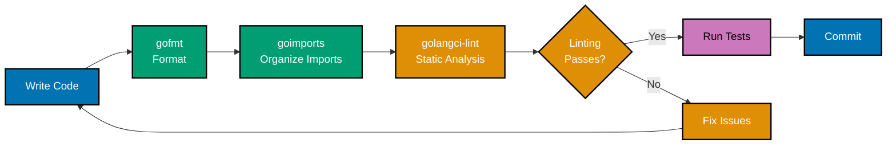
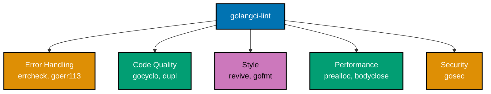
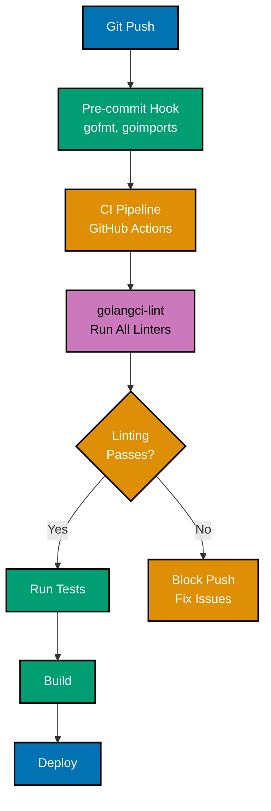
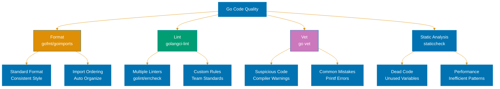
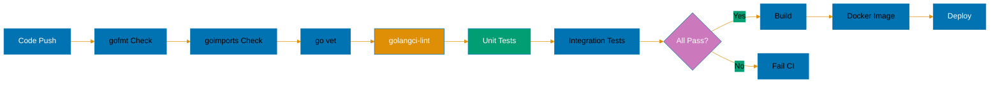
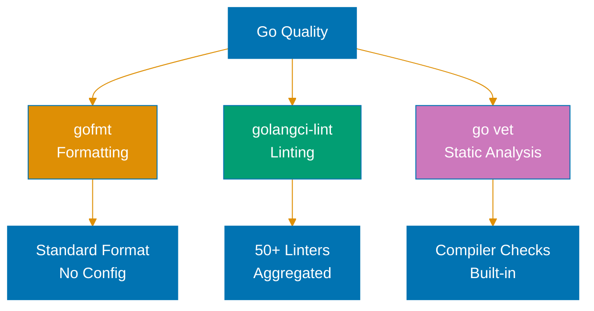

# Linting and Formatting in Go

**Quick Reference**: [Overview](#overview) | [Code Formatting](#code-formatting) | [Linting Tools](#linting-tools) | [golangci-lint Configuration](#golangci-lint-configuration) | [Common Linters](#common-linters) | [IDE Integration](#ide-integration) | [CI/CD Integration](#cicd-integration) | [Custom Linters](#custom-linters) | [Best Practices](#best-practices) | [Required Linters](#required-linters) | [Disabled Linters](#disabled-linters) | [Exceptions](#exceptions) | [Common Issues and Fixes](#common-issues-and-fixes) | [Related Documentation](#related-documentation) | [Further Reading](#further-reading)

## Overview

Go emphasizes code consistency and readability through standardized formatting and comprehensive linting. The Go ecosystem provides powerful tools for automatic code formatting (gofmt, goimports) and static analysis (go vet, staticcheck, golangci-lint) that enforce best practices and catch common errors before code review or runtime.

This document covers the essential tools and practices for maintaining high-quality, consistent Go code through automated formatting and linting.

## Code Formatting

### gofmt - Official Go Formatter

`gofmt` is the official Go code formatter that enforces a single, consistent style.

**Key Features**:

- Standardizes indentation (tabs, not spaces)
- Enforces brace style
- Aligns struct fields
- Formats comments
- Idempotent (running multiple times produces same result)

**Basic Usage**:

```bash
# Format single file (writes to stdout)
gofmt file.go

# Format and overwrite file
gofmt -w file.go

# Format all files in directory recursively
gofmt -w .

# Show diff instead of rewriting
gofmt -d file.go

# Simplify code (remove unnecessary parentheses, etc.)
gofmt -s -w file.go
```

**Example Formatting**:

Before gofmt:

```go
package main
import "fmt"
func main() {
x:=42
if x>0{
fmt.Println("positive")
}
}
```

After gofmt:

```go
package main

import "fmt"

func main() {
 x := 42
 if x > 0 {
  fmt.Println("positive")
 }
}
```

### goimports - Enhanced Formatter

`goimports` extends gofmt by automatically adding, removing, and organizing imports.

**Installation**:

```bash
go install golang.org/x/tools/cmd/goimports@latest
```

**Usage**:

```bash
# Format and fix imports
goimports -w file.go

# Format entire project
goimports -w .

# Show diff
goimports -d .
```

**Example Import Management**:

Before goimports:

```go
package main

import (
 "fmt"
 "os"
 "strings"
)

func main() {
 // Only using fmt, not os or strings
 fmt.Println("Hello")
}
```

After goimports:

```go
package main

import "fmt"

func main() {
 fmt.Println("Hello")
}
```

### Format on Save in IDEs

**VS Code**:

```json
{
  "editor.formatOnSave": true,
  "[go]": {
    "editor.defaultFormatter": "golang.go",
    "editor.codeActionsOnSave": {
      "source.organizeImports": true
    }
  }
}
```

**GoLand/IntelliJ**:

- Settings → Tools → Actions on Save
- Enable "Reformat code" and "Optimize imports"

**Vim/Neovim with vim-go**:

```vim
" .vimrc or init.vim
let g:go_fmt_command = "goimports"
let g:go_fmt_autosave = 1
```

## Linting Tools

### go vet - Official Linter

`go vet` examines Go source code and reports suspicious constructs.

```bash
# Vet single package
go vet .

# Vet specific file
go vet file.go

# Vet all packages in module
go vet ./...

# Verbose output
go vet -v ./...
```

**Common Issues Detected**:

```go
// Printf argument mismatch
fmt.Printf("%d", "string") // go vet: wrong type

// Unreachable code
func example() int {
 return 1
 fmt.Println("never executes") // go vet: unreachable code
}

// Shadowed variables
func shadow() {
 x := 1
 if true {
  x := 2 // go vet: shadows declaration
  _ = x
 }
}

// Struct tag issues
type Beneficiary struct {
 Name string `json:"name,omitempty"`
 Age  int    `json:"age,omitEmpty"` // go vet: unknown option (should be omitempty)
}
```

### staticcheck - Advanced Linter

`staticcheck` is a comprehensive static analysis tool for Go.

**Installation**:

```bash
go install honnef.co/go/tools/cmd/staticcheck@latest
```

**Usage**:

```bash
# Check current package
staticcheck .

# Check all packages
staticcheck ./...

# Output format
staticcheck -f stylish ./...
```

**Example Checks**:

```go
// Unused variable
func example() {
 x := 42 // staticcheck: x is unused
 return
}

// Ineffectual assignment
func ineffectual() {
 x := 1
 x = 2 // staticcheck: this value of x is never used
 x = 3
 _ = x
}

// Error not checked
func unchecked() {
 file, _ := os.Open("file.txt") // staticcheck: error not checked
 defer file.Close()
}

// Deprecated API usage
func deprecated() {
 // staticcheck: function deprecated since Go 1.16
 _ = ioutil.ReadFile("file.txt")
}
```

### golangci-lint - Linter Aggregator

`golangci-lint` runs multiple linters in parallel for comprehensive analysis.

**Installation**:

```bash
# Binary installation
curl -sSfL https://raw.githubusercontent.com/golangci/golangci-lint/master/install.sh | sh -s -- -b $(go env GOPATH)/bin v2.8.0

# Or with go install
go install github.com/golangci/golangci-lint/cmd/golangci-lint@v2.8.0
```

**Usage**:

```bash
# Run with default configuration
golangci-lint run

# Run specific linters
golangci-lint run --enable errcheck,gosimple,govet

# Run all linters
golangci-lint run --enable-all

# Generate configuration file
golangci-lint config

# Run with custom config
golangci-lint run --config .golangci.yml

# Fix issues automatically (where possible)
golangci-lint run --fix
```

## golangci-lint Configuration



### Basic .golangci.yml

```yaml
# .golangci.yml
run:
  timeout: 5m
  tests: true
  skip-dirs:
    - vendor
    - generated

linters:
  enable:
    - errcheck # Check unchecked errors
    - gosimple # Simplify code
    - govet # Official Go tool
    - ineffassign # Detect ineffectual assignments
    - staticcheck # Advanced checks
    - unused # Find unused code
    - gofmt # Check formatting
    - goimports # Check imports
    - misspell # Find misspelled words
    - revive # Fast linter

  disable:
    - deadcode # Deprecated (use unused instead)
    - structcheck # Deprecated (use unused instead)
    - varcheck # Deprecated (use unused instead)

linters-settings:
  errcheck:
    check-type-assertions: true
    check-blank: true

  govet:
    check-shadowing: true

  gofmt:
    simplify: true

  revive:
    severity: warning
    rules:
      - name: exported
        disabled: false
      - name: unexported-return
        disabled: false
```

### Comprehensive Configuration

```yaml
# .golangci.yml - Production configuration
run:
  timeout: 10m
  tests: true
  build-tags:
    - integration
  skip-dirs:
    - vendor
    - .git
    - node_modules
  skip-files:
    - ".*\\.pb\\.go$" # Skip protobuf generated files
    - ".*_mock\\.go$" # Skip mock files

output:
  format: colored-line-number
  print-issued-lines: true
  print-linter-name: true
  sort-results: true

linters:
  disable-all: true
  enable:
    # Essential linters
    - errcheck # Unchecked errors
    - gosimple # Simplifications
    - govet # Suspicious constructs
    - ineffassign # Ineffectual assignments
    - staticcheck # Advanced static analysis
    - unused # Unused code

    # Style linters
    - gofmt # Code formatting
    - goimports # Import formatting
    - gci # Import order
    - misspell # Misspelled words
    - whitespace # Whitespace issues

    # Code quality
    - dupl # Duplicate code
    - gocognit # Cognitive complexity
    - gocyclo # Cyclomatic complexity
    - goconst # Repeated strings
    - gocritic # Code quality checks
    - revive # Fast, flexible linter

    # Performance
    - prealloc # Slice preallocation
    - bodyclose # HTTP response body close

    # Security
    - gosec # Security issues

    # Errors
    - goerr113 # Error wrapping
    - errname # Error naming

    # Testing
    - testpackage # Test package naming
    - tparallel # Parallel test detection

linters-settings:
  errcheck:
    check-type-assertions: true
    check-blank: true
    exclude-functions:
      - (io.Closer).Close
      - (*database/sql.Rows).Close
      - (*database/sql.Stmt).Close

  govet:
    check-shadowing: true
    enable-all: true
    disable:
      - fieldalignment # Too strict for most projects

  gofmt:
    simplify: true

  goimports:
    local-prefixes: github.com/yourorg/yourproject

  gci:
    sections:
      - standard # Standard library
      - default # Everything else
      - prefix(github.com/yourorg) # Company packages

  revive:
    rules:
      - name: blank-imports
      - name: context-as-argument
      - name: dot-imports
      - name: error-return
      - name: error-strings
      - name: error-naming
      - name: exported
      - name: if-return
      - name: increment-decrement
      - name: indent-error-flow
      - name: package-comments
      - name: receiver-naming
      - name: time-naming
      - name: unexported-return
      - name: var-declaration
      - name: var-naming

  gocyclo:
    min-complexity: 15 # Maximum cyclomatic complexity

  gocognit:
    min-complexity: 20 # Maximum cognitive complexity

  goconst:
    min-len: 3
    min-occurrences: 3

  dupl:
    nisab: 150 # Tokens for duplicate detection

  gocritic:
    enabled-tags:
      - diagnostic
      - performance
      - style
      - experimental
    disabled-checks:
      - commentedOutCode
      - whyNoLint

  gosec:
    severity: medium
    confidence: medium
    excludes:
      - G104 # Audit errors not checked (covered by errcheck)

issues:
  exclude-rules:
    # Exclude linters for test files
    - path: _test\.go
      linters:
        - gocyclo
        - errcheck
        - dupl
        - gosec

    # Exclude specific linters for generated files
    - path: \.pb\.go$
      linters:
        - gofmt
        - goimports
        - govet

    # Allow unused parameters in interface implementations
    - text: "unused-parameter"
      linters:
        - revive

  max-issues-per-linter: 0
  max-same-issues: 0
  new: false # Report all issues (not just new)
```

## Common Linters



### Error Handling Linters

**errcheck** - Unchecked errors:

```go
// Bad - error ignored
file, _ := os.Open("file.txt")

// Good - error checked
file, err := os.Open("file.txt")
if err != nil {
 return err
}
defer file.Close()
```

**goerr113** - Error wrapping (Go 1.13+):

```go
// Bad - losing error context
if err != nil {
 return errors.New("failed to open file")
}

// Good - preserving error context
if err != nil {
 return fmt.Errorf("failed to open file: %w", err)
}
```

### Code Quality Linters

**gocyclo** - Cyclomatic complexity:

```go
// Bad - high complexity (complexity > 10)
func Complex(x int) int {
 if x > 0 {
  if x > 10 {
   if x > 20 {
    if x > 30 {
     return x * 4
    }
    return x * 3
   }
   return x * 2
  }
  return x
 }
 return 0
}

// Good - reduced complexity (use table)
func Simple(x int) int {
 thresholds := []struct {
  min, multiplier int
 }{
  {30, 4},
  {20, 3},
  {10, 2},
  {0, 1},
 }

 for _, t := range thresholds {
  if x > t.min {
   return x * t.multiplier
  }
 }
 return 0
}
```

**goconst** - Repeated constants:

```go
// Bad - magic strings repeated
func ProcessBad() {
 status := "pending"
 if status == "pending" { // repeated
  // ...
 }
}

// Good - use constants
const StatusPending = "pending"

func ProcessGood() {
 status := StatusPending
 if status == StatusPending {
  // ...
 }
}
```

**dupl** - Duplicate code:

```go
// Bad - duplicate logic
func ProcessUserBad(beneficiary Beneficiary) error {
 if beneficiary.Name == "" {
  return errors.New("name required")
 }
 if beneficiary.Email == "" {
  return errors.New("email required")
 }
 // Save beneficiary...
 return nil
}

func ProcessOrderBad(order Order) error {
 if order.ID == "" {
  return errors.New("id required")
 }
 if order.Amount == 0 {
  return errors.New("amount required")
 }
 // Save order...
 return nil
}

// Good - extract validation
func validateRequired(field, name string) error {
 if field == "" {
  return fmt.Errorf("%s required", name)
 }
 return nil
}

func ProcessUserGood(beneficiary Beneficiary) error {
 if err := validateRequired(beneficiary.Name, "name"); err != nil {
  return err
 }
 if err := validateRequired(beneficiary.Email, "email"); err != nil {
  return err
 }
 // Save beneficiary...
 return nil
}
```

### Style Linters

**revive** - Style checker:

```go
// Bad - exported function without comment
func Calculate(x, y int) int {
 return x + y
}

// Good - documented exported function
// Calculate adds two integers and returns the result.
func Calculate(x, y int) int {
 return x + y
}

// Bad - inconsistent receiver name
func (u *Beneficiary) GetName() string { return u.Name }
func (usr *Beneficiary) GetEmail() string { return usr.Email }

// Good - consistent receiver name
func (u *Beneficiary) GetName() string { return u.Name }
func (u *Beneficiary) GetEmail() string { return u.Email }
```

### Performance Linters

**prealloc** - Slice preallocation:

```go
// Bad - no preallocation
func BuildSliceBad(n int) []int {
 var result []int
 for i := 0; i < n; i++ {
  result = append(result, i)
 }
 return result
}

// Good - preallocated capacity
func BuildSliceGood(n int) []int {
 result := make([]int, 0, n)
 for i := 0; i < n; i++ {
  result = append(result, i)
 }
 return result
}
```

**bodyclose** - HTTP body close:

```go
// Bad - body not closed
func FetchBad(url string) error {
 resp, err := http.Get(url)
 if err != nil {
  return err
 }
 // Missing: defer resp.Body.Close()

 body, err := io.ReadAll(resp.Body)
 return err
}

// Good - body properly closed
func FetchGood(url string) error {
 resp, err := http.Get(url)
 if err != nil {
  return err
 }
 defer resp.Body.Close()

 body, err := io.ReadAll(resp.Body)
 return err
}
```

### Security Linters

**gosec** - Security issues:

```go
// Bad - SQL injection vulnerability
func QueryBad(db *sql.DB, name string) error {
 query := fmt.Sprintf("SELECT * FROM users WHERE name = '%s'", name)
 _, err := db.Exec(query) // gosec: G201
 return err
}

// Good - parameterized query
func QueryGood(db *sql.DB, name string) error {
 query := "SELECT * FROM users WHERE name = $1"
 _, err := db.Exec(query, name)
 return err
}

// Bad - weak random number generator
func GenerateTokenBad() string {
 return fmt.Sprintf("%d", rand.Int()) // gosec: G404
}

// Good - cryptographically secure random
func GenerateTokenGood() (string, error) {
 bytes := make([]byte, 32)
 _, err := crypto_rand.Read(bytes)
 if err != nil {
  return "", err
 }
 return hex.EncodeToString(bytes), nil
}
```

## IDE Integration

### VS Code

**Install Extension**:

- Install "Go" extension by Go Team at Google

**Settings** (.vscode/settings.json):

```json
{
  "go.useLanguageServer": true,
  "go.lintTool": "golangci-lint",
  "go.lintFlags": ["--fast"],
  "go.lintOnSave": "workspace",
  "go.formatTool": "goimports",
  "go.formatFlags": [],
  "editor.formatOnSave": true,
  "[go]": {
    "editor.codeActionsOnSave": {
      "source.organizeImports": true
    }
  },
  "gopls": {
    "analyses": {
      "unusedparams": true,
      "shadow": true
    },
    "staticcheck": true
  }
}
```

### GoLand/IntelliJ IDEA

**Setup**:

1. Settings → Tools → File Watchers
2. Add watchers for gofmt and goimports
3. Settings → Editor → Inspections → Go
4. Enable inspections (most enabled by default)

**External Tools**:

- Settings → Tools → External Tools → Add
- Program: golangci-lint
- Arguments: run $FileDir$

### Vim/Neovim

**vim-go plugin**:

```vim
" .vimrc or init.vim

" Use goimports for formatting
let g:go_fmt_command = "goimports"

" Format on save
let g:go_fmt_autosave = 1

" Linter configuration
let g:go_metalinter_command = "golangci-lint"
let g:go_metalinter_enabled = ['errcheck', 'govet', 'staticcheck']
let g:go_metalinter_autosave = 1

" Auto import on save
let g:go_auto_import = 1

" Highlight
let g:go_highlight_types = 1
let g:go_highlight_fields = 1
let g:go_highlight_functions = 1
let g:go_highlight_function_calls = 1
```

## CI/CD Integration



### GitHub Actions

```yaml
# .github/workflows/lint.yml
name: Lint

on:
  push:
    branches: [main]
  pull_request:
    branches: [main]

jobs:
  golangci:
    name: golangci-lint
    runs-on: ubuntu-latest
    steps:
      - uses: actions/checkout@v4

      - uses: actions/setup-go@v5
        with:
          go-version: "1.25"

      - name: golangci-lint
        uses: golangci/golangci-lint-action@v4
        with:
          version: v2.8.0
          args: --timeout=5m
```

### GitLab CI

```yaml
# .gitlab-ci.yml
lint:
  image: golangci/golangci-lint:v2.8.0
  stage: test
  script:
    - golangci-lint run -v
  only:
    - merge_requests
    - main
```

### Pre-commit Hooks

**Using Husky (if npm available)**:

```json
{
  "husky": {
    "hooks": {
      "pre-commit": "golangci-lint run --new-from-rev=HEAD~1"
    }
  }
}
```

**Using git hooks directly**:

```bash
#!/bin/sh
# .git/hooks/pre-commit

# Format code
goimports -w $(git diff --cached --name-only --diff-filter=ACM | grep '\.go$')

# Run linter on changed files
golangci-lint run --new-from-rev=HEAD~1

if [ $? -ne 0 ]; then
    echo "Linting failed. Please fix issues before committing."
    exit 1
fi
```

### Makefile Integration

```makefile
# Makefile
.PHONY: fmt lint test

fmt:
 goimports -w .
 gofmt -s -w .

lint:
 golangci-lint run ./...

lint-fix:
 golangci-lint run --fix ./...

test:
 go test -v -race -coverprofile=coverage.out ./...

check: fmt lint test

ci: check
 go test -v -race -coverprofile=coverage.out -covermode=atomic ./...
```

## Custom Linters

### Writing Custom Linters

Custom linters use the `go/analysis` framework.

**Example: Check for hardcoded credentials**:

```go
// hardcoded_creds_linter.go
package main

import (
 "go/ast"
 "strings"

 "golang.org/x/tools/go/analysis"
 "golang.org/x/tools/go/analysis/passes/inspect"
 "golang.org/x/tools/go/ast/inspector"
)

var Analyzer = &analysis.Analyzer{
 Name:     "hardcodedcreds",
 Doc:      "check for hardcoded credentials",
 Run:      run,
 Requires: []*analysis.Analyzer{inspect.Analyzer},
}

func run(pass *analysis.Pass) (interface{}, error) {
 inspect := pass.ResultOf[inspect.Analyzer].(*inspector.Inspector)

 nodeFilter := []ast.Node{
  (*ast.AssignStmt)(nil),
  (*ast.ValueSpec)(nil),
 }

 inspect.Preorder(nodeFilter, func(n ast.Node) {
  switch stmt := n.(type) {
  case *ast.AssignStmt:
   checkAssignment(pass, stmt)
  case *ast.ValueSpec:
   checkValueSpec(pass, stmt)
  }
 })

 return nil, nil
}

func checkAssignment(pass *analysis.Pass, stmt *ast.AssignStmt) {
 for i, lhs := range stmt.Lhs {
  if ident, ok := lhs.(*ast.Ident); ok {
   name := strings.ToLower(ident.Name)
   if strings.Contains(name, "password") ||
    strings.Contains(name, "secret") ||
    strings.Contains(name, "apikey") {
    if lit, ok := stmt.Rhs[i].(*ast.BasicLit); ok {
     if lit.Value != `""` && lit.Value != "``" {
      pass.Reportf(lit.Pos(),
       "potential hardcoded credential: %s",
       ident.Name)
     }
    }
   }
  }
 }
}

func checkValueSpec(pass *analysis.Pass, spec *ast.ValueSpec) {
 for i, name := range spec.Names {
  varName := strings.ToLower(name.Name)
  if strings.Contains(varName, "password") ||
   strings.Contains(varName, "secret") ||
   strings.Contains(varName, "apikey") {
   if i < len(spec.Values) {
    if lit, ok := spec.Values[i].(*ast.BasicLit); ok {
     if lit.Value != `""` && lit.Value != "``" {
      pass.Reportf(lit.Pos(),
       "potential hardcoded credential: %s",
       name.Name)
     }
    }
   }
  }
 }
}

func main() {
 multichecker.Main(Analyzer)
}
```

### Using Custom Linters

```bash
# Build custom linter
go build -o hardcoded_creds_linter ./cmd/linter

# Run custom linter
./hardcoded_creds_linter ./...

# Integrate with golangci-lint (plugins)
# Add to .golangci.yml:
linters-settings:
  custom:
    hardcodedcreds:
      path: ./bin/hardcoded_creds_linter
      description: Check for hardcoded credentials
      original-url: github.com/yourorg/linters
```

## Best Practices

### When to Disable Linters

Use `//nolint` sparingly and with justification:

```go
// Justified - intentional shadowing for clarity
func ProcessData() {
 data := loadData()

 if needsTransform {
  data := transformData(data) //nolint:govet // intentional shadow for clarity
  _ = data
 }
}

// Justified - performance-critical code
func FastPath() {
 //nolint:gosec // G104: using fast random generator intentionally
 value := rand.Intn(100)
 _ = value
}

// Not justified - hiding actual problem
func BadExample() {
 file, err := os.Open("file.txt")
 _ = err //nolint:errcheck // WRONG: should handle error
 file.Close()
}
```

### Configuration Guidelines

**Start conservative, then relax**:

```yaml
# Initial configuration - strict
linters:
  enable-all: true
  disable:
    - exhaustivestruct  # Too strict
    - gochecknoglobals  # Sometimes necessary
    - nlreturn          # Style preference

# Team configuration - practical
linters:
  disable-all: true
  enable:
    - errcheck
    - gosimple
    - govet
    - ineffassign
    - staticcheck
    - unused
    # Add more as team adapts
```

### Team Standards

Document linter decisions:

```markdown
# Linting Standards

## Required Linters

- **errcheck**: All errors must be checked
- **govet**: All suspicious constructs fixed
- **staticcheck**: All issues resolved

## Disabled Linters

- **exhaustivestruct**: Too strict for DTO/config structs
- **gochecknoglobals**: Acceptable for package-level config

## Exceptions

- Test files: Disable complexity checks
- Generated code: Disable all linters
```

## Common Issues and Fixes

### Unchecked Errors

**Issue**:

```go
file, _ := os.Open("file.txt") // errcheck: error return value not checked
```

**Fix**:

```go
file, err := os.Open("file.txt")
if err != nil {
 return fmt.Errorf("failed to open file: %w", err)
}
defer file.Close()
```

### Shadowed Variables

**Issue**:

```go
data, err := fetchData()
if err != nil {
 data, err := fetchFallbackData() // govet: shadows declaration
 // ...
}
```

**Fix**:

```go
data, err := fetchData()
if err != nil {
 fallbackData, err := fetchFallbackData()
 if err != nil {
  return err
 }
 data = fallbackData
}
```

### Ineffectual Assignment

**Issue**:

```go
func process() int {
 x := 1
 x = 2  // ineffassign: x is never used after this
 x = 3
 return x
}
```

**Fix**:

```go
func process() int {
 x := 3  // Remove intermediate assignments
 return x
}
```

### Exported Without Comment

**Issue**:

```go
type Beneficiary struct { // revive: exported type should have comment
 Name string
}
```

**Fix**:

```go
// Beneficiary represents a system beneficiary with name and credentials.
type Beneficiary struct {
 Name string
}
```

### Cyclomatic Complexity

**Issue**:

```go
func Complex(x int) int { // gocyclo: complexity 12
 // Many nested conditions...
}
```

**Fix - Extract functions**:

```go
func Complex(x int) int {
 if isPositive(x) {
  return handlePositive(x)
 }
 return handleNegative(x)
}

func isPositive(x int) bool {
 return x > 0
}

func handlePositive(x int) int {
 // Handle positive case
}

func handleNegative(x int) int {
 // Handle negative case
}
```

## Related Documentation

- [Best Practices](./ex-soen-prla-go__coding-standards.md#part-2-naming--organization-best-practices) - Code quality and style guidelines
- [Idioms](./ex-soen-prla-go__coding-standards.md#part-1-core-idioms) - Idiomatic Go patterns
- [Anti-Patterns](./ex-soen-prla-go__coding-standards.md#part-3-anti-patterns-to-avoid) - Common mistakes to avoid

## Further Reading

- [golangci-lint Documentation](https://golangci-lint.run/) - Official golangci-lint docs
- [Effective Go](https://go.dev/doc/effective_go) - Official Go style guide
- [Go Code Review Comments](https://go.dev/wiki/CodeReviewComments) - Code review guidelines
- [staticcheck Documentation](https://staticcheck.io/docs/) - staticcheck checks reference
- [go/analysis Package](https://pkg.go.dev/golang.org/x/tools/go/analysis) - Custom linter framework

---

**Last Updated**: 2026-01-23
**Go Version**: 1.21+ (baseline), 1.22+ (recommended), 1.23 (latest)
**Maintainers**: Platform Documentation Team

## Go Code Quality Tools



## CI/CD Quality Pipeline



## Go Quality Tools


