title: Go Concurrency and Parallelism
description: Comprehensive guide to concurrent programming with goroutines, channels, and the sync package
category: explanation
subcategory: prog-lang-golang
tags:

- golang
- concurrency
- parallelism
- goroutines
- channels
- sync
- context
  principles:
- immutability
- explicit-over-implicit

---

# Go Concurrency and Parallelism

**Quick Reference**: [Overview](#overview) | [Concurrency vs Parallelism](#concurrency-vs-parallelism) | [Goroutines](#goroutines) | [Channels](#channels) | [Select Statement](#select-statement) | [Sync Package](#sync-package) | [Context Package](#context-package) | [Common Patterns](#common-patterns) | [Race Conditions](#race-conditions) | [Deadlocks](#deadlocks) | [Performance Considerations](#performance-considerations) | [Testing Concurrent Code](#testing-concurrent-code) | [Best Practices](#best-practices) | [Related Documentation](#related-documentation)
**Understanding-oriented documentation** for concurrent and parallel programming in Go.

## Overview

Concurrency is one of Go's defining features, built into the language from the ground up. This guide covers goroutines, channels, synchronization primitives, and patterns for building robust concurrent systems.

**Key Concepts**:

- **Goroutines**: Lightweight threads managed by the Go runtime
- **Channels**: Type-safe communication between goroutines
- **Select**: Multiplexing channel operations
- **Sync package**: Mutexes, wait groups, and synchronization primitives
- **Context**: Cancellation and deadline propagation
- **Patterns**: Producer-consumer, fan-out/fan-in, pipelines

**Philosophy**: "Don't communicate by sharing memory; share memory by communicating."

## Concurrency vs Parallelism

### Definitions

**Concurrency**: Dealing with multiple things at once (composition of independently executing processes)

**Parallelism**: Doing multiple things at once (simultaneous execution of computations)

Rob Pike's quote: "Concurrency is about structure, parallelism is about execution."

### Example Distinction

```go
// Concurrent: Handle multiple HTTP requests
// Requests are handled independently (structure)
func handleRequests() {
    for request := range requests {
        go handleRequest(request) // Concurrent execution
    }
}

// Parallel: Process array elements on multiple CPUs
// Elements are processed simultaneously (execution)
func processArrayParallel(data []int) []int {
    numCPUs := runtime.NumCPU()
    chunkSize := len(data) / numCPUs

    results := make([]int, len(data))
    var wg sync.WaitGroup

    for i := 0; i < numCPUs; i++ {
        wg.Add(1)
        start := i * chunkSize
        end := start + chunkSize
        if i == numCPUs-1 {
            end = len(data) // Handle remainder
        }

        go func(start, end int) {
            defer wg.Done()
            for j := start; j < end; j++ {
                results[j] = expensiveComputation(data[j])
            }
        }(start, end)
    }

    wg.Wait()
    return results
}
```

### Go Scheduler (M:N Scheduling)

Go uses M:N scheduling where **M goroutines** run on **N OS threads**:


**Scheduler Characteristics**:

- **Lightweight goroutines**: Start with 2KB stack (vs 1-2MB for OS threads)
- **Fast creation**: ~1-2 microseconds to create a goroutine
- **Cooperative scheduling**: Goroutines yield at function calls, channel operations, blocking syscalls
- **Work-stealing**: Idle OS threads steal goroutines from busy threads
- **GOMAXPROCS**: Controls number of OS threads (defaults to number of CPUs)

```go
import "runtime"

func main() {
    // Get number of CPUs
    numCPU := runtime.NumCPU()
    fmt.Printf("Number of CPUs: %d\n", numCPU)

    // Set max OS threads (default is NumCPU())
    runtime.GOMAXPROCS(numCPU)

    // Get number of currently running goroutines
    numGoroutines := runtime.NumGoroutine()
    fmt.Printf("Number of goroutines: %d\n", numGoroutines)
}
```

## Goroutines

### What is a Goroutine?

A goroutine is a lightweight thread managed by the Go runtime. Unlike OS threads, goroutines are:

- **Cheap to create**: ~2KB initial stack size
- **Fast to start**: ~1-2 microseconds
- **Scalable**: Can run millions of goroutines
- **Cooperatively scheduled**: Yield at blocking operations

### Creating Goroutines

Use the `go` keyword before a function call:

```go
// Launch goroutine with named function
go processData(data)

// Launch goroutine with anonymous function
go func() {
    fmt.Println("Hello from goroutine")
}()

// Launch goroutine with closure
for i := 0; i < 10; i++ {
    // CORRECT: Pass loop variable as parameter
    go func(id int) {
        fmt.Printf("Goroutine %d\n", id)
    }(i)
}
```

### Loop Variable Capture (Important!)

```go
// Go 1.21 and earlier: Loop variable is captured by reference
for i := 0; i < 3; i++ {
    // WRONG: All goroutines see final value of i
    go func() {
        fmt.Println(i) // Likely prints "3 3 3"
    }()
}

// CORRECT: Pass i as parameter
for i := 0; i < 3; i++ {
    go func(id int) {
        fmt.Println(id) // Prints "0 1 2" (order may vary)
    }(i)
}

// Go 1.22+: Each iteration creates new variable (fix is built-in)
for i := 0; i < 3; i++ {
    go func() {
        fmt.Println(i) // Now safe! Prints "0 1 2" (order may vary)
    }()
}
```

### Goroutine Lifecycle


**States**:

- **Created**: Goroutine launched with `go` keyword
- **Runnable**: Ready to execute, waiting for OS thread
- **Running**: Executing on OS thread
- **Blocked**: Waiting for channel, I/O, or time.Sleep
- **Terminated**: Function returned

### Simple Goroutine Example

```go
package main

import (
    "fmt"
    "time"
)

func worker(id int) {
    fmt.Printf("Worker %d starting\n", id)
    time.Sleep(time.Second)
    fmt.Printf("Worker %d done\n", id)
}

func main() {
    // Launch 5 worker goroutines
    for i := 1; i <= 5; i++ {
        go worker(i)
    }

    // Wait for goroutines (use sync.WaitGroup in production!)
    time.Sleep(2 * time.Second)

    fmt.Println("All workers finished")
}
```

Output (order may vary):

```
Worker 1 starting
Worker 2 starting
Worker 3 starting
Worker 4 starting
Worker 5 starting
Worker 1 done
Worker 2 done
Worker 3 done
Worker 4 done
Worker 5 done
All workers finished
```

### Goroutine Memory Model

Each goroutine has:

- **Stack**: Grows/shrinks automatically (starts at 2KB)
- **No shared state by default**: Isolation unless explicitly shared

```go
func goroutineStack() {
    // Each goroutine has its own stack
    var localVar int = 42 // Lives on goroutine's stack

    go func() {
        // This goroutine has separate stack
        var anotherVar int = 100
        fmt.Println(anotherVar)
    }()

    fmt.Println(localVar)
}
```

## Channels

### What is a Channel?

Channels are typed conduits for communication between goroutines:

- **Type-safe**: Only specific types can be sent/received
- **Synchronization primitive**: Coordinate goroutines
- **Thread-safe**: Safe for concurrent access
- **First-class values**: Can be passed as parameters, stored in structs

**Philosophy**: Share memory by communicating (don't communicate by sharing memory)

### Creating Channels

```go
// Unbuffered channel (synchronous communication)
ch := make(chan int)

// Buffered channel (capacity of 10)
ch := make(chan string, 10)

// Channel of channels
ch := make(chan chan int)

// Channel of structs
type Message struct {
    ID   int
    Data string
}
ch := make(chan Message)
```

### Channel Operations

```go
// Send value (blocks until received for unbuffered)
ch <- 42

// Receive value
value := <-ch

// Receive with ok check (check if channel closed)
value, ok := <-ch
if !ok {
    fmt.Println("Channel closed")
}

// Close channel (sender's responsibility only!)
close(ch)

// Get channel length and capacity
fmt.Printf("Length: %d, Capacity: %d\n", len(ch), cap(ch))
```

### Buffered vs Unbuffered Channels

#### Channel Communication Patterns


```go
// Unbuffered: Synchronous communication
unbuffered := make(chan int)
go func() {
    unbuffered <- 1 // Blocks until main receives
}()
value := <-unbuffered // Blocks until goroutine sends
fmt.Println(value) // 1

// Buffered: Asynchronous up to capacity
buffered := make(chan int, 2)
buffered <- 1 // Doesn't block (space available)
buffered <- 2 // Doesn't block (capacity reached)
// buffered <- 3 // Would block until someone receives

fmt.Println(<-buffered) // 1
fmt.Println(<-buffered) // 2
```

#### 🔄 Channel Buffering Behavior (State Diagram)


**Key Differences**:

| **Aspect**          | **Unbuffered (cap=0)**        | **Buffered (cap>0)**       |
| ------------------- | ----------------------------- | -------------------------- |
| **Capacity**        | 0 (no buffer)                 | N (buffer size)            |
| **Send Blocks**     | Always (until receiver ready) | Only when buffer full      |
| **Receive Blocks**  | Always (until sender ready)   | Only when buffer empty     |
| **Synchronization** | Guaranteed rendezvous         | Decoupled send/receive     |
| **Use Case**        | Coordination, synchronization | Rate limiting, work queues |

### Channel Direction (Send/Receive Only)

```go
// Producer: Send-only channel
func producer(ch chan<- int) {
    for i := 0; i < 10; i++ {
        ch <- i
    }
    close(ch) // Producer closes when done
}

// Consumer: Receive-only channel
func consumer(ch <-chan int) {
    for value := range ch { // Range exits when closed
        fmt.Println(value)
    }
}

func main() {
    ch := make(chan int, 5)
    go producer(ch)
    consumer(ch)
}
```

**Benefits**:

- **Type safety**: Compiler prevents sending on receive-only channel
- **Intent clarity**: API documents channel direction
- **Prevents bugs**: Can't accidentally close receive-only channel

### Range Over Channels

```go
ch := make(chan int, 5)

// Producer goroutine
go func() {
    for i := 0; i < 5; i++ {
        ch <- i
    }
    close(ch) // Important: signal no more values
}()

// Consumer: range exits when channel closed
for value := range ch {
    fmt.Println(value)
}
// Output: 0 1 2 3 4 (order guaranteed)
```

### Channel Closing Rules

**Important Rules**:

1. **Only sender closes**: Closing signals no more values from sender
2. **Close is optional**: GC will clean up unclosed channels
3. **Send to closed channel panics**: Check before sending if necessary
4. **Receive from closed channel**: Returns zero value with `ok=false`
5. **Close closed channel panics**: Never close twice

```go
ch := make(chan int, 2)
ch <- 1
ch <- 2
close(ch)

// Safe: receive from closed channel
v1, ok1 := <-ch // v1=1, ok1=true (buffered value)
v2, ok2 := <-ch // v2=2, ok2=true (buffered value)
v3, ok3 := <-ch // v3=0, ok3=false (closed, no more values)

// PANIC: send to closed channel
// ch <- 3 // runtime error!

// PANIC: close closed channel
// close(ch) // runtime error!
```

### Nil Channels

```go
var ch chan int // nil channel

// Send to nil channel blocks forever
// ch <- 1 // deadlock!

// Receive from nil channel blocks forever
// <-ch // deadlock!

// Close nil channel panics
// close(ch) // panic!

// Useful for disabling select cases
select {
case ch <- 1: // Never executes if ch is nil
    fmt.Println("Sent")
case <-ch: // Never executes if ch is nil
    fmt.Println("Received")
}
```

## Select Statement

### What is Select?

`select` multiplexes channel operations, similar to `switch` for channels:

- Waits until one case can proceed
- Chooses randomly if multiple cases ready
- Default case executes immediately if no channel ready
- Non-blocking when used with default

### 🔀 Select Statement Execution Flow

```mermaid
%% Color Palette: Blue #0173B2, Orange #DE8F05, Teal #029E73, Purple #CC78BC, Brown #CA9161
%% All colors are color-blind friendly and meet WCAG AA contrast standards

graph TD
    A["Enter Select"]:::blue --> B["Evaluate All Cases"]:::orange

    B --> C{"Any Case<br/>Ready?"}:::orange

    C -->|"Multiple Ready"| D["🎲 Random<br/>Selection"]:::purple
    C -->|"One Ready"| E["Execute<br/>That Case"]:::teal
    C -->|"None Ready"| F{"Has Default<br/>Case?"}:::orange

    D --> E

    F -->|"Yes"| G["Execute<br/>Default"]:::brown
    F -->|"No"| H["⏳ Block Until<br/>Case Ready"]:::purple

    H --> I{"Case Becomes<br/>Ready"}:::orange
    I -->|"Yes"| E
    I -->|"Timeout/Cancel"| J["Context Done"]:::brown

    E --> K["✅ Select<br/>Completes"]:::teal
    G --> K
    J --> K

    classDef blue fill:#0173B2,stroke:#000000,color:#FFFFFF,stroke-width:2px
    classDef orange fill:#DE8F05,stroke:#000000,color:#000000,stroke-width:2px
    classDef teal fill:#029E73,stroke:#000000,color:#FFFFFF,stroke-width:2px
    classDef purple fill:#CC78BC,stroke:#000000,color:#000000,stroke-width:2px
    classDef brown fill:#CA9161,stroke:#000000,color:#000000,stroke-width:2px
```



**Select Behavior**:

| **Scenario**           | **Behavior**                                  |
| ---------------------- | --------------------------------------------- |
| No cases ready         | Blocks until at least one ready               |
| One case ready         | Executes that case immediately                |
| Multiple cases ready   | Randomly selects one (fair scheduling)        |
| Has `default` clause   | Never blocks (executes default if none ready) |
| Nil channel in case    | That case is disabled (never selected)        |
| Closed channel receive | Always ready (returns zero value, ok=false)   |

**Common Patterns**:

```go
// Pattern 1: Timeout
select {
case msg := <-ch:
  // Process message
case <-time.After(5 * time.Second):
  // Handle timeout
}

// Pattern 2: Non-blocking
select {
case ch <- value:
  // Sent successfully
default:
  // Channel full, skip
}

// Pattern 3: Cancellation
select {
case <-ctx.Done():
  return ctx.Err()
case result := <-workCh:
  return result
}

// Pattern 4: Multiplex
select {
case msg1 := <-ch1:
  process(msg1)
case msg2 := <-ch2:
  process(msg2)
case msg3 := <-ch3:
  process(msg3)
}
```

### Basic Select

```go
select {
case msg := <-ch1:
    fmt.Println("Received from ch1:", msg)
case msg := <-ch2:
    fmt.Println("Received from ch2:", msg)
case ch3 <- value:
    fmt.Println("Sent to ch3")
}
```

### Select with Default (Non-blocking)

```go
select {
case msg := <-ch:
    fmt.Println("Received:", msg)
default:
    fmt.Println("No message available")
    // Continues immediately
}
```

### Select with Timeout

```go
select {
case msg := <-ch:
    fmt.Println("Received:", msg)
case <-time.After(time.Second):
    fmt.Println("Timeout after 1 second")
}
```

### Common Select Patterns

```go
// Pattern 1: Timeout
func receiveWithTimeout(ch <-chan string, timeout time.Duration) (string, error) {
    select {
    case msg := <-ch:
        return msg, nil
    case <-time.After(timeout):
        return "", fmt.Errorf("timeout after %v", timeout)
    }
}

// Pattern 2: Non-blocking send
func trySend(ch chan<- int, value int) bool {
    select {
    case ch <- value:
        return true
    default:
        return false // Channel full
    }
}

// Pattern 3: Non-blocking receive
func tryReceive(ch <-chan int) (int, bool) {
    select {
    case value := <-ch:
        return value, true
    default:
        return 0, false // Nothing available
    }
}

// Pattern 4: Graceful shutdown
func worker(done <-chan struct{}) {
    ticker := time.NewTicker(time.Second)
    defer ticker.Stop()

    for {
        select {
        case <-done:
            fmt.Println("Shutting down")
            return
        case <-ticker.C:
            doWork()
        }
    }
}

// Pattern 5: Multiple channel fan-in
func fanIn(ch1, ch2 <-chan int) <-chan int {
    out := make(chan int)
    go func() {
        defer close(out)
        for ch1 != nil || ch2 != nil {
            select {
            case v, ok := <-ch1:
                if !ok {
                    ch1 = nil // Disable this case
                    continue
                }
                out <- v
            case v, ok := <-ch2:
                if !ok {
                    ch2 = nil // Disable this case
                    continue
                }
                out <- v
            }
        }
    }()
    return out
}
```

## Sync Package

The `sync` package provides synchronization primitives for coordinating goroutines.

### Synchronization Primitive Selection


**Key Principles**:

- **sync.Mutex**: Mutual exclusion for shared state
  - Only one goroutine can hold the lock
  - Use for write-heavy or mixed access patterns

- **sync.RWMutex**: Read-write lock optimization
  - Multiple readers can hold RLock simultaneously
  - Writers get exclusive Lock
  - Use when reads >> writes (10:1 or higher)

- **sync.WaitGroup**: Wait for goroutines to complete
  - `Add(n)` before spawning goroutines
  - `Done()` in each goroutine when finished
  - `Wait()` blocks until count reaches zero

- **sync.Once**: Execute exactly once
  - Thread-safe initialization
  - Lazy loading patterns
  - Singleton creation

- **sync.Pool**: Reusable object pool
  - Reduce GC pressure
  - Temporary objects
  - Not for long-lived connections

**Islamic Finance Examples**:

```go
// Mutex: Protect donation counter
type DonationCounter struct {
    mu    sync.Mutex
    total decimal.Decimal
}

func (dc *DonationCounter) Add(amount decimal.Decimal) {
    dc.mu.Lock()
    defer dc.mu.Unlock()
    dc.total = dc.total.Add(amount)
}

// RWMutex: Cache with frequent reads
type ZakatRateCache struct {
    mu    sync.RWMutex
    rates map[string]decimal.Decimal
}

func (zrc *ZakatRateCache) Get(currency string) decimal.Decimal {
    zrc.mu.RLock() // Many readers can acquire RLock
    defer zrc.mu.RUnlock()
    return zrc.rates[currency]
}

func (zrc *ZakatRateCache) Update(currency string, rate decimal.Decimal) {
    zrc.mu.Lock() // Exclusive lock for writing
    defer zrc.mu.Unlock()
    zrc.rates[currency] = rate
}

// WaitGroup: Process batch of donations
var wg sync.WaitGroup
for _, donation := range donations {
    wg.Add(1)
    go func(d Donation) {
        defer wg.Done()
        processDonation(d)
    }(donation)
}
wg.Wait() // Wait for all to complete

// Once: Initialize database connection once
var (
    db   *sql.DB
    once sync.Once
)

func GetDB() *sql.DB {
    once.Do(func() {
        db, _ = sql.Open("postgres", connString)
    })
    return db
}
```

### sync.Mutex (Mutual Exclusion Lock)

Protects shared state from concurrent access:

```go
type SafeCounter struct {
    mu    sync.Mutex
    count int
}

func (c *SafeCounter) Increment() {
    c.mu.Lock()
    defer c.mu.Unlock()
    c.count++
}

func (c *SafeCounter) Value() int {
    c.mu.Lock()
    defer c.mu.Unlock()
    return c.count
}

func main() {
    counter := SafeCounter{}
    var wg sync.WaitGroup

    // 1000 goroutines incrementing
    for i := 0; i < 1000; i++ {
        wg.Add(1)
        go func() {
            defer wg.Done()
            counter.Increment()
        }()
    }

    wg.Wait()
    fmt.Println("Final count:", counter.Value()) // Always 1000
}
```

**Key Points**:

- Always use `defer` to unlock
- Keep critical sections small
- Don't hold locks across expensive operations

### sync.RWMutex (Read-Write Lock)

Allows multiple readers OR single writer:

```go
type SafeMap struct {
    mu   sync.RWMutex
    data map[string]int
}

func NewSafeMap() *SafeMap {
    return &SafeMap{
        data: make(map[string]int),
    }
}

func (m *SafeMap) Get(key string) (int, bool) {
    m.mu.RLock() // Multiple readers can hold RLock
    defer m.mu.RUnlock()
    val, ok := m.data[key]
    return val, ok
}

func (m *SafeMap) Set(key string, value int) {
    m.mu.Lock() // Exclusive lock for writing
    defer m.mu.Unlock()
    m.data[key] = value
}

func (m *SafeMap) Keys() []string {
    m.mu.RLock()
    defer m.mu.RUnlock()

    keys := make([]string, 0, len(m.data))
    for k := range m.data {
        keys = append(keys, k)
    }
    return keys
}
```

**When to use**:

- Reads are much more frequent than writes
- Read operations are expensive enough to justify locking overhead

### sync.WaitGroup

Waits for collection of goroutines to finish:

```go
func processItems(items []string) {
    var wg sync.WaitGroup

    for _, item := range items {
        wg.Add(1) // Increment counter before goroutine

        go func(item string) {
            defer wg.Done() // Decrement when done
            processItem(item)
        }(item)
    }

    wg.Wait() // Block until counter reaches 0
    fmt.Println("All items processed")
}
```

**Best Practices**:

- Call `Add` before launching goroutine
- Use `defer Done()` to ensure it's called
- Never copy WaitGroup (pass by pointer)

### sync.Once

Executes function exactly once:

```go
var (
    instance *Database
    once     sync.Once
)

func GetDatabase() *Database {
    once.Do(func() {
        fmt.Println("Initializing database...")
        instance = &Database{
            conn: connect(),
        }
    })
    return instance
}

// Thread-safe singleton
func main() {
    var wg sync.WaitGroup
    for i := 0; i < 10; i++ {
        wg.Add(1)
        go func() {
            defer wg.Done()
            db := GetDatabase() // Only initialized once
            db.Query()
        }()
    }
    wg.Wait()
}
```

**Use cases**:

- Lazy initialization
- Singleton pattern
- One-time setup

### sync.Pool

Reusable object pool to reduce GC pressure:

```go
var bufferPool = sync.Pool{
    New: func() interface{} {
        return new(bytes.Buffer)
    },
}

func formatData(data string) string {
    // Get buffer from pool
    buf := bufferPool.Get().(*bytes.Buffer)
    defer func() {
        buf.Reset()
        bufferPool.Put(buf) // Return to pool
    }()

    buf.WriteString("Formatted: ")
    buf.WriteString(data)
    return buf.String()
}
```

**When to use**:

- Temporary objects created frequently
- Allocation cost is significant
- Object can be reset/reused

**Important**: Objects in pool may be garbage collected at any time

### sync.Cond (Condition Variable)

Coordinate goroutines waiting for conditions:

```go
type Queue struct {
    mu    sync.Mutex
    cond  *sync.Cond
    items []int
    max   int
}

func NewQueue(max int) *Queue {
    q := &Queue{max: max}
    q.cond = sync.NewCond(&q.mu)
    return q
}

func (q *Queue) Enqueue(item int) {
    q.mu.Lock()
    defer q.mu.Unlock()

    // Wait until space available
    for len(q.items) >= q.max {
        q.cond.Wait() // Releases lock and waits
    }

    q.items = append(q.items, item)
    q.cond.Signal() // Wake one waiting Dequeue
}

func (q *Queue) Dequeue() int {
    q.mu.Lock()
    defer q.mu.Unlock()

    // Wait until items available
    for len(q.items) == 0 {
        q.cond.Wait()
    }

    item := q.items[0]
    q.items = q.items[1:]
    q.cond.Signal() // Wake one waiting Enqueue
    return item
}
```

**Note**: Channels are usually better than `sync.Cond` for most use cases.

### sync.Map

Concurrent map optimized for specific patterns:

```go
var cache sync.Map

// Store key-value
cache.Store("key", "value")

// Load value
if value, ok := cache.Load("key"); ok {
    fmt.Println(value.(string))
}

// LoadOrStore atomically
actual, loaded := cache.LoadOrStore("key", "value")
if loaded {
    fmt.Println("Existing value:", actual)
} else {
    fmt.Println("Stored new value")
}

// LoadAndDelete atomically
value, loaded := cache.LoadAndDelete("key")

// Delete
cache.Delete("key")

// Range over all entries
cache.Range(func(key, value interface{}) bool {
    fmt.Printf("%v: %v\n", key, value)
    return true // Continue iteration (false stops)
})
```

**When to use**:

- Entry written once, read many times
- Multiple goroutines access disjoint key sets
- High contention

**When NOT to use**:

- General-purpose map usage
- Use `map` with `sync.RWMutex` for most cases

## Context Package

The `context` package provides a standard way to carry deadlines, cancellation signals, and request-scoped values.

### Context Cancellation Propagation

```mermaid
%% Color Palette: Blue #0173B2, Orange #DE8F05, Teal #029E73, Purple #CC78BC
%% All colors are color-blind friendly and meet WCAG AA contrast standards

sequenceDiagram
    participant Main as Main Goroutine
    participant Parent as Parent Context
    participant Child1 as Child Context 1
    participant Child2 as Child Context 2
    participant G1 as Goroutine 1
    participant G2 as Goroutine 2

    Main->>Parent: ctx, cancel := context.WithCancel()
    activate Parent

    Main->>Child1: childCtx1 := context.WithValue(ctx, ...)
    activate Child1

    Main->>Child2: childCtx2, _ := context.WithTimeout(ctx, 5s)
    activate Child2

    Main->>G1: go worker(childCtx1)
    activate G1
    G1->>G1: select { case <-ctx.Done(): ... }

    Main->>G2: go worker(childCtx2)
    activate G2
    G2->>G2: select { case <-ctx.Done(): ... }

    alt Explicit Cancellation
        Main->>Parent: cancel()
        Parent->>Child1: Propagate cancellation
        Parent->>Child2: Propagate cancellation
        deactivate Parent

        Child1->>G1: ctx.Done() closed
        deactivate Child1
        G1-->>Main: Return early
        deactivate G1

        Child2->>G2: ctx.Done() closed
        deactivate Child2
        G2-->>Main: Return early
        deactivate G2
    else Timeout Exceeded
        Child2->>Child2: Timeout after 5s
        deactivate Child2
        Child2->>G2: ctx.Done() closed
        G2-->>Main: Return with DeadlineExceeded
        deactivate G2
    end

    Note over Main,G2: All child contexts canceled<br/>when parent canceled
    Note over Child2,G2: Timeout contexts auto-cancel
```

**Key Principles**:

- **Context Tree**: Contexts form a tree structure
  - Parent context cancellation propagates to all children
  - Child cancellation does NOT affect parent

- **Cancellation Propagation**:
  - Manual: Call `cancel()` function
  - Timeout: Automatic after duration
  - Deadline: Automatic at specific time

- **Context Values**:
  - Immutable chain of key-value pairs
  - Inherited by child contexts
  - Use sparingly (request-scoped data only)

- **Best Practices**:
  - Always call `cancel()` (use `defer`)
  - Pass context as first parameter
  - Don't store contexts in structs

**Islamic Finance Example**:

```go
// Process donation batch with timeout
func processDonationBatch(donations []Donation) error {
    // Parent context with 30-second timeout
    ctx, cancel := context.WithTimeout(context.Background(), 30*time.Second)
    defer cancel() // ALWAYS defer cancel

    // Process donations concurrently
    errChan := make(chan error, len(donations))

    for _, donation := range donations {
        go func(d Donation) {
            // Each goroutine checks context
            select {
            case <-ctx.Done():
                errChan <- ctx.Err() // Timeout or cancellation
                return
            default:
                // Process donation
                if err := validateDonation(ctx, d); err != nil {
                    errChan <- err
                    return
                }

                if err := saveDonation(ctx, d); err != nil {
                    errChan <- err
                    return
                }

                errChan <- nil
            }
        }(donation)
    }

    // Collect results
    for i := 0; i < len(donations); i++ {
        if err := <-errChan; err != nil {
            cancel() // Cancel remaining work
            return err
        }
    }

    return nil
}

// HTTP handler with request context
func handleDonationRequest(w http.ResponseWriter, r *http.Request) {
    // Request context automatically canceled when client disconnects
    ctx := r.Context()

    // Add request-scoped values
    ctx = context.WithValue(ctx, "requestID", generateID())

    // Pass context to downstream operations
    donation, err := fetchDonation(ctx, r.URL.Query().Get("id"))
    if err != nil {
        if err == context.Canceled {
            // Client disconnected
            return
        }
        http.Error(w, err.Error(), http.StatusInternalServerError)
        return
    }

    json.NewEncoder(w).Encode(donation)
}

// Context-aware database query
func validateDonation(ctx context.Context, d Donation) error {
    // Query respects context cancellation
    row := db.QueryRowContext(ctx, "SELECT valid FROM donations WHERE id = $1", d.ID)

    var valid bool
    if err := row.Scan(&valid); err != nil {
        if err == context.DeadlineExceeded {
            return fmt.Errorf("validation timeout")
        }
        return err
    }

    if !valid {
        return fmt.Errorf("invalid donation")
    }

    return nil
}
```

### Context Purposes

1. **Cancellation propagation**: Cancel operations across API boundaries
2. **Deadline/timeout**: Automatic cancellation after duration
3. **Request-scoped values**: Pass request metadata (use sparingly!)

### Creating Contexts

```go
import "context"

// Root contexts (use as starting point)
ctx := context.Background() // Never canceled, typical for main/init
ctx := context.TODO()       // Placeholder when context unclear

// Cancellation contexts
ctx, cancel := context.WithCancel(context.Background())
defer cancel() // Always call to release resources

// Timeout contexts
ctx, cancel := context.WithTimeout(context.Background(), 5*time.Second)
defer cancel()

// Deadline contexts
deadline := time.Now().Add(time.Hour)
ctx, cancel := context.WithDeadline(context.Background(), deadline)
defer cancel()

// Context with value (use sparingly!)
ctx := context.WithValue(context.Background(), "userID", 123)
```

### Using Context for Cancellation

```go
func doWork(ctx context.Context) error {
    for {
        select {
        case <-ctx.Done():
            // Context canceled or deadline exceeded
            return ctx.Err() // Returns context.Canceled or context.DeadlineExceeded
        default:
            // Do work
            if err := workStep(); err != nil {
                return err
            }
        }
    }
}

// Simpler check without select
func doWork2(ctx context.Context) error {
    if err := ctx.Err(); err != nil {
        return err // Already canceled
    }

    // Do work...
    return nil
}
```

### Context with HTTP Requests

```go
func fetchURL(ctx context.Context, url string) ([]byte, error) {
    // Create request with context
    req, err := http.NewRequestWithContext(ctx, "GET", url, nil)
    if err != nil {
        return nil, err
    }

    // HTTP client respects context cancellation
    resp, err := http.DefaultClient.Do(req)
    if err != nil {
        return nil, err
    }
    defer resp.Body.Close()

    return io.ReadAll(resp.Body)
}

func main() {
    ctx, cancel := context.WithTimeout(context.Background(), 5*time.Second)
    defer cancel()

    data, err := fetchURL(ctx, "https://api.example.com/data")
    if err != nil {
        if err == context.DeadlineExceeded {
            log.Fatal("Request timed out")
        }
        log.Fatal(err)
    }

    fmt.Println(string(data))
}
```

### Context Propagation in Servers

```go
func handleRequest(w http.ResponseWriter, r *http.Request) {
    ctx := r.Context() // Get request context

    // Add timeout
    ctx, cancel := context.WithTimeout(ctx, 30*time.Second)
    defer cancel()

    // Pass to business logic
    result, err := processRequest(ctx)
    if err != nil {
        if err == context.DeadlineExceeded {
            http.Error(w, "Request timeout", http.StatusGatewayTimeout)
            return
        }
        if err == context.Canceled {
            http.Error(w, "Request canceled", 499)
            return
        }
        http.Error(w, err.Error(), http.StatusInternalServerError)
        return
    }

    json.NewEncoder(w).Encode(result)
}

func processRequest(ctx context.Context) (*Result, error) {
    // Check cancellation before expensive operation
    select {
    case <-ctx.Done():
        return nil, ctx.Err()
    default:
    }

    // Query database with context
    data, err := queryDB(ctx)
    if err != nil {
        return nil, err
    }

    return &Result{Data: data}, nil
}
```

### Context Values (Use Sparingly!)

```go
// Define typed key to avoid collisions
type contextKey string

const (
    requestIDKey contextKey = "requestID"
    userIDKey    contextKey = "userID"
)

// Store value in context
func withRequestID(ctx context.Context, requestID string) context.Context {
    return context.WithValue(ctx, requestIDKey, requestID)
}

// Retrieve value from context
func getRequestID(ctx context.Context) string {
    if id, ok := ctx.Value(requestIDKey).(string); ok {
        return id
    }
    return ""
}

// Usage in middleware
func loggingMiddleware(next http.Handler) http.Handler {
    return http.HandlerFunc(func(w http.ResponseWriter, r *http.Request) {
        requestID := generateRequestID()
        ctx := withRequestID(r.Context(), requestID)

        // Log with request ID
        log.Printf("[%s] %s %s", requestID, r.Method, r.URL.Path)

        next.ServeHTTP(w, r.WithContext(ctx))
    })
}
```

**Best Practices for Context Values**:

- Only for request-scoped data (request ID, beneficiary ID, trace context)
- Never for optional parameters or business logic
- Use typed keys (not strings)
- Document what values the context carries

## Common Patterns

### Pattern 1: Worker Pool

#### Worker Pool Communication Flow


```go
func workerPool(jobs <-chan int, results chan<- int, numWorkers int) {
    var wg sync.WaitGroup

    // Start workers
    for i := 0; i < numWorkers; i++ {
        wg.Add(1)
        go func(workerID int) {
            defer wg.Done()
            for job := range jobs {
                result := processJob(job)
                results <- result
            }
        }(i)
    }

    // Wait for workers and close results
    go func() {
        wg.Wait()
        close(results)
    }()
}

func main() {
    jobs := make(chan int, 100)
    results := make(chan int, 100)

    // Start worker pool
    workerPool(jobs, results, 10)

    // Send jobs
    go func() {
        for i := 0; i < 100; i++ {
            jobs <- i
        }
        close(jobs)
    }()

    // Collect results
    for result := range results {
        fmt.Println(result)
    }
}
```

### Pattern 2: Pipeline

```go
// Stage 1: Generate numbers
func generate(nums ...int) <-chan int {
    out := make(chan int)
    go func() {
        defer close(out)
        for _, n := range nums {
            out <- n
        }
    }()
    return out
}

// Stage 2: Square numbers
func square(in <-chan int) <-chan int {
    out := make(chan int)
    go func() {
        defer close(out)
        for n := range in {
            out <- n * n
        }
    }()
    return out
}

// Stage 3: Filter even numbers
func filterEven(in <-chan int) <-chan int {
    out := make(chan int)
    go func() {
        defer close(out)
        for n := range in {
            if n%2 == 0 {
                out <- n
            }
        }
    }()
    return out
}

// Usage
func main() {
    // Pipeline: generate -> square -> filter
    numbers := generate(1, 2, 3, 4, 5)
    squared := square(numbers)
    even := filterEven(squared)

    // Consume results
    for result := range even {
        fmt.Println(result) // 4, 16
    }
}
```

### Pattern 3: Fan-Out, Fan-In

```go
// Fan-out: Distribute work to multiple goroutines
func fanOut(in <-chan int, numWorkers int) []<-chan int {
    channels := make([]<-chan int, numWorkers)
    for i := 0; i < numWorkers; i++ {
        channels[i] = worker(in)
    }
    return channels
}

func worker(in <-chan int) <-chan int {
    out := make(chan int)
    go func() {
        defer close(out)
        for n := range in {
            out <- expensiveOperation(n)
        }
    }()
    return out
}

// Fan-in: Combine results from multiple channels
func fanIn(channels ...<-chan int) <-chan int {
    out := make(chan int)
    var wg sync.WaitGroup

    // Start goroutine for each channel
    for _, ch := range channels {
        wg.Add(1)
        go func(c <-chan int) {
            defer wg.Done()
            for v := range c {
                out <- v
            }
        }(ch)
    }

    // Close output when all inputs done
    go func() {
        wg.Wait()
        close(out)
    }()

    return out
}

// Usage
func main() {
    jobs := generate(1, 2, 3, 4, 5, 6, 7, 8, 9, 10)
    workers := fanOut(jobs, 3)     // 3 parallel workers
    results := fanIn(workers...)    // Combine results

    for result := range results {
        fmt.Println(result)
    }
}
```

### Pattern 4: Producer-Consumer

```go
type Message struct {
    ID   int
    Data string
}

// Producer: Generates messages
func producer(out chan<- Message, count int) {
    defer close(out)
    for i := 0; i < count; i++ {
        msg := Message{
            ID:   i,
            Data: fmt.Sprintf("Message %d", i),
        }
        out <- msg
        time.Sleep(100 * time.Millisecond)
    }
}

// Consumer: Processes messages
func consumer(in <-chan Message, id int, wg *sync.WaitGroup) {
    defer wg.Done()
    for msg := range in {
        fmt.Printf("Consumer %d processing: %+v\n", id, msg)
        time.Sleep(200 * time.Millisecond)
    }
}

func main() {
    messages := make(chan Message, 10)

    // Start producer
    go producer(messages, 20)

    // Start multiple consumers
    var wg sync.WaitGroup
    numConsumers := 3
    for i := 0; i < numConsumers; i++ {
        wg.Add(1)
        go consumer(messages, i, &wg)
    }

    wg.Wait()
    fmt.Println("All messages processed")
}
```

### Pattern 5: Rate Limiting

```go
// Token bucket rate limiter
type RateLimiter struct {
    tokens chan struct{}
    ticker *time.Ticker
}

func NewRateLimiter(rate int, per time.Duration) *RateLimiter {
    tokens := make(chan struct{}, rate)
    ticker := time.NewTicker(per / time.Duration(rate))

    rl := &RateLimiter{
        tokens: tokens,
        ticker: ticker,
    }

    // Fill initial tokens
    for i := 0; i < rate; i++ {
        tokens <- struct{}{}
    }

    // Refill tokens
    go func() {
        for range ticker.C {
            select {
            case tokens <- struct{}{}:
            default: // Bucket full
            }
        }
    }()

    return rl
}

func (rl *RateLimiter) Wait() {
    <-rl.tokens
}

func (rl *RateLimiter) Stop() {
    rl.ticker.Stop()
}

// Usage
func main() {
    limiter := NewRateLimiter(10, time.Second) // 10 requests per second
    defer limiter.Stop()

    for i := 0; i < 100; i++ {
        limiter.Wait()
        go makeRequest(i)
    }
}
```

## Race Conditions

### What is a Race Condition?

A race condition occurs when multiple goroutines access shared data concurrently, and at least one modifies it, without proper synchronization.

### Example: Unsafe Counter

```go
// UNSAFE: Race condition
type UnsafeCounter struct {
    count int
}

func (c *UnsafeCounter) Increment() {
    c.count++ // NOT atomic! Three operations: read, modify, write
}

func main() {
    counter := &UnsafeCounter{}
    var wg sync.WaitGroup

    for i := 0; i < 1000; i++ {
        wg.Add(1)
        go func() {
            defer wg.Done()
            counter.Increment()
        }()
    }

    wg.Wait()
    fmt.Println(counter.count) // Likely less than 1000!
}
```

### Detecting Race Conditions

```bash
# Run with race detector
go run -race main.go

# Build with race detector
go build -race

# Test with race detector
go test -race ./...
```

### Fixing Race Conditions

```go
// Solution 1: Use Mutex
type SafeCounter struct {
    mu    sync.Mutex
    count int
}

func (c *SafeCounter) Increment() {
    c.mu.Lock()
    defer c.mu.Unlock()
    c.count++
}

// Solution 2: Use atomic package
type AtomicCounter struct {
    count int64
}

func (c *AtomicCounter) Increment() {
    atomic.AddInt64(&c.count, 1)
}

func (c *AtomicCounter) Value() int64 {
    return atomic.LoadInt64(&c.count)
}

// Solution 3: Use channels
func channelCounter() {
    counter := 0
    ops := make(chan func())

    // Counter goroutine
    go func() {
        for op := range ops {
            op()
        }
    }()

    // Increment operation
    var wg sync.WaitGroup
    for i := 0; i < 1000; i++ {
        wg.Add(1)
        go func() {
            defer wg.Done()
            ops <- func() { counter++ }
        }()
    }

    wg.Wait()
    close(ops)
}
```

## Deadlocks

### What is a Deadlock?

A deadlock occurs when goroutines are waiting for each other in a circular dependency, preventing all from proceeding.

### Common Deadlock Scenarios

```go
// Deadlock 1: Unbuffered channel with no receiver
func deadlock1() {
    ch := make(chan int)
    ch <- 1 // Blocks forever (no receiver)
    fmt.Println(<-ch)
}

// Deadlock 2: Circular wait
func deadlock2() {
    ch1 := make(chan int)
    ch2 := make(chan int)

    go func() {
        ch1 <- 1
        <-ch2
    }()

    go func() {
        ch2 <- 2
        <-ch1
    }()

    time.Sleep(time.Second)
}

// Deadlock 3: Mutex lock without unlock
func deadlock3() {
    var mu sync.Mutex
    mu.Lock()
    mu.Lock() // Blocks forever
}

// Deadlock 4: All goroutines waiting
func deadlock4() {
    ch := make(chan int)

    go func() {
        <-ch // Waiting
    }()

    go func() {
        <-ch // Waiting
    }()

    <-ch // Main also waiting: deadlock!
}
```

### Avoiding Deadlocks

```go
// Solution 1: Use buffered channels
func fix1() {
    ch := make(chan int, 1) // Buffered
    ch <- 1                 // Doesn't block
    fmt.Println(<-ch)
}

// Solution 2: Launch goroutine before sending
func fix2() {
    ch := make(chan int)

    go func() {
        fmt.Println(<-ch) // Receiver ready
    }()

    ch <- 1 // Now send succeeds
}

// Solution 3: Always unlock (use defer)
func fix3() {
    var mu sync.Mutex
    mu.Lock()
    defer mu.Unlock() // Guaranteed unlock
    // Do work...
}

// Solution 4: Consistent lock ordering
func fix4(mu1, mu2 *sync.Mutex) {
    // Always lock in same order
    if mu1 < mu2 { // Compare pointers
        mu1.Lock()
        defer mu1.Unlock()
        mu2.Lock()
        defer mu2.Unlock()
    } else {
        mu2.Lock()
        defer mu2.Unlock()
        mu1.Lock()
        defer mu1.Unlock()
    }
}

// Solution 5: Use select with timeout
func fix5() {
    ch := make(chan int)

    go func() {
        select {
        case <-ch:
            fmt.Println("Received")
        case <-time.After(time.Second):
            fmt.Println("Timeout")
        }
    }()

    time.Sleep(2 * time.Second)
}
```

## Performance Considerations

### Goroutine Creation Cost

```go
// Goroutines are cheap, but not free
func benchmarkGoroutineCreation(b *testing.B) {
    for i := 0; i < b.N; i++ {
        go func() {}()
    }
}
// ~1-2 microseconds per goroutine on modern hardware
```

### Channel vs Mutex Performance

```go
// Mutex: Faster for simple operations
func mutexIncrement() {
    var mu sync.Mutex
    var count int

    for i := 0; i < 1000000; i++ {
        mu.Lock()
        count++
        mu.Unlock()
    }
}

// Channel: Better for coordination, slower for raw speed
func channelIncrement() {
    ops := make(chan func(), 1000)
    var count int

    go func() {
        for op := range ops {
            op()
        }
    }()

    for i := 0; i < 1000000; i++ {
        ops <- func() { count++ }
    }
    close(ops)
}
```

**Rule of thumb**:

- Use **mutexes** for protecting simple state
- Use **channels** for communication and coordination

### GOMAXPROCS Tuning

```go
func main() {
    // Default: runtime.NumCPU()
    fmt.Println("Default GOMAXPROCS:", runtime.GOMAXPROCS(0))

    // Set explicitly (usually not needed)
    runtime.GOMAXPROCS(8)

    // Container-aware (Go 1.25+)
    // Automatically respects CPU quotas in containers
}
```

## Testing Concurrent Code

### Table-Driven Tests

```go
func TestConcurrentMap(t *testing.T) {
    tests := []struct {
        name       string
        numReaders int
        numWriters int
        operations int
    }{
        {"Light load", 10, 5, 100},
        {"Heavy load", 100, 50, 1000},
        {"Read-heavy", 1000, 10, 1000},
    }

    for _, tt := range tests {
        t.Run(tt.name, func(t *testing.T) {
            m := NewSafeMap()
            var wg sync.WaitGroup

            // Readers
            for i := 0; i < tt.numReaders; i++ {
                wg.Add(1)
                go func() {
                    defer wg.Done()
                    for j := 0; j < tt.operations; j++ {
                        m.Get(fmt.Sprintf("key%d", j%10))
                    }
                }()
            }

            // Writers
            for i := 0; i < tt.numWriters; i++ {
                wg.Add(1)
                go func() {
                    defer wg.Done()
                    for j := 0; j < tt.operations; j++ {
                        m.Set(fmt.Sprintf("key%d", j%10), j)
                    }
                }()
            }

            wg.Wait()
        })
    }
}
```

### Race Detector in Tests

```bash
# Always run tests with race detector
go test -race ./...

# For benchmarks
go test -race -bench=. ./...
```

### Testing with Timeouts

```go
func TestWithTimeout(t *testing.T) {
    done := make(chan bool)

    go func() {
        // Code under test
        result := doWork()
        done <- result
    }()

    select {
    case result := <-done:
        if !result {
            t.Error("Work failed")
        }
    case <-time.After(5 * time.Second):
        t.Fatal("Test timed out")
    }
}
```

## Best Practices

### 1. Always Clean Up Goroutines

```go
// BAD: Goroutine leak
func badHandler() {
    go func() {
        for {
            doWork() // Never stops!
        }
    }()
}

// GOOD: Cancellable goroutine
func goodHandler(ctx context.Context) {
    go func() {
        for {
            select {
            case <-ctx.Done():
                return // Clean exit
            default:
                doWork()
            }
        }
    }()
}
```

### 2. Close Channels from Sender Side

```go
// GOOD: Sender closes
func producer(out chan<- int) {
    defer close(out) // Sender closes
    for i := 0; i < 10; i++ {
        out <- i
    }
}

func consumer(in <-chan int) {
    for v := range in { // Safe: range handles close
        fmt.Println(v)
    }
}
```

### 3. Use defer for Unlocking

```go
// GOOD: defer ensures unlock
func updateCounter(c *Counter) {
    c.mu.Lock()
    defer c.mu.Unlock() // Guaranteed unlock
    c.value++
}
```

### 4. Prefer Channels for Communication

```go
// Use channels for goroutine communication
// Use mutexes for protecting shared state

// GOOD: Channel for coordination
func coordinator(workers int) {
    done := make(chan bool, workers)

    for i := 0; i < workers; i++ {
        go func() {
            doWork()
            done <- true // Signal completion
        }()
    }

    for i := 0; i < workers; i++ {
        <-done // Wait for all
    }
}
```

### 5. Keep Critical Sections Small

```go
// BAD: Long critical section
func bad(c *Counter) {
    c.mu.Lock()
    defer c.mu.Unlock()
    expensiveOperation() // Don't hold lock!
    c.value++
}

// GOOD: Minimal critical section
func good(c *Counter) {
    result := expensiveOperation() // Outside lock

    c.mu.Lock()
    c.value += result
    c.mu.Unlock()
}
```

### 6. Use Context for Cancellation

```go
// GOOD: Context-aware operation
func fetchData(ctx context.Context, url string) ([]byte, error) {
    req, _ := http.NewRequestWithContext(ctx, "GET", url, nil)
    resp, err := http.DefaultClient.Do(req)
    if err != nil {
        return nil, err
    }
    defer resp.Body.Close()
    return io.ReadAll(resp.Body)
}
```

### 7. Document Concurrency Expectations

```go
// SafeCounter is safe for concurrent use by multiple goroutines.
type SafeCounter struct {
    mu    sync.Mutex
    value int
}

// UnsafeCounter is NOT safe for concurrent use.
// Caller must provide synchronization.
type UnsafeCounter struct {
    value int
}
```

## Related Documentation

- [Go Best Practices](./ex-soen-prla-go__best-practices.md) - Concurrency best practices
- [Go Idioms](./ex-soen-prla-go__idioms.md) - Concurrency patterns
- [Go Anti-Patterns](./ex-soen-prla-go__anti-patterns.md) - Common concurrency mistakes
- [Go Performance](./ex-soen-prla-go__performance.md) - Profiling concurrent code
- [Go Testing](./ex-soen-prla-go__test-driven-development.md) - Testing concurrent code
- [Context Package Documentation](https://pkg.go.dev/context)
- [Sync Package Documentation](https://pkg.go.dev/sync)

principles:

- immutability
- explicit-over-implicit

---

**Last Updated**: 2026-01-23
**Go Version**: 1.21+ (baseline), 1.22+ (recommended), 1.23 (latest)
**Maintainers**: Platform Documentation Team

## Concurrency Patterns


## Error Handling in Goroutines


