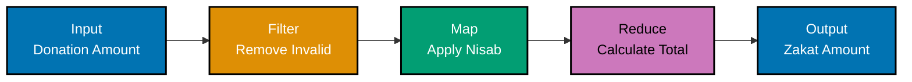
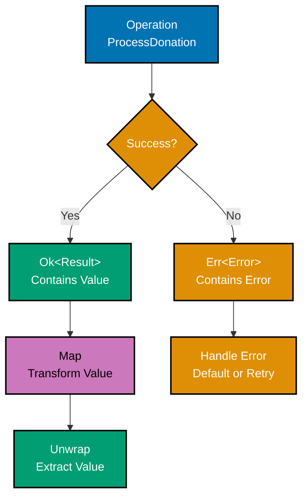
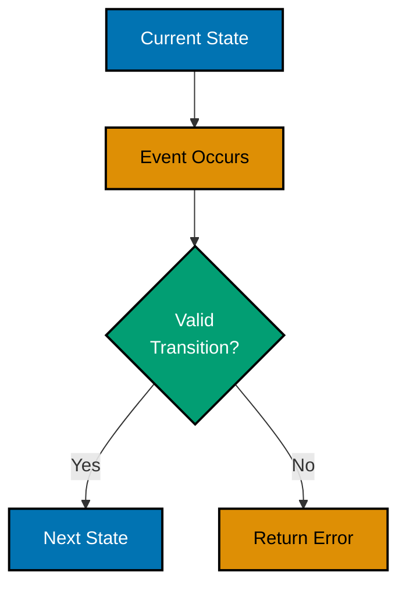
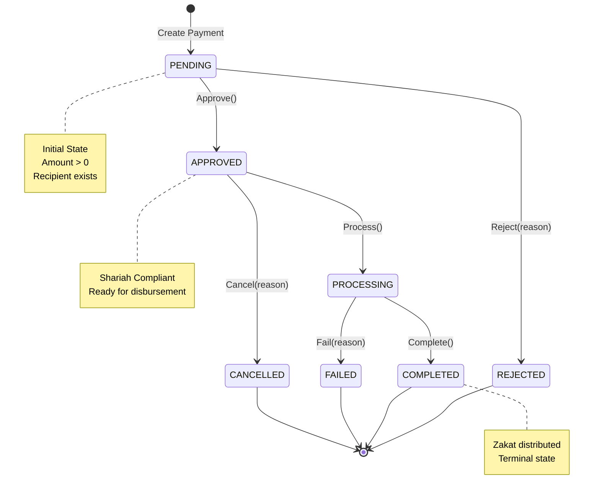
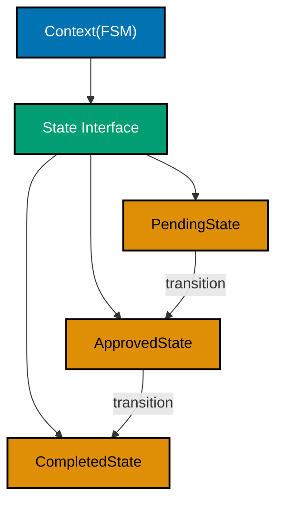
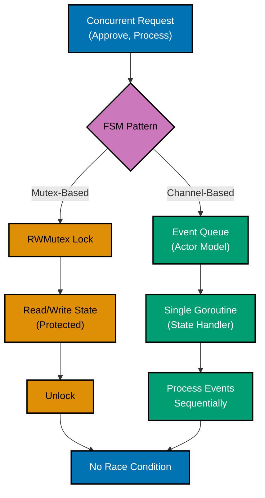
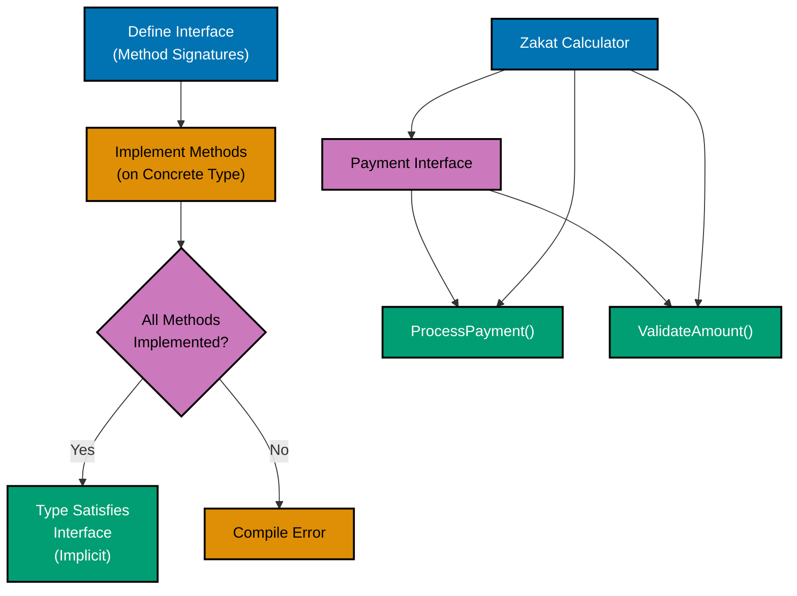
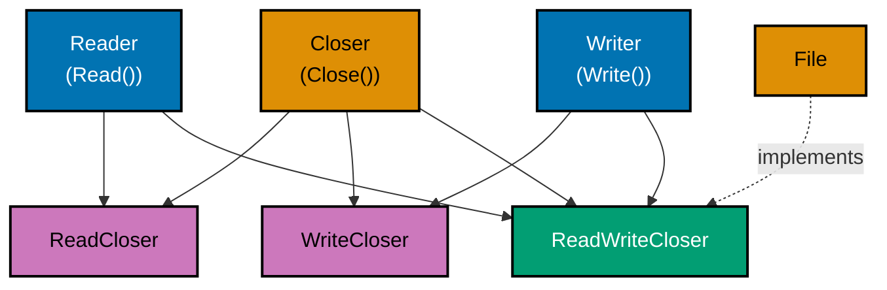
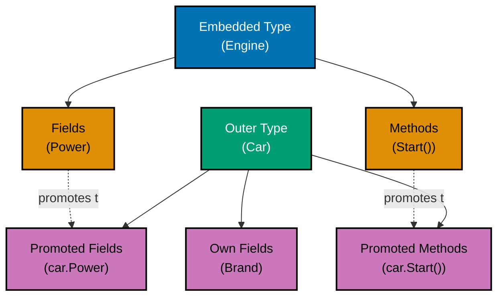

# Go Design Patterns

**Quick Reference**: [Prerequisite Knowledge](#prerequisite-knowledge) | [Purpose](#purpose) | [Part 1: Functional Programming Patterns](#part-1-functional-programming-patterns) | [Part 2: Finite State Machine Patterns](#part-2-finite-state-machine-patterns) | [Part 3: Interfaces and Composition Patterns](#part-3-interfaces-and-composition-patterns) | [Related Documentation](#related-documentation)

## Prerequisite Knowledge

**REQUIRED**: You **MUST** understand Go fundamentals from [AyoKoding Go Learning Path](../../../../../apps/ayokoding-web/content/en/learn/software-engineering/programming-languages/golang/_index.md) before using these standards.

**This document is OSE Platform-specific**, not a Go tutorial. It assumes proficiency in:

- Go syntax (functions, methods, types, interfaces)
- Go concurrency primitives (goroutines, channels, mutexes)
- Go generics (Go 1.18+)
- Go testing fundamentals

If you lack this foundation, **study the AyoKoding learning path first**.

## Purpose

This document defines **authoritative design pattern standards** for Go development in the OSE Platform. These patterns leverage Go's unique features (interfaces, composition, first-class functions) to build maintainable, testable, and Sharia-compliant enterprise systems.

**Target Audience**: OSE Platform Go developers implementing financial, zakat, waqf, and compliance workflows

**Scope**: Three critical pattern categories:

1. **Functional Programming Patterns** - Pure functions, immutability, higher-order functions, composition
2. **Finite State Machine Patterns** - Type-safe state management for financial workflows
3. **Interfaces and Composition Patterns** - Interface design, struct embedding, composition over inheritance

**Status**: Normative (MUST follow for OSE Platform Go code)

**Governance**: This document implements [Functional Programming Principle](../../../../../governance/development/pattern/functional-programming.md), [Immutability Over Mutability](../../../../../governance/principles/software-engineering/immutability.md), and [Explicit Over Implicit](../../../../../governance/principles/software-engineering/explicit-over-implicit.md).

---

## Overview

Functional Programming (FP) is a programming paradigm that treats computation as the evaluation of mathematical functions and avoids changing state and mutable data. While Go is primarily an imperative language with object-oriented features, it supports several functional programming concepts through first-class functions, closures, and higher-order functions.

Go's approach to functional programming is pragmatic rather than pure. It provides the tools for functional patterns where they make sense, while maintaining its core philosophy of simplicity and practicality. This section explores functional programming techniques in Go, their appropriate use cases, and how they integrate with idiomatic Go code.

## Why Functional Programming in Go?

**Benefits**:

- **Testability**: Pure functions are easy to test in isolation
- **Concurrency**: Immutable data eliminates race conditions
- **Composability**: Small functions can be combined to build complex behavior
- **Code reuse**: Higher-order functions enable generic operations

**Limitations in Go**:

- No built-in map/filter/reduce for slices (before generics)
- No tail call optimization
- No pattern matching (use type switches instead)
- Limited type inference compared to pure FP languages
- Imperative style often more idiomatic

### Pure Functions

Pure functions have two key properties:

1. **Deterministic**: Same inputs always produce same outputs
2. **No side effects**: Don't modify external state or perform I/O

```go
// Pure function - deterministic, no side effects
func Add(a, b int) int {
  return a + b
}

// Pure function - result depends only on inputs
func CalculateDiscount(price float64, percentage float64) float64 {
  return price * (1 - percentage/100)
}

// Impure function - depends on external state
var zakatRate = 0.08 // global state

func CalculateTotalImpure(price float64) float64 {
  return price * (1 + zakatRate) // depends on global variable
}

// Pure version - tax rate passed as parameter
func CalculateTotal(price float64, zakatRate float64) float64 {
  return price * (1 + zakatRate)
}

// Impure function - has side effects
func LogAndAdd(a, b int) int {
  fmt.Println("Adding:", a, b) // side effect: I/O
  return a + b
}
```

### Immutability

Immutability means data cannot be changed after creation. Go doesn't enforce immutability, but you can design for it.

```go
// Mutable approach (avoid in FP)
type Point struct {
  X, Y int
}

func (p *Point) Move(dx, dy int) {
  p.X += dx  // mutates existing point
  p.Y += dy
}

// Immutable approach (FP style)
type ImmutablePoint struct {
  X, Y int
}

func (p ImmutablePoint) Move(dx, dy int) ImmutablePoint {
  return ImmutablePoint{
    X: p.X + dx,  // returns new point
    Y: p.Y + dy,
  }
}

// Usage comparison
func Example() {
  // Mutable
  mutableP := &Point{X: 0, Y: 0}
  mutableP.Move(10, 20)
  // Original point is modified

  // Immutable
  immutableP := ImmutablePoint{X: 0, Y: 0}
  newP := immutableP.Move(10, 20)
  // Original point unchanged, new point created
  fmt.Println(immutableP) // {0 0}
  fmt.Println(newP)       // {10 20}
}
```

### First-Class Functions

In Go, functions are first-class citizens: they can be assigned to variables, passed as arguments, and returned from other functions.

```go
// Function as variable
var add func(int, int) int = func(a, b int) int {
  return a + b
}

// Function as parameter
func Apply(fn func(int, int) int, a, b int) int {
  return fn(a, b)
}

// Function as return value
func MakeAdder(x int) func(int) int {
  return func(y int) int {
    return x + y
  }
}

// Usage
func Example() {
  result := Apply(add, 5, 3) // 8

  add5 := MakeAdder(5)
  result = add5(10) // 15
}
```

## Closures

Closures are functions that reference variables from outside their body. The function "closes over" these variables.

### Basic Closures

```go
// Closure capturing variable
func Counter() func() int {
  count := 0
  return func() int {
    count++  // captures and modifies count
    return count
  }
}

func Example() {
  counter1 := Counter()
  fmt.Println(counter1()) // 1
  fmt.Println(counter1()) // 2
  fmt.Println(counter1()) // 3

  counter2 := Counter()
  fmt.Println(counter2()) // 1 (separate closure)
}
```

### Closure Use Cases

```go
// Configuration closure
func NewLogger(prefix string) func(string) {
  return func(message string) {
    fmt.Printf("[%s] %s\n", prefix, message)
  }
}

func Example() {
  errorLog := NewLogger("ERROR")
  infoLog := NewLogger("INFO")

  errorLog("Database connection failed")  // [ERROR] Database connection failed
  infoLog("Server started successfully")  // [INFO] Server started successfully
}

// Closure for deferred cleanup
func ProcessFile(filename string) error {
  file, err := os.Open(filename)
  if err != nil {
    return err
  }
  defer file.Close()  // closure captures file variable

  // Process file...
  return nil
}

// Closure for filtering
func MakePredicate(nisab int) func(int) bool {
  return func(value int) bool {
    return value > nisab
  }
}

func FilterInts(slice []int, predicate func(int) bool) []int {
  result := make([]int, 0)
  for _, v := range slice {
    if predicate(v) {
      result = append(result, v)
    }
  }
  return result
}

func Example() {
  numbers := []int{1, 5, 10, 15, 20}
  greaterThan10 := MakePredicate(10)
  filtered := FilterInts(numbers, greaterThan10) // [15, 20]
}
```

### Closure Gotchas

```go
// Common mistake: loop variable capture (Go 1.21 and earlier)
func MakeClosures() []func() int {
  funcs := make([]func() int, 3)
  for i := 0; i < 3; i++ {
    // In Go 1.21 and earlier, this captures the loop variable i
    // All closures reference the same variable
    funcs[i] = func() int {
      return i
    }
  }
  return funcs
}

func Example_Old() {
  funcs := MakeClosures()
  for _, fn := range funcs {
    fmt.Println(fn()) // Go 1.21-: prints 3, 3, 3
                      // Go 1.22+: prints 0, 1, 2
  }
}

// Fix for Go 1.21 and earlier: copy variable
func MakeClosuresSafe() []func() int {
  funcs := make([]func() int, 3)
  for i := 0; i < 3; i++ {
    i := i // Create new variable in loop scope
    funcs[i] = func() int {
      return i
    }
  }
  return funcs
}
```

## Higher-Order Functions

Higher-order functions take functions as arguments or return functions as results.

### Map Pattern

```go
// Map: transform each element
func MapT, U any U) []U {
  result := make([]U, len(slice))
  for i, v := range slice {
    result[i] = fn(v)
  }
  return result
}

func Example() {
  numbers := []int{1, 2, 3, 4, 5}

  // Square each number
  squared := Map(numbers, func(n int) int {
    return n * n
  }) // [1, 4, 9, 16, 25]

  // Convert to strings
  strings := Map(numbers, func(n int) string {
    return fmt.Sprintf("Number: %d", n)
  })
}
```

### Filter Pattern

```go
// Filter: keep elements that match predicate
func FilterT any bool) []T {
  result := make([]T, 0)
  for _, v := range slice {
    if predicate(v) {
      result = append(result, v)
    }
  }
  return result
}

func Example() {
  numbers := []int{1, 2, 3, 4, 5, 6, 7, 8, 9, 10}

  // Keep only even numbers
  evens := Filter(numbers, func(n int) bool {
    return n%2 == 0
  }) // [2, 4, 6, 8, 10]

  // Keep numbers greater than 5
  greaterThan5 := Filter(numbers, func(n int) bool {
    return n > 5
  }) // [6, 7, 8, 9, 10]
}
```

### Reduce Pattern

```go
// Reduce: accumulate values into single result
func ReduceT, U any U) U {
  result := initial
  for _, v := range slice {
    result = fn(result, v)
  }
  return result
}

func Example() {
  numbers := []int{1, 2, 3, 4, 5}

  // Sum all numbers
  sum := Reduce(numbers, 0, func(acc, n int) int {
    return acc + n
  }) // 15

  // Product of all numbers
  product := Reduce(numbers, 1, func(acc, n int) int {
    return acc * n
  }) // 120

  // Concatenate strings
  words := []string{"Hello", "functional", "world"}
  sentence := Reduce(words, "", func(acc, word string) string {
    if acc == "" {
      return word
    }
    return acc + " " + word
  }) // "Hello functional world"
}
```

### Combining Higher-Order Functions

```go
func Example() {
  numbers := []int{1, 2, 3, 4, 5, 6, 7, 8, 9, 10}

  // Sum of squares of even numbers
  result := Reduce(
    Map(
      Filter(numbers, func(n int) bool {
        return n%2 == 0  // keep evens
      }),
      func(n int) int {
        return n * n  // square each
      },
    ),
    0,
    func(acc, n int) int {
      return acc + n  // sum all
    },
  )
  fmt.Println(result) // 2^2 + 4^2 + 6^2 + 8^2 + 10^2 = 220
}
```

## Function Composition

Function composition combines simple functions to build more complex ones.



### Basic Composition

```go
// Compose two functions: f(g(x))
func ComposeA, B, C any C, g func(A) B) func(A) C {
  return func(x A) C {
    return f(g(x))
  }
}

func Example() {
  // Define simple functions
  double := func(x int) int { return x * 2 }
  addTen := func(x int) int { return x + 10 }

  // Compose: double then add ten
  doubleAndAddTen := Compose(addTen, double)
  result := doubleAndAddTen(5) // double(5) = 10, then 10+10 = 20
}
```

### Pipe Pattern

```go
// Pipe: chain multiple functions left-to-right
type Pipeline[T any] struct {
  value T
}

func PipeT any Pipeline[T] {
  return Pipeline[T]{value: value}
}

func (p Pipeline[T]) Then(fn func(T) T) Pipeline[T] {
  return Pipeline[T]{value: fn(p.value)}
}

func (p Pipeline[T]) Value() T {
  return p.value
}

func Example() {
  double := func(x int) int { return x * 2 }
  addTen := func(x int) int { return x + 10 }
  square := func(x int) int { return x * x }

  result := Pipe(5).
    Then(double).   // 10
    Then(addTen).   // 20
    Then(square).   // 400
    Value()

  fmt.Println(result) // 400
}
```

### Middleware Pattern


```go
type Handler func(http.ResponseWriter, *http.Request)

// Middleware wraps a handler with additional functionality
type Middleware func(Handler) Handler

// Compose middlewares
func ChainMiddleware(h Handler, middlewares ...Middleware) Handler {
  for i := len(middlewares) - 1; i >= 0; i-- {
    h = middlewaresi
  }
  return h
}

// Example middlewares
func LoggingMiddleware(next Handler) Handler {
  return func(w http.ResponseWriter, r *http.Request) {
    fmt.Printf("Request: %s %s\n", r.Method, r.URL.Path)
    next(w, r)
  }
}

func AuthMiddleware(next Handler) Handler {
  return func(w http.ResponseWriter, r *http.Request) {
    token := r.Header.Get("Authorization")
    if token == "" {
      http.Error(w, "Unauthorized", http.StatusUnauthorized)
      return
    }
    next(w, r)
  }
}

func Example() {
  handler := func(w http.ResponseWriter, r *http.Request) {
    w.Write([]byte("Hello, World!"))
  }

  // Compose middlewares
  wrapped := ChainMiddleware(
    handler,
    LoggingMiddleware,
    AuthMiddleware,
  )

  http.HandleFunc("/", wrapped)
}
```

## Functional Options Pattern

The functional options pattern uses higher-order functions for configuration.

### Basic Options Pattern

```go
type Server struct {
  host    string
  port    int
  timeout time.Duration
}

// Option is a function that modifies Server
type Option func(*Server)

// Constructor with variadic options
func NewServer(opts ...Option) *Server {
  // Default values
  s := &Server{
    host:    "localhost",
    port:    8080,
    timeout: 30 * time.Second,
  }

  // Apply options
  for _, opt := range opts {
    opt(s)
  }

  return s
}

// Option constructors
func WithHost(host string) Option {
  return func(s *Server) {
    s.host = host
  }
}

func WithPort(port int) Option {
  return func(s *Server) {
    s.port = port
  }
}

func WithTimeout(timeout time.Duration) Option {
  return func(s *Server) {
    s.timeout = timeout
  }
}

// Usage
func Example() {
  // Default server
  server1 := NewServer()

  // Custom configuration
  server2 := NewServer(
    WithHost("example.com"),
    WithPort(9090),
    WithTimeout(60 * time.Second),
  )
}
```

### Options with Validation

```go
type Option func(*Server) error

func NewServer(opts ...Option) (*Server, error) {
  s := &Server{
    host:    "localhost",
    port:    8080,
    timeout: 30 * time.Second,
  }

  for _, opt := range opts {
    if err := opt(s); err != nil {
      return nil, err
    }
  }

  return s, nil
}

func WithPort(port int) Option {
  return func(s *Server) error {
    if port <= 0 || port > 65535 {
      return fmt.Errorf("invalid port: %d", port)
    }
    s.port = port
    return nil
  }
}

func WithTimeout(timeout time.Duration) Option {
  return func(s *Server) error {
    if timeout < 0 {
      return fmt.Errorf("timeout must be positive")
    }
    s.timeout = timeout
    return nil
  }
}
```

### Currying

Currying transforms a function with multiple arguments into a chain of functions with single arguments.

```go
// Not curried: f(a, b, c)
func Add3(a, b, c int) int {
  return a + b + c
}

// Curried: f(a)(b)(c)
func Add3Curried(a int) func(int) func(int) int {
  return func(b int) func(int) int {
    return func(c int) int {
      return a + b + c
    }
  }
}

func Example() {
  // Direct call
  result1 := Add3(1, 2, 3) // 6

  // Curried call
  result2 := Add3Curried(1)(2)(3) // 6

  // Partial application
  add1 := Add3Curried(1)
  add1and2 := add1(2)
  result3 := add1and2(3) // 6
}
```

### Partial Application

```go
// Partial application: fix some arguments
func Multiply(a, b int) int {
  return a * b
}

// Create specialized version
func MakeMultiplier(factor int) func(int) int {
  return func(x int) int {
    return Multiply(factor, x)
  }
}

func Example() {
  double := MakeMultiplier(2)
  triple := MakeMultiplier(3)

  fmt.Println(double(5)) // 10
  fmt.Println(triple(5)) // 15
}

// Generic partial application
func Partial2A, B, R any R, a A) func(B) R {
  return func(b B) R {
    return fn(a, b)
  }
}

func Example_Generic() {
  add := func(a, b int) int { return a + b }
  add5 := Partial2(add, 5)

  fmt.Println(add5(10)) // 15
  fmt.Println(add5(20)) // 25
}
```

## Monadic Patterns (Limited)

Go doesn't have monads in the Haskell sense, but we can implement similar patterns.



### Option/Maybe Pattern

```go
// Option represents an optional value
type Option[T any] struct {
  value *T
}

// Some creates an Option with a value
func SomeT any Option[T] {
  return Option[T]{value: &value}
}

// None creates an empty Option
func None[T any]() Option[T] {
  return Option[T]{value: nil}
}

// IsSome checks if Option has a value
func (o Option[T]) IsSome() bool {
  return o.value != nil
}

// IsNone checks if Option is empty
func (o Option[T]) IsNone() bool {
  return o.value == nil
}

// Unwrap returns the value or panics
func (o Option[T]) Unwrap() T {
  if o.IsNone() {
    panic("called Unwrap on None")
  }
  return *o.value
}

// UnwrapOr returns the value or a default
func (o Option[T]) UnwrapOr(defaultValue T) T {
  if o.IsNone() {
    return defaultValue
  }
  return *o.value
}

// Map applies a function to the value if present
func (o Option[T]) Map(fn func(T) T) Option[T] {
  if o.IsNone() {
    return None[T]()
  }
  return Some(fn(*o.value))
}

// Example usage
func Divide(a, b float64) Option[float64] {
  if b == 0 {
    return None[float64]()
  }
  return Some(a / b)
}

func Example() {
  result1 := Divide(10, 2)
  if result1.IsSome() {
    fmt.Println(result1.Unwrap()) // 5
  }

  result2 := Divide(10, 0)
  fmt.Println(result2.UnwrapOr(0)) // 0 (default)

  // Chain operations
  result3 := Divide(100, 10).
    Map(func(x float64) float64 { return x * 2 }).  // 20
    Map(func(x float64) float64 { return x + 5 })   // 25

  fmt.Println(result3.Unwrap()) // 25
}
```

### Result/Either Pattern

```go
// Result represents a value or an error
type Result[T any] struct {
  value *T
  err   error
}

// Ok creates a successful Result
func OkT any Result[T] {
  return Result[T]{value: &value, err: nil}
}

// Err creates a failed Result
func ErrT any Result[T] {
  return Result[T]{value: nil, err: err}
}

// IsOk checks if Result is successful
func (r Result[T]) IsOk() bool {
  return r.err == nil
}

// IsErr checks if Result is an error
func (r Result[T]) IsErr() bool {
  return r.err != nil
}

// Unwrap returns the value or panics
func (r Result[T]) Unwrap() T {
  if r.IsErr() {
    panic(r.err)
  }
  return *r.value
}

// UnwrapOr returns the value or a default
func (r Result[T]) UnwrapOr(defaultValue T) T {
  if r.IsErr() {
    return defaultValue
  }
  return *r.value
}

// Map applies a function if Result is Ok
func (r Result[T]) Map(fn func(T) T) Result[T] {
  if r.IsErr() {
    return ErrT
  }
  return Ok(fn(*r.value))
}

// MapErr transforms the error
func (r Result[T]) MapErr(fn func(error) error) Result[T] {
  if r.IsOk() {
    return r
  }
  return ErrT)
}

// Example usage
func ParseInt(s string) Result[int] {
  value, err := strconv.Atoi(s)
  if err != nil {
    return Errint
  }
  return Ok(value)
}

func Example() {
  result1 := ParseInt("42")
  if result1.IsOk() {
    fmt.Println(result1.Unwrap()) // 42
  }

  result2 := ParseInt("invalid")
  fmt.Println(result2.UnwrapOr(0)) // 0 (default)

  // Chain operations
  result3 := ParseInt("10").
    Map(func(x int) int { return x * 2 }).  // 20
    Map(func(x int) int { return x + 5 })   // 25

  if result3.IsOk() {
    fmt.Println(result3.Unwrap()) // 25
  }
}
```

### Basic Recursion

```go
// Factorial using recursion
func Factorial(n int) int {
  if n <= 1 {
    return 1
  }
  return n * Factorial(n-1)
}

// Fibonacci using recursion
func Fibonacci(n int) int {
  if n <= 1 {
    return n
  }
  return Fibonacci(n-1) + Fibonacci(n-2)
}

// Binary search using recursion
func BinarySearch(arr []int, target, left, right int) int {
  if left > right {
    return -1 // not found
  }

  mid := left + (right-left)/2
  if arr[mid] == target {
    return mid
  } else if arr[mid] > target {
    return BinarySearch(arr, target, left, mid-1)
  } else {
    return BinarySearch(arr, target, mid+1, right)
  }
}
```

### Tail Recursion (Limited Support)

Go does not optimize tail calls, so tail-recursive functions can still overflow the stack.

```go
// Tail-recursive factorial (not optimized in Go)
func FactorialTail(n, acc int) int {
  if n <= 1 {
    return acc
  }
  return FactorialTail(n-1, n*acc) // tail call
}

// Iterative version (preferred in Go)
func FactorialIterative(n int) int {
  acc := 1
  for i := 2; i <= n; i++ {
    acc *= i
  }
  return acc
}
```

### Recursion with Memoization

```go
// Fibonacci with memoization
func FibonacciMemo() func(int) int {
  cache := make(map[int]int)

  var fib func(int) int
  fib = func(n int) int {
    if n <= 1 {
      return n
    }

    // Check cache
    if val, ok := cache[n]; ok {
      return val
    }

    // Calculate and cache
    result := fib(n-1) + fib(n-2)
    cache[n] = result
    return result
  }

  return fib
}

func Example() {
  fib := FibonacciMemo()
  fmt.Println(fib(50)) // Efficiently computes large Fibonacci numbers
}
```

## Lazy Evaluation

Go is eagerly evaluated, but we can simulate lazy evaluation using closures and channels.

### Lazy Values

```go
// Lazy value using closure
type Lazy[T any] struct {
  thunk  func() T
  cached *T
}

func NewLazyT any T) *Lazy[T] {
  return &Lazy[T]{thunk: fn}
}

func (l *Lazy[T]) Force() T {
  if l.cached == nil {
    value := l.thunk()
    l.cached = &value
  }
  return *l.cached
}

func Example() {
  // Expensive computation
  expensive := NewLazy(func() int {
    fmt.Println("Computing...")
    return 42
  })

  // Not computed yet
  fmt.Println("Lazy value created")

  // Computed on first access
  fmt.Println(expensive.Force()) // Prints "Computing..." then "42"

  // Cached on subsequent access
  fmt.Println(expensive.Force()) // Just prints "42"
}
```

### Lazy Sequences with Iterators (Go 1.23+)

```go
import "iter"

// Infinite sequence generator
func Integers() iter.Seq[int] {
  return func(yield func(int) bool) {
    for i := 0; ; i++ {
      if !yield(i) {
        return
      }
    }
  }
}

// Take first n elements
func TakeT any iter.Seq[T] {
  return func(yield func(T) bool) {
    count := 0
    for v := range seq {
      if count >= n {
        return
      }
      if !yield(v) {
        return
      }
      count++
    }
  }
}

func Example() {
  // Take first 10 integers
  for i := range Take(Integers(), 10) {
    fmt.Println(i) // 0, 1, 2, ..., 9
  }
}
```

### Lazy Sequences with Channels

```go
// Generate infinite sequence
func Integers() <-chan int {
  ch := make(chan int)
  go func() {
    for i := 0; ; i++ {
      ch <- i
    }
  }()
  return ch
}

// Take first n elements
func TakeT any <-chan T {
  out := make(chan T)
  go func() {
    defer close(out)
    for i := 0; i < n; i++ {
      out <- <-ch
    }
  }()
  return out
}

func Example() {
  numbers := Take(Integers(), 10)
  for n := range numbers {
    fmt.Println(n) // 0, 1, 2, ..., 9
  }
}
```

## Functional Programming with Generics

Generics (Go 1.18+) enable type-safe functional programming patterns.

### Generic Higher-Order Functions

```go
// Map with generics
func MapT, U any U) []U {
  result := make([]U, len(slice))
  for i, v := range slice {
    result[i] = fn(v)
  }
  return result
}

// Filter with generics
func FilterT any bool) []T {
  result := make([]T, 0)
  for _, v := range slice {
    if predicate(v) {
      result = append(result, v)
    }
  }
  return result
}

// Reduce with generics
func ReduceT, U any U) U {
  result := initial
  for _, v := range slice {
    result = fn(result, v)
  }
  return result
}

func Example() {
  numbers := []int{1, 2, 3, 4, 5}

  // Map: int -> string
  strings := Map(numbers, func(n int) string {
    return fmt.Sprintf("num-%d", n)
  })

  // Filter: keep evens
  evens := Filter(numbers, func(n int) bool {
    return n%2 == 0
  })

  // Reduce: sum
  sum := Reduce(numbers, 0, func(acc, n int) int {
    return acc + n
  })
}
```

### Generic Functional Containers

```go
// Functor-like container
type Functor[T any] struct {
  value T
}

func NewFunctorT any Functor[T] {
  return Functor[T]{value: value}
}

func (f Functor[T]) MapU any U) Functor[U] {
  return Functor[U]{value: fn(f.value)}
}

func (f Functor[T]) Value() T {
  return f.value
}

func Example() {
  result := NewFunctor(5).
    Map(func(x int) int { return x * 2 }).   // 10
    Map(func(x int) int { return x + 3 }).   // 13
    Map(func(x int) string { return fmt.Sprintf("Result: %d", x) })

  fmt.Println(result.Value()) // "Result: 13"
}
```

### When to Use Functional Programming

**Use FP when**:

- Building reusable, composable operations (map, filter, reduce)
- Implementing configuration patterns (functional options)
- Creating middleware chains
- Working with immutable data structures
- Writing testable, pure functions
- Simplifying concurrent code (immutable data eliminates races)

**Avoid FP when**:

- Simple imperative code is clearer (for loops vs map/filter chains)
- Performance is critical (allocations from closures)
- Deep recursion (no tail call optimization)
- The team is unfamiliar with FP concepts

### Balancing FP and Idiomatic Go

```go
// Over-engineered FP (avoid)
result := Reduce(
  Map(
    Filter(numbers, isEven),
    square,
  ),
  0,
  add,
)

// Idiomatic Go (prefer)
sum := 0
for _, n := range numbers {
  if n%2 == 0 {
    sum += n * n
  }
}
```

### Performance Considerations

```go
// Functional style: multiple passes, allocations
func ProcessFunctional(numbers []int) int {
  return Reduce(
    Map(
      Filter(numbers, func(n int) bool { return n%2 == 0 }),
      func(n int) int { return n * n },
    ),
    0,
    func(acc, n int) int { return acc + n },
  )
}

// Imperative style: single pass, no allocations
func ProcessImperative(numbers []int) int {
  sum := 0
  for _, n := range numbers {
    if n%2 == 0 {
      sum += n * n
    }
  }
  return sum
}

// Benchmark results show imperative is faster for simple operations
```

### Guidelines

1. **Prefer simplicity**: Use FP when it simplifies code, not for its own sake
2. **Avoid deep nesting**: Limit function composition depth for readability
3. **Document higher-order functions**: Explain what the function parameter does
4. **Use generics judiciously**: Generic functions are powerful but can be hard to debug
5. **Consider performance**: Profile before optimizing, but be aware FP has overhead
6. **Test pure functions**: Pure functions are easy to test - take advantage
7. **Embrace Go idioms**: Don't force FP patterns that fight Go's design

### Over-Engineering with FP

```go
// Overly functional - hard to read
func ProcessData(data []Data) []Result {
  return Map(
    Filter(
      Map(data, Transform),
      Validate,
    ),
    Convert,
  )
}

// Clearer imperative version
func ProcessData(data []Data) []Result {
  var results []Result
  for _, d := range data {
    transformed := Transform(d)
    if Validate(transformed) {
      results = append(results, Convert(transformed))
    }
  }
  return results
}
```

### Closure Variable Capture

```go
// Wrong: captures loop variable (Go 1.21-)
for i := 0; i < 3; i++ {
  go func() {
    fmt.Println(i) // All print 3
  }()
}

// Correct: copy variable
for i := 0; i < 3; i++ {
  i := i // Create new variable
  go func() {
    fmt.Println(i) // Prints 0, 1, 2
  }()
}

// Note: Go 1.22+ fixes this automatically
```

### Performance Overhead

```go
// Closure allocation overhead
func CreateAdders(n int) []func(int) int {
  adders := make([]func(int) int, n)
  for i := 0; i < n; i++ {
    i := i
    adders[i] = func(x int) int {
      return x + i  // Closure captures i
    }
  }
  return adders // Each closure allocates memory
}

// More efficient: pass value directly
func Add(x, y int) int {
  return x + y
}
```

### Inappropriate Recursion

```go
// Stack overflow risk: deep recursion
func SumRecursive(nums []int) int {
  if len(nums) == 0 {
    return 0
  }
  return nums[0] + SumRecursive(nums[1:]) // Can overflow
}

// Better: use iteration
func SumIterative(nums []int) int {
  sum := 0
  for _, n := range nums {
    sum += n
  }
  return sum
}
```

---

## Overview

Finite State Machines (FSMs) are fundamental design patterns for managing complex state transitions in enterprise software. In Go, FSMs leverage the language's unique strengths - type safety through interfaces, explicit error handling, and goroutine-safe concurrency - to build robust, maintainable state management systems for financial and business-critical applications.

### Why FSMs Matter in Finance

Financial applications involve complex workflows with strict state transition rules:

- **Zakat Donation Payment Processing**: Donation transactions move through well-defined states (pending → verification → approved → distributed)
- **Qard Hasan Lifecycle**: Islamic financing contracts follow specific approval and disbursement workflows
- **Waqf Contract Management**: Endowment contracts transition through draft → review → active → archived states
- **Compliance Workflows**: Shariah compliance checks require deterministic, auditable state tracking

### Key Benefits

1. **Deterministic Behavior**: Predictable state transitions prevent invalid states
2. **Type Safety**: Go's interface system provides compile-time guarantees
3. **Explicit Error Handling**: Every transition returns an error for invalid operations
4. **Concurrency Safety**: Mutex-based or channel-based FSMs prevent race conditions
5. **Testability**: State transitions are isolated and easy to unit test
6. **Audit Trail**: Every state change is explicitly modeled and trackable

### Go's Unique Challenges and Solutions

**Challenges Go faces compared to languages with enums:**

| Challenge           | Java/TypeScript Solution | Go Solution                   |
| ------------------- | ------------------------ | ----------------------------- |
| No enums            | Enum types               | Type aliases + const + iota   |
| State validation    | Compile-time enum checks | Runtime type switches         |
| Exhaustive matching | Switch on sealed types   | Type switch with default case |
| State behavior      | Enum methods             | Interface-based state pattern |

**Go's unique strengths for FSMs:**

- **Goroutine-safe FSMs**: Built-in concurrency primitives (mutexes, channels)
- **Channel-based actor model**: Natural fit for event-driven state machines
- **Zero-cost interfaces**: No virtual table overhead
- **Composition over inheritance**: State embedding without deep hierarchies

### Core Components

A finite state machine consists of:

1. **States**: Discrete conditions the system can be in
2. **Events**: Triggers that cause state transitions
3. **Transitions**: Rules defining valid state changes
4. **Initial State**: Starting point
5. **Final States**: Terminal states (optional)
6. **Guards**: Preconditions that must be true for transitions
7. **Actions**: Side effects during transitions (entry/exit actions)

### State Machine Properties

**Deterministic FSM**: Given current state and input, next state is always the same

- **Use case**: Donation payment processing (consistent behavior required)
- **Example**: `PENDING` + `Approve()` → `APPROVED` (always)

**Non-Deterministic FSM**: Multiple possible next states for same input

- **Use case**: Manual review workflows (human decision involved)
- **Example**: `UNDER_REVIEW` + `Review()` → `APPROVED` or `REJECTED` (depends on reviewer)

### State Transition Diagram



### State Invariants

**Invariants** are conditions that must always be true in a given state:

- **PENDING donation**: Amount > 0, recipient exists
- **APPROVED qard hasan**: All documents uploaded, risk score within limits
- **ACTIVE contract**: Start date ≤ today ≤ end date

FSMs enforce invariants through:

1. **Entry guards**: Validate invariants when entering state
2. **Guard conditions**: Check preconditions before transition
3. **Exit actions**: Clean up resources when leaving state

### Overview

Type-based FSMs use Go's type alias + const pattern to create enum-like states with transition logic in methods. This is the simplest approach for straightforward workflows.

### Characteristics

- **Lightweight**: Minimal boilerplate
- **Type-safe**: States are distinct types
- **Centralized transitions**: Logic in one place
- **Go idiom**: Natural fit for Go's type system

#### Payment State Transition Diagram



**Type-Safe Implementation**:

```go
package donation

import (
  "errors"
  "fmt"
  "time"
)

// PaymentState is a type-safe state enum
type PaymentState int

const (
  StatePending PaymentState = iota
  StateApproved
  StateProcessing
  StateCompleted
  StateFailed
  StateRejected
  StateCancelled
)

// String implements fmt.Stringer for debugging
func (s PaymentState) String() string {
  return [...]string{
    "PENDING",
    "APPROVED",
    "PROCESSING",
    "COMPLETED",
    "FAILED",
    "REJECTED",
    "CANCELLED",
  }[s]
}

// IsTerminal returns true for terminal states
func (s PaymentState) IsTerminal() bool {
  return s == StateCompleted || s == StateFailed ||
    s == StateRejected || s == StateCancelled
}

// CanTransitionTo checks if transition is valid
func (s PaymentState) CanTransitionTo(target PaymentState) bool {
  validTransitions := map[PaymentState][]PaymentState{
    StatePending:    {StateApproved, StateRejected},
    StateApproved:   {StateProcessing, StateCancelled},
    StateProcessing: {StateCompleted, StateFailed},
    // Terminal states have no valid transitions
    StateCompleted:  {},
    StateFailed:     {},
    StateRejected:   {},
    StateCancelled:  {},
  }

  allowed := validTransitions[s]
  for _, allowedState := range allowed {
    if allowedState == target {
      return true
    }
  }
  return false
}

// DonationPayment entity uses type-safe state
type DonationPayment struct {
  ID               string
  Amount           int64 // cents
  PayeeID          string
  State            PaymentState
  FailureReason    string
  LastTransitionAt time.Time
}

// NewPayment creates donation in initial state
func NewPayment(id string, amount int64, payeeID string) (*DonationPayment, error) {
  if amount <= 0 {
    return nil, errors.New("amount must be positive")
  }
  if payeeID == "" {
    return nil, errors.New("payeeID cannot be empty")
  }

  return &DonationPayment{
    ID:               id,
    Amount:           amount,
    PayeeID:          payeeID,
    State:            StatePending, // Initial state
    LastTransitionAt: time.Now(),
  }, nil
}

// Transition attempts state transition
func (p *DonationPayment) Transition(target PaymentState) error {
  if !p.State.CanTransitionTo(target) {
    return fmt.Errorf("invalid transition from %s to %s", p.State, target)
  }

  p.State = target
  p.LastTransitionAt = time.Now()
  return nil
}

// Approve transitions to APPROVED state
func (p *DonationPayment) Approve() error {
  return p.Transition(StateApproved)
}

// Reject transitions to REJECTED state
func (p *DonationPayment) Reject(reason string) error {
  if err := p.Transition(StateRejected); err != nil {
    return err
  }
  p.FailureReason = reason
  return nil
}

// Process transitions to PROCESSING state
func (p *DonationPayment) Process() error {
  return p.Transition(StateProcessing)
}

// Complete transitions to COMPLETED state
func (p *DonationPayment) Complete() error {
  return p.Transition(StateCompleted)
}

// Fail transitions to FAILED state
func (p *DonationPayment) Fail(reason string) error {
  if err := p.Transition(StateFailed); err != nil {
    return err
  }
  p.FailureReason = reason
  return nil
}

// Cancel transitions to CANCELLED state
func (p *DonationPayment) Cancel(reason string) error {
  if err := p.Transition(StateCancelled); err != nil {
    return err
  }
  p.FailureReason = reason
  return nil
}
```

### Advantages

**Compared to string-based states**:

- ✅ **Compile-time safety**: Cannot assign invalid state values
- ✅ **Autocomplete**: IDE can suggest valid states
- ✅ **Refactoring**: Rename state, all references update
- ✅ **Type checking**: Cannot compare different enum types

### Limitations

- ❌ **No rich state behavior**: States cannot have different methods
- ❌ **Centralized logic**: All transition logic in one place (can grow large)
- ❌ **Not extensible**: Cannot add state-specific data easily

**When to use**:

- ✅ Simple FSMs with 5-10 states
- ✅ Straightforward transition rules
- ✅ No state-specific behavior needed

**When to avoid**:

- ❌ Complex state-specific logic
- ❌ States need different data fields
- ❌ Need polymorphic behavior per state

### Overview

The State Pattern uses Go interfaces to create polymorphic state objects with state-specific behavior. This is the classic OOP approach adapted to Go's interface-based design.

### Characteristics

- **Polymorphic**: Each state implements same interface
- **Encapsulated**: State logic lives in state objects
- **Extensible**: Easy to add new states
- **Testable**: States can be tested independently

### State Pattern Structure



### Example: Qard Hasan Lifecycle FSM

**Qard Hasan** (Islamic interest-free loan) has complex state-specific validation rules.

```go
package qard_hasan

import (
  "errors"
  "fmt"
  "time"
)

// State interface defines state-specific behavior
type LoanState interface {
  // State transition methods
  Submit() (LoanState, error)
  Approve() (LoanState, error)
  Reject(reason string) (LoanState, error)
  Disburse() (LoanState, error)
  Close() (LoanState, error)
  Default(reason string) (LoanState, error)

  // State query methods
  Name() string
  IsTerminal() bool
  CanSubmit() bool
  CanApprove() bool
  CanDisburse() bool

  // State-specific validation (enforces invariants)
  ValidateInvariants(loan *QardHasan) error
}

// QardHasan entity holds mutable state
type QardHasan struct {
  ID              string
  CustomerID      string
  AssetPrice      int64 // cents
  MarkupRate      float64
  TotalAmount     int64 // Asset price + markup
  State           LoanState
  SubmittedAt     *time.Time
  ApprovedAt      *time.Time
  DisbursedAt     *time.Time
  RejectionReason string
  DefaultReason   string
}

// NewLoan creates loan in draft state
func NewLoan(id, customerID string, assetPrice int64, markupRate float64) *QardHasan {
  markup := float64(assetPrice) * markupRate
  return &QardHasan{
    ID:          id,
    CustomerID:  customerID,
    AssetPrice:  assetPrice,
    MarkupRate:  markupRate,
    TotalAmount: assetPrice + int64(markup),
    State:       &DraftState{}, // Initial state
  }
}

// Transition executes state transition with validation
func (l *QardHasan) Transition(action func(LoanState) (LoanState, error)) error {
  newState, err := action(l.State)
  if err != nil {
    return err
  }

  // Validate invariants for new state
  if err := newState.ValidateInvariants(l); err != nil {
    return fmt.Errorf("invariant violation: %w", err)
  }

  l.State = newState
  return nil
}

// Submit delegates to current state
func (l *QardHasan) Submit() error {
  return l.Transition(func(s LoanState) (LoanState, error) {
    now := time.Now()
    l.SubmittedAt = &now
    return s.Submit()
  })
}

func (l *QardHasan) Approve() error {
  return l.Transition(func(s LoanState) (LoanState, error) {
    now := time.Now()
    l.ApprovedAt = &now
    return s.Approve()
  })
}

func (l *QardHasan) Reject(reason string) error {
  return l.Transition(func(s LoanState) (LoanState, error) {
    l.RejectionReason = reason
    return s.Reject(reason)
  })
}

func (l *QardHasan) Disburse() error {
  return l.Transition(func(s LoanState) (LoanState, error) {
    now := time.Now()
    l.DisbursedAt = &now
    return s.Disburse()
  })
}

func (l *QardHasan) Close() error {
  return l.Transition(func(s LoanState) (LoanState, error) {
    return s.Close()
  })
}

func (l *QardHasan) Default(reason string) error {
  return l.Transition(func(s LoanState) (LoanState, error) {
    l.DefaultReason = reason
    return s.Default(reason)
  })
}

// Base state with default implementations
type baseState struct{}

func (b *baseState) Submit() (LoanState, error) {
  return nil, errors.New("cannot submit from this state")
}

func (b *baseState) Approve() (LoanState, error) {
  return nil, errors.New("cannot approve from this state")
}

func (b *baseState) Reject(reason string) (LoanState, error) {
  return nil, errors.New("cannot reject from this state")
}

func (b *baseState) Disburse() (LoanState, error) {
  return nil, errors.New("cannot disburse from this state")
}

func (b *baseState) Close() (LoanState, error) {
  return nil, errors.New("cannot close from this state")
}

func (b *baseState) Default(reason string) (LoanState, error) {
  return nil, errors.New("cannot default from this state")
}

// DraftState - Initial state
type DraftState struct {
  baseState
}

func (d *DraftState) Name() string          { return "DRAFT" }
func (d *DraftState) IsTerminal() bool      { return false }
func (d *DraftState) CanSubmit() bool       { return true }
func (d *DraftState) CanApprove() bool      { return false }
func (d *DraftState) CanDisburse() bool     { return false }

func (d *DraftState) Submit() (LoanState, error) {
  return &SubmittedState{}, nil
}

func (d *DraftState) ValidateInvariants(loan *QardHasan) error {
  if loan.AssetPrice <= 0 {
    return errors.New("asset price must be positive")
  }
  if loan.MarkupRate < 0 || loan.MarkupRate > 1 {
    return errors.New("markup rate must be between 0 and 1")
  }
  return nil
}

// SubmittedState - Under review
type SubmittedState struct {
  baseState
}

func (s *SubmittedState) Name() string          { return "SUBMITTED" }
func (s *SubmittedState) IsTerminal() bool      { return false }
func (s *SubmittedState) CanSubmit() bool       { return false }
func (s *SubmittedState) CanApprove() bool      { return true }
func (s *SubmittedState) CanDisburse() bool     { return false }

func (s *SubmittedState) Approve() (LoanState, error) {
  return &ApprovedState{}, nil
}

func (s *SubmittedState) Reject(reason string) (LoanState, error) {
  return &RejectedState{}, nil
}

func (s *SubmittedState) ValidateInvariants(loan *QardHasan) error {
  if loan.SubmittedAt == nil {
    return errors.New("submitted loan must have submission timestamp")
  }
  return nil
}

// ApprovedState - Ready for disbursement
type ApprovedState struct {
  baseState
}

func (a *ApprovedState) Name() string          { return "APPROVED" }
func (a *ApprovedState) IsTerminal() bool      { return false }
func (a *ApprovedState) CanSubmit() bool       { return false }
func (a *ApprovedState) CanApprove() bool      { return false }
func (a *ApprovedState) CanDisburse() bool     { return true }

func (a *ApprovedState) Disburse() (LoanState, error) {
  return &ActiveState{}, nil
}

func (a *ApprovedState) ValidateInvariants(loan *QardHasan) error {
  if loan.ApprovedAt == nil {
    return errors.New("approved loan must have approval timestamp")
  }
  return nil
}

// ActiveState - Loan disbursed, payments ongoing
type ActiveState struct {
  baseState
}

func (a *ActiveState) Name() string          { return "ACTIVE" }
func (a *ActiveState) IsTerminal() bool      { return false }
func (a *ActiveState) CanSubmit() bool       { return false }
func (a *ActiveState) CanApprove() bool      { return false }
func (a *ActiveState) CanDisburse() bool     { return false }

func (a *ActiveState) Close() (LoanState, error) {
  return &ClosedState{}, nil
}

func (a *ActiveState) Default(reason string) (LoanState, error) {
  return &DefaultedState{}, nil
}

func (a *ActiveState) ValidateInvariants(loan *QardHasan) error {
  if loan.DisbursedAt == nil {
    return errors.New("active loan must have disbursement timestamp")
  }
  return nil
}

// Terminal states
type ClosedState struct {
  baseState
}

func (c *ClosedState) Name() string                           { return "CLOSED" }
func (c *ClosedState) IsTerminal() bool                       { return true }
func (c *ClosedState) CanSubmit() bool                        { return false }
func (c *ClosedState) CanApprove() bool                       { return false }
func (c *ClosedState) CanDisburse() bool                      { return false }
func (c *ClosedState) ValidateInvariants(loan *QardHasan) error { return nil }

type RejectedState struct {
  baseState
}

func (r *RejectedState) Name() string       { return "REJECTED" }
func (r *RejectedState) IsTerminal() bool   { return true }
func (r *RejectedState) CanSubmit() bool    { return false }
func (r *RejectedState) CanApprove() bool   { return false }
func (r *RejectedState) CanDisburse() bool  { return false }

func (r *RejectedState) ValidateInvariants(loan *QardHasan) error {
  if loan.RejectionReason == "" {
    return errors.New("rejected loan must have rejection reason")
  }
  return nil
}

type DefaultedState struct {
  baseState
}

func (d *DefaultedState) Name() string       { return "DEFAULTED" }
func (d *DefaultedState) IsTerminal() bool   { return true }
func (d *DefaultedState) CanSubmit() bool    { return false }
func (d *DefaultedState) CanApprove() bool   { return false }
func (d *DefaultedState) CanDisburse() bool  { return false }

func (d *DefaultedState) ValidateInvariants(loan *QardHasan) error {
  if loan.DefaultReason == "" {
    return errors.New("defaulted loan must have default reason")
  }
  return nil
}
```

### Advantages of State Pattern

**Compared to type-based FSM**:

- ✅ **State-specific behavior**: Each state encapsulates its own logic
- ✅ **Open-closed principle**: Add new states without modifying existing code
- ✅ **Invariant validation**: States can enforce invariants specific to them
- ✅ **Testability**: Test each state in isolation

### Limitations

- ❌ **More boilerplate**: Need to implement interface for each state
- ❌ **Memory overhead**: Each state is an object (though lightweight in Go)
- ❌ **No exhaustive checking**: Cannot force handling all states (unlike sealed classes)

**When to use**:

- ✅ Complex state-specific behavior
- ✅ States need different validation rules
- ✅ Need polymorphic behavior per state
- ✅ 5-20 states with distinct logic

**When to avoid**:

- ❌ Simple FSMs (use type-based pattern)
- ❌ Hundreds of states (consider table-driven approach)

### Overview

The Type Switch Pattern uses Go's type switch with interfaces to achieve exhaustive-like matching similar to sealed classes in modern languages. This pattern leverages Go 1.18+ features for cleaner state handling.

### Characteristics

- **Explicit state types**: Each state is a concrete type
- **Type switching**: Dispatch on concrete type
- **Compile-time safety**: Type system prevents invalid state assignments
- **Modern Go idiom**: Uses generics when beneficial

### Example: Waqf Contract State Management

**Waqf** (وقف) is an Islamic endowment where assets are donated for charitable purposes. Contracts transition through creation, review, activation, and archival phases.

```go
package waqf

import (
  "errors"
  "fmt"
  "time"
)

// State marker interface
type ContractState interface {
  isContractState() // Unexported method makes this a sealed-like interface
  Name() string
  IsTerminal() bool
}

// Draft state - Initial creation
type DraftState struct {
  CreatedAt time.Time
}

func (d DraftState) isContractState() {}
func (d DraftState) Name() string      { return "DRAFT" }
func (d DraftState) IsTerminal() bool  { return false }

// UnderReview state - Shariah board reviewing
type UnderReviewState struct {
  SubmittedAt time.Time
  ReviewerID  string
}

func (u UnderReviewState) isContractState() {}
func (u UnderReviewState) Name() string      { return "UNDER_REVIEW" }
func (u UnderReviewState) IsTerminal() bool  { return false }

// Active state - Contract is active
type ActiveState struct {
  ApprovedAt    time.Time
  ActivatedAt   time.Time
  BeneficiaryID string
}

func (a ActiveState) isContractState() {}
func (a ActiveState) Name() string      { return "ACTIVE" }
func (a ActiveState) IsTerminal() bool  { return false }

// Suspended state - Temporarily inactive
type SuspendedState struct {
  SuspendedAt time.Time
  Reason      string
}

func (s SuspendedState) isContractState() {}
func (s SuspendedState) Name() string      { return "SUSPENDED" }
func (s SuspendedState) IsTerminal() bool  { return false }

// Archived state - Permanently closed
type ArchivedState struct {
  ArchivedAt time.Time
  FinalValue int64
}

func (a ArchivedState) isContractState() {}
func (a ArchivedState) Name() string      { return "ARCHIVED" }
func (a ArchivedState) IsTerminal() bool  { return true }

// Rejected state - Failed review
type RejectedState struct {
  RejectedAt time.Time
  Reason     string
}

func (r RejectedState) isContractState() {}
func (r RejectedState) Name() string      { return "REJECTED" }
func (r RejectedState) IsTerminal() bool  { return true }

// Contract entity
type Contract struct {
  ID            string
  DonorID       string
  AssetValue    int64
  BeneficiaryID string
  State         ContractState
}

// NewContract creates contract in DRAFT state
func NewContract(id, donorID string, assetValue int64) *Contract {
  return &Contract{
    ID:         id,
    DonorID:    donorID,
    AssetValue: assetValue,
    State:      DraftState{CreatedAt: time.Now()},
  }
}

// SubmitForReview transitions from DRAFT to UNDER_REVIEW
func (c *Contract) SubmitForReview(reviewerID string) error {
  switch state := c.State.(type) {
  case DraftState:
    c.State = UnderReviewState{
      SubmittedAt: time.Now(),
      ReviewerID:  reviewerID,
    }
    return nil

  case UnderReviewState:
    return errors.New("contract already under review")

  case ActiveState:
    return errors.New("cannot submit active contract for review")

  case SuspendedState:
    return errors.New("cannot submit suspended contract for review")

  case ArchivedState:
    return errors.New("cannot submit archived contract for review")

  case RejectedState:
    return errors.New("cannot submit rejected contract for review")

  default:
    // This case should never happen if all states are handled
    return fmt.Errorf("unknown state type: %T", state)
  }
}

// Approve transitions from UNDER_REVIEW to ACTIVE
func (c *Contract) Approve(beneficiaryID string) error {
  switch state := c.State.(type) {
  case DraftState:
    return errors.New("must submit for review before approval")

  case UnderReviewState:
    c.State = ActiveState{
      ApprovedAt:    time.Now(),
      ActivatedAt:   time.Now(),
      BeneficiaryID: beneficiaryID,
    }
    c.BeneficiaryID = beneficiaryID
    return nil

  case ActiveState:
    return errors.New("contract already active")

  case SuspendedState:
    return errors.New("cannot approve suspended contract")

  case ArchivedState:
    return errors.New("cannot approve archived contract")

  case RejectedState:
    return errors.New("cannot approve rejected contract")

  default:
    return fmt.Errorf("unknown state type: %T", state)
  }
}

// Suspend transitions from ACTIVE to SUSPENDED
func (c *Contract) Suspend(reason string) error {
  switch state := c.State.(type) {
  case DraftState:
    return errors.New("cannot suspend draft contract")

  case UnderReviewState:
    return errors.New("cannot suspend contract under review")

  case ActiveState:
    c.State = SuspendedState{
      SuspendedAt: time.Now(),
      Reason:      reason,
    }
    return nil

  case SuspendedState:
    return errors.New("contract already suspended")

  case ArchivedState:
    return errors.New("cannot suspend archived contract")

  case RejectedState:
    return errors.New("cannot suspend rejected contract")

  default:
    return fmt.Errorf("unknown state type: %T", state)
  }
}

// Archive transitions from ACTIVE or SUSPENDED to ARCHIVED
func (c *Contract) Archive() error {
  switch state := c.State.(type) {
  case DraftState:
    return errors.New("cannot archive draft contract")

  case UnderReviewState:
    return errors.New("cannot archive contract under review")

  case ActiveState:
    c.State = ArchivedState{
      ArchivedAt: time.Now(),
      FinalValue: c.AssetValue,
    }
    return nil

  case SuspendedState:
    c.State = ArchivedState{
      ArchivedAt: time.Now(),
      FinalValue: c.AssetValue,
    }
    return nil

  case ArchivedState:
    return errors.New("contract already archived")

  case RejectedState:
    return errors.New("cannot archive rejected contract")

  default:
    return fmt.Errorf("unknown state type: %T", state)
  }
}
```

### Advantages

**Compared to State Interface Pattern**:

- ✅ **Type-safe state data**: Each state type carries its own fields
- ✅ **Less boilerplate**: No need for base state implementation
- ✅ **Clearer logic**: Type switch makes transitions explicit

**Compared to Enum-based languages**:

- ✅ **Rich state data**: States can have different fields (like Rust enums)
- ✅ **No reflection**: Type switching is compile-time safe
- ✅ **Pattern matching-like**: Type switch approximates sealed classes

### Limitations

- ❌ **No compile-time exhaustiveness**: Unlike sealed classes, compiler cannot enforce all cases
- ❌ **Runtime overhead**: Type switches have small runtime cost (negligible for most use cases)
- ❌ **Manual maintenance**: Must remember to update all type switches when adding states

**When to use**:

- ✅ States need different data fields
- ✅ Moderate complexity (5-15 states)
- ✅ Need state-specific logic
- ✅ Prefer explicit over polymorphic

**When to avoid**:

- ❌ Simple FSMs (use type-based pattern)
- ❌ Need strict exhaustiveness checking (Go doesn't provide this)

### Concurrency Patterns for FSMs



### Overview

Go's goroutines make concurrency natural, but FSMs require synchronization to prevent race conditions. Go provides two main approaches: mutex-based and channel-based FSMs.

### Challenge: Race Conditions

```go
// UNSAFE: Race condition
type DonationPayment struct {
  state PaymentState
}

func (p *DonationPayment) Approve() error {
  // Two goroutines could both read PENDING, both write APPROVED
  if p.state != StatePending {
    return errors.New("can only approve pending payments")
  }
  p.state = StateApproved // Race!
  return nil
}
```

### Pattern 1: Mutex-Based FSM

```go
package donation

import (
  "errors"
  "sync"
  "time"
)

// Thread-safe payment FSM
type SafePayment struct {
  mu               sync.RWMutex
  id               string
  amount           int64
  state            PaymentState
  lastTransitionAt time.Time
}

func NewSafePayment(id string, amount int64) *SafePayment {
  return &SafePayment{
    id:               id,
    amount:           amount,
    state:            StatePending,
    lastTransitionAt: time.Now(),
  }
}

// GetState safely reads current state
func (p *SafePayment) GetState() PaymentState {
  p.mu.RLock()
  defer p.mu.RUnlock()
  return p.state
}

// Approve safely transitions to APPROVED
func (p *SafePayment) Approve() error {
  p.mu.Lock()
  defer p.mu.Unlock()

  if !p.state.CanTransitionTo(StateApproved) {
    return errors.New("invalid transition to APPROVED")
  }

  p.state = StateApproved
  p.lastTransitionAt = time.Now()
  return nil
}

// Process safely transitions to PROCESSING
func (p *SafePayment) Process() error {
  p.mu.Lock()
  defer p.mu.Unlock()

  if !p.state.CanTransitionTo(StateProcessing) {
    return errors.New("invalid transition to PROCESSING")
  }

  p.state = StateProcessing
  p.lastTransitionAt = time.Now()
  return nil
}

// Complete safely transitions to COMPLETED
func (p *SafePayment) Complete() error {
  p.mu.Lock()
  defer p.mu.Unlock()

  if !p.state.CanTransitionTo(StateCompleted) {
    return errors.New("invalid transition to COMPLETED")
  }

  p.state = StateCompleted
  p.lastTransitionAt = time.Now()
  return nil
}
```

### Pattern 2: Channel-Based FSM (Actor Model)

```go
package donation

import (
  "context"
  "errors"
  "fmt"
  "time"
)

// Event types for channel-based FSM
type PaymentEvent interface {
  isPaymentEvent()
}

type ApproveEvent struct {
  ResponseChan chan error
}

func (ApproveEvent) isPaymentEvent() {}

type ProcessEvent struct {
  ResponseChan chan error
}

func (ProcessEvent) isPaymentEvent() {}

type CompleteEvent struct {
  ResponseChan chan error
}

func (CompleteEvent) isPaymentEvent() {}

type GetStateEvent struct {
  ResponseChan chan PaymentState
}

func (GetStateEvent) isPaymentEvent() {}

// Actor-based payment FSM
type ActorPayment struct {
  id      string
  amount  int64
  state   PaymentState
  eventCh chan PaymentEvent
  stopCh  chan struct{}
}

func NewActorPayment(id string, amount int64) *ActorPayment {
  ap := &ActorPayment{
    id:      id,
    amount:  amount,
    state:   StatePending,
    eventCh: make(chan PaymentEvent, 10),
    stopCh:  make(chan struct{}),
  }

  go ap.run()
  return ap
}

// run processes events sequentially (no races!)
func (ap *ActorPayment) run() {
  for {
    select {
    case event := <-ap.eventCh:
      ap.handleEvent(event)

    case <-ap.stopCh:
      return
    }
  }
}

func (ap *ActorPayment) handleEvent(event PaymentEvent) {
  switch e := event.(type) {
  case ApproveEvent:
    e.ResponseChan <- ap.doApprove()

  case ProcessEvent:
    e.ResponseChan <- ap.doProcess()

  case CompleteEvent:
    e.ResponseChan <- ap.doComplete()

  case GetStateEvent:
    e.ResponseChan <- ap.state
  }
}

func (ap *ActorPayment) doApprove() error {
  if !ap.state.CanTransitionTo(StateApproved) {
    return errors.New("invalid transition to APPROVED")
  }
  ap.state = StateApproved
  return nil
}

func (ap *ActorPayment) doProcess() error {
  if !ap.state.CanTransitionTo(StateProcessing) {
    return errors.New("invalid transition to PROCESSING")
  }
  ap.state = StateProcessing
  return nil
}

func (ap *ActorPayment) doComplete() error {
  if !ap.state.CanTransitionTo(StateCompleted) {
    return errors.New("invalid transition to COMPLETED")
  }
  ap.state = StateCompleted
  return nil
}

// Public API sends events and waits for responses
func (ap *ActorPayment) Approve(ctx context.Context) error {
  respCh := make(chan error, 1)
  event := ApproveEvent{ResponseChan: respCh}

  select {
  case ap.eventCh <- event:
    select {
    case err := <-respCh:
      return err
    case <-ctx.Done():
      return ctx.Err()
    }

  case <-ctx.Done():
    return ctx.Err()
  }
}

func (ap *ActorPayment) Process(ctx context.Context) error {
  respCh := make(chan error, 1)
  event := ProcessEvent{ResponseChan: respCh}

  select {
  case ap.eventCh <- event:
    select {
    case err := <-respCh:
      return err
    case <-ctx.Done():
      return ctx.Err()
    }

  case <-ctx.Done():
    return ctx.Err()
  }
}

func (ap *ActorPayment) Complete(ctx context.Context) error {
  respCh := make(chan error, 1)
  event := CompleteEvent{ResponseChan: respCh}

  select {
  case ap.eventCh <- event:
    select {
    case err := <-respCh:
      return err
    case <-ctx.Done():
      return ctx.Err()
    }

  case <-ctx.Done():
    return ctx.Err()
  }
}

func (ap *ActorPayment) GetState(ctx context.Context) (PaymentState, error) {
  respCh := make(chan PaymentState, 1)
  event := GetStateEvent{ResponseChan: respCh}

  select {
  case ap.eventCh <- event:
    select {
    case state := <-respCh:
      return state, nil
    case <-ctx.Done():
      return 0, ctx.Err()
    }

  case <-ctx.Done():
    return 0, ctx.Err()
  }
}

func (ap *ActorPayment) Stop() {
  close(ap.stopCh)
}
```

### Comparison: Mutex vs Channel-Based

| Aspect              | Mutex-Based         | Channel-Based (Actor)         |
| ------------------- | ------------------- | ----------------------------- |
| **Complexity**      | Low                 | Medium-High                   |
| **Performance**     | Fast (low overhead) | Slower (channel overhead)     |
| **Readability**     | Very clear          | Requires understanding actors |
| **Event ordering**  | No guarantees       | Sequential (ordered)          |
| **Backpressure**    | No built-in support | Channel buffering             |
| **Context support** | Easy to add         | Built-in via select           |
| **Use case**        | Most FSMs           | Event-driven systems          |

**When to use mutex-based**:

- ✅ Simple state mutations
- ✅ Low latency requirements
- ✅ Straightforward locking needs

**When to use channel-based**:

- ✅ Event-driven architecture
- ✅ Need event ordering guarantees
- ✅ Backpressure handling
- ✅ Integration with other actors

### Unit Testing Individual Transitions

```go
package payment_test

import (
  "testing"

  "yourapp/donation"
)

func TestPayment_StateTransitions(t *testing.T) {
  tests := []struct {
    name          string
    initialState  donation.PaymentState
    transition    func(*donation.DonationPayment) error
    expectedState donation.PaymentState
    expectError   bool
  }{
    {
      name:          "pending to approved",
      initialState:  donation.StatePending,
      transition:    func(p *donation.DonationPayment) error { return p.Approve() },
      expectedState: donation.StateApproved,
      expectError:   false,
    },
    {
      name:         "pending to processing (invalid)",
      initialState: donation.StatePending,
      transition:   func(p *donation.DonationPayment) error { return p.Process() },
      expectError:  true,
    },
    {
      name:          "approved to processing",
      initialState:  donation.StateApproved,
      transition:    func(p *donation.DonationPayment) error { return p.Process() },
      expectedState: donation.StateProcessing,
      expectError:   false,
    },
    {
      name:          "processing to completed",
      initialState:  donation.StateProcessing,
      transition:    func(p *donation.DonationPayment) error { return p.Complete() },
      expectedState: donation.StateCompleted,
      expectError:   false,
    },
  }

  for _, tt := range tests {
    t.Run(tt.name, func(t *testing.T) {
      // Setup payment in initial state
      p, err := donation.NewPayment("P001", 100_00, "payee123")
      if err != nil {
        t.Fatalf("Failed to create payment: %v", err)
      }

      // Force initial state (test helper)
      p.State = tt.initialState

      // Execute transition
      err = tt.transition(p)

      // Check error expectation
      if tt.expectError && err == nil {
        t.Errorf("Expected error but got none")
      }
      if !tt.expectError && err != nil {
        t.Errorf("Expected no error but got: %v", err)
      }

      // Check state if no error expected
      if !tt.expectError && p.State != tt.expectedState {
        t.Errorf("Expected state %v but got %v", tt.expectedState, p.State)
      }
    })
  }
}
```

### Testing Complete Workflows

```go
func TestPayment_SuccessfulWorkflow(t *testing.T) {
  // Create payment
  p, err := donation.NewPayment("P001", 100_00, "payee123")
  if err != nil {
    t.Fatalf("Failed to create payment: %v", err)
  }

  // Verify initial state
  if p.State != donation.StatePending {
    t.Errorf("Expected initial state PENDING, got %v", p.State)
  }

  // Approve
  if err := p.Approve(); err != nil {
    t.Fatalf("Approve failed: %v", err)
  }
  if p.State != donation.StateApproved {
    t.Errorf("Expected APPROVED after approval, got %v", p.State)
  }

  // Process
  if err := p.Process(); err != nil {
    t.Fatalf("Process failed: %v", err)
  }
  if p.State != donation.StateProcessing {
    t.Errorf("Expected PROCESSING after process, got %v", p.State)
  }

  // Complete
  if err := p.Complete(); err != nil {
    t.Fatalf("Complete failed: %v", err)
  }
  if p.State != donation.StateCompleted {
    t.Errorf("Expected COMPLETED after complete, got %v", p.State)
  }

  // Verify terminal state
  if !p.State.IsTerminal() {
    t.Error("Expected COMPLETED to be terminal state")
  }
}
```

### Testing Concurrency Safety

```go
func TestSafePayment_ConcurrentTransitions(t *testing.T) {
  payment := donation.NewSafePayment("P003", 300_00)

  // Launch 100 concurrent approvals
  var wg sync.WaitGroup
  successCount := atomic.Int32{}

  for i := 0; i < 100; i++ {
    wg.Add(1)
    go func() {
      defer wg.Done()
      if err := payment.Approve(); err == nil {
        successCount.Add(1)
      }
    }()
  }

  wg.Wait()

  // Only ONE approval should succeed
  if successCount.Load() != 1 {
    t.Errorf("Expected exactly 1 successful approval, got %d", successCount.Load())
  }

  // Final state should be APPROVED
  if payment.GetState() != donation.StateApproved {
    t.Errorf("Expected final state APPROVED, got %v", payment.GetState())
  }
}
```

---

## Overview

Go uses interfaces and composition instead of class-based inheritance. This section covers interface design, struct embedding, and composition patterns that enable polymorphism without traditional OOP inheritance.

**Key Concepts**:

- **Interfaces**: Implicit implementation through method sets
- **Composition**: Struct embedding for code reuse
- **Polymorphism**: Interface-based abstraction
- **Duck typing**: "If it walks like a duck and quacks like a duck, it's a duck"

**Philosophy**: "Composition over inheritance", "Accept interfaces, return structs"

#### Interface Implementation Flow



An interface is a set of method signatures. A type implements an interface by implementing all its methods:

- **Implicit implementation**: No "implements" keyword
- **Duck typing**: "If it walks like a duck..."
- **Zero-cost abstraction**: Implemented via method dispatch tables

```go
// Interface definition
type Reader interface {
  Read(p []byte) (n int, err error)
}

// Any type with Read([]byte) (int, error) implements Reader
type FileReader struct {
  path string
}

func (f *FileReader) Read(p []byte) (int, error) {
  // Implementation
  return len(p), nil
}

// No explicit "implements" needed!
var r Reader = &FileReader{path: "file.txt"}
```

### Why Interfaces?

**Decoupling**: Depend on abstractions, not concrete types

```go
// Bad: Depends on concrete type
func ProcessFile(f *os.File) {
  // Can only work with *os.File
}

// Good: Depends on interface
func ProcessReader(r io.Reader) {
  // Works with any Reader implementation
}
```

**Testing**: Easy to mock with interfaces

```go
// Production code
type Database interface {
  Query(sql string) ([]Row, error)
}

// Test mock
type MockDB struct {
  QueryFunc func(string) ([]Row, error)
}

func (m *MockDB) Query(sql string) ([]Row, error) {
  return m.QueryFunc(sql)
}
```

**Flexibility**: Multiple implementations

```go
type Storage interface {
  Save(key string, value []byte) error
  Load(key string) ([]byte, error)
}

// Different implementations
type FileStorage struct{}
type S3Storage struct{}
type RedisStorage struct{}

// All implement Storage interface
```

### Keep Interfaces Small

Go philosophy: "The bigger the interface, the weaker the abstraction"

```go
// Good: Small, focused interface
type Reader interface {
  Read(p []byte) (n int, err error)
}

// Good: Compose small interfaces
type ReadWriter interface {
  Reader
  Writer
}

// Bad: Large interface with many methods
type DataStore interface {
  Create(data interface{}) error
  Read(id string) (interface{}, error)
  Update(id string, data interface{}) error
  Delete(id string) error
  List() ([]interface{}, error)
  Count() (int, error)
  // Too many methods!
}
```

### Interface Segregation Principle

Define interfaces per use case, not per implementation:

```go
// Define interfaces where they're used (consumer side)

// package beneficiary
type UserStore interface {
  FindByID(id string) (*User, error)
  Save(u *User) error
}

// package admin
type AdminStore interface {
  FindByID(id string) (*User, error)
  Save(u *User) error
  Delete(id string) error
  List() ([]*User, error)
}

// package database implements both
type PostgresDB struct{}

func (db *PostgresDB) FindByID(id string) (*User, error) { return nil, nil }
func (db *PostgresDB) Save(u *User) error                { return nil }
func (db *PostgresDB) Delete(id string) error            { return nil }
func (db *PostgresDB) List() ([]*User, error)            { return nil, nil }
```

**Benefits**:

- Each package defines what it needs
- Implementations can satisfy multiple interfaces
- Minimal dependencies

### Accept Interfaces, Return Structs

```go
// Good: Accept interface (flexible)
func ProcessData(r io.Reader) (*Result, error) {
  data, err := io.ReadAll(r)
  if err != nil {
    return nil, err
  }
  return &Result{Data: data}, nil
}

// Good: Return concrete type (explicit)
func NewDatabase() *PostgresDB {
  return &PostgresDB{}
}

// Bad: Return interface (hides implementation)
func NewDatabase() Database {
  return &PostgresDB{} // Loses type information
}
```

**Rationale**:

- Accepting interfaces: Callers pass any compatible type
- Returning structs: Callers know exactly what they get
- Exceptions: Factory pattern, when hiding implementation is intentional

#### Interface Composition Pattern



Many Go interfaces have single methods:

```go
type Reader interface {
  Read(p []byte) (n int, err error)
}

type Writer interface {
  Write(p []byte) (n int, err error)
}

type Closer interface {
  Close() error
}

// Compose into larger interfaces
type ReadCloser interface {
  Reader
  Closer
}

type WriteCloser interface {
  Writer
  Closer
}

type ReadWriteCloser interface {
  Reader
  Writer
  Closer
}
```

#### Struct Embedding Promotion



Embedding promotes methods from embedded type to outer type:

```go
type Engine struct {
  Power int
}

func (e Engine) Start() {
  fmt.Println("Engine starting...")
}

// Car embeds Engine
type Car struct {
  Engine // Embedded field (no name)
  Brand  string
}

func main() {
  car := Car{
    Engine: Engine{Power: 200},
    Brand:  "Tesla",
  }

  car.Start()        // Promoted method from Engine
  fmt.Println(car.Power) // Promoted field from Engine
}
```

### Embedding vs Inheritance

```go
// NOT inheritance! No polymorphism
type Animal struct {
  Name string
}

func (a Animal) Speak() {
  fmt.Println("...")
}

type Dog struct {
  Animal
}

// Method override (NOT override, just shadowing!)
func (d Dog) Speak() {
  fmt.Println("Woof!")
}

func main() {
  dog := Dog{Animal: Animal{Name: "Rex"}}
  dog.Speak() // "Woof!"

  // But...
  var animal Animal = dog.Animal // Type conversion needed
  animal.Speak()                 // "..." (calls Animal's method, not Dog's!)

  // No polymorphism!
}
```

**Key difference from inheritance**:

- Embedding is **composition**, not inheritance
- No automatic polymorphism
- Embedded type doesn't know about outer type

### Embedding Multiple Types

```go
type Reader interface {
  Read(p []byte) (int, error)
}

type Writer interface {
  Write(p []byte) (int, error)
}

type Closer interface {
  Close() error
}

// Embed multiple types
type File struct {
  io.Reader // Embedded interface
  io.Writer // Embedded interface
  io.Closer // Embedded interface

  name string
}

// File automatically implements io.ReadWriteCloser
var _ io.ReadWriteCloser = (*File)(nil)
```

### Name Conflicts

```go
type A struct {
  Value int
}

func (a A) Method() {
  fmt.Println("A")
}

type B struct {
  Value int
}

func (b B) Method() {
  fmt.Println("B")
}

type C struct {
  A
  B
}

func main() {
  c := C{}

  // Ambiguous: which Value?
  // c.Value // Compile error!

  // Must be explicit
  c.A.Value = 1
  c.B.Value = 2

  // Ambiguous: which Method?
  // c.Method() // Compile error!

  // Must be explicit
  c.A.Method() // "A"
  c.B.Method() // "B"
}
```

**Resolution**: Use explicit field names to avoid ambiguity

### Decorator Pattern

```go
type Handler interface {
  Handle(req Request) Response
}

// Base handler
type BaseHandler struct{}

func (h BaseHandler) Handle(req Request) Response {
  return Response{Body: "OK"}
}

// Logging decorator
type LoggingHandler struct {
  Handler // Embedded
  logger  *Logger
}

func (h LoggingHandler) Handle(req Request) Response {
  h.logger.Log("Handling request")
  resp := h.Handler.Handle(req) // Delegate
  h.logger.Log("Request handled")
  return resp
}

// Authentication decorator
type AuthHandler struct {
  Handler
  auth *Authenticator
}

func (h AuthHandler) Handle(req Request) Response {
  if !h.auth.Verify(req.Token) {
    return Response{Status: 401}
  }
  return h.Handler.Handle(req)
}

// Usage: Compose decorators
func main() {
  handler := AuthHandler{
    Handler: LoggingHandler{
      Handler: BaseHandler{},
      logger:  NewLogger(),
    },
    auth: NewAuthenticator(),
  }

  response := handler.Handle(request)
}
```

### Adapter Pattern

```go
// External library interface
type LegacyPrinter interface {
  PrintDocument(doc string)
}

// Our interface
type Printer interface {
  Print(content []byte) error
}

// Adapter
type LegacyAdapter struct {
  legacy LegacyPrinter
}

func (a *LegacyAdapter) Print(content []byte) error {
  a.legacy.PrintDocument(string(content))
  return nil
}

// Usage
func main() {
  legacyPrinter := &OldPrinter{}
  modernPrinter := &LegacyAdapter{legacy: legacyPrinter}

  var printer Printer = modernPrinter
  printer.Print([]byte("Hello"))
}
```

### Strategy Pattern

```go
// Strategy interface
type SortStrategy interface {
  Sort(data []int) []int
}

// Concrete strategies
type BubbleSort struct{}

func (s BubbleSort) Sort(data []int) []int {
  // Bubble sort implementation
  return data
}

type QuickSort struct{}

func (s QuickSort) Sort(data []int) []int {
  // Quick sort implementation
  return data
}

// Context
type Sorter struct {
  strategy SortStrategy
}

func (s *Sorter) SetStrategy(strategy SortStrategy) {
  s.strategy = strategy
}

func (s *Sorter) Sort(data []int) []int {
  return s.strategy.Sort(data)
}

// Usage
func main() {
  sorter := &Sorter{}

  // Use bubble sort for small arrays
  sorter.SetStrategy(BubbleSort{})
  result1 := sorter.Sort([]int{3, 1, 2})

  // Use quick sort for large arrays
  sorter.SetStrategy(QuickSort{})
  result2 := sorter.Sort(largeArray)
}
```

### When to Use Interfaces

```go
// Good: Interface for abstraction
func SaveUser(store UserStore, user *User) error {
  return store.Save(user)
}

// Good: Interface for testing
func ProcessPayment(gateway PaymentGateway, amount int) error {
  return gateway.Charge(amount)
}

// Good: Interface for multiple implementations
func Notify(notifier Notifier, message string) {
  notifier.Send(message)
}
```

### When to Use Concrete Types

```go
// Good: Concrete type for data
type User struct {
  ID    string
  Email string
  Name  string
}

// Good: Concrete type when no abstraction needed
type Config struct {
  Database DatabaseConfig
  Server   ServerConfig
}

// Good: Concrete type for simple operations
func FormatDate(t time.Time) string {
  return t.Format("2006-01-02")
}
```

### Interface Pollution

```go
// Bad: Unnecessary interface
type UserGetter interface {
  GetUser(id string) (*User, error)
}

type UserService struct{}

func (s *UserService) GetUser(id string) (*User, error) {
  // Implementation
  return &User{}, nil
}

// If there's only one implementation and no need for mocking,
// just use the concrete type!

// Good: Use concrete type directly
type UserService struct{}

func (s *UserService) GetUser(id string) (*User, error) {
  return &User{}, nil
}
```

**Rule**: Define interfaces when you need them, not "just in case"

### interface{} (any in Go 1.18+)

Empty interface can hold any value:

```go
// Before Go 1.18
var x interface{}
x = 42
x = "hello"
x = []int{1, 2, 3}

// Go 1.18+: Use 'any' alias
var y any
y = 42
y = "hello"
y = []int{1, 2, 3}
```

### Use Cases

```go
// JSON marshaling
func Marshal(v any) ([]byte, error)

// fmt.Println accepts any type
func Println(a ...any) (n int, err error)

// Container types (before generics)
type Cache struct {
  data map[string]any
}
```

### Problems with any

```go
// Type safety lost
func process(data any) {
  // Must use type assertion
  if s, ok := data.(string); ok {
    fmt.Println(strings.ToUpper(s))
  }
}

// Better: Use generics (Go 1.18+)
func processT any {
  // Type is known at compile time
  fmt.Printf("%v\n", data)
}
```

### Syntax

```go
// Type assertion
value, ok := interfaceValue.(ConcreteType)
if !ok {
  // Type assertion failed
}

// Without ok (panics if wrong type)
value := interfaceValue.(ConcreteType)
```

### Example

```go
var i interface{} = "hello"

// Safe type assertion
s, ok := i.(string)
if ok {
  fmt.Println(strings.ToUpper(s)) // "HELLO"
}

// Unsafe (panics if wrong type)
s := i.(string)
fmt.Println(s) // "hello"

// Wrong type (panics!)
// n := i.(int) // panic: interface conversion
```

### Type Assertion Best Practices

```go
// Good: Check ok value
func processValue(v interface{}) {
  if s, ok := v.(string); ok {
    fmt.Println("String:", s)
    return
  }
  if n, ok := v.(int); ok {
    fmt.Println("Int:", n)
    return
  }
  fmt.Println("Unknown type")
}

// Better: Use type switch (see next section)
```

### Syntax

```go
switch v := value.(type) {
case TypeA:
  // v is TypeA
case TypeB:
  // v is TypeB
default:
  // Unknown type
}
```

### Example

```go
func describe(i interface{}) {
  switch v := i.(type) {
  case int:
    fmt.Printf("Integer: %d\n", v)
  case string:
    fmt.Printf("String: %s\n", v)
  case bool:
    fmt.Printf("Boolean: %t\n", v)
  case nil:
    fmt.Println("Nil value")
  default:
    fmt.Printf("Unknown type: %T\n", v)
  }
}

func main() {
  describe(42)      // "Integer: 42"
  describe("hello") // "String: hello"
  describe(true)    // "Boolean: true"
  describe(nil)     // "Nil value"
  describe([]int{}) // "Unknown type: []int"
}
```

### Type Switch with Interfaces

```go
type Shape interface {
  Area() float64
}

type Circle struct {
  Radius float64
}

func (c Circle) Area() float64 {
  return math.Pi * c.Radius * c.Radius
}

type Rectangle struct {
  Width, Height float64
}

func (r Rectangle) Area() float64 {
  return r.Width * r.Height
}

func processShape(s Shape) {
  // Type switch on interface
  switch shape := s.(type) {
  case Circle:
    fmt.Printf("Circle with radius %.2f\n", shape.Radius)
  case Rectangle:
    fmt.Printf("Rectangle %.2f x %.2f\n", shape.Width, shape.Height)
  default:
    fmt.Println("Unknown shape")
  }

  // Call interface method
  fmt.Printf("Area: %.2f\n", s.Area())
}
```

### io.Reader and io.Writer

```go
// Fundamental I/O interfaces
type Reader interface {
  Read(p []byte) (n int, err error)
}

type Writer interface {
  Write(p []byte) (n int, err error)
}

// Many types implement these
var _ io.Reader = (*os.File)(nil)
var _ io.Reader = (*bytes.Buffer)(nil)
var _ io.Reader = (*strings.Reader)(nil)

// Example implementation
type UppercaseReader struct {
  r io.Reader
}

func (u *UppercaseReader) Read(p []byte) (int, error) {
  n, err := u.r.Read(p)
  for i := 0; i < n; i++ {
    if 'a' <= p[i] && p[i] <= 'z' {
      p[i] -= 32 // Convert to uppercase
    }
  }
  return n, err
}
```

### error Interface

```go
type error interface {
  Error() string
}

// Custom error type
type ValidationError struct {
  Field   string
  Message string
}

func (e ValidationError) Error() string {
  return fmt.Sprintf("%s: %s", e.Field, e.Message)
}

// Usage
func validateEmail(email string) error {
  if !strings.Contains(email, "@") {
    return ValidationError{
      Field:   "email",
      Message: "must contain @",
    }
  }
  return nil
}
```

### fmt.Stringer

```go
type Stringer interface {
  String() string
}

// Custom formatting
type Point struct {
  X, Y int
}

func (p Point) String() string {
  return fmt.Sprintf("(%d, %d)", p.X, p.Y)
}

func main() {
  p := Point{10, 20}
  fmt.Println(p) // "(10, 20)"
}
```

### sort.Interface

```go
type Interface interface {
  Len() int
  Less(i, j int) bool
  Swap(i, j int)
}

// Custom sorting
type ByAge []Person

func (a ByAge) Len() int           { return len(a) }
func (a ByAge) Less(i, j int) bool { return a[i].Age < a[j].Age }
func (a ByAge) Swap(i, j int)      { a[i], a[j] = a[j], a[i] }

func main() {
  people := []Person{
    {"Alice", 30},
    {"Bob", 25},
    {"Charlie", 35},
  }

  sort.Sort(ByAge(people))
  // Sorted by age: Bob (25), Alice (30), Charlie (35)
}
```

### 1. Keep Interfaces Small

```go
// Good: Small interface
type Saver interface {
  Save() error
}

// Bad: Large interface
type Repository interface {
  Save() error
  Update() error
  Delete() error
  Find() error
  List() error
  Count() error
}
```

### 2. Define Interfaces at Use Site

```go
// package user (consumer)
type UserStore interface {
  FindByID(id string) (*User, error)
}

// package postgres (implementation)
type DB struct{}

func (db *DB) FindByID(id string) (*User, error) {
  // Implementation
  return nil, nil
}

// No explicit declaration needed!
```

### 3. Return Concrete Types

```go
// Good: Return concrete type
func NewCache() *Cache {
  return &Cache{}
}

// Avoid: Return interface (usually)
func NewCache() Cacher {
  return &Cache{} // Hides implementation
}
```

### 4. Accept Interfaces

```go
// Good: Accept interface
func ProcessData(r io.Reader) error {
  // Works with any Reader
  return nil
}

// Avoid: Accept concrete type (less flexible)
func ProcessData(f *os.File) error {
  // Only works with *os.File
  return nil
}
```

### 5. Avoid Interface Pollution

Don't create interfaces "just in case":

```go
// Bad: Unnecessary interface
type EmailSender interface {
  SendEmail(to, subject, body string) error
}

type SMTPSender struct{}

func (s *SMTPSender) SendEmail(to, subject, body string) error {
  return nil
}

// If only one implementation exists, skip the interface!
```

### 6. Compose Interfaces

```go
// Small interfaces
type Reader interface {
  Read(p []byte) (int, error)
}

type Closer interface {
  Close() error
}

// Compose them
type ReadCloser interface {
  Reader
  Closer
}
```

---

# Related Documentation

**Go-Specific Standards:**

- [Go Best Practices](./ex-soen-prla-go__coding-standards.md#part-2-naming--organization-best-practices) - Code quality standards
- [Go Idioms](./ex-soen-prla-go__coding-standards.md#part-1-core-idioms) - Go-specific patterns
- [Go Type Safety](./ex-soen-prla-go__type-safety-standards.md) - Type system guarantees
- [Go Concurrency and Parallelism](./ex-soen-prla-go__concurrency-standards.md) - Goroutine-safe design
- [Go Error Handling](./ex-soen-prla-go__error-handling-standards.md) - Explicit error patterns
- [Go Domain-Driven Design](./ex-soen-prla-go__ddd-standards.md) - DDD patterns in Go

**Cross-Language Comparisons:**

- [Java Finite State Machines](../../../../../apps/ayokoding-web/content/en/learn/software-engineering/programming-languages/java/by-example/advanced.md) - Comparison with Java approach

**Governance Principles:**

- [Functional Programming Principle](../../../../../governance/development/pattern/functional-programming.md) - Project-wide FP standards
- [Immutability Over Mutability](../../../../../governance/principles/software-engineering/immutability.md)
- [Explicit Over Implicit](../../../../../governance/principles/software-engineering/explicit-over-implicit.md)

## Further Reading

**Authoritative Sources:**

1. **Go Wiki - Table Driven Tests**: <https://go.dev/wiki/TableDrivenTests> (2024)
2. **Effective Go**: <https://go.dev/doc/effective_go> (2024)
3. **Go Blog - Concurrency Patterns**: <https://go.dev/blog/context> (2023)
4. **Go Proverbs**: <https://go-proverbs.github.io/> - Rob Pike's Go philosophy
5. **Functional Options Pattern**: <https://dave.cheney.net/2014/10/17/functional-options-for-friendly-apis> - Dave Cheney
6. **Go Generics Proposal**: <https://go.dev/blog/generics-proposal> - Type parameters design

**Design Patterns:**

1. **State Pattern (Gang of Four)**: Design Patterns: Elements of Reusable Object-Oriented Software (1994)
2. **Actor Model**: Hewitt, Meijer, Szyperski - "The Actor Model" (2012)

**Islamic Finance Context:**

1. **AAOIFI Standards**: Accounting and Auditing Organization for Islamic Financial Institutions (2023)
2. **Murabaha Contract Requirements**: Islamic Development Bank Guidelines (2022)

---

**Last Updated**: 2026-02-04
**Go Version**: 1.21+ (baseline), 1.22+ (recommended), 1.23+ (latest)
**Maintainers**: Platform Documentation Team
**Status**: Normative (MUST follow for OSE Platform Go code)
