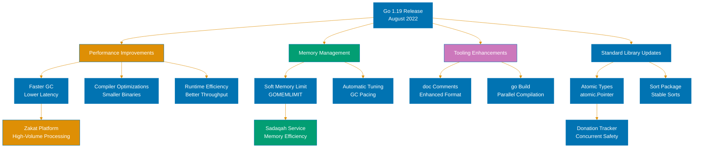
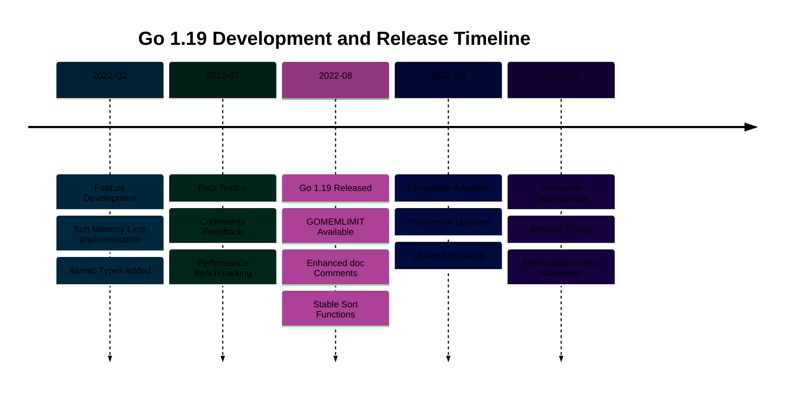

# Go 1.19 Release

## Overview

Go 1.19 introduces new features, performance improvements, and tooling enhancements. This release continues Go's evolution toward better performance and developer experience.

## Key Features

This release includes improvements to the compiler, runtime, and standard library.

## Breaking Changes

Consult the official Go 1.19 documentation for detailed breaking changes and migration guidance.

## References

- [Go 1.19 Release Notes](https://go.dev/doc/go1.19)
- [Go Documentation](https://go.dev/doc/)

---

**Last Updated**: 2026-01-24
**Go Version**: 1.18+ (baseline), 1.23+ (stable maintenance), 1.25.x (latest stable)
**Maintainers**: OSE Platform Documentation Team
