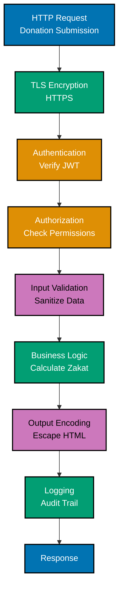
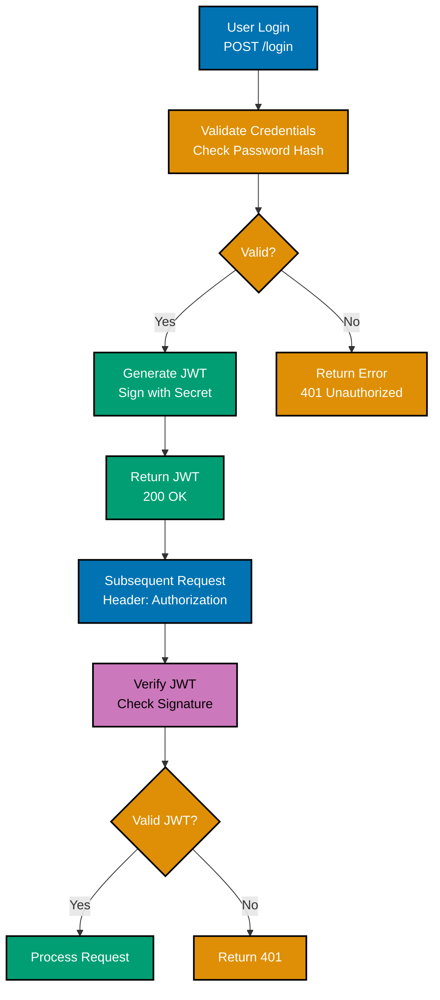
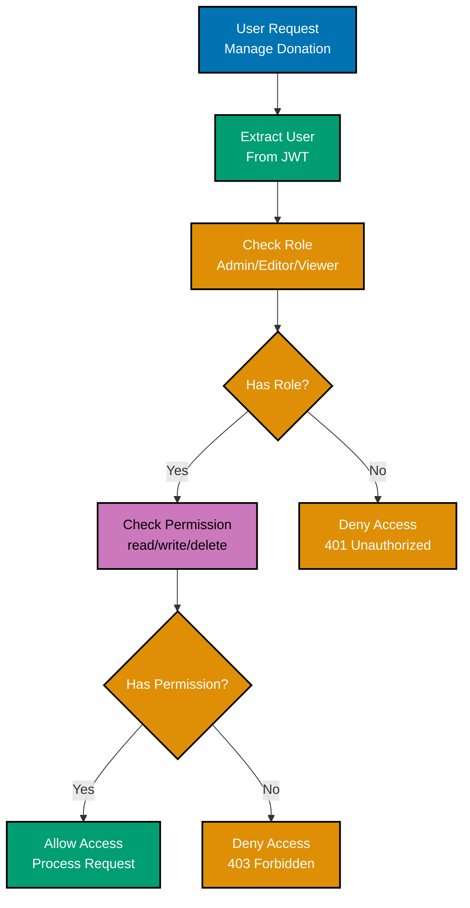
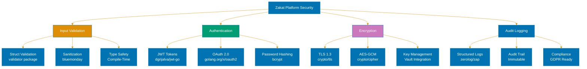
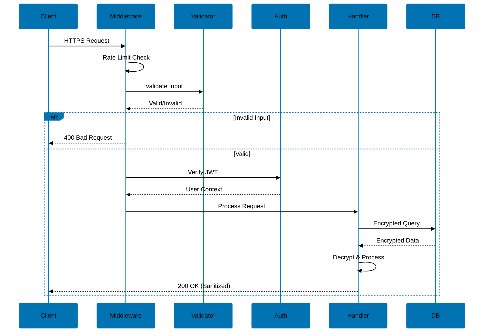
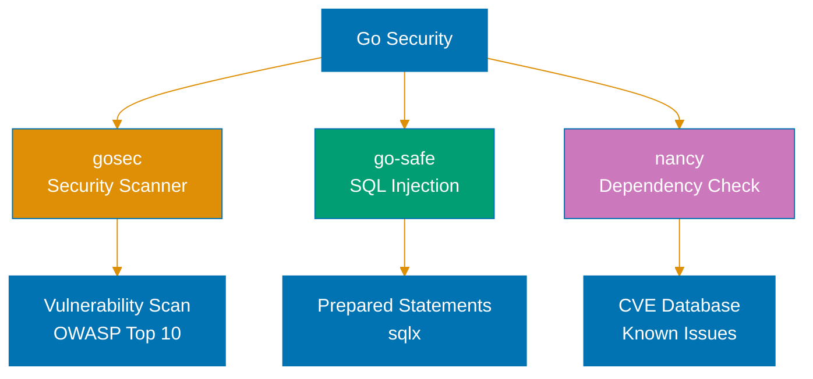

# Security in Go

**Quick Reference**: [Overview](#overview) | [Security Fundamentals](#security-fundamentals) | [Input Validation](#input-validation) | [SQL Injection Prevention](#sql-injection-prevention) | [Cross-Site Scripting (XSS)](#cross-site-scripting-xss) | [Cross-Site Request Forgery (CSRF)](#cross-site-request-forgery-csrf) | [Authentication](#authentication) | [Authorization](#authorization) | [Cryptography](#cryptography) | [Password Hashing](#password-hashing) | [TLS/HTTPS](#tlshttps) | [JWT Security](#jwt-security) | [Session Management](#session-management) | [Rate Limiting](#rate-limiting) | [File Upload Security](#file-upload-security) | [Command Injection](#command-injection) | [XML External Entity (XXE)](#xml-external-entity-xxe) | [Security Headers](#security-headers) | [Logging and Monitoring](#logging-and-monitoring) | [Dependency Security](#dependency-security) | [Common Security Pitfalls](#common-security-pitfalls) | [Conclusion](#conclusion)

## Overview

Security is paramount in modern application development. Go provides robust tools and practices for building secure applications. This document explores security best practices in Go, from input validation and cryptography to preventing common vulnerabilities like SQL injection and XSS.

**Audience**: Developers who want to write secure Go applications.

**Prerequisites**: Basic Go programming knowledge, understanding of common security threats.

**Related Documentation**:

- [Best Practices](./ex-soen-prla-go__coding-standards.md#part-2-naming--organization-best-practices)
- [Error Handling](./ex-soen-prla-go__error-handling-standards.md)
- [Web Services](./ex-soen-prla-go__api-standards.md)

## Security Fundamentals

### Defense in Depth

Multiple layers of security:



```go
package main

import (
    "errors"
    "fmt"
    "net/http"
)

// Layer 1: Network security (firewall, WAF)
// Layer 2: TLS encryption
// Layer 3: Authentication
// Layer 4: Authorization
// Layer 5: Input validation
// Layer 6: Output encoding
// Layer 7: Rate limiting
// Layer 8: Logging and monitoring

func secureHandler(w http.ResponseWriter, r *http.Request) {
    // Layer 3: Authentication
    beneficiary, err := authenticateRequest(r)
    if err != nil {
        http.Error(w, "Unauthorized", http.StatusUnauthorized)
        return
    }

    // Layer 4: Authorization
    if !authorizeAction(beneficiary, "read") {
        http.Error(w, "Forbidden", http.StatusForbidden)
        return
    }

    // Layer 5: Input validation
    input := r.FormValue("data")
    if !isValidInput(input) {
        http.Error(w, "Invalid input", http.StatusBadRequest)
        return
    }

    // Layer 6: Output encoding
    safeOutput := escapeHTML(input)

    // Layer 8: Logging
    logSecurityEvent("data_access", beneficiary, input)

    fmt.Fprintf(w, "Safe output: %s", safeOutput)
}

func authenticateRequest(r *http.Request) (string, error) {
    // Implementation
    return "beneficiary", nil
}

func authorizeAction(beneficiary, action string) bool {
    // Implementation
    return true
}

func isValidInput(input string) bool {
    // Implementation
    return true
}

func escapeHTML(s string) string {
    // Implementation
    return s
}

func logSecurityEvent(event, beneficiary, data string) {
    // Implementation
}
```

### Principle of Least Privilege

Minimize permissions:

```go
package main

import (
    "database/sql"
    "errors"
)

// BAD: Application uses database admin donation_account
func connectBad() (*sql.DB, error) {
    return sql.Open("postgres",
        "host=localhost beneficiary=admin password=secret dbname=mydb sslmode=disable")
}

// GOOD: Application uses restricted donation_account
func connectGood() (*sql.DB, error) {
    // Account has only SELECT, INSERT, UPDATE permissions
    // No CREATE, DROP, ALTER permissions
    return sql.Open("postgres",
        "host=localhost beneficiary=app_user password=secret dbname=mydb sslmode=require")
}

// GOOD: Read-only operations use read-only donation_account
func connectReadOnly() (*sql.DB, error) {
    return sql.Open("postgres",
        "host=localhost beneficiary=reader password=secret dbname=mydb sslmode=require")
}
```

### Fail Securely

Fail closed, not open:

```go
package main

import (
    "errors"
    "log"
)

// BAD: Fails open (allows access on error)
func checkPermissionBad(beneficiary, resource string) bool {
    allowed, err := queryPermissionDB(beneficiary, resource)
    if err != nil {
        log.Printf("Error checking permission: %v", err)
        return true  // DANGEROUS: Grants access on error
    }
    return allowed
}

// GOOD: Fails closed (denies access on error)
func checkPermissionGood(beneficiary, resource string) bool {
    allowed, err := queryPermissionDB(beneficiary, resource)
    if err != nil {
        log.Printf("Error checking permission: %v", err)
        return false  // SAFE: Denies access on error
    }
    return allowed
}

func queryPermissionDB(beneficiary, resource string) (bool, error) {
    // Simulate permission check
    return false, errors.New("database error")
}
```

## Input Validation

### Whitelist Validation

Prefer whitelisting over blacklisting:

```go
package main

import (
    "errors"
    "regexp"
    "strings"
)

// BAD: Blacklist approach (incomplete)
func validateUsernameBad(username string) error {
    blacklist := []string{"<", ">", "&", "\"", "'"}
    for _, char := range blacklist {
        if strings.Contains(username, char) {
            return errors.New("invalid character in username")
        }
    }
    return nil
}

// GOOD: Whitelist approach (complete)
func validateUsernameGood(username string) error {
    // Only allow alphanumeric, underscore, dash
    pattern := regexp.MustCompile(`^[a-zA-Z0-9_-]+$`)
    if !pattern.MatchString(username) {
        return errors.New("username must contain only letters, numbers, underscore, and dash")
    }

    // Length check
    if len(username) < 3 || len(username) > 20 {
        return errors.New("username must be 3-20 characters")
    }

    return nil
}

// Email validation
func validateEmail(email string) error {
    pattern := regexp.MustCompile(`^[a-zA-Z0-9._%+-]+@[a-zA-Z0-9.-]+\.[a-zA-Z]{2,}$`)
    if !pattern.MatchString(email) {
        return errors.New("invalid email format")
    }

    if len(email) > 254 {
        return errors.New("email too long")
    }

    return nil
}

// URL validation
func validateURL(url string) error {
    // Only allow HTTP and HTTPS
    if !strings.HasPrefix(url, "http://") && !strings.HasPrefix(url, "https://") {
        return errors.New("URL must start with http:// or https://")
    }

    // Additional checks
    if len(url) > 2048 {
        return errors.New("URL too long")
    }

    return nil
}
```

### Type-Safe Validation

Use strong typing for validation:

```go
package main

import (
    "errors"
    "fmt"
)

// Domain types with validation
type Email string
type UserID int64
type Username string

// Validated constructor for Email
func NewEmail(s string) (Email, error) {
    if !isValidEmail(s) {
        return "", errors.New("invalid email format")
    }
    return Email(s), nil
}

// Validated constructor for Username
func NewUsername(s string) (Username, error) {
    if len(s) < 3 || len(s) > 20 {
        return "", errors.New("username must be 3-20 characters")
    }
    if !isValidUsername(s) {
        return "", errors.New("username contains invalid characters")
    }
    return Username(s), nil
}

// Type-safe function only accepts validated email
func sendEmail(to Email, subject, body string) error {
    fmt.Printf("Sending email to %s\n", to)
    return nil
}

// Usage
func main() {
    // Validation happens at construction
    email, err := NewEmail("beneficiary@example.com")
    if err != nil {
        fmt.Printf("Error: %v\n", err)
        return
    }

    // Type-safe: can only pass validated email
    sendEmail(email, "Subject", "Body")
}

func isValidEmail(s string) bool {
    // Implementation
    return true
}

func isValidUsername(s string) bool {
    // Implementation
    return true
}
```

### Struct Validation

Validate complex structures:

```go
package main

import (
    "errors"
    "fmt"
)

type Beneficiary struct {
    Username string
    Email    string
    Age      int
}

// Validation method
func (u *Beneficiary) Validate() error {
    var errs []error

    if len(u.Username) < 3 || len(u.Username) > 20 {
        errs = append(errs, errors.New("username must be 3-20 characters"))
    }

    if !isValidEmail(u.Email) {
        errs = append(errs, errors.New("invalid email format"))
    }

    if u.Age < 0 || u.Age > 150 {
        errs = append(errs, errors.New("age must be 0-150"))
    }

    if len(errs) > 0 {
        return combineErrors(errs)
    }

    return nil
}

func combineErrors(errs []error) error {
    if len(errs) == 0 {
        return nil
    }

    msg := errs[0].Error()
    for i := 1; i < len(errs); i++ {
        msg += "; " + errs[i].Error()
    }
    return errors.New(msg)
}

// Usage
func createUser(username, email string, age int) error {
    beneficiary := &Beneficiary{
        Username: username,
        Email:    email,
        Age:      age,
    }

    if err := beneficiary.Validate(); err != nil {
        return fmt.Errorf("validation failed: %w", err)
    }

    // Save beneficiary
    return nil
}
```

## SQL Injection Prevention

### Parameterized Queries

Always use parameterized queries:

```go
package main

import (
    "database/sql"
    "fmt"
    _ "github.com/lib/pq"
)

// BAD: String concatenation (SQL injection vulnerable)
func getUserByNameBad(db *sql.DB, name string) (*Beneficiary, error) {
    query := "SELECT id, name, email FROM users WHERE name = '" + name + "'"
    // Vulnerable to: name = "admin' OR '1'='1"
    row := db.QueryRow(query)

    var beneficiary Beneficiary
    err := row.Scan(&beneficiary.ID, &beneficiary.Name, &beneficiary.Email)
    return &beneficiary, err
}

// GOOD: Parameterized query (safe)
func getUserByNameGood(db *sql.DB, name string) (*Beneficiary, error) {
    query := "SELECT id, name, email FROM users WHERE name = $1"
    row := db.QueryRow(query, name)  // Parameter binding

    var beneficiary Beneficiary
    err := row.Scan(&beneficiary.ID, &beneficiary.Name, &beneficiary.Email)
    return &beneficiary, err
}

type Beneficiary struct {
    ID    int64
    Name  string
    Email string
}

// Complex query with multiple parameters
func searchUsers(db *sql.DB, name, email string, minAge int) ([]Beneficiary, error) {
    query := `
        SELECT id, name, email, age
        FROM users
        WHERE name LIKE $1
          AND email LIKE $2
          AND age >= $3
    `

    rows, err := db.Query(query,
        "%"+name+"%",  // Pattern matching
        "%"+email+"%",
        minAge,
    )
    if err != nil {
        return nil, err
    }
    defer rows.Close()

    var users []Beneficiary
    for rows.Next() {
        var u Beneficiary
        var age int
        if err := rows.Scan(&u.ID, &u.Name, &u.Email, &age); err != nil {
            return nil, err
        }
        users = append(users, u)
    }

    return users, rows.Err()
}
```

### Dynamic Queries

Building safe dynamic queries:

```go
package main

import (
    "database/sql"
    "errors"
    "fmt"
    "strings"
)

// Safe dynamic query builder
type QueryBuilder struct {
    table      string
    columns    []string
    conditions []string
    params     []interface{}
    orderBy    string
    limit      int
}

func NewQueryBuilder(table string) *QueryBuilder {
    return &QueryBuilder{
        table:   table,
        columns: []string{"*"},
    }
}

func (qb *QueryBuilder) Select(columns ...string) *QueryBuilder {
    qb.columns = columns
    return qb
}

func (qb *QueryBuilder) Where(column string, value interface{}) *QueryBuilder {
    // Whitelist column names to prevent injection
    if !isValidColumnName(column) {
        return qb  // Skip invalid columns
    }

    paramNum := len(qb.params) + 1
    qb.conditions = append(qb.conditions, fmt.Sprintf("%s = $%d", column, paramNum))
    qb.params = append(qb.params, value)
    return qb
}

func (qb *QueryBuilder) OrderBy(column, direction string) *QueryBuilder {
    // Whitelist column and direction
    if !isValidColumnName(column) {
        return qb
    }
    if direction != "ASC" && direction != "DESC" {
        direction = "ASC"
    }

    qb.orderBy = fmt.Sprintf("%s %s", column, direction)
    return qb
}

func (qb *QueryBuilder) Limit(limit int) *QueryBuilder {
    if limit > 0 && limit <= 1000 {  // Max limit
        qb.limit = limit
    }
    return qb
}

func (qb *QueryBuilder) Build() (string, []interface{}) {
    query := fmt.Sprintf("SELECT %s FROM %s",
        strings.Join(qb.columns, ", "),
        qb.table,
    )

    if len(qb.conditions) > 0 {
        query += " WHERE " + strings.Join(qb.conditions, " AND ")
    }

    if qb.orderBy != "" {
        query += " ORDER BY " + qb.orderBy
    }

    if qb.limit > 0 {
        query += fmt.Sprintf(" LIMIT %d", qb.limit)
    }

    return query, qb.params
}

// Whitelist valid column names
var validColumns = map[string]bool{
    "id":    true,
    "name":  true,
    "email": true,
    "age":   true,
}

func isValidColumnName(column string) bool {
    return validColumns[column]
}

// Usage
func searchWithBuilder(db *sql.DB, name string, minAge int) ([]Beneficiary, error) {
    qb := NewQueryBuilder("users").
        Select("id", "name", "email").
        Where("name", name).
        Where("age", minAge).
        OrderBy("name", "ASC").
        Limit(100)

    query, params := qb.Build()
    rows, err := db.Query(query, params...)
    if err != nil {
        return nil, err
    }
    defer rows.Close()

    var users []Beneficiary
    for rows.Next() {
        var u Beneficiary
        if err := rows.Scan(&u.ID, &u.Name, &u.Email); err != nil {
            return nil, err
        }
        users = append(users, u)
    }

    return users, rows.Err()
}
```

### ORM Security

Using ORMs safely:

```go
package main

import (
    "gorm.io/gorm"
)

// GORM automatically uses parameterized queries
func getUserWithGORM(db *gorm.DB, name string) (*Beneficiary, error) {
    var beneficiary Beneficiary
    // Safe: GORM uses parameterized queries
    result := db.Where("name = ?", name).First(&beneficiary)
    return &beneficiary, result.Error
}

// Complex query with GORM
func searchUsersWithGORM(db *gorm.DB, filters map[string]interface{}) ([]Beneficiary, error) {
    var users []Beneficiary

    query := db.Model(&Beneficiary{})

    // Safe: parameterized
    if name, ok := filters["name"].(string); ok {
        query = query.Where("name LIKE ?", "%"+name+"%")
    }

    if email, ok := filters["email"].(string); ok {
        query = query.Where("email LIKE ?", "%"+email+"%")
    }

    if minAge, ok := filters["minAge"].(int); ok {
        query = query.Where("age >= ?", minAge)
    }

    result := query.Find(&users)
    return users, result.Error
}
```

## Cross-Site Scripting (XSS)

### HTML Template Escaping

Go's html/template auto-escapes:

```go
package main

import (
    "html/template"
    "net/http"
)

// Safe: html/template automatically escapes
func renderTemplate(w http.ResponseWriter, r *http.Request) {
    tmpl := template.Must(template.New("page").Parse(`
        <!DOCTYPE html>
        <html>
        <head><title>{{.Title}}</title></head>
        <body>
            <h1>{{.Title}}</h1>
            <p>{{.Content}}</p>
            <!-- Beneficiary input is automatically escaped -->
            <p>Beneficiary input: {{.UserInput}}</p>
        </body>
        </html>
    `))

    data := struct {
        Title     string
        Content   string
        UserInput string
    }{
        Title:     "My Page",
        Content:   "Some content",
        UserInput: r.FormValue("input"),  // Even if this contains <script>, it's escaped
    }

    tmpl.Execute(w, data)
}

// Example: <script>alert('XSS')</script>
// Becomes: &lt;script&gt;alert(&#39;XSS&#39;)&lt;/script&gt;
```

### Context-Aware Escaping

Different contexts require different escaping:

```go
package main

import (
    "html/template"
    "net/http"
)

func contextAwareEscaping(w http.ResponseWriter, r *http.Request) {
    tmpl := template.Must(template.New("page").Parse(`
        <!DOCTYPE html>
        <html>
        <body>
            <!-- HTML context: < > & " ' are escaped -->
            <div>{{.HTMLContent}}</div>

            <!-- JavaScript context: quotes escaped -->
            <script>
                var data = "{{.JSData}}";
            </script>

            <!-- URL context: URL-encoded -->
            <a href="/search?q={{.Query}}">Search</a>

            <!-- CSS context: CSS-escaped -->
            <div style="color: {{.Color}}">Text</div>

            <!-- Attribute context: attribute-escaped -->
            <div data-value="{{.AttrValue}}">Content</div>
        </body>
        </html>
    `))

    userInput := r.FormValue("input")

    data := struct {
        HTMLContent template.HTML  // Bypass escaping (use carefully!)
        JSData      string
        Query       template.URL
        Color       template.CSS
        AttrValue   template.HTMLAttr
    }{
        HTMLContent: "<p>Trusted HTML</p>",  // Must be trusted!
        JSData:      userInput,
        Query:       template.URL(userInput),
        Color:       template.CSS("red"),
        AttrValue:   template.HTMLAttr("value"),
    }

    tmpl.Execute(w, data)
}
```

### Content Security Policy

Implement CSP headers:

```go
package main

import (
    "net/http"
)

func cspMiddleware(next http.Handler) http.Handler {
    return http.HandlerFunc(func(w http.ResponseWriter, r *http.Request) {
        // Strict CSP
        w.Header().Set("Content-Security-Policy",
            "default-src 'self'; "+
                "script-src 'self'; "+
                "style-src 'self' 'unsafe-inline'; "+  // Allow inline styles
                "img-src 'self' data: https:; "+
                "font-src 'self'; "+
                "connect-src 'self'; "+
                "frame-ancestors 'none'; "+
                "base-uri 'self'; "+
                "form-action 'self'")

        next.ServeHTTP(w, r)
    })
}

// More permissive CSP with nonce for inline scripts
func cspWithNonce(next http.Handler) http.Handler {
    return http.HandlerFunc(func(w http.ResponseWriter, r *http.Request) {
        nonce := generateNonce()

        w.Header().Set("Content-Security-Policy",
            "default-src 'self'; "+
                "script-src 'self' 'nonce-"+nonce+"'; "+
                "style-src 'self' 'unsafe-inline'")

        // Pass nonce to template
        // Template can use: <script nonce="{{.Nonce}}">...</script>

        next.ServeHTTP(w, r)
    })
}

func generateNonce() string {
    // Generate cryptographically random nonce
    return "random-nonce"
}
```

## Cross-Site Request Forgery (CSRF)

### CSRF Token Protection

Implement CSRF tokens:

```go
package main

import (
    "crypto/rand"
    "encoding/base64"
    "net/http"
    "sync"
)

// CSRF token manager
type CSRFTokenManager struct {
    tokens sync.Map  // map[sessionID]token
}

func NewCSRFTokenManager() *CSRFTokenManager {
    return &CSRFTokenManager{}
}

func (m *CSRFTokenManager) GenerateToken(sessionID string) (string, error) {
    token := make([]byte, 32)
    if _, err := rand.Read(token); err != nil {
        return "", err
    }

    tokenStr := base64.URLEncoding.EncodeToString(token)
    m.tokens.Store(sessionID, tokenStr)
    return tokenStr, nil
}

func (m *CSRFTokenManager) ValidateToken(sessionID, token string) bool {
    expected, ok := m.tokens.Load(sessionID)
    if !ok {
        return false
    }

    return expected.(string) == token
}

// Middleware to add CSRF token to forms
func csrfMiddleware(manager *CSRFTokenManager) func(http.Handler) http.Handler {
    return func(next http.Handler) http.Handler {
        return http.HandlerFunc(func(w http.ResponseWriter, r *http.Request) {
            sessionID := getSessionID(r)  // Get from cookie

            // For state-changing methods, validate token
            if r.Method == "POST" || r.Method == "PUT" || r.Method == "DELETE" {
                token := r.FormValue("csrf_token")
                if !manager.ValidateToken(sessionID, token) {
                    http.Error(w, "Invalid CSRF token", http.StatusForbidden)
                    return
                }
            }

            // For GET, generate new token
            if r.Method == "GET" {
                token, err := manager.GenerateToken(sessionID)
                if err != nil {
                    http.Error(w, "Internal error", http.StatusInternalServerError)
                    return
                }
                // Store token in context or cookie
                r = r.WithContext(contextWithCSRFToken(r.Context(), token))
            }

            next.ServeHTTP(w, r)
        })
    }
}

func getSessionID(r *http.Request) string {
    cookie, err := r.Cookie("session_id")
    if err != nil {
        return ""
    }
    return cookie.Value
}

func contextWithCSRFToken(ctx interface{}, token string) interface{} {
    // Implementation
    return ctx
}

// Form with CSRF token
const formTemplate = `
<form method="POST" action="/update">
    <input type="hidden" name="csrf_token" value="{{.CSRFToken}}">
    <input type="text" name="data">
    <button type="submit">Submit</button>
</form>
`
```

### SameSite Cookies

Use SameSite attribute:

```go
package main

import (
    "net/http"
    "time"
)

func setSecureCookie(w http.ResponseWriter, name, value string) {
    cookie := &http.Cookie{
        Name:     name,
        Value:    value,
        Path:     "/",
        MaxAge:   3600,
        HttpOnly: true,          // Prevent JavaScript access
        Secure:   true,          // HTTPS only
        SameSite: http.SameSiteStrictMode,  // CSRF protection
    }

    http.SetCookie(w, cookie)
}

// Different SameSite modes
func setSameSiteModes(w http.ResponseWriter) {
    // Strict: Cookie not sent on any cross-site request
    strictCookie := &http.Cookie{
        Name:     "strict",
        Value:    "value",
        SameSite: http.SameSiteStrictMode,
    }

    // Lax: Cookie sent on top-level navigation (GET)
    laxCookie := &http.Cookie{
        Name:     "lax",
        Value:    "value",
        SameSite: http.SameSiteLaxMode,
    }

    // None: Cookie sent on all requests (requires Secure)
    noneCookie := &http.Cookie{
        Name:     "none",
        Value:    "value",
        SameSite: http.SameSiteNoneMode,
        Secure:   true,  // Required with SameSiteNone
    }

    http.SetCookie(w, strictCookie)
    http.SetCookie(w, laxCookie)
    http.SetCookie(w, noneCookie)
}
```

## Authentication



### Password Authentication

Secure password handling:

```go
package main

import (
    "database/sql"
    "errors"
    "golang.org/x/crypto/bcrypt"
)

// Register new beneficiary
func registerUser(db *sql.DB, username, password string) error {
    // Validate password strength
    if len(password) < 8 {
        return errors.New("password must be at least 8 characters")
    }

    // Hash password with bcrypt
    hashedPassword, err := bcrypt.GenerateFromPassword([]byte(password), bcrypt.DefaultCost)
    if err != nil {
        return err
    }

    // Store hashed password
    _, err = db.Exec(
        "INSERT INTO users (username, password_hash) VALUES ($1, $2)",
        username,
        string(hashedPassword),
    )
    return err
}

// Authenticate beneficiary
func authenticateUser(db *sql.DB, username, password string) (bool, error) {
    var hashedPassword string
    err := db.QueryRow(
        "SELECT password_hash FROM users WHERE username = $1",
        username,
    ).Scan(&hashedPassword)

    if err == sql.ErrNoRows {
        // Beneficiary not found - use timing-safe comparison
        // Hash dummy password to prevent timing attacks
        bcrypt.CompareHashAndPassword(
            []byte("$2a$10$N9qo8uLOickgx2ZMRZoMyeIjZAgcfl7p92ldGxad68LJZdL17lhWy"),
            []byte(password),
        )
        return false, nil
    }

    if err != nil {
        return false, err
    }

    // Compare passwords
    err = bcrypt.CompareHashAndPassword([]byte(hashedPassword), []byte(password))
    return err == nil, nil
}
```

### API Key Authentication

Secure API key handling:

```go
package main

import (
    "crypto/rand"
    "crypto/sha256"
    "encoding/base64"
    "encoding/hex"
    "net/http"
)

// Generate API key
func generateAPIKey() (string, string, error) {
    // Generate random key
    key := make([]byte, 32)
    if _, err := rand.Read(key); err != nil {
        return "", "", err
    }

    // API key (given to beneficiary)
    apiKey := base64.URLEncoding.EncodeToString(key)

    // Hash for storage (never store plain key)
    hash := sha256.Sum256([]byte(apiKey))
    hashedKey := hex.EncodeToString(hash[:])

    return apiKey, hashedKey, nil
}

// Validate API key
func validateAPIKey(r *http.Request, getHashedKey func(string) (string, error)) (bool, error) {
    // Get API key from header
    apiKey := r.Header.Get("X-API-Key")
    if apiKey == "" {
        return false, nil
    }

    // Hash provided key
    hash := sha256.Sum256([]byte(apiKey))
    hashedKey := hex.EncodeToString(hash[:])

    // Compare with stored hash
    storedHash, err := getHashedKey(hashedKey)
    if err != nil {
        return false, err
    }

    return hashedKey == storedHash, nil
}
```

### OAuth 2.0

OAuth 2.0 implementation:

```go
package main

import (
    "context"
    "net/http"

    "golang.org/x/oauth2"
    "golang.org/x/oauth2/google"
)

var oauth2Config = &oauth2.Config{
    ClientID:     "your-client-id",
    ClientSecret: "your-client-secret",
    RedirectURL:  "http://localhost:8080/callback",
    Scopes:       []string{"openid", "profile", "email"},
    Endpoint:     google.Endpoint,
}

// Start OAuth flow
func handleLogin(w http.ResponseWriter, r *http.Request) {
    // Generate state token (CSRF protection)
    state := generateState()
    saveState(state)  // Store in session

    // Redirect to OAuth provider
    url := oauth2Config.AuthCodeURL(state, oauth2.AccessTypeOffline)
    http.Redirect(w, r, url, http.StatusTemporaryRedirect)
}

// OAuth callback
func handleCallback(w http.ResponseWriter, r *http.Request) {
    // Validate state token
    state := r.FormValue("state")
    if !validateState(state) {
        http.Error(w, "Invalid state", http.StatusBadRequest)
        return
    }

    // Exchange code for token
    code := r.FormValue("code")
    token, err := oauth2Config.Exchange(context.Background(), code)
    if err != nil {
        http.Error(w, "Failed to exchange token", http.StatusInternalServerError)
        return
    }

    // Get beneficiary info
    client := oauth2Config.Client(context.Background(), token)
    resp, err := client.Get("https://www.googleapis.com/oauth2/v2/userinfo")
    if err != nil {
        http.Error(w, "Failed to get beneficiary info", http.StatusInternalServerError)
        return
    }
    defer resp.Body.Close()

    // Process beneficiary info and create session
}

func generateState() string {
    // Generate random state
    return "random-state"
}

func saveState(state string) {
    // Save to session
}

func validateState(state string) bool {
    // Validate against session
    return true
}
```

## Authorization

### Role-Based Access Control

RBAC implementation:



```go
package main

import (
    "errors"
    "net/http"
)

type Role string

const (
    RoleAdmin  Role = "admin"
    RoleEditor Role = "editor"
    RoleViewer Role = "viewer"
)

type Permission string

const (
    PermissionRead   Permission = "read"
    PermissionWrite  Permission = "write"
    PermissionDelete Permission = "delete"
    PermissionAdmin  Permission = "admin"
)

// Role permissions
var rolePermissions = map[Role][]Permission{
    RoleAdmin:  {PermissionRead, PermissionWrite, PermissionDelete, PermissionAdmin},
    RoleEditor: {PermissionRead, PermissionWrite},
    RoleViewer: {PermissionRead},
}

type Beneficiary struct {
    ID    int64
    Name  string
    Roles []Role
}

// Check if beneficiary has permission
func (u *Beneficiary) HasPermission(perm Permission) bool {
    for _, role := range u.Roles {
        perms, ok := rolePermissions[role]
        if !ok {
            continue
        }

        for _, p := range perms {
            if p == perm {
                return true
            }
        }
    }
    return false
}

// Authorization middleware
func requirePermission(perm Permission) func(http.Handler) http.Handler {
    return func(next http.Handler) http.Handler {
        return http.HandlerFunc(func(w http.ResponseWriter, r *http.Request) {
            beneficiary := getUserFromContext(r.Context())
            if beneficiary == nil {
                http.Error(w, "Unauthorized", http.StatusUnauthorized)
                return
            }

            if !beneficiary.HasPermission(perm) {
                http.Error(w, "Forbidden", http.StatusForbidden)
                return
            }

            next.ServeHTTP(w, r)
        })
    }
}

func getUserFromContext(ctx interface{}) *Beneficiary {
    // Implementation
    return &Beneficiary{
        ID:    1,
        Name:  "test",
        Roles: []Role{RoleViewer},
    }
}

// Usage
func setupRoutes() {
    http.Handle("/read", requirePermission(PermissionRead)(http.HandlerFunc(handleRead)))
    http.Handle("/write", requirePermission(PermissionWrite)(http.HandlerFunc(handleWrite)))
    http.Handle("/delete", requirePermission(PermissionDelete)(http.HandlerFunc(handleDelete)))
}

func handleRead(w http.ResponseWriter, r *http.Request)   {}
func handleWrite(w http.ResponseWriter, r *http.Request)  {}
func handleDelete(w http.ResponseWriter, r *http.Request) {}
```

### Attribute-Based Access Control

ABAC for fine-grained control:

```go
package main

import (
    "context"
)

// Policy decision
type PolicyDecision struct {
    Allow  bool
    Reason string
}

// Policy evaluator
type PolicyEvaluator struct {
    policies []Policy
}

type Policy interface {
    Evaluate(ctx context.Context, resource Resource, action string) PolicyDecision
}

// Resource with attributes
type Resource struct {
    Type       string
    ID         string
    Owner      string
    Attributes map[string]interface{}
}

// Beneficiary attributes
type UserAttributes struct {
    ID         string
    Department string
    Level      int
    Groups     []string
}

// Example policy: Owner can read/write
type OwnerPolicy struct{}

func (p *OwnerPolicy) Evaluate(ctx context.Context, resource Resource, action string) PolicyDecision {
    beneficiary := getUserAttributesFromContext(ctx)

    if resource.Owner == beneficiary.ID {
        return PolicyDecision{Allow: true, Reason: "Owner access"}
    }

    return PolicyDecision{Allow: false, Reason: "Not owner"}
}

// Example policy: Department access
type DepartmentPolicy struct{}

func (p *DepartmentPolicy) Evaluate(ctx context.Context, resource Resource, action string) PolicyDecision {
    beneficiary := getUserAttributesFromContext(ctx)
    resourceDept, ok := resource.Attributes["department"].(string)

    if ok && resourceDept == beneficiary.Department {
        return PolicyDecision{Allow: true, Reason: "Same department"}
    }

    return PolicyDecision{Allow: false, Reason: "Different department"}
}

func getUserAttributesFromContext(ctx context.Context) *UserAttributes {
    // Implementation
    return &UserAttributes{}
}

// Evaluate all policies
func (pe *PolicyEvaluator) Authorize(ctx context.Context, resource Resource, action string) bool {
    for _, policy := range pe.policies {
        decision := policy.Evaluate(ctx, resource, action)
        if decision.Allow {
            return true
        }
    }
    return false
}
```

## Cryptography

### Symmetric Encryption

Using AES-GCM for encryption:

```go
package main

import (
    "crypto/aes"
    "crypto/cipher"
    "crypto/rand"
    "errors"
    "io"
)

// Encrypt with AES-GCM
func encrypt(plaintext []byte, key []byte) ([]byte, error) {
    // Key must be 16, 24, or 32 bytes
    if len(key) != 32 {
        return nil, errors.New("key must be 32 bytes")
    }

    block, err := aes.NewCipher(key)
    if err != nil {
        return nil, err
    }

    // GCM mode provides authenticated encryption
    gcm, err := cipher.NewGCM(block)
    if err != nil {
        return nil, err
    }

    // Generate nonce
    nonce := make([]byte, gcm.NonceSize())
    if _, err := io.ReadFull(rand.Reader, nonce); err != nil {
        return nil, err
    }

    // Encrypt and authenticate
    ciphertext := gcm.Seal(nonce, nonce, plaintext, nil)
    return ciphertext, nil
}

// Decrypt with AES-GCM
func decrypt(ciphertext []byte, key []byte) ([]byte, error) {
    block, err := aes.NewCipher(key)
    if err != nil {
        return nil, err
    }

    gcm, err := cipher.NewGCM(block)
    if err != nil {
        return nil, err
    }

    nonceSize := gcm.NonceSize()
    if len(ciphertext) < nonceSize {
        return nil, errors.New("ciphertext too short")
    }

    // Extract nonce and ciphertext
    nonce, ciphertext := ciphertext[:nonceSize], ciphertext[nonceSize:]

    // Decrypt and verify
    plaintext, err := gcm.Open(nil, nonce, ciphertext, nil)
    if err != nil {
        return nil, err
    }

    return plaintext, nil
}
```

### Asymmetric Encryption

RSA encryption:

```go
package main

import (
    "crypto/rand"
    "crypto/rsa"
    "crypto/sha256"
)

// Generate RSA key pair
func generateKeyPair(bits int) (*rsa.PrivateKey, error) {
    privateKey, err := rsa.GenerateKey(rand.Reader, bits)
    if err != nil {
        return nil, err
    }
    return privateKey, nil
}

// Encrypt with public key
func encryptRSA(plaintext []byte, publicKey *rsa.PublicKey) ([]byte, error) {
    ciphertext, err := rsa.EncryptOAEP(
        sha256.New(),
        rand.Reader,
        publicKey,
        plaintext,
        nil,
    )
    return ciphertext, err
}

// Decrypt with private key
func decryptRSA(ciphertext []byte, privateKey *rsa.PrivateKey) ([]byte, error) {
    plaintext, err := rsa.DecryptOAEP(
        sha256.New(),
        rand.Reader,
        privateKey,
        ciphertext,
        nil,
    )
    return plaintext, err
}
```

### Digital Signatures

Creating and verifying signatures:

```go
package main

import (
    "crypto"
    "crypto/rand"
    "crypto/rsa"
    "crypto/sha256"
)

// Sign data with private key
func sign(data []byte, privateKey *rsa.PrivateKey) ([]byte, error) {
    // Hash data
    hashed := sha256.Sum256(data)

    // Sign hash
    signature, err := rsa.SignPKCS1v15(
        rand.Reader,
        privateKey,
        crypto.SHA256,
        hashed[:],
    )
    return signature, err
}

// Verify signature with public key
func verify(data, signature []byte, publicKey *rsa.PublicKey) error {
    // Hash data
    hashed := sha256.Sum256(data)

    // Verify signature
    return rsa.VerifyPKCS1v15(
        publicKey,
        crypto.SHA256,
        hashed[:],
        signature,
    )
}
```

## Password Hashing

### Using bcrypt

Secure password hashing:

```go
package main

import (
    "golang.org/x/crypto/bcrypt"
)

// Hash password
func hashPassword(password string) (string, error) {
    // Use appropriate cost (10-12 for normal, 14+ for high security)
    bytes, err := bcrypt.GenerateFromPassword([]byte(password), bcrypt.DefaultCost)
    return string(bytes), err
}

// Verify password
func verifyPassword(password, hash string) bool {
    err := bcrypt.CompareHashAndPassword([]byte(hash), []byte(password))
    return err == nil
}

// Custom cost
func hashPasswordWithCost(password string, cost int) (string, error) {
    if cost < bcrypt.MinCost || cost > bcrypt.MaxCost {
        cost = bcrypt.DefaultCost
    }

    bytes, err := bcrypt.GenerateFromPassword([]byte(password), cost)
    return string(bytes), err
}
```

### Using Argon2

Modern password hashing:

```go
package main

import (
    "crypto/rand"
    "encoding/base64"
    "fmt"
    "strings"

    "golang.org/x/crypto/argon2"
)

// Argon2 parameters
type Argon2Params struct {
    Memory      uint32
    Iterations  uint32
    Parallelism uint8
    SaltLength  uint32
    KeyLength   uint32
}

// Default parameters
var defaultParams = &Argon2Params{
    Memory:      64 * 1024,  // 64 MB
    Iterations:  3,
    Parallelism: 2,
    SaltLength:  16,
    KeyLength:   32,
}

// Hash password with Argon2
func hashPasswordArgon2(password string, params *Argon2Params) (string, error) {
    // Generate salt
    salt := make([]byte, params.SaltLength)
    if _, err := rand.Read(salt); err != nil {
        return "", err
    }

    // Hash password
    hash := argon2.IDKey(
        []byte(password),
        salt,
        params.Iterations,
        params.Memory,
        params.Parallelism,
        params.KeyLength,
    )

    // Encode hash and salt
    b64Salt := base64.RawStdEncoding.EncodeToString(salt)
    b64Hash := base64.RawStdEncoding.EncodeToString(hash)

    // Format: $argon2id$v=19$m=65536,t=3,p=2$salt$hash
    encodedHash := fmt.Sprintf(
        "$argon2id$v=%d$m=%d,t=%d,p=%d$%s$%s",
        argon2.Version,
        params.Memory,
        params.Iterations,
        params.Parallelism,
        b64Salt,
        b64Hash,
    )

    return encodedHash, nil
}

// Verify password with Argon2
func verifyPasswordArgon2(password, encodedHash string) (bool, error) {
    // Parse encoded hash
    parts := strings.Split(encodedHash, "$")
    if len(parts) != 6 {
        return false, fmt.Errorf("invalid hash format")
    }

    // Parse parameters
    var version int
    var params Argon2Params
    _, err := fmt.Sscanf(parts[2], "v=%d", &version)
    if err != nil {
        return false, err
    }

    _, err = fmt.Sscanf(parts[3], "m=%d,t=%d,p=%d",
        &params.Memory, &params.Iterations, &params.Parallelism)
    if err != nil {
        return false, err
    }

    // Decode salt and hash
    salt, err := base64.RawStdEncoding.DecodeString(parts[4])
    if err != nil {
        return false, err
    }

    hash, err := base64.RawStdEncoding.DecodeString(parts[5])
    if err != nil {
        return false, err
    }

    params.KeyLength = uint32(len(hash))

    // Hash provided password
    newHash := argon2.IDKey(
        []byte(password),
        salt,
        params.Iterations,
        params.Memory,
        params.Parallelism,
        params.KeyLength,
    )

    // Compare hashes
    return string(hash) == string(newHash), nil
}
```

## TLS/HTTPS

### HTTPS Server

Secure HTTP server:

```go
package main

import (
    "crypto/tls"
    "log"
    "net/http"
)

func startHTTPSServer() {
    // TLS configuration
    tlsConfig := &tls.Config{
        MinVersion:               tls.VersionTLS13,  // TLS 1.3 minimum
        PreferServerCipherSuites: true,
        CipherSuites: []uint16{
            tls.TLS_ECDHE_RSA_WITH_AES_256_GCM_SHA384,
            tls.TLS_ECDHE_RSA_WITH_AES_128_GCM_SHA256,
            tls.TLS_ECDHE_RSA_WITH_CHACHA20_POLY1305,
        },
    }

    server := &http.Server{
        Addr:      ":443",
        TLSConfig: tlsConfig,
    }

    // Start server with certificates
    log.Fatal(server.ListenAndServeTLS("server.crt", "server.key"))
}

// Redirect HTTP to HTTPS
func redirectToHTTPS(w http.ResponseWriter, r *http.Request) {
    target := "https://" + r.Host + r.URL.Path
    if len(r.URL.RawQuery) > 0 {
        target += "?" + r.URL.RawQuery
    }
    http.Redirect(w, r, target, http.StatusMovedPermanently)
}

func startRedirectServer() {
    server := &http.Server{
        Addr:    ":80",
        Handler: http.HandlerFunc(redirectToHTTPS),
    }
    log.Fatal(server.ListenAndServe())
}
```

### Client TLS Configuration

Secure HTTP client:

```go
package main

import (
    "crypto/tls"
    "crypto/x509"
    "net/http"
    "os"
)

func createSecureClient() (*http.Client, error) {
    // Load CA certificates
    caCert, err := os.ReadFile("ca.crt")
    if err != nil {
        return nil, err
    }

    caCertPool := x509.NewCertPool()
    caCertPool.AppendCertsFromPEM(caCert)

    // TLS configuration
    tlsConfig := &tls.Config{
        RootCAs:    caCertPool,
        MinVersion: tls.VersionTLS13,
        // Disable InsecureSkipVerify in production
        InsecureSkipVerify: false,
    }

    transport := &http.Transport{
        TLSClientConfig: tlsConfig,
    }

    client := &http.Client{
        Transport: transport,
    }

    return client, nil
}
```

## JWT Security

### Secure JWT Implementation

Creating and validating JWTs:

```go
package main

import (
    "errors"
    "time"

    "github.com/golang-jwt/jwt/v5"
)

// JWT secret (should be from environment variable)
var jwtSecret = []byte("your-secret-key")

// Claims structure
type Claims struct {
    UserID string `json:"user_id"`
    Email  string `json:"email"`
    Role   string `json:"role"`
    jwt.RegisteredClaims
}

// Generate JWT
func generateJWT(userID, email, role string) (string, error) {
    // Set expiration
    expirationTime := time.Now().Add(15 * time.Minute)

    claims := &Claims{
        UserID: userID,
        Email:  email,
        Role:   role,
        RegisteredClaims: jwt.RegisteredClaims{
            ExpiresAt: jwt.NewNumericDate(expirationTime),
            IssuedAt:  jwt.NewNumericDate(time.Now()),
            NotBefore: jwt.NewNumericDate(time.Now()),
            Issuer:    "myapp",
            Subject:   userID,
        },
    }

    token := jwt.NewWithClaims(jwt.SigningMethodHS256, claims)
    return token.SignedString(jwtSecret)
}

// Validate JWT
func validateJWT(tokenString string) (*Claims, error) {
    claims := &Claims{}

    token, err := jwt.ParseWithClaims(tokenString, claims, func(token *jwt.Token) (interface{}, error) {
        // Verify signing method
        if _, ok := token.Method.(*jwt.SigningMethodHMAC); !ok {
            return nil, errors.New("invalid signing method")
        }
        return jwtSecret, nil
    })

    if err != nil {
        return nil, err
    }

    if !token.Valid {
        return nil, errors.New("invalid token")
    }

    return claims, nil
}

// Refresh token
func refreshJWT(oldTokenString string) (string, error) {
    claims, err := validateJWT(oldTokenString)
    if err != nil {
        return "", err
    }

    // Check if token is close to expiration
    if time.Until(claims.ExpiresAt.Time) > 5*time.Minute {
        return "", errors.New("token not eligible for refresh")
    }

    // Generate new token
    return generateJWT(claims.UserID, claims.Email, claims.Role)
}
```

### JWT Best Practices

Secure JWT usage:

```go
package main

import (
    "net/http"
    "strings"
)

// JWT middleware
func jwtMiddleware(next http.Handler) http.Handler {
    return http.HandlerFunc(func(w http.ResponseWriter, r *http.Request) {
        // Get token from Authorization header
        authHeader := r.Header.Get("Authorization")
        if authHeader == "" {
            http.Error(w, "Missing authorization header", http.StatusUnauthorized)
            return
        }

        // Check Bearer prefix
        parts := strings.Split(authHeader, " ")
        if len(parts) != 2 || parts[0] != "Bearer" {
            http.Error(w, "Invalid authorization header", http.StatusUnauthorized)
            return
        }

        tokenString := parts[1]

        // Validate token
        claims, err := validateJWT(tokenString)
        if err != nil {
            http.Error(w, "Invalid token", http.StatusUnauthorized)
            return
        }

        // Store claims in context
        r = r.WithContext(contextWithClaims(r.Context(), claims))

        next.ServeHTTP(w, r)
    })
}

func contextWithClaims(ctx interface{}, claims *Claims) interface{} {
    // Implementation
    return ctx
}
```

## Session Management

### Secure Session Storage

Session management:

```go
package main

import (
    "crypto/rand"
    "encoding/base64"
    "net/http"
    "sync"
    "time"
)

// Session data
type Session struct {
    ID        string
    UserID    string
    Data      map[string]interface{}
    CreatedAt time.Time
    ExpiresAt time.Time
}

// Session store
type SessionStore struct {
    sessions sync.Map
}

func NewSessionStore() *SessionStore {
    store := &SessionStore{}

    // Cleanup expired sessions
    go func() {
        ticker := time.NewTicker(5 * time.Minute)
        for range ticker.C {
            store.cleanup()
        }
    }()

    return store
}

// Create session
func (s *SessionStore) Create(userID string) (*Session, error) {
    sessionID, err := generateSessionID()
    if err != nil {
        return nil, err
    }

    session := &Session{
        ID:        sessionID,
        UserID:    userID,
        Data:      make(map[string]interface{}),
        CreatedAt: time.Now(),
        ExpiresAt: time.Now().Add(24 * time.Hour),
    }

    s.sessions.Store(sessionID, session)
    return session, nil
}

// Get session
func (s *SessionStore) Get(sessionID string) (*Session, bool) {
    value, ok := s.sessions.Load(sessionID)
    if !ok {
        return nil, false
    }

    session := value.(*Session)
    if time.Now().After(session.ExpiresAt) {
        s.sessions.Delete(sessionID)
        return nil, false
    }

    return session, true
}

// Delete session
func (s *SessionStore) Delete(sessionID string) {
    s.sessions.Delete(sessionID)
}

// Cleanup expired sessions
func (s *SessionStore) cleanup() {
    now := time.Now()
    s.sessions.Range(func(key, value interface{}) bool {
        session := value.(*Session)
        if now.After(session.ExpiresAt) {
            s.sessions.Delete(key)
        }
        return true
    })
}

// Generate secure session ID
func generateSessionID() (string, error) {
    b := make([]byte, 32)
    if _, err := rand.Read(b); err != nil {
        return "", err
    }
    return base64.URLEncoding.EncodeToString(b), nil
}

// Session middleware
func sessionMiddleware(store *SessionStore) func(http.Handler) http.Handler {
    return func(next http.Handler) http.Handler {
        return http.HandlerFunc(func(w http.ResponseWriter, r *http.Request) {
            cookie, err := r.Cookie("session_id")
            if err != nil {
                // No session
                next.ServeHTTP(w, r)
                return
            }

            session, ok := store.Get(cookie.Value)
            if !ok {
                // Invalid or expired session
                next.ServeHTTP(w, r)
                return
            }

            // Add session to context
            r = r.WithContext(contextWithSession(r.Context(), session))

            next.ServeHTTP(w, r)
        })
    }
}

func contextWithSession(ctx interface{}, session *Session) interface{} {
    // Implementation
    return ctx
}
```

## Rate Limiting

### Token Bucket Implementation

Rate limiting:

```go
package main

import (
    "net/http"
    "sync"
    "time"
)

// Token bucket rate limiter
type RateLimiter struct {
    mu       sync.Mutex
    buckets  map[string]*Bucket
    rate     int           // Tokens per second
    capacity int           // Maximum tokens
    cleanup  time.Duration // Cleanup interval
}

type Bucket struct {
    tokens     int
    lastRefill time.Time
}

func NewRateLimiter(rate, capacity int) *RateLimiter {
    rl := &RateLimiter{
        buckets:  make(map[string]*Bucket),
        rate:     rate,
        capacity: capacity,
        cleanup:  time.Minute,
    }

    // Cleanup old buckets
    go func() {
        ticker := time.NewTicker(rl.cleanup)
        for range ticker.C {
            rl.cleanup()
        }
    }()

    return rl
}

// Allow checks if request is allowed
func (rl *RateLimiter) Allow(key string) bool {
    rl.mu.Lock()
    defer rl.mu.Unlock()

    bucket, ok := rl.buckets[key]
    if !ok {
        bucket = &Bucket{
            tokens:     rl.capacity,
            lastRefill: time.Now(),
        }
        rl.buckets[key] = bucket
    }

    // Refill tokens
    now := time.Now()
    elapsed := now.Sub(bucket.lastRefill)
    tokensToAdd := int(elapsed.Seconds() * float64(rl.rate))

    if tokensToAdd > 0 {
        bucket.tokens += tokensToAdd
        if bucket.tokens > rl.capacity {
            bucket.tokens = rl.capacity
        }
        bucket.lastRefill = now
    }

    // Check if token available
    if bucket.tokens > 0 {
        bucket.tokens--
        return true
    }

    return false
}

// Cleanup removes old buckets
func (rl *RateLimiter) cleanup() {
    rl.mu.Lock()
    defer rl.mu.Unlock()

    cutoff := time.Now().Add(-rl.cleanup)
    for key, bucket := range rl.buckets {
        if bucket.lastRefill.Before(cutoff) {
            delete(rl.buckets, key)
        }
    }
}

// Rate limiting middleware
func rateLimitMiddleware(limiter *RateLimiter) func(http.Handler) http.Handler {
    return func(next http.Handler) http.Handler {
        return http.HandlerFunc(func(w http.ResponseWriter, r *http.Request) {
            // Use IP address as key
            key := r.RemoteAddr

            if !limiter.Allow(key) {
                w.Header().Set("Retry-After", "60")
                http.Error(w, "Rate limit exceeded", http.StatusTooManyRequests)
                return
            }

            next.ServeHTTP(w, r)
        })
    }
}
```

## File Upload Security

### Secure File Upload

Validating and handling file uploads:

```go
package main

import (
    "crypto/sha256"
    "encoding/hex"
    "errors"
    "io"
    "mime/multipart"
    "net/http"
    "os"
    "path/filepath"
    "strings"
)

// Upload configuration
type UploadConfig struct {
    MaxSize         int64
    AllowedTypes    map[string]bool
    UploadDir       string
    MaxFilenameLen  int
}

var defaultUploadConfig = &UploadConfig{
    MaxSize: 10 * 1024 * 1024,  // 10 MB
    AllowedTypes: map[string]bool{
        "image/jpeg": true,
        "image/png":  true,
        "image/gif":  true,
        "application/pdf": true,
    },
    UploadDir:      "./uploads",
    MaxFilenameLen: 255,
}

// Validate and save file
func handleFileUpload(w http.ResponseWriter, r *http.Request, config *UploadConfig) error {
    // Limit request size
    r.Body = http.MaxBytesReader(w, r.Body, config.MaxSize)

    // Parse multipart form
    if err := r.ParseMultipartForm(config.MaxSize); err != nil {
        return errors.New("file too large")
    }

    // Get file
    file, header, err := r.FormFile("file")
    if err != nil {
        return err
    }
    defer file.Close()

    // Validate file type
    buffer := make([]byte, 512)
    if _, err := file.Read(buffer); err != nil {
        return err
    }

    contentType := http.DetectContentType(buffer)
    if !config.AllowedTypes[contentType] {
        return errors.New("file type not allowed")
    }

    // Reset file pointer
    if _, err := file.Seek(0, 0); err != nil {
        return err
    }

    // Validate filename
    filename := filepath.Base(header.Filename)
    if len(filename) > config.MaxFilenameLen {
        return errors.New("filename too long")
    }

    // Generate safe filename
    safeFilename, err := generateSafeFilename(filename)
    if err != nil {
        return err
    }

    // Create upload directory
    if err := os.MkdirAll(config.UploadDir, 0755); err != nil {
        return err
    }

    // Save file
    dst := filepath.Join(config.UploadDir, safeFilename)
    out, err := os.Create(dst)
    if err != nil {
        return err
    }
    defer out.Close()

    // Copy file with size limit
    if _, err := io.CopyN(out, file, config.MaxSize); err != nil && err != io.EOF {
        return err
    }

    return nil
}

// Generate safe filename
func generateSafeFilename(original string) (string, error) {
    // Remove path traversal attempts
    original = filepath.Base(original)

    // Get extension
    ext := filepath.Ext(original)

    // Hash original filename
    hash := sha256.Sum256([]byte(original))
    hashStr := hex.EncodeToString(hash[:])[:16]

    // Generate safe name
    return hashStr + ext, nil
}

// Validate file content
func validateFileContent(file multipart.File, expectedType string) error {
    buffer := make([]byte, 512)
    if _, err := file.Read(buffer); err != nil {
        return err
    }

    contentType := http.DetectContentType(buffer)
    if !strings.HasPrefix(contentType, expectedType) {
        return errors.New("file content doesn't match expected type")
    }

    return nil
}
```

## Command Injection

### Prevent Command Injection

Safe command execution:

```go
package main

import (
    "errors"
    "os/exec"
    "regexp"
)

// BAD: Beneficiary input directly in command
func execCommandBad(userInput string) error {
    cmd := exec.Command("sh", "-c", "ls "+userInput)
    // Vulnerable: userInput = "; rm -rf /"
    return cmd.Run()
}

// GOOD: Parameterized command
func execCommandGood(directory string) error {
    // Validate input
    if !isValidPath(directory) {
        return errors.New("invalid directory path")
    }

    // Use command arguments (no shell)
    cmd := exec.Command("ls", directory)
    return cmd.Run()
}

// Validate path
func isValidPath(path string) bool {
    // Whitelist pattern
    pattern := regexp.MustCompile(`^[a-zA-Z0-9_/.-]+$`)
    if !pattern.MatchString(path) {
        return false
    }

    // Check for path traversal
    if regexp.MustCompile(`\.\.`).MatchString(path) {
        return false
    }

    return true
}

// GOOD: Whitelist commands
var allowedCommands = map[string]bool{
    "ls":   true,
    "cat":  true,
    "grep": true,
}

func execWhitelistedCommand(command string, args []string) error {
    // Validate command
    if !allowedCommands[command] {
        return errors.New("command not allowed")
    }

    // Validate arguments
    for _, arg := range args {
        if !isValidArgument(arg) {
            return errors.New("invalid argument")
        }
    }

    cmd := exec.Command(command, args...)
    return cmd.Run()
}

func isValidArgument(arg string) bool {
    // Implement validation
    return true
}
```

## XML External Entity (XXE)

### Prevent XXE

Safe XML parsing:

```go
package main

import (
    "encoding/xml"
    "io"
)

// Disable external entities
type safeXMLDecoder struct {
    decoder *xml.Decoder
}

func newSafeXMLDecoder(r io.Reader) *safeXMLDecoder {
    decoder := xml.NewDecoder(r)

    // Disable external entity resolution
    decoder.Strict = false
    decoder.Entity = xml.HTMLEntity  // Use predefined entities only

    return &safeXMLDecoder{
        decoder: decoder,
    }
}

func (d *safeXMLDecoder) Decode(v interface{}) error {
    return d.decoder.Decode(v)
}

// Usage
func parseXML(r io.Reader) error {
    decoder := newSafeXMLDecoder(r)

    var data interface{}
    return decoder.Decode(&data)
}
```

## Security Headers

### Security Headers Middleware

Implement security headers:

```go
package main

import (
    "net/http"
)

func securityHeadersMiddleware(next http.Handler) http.Handler {
    return http.HandlerFunc(func(w http.ResponseWriter, r *http.Request) {
        // Prevent MIME sniffing
        w.Header().Set("X-Content-Type-Options", "nosniff")

        // Prevent clickjacking
        w.Header().Set("X-Frame-Options", "DENY")

        // Enable XSS protection
        w.Header().Set("X-XSS-Protection", "1; mode=block")

        // Strict Transport Security (HSTS)
        w.Header().Set("Strict-Transport-Security", "max-age=31536000; includeSubDomains")

        // Content Security Policy
        w.Header().Set("Content-Security-Policy",
            "default-src 'self'; script-src 'self'; style-src 'self' 'unsafe-inline'")

        // Referrer Policy
        w.Header().Set("Referrer-Policy", "strict-origin-when-cross-origin")

        // Permissions Policy
        w.Header().Set("Permissions-Policy",
            "geolocation=(), microphone=(), camera=()")

        next.ServeHTTP(w, r)
    })
}
```

## Logging and Monitoring

### Security Logging

Log security events:

```go
package main

import (
    "log"
    "net/http"
    "time"
)

// Security event types
const (
    EventLoginSuccess    = "login_success"
    EventLoginFailure    = "login_failure"
    EventAccessDenied    = "access_denied"
    EventDataAccess      = "data_access"
    EventDataModification = "data_modification"
    EventRateLimitHit    = "rate_limit_hit"
)

// Security logger
type SecurityLogger struct {
    logger *log.Logger
}

func NewSecurityLogger() *SecurityLogger {
    return &SecurityLogger{
        logger: log.Default(),
    }
}

// Log security event
func (sl *SecurityLogger) LogEvent(eventType, userID, details string, r *http.Request) {
    sl.logger.Printf(
        "[SECURITY] event=%s beneficiary=%s ip=%s path=%s details=%s timestamp=%s",
        eventType,
        userID,
        r.RemoteAddr,
        r.URL.Path,
        details,
        time.Now().Format(time.RFC3339),
    )
}

// Log failed login
func (sl *SecurityLogger) LogFailedLogin(username, ip string) {
    sl.logger.Printf(
        "[SECURITY] event=failed_login username=%s ip=%s timestamp=%s",
        username,
        ip,
        time.Now().Format(time.RFC3339),
    )
}

// Log unauthorized access
func (sl *SecurityLogger) LogUnauthorizedAccess(userID, resource, ip string) {
    sl.logger.Printf(
        "[SECURITY] event=unauthorized_access beneficiary=%s resource=%s ip=%s timestamp=%s",
        userID,
        resource,
        ip,
        time.Now().Format(time.RFC3339),
    )
}
```

## Dependency Security

### Scanning Dependencies

Check for vulnerabilities:

```bash
# Install govulncheck
go install golang.org/x/vuln/cmd/govulncheck@latest

# Scan for vulnerabilities
govulncheck ./...

# Update dependencies
go get -u ./...
go mod tidy

# Audit dependencies
go list -m all
go mod graph
```

### Dependency Management

Secure dependency practices:

```go
// go.mod

module example.com/myapp

go 1.21

require (
    // Pin versions for reproducible builds
    github.com/gin-gonic/gin v1.9.0
    golang.org/x/crypto v0.17.0
)

// Use go.sum for integrity verification
// Never commit vendor/ with sensitive data
// Regularly update dependencies
// Review dependency licenses
```

## Common Security Pitfalls

### Pitfall: Hardcoded Secrets

```go
// BAD: Hardcoded secret
const apiKey = "sk-1234567890"

// GOOD: From environment variable
import "os"

func getAPIKey() string {
    return os.Getenv("API_KEY")
}
```

### Pitfall: Weak Random Numbers

```go
import (
    "crypto/rand"
    "math/big"
)

// BAD: Using math/rand for security
import "math/rand"

func generateTokenBad() string {
    return fmt.Sprintf("%d", rand.Int())  // Predictable
}

// GOOD: Using crypto/rand
func generateTokenGood() (string, error) {
    n, err := rand.Int(rand.Reader, big.NewInt(1000000))
    if err != nil {
        return "", err
    }
    return n.String(), nil
}
```

### Pitfall: Timing Attacks

```go
import "crypto/subtle"

// BAD: Timing attack vulnerable
func compareSecretsBad(a, b string) bool {
    return a == b  // Early return leaks timing info
}

// GOOD: Constant-time comparison
func compareSecretsGood(a, b string) bool {
    return subtle.ConstantTimeCompare([]byte(a), []byte(b)) == 1
}
```

## Conclusion

Security in Go requires:

1. **Input Validation**: Whitelist approach, type-safe validation
2. **SQL Injection**: Parameterized queries, never concatenate
3. **XSS**: Auto-escaping templates, CSP headers
4. **CSRF**: Token validation, SameSite cookies
5. **Authentication**: Secure password hashing (bcrypt/argon2), multi-factor
6. **Authorization**: RBAC/ABAC, principle of least privilege
7. **Cryptography**: Strong algorithms (AES-GCM, RSA-OAEP)
8. **TLS**: TLS 1.3, secure cipher suites
9. **Sessions**: Secure storage, proper expiration
10. **Logging**: Security event monitoring
11. **Dependencies**: Regular updates, vulnerability scanning

**Security Principles**:

- Defense in depth
- Fail securely
- Least privilege
- Input validation
- Output encoding
- Secure defaults
- Regular updates
- Continuous monitoring

**Next Steps**:

- Read [Best Practices](./ex-soen-prla-go__coding-standards.md#part-2-naming--organization-best-practices)
- Explore [Web Services](./ex-soen-prla-go__api-standards.md)
- Study [Error Handling](./ex-soen-prla-go__error-handling-standards.md)

---

**Last Updated**: 2026-01-23
**Go Version**: 1.21+ (baseline), 1.22+ (recommended), 1.23 (latest)
**Maintainers**: Platform Documentation Team

## Security Defense Layers



## Secure Request Flow



## Go Security Tools


