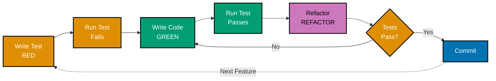
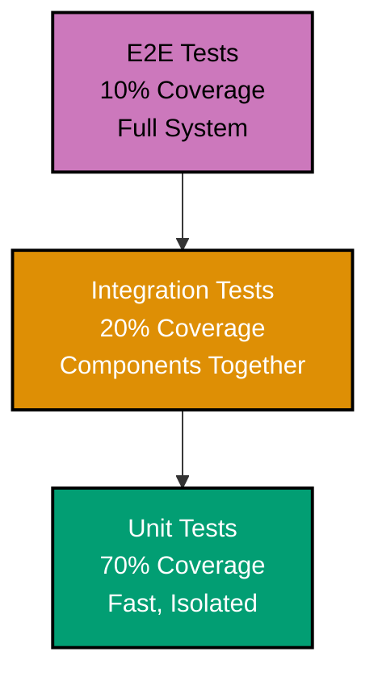
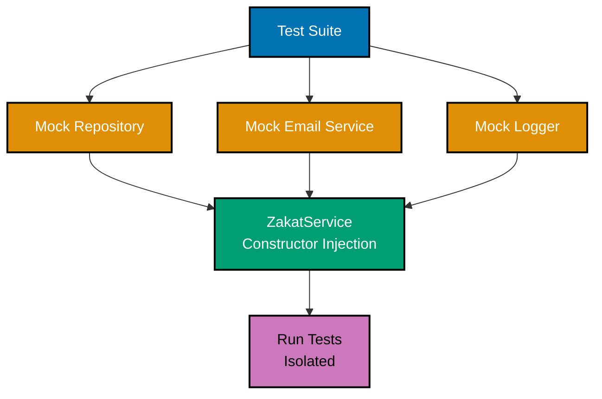
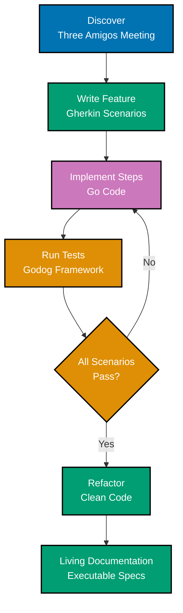
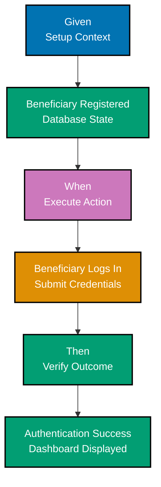
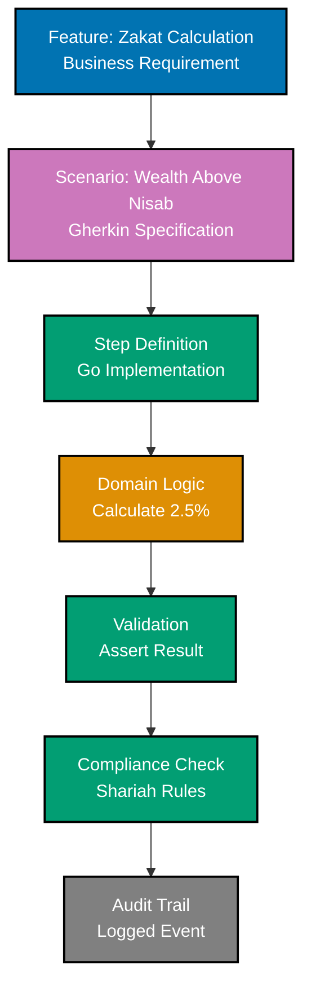
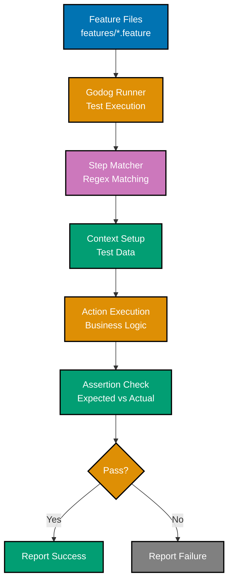

# Go Testing Standards

## 📚 Prerequisite Knowledge

**REQUIRED**: You MUST understand Go fundamentals from [AyoKoding Go Learning Path](https://ayokoding.com/en/learn/software-engineering/programming-languages/golang) before using these standards.

**This document is OSE Platform-specific**, not a Go tutorial. It assumes:

- Go syntax and language features (variables, functions, types, interfaces)
- Go project structure and module system
- Basic understanding of testing concepts
- Familiarity with command-line tools

If you need to learn Go fundamentals first, visit the AyoKoding Go learning path.

## 🎯 Purpose

This document defines **authoritative testing standards** for Go development in the OSE Platform. These are prescriptive rules that MUST be followed across all Go projects to ensure consistent, maintainable, and reliable test suites.

**Target Audience**: OSE Platform Go developers, technical reviewers, QA engineers

**Scope**: Test-Driven Development (TDD) practices, Behaviour-Driven Development (BDD) practices, table-driven tests, integration testing, test organization, and quality standards

**Quick Reference**: [Part 1: TDD Standards](#part-1-test-driven-development-tdd-standards) | [Part 2: BDD Standards](#part-2-behaviour-driven-development-bdd-standards) | [Alignment with Principles](#alignment-with-software-engineering-principles)

## ⚙️ Alignment with Software Engineering Principles

These testing standards directly support OSE Platform's [Software Engineering Principles](../../../../../governance/principles/README.md):

- **[Automation Over Manual](../../../../../governance/principles/software-engineering/automation-over-manual.md)**: Automated test suites replace manual validation
- **[Explicit Over Implicit](../../../../../governance/principles/software-engineering/explicit-over-implicit.md)**: Tests explicitly document expected behavior and edge cases

All testing practices in this document MUST align with these foundational principles.

---

## Part 1: Test-Driven Development (TDD) Standards

### 📋 Overview

Test-Driven Development (TDD) is a software development methodology where tests are written before the implementation code. Go's built-in testing package and excellent testing support make it an ideal language for practicing TDD.

**Related Documentation**:

- [Best Practices](./ex-soen-prla-go__coding-standards.md#part-2-naming--organization-best-practices)
- [Behaviour-Driven Development Standards](#part-2-behaviour-driven-development-bdd-standards)

### 🔄 TDD Fundamentals

#### TDD Principles

The three laws of TDD:

```go
// 1. Write a failing test first (Red)
// 2. Write minimal code to make it pass (Green)
// 3. Refactor while keeping tests green (Refactor)

// Example: TDD for a Calculator

// Step 1: Write failing test
func TestAdd(t *testing.T) {
  result := Add(2, 3)
  expected := 5

  if result != expected {
    t.Errorf("Add(2, 3) = %d; want %d", result, expected)
  }
}

// Step 2: Implement minimal code
func Add(a, b int) int {
  return a + b  // Simplest implementation
}

// Step 3: Refactor (if needed)
// In this case, no refactoring needed
```

#### Benefits of TDD

Why practice TDD:

```go
package main

// 1. Better design - forces you to think about API first
// 2. Living documentation - tests show how to use the code
// 3. Confidence - refactor safely with test coverage
// 4. Fast feedback - catch bugs immediately
// 5. Less debugging - bugs caught early
```

### 🔴🟢🟣 TDD Cycle (Red-Green-Refactor)



#### Red Phase

Write a failing test:

```go
package calculator

import "testing"

// Test for multiplication (doesn't exist yet)
func TestMultiply(t *testing.T) {
  result := Multiply(4, 5)
  expected := 20

  if result != expected {
    t.Errorf("Multiply(4, 5) = %d; want %d", result, expected)
  }
}

// This test fails because Multiply doesn't exist
```

#### Green Phase

Make the test pass with minimal code:

```go
package calculator

// Simplest implementation that makes the test pass
func Multiply(a, b int) int {
  return a * b
}

// Test now passes
```

#### Refactor Phase

Improve the code while keeping tests green:

```go
package calculator

// Original implementation was fine, but let's add more features
// with confidence because tests are in place

// Add validation
func Multiply(a, b int) int {
  // Tests still pass - safe to add validation
  return a * b
}

// Add more test cases
func TestMultiply(t *testing.T) {
  tests := []struct {
    a, b     int
    expected int
  }{
    {4, 5, 20},
    {0, 5, 0},
    {-2, 3, -6},
  }

  for _, tt := range tests {
    result := Multiply(tt.a, tt.b)
    if result != tt.expected {
      t.Errorf("Multiply(%d, %d) = %d; want %d",
        tt.a, tt.b, result, tt.expected)
    }
  }
}
```

### 🧪 Go Testing Package

#### Basic Test Structure

Using testing.T:

```go
package mypackage

import "testing"

// Test function must start with Test
func TestFunctionName(t *testing.T) {
  // Arrange: Set up test data
  input := 42
  expected := 84

  // Act: Execute the code being tested
  result := Double(input)

  // Assert: Verify the result
  if result != expected {
    t.Errorf("Double(%d) = %d; want %d", input, result, expected)
  }
}

func Double(n int) int {
  return n * 2
}
```

#### Test Helpers

Creating test helper functions:

```go
package mypackage

import "testing"

// Helper function to compare values
func assertEqual(t *testing.T, got, want interface{}) {
  t.Helper()  // Marks this as a helper function

  if got != want {
    t.Errorf("got %v; want %v", got, want)
  }
}

// Usage in tests
func TestSomething(t *testing.T) {
  result := Calculate(10)
  assertEqual(t, result, 100)
}

func Calculate(n int) int {
  return n * 10
}
```

#### Test Cleanup

Using t.Cleanup() for teardown:

```go
package mypackage

import (
  "os"
  "testing"
)

func TestFileOperations(t *testing.T) {
  // Setup
  file, err := os.CreateTemp("", "test")
  if err != nil {
    t.Fatal(err)
  }

  // Cleanup automatically called at end of test
  t.Cleanup(func() {
    os.Remove(file.Name())
  })

  // Test code
  // ...
}
```

### 📊 Table-Driven Tests

#### Basic Table-Driven Test

Common pattern in Go:

```go
package calculator

import "testing"

func TestAdd(t *testing.T) {
  tests := []struct {
    name     string
    a, b     int
    expected int
  }{
    {"positive numbers", 2, 3, 5},
    {"negative numbers", -1, -2, -3},
    {"mixed signs", -5, 3, -2},
    {"with zero", 0, 5, 5},
  }

  for _, tt := range tests {
    t.Run(tt.name, func(t *testing.T) {
      result := Add(tt.a, tt.b)
      if result != tt.expected {
        t.Errorf("Add(%d, %d) = %d; want %d",
          tt.a, tt.b, result, tt.expected)
      }
    })
  }
}

func Add(a, b int) int {
  return a + b
}
```

#### Complex Table Tests

Testing with multiple inputs and outputs:

```go
package validator

import "testing"

func TestValidateEmail(t *testing.T) {
  tests := []struct {
    name      string
    email     string
    wantValid bool
    wantErr   error
  }{
    {
      name:      "valid email",
      email:     "beneficiary@example.com",
      wantValid: true,
      wantErr:   nil,
    },
    {
      name:      "invalid - no @",
      email:     "invalid.email.com",
      wantValid: false,
      wantErr:   ErrInvalidFormat,
    },
    {
      name:      "invalid - no domain",
      email:     "beneficiary@",
      wantValid: false,
      wantErr:   ErrInvalidFormat,
    },
    {
      name:      "empty email",
      email:     "",
      wantValid: false,
      wantErr:   ErrEmpty,
    },
  }

  for _, tt := range tests {
    t.Run(tt.name, func(t *testing.T) {
      valid, err := ValidateEmail(tt.email)

      if valid != tt.wantValid {
        t.Errorf("ValidateEmail(%q) valid = %v; want %v",
          tt.email, valid, tt.wantValid)
      }

      if err != tt.wantErr {
        t.Errorf("ValidateEmail(%q) error = %v; want %v",
          tt.email, err, tt.wantErr)
      }
    })
  }
}
```

### 📁 Test Organization

#### File Structure

Organizing test files:

```
mypackage/
├── calculator.go
├── calculator_test.go      # Unit tests
├── calculator_bench_test.go  # Benchmarks
├── calculator_example_test.go # Examples
├── testdata/               # Test data files
│   ├── input.json
│   └── expected.json
└── internal/
    └── helper_test.go      # Internal test helpers
```

#### Test Naming Conventions

Clear test names:

```go
package mypackage

import "testing"

// Test function: Test<FunctionName>
func TestAdd(t *testing.T) {}

// Test with specific case: Test<FunctionName>_<Case>
func TestAdd_WithNegativeNumbers(t *testing.T) {}

// Test for edge case: Test<FunctionName>_<EdgeCase>
func TestDivide_ByZero(t *testing.T) {}

// Test for error condition: Test<FunctionName>_Returns<Error>
func TestParse_ReturnsErrorOnInvalidInput(t *testing.T) {}
```

### 📈 Test Coverage

#### Measuring Coverage

Using go test -cover:

```bash
# Run tests with coverage
go test -cover

# Generate coverage report
go test -coverprofile=coverage.out

# View coverage in HTML
go tool cover -html=coverage.out

# Coverage by function
go test -coverprofile=coverage.out
go tool cover -func=coverage.out

# Set minimum coverage requirement
go test -cover -coverprofile=coverage.out
# Then check if coverage meets nisab in CI
```

#### Writing for Coverage

Tests targeting specific coverage:

```go
package mypackage

import "testing"

// Function with multiple branches
func Classify(n int) string {
  if n < 0 {
    return "negative"
  } else if n == 0 {
    return "zero"
  } else {
    return "positive"
  }
}

// Test covering all branches
func TestClassify(t *testing.T) {
  tests := []struct {
    input    int
    expected string
  }{
    {-5, "negative"},  // Cover negative branch
    {0, "zero"},       // Cover zero branch
    {5, "positive"},   // Cover positive branch
  }

  for _, tt := range tests {
    result := Classify(tt.input)
    if result != tt.expected {
      t.Errorf("Classify(%d) = %s; want %s",
        tt.input, result, tt.expected)
    }
  }
}
```

### 🎭 Mocking and Stubbing

#### Manual Mocks

Creating mock implementations:



```go
package mypackage

// Interface for external dependency
type EmailSender interface {
  Send(to, subject, body string) error
}

// Real implementation
type SMTPSender struct {
  // SMTP configuration
}

func (s *SMTPSender) Send(to, subject, body string) error {
  // Real SMTP sending
  return nil
}

// Mock implementation for testing
type MockEmailSender struct {
  SendFunc func(to, subject, body string) error
  Calls    []struct {
    To, Subject, Body string
  }
}

func (m *MockEmailSender) Send(to, subject, body string) error {
  // Record call
  m.Calls = append(m.Calls, struct {
    To, Subject, Body string
  }{to, subject, body})

  // Use provided function if set
  if m.SendFunc != nil {
    return m.SendFunc(to, subject, body)
  }

  return nil
}

// Function using dependency
func SendWelcomeEmail(sender EmailSender, email string) error {
  return sender.Send(email, "Welcome", "Welcome to our service!")
}

// Test with mock
func TestSendWelcomeEmail(t *testing.T) {
  mock := &MockEmailSender{}

  err := SendWelcomeEmail(mock, "beneficiary@example.com")
  if err != nil {
    t.Fatalf("unexpected error: %v", err)
  }

  // Verify mock was called
  if len(mock.Calls) != 1 {
    t.Errorf("expected 1 call, got %d", len(mock.Calls))
  }

  call := mock.Calls[0]
  if call.To != "beneficiary@example.com" {
    t.Errorf("expected to=beneficiary@example.com, got %s", call.To)
  }

  if call.Subject != "Welcome" {
    t.Errorf("expected subject=Welcome, got %s", call.Subject)
  }
}
```

#### Using testify/mock

Mocking with testify:

```go
package mypackage

import (
  "testing"

  "github.com/stretchr/testify/mock"
)

// Mock using testify
type MockEmailSender struct {
  mock.Mock
}

func (m *MockEmailSender) Send(to, subject, body string) error {
  args := m.Called(to, subject, body)
  return args.Error(0)
}

// Test with testify mock
func TestSendWelcomeEmailWithTestify(t *testing.T) {
  mockSender := new(MockEmailSender)

  // Set expectations
  mockSender.On("Send", "beneficiary@example.com", "Welcome", mock.Anything).Return(nil)

  // Execute
  err := SendWelcomeEmail(mockSender, "beneficiary@example.com")

  // Assert
  if err != nil {
    t.Fatalf("unexpected error: %v", err)
  }

  mockSender.AssertExpectations(t)
}
```

#### Stubbing Functions

Function stubs for testing:

```go
package mypackage

import "time"

// Variable for time function (can be stubbed in tests)
var timeNow = time.Now

func GetCurrentHour() int {
  return timeNow().Hour()
}

// Test with stubbed time
func TestGetCurrentHour(t *testing.T) {
  // Stub time.Now
  originalTimeNow := timeNow
  defer func() { timeNow = originalTimeNow }()

  timeNow = func() time.Time {
    return time.Date(2024, 1, 1, 14, 0, 0, 0, time.UTC)
  }

  hour := GetCurrentHour()
  if hour != 14 {
    t.Errorf("GetCurrentHour() = %d; want 14", hour)
  }
}
```

### 🔌 Testing with Interfaces

#### Interface-Based Design

Designing for testability:

```go
package mypackage

// Define interface for testability
type UserRepository interface {
  GetByID(id string) (*Beneficiary, error)
  Save(beneficiary *Beneficiary) error
}

// Real implementation
type DBUserRepository struct {
  db *sql.DB
}

func (r *DBUserRepository) GetByID(id string) (*Beneficiary, error) {
  // Real database query
  return nil, nil
}

func (r *DBUserRepository) Save(beneficiary *Beneficiary) error {
  // Real database save
  return nil
}

// Service using interface
type UserService struct {
  repo UserRepository
}

func (s *UserService) ActivateUser(id string) error {
  beneficiary, err := s.repo.GetByID(id)
  if err != nil {
    return err
  }

  beneficiary.Active = true
  return s.repo.Save(beneficiary)
}

// Mock implementation for testing
type MockUserRepository struct {
  GetByIDFunc func(id string) (*Beneficiary, error)
  SaveFunc    func(beneficiary *Beneficiary) error
}

func (m *MockUserRepository) GetByID(id string) (*Beneficiary, error) {
  if m.GetByIDFunc != nil {
    return m.GetByIDFunc(id)
  }
  return nil, nil
}

func (m *MockUserRepository) Save(beneficiary *Beneficiary) error {
  if m.SaveFunc != nil {
    return m.SaveFunc(beneficiary)
  }
  return nil
}

// Test with mock
func TestActivateUser(t *testing.T) {
  mockRepo := &MockUserRepository{
    GetByIDFunc: func(id string) (*Beneficiary, error) {
      return &Beneficiary{ID: id, Active: false}, nil
    },
    SaveFunc: func(beneficiary *Beneficiary) error {
      if !beneficiary.Active {
        t.Error("expected beneficiary to be active")
      }
      return nil
    },
  }

  service := &UserService{repo: mockRepo}
  err := service.ActivateUser("123")
  if err != nil {
    t.Fatalf("unexpected error: %v", err)
  }
}

type Beneficiary struct {
  ID     string
  Active bool
}
```

### 💉 Dependency Injection

#### Constructor Injection

Injecting dependencies:



```go
package mypackage

// Service with dependencies
type OrderService struct {
  db     Database
  mailer EmailSender
  logger Logger
}

// Constructor with dependency injection
func NewOrderService(db Database, mailer EmailSender, logger Logger) *OrderService {
  return &OrderService{
    db:     db,
    mailer: mailer,
    logger: logger,
  }
}

// Method using dependencies
func (s *OrderService) PlaceOrder(order *Order) error {
  // Save to database
  if err := s.db.Save(order); err != nil {
    s.logger.Error("Failed to save order", err)
    return err
  }

  // Send confirmation email
  if err := s.mailer.SendOrderConfirmation(order); err != nil {
    s.logger.Error("Failed to send confirmation", err)
    // Continue even if email fails
  }

  s.logger.Info("Order placed successfully", order.ID)
  return nil
}

// Test with mocked dependencies
func TestPlaceOrder(t *testing.T) {
  mockDB := &MockDatabase{}
  mockMailer := &MockEmailSender{}
  mockLogger := &MockLogger{}

  service := NewOrderService(mockDB, mockMailer, mockLogger)

  order := &Order{ID: "123", Total: 99.99}
  err := service.PlaceOrder(order)

  if err != nil {
    t.Fatalf("unexpected error: %v", err)
  }

  // Verify interactions
  if !mockDB.SaveCalled {
    t.Error("expected Save to be called")
  }

  if !mockMailer.SendCalled {
    t.Error("expected SendOrderConfirmation to be called")
  }
}

type Database interface {
  Save(order *Order) error
}

type EmailSender interface {
  SendOrderConfirmation(order *Order) error
}

type Logger interface {
  Info(msg string, args ...interface{})
  Error(msg string, args ...interface{})
}

type Order struct {
  ID    string
  Total float64
}

type MockDatabase struct {
  SaveCalled bool
}

func (m *MockDatabase) Save(order *Order) error {
  m.SaveCalled = true
  return nil
}

type MockEmailSender struct {
  SendCalled bool
}

func (m *MockEmailSender) SendOrderConfirmation(order *Order) error {
  m.SendCalled = true
  return nil
}

type MockLogger struct{}

func (m *MockLogger) Info(msg string, args ...interface{})  {}
func (m *MockLogger) Error(msg string, args ...interface{}) {}
```

### 🌐 Testing HTTP Handlers

#### Testing Handler Functions

Using httptest package:

```go
package mypackage

import (
  "encoding/json"
  "net/http"
  "net/http/httptest"
  "strings"
  "testing"
)

// HTTP handler
func HelloHandler(w http.ResponseWriter, r *http.Request) {
  name := r.URL.Query().Get("name")
  if name == "" {
    name = "World"
  }

  response := map[string]string{
    "message": "Hello, " + name + "!",
  }

  w.Header().Set("Content-Type", "application/json")
  json.NewEncoder(w).Encode(response)
}

// Test HTTP handler
func TestHelloHandler(t *testing.T) {
  tests := []struct {
    name         string
    queryParam   string
    expectedMsg  string
    expectedCode int
  }{
    {
      name:         "with name parameter",
      queryParam:   "name=Alice",
      expectedMsg:  "Hello, Alice!",
      expectedCode: http.StatusOK,
    },
    {
      name:         "without name parameter",
      queryParam:   "",
      expectedMsg:  "Hello, World!",
      expectedCode: http.StatusOK,
    },
  }

  for _, tt := range tests {
    t.Run(tt.name, func(t *testing.T) {
      // Create request
      req := httptest.NewRequest("GET", "/hello?"+tt.queryParam, nil)

      // Create response recorder
      rr := httptest.NewRecorder()

      // Call handler
      HelloHandler(rr, req)

      // Check status code
      if rr.Code != tt.expectedCode {
        t.Errorf("status = %d; want %d", rr.Code, tt.expectedCode)
      }

      // Parse response
      var response map[string]string
      if err := json.NewDecoder(rr.Body).Decode(&response); err != nil {
        t.Fatalf("failed to decode response: %v", err)
      }

      // Check message
      if response["message"] != tt.expectedMsg {
        t.Errorf("message = %s; want %s", response["message"], tt.expectedMsg)
      }
    })
  }
}
```

#### Testing POST Requests

Testing with request body:

```go
package mypackage

import (
  "encoding/json"
  "net/http"
  "net/http/httptest"
  "strings"
  "testing"
)

type CreateUserRequest struct {
  Name  string `json:"name"`
  Email string `json:"email"`
}

type CreateUserResponse struct {
  ID    string `json:"id"`
  Name  string `json:"name"`
  Email string `json:"email"`
}

// Handler for POST
func CreateUserHandler(w http.ResponseWriter, r *http.Request) {
  var req CreateUserRequest
  if err := json.NewDecoder(r.Body).Decode(&req); err != nil {
    http.Error(w, "Invalid request", http.StatusBadRequest)
    return
  }

  // Create beneficiary (simplified)
  response := CreateUserResponse{
    ID:    "123",
    Name:  req.Name,
    Email: req.Email,
  }

  w.Header().Set("Content-Type", "application/json")
  w.WriteHeader(http.StatusCreated)
  json.NewEncoder(w).Encode(response)
}

// Test POST handler
func TestCreateUserHandler(t *testing.T) {
  payload := `{"name":"Alice","email":"alice@example.com"}`

  req := httptest.NewRequest("POST", "/users", strings.NewReader(payload))
  req.Header.Set("Content-Type", "application/json")

  rr := httptest.NewRecorder()

  CreateUserHandler(rr, req)

  if rr.Code != http.StatusCreated {
    t.Errorf("status = %d; want %d", rr.Code, http.StatusCreated)
  }

  var response CreateUserResponse
  if err := json.NewDecoder(rr.Body).Decode(&response); err != nil {
    t.Fatalf("failed to decode response: %v", err)
  }

  if response.Name != "Alice" {
    t.Errorf("name = %s; want Alice", response.Name)
  }

  if response.Email != "alice@example.com" {
    t.Errorf("email = %s; want alice@example.com", response.Email)
  }
}
```

### 🗄️ Testing Database Code

#### Using Test Database

Testing with real database:

```go
package mypackage

import (
  "database/sql"
  "testing"

  _ "github.com/mattn/go-sqlite3"
)

func setupTestDB(t *testing.T) *sql.DB {
  db, err := sql.Open("sqlite3", ":memory:")
  if err != nil {
    t.Fatalf("failed to open database: %v", err)
  }

  // Create schema
  _, err = db.Exec(`
    CREATE TABLE users (
      id INTEGER PRIMARY KEY,
      name TEXT NOT NULL,
      email TEXT UNIQUE NOT NULL
    )
  `)
  if err != nil {
    t.Fatalf("failed to create schema: %v", err)
  }

  // Cleanup
  t.Cleanup(func() {
    db.Close()
  })

  return db
}

func TestCreateUser(t *testing.T) {
  db := setupTestDB(t)

  // Test creating beneficiary
  result, err := db.Exec(
    "INSERT INTO users (name, email) VALUES (?, ?)",
    "Alice",
    "alice@example.com",
  )
  if err != nil {
    t.Fatalf("failed to insert beneficiary: %v", err)
  }

  id, err := result.LastInsertId()
  if err != nil {
    t.Fatalf("failed to get insert ID: %v", err)
  }

  if id != 1 {
    t.Errorf("id = %d; want 1", id)
  }

  // Verify beneficiary was created
  var name, email string
  err = db.QueryRow("SELECT name, email FROM users WHERE id = ?", id).
    Scan(&name, &email)
  if err != nil {
    t.Fatalf("failed to query beneficiary: %v", err)
  }

  if name != "Alice" {
    t.Errorf("name = %s; want Alice", name)
  }

  if email != "alice@example.com" {
    t.Errorf("email = %s; want alice@example.com", email)
  }
}
```

#### Using Database Transactions for Test Isolation

Rollback after each test:

```go
package mypackage

import (
  "database/sql"
  "testing"
)

func setupTestDBWithTransaction(t *testing.T) (*sql.DB, *sql.Tx) {
  db := setupTestDB(t)

  // Begin donation_transaction
  tx, err := db.Begin()
  if err != nil {
    t.Fatalf("failed to begin donation_transaction: %v", err)
  }

  // Rollback on cleanup
  t.Cleanup(func() {
    tx.Rollback()
    db.Close()
  })

  return db, tx
}

func TestUserOperations(t *testing.T) {
  db, tx := setupTestDBWithTransaction(t)

  // All operations in donation_transaction
  _, err := tx.Exec(
    "INSERT INTO users (name, email) VALUES (?, ?)",
    "Bob",
    "bob@example.com",
  )
  if err != nil {
    t.Fatalf("failed to insert beneficiary: %v", err)
  }

  // Query in same donation_transaction
  var count int
  err = tx.QueryRow("SELECT COUNT(*) FROM users").Scan(&count)
  if err != nil {
    t.Fatalf("failed to count users: %v", err)
  }

  if count != 1 {
    t.Errorf("count = %d; want 1", count)
  }

  // DonationTransaction rolls back automatically on cleanup
}
```

### 📦 Test Fixtures

#### Using testdata Directory

Loading test data from files:

```go
package mypackage

import (
  "os"
  "path/filepath"
  "testing"
)

func loadTestData(t *testing.T, filename string) []byte {
  t.Helper()

  path := filepath.Join("testdata", filename)
  data, err := os.ReadFile(path)
  if err != nil {
    t.Fatalf("failed to read test data %s: %v", filename, err)
  }

  return data
}

func TestParseJSON(t *testing.T) {
  data := loadTestData(t, "input.json")

  result, err := ParseJSON(data)
  if err != nil {
    t.Fatalf("failed to parse JSON: %v", err)
  }

  // Assert on result
  if result == nil {
    t.Error("expected non-nil result")
  }
}

func ParseJSON(data []byte) (interface{}, error) {
  // Implementation
  return nil, nil
}
```

#### Golden Files

Testing with expected output files:

```go
package mypackage

import (
  "flag"
  "os"
  "path/filepath"
  "testing"
)

var update = flag.Bool("update", false, "update golden files")

func TestFormat(t *testing.T) {
  input := "func main() {fmt.Println(\"hello\")}"
  result := Format(input)

  goldenFile := filepath.Join("testdata", "formatted.golden")

  if *update {
    // Update golden file
    if err := os.WriteFile(goldenFile, []byte(result), 0644); err != nil {
      t.Fatalf("failed to update golden file: %v", err)
    }
  }

  // Compare with golden file
  expected, err := os.ReadFile(goldenFile)
  if err != nil {
    t.Fatalf("failed to read golden file: %v", err)
  }

  if result != string(expected) {
    t.Errorf("result doesn't match golden file\ngot:\n%s\nwant:\n%s",
      result, expected)
  }
}

// Update golden files with: go test -update
```

### ⚡ Parallel Tests

#### Running Tests in Parallel

Using t.Parallel():

```go
package mypackage

import (
  "testing"
  "time"
)

func TestSlowOperation1(t *testing.T) {
  t.Parallel()  // Run in parallel with other parallel tests

  time.Sleep(1 * time.Second)
  // Test implementation
}

func TestSlowOperation2(t *testing.T) {
  t.Parallel()

  time.Sleep(1 * time.Second)
  // Test implementation
}

func TestSlowOperation3(t *testing.T) {
  t.Parallel()

  time.Sleep(1 * time.Second)
  // Test implementation
}

// These tests run in parallel, total time ~1 second instead of ~3 seconds
```

#### Parallel Subtests

Running subtests in parallel:

```go
package mypackage

import (
  "testing"
)

func TestOperations(t *testing.T) {
  tests := []struct {
    name string
    fn   func(*testing.T)
  }{
    {"operation1", testOperation1},
    {"operation2", testOperation2},
    {"operation3", testOperation3},
  }

  for _, tt := range tests {
    tt := tt  // Capture range variable
    t.Run(tt.name, func(t *testing.T) {
      t.Parallel()  // Run subtests in parallel
      tt.fn(t)
    })
  }
}

func testOperation1(t *testing.T) {
  // Test implementation
}

func testOperation2(t *testing.T) {
  // Test implementation
}

func testOperation3(t *testing.T) {
  // Test implementation
}
```

### 🌳 Subtests

#### Organizing with Subtests

Hierarchical test organization:

```go
package mypackage

import "testing"

func TestMathOperations(t *testing.T) {
  t.Run("Addition", func(t *testing.T) {
    t.Run("PositiveNumbers", func(t *testing.T) {
      result := Add(2, 3)
      if result != 5 {
        t.Errorf("Add(2, 3) = %d; want 5", result)
      }
    })

    t.Run("NegativeNumbers", func(t *testing.T) {
      result := Add(-2, -3)
      if result != -5 {
        t.Errorf("Add(-2, -3) = %d; want -5", result)
      }
    })
  })

  t.Run("Subtraction", func(t *testing.T) {
    t.Run("PositiveNumbers", func(t *testing.T) {
      result := Subtract(5, 3)
      if result != 2 {
        t.Errorf("Subtract(5, 3) = %d; want 2", result)
      }
    })
  })
}

// Run specific subtest:
// go test -run TestMathOperations/Addition/PositiveNumbers
```

### ✅ Testing Best Practices

#### Arrange-Act-Assert Pattern

Clear test structure:

```go
package mypackage

import "testing"

func TestCalculateDiscount(t *testing.T) {
  // Arrange: Set up test data and dependencies
  price := 100.0
  discountPercent := 20.0
  expected := 80.0

  // Act: Execute the code being tested
  result := CalculateDiscount(price, discountPercent)

  // Assert: Verify the result
  if result != expected {
    t.Errorf("CalculateDiscount(%.2f, %.2f) = %.2f; want %.2f",
      price, discountPercent, result, expected)
  }
}

func CalculateDiscount(price, percent float64) float64 {
  return price * (1 - percent/100)
}
```

#### Test Independence

Each test should be independent:

```go
package mypackage

import "testing"

// BAD: Tests depend on order
var globalCounter int

func TestIncrement1(t *testing.T) {
  globalCounter++
  if globalCounter != 1 {
    t.Error("expected 1")
  }
}

func TestIncrement2(t *testing.T) {
  globalCounter++
  if globalCounter != 2 {  // Depends on TestIncrement1 running first!
    t.Error("expected 2")
  }
}

// GOOD: Tests are independent
func TestIncrementIndependent1(t *testing.T) {
  counter := 0
  counter++
  if counter != 1 {
    t.Error("expected 1")
  }
}

func TestIncrementIndependent2(t *testing.T) {
  counter := 0
  counter++
  if counter != 1 {  // Independent of other tests
    t.Error("expected 1")
  }
}
```

#### Descriptive Test Names

Clear test names explain what is tested:

```go
package mypackage

import "testing"

// BAD: Unclear what is being tested
func TestFunc1(t *testing.T) {}
func TestFunc2(t *testing.T) {}

// GOOD: Clear test purpose
func TestCalculateTotal_WithValidItems_ReturnsCorrectSum(t *testing.T) {}
func TestCalculateTotal_WithEmptyCart_ReturnsZero(t *testing.T) {}
func TestCalculateTotal_WithNegativePrices_ReturnsError(t *testing.T) {}
```

#### Test One Thing

Each test should test one behavior:

```go
package mypackage

import "testing"

// BAD: Testing multiple things
func TestUserOperations(t *testing.T) {
  beneficiary := CreateUser("Alice")
  if beneficiary.Name != "Alice" {
    t.Error("wrong name")
  }

  ActivateUser(beneficiary)
  if !beneficiary.Active {
    t.Error("not active")
  }

  DeleteUser(beneficiary)
  if UserExists(beneficiary.ID) {
    t.Error("still exists")
  }
}

// GOOD: Separate tests for each operation
func TestCreateUser_SetsCorrectName(t *testing.T) {
  beneficiary := CreateUser("Alice")
  if beneficiary.Name != "Alice" {
    t.Error("wrong name")
  }
}

func TestActivateUser_SetsActiveFlag(t *testing.T) {
  beneficiary := &Beneficiary{Name: "Alice", Active: false}
  ActivateUser(beneficiary)
  if !beneficiary.Active {
    t.Error("not active")
  }
}

func TestDeleteUser_RemovesUser(t *testing.T) {
  beneficiary := &Beneficiary{ID: "123"}
  DeleteUser(beneficiary)
  if UserExists(beneficiary.ID) {
    t.Error("still exists")
  }
}
```

### ❌ Common Testing Pitfalls

#### Pitfall: Testing Implementation Details

Test behavior, not implementation:

```go
package mypackage

// BAD: Testing internal state
type Counter struct {
  count int  // private field
}

func TestCounter_InternalState(t *testing.T) {
  c := &Counter{}
  c.Increment()

  // Accessing private field (using reflection or export)
  // This is testing implementation, not behavior
}

// GOOD: Testing public behavior
func TestCounter_Increment_IncreasesValue(t *testing.T) {
  c := &Counter{}
  c.Increment()

  if c.Value() != 1 {  // Test public API
    t.Error("expected value 1")
  }
}

func (c *Counter) Increment() {
  c.count++
}

func (c *Counter) Value() int {
  return c.count
}
```

#### Pitfall: Brittle Tests

Avoid tests that break with minor changes:

```go
// BAD: Exact string matching
func TestFormatUser(t *testing.T) {
  result := FormatUser("Alice", 30)
  expected := "Beneficiary: Alice, Age: 30"  // Breaks if format changes slightly

  if result != expected {
    t.Error("format mismatch")
  }
}

// GOOD: Test essential properties
func TestFormatUser_ContainsNameAndAge(t *testing.T) {
  result := FormatUser("Alice", 30)

  if !strings.Contains(result, "Alice") {
    t.Error("missing name")
  }

  if !strings.Contains(result, "30") {
    t.Error("missing age")
  }
}
```

#### Pitfall: Slow Tests

Keep tests fast:

```go
// BAD: Slow test
func TestSlowOperation(t *testing.T) {
  time.Sleep(5 * time.Second)  // Never sleep in tests!
  // ...
}

// GOOD: Fast test with mock
func TestFastOperation(t *testing.T) {
  mockClock := &MockClock{
    Now: time.Date(2024, 1, 1, 12, 0, 0, 0, time.UTC),
  }

  // Test with mocked time, no waiting
}
```

#### Pitfall: Ignoring Test Failures

All tests must pass:

```go
// BAD: Commenting out failing tests
// func TestSomething(t *testing.T) {
//     // This test is failing, so I commented it out
// }

// GOOD: Fix the test or the code
func TestSomething(t *testing.T) {
  // Fixed implementation makes test pass
}

// If temporarily skipping, use t.Skip() with reason
func TestUnstableFeature(t *testing.T) {
  if testing.Short() {
    t.Skip("skipping in short mode")
  }
  // ...
}
```

### 📋 TDD Checklist

#### Red Phase (Write Failing Test)

- [ ] Test written before implementation
- [ ] Test fails for the right reason (expected error message)
- [ ] Test is focused and tests one behavior
- [ ] Test has clear, descriptive name (Test<Function>\_<Case>)
- [ ] Assertions use meaningful error messages (t.Errorf with context)

#### Green Phase (Make Test Pass)

- [ ] Simplest implementation that makes test pass
- [ ] No premature optimization
- [ ] All tests still passing (go test ./...)
- [ ] Code follows Go idioms (gofmt, golint)
- [ ] Exported functions have godoc comments

#### Refactor Phase

- [ ] Code is clean and maintainable
- [ ] No duplication (DRY principle)
- [ ] All tests still passing after refactoring
- [ ] Test coverage maintained or improved (go test -cover)
- [ ] Error handling follows Go conventions (error returns)

#### Test Quality

- [ ] Tests are independent (no shared state between tests)
- [ ] Tests are repeatable (deterministic, no randomness)
- [ ] Tests are fast (< 100ms for unit tests)
- [ ] Test setup/teardown properly managed (t.Cleanup)
- [ ] Mock/stub dependencies using interfaces

#### Go Testing Best Practices

- [ ] Table-driven tests for multiple input scenarios
- [ ] t.Helper() used for test helper functions
- [ ] Subtests (t.Run) for logical grouping
- [ ] t.Parallel() for independent tests
- [ ] httptest package for HTTP handler testing

#### Financial Domain Testing

- [ ] Zakat calculations tested with edge cases (nisab threshold, exact boundary)
- [ ] Decimal precision tested (no floating point errors, use decimal package)
- [ ] Murabaha contract validation tested (profit margins, down payments)
- [ ] Audit trail creation verified in tests
- [ ] Currency handling tested (beneficiary/donor ID validation patterns)

---

## Part 2: Behaviour-Driven Development (BDD) Standards

### 📋 Overview

Behaviour-Driven Development (BDD) is an agile software development methodology that focuses on collaboration between developers, QA, and non-technical stakeholders. Go supports BDD through tools like Godog, which implements Cucumber-style Gherkin specifications.

**Related Documentation**:

- [Test-Driven Development Standards](#part-1-test-driven-development-tdd-standards)
- [Best Practices](./ex-soen-prla-go__coding-standards.md#part-2-naming--organization-best-practices)

### 🔄 BDD Fundamentals

#### BDD Workflow



#### Given-When-Then Pattern



#### Financial Domain BDD Flow



#### Godog Test Execution



#### BDD Principles

Collaborative specification:

```gherkin
# BDD focuses on behavior from beneficiary perspective
Feature: Beneficiary Authentication
  As a beneficiary
  I want to log in to my donation_account
  So that I can access my personal information

  Scenario: Successful login
    Given I am on the login page
    When I enter valid credentials
    Then I should see my dashboard
```

#### BDD vs TDD

Key differences:

```go
// TDD: Developer-focused, technical
func TestUserLogin(t *testing.T) {
  beneficiary := &Beneficiary{Email: "test@example.com", Password: "hash123"}
  result := AuthenticateUser(beneficiary)
  assert.True(t, result)
}

// BDD: Business-focused, readable by non-technical stakeholders
// Feature: Beneficiary Authentication
//   Scenario: Beneficiary logs in with valid credentials
//     Given a registered beneficiary exists
//     When the beneficiary enters correct email and password
//     Then the beneficiary should be authenticated
```

### 📝 Gherkin Syntax

#### Feature Structure

Basic Gherkin elements:

```gherkin
Feature: Shopping Cart
  As a donor
  I want to add items to my shopping cart
  So that I can purchase multiple items at once

  Scenario: Add item to empty cart
    Given my cart is empty
    When I add a product to my cart
    Then my cart should contain 1 item
    And the total should be the product price

  Scenario: Add item to non-empty cart
    Given my cart contains 1 item
    When I add another product to my cart
    Then my cart should contain 2 items
    And the total should be the sum of both prices
```

#### Given-When-Then

BDD step keywords:

```gherkin
Feature: Calculator

  Scenario: Addition
    Given I have a calculator
    When I add 2 and 3
    Then the result should be 5

  # Given: Set up initial state
  # When: Perform action
  # Then: Verify outcome
  # And/But: Additional steps
```

### 🐕 Godog Framework

#### Installation

Setting up Godog:

```bash
# Install Godog
go get github.com/cucumber/godog/cmd/godog

# Initialize Godog in your project
godog init

# Run Godog tests
godog
```

#### Project Structure

Organizing BDD tests:

```
myproject/
├── features/
│   ├── calculator.feature
│   ├── user_auth.feature
│   └── shopping_cart.feature
├── features/steps/
│   ├── calculator_steps.go
│   ├── user_auth_steps.go
│   └── shopping_cart_steps.go
├── go.mod
└── main.go
```

#### Basic Godog Test

Simple calculator example:

```go
// features/steps/calculator_steps.go
package steps

import (
  "context"
  "fmt"

  "github.com/cucumber/godog"
)

type calculatorContext struct {
  calculator *Calculator
  result     int
}

type Calculator struct {
  value int
}

func (c *Calculator) Add(a, b int) int {
  return a + b
}

func InitializeScenario(ctx *godog.ScenarioContext) {
  cc := &calculatorContext{}

  ctx.Step(`^I have a calculator$`, cc.iHaveACalculator)
  ctx.Step(`^I add (\d+) and (\d+)$`, cc.iAddNumbers)
  ctx.Step(`^the result should be (\d+)$`, cc.theResultShouldBe)
}

func (cc *calculatorContext) iHaveACalculator() error {
  cc.calculator = &Calculator{}
  return nil
}

func (cc *calculatorContext) iAddNumbers(a, b int) error {
  cc.result = cc.calculator.Add(a, b)
  return nil
}

func (cc *calculatorContext) theResultShouldBe(expected int) error {
  if cc.result != expected {
    return fmt.Errorf("expected %d, got %d", expected, cc.result)
  }
  return nil
}
```

```gherkin
# features/calculator.feature
Feature: Calculator
  As a beneficiary
  I want to perform basic arithmetic
  So that I can calculate numbers

  Scenario: Addition
    Given I have a calculator
    When I add 2 and 3
    Then the result should be 5
```

### 🔧 Step Definitions

#### Simple Steps

Basic step implementations:

```go
package steps

import (
  "context"
  "errors"
  "fmt"

  "github.com/cucumber/godog"
)

type userContext struct {
  beneficiary         *Beneficiary
  loginResult  bool
  errorMessage string
}

type Beneficiary struct {
  Email    string
  Password string
  LoggedIn bool
}

func InitializeUserScenario(ctx *godog.ScenarioContext) {
  uc := &userContext{}

  ctx.Step(`^I am on the login page$`, uc.iAmOnLoginPage)
  ctx.Step(`^I enter email "([^"]*)" and password "([^"]*)"$`, uc.iEnterCredentials)
  ctx.Step(`^I click the login button$`, uc.iClickLoginButton)
  ctx.Step(`^I should be logged in$`, uc.iShouldBeLoggedIn)
  ctx.Step(`^I should see error "([^"]*)"$`, uc.iShouldSeeError)
}

func (uc *userContext) iAmOnLoginPage() error {
  // Setup: Navigate to login page
  uc.beneficiary = &Beneficiary{}
  return nil
}

func (uc *userContext) iEnterCredentials(email, password string) error {
  uc.beneficiary.Email = email
  uc.beneficiary.Password = password
  return nil
}

func (uc *userContext) iClickLoginButton() error {
  // Simulate login
  if uc.beneficiary.Email == "valid@example.com" && uc.beneficiary.Password == "password123" {
    uc.beneficiary.LoggedIn = true
    uc.loginResult = true
  } else {
    uc.errorMessage = "Invalid credentials"
    uc.loginResult = false
  }
  return nil
}

func (uc *userContext) iShouldBeLoggedIn() error {
  if !uc.loginResult {
    return errors.New("beneficiary is not logged in")
  }
  return nil
}

func (uc *userContext) iShouldSeeError(expected string) error {
  if uc.errorMessage != expected {
    return fmt.Errorf("expected error '%s', got '%s'", expected, uc.errorMessage)
  }
  return nil
}
```

#### Parameterized Steps

Steps with parameters:

```go
package steps

import (
  "fmt"

  "github.com/cucumber/godog"
)

type cartContext struct {
  cart *ShoppingCart
}

type ShoppingCart struct {
  items []Item
  total float64
}

type Item struct {
  Name  string
  Price float64
}

func (c *ShoppingCart) AddItem(item Item) {
  c.items = append(c.items, item)
  c.total += item.Price
}

func (c *ShoppingCart) ItemCount() int {
  return len(c.items)
}

func InitializeCartScenario(ctx *godog.ScenarioContext) {
  cc := &cartContext{cart: &ShoppingCart{}}

  ctx.Step(`^my cart is empty$`, cc.myCartIsEmpty)
  ctx.Step(`^I add a product priced at \$(\d+\.?\d*)$`, cc.iAddProductWithPrice)
  ctx.Step(`^my cart should contain (\d+) items?$`, cc.myCartShouldContainItems)
  ctx.Step(`^the total should be \$(\d+\.?\d*)$`, cc.theTotalShouldBe)
}

func (cc *cartContext) myCartIsEmpty() error {
  cc.cart = &ShoppingCart{}
  return nil
}

func (cc *cartContext) iAddProductWithPrice(price float64) error {
  item := Item{
    Name:  fmt.Sprintf("Product %.2f", price),
    Price: price,
  }
  cc.cart.AddItem(item)
  return nil
}

func (cc *cartContext) myCartShouldContainItems(expected int) error {
  actual := cc.cart.ItemCount()
  if actual != expected {
    return fmt.Errorf("expected %d items, got %d", expected, actual)
  }
  return nil
}

func (cc *cartContext) theTotalShouldBe(expected float64) error {
  if cc.cart.total != expected {
    return fmt.Errorf("expected total $%.2f, got $%.2f", expected, cc.cart.total)
  }
  return nil
}
```

### 📄 Feature Files

#### Complete Feature Example

Real-world feature file:

```gherkin
# features/user_management.feature
Feature: Beneficiary Management
  As a system administrator
  I want to manage beneficiary accounts
  So that I can control access to the system

  Background:
    Given the system is running
    And I am logged in as an administrator

  Scenario: Create new beneficiary
    When I create a beneficiary with email "newuser@example.com"
    And I set the password to "SecurePass123"
    Then the beneficiary should be created successfully
    And the beneficiary should receive a welcome email

  Scenario: Delete existing beneficiary
    Given a beneficiary with email "olduser@example.com" exists
    When I delete the beneficiary
    Then the beneficiary should be removed from the system
    And the beneficiary should receive a farewell email

  Scenario: Update beneficiary information
    Given a beneficiary with email "beneficiary@example.com" exists
    When I update the beneficiary's name to "John Doe"
    Then the beneficiary's profile should reflect the changes
```

#### Multiple Scenarios

Testing different cases:

```gherkin
# features/authentication.feature
Feature: Authentication
  As a beneficiary
  I want secure authentication
  So that my donation_account is protected

  Scenario: Successful login with valid credentials
    Given I am on the login page
    When I enter email "valid@example.com" and password "password123"
    And I click the login button
    Then I should be logged in
    And I should see my dashboard

  Scenario: Failed login with invalid password
    Given I am on the login page
    When I enter email "valid@example.com" and password "wrongpassword"
    And I click the login button
    Then I should see error "Invalid credentials"
    And I should remain on the login page

  Scenario: Failed login with non-existent beneficiary
    Given I am on the login page
    When I enter email "nonexistent@example.com" and password "anypassword"
    And I click the login button
    Then I should see error "Beneficiary not found"

  Scenario: Account lockout after failed attempts
    Given I am on the login page
    When I enter wrong credentials 3 times
    Then my donation_account should be locked
    And I should see error "Account locked due to multiple failed attempts"
```

### 🔢 Scenario Outlines

#### Using Examples

Testing multiple inputs:

```gherkin
# features/calculator.feature
Feature: Calculator Operations

  Scenario Outline: Addition with different numbers
    Given I have a calculator
    When I add <a> and <b>
    Then the result should be <result>

    Examples:
      | a  | b  | result |
      | 2  | 3  | 5      |
      | 10 | 5  | 15     |
      | 0  | 0  | 0      |
      | -1 | -2 | -3     |

  Scenario Outline: Division with edge cases
    Given I have a calculator
    When I divide <dividend> by <divisor>
    Then the result should be <result>

    Examples:
      | dividend | divisor | result |
      | 10       | 2       | 5      |
      | 9        | 3       | 3      |
      | 15       | 5       | 3      |
```

#### Implementation for Outlines

Step definitions handle examples:

```go
package steps

import (
  "fmt"

  "github.com/cucumber/godog"
)

func InitializeCalculatorOutlineScenario(ctx *godog.ScenarioContext) {
  cc := &calculatorContext{calculator: &Calculator{}}

  ctx.Step(`^I divide (\d+) by (\d+)$`, cc.iDivide)
  ctx.Step(`^the result should be (\d+)$`, cc.theResultShouldBe)
}

func (cc *calculatorContext) iDivide(dividend, divisor int) error {
  if divisor == 0 {
    return fmt.Errorf("division by zero")
  }
  cc.result = dividend / divisor
  return nil
}
```

### 🎬 Background

#### Shared Setup

Common steps for all scenarios:

```gherkin
# features/api_testing.feature
Feature: API Testing
  Test various API endpoints

  Background:
    Given the API server is running
    And I have a valid API key
    And I set the content type to "application/json"

  Scenario: Get beneficiary by ID
    When I send a GET request to "/users/123"
    Then the response status should be 200
    And the response should contain beneficiary data

  Scenario: Create new beneficiary
    When I send a POST request to "/users" with:
      """
      {
        "name": "John Doe",
        "email": "john@example.com"
      }
      """
    Then the response status should be 201
    And the response should contain the created beneficiary ID

  Scenario: Update beneficiary
    When I send a PUT request to "/users/123" with:
      """
      {
        "name": "Jane Doe"
      }
      """
    Then the response status should be 200
    And the beneficiary's name should be updated
```

#### Background Implementation

Shared context setup:

```go
package steps

import (
  "net/http"
  "net/http/httptest"

  "github.com/cucumber/godog"
)

type apiContext struct {
  server     *httptest.Server
  apiKey     string
  response   *http.Response
  statusCode int
}

func InitializeAPIScenario(ctx *godog.ScenarioContext) {
  ac := &apiContext{}

  // Background steps
  ctx.Before(func(ctx context.Context, sc *godog.Scenario) (context.Context, error) {
    // Setup runs before each scenario
    ac.server = httptest.NewServer(http.HandlerFunc(apiHandler))
    return ctx, nil
  })

  ctx.After(func(ctx context.Context, sc *godog.Scenario, err error) (context.Context, error) {
    // Cleanup runs after each scenario
    if ac.server != nil {
      ac.server.Close()
    }
    return ctx, nil
  })

  ctx.Step(`^the API server is running$`, ac.theAPIServerIsRunning)
  ctx.Step(`^I have a valid API key$`, ac.iHaveValidAPIKey)
  ctx.Step(`^I set the content type to "([^"]*)"$`, ac.iSetContentType)
}

func (ac *apiContext) theAPIServerIsRunning() error {
  // Server already started in Before hook
  return nil
}

func (ac *apiContext) iHaveValidAPIKey() error {
  ac.apiKey = "test-api-key-123"
  return nil
}

func (ac *apiContext) iSetContentType(contentType string) error {
  // Store for use in requests
  return nil
}

func apiHandler(w http.ResponseWriter, r *http.Request) {
  // Mock API handler
  w.WriteHeader(http.StatusOK)
}
```

### 🏷️ Tags

#### Organizing Scenarios

Using tags for filtering:

```gherkin
# features/shopping.feature
Feature: Shopping

  @smoke @critical
  Scenario: Add item to cart
    Given my cart is empty
    When I add a product to my cart
    Then my cart should contain 1 item

  @regression
  Scenario: Remove item from cart
    Given my cart contains 1 item
    When I remove the item
    Then my cart should be empty

  @integration @slow
  Scenario: Complete checkout process
    Given my cart contains items
    When I proceed to checkout
    And I enter donation information
    Then the order should be created

  @wip
  Scenario: Apply discount code
    Given my cart contains items
    When I apply a discount code
    Then the total should be reduced
```

#### Running Tagged Scenarios

Filtering with tags:

```bash
# Run only smoke tests
godog --tags=@smoke

# Run smoke OR critical
godog --tags="@smoke,@critical"

# Run smoke AND critical
godog --tags="@smoke && @critical"

# Exclude slow tests
godog --tags="~@slow"

# Run integration but not WIP
godog --tags="@integration && ~@wip"
```

### 🪝 Hooks

#### Before and After Hooks

Setup and teardown:

```go
package steps

import (
  "context"
  "database/sql"

  "github.com/cucumber/godog"
)

type testContext struct {
  db *sql.DB
}

func InitializeTestSuite(ctx *godog.TestSuiteContext) {
  tc := &testContext{}

  // Before all scenarios
  ctx.BeforeSuite(func() {
    var err error
    tc.db, err = sql.Open("postgres", "connection_string")
    if err != nil {
      panic(err)
    }
  })

  // After all scenarios
  ctx.AfterSuite(func() {
    if tc.db != nil {
      tc.db.Close()
    }
  })
}

func InitializeScenarioHooks(ctx *godog.ScenarioContext) {
  tc := &testContext{}

  // Before each scenario
  ctx.Before(func(ctx context.Context, sc *godog.Scenario) (context.Context, error) {
    // Setup database donation_transaction
    tx, err := tc.db.Begin()
    if err != nil {
      return ctx, err
    }

    // Store donation_transaction in context
    return context.WithValue(ctx, "tx", tx), nil
  })

  // After each scenario
  ctx.After(func(ctx context.Context, sc *godog.Scenario, err error) (context.Context, error) {
    // Rollback donation_transaction
    if tx, ok := ctx.Value("tx").(*sql.Tx); ok {
      tx.Rollback()
    }
    return ctx, nil
  })

  // After each step
  ctx.StepContext().Before(func(ctx context.Context, st *godog.Step) (context.Context, error) {
    // Log step execution
    return ctx, nil
  })

  ctx.StepContext().After(func(ctx context.Context, st *godog.Step, status godog.StepResultStatus, err error) (context.Context, error) {
    // Log step result
    return ctx, nil
  })
}
```

### 📊 Data Tables

#### Using Tables in Steps

Passing structured data:

```gherkin
# features/user_creation.feature
Feature: Bulk Beneficiary Creation

  Scenario: Create multiple users
    Given I am logged in as administrator
    When I create users with the following details:
      | name       | email              | role    |
      | Alice      | alice@example.com  | admin   |
      | Bob        | bob@example.com    | editor  |
      | Charlie    | charlie@example.com| viewer  |
    Then all 3 users should be created successfully
    And each beneficiary should receive a welcome email
```

#### Implementing Data Tables

Parsing table data:

```go
package steps

import (
  "fmt"

  "github.com/cucumber/godog"
)

type userManagementContext struct {
  users         []Beneficiary
  createdCount  int
  emailsSent    int
}

func InitializeUserManagementScenario(ctx *godog.ScenarioContext) {
  umc := &userManagementContext{}

  ctx.Step(`^I create users with the following details:$`, umc.iCreateUsers)
  ctx.Step(`^all (\d+) users should be created successfully$`, umc.allUsersShouldBeCreated)
  ctx.Step(`^each beneficiary should receive a welcome email$`, umc.eachUserReceivesEmail)
}

func (umc *userManagementContext) iCreateUsers(table *godog.Table) error {
  // Parse table rows
  for i, row := range table.Rows {
    if i == 0 {
      // Skip header row
      continue
    }

    // Extract cell values
    name := row.Cells[0].Value
    email := row.Cells[1].Value
    role := row.Cells[2].Value

    // Create beneficiary
    beneficiary := Beneficiary{
      Name:  name,
      Email: email,
      Role:  role,
    }

    umc.users = append(umc.users, beneficiary)
    umc.createdCount++
    umc.emailsSent++
  }

  return nil
}

func (umc *userManagementContext) allUsersShouldBeCreated(expected int) error {
  if umc.createdCount != expected {
    return fmt.Errorf("expected %d users created, got %d", expected, umc.createdCount)
  }
  return nil
}

func (umc *userManagementContext) eachUserReceivesEmail() error {
  if umc.emailsSent != len(umc.users) {
    return fmt.Errorf("not all users received emails")
  }
  return nil
}
```

### ✅ BDD Best Practices

#### Write Declarative Scenarios

Focus on what, not how:

```gherkin
# BAD: Imperative (how)
Scenario: Beneficiary registration
  Given I navigate to "https://example.com/register"
  When I type "john@example.com" into the email field
  And I type "password123" into the password field
  And I click the "Register" button
  Then I should see "Registration successful" on the page

# GOOD: Declarative (what)
Scenario: Beneficiary registration
  Given I am on the registration page
  When I register with valid credentials
  Then I should be registered successfully
  And I should receive a confirmation email
```

#### Use Business Language

Write for stakeholders:

```gherkin
# BAD: Technical language
Scenario: API authentication
  Given I send POST to /auth with JWT token
  When the token validation succeeds
  Then return 200 with beneficiary object

# GOOD: Business language
Scenario: Beneficiary authentication
  Given I am a registered beneficiary
  When I log in with valid credentials
  Then I should be authenticated
  And I should have access to my donation_account
```

#### Keep Scenarios Independent

Each scenario should be self-contained:

```gherkin
# BAD: Dependent scenarios
Scenario: Create order
  When I create an order
  Then order ID should be 123

Scenario: Update order
  Given order ID 123 exists  # Depends on previous scenario
  When I update the order
  Then the order should be modified

# GOOD: Independent scenarios
Scenario: Create order
  When I create an order
  Then the order should be created successfully

Scenario: Update order
  Given an order exists
  When I update the order details
  Then the changes should be saved
```

#### Use Background Wisely

Only for truly common steps:

```gherkin
# GOOD: Common authentication for all scenarios
Feature: Beneficiary Dashboard

  Background:
    Given I am logged in

  Scenario: View profile
    When I navigate to my profile
    Then I should see my information

  Scenario: Edit profile
    When I update my profile information
    Then the changes should be saved
```

### ❌ Common BDD Pitfalls

#### Pitfall: Testing Implementation

Focus on behavior, not implementation:

```gherkin
# BAD: Testing implementation details
Scenario: Beneficiary login
  When I call AuthService.Login() with username and password
  And the method returns a JWT token
  Then the token should be stored in Redis cache

# GOOD: Testing behavior
Scenario: Beneficiary login
  When I log in with valid credentials
  Then I should be authenticated
  And I should remain logged in for 24 hours
```

#### Pitfall: Overusing Scenario Outlines

Use outlines only when truly needed:

```gherkin
# BAD: Overusing outline for similar scenarios
Scenario Outline: Login validation
  When I log in with <email> and <password>
  Then I should see <message>

  Examples:
    | email               | password  | message              |
    | valid@example.com   | pass123   | Dashboard            |
    | invalid@example.com | pass123   | Beneficiary not found       |
    | valid@example.com   | wrong     | Invalid password     |

# GOOD: Separate scenarios for different behaviors
Scenario: Successful login
  When I log in with valid credentials
  Then I should see my dashboard

Scenario: Invalid email
  When I log in with non-existent email
  Then I should see "Beneficiary not found" error

Scenario: Wrong password
  When I log in with incorrect password
  Then I should see "Invalid password" error
```

#### Pitfall: Too Many Steps

Keep scenarios focused:

```gherkin
# BAD: Too many steps
Scenario: Complete purchase flow
  Given I am on the homepage
  When I search for "laptop"
  And I click the first result
  And I add the item to cart
  And I proceed to checkout
  And I enter shipping address
  And I select shipping method
  And I enter donation information
  And I review my order
  And I confirm the purchase
  Then I should see order confirmation

# GOOD: Break into multiple scenarios
Scenario: Add item to cart
  Given I found a product
  When I add it to my cart
  Then the item should be in my cart

Scenario: Complete checkout
  Given my cart has items
  When I complete the checkout process
  Then my order should be confirmed
```

### 📋 BDD Checklist

#### Feature File Quality

- [ ] Scenarios written in plain language (non-technical stakeholders can read)
- [ ] Given-When-Then structure followed consistently
- [ ] Scenarios focus on behavior, not implementation details
- [ ] Scenario Outlines with Examples used for multiple inputs
- [ ] Background section for common setup steps

#### Scenario Structure

- [ ] Given: Context/preconditions clear and complete
- [ ] When: Single action described (not multiple actions)
- [ ] Then: Expected outcome specified clearly
- [ ] And: Used appropriately for additional steps
- [ ] Scenario names describe business value (not technical details)

#### Step Definitions

- [ ] Step definitions are reusable across scenarios
- [ ] No business logic in steps (delegate to domain layer)
- [ ] Steps follow Go idioms (error handling, interfaces)
- [ ] Error messages are descriptive and helpful
- [ ] Context struct used to share state within scenario

#### Collaboration

- [ ] Scenarios reviewed by business stakeholders
- [ ] Ubiquitous language used consistently (domain terminology)
- [ ] Scenarios executable and automated (godog)
- [ ] Living documentation kept up to date
- [ ] Three Amigos conversation: BA, Dev, Tester

#### Godog Best Practices

- [ ] Feature files organized by domain (features/donations/, features/campaigns/)
- [ ] Step definitions modular and maintainable (features/steps/)
- [ ] Tags used for organizing scenarios (@smoke, @critical, @wip, @slow)
- [ ] Background steps minimized (only truly shared setup)
- [ ] Data tables parsed correctly using godog.Table

#### Financial Domain BDD

- [ ] Shariah compliance scenarios included (halal/haram validation)
- [ ] Zakat calculation scenarios with examples (nisab, rates, exemptions)
- [ ] Murabaha contract scenarios with Given-When-Then (profit validation)
- [ ] Audit trail scenarios verified (who, what, when)
- [ ] Currency scenarios tested (beneficiary ID validation, order ID patterns)

### 💰 Financial Domain BDD Examples

Complete BDD scenarios for Islamic finance use cases.

#### Zakat Calculation Feature

```gherkin
# features/zakat_calculation.feature
Feature: Zakat Calculation
  As a Muslim wealth holder
  I want to calculate my Zakat obligation
  So that I can fulfill my religious duty

  Background:
    Given the current gold price is $60 per gram
    And the nisab threshold is 85 grams of gold

  Scenario: Wealth above nisab threshold
    Given I have total wealth of $10,000
    When I calculate my Zakat obligation
    Then I should be obligated to pay Zakat
    And the Zakat amount should be $250

  Scenario: Wealth below nisab threshold
    Given I have total wealth of $4,000
    When I calculate my Zakat obligation
    Then I should not be obligated to pay Zakat
    And the Zakat amount should be $0

  Scenario: Wealth exactly at nisab threshold
    Given I have total wealth of $5,100
    When I calculate my Zakat obligation
    Then I should be obligated to pay Zakat
    And the Zakat amount should be $127.50

  Scenario Outline: Zakat calculation for various wealth amounts
    Given I have total wealth of $<wealth>
    When I calculate my Zakat obligation
    Then I should <obligation_status>
    And the Zakat amount should be $<zakat_amount>

    Examples:
      | wealth  | obligation_status           | zakat_amount |
      | 1000    | not be obligated to pay Zakat | 0            |
      | 5100    | be obligated to pay Zakat     | 127.50       |
      | 10000   | be obligated to pay Zakat     | 250.00       |
      | 50000   | be obligated to pay Zakat     | 1250.00      |
      | 100000  | be obligated to pay Zakat     | 2500.00      |

  Scenario: Multiple asset types combined
    Given I have the following assets:
      | asset_type     | value  |
      | Cash           | 2000   |
      | Gold holdings  | 1500   |
      | Stocks         | 3000   |
      | Business value | 1000   |
    When I calculate total wealth
    Then my total wealth should be $7,500
    When I calculate my Zakat obligation
    Then I should be obligated to pay Zakat
    And the Zakat amount should be $187.50
```

**Step Definitions for Zakat**:

```go
package steps

import (
  "context"
  "fmt"

  "github.com/cucumber/godog"
  "github.com/shopspring/decimal"
)

type ZakatContext struct {
  goldPricePerGram   decimal.Decimal
  nisabGrams         decimal.Decimal
  totalWealth        decimal.Decimal
  zakatAmount        decimal.Decimal
  isObligated        bool
  assets             map[string]decimal.Decimal
}

func InitializeZakatScenario(ctx *godog.ScenarioContext) {
  zc := &ZakatContext{
    assets: make(map[string]decimal.Decimal),
  }

  ctx.Step(`^the current gold price is \$(\d+) per gram$`, zc.theCurrentGoldPriceIs)
  ctx.Step(`^the nisab threshold is (\d+) grams of gold$`, zc.theNisabThresholdIs)
  ctx.Step(`^I have total wealth of \$(\d+)$`, zc.iHaveTotalWealthOf)
  ctx.Step(`^I calculate my Zakat obligation$`, zc.iCalculateMyZakatObligation)
  ctx.Step(`^I should be obligated to pay Zakat$`, zc.iShouldBeObligatedToPayZakat)
  ctx.Step(`^I should not be obligated to pay Zakat$`, zc.iShouldNotBeObligatedToPayZakat)
  ctx.Step(`^the Zakat amount should be \$([0-9.]+)$`, zc.theZakatAmountShouldBe)
  ctx.Step(`^I have the following assets:$`, zc.iHaveTheFollowingAssets)
  ctx.Step(`^I calculate total wealth$`, zc.iCalculateTotalWealth)
  ctx.Step(`^my total wealth should be \$([0-9.]+)$`, zc.myTotalWealthShouldBe)
}

func (zc *ZakatContext) theCurrentGoldPriceIs(price int) error {
  zc.goldPricePerGram = decimal.NewFromInt(int64(price))
  return nil
}

func (zc *ZakatContext) theNisabThresholdIs(grams int) error {
  zc.nisabGrams = decimal.NewFromInt(int64(grams))
  return nil
}

func (zc *ZakatContext) iHaveTotalWealthOf(wealth int) error {
  zc.totalWealth = decimal.NewFromInt(int64(wealth))
  return nil
}

func (zc *ZakatContext) iCalculateMyZakatObligation() error {
  nisabThreshold := zc.goldPricePerGram.Mul(zc.nisabGrams)

  if zc.totalWealth.GreaterThanOrEqual(nisabThreshold) {
    zc.isObligated = true
    // Zakat is 2.5% of wealth
    zc.zakatAmount = zc.totalWealth.Mul(decimal.NewFromFloat(0.025))
  } else {
    zc.isObligated = false
    zc.zakatAmount = decimal.Zero
  }

  return nil
}

func (zc *ZakatContext) iShouldBeObligatedToPayZakat() error {
  if !zc.isObligated {
    return fmt.Errorf("expected to be obligated, but was not")
  }
  return nil
}

func (zc *ZakatContext) iShouldNotBeObligatedToPayZakat() error {
  if zc.isObligated {
    return fmt.Errorf("expected not to be obligated, but was obligated")
  }
  return nil
}

func (zc *ZakatContext) theZakatAmountShouldBe(expected float64) error {
  expectedAmount := decimal.NewFromFloat(expected)
  if !zc.zakatAmount.Equal(expectedAmount) {
    return fmt.Errorf("expected Zakat amount to be %s, got %s",
      expectedAmount, zc.zakatAmount)
  }
  return nil
}

func (zc *ZakatContext) iHaveTheFollowingAssets(table *godog.Table) error {
  for i, row := range table.Rows {
    if i == 0 {
      continue // Skip header
    }

    assetType := row.Cells[0].Value
    valueStr := row.Cells[1].Value
    value, err := decimal.NewFromString(valueStr)
    if err != nil {
      return fmt.Errorf("invalid asset value: %s", valueStr)
    }

    zc.assets[assetType] = value
  }

  return nil
}

func (zc *ZakatContext) iCalculateTotalWealth() error {
  total := decimal.Zero
  for _, value := range zc.assets {
    total = total.Add(value)
  }
  zc.totalWealth = total
  return nil
}

func (zc *ZakatContext) myTotalWealthShouldBe(expected float64) error {
  expectedWealth := decimal.NewFromFloat(expected)
  if !zc.totalWealth.Equal(expectedWealth) {
    return fmt.Errorf("expected total wealth to be %s, got %s",
      expectedWealth, zc.totalWealth)
  }
  return nil
}
```

#### Murabaha Contract Feature

```gherkin
# features/murabaha_contract.feature
Feature: Murabaha Contract Processing
  As an Islamic bank
  I want to process Murabaha contracts
  So that customers can finance purchases in a Shariah-compliant manner

  Background:
    Given the bank's profit margin is 15%
    And the payment period is 12 months

  Scenario: Create Murabaha contract for vehicle purchase
    Given the customer requests financing for a vehicle worth $20,000
    When I create a Murabaha contract
    Then the total contract amount should be $23,000
    And the monthly installment should be $1,916.67
    And the profit amount should be $3,000

  Scenario Outline: Calculate Murabaha with different profit margins
    Given the customer requests financing for $50,000
    And the bank's profit margin is <margin>%
    When I create a Murabaha contract
    Then the total contract amount should be $<total>
    And the profit amount should be $<profit>

    Examples:
      | margin | total   | profit  |
      | 10     | 55000   | 5000    |
      | 15     | 57500   | 7500    |
      | 20     | 60000   | 10000   |

  Scenario: Early settlement discount calculation
    Given a Murabaha contract with principal $20,000
    And profit amount of $3,000
    And 6 months remaining out of 12 months
    When the customer requests early settlement
    Then the remaining principal should be $10,000
    And the proportional profit should be $1,500
    And the early settlement amount should be $11,500

  Scenario: Late payment handling (no penalty interest)
    Given a Murabaha contract with monthly installment $1,916.67
    And the payment is 30 days overdue
    When I calculate the late payment
    Then no additional interest should be charged
    But a late payment notification should be generated
    And the outstanding amount should remain $1,916.67
```

**Step Definitions for Murabaha**:

```go
package steps

import (
  "fmt"

  "github.com/cucumber/godog"
  "github.com/shopspring/decimal"
)

type MurabahaContext struct {
  principal          decimal.Decimal
  profitMargin       decimal.Decimal
  paymentMonths      int
  totalAmount        decimal.Decimal
  profitAmount       decimal.Decimal
  monthlyInstallment decimal.Decimal
  remainingMonths    int
  totalMonths        int
  overdaysDays       int
  lateNotification   bool
}

func InitializeMurabahaScenario(ctx *godog.ScenarioContext) {
  mc := &MurabahaContext{}

  ctx.Step(`^the bank's profit margin is (\d+)%$`, mc.theBanksProfitMarginIs)
  ctx.Step(`^the payment period is (\d+) months$`, mc.thePaymentPeriodIs)
  ctx.Step(`^the customer requests financing for a vehicle worth \$([0-9,]+)$`, mc.theCustomerRequestsFinancingForVehicle)
  ctx.Step(`^the customer requests financing for \$([0-9,]+)$`, mc.theCustomerRequestsFinancing)
  ctx.Step(`^I create a Murabaha contract$`, mc.iCreateAMurabahaContract)
  ctx.Step(`^the total contract amount should be \$([0-9,]+)$`, mc.theTotalContractAmountShouldBe)
  ctx.Step(`^the monthly installment should be \$([0-9.]+)$`, mc.theMonthlyInstallmentShouldBe)
  ctx.Step(`^the profit amount should be \$([0-9,]+)$`, mc.theProfitAmountShouldBe)
  ctx.Step(`^a Murabaha contract with principal \$([0-9,]+)$`, mc.aMurabahaContractWithPrincipal)
  ctx.Step(`^profit amount of \$([0-9,]+)$`, mc.profitAmountOf)
  ctx.Step(`^(\d+) months remaining out of (\d+) months$`, mc.monthsRemainingOutOf)
  ctx.Step(`^the customer requests early settlement$`, mc.theCustomerRequestsEarlySettlement)
  ctx.Step(`^the remaining principal should be \$([0-9.]+)$`, mc.theRemainingPrincipalShouldBe)
  ctx.Step(`^the proportional profit should be \$([0-9.]+)$`, mc.theProportionalProfitShouldBe)
  ctx.Step(`^the early settlement amount should be \$([0-9.]+)$`, mc.theEarlySettlementAmountShouldBe)
}

func (mc *MurabahaContext) theBanksProfitMarginIs(margin int) error {
  mc.profitMargin = decimal.NewFromInt(int64(margin)).Div(decimal.NewFromInt(100))
  return nil
}

func (mc *MurabahaContext) thePaymentPeriodIs(months int) error {
  mc.paymentMonths = months
  return nil
}

func (mc *MurabahaContext) theCustomerRequestsFinancingForVehicle(amount string) error {
  return mc.theCustomerRequestsFinancing(amount)
}

func (mc *MurabahaContext) theCustomerRequestsFinancing(amount string) error {
  val, err := parseAmount(amount)
  if err != nil {
    return err
  }
  mc.principal = val
  return nil
}

func (mc *MurabahaContext) iCreateAMurabahaContract() error {
  mc.profitAmount = mc.principal.Mul(mc.profitMargin)
  mc.totalAmount = mc.principal.Add(mc.profitAmount)
  mc.monthlyInstallment = mc.totalAmount.Div(decimal.NewFromInt(int64(mc.paymentMonths)))
  return nil
}

func (mc *MurabahaContext) theTotalContractAmountShouldBe(expected string) error {
  expectedAmount, err := parseAmount(expected)
  if err != nil {
    return err
  }

  if !mc.totalAmount.Equal(expectedAmount) {
    return fmt.Errorf("expected total amount %s, got %s", expectedAmount, mc.totalAmount)
  }
  return nil
}

func (mc *MurabahaContext) theMonthlyInstallmentShouldBe(expected string) error {
  expectedAmount, err := parseAmount(expected)
  if err != nil {
    return err
  }

  if !mc.monthlyInstallment.Round(2).Equal(expectedAmount.Round(2)) {
    return fmt.Errorf("expected installment %s, got %s",
      expectedAmount.Round(2), mc.monthlyInstallment.Round(2))
  }
  return nil
}

func (mc *MurabahaContext) theProfitAmountShouldBe(expected string) error {
  expectedAmount, err := parseAmount(expected)
  if err != nil {
    return err
  }

  if !mc.profitAmount.Equal(expectedAmount) {
    return fmt.Errorf("expected profit %s, got %s", expectedAmount, mc.profitAmount)
  }
  return nil
}

func parseAmount(s string) (decimal.Decimal, error) {
  // Remove commas from numbers like "20,000"
  cleaned := ""
  for _, r := range s {
    if r != ',' {
      cleaned += string(r)
    }
  }
  return decimal.NewFromString(cleaned)
}
```

#### Waqf (Endowment) Management Feature

```gherkin
# features/waqf_management.feature
Feature: Waqf (Endowment) Management
  As a Waqf administrator
  I want to manage Waqf properties and distributions
  So that endowment benefits reach intended beneficiaries

  Background:
    Given a Waqf property with annual rental income of $120,000
    And the property has maintenance costs of $20,000 per year

  Scenario: Calculate distributable Waqf income
    When I calculate the net distributable income
    Then the net income should be $100,000
    And the distribution should follow the Waqf deed allocation

  Scenario: Distribute Waqf income to beneficiaries
    Given the following beneficiary allocation:
      | beneficiary_type | percentage |
      | Education        | 40         |
      | Healthcare       | 30         |
      | Orphans          | 20         |
      | General charity  | 10         |
    When I distribute the net income of $100,000
    Then the distributions should be:
      | beneficiary_type | amount |
      | Education        | 40000  |
      | Healthcare       | 30000  |
      | Orphans          | 20000  |
      | General charity  | 10000  |

  Scenario: Waqf property valuation update
    Given the Waqf property was valued at $1,000,000
    And a new appraisal values it at $1,200,000
    When I update the property valuation
    Then the valuation increase should be $200,000
    And the increase should be recorded in the Waqf register
    But the increase should not be distributed as income

  Scenario: Emergency Waqf expenditure approval
    Given an emergency repair cost of $15,000
    And the Waqf reserve fund has $50,000
    When the administrator requests emergency expenditure approval
    Then the expenditure should be approved
    And the reserve fund should be reduced to $35,000
    And the transaction should be logged with justification
```

### 🔄 Integration with CI/CD

Automated BDD testing in continuous integration.

#### GitHub Actions Workflow

```yaml
# .github/workflows/bdd-tests.yml
name: BDD Tests

on:
  push:
    branches: [main, develop]
  pull_request:
    branches: [main, develop]

jobs:
  bdd-tests:
    runs-on: ubuntu-latest

    steps:
      - uses: actions/checkout@v4

      - name: Set up Go
        uses: actions/setup-go@v4
        with:
          go-version: "1.22"

      - name: Install dependencies
        run: |
          go mod download
          go install github.com/cucumber/godog/cmd/godog@latest

      - name: Run BDD tests
        run: |
          godog --format pretty --format json:bdd-report.json features/

      - name: Upload BDD report
        if: always()
        uses: actions/upload-artifact@v3
        with:
          name: bdd-report
          path: bdd-report.json

      - name: Run BDD tests with tags
        run: |
          # Smoke tests
          godog --tags=@smoke --format pretty features/

          # Critical path tests
          godog --tags=@critical --format pretty features/

          # Integration tests (exclude WIP)
          godog --tags="@integration && ~@wip" --format pretty features/
```

#### GitLab CI Configuration

```yaml
# .gitlab-ci.yml
stages:
  - test
  - report

bdd-tests:
  stage: test
  image: golang:1.22
  script:
    - go mod download
    - go install github.com/cucumber/godog/cmd/godog@latest
    - godog --format pretty --format junit:bdd-report.xml features/
  artifacts:
    when: always
    reports:
      junit: bdd-report.xml
    paths:
      - bdd-report.xml
  tags:
    - docker

bdd-smoke:
  stage: test
  image: golang:1.22
  script:
    - godog --tags=@smoke --format pretty features/
  only:
    - merge_requests
  tags:
    - docker

bdd-critical:
  stage: test
  image: golang:1.22
  script:
    - godog --tags=@critical --format pretty features/
  only:
    - main
    - develop
  tags:
    - docker
```

---

## 🎓 Conclusion

### TDD Key Takeaways

Test-Driven Development in Go emphasizes:

1. **TDD Cycle**: Red-Green-Refactor
2. **Built-in Testing**: Use testing package effectively
3. **Table-Driven Tests**: Common Go pattern
4. **Test Organization**: Clear structure and naming
5. **Mocking**: Manual mocks and testify
6. **Interfaces**: Design for testability
7. **Dependency Injection**: Injectable dependencies
8. **HTTP Testing**: Use httptest package
9. **Database Testing**: Test database and transactions
10. **Best Practices**: Independence, clarity, speed

### BDD Key Takeaways

Behaviour-Driven Development in Go emphasizes:

1. **Collaboration**: Bridge between technical and non-technical stakeholders
2. **Gherkin**: Human-readable specification language
3. **Godog**: Go implementation of Cucumber framework
4. **Business Focus**: Write scenarios in business language
5. **Living Documentation**: Executable specifications
6. **Scenario Outlines**: Test multiple cases efficiently
7. **Background**: Share common setup steps
8. **Tags**: Organize and filter scenarios
9. **Hooks**: Setup and teardown automation
10. **Data Tables**: Pass structured test data

### Combined Benefits

**TDD + BDD Benefits**:

- Better design through test-first approach
- Living documentation through tests
- Confidence in refactoring
- Fast feedback loop
- Reduced debugging time
- Clear requirements documentation
- Improved collaboration
- Reduced ambiguity
- Executable specifications

### Next Steps

**For TDD**:

- Practice Red-Green-Refactor cycle
- Write table-driven tests
- Use interfaces for testability
- Mock external dependencies
- Measure and improve coverage

**For BDD**:

- Write feature files with stakeholders
- Implement step definitions
- Use tags for organization
- Integrate BDD into CI/CD pipeline

**Related Documentation**:

- [Best Practices](./ex-soen-prla-go__coding-standards.md#part-2-naming--organization-best-practices)

---

**Last Updated**: 2026-02-04
**Go Version**: 1.21+ (baseline), 1.22+ (recommended), 1.23-1.25 (latest)
**Maintainers**: Platform Documentation Team
