# Java

**This is THE authoritative reference** for Java coding standards in OSE Platform.

All Java code written for the OSE Platform MUST comply with the standards documented here. These standards are mandatory, not optional. Non-compliance blocks code review and merge approval.

## Framework Stack

OSE Platform Java applications MUST use the following framework stack:

**Primary Framework:**

- **Spring Boot 4** (Spring Framework 6.1+, Spring Security 6.1+, Spring Data JPA)

**Enterprise Features:**

- **Jakarta EE 11** (CDI for dependency injection, JPA for ORM, Bean Validation, JAX-RS)

**Testing Stack:**

- **JUnit 6** (Jupiter) for unit testing
- **Mockito** for test doubles and mocking
- **AssertJ** for fluent assertions
- **TestContainers** for database/infrastructure integration testing
- **Cucumber JVM** for BDD scenarios

**Build Tool:**

- **Maven 3.9+** (Maven 4 when stable)
- **Maven Wrapper (`mvnw`)** MUST be committed to enforce reproducible builds

**Java Version Strategy:**

- **Baseline**: Java 17+ (MUST use minimum) - LTS foundation
- **Recommended**: Java 21+ (SHOULD migrate to) - Virtual threads and structured concurrency
- **Latest**: Java 25 LTS (RECOMMENDED for new projects) - Stream gatherers, scoped values, flexible constructors

## Prerequisite Knowledge

**REQUIRED**: This documentation assumes you have completed the AyoKoding Java learning path. These are **OSE Platform-specific style guides**, not educational tutorials.

**You MUST understand Java fundamentals before using these standards:**

- **[Java Learning Path](../../../../../apps/ayokoding-web/content/en/learn/software-engineering/programming-languages/java/)** - Complete 0-95% language coverage
- **[Java By Example](../../../../../apps/ayokoding-web/content/en/learn/software-engineering/programming-languages/java/by-example/)** - 75-85 annotated code examples (beginner → advanced)
- **[Java In the Field](../../../../../apps/ayokoding-web/content/en/learn/software-engineering/programming-languages/java/in-the-field/)** - Production patterns and design approaches
- **[Java Release Highlights](../../../../../apps/ayokoding-web/content/en/learn/software-engineering/programming-languages/java/release-highlights/)** - Java 17, 21, 25 LTS features

**What this documentation covers**: OSE Platform naming conventions, framework choices, repository-specific patterns, how to apply Java knowledge in THIS codebase.

**What this documentation does NOT cover**: Java syntax, language fundamentals, generic patterns (those are in ayokoding-web).

**See**: [Programming Language Documentation Separation Convention](../../../../../governance/conventions/structure/programming-language-docs-separation.md) for content separation rules.

## Software Engineering Principles

Java development in OSE Platform enforces five foundational software engineering principles:

1. **[Automation Over Manual](../../../../../governance/principles/software-engineering/automation-over-manual.md)** - MUST automate through records, try-with-resources, static analysis (Error Prone, NullAway), Maven plugins (Spotless, JaCoCo), annotation processing, and TestContainers

2. **[Explicit Over Implicit](../../../../../governance/principles/software-engineering/explicit-over-implicit.md)** - MUST enforce explicitness through sealed types for exhaustive handling, explicit configuration over conventions, Java Platform Module System (JPMS), explicit dependency injection, and explicit error handling

3. **[Immutability Over Mutability](../../../../../governance/principles/software-engineering/immutability.md)** - MUST use records for value objects, final fields for instance variables, immutable collections (`List.copyOf`, `Map.copyOf`), and persistent data structures (Vavr) for thread-safe functional programming

4. **[Pure Functions Over Side Effects](../../../../../governance/principles/software-engineering/pure-functions.md)** - MUST implement functional core/imperative shell architecture, pure domain logic without side effects, functional interfaces and streams for collection processing, and referential transparency

5. **[Reproducibility First](../../../../../governance/principles/software-engineering/reproducibility.md)** - MUST ensure reproducibility through Maven Wrapper, version pinning (SDKMAN `.sdkmanrc`, Maven `<dependencyManagement>`), Maven Enforcer Plugin, deterministic builds, and `.tool-versions` for Java version management

## Java Version Strategy

OSE Platform follows a three-tier Java versioning strategy:

**Java 17 LTS (Baseline - REQUIRED)**:

- All projects MUST support Java 17 minimum
- Sealed classes, pattern matching (preview), records
- Required for Spring Boot 3+, Jakarta EE 10+

**Java 21 LTS (Target - RECOMMENDED)**:

- Projects SHOULD migrate to Java 21 when feasible
- Virtual threads (Project Loom), scoped values, finalized pattern matching
- Sequenced collections, record patterns

**Java 25 LTS (Latest - RECOMMENDED)**:

- New projects SHOULD use Java 25 for latest LTS features
- Stream gatherers (advanced data transformation pipelines)
- Scoped values (thread-local alternative with better performance)
- Flexible constructor bodies (pre-construction validation)
- Compact object headers (20% memory reduction)
- Primitive types in patterns (when finalized)
- Module import declarations (simplified module system)

**See**: [Java Release Highlights](../../../../../apps/ayokoding-web/content/en/learn/software-engineering/programming-languages/java/release-highlights/) for detailed LTS feature documentation (Java 17, 21, 25). Version-specific documentation (platform migration guidance) planned for in-directory files.

## OSE Platform Coding Standards (Authoritative)

**MUST follow these mandatory standards for all Java code in OSE Platform:**

1. **[Coding Standards](./ex-soen-prla-ja__coding-standards.md)** - Naming conventions, package organization, Maven structure
2. **[Framework Integration](./ex-soen-prla-ja__framework-integration.md)** - Spring Boot 4, Jakarta EE 11 configuration
3. **[Testing Standards](./ex-soen-prla-ja__testing-standards.md)** - JUnit 6, AssertJ, Mockito, TestContainers, Cucumber
4. **[Build Configuration](./ex-soen-prla-ja__build-configuration.md)** - Maven POM structure, dependency management
5. **[Code Quality](./ex-soen-prla-ja__code-quality.md)** - Spotless, Error Prone, NullAway, Checkstyle
6. **[Error Handling Standards](./ex-soen-prla-ja__error-handling-standards.md)** - OSE exception hierarchy, transaction atomicity
7. **[Concurrency Standards](./ex-soen-prla-ja__concurrency-standards.md)** - Virtual threads, structured concurrency
8. **[Performance Standards](./ex-soen-prla-ja__performance-standards.md)** - SLOs, JVM tuning, GC configuration
9. **[Security Standards](./ex-soen-prla-ja__security-standards.md)** - OAuth2/JWT, RBAC, PII encryption
10. **[API Standards](./ex-soen-prla-ja__api-standards.md)** - REST conventions, pagination, idempotency
11. **[DDD Standards](./ex-soen-prla-ja__ddd-standards.md)** - Domain-Driven Design tactical patterns

## Documentation Structure

### Quick Reference

**Mandatory Standards (All Java Developers MUST follow)**:

1. [Coding Standards](./ex-soen-prla-ja__coding-standards.md) - Naming, package structure, Maven organization
2. [Framework Integration](./ex-soen-prla-ja__framework-integration.md) - Spring Boot 4, Jakarta EE 11 setup
3. [Testing Standards](./ex-soen-prla-ja__testing-standards.md) - JUnit 6, AssertJ, TestContainers, Cucumber

**Context-Specific Standards (Apply when relevant)**:

- **Security**: [Security Standards](./ex-soen-prla-ja__security-standards.md) - OAuth2, RBAC, encryption for user input/auth
- **Concurrency**: [Concurrency Standards](./ex-soen-prla-ja__concurrency-standards.md) - Virtual threads for multi-threaded code
- **Domain Modeling**: [DDD Standards](./ex-soen-prla-ja__ddd-standards.md) - Tactical patterns for business domains
- **APIs**: [API Standards](./ex-soen-prla-ja__api-standards.md) - REST conventions for HTTP endpoints
- **Performance**: [Performance Standards](./ex-soen-prla-ja__performance-standards.md) - SLOs, JVM tuning for optimization
- **Error Handling**: [Error Handling Standards](./ex-soen-prla-ja__error-handling-standards.md) - Exception hierarchy for resilience

### Documentation Organization

```mermaid
%% Color Palette: Blue #0173B2, Orange #DE8F05, Teal #029E73, Purple #CC78BC
%% All colors are color-blind friendly and meet WCAG AA contrast standards

graph TD
    A["Java Standards Index<br/>(OSE Platform)"]:::blue
    B["Core Standards"]:::orange
    C["Specialized Standards"]:::teal
    D["Learning Resources<br/>(AyoKoding)"]:::purple

    A --> B
    A --> C
    A --> D

    B --> E["Coding Standards"]:::orange
    B --> F["Framework Integration"]:::orange
    B --> G["Testing Standards"]:::orange
    B --> H["Build & Quality"]:::orange

    C --> I["Security Standards"]:::teal
    C --> J["Concurrency Standards"]:::teal
    C --> K["DDD Standards"]:::teal
    C --> L["API Standards"]:::teal
    C --> M["Performance Standards"]:::teal
    C --> N["Error Handling"]:::teal

    D --> O["By Example<br/>(157+ examples)"]:::purple
    D --> P["In Practice<br/>(Best practices, TDD, BDD)"]:::purple
    D --> Q["Release Highlights<br/>(Java 17, 21, 25)"]:::purple

    classDef blue fill:#0173B2,stroke:#000000,color:#FFFFFF,stroke-width:2px
    classDef orange fill:#DE8F05,stroke:#000000,color:#FFFFFF,stroke-width:2px
    classDef teal fill:#029E73,stroke:#000000,color:#FFFFFF,stroke-width:2px
    classDef purple fill:#CC78BC,stroke:#000000,color:#000000,stroke-width:2px
```

## Primary Use Cases in OSE Platform

**Backend Services**:

- RESTful APIs for business operations MUST use Spring Boot 4 with `@RestController`
- GraphQL endpoints for complex queries SHOULD use Spring for GraphQL
- gRPC services for internal communication MAY use gRPC-Java with Protocol Buffers
- Event-driven microservices MUST use Spring Kafka or Spring AMQP

**Domain-Driven Design**:

- Aggregates for business domains MUST use DDD tactical patterns
- Value Objects (Money, Email, TaxId) MUST use records with validation
- Domain Events MUST use Spring Application Events or domain event publishers
- Repositories MUST abstract persistence with Spring Data JPA or custom implementations

**Business Logic**:

- Sharia-compliant calculation engines MUST use pure functions for reproducibility
- Complex validation rules MUST use Bean Validation (Jakarta) or domain validators
- Financial transaction processing MUST use transactional boundaries (`@Transactional`)
- Compliance and audit trail MUST use domain events and event sourcing where appropriate

## Reproducible Builds and Automation

**Version Management (REQUIRED)**:

- MUST use SDKMAN with `.sdkmanrc` OR MISE/asdf with `.tool-versions` to pin Java version
- MUST commit Maven Wrapper (`mvnw`, `.mvn/wrapper/`) to repository
- MUST NOT rely on system-installed Maven

**Dependency Management (REQUIRED)**:

- MUST use `<dependencyManagement>` in parent POM to pin versions
- MUST use Maven Enforcer Plugin to prevent SNAPSHOT dependencies in production
- SHOULD use dependency BOMs (Bills of Materials) for framework version alignment
- MUST NOT use version ranges (`[1.0,2.0)`) - use exact versions

**Automated Quality (REQUIRED)**:

- MUST use Spotless Maven Plugin for code formatting (auto-format on build)
- MUST use Error Prone for compile-time bug detection
- SHOULD use NullAway for null safety enforcement
- MUST use JaCoCo for code coverage measurement (minimum 80% for domain logic)
- SHOULD use Checkstyle or PMD for style checking

**Testing Automation (REQUIRED)**:

- MUST write unit tests with JUnit 6 (target: >80% coverage for domain logic)
- MUST use TestContainers for database integration tests (no mocked repositories)
- SHOULD use Mockito sparingly (prefer real objects, use mocks for external dependencies)
- SHOULD use property-based testing (jqwik) for complex domain logic

**See**: [Automation Over Manual](../../../../../governance/principles/software-engineering/automation-over-manual.md), [Reproducibility First](../../../../../governance/principles/software-engineering/reproducibility.md)

## Integration with Repository Governance

**Development Practices**:

- [Functional Programming](../../../../../governance/development/pattern/functional-programming.md) - MUST follow FP principles for domain logic
- [Implementation Workflow](../../../../../governance/development/workflow/implementation.md) - MUST follow "make it work → make it right → make it fast"
- [Code Quality Standards](../../../../../governance/development/quality/code.md) - MUST meet platform-wide quality requirements
- [Commit Messages](../../../../../governance/development/workflow/commit-messages.md) - MUST use Conventional Commits

**Code Review Requirements**:

- All Java code MUST pass automated checks (Spotless, Error Prone, JaCoCo coverage)
- Code reviewers MUST verify compliance with standards in this index
- Non-compliance with mandatory standards (Idioms, Best Practices, Anti-Patterns) blocks merge

## Related Documentation

**Software Engineering Principles**:

- [Automation Over Manual](../../../../../governance/principles/software-engineering/automation-over-manual.md)
- [Explicit Over Implicit](../../../../../governance/principles/software-engineering/explicit-over-implicit.md)
- [Immutability Over Mutability](../../../../../governance/principles/software-engineering/immutability.md)
- [Pure Functions Over Side Effects](../../../../../governance/principles/software-engineering/pure-functions.md)
- [Reproducibility First](../../../../../governance/principles/software-engineering/reproducibility.md)

**Development Practices**:

- [Functional Programming](../../../../../governance/development/pattern/functional-programming.md)
- [Maker-Checker-Fixer Pattern](../../../../../governance/development/pattern/maker-checker-fixer.md)

**Platform Documentation**:

- [Tech Stack Languages Index](../README.md)
- [Monorepo Structure](../../../../reference/re__monorepo-structure.md)

---

**Status**: Authoritative Standard (Mandatory Compliance)
**Last Updated**: 2026-02-03
**Java Version**: 17+ (baseline), 21+ (recommended), 25 LTS (recommended for new projects)
**Framework Stack**: Spring Boot 4, Jakarta EE 11, JUnit 6, Mockito, TestContainers
**Maintainers**: Platform Architecture Team
