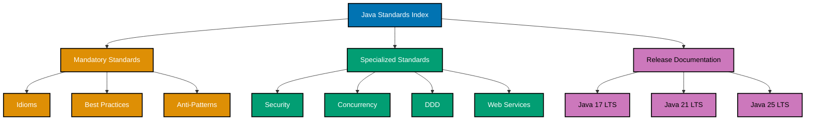

# Java

**This is THE authoritative reference** for Java coding standards in OSE Platform.

All Java code written for the OSE Platform MUST comply with the standards documented here. These standards are mandatory, not optional. Non-compliance blocks code review and merge approval.

## Framework Stack

OSE Platform Java applications MUST use the following framework stack:

**Primary Framework:**

- **Spring Boot 4** (Spring Framework 6.1+, Spring Security 6.1+, Spring Data JPA)

**Enterprise Features:**

- **Jakarta EE 11** (CDI for dependency injection, JPA for ORM, Bean Validation, JAX-RS)

**Testing Stack:**

- **JUnit 6** (Jupiter) for unit testing
- **Mockito** for test doubles and mocking
- **AssertJ** for fluent assertions
- **TestContainers** for database/infrastructure integration testing
- **Cucumber JVM** for BDD scenarios

**Build Tool:**

- **Maven 3.9+** (Maven 4 when stable)
- **Maven Wrapper (`mvnw`)** MUST be committed to enforce reproducible builds

**Java Version Strategy:**

- **Baseline**: Java 17+ (MUST use minimum) - LTS foundation
- **Recommended**: Java 21+ (SHOULD migrate to) - Virtual threads and structured concurrency
- **Latest**: Java 25 LTS (RECOMMENDED for new projects) - Stream gatherers, scoped values, flexible constructors

## Learning Java

**IMPORTANT**: This document defines WHAT standards Java code MUST follow. To LEARN Java programming fundamentals and concepts referenced in these standards, see:

**AyoKoding Java Learning Path**: <https://ayokoding.com/en/learn/software-engineering/programming-languages/java>

- **[Java Learning Path](https://ayokoding.com/en/learn/software-engineering/programming-languages/java)** - Complete Java learning journey
- **[Java By Example](https://ayokoding.com/en/learn/software-engineering/programming-languages/java/by-example)** - 157+ annotated code examples
- **[Java In Practice](https://ayokoding.com/en/learn/software-engineering/programming-languages/java/in-practice)** - Conceptual guidance and design patterns
- **[Java Release Highlights](https://ayokoding.com/en/learn/software-engineering/programming-languages/java/release-highlights)** - Java 17, 21, and 25 LTS features

**Note**: These standards assume you've learned Java basics from ayokoding-web. We don't re-explain fundamental concepts here - we enforce how to apply them correctly in OSE Platform.

## Software Engineering Principles

Java development in OSE Platform enforces five foundational software engineering principles:

1. **[Automation Over Manual](../../../../../governance/principles/software-engineering/automation-over-manual.md)** - MUST automate through records, try-with-resources, static analysis (Error Prone, NullAway), Maven plugins (Spotless, JaCoCo), annotation processing, and TestContainers

2. **[Explicit Over Implicit](../../../../../governance/principles/software-engineering/explicit-over-implicit.md)** - MUST enforce explicitness through sealed types for exhaustive handling, explicit configuration over conventions, Java Platform Module System (JPMS), explicit dependency injection, and explicit error handling

3. **[Immutability Over Mutability](../../../../../governance/principles/software-engineering/immutability.md)** - MUST use records for value objects, final fields for instance variables, immutable collections (`List.copyOf`, `Map.copyOf`), and persistent data structures (Vavr) for thread-safe functional programming

4. **[Pure Functions Over Side Effects](../../../../../governance/principles/software-engineering/pure-functions.md)** - MUST implement functional core/imperative shell architecture, pure domain logic without side effects, functional interfaces and streams for collection processing, and referential transparency

5. **[Reproducibility First](../../../../../governance/principles/software-engineering/reproducibility.md)** - MUST ensure reproducibility through Maven Wrapper, version pinning (SDKMAN `.sdkmanrc`, Maven `<dependencyManagement>`), Maven Enforcer Plugin, deterministic builds, and `.tool-versions` for Java version management

## Java Version Strategy

OSE Platform follows a three-tier Java versioning strategy:

**Java 17 LTS (Baseline - REQUIRED)**:

- All projects MUST support Java 17 minimum
- Sealed classes, pattern matching (preview), records
- Required for Spring Boot 3+, Jakarta EE 10+

**Java 21 LTS (Target - RECOMMENDED)**:

- Projects SHOULD migrate to Java 21 when feasible
- Virtual threads (Project Loom), scoped values, finalized pattern matching
- Sequenced collections, record patterns

**Java 25 LTS (Latest - RECOMMENDED)**:

- New projects SHOULD use Java 25 for latest LTS features
- Stream gatherers (advanced data transformation pipelines)
- Scoped values (thread-local alternative with better performance)
- Flexible constructor bodies (pre-construction validation)
- Compact object headers (20% memory reduction)
- Primitive types in patterns (when finalized)
- Module import declarations (simplified module system)

**See**: [Java 17 Release](./ex-soen-prla-ja__release-17.md), [Java 21 Release](./ex-soen-prla-ja__release-21.md), [Java 25 Release](./ex-soen-prla-ja__release-25.md)

## Coding Standards Reference

**Core Standards (MANDATORY)**:

1. **[Idioms](./ex-soen-prla-ja__idioms.md)** - MUST use idiomatic Java patterns (records, pattern matching, Optional, streams, virtual threads, try-with-resources, sealed classes)

2. **[Best Practices](./ex-soen-prla-ja__best-practices.md)** - MUST follow clean code standards (focused methods 10-20 lines, intention-revealing names, immutability with final fields, comprehensive testing)

3. **[Anti-Patterns](./ex-soen-prla-ja__anti-patterns.md)** - MUST NOT use problematic patterns (thread-unsafe SimpleDateFormat, unclosed resources, premature optimization, excessive abstraction, mutable shared state)

**Specialized Standards (REQUIRED WHERE APPLICABLE)**:

- **[Error Handling](./ex-soen-prla-ja__error-handling.md)** - Exception handling and resilience patterns
- **[Type Safety](./ex-soen-prla-ja__type-safety.md)** - Sealed types, JSpecify, NullAway, Checker Framework for compile-time safety
- **[Security](./ex-soen-prla-ja__security.md)** - OWASP guidelines, input validation, cryptography, secure coding
- **[Performance](./ex-soen-prla-ja__performance.md)** - JVM tuning, GC optimization, profiling (JFR, async-profiler)
- **[Concurrency](./ex-soen-prla-ja__concurrency-and-parallelism.md)** - Virtual threads, structured concurrency, thread safety
- **[Functional Programming](./ex-soen-prla-ja__functional-programming.md)** - Pure functions, immutability, Vavr library, monads
- **[Domain-Driven Design](./ex-soen-prla-ja__domain-driven-design.md)** - DDD tactical patterns (value objects, entities, aggregates, repositories, domain events)
- **[Test-Driven Development](./ex-soen-prla-ja__test-driven-development.md)** - TDD workflow, JUnit 6, Mockito, AssertJ
- **[Behavior-Driven Development](./ex-soen-prla-ja__behaviour-driven-development.md)** - BDD with Cucumber, Gherkin, Three Amigos
- **[Interfaces and Polymorphism](./ex-soen-prla-ja__interfaces-and-polymorphism.md)** - Interface design, sealed interfaces, explicit polymorphism
- **[Memory Management](./ex-soen-prla-ja__memory-management.md)** - JVM internals, GC algorithms (G1GC, ZGC, Shenandoah), memory optimization
- **[Modules and Dependencies](./ex-soen-prla-ja__modules-and-dependencies.md)** - JPMS, Maven dependency management, reproducible builds
- **[Web Services](./ex-soen-prla-ja__web-services.md)** - REST (Spring Boot, JAX-RS), GraphQL, gRPC, API security (JWT, OAuth2, RBAC)
- **[Linting and Formatting](./ex-soen-prla-ja__linting-and-formatting.md)** - Spotless, Checkstyle, Error Prone, NullAway

## Documentation Structure

### Quick Reference

**Mandatory Reading (All Java Developers)**:

1. [Idioms](./ex-soen-prla-ja__idioms.md) - Modern Java patterns MUST be used
2. [Best Practices](./ex-soen-prla-ja__best-practices.md) - Clean code standards MUST be followed
3. [Anti-Patterns](./ex-soen-prla-ja__anti-patterns.md) - Problematic patterns MUST be avoided

**Specialized Topics (Context-Dependent)**:

- **Security**: [Security](./ex-soen-prla-ja__security.md) - MUST follow for all code handling user input, authentication, cryptography
- **Concurrency**: [Concurrency and Parallelism](./ex-soen-prla-ja__concurrency-and-parallelism.md) - MUST follow for multi-threaded code
- **Domain Modeling**: [Domain-Driven Design](./ex-soen-prla-ja__domain-driven-design.md) - MUST follow for business domain implementations
- **APIs**: [Web Services](./ex-soen-prla-ja__web-services.md) - MUST follow for REST/GraphQL/gRPC endpoints
- **Testing**: [TDD](./ex-soen-prla-ja__test-driven-development.md), [BDD](./ex-soen-prla-ja__behaviour-driven-development.md) - MUST follow testing standards

**Release Documentation (Version-Specific)**:

- [Java 17 LTS](./ex-soen-prla-ja__release-17.md) - Baseline features (sealed classes, records, pattern matching preview)
- [Java 21 LTS](./ex-soen-prla-ja__release-21.md) - Target features (virtual threads, finalized pattern matching)
- [Java 25 LTS](./ex-soen-prla-ja__release-25.md) - Latest features (stream gatherers, compact headers)

### Documentation Organization

## Primary Use Cases in OSE Platform

**Backend Services**:

- RESTful APIs for business operations MUST use Spring Boot 4 with `@RestController`
- GraphQL endpoints for complex queries SHOULD use Spring for GraphQL
- gRPC services for internal communication MAY use gRPC-Java with Protocol Buffers
- Event-driven microservices MUST use Spring Kafka or Spring AMQP

**Domain-Driven Design**:

- Aggregates for business domains MUST use DDD tactical patterns
- Value Objects (Money, Email, TaxId) MUST use records with validation
- Domain Events MUST use Spring Application Events or domain event publishers
- Repositories MUST abstract persistence with Spring Data JPA or custom implementations

**Business Logic**:

- Sharia-compliant calculation engines MUST use pure functions for reproducibility
- Complex validation rules MUST use Bean Validation (Jakarta) or domain validators
- Financial transaction processing MUST use transactional boundaries (`@Transactional`)
- Compliance and audit trail MUST use domain events and event sourcing where appropriate

## Reproducible Builds and Automation

**Version Management (REQUIRED)**:

- MUST use SDKMAN with `.sdkmanrc` OR MISE/asdf with `.tool-versions` to pin Java version
- MUST commit Maven Wrapper (`mvnw`, `.mvn/wrapper/`) to repository
- MUST NOT rely on system-installed Maven

**Dependency Management (REQUIRED)**:

- MUST use `<dependencyManagement>` in parent POM to pin versions
- MUST use Maven Enforcer Plugin to prevent SNAPSHOT dependencies in production
- SHOULD use dependency BOMs (Bills of Materials) for framework version alignment
- MUST NOT use version ranges (`[1.0,2.0)`) - use exact versions

**Automated Quality (REQUIRED)**:

- MUST use Spotless Maven Plugin for code formatting (auto-format on build)
- MUST use Error Prone for compile-time bug detection
- SHOULD use NullAway for null safety enforcement
- MUST use JaCoCo for code coverage measurement (minimum 80% for domain logic)
- SHOULD use Checkstyle or PMD for style checking

**Testing Automation (REQUIRED)**:

- MUST write unit tests with JUnit 6 (target: >80% coverage for domain logic)
- MUST use TestContainers for database integration tests (no mocked repositories)
- SHOULD use Mockito sparingly (prefer real objects, use mocks for external dependencies)
- SHOULD use property-based testing (jqwik) for complex domain logic

**See**: [Automation Over Manual](../../../../../governance/principles/software-engineering/automation-over-manual.md), [Reproducibility First](../../../../../governance/principles/software-engineering/reproducibility.md)

## Integration with Repository Governance

**Development Practices**:

- [Functional Programming](../../../../../governance/development/pattern/functional-programming.md) - MUST follow FP principles for domain logic
- [Implementation Workflow](../../../../../governance/development/workflow/implementation.md) - MUST follow "make it work → make it right → make it fast"
- [Code Quality Standards](../../../../../governance/development/quality/code.md) - MUST meet platform-wide quality requirements
- [Commit Messages](../../../../../governance/development/workflow/commit-messages.md) - MUST use Conventional Commits

**Code Review Requirements**:

- All Java code MUST pass automated checks (Spotless, Error Prone, JaCoCo coverage)
- Code reviewers MUST verify compliance with standards in this index
- Non-compliance with mandatory standards (Idioms, Best Practices, Anti-Patterns) blocks merge

## Related Documentation

**Software Engineering Principles**:

- [Automation Over Manual](../../../../../governance/principles/software-engineering/automation-over-manual.md)
- [Explicit Over Implicit](../../../../../governance/principles/software-engineering/explicit-over-implicit.md)
- [Immutability Over Mutability](../../../../../governance/principles/software-engineering/immutability.md)
- [Pure Functions Over Side Effects](../../../../../governance/principles/software-engineering/pure-functions.md)
- [Reproducibility First](../../../../../governance/principles/software-engineering/reproducibility.md)

**Development Practices**:

- [Functional Programming](../../../../../governance/development/pattern/functional-programming.md)
- [Maker-Checker-Fixer Pattern](../../../../../governance/development/pattern/maker-checker-fixer.md)

**Platform Documentation**:

- [Tech Stack Languages Index](../README.md)
- [Monorepo Structure](../../../../reference/re__monorepo-structure.md)

---

**Status**: Authoritative Standard (Mandatory Compliance)
**Last Updated**: 2026-02-03
**Java Version**: 17+ (baseline), 21+ (recommended), 25 LTS (recommended for new projects)
**Framework Stack**: Spring Boot 4, Jakarta EE 11, JUnit 6, Mockito, TestContainers
**Maintainers**: Platform Architecture Team
