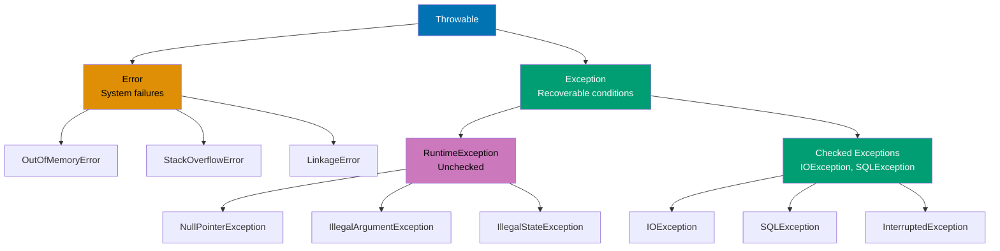
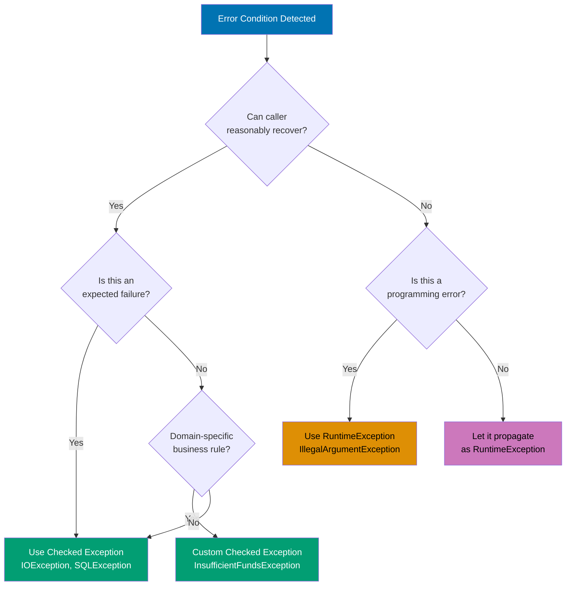
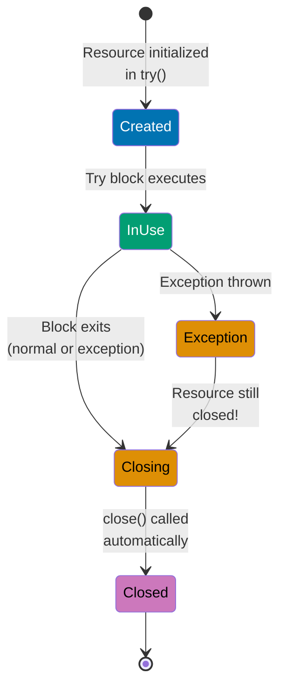
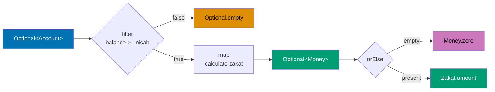
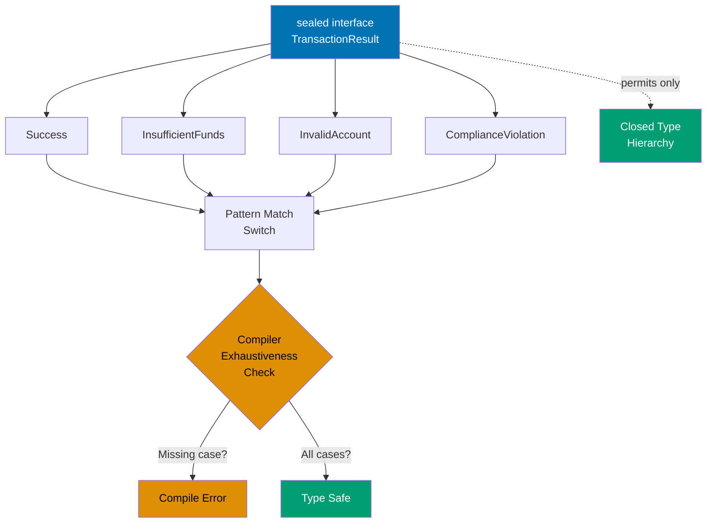
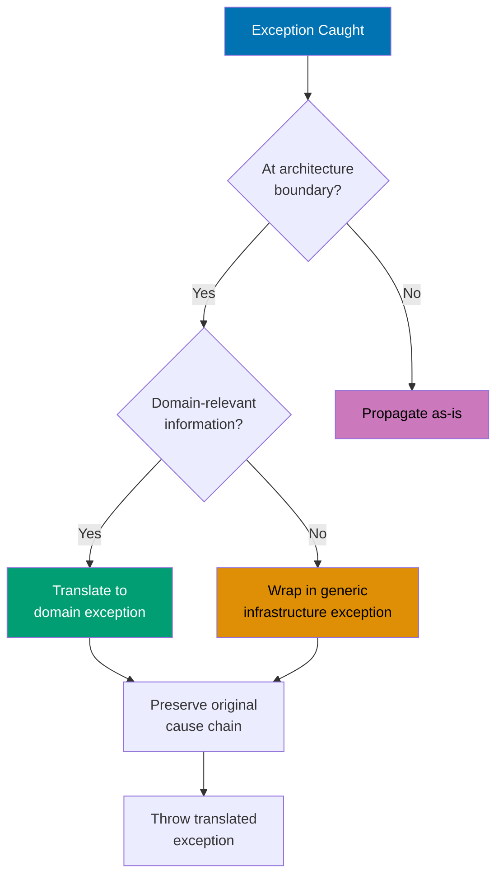
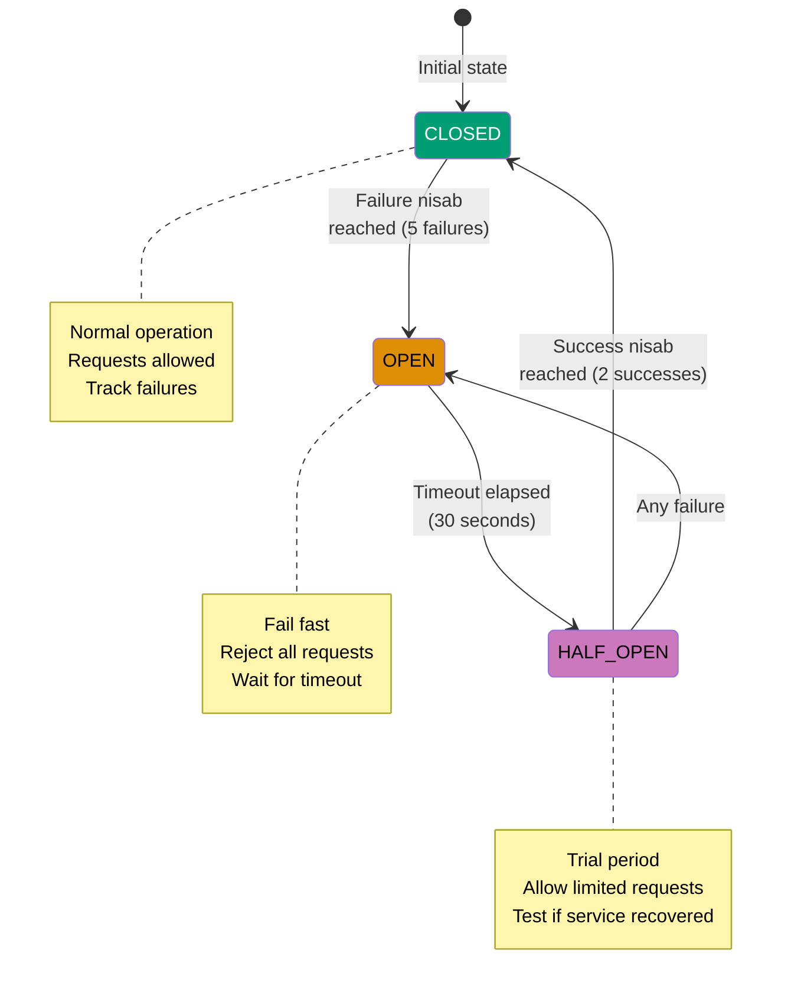

# Java Error Handling

**Quick Reference**: [Why Error Handling Matters in Finance](#why-error-handling-matters-in-finance) | [Exception Hierarchy](#exception-hierarchy) | [Checked vs Unchecked Exceptions](#checked-vs-unchecked-exceptions) | [Try-Catch-Finally Fundamentals](#try-catch-finally-fundamentals) | [Try-With-Resources](#try-with-resources) | [Early Validation Pattern](#early-validation-pattern) | [Optional for Absence](#optional-for-absence) | [Sealed Types for Exhaustive Error Handling](#sealed-types-for-exhaustive-error-handling) | [Functional Error Handling: Try Monad](#functional-error-handling-try-monad) | [Functional Error Handling: Either Monad](#functional-error-handling-either-monad) | [Custom Exception Design](#custom-exception-design) | [Error Handling Patterns](#error-handling-patterns) | [Resilience Patterns](#resilience-patterns) | [Structured Concurrency Error Handling](#structured-concurrency-error-handling) | [Testing Error Scenarios](#testing-error-scenarios) | [Secure Error Messages](#secure-error-messages) | [Modern Java Error Handling](#modern-java-error-handling) | [Error Handling Anti-Patterns](#error-handling-anti-patterns) | [Error Handling Checklist](#error-handling-checklist) | [Performance Considerations](#performance-considerations) | [Sources](#sources) | [Related Documentation](#related-documentation) | [Related Principles](#related-principles)
**Understanding-oriented documentation** for error handling patterns, exception management, and building resilient Java applications.

## Quick Reference

**Jump to:**

- [Why Error Handling Matters in Finance](#why-error-handling-matters-in-finance) - Domain context and financial impact
- [Exception Hierarchy](#exception-hierarchy) - Understanding Throwable, Error, Exception
- [Checked vs Unchecked Exceptions](#checked-vs-unchecked-exceptions) - Decision tree and guidelines
- [Try-Catch-Finally Fundamentals](#try-catch-finally-fundamentals) - Basic exception handling
- [Try-With-Resources](#try-with-resources) - Automatic resource management
- [Early Validation Pattern](#early-validation-pattern) - Fail fast philosophy
- [Optional for Absence](#optional-for-absence) - Type-safe null handling
- [Sealed Types for Exhaustive Error Handling](#sealed-types-for-exhaustive-error-handling) - Compiler-verified completeness
- [Functional Error Handling: Try Monad](#functional-error-handling-try-monad) - Composable error handling
- [Functional Error Handling: Either Monad](#functional-error-handling-either-monad) - Validation and error accumulation
- [Custom Exception Design](#custom-exception-design) - Creating domain-specific exceptions
- [Error Handling Patterns](#error-handling-patterns) - Result objects, Null Object, Exception Translation
- [Resilience Patterns](#resilience-patterns) - Retry, circuit breaker, bulkhead
- [Structured Concurrency Error Handling](#structured-concurrency-error-handling) - Modern concurrent error management
- [Testing Error Scenarios](#testing-error-scenarios) - Verifying error handling behavior
- [Secure Error Messages](#secure-error-messages) - Preventing information leakage
- [Modern Java Error Handling](#modern-java-error-handling) - Java 17-25 features
- [Error Handling Anti-Patterns](#error-handling-anti-patterns) - Common mistakes to avoid
- [Error Handling Checklist](#error-handling-checklist) - Design, implementation, testing
- [Performance Considerations](#performance-considerations) - Exception costs and optimization

**Related Documentation:**

- [Java Idioms](./ex-soen-prla-ja__idioms.md) - Modern Java patterns including try-with-resources
- [Java Best Practices](./ex-soen-prla-ja__best-practices.md) - Early validation and testing
- [Java Type Safety](./ex-soen-prla-ja__type-safety.md) - Sealed types and Optional
- [Java Functional Programming](./ex-soen-prla-ja__functional-programming.md) - Try and Either monads
- [Java Security](./ex-soen-prla-ja__security.md) - Secure error handling practices
- [Java Concurrency](./ex-soen-prla-ja__concurrency-and-parallelism.md) - Structured concurrency
- [Java Anti-Patterns](./ex-soen-prla-ja__anti-patterns.md) - Exception handling mistakes

Error handling in Java directly implements multiple [software engineering principles](../../../../../governance/principles/software-engineering/README.md):

1. **[Explicit Over Implicit](../../../../../governance/principles/software-engineering/explicit-over-implicit.md)** - Making error conditions explicit in type signatures (checked exceptions, Optional, sealed result types)
2. **[Pure Functions Over Side Effects](../../../../../governance/principles/software-engineering/pure-functions.md)** - Error handling without side effects using Try/Either monads
3. **[Automation Over Manual](../../../../../governance/principles/software-engineering/automation-over-manual.md)** - Compiler-verified exhaustiveness, automatic resource cleanup
4. **[Immutability Over Mutability](../../../../../governance/principles/software-engineering/immutability.md)** - Immutable exception objects for thread-safe error propagation
5. **[Reproducibility First](../../../../../governance/principles/software-engineering/reproducibility.md)** - Deterministic error handling enables predictable, testable behavior

These principles are critical for Shariah-compliant financial systems where errors must be handled correctly, audit trails preserved, and transactions remain atomic.

## Why Error Handling Matters in Finance

Error handling is not optional in financial systems—it's a critical component that ensures:

- **Data Integrity**: Preventing partial transactions that violate Islamic finance principles (no incomplete Murabaha contracts)
- **Audit Compliance**: Every error must be logged with complete context for regulatory review
- **Financial Accuracy**: Incorrect error handling can lead to miscalculated Zakat, interest charges, or donation processing
- **System Reliability**: Cascading failures in donation processing can halt critical operations
- **Security**: Improper error messages can leak sensitive donation_account information

**Example Financial Impact**:

```java
// BAD: Silent failure creates financial inconsistency
public class ZakatProcessor {
    public void processZakatPayment(Account donation_account) {
        try {
            BigDecimal zakat = calculateZakat(donation_account);
            deductFromAccount(donation_account, zakat);
            creditToZakatFund(zakat);  // What if this fails?
            // Account debited but Zakat fund not credited = financial loss!
        } catch (Exception e) {
            // Silently swallowed - audit trail lost!
        }
    }
}

// GOOD: Explicit error handling with rollback
public class ZakatProcessor {
    public Result<ZakatTransaction, ZakatError> processZakatPayment(Account donation_account) {
        return validate(donation_account)
            .flatMap(this::calculateZakat)
            .flatMap(zakat -> executeAtomicTransfer(donation_account, zakat))
            .onFailure(error -> {
                logAuditTrail(donation_account, error);
                rollbackPartialTransaction(donation_account);
            });
    }

    private Result<ZakatTransaction, ZakatError> executeAtomicTransfer(
        Account donation_account,
        Money zakat
    ) {
        return transactionManager.executeAtomic(() -> {
            deductFromAccount(donation_account, zakat);
            creditToZakatFund(zakat);
            return new ZakatTransaction(donation_account.id(), zakat, Instant.now());
        }).mapError(ex -> new ZakatError.TransferFailed(ex.getMessage()));
    }
}
```

**Financial Impact**:

- ❌ **Silent failure**: Account debited, Zakat fund not credited → financial loss + audit violation
- ✅ **Explicit Result**: Either success or error → atomic donation_transaction + complete audit trail

## Exception Hierarchy

Java's exception hierarchy defines how errors are classified and handled at compile time vs runtime.



### Understanding the Hierarchy

**Throwable** (root of all exceptions):

- Only type that can be thrown/caught
- Two main branches: `Error` and `Exception`

**Error** (system-level failures):

- Indicates serious problems applications **should not** catch
- Examples: `OutOfMemoryError`, `StackOverflowError`, `LinkageError`
- Typically unrecoverable - let the JVM handle them

**Exception** (recoverable conditions):

- Conditions applications **can** reasonably catch and handle
- Two categories: checked and unchecked

**Checked Exceptions** (compile-time verified):

- Must be declared in method signature or caught
- Represent expected failures: `IOException`, `SQLException`, `InterruptedException`
- Compiler enforces handling

**RuntimeException** (unchecked):

- Not required to be declared or caught
- Represent programming errors: `NullPointerException`, `IllegalArgumentException`
- Can occur anywhere in code

**Example: Financial Domain Exception Hierarchy**

```java
// Base exception for financial domain
public sealed class FinancialException extends Exception
    permits ValidationException, TransactionException, ComplianceException {

    private final String errorCode;
    private final Instant timestamp;

    protected FinancialException(String message, String errorCode) {
        super(message);
        this.errorCode = errorCode;
        this.timestamp = Instant.now();
    }

    public String errorCode() { return errorCode; }
    public Instant timestamp() { return timestamp; }
}

// Checked: Caller must handle validation failures
public final class ValidationException extends FinancialException {
    public ValidationException(String message) {
        super(message, "VAL_ERROR");
    }
}

// Checked: Caller must handle donation_transaction failures
public final class TransactionException extends FinancialException {
    public TransactionException(String message) {
        super(message, "TXN_ERROR");
    }
}

// Checked: Caller must handle compliance violations
public final class ComplianceException extends FinancialException {
    public ComplianceException(String message) {
        super(message, "COMP_ERROR");
    }
}

// Unchecked: Programming error (should never happen)
public class InvalidZakatRateException extends IllegalArgumentException {
    public InvalidZakatRateException(BigDecimal rate) {
        super("Zakat rate must be 2.5%, got: " + rate);
    }
}
```

## Checked vs Unchecked Exceptions

Choosing between checked and unchecked exceptions depends on whether the caller can reasonably recover from the error.



### Decision Guidelines

**Use Checked Exceptions when:**

- Caller can take meaningful recovery action
- Failure is expected under normal operation
- External systems might fail (network, database, file I/O)
- Business rules might be violated (insufficient funds, invalid date)

**Use Unchecked Exceptions when:**

- Represents a programming bug (null where non-null expected)
- Caller cannot recover (invalid configuration, assertion failure)
- Would clutter every method signature (validation in deep call stack)

**Example: Donation Processing**

```java
// Checked: Caller must handle donation failures
public Money processDonation(Donation donation)
    throws PaymentFailedException, ComplianceException {

    // Unchecked: Programming error if donation is null
    Objects.requireNonNull(donation, "Donation cannot be null");

    // Unchecked: Programming error if amount is negative
    if (donation.amount().compareTo(Money.zero()) <= 0) {
        throw new IllegalArgumentException(
            "Donation amount must be positive: " + donation.amount()
        );
    }

    // Checked: DonationPayment gateway might fail (network, insufficient funds)
    Money processedAmount = paymentGateway.charge(donation);

    // Checked: Compliance check might fail (sanctioned country, AML violation)
    complianceService.validateDonation(donation);

    return processedAmount;
}

// Test: Verify checked exception handling
@Test
void shouldHandlePaymentFailure() {
    Donation donation = validDonation();
    when(paymentGateway.charge(donation))
        .thenThrow(new PaymentFailedException("Card declined"));

    assertThrows(PaymentFailedException.class, () ->
        donationService.processDonation(donation)
    );
}

// Test: Verify unchecked exception (programming error)
@Test
void shouldRejectNullDonation() {
    assertThrows(NullPointerException.class, () ->
        donationService.processDonation(null)
    );
}
```

**Real-World Guideline**:

- **Checked**: "I expect this might fail, and you need a plan" (file not found, network timeout)
- **Unchecked**: "This should never happen if you use my API correctly" (null argument, negative amount)

## Try-Catch-Finally Fundamentals

The `try-catch-finally` construct is Java's basic exception handling mechanism.

### Basic Syntax

```java
try {
    // Code that might throw exceptions
    Money zakat = calculateZakat(donation_account);
} catch (ValidationException e) {
    // Handle validation errors
    logger.error("Validation failed: {}", e.getMessage());
} catch (CalculationException e) {
    // Handle calculation errors
    logger.error("Calculation failed: {}", e.getMessage());
} finally {
    // Always executes (even if return/throw in try/catch)
    releaseResources();
}
```

### Multiple Catch Blocks

Catch blocks are evaluated top-to-bottom. **More specific exceptions must come first**.

```java
// BAD: Unreachable catch block
try {
    processTransaction(donation_transaction);
} catch (Exception e) {  // Catches everything
    handleGenericError(e);
} catch (TransactionException e) {  // COMPILE ERROR: Unreachable!
    handleTransactionError(e);
}

// GOOD: Most specific first
try {
    processTransaction(donation_transaction);
} catch (InsufficientFundsException e) {  // Most specific
    logger.warn("Insufficient funds: {}", e.accountId());
    notifyUser(e.accountId(), "Please add funds");
} catch (TransactionException e) {  // More general
    logger.error("DonationTransaction failed: {}", e.getMessage());
    rollbackTransaction(donation_transaction);
} catch (Exception e) {  // Last resort
    logger.error("Unexpected error", e);
    notifyAdmin(e);
}
```

### Multi-Catch (Java 7+)

Handle multiple exception types with the same logic using `|`.

```java
// Instead of duplicating catch blocks
try {
    String data = readFromFile(path);
    ZakatRecord record = parseZakatRecord(data);
} catch (IOException e) {
    logger.error("I/O error: {}", e.getMessage());
    return Optional.empty();
} catch (ParseException e) {
    logger.error("Parse error: {}", e.getMessage());
    return Optional.empty();
}

// Use multi-catch
try {
    String data = readFromFile(path);
    ZakatRecord record = parseZakatRecord(data);
} catch (IOException | ParseException e) {
    logger.error("Failed to load Zakat record: {}", e.getMessage());
    return Optional.empty();
}
```

**Important**: Exception variable in multi-catch is implicitly `final`.

### Finally Block Guarantees

The `finally` block **always executes**, even when:

- No exception is thrown
- Exception is thrown and caught
- Exception is thrown and not caught
- `return` statement in try/catch
- Another exception thrown in catch

```java
public Optional<ZakatRecord> loadZakatRecord(String accountId) {
    Connection conn = null;
    try {
        conn = dataSource.getConnection();
        return Optional.of(fetchZakatRecord(conn, accountId));
    } catch (SQLException e) {
        logger.error("Database error loading Zakat record", e);
        return Optional.empty();
    } finally {
        // ALWAYS executes - even if return in try/catch
        if (conn != null) {
            try {
                conn.close();
            } catch (SQLException e) {
                logger.warn("Failed to close connection", e);
            }
        }
    }
}
```

### Anti-Pattern: Empty Catch Blocks

**NEVER swallow exceptions silently**—this hides bugs and violates audit requirements.

```java
// BAD: Silent failure - audit trail lost!
try {
    deductZakat(donation_account, amount);
} catch (Exception e) {
    // Empty catch = data inconsistency + no audit trail
}

// ALSO BAD: Comment doesn't help
try {
    deductZakat(donation_account, amount);
} catch (Exception e) {
    // TODO: Handle this later
}

// GOOD: Log and propagate
try {
    deductZakat(donation_account, amount);
} catch (InsufficientFundsException e) {
    logger.error("Insufficient funds for Zakat: donation_account={}, amount={}",
        donation_account.id(), amount, e);
    throw e;  // Propagate for caller to handle
}

// GOOD: Log and return error result
try {
    deductZakat(donation_account, amount);
} catch (InsufficientFundsException e) {
    logger.error("Insufficient funds for Zakat: donation_account={}, amount={}",
        donation_account.id(), amount, e);
    return Result.failure(new ZakatError.InsufficientFunds(donation_account.id()));
}
```

**Test: Verify exceptions are not swallowed**

```java
@Test
void shouldPropagateInsufficientFundsException() {
    Account donation_account = accountWithBalance(Money.of(100, "USD"));
    Money zakat = Money.of(200, "USD");

    assertThrows(InsufficientFundsException.class, () ->
        zakatService.deductZakat(donation_account, zakat)
    );

    // Verify audit log entry created
    verify(auditLogger).logFailedDeduction(
        eq(donation_account.id()),
        eq(zakat),
        any(InsufficientFundsException.class)
    );
}
```

### Anti-Pattern: Catching InterruptedException Incorrectly

When catching `InterruptedException`, **always restore the interrupt status**.

```java
// BAD: Interrupt status lost!
public void processZakatQueue() {
    while (true) {
        try {
            ZakatRequest request = queue.take();  // Blocking
            processZakat(request);
        } catch (InterruptedException e) {
            logger.error("Interrupted", e);
            // Interrupt status cleared - thread thinks it's not interrupted!
        }
    }
}

// GOOD: Restore interrupt status
public void processZakatQueue() {
    while (!Thread.currentThread().isInterrupted()) {
        try {
            ZakatRequest request = queue.take();
            processZakat(request);
        } catch (InterruptedException e) {
            logger.info("Processing interrupted, shutting down");
            Thread.currentThread().interrupt();  // Restore interrupt!
            break;  // Exit loop
        }
    }
}

// ALSO GOOD: Propagate as unchecked exception
public void processZakatRequest(ZakatRequest request) {
    try {
        // Blocking operation
        String response = callExternalService(request);
        processResponse(response);
    } catch (InterruptedException e) {
        Thread.currentThread().interrupt();  // Restore interrupt
        throw new RuntimeException("Interrupted while processing Zakat", e);
    }
}
```

**Why this matters**: Thread interruption is cooperative. If you don't restore the interrupt status, the thread pool or framework can't detect the interrupt signal, preventing graceful shutdown.

## Try-With-Resources

Try-with-resources automatically closes resources implementing `AutoCloseable`, eliminating resource leaks.

### Basic Syntax

```java
// Before Java 7: Manual cleanup with finally
public List<String> readZakatRecords(String path) throws IOException {
    BufferedReader reader = null;
    try {
        reader = new BufferedReader(new FileReader(path));
        List<String> records = new ArrayList<>();
        String line;
        while ((line = reader.readLine()) != null) {
            records.add(line);
        }
        return records;
    } finally {
        if (reader != null) {
            try {
                reader.close();
            } catch (IOException e) {
                // What to do here? Log? Ignore?
            }
        }
    }
}

// Java 7+: Try-with-resources
public List<String> readZakatRecords(String path) throws IOException {
    try (BufferedReader reader = new BufferedReader(new FileReader(path))) {
        return reader.lines().toList();
    }
    // reader.close() called automatically - even if exception thrown!
}
```

### Multiple Resources

Resources are closed in **reverse order** of declaration.

```java
// Multiple resources
public void transferZakatData(String source, String destination) throws IOException {
    try (
        BufferedReader reader = new BufferedReader(new FileReader(source));
        BufferedWriter writer = new BufferedWriter(new FileWriter(destination))
    ) {
        String line;
        while ((line = reader.readLine()) != null) {
            writer.write(line);
            writer.newLine();
        }
    }
    // Closed in reverse: writer.close(), then reader.close()
}
```

### Resource Lifecycle



### Suppressed Exceptions

If both the try block and `close()` throw exceptions, the close exception is **suppressed**.

```java
public void processZakatFile(String path) {
    try (InputStream input = new FileInputStream(path)) {
        throw new IOException("Error reading file");  // Primary exception
    } catch (IOException e) {
        logger.error("Primary: {}", e.getMessage());

        // Check for suppressed exceptions from close()
        for (Throwable suppressed : e.getSuppressed()) {
            logger.error("Suppressed: {}", suppressed.getMessage());
        }
        throw e;
    }
}
```

### Custom AutoCloseable Resources

```java
// Custom resource for database transactions
public class TransactionScope implements AutoCloseable {
    private final Connection connection;
    private boolean committed = false;

    public TransactionScope(DataSource dataSource) throws SQLException {
        this.connection = dataSource.getConnection();
        this.connection.setAutoCommit(false);
    }

    public Connection connection() {
        return connection;
    }

    public void commit() throws SQLException {
        connection.commit();
        committed = true;
    }

    @Override
    public void close() throws SQLException {
        try {
            if (!committed) {
                connection.rollback();  // Auto-rollback if not committed
            }
        } finally {
            connection.close();
        }
    }
}

// Usage: Automatic rollback on exception
public void recordZakatPayment(ZakatPayment donation) throws SQLException {
    try (TransactionScope tx = new TransactionScope(dataSource)) {
        insertPaymentRecord(tx.connection(), donation);
        updateAccountBalance(tx.connection(), donation.accountId(), donation.amount());
        tx.commit();  // Explicit commit
    }
    // If exception before commit() → automatic rollback in close()
}
```

### Anti-Pattern: Resource Leaks

```java
// BAD: Resource leak if exception thrown
public List<String> readDonations(String path) throws IOException {
    FileInputStream fis = new FileInputStream(path);
    BufferedReader reader = new BufferedReader(new InputStreamReader(fis));
    // If exception here, reader never closed!
    return reader.lines().toList();
}

// GOOD: Try-with-resources guarantees cleanup
public List<String> readDonations(String path) throws IOException {
    try (FileInputStream fis = new FileInputStream(path);
         BufferedReader reader = new BufferedReader(new InputStreamReader(fis))) {
        return reader.lines().toList();
    }
}

// ALSO GOOD: Use Files.lines (returns AutoCloseable Stream)
public List<String> readDonations(String path) throws IOException {
    try (Stream<String> lines = Files.lines(Path.of(path))) {
        return lines.toList();
    }
}
```

**Test: Verify resources are closed**

```java
@Test
void shouldCloseResourcesEvenOnException() throws Exception {
    BufferedReader mockReader = mock(BufferedReader.class);
    when(mockReader.readLine()).thenThrow(new IOException("Read error"));

    assertThrows(IOException.class, () -> {
        try (BufferedReader reader = mockReader) {
            reader.readLine();
        }
    });

    // Verify close() was called despite exception
    verify(mockReader).close();
}
```

## Early Validation Pattern

Fail fast by validating inputs at method entry, preventing invalid states from propagating through the system.

### Fail Fast Philosophy

**Bad inputs should fail immediately**, not after partial processing.

```java
// BAD: Late validation - partial processing before failure
public ZakatResult calculateZakat(Account donation_account, BigDecimal nisabThreshold) {
    // Process for a while...
    Money balance = donation_account.getBalance();
    Money nisab = Money.of(nisabThreshold, balance.getCurrency());

    // OOPS - validation too late!
    if (nisabThreshold.compareTo(BigDecimal.ZERO) <= 0) {
        throw new IllegalArgumentException("Nisab must be positive");
    }

    if (balance.compareTo(nisab) < 0) {
        return ZakatResult.notApplicable();
    }

    return ZakatResult.success(balance.multiply(new BigDecimal("0.025")));
}

// GOOD: Early validation - fail immediately
public ZakatResult calculateZakat(Account donation_account, BigDecimal nisabThreshold) {
    // Validate ALL inputs first
    Objects.requireNonNull(donation_account, "Account cannot be null");
    Objects.requireNonNull(nisabThreshold, "Nisab cannot be null");

    if (nisabThreshold.compareTo(BigDecimal.ZERO) <= 0) {
        throw new IllegalArgumentException(
            "Nisab must be positive: " + nisabThreshold
        );
    }

    // Now safe to process
    Money balance = donation_account.getBalance();
    Money nisab = Money.of(nisabThreshold, balance.getCurrency());

    if (balance.compareTo(nisab) < 0) {
        return ZakatResult.notApplicable();
    }

    return ZakatResult.success(balance.multiply(new BigDecimal("0.025")));
}
```

### Validation Result Pattern

Return structured validation results instead of throwing exceptions for business rule violations.

```java
// Validation result type
public sealed interface ValidationResult<T> {
    record Success<T>(T value) implements ValidationResult<T> {}
    record Failure<T>(List<String> errors) implements ValidationResult<T> {}

    static <T> ValidationResult<T> success(T value) {
        return new Success<>(value);
    }

    static <T> ValidationResult<T> failure(String... errors) {
        return new Failure<>(List.of(errors));
    }

    static <T> ValidationResult<T> failure(List<String> errors) {
        return new Failure<>(errors);
    }
}

// Validate donation with detailed errors
public ValidationResult<Donation> validateDonation(DonationRequest request) {
    List<String> errors = new ArrayList<>();

    if (request.amount() == null) {
        errors.add("Donation amount is required");
    } else if (request.amount().compareTo(Money.zero()) <= 0) {
        errors.add("Donation amount must be positive");
    }

    if (request.donorEmail() == null || request.donorEmail().isBlank()) {
        errors.add("Donor email is required");
    } else if (!isValidEmail(request.donorEmail())) {
        errors.add("Donor email is invalid: " + request.donorEmail());
    }

    if (request.cause() == null) {
        errors.add("Donation cause is required");
    }

    if (!errors.isEmpty()) {
        return ValidationResult.failure(errors);
    }

    return ValidationResult.success(new Donation(
        request.amount(),
        request.donorEmail(),
        request.cause(),
        Instant.now()
    ));
}

// Usage with pattern matching (Java 21+)
public Response processDonationRequest(DonationRequest request) {
    return switch (validateDonation(request)) {
        case ValidationResult.Success(var donation) -> {
            processDonation(donation);
            yield Response.ok("Donation processed");
        }
        case ValidationResult.Failure(var errors) ->
            Response.badRequest(errors);
    };
}
```

### Precondition Checks

Use `Objects.requireNonNull()` and custom precondition methods for common validations.

```java
public class Preconditions {
    public static Money requirePositive(Money amount, String message) {
        if (amount.compareTo(Money.zero()) <= 0) {
            throw new IllegalArgumentException(message + ": " + amount);
        }
        return amount;
    }

    public static <T> T requireNonNull(T obj, String paramName) {
        return Objects.requireNonNull(obj, paramName + " cannot be null");
    }

    public static String requireNonBlank(String str, String paramName) {
        if (str == null || str.isBlank()) {
            throw new IllegalArgumentException(paramName + " cannot be blank");
        }
        return str;
    }
}

// Usage
public record MurabahaContract(
    Money purchasePrice,
    Money sellingPrice,
    String customerId,
    LocalDate startDate
) {
    public MurabahaContract {
        requirePositive(purchasePrice, "Purchase price must be positive");
        requirePositive(sellingPrice, "Selling price must be positive");
        requireNonBlank(customerId, "Donor ID");
        requireNonNull(startDate, "Start date");

        if (sellingPrice.compareTo(purchasePrice) <= 0) {
            throw new IllegalArgumentException(
                "Selling price must exceed purchase price"
            );
        }
    }
}
```

**Test: Verify early validation**

```java
@Test
void shouldRejectNegativeDonationAmount() {
    Money negativeAmount = Money.of(-100, "USD");

    IllegalArgumentException ex = assertThrows(
        IllegalArgumentException.class,
        () -> new Donation(negativeAmount, "donor@example.com", Cause.ZAKAT)
    );

    assertThat(ex.getMessage()).contains("positive");
}

@Test
void shouldRejectNullCustomerId() {
    assertThrows(IllegalArgumentException.class, () ->
        new MurabahaContract(
            Money.of(1000, "USD"),
            Money.of(1100, "USD"),
            null,  // Invalid!
            LocalDate.now()
        )
    );
}
```

## Optional for Absence

`Optional<T>` makes absence explicit in the type system, eliminating `NullPointerException` and forcing callers to handle missing values.

### Why Optional Over Null

```java
// BAD: Null is implicit - caller might forget to check
public Account findAccount(String accountId) {
    return accountRepository.findById(accountId);  // Returns null if not found
}

// Caller forgets null check - BOOM!
Account donation_account = findAccount("ACC123");
Money balance = donation_account.getBalance();  // NullPointerException!

// GOOD: Optional makes absence explicit
public Optional<Account> findAccount(String accountId) {
    return accountRepository.findById(accountId);
}

// Compiler forces caller to handle absence
Optional<Account> donation_account = findAccount("ACC123");
Money balance = donation_account
    .map(Account::getBalance)
    .orElse(Money.zero());  // Explicit default
```

### Optional Operations

```java
public class ZakatService {
    // Return Optional when value might be absent
    public Optional<Money> calculateZakat(String accountId) {
        return findAccount(accountId)
            .filter(donation_account -> donation_account.getBalance().compareTo(donation_account.getNisab()) >= 0)
            .map(donation_account -> donation_account.getBalance()
                .subtract(donation_account.getNisab())
                .multiply(new BigDecimal("0.025"))
            );
    }

    // Usage: map() transforms value if present
    public String formatZakat(String accountId) {
        return calculateZakat(accountId)
            .map(zakat -> "Zakat due: " + zakat)
            .orElse("No Zakat due");
    }

    // Usage: flatMap() for nested Optional operations
    public Optional<ZakatRecord> createZakatRecord(String accountId) {
        return findAccount(accountId)
            .flatMap(donation_account -> calculateZakat(accountId)
                .map(zakat -> new ZakatRecord(donation_account, zakat, Instant.now()))
            );
    }

    // Usage: orElseThrow() when absence is exceptional
    public Money getRequiredZakat(String accountId) {
        return calculateZakat(accountId)
            .orElseThrow(() -> new ZakatNotApplicableException(accountId));
    }
}
```

### Optional Chaining Flow



### Optional Anti-Patterns

```java
// ANTI-PATTERN 1: Calling get() without isPresent() check
Optional<Money> zakat = calculateZakat(accountId);
Money amount = zakat.get();  // NoSuchElementException if empty!

// GOOD: Use orElse/orElseThrow
Money amount = zakat.orElse(Money.zero());
Money amount = zakat.orElseThrow(() -> new ZakatNotFoundException(accountId));

// ANTI-PATTERN 2: isPresent() + get() instead of map/ifPresent
if (zakat.isPresent()) {
    Money amount = zakat.get();
    logZakat(amount);
}

// GOOD: Use ifPresent
zakat.ifPresent(this::logZakat);

// ANTI-PATTERN 3: Optional as field/parameter
public class Account {
    private Optional<Money> balance;  // NO! Use null or default value
}

// GOOD: Optional only for return types
public class Account {
    private Money balance;  // Required field

    public Optional<Money> getZakatDue() {  // Return Optional for computed values
        return calculateZakat();
    }
}

// ANTI-PATTERN 4: Optional.of(null)
Optional<Money> zakat = Optional.of(null);  // NullPointerException!

// GOOD: Use Optional.ofNullable for values that might be null
Optional<Money> zakat = Optional.ofNullable(maybeZakat);

// ANTI-PATTERN 5: Nested Optional<Optional<T>>
public Optional<Optional<Money>> getZakat() {  // NO!
    return Optional.of(calculateZakat());
}

// GOOD: Flatten with flatMap
public Optional<Money> getZakat() {
    return Optional.of(donation_account).flatMap(this::calculateZakat);
}
```

**Test: Verify Optional usage**

```java
@Test
void shouldReturnEmptyOptionalWhenAccountNotFound() {
    when(accountRepository.findById("ACC999")).thenReturn(Optional.empty());

    Optional<Money> zakat = zakatService.calculateZakat("ACC999");

    assertThat(zakat).isEmpty();
}

@Test
void shouldReturnEmptyOptionalWhenBalanceBelowNisab() {
    Account donation_account = accountWithBalance(Money.of(100, "USD"));
    when(accountRepository.findById("ACC123")).thenReturn(Optional.of(donation_account));

    Optional<Money> zakat = zakatService.calculateZakat("ACC123");

    assertThat(zakat).isEmpty();
}

@Test
void shouldCalculateZakatWhenBalanceAboveNisab() {
    Account donation_account = accountWithBalance(Money.of(10000, "USD"));
    when(accountRepository.findById("ACC123")).thenReturn(Optional.of(donation_account));

    Optional<Money> zakat = zakatService.calculateZakat("ACC123");

    assertThat(zakat).isPresent();
    assertThat(zakat.get()).isEqualTo(Money.of(250, "USD"));  // 2.5% of 10000
}
```

## Sealed Types for Exhaustive Error Handling

Sealed types (Java 17+) create closed type hierarchies that the compiler verifies for exhaustiveness, ensuring all error cases are handled.

### Sealed Result Type

```java
// Sealed interface: Only specified subtypes permitted
public sealed interface TransactionResult
    permits Success, InsufficientFunds, InvalidAccount, ComplianceViolation {

    record Success(String transactionId, Money amount, Instant timestamp)
        implements TransactionResult {}

    record InsufficientFunds(String accountId, Money required, Money available)
        implements TransactionResult {}

    record InvalidAccount(String accountId, String reason)
        implements TransactionResult {}

    record ComplianceViolation(String reason, String regulatoryCode)
        implements TransactionResult {}
}
```

### Exhaustive Pattern Matching

The compiler verifies all cases are handled.

```java
public String formatTransactionResult(TransactionResult result) {
    // Pattern matching switch (Java 21+)
    return switch (result) {
        case Success(var txId, var amount, var timestamp) ->
            "DonationTransaction successful: %s for %s at %s".formatted(txId, amount, timestamp);

        case InsufficientFunds(var accountId, var required, var available) ->
            "Insufficient funds in %s: required %s, available %s"
                .formatted(accountId, required, available);

        case InvalidAccount(var accountId, var reason) ->
            "Invalid donation_account %s: %s".formatted(accountId, reason);

        case ComplianceViolation(var reason, var code) ->
            "Compliance violation [%s]: %s".formatted(code, reason);

        // No default needed - compiler verifies exhaustiveness!
    };
}
```

### Compiler-Verified Exhaustiveness



### Adding New Error Cases

When adding a new case to the sealed hierarchy, **all pattern matches must be updated** or code won't compile.

```java
// Add new error type
public sealed interface TransactionResult
    permits Success, InsufficientFunds, InvalidAccount, ComplianceViolation, NetworkTimeout {

    // ... existing types ...

    record NetworkTimeout(String gateway, Duration timeout)
        implements TransactionResult {}
}

// COMPILE ERROR: Switch doesn't handle NetworkTimeout!
public String formatTransactionResult(TransactionResult result) {
    return switch (result) {
        case Success s -> formatSuccess(s);
        case InsufficientFunds f -> formatInsufficientFunds(f);
        case InvalidAccount a -> formatInvalidAccount(a);
        case ComplianceViolation v -> formatComplianceViolation(v);
        // Missing NetworkTimeout case - COMPILER ERROR!
    };
}
```

**This is a feature, not a bug!** The compiler forces you to handle the new case everywhere, preventing forgotten error handling.

### Sealed Types with Business Logic

```java
public sealed interface DonationResult
    permits DonationResult.Accepted, DonationResult.Rejected {

    record Accepted(
        String donationId,
        Money amount,
        Cause cause,
        String receiptUrl
    ) implements DonationResult {}

    record Rejected(
        RejectionReason reason,
        String details
    ) implements DonationResult {

        public enum RejectionReason {
            INSUFFICIENT_FUNDS,
            INVALID_CAUSE,
            SANCTIONED_DONOR,
            PAYMENT_DECLINED
        }
    }

    // Default methods available to all subtypes
    default boolean isAccepted() {
        return this instanceof Accepted;
    }

    default boolean isRejected() {
        return this instanceof Rejected;
    }
}

// Process donation with exhaustive error handling
public void handleDonationResult(DonationResult result) {
    switch (result) {
        case DonationResult.Accepted(var id, var amount, var cause, var receipt) -> {
            logger.info("Donation accepted: {} for {} to {}", id, amount, cause);
            emailReceipt(receipt);
            updateDonorProfile(id);
        }
        case DonationResult.Rejected(var reason, var details) -> {
            logger.warn("Donation rejected: {} - {}", reason, details);
            notifyDonor(reason, details);

            // Handle specific rejection reasons
            if (reason == RejectionReason.PAYMENT_DECLINED) {
                suggestAlternativePaymentMethod();
            }
        }
    }
}
```

**Test: Verify exhaustive handling**

```java
@Test
void shouldHandleAllDonationResults() {
    // Test accepted case
    DonationResult accepted = new DonationResult.Accepted(
        "DON123",
        Money.of(100, "USD"),
        Cause.ZAKAT,
        "https://receipts.example.com/DON123"
    );

    assertDoesNotThrow(() -> donationService.handleDonationResult(accepted));
    verify(emailService).sendReceipt("https://receipts.example.com/DON123");

    // Test rejected case
    DonationResult rejected = new DonationResult.Rejected(
        RejectionReason.INSUFFICIENT_FUNDS,
        "Card declined"
    );

    assertDoesNotThrow(() -> donationService.handleDonationResult(rejected));
    verify(notificationService).notifyDonor(RejectionReason.INSUFFICIENT_FUNDS, "Card declined");
}
```

## Functional Error Handling: Try Monad

The Try monad (from Vavr library) encapsulates computations that might throw exceptions, allowing functional composition of error-prone operations.

### Try Basics

```java
import io.vavr.control.Try;

// Traditional exception handling
public Money calculateProfit(MurabahaContract murabaha_contract) {
    try {
        Money purchasePrice = fetchPurchasePrice(murabaha_contract);
        Money sellingPrice = fetchSellingPrice(murabaha_contract);
        return sellingPrice.subtract(purchasePrice);
    } catch (Exception e) {
        logger.error("Failed to calculate profit", e);
        return Money.zero();
    }
}

// Try monad: Exceptions captured as Failure
public Try<Money> calculateProfit(MurabahaContract murabaha_contract) {
    return Try.of(() -> fetchPurchasePrice(murabaha_contract))
        .flatMap(purchasePrice ->
            Try.of(() -> fetchSellingPrice(murabaha_contract))
                .map(sellingPrice -> sellingPrice.subtract(purchasePrice))
        );
}

// Usage: Pattern match on Success/Failure
Try<Money> profit = calculateProfit(murabaha_contract);
profit.onSuccess(amount -> logger.info("Profit: {}", amount));
profit.onFailure(ex -> logger.error("Calculation failed", ex));

// Or get value with default
Money amount = profit.getOrElse(Money.zero());
```

### Composing Try Operations

```java
public Try<ZakatRecord> createZakatRecord(String accountId) {
    return Try.of(() -> fetchAccount(accountId))
        .flatMap(donation_account -> calculateZakat(donation_account))
        .flatMap(zakat -> saveZakatRecord(donation_account, zakat))
        .map(record -> {
            logger.info("Zakat record created: {}", record.id());
            return record;
        });
}

// If any step fails, entire chain short-circuits to Failure
// No nested try-catch blocks needed!
```

### Try vs Traditional Exception Handling

```java
// Traditional: Nested try-catch hell
public TransactionResult processTransaction(DonationTransaction tx) {
    try {
        Account donation_account = accountRepository.findById(tx.accountId())
            .orElseThrow(() -> new AccountNotFoundException(tx.accountId()));

        try {
            validateBalance(donation_account, tx.amount());

            try {
                executeDebit(donation_account, tx.amount());

                try {
                    executeCredit(tx.recipient(), tx.amount());
                    return TransactionResult.success(tx.id());
                } catch (CreditFailedException e) {
                    rollbackDebit(donation_account, tx.amount());
                    return TransactionResult.failure(e);
                }
            } catch (DebitFailedException e) {
                return TransactionResult.failure(e);
            }
        } catch (InsufficientFundsException e) {
            return TransactionResult.failure(e);
        }
    } catch (AccountNotFoundException e) {
        return TransactionResult.failure(e);
    }
}

// Try monad: Flat composition
public Try<TransactionResult> processTransaction(DonationTransaction tx) {
    return Try.of(() ->
            accountRepository.findById(tx.accountId())
                .orElseThrow(() -> new AccountNotFoundException(tx.accountId()))
        )
        .andThen(donation_account -> validateBalance(donation_account, tx.amount()))
        .andThen(donation_account -> executeDebit(donation_account, tx.amount()))
        .andThen(() -> executeCredit(tx.recipient(), tx.amount()))
        .map(donation_account -> TransactionResult.success(tx.id()))
        .recover(CreditFailedException.class, ex -> {
            rollbackDebit(donation_account, tx.amount());
            return TransactionResult.failure(ex);
        });
}
```

### Try Pattern Matching (Java 21+)

```java
public String formatZakatResult(Try<Money> zakatTry) {
    return switch (zakatTry) {
        case Try.Success(var zakat) ->
            "Zakat calculated: " + zakat;
        case Try.Failure(var ex) ->
            "Zakat calculation failed: " + ex.getMessage();
    };
}
```

### Testing Try Operations

```java
@Test
void shouldReturnSuccessWhenCalculationSucceeds() {
    Account donation_account = accountWithBalance(Money.of(10000, "USD"));

    Try<Money> result = zakatService.calculateZakat(donation_account);

    assertThat(result.isSuccess()).isTrue();
    assertThat(result.get()).isEqualTo(Money.of(250, "USD"));
}

@Test
void shouldReturnFailureWhenAccountFetchFails() {
    when(accountRepository.findById("ACC999"))
        .thenThrow(new DatabaseException("Connection timeout"));

    Try<Money> result = zakatService.calculateZakat("ACC999");

    assertThat(result.isFailure()).isTrue();
    assertThat(result.getCause()).isInstanceOf(DatabaseException.class);
}

@Test
void shouldShortCircuitOnFirstFailure() {
    // First operation succeeds
    when(accountRepository.findById("ACC123")).thenReturn(Optional.of(donation_account));

    // Second operation fails
    when(zakatCalculator.calculate(donation_account)).thenThrow(new CalculationException());

    Try<ZakatRecord> result = zakatService.createZakatRecord("ACC123");

    assertThat(result.isFailure()).isTrue();

    // Third operation never called (short-circuit)
    verify(zakatRepository, never()).save(any());
}
```

## Functional Error Handling: Either Monad

The Either monad represents a value of one of two possible types: `Left` (error) or `Right` (success). Unlike Try, Either allows typed errors instead of exceptions.

### Either Basics

```java
import io.vavr.control.Either;

// Either<Error, Success>
public Either<ValidationError, Donation> validateDonation(DonationRequest request) {
    if (request.amount().compareTo(Money.zero()) <= 0) {
        return Either.left(new ValidationError("Amount must be positive"));
    }

    if (request.donorEmail() == null || !isValidEmail(request.donorEmail())) {
        return Either.left(new ValidationError("Invalid email: " + request.donorEmail()));
    }

    return Either.right(new Donation(
        request.amount(),
        request.donorEmail(),
        request.cause()
    ));
}

// Pattern matching on Left/Right
public String processDonationRequest(DonationRequest request) {
    return validateDonation(request)
        .map(this::processDonation)
        .map(donationId -> "Donation processed: " + donationId)
        .getOrElseGet(error -> "Validation failed: " + error.message());
}
```

### Either vs Try

| Aspect        | Try                              | Either                            |
| ------------- | -------------------------------- | --------------------------------- |
| Error type    | `Throwable` (exception)          | Any type (typed error)            |
| Use case      | Wrapping exception-throwing code | Business validation, typed errors |
| Left/Failure  | `Throwable`                      | Custom error type                 |
| Right/Success | Success value                    | Success value                     |

```java
// Try: For exception-throwing operations
public Try<Money> fetchAccountBalance(String accountId) {
    return Try.of(() -> databaseClient.queryBalance(accountId));
    // Captures SQLException, IOException, etc.
}

// Either: For business validation with typed errors
public Either<DonationError, Donation> validateDonation(DonationRequest request) {
    if (request.amount().compareTo(Money.zero()) <= 0) {
        return Either.left(DonationError.INVALID_AMOUNT);
    }
    return Either.right(createDonation(request));
}
```

### Accumulating Validation Errors

Either can accumulate multiple validation errors instead of failing fast.

```java
import io.vavr.control.Validation;
import io.vavr.collection.Seq;

public Validation<Seq<String>, MurabahaContract> validateMurabahaContract(
    ContractRequest request
) {
    // Combine multiple validations
    return Validation.combine(
        validatePurchasePrice(request.purchasePrice()),
        validateSellingPrice(request.sellingPrice()),
        validateCustomerId(request.customerId()),
        validateDuration(request.durationMonths())
    ).ap((purchasePrice, sellingPrice, customerId, duration) ->
        new MurabahaContract(purchasePrice, sellingPrice, customerId, duration)
    );
}

private Validation<String, Money> validatePurchasePrice(Money price) {
    if (price == null) {
        return Validation.invalid("Purchase price is required");
    }
    if (price.compareTo(Money.zero()) <= 0) {
        return Validation.invalid("Purchase price must be positive");
    }
    return Validation.valid(price);
}

private Validation<String, Money> validateSellingPrice(Money price) {
    if (price == null) {
        return Validation.invalid("Selling price is required");
    }
    if (price.compareTo(Money.zero()) <= 0) {
        return Validation.invalid("Selling price must be positive");
    }
    return Validation.valid(price);
}

// Usage
Validation<Seq<String>, MurabahaContract> result = validateMurabahaContract(request);

if (result.isInvalid()) {
    Seq<String> errors = result.getError();
    // Returns ALL validation errors: ["Purchase price must be positive", "Donor ID is required"]
    return Response.badRequest(errors);
}

MurabahaContract murabaha_contract = result.get();
return processContract(murabaha_contract);
```

### Composing Either Operations

```java
public Either<TransactionError, Receipt> processPayment(PaymentRequest request) {
    return validatePaymentMethod(request.paymentMethod())
        .flatMap(method -> validateAmount(request.amount()))
        .flatMap(amount -> chargePayment(method, amount))
        .flatMap(charge -> generateReceipt(charge))
        .mapLeft(error -> {
            logger.error("DonationPayment failed: {}", error);
            return error;
        });
}

// If any step returns Either.left(), entire chain short-circuits
// No exceptions thrown - type-safe error handling
```

**Test: Verify Either composition**

```java
@Test
void shouldAccumulateAllValidationErrors() {
    ContractRequest invalid = new ContractRequest(
        Money.of(-100, "USD"),  // Invalid purchase price
        Money.of(-200, "USD"),  // Invalid selling price
        null,                    // Invalid donor ID
        0                        // Invalid duration
    );

    Validation<Seq<String>, MurabahaContract> result =
        contractService.validateMurabahaContract(invalid);

    assertThat(result.isInvalid()).isTrue();
    Seq<String> errors = result.getError();

    assertThat(errors).hasSize(4);
    assertThat(errors).contains("Purchase price must be positive");
    assertThat(errors).contains("Selling price must be positive");
    assertThat(errors).contains("Donor ID is required");
    assertThat(errors).contains("Duration must be at least 1 month");
}

@Test
void shouldReturnValidContractWhenAllValidationsPassed() {
    ContractRequest valid = new ContractRequest(
        Money.of(10000, "USD"),
        Money.of(11000, "USD"),
        "CUST123",
        12
    );

    Validation<Seq<String>, MurabahaContract> result =
        contractService.validateMurabahaContract(valid);

    assertThat(result.isValid()).isTrue();
    MurabahaContract murabaha_contract = result.get();
    assertThat(murabaha_contract.purchasePrice()).isEqualTo(Money.of(10000, "USD"));
}
```

## Custom Exception Design

Well-designed custom exceptions improve error handling clarity and enable better debugging.

### When to Create Custom Exceptions

Create custom exceptions when:

- Domain-specific errors need context (InsufficientFundsException with donation_account ID and balance)
- Grouping related errors (all Zakat errors extend ZakatException)
- Adding structured error data (error codes, timestamps, correlation IDs)
- Enabling specific error handling (catch InsufficientFundsException separately from generic SQLException)

**Don't create custom exceptions for:**

- One-off errors (use IllegalArgumentException, IllegalStateException)
- Errors with no additional context (use standard exceptions)

### Custom Exception Best Practices

```java
// GOOD: Immutable, rich context, error code
public final class InsufficientFundsException extends TransactionException {
    private final String accountId;
    private final Money required;
    private final Money available;

    public InsufficientFundsException(String accountId, Money required, Money available) {
        super(
            "Insufficient funds in donation_account %s: required %s, available %s"
                .formatted(accountId, required, available),
            "TXN_INSUFFICIENT_FUNDS"  // Error code for client handling
        );
        this.accountId = accountId;
        this.required = required;
        this.available = available;
    }

    // Immutable getters
    public String accountId() { return accountId; }
    public Money required() { return required; }
    public Money available() { return available; }

    // No setters - exception is immutable!
}

// Usage: Rich error context for debugging
try {
    transferFunds(fromAccount, toAccount, amount);
} catch (InsufficientFundsException e) {
    logger.error(
        "DonationTransfer failed - Account: {}, Required: {}, Available: {}",
        e.accountId(),
        e.required(),
        e.available()
    );

    // Structured error response
    return ErrorResponse.builder()
        .code(e.errorCode())
        .message("Insufficient funds")
        .details(Map.of(
            "accountId", e.accountId(),
            "shortfall", e.required().subtract(e.available())
        ))
        .build();
}
```

### Exception Hierarchy Design

```java
// Base domain exception (sealed for exhaustiveness)
public sealed class FinancialException extends Exception
    permits TransactionException, ComplianceException, ValidationException {

    private final String errorCode;
    private final Instant timestamp;
    private final String correlationId;

    protected FinancialException(String message, String errorCode) {
        super(message);
        this.errorCode = errorCode;
        this.timestamp = Instant.now();
        this.correlationId = UUID.randomUUID().toString();
    }

    public String errorCode() { return errorCode; }
    public Instant timestamp() { return timestamp; }
    public String correlationId() { return correlationId; }
}

// DonationTransaction-related errors
public sealed class TransactionException extends FinancialException
    permits InsufficientFundsException, DuplicateTransactionException {

    protected TransactionException(String message, String errorCode) {
        super(message, errorCode);
    }
}

// Compliance-related errors
public final class ComplianceException extends FinancialException {
    private final String regulatoryCode;

    public ComplianceException(String message, String regulatoryCode) {
        super(message, "COMPLIANCE_VIOLATION");
        this.regulatoryCode = regulatoryCode;
    }

    public String regulatoryCode() { return regulatoryCode; }
}

// Validation errors
public final class ValidationException extends FinancialException {
    private final List<String> validationErrors;

    public ValidationException(List<String> errors) {
        super("Validation failed: " + String.join(", ", errors), "VALIDATION_ERROR");
        this.validationErrors = List.copyOf(errors);  // Immutable copy
    }

    public List<String> validationErrors() { return validationErrors; }
}
```

### Secure Error Messages

**Never expose sensitive data in exception messages.**

```java
// BAD: Exposes sensitive donation_account details
throw new InsufficientFundsException(
    "Account 123456789 (John Doe, SSN 123-45-6789) has balance $50.00, required $100.00"
);

// GOOD: Minimal details, use error code for lookup
throw new InsufficientFundsException(
    accountId,  // Just ID, not PII
    required,
    available
) {
    @Override
    public String getMessage() {
        // Public message for logs/clients
        return "Insufficient funds in donation_account " + accountId();
    }

    public String getDetailedMessage() {
        // Internal message with full context (for debugging only)
        return "Insufficient funds - Account: %s, Required: %s, Available: %s"
            .formatted(accountId(), required(), available());
    }
};

// Logging: Use detailed message internally
logger.error("DonationTransaction failed: {}", exception.getDetailedMessage());

// Client response: Use public message + error code
return ErrorResponse.builder()
    .code(exception.errorCode())
    .message(exception.getMessage())  // No PII
    .build();
```

**Test: Verify exception context**

```java
@Test
void shouldIncludeAccountContextInException() {
    String accountId = "ACC123";
    Money required = Money.of(1000, "USD");
    Money available = Money.of(500, "USD");

    InsufficientFundsException ex = assertThrows(
        InsufficientFundsException.class,
        () -> transferService.transfer(accountId, "ACC456", required)
    );

    assertThat(ex.accountId()).isEqualTo(accountId);
    assertThat(ex.required()).isEqualTo(required);
    assertThat(ex.available()).isEqualTo(available);
    assertThat(ex.errorCode()).isEqualTo("TXN_INSUFFICIENT_FUNDS");
}

@Test
void shouldNotExposeAccountBalanceInPublicMessage() {
    InsufficientFundsException ex = new InsufficientFundsException(
        "ACC123",
        Money.of(1000, "USD"),
        Money.of(500, "USD")
    );

    String publicMessage = ex.getMessage();

    // Public message should not contain balance
    assertThat(publicMessage).doesNotContain("500");
    assertThat(publicMessage).doesNotContain("1000");
    assertThat(publicMessage).contains("ACC123");  // Account ID OK (opaque)
}
```

## Error Handling Patterns

Proven patterns for consistent, maintainable error handling.

### Pattern 1: Result Objects

Return explicit result objects instead of throwing exceptions for expected failures.

```java
// Result type for business operations
public sealed interface Result<T, E> {
    record Success<T, E>(T value) implements Result<T, E> {}
    record Failure<T, E>(E error) implements Result<T, E> {}

    static <T, E> Result<T, E> success(T value) {
        return new Success<>(value);
    }

    static <T, E> Result<T, E> failure(E error) {
        return new Failure<>(error);
    }

    default boolean isSuccess() {
        return this instanceof Success;
    }

    default boolean isFailure() {
        return this instanceof Failure;
    }

    default <U> Result<U, E> map(Function<T, U> mapper) {
        return switch (this) {
            case Success(var value) -> Result.success(mapper.apply(value));
            case Failure(var error) -> Result.failure(error);
        };
    }

    default <U> Result<U, E> flatMap(Function<T, Result<U, E>> mapper) {
        return switch (this) {
            case Success(var value) -> mapper.apply(value);
            case Failure(var error) -> Result.failure(error);
        };
    }
}

// Usage: Type-safe error handling
public Result<Donation, DonationError> processDonation(DonationRequest request) {
    return validateDonationRequest(request)
        .flatMap(this::chargeDonation)
        .flatMap(this::recordDonation)
        .map(this::generateReceipt);
}

public Response handleDonationRequest(DonationRequest request) {
    return switch (processDonation(request)) {
        case Result.Success(var receipt) ->
            Response.ok(receipt);
        case Result.Failure(var error) ->
            Response.badRequest(error.message());
    };
}
```

### Pattern 2: Null Object Pattern

Use special null objects instead of null values.

```java
// Instead of returning null
public Money calculateZakat(Account donation_account) {
    if (donation_account.getBalance().compareTo(donation_account.getNisab()) < 0) {
        return null;  // BAD: Caller must remember to null-check
    }
    return donation_account.getBalance()
        .subtract(donation_account.getNisab())
        .multiply(new BigDecimal("0.025"));
}

// Use Null Object
public interface ZakatResult {
    Money amount();
    boolean isApplicable();
    String reason();
}

public class ApplicableZakat implements ZakatResult {
    private final Money amount;

    public ApplicableZakat(Money amount) {
        this.amount = amount;
    }

    @Override public Money amount() { return amount; }
    @Override public boolean isApplicable() { return true; }
    @Override public String reason() { return "Zakat applicable"; }
}

public class NotApplicableZakat implements ZakatResult {
    private final String reason;

    public NotApplicableZakat(String reason) {
        this.reason = reason;
    }

    @Override public Money amount() { return Money.zero(); }
    @Override public boolean isApplicable() { return false; }
    @Override public String reason() { return reason; }
}

// Usage: No null checks needed
public ZakatResult calculateZakat(Account donation_account) {
    if (donation_account.getBalance().compareTo(donation_account.getNisab()) < 0) {
        return new NotApplicableZakat("Balance below Nisab");
    }

    Money zakat = donation_account.getBalance()
        .subtract(donation_account.getNisab())
        .multiply(new BigDecimal("0.025"));

    return new ApplicableZakat(zakat);
}

// Caller never needs null check
ZakatResult result = calculateZakat(donation_account);
logger.info("Zakat: {} (applicable: {})", result.amount(), result.isApplicable());
```

### Pattern 3: Exception Translation

Translate low-level exceptions to domain-specific exceptions at architecture boundaries.

```java
// Repository: Translate SQLException to domain exception
public class ZakatRepositoryImpl implements ZakatRepository {
    @Override
    public ZakatRecord save(ZakatRecord record) throws ZakatPersistenceException {
        try {
            return jdbcTemplate.save(record);
        } catch (SQLException e) {
            // Translate SQLException to domain exception
            throw new ZakatPersistenceException(
                "Failed to save Zakat record: " + record.id(),
                e  // Preserve original cause for debugging
            );
        }
    }

    @Override
    public Optional<ZakatRecord> findById(String id) throws ZakatPersistenceException {
        try {
            return jdbcTemplate.findById(id);
        } catch (SQLException e) {
            throw new ZakatPersistenceException(
                "Failed to find Zakat record: " + id,
                e
            );
        }
    }
}

// Service: Only handles domain exceptions
public class ZakatService {
    private final ZakatRepository repository;

    public ZakatRecord recordZakat(Account donation_account, Money amount) {
        try {
            ZakatRecord record = new ZakatRecord(donation_account.id(), amount, Instant.now());
            return repository.save(record);  // Throws ZakatPersistenceException
        } catch (ZakatPersistenceException e) {
            logger.error("Failed to record Zakat", e);
            throw new ZakatServiceException("Zakat recording failed", e);
        }
    }
}
```

**Decision Tree: When to Translate Exceptions**



### Pattern 4: Fail Fast at Boundaries

Validate inputs at system boundaries (API controllers, event handlers) before processing.

```java
@RestController
public class DonationController {
    @PostMapping("/donations")
    public Response createDonation(@RequestBody DonationRequest request) {
        // Validate at boundary - fail fast
        List<String> errors = validateRequest(request);
        if (!errors.isEmpty()) {
            return Response.badRequest(errors);
        }

        // Now safe to process
        Donation donation = donationService.processDonation(request);
        return Response.created(donation);
    }

    private List<String> validateRequest(DonationRequest request) {
        List<String> errors = new ArrayList<>();

        if (request.amount() == null || request.amount().compareTo(Money.zero()) <= 0) {
            errors.add("Donation amount must be positive");
        }

        if (request.donorEmail() == null || !isValidEmail(request.donorEmail())) {
            errors.add("Valid donor email is required");
        }

        if (request.cause() == null) {
            errors.add("Donation cause is required");
        }

        return errors;
    }
}
```

### Pattern 5: Logging Strategy

Log errors with structured context for debugging and audit trails.

```java
public class ZakatService {
    private static final Logger logger = LoggerFactory.getLogger(ZakatService.class);

    public Result<ZakatRecord, ZakatError> recordZakat(String accountId, Money amount) {
        // Log operation start
        logger.info("Recording Zakat - Account: {}, Amount: {}", accountId, amount);

        try {
            ZakatRecord record = createZakatRecord(accountId, amount);
            ZakatRecord saved = repository.save(record);

            // Log success with context
            logger.info("Zakat recorded successfully - Record ID: {}, Account: {}, Amount: {}",
                saved.id(), accountId, amount);

            return Result.success(saved);

        } catch (InsufficientFundsException e) {
            // Log expected business errors at WARN level
            logger.warn("Insufficient funds for Zakat - Account: {}, Required: {}, Available: {}",
                accountId, e.required(), e.available());

            return Result.failure(new ZakatError.InsufficientFunds(accountId));

        } catch (Exception e) {
            // Log unexpected errors at ERROR level with full stack trace
            logger.error("Unexpected error recording Zakat - Account: {}, Amount: {}",
                accountId, amount, e);

            return Result.failure(new ZakatError.SystemError(e.getMessage()));
        }
    }
}

// Structured logging with MDC (Mapped Diagnostic Context)
public class ZakatController {
    @PostMapping("/zakat")
    public Response recordZakat(@RequestBody ZakatRequest request) {
        String correlationId = UUID.randomUUID().toString();

        // Add correlation ID to MDC for all log statements in this request
        try (var mdc = MDC.putCloseable("correlationId", correlationId)) {
            logger.info("Received Zakat request - Account: {}", request.accountId());

            Result<ZakatRecord, ZakatError> result =
                zakatService.recordZakat(request.accountId(), request.amount());

            return switch (result) {
                case Result.Success(var record) -> {
                    logger.info("Zakat request successful - Record: {}", record.id());
                    yield Response.ok(record);
                }
                case Result.Failure(var error) -> {
                    logger.warn("Zakat request failed - Error: {}", error);
                    yield Response.badRequest(error.message());
                }
            };
        }
        // MDC automatically cleared when try-with-resources exits
    }
}
```

## Resilience Patterns

Building fault-tolerant systems that handle transient failures gracefully.

### Pattern 1: Retry with Exponential Backoff

Retry transient failures with increasing delays between attempts.

```java
public class RetryTemplate<T> {
    private final int maxAttempts;
    private final Duration initialDelay;
    private final double multiplier;
    private final Duration maxDelay;

    public RetryTemplate(int maxAttempts, Duration initialDelay, double multiplier, Duration maxDelay) {
        this.maxAttempts = maxAttempts;
        this.initialDelay = initialDelay;
        this.multiplier = multiplier;
        this.maxDelay = maxDelay;
    }

    public Try<T> execute(Callable<T> operation) {
        Exception lastException = null;
        Duration delay = initialDelay;

        for (int attempt = 1; attempt <= maxAttempts; attempt++) {
            try {
                logger.info("Attempt {}/{}", attempt, maxAttempts);
                T result = operation.call();
                return Try.success(result);

            } catch (Exception e) {
                lastException = e;
                logger.warn("Attempt {}/{} failed: {}", attempt, maxAttempts, e.getMessage());

                if (attempt < maxAttempts) {
                    try {
                        logger.info("Retrying in {}", delay);
                        Thread.sleep(delay.toMillis());
                    } catch (InterruptedException ie) {
                        Thread.currentThread().interrupt();
                        return Try.failure(ie);
                    }

                    // Exponential backoff
                    delay = Duration.ofMillis((long) (delay.toMillis() * multiplier));
                    if (delay.compareTo(maxDelay) > 0) {
                        delay = maxDelay;
                    }
                }
            }
        }

        return Try.failure(lastException);
    }
}

// Usage: Retry Zakat calculation with external service
public Try<Money> calculateZakatWithRetry(String accountId) {
    RetryTemplate<Money> retry = new RetryTemplate<>(
        3,                          // Max 3 attempts
        Duration.ofMillis(100),     // Start with 100ms delay
        2.0,                        // Double delay each time
        Duration.ofSeconds(5)       // Max 5s delay
    );

    return retry.execute(() -> externalZakatService.calculate(accountId));
}
```

**Retry Delay Progression**:

- Attempt 1: Immediate
- Attempt 2: Wait 100ms
- Attempt 3: Wait 200ms (100ms × 2)

### Pattern 2: Circuit Breaker

Prevent cascading failures by stopping requests to failing services.

```java
public class CircuitBreaker<T> {
    private enum State { CLOSED, OPEN, HALF_OPEN }

    private State state = State.CLOSED;
    private int failureCount = 0;
    private int successCount = 0;
    private Instant openedAt;

    private final int failureThreshold;
    private final int successThreshold;
    private final Duration timeout;

    public CircuitBreaker(int failureThreshold, int successThreshold, Duration timeout) {
        this.failureThreshold = failureThreshold;
        this.successThreshold = successThreshold;
        this.timeout = timeout;
    }

    public synchronized Try<T> execute(Callable<T> operation) {
        if (state == State.OPEN) {
            if (Duration.between(openedAt, Instant.now()).compareTo(timeout) > 0) {
                logger.info("Circuit breaker transitioning to HALF_OPEN");
                state = State.HALF_OPEN;
                successCount = 0;
            } else {
                logger.warn("Circuit breaker is OPEN - rejecting call");
                return Try.failure(new CircuitBreakerOpenException());
            }
        }

        try {
            T result = operation.call();
            onSuccess();
            return Try.success(result);
        } catch (Exception e) {
            onFailure();
            return Try.failure(e);
        }
    }

    private void onSuccess() {
        failureCount = 0;

        if (state == State.HALF_OPEN) {
            successCount++;
            if (successCount >= successThreshold) {
                logger.info("Circuit breaker transitioning to CLOSED");
                state = State.CLOSED;
                successCount = 0;
            }
        }
    }

    private void onFailure() {
        successCount = 0;
        failureCount++;

        if (failureCount >= failureThreshold) {
            logger.warn("Circuit breaker transitioning to OPEN");
            state = State.OPEN;
            openedAt = Instant.now();
        }
    }

    public State getState() {
        return state;
    }
}

// Usage: Protect Zakat service with circuit breaker
public class ZakatServiceWithCircuitBreaker {
    private final CircuitBreaker<Money> circuitBreaker = new CircuitBreaker<>(
        5,                      // Open after 5 failures
        2,                      // Close after 2 successes in HALF_OPEN
        Duration.ofSeconds(30)  // Stay open for 30s
    );

    public Try<Money> calculateZakat(String accountId) {
        return circuitBreaker.execute(() ->
            externalZakatService.calculate(accountId)
        );
    }
}
```

**Circuit Breaker States**:



**Test: Verify circuit breaker behavior**

```java
@Test
void shouldOpenCircuitAfterFailureThreshold() {
    CircuitBreaker<String> breaker = new CircuitBreaker<>(3, 2, Duration.ofSeconds(10));

    // 3 failures
    for (int i = 0; i < 3; i++) {
        Try<String> result = breaker.execute(() -> {
            throw new RuntimeException("Service down");
        });
        assertThat(result.isFailure()).isTrue();
    }

    // Circuit should be OPEN now
    assertThat(breaker.getState()).isEqualTo(CircuitBreaker.State.OPEN);

    // Next call should fail fast (no actual execution)
    AtomicBoolean executed = new AtomicBoolean(false);
    Try<String> result = breaker.execute(() -> {
        executed.set(true);
        return "success";
    });

    assertThat(result.isFailure()).isTrue();
    assertThat(executed.get()).isFalse();  // Operation not executed!
    assertThat(result.getCause()).isInstanceOf(CircuitBreakerOpenException.class);
}

@Test
void shouldTransitionToHalfOpenAfterTimeout() throws InterruptedException {
    CircuitBreaker<String> breaker = new CircuitBreaker<>(
        2,
        2,
        Duration.ofMillis(100)  // Short timeout for test
    );

    // Open circuit
    breaker.execute(() -> { throw new RuntimeException(); });
    breaker.execute(() -> { throw new RuntimeException(); });
    assertThat(breaker.getState()).isEqualTo(CircuitBreaker.State.OPEN);

    // Wait for timeout
    Thread.sleep(150);

    // Next call should transition to HALF_OPEN and execute
    AtomicBoolean executed = new AtomicBoolean(false);
    breaker.execute(() -> {
        executed.set(true);
        return "success";
    });

    assertThat(executed.get()).isTrue();
    assertThat(breaker.getState()).isEqualTo(CircuitBreaker.State.HALF_OPEN);
}
```

### Pattern 3: Bulkhead

Isolate resources to prevent total system failure.

```java
// Separate thread pools for different operations
public class ZakatProcessorWithBulkhead {
    private final ExecutorService calculationPool = Executors.newFixedThreadPool(
        5,  // Limited pool for calculations
        new ThreadFactoryBuilder().setNameFormat("zakat-calc-%d").build()
    );

    private final ExecutorService notificationPool = Executors.newFixedThreadPool(
        10,  // Separate pool for notifications
        new ThreadFactoryBuilder().setNameFormat("zakat-notify-%d").build()
    );

    public CompletableFuture<Money> calculateZakat(String accountId) {
        return CompletableFuture.supplyAsync(
            () -> performCalculation(accountId),
            calculationPool  // Isolated pool
        );
    }

    public CompletableFuture<Void> notifyUser(String accountId, Money zakat) {
        return CompletableFuture.runAsync(
            () -> sendNotification(accountId, zakat),
            notificationPool  // Separate isolated pool
        );
    }

    // If notification pool saturates, calculation pool unaffected!
}
```

## Structured Concurrency Error Handling

Java 21+'s Structured Concurrency (JEP 453) provides automatic error propagation and cancellation for concurrent tasks.

### ShutdownOnFailure: Cancel All on First Error

```java
public ZakatReport generateZakatReport(List<String> accountIds)
    throws InterruptedException, ExecutionException {

    try (var scope = new StructuredTaskScope.ShutdownOnFailure()) {
        // Launch concurrent Zakat calculations
        List<Subtask<Money>> zakatTasks = accountIds.stream()
            .map(accountId -> scope.fork(() -> calculateZakat(accountId)))
            .toList();

        // Wait for all to complete OR first failure
        scope.join();
        scope.throwIfFailed();  // Propagate exception from any failed task

        // All tasks succeeded - collect results
        List<Money> zakatAmounts = zakatTasks.stream()
            .map(Subtask::get)
            .toList();

        return new ZakatReport(zakatAmounts, Instant.now());
    }
    // Scope auto-closes: All subtasks cancelled if not complete
}
```

**Structured Concurrency Guarantees**:

- ✅ **First failure cancels all**: If any `calculateZakat()` throws exception, all other tasks cancelled
- ✅ **No resource leaks**: Try-with-resources ensures all tasks cleaned up
- ✅ **Exception propagation**: `throwIfFailed()` re-throws first exception encountered

### ShutdownOnSuccess: Return First Success

```java
// Race multiple donation gateways, use first successful response
public PaymentResult processPayment(DonationPayment donation)
    throws InterruptedException, ExecutionException {

    try (var scope = new StructuredTaskScope.ShutdownOnSuccess<PaymentResult>()) {
        // Fork parallel attempts to different gateways
        scope.fork(() -> gateway1.process(donation));
        scope.fork(() -> gateway2.process(donation));
        scope.fork(() -> gateway3.process(donation));

        // Wait for first success
        scope.join();

        // Return first successful result (others cancelled)
        return scope.result();
    }
}
```

### Structured Concurrency vs Traditional Executors

```java
// BEFORE: ExecutorService - manual error handling, resource leaks
public ZakatReport generateZakatReportOldWay(List<String> accountIds) {
    ExecutorService executor = Executors.newVirtualThreadPerTaskExecutor();
    try {
        List<Future<Money>> futures = accountIds.stream()
            .map(accountId -> executor.submit(() -> calculateZakat(accountId)))
            .toList();

        List<Money> results = new ArrayList<>();
        for (Future<Money> future : futures) {
            try {
                results.add(future.get());  // Waits even if other tasks failed!
            } catch (ExecutionException e) {
                // What about other running tasks? Need manual cancellation!
                futures.forEach(f -> f.cancel(true));
                throw new RuntimeException(e);
            }
        }

        return new ZakatReport(results, Instant.now());
    } catch (InterruptedException e) {
        Thread.currentThread().interrupt();
        throw new RuntimeException(e);
    } finally {
        executor.shutdown();  // Must remember to shutdown!
    }
}

// AFTER: Structured Concurrency - automatic cancellation and cleanup
public ZakatReport generateZakatReport(List<String> accountIds)
    throws InterruptedException, ExecutionException {

    try (var scope = new StructuredTaskScope.ShutdownOnFailure()) {
        List<Subtask<Money>> tasks = accountIds.stream()
            .map(id -> scope.fork(() -> calculateZakat(id)))
            .toList();

        scope.join().throwIfFailed();

        return new ZakatReport(
            tasks.stream().map(Subtask::get).toList(),
            Instant.now()
        );
    }
    // Auto-cancellation + auto-shutdown!
}
```

**Test: Verify structured concurrency error handling**

```java
@Test
void shouldCancelAllTasksOnFirstFailure() throws Exception {
    AtomicInteger completedTasks = new AtomicInteger(0);

    assertThrows(ExecutionException.class, () -> {
        try (var scope = new StructuredTaskScope.ShutdownOnFailure()) {
            // Task 1: Succeeds slowly
            scope.fork(() -> {
                Thread.sleep(1000);
                completedTasks.incrementAndGet();
                return Money.of(100, "USD");
            });

            // Task 2: Fails immediately
            scope.fork(() -> {
                throw new RuntimeException("Calculation failed");
            });

            // Task 3: Would succeed, but gets cancelled
            scope.fork(() -> {
                Thread.sleep(2000);
                completedTasks.incrementAndGet();
                return Money.of(200, "USD");
            });

            scope.join().throwIfFailed();
        }
    });

    // Only failed task (Task 2) completed - others cancelled
    assertThat(completedTasks.get()).isLessThan(2);
}
```

## Testing Error Scenarios

Comprehensive testing of error handling ensures resilience in production.

### Testing Expected Exceptions

```java
@Test
void shouldThrowInsufficientFundsWhenBalanceTooLow() {
    Account donation_account = accountWithBalance(Money.of(100, "USD"));
    Money transferAmount = Money.of(500, "USD");

    InsufficientFundsException exception = assertThrows(
        InsufficientFundsException.class,
        () -> transferService.transfer(donation_account, transferAmount)
    );

    // Verify exception details
    assertThat(exception.accountId()).isEqualTo(donation_account.id());
    assertThat(exception.required()).isEqualTo(Money.of(500, "USD"));
    assertThat(exception.available()).isEqualTo(Money.of(100, "USD"));
}

@Test
void shouldThrowNullPointerExceptionForNullAccount() {
    assertThrows(NullPointerException.class, () ->
        zakatService.calculateZakat(null)
    );
}
```

### Testing Error Messages

```java
@Test
void shouldProvideDescriptiveErrorMessage() {
    Account donation_account = accountWithBalance(Money.of(100, "USD"));

    IllegalArgumentException exception = assertThrows(
        IllegalArgumentException.class,
        () -> new Donation(Money.of(-50, "USD"), "donor@example.com", Cause.ZAKAT)
    );

    assertThat(exception.getMessage())
        .contains("positive")
        .contains("-50");
}
```

### Testing Recovery Behavior

```java
@Test
void shouldReturnDefaultValueWhenCalculationFails() {
    when(externalService.calculateZakat(any()))
        .thenThrow(new ServiceUnavailableException());

    Money result = zakatService.calculateZakatWithFallback(donation_account);

    assertThat(result).isEqualTo(Money.zero());  // Fallback to zero
}

@Test
void shouldRetryOnTransientFailure() {
    when(paymentGateway.charge(any()))
        .thenThrow(new NetworkTimeoutException())  // First attempt fails
        .thenReturn(new PaymentResult("TXN123"));   // Second attempt succeeds

    PaymentResult result = paymentService.chargeWithRetry(donation);

    assertThat(result.transactionId()).isEqualTo("TXN123");
    verify(paymentGateway, times(2)).charge(donation);  // Retried once
}
```

### Testing Resource Cleanup

```java
@Test
void shouldCloseResourcesEvenWhenExceptionThrown() throws Exception {
    InputStream mockStream = mock(InputStream.class);
    when(mockStream.read()).thenThrow(new IOException("Read failed"));

    assertThrows(IOException.class, () -> {
        try (InputStream stream = mockStream) {
            stream.read();
        }
    });

    verify(mockStream).close();  // Verify close() called despite exception
}

@Test
void shouldRollbackTransactionOnError() {
    when(repository.save(any())).thenThrow(new PersistenceException());

    assertThrows(PersistenceException.class, () ->
        transactionService.saveWithTransaction(record)
    );

    verify(transactionManager).rollback();
}
```

### Property-Based Testing for Error Scenarios

```java
@Property
void shouldNeverReturnNegativeZakat(
    @ForAll @Positive BigDecimal balance,
    @ForAll @Positive BigDecimal nisabThreshold
) {
    Account donation_account = accountWithBalance(Money.of(balance, "USD"));
    donation_account.setNisab(Money.of(nisabThreshold, "USD"));

    Money zakat = zakatService.calculateZakat(donation_account);

    // Property: Zakat is always non-negative
    assertThat(zakat.compareTo(Money.zero())).isGreaterThanOrEqualTo(0);
}

@Property
void shouldHandleAllInvalidInputsGracefully(
    @ForAll("invalidDonationRequests") DonationRequest request
) {
    // Should not throw unchecked exceptions for any invalid input
    assertDoesNotThrow(() -> {
        ValidationResult<Donation> result = donationService.validateDonation(request);
        assertThat(result.isFailure()).isTrue();
    });
}
```

## Secure Error Messages

Prevent information leakage through error messages while maintaining debuggability.

### Don't Expose Sensitive Data

```java
// BAD: Leaks PII in error message
throw new AuthenticationException(
    "Authentication failed for beneficiary john.doe@example.com with password attempt: p@ssw0rd"
);

// GOOD: Generic message, no PII
throw new AuthenticationException("Invalid credentials");

// BAD: Exposes database schema
throw new PersistenceException(
    "INSERT INTO users (ssn, salary, credit_score) VALUES (...) failed"
);

// GOOD: Generic persistence error
throw new PersistenceException("Failed to save beneficiary record");
```

### Use Error Codes for Specific Handling

```java
public class ErrorResponse {
    private final String code;       // Machine-readable error code
    private final String message;    // Human-readable, safe message
    private final Instant timestamp;

    public ErrorResponse(String code, String message) {
        this.code = code;
        this.message = message;
        this.timestamp = Instant.now();
    }
}

// Example: Error codes for client handling
public Response handleDonationException(DonationException e) {
    return switch (e) {
        case InsufficientFundsException ex ->
            new ErrorResponse("INSUFFICIENT_FUNDS", "Unable to process donation");

        case InvalidPaymentMethodException ex ->
            new ErrorResponse("INVALID_PAYMENT", "DonationPayment method declined");

        case ComplianceViolationException ex ->
            new ErrorResponse("COMPLIANCE_ERROR", "DonationTransaction cannot be processed");

        default ->
            new ErrorResponse("DONATION_FAILED", "Donation processing failed");
    };
}
```

### Sanitize Stack Traces in Production

```java
public class ErrorLogger {
    public void logError(Exception exception, boolean production) {
        if (production) {
            // Production: Log error without full stack trace
            logger.error("Error: {} - {}",
                exception.getClass().getSimpleName(),
                exception.getMessage()
            );

            // Store full stack trace securely for debugging
            secureAuditLog.recordException(exception);
        } else {
            // Development: Full stack trace
            logger.error("Error occurred", exception);
        }
    }
}
```

**Test: Verify secure error messages**

```java
@Test
void shouldNotExposeSensitiveDataInErrorResponse() {
    Account donation_account = accountWithSensitiveData("123-45-6789", "$50,000");

    InsufficientFundsException exception = new InsufficientFundsException(
        donation_account.id(),
        Money.of(1000, "USD"),
        Money.of(500, "USD")
    );

    ErrorResponse response = errorHandler.handleException(exception);

    // Public error message should not contain balance or SSN
    assertThat(response.message()).doesNotContain("500");
    assertThat(response.message()).doesNotContain("123-45-6789");
    assertThat(response.message()).doesNotContain("50,000");
}
```

## Modern Java Error Handling

Java 17-25 introduce new features improving error handling.

### Pattern Matching for instanceof (Java 16+)

```java
// Before: Verbose cast after instanceof
public String handleError(Exception e) {
    if (e instanceof InsufficientFundsException) {
        InsufficientFundsException ex = (InsufficientFundsException) e;
        return "Insufficient funds: " + ex.shortfall();
    } else if (e instanceof ValidationException) {
        ValidationException ex = (ValidationException) e;
        return "Validation errors: " + ex.errors();
    }
    return "Unknown error";
}

// After: Pattern matching eliminates cast
public String handleError(Exception e) {
    if (e instanceof InsufficientFundsException ex) {
        return "Insufficient funds: " + ex.shortfall();
    } else if (e instanceof ValidationException ex) {
        return "Validation errors: " + ex.errors();
    }
    return "Unknown error";
}
```

### Switch Pattern Matching (Java 21+)

```java
// Pattern matching switch for exceptions
public Response handleException(Exception e) {
    return switch (e) {
        case InsufficientFundsException ex ->
            Response.badRequest("Insufficient funds: " + ex.shortfall());

        case ValidationException ex ->
            Response.badRequest("Validation failed: " + String.join(", ", ex.errors()));

        case ComplianceViolationException ex ->
            Response.forbidden("Compliance violation: " + ex.regulatoryCode());

        case null, default ->
            Response.internalError("Unexpected error");
    };
}
```

### Sealed Exception Hierarchies (Java 17+)

```java
// Sealed exceptions for exhaustive error handling
public sealed interface PaymentError
    permits PaymentError.InvalidCard, PaymentError.InsufficientFunds,
            PaymentError.NetworkTimeout, PaymentError.Declined {

    record InvalidCard(String cardNumber) implements PaymentError {}
    record InsufficientFunds(Money shortfall) implements PaymentError {}
    record NetworkTimeout(Duration timeout) implements PaymentError {}
    record Declined(String reason) implements PaymentError {}
}

// Compiler verifies all cases handled
public String formatPaymentError(PaymentError error) {
    return switch (error) {
        case PaymentError.InvalidCard(var card) ->
            "Invalid card: " + maskCardNumber(card);
        case PaymentError.InsufficientFunds(var shortfall) ->
            "Insufficient funds: short by " + shortfall;
        case PaymentError.NetworkTimeout(var timeout) ->
            "DonationPayment gateway timeout after " + timeout;
        case PaymentError.Declined(var reason) ->
            "DonationPayment declined: " + reason;
    };
}
```

### Virtual Threads Error Propagation (Java 21+)

```java
// Virtual threads: exceptions propagate like platform threads
public List<Money> calculateZakatForAllAccounts(List<Account> accounts)
    throws InterruptedException, ExecutionException {

    try (var executor = Executors.newVirtualThreadPerTaskExecutor()) {
        List<Future<Money>> futures = accounts.stream()
            .map(donation_account -> executor.submit(() -> calculateZakat(donation_account)))
            .toList();

        return futures.stream()
            .map(future -> {
                try {
                    return future.get();
                } catch (InterruptedException | ExecutionException e) {
                    throw new RuntimeException("Zakat calculation failed", e);
                }
            })
            .toList();
    }
}
```

## Error Handling Anti-Patterns

Common mistakes that undermine error handling.

### Anti-Pattern 1: Swallowing Exceptions

```java
// BAD: Silent failure
try {
    processPayment(donation);
} catch (Exception e) {
    // Nothing here - error lost!
}

// GOOD: Log and propagate
try {
    processPayment(donation);
} catch (PaymentException e) {
    logger.error("DonationPayment failed for donation {}", donation.id(), e);
    throw e;
}
```

### Anti-Pattern 2: Catching Throwable or Error

```java
// BAD: Catches OutOfMemoryError, ThreadDeath, etc.
try {
    allocateLargeArray();
} catch (Throwable t) {
    logger.error("Error occurred", t);  // Can't recover from OOME!
}

// GOOD: Catch specific exceptions
try {
    allocateLargeArray();
} catch (IllegalArgumentException e) {
    logger.error("Invalid array size", e);
    throw e;
}
```

### Anti-Pattern 3: Using Exceptions for Control Flow

```java
// BAD: Exception for normal control flow
public Money findZakatOrDefault(String accountId) {
    try {
        return zakatRepository.findById(accountId).orElseThrow();
    } catch (NoSuchElementException e) {
        return Money.zero();  // Using exception for "not found" case
    }
}

// GOOD: Use Optional
public Money findZakatOrDefault(String accountId) {
    return zakatRepository.findById(accountId)
        .orElse(Money.zero());
}
```

### Anti-Pattern 4: Generic Exception Messages

```java
// BAD: Useless message
throw new Exception("Error occurred");

// GOOD: Specific, actionable message
throw new ValidationException(
    "Donation amount must be positive, got: " + amount
);
```

### Anti-Pattern 5: Thread-Unsafe Date Formatters

```java
// BAD: SimpleDateFormat is not thread-safe!
private static final SimpleDateFormat DATE_FORMAT =
    new SimpleDateFormat("yyyy-MM-dd");

public String formatTransactionDate(Instant timestamp) {
    return DATE_FORMAT.format(Date.from(timestamp));  // Race condition!
}

// GOOD: Use thread-safe DateTimeFormatter
private static final DateTimeFormatter DATE_FORMAT =
    DateTimeFormatter.ISO_LOCAL_DATE.withZone(ZoneId.systemDefault());

public String formatTransactionDate(Instant timestamp) {
    return DATE_FORMAT.format(timestamp);  // Thread-safe!
}
```

## Error Handling Checklist

### Design Phase

- [ ] Identify recoverable vs unrecoverable errors
- [ ] Define custom exceptions for domain-specific errors
- [ ] Choose checked vs unchecked for each exception type
- [ ] Design Result/Either types for business operations
- [ ] Plan error codes for client consumption
- [ ] Define logging strategy (what to log, at what level)

### Implementation Phase

- [ ] Validate all inputs at method entry (fail fast)
- [ ] Use try-with-resources for all `AutoCloseable` resources
- [ ] Never swallow exceptions silently
- [ ] Restore interrupt status when catching `InterruptedException`
- [ ] Translate infrastructure exceptions at architecture boundaries
- [ ] Use Optional for absence instead of null
- [ ] Make error messages secure (no PII, no sensitive data)
- [ ] Add structured context to exceptions (donation_account ID, amounts, timestamps)

### Testing Phase

- [ ] Test all exception paths (assertThrows)
- [ ] Verify exception messages are descriptive
- [ ] Test recovery behavior (retries, fallbacks)
- [ ] Verify resources are closed even on exceptions
- [ ] Test donation_transaction rollbacks on errors
- [ ] Property test: no unchecked exceptions for any invalid input

### Code Review Checklist

- [ ] No empty catch blocks
- [ ] No catching Throwable/Error
- [ ] No swallowing InterruptedException
- [ ] No using exceptions for control flow
- [ ] All resources use try-with-resources
- [ ] Exception messages don't expose sensitive data
- [ ] Logging includes sufficient context for debugging

### Production Readiness

- [ ] Error metrics/monitoring configured (error rates, types)
- [ ] Alerts for critical errors (compliance violations, data corruption)
- [ ] Circuit breakers configured for external dependencies
- [ ] Retry policies configured with exponential backoff
- [ ] Structured logging with correlation IDs
- [ ] Error codes documented for client integration

## Performance Considerations

Exception handling has performance implications.

### Exception Creation Cost

Creating exceptions is expensive (stack trace capture).

```java
// Benchmark: Exception creation vs return value
@Benchmark
public Money calculateWithException() {
    try {
        return performCalculation();
    } catch (CalculationException e) {
        return Money.zero();
    }
}

@Benchmark
public Money calculateWithOptional() {
    return performCalculation()
        .orElse(Money.zero());
}

// Results (JMH benchmark):
// calculateWithException:    ~10,000 ns/op (exception path)
// calculateWithOptional:         ~100 ns/op (100x faster!)
```

**Guideline**: For expected failures (validation, business rules), prefer Result/Optional over exceptions.

### Try-Catch Performance Impact

Try-catch blocks have **zero cost** if no exception is thrown (modern JVMs optimize them away).

```java
// No performance penalty for try-catch in happy path
@Benchmark
public int sumWithTryCatch() {
    int sum = 0;
    try {
        for (int i = 0; i < 1000; i++) {
            sum += i;
        }
    } catch (Exception e) {
        // Never thrown
    }
    return sum;
}

@Benchmark
public int sumWithoutTryCatch() {
    int sum = 0;
    for (int i = 0; i < 1000; i++) {
        sum += i;
    }
    return sum;
}

// Results: Identical performance (~500 ns/op)
```

**Guideline**: Don't avoid try-catch for performance—use it when appropriate.

### Benchmarking Exceptions vs Result Types

```java
@State(Scope.Benchmark)
public class ErrorHandlingBenchmark {
    @Benchmark
    public String exceptionPath() {
        try {
            throw new ValidationException("Invalid input");
        } catch (ValidationException e) {
            return "Error: " + e.getMessage();
        }
    }

    @Benchmark
    public String resultPath() {
        Result<String, String> result = Result.failure("Invalid input");
        return switch (result) {
            case Result.Failure(var error) -> "Error: " + error;
            case Result.Success(var value) -> value;
        };
    }
}

// Results:
// exceptionPath:  ~10,000 ns/op
// resultPath:         ~50 ns/op (200x faster!)
```

**Guideline**: For high-frequency operations (request validation, domain rule checks), use Result types instead of exceptions.

## Sources

This documentation draws from:

- **Java Language Specification** - Official exception semantics and guarantees
- **Effective Java (3rd Edition)** by Joshua Bloch - Items 69-77 on exceptions
- **Vavr Documentation** - Try, Either, and Validation API
- **JEP 409: Sealed Classes** - Exhaustive exception hierarchies
- **JEP 394: Pattern Matching for instanceof** - Type patterns with exceptions
- **JEP 441: Pattern Matching for switch** - Switch expressions for exception handling
- **JEP 453: Structured Concurrency** - Modern concurrent error propagation
- **Release It! (2nd Edition)** by Michael Nygard - Circuit breaker, bulkhead patterns
- **Java Concurrency in Practice** by Brian Goetz - Thread-safe error handling

## Related Documentation

### Core Java Documentation

- [Java Idioms](./ex-soen-prla-ja__idioms.md) - Try-with-resources, pattern matching, records
- [Java Best Practices](./ex-soen-prla-ja__best-practices.md) - Early validation, testing strategies
- [Java Anti-Patterns](./ex-soen-prla-ja__anti-patterns.md) - Exception handling mistakes to avoid
- [Java Type Safety](./ex-soen-prla-ja__type-safety.md) - Sealed types, Optional, null safety
- [Java Functional Programming](./ex-soen-prla-ja__functional-programming.md) - Try monad, Either monad, pure functions
- [Java Security](./ex-soen-prla-ja__security.md) - Secure error messages, audit logging
- [Java Concurrency](./ex-soen-prla-ja__concurrency-and-parallelism.md) - Structured concurrency, virtual threads
- [Java TDD](./ex-soen-prla-ja__test-driven-development.md) - Testing error scenarios

### Software Engineering Principles

- [Explicit Over Implicit](../../../../../governance/principles/software-engineering/explicit-over-implicit.md) - Checked exceptions, Optional, sealed types
- [Pure Functions Over Side Effects](../../../../../governance/principles/software-engineering/pure-functions.md) - Try/Either monads
- [Automation Over Manual](../../../../../governance/principles/software-engineering/automation-over-manual.md) - Try-with-resources, exhaustiveness checking
- [Immutability Over Mutability](../../../../../governance/principles/software-engineering/immutability.md) - Immutable exceptions
- [Reproducibility First](../../../../../governance/principles/software-engineering/reproducibility.md) - Deterministic error handling

## Related Principles

This documentation demonstrates how error handling implements all five software engineering principles:

| Principle                            | Error Handling Feature                                  | Benefit                                                                |
| ------------------------------------ | ------------------------------------------------------- | ---------------------------------------------------------------------- |
| **Explicit Over Implicit**           | Checked exceptions declare failures in method signature | Caller knows what errors to expect, compiler enforces handling         |
| **Explicit Over Implicit**           | Optional instead of null                                | Absence is explicit, forces caller to handle missing values            |
| **Explicit Over Implicit**           | Sealed result types (`TransactionResult`)               | All error cases visible in type signature, exhaustive pattern matching |
| **Pure Functions Over Side Effects** | Try monad for exception-throwing code                   | Functional composition without side effects                            |
| **Pure Functions Over Side Effects** | Either monad for validation                             | Error handling without mutations or exceptions                         |
| **Automation Over Manual**           | Compiler exhaustiveness checking (sealed types)         | Compiler ensures all error cases handled, prevents forgotten errors    |
| **Automation Over Manual**           | Try-with-resources                                      | Automatic resource cleanup, no manual finally blocks                   |
| **Automation Over Manual**           | Structured concurrency auto-cancellation                | Failed task automatically cancels all siblings                         |
| **Immutability Over Mutability**     | Immutable exception objects                             | Thread-safe error propagation, no shared mutable state                 |
| **Immutability Over Mutability**     | Immutable Result/Either values                          | Error values cannot be modified after creation                         |
| **Reproducibility First**            | Deterministic error handling (no randomness)            | Same inputs always produce same error outcomes                         |
| **Reproducibility First**            | Testable error paths (assertThrows)                     | All error scenarios reproducible in tests                              |
| **Reproducibility First**            | Structured logging with correlation IDs                 | Error traces reproducible across distributed systems                   |

**Key Insight**: Error handling isn't just about "dealing with problems"—it's a first-class design concern that demonstrates adherence to core software engineering principles. Explicit error types, functional composition, automatic cleanup, immutable error values, and deterministic behavior make systems safer, more testable, and easier to reason about.

---

**Last Updated**: 2026-01-23
**Java Version**: 17+ (baseline), 21+ (recommended), 23 (latest)
**Maintainers**: Platform Documentation Team
