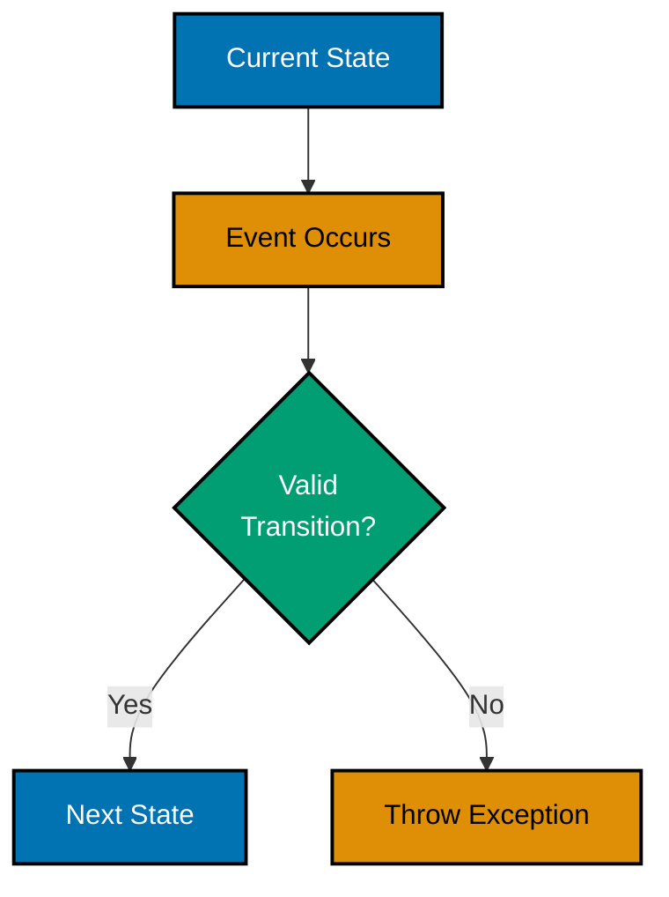
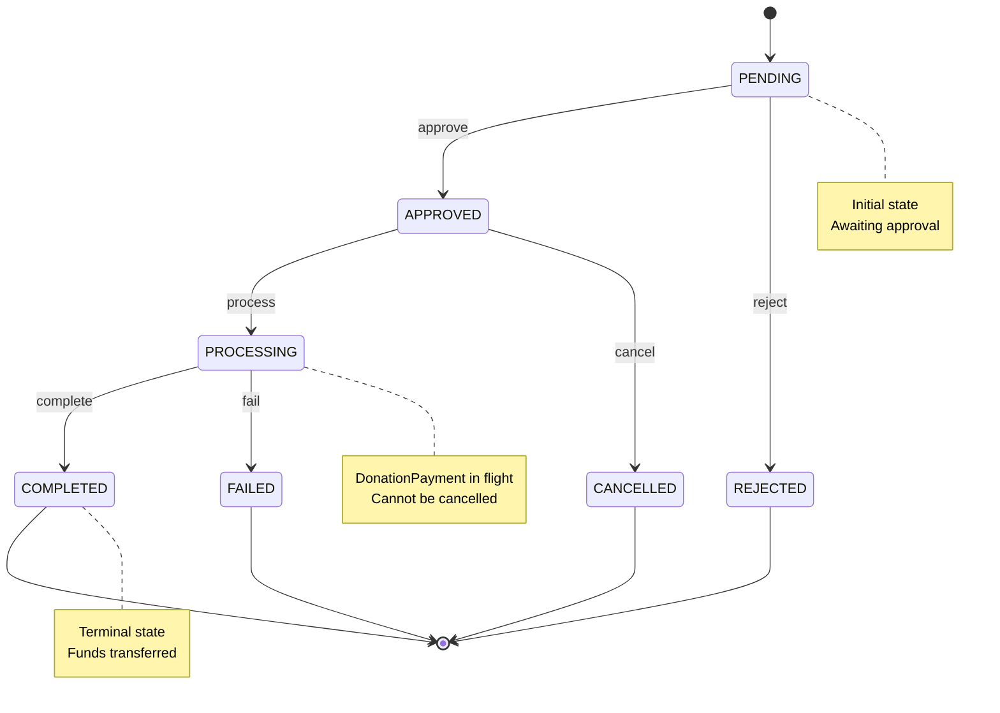
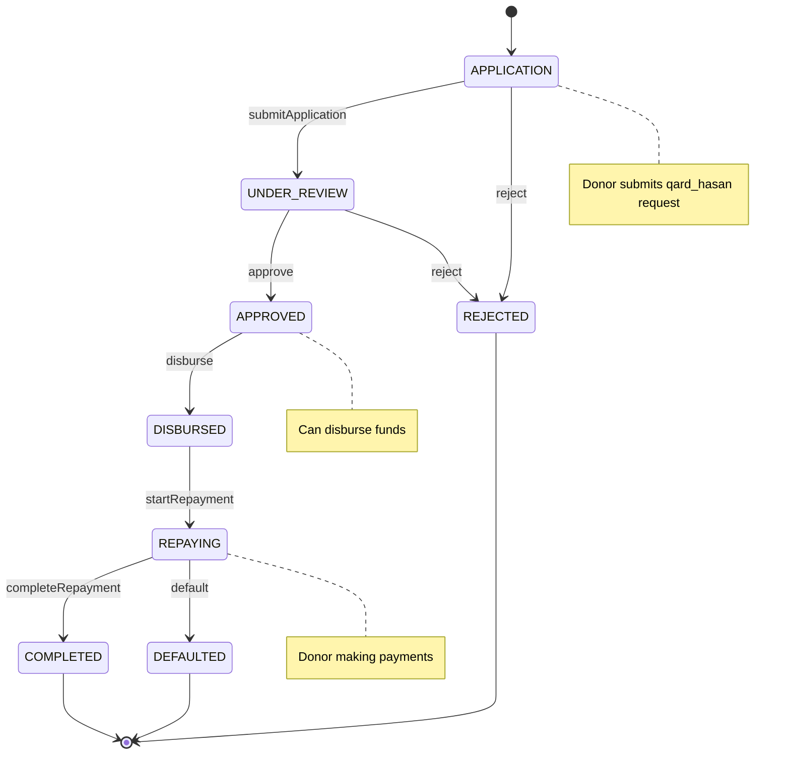
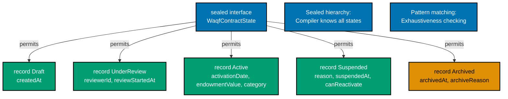
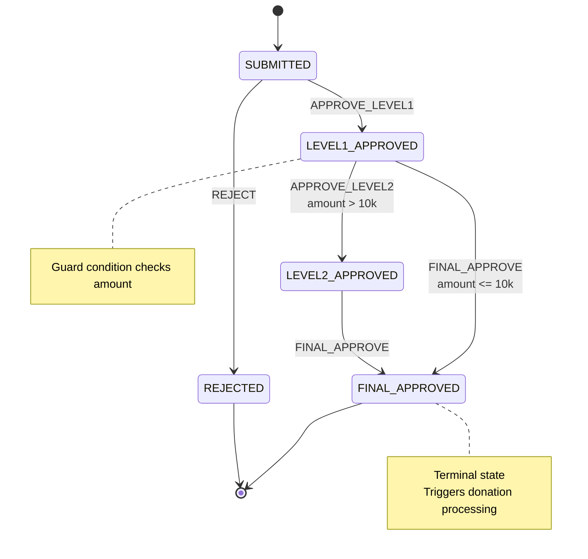
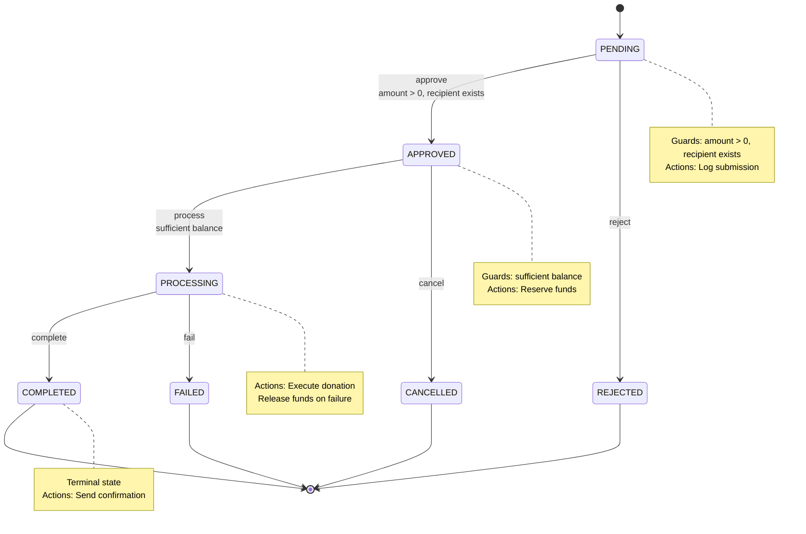
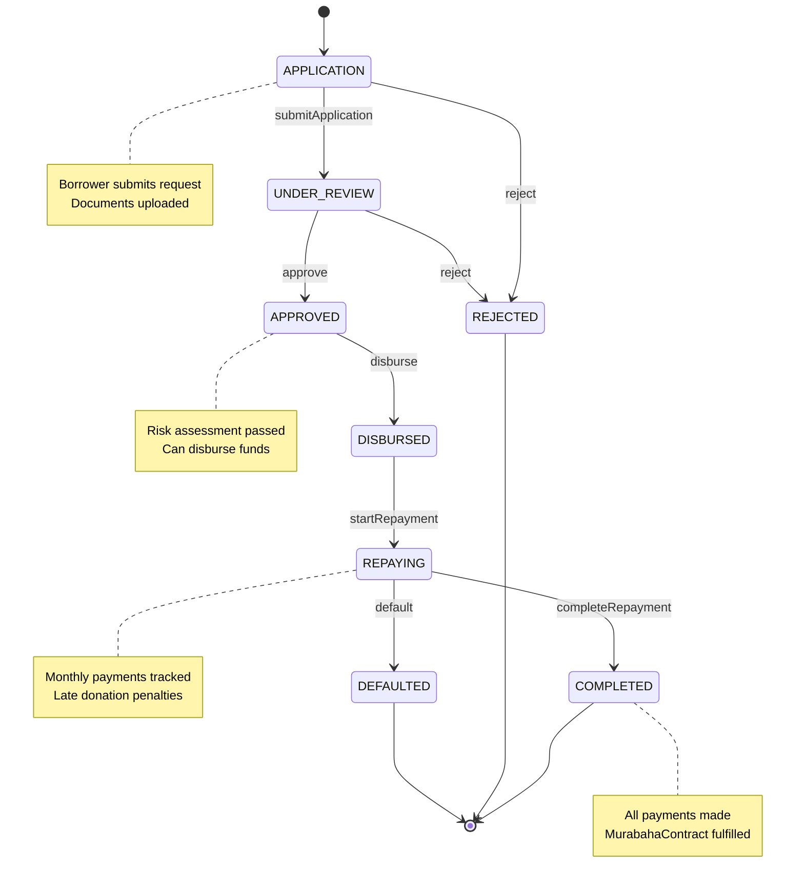
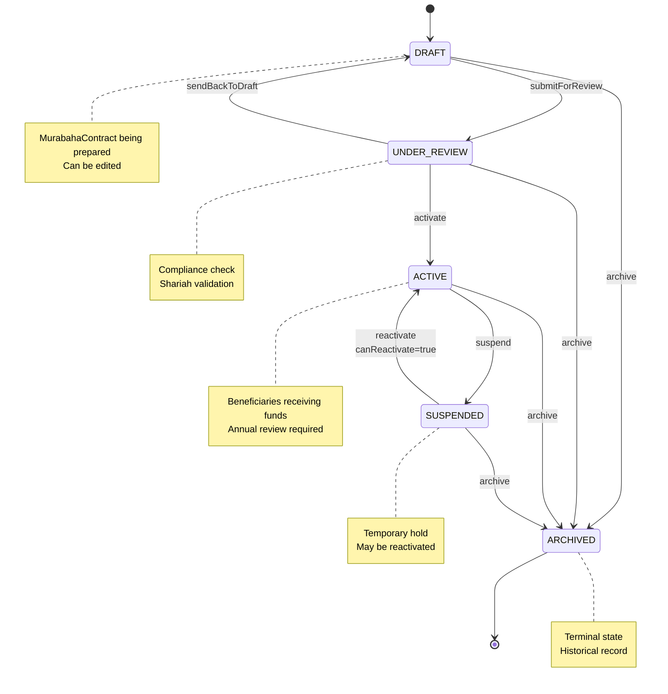

# Java Finite State Machines

**Quick Reference**: [Overview](#overview) | [FSM Fundamentals](#fsm-fundamentals) | [Implementation Pattern 1: Enum-Based FSM](#implementation-pattern-1-enum-based-fsm) | [Implementation Pattern 2: State Design Pattern](#implementation-pattern-2-state-design-pattern) | [Implementation Pattern 3: Sealed Classes + Records](#implementation-pattern-3-sealed-classes--records) | [Spring State Machine Framework](#spring-state-machine-framework) | [Testing State Machines](#testing-state-machines) | [Common FSM Patterns](#common-fsm-patterns) | [Common Pitfalls and Anti-Patterns](#common-pitfalls-and-anti-patterns) | [Business Domain Examples](#business-domain-examples) | [Best Practices Checklist](#best-practices-checklist) | [Sources](#sources) | [Related Documentation](#related-documentation) | [Related Principles](#related-principles)

## Overview

Finite State Machines (FSMs) are fundamental design patterns for managing complex state transitions in enterprise software. In financial systems, FSMs provide critical capabilities for modeling business workflows, ensuring state integrity, and maintaining audit trails required for regulatory compliance.

### Why FSMs Matter in Finance

Financial applications involve complex workflows with strict state transition rules:

- **DonationPayment Processing**: Transactions move through well-defined states (pending → processing → completed/failed)
- **Murabaha QardHasan Lifecycle**: Islamic financing contracts follow specific approval and disbursement workflows
- **Waqf MurabahaContract Management**: Endowment contracts transition through draft → review → active → archived states
- **Shariah Compliance Workflows**: Compliance checks require deterministic state tracking

### Key Benefits

1. **Deterministic Behavior**: Predictable state transitions prevent invalid states
2. **Audit Trail**: Every state change is explicitly modeled and trackable
3. **Type Safety**: Modern Java features (sealed classes, pattern matching) provide compile-time guarantees
4. **Maintainability**: State logic is centralized, not scattered across the codebase
5. **Testability**: State transitions are isolated and easy to unit test

### Target Audience

This guide targets Java developers building enterprise financial systems. It assumes familiarity with Java 17+ features and focuses on practical FSM implementation patterns using modern Java.

## Quick Reference

**Jump to:**

- [FSM Fundamentals](#fsm-fundamentals) - Core concepts and terminology
- [Enum-Based FSM](#implementation-pattern-1-enum-based-fsm) - Simple state machines with enums
- [State Design Pattern](#implementation-pattern-2-state-design-pattern) - OOP approach with state classes
- [Sealed Classes + Records](#implementation-pattern-3-sealed-classes--records) - Modern Java 17+ approach
- [Spring State Machine](#spring-state-machine-framework) - Enterprise framework for complex workflows
- [Testing Strategies](#testing-state-machines) - Comprehensive testing approaches
- [Business Examples](#business-domain-examples) - DonationPayment, QardHasan, Waqf implementations

**Related Documentation:**

- [Java Idioms](./ex-soen-prla-ja__idioms.md) - Records, sealed classes, pattern matching
- [Java Best Practices](./ex-soen-prla-ja__best-practices.md) - Code quality standards
- [Domain-Driven Design](./ex-soen-prla-ja__domain-driven-design.md) - Aggregate state modeling
- [Test-Driven Development](./ex-soen-prla-ja__test-driven-development.md) - Testing FSMs

FSM patterns align with [software engineering principles](../../../../../governance/principles/software-engineering/README.md):

- **State immutability** embodies [Immutability Over Mutability](../../../../../governance/principles/software-engineering/immutability.md)
- **Explicit transitions** implement [Explicit Over Implicit](../../../../../governance/principles/software-engineering/explicit-over-implicit.md)
- **Sealed states** provide [Type Safety](../../../../../governance/principles/software-engineering/explicit-over-implicit.md) at compile time

## FSM Fundamentals

### Core Components

A finite state machine consists of:

1. **States**: Discrete conditions the system can be in
2. **Events**: Triggers that cause state transitions
3. **Transitions**: Rules defining valid state changes
4. **Initial State**: Starting point
5. **Final States**: Terminal states (optional)

### State Machine Properties

**Deterministic FSM**: Given current state and input, next state is always the same

- **Use case**: DonationPayment processing (consistent behavior required)
- **Example**: PENDING + approve() → APPROVED (always)

**Non-Deterministic FSM**: Multiple possible next states for same input

- **Use case**: Manual review workflows (human decision involved)
- **Example**: UNDER_REVIEW + review() → APPROVED or REJECTED (depends on reviewer)

### State Transition Rules



### State Invariants

**Invariants** are conditions that must always be true in a given state:

- **PENDING donation**: Amount > 0, recipient exists
- **APPROVED qard_hasan**: All documents uploaded, risk score within limits
- **ACTIVE murabaha_contract**: Start date ≤ today ≤ end date

FSMs enforce invariants by:

1. **Entry actions**: Validate invariants when entering state
2. **Guard conditions**: Check preconditions before transition
3. **Exit actions**: Clean up resources when leaving state

## Implementation Pattern 1: Enum-Based FSM

### Overview

Enum-based FSMs use Java enums to represent states with transition logic embedded in enum methods. This is the simplest approach, suitable for straightforward workflows.

### Characteristics

- **Lightweight**: Minimal boilerplate
- **Type-safe**: Compile-time state checking
- **Centralized transitions**: Logic in one place
- **Limited complexity**: Not ideal for rich state behavior

### Example: DonationPayment Processing FSM

**Before (No FSM - Scattered Logic)**:

```java
public class DonationPayment {
    private String id;
    private BigDecimal amount;
    private String status;  // Just a string!

    public void approve() {
        // No validation of current state
        this.status = "APPROVED";
    }

    public void process() {
        // Could process from any state (bug!)
        this.status = "COMPLETED";
    }

    public void fail(String reason) {
        this.status = "FAILED";
    }
}

// Service layer - validation logic scattered
@Service
public class PaymentService {
    public void approvePayment(DonationPayment donation) {
        if (!"PENDING".equals(donation.getStatus())) {
            throw new IllegalStateException("Can only approve pending payments");
        }
        donation.approve();
    }

    public void processPayment(DonationPayment donation) {
        if (!"APPROVED".equals(donation.getStatus())) {
            throw new IllegalStateException("Can only process approved payments");
        }
        donation.process();
    }
}
```

**After (Enum-Based FSM)**:

```java
public enum PaymentState {
    PENDING {
        @Override
        public PaymentState approve() {
            return APPROVED;
        }

        @Override
        public PaymentState reject(String reason) {
            return REJECTED;
        }
    },
    APPROVED {
        @Override
        public PaymentState process() {
            return PROCESSING;
        }

        @Override
        public PaymentState cancel(String reason) {
            return CANCELLED;
        }
    },
    PROCESSING {
        @Override
        public PaymentState complete() {
            return COMPLETED;
        }

        @Override
        public PaymentState fail(String reason) {
            return FAILED;
        }
    },
    COMPLETED,  // Terminal state
    FAILED,     // Terminal state
    REJECTED,   // Terminal state
    CANCELLED;  // Terminal state

    // Default implementations throw exception for invalid transitions
    public PaymentState approve() {
        throw new IllegalStateException(
            "Cannot approve donation in " + this + " state"
        );
    }

    public PaymentState reject(String reason) {
        throw new IllegalStateException(
            "Cannot reject donation in " + this + " state"
        );
    }

    public PaymentState process() {
        throw new IllegalStateException(
            "Cannot process donation in " + this + " state"
        );
    }

    public PaymentState complete() {
        throw new IllegalStateException(
            "Cannot complete donation in " + this + " state"
        );
    }

    public PaymentState fail(String reason) {
        throw new IllegalStateException(
            "Cannot fail donation in " + this + " state"
        );
    }

    public PaymentState cancel(String reason) {
        throw new IllegalStateException(
            "Cannot cancel donation in " + this + " state"
        );
    }

    // Query methods
    public boolean isTerminal() {
        return this == COMPLETED || this == FAILED ||
               this == REJECTED || this == CANCELLED;
    }

    public boolean canApprove() {
        return this == PENDING;
    }

    public boolean canProcess() {
        return this == APPROVED;
    }
}

// DonationPayment entity uses enum state
public class DonationPayment {
    private final String id;
    private final BigDecimal amount;
    private final String payeeId;
    private PaymentState state;
    private String failureReason;
    private LocalDateTime lastTransitionAt;

    public DonationPayment(String id, BigDecimal amount, String payeeId) {
        this.id = id;
        this.amount = amount;
        this.payeeId = payeeId;
        this.state = PaymentState.PENDING;  // Initial state
        this.lastTransitionAt = LocalDateTime.now();
    }

    // Transition methods delegate to state enum
    public void approve() {
        this.state = this.state.approve();
        this.lastTransitionAt = LocalDateTime.now();
    }

    public void reject(String reason) {
        this.state = this.state.reject(reason);
        this.failureReason = reason;
        this.lastTransitionAt = LocalDateTime.now();
    }

    public void process() {
        this.state = this.state.process();
        this.lastTransitionAt = LocalDateTime.now();
    }

    public void complete() {
        this.state = this.state.complete();
        this.lastTransitionAt = LocalDateTime.now();
    }

    public void fail(String reason) {
        this.state = this.state.fail(reason);
        this.failureReason = reason;
        this.lastTransitionAt = LocalDateTime.now();
    }

    // Getters
    public String getId() { return id; }
    public BigDecimal getAmount() { return amount; }
    public String getPayeeId() { return payeeId; }
    public PaymentState getState() { return state; }
    public Optional<String> getFailureReason() {
        return Optional.ofNullable(failureReason);
    }
}
```

### DonationPayment State Diagram



### Benefits of Enum-Based FSM

1. **Type safety**: Compiler prevents invalid states
2. **Centralized logic**: All transitions in one enum
3. **Easy to test**: Enum methods are pure functions
4. **No null states**: Enum cannot be null (use Optional if needed)
5. **Clear intent**: State transitions are explicit method calls

### Limitations

- **Limited behavior**: Cannot attach rich state-specific logic
- **No state data**: States cannot carry additional information
- **Monolithic enum**: All transitions in one file (can become large)

## Implementation Pattern 2: State Design Pattern

### Overview

The State Design Pattern uses OOP principles to represent states as separate classes. Each state class implements a common interface and encapsulates state-specific behavior.

### Characteristics

- **Rich behavior**: Each state class can have complex logic
- **Open/Closed Principle**: Easy to add new states without modifying existing ones
- **Testable**: State classes can be unit tested independently
- **More boilerplate**: Requires interface + multiple classes

### Example: Murabaha QardHasan Lifecycle

Murabaha is an Islamic financing structure where the bank purchases an asset and sells it to the donor at a markup, allowing donation over time.

```java
// State interface
public interface LoanState {
    String getStateName();

    // Transition methods
    LoanState submitApplication();
    LoanState approve(String approverId);
    LoanState reject(String reason);
    LoanState disburse(BigDecimal amount);
    LoanState startRepayment();
    LoanState completeRepayment();
    LoanState default(String reason);

    // Query methods
    boolean canDisburse();
    boolean canRepay();
    boolean isTerminal();
}

// Abstract base class with default implementations
public abstract class AbstractLoanState implements LoanState {
    @Override
    public LoanState submitApplication() {
        throw new IllegalStateException(
            "Cannot submit application from " + getStateName()
        );
    }

    @Override
    public LoanState approve(String approverId) {
        throw new IllegalStateException(
            "Cannot approve from " + getStateName()
        );
    }

    @Override
    public LoanState reject(String reason) {
        throw new IllegalStateException(
            "Cannot reject from " + getStateName()
        );
    }

    @Override
    public LoanState disburse(BigDecimal amount) {
        throw new IllegalStateException(
            "Cannot disburse from " + getStateName()
        );
    }

    @Override
    public LoanState startRepayment() {
        throw new IllegalStateException(
            "Cannot start repayment from " + getStateName()
        );
    }

    @Override
    public LoanState completeRepayment() {
        throw new IllegalStateException(
            "Cannot complete repayment from " + getStateName()
        );
    }

    @Override
    public LoanState defaultLoan(String reason) {
        throw new IllegalStateException(
            "Cannot default from " + getStateName()
        );
    }

    @Override
    public boolean canDisburse() { return false; }

    @Override
    public boolean canRepay() { return false; }

    @Override
    public boolean isTerminal() { return false; }
}

// Concrete state: Application
public class ApplicationState extends AbstractLoanState {
    @Override
    public String getStateName() { return "APPLICATION"; }

    @Override
    public LoanState submitApplication() {
        return new UnderReviewState();
    }

    @Override
    public LoanState reject(String reason) {
        return new RejectedState(reason);
    }
}

// Concrete state: Under Review
public class UnderReviewState extends AbstractLoanState {
    @Override
    public String getStateName() { return "UNDER_REVIEW"; }

    @Override
    public LoanState approve(String approverId) {
        return new ApprovedState(approverId);
    }

    @Override
    public LoanState reject(String reason) {
        return new RejectedState(reason);
    }
}

// Concrete state: Approved
public class ApprovedState extends AbstractLoanState {
    private final String approverId;

    public ApprovedState(String approverId) {
        this.approverId = approverId;
    }

    @Override
    public String getStateName() { return "APPROVED"; }

    @Override
    public LoanState disburse(BigDecimal amount) {
        return new DisbursedState(amount);
    }

    @Override
    public boolean canDisburse() { return true; }

    public String getApproverId() { return approverId; }
}

// Concrete state: Disbursed
public class DisbursedState extends AbstractLoanState {
    private final BigDecimal disbursedAmount;

    public DisbursedState(BigDecimal disbursedAmount) {
        this.disbursedAmount = disbursedAmount;
    }

    @Override
    public String getStateName() { return "DISBURSED"; }

    @Override
    public LoanState startRepayment() {
        return new RepayingState();
    }

    public BigDecimal getDisbursedAmount() { return disbursedAmount; }
}

// Concrete state: Repaying
public class RepayingState extends AbstractLoanState {
    @Override
    public String getStateName() { return "REPAYING"; }

    @Override
    public LoanState completeRepayment() {
        return new CompletedState();
    }

    @Override
    public LoanState defaultLoan(String reason) {
        return new DefaultedState(reason);
    }

    @Override
    public boolean canRepay() { return true; }
}

// Terminal state: Completed
public class CompletedState extends AbstractLoanState {
    @Override
    public String getStateName() { return "COMPLETED"; }

    @Override
    public boolean isTerminal() { return true; }
}

// Terminal state: Rejected
public class RejectedState extends AbstractLoanState {
    private final String reason;

    public RejectedState(String reason) {
        this.reason = reason;
    }

    @Override
    public String getStateName() { return "REJECTED"; }

    @Override
    public boolean isTerminal() { return true; }

    public String getReason() { return reason; }
}

// Terminal state: Defaulted
public class DefaultedState extends AbstractLoanState {
    private final String reason;

    public DefaultedState(String reason) {
        this.reason = reason;
    }

    @Override
    public String getStateName() { return "DEFAULTED"; }

    @Override
    public boolean isTerminal() { return true; }

    public String getReason() { return reason; }
}

// QardHasan entity uses state pattern
public class MurabahaLoan {
    private final String id;
    private final String borrowerId;
    private final BigDecimal principal;
    private final BigDecimal markup;
    private LoanState state;
    private LocalDateTime lastTransitionAt;

    public MurabahaLoan(String id, String borrowerId,
                        BigDecimal principal, BigDecimal markup) {
        this.id = id;
        this.borrowerId = borrowerId;
        this.principal = principal;
        this.markup = markup;
        this.state = new ApplicationState();  // Initial state
        this.lastTransitionAt = LocalDateTime.now();
    }

    // Transition methods
    public void submitApplication() {
        this.state = this.state.submitApplication();
        this.lastTransitionAt = LocalDateTime.now();
    }

    public void approve(String approverId) {
        this.state = this.state.approve(approverId);
        this.lastTransitionAt = LocalDateTime.now();
    }

    public void reject(String reason) {
        this.state = this.state.reject(reason);
        this.lastTransitionAt = LocalDateTime.now();
    }

    public void disburse(BigDecimal amount) {
        this.state = this.state.disburse(amount);
        this.lastTransitionAt = LocalDateTime.now();
    }

    public void startRepayment() {
        this.state = this.state.startRepayment();
        this.lastTransitionAt = LocalDateTime.now();
    }

    public void completeRepayment() {
        this.state = this.state.completeRepayment();
        this.lastTransitionAt = LocalDateTime.now();
    }

    public void defaultLoan(String reason) {
        this.state = this.state.defaultLoan(reason);
        this.lastTransitionAt = LocalDateTime.now();
    }

    // Getters
    public String getId() { return id; }
    public String getBorrowerId() { return borrowerId; }
    public BigDecimal getPrincipal() { return principal; }
    public BigDecimal getMarkup() { return markup; }
    public BigDecimal getTotalAmount() { return principal.add(markup); }
    public LoanState getState() { return state; }
    public String getStateName() { return state.getStateName(); }
}
```

### QardHasan Lifecycle Diagram



### Benefits of State Pattern

1. **Rich state behavior**: Each state class can have complex logic
2. **Open/Closed**: Add new states without modifying existing ones
3. **Single Responsibility**: Each state handles its own transitions
4. **Testability**: State classes tested independently
5. **State data**: States can carry additional information

### Limitations

- **More classes**: One class per state (verbose)
- **Boilerplate**: Interface + abstract base + concrete classes
- **No compile-time exhaustiveness**: Pattern matching not automatic

## Implementation Pattern 3: Sealed Classes + Records

### Overview

Modern Java (17+) provides sealed classes and pattern matching, enabling type-safe, exhaustive state machines with minimal boilerplate. This is the recommended approach for new code.

### Characteristics

- **Compile-time exhaustiveness**: Switch expressions verified by compiler
- **Immutable states**: Records for state data
- **Type-safe**: Sealed hierarchy prevents unexpected states
- **Pattern matching**: Concise state-based logic

### Example: Waqf MurabahaContract State Machine

Waqf is an Islamic endowment where assets are donated for perpetual charitable purposes.

```java
// Sealed interface for murabaha_contract states
public sealed interface WaqfContractState
    permits Draft, UnderReview, Active, Suspended, Archived {

    String getStateName();
    boolean isTerminal();
}

// State: Draft (initial state)
public record Draft(
    LocalDateTime createdAt
) implements WaqfContractState {
    @Override
    public String getStateName() { return "DRAFT"; }

    @Override
    public boolean isTerminal() { return false; }
}

// State: Under Review
public record UnderReview(
    String reviewerId,
    LocalDateTime reviewStartedAt
) implements WaqfContractState {
    @Override
    public String getStateName() { return "UNDER_REVIEW"; }

    @Override
    public boolean isTerminal() { return false; }
}

// State: Active
public record Active(
    LocalDate activationDate,
    BigDecimal endowmentValue,
    String beneficiaryCategory
) implements WaqfContractState {
    public Active {
        if (endowmentValue.compareTo(BigDecimal.ZERO) <= 0) {
            throw new IllegalArgumentException("Endowment value must be positive");
        }
    }

    @Override
    public String getStateName() { return "ACTIVE"; }

    @Override
    public boolean isTerminal() { return false; }
}

// State: Suspended
public record Suspended(
    String reason,
    LocalDateTime suspendedAt,
    boolean canReactivate
) implements WaqfContractState {
    @Override
    public String getStateName() { return "SUSPENDED"; }

    @Override
    public boolean isTerminal() { return false; }
}

// State: Archived (terminal)
public record Archived(
    LocalDateTime archivedAt,
    String archiveReason
) implements WaqfContractState {
    @Override
    public String getStateName() { return "ARCHIVED"; }

    @Override
    public boolean isTerminal() { return true; }
}

// Waqf murabaha_contract entity
public class WaqfContract {
    private final String id;
    private final String donorId;
    private final String assetDescription;
    private WaqfContractState state;
    private LocalDateTime lastTransitionAt;

    public WaqfContract(String id, String donorId, String assetDescription) {
        this.id = id;
        this.donorId = donorId;
        this.assetDescription = assetDescription;
        this.state = new Draft(LocalDateTime.now());
        this.lastTransitionAt = LocalDateTime.now();
    }

    // Transition: Draft → UnderReview
    public void submitForReview(String reviewerId) {
        if (!(state instanceof Draft)) {
            throw new IllegalStateException(
                "Can only submit draft contracts for review"
            );
        }

        this.state = new UnderReview(reviewerId, LocalDateTime.now());
        this.lastTransitionAt = LocalDateTime.now();
    }

    // Transition: UnderReview → Active
    public void activate(BigDecimal endowmentValue, String beneficiaryCategory) {
        if (!(state instanceof UnderReview)) {
            throw new IllegalStateException(
                "Can only activate contracts under review"
            );
        }

        this.state = new Active(
            LocalDate.now(),
            endowmentValue,
            beneficiaryCategory
        );
        this.lastTransitionAt = LocalDateTime.now();
    }

    // Transition: UnderReview → Draft (send back for revisions)
    public void sendBackToDraft() {
        if (!(state instanceof UnderReview)) {
            throw new IllegalStateException(
                "Can only send back contracts under review"
            );
        }

        this.state = new Draft(LocalDateTime.now());
        this.lastTransitionAt = LocalDateTime.now();
    }

    // Transition: Active → Suspended
    public void suspend(String reason, boolean canReactivate) {
        if (!(state instanceof Active)) {
            throw new IllegalStateException(
                "Can only suspend active contracts"
            );
        }

        this.state = new Suspended(
            reason,
            LocalDateTime.now(),
            canReactivate
        );
        this.lastTransitionAt = LocalDateTime.now();
    }

    // Transition: Suspended → Active (if allowed)
    public void reactivate() {
        if (!(state instanceof Suspended suspended)) {
            throw new IllegalStateException(
                "Can only reactivate suspended contracts"
            );
        }

        if (!suspended.canReactivate()) {
            throw new IllegalStateException(
                "This murabaha_contract cannot be reactivated: " + suspended.reason()
            );
        }

        // Restore previous Active state data (would need to store it)
        throw new UnsupportedOperationException(
            "Reactivation requires storing previous Active state"
        );
    }

    // Transition: Any → Archived
    public void archive(String reason) {
        if (state.isTerminal()) {
            throw new IllegalStateException(
                "Cannot archive already terminal state"
            );
        }

        this.state = new Archived(LocalDateTime.now(), reason);
        this.lastTransitionAt = LocalDateTime.now();
    }

    // Pattern matching for state-specific behavior
    public String getStateDescription() {
        return switch (state) {
            case Draft(var createdAt) ->
                "MurabahaContract draft created at " + createdAt;

            case UnderReview(var reviewerId, var startedAt) ->
                "Under review by %s since %s"
                    .formatted(reviewerId, startedAt);

            case Active(var activationDate, var value, var category) ->
                "Active endowment worth %s for %s (activated %s)"
                    .formatted(value, category, activationDate);

            case Suspended(var reason, var suspendedAt, var canReactivate) ->
                "Suspended: %s (can reactivate: %s)"
                    .formatted(reason, canReactivate);

            case Archived(var archivedAt, var reason) ->
                "Archived at %s: %s".formatted(archivedAt, reason);
        };
    }

    // Pattern matching with guards
    public boolean requiresAction() {
        return switch (state) {
            case Draft d -> true;  // Always needs submission
            case UnderReview r -> true;  // Needs approval/rejection
            case Active a when isPastReviewDate(a) -> true;
            case Active a -> false;
            case Suspended s when s.canReactivate() -> true;
            case Suspended s -> false;
            case Archived a -> false;
        };
    }

    private boolean isPastReviewDate(Active active) {
        // Check if annual review is due
        LocalDate nextReview = active.activationDate().plusYears(1);
        return LocalDate.now().isAfter(nextReview);
    }

    // Getters
    public String getId() { return id; }
    public String getDonorId() { return donorId; }
    public String getAssetDescription() { return assetDescription; }
    public WaqfContractState getState() { return state; }
    public String getStateName() { return state.getStateName(); }
}
```

### Waqf MurabahaContract State Hierarchy



### Benefits of Sealed Classes + Records

1. **Compile-time exhaustiveness**: Switch expressions must handle all states
2. **Immutable state data**: Records prevent accidental mutation
3. **Type-safe**: No runtime type errors
4. **Minimal boilerplate**: Records auto-generate equals(), hashCode(), toString()
5. **Pattern matching**: Concise, readable state-based logic

### Limitations

- **Java 17+ only**: Requires modern Java
- **Learning curve**: Developers need to understand sealed classes and pattern matching
- **No default behavior**: Unlike enums, no automatic fallback methods

## Spring State Machine Framework

### Overview

Spring State Machine is an enterprise-grade framework for building complex, event-driven state machines with persistence, transactions, and distributed support.

### When to Use Spring State Machine

- **Complex workflows**: Multi-step approval processes with parallel states
- **Persistence required**: Save/restore state machine state to database
- **Distributed systems**: State machines across multiple services
- **Event-driven**: React to domain events and trigger transitions
- **Enterprise features**: DonationTransaction support, security, monitoring

### Installation

**Maven**:

```xml
<dependencies>
    <dependency>
        <groupId>org.springframework.statemachine</groupId>
        <artifactId>spring-statemachine-core</artifactId>
        <version>3.2.0</version>
    </dependency>
    <dependency>
        <groupId>org.springframework.boot</groupId>
        <artifactId>spring-boot-starter</artifactId>
    </dependency>
</dependencies>
```

### Example: DonationPayment Approval Workflow

```java
// Define states and events
public enum PaymentStates {
    SUBMITTED,
    LEVEL1_APPROVED,
    LEVEL2_APPROVED,
    FINAL_APPROVED,
    REJECTED
}

public enum PaymentEvents {
    SUBMIT,
    APPROVE_LEVEL1,
    APPROVE_LEVEL2,
    FINAL_APPROVE,
    REJECT
}

// State machine configuration
@Configuration
@EnableStateMachine
public class PaymentStateMachineConfig
    extends StateMachineConfigurerAdapter<PaymentStates, PaymentEvents> {

    @Override
    public void configure(StateMachineStateConfigurer<PaymentStates, PaymentEvents> states)
            throws Exception {
        states
            .withStates()
                .initial(PaymentStates.SUBMITTED)
                .states(EnumSet.allOf(PaymentStates.class))
                .end(PaymentStates.FINAL_APPROVED)
                .end(PaymentStates.REJECTED);
    }

    @Override
    public void configure(
            StateMachineTransitionConfigurer<PaymentStates, PaymentEvents> transitions)
            throws Exception {
        transitions
            .withExternal()
                .source(PaymentStates.SUBMITTED)
                .target(PaymentStates.LEVEL1_APPROVED)
                .event(PaymentEvents.APPROVE_LEVEL1)
                .action(level1ApprovalAction())
            .and()
            .withExternal()
                .source(PaymentStates.SUBMITTED)
                .target(PaymentStates.REJECTED)
                .event(PaymentEvents.REJECT)
                .action(rejectionAction())
            .and()
            .withExternal()
                .source(PaymentStates.LEVEL1_APPROVED)
                .target(PaymentStates.LEVEL2_APPROVED)
                .event(PaymentEvents.APPROVE_LEVEL2)
                .action(level2ApprovalAction())
                .guard(amountGuard())  // Guard condition
            .and()
            .withExternal()
                .source(PaymentStates.LEVEL2_APPROVED)
                .target(PaymentStates.FINAL_APPROVED)
                .event(PaymentEvents.FINAL_APPROVE)
                .action(finalApprovalAction());
    }

    // Entry/exit actions
    @Bean
    public Action<PaymentStates, PaymentEvents> level1ApprovalAction() {
        return context -> {
            DonationPayment donation = context.getExtendedState()
                .get("donation", DonationPayment.class);
            logger.info("Level 1 approval for donation {}", donation.getId());
            // Audit log, send notification, etc.
        };
    }

    @Bean
    public Action<PaymentStates, PaymentEvents> level2ApprovalAction() {
        return context -> {
            DonationPayment donation = context.getExtendedState()
                .get("donation", DonationPayment.class);
            logger.info("Level 2 approval for donation {}", donation.getId());
        };
    }

    @Bean
    public Action<PaymentStates, PaymentEvents> finalApprovalAction() {
        return context -> {
            DonationPayment donation = context.getExtendedState()
                .get("donation", DonationPayment.class);
            logger.info("Final approval for donation {}", donation.getId());
            paymentService.processPayment(donation);
        };
    }

    @Bean
    public Action<PaymentStates, PaymentEvents> rejectionAction() {
        return context -> {
            DonationPayment donation = context.getExtendedState()
                .get("donation", DonationPayment.class);
            logger.info("DonationPayment {} rejected", donation.getId());
        };
    }

    // Guard condition: amounts > $10,000 require Level 2 approval
    @Bean
    public Guard<PaymentStates, PaymentEvents> amountGuard() {
        return context -> {
            DonationPayment donation = context.getExtendedState()
                .get("donation", DonationPayment.class);
            return donation.getAmount().compareTo(new BigDecimal("10000")) > 0;
        };
    }
}

// Service using state machine
@Service
public class PaymentWorkflowService {
    private final StateMachine<PaymentStates, PaymentEvents> stateMachine;

    @Autowired
    public PaymentWorkflowService(
            StateMachine<PaymentStates, PaymentEvents> stateMachine) {
        this.stateMachine = stateMachine;
    }

    public void approveLevel1(DonationPayment donation) {
        stateMachine.getExtendedState().getVariables().put("donation", donation);
        stateMachine.sendEvent(PaymentEvents.APPROVE_LEVEL1);
    }

    public void approveLevel2(DonationPayment donation) {
        stateMachine.getExtendedState().getVariables().put("donation", donation);
        stateMachine.sendEvent(PaymentEvents.APPROVE_LEVEL2);
    }

    public void finalApprove(DonationPayment donation) {
        stateMachine.getExtendedState().getVariables().put("donation", donation);
        stateMachine.sendEvent(PaymentEvents.FINAL_APPROVE);
    }

    public void reject(DonationPayment donation) {
        stateMachine.getExtendedState().getVariables().put("donation", donation);
        stateMachine.sendEvent(PaymentEvents.REJECT);
    }
}
```

### Spring State Machine Diagram



### Spring State Machine Features

1. **Guards**: Conditional transitions based on business rules
2. **Actions**: Execute code on state entry/exit or transition
3. **Extended State**: Store additional data (variables) alongside state
4. **Persistence**: Save/restore state machine to database
5. **Listeners**: React to state changes across the application
6. **Hierarchical States**: Nested state machines
7. **Parallel States**: Concurrent state execution

## Testing State Machines

### Test Strategy

1. **State transition coverage**: Test every valid transition
2. **Invalid transition coverage**: Test every invalid transition throws exception
3. **Guard conditions**: Test conditional transitions
4. **Entry/exit actions**: Verify side effects execute
5. **State invariants**: Verify state data constraints
6. **Terminal states**: Ensure terminal states prevent further transitions

### Example: Testing Enum-Based FSM

```java
@Test
void testPaymentStateTransitions() {
    // PENDING → APPROVED
    PaymentState state = PaymentState.PENDING;
    state = state.approve();
    assertThat(state).isEqualTo(PaymentState.APPROVED);

    // APPROVED → PROCESSING
    state = state.process();
    assertThat(state).isEqualTo(PaymentState.PROCESSING);

    // PROCESSING → COMPLETED
    state = state.complete();
    assertThat(state).isEqualTo(PaymentState.COMPLETED);
    assertThat(state.isTerminal()).isTrue();
}

@Test
void testInvalidTransitionThrowsException() {
    PaymentState state = PaymentState.PENDING;

    // Cannot process from PENDING (must approve first)
    assertThrows(IllegalStateException.class, () -> {
        state.process();
    });
}

@Test
void testTerminalStateRejectsAllTransitions() {
    PaymentState state = PaymentState.COMPLETED;

    assertThrows(IllegalStateException.class, () -> state.approve());
    assertThrows(IllegalStateException.class, () -> state.process());
    assertThrows(IllegalStateException.class, () -> state.complete());
}
```

### Example: Testing State Pattern

```java
@Test
void testLoanApplicationToApproval() {
    MurabahaLoan qard_hasan = new MurabahaLoan(
        "LOAN-001",
        "BORROWER-123",
        new BigDecimal("100000"),
        new BigDecimal("5000")
    );

    // Initial state: APPLICATION
    assertThat(qard_hasan.getStateName()).isEqualTo("APPLICATION");

    // Submit application
    qard_hasan.submitApplication();
    assertThat(qard_hasan.getStateName()).isEqualTo("UNDER_REVIEW");

    // Approve
    qard_hasan.approve("APPROVER-456");
    assertThat(qard_hasan.getStateName()).isEqualTo("APPROVED");
    assertThat(qard_hasan.getState().canDisburse()).isTrue();
}

@Test
void testLoanRejection() {
    MurabahaLoan qard_hasan = createTestLoan();

    qard_hasan.submitApplication();
    qard_hasan.reject("Insufficient collateral");

    assertThat(qard_hasan.getStateName()).isEqualTo("REJECTED");
    assertThat(qard_hasan.getState().isTerminal()).isTrue();
}

@Test
void testCannotDisburseBeforeApproval() {
    MurabahaLoan qard_hasan = createTestLoan();

    qard_hasan.submitApplication();  // State: UNDER_REVIEW

    // Cannot disburse from UNDER_REVIEW
    assertThrows(IllegalStateException.class, () -> {
        qard_hasan.disburse(new BigDecimal("100000"));
    });
}
```

### Example: Testing Sealed Classes FSM

```java
@Test
void testWaqfContractWorkflow() {
    WaqfContract murabaha_contract = new WaqfContract(
        "WAQF-001",
        "DONOR-789",
        "Commercial property at 123 Main St"
    );

    // Initial state: Draft
    assertThat(murabaha_contract.getState()).isInstanceOf(Draft.class);

    // Submit for review
    murabaha_contract.submitForReview("REVIEWER-001");
    assertThat(murabaha_contract.getState()).isInstanceOf(UnderReview.class);

    // Activate
    murabaha_contract.activate(
        new BigDecimal("500000"),
        "Education"
    );
    assertThat(murabaha_contract.getState()).isInstanceOf(Active.class);

    // Verify state data
    Active activeState = (Active) murabaha_contract.getState();
    assertThat(activeState.endowmentValue())
        .isEqualByComparingTo(new BigDecimal("500000"));
    assertThat(activeState.beneficiaryCategory()).isEqualTo("Education");
}

@Test
void testPatternMatchingBehavior() {
    WaqfContract murabaha_contract = createTestContract();

    murabaha_contract.submitForReview("REVIEWER-001");

    String description = murabaha_contract.getStateDescription();
    assertThat(description).contains("Under review by REVIEWER-001");
}

@Test
void testSuspensionAndReactivation() {
    WaqfContract murabaha_contract = createActiveContract();

    // Suspend
    murabaha_contract.suspend("Annual compliance check", true);
    assertThat(murabaha_contract.getState()).isInstanceOf(Suspended.class);

    Suspended suspended = (Suspended) murabaha_contract.getState();
    assertThat(suspended.canReactivate()).isTrue();
}
```

### Test Coverage Example

Real-world state machine test suite (71 tests):

```java
@Nested
@DisplayName("DonationPayment State Transitions")
class PaymentStateTransitionsTest {
    // Test all valid transitions (8 tests)
    @Test void testPendingToApproved() { /* ... */ }
    @Test void testApprovedToProcessing() { /* ... */ }
    @Test void testProcessingToCompleted() { /* ... */ }
    @Test void testProcessingToFailed() { /* ... */ }
    @Test void testPendingToRejected() { /* ... */ }
    @Test void testApprovedToCancelled() { /* ... */ }

    // Test all invalid transitions (15 tests)
    @Test void testCannotApproveFromCompleted() { /* ... */ }
    @Test void testCannotProcessFromPending() { /* ... */ }
    // ... 13 more invalid transition tests
}

@Nested
@DisplayName("State Invariants")
class StateInvariantsTest {
    @Test void testTerminalStatesRejectAllTransitions() { /* ... */ }
    @Test void testPaymentAmountImmutable() { /* ... */ }
    @Test void testStateTransitionTimestamp() { /* ... */ }
}

@Nested
@DisplayName("Guard Conditions")
class GuardConditionsTest {
    @Test void testAmountGuardAllowsLevel2Approval() { /* ... */ }
    @Test void testAmountGuardSkipsLevel2ForSmallPayments() { /* ... */ }
}

@Nested
@DisplayName("Entry/Exit Actions")
class ActionsTest {
    @Test void testApprovalActionSendsNotification() { /* ... */ }
    @Test void testCompletionActionTriggersPayment() { /* ... */ }
}

@Nested
@DisplayName("Pattern Matching")
class PatternMatchingTest {
    @Test void testExhaustiveSwitch() { /* ... */ }
    @Test void testGuardedPatternMatching() { /* ... */ }
}

@Nested
@DisplayName("Edge Cases")
class EdgeCasesTest {
    @Test void testMultipleTransitionsInSequence() { /* ... */ }
    @Test void testConcurrentStateAccess() { /* ... */ }
}
```

## Common FSM Patterns

### Entry/Exit Actions

Execute code when entering or leaving a state:

```java
public enum PaymentState {
    PENDING {
        @Override
        public void onEntry(DonationPayment donation) {
            logger.info("DonationPayment {} entered PENDING state", donation.getId());
            notificationService.notifySubmitter(donation);
        }

        @Override
        public void onExit(DonationPayment donation) {
            logger.info("DonationPayment {} exiting PENDING state", donation.getId());
        }
    },
    APPROVED {
        @Override
        public void onEntry(DonationPayment donation) {
            auditService.logApproval(donation);
            emailService.sendApprovalEmail(donation);
        }
    };

    // Default no-op implementations
    public void onEntry(DonationPayment donation) {}
    public void onExit(DonationPayment donation) {}
}
```

### Guard Conditions

Conditional transitions based on business rules:

```java
public class MurabahaLoan {
    public void approve(String approverId) {
        if (!(state instanceof UnderReview)) {
            throw new IllegalStateException("Can only approve under review");
        }

        // Guard: Check risk score
        if (getRiskScore() > 70) {
            throw new BusinessRuleException(
                "Risk score too high for automatic approval"
            );
        }

        // Guard: Check document completeness
        if (!areAllDocumentsUploaded()) {
            throw new BusinessRuleException(
                "All documents must be uploaded before approval"
            );
        }

        this.state = new ApprovedState(approverId);
    }

    private int getRiskScore() {
        // Calculate risk score based on borrower profile
        return 0;
    }

    private boolean areAllDocumentsUploaded() {
        // Check document repository
        return true;
    }
}
```

### Hierarchical State Machines

States within states (substates):

```java
public enum LoanState {
    // Top-level state: ACTIVE
    ACTIVE {
        @Override
        public ActiveSubstate getSubstate() {
            return ActiveSubstate.NORMAL_PAYMENTS;
        }
    };

    public ActiveSubstate getSubstate() {
        return null;  // Non-active states have no substate
    }
}

public enum ActiveSubstate {
    NORMAL_PAYMENTS,
    GRACE_PERIOD,
    LATE_PAYMENTS
}

// Usage
if (qard_hasan.getState() == LoanState.ACTIVE) {
    ActiveSubstate substate = qard_hasan.getActiveSubstate();
    if (substate == ActiveSubstate.LATE_PAYMENTS) {
        sendLateFeeNotification(qard_hasan);
    }
}
```

### Concurrent States

Multiple independent state machines running in parallel:

```java
public class WaqfContract {
    private ContractState contractState;
    private ComplianceState complianceState;
    private AuditState auditState;

    // All three state machines operate independently
    public void activate() {
        this.contractState = ContractState.ACTIVE;
        this.complianceState = ComplianceState.INITIAL_CHECK;
        this.auditState = AuditState.SCHEDULED;
    }

    // Compliance state machine operates independently
    public void completeComplianceCheck() {
        this.complianceState = switch (this.complianceState) {
            case INITIAL_CHECK -> ComplianceState.PASSED;
            case ANNUAL_REVIEW -> ComplianceState.PASSED;
            default -> throw new IllegalStateException("Invalid compliance state");
        };
    }

    // Audit state machine operates independently
    public void scheduleAudit() {
        this.auditState = switch (this.auditState) {
            case SCHEDULED -> AuditState.IN_PROGRESS;
            case IN_PROGRESS -> AuditState.COMPLETED;
            default -> throw new IllegalStateException("Invalid audit state");
        };
    }
}
```

## Common Pitfalls and Anti-Patterns

### Pitfall 1: State Explosion

**Problem**: Too many states make FSM unmanageable.

**Example** (FAIL: BAD):

```java
public enum PaymentState {
    PENDING_APPROVAL_LEVEL1,
    PENDING_APPROVAL_LEVEL2,
    PENDING_APPROVAL_LEVEL3,
    APPROVED_LEVEL1,
    APPROVED_LEVEL2,
    APPROVED_LEVEL3,
    PROCESSING_BANK_TRANSFER,
    PROCESSING_CARD_PAYMENT,
    PROCESSING_CASH,
    COMPLETED_BANK_TRANSFER,
    COMPLETED_CARD_PAYMENT,
    COMPLETED_CASH
    // ... 50 more states
}
```

**Solution** (PASS: GOOD):

Use state composition (main state + context data):

```java
public record PaymentState(
    Status status,
    ApprovalLevel approvalLevel,
    PaymentMethod paymentMethod
) {
    public enum Status { PENDING, APPROVED, PROCESSING, COMPLETED }
    public enum ApprovalLevel { LEVEL1, LEVEL2, LEVEL3 }
    public enum PaymentMethod { BANK_TRANSFER, CARD, CASH }
}
```

### Pitfall 2: Implicit States

**Problem**: Using null checks or flags instead of explicit states.

**Example** (FAIL: BAD):

```java
public class DonationPayment {
    private boolean approved;
    private boolean processing;
    private boolean completed;
    private boolean failed;

    // Implicit state through combinations of flags
    public boolean isPending() {
        return !approved && !processing && !completed && !failed;
    }

    public boolean isApproved() {
        return approved && !processing;
    }
}
```

**Solution** (PASS: GOOD):

Use explicit enum or sealed class:

```java
public class DonationPayment {
    private PaymentState state;  // Explicit state

    public boolean isPending() {
        return state == PaymentState.PENDING;
    }
}
```

### Pitfall 3: Multiple FSMs in One

**Problem**: Mixing multiple independent state machines in one class.

**Example** (FAIL: BAD):

```java
public class LoanApplication {
    private ApplicationState applicationState;
    private DocumentState documentState;
    private CreditCheckState creditCheckState;

    // All three states mixed together in one object
    public void approve() {
        // Which state are we transitioning?
        this.applicationState = ApplicationState.APPROVED;
        // But what about documents and credit check?
    }
}
```

**Solution** (PASS: GOOD):

Separate state machines or use hierarchical states:

```java
public class LoanApplication {
    private ApplicationStateMachine applicationSM;
}

public class ApplicationStateMachine {
    private ApplicationState state;
    private DocumentCheckFSM documentCheck;
    private CreditCheckFSM creditCheck;

    // Clear separation of concerns
}
```

### Pitfall 4: Missing Transition Validation

**Problem**: Not validating current state before transitioning.

**Example** (FAIL: BAD):

```java
public void approve() {
    this.state = PaymentState.APPROVED;  // No validation!
}
```

**Solution** (PASS: GOOD):

Always validate current state:

```java
public void approve() {
    if (this.state != PaymentState.PENDING) {
        throw new IllegalStateException(
            "Can only approve payments in PENDING state, current: " + this.state
        );
    }
    this.state = PaymentState.APPROVED;
}
```

## Business Domain Examples

### Example 1: DonationPayment Processing FSM (Complete Implementation)

**DonationPayment State Machine with Guard Conditions and Actions**:

```java
public enum PaymentState {
    PENDING {
        @Override
        public PaymentState approve(DonationPayment donation) {
            // Guard: Validate donation amount
            if (donation.getAmount().compareTo(BigDecimal.ZERO) <= 0) {
                throw new BusinessRuleException("DonationPayment amount must be positive");
            }

            // Guard: Validate recipient exists
            if (donation.getPayeeId() == null || donation.getPayeeId().isBlank()) {
                throw new BusinessRuleException("Recipient is required");
            }

            // Entry action: Log approval
            auditLog.log("DonationPayment " + donation.getId() + " approved");

            return APPROVED;
        }

        @Override
        public PaymentState reject(DonationPayment donation, String reason) {
            // Entry action: Send rejection notification
            notificationService.notifyRejection(donation, reason);
            return REJECTED;
        }
    },
    APPROVED {
        @Override
        public PaymentState process(DonationPayment donation) {
            // Guard: Check donation_account balance
            if (!hassufficientBalance(donation)) {
                throw new BusinessRuleException("Insufficient funds");
            }

            // Entry action: Reserve funds
            accountService.reserveFunds(donation);

            return PROCESSING;
        }

        @Override
        public PaymentState cancel(DonationPayment donation, String reason) {
            // Entry action: Log cancellation
            auditLog.log("DonationPayment " + donation.getId() + " cancelled: " + reason);
            return CANCELLED;
        }

        private boolean hasSufficientBalance(DonationPayment donation) {
            Account donation_account = accountService.getAccount(donation.getAccountId());
            return donation_account.getBalance().compareTo(donation.getAmount()) >= 0;
        }
    },
    PROCESSING {
        @Override
        public PaymentState complete(DonationPayment donation) {
            // Entry action: Execute donation
            paymentGateway.executePayment(donation);

            // Entry action: Send confirmation
            notificationService.notifyCompletion(donation);

            return COMPLETED;
        }

        @Override
        public PaymentState fail(DonationPayment donation, String reason) {
            // Entry action: Release reserved funds
            accountService.releaseFunds(donation);

            // Entry action: Log failure
            auditLog.log("DonationPayment " + donation.getId() + " failed: " + reason);

            return FAILED;
        }
    },
    COMPLETED,
    FAILED,
    REJECTED,
    CANCELLED;

    // Default implementations throw exception
    public PaymentState approve(DonationPayment donation) {
        throw new IllegalStateException("Cannot approve from " + this);
    }

    public PaymentState reject(DonationPayment donation, String reason) {
        throw new IllegalStateException("Cannot reject from " + this);
    }

    public PaymentState process(DonationPayment donation) {
        throw new IllegalStateException("Cannot process from " + this);
    }

    public PaymentState complete(DonationPayment donation) {
        throw new IllegalStateException("Cannot complete from " + this);
    }

    public PaymentState fail(DonationPayment donation, String reason) {
        throw new IllegalStateException("Cannot fail from " + this);
    }

    public PaymentState cancel(DonationPayment donation, String reason) {
        throw new IllegalStateException("Cannot cancel from " + this);
    }

    public boolean isTerminal() {
        return this == COMPLETED || this == FAILED ||
               this == REJECTED || this == CANCELLED;
    }
}

// DonationPayment entity
public class DonationPayment {
    private final String id;
    private final String accountId;
    private final BigDecimal amount;
    private final String payeeId;
    private PaymentState state;
    private String failureReason;
    private LocalDateTime lastTransitionAt;

    public DonationPayment(String id, String accountId,
                   BigDecimal amount, String payeeId) {
        this.id = id;
        this.accountId = accountId;
        this.amount = amount;
        this.payeeId = payeeId;
        this.state = PaymentState.PENDING;
        this.lastTransitionAt = LocalDateTime.now();
    }

    // Transitions delegate to state enum
    public void approve() {
        this.state = this.state.approve(this);
        this.lastTransitionAt = LocalDateTime.now();
    }

    public void reject(String reason) {
        this.state = this.state.reject(this, reason);
        this.failureReason = reason;
        this.lastTransitionAt = LocalDateTime.now();
    }

    public void process() {
        this.state = this.state.process(this);
        this.lastTransitionAt = LocalDateTime.now();
    }

    public void complete() {
        this.state = this.state.complete(this);
        this.lastTransitionAt = LocalDateTime.now();
    }

    public void fail(String reason) {
        this.state = this.state.fail(this, reason);
        this.failureReason = reason;
        this.lastTransitionAt = LocalDateTime.now();
    }

    // Getters
    public String getId() { return id; }
    public String getAccountId() { return accountId; }
    public BigDecimal getAmount() { return amount; }
    public String getPayeeId() { return payeeId; }
    public PaymentState getState() { return state; }
    public Optional<String> getFailureReason() {
        return Optional.ofNullable(failureReason);
    }
    public LocalDateTime getLastTransitionAt() { return lastTransitionAt; }
}
```

**DonationPayment State Diagram**:



### Example 2: Murabaha QardHasan Lifecycle

**Complete Implementation with State Pattern**:

See [Implementation Pattern 2: State Design Pattern](#implementation-pattern-2-state-design-pattern) section above for full code.

**State Diagram**:



### Example 3: Waqf MurabahaContract States

**Complete Implementation with Sealed Classes**:

See [Implementation Pattern 3: Sealed Classes + Records](#implementation-pattern-3-sealed-classes--records) section above for full code.

**State Transition Diagram**:



## Best Practices Checklist

### Design Phase

- [ ] Identify all possible states the entity can be in
- [ ] Define valid transitions between states
- [ ] Identify terminal states (no outgoing transitions)
- [ ] Document invariants for each state
- [ ] Define guard conditions for conditional transitions
- [ ] Plan entry/exit actions for states
- [ ] Choose appropriate pattern (enum, state pattern, sealed classes)

### Implementation Phase

- [ ] Use enum or sealed classes for type-safe states
- [ ] Validate current state before every transition
- [ ] Throw exceptions for invalid transitions (fail fast)
- [ ] Make state transitions atomic
- [ ] Record timestamp of last state change
- [ ] Log all state transitions for audit trail
- [ ] Use immutable state data (records for Java 17+)
- [ ] Centralize transition logic (don't scatter across services)

### Testing Phase

- [ ] Test all valid state transitions
- [ ] Test all invalid transitions throw exceptions
- [ ] Test guard conditions (both pass and fail cases)
- [ ] Test entry/exit actions execute correctly
- [ ] Verify state invariants in all states
- [ ] Test terminal states reject all transitions
- [ ] Test concurrent state access (thread safety)
- [ ] Achieve 100% state transition coverage

### Code Review Phase

- [ ] State machine logic is centralized, not scattered
- [ ] All state transitions are explicit and traceable
- [ ] No implicit states (e.g., null checks or boolean flags)
- [ ] Guard conditions are well-documented
- [ ] Entry/exit actions are side-effect free (when possible)
- [ ] State data is immutable
- [ ] Terminal states are clearly identified

## Sources

### FSM Theory and Patterns

- [Finite State Machines - Wikipedia](https://en.wikipedia.org/wiki/Finite-state_machine)
- [State Pattern - Refactoring Guru](https://refactoring.guru/design-patterns/state)
- [Statecharts: A Visual Formalism for Complex Systems - David Harel](https://www.sciencedirect.com/science/article/pii/0167642387900359)

### Java Implementation

- [Java Enum State Machines - Baeldung](https://www.baeldung.com/java-enum-state-machine)
- [State Pattern in Java - Java Design Patterns](https://java-design-patterns.com/patterns/state/)
- [Sealed Classes (JEP 409)](https://openjdk.org/jeps/409)
- [Pattern Matching for Switch (JEP 441)](https://openjdk.org/jeps/441)

### Spring State Machine

- [Spring State Machine Reference Guide](https://docs.spring.io/spring-statemachine/docs/3.2.0/reference/)
- [Spring State Machine - Baeldung](https://www.baeldung.com/spring-state-machine)
- [Building a Workflow with Spring State Machine](https://spring.io/blog/2020/03/16/getting-started-with-spring-state-machine)

### Islamic Finance Context

- [Murabaha (Cost-Plus Financing)](https://www.investopedia.com/terms/m/murabaha.asp)
- [Waqf (Islamic Endowment)](https://en.wikipedia.org/wiki/Waqf)
- [Islamic Finance Contracts and Shariah Compliance](https://www.islamic-banking.com/)

## Related Documentation

### Core Java Documentation

- **[Java Idioms](./ex-soen-prla-ja__idioms.md)** - Records, sealed classes, pattern matching for FSMs
- **[Java Best Practices](./ex-soen-prla-ja__best-practices.md)** - Code quality and design patterns
- **[Java Anti-Patterns](./ex-soen-prla-ja__anti-patterns.md)** - Common FSM mistakes to avoid

### Specialized Topics

- **[Domain-Driven Design](./ex-soen-prla-ja__domain-driven-design.md)** - Aggregate state modeling
- **[Test-Driven Development](./ex-soen-prla-ja__test-driven-development.md)** - Testing FSMs
- **[Concurrency and Parallelism](./ex-soen-prla-ja__concurrency-and-parallelism.md)** - Thread-safe state machines

### Platform Documentation

- **[Tech Stack Languages Index](../README.md)** - Parent language documentation
- **[Software Design Index](../../README.md)** - Software documentation root

## Related Principles

Finite state machines demonstrate core software engineering principles:

- **[Immutability Over Mutability](../../../../../governance/principles/software-engineering/immutability.md)** - Immutable state data (records)
- **[Explicit Over Implicit](../../../../../governance/principles/software-engineering/explicit-over-implicit.md)** - Explicit transitions, not implicit states
- **[Pure Functions Over Side Effects](../../../../../governance/principles/software-engineering/pure-functions.md)** - State transition logic as pure functions
- **[Automation Over Manual](../../../../../governance/principles/software-engineering/automation-over-manual.md)** - Spring State Machine automates complex workflows

See [Software Engineering Principles](../../../../../governance/principles/software-engineering/README.md) for comprehensive documentation.

---

- **Last Updated**: 2026-01-22
- **Java Version**: 17+ (sealed classes, pattern matching, records)
- **Blessed Frameworks**: Spring State Machine 3.2.0 (enterprise workflows)

---

**Last Updated**: 2026-01-23
**Java Version**: 17+ (baseline), 21+ (recommended), 23 (latest)
**Maintainers**: Platform Documentation Team
