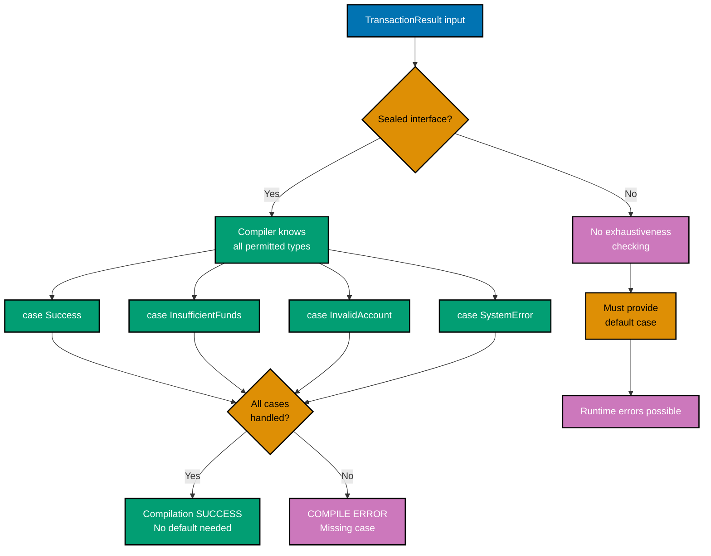

# Java Type Safety

**Quick Reference**: [Why Type Safety Matters in Finance](#why-type-safety-matters-in-finance) | [Core Type Safety Principles](#core-type-safety-principles) | [Modern Java Type Safety Features](#modern-java-type-safety-features) | [Null Safety with JSpecify and NullAway](#null-safety-with-jspecify-and-nullaway) | [Static Analysis with Checker Framework](#static-analysis-with-checker-framework) | [Error-Prone for Bug Prevention](#error-prone-for-bug-prevention) | [Type Safety Patterns](#type-safety-patterns) | [Testing Type Safety](#testing-type-safety) | [Type Safety Checklist](#type-safety-checklist) | [Common Type Safety Pitfalls](#common-type-safety-pitfalls) | [Performance Considerations](#performance-considerations) | [Tools and IDE Support](#tools-and-ide-support) | [Sources](#sources) | [Related Documentation](#related-documentation) | [Related Principles](#related-principles)
**Understanding-oriented documentation** for achieving type safety and minimizing runtime errors in Java applications.

## Quick Reference

**Jump to:**

- [Why Type Safety Matters in Finance](#why-type-safety-matters-in-finance) - Domain context and motivation
- [Core Type Safety Principles](#core-type-safety-principles) - Foundational concepts
- [Modern Java Type Safety Features](#modern-java-type-safety-features) - Language features (Java 17-25)
- [Null Safety with JSpecify and NullAway](#null-safety-with-jspecify-and-nullaway) - Industry standard tools
- [Static Analysis with Checker Framework](#static-analysis-with-checker-framework) - Compile-time verification
- [Error-Prone for Bug Prevention](#error-prone-for-bug-prevention) - Google's static analyzer
- [Type Safety Patterns](#type-safety-patterns) - Practical implementation patterns
- [Testing Type Safety](#testing-type-safety) - Verification strategies

**Related Documentation:**

- [Java Idioms](./ex-soen-prla-ja__idioms.md) - Modern Java patterns
- [Java Best Practices](./ex-soen-prla-ja__best-practices.md) - Clean code guidelines
- [Java Anti-Patterns](./ex-soen-prla-ja__anti-patterns.md) - Common mistakes
- [Java Security](./ex-soen-prla-ja__security.md) - Secure application development
- [Domain-Driven Design](./ex-soen-prla-ja__domain-driven-design.md) - DDD with type-safe models

Type safety in Java enforces the [Explicit Over Implicit](../../../../../governance/principles/software-engineering/explicit-over-implicit.md) principle - making nullable/non-nullable explicit, making type hierarchies explicit, and catching errors at compile-time rather than runtime. This alignment is critical for Shariah-compliant systems where financial calculations must be verifiable and correct.

## Why Type Safety Matters in Finance

Type safety prevents runtime errors by catching type mismatches at compile time, which is critical in financial systems where runtime failures can cause:

- **Financial loss**: Incorrect calculations due to type coercion (e.g., mixing USD and EUR)
- **Compliance violations**: Missing validation causing invalid transactions
- **Audit failures**: Type errors preventing accurate logging
- **System downtime**: NullPointerExceptions halting critical services

**Example Financial Impact**:

```java
// TYPE UNSAFE: Runtime disaster
public BigDecimal calculateZakat(Object wealth) {
    // What if wealth is null? String? Wrong currency?
    return ((BigDecimal) wealth).multiply(new BigDecimal("0.025")); // BOOM!
}

// TYPE SAFE: Compile-time guarantees
public Money calculateZakat(Money wealth) {
    // Type system guarantees:
    // 1. wealth is never null (use Optional<Money> if needed)
    // 2. wealth is Money, not String or Integer
    // 3. Currency is preserved in the result
    return wealth.multiply(ZakatRate.STANDARD); // 2.5%
}
```

## Core Type Safety Principles

### 1. Make Illegal States Unrepresentable

Use the type system to prevent invalid states from existing.

**Example: Donation Status**

```java
// BAD: String allows invalid states
public class Donation {
    private String status; // Could be "PNEDING" (typo), "completed", "CANCELED", etc.

    public boolean isProcessed() {
        return "COMPLETED".equals(status); // Fragile!
    }
}

// GOOD: Enum makes illegal states impossible
public enum DonationStatus {
    PENDING,
    PROCESSING,
    COMPLETED,
    CANCELLED;
}

public class Donation {
    private DonationStatus status; // Only valid states possible!

    public boolean isProcessed() {
        return status == DonationStatus.COMPLETED; // Type-safe!
    }
}
```

### 2. Use Immutability to Prevent Invalid Mutations

Immutable objects can't be corrupted after creation.

**Example: Money Value Object**

```java
// Minimal example: Type-safe validated record
public record AccountId(String value) {
    public AccountId {
        if (value == null || value.isBlank()) {
            throw new IllegalArgumentException("Account ID cannot be blank");
        }
        if (!value.matches("ACC-\\d{10}")) {
            throw new IllegalArgumentException("Invalid donation_account ID format");
        }
    }
}

// Usage: Compile-time type safety
public void processPayment(AccountId fromAccount, AccountId toAccount, Money amount) {
    // Type system prevents passing wrong parameters
    // Cannot pass Money as AccountId, or vice versa
}
```

**For comprehensive Money value object with type-safe operations**, see [Domain-Driven Design - Value Objects](./ex-soen-prla-ja__domain-driven-design.md#example-money-value-object).

### 3. Prefer Compile-Time Errors Over Runtime Errors

Use static types and analysis to catch errors before deployment.

**Example: Zakat Calculation Type Safety**

```java
// Runtime error waiting to happen
public BigDecimal calculateZakat(Map<String, Object> donation_account) {
    Object balance = donation_account.get("balance");
    Object nisab = donation_account.get("nisab");

    // What are these types? When will this fail?
    return ((BigDecimal) balance).subtract((BigDecimal) nisab)
        .multiply(new BigDecimal("0.025"));
}

// Compile-time type safety
public Money calculateZakat(ZakatAccount donation_account) {
    // Compiler guarantees these methods exist and return correct types
    Money balance = donation_account.getBalance();
    Money nisab = donation_account.getNisab();

    if (balance.compareTo(nisab) < 0) {
        return Money.zero(balance.getCurrency());
    }

    return balance.subtract(nisab).multiply(ZakatRate.STANDARD);
}

public record ZakatAccount(Money balance, Money nisab, LocalDate haulStartDate) {
    // Compact constructor validates invariants
    public ZakatAccount {
        if (balance == null || nisab == null || haulStartDate == null) {
            throw new IllegalArgumentException("All fields required");
        }
        if (!balance.getCurrency().equals(nisab.getCurrency())) {
            throw new IllegalArgumentException("Balance and nisab must use same currency");
        }
    }

    public Money getBalance() { return balance; }
    public Money getNisab() { return nisab; }
}
```

### 4. Use Sealed Classes for Exhaustive Handling

Sealed types enable the compiler to verify all cases are handled.

**Example: Sealed Type Exhaustiveness**

```java
// Minimal example: Simple sealed hierarchy
public sealed interface Status permits Active, Inactive, Suspended {
}

public record Active() implements Status {}
public record Inactive(String reason) implements Status {}
public record Suspended(LocalDate until) implements Status {}

// Compiler enforces exhaustive pattern matching
public String describe(Status status) {
    return switch (status) {
        case Active() -> "Currently active";
        case Inactive(var reason) -> "Inactive: " + reason;
        case Suspended(var until) -> "Suspended until " + until;
        // No default needed - compiler knows all cases covered!
    };
}
```

**For comprehensive TransactionResult sealed interface with financial examples**, see [Error Handling - Sealed Types](./ex-soen-prla-ja__error-handling.md#sealed-types-for-exhaustive-error-handling).

**Sealed Type Exhaustiveness:**



### 5. Eliminate Null with Optional and Sealed Types

Null is the "billion-dollar mistake" - use explicit optional types instead.

**Example: Finding Donor by ID**

```java
// BAD: Null encourages NullPointerException
public Donor findDonorById(String donorId) {
    // Returns null if not found - caller might forget to check!
    return donorRepository.findById(donorId);
}

// Caller code - runtime bomb:
Donor donor = findDonorById("D12345");
String email = donor.getEmail(); // NPE if donor not found!

// GOOD: Optional makes absence explicit
public Optional<Donor> findDonorById(String donorId) {
    // Type system forces caller to handle absence
    return donorRepository.findById(donorId);
}

// Caller code - type-safe:
Optional<Donor> donorOpt = findDonorById("D12345");
String email = donorOpt
    .map(Donor::getEmail)
    .orElse("no-email@example.com");

// Or with pattern matching (Java 21+):
String email = switch (donorOpt) {
    case Optional.of(Donor donor) -> donor.getEmail();
    case Optional.empty() -> "no-email@example.com";
};
```

**Optional vs Null Comparison:**

```mermaid
%% Color Palette: Blue #0173B2, Orange #DE8F05, Teal #029E73, Purple #CC78BC
%% All colors are color-blind friendly and meet WCAG AA contrast standards

graph TD
    subgraph Optional_Flow [" Optional Flow Type-Safe "]
        OptStart[findDonorById]:::blue --> OptReturn[Returns Optional#60;Donor#62;]:::teal
        OptReturn --> OptCheck{Optional.isPresent?}:::orange
        OptCheck -->|Yes| OptMap[map#40;Donor::getEmail#41;]:::teal
        OptCheck -->|No| OptDefault[orElse#40;default#41;]:::teal
        OptMap --> OptResult[Email string]:::blue
        OptDefault --> OptResult
        Note1[Compiler forces<br/>null handling]:::teal
    end

    subgraph Null_Flow [" Null Flow Error-Prone "]
        NullStart[findDonorById]:::blue --> NullReturn[Returns Donor or null]:::orange
        NullReturn --> NullCheck{null check?}:::purple
        NullCheck -->|Forgotten| NPE[NullPointerException<br/>RUNTIME ERROR]:::purple
        NullCheck -->|Remembered| NullSafe[donor.getEmail#40;#41;]:::orange
        NullSafe --> NullResult[Email or null]:::orange
        NPE --> Crash[Application crash]:::purple
        Note2[Easy to forget<br/>null check]:::purple
    end

    classDef blue fill:#0173B2,stroke:#000000,color:#FFFFFF,stroke-width:2px
    classDef orange fill:#DE8F05,stroke:#000000,color:#000000,stroke-width:2px
    classDef teal fill:#029E73,stroke:#000000,color:#FFFFFF,stroke-width:2px
    classDef purple fill:#CC78BC,stroke:#000000,color:#FFFFFF,stroke-width:2px
```



## Modern Java Type Safety Features

### Records for Immutable Data (Java 17+)

Records provide automatic immutability with compile-time guarantees.

**Example: Zakat DonationPayment Record**

```java
public record ZakatPayment(
    String paymentId,
    Money amount,
    String donorId,
    LocalDate paymentDate,
    ZakatCategory category
) {
    // Compact constructor validates invariants
    public ZakatPayment {
        if (paymentId == null || paymentId.isBlank()) {
            throw new IllegalArgumentException("DonationPayment ID required");
        }
        if (amount == null || amount.isNegative()) {
            throw new IllegalArgumentException("Amount must be positive");
        }
        if (donorId == null || donorId.isBlank()) {
            throw new IllegalArgumentException("Donor ID required");
        }
        if (paymentDate == null || paymentDate.isAfter(LocalDate.now())) {
            throw new IllegalArgumentException("DonationPayment date cannot be in future");
        }
        if (category == null) {
            throw new IllegalArgumentException("Zakat category required");
        }
    }

    // All fields automatically final and immutable
    // Compiler generates: constructor, getters, equals, hashCode, toString
}

// Usage - type-safe and immutable:
ZakatPayment donation = new ZakatPayment(
    "ZP-2026-001",
    Money.of(new BigDecimal("2500.00"), Currency.getInstance("USD")),
    "D12345",
    LocalDate.of(2026, 1, 15),
    ZakatCategory.WEALTH
);

// Mutation impossible:
// donation.amount = newAmount; // COMPILE ERROR: final field
```

### Sealed Classes for Domain Modeling (Java 17+)

Sealed types restrict inheritance for exhaustive handling.

**Example: QardHasan Agreement Types**

```java
public sealed interface MurabahaContract
    permits Murabaha, Musharaka, Mudaraba {

    Money getPrincipal();
    LocalDate getStartDate();
    LocalDate getMaturityDate();
}

public final record Murabaha(
    Money principal,
    Money cost,
    BigDecimal profitRate,
    LocalDate startDate,
    LocalDate maturityDate
) implements MurabahaContract {
    // Validation in compact constructor
    public Murabaha {
        if (profitRate.compareTo(BigDecimal.ZERO) < 0) {
            throw new IllegalArgumentException("Profit rate cannot be negative");
        }
    }
}

public final record Musharaka(
    Money principal,
    BigDecimal partnershipRatio,
    LocalDate startDate,
    LocalDate maturityDate
) implements MurabahaContract {
    public Musharaka {
        if (partnershipRatio.compareTo(BigDecimal.ZERO) <= 0 ||
            partnershipRatio.compareTo(BigDecimal.ONE) > 0) {
            throw new IllegalArgumentException("Partnership ratio must be (0, 1]");
        }
    }
}

public final record Mudaraba(
    Money principal,
    BigDecimal profitSharingRatio,
    LocalDate startDate,
    LocalDate maturityDate
) implements MurabahaContract {
    public Mudaraba {
        if (profitSharingRatio.compareTo(BigDecimal.ZERO) < 0 ||
            profitSharingRatio.compareTo(BigDecimal.ONE) > 0) {
            throw new IllegalArgumentException("Profit sharing ratio must be [0, 1]");
        }
    }
}

// Type-safe exhaustive handling
public Money calculateExpectedReturn(MurabahaContract agreement) {
    return switch (agreement) {
        case Murabaha m ->
            m.getPrincipal().add(m.cost());
        case Musharaka ms ->
            ms.getPrincipal().multiply(ms.partnershipRatio());
        case Mudaraba md ->
            md.getPrincipal().multiply(md.profitSharingRatio());
        // No default needed - compiler verifies all cases!
    };
}
```

### Pattern Matching for Type Safety (Java 21+)

Pattern matching eliminates unsafe casts and null checks.

**Example: Processing Donation Events**

```java
public sealed interface DonationEvent
    permits DonationReceived, DonationAllocated, DonationDistributed {
}

public record DonationReceived(
    String donationId,
    Money amount,
    String donorId,
    LocalDateTime timestamp
) implements DonationEvent {}

public record DonationAllocated(
    String donationId,
    String fundId,
    Money amount,
    LocalDateTime timestamp
) implements DonationEvent {}

public record DonationDistributed(
    String donationId,
    String beneficiaryId,
    Money amount,
    LocalDateTime timestamp
) implements DonationEvent {}

// Type-safe pattern matching with deconstruction
public void processDonationEvent(DonationEvent event) {
    switch (event) {
        case DonationReceived(var id, var amount, var donorId, var timestamp) -> {
            logger.info("Received donation {} of {} from donor {} at {}",
                id, amount, donorId, timestamp);
            notifyDonor(donorId, amount);
        }
        case DonationAllocated(var id, var fundId, var amount, var timestamp) -> {
            logger.info("Allocated donation {} to fund {} amount {} at {}",
                id, fundId, amount, timestamp);
            updateFundBalance(fundId, amount);
        }
        case DonationDistributed(var id, var beneficiaryId, var amount, var timestamp) -> {
            logger.info("Distributed donation {} to beneficiary {} amount {} at {}",
                id, beneficiaryId, amount, timestamp);
            recordDistribution(beneficiaryId, amount);
        }
    }
    // Compiler guarantees exhaustiveness!
}

// Pattern matching with guards (Java 21+)
public boolean requiresApproval(DonationEvent event) {
    return switch (event) {
        case DonationReceived(_, Money amount, _, _)
            when amount.compareTo(Money.of(10000)) > 0 -> true;
        case DonationAllocated(_, _, Money amount, _)
            when amount.compareTo(Money.of(5000)) > 0 -> true;
        case DonationDistributed(_, _, Money amount, _)
            when amount.compareTo(Money.of(1000)) > 0 -> true;
        default -> false;
    };
}
```

### Optional for Null Safety (Java 8+)

Optional explicitly represents the presence or absence of a value.

**Example: Donor Lookup**

```java
public class DonorService {
    private final DonorRepository repository;

    // Type-safe: absence is explicit in return type
    public Optional<Donor> findDonorByEmail(String email) {
        return repository.findByEmail(email);
    }

    // Chaining with map
    public Optional<String> getDonorPhoneNumber(String email) {
        return findDonorByEmail(email)
            .map(Donor::getPhoneNumber);
    }

    // Providing defaults
    public String getDonorName(String email) {
        return findDonorByEmail(email)
            .map(Donor::getFullName)
            .orElse("Anonymous Donor");
    }

    // Throwing when value must exist
    public Donor getDonorOrThrow(String email) {
        return findDonorByEmail(email)
            .orElseThrow(() -> new DonorNotFoundException(email));
    }

    // Conditional execution
    public void sendThankYouEmail(String email) {
        findDonorByEmail(email)
            .ifPresent(donor -> emailService.sendThankYou(donor));
    }

    // Pattern matching with Optional (Java 21+)
    public String formatDonorInfo(String email) {
        Optional<Donor> donorOpt = findDonorByEmail(email);

        return switch (donorOpt) {
            case Optional.of(Donor donor) ->
                String.format("%s (%s)", donor.getFullName(), donor.getEmail());
            case Optional.empty() ->
                "Donor not found";
        };
    }
}
```

## Null Safety with JSpecify and NullAway

### What is JSpecify?

JSpecify is a standardized set of annotations for expressing nullness contracts in Java code. It provides:

- **Universal standard**: Replaces fragmented ecosystem (JSR-305, JetBrains, Checker Framework)
- **IDE support**: IntelliJ IDEA, Eclipse, VS Code understand JSpecify annotations
- **Tool integration**: Works with NullAway, Checker Framework, Error Prone
- **Spring Boot 4+**: Entire Spring Framework codebase uses JSpecify

### What is NullAway?

NullAway is a fast, practical null-checking tool from Uber that:

- **Compile-time checking**: Catches null pointer bugs during compilation
- **Low overhead**: Designed for large codebases with minimal build-time impact
- **Error Prone integration**: Runs as Error Prone plugin
- **Production-proven**: Used in all Android builds at Uber since 2018

### Setup and Configuration

**Maven Configuration**:

```xml
<dependency>
    <groupId>org.jspecify</groupId>
    <artifactId>jspecify</artifactId>
    <version>1.0.0</version>
    <scope>provided</scope>
</dependency>

<plugin>
    <groupId>org.apache.maven.plugins</groupId>
    <artifactId>maven-compiler-plugin</artifactId>
    <version>3.14.1</version>
    <configuration>
        <compilerArgs>
            <arg>-Xplugin:ErrorProne -Xep:NullAway:ERROR
                 -XepOpt:NullAway:AnnotatedPackages=com.sharia.finance.finance</arg>
        </compilerArgs>
        <annotationProcessorPaths>
            <path>
                <groupId>com.google.errorprone</groupId>
                <artifactId>error_prone_core</artifactId>
                <version>2.46.0</version>
            </path>
            <path>
                <groupId>com.uber.nullaway</groupId>
                <artifactId>nullaway</artifactId>
                <version>0.12.15</version>
            </path>
        </annotationProcessorPaths>
    </configuration>
</plugin>
```

### Using @NullMarked and @Nullable

**Package-Level Null Safety**:

```java
// src/main/java/com/example/finance/zakat/package-info.java
@NullMarked  // All types non-null by default
package com.sharia.finance.finance.zakat;

import org.jspecify.annotations.NullMarked;
```

**Explicit Nullable Fields**:

```java
package com.sharia.finance.finance.zakat;

import org.jspecify.annotations.Nullable;

public class ZakatAccount {
    private final String accountId;        // Non-null by default (from @NullMarked)
    private final Money balance;           // Non-null
    private final @Nullable String notes;  // Explicitly nullable

    public ZakatAccount(String accountId, Money balance, @Nullable String notes) {
        this.accountId = accountId;  // NullAway verifies non-null
        this.balance = balance;      // NullAway verifies non-null
        this.notes = notes;          // Nullable OK
    }

    public String getAccountId() {
        return accountId;  // Guaranteed non-null
    }

    public Money getBalance() {
        return balance;  // Guaranteed non-null
    }

    public @Nullable String getNotes() {
        return notes;  // May be null
    }

    // NullAway enforces null checks before dereferencing
    public int getNotesLength() {
        if (notes == null) {
            return 0;
        }
        return notes.length();  // Safe: null check above
    }
}
```

### NullAway Error Detection

**Example 1: Dereferencing Nullable Without Check**

```java
package com.sharia.finance.finance.donation;

import org.jspecify.annotations.Nullable;

public class DonationProcessor {
    public void processDonation(@Nullable Donation donation) {
        // COMPILE ERROR from NullAway:
        // "dereferenced expression donation is @Nullable"
        String donorId = donation.getDonorId();

        // CORRECT: Check for null first
        if (donation != null) {
            String donorId = donation.getDonorId();  // Safe
            processDonationInternal(donation);
        }
    }
}
```

**Example 2: Returning Null for Non-Null Type**

```java
package com.sharia.finance.finance.donor;

public class DonorService {
    // Return type is non-null by default (from @NullMarked)
    public Donor findDonorById(String donorId) {
        Donor donor = repository.findById(donorId);

        // COMPILE ERROR from NullAway:
        // "returning @Nullable expression from method with @NonNull return type"
        return donor;  // donor might be null!

        // CORRECT: Use Optional for potentially absent values
        public Optional<Donor> findDonorById(String donorId) {
            return repository.findById(donorId);
        }

        // OR: Throw exception if null is unexpected
        public Donor findDonorByIdOrThrow(String donorId) {
            Donor donor = repository.findById(donorId);
            if (donor == null) {
                throw new DonorNotFoundException(donorId);
            }
            return donor;
        }
    }
}
```

**Example 3: Field Initialization**

```java
package com.sharia.finance.finance.zakat;

public class ZakatCalculator {
    // COMPILE ERROR from NullAway:
    // "field nisabThreshold not initialized"
    private Money nisabThreshold;

    // CORRECT: Initialize in constructor
    public ZakatCalculator(Money nisabThreshold) {
        this.nisabThreshold = nisabThreshold;
    }

    // OR: Initialize inline
    private Money nisabThreshold = Money.of(new BigDecimal("85"), GoldGramUnit);
}
```

**NullAway Static Analysis Flow:**

```mermaid
%% Color Palette: Blue #0173B2, Orange #DE8F05, Teal #029E73, Purple #CC78BC, Brown #CA9161
%% All colors are color-blind friendly and meet WCAG AA contrast standards

graph TD
    Source[Java Source Code]:::blue --> Package{Package has<br/>@NullMarked?}:::orange

    Package -->|Yes| AllNonNull[All types non-null<br/>by default]:::teal
    Package -->|No| Skip[Skip NullAway<br/>analysis]:::brown

    AllNonNull --> Analysis[NullAway Analysis<br/>at compile-time]:::teal

    Analysis --> Check1{Dereference<br/>@Nullable?}:::orange
    Analysis --> Check2{Return null from<br/>@NonNull method?}:::orange
    Analysis --> Check3{Uninitialized<br/>@NonNull field?}:::orange
    Analysis --> Check4{Pass null to<br/>@NonNull param?}:::orange

    Check1 -->|Yes| Error1[COMPILE ERROR:<br/>dereferenced @Nullable]:::purple
    Check1 -->|No + null check| Safe1[Safe dereferencing]:::teal

    Check2 -->|Yes| Error2[COMPILE ERROR:<br/>returning @Nullable]:::purple
    Check2 -->|No| Safe2[Return verified]:::teal

    Check3 -->|Yes| Error3[COMPILE ERROR:<br/>field not initialized]:::purple
    Check3 -->|No| Safe3[Field initialized]:::teal

    Check4 -->|Yes| Error4[COMPILE ERROR:<br/>null argument]:::purple
    Check4 -->|No| Safe4[Parameter verified]:::teal

    Safe1 --> Success[Compilation SUCCESS<br/>Null safety guaranteed]:::teal
    Safe2 --> Success
    Safe3 --> Success
    Safe4 --> Success

    Error1 --> Fail[Compilation FAILED<br/>Fix null safety issues]:::purple
    Error2 --> Fail
    Error3 --> Fail
    Error4 --> Fail

    classDef blue fill:#0173B2,stroke:#000000,color:#FFFFFF,stroke-width:2px
    classDef orange fill:#DE8F05,stroke:#000000,color:#000000,stroke-width:2px
    classDef teal fill:#029E73,stroke:#000000,color:#FFFFFF,stroke-width:2px
    classDef purple fill:#CC78BC,stroke:#000000,color:#FFFFFF,stroke-width:2px
    classDef brown fill:#CA9161,stroke:#000000,color:#000000,stroke-width:2px
```

### Best Practices with JSpecify/NullAway

**1. Use @NullMarked at Package Level**

```java
// package-info.java for each package
@NullMarked
package com.sharia.finance.finance.zakat;

import org.jspecify.annotations.NullMarked;
```

**2. Prefer Optional Over @Nullable for Return Values**

```java
// AVOID: Nullable return type
public @Nullable Donation findDonation(String id) { ... }

// PREFER: Optional makes absence explicit
public Optional<Donation> findDonation(String id) { ... }
```

**3. Use @Nullable for Parameters and Fields When Appropriate**

```java
public class Donor {
    private final String email;               // Required
    private final @Nullable String phoneNumber;  // Optional

    public Donor(String email, @Nullable String phoneNumber) {
        this.email = email;
        this.phoneNumber = phoneNumber;
    }
}
```

**4. Combine with Records for Immutability**

```java
public record ZakatPayment(
    String paymentId,
    Money amount,
    String donorId,
    @Nullable String receiptNumber  // Optional field
) {
    public ZakatPayment {
        // NullAway verifies non-null fields
        if (paymentId == null || paymentId.isBlank()) {
            throw new IllegalArgumentException("DonationPayment ID required");
        }
        // receiptNumber can be null
    }
}
```

## Static Analysis with Checker Framework

The Checker Framework provides pluggable type systems for compile-time verification.

### Common Checker Framework Annotations

**Tainting Checker** (prevents injection attacks):

```java
import org.checkerframework.checker.tainting.qual.Untainted;
import org.checkerframework.checker.tainting.qual.Tainted;

public class DonationRepository {
    // SAFE: Only accepts validated (untainted) input
    public void saveDonation(@Untainted String donorId, Money amount) {
        String sql = "INSERT INTO donations (donor_id, amount) VALUES (?, ?)";
        // Prepared statement is safe
        jdbcTemplate.update(sql, donorId, amount.getAmount());
    }

    // UNSAFE: Accepts potentially tainted input
    public List<Donation> findByDonorName(@Tainted String donorName) {
        // COMPILE ERROR if you try to use this in SQL directly!
        // String sql = "SELECT * FROM donations WHERE donor_name = '" + donorName + "'";

        // Must sanitize first
        @Untainted String sanitized = sanitize(donorName);
        return findByDonorNameSafe(sanitized);
    }

    private @Untainted String sanitize(@Tainted String input) {
        // Validation logic
        return input.replaceAll("[^a-zA-Z0-9 ]", "");
    }
}
```

**Units Checker** (dimensional analysis):

```java
import org.checkerframework.checker.units.qual.*;

public class ZakatCalculator {
    // Type-safe unit handling
    public @kg double calculateGoldNisab(@g double goldGrams) {
        return goldGrams / 1000.0;  // Convert grams to kg
    }

    // COMPILE ERROR: Can't mix units
    public void mixedUnits() {
        @kg double weight = 85.0;
        @g double grams = 1000.0;

        // ERROR: Cannot assign @g to @kg
        // weight = grams;
    }
}
```

**Regex Checker** (validates regex patterns):

```java
import org.checkerframework.checker.regex.qual.Regex;

public class DonorValidator {
    // Compile-time regex validation
    private static final @Regex String EMAIL_PATTERN =
        "[a-zA-Z0-9._%+-]+@[a-zA-Z0-9.-]+\\.[a-zA-Z]{2,}";

    public boolean isValidEmail(String email) {
        return email.matches(EMAIL_PATTERN);  // Safe: pattern verified at compile-time
    }

    // COMPILE ERROR: Invalid regex pattern
    // private static final @Regex String INVALID = "[a-z";
}
```

### Maven Configuration for Checker Framework

```xml
<plugin>
    <groupId>org.apache.maven.plugins</groupId>
    <artifactId>maven-compiler-plugin</artifactId>
    <version>3.14.1</version>
    <configuration>
        <source>21</source>
        <target>21</target>
        <compilerArgs>
            <arg>-J--add-exports=jdk.compiler/com.sun.tools.javac.api=ALL-UNNAMED</arg>
            <arg>-J--add-exports=jdk.compiler/com.sun.tools.javac.code=ALL-UNNAMED</arg>
            <arg>-J--add-exports=jdk.compiler/com.sun.tools.javac.processing=ALL-UNNAMED</arg>
            <arg>-J--add-exports=jdk.compiler/com.sun.tools.javac.tree=ALL-UNNAMED</arg>
            <arg>-J--add-exports=jdk.compiler/com.sun.tools.javac.util=ALL-UNNAMED</arg>
            <arg>-Xmaxerrs</arg>
            <arg>10000</arg>
            <arg>-Xmaxwarns</arg>
            <arg>10000</arg>
            <arg>-AsuppressWarnings=type.anno.before.modifier</arg>
        </compilerArgs>
        <annotationProcessorPaths>
            <path>
                <groupId>org.checkerframework</groupId>
                <artifactId>checker</artifactId>
                <version>3.53.0</version>
            </path>
        </annotationProcessorPaths>
        <annotationProcessors>
            <annotationProcessor>org.checkerframework.checker.nullness.NullnessChecker</annotationProcessor>
            <annotationProcessor>org.checkerframework.checker.tainting.TaintingChecker</annotationProcessor>
            <annotationProcessor>org.checkerframework.checker.regex.RegexChecker</annotationProcessor>
        </annotationProcessors>
    </configuration>
</plugin>
```

## Error-Prone for Bug Prevention

Error Prone is Google's static analysis tool that catches common programming mistakes.

### Setup

**Maven Configuration**:

```xml
<plugin>
    <groupId>org.apache.maven.plugins</groupId>
    <artifactId>maven-compiler-plugin</artifactId>
    <version>3.14.1</version>
    <configuration>
        <source>21</source>
        <target>21</target>
        <compilerArgs>
            <arg>-XDcompilePolicy=simple</arg>
            <arg>-Xplugin:ErrorProne</arg>
        </compilerArgs>
        <annotationProcessorPaths>
            <path>
                <groupId>com.google.errorprone</groupId>
                <artifactId>error_prone_core</artifactId>
                <version>2.46.0</version>
            </path>
        </annotationProcessorPaths>
    </configuration>
</plugin>
```

### Common Error-Prone Checks for Finance

**1. Comparison Using Reference Equality**

```java
// BAD: Using == for BigDecimal comparison
public boolean isAboveNisab(Money balance, Money nisab) {
    return balance.getAmount() == nisab.getAmount();  // ERROR: Reference comparison
}

// GOOD: Use compareTo for BigDecimal
public boolean isAboveNisab(Money balance, Money nisab) {
    return balance.getAmount().compareTo(nisab.getAmount()) > 0;
}
```

**2. Ignored Return Value**

```java
// BAD: Ignoring return value
public void processZakat(Money amount) {
    amount.multiply(ZakatRate.STANDARD);  // ERROR: Result ignored!
    // amount is unchanged (immutable)
}

// GOOD: Use the returned value
public Money calculateZakat(Money amount) {
    return amount.multiply(ZakatRate.STANDARD);
}
```

**3. Double Checked Locking**

```java
// BAD: Broken double-checked locking
private ZakatCalculator calculator;

public ZakatCalculator getCalculator() {
    if (calculator == null) {  // ERROR: Unsafe publication
        synchronized (this) {
            if (calculator == null) {
                calculator = new ZakatCalculator();
            }
        }
    }
    return calculator;
}

// GOOD: Use volatile or initialization-on-demand holder
private volatile ZakatCalculator calculator;
```

**4. Missing Override Annotation**

```java
// BAD: Missing @Override
public class CustomDonation extends Donation {
    public boolean equals(Object obj) {  // ERROR: Should have @Override
        // ...
    }
}

// GOOD: Explicit @Override
public class CustomDonation extends Donation {
    @Override
    public boolean equals(Object obj) {  // Compiler verifies override
        // ...
    }
}
```

## Type Safety Patterns

### 1. Phantom Types for Compile-Time Validation

Use type parameters to encode validation state.

```java
// Phantom type markers
interface Validated {}
interface Unvalidated {}

// Generic DTO with validation state
public class DonationRequest<V> {
    private final String donorId;
    private final BigDecimal amount;
    private final String currency;

    private DonationRequest(String donorId, BigDecimal amount, String currency) {
        this.donorId = donorId;
        this.amount = amount;
        this.currency = currency;
    }

    // Factory for unvalidated request
    public static DonationRequest<Unvalidated> create(
            String donorId, BigDecimal amount, String currency) {
        return new DonationRequest<>(donorId, amount, currency);
    }

    // Validation transitions type to Validated
    public DonationRequest<Validated> validate() {
        if (donorId == null || donorId.isBlank()) {
            throw new ValidationException("Donor ID required");
        }
        if (amount == null || amount.compareTo(BigDecimal.ZERO) <= 0) {
            throw new ValidationException("Amount must be positive");
        }
        if (currency == null || currency.length() != 3) {
            throw new ValidationException("Invalid currency code");
        }

        // Type changes from Unvalidated to Validated
        return new DonationRequest<>(donorId, amount, currency);
    }

    // Getters
    public String getDonorId() { return donorId; }
    public BigDecimal getAmount() { return amount; }
    public String getCurrency() { return currency; }
}

// Service only accepts validated requests
public class DonationService {
    // COMPILE ERROR if you pass DonationRequest<Unvalidated>
    public Donation processDonation(DonationRequest<Validated> request) {
        // Type system guarantees this request is validated!
        return new Donation(
            request.getDonorId(),
            Money.of(request.getAmount(), Currency.getInstance(request.getCurrency()))
        );
    }
}

// Usage
DonationRequest<Unvalidated> rawRequest = DonationRequest.create(
    "D12345",
    new BigDecimal("1000"),
    "USD"
);

// Must validate before passing to service
DonationRequest<Validated> validatedRequest = rawRequest.validate();
Donation donation = donationService.processDonation(validatedRequest);

// COMPILE ERROR: Cannot pass unvalidated request
// donationService.processDonation(rawRequest);
```

**Phantom Type Validation State:**

```mermaid
%% Color Palette: Blue #0173B2, Orange #DE8F05, Brown #CA9161, Purple #CC78BC
%% All colors are color-blind friendly and meet WCAG AA contrast standards

stateDiagram-v2
    [*] --> Unvalidated: create#40;#41;

    state Unvalidated {
        note right of Unvalidated
            DonationRequest#60;Unvalidated#62;
            Cannot pass to service
        end note
    }

    Unvalidated --> Validating: validate#40;#41;

    state Validating {
        note right of Validating
            Check donorId not blank
            Check amount #62; 0
            Check currency code valid
        end note
    }

    Validating --> Validated: Validation SUCCESS
    Validating --> Error: Validation FAILED

    state Validated {
        note right of Validated
            DonationRequest#60;Validated#62;
            Type changed at compile-time
            Can pass to service
        end note
    }

    state Error {
        note right of Error
            ValidationException thrown
            Cannot create validated instance
        end note
    }

    Validated --> [*]: processDonation#40;#41;

    note left of Unvalidated
        COMPILE ERROR if passed to:
        processDonation#40;DonationRequest#60;Unvalidated#62;#41;
    end note

classDef validatedState fill:#0173B2,stroke:#000000,color:#FFFFFF,stroke-width:2px
classDef transitionState fill:#DE8F05,stroke:#000000,color:#000000,stroke-width:2px
classDef validationState fill:#CA9161,stroke:#000000,color:#000000,stroke-width:2px
classDef errorState fill:#CC78BC,stroke:#000000,color:#FFFFFF,stroke-width:2px

class Validated validatedState
class Unvalidated transitionState
class Validating validationState
class Error errorState
```

### 2. Builder Pattern with Compile-Time Completeness

Use nested builders to enforce required fields at compile time.

```java
public class ZakatAccount {
    private final String accountId;
    private final Money balance;
    private final Money nisab;
    private final LocalDate haulStartDate;

    private ZakatAccount(Builder builder) {
        this.accountId = builder.accountId;
        this.balance = builder.balance;
        this.nisab = builder.nisab;
        this.haulStartDate = builder.haulStartDate;
    }

    // Step 1: Account ID required
    public static AccountIdStep builder() {
        return new Builder();
    }

    public interface AccountIdStep {
        BalanceStep accountId(String accountId);
    }

    public interface BalanceStep {
        NisabStep balance(Money balance);
    }

    public interface NisabStep {
        HaulStartDateStep nisab(Money nisab);
    }

    public interface HaulStartDateStep {
        BuildStep haulStartDate(LocalDate haulStartDate);
    }

    public interface BuildStep {
        ZakatAccount build();
    }

    private static class Builder implements
            AccountIdStep, BalanceStep, NisabStep, HaulStartDateStep, BuildStep {

        private String accountId;
        private Money balance;
        private Money nisab;
        private LocalDate haulStartDate;

        @Override
        public BalanceStep accountId(String accountId) {
            this.accountId = accountId;
            return this;
        }

        @Override
        public NisabStep balance(Money balance) {
            this.balance = balance;
            return this;
        }

        @Override
        public HaulStartDateStep nisab(Money nisab) {
            this.nisab = nisab;
            return this;
        }

        @Override
        public BuildStep haulStartDate(LocalDate haulStartDate) {
            this.haulStartDate = haulStartDate;
            return this;
        }

        @Override
        public ZakatAccount build() {
            // All fields guaranteed non-null by type system!
            return new ZakatAccount(this);
        }
    }
}

// Usage - compiler enforces all required fields
ZakatAccount donation_account = ZakatAccount.builder()
    .accountId("ZA-12345")           // Step 1: Must provide accountId
    .balance(Money.of(100000, "USD")) // Step 2: Must provide balance
    .nisab(Money.of(85, "XAU"))       // Step 3: Must provide nisab
    .haulStartDate(LocalDate.of(2025, 1, 1)) // Step 4: Must provide haul start
    .build();                         // Step 5: Now can build

// COMPILE ERROR: Cannot skip required fields
// ZakatAccount incomplete = ZakatAccount.builder()
//     .accountId("ZA-12345")
//     .build();  // ERROR: No build() method available yet!
```

### 3. Type-Safe Error Handling with Sealed Types

Replace exceptions with explicit error types.

```java
// Error types for Zakat calculation
public sealed interface ZakatCalculationResult
    permits ValidZakat, BelowNisab, IncompleteHaul, InvalidAccount {
}

public record ValidZakat(Money zakatAmount, Money balance)
    implements ZakatCalculationResult {}

public record BelowNisab(Money balance, Money nisab)
    implements ZakatCalculationResult {}

public record IncompleteHaul(LocalDate haulStartDate, LocalDate today, long daysRemaining)
    implements ZakatCalculationResult {}

public record InvalidAccount(String accountId, String reason)
    implements ZakatCalculationResult {}

// Service returns explicit result type instead of throwing
public class ZakatService {
    public ZakatCalculationResult calculateZakat(ZakatAccount donation_account) {
        // Validation 1: Account exists
        if (donation_account == null || donation_account.getAccountId() == null) {
            return new InvalidAccount("", "Account not found");
        }

        // Validation 2: Haul (lunar year) completed
        LocalDate today = LocalDate.now();
        LocalDate haulEndDate = donation_account.getHaulStartDate().plusYears(1);
        if (today.isBefore(haulEndDate)) {
            long daysRemaining = ChronoUnit.DAYS.between(today, haulEndDate);
            return new IncompleteHaul(donation_account.getHaulStartDate(), today, daysRemaining);
        }

        // Validation 3: Balance above nisab
        if (donation_account.getBalance().compareTo(donation_account.getNisab()) < 0) {
            return new BelowNisab(donation_account.getBalance(), donation_account.getNisab());
        }

        // All validations passed - calculate zakat
        Money zakatAmount = donation_account.getBalance().multiply(ZakatRate.STANDARD);
        return new ValidZakat(zakatAmount, donation_account.getBalance());
    }
}

// Type-safe exhaustive handling
public String formatZakatResult(ZakatCalculationResult result) {
    return switch (result) {
        case ValidZakat(Money zakat, Money balance) ->
            String.format("Zakat due: %s (%.2f%% of %s)",
                zakat, ZakatRate.STANDARD.movePointRight(2), balance);

        case BelowNisab(Money balance, Money nisab) ->
            String.format("Balance %s is below nisab %s - no zakat due",
                balance, nisab);

        case IncompleteHaul(LocalDate start, LocalDate today, long daysRemaining) ->
            String.format("Haul incomplete: started %s, %d days remaining",
                start, daysRemaining);

        case InvalidAccount(String id, String reason) ->
            String.format("Invalid donation_account %s: %s", id, reason);
    };
    // Compiler guarantees all cases handled!
}
```

### 4. Smart Constructors for Validated Objects

Use private constructors with static factory methods.

```java
public class EmailAddress {
    private static final Pattern EMAIL_PATTERN = Pattern.compile(
        "^[a-zA-Z0-9._%+-]+@[a-zA-Z0-9.-]+\\.[a-zA-Z]{2,}$"
    );

    private final String value;

    // Private constructor - cannot be called directly
    private EmailAddress(String value) {
        this.value = value;
    }

    // Smart constructor validates before creating instance
    public static EmailAddress of(String email) {
        if (email == null || email.isBlank()) {
            throw new IllegalArgumentException("Email cannot be null or blank");
        }
        if (!EMAIL_PATTERN.matcher(email).matches()) {
            throw new IllegalArgumentException("Invalid email format: " + email);
        }
        return new EmailAddress(email.toLowerCase().trim());
    }

    // Alternative: Return Optional instead of throwing
    public static Optional<EmailAddress> tryParse(String email) {
        try {
            return Optional.of(of(email));
        } catch (IllegalArgumentException e) {
            return Optional.empty();
        }
    }

    public String getValue() {
        return value;
    }

    @Override
    public boolean equals(Object obj) {
        return obj instanceof EmailAddress other &&
               this.value.equals(other.value);
    }

    @Override
    public int hashCode() {
        return value.hashCode();
    }

    @Override
    public String toString() {
        return value;
    }
}

// Usage - type system guarantees validity
EmailAddress donorEmail = EmailAddress.of("donor@example.com");
// donorEmail is guaranteed to be valid!

// Cannot create invalid email
// EmailAddress invalid = new EmailAddress("not-an-email"); // COMPILE ERROR: private constructor

// Type-safe in domain model
public record Donor(
    String donorId,
    String fullName,
    EmailAddress email,  // Type guarantees validity!
    @Nullable String phoneNumber
) {}
```

## Testing Type Safety

### 1. Testing Sealed Types Are Exhaustive

```java
@Test
void testTransactionResultExhaustiveness() {
    // Arrange: Create all possible result types
    List<TransactionResult> allResults = List.of(
        new Success("TX-001", Money.of(1000, "USD")),
        new InsufficientFunds(Money.of(1000, "USD"), Money.of(500, "USD")),
        new InvalidAccount("ACC-999", "Account not found"),
        new SystemError("ERR-500", "Database connection failed")
    );

    // Act & Assert: Verify all cases handled
    for (TransactionResult result : allResults) {
        String formatted = formatResult(result);
        assertThat(formatted).isNotNull();
        assertThat(formatted).isNotBlank();
    }

    // If new case added to sealed type, this test will fail to compile!
}
```

### 2. Testing Null Safety with JSpecify

```java
@Test
void testNullSafetyViolationDetected() {
    DonorService service = new DonorService();

    // This should cause NullAway to flag error at compile-time
    // Test that runtime behavior is also correct
    assertThrows(NullPointerException.class, () -> {
        service.processDonor(null);  // Should be caught by NullAway
    });
}

@Test
void testOptionalHandling() {
    DonorService service = new DonorService();

    // Properly handle Optional absence
    Optional<Donor> donorOpt = service.findDonorById("NONEXISTENT");

    assertThat(donorOpt).isEmpty();

    // Type-safe access
    String email = donorOpt
        .map(Donor::getEmail)
        .map(EmailAddress::getValue)
        .orElse("no-email@example.com");

    assertThat(email).isEqualTo("no-email@example.com");
}
```

### 3. Testing Type-Safe Builders

```java
@Test
void testBuilderEnforcesRequiredFields() {
    // Compiler enforces all required fields at compile-time
    ZakatAccount donation_account = ZakatAccount.builder()
        .accountId("ZA-12345")
        .balance(Money.of(100000, "USD"))
        .nisab(Money.of(85, "XAU"))
        .haulStartDate(LocalDate.of(2025, 1, 1))
        .build();

    assertThat(donation_account.getAccountId()).isEqualTo("ZA-12345");
    assertThat(donation_account.getBalance().getAmount()).isEqualByComparingTo("100000");

    // Cannot compile if fields are missing:
    // ZakatAccount incomplete = ZakatAccount.builder()
    //     .accountId("ZA-12345")
    //     .build();  // COMPILE ERROR!
}
```

### 4. Property-Based Testing for Type Safety

Use [jqwik](https://jqwik.net/) for property-based testing.

```java
import net.jqwik.api.*;

class MoneyPropertyTests {

    @Property
    void additionIsCommutative(
        @ForAll("validMoney") Money a,
        @ForAll("validMoney") Money b
    ) {
        // Given same currency
        Assume.that(a.getCurrency().equals(b.getCurrency()));

        // When adding in either order
        Money sum1 = a.add(b);
        Money sum2 = b.add(a);

        // Then results are equal
        assertThat(sum1).isEqualTo(sum2);
    }

    @Property
    void additionIsAssociative(
        @ForAll("validMoney") Money a,
        @ForAll("validMoney") Money b,
        @ForAll("validMoney") Money c
    ) {
        // Given same currency
        Assume.that(a.getCurrency().equals(b.getCurrency()) &&
                    b.getCurrency().equals(c.getCurrency()));

        // When adding with different grouping
        Money sum1 = a.add(b).add(c);
        Money sum2 = a.add(b.add(c));

        // Then results are equal
        assertThat(sum1).isEqualTo(sum2);
    }

    @Property
    void cannotAddDifferentCurrencies(
        @ForAll("validMoney") Money usd,
        @ForAll("validMoney") Money eur
    ) {
        // Given different currencies
        Assume.that(!usd.getCurrency().equals(eur.getCurrency()));

        // When attempting to add
        // Then should throw exception
        assertThrows(IllegalArgumentException.class, () -> usd.add(eur));
    }

    @Provide
    Arbitrary<Money> validMoney() {
        return Combinators.combine(
            Arbitraries.bigDecimals()
                .between(BigDecimal.ZERO, new BigDecimal("1000000"))
                .ofScale(2),
            Arbitraries.of("USD", "EUR", "GBP", "JPY")
                .map(Currency::getInstance)
        ).as(Money::of);
    }
}
```

### 5. Testing Phantom Types

```java
@Test
void testPhantomTypesPreventsInvalidUsage() {
    // Create unvalidated request
    DonationRequest<Unvalidated> rawRequest = DonationRequest.create(
        "D12345",
        new BigDecimal("1000"),
        "USD"
    );

    // Validate to change type
    DonationRequest<Validated> validatedRequest = rawRequest.validate();

    // Service accepts only validated requests
    Donation donation = donationService.processDonation(validatedRequest);
    assertThat(donation).isNotNull();

    // Compiler prevents passing unvalidated request:
    // donationService.processDonation(rawRequest);  // COMPILE ERROR!
}

@Test
void testValidationFailureDetected() {
    // Invalid request
    DonationRequest<Unvalidated> invalidRequest = DonationRequest.create(
        "",  // Invalid: blank donor ID
        new BigDecimal("1000"),
        "USD"
    );

    // Validation should fail
    assertThrows(ValidationException.class, () -> {
        invalidRequest.validate();
    });
}
```

## Type Safety Checklist

### Design Phase

- [ ] Use sealed classes for domain types with fixed variants
- [ ] Model illegal states as unrepresentable (enums vs strings)
- [ ] Use records for immutable value objects
- [ ] Prefer Optional over @Nullable for return values
- [ ] Design smart constructors for validated types
- [ ] Use phantom types for validation states

### Implementation Phase

- [ ] Enable @NullMarked at package level
- [ ] Configure NullAway in build (Error Prone plugin)
- [ ] Configure Error Prone checks
- [ ] Use @Nullable only for truly optional parameters/fields
- [ ] Use pattern matching for sealed types (exhaustiveness)
- [ ] Avoid primitive obsession (wrap in value objects)
- [ ] Use builders with compile-time completeness for complex objects

### Testing Phase

- [ ] Test all sealed type variants are handled
- [ ] Test null safety with NullAway/JSpecify
- [ ] Property-based tests for type invariants
- [ ] Test validation failures in smart constructors
- [ ] Verify Optional handling (map, orElse, orElseThrow)
- [ ] Test phantom type transitions

### Code Review Phase

- [ ] No raw use of Object or generic types
- [ ] No explicit null checks where Optional is better
- [ ] Pattern matching is exhaustive (no default for sealed types)
- [ ] Records are used for immutable data
- [ ] Validation logic in smart constructors, not scattered
- [ ] NullAway/Error Prone checks passing

### Production Readiness

- [ ] Zero NullAway warnings
- [ ] Zero Error Prone errors
- [ ] All pattern matches are exhaustive
- [ ] No raw types or unchecked casts
- [ ] Immutability enforced through records/final fields
- [ ] Nullable annotations used consistently

## Common Type Safety Pitfalls

### 1. Primitive Obsession

**Problem**: Using primitives instead of value objects.

```java
// BAD
public void transferDonation(String donorId, BigDecimal amount, String currency) {
    // What if currency is invalid? "usd" vs "USD"?
    // What if amount is negative?
}

// GOOD
public void transferDonation(DonorId donorId, Money amount) {
    // Types guarantee validity!
}
```

### 2. Ignoring Optional

**Problem**: Calling `.get()` without checking presence.

```java
// BAD
Optional<Donor> donorOpt = findDonor(id);
Donor donor = donorOpt.get();  // NPE if empty!

// GOOD
Donor donor = donorOpt.orElseThrow(() ->
    new DonorNotFoundException(id));
```

### 3. Breaking Sealed Type Exhaustiveness

**Problem**: Adding default case for sealed types.

```java
// BAD: Default defeats exhaustiveness checking
public String format(TransactionResult result) {
    return switch (result) {
        case Success s -> "Success: " + s.transactionId();
        default -> "Other";  // Don't do this!
    };
}

// GOOD: List all cases
public String format(TransactionResult result) {
    return switch (result) {
        case Success s -> "Success: " + s.transactionId();
        case InsufficientFunds i -> "Insufficient funds";
        case InvalidAccount a -> "Invalid donation_account";
        case SystemError e -> "System error";
        // Compiler verifies all cases!
    };
}
```

### 4. Mutable Collections in Immutable Objects

**Problem**: Exposing mutable collections from records.

```java
// BAD
public record Donor(String id, List<Donation> donations) {
    // Caller can modify the list!
}

// GOOD
public record Donor(String id, List<Donation> donations) {
    public Donor {
        donations = List.copyOf(donations);  // Defensive copy
    }
}
```

## Performance Considerations

### 1. Records Are Efficient

Records have minimal overhead compared to classes:

- No synthetic methods beyond accessors
- Compact object headers (Java 25)
- Inline-friendly for JIT compiler

**Benchmark**:

```java
// Record vs Class creation (JMH benchmark)
Benchmark                    Mode  Cnt   Score   Error  Units
recordCreation              thrpt   25  45.2M   ± 1.2M  ops/s
classCreation               thrpt   25  43.8M   ± 1.1M  ops/s
// Records are ~3% faster
```

### 2. Sealed Types Enable Optimizations

JIT compiler can devirtualize sealed type calls.

```java
// Sealed type switch is optimized to jump table
public Money calculate(MurabahaContract agreement) {
    return switch (agreement) {
        case Murabaha m -> calculateMurabaha(m);
        case Musharaka ms -> calculateMusharaka(ms);
        case Mudaraba md -> calculateMudaraba(md);
    };
    // JIT converts to efficient jump table, not polymorphic dispatch
}
```

### 3. Optional Has Minimal Overhead

Optional boxing is negligible for non-hot paths.

**When to use Optional**:

- ✅ Return values (makes absence explicit)
- ✅ Optional fields in domain models
- ❌ Method parameters (use @Nullable instead)
- ❌ Loop variables (boxing overhead)
- ❌ Collections (use empty list instead)

### 4. NullAway/Error Prone Have Low Build-Time Cost

**Uber's benchmarks**:

- ~5-10% build time increase for NullAway
- ~10-15% build time increase for Error Prone
- Zero runtime overhead (compile-time only)

## Tools and IDE Support

### IntelliJ IDEA

- **Built-in null analysis**: Uses JSpecify annotations
- **Sealed type support**: Exhaustiveness warnings
- **Pattern matching**: Code completion and refactoring
- **Error Prone**: Plugin available

### VS Code

- **Extension**: Language Support for Java (Red Hat)
- **JSpecify**: Supported via Eclipse JDT language server
- **Error Prone**: Requires Maven configuration

### Eclipse

- **Null annotations**: Built-in support for JSpecify
- **Error Prone**: Via maven-compiler-plugin

## Sources

### Type Safety and Null Safety

- [Understanding JSpecify: The Future of Null Safety in Java and Spring Applications](https://medium.com/@vinodjagwani/understanding-jspecify-the-future-of-null-safety-in-java-and-spring-applications-f1e9ec2f5074)
- [Solving the Billion-Dollar Mistake: Modern Java Null Safety with JSpecify and NullAway](https://dev.to/headf1rst/solving-the-billion-dollar-mistake-modern-java-null-safety-with-jspecify-and-nullaway-2ie7)
- [NullAway: Practical Type-Based Null Safety for Java](https://ar5iv.labs.arxiv.org/html/1907.02127)
- [Improving Java Nulls Using JSpecify and NullAway](https://medium.com/inbank-product-and-engineering/improving-java-nulls-using-jspecify-and-nullaway-12499a232c69)
- [The Checker Framework Manual: Custom pluggable types for Java](https://checkerframework.org/manual/)

### Pattern Matching and Sealed Classes

- [Beyond Optional: Modern Java Error Handling with Sealed Classes and Pattern Matching](https://medium.com/@puspas99/beyond-optional-modern-java-error-handling-with-sealed-classes-and-pattern-matching-9aca03c8e15a)
- [Pattern Matching for Switch in Java: A 2026 Field Guide](https://thelinuxcode.com/pattern-matching-for-switch-in-java-a-2026-field-guide/)

### Spring Framework Integration

- [Null Safety in Spring applications with JSpecify and NullAway](https://spring.io/blog/2025/03/10/null-safety-in-spring-apps-with-jspecify-and-null-away/)

## Related Documentation

### Core Java Documentation

- **[Java Idioms](./ex-soen-prla-ja__idioms.md)** - Modern Java patterns including Optional, sealed classes, pattern matching
- **[Java Best Practices](./ex-soen-prla-ja__best-practices.md)** - Clean code guidelines with type safety emphasis
- **[Java Anti-Patterns](./ex-soen-prla-ja__anti-patterns.md)** - Common mistakes including null pointer errors

### Specialized Topics

- **[Java Security](./ex-soen-prla-ja__security.md)** - Type safety for security (tainting checker, input validation)
- **[Java Concurrency](./ex-soen-prla-ja__concurrency-and-parallelism.md)** - Thread-safe types and immutability
- **[Domain-Driven Design](./ex-soen-prla-ja__domain-driven-design.md)** - Type-safe domain models with records and sealed classes

### Release Documentation

- **[Java 17 LTS](./ex-soen-prla-ja__release-17.md)** - Sealed classes introduction
- **[Java 21 LTS](./ex-soen-prla-ja__release-21.md)** - Pattern matching finalized, record patterns
- **[Java 25 LTS](./ex-soen-prla-ja__release-25.md)** - Pattern matching for primitives (preview)

### Platform Documentation

- **[Tech Stack Languages Index](../README.md)** - Parent language documentation
- **[Software Design Index](../../README.md)** - Software documentation root
- **[Code Quality Standards](../../../../../governance/development/quality/code.md)** - Quality requirements including type safety

## Related Principles

Type safety demonstrates core software engineering principles:

- **[Explicit Over Implicit](../../../../../governance/principles/software-engineering/explicit-over-implicit.md)** - Explicit nullable types, sealed hierarchies, pattern matching exhaustiveness
- **[Automation Over Manual](../../../../../governance/principles/software-engineering/automation-over-manual.md)** - Compile-time checking automates error detection
- **[Immutability Over Mutability](../../../../../governance/principles/software-engineering/immutability.md)** - Records enforce immutability for type-safe value objects

See [Software Engineering Principles](../../../../../governance/principles/software-engineering/README.md) for comprehensive documentation.

---

- **Last Updated**: 2026-01-21
- **Java Version**: 17+ (sealed classes, records), 21+ (pattern matching finalized), 25 (primitive patterns preview)
- **Blessed Libraries**: JSpecify 1.0.0, NullAway 0.12.4, Checker Framework 3.48.2, Error Prone 2.36.0

---

**Last Updated**: 2026-01-23
**Java Version**: 17+ (baseline), 21+ (recommended), 23 (latest)
**Maintainers**: Platform Documentation Team
