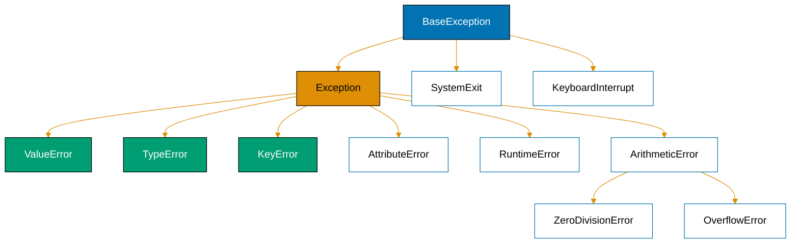
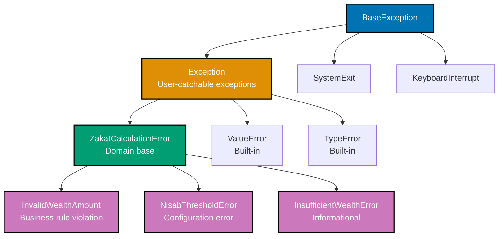
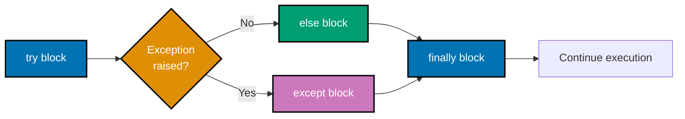
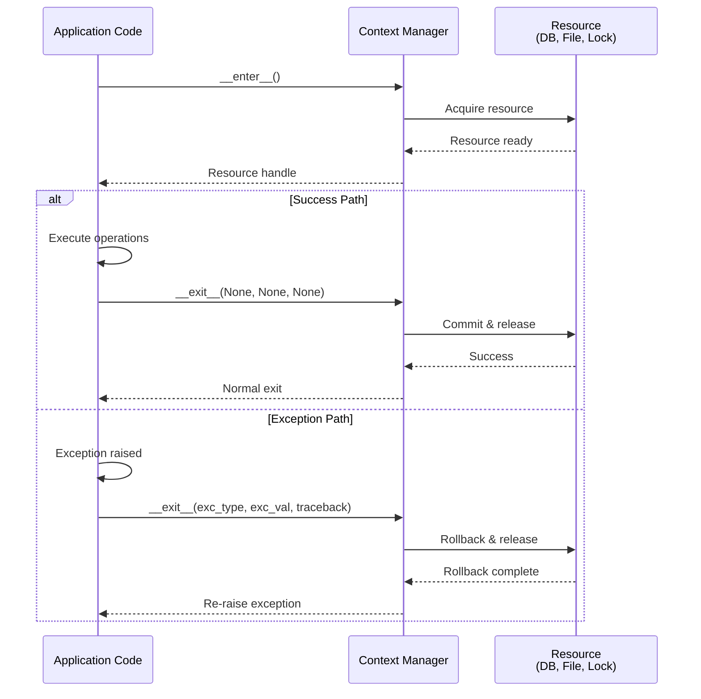
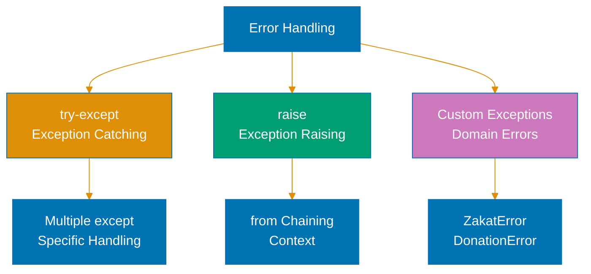

# Python Error Handling

**Quick Reference**: [Overview](#overview) | [Exception Hierarchy](#exception-hierarchy) | [try/except/else/finally](#tryexceptelsefinally) | [Context Managers](#context-managers) | [Custom Exceptions](#custom-exceptions) | [Result Types](#result-types) | [Error Wrapping](#error-wrapping) | [Logging](#logging-best-practices) | [Financial Domain](#financial-domain-error-handling) | [References](#references)

## Overview

Robust error handling ensures Python applications fail gracefully, provide clear diagnostics, and maintain data integrity. For financial applications processing Zakat calculations, Murabaha contracts, and QardHasan loans, proper error handling prevents data corruption and provides audit trails.

### Why Error Handling Matters

**Data Integrity**: Prevent partial state changes during failures.

**Debugging**: Clear error messages accelerate troubleshooting.

**User Experience**: Graceful degradation instead of cryptic crashes.

**Auditability**: Logged errors provide financial audit trails.

**Security**: Prevent information leakage through error messages.

**Recovery**: Enable automatic retry and fallback strategies.

### Error Handling Philosophy

Python follows **EAFP** (Easier to Ask for Forgiveness than Permission):

- **Try the operation** - Attempt what you need directly
- **Handle exceptions** - Catch and respond to failures
- **Avoid pre-checks** - Don't test conditions before attempting

This contrasts with **LBYL** (Look Before You Leap) which tests conditions before operations.

## Exception Hierarchy

Understanding Python's exception hierarchy enables appropriate exception handling.

### Built-in Exception Hierarchy



**Key exceptions**:

- **BaseException**: Base for all exceptions (rarely caught)
- **Exception**: Base for user-catchable exceptions
- **ValueError**: Invalid value (e.g., `Decimal("invalid")`)
- **TypeError**: Wrong type (e.g., `"text" + 5`)
- **KeyError**: Missing dictionary key
- **AttributeError**: Missing attribute

### Catching Specific Exceptions

```python
# GOOD: Catch specific exceptions
from decimal import Decimal, InvalidOperation


def parse_zakat_amount(amount_str: str) -> Decimal:
    """Parse Zakat amount from string with specific exception handling."""
    try:
        amount = Decimal(amount_str)
        if amount < 0:
            raise ValueError("Zakat amount cannot be negative")
        return amount
    except InvalidOperation as e:
        raise ValueError(f"Invalid Zakat amount format: {amount_str}") from e


# BAD: Bare except catches everything
def parse_zakat_amount(amount_str: str) -> Decimal:
    try:
        return Decimal(amount_str)
    except:  # BAD: Catches KeyboardInterrupt, SystemExit, etc.
        return Decimal("0")  # BAD: Silent failure
```

**Why this matters**: Specific exceptions document expected failures. Bare `except:` catches system exceptions (KeyboardInterrupt, SystemExit). Exception chaining (`from e`) preserves debugging context.

### Exception Hierarchy for Custom Exceptions



**Exception hierarchy design**:

- **BaseException**: Catch-all #40;rarely used, includes system exceptions#41;
- **Exception**: User-catchable base for application exceptions
- **ZakatCalculationError**: Domain-specific base for Zakat errors
- **Specific errors**: Concrete exception types for precise error handling

## try/except/else/finally

Python's exception handling provides four clauses for different scenarios.

### Basic try/except

```python
# GOOD: Basic exception handling
from decimal import Decimal, InvalidOperation


def calculate_murabaha_profit(
    asset_cost_str: str,
    profit_margin_str: str,
) -> Decimal:
    """Calculate Murabaha profit with error handling."""
    try:
        asset_cost = Decimal(asset_cost_str)
        profit_margin = Decimal(profit_margin_str)

        if asset_cost <= 0:
            raise ValueError("Asset cost must be positive")
        if not (0 <= profit_margin <= 1):
            raise ValueError("Profit margin must be between 0 and 1")

        return asset_cost * profit_margin

    except InvalidOperation as e:
        raise ValueError(f"Invalid decimal format: {e}") from e


# Usage
try:
    profit = calculate_murabaha_profit("200000.00", "0.15")
    print(f"Profit: ${profit}")
except ValueError as e:
    print(f"Error: {e}")
```

**Why this matters**: try/except isolates error-prone code. Specific exceptions enable targeted error handling. Users receive meaningful error messages.

### try/except/else

```python
# GOOD: Use else for success-only code
from typing import Dict
from decimal import Decimal


def record_donation_payment(
    donor_id: str,
    amount: Decimal,
    campaigns: Dict[str, dict],
) -> None:
    """Record donation payment with else clause."""
    try:
        campaign = campaigns[donor_id]  # May raise KeyError
        current_total = campaign.get("total", Decimal("0"))
    except KeyError:
        print(f"Campaign not found for donor: {donor_id}")
        return
    else:
        # Only runs if no exception occurred
        new_total = current_total + amount
        campaign["total"] = new_total
        print(f"Donation recorded: ${amount} (new total: ${new_total})")


# BAD: Success code mixed with try block
def record_donation_payment(donor_id, amount, campaigns):
    try:
        campaign = campaigns[donor_id]  # May raise KeyError
        current_total = campaign.get("total", Decimal("0"))
        new_total = current_total + amount  # BAD: Could catch wrong exception
        campaign["total"] = new_total
        print(f"Donation recorded")
    except KeyError:
        print(f"Campaign not found")
```

**Why this matters**: `else` clause runs only if no exception occurred. Separates error-prone code from success-only logic. Prevents catching unintended exceptions.

### try/except/else/finally Control Flow



**Flow explanation**:

- **try**: Code that might raise exceptions
- **except**: Handles specific exceptions
- **else**: Executes only if no exception occurred #40;success path#41;
- **finally**: Always executes for cleanup #40;even if exception occurred#41;

### try/except/finally

```python
# GOOD: Use finally for cleanup
import json
from pathlib import Path


def save_zakat_records(records: list, filepath: Path) -> None:
    """Save Zakat records with guaranteed cleanup."""
    file_handle = None
    try:
        file_handle = filepath.open("w")
        json.dump(records, file_handle, indent=2)
        print(f"Saved {len(records)} records")
    except IOError as e:
        print(f"Error saving records: {e}")
        raise
    finally:
        # Always runs, even if exception occurred
        if file_handle is not None:
            file_handle.close()
            print("File closed")


# BETTER: Use context manager instead
def save_zakat_records(records: list, filepath: Path) -> None:
    """Save Zakat records with context manager (cleaner)."""
    try:
        with filepath.open("w") as f:
            json.dump(records, f, indent=2)
        print(f"Saved {len(records)} records")
    except IOError as e:
        print(f"Error saving records: {e}")
        raise
```

**Why this matters**: `finally` guarantees cleanup code execution. Runs even if exception occurs or early return. Context managers (`with`) often cleaner than `finally`.

## Context Managers

Context managers ensure resource cleanup even when exceptions occur.

### File Handling

```python
# GOOD: Context manager ensures file closure
from pathlib import Path
import json


def load_zakat_configuration(filepath: Path) -> dict:
    """Load Zakat configuration with automatic cleanup."""
    try:
        with filepath.open("r") as f:
            config = json.load(f)
        return config
    except FileNotFoundError:
        print(f"Configuration file not found: {filepath}")
        return {}
    except json.JSONDecodeError as e:
        print(f"Invalid JSON in configuration: {e}")
        return {}
    # File automatically closed even if exception occurs


# BAD: Manual file handling
def load_zakat_configuration(filepath: Path) -> dict:
    f = None
    try:
        f = filepath.open("r")
        config = json.load(f)
        return config
    except FileNotFoundError:
        return {}
    finally:
        if f is not None:
            f.close()  # BAD: Manual cleanup required
```

**Why this matters**: `with` statement guarantees resource cleanup. Prevents resource leaks. Reduces boilerplate `try/finally` code.

### Database Transactions

```python
# GOOD: Context manager for atomic transactions
from contextlib import contextmanager
from typing import Iterator
from decimal import Decimal


class DatabaseConnection:
    """Database connection with transaction support."""

    def __init__(self, connection_string: str):
        self.connection_string = connection_string
        self.in_transaction = False

    @contextmanager
    def transaction(self) -> Iterator[None]:
        """Context manager for atomic database transactions."""
        self.in_transaction = True
        try:
            yield  # Execute code block
            self.commit()
            print("Transaction committed")
        except Exception as e:
            self.rollback()
            print(f"Transaction rolled back: {e}")
            raise  # Re-raise after rollback
        finally:
            self.in_transaction = False

    def commit(self) -> None:
        """Commit transaction (placeholder)."""
        print("COMMIT executed")

    def rollback(self) -> None:
        """Rollback transaction (placeholder)."""
        print("ROLLBACK executed")


# Usage: Automatic commit/rollback
db = DatabaseConnection("postgresql://localhost/ose")


def transfer_zakat_funds(
    from_account: str,
    to_account: str,
    amount: Decimal,
) -> None:
    """Transfer Zakat funds atomically."""
    with db.transaction():
        # Both operations succeed or both rollback
        db.debit_account(from_account, amount)
        db.credit_account(to_account, amount)
    # Automatically commits if no exception, rolls back otherwise
```

**Why this matters**: Context managers make transactions atomic. Automatic rollback on exceptions prevents partial state. Clean separation of business logic and transaction control.

### Context Manager Error Handling Flow



**Why this matters**: Context managers guarantee cleanup via `__exit__`. Automatic rollback on exceptions. Transaction-safe by design.

### Custom Context Managers

```python
# GOOD: Custom context manager for performance timing
from contextlib import contextmanager
from time import perf_counter
from typing import Iterator
import logging


@contextmanager
def timing_context(operation_name: str) -> Iterator[None]:
    """Context manager for timing expensive operations."""
    start_time = perf_counter()
    logger = logging.getLogger(__name__)

    try:
        logger.info(f"Starting {operation_name}")
        yield
    except Exception as e:
        logger.error(f"{operation_name} failed: {e}")
        raise
    finally:
        elapsed = perf_counter() - start_time
        logger.info(f"{operation_name} completed in {elapsed:.3f}s")


# Usage
with timing_context("Zakat calculation batch"):
    results = calculate_all_zakat_obligations(wealth_records)
# Automatically logs timing on exit
```

**Why this matters**: Custom context managers encapsulate setup/teardown patterns. Reusable across codebase. Guarantee cleanup execution.

## Custom Exceptions

Custom exceptions provide domain-specific error types and context.

### Defining Custom Exceptions

```python
# GOOD: Domain-specific custom exceptions
from decimal import Decimal


class ZakatCalculationError(Exception):
    """Base exception for Zakat calculation errors."""

    pass


class InvalidWealthAmount(ZakatCalculationError):
    """Raised when wealth amount is invalid."""

    def __init__(self, wealth_amount: Decimal, reason: str):
        self.wealth_amount = wealth_amount
        self.reason = reason
        super().__init__(f"Invalid wealth amount {wealth_amount}: {reason}")


class NisabThresholdError(ZakatCalculationError):
    """Raised when nisab threshold is invalid."""

    def __init__(self, nisab: Decimal, reason: str):
        self.nisab = nisab
        self.reason = reason
        super().__init__(f"Invalid nisab threshold {nisab}: {reason}")


class InsufficientWealthError(ZakatCalculationError):
    """Raised when wealth is below nisab threshold (informational)."""

    def __init__(self, wealth_amount: Decimal, nisab: Decimal):
        self.wealth_amount = wealth_amount
        self.nisab = nisab
        deficit = nisab - wealth_amount
        super().__init__(
            f"Wealth ${wealth_amount} below nisab ${nisab} (deficit: ${deficit})"
        )


# Usage
def calculate_zakat_obligation(
    wealth_amount: Decimal,
    nisab_threshold: Decimal,
) -> Decimal:
    """Calculate Zakat obligation with custom exceptions."""
    if wealth_amount < 0:
        raise InvalidWealthAmount(wealth_amount, "cannot be negative")

    if nisab_threshold <= 0:
        raise NisabThresholdError(nisab_threshold, "must be positive")

    if wealth_amount < nisab_threshold:
        raise InsufficientWealthError(wealth_amount, nisab_threshold)

    return wealth_amount * Decimal("0.025")


# Client code can handle specifically
try:
    zakat = calculate_zakat_obligation(Decimal("50000"), Decimal("85000"))
except InsufficientWealthError as e:
    print(f"No Zakat obligation: {e}")
except ZakatCalculationError as e:
    print(f"Calculation error: {e}")
```

**Why this matters**: Custom exceptions provide domain context. Exception attributes preserve error details. Hierarchical exceptions enable specific or general handling.

## Result Types

Result types provide explicit error handling without exceptions (functional approach).

### Option Type Pattern

```python
# GOOD: Option type for optional values
from typing import Optional, TypeVar
from dataclasses import dataclass
from decimal import Decimal


T = TypeVar("T")


@dataclass(frozen=True)
class Some:
    """Some value present."""

    value: T


@dataclass(frozen=True)
class Nothing:
    """No value present."""

    pass


Option = Some[T] | Nothing


def find_campaign_by_id(
    campaigns: list[dict],
    campaign_id: str,
) -> Option[dict]:
    """Find campaign by ID, returning Option."""
    for campaign in campaigns:
        if campaign.get("id") == campaign_id:
            return Some(campaign)
    return Nothing()


# Usage: Explicit None handling
result = find_campaign_by_id(campaigns, "CAMP-001")

if isinstance(result, Some):
    campaign = result.value
    print(f"Found: {campaign['name']}")
else:
    print("Campaign not found")
```

**Why this matters**: Option type makes optionality explicit. Forces callers to handle missing values. Prevents null reference errors.

### Result Type Pattern

```python
# GOOD: Result type for error-or-success
from typing import Generic, TypeVar
from dataclasses import dataclass
from decimal import Decimal


T = TypeVar("T")
E = TypeVar("E")


@dataclass(frozen=True)
class Ok(Generic[T]):
    """Successful result with value."""

    value: T


@dataclass(frozen=True)
class Err(Generic[E]):
    """Failed result with error."""

    error: E


Result = Ok[T] | Err[E]


def parse_monetary_amount(amount_str: str) -> Result[Decimal, str]:
    """Parse monetary amount, returning Result."""
    try:
        amount = Decimal(amount_str)
        if amount < 0:
            return Err("Amount cannot be negative")
        return Ok(amount)
    except Exception as e:
        return Err(f"Invalid decimal format: {e}")


# Usage: Explicit error handling
result = parse_monetary_amount("100000.00")

if isinstance(result, Ok):
    amount = result.value
    print(f"Parsed: ${amount}")
else:
    error = result.error
    print(f"Error: {error}")
```

**Why this matters**: Result type makes errors explicit return values. Forces callers to handle both success and failure. Railway-oriented programming pattern.

## Error Wrapping

Error wrapping provides context while preserving original exception.

### Exception Chaining

```python
# GOOD: Exception chaining with 'from'
from decimal import Decimal, InvalidOperation


class ZakatServiceError(Exception):
    """Base exception for Zakat service errors."""

    pass


def calculate_zakat_from_input(
    wealth_input: str,
    nisab_input: str,
) -> Decimal:
    """Calculate Zakat from string inputs with error wrapping."""
    try:
        wealth_amount = Decimal(wealth_input)
    except InvalidOperation as e:
        raise ZakatServiceError(
            f"Invalid wealth amount format: {wealth_input}"
        ) from e

    try:
        nisab_threshold = Decimal(nisab_input)
    except InvalidOperation as e:
        raise ZakatServiceError(
            f"Invalid nisab threshold format: {nisab_input}"
        ) from e

    if wealth_amount >= nisab_threshold:
        return wealth_amount * Decimal("0.025")
    return Decimal("0")


# Usage: Preserves original exception in traceback
try:
    zakat = calculate_zakat_from_input("100000.00", "invalid")
except ZakatServiceError as e:
    print(f"Service error: {e}")
    print(f"Original cause: {e.__cause__}")  # InvalidOperation
```

**Why this matters**: `raise ... from e` preserves exception chain. Traceback shows both high-level and root cause. Debugging easier with full context.

## Logging Best Practices

Logging provides observability and audit trails for error diagnosis.

### Structured Logging

```python
# GOOD: Structured logging with context
import logging
from decimal import Decimal
from typing import Dict, Any


# Configure logging
logging.basicConfig(
    level=logging.INFO,
    format="%(asctime)s - %(name)s - %(levelname)s - %(message)s",
)

logger = logging.getLogger(__name__)


def calculate_zakat_with_logging(
    payer_id: str,
    wealth_amount: Decimal,
    nisab_threshold: Decimal,
) -> Decimal:
    """Calculate Zakat with comprehensive logging."""
    context: Dict[str, Any] = {
        "payer_id": payer_id,
        "wealth_amount": str(wealth_amount),
        "nisab_threshold": str(nisab_threshold),
    }

    logger.info(f"Starting Zakat calculation: {context}")

    try:
        if wealth_amount < 0:
            logger.error(f"Negative wealth amount: {context}")
            raise ValueError("Wealth amount cannot be negative")

        if wealth_amount >= nisab_threshold:
            zakat_amount = wealth_amount * Decimal("0.025")
            context["zakat_amount"] = str(zakat_amount)
            logger.info(f"Zakat calculated: {context}")
            return zakat_amount
        else:
            logger.info(f"Wealth below nisab, no Zakat owed: {context}")
            return Decimal("0")

    except Exception as e:
        context["error"] = str(e)
        context["error_type"] = type(e).__name__
        logger.exception(f"Zakat calculation failed: {context}")
        raise


# BAD: Minimal logging
def calculate_zakat_with_logging(payer_id, wealth_amount, nisab_threshold):
    try:
        if wealth_amount >= nisab_threshold:
            return wealth_amount * Decimal("0.025")
        return Decimal("0")
    except Exception:
        logger.error("Error")  # BAD: No context
        raise
```

**Why this matters**: Structured logging provides context for debugging. Consistent format enables log parsing. Exception logging includes full traceback. Audit trail for financial operations.

### Log Levels

```python
# GOOD: Appropriate log levels
import logging

logger = logging.getLogger(__name__)


def process_donation_batch(donations: list[dict]) -> None:
    """Process donation batch with appropriate logging levels."""
    logger.info(f"Processing {len(donations)} donations")

    successful = 0
    failed = 0

    for donation in donations:
        try:
            donor_id = donation["donor_id"]
            amount = Decimal(donation["amount"])

            logger.debug(f"Processing donation: {donor_id}, ${amount}")

            if amount <= 0:
                logger.warning(
                    f"Skipping invalid donation: {donor_id}, ${amount}"
                )
                failed += 1
                continue

            # Process donation
            record_donation(donor_id, amount)
            successful += 1

        except KeyError as e:
            logger.error(f"Missing required field in donation: {e}")
            failed += 1
        except Exception as e:
            logger.exception(f"Unexpected error processing donation: {e}")
            failed += 1

    logger.info(
        f"Batch complete: {successful} successful, {failed} failed"
    )
```

**Log level guidelines**:

- **DEBUG**: Detailed diagnostic information
- **INFO**: General informational messages
- **WARNING**: Warning messages (potential issues)
- **ERROR**: Error messages (operation failed)
- **CRITICAL**: Critical failures (system-wide impact)

## Financial Domain Error Handling

### Zakat Calculation Errors

```python
# GOOD: Comprehensive Zakat calculation error handling
from decimal import Decimal, InvalidOperation
import logging


class ZakatCalculationError(Exception):
    """Base for Zakat calculation errors."""

    pass


logger = logging.getLogger(__name__)


def calculate_zakat_safe(
    payer_id: str,
    wealth_amount: Decimal,
    nisab_threshold: Decimal,
) -> tuple[bool, Decimal, str]:
    """Calculate Zakat with safe error handling.

    Returns:
        (success, zakat_amount, message)
    """
    context = {
        "payer_id": payer_id,
        "wealth": str(wealth_amount),
        "nisab": str(nisab_threshold),
    }

    try:
        # Validation
        if wealth_amount < 0:
            msg = "Wealth amount cannot be negative"
            logger.warning(f"{msg}: {context}")
            return (False, Decimal("0"), msg)

        if nisab_threshold <= 0:
            msg = "Nisab threshold must be positive"
            logger.error(f"{msg}: {context}")
            return (False, Decimal("0"), msg)

        # Calculation
        if wealth_amount >= nisab_threshold:
            zakat_amount = wealth_amount * Decimal("0.025")
            logger.info(f"Zakat calculated: {zakat_amount}, {context}")
            return (True, zakat_amount, "Zakat calculated successfully")
        else:
            logger.info(f"Wealth below nisab: {context}")
            return (True, Decimal("0"), "Wealth below nisab threshold")

    except InvalidOperation as e:
        msg = f"Decimal operation error: {e}"
        logger.exception(f"{msg}: {context}")
        return (False, Decimal("0"), msg)
    except Exception as e:
        msg = f"Unexpected error: {e}"
        logger.exception(f"{msg}: {context}")
        return (False, Decimal("0"), msg)
```

**Why this matters**: Safe wrapper returns success/failure tuple. All errors logged with context. Graceful degradation instead of crashes. Financial audit trail preserved.

## References

### Official Documentation

- [Python Exceptions](https://docs.python.org/3/tutorial/errors.html)
- [Built-in Exceptions](https://docs.python.org/3/library/exceptions.html)
- [contextlib Module](https://docs.python.org/3/library/contextlib.html)
- [logging Module](https://docs.python.org/3/library/logging.html)

### Related Documentation

- [Best Practices](./ex-soen-prla-py__best-practices.md) - Python coding standards
- [Idioms](./ex-soen-prla-py__idioms.md) - Pythonic patterns
- [Type Safety](./ex-soen-prla-py__type-safety.md) - Type hints and validation
- [Security](./ex-soen-prla-py__security.md) - Secure coding practices

### Books

- "Python Tricks" by Dan Bader - Error handling patterns
- "Robust Python" by Patrick Viafore - Error handling strategies

---

**Last Updated**: 2025-01-23
**Python Version**: 3.11+ (baseline), 3.12+ (stable maintenance), 3.14.x (latest stable)
**Maintainers**: OSE Platform Documentation Team

## Python Error Handling


