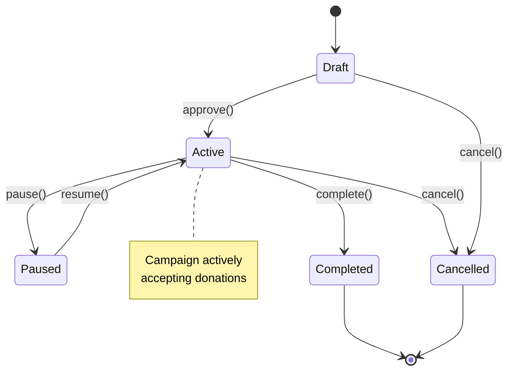
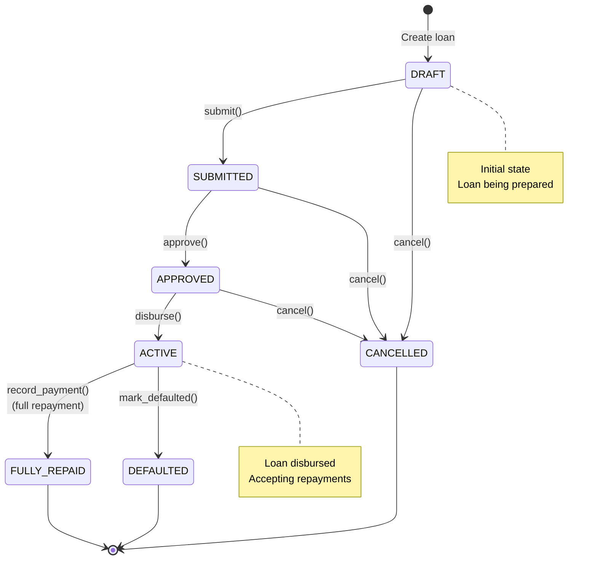
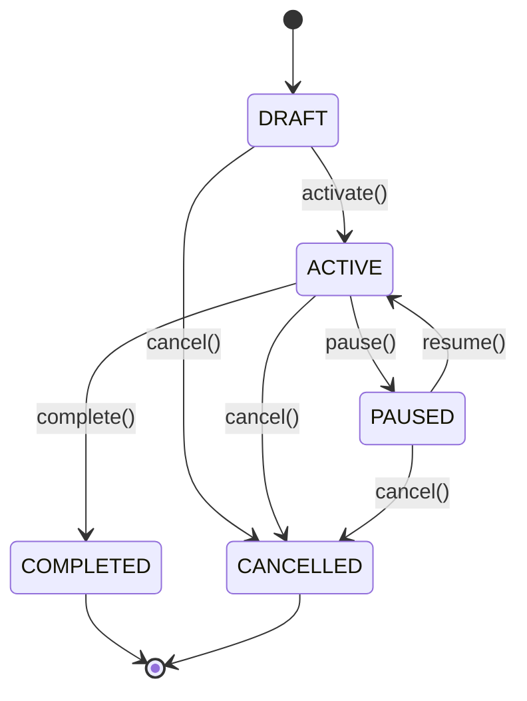
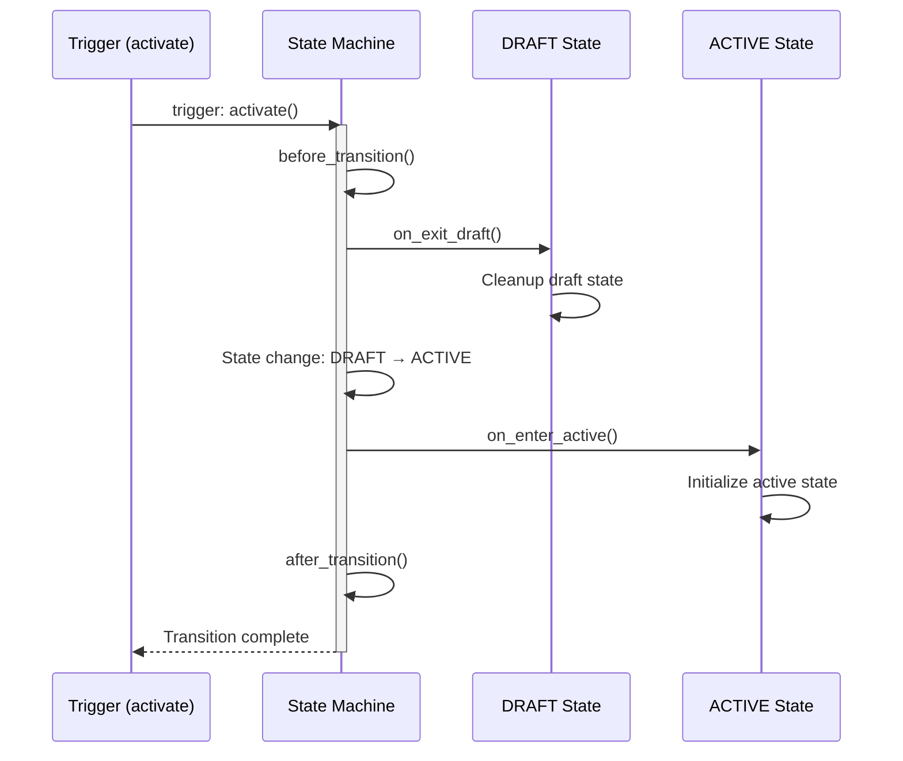
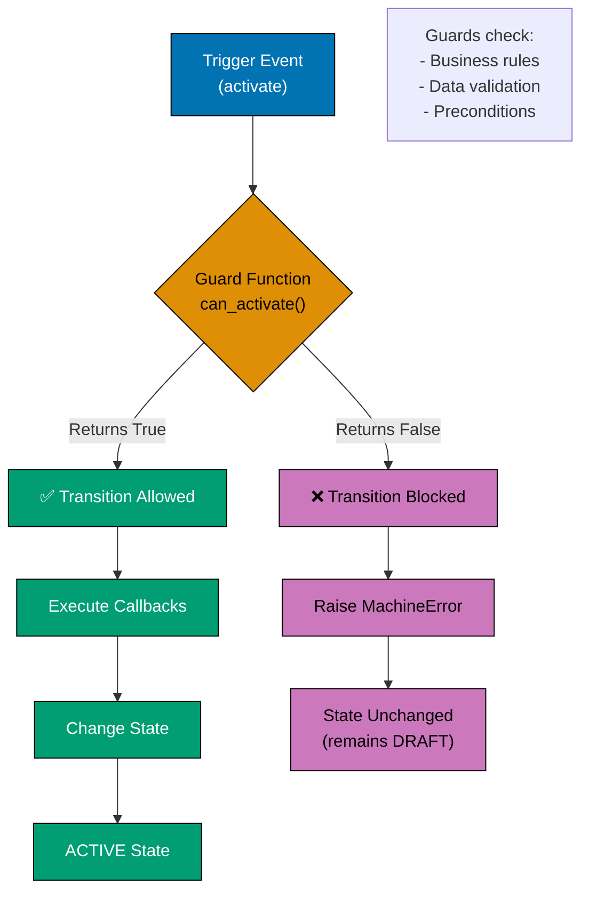
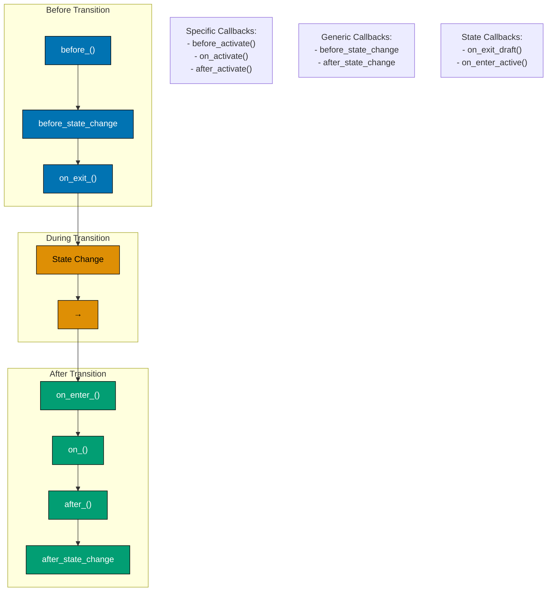
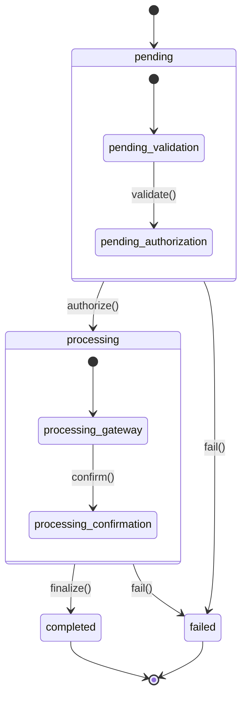
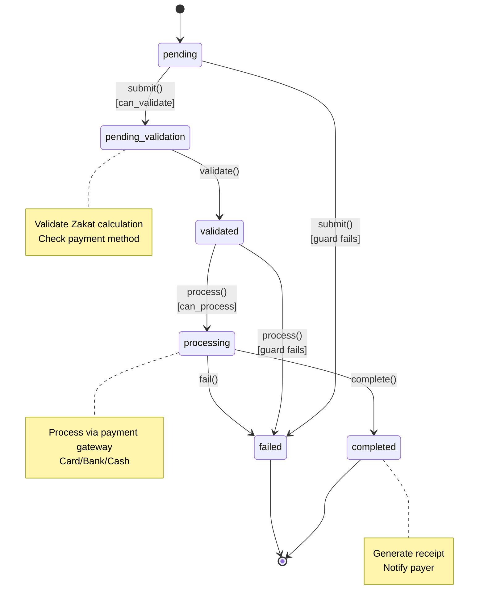

# Finite State Machines in Python

**Quick Reference**: [Overview](#overview) | [State Pattern](#state-pattern) | [transitions Library](#transitions-library) | [Event-Driven FSM](#event-driven-fsm) | [Guards and Conditions](#guards-and-conditions) | [Callbacks and Hooks](#callbacks-and-hooks) | [Nested State Machines](#nested-state-machines) | [Financial Domain FSMs](#financial-domain-fsms) | [Best Practices](#fsm-best-practices) | [References](#references)

## Overview

Finite State Machines (FSM) model systems that exist in one state at a time and transition between states based on events. For OSE Platform financial applications, FSMs manage loan lifecycles, campaign statuses, and payment workflows with clear state transitions and validation rules.



### FSM Benefits

**Explicit States**: Clear enumeration of all possible states.

**Controlled Transitions**: Only valid state transitions allowed.

**Business Logic Clarity**: State-specific behavior isolated.

**Validation**: Guards ensure preconditions before transitions.

**Audit Trail**: State changes logged automatically.

## State Pattern

Manual FSM implementation using state pattern.

### QardHasan Loan State Transitions



**Key States**:

- DRAFT: Loan being prepared
- SUBMITTED: Awaiting approval
- APPROVED: Approved, awaiting disbursement
- ACTIVE: Funds disbursed, accepting repayments
- FULLY_REPAID: All payments complete (terminal)
- DEFAULTED: Borrower defaulted (terminal)
- CANCELLED: Loan cancelled (terminal)

### Basic State Pattern

```python
# GOOD: State pattern implementation
from abc import ABC, abstractmethod
from enum import Enum
from decimal import Decimal
from dataclasses import dataclass
from typing import Optional


class LoanStatus(str, Enum):
    """Loan status enumeration."""

    DRAFT = "draft"
    SUBMITTED = "submitted"
    APPROVED = "approved"
    ACTIVE = "active"
    FULLY_REPAID = "fully_repaid"
    DEFAULTED = "defaulted"
    CANCELLED = "cancelled"


@dataclass
class QardHasanLoan:
    """QardHasan (interest-free) loan entity."""

    id: str
    borrower_id: str
    principal: Decimal
    repaid: Decimal
    status: LoanStatus
    state: "LoanState"

    def submit(self) -> None:
        """Submit loan for approval."""
        self.state.submit(self)

    def approve(self) -> None:
        """Approve loan."""
        self.state.approve(self)

    def disburse(self) -> None:
        """Disburse loan funds."""
        self.state.disburse(self)

    def record_payment(self, amount: Decimal) -> None:
        """Record loan repayment."""
        self.state.record_payment(self, amount)

    def mark_defaulted(self) -> None:
        """Mark loan as defaulted."""
        self.state.mark_defaulted(self)

    def cancel(self) -> None:
        """Cancel loan."""
        self.state.cancel(self)


class LoanState(ABC):
    """Abstract loan state."""

    @abstractmethod
    def submit(self, loan: QardHasanLoan) -> None:
        """Submit loan for approval."""
        raise NotImplementedError

    @abstractmethod
    def approve(self, loan: QardHasanLoan) -> None:
        """Approve loan."""
        raise NotImplementedError

    @abstractmethod
    def disburse(self, loan: QardHasanLoan) -> None:
        """Disburse loan."""
        raise NotImplementedError

    @abstractmethod
    def record_payment(self, loan: QardHasanLoan, amount: Decimal) -> None:
        """Record payment."""
        raise NotImplementedError

    @abstractmethod
    def mark_defaulted(self, loan: QardHasanLoan) -> None:
        """Mark as defaulted."""
        raise NotImplementedError

    @abstractmethod
    def cancel(self, loan: QardHasanLoan) -> None:
        """Cancel loan."""
        raise NotImplementedError


class DraftState(LoanState):
    """Draft state - loan not yet submitted."""

    def submit(self, loan: QardHasanLoan) -> None:
        """Submit loan for approval."""
        loan.status = LoanStatus.SUBMITTED
        loan.state = SubmittedState()

    def approve(self, loan: QardHasanLoan) -> None:
        """Cannot approve draft loan."""
        raise ValueError("Cannot approve loan in draft state")

    def disburse(self, loan: QardHasanLoan) -> None:
        """Cannot disburse draft loan."""
        raise ValueError("Cannot disburse loan in draft state")

    def record_payment(self, loan: QardHasanLoan, amount: Decimal) -> None:
        """Cannot record payment for draft loan."""
        raise ValueError("Cannot record payment for draft loan")

    def mark_defaulted(self, loan: QardHasanLoan) -> None:
        """Cannot mark draft loan as defaulted."""
        raise ValueError("Cannot mark draft loan as defaulted")

    def cancel(self, loan: QardHasanLoan) -> None:
        """Cancel draft loan."""
        loan.status = LoanStatus.CANCELLED
        loan.state = CancelledState()


class SubmittedState(LoanState):
    """Submitted state - awaiting approval."""

    def submit(self, loan: QardHasanLoan) -> None:
        """Already submitted."""
        raise ValueError("Loan already submitted")

    def approve(self, loan: QardHasanLoan) -> None:
        """Approve loan."""
        loan.status = LoanStatus.APPROVED
        loan.state = ApprovedState()

    def disburse(self, loan: QardHasanLoan) -> None:
        """Cannot disburse without approval."""
        raise ValueError("Cannot disburse loan without approval")

    def record_payment(self, loan: QardHasanLoan, amount: Decimal) -> None:
        """Cannot record payment before disbursement."""
        raise ValueError("Cannot record payment before disbursement")

    def mark_defaulted(self, loan: QardHasanLoan) -> None:
        """Cannot mark as defaulted before disbursement."""
        raise ValueError("Cannot mark as defaulted before disbursement")

    def cancel(self, loan: QardHasanLoan) -> None:
        """Cancel submitted loan."""
        loan.status = LoanStatus.CANCELLED
        loan.state = CancelledState()


class ApprovedState(LoanState):
    """Approved state - ready for disbursement."""

    def submit(self, loan: QardHasanLoan) -> None:
        """Already submitted."""
        raise ValueError("Loan already submitted")

    def approve(self, loan: QardHasanLoan) -> None:
        """Already approved."""
        raise ValueError("Loan already approved")

    def disburse(self, loan: QardHasanLoan) -> None:
        """Disburse loan funds."""
        loan.status = LoanStatus.ACTIVE
        loan.state = ActiveState()

    def record_payment(self, loan: QardHasanLoan, amount: Decimal) -> None:
        """Cannot record payment before disbursement."""
        raise ValueError("Cannot record payment before disbursement")

    def mark_defaulted(self, loan: QardHasanLoan) -> None:
        """Cannot mark as defaulted before disbursement."""
        raise ValueError("Cannot mark as defaulted before disbursement")

    def cancel(self, loan: QardHasanLoan) -> None:
        """Cancel approved loan."""
        loan.status = LoanStatus.CANCELLED
        loan.state = CancelledState()


class ActiveState(LoanState):
    """Active state - loan disbursed, accepting repayments."""

    def submit(self, loan: QardHasanLoan) -> None:
        """Already active."""
        raise ValueError("Loan already active")

    def approve(self, loan: QardHasanLoan) -> None:
        """Already approved."""
        raise ValueError("Loan already approved")

    def disburse(self, loan: QardHasanLoan) -> None:
        """Already disbursed."""
        raise ValueError("Loan already disbursed")

    def record_payment(self, loan: QardHasanLoan, amount: Decimal) -> None:
        """Record loan repayment."""
        if amount <= 0:
            raise ValueError("Payment amount must be positive")

        if amount > (loan.principal - loan.repaid):
            raise ValueError("Payment exceeds remaining balance")

        loan.repaid += amount

        # Transition to fully repaid if balance is zero
        if loan.repaid == loan.principal:
            loan.status = LoanStatus.FULLY_REPAID
            loan.state = FullyRepaidState()

    def mark_defaulted(self, loan: QardHasanLoan) -> None:
        """Mark loan as defaulted."""
        loan.status = LoanStatus.DEFAULTED
        loan.state = DefaultedState()

    def cancel(self, loan: QardHasanLoan) -> None:
        """Cannot cancel active loan."""
        raise ValueError("Cannot cancel active loan")


class FullyRepaidState(LoanState):
    """Fully repaid state - terminal state."""

    def submit(self, loan: QardHasanLoan) -> None:
        """Cannot submit fully repaid loan."""
        raise ValueError("Loan already fully repaid")

    def approve(self, loan: QardHasanLoan) -> None:
        """Cannot approve fully repaid loan."""
        raise ValueError("Loan already fully repaid")

    def disburse(self, loan: QardHasanLoan) -> None:
        """Cannot disburse fully repaid loan."""
        raise ValueError("Loan already fully repaid")

    def record_payment(self, loan: QardHasanLoan, amount: Decimal) -> None:
        """Cannot record payment for fully repaid loan."""
        raise ValueError("Loan already fully repaid")

    def mark_defaulted(self, loan: QardHasanLoan) -> None:
        """Cannot mark fully repaid loan as defaulted."""
        raise ValueError("Loan already fully repaid")

    def cancel(self, loan: QardHasanLoan) -> None:
        """Cannot cancel fully repaid loan."""
        raise ValueError("Loan already fully repaid")


class DefaultedState(LoanState):
    """Defaulted state - terminal state."""

    def submit(self, loan: QardHasanLoan) -> None:
        """Cannot submit defaulted loan."""
        raise ValueError("Loan already defaulted")

    def approve(self, loan: QardHasanLoan) -> None:
        """Cannot approve defaulted loan."""
        raise ValueError("Loan already defaulted")

    def disburse(self, loan: QardHasanLoan) -> None:
        """Cannot disburse defaulted loan."""
        raise ValueError("Loan already defaulted")

    def record_payment(self, loan: QardHasanLoan, amount: Decimal) -> None:
        """Cannot record payment for defaulted loan."""
        raise ValueError("Loan already defaulted")

    def mark_defaulted(self, loan: QardHasanLoan) -> None:
        """Already defaulted."""
        raise ValueError("Loan already defaulted")

    def cancel(self, loan: QardHasanLoan) -> None:
        """Cannot cancel defaulted loan."""
        raise ValueError("Loan already defaulted")


class CancelledState(LoanState):
    """Cancelled state - terminal state."""

    def submit(self, loan: QardHasanLoan) -> None:
        """Cannot submit cancelled loan."""
        raise ValueError("Loan already cancelled")

    def approve(self, loan: QardHasanLoan) -> None:
        """Cannot approve cancelled loan."""
        raise ValueError("Loan already cancelled")

    def disburse(self, loan: QardHasanLoan) -> None:
        """Cannot disburse cancelled loan."""
        raise ValueError("Loan already cancelled")

    def record_payment(self, loan: QardHasanLoan, amount: Decimal) -> None:
        """Cannot record payment for cancelled loan."""
        raise ValueError("Loan already cancelled")

    def mark_defaulted(self, loan: QardHasanLoan) -> None:
        """Cannot mark cancelled loan as defaulted."""
        raise ValueError("Loan already cancelled")

    def cancel(self, loan: QardHasanLoan) -> None:
        """Already cancelled."""
        raise ValueError("Loan already cancelled")
```

**Why this matters**: State pattern encapsulates state-specific behavior. Each state class handles transitions. Invalid transitions raise errors. Type-safe and explicit.

### Using State Pattern

```python
# GOOD: Using state pattern
from decimal import Decimal


# Create loan in draft state
loan = QardHasanLoan(
    id="QL-2025-001",
    borrower_id="BORROWER-123",
    principal=Decimal("50000"),
    repaid=Decimal("0"),
    status=LoanStatus.DRAFT,
    state=DraftState(),
)

# Submit for approval
loan.submit()
assert loan.status == LoanStatus.SUBMITTED

# Approve loan
loan.approve()
assert loan.status == LoanStatus.APPROVED

# Disburse funds
loan.disburse()
assert loan.status == LoanStatus.ACTIVE

# Record repayments
loan.record_payment(Decimal("20000"))
assert loan.repaid == Decimal("20000")

loan.record_payment(Decimal("30000"))
assert loan.status == LoanStatus.FULLY_REPAID


# Invalid transitions raise errors
try:
    loan.record_payment(Decimal("100"))  # Cannot pay fully repaid loan
except ValueError as e:
    print(f"Error: {e}")  # "Loan already fully repaid"
```

**Why this matters**: State pattern prevents invalid operations. Clear error messages. Type-safe transitions. Business rules encoded in states.

## transitions Library

transitions library provides declarative FSM with less boilerplate.

### Donation Campaign State Machine



### Installing transitions

```bash
pip install transitions
```

### Basic transitions FSM

```python
# GOOD: transitions library FSM
from transitions import Machine
from enum import Enum
from decimal import Decimal
from dataclasses import dataclass, field
from typing import List


class CampaignStatus(str, Enum):
    """Campaign status enumeration."""

    DRAFT = "draft"
    ACTIVE = "active"
    PAUSED = "paused"
    COMPLETED = "completed"
    CANCELLED = "cancelled"


@dataclass
class DonationCampaign:
    """Donation campaign with FSM."""

    id: str
    name: str
    target_amount: Decimal
    current_amount: Decimal = Decimal("0")
    donor_count: int = 0
    status: str = CampaignStatus.DRAFT.value
    state_history: List[str] = field(default_factory=list)


# Define state machine
states = [
    CampaignStatus.DRAFT.value,
    CampaignStatus.ACTIVE.value,
    CampaignStatus.PAUSED.value,
    CampaignStatus.COMPLETED.value,
    CampaignStatus.CANCELLED.value,
]

transitions_config = [
    {
        "trigger": "activate",
        "source": CampaignStatus.DRAFT.value,
        "dest": CampaignStatus.ACTIVE.value,
    },
    {
        "trigger": "pause",
        "source": CampaignStatus.ACTIVE.value,
        "dest": CampaignStatus.PAUSED.value,
    },
    {
        "trigger": "resume",
        "source": CampaignStatus.PAUSED.value,
        "dest": CampaignStatus.ACTIVE.value,
    },
    {
        "trigger": "complete",
        "source": CampaignStatus.ACTIVE.value,
        "dest": CampaignStatus.COMPLETED.value,
    },
    {
        "trigger": "cancel",
        "source": [CampaignStatus.DRAFT.value, CampaignStatus.ACTIVE.value],
        "dest": CampaignStatus.CANCELLED.value,
    },
]

# Create campaign with FSM
campaign = DonationCampaign(
    id="CAMP-001",
    name="Ramadan Relief",
    target_amount=Decimal("500000"),
)

machine = Machine(
    model=campaign,
    states=states,
    transitions=transitions_config,
    initial=CampaignStatus.DRAFT.value,
    auto_transitions=False,
)

# Use FSM
campaign.activate()
assert campaign.status == CampaignStatus.ACTIVE.value

campaign.pause()
assert campaign.status == CampaignStatus.PAUSED.value

campaign.resume()
assert campaign.status == CampaignStatus.ACTIVE.value
```

**Why this matters**: transitions library reduces boilerplate. Declarative configuration. Auto-validates transitions. Less code to maintain.

## Event-Driven FSM

FSMs respond to events with callbacks.

### FSM Callback Execution Order



**Callback Execution Order**:

1. `before_transition()` - Before state change
2. `on_exit_<source>()` - Exiting source state
3. **State change occurs**
4. `on_enter_<dest>()` - Entering destination state
5. `after_transition()` - After state change

### FSM with Callbacks

```python
# GOOD: FSM with before/after callbacks
from transitions import Machine
from decimal import Decimal
from datetime import datetime
from dataclasses import dataclass, field
from typing import List, Dict


@dataclass
class StateChange:
    """State change event."""

    from_state: str
    to_state: str
    trigger: str
    timestamp: datetime


@dataclass
class AuditedCampaign:
    """Campaign with audit trail."""

    id: str
    name: str
    target_amount: Decimal
    current_amount: Decimal = Decimal("0")
    status: str = "draft"
    state_changes: List[StateChange] = field(default_factory=list)

    def on_enter_active(self) -> None:
        """Callback when entering active state."""
        print(f"Campaign {self.name} is now active!")
        self._send_activation_notification()

    def on_exit_active(self) -> None:
        """Callback when exiting active state."""
        print(f"Campaign {self.name} is no longer active")

    def on_enter_completed(self) -> None:
        """Callback when entering completed state."""
        print(f"Campaign {self.name} completed!")
        self._generate_completion_report()

    def before_transition(self, event_data) -> None:
        """Callback before any transition."""
        print(f"Transitioning: {event_data.transition.source} -> {event_data.transition.dest}")

    def after_transition(self, event_data) -> None:
        """Callback after any transition."""
        # Record state change
        change = StateChange(
            from_state=event_data.transition.source,
            to_state=event_data.transition.dest,
            trigger=event_data.event.name,
            timestamp=datetime.utcnow(),
        )
        self.state_changes.append(change)

    def _send_activation_notification(self) -> None:
        """Send notification to donors (stub)."""
        pass

    def _generate_completion_report(self) -> None:
        """Generate completion report (stub)."""
        pass


# Create FSM with callbacks
states = ["draft", "active", "paused", "completed", "cancelled"]

transitions_config = [
    {"trigger": "activate", "source": "draft", "dest": "active"},
    {"trigger": "pause", "source": "active", "dest": "paused"},
    {"trigger": "resume", "source": "paused", "dest": "active"},
    {"trigger": "complete", "source": "active", "dest": "completed"},
    {"trigger": "cancel", "source": ["draft", "active"], "dest": "cancelled"},
]

campaign = AuditedCampaign(
    id="CAMP-002",
    name="Orphan Support",
    target_amount=Decimal("250000"),
)

machine = Machine(
    model=campaign,
    states=states,
    transitions=transitions_config,
    initial="draft",
    auto_transitions=False,
    before_state_change="before_transition",
    after_state_change="after_transition",
)

# Trigger transitions (callbacks fire automatically)
campaign.activate()
# Output: "Transitioning: draft -> active"
# Output: "Campaign Orphan Support is now active!"

campaign.pause()
# Output: "Campaign Orphan Support is no longer active"
# Output: "Transitioning: active -> paused"

# Audit trail maintained
print(f"State changes: {len(campaign.state_changes)}")  # 2
```

**Why this matters**: Callbacks enable side effects. Audit trails automatic. Notification hooks. Clean separation of concerns.

## Guards and Conditions

Guards prevent invalid transitions based on business rules.

### Guard Evaluation Flow



**Guard Function Rules**:

- Return `True` to allow transition
- Return `False` to block transition
- Evaluated before state change
- Can access current state and model data

### Conditional Transitions

```python
# GOOD: Conditional transitions with guards
from transitions import Machine
from decimal import Decimal
from datetime import datetime, date
from dataclasses import dataclass


@dataclass
class GuardedCampaign:
    """Campaign with guarded transitions."""

    id: str
    name: str
    target_amount: Decimal
    current_amount: Decimal = Decimal("0")
    start_date: date = field(default_factory=date.today)
    end_date: Optional[date] = None
    status: str = "draft"

    def can_activate(self) -> bool:
        """Guard: Check if campaign can be activated."""
        # Must have valid dates
        if not self.start_date or not self.end_date:
            return False

        # End date must be after start date
        if self.end_date <= self.start_date:
            return False

        # Target must be positive
        if self.target_amount <= 0:
            return False

        return True

    def can_complete(self) -> bool:
        """Guard: Check if campaign can be completed."""
        # Must have reached or exceeded target
        return self.current_amount >= self.target_amount

    def can_pause(self) -> bool:
        """Guard: Check if campaign can be paused."""
        # Can only pause if not already completed
        return self.status == "active"


# Create FSM with guards
states = ["draft", "active", "paused", "completed", "cancelled"]

transitions_config = [
    {
        "trigger": "activate",
        "source": "draft",
        "dest": "active",
        "conditions": "can_activate",  # Guard
    },
    {
        "trigger": "pause",
        "source": "active",
        "dest": "paused",
        "conditions": "can_pause",  # Guard
    },
    {
        "trigger": "resume",
        "source": "paused",
        "dest": "active",
    },
    {
        "trigger": "complete",
        "source": "active",
        "dest": "completed",
        "conditions": "can_complete",  # Guard
    },
    {
        "trigger": "cancel",
        "source": ["draft", "active"],
        "dest": "cancelled",
    },
]

campaign = GuardedCampaign(
    id="CAMP-003",
    name="Water Wells",
    target_amount=Decimal("100000"),
    start_date=date(2025, 1, 15),
    end_date=date(2025, 12, 31),
)

machine = Machine(
    model=campaign,
    states=states,
    transitions=transitions_config,
    initial="draft",
    auto_transitions=False,
)

# Valid transition (guard passes)
campaign.activate()
assert campaign.status == "active"

# Invalid transition (guard fails - target not reached)
campaign.current_amount = Decimal("50000")  # Only 50% of target
campaign.complete()  # Transition BLOCKED by guard
assert campaign.status == "active"  # Still active

# Valid transition (guard passes - target reached)
campaign.current_amount = Decimal("100000")  # 100% of target
campaign.complete()
assert campaign.status == "completed"
```

**Why this matters**: Guards enforce business rules. Prevent invalid states. Declarative preconditions. Centralized validation logic.

## Callbacks and Hooks

Callbacks execute code during transitions.

### Callback Types and Timing



**Callback Categories**:

- **Trigger-specific**: `before_activate()`, `on_activate()`, `after_activate()`
- **Generic**: `before_state_change`, `after_state_change`
- **State-specific**: `on_exit_<state>()`, `on_enter_<state>()`

### Transition Callbacks

```python
# GOOD: Comprehensive callback hooks
from transitions import Machine
from decimal import Decimal
from typing import Optional


class NotificationService:
    """Notification service (stub)."""

    @staticmethod
    def send_activation_email(campaign_name: str) -> None:
        """Send campaign activation email."""
        print(f"Sending activation email for {campaign_name}")

    @staticmethod
    def send_completion_email(campaign_name: str, total: Decimal) -> None:
        """Send campaign completion email."""
        print(f"Sending completion email: {campaign_name} raised ${total}")


class CampaignWithCallbacks:
    """Campaign with comprehensive callbacks."""

    def __init__(self, id: str, name: str, target: Decimal):
        self.id = id
        self.name = name
        self.target_amount = target
        self.current_amount = Decimal("0")
        self.status = "draft"

    def before_activate(self) -> None:
        """Before activation callback."""
        print(f"Preparing to activate {self.name}")
        self._validate_campaign_data()

    def on_activate(self) -> None:
        """During activation callback."""
        print(f"Activating {self.name}")

    def after_activate(self) -> None:
        """After activation callback."""
        print(f"{self.name} activated successfully")
        NotificationService.send_activation_email(self.name)

    def before_complete(self) -> None:
        """Before completion callback."""
        print(f"Finalizing {self.name}")
        self._generate_final_report()

    def after_complete(self) -> None:
        """After completion callback."""
        print(f"{self.name} completed!")
        NotificationService.send_completion_email(self.name, self.current_amount)

    def _validate_campaign_data(self) -> None:
        """Validate campaign data (stub)."""
        pass

    def _generate_final_report(self) -> None:
        """Generate final report (stub)."""
        pass


# Create FSM with detailed callbacks
states = ["draft", "active", "completed"]

transitions_config = [
    {
        "trigger": "activate",
        "source": "draft",
        "dest": "active",
        "before": "before_activate",
        "after": "after_activate",
    },
    {
        "trigger": "complete",
        "source": "active",
        "dest": "completed",
        "before": "before_complete",
        "after": "after_complete",
    },
]

campaign = CampaignWithCallbacks(
    id="CAMP-004",
    name="Medical Aid",
    target=Decimal("200000"),
)

machine = Machine(
    model=campaign,
    states=states,
    transitions=transitions_config,
    initial="draft",
    auto_transitions=False,
)

# Trigger transition (all callbacks execute)
campaign.activate()
# Output:
# "Preparing to activate Medical Aid"
# "Activating Medical Aid"
# "Medical Aid activated successfully"
# "Sending activation email for Medical Aid"
```

**Why this matters**: Callbacks enable side effects. before/after hooks for validation and notifications. Declarative workflow orchestration.

## Nested State Machines

Hierarchical states with sub-state machines.

### Hierarchical States

```python
# GOOD: Nested state machines
from transitions.extensions import HierarchicalMachine
from decimal import Decimal
from dataclasses import dataclass


@dataclass
class PaymentWorkflow:
    """Payment workflow with nested states."""

    payment_id: str
    amount: Decimal
    status: str = "pending"


# Define hierarchical states
states = [
    {
        "name": "pending",
        "children": [
            "pending_validation",
            "pending_authorization",
        ],
    },
    {
        "name": "processing",
        "children": [
            "processing_gateway",
            "processing_confirmation",
        ],
    },
    "completed",
    "failed",
]

transitions_config = [
    # Pending sub-states
    {
        "trigger": "validate",
        "source": "pending_validation",
        "dest": "pending_authorization",
    },
    {
        "trigger": "authorize",
        "source": "pending_authorization",
        "dest": "processing_gateway",
    },
    # Processing sub-states
    {
        "trigger": "confirm",
        "source": "processing_gateway",
        "dest": "processing_confirmation",
    },
    {
        "trigger": "finalize",
        "source": "processing_confirmation",
        "dest": "completed",
    },
    # Failure transitions
    {
        "trigger": "fail",
        "source": "*",
        "dest": "failed",
    },
]

payment = PaymentWorkflow(
    payment_id="PAY-001",
    amount=Decimal("2500"),
)

machine = HierarchicalMachine(
    model=payment,
    states=states,
    transitions=transitions_config,
    initial="pending_validation",
    auto_transitions=False,
)

# Navigate nested states
payment.validate()
assert payment.status == "pending_authorization"

payment.authorize()
assert payment.status == "processing_gateway"

payment.confirm()
assert payment.status == "processing_confirmation"

payment.finalize()
assert payment.status == "completed"
```



**Why this matters**: Hierarchical states model complex workflows. Sub-states represent phases. Cleaner than flat state machines.

## Financial Domain FSMs

Real-world financial FSMs.

### Zakat Payment Workflow



**Zakat Payment States**:

- **pending**: Initial state, awaiting submission
- **pending_validation**: Validating Zakat amount and method
- **validated**: Validation passed, ready to process
- **processing**: Payment gateway processing
- **completed**: Payment successful, receipt generated
- **failed**: Validation or processing failed

```python
# GOOD: Zakat payment workflow FSM
from transitions import Machine
from decimal import Decimal
from datetime import datetime
from dataclasses import dataclass, field
from typing import Optional


@dataclass
class ZakatPayment:
    """Zakat payment with workflow."""

    payment_id: str
    payer_id: str
    zakat_amount: Decimal
    payment_method: str
    status: str = "pending"
    submitted_at: Optional[datetime] = None
    processed_at: Optional[datetime] = None
    receipt_number: Optional[str] = None

    def on_enter_pending_validation(self) -> None:
        """Validate Zakat calculation."""
        self.submitted_at = datetime.utcnow()
        print(f"Validating Zakat payment {self.payment_id}")

    def on_enter_processing(self) -> None:
        """Process payment via gateway."""
        print(f"Processing payment {self.payment_id} via {self.payment_method}")

    def on_enter_completed(self) -> None:
        """Mark payment complete."""
        self.processed_at = datetime.utcnow()
        self.receipt_number = f"RCPT-{self.payment_id}"
        print(f"Payment {self.payment_id} completed. Receipt: {self.receipt_number}")

    def on_enter_failed(self) -> None:
        """Handle payment failure."""
        print(f"Payment {self.payment_id} failed")

    def can_validate(self) -> bool:
        """Guard: Check if payment can be validated."""
        return self.zakat_amount > 0 and self.payment_method in ["card", "bank", "cash"]

    def can_process(self) -> bool:
        """Guard: Check if payment can be processed."""
        return self.zakat_amount > 0


# FSM configuration
states = [
    "pending",
    "pending_validation",
    "validated",
    "processing",
    "completed",
    "failed",
]

transitions_config = [
    {
        "trigger": "submit",
        "source": "pending",
        "dest": "pending_validation",
        "conditions": "can_validate",
    },
    {
        "trigger": "validate",
        "source": "pending_validation",
        "dest": "validated",
    },
    {
        "trigger": "process",
        "source": "validated",
        "dest": "processing",
        "conditions": "can_process",
    },
    {
        "trigger": "confirm",
        "source": "processing",
        "dest": "completed",
    },
    {
        "trigger": "reject",
        "source": ["pending_validation", "validated", "processing"],
        "dest": "failed",
    },
]

# Create payment
payment = ZakatPayment(
    payment_id="ZKT-PAY-001",
    payer_id="PAYER-123",
    zakat_amount=Decimal("2500"),
    payment_method="card",
)

machine = Machine(
    model=payment,
    states=states,
    transitions=transitions_config,
    initial="pending",
    auto_transitions=False,
)

# Execute workflow
payment.submit()
# Output: "Validating Zakat payment ZKT-PAY-001"

payment.validate()
payment.process()
# Output: "Processing payment ZKT-PAY-001 via card"

payment.confirm()
# Output: "Payment ZKT-PAY-001 completed. Receipt: RCPT-ZKT-PAY-001"

assert payment.status == "completed"
assert payment.receipt_number == "RCPT-ZKT-PAY-001"
```

### Murabaha Contract Lifecycle

```python
# GOOD: Murabaha contract FSM
from transitions import Machine
from decimal import Decimal
from datetime import date
from dataclasses import dataclass
from typing import Optional


@dataclass
class MurabahaContract:
    """Murabaha (cost-plus financing) contract."""

    contract_id: str
    customer_id: str
    asset_cost: Decimal
    profit_margin_rate: Decimal
    installment_months: int
    status: str = "draft"
    signed_date: Optional[date] = None
    disbursement_date: Optional[date] = None

    @property
    def total_selling_price(self) -> Decimal:
        """Calculate total selling price."""
        return self.asset_cost + (self.asset_cost * self.profit_margin_rate)

    @property
    def monthly_installment(self) -> Decimal:
        """Calculate monthly installment."""
        return self.total_selling_price / Decimal(str(self.installment_months))

    def can_approve(self) -> bool:
        """Guard: Check if contract can be approved."""
        # Profit margin must not exceed 30% (Sharia compliance)
        max_margin = Decimal("0.30")
        if self.profit_margin_rate > max_margin:
            print(f"Profit margin {self.profit_margin_rate} exceeds maximum {max_margin}")
            return False
        return True

    def on_enter_approved(self) -> None:
        """Record approval."""
        print(f"Contract {self.contract_id} approved")

    def on_enter_active(self) -> None:
        """Record disbursement."""
        self.disbursement_date = date.today()
        print(f"Contract {self.contract_id} active. Disbursement: ${self.asset_cost}")


# FSM configuration
states = ["draft", "submitted", "approved", "active", "completed", "terminated"]

transitions_config = [
    {"trigger": "submit", "source": "draft", "dest": "submitted"},
    {
        "trigger": "approve",
        "source": "submitted",
        "dest": "approved",
        "conditions": "can_approve",
    },
    {"trigger": "reject", "source": "submitted", "dest": "draft"},
    {"trigger": "activate", "source": "approved", "dest": "active"},
    {"trigger": "complete", "source": "active", "dest": "completed"},
    {
        "trigger": "terminate",
        "source": ["draft", "submitted", "approved"],
        "dest": "terminated",
    },
]

# Create contract
contract = MurabahaContract(
    contract_id="MUR-2025-001",
    customer_id="CUST-456",
    asset_cost=Decimal("200000"),
    profit_margin_rate=Decimal("0.15"),  # 15% profit margin
    installment_months=24,
)

machine = Machine(
    model=contract,
    states=states,
    transitions=transitions_config,
    initial="draft",
    auto_transitions=False,
)

# Execute workflow
contract.submit()
assert contract.status == "submitted"

contract.approve()  # Guard passes (15% < 30%)
# Output: "Contract MUR-2025-001 approved"

contract.activate()
# Output: "Contract MUR-2025-001 active. Disbursement: $200000"

print(f"Total selling price: ${contract.total_selling_price}")  # $230,000
print(f"Monthly installment: ${contract.monthly_installment}")  # $9,583.33


# Test guard failure
excessive_contract = MurabahaContract(
    contract_id="MUR-2025-002",
    customer_id="CUST-789",
    asset_cost=Decimal("100000"),
    profit_margin_rate=Decimal("0.35"),  # 35% - exceeds limit
    installment_months=12,
)

machine2 = Machine(
    model=excessive_contract,
    states=states,
    transitions=transitions_config,
    initial="draft",
    auto_transitions=False,
)

excessive_contract.submit()
excessive_contract.approve()  # Guard FAILS
# Output: "Profit margin 0.35 exceeds maximum 0.30"
assert excessive_contract.status == "submitted"  # Transition blocked
```

**Why this matters**: FSMs enforce Sharia compliance. Guards validate profit margins. State transitions mirror business processes. Audit trail for compliance.

## FSM Best Practices

### Do: Use Enums for States

```python
# GOOD: Type-safe state enumeration
from enum import Enum


class CampaignState(str, Enum):
    """Type-safe campaign states."""

    DRAFT = "draft"
    ACTIVE = "active"
    COMPLETED = "completed"


# Use with transitions
states = [state.value for state in CampaignState]
```

### Do: Validate State Transitions

```python
# GOOD: Guards enforce business rules
def can_complete_campaign(campaign) -> bool:
    """Validate campaign completion conditions."""
    # Must reach target
    if campaign.current_amount < campaign.target_amount:
        return False

    # Must have minimum donors
    if campaign.donor_count < 10:
        return False

    return True


transitions_config = [
    {
        "trigger": "complete",
        "source": "active",
        "dest": "completed",
        "conditions": "can_complete_campaign",
    }
]
```

### Don't: Mix Business Logic with State Logic

```python
# BAD: Business logic in state class
class ActiveState:
    def record_donation(self, campaign, amount):
        """BAD: Business logic mixed with state logic."""
        campaign.current_amount += amount
        campaign.donor_count += 1
        # Send email, update analytics, etc.


# GOOD: Separate concerns
class ActiveState:
    def record_donation(self, campaign, amount):
        """State logic only - delegate to domain service."""
        donation_service.process_donation(campaign, amount)
```

### Do: Log State Changes

```python
# GOOD: Comprehensive state change logging
def log_state_change(event_data) -> None:
    """Log all state transitions."""
    logger.info(
        f"State transition: {event_data.transition.source} -> {event_data.transition.dest}",
        extra={
            "trigger": event_data.event.name,
            "model_id": event_data.model.id,
            "timestamp": datetime.utcnow().isoformat(),
        },
    )


machine = Machine(
    model=campaign,
    states=states,
    transitions=transitions_config,
    after_state_change=log_state_change,
)
```

## References

### Official Documentation

- [transitions Library](https://github.com/pytransitions/transitions)
- [State Pattern (Gang of Four)](https://refactoring.guru/design-patterns/state)
- [Finite State Machines (Wikipedia)](https://en.wikipedia.org/wiki/Finite-state_machine)

### Related Documentation

- [Classes and Protocols](./ex-soen-prla-py__classes-and-protocols.md) - State pattern implementation
- [Domain-Driven Design](./ex-soen-prla-py__domain-driven-design.md) - Domain events and aggregates
- [Best Practices](./ex-soen-prla-py__best-practices.md) - Python coding standards

### Books

- "Design Patterns: Elements of Reusable Object-Oriented Software" by Gang of Four
- "Domain-Driven Design" by Eric Evans

---

**Last Updated**: 2025-01-23
**Python Version**: 3.11+ (baseline), 3.12+ (stable maintenance), 3.14.x (latest stable)
**Maintainers**: OSE Platform Documentation Team
