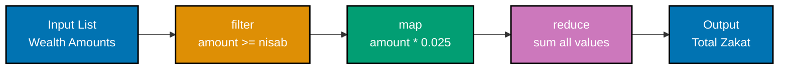
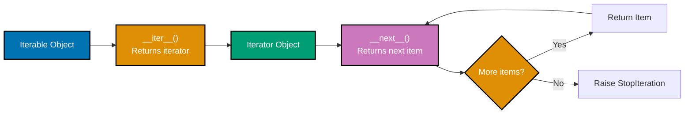
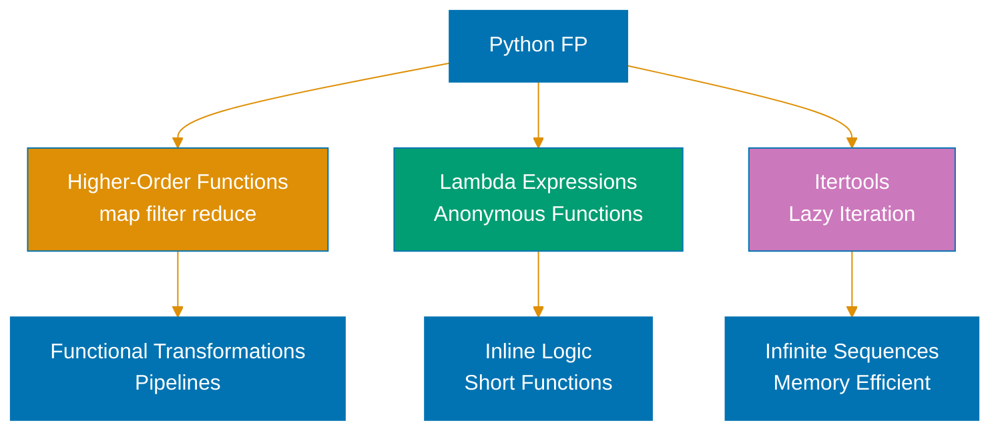

# Python Functional Programming

**Quick Reference**: [Overview](#overview) | [Pure Functions](#pure-functions) | [Immutability](#immutability-patterns) | [itertools](#itertools-module) | [functools](#functools-module) | [Map/Filter/Reduce](#mapfilterreduce) | [Higher-Order Functions](#higher-order-functions) | [Partial Application](#partial-application) | [Function Composition](#function-composition) | [References](#references)

## Overview

Functional programming in Python emphasizes pure functions, immutable data, and function composition. While Python is multi-paradigm, adopting functional patterns improves code predictability, testability, and maintainability—critical for financial applications handling Zakat calculations and Islamic finance operations.

### Why Functional Programming for OSE Platform

**Predictability**: Pure functions always produce same output for same input.

**Testability**: Functions without side effects are easier to test.

**Concurrency**: Immutable data eliminates race conditions.

**Composability**: Small functions combine into complex workflows.

**Maintainability**: Declarative style clearly expresses intent.

## Pure Functions

Pure functions have no side effects and return values depend only on inputs.

### Defining Pure Functions

```python
# GOOD: Pure function for Zakat calculation
from decimal import Decimal


def calculate_zakat(wealth_amount: Decimal, zakat_rate: Decimal) -> Decimal:
    """Pure function: same inputs always produce same output."""
    return wealth_amount * zakat_rate


# Usage: Predictable, testable, no side effects
zakat1 = calculate_zakat(Decimal("100000"), Decimal("0.025"))  # 2500
zakat2 = calculate_zakat(Decimal("100000"), Decimal("0.025"))  # 2500 (same)


# BAD: Impure function with global state mutation
total_zakat = Decimal("0")  # Global state


def calculate_zakat_impure(wealth_amount: Decimal) -> Decimal:
    global total_zakat
    zakat = wealth_amount * Decimal("0.025")
    total_zakat += zakat  # BAD: Side effect (mutates global)
    return zakat
```

**Why this matters**: Pure functions are predictable and thread-safe. No hidden dependencies. Easy to test in isolation.

### Benefits for Financial Calculations

```python
# GOOD: Pure function for Murabaha profit
def calculate_murabaha_profit(
    asset_cost: Decimal,
    profit_margin_rate: Decimal,
) -> Decimal:
    """Calculate Murabaha profit (pure function)."""
    return asset_cost * profit_margin_rate


def calculate_total_price(
    asset_cost: Decimal,
    profit_margin_rate: Decimal,
) -> Decimal:
    """Calculate total Murabaha price (pure function)."""
    profit = calculate_murabaha_profit(asset_cost, profit_margin_rate)
    return asset_cost + profit


# Pure functions compose naturally
total = calculate_total_price(Decimal("200000"), Decimal("0.15"))
```

**Why this matters**: Financial calculations require precision and auditability. Pure functions provide traceable, reproducible results.

## Immutability Patterns

Immutable data prevents accidental state changes.

### Immutable Data Classes

```python
# GOOD: Immutable dataclass for value objects
from dataclasses import dataclass
from decimal import Decimal
from datetime import date


@dataclass(frozen=True)
class QardHasanLoan:
    """Immutable QardHasan loan value object."""

    loan_id: str
    principal: Decimal
    disbursement_date: date
    repaid: Decimal = Decimal("0")

    def record_payment(self, payment: Decimal) -> "QardHasanLoan":
        """Return new instance with updated repaid amount."""
        return QardHasanLoan(
            loan_id=self.loan_id,
            principal=self.principal,
            disbursement_date=self.disbursement_date,
            repaid=self.repaid + payment,
        )

    @property
    def remaining(self) -> Decimal:
        """Computed remaining balance."""
        return self.principal - self.repaid


# Usage: Original instance unchanged
loan1 = QardHasanLoan("QL-001", Decimal("50000"), date(2025, 1, 1))
loan2 = loan1.record_payment(Decimal("20000"))  # New instance

print(loan1.remaining)  # 50000 (unchanged)
print(loan2.remaining)  # 30000 (new instance)


# BAD: Mutable class
class QardHasanLoanMutable:
    def __init__(self, loan_id, principal):
        self.loan_id = loan_id
        self.principal = principal
        self.repaid = Decimal("0")  # BAD: Mutable state

    def record_payment(self, payment):
        self.repaid += payment  # BAD: Mutates self
```

**Why this matters**: Immutability prevents accidental state corruption. Thread-safe by design. Audit trails preserved through instance history.

### Immutable Collections

```python
# GOOD: Use tuples for immutable sequences
from typing import Tuple
from decimal import Decimal


def calculate_zakat_breakdown(
    wealth_amount: Decimal,
) -> Tuple[Decimal, Decimal, Decimal]:
    """Return immutable tuple of Zakat breakdown."""
    zakat_amount = wealth_amount * Decimal("0.025")
    wealth_after = wealth_amount - zakat_amount
    return (wealth_amount, zakat_amount, wealth_after)


# Usage: Tuple unpacking with guaranteed immutability
original, zakat, remaining = calculate_zakat_breakdown(Decimal("100000"))


# GOOD: frozenset for immutable sets
ZAKAT_EXEMPT_CATEGORIES = frozenset([
    "personal_residence",
    "personal_vehicle",
    "work_tools",
])
```

**Why this matters**: Tuples and frozensets are immutable by design. Clear contract: function returns data that won't change.

## itertools Module

`itertools` provides efficient iterators for functional-style operations.

### Infinite Iterators

```python
# GOOD: Generate infinite sequence with itertools.count
from itertools import count
from decimal import Decimal


def generate_monthly_zakat_schedule(
    annual_wealth: Decimal,
    start_month: int = 1,
):
    """Generate infinite monthly Zakat schedule."""
    monthly_zakat = (annual_wealth / 12) * Decimal("0.025")

    for month in count(start=start_month):
        yield (month, monthly_zakat)


# Usage: Take first 12 months
schedule = generate_monthly_zakat_schedule(Decimal("120000"))
for month, amount in zip(range(1, 13), schedule):
    print(f"Month {month}: ${amount}")
```

**Why this matters**: Infinite iterators enable lazy generation. Memory-efficient for large sequences.

### Combinatoric Iterators

```python
# GOOD: Use itertools for combinations
from itertools import combinations
from decimal import Decimal


def find_donation_combinations(
    donations: list[Decimal],
    target_amount: Decimal,
) -> list[tuple[Decimal, ...]]:
    """Find donation combinations reaching target."""
    results = []

    for size in range(1, len(donations) + 1):
        for combo in combinations(donations, size):
            if sum(combo) == target_amount:
                results.append(combo)

    return results


# Usage
donations = [Decimal("100"), Decimal("200"), Decimal("300"), Decimal("400")]
combos = find_donation_combinations(donations, Decimal("500"))
```

**Why this matters**: `combinations` generates all possible combinations efficiently. Declarative approach clearer than nested loops.

## functools Module

`functools` provides higher-order functions and function tools.

### Partial Application

```python
# GOOD: Use functools.partial for partial application
from functools import partial
from decimal import Decimal


def calculate_financial_obligation(
    base_amount: Decimal,
    rate: Decimal,
    minimum_threshold: Decimal,
) -> Decimal:
    """Calculate financial obligation if amount exceeds threshold."""
    if base_amount >= minimum_threshold:
        return base_amount * rate
    return Decimal("0")


# Create specialized calculators via partial application
calculate_zakat = partial(
    calculate_financial_obligation,
    rate=Decimal("0.025"),
    minimum_threshold=Decimal("85000"),
)

calculate_tax = partial(
    calculate_financial_obligation,
    rate=Decimal("0.20"),
    minimum_threshold=Decimal("0"),
)

# Usage
zakat = calculate_zakat(Decimal("100000"))  # Only provide base_amount
tax = calculate_tax(Decimal("50000"))
```

**Why this matters**: Partial application creates specialized functions from general ones. Reduces code duplication. Clear intent through naming.

### Caching with lru_cache

```python
# GOOD: Cache expensive calculations
from functools import lru_cache
from decimal import Decimal


@lru_cache(maxsize=128)
def calculate_nisab_value(gold_price_per_gram: Decimal) -> Decimal:
    """Calculate nisab threshold (cached)."""
    GOLD_NISAB_GRAMS = 85
    return gold_price_per_gram * GOLD_NISAB_GRAMS


# Usage: First call calculates, subsequent calls return cached value
nisab1 = calculate_nisab_value(Decimal("60.00"))  # Calculates
nisab2 = calculate_nisab_value(Decimal("60.00"))  # Cached
```

**Why this matters**: `lru_cache` memoizes pure function results. Significant performance improvement for expensive calculations.

## Map/Filter/Reduce

Functional-style data transformations.

### Map for Transformations

```python
# GOOD: Use map for transformations
from decimal import Decimal


def calculate_all_zakat(wealth_amounts: list[Decimal]) -> list[Decimal]:
    """Calculate Zakat for all wealth amounts."""
    return list(map(
        lambda amount: amount * Decimal("0.025"),
        wealth_amounts
    ))


# BETTER: Use comprehension (more Pythonic)
def calculate_all_zakat(wealth_amounts: list[Decimal]) -> list[Decimal]:
    """Calculate Zakat for all wealth amounts."""
    return [amount * Decimal("0.025") for amount in wealth_amounts]
```

**Why this matters**: List comprehensions are more Pythonic than `map` for simple transformations. `map` useful with existing functions.

### Filter for Selection

```python
# GOOD: Use filter for selection
from decimal import Decimal


def filter_qualifying_wealth(
    wealth_items: list[Decimal],
    nisab: Decimal,
) -> list[Decimal]:
    """Filter wealth items exceeding nisab."""
    return list(filter(
        lambda amount: amount >= nisab,
        wealth_items
    ))


# BETTER: Use comprehension
def filter_qualifying_wealth(
    wealth_items: list[Decimal],
    nisab: Decimal,
) -> list[Decimal]:
    """Filter wealth items exceeding nisab."""
    return [amount for amount in wealth_items if amount >= nisab]
```

**Why this matters**: Comprehensions more readable for simple filters. `filter` useful with existing predicates.

### Data Transformation Pipeline with map/filter/reduce



**Pipeline stages**:

1. **filter**: Select qualifying wealth #40;>= nisab#41;
2. **map**: Transform to Zakat amounts #40;2.5%#41;
3. **reduce**: Aggregate to total obligation

**Why this matters**: Functional pipeline separates concerns. Each stage does one thing. Composable and testable.

### Reduce for Aggregation

```python
# GOOD: Use functools.reduce for aggregation
from functools import reduce
from decimal import Decimal


def sum_donations(donations: list[Decimal]) -> Decimal:
    """Sum all donations using reduce."""
    return reduce(
        lambda acc, donation: acc + donation,
        donations,
        Decimal("0"),  # Initial value
    )


# BETTER: Use sum (built-in)
def sum_donations(donations: list[Decimal]) -> Decimal:
    """Sum all donations."""
    return sum(donations)
```

**Why this matters**: Python's `sum` is optimized for summation. `reduce` useful for complex aggregations with custom logic.

## Higher-Order Functions

Functions that take functions as arguments or return functions.

### Functions as Arguments

```python
# GOOD: Higher-order function for flexible calculation
from typing import Callable
from decimal import Decimal


def apply_to_wealth_items(
    wealth_items: list[Decimal],
    calculator: Callable[[Decimal], Decimal],
) -> list[Decimal]:
    """Apply calculator function to all wealth items."""
    return [calculator(amount) for amount in wealth_items]


def calculate_zakat(amount: Decimal) -> Decimal:
    """Calculate Zakat (2.5%)."""
    return amount * Decimal("0.025")


def calculate_sadaqah(amount: Decimal) -> Decimal:
    """Calculate recommended Sadaqah (1%)."""
    return amount * Decimal("0.01")


# Usage: Same higher-order function, different behaviors
zakat_amounts = apply_to_wealth_items(wealth_items, calculate_zakat)
sadaqah_amounts = apply_to_wealth_items(wealth_items, calculate_sadaqah)
```

**Why this matters**: Higher-order functions enable code reuse. Same pattern, different behaviors. Strategy pattern functional style.

### Returning Functions

```python
# GOOD: Function factory returning specialized functions
from decimal import Decimal
from typing import Callable


def make_rate_calculator(rate: Decimal) -> Callable[[Decimal], Decimal]:
    """Create calculator for specific rate."""

    def calculator(base_amount: Decimal) -> Decimal:
        """Calculate obligation at specified rate."""
        return base_amount * rate

    return calculator


# Usage: Create specialized calculators
zakat_calculator = make_rate_calculator(Decimal("0.025"))
tax_calculator = make_rate_calculator(Decimal("0.20"))

zakat = zakat_calculator(Decimal("100000"))
tax = tax_calculator(Decimal("50000"))
```

**Why this matters**: Function factories create customized functions. Closure captures configuration. Clean separation of creation and usage.

## Partial Application

Partially apply arguments to create specialized functions.

### Using functools.partial

```python
# GOOD: Partial application for domain-specific calculators
from functools import partial
from decimal import Decimal


def calculate_obligation_with_threshold(
    base_amount: Decimal,
    rate: Decimal,
    threshold: Decimal,
    description: str,
) -> dict:
    """Calculate obligation with threshold check."""
    if base_amount >= threshold:
        obligation = base_amount * rate
        return {
            "description": description,
            "base_amount": base_amount,
            "obligation": obligation,
        }
    return {
        "description": description,
        "base_amount": base_amount,
        "obligation": Decimal("0"),
    }


# Create specialized calculators
calculate_zakat_wealth = partial(
    calculate_obligation_with_threshold,
    rate=Decimal("0.025"),
    threshold=Decimal("85000"),
    description="Zakat on Wealth",
)

calculate_zakat_gold = partial(
    calculate_obligation_with_threshold,
    rate=Decimal("0.025"),
    threshold=Decimal("5100"),  # 85g gold at $60/g
    description="Zakat on Gold",
)

# Usage: Only provide base_amount
wealth_zakat = calculate_zakat_wealth(Decimal("100000"))
gold_zakat = calculate_zakat_gold(Decimal("6000"))
```

**Why this matters**: Partial application binds common parameters. Creates domain-specific functions from general ones.

### Decorator Pattern with functools.wraps

```mermaid
%% Color Palette: Blue #0173B2, Orange #DE8F05, Teal #029E73, Purple #CC78BC
graph TD
  A[Original Function<br/>calculate_zakat] --> B[Decorator<br/>@lru_cache]
  B --> C[Wrapper Function<br/>with caching logic]

  C --> D{Cache Hit?}
  D -->|Yes| E[Return Cached Result]
  D -->|No| F[Call Original Function]

  F --> G[Store Result in Cache]
  G --> H[Return Result]

  style A fill:#0173B2,stroke:#000,color:#fff,stroke-width:2px
  style B fill:#DE8F05,stroke:#000,color:#fff,stroke-width:2px
  style C fill:#029E73,stroke:#000,color:#fff,stroke-width:2px
  style D fill:#CC78BC,stroke:#000,color:#fff,stroke-width:2px
  style E fill:#029E73,stroke:#000,color:#fff,stroke-width:2px
  style F fill:#0173B2,stroke:#000,color:#fff,stroke-width:2px
```

**Why this matters**: `functools.wraps` preserves original function metadata. Decorator adds behavior without modifying function. Separation of concerns for cross-cutting features.

## Function Composition

Combine small functions into complex workflows.

### Manual Composition

```python
# GOOD: Function composition for data pipeline
from decimal import Decimal


def apply_zakat_rate(amount: Decimal) -> Decimal:
    """Apply 2.5% Zakat rate."""
    return amount * Decimal("0.025")


def round_to_currency(amount: Decimal) -> Decimal:
    """Round to 2 decimal places."""
    return amount.quantize(Decimal("0.01"))


def format_currency(amount: Decimal) -> str:
    """Format as currency string."""
    return f"${amount:,.2f}"


def calculate_and_format_zakat(wealth_amount: Decimal) -> str:
    """Compose functions to calculate and format Zakat."""
    zakat_amount = apply_zakat_rate(wealth_amount)
    rounded_amount = round_to_currency(zakat_amount)
    formatted = format_currency(rounded_amount)
    return formatted


# Usage
result = calculate_and_format_zakat(Decimal("100000.00"))
print(result)  # $2,500.00
```

**Why this matters**: Function composition builds complex workflows from simple building blocks. Each function does one thing well.

### Composable Pipeline

```python
# GOOD: Functional pipeline with iterators
from typing import Iterator, Callable
from decimal import Decimal


def filter_qualifying(
    wealth_items: Iterator[Decimal],
    nisab: Decimal,
) -> Iterator[Decimal]:
    """Filter wealth items exceeding nisab."""
    return (amount for amount in wealth_items if amount >= nisab)


def apply_zakat_calculation(
    wealth_items: Iterator[Decimal],
) -> Iterator[Decimal]:
    """Apply Zakat calculation to each item."""
    return (amount * Decimal("0.025") for amount in wealth_items)


def sum_results(zakat_items: Iterator[Decimal]) -> Decimal:
    """Sum all Zakat amounts."""
    return sum(zakat_items)


# Usage: Compose into pipeline
wealth_data = [
    Decimal("50000"),
    Decimal("100000"),
    Decimal("150000"),
]

total_zakat = sum_results(
    apply_zakat_calculation(
        filter_qualifying(iter(wealth_data), Decimal("85000"))
    )
)
```

**Why this matters**: Generator-based pipeline processes data lazily. Memory-efficient for large datasets. Clear data flow.

### Iterator Protocol Flow



**Iterator protocol**:

- **`__iter__()`**: Returns iterator object #40;often self#41;
- **`__next__()`**: Returns next item or raises StopIteration
- **for loop**: Calls `__iter__()` once, then `__next__()` until StopIteration

**Why this matters**: Understanding iterator protocol enables custom iterators. Generators implement this protocol automatically.

## References

### Official Documentation

- [functools Module](https://docs.python.org/3/library/functools.html)
- [itertools Module](https://docs.python.org/3/library/itertools.html)
- [Functional Programming HOWTO](https://docs.python.org/3/howto/functional.html)

### Related Documentation

- [Idioms](./ex-soen-prla-py__idioms.md) - Pythonic patterns
- [Best Practices](./ex-soen-prla-py__best-practices.md) - Coding standards
- [Classes and Protocols](./ex-soen-prla-py__classes-and-protocols.md) - OOP patterns

### Books

- "Functional Python Programming" by Steven Lott
- "Fluent Python" by Luciano Ramalho - Functional programming chapters

---

**Last Updated**: 2025-01-23
**Python Version**: 3.11+ (baseline), 3.12+ (stable maintenance), 3.14.x (latest stable)
**Maintainers**: OSE Platform Documentation Team

## Python Functional Programming


