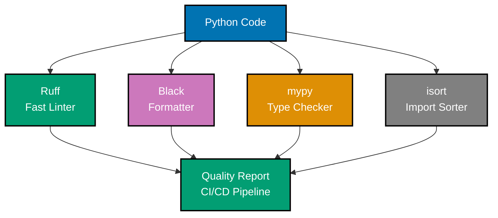
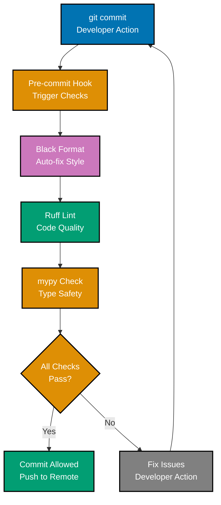
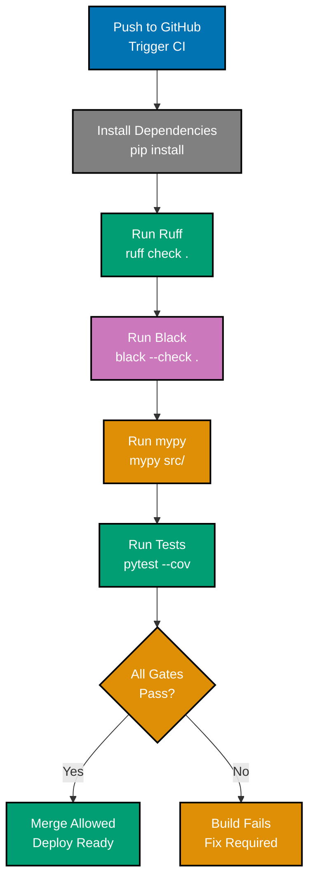
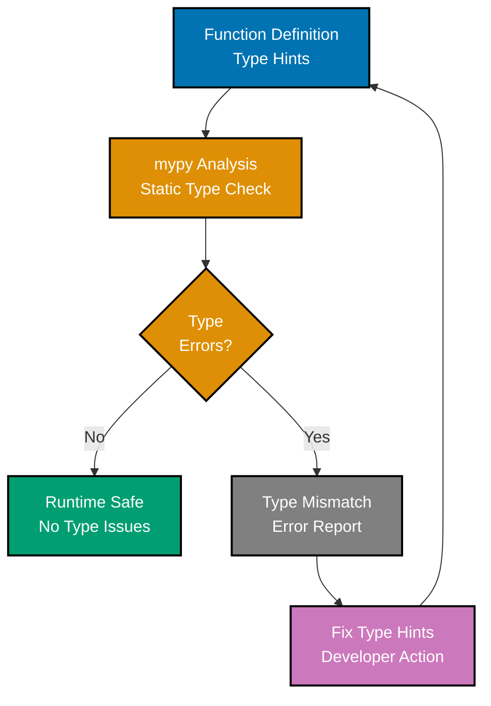
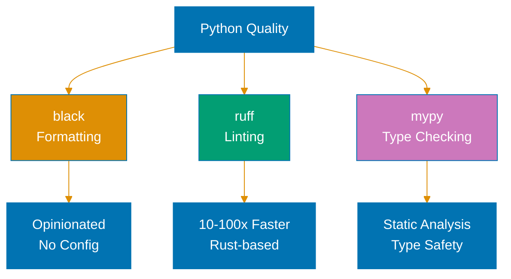

# Python Linting and Formatting

**Quick Reference**: [Overview](#overview) | [Ruff](#ruff-fast-linter) | [Black](#black-code-formatter) | [mypy](#mypy-type-checker) | [pylint](#pylint-comprehensive-linting) | [isort](#isort-import-sorting) | [Pre-commit Hooks](#pre-commit-hooks) | [CI/CD Integration](#cicd-integration) | [References](#references)

## Overview

Automated linting and formatting ensure consistent code quality. For OSE Platform financial applications, these tools prevent bugs, enforce standards, and maintain professional code.

### Quality Tool Stack



### Pre-commit Automation



### CI/CD Quality Pipeline



### Type Safety Flow



## Ruff (Fast Linter)

Ruff is an extremely fast Python linter written in Rust (10-100x faster than alternatives).

### Installing Ruff

```bash
# Install via pip
pip install ruff

# Install via uv (recommended)
uv pip install ruff
```

### Ruff Configuration

```toml
# pyproject.toml
[tool.ruff]
# Python version
target-version = "py311"

# Line length (match Black)
line-length = 88

# Enable specific rule sets
select = [
    "E",   # pycodestyle errors
    "F",   # Pyflakes
    "I",   # isort
    "N",   # pep8-naming
    "W",   # pycodestyle warnings
    "UP",  # pyupgrade
    "B",   # flake8-bugbear
    "C4",  # flake8-comprehensions
    "SIM", # flake8-simplify
]

# Ignore specific rules
ignore = [
    "E501",  # Line too long (Black handles this)
]

# Exclude patterns
exclude = [
    ".git",
    ".venv",
    "__pycache__",
    "build",
    "dist",
]

[tool.ruff.per-file-ignores]
"__init__.py" = ["F401"]  # Allow unused imports in __init__.py
```

### Running Ruff

```bash
# Check all files
ruff check .

# Check specific file
ruff check src/zakat_calculator.py

# Auto-fix issues
ruff check --fix .

# Format code (Ruff as formatter, alternative to Black)
ruff format .

# Watch mode (rerun on file changes)
ruff check --watch .
```

**Why this matters**: Ruff is 10-100x faster than flake8/pylint. Combines multiple tools (flake8, isort, pyupgrade). Auto-fix saves time. Written in Rust for maximum performance.

## Black (Code Formatter)

Black is an opinionated code formatter ensuring consistent style.

### Installing Black

```bash
pip install black
```

### Black Configuration

```toml
# pyproject.toml
[tool.black]
line-length = 88
target-version = ['py311', 'py312', 'py313']
include = '\.pyi?$'
extend-exclude = '''
/(
    \.git
  | \.venv
  | build
  | dist
)/
'''
```

### Running Black

```bash
# Format all files
black .

# Format specific file
black src/zakat_calculator.py

# Check without modifying
black --check .

# Show diffs without modifying
black --diff .
```

### Before and After Black

```python
# Before Black
from decimal import Decimal
def calculate_zakat(wealth:Decimal,nisab:Decimal)->Decimal:
    if wealth>=nisab:return wealth*Decimal('0.025')
    return Decimal('0')

# After Black
from decimal import Decimal


def calculate_zakat(wealth: Decimal, nisab: Decimal) -> Decimal:
    if wealth >= nisab:
        return wealth * Decimal("0.025")
    return Decimal("0")
```

**Why this matters**: Black eliminates style debates. Consistent formatting across codebase. Reduces code review friction. Industry standard.

## mypy (Type Checker)

mypy performs static type checking.

### Installing mypy

```bash
pip install mypy
```

### mypy Configuration

```toml
# pyproject.toml
[tool.mypy]
python_version = "3.11"
warn_return_any = true
warn_unused_configs = true
disallow_untyped_defs = true
disallow_incomplete_defs = true
check_untyped_defs = true
disallow_untyped_decorators = true
no_implicit_optional = true
warn_redundant_casts = true
warn_unused_ignores = true
warn_no_return = true
warn_unreachable = true
strict_equality = true
strict = true

# Per-module options
[[tool.mypy.overrides]]
module = "tests.*"
disallow_untyped_defs = false
```

### Running mypy

```bash
# Check all files
mypy src/

# Check specific file
mypy src/zakat_calculator.py

# Generate HTML report
mypy --html-report mypy-report src/

# Check with strict mode
mypy --strict src/
```

### mypy Example

```python
# mypy catches type errors
from decimal import Decimal


def calculate_zakat(wealth: Decimal, nisab: Decimal) -> Decimal:
    """Calculate Zakat with type safety."""
    if wealth >= nisab:
        return wealth * Decimal("0.025")
    return Decimal("0")


# mypy error: Argument 1 to "calculate_zakat" has incompatible type "int"
result = calculate_zakat(100000, Decimal("85000"))

# Correct: Both arguments are Decimal
result = calculate_zakat(Decimal("100000"), Decimal("85000"))
```

**Why this matters**: mypy catches type errors before runtime. IDE integration provides real-time feedback. Prevents null reference errors and type mismatches.

## pylint (Comprehensive Linting)

pylint provides comprehensive code analysis.

### Installing pylint

```bash
pip install pylint
```

### pylint Configuration

```toml
# pyproject.toml
[tool.pylint.main]
py-version = "3.11"

[tool.pylint.messages_control]
max-line-length = 88
disable = [
    "C0111",  # missing-docstring (handled by Ruff)
    "R0903",  # too-few-public-methods
]

[tool.pylint.design]
max-args = 7
max-attributes = 10
```

### Running pylint

```bash
# Check all files
pylint src/

# Check specific file
pylint src/zakat_calculator.py

# Generate HTML report
pylint --output-format=html src/ > pylint-report.html

# Score only
pylint --score=y src/
```

**Why this matters**: pylint catches complex issues beyond syntax. Code smell detection. Enforces naming conventions. Configurable rule sets.

## isort (Import Sorting)

isort organizes imports automatically.

### Installing isort

```bash
pip install isort
```

### isort Configuration

```toml
# pyproject.toml
[tool.isort]
profile = "black"
line_length = 88
multi_line_output = 3
include_trailing_comma = true
force_grid_wrap = 0
use_parentheses = true
ensure_newline_before_comments = true
```

### Running isort

```bash
# Sort all imports
isort .

# Check without modifying
isort --check .

# Show diffs
isort --diff .
```

### Before and After isort

```python
# Before isort
from zakat_calculator import ZakatCalculator
from decimal import Decimal
import sys
from typing import List, Optional
import os

# After isort
import os
import sys
from decimal import Decimal
from typing import List, Optional

from zakat_calculator import ZakatCalculator
```

**Why this matters**: Consistent import organization. Sections: stdlib → third-party → local. Reduces merge conflicts. Black-compatible profile.

## Pre-commit Hooks

Automate quality checks before commits.

### Installing pre-commit

```bash
pip install pre-commit
```

### Pre-commit Configuration

```yaml
# .pre-commit-config.yaml
repos:
  - repo: https://github.com/astral-sh/ruff-pre-commit
    rev: v0.8.0
    hooks:
      - id: ruff
        args: [--fix]
      - id: ruff-format

  - repo: https://github.com/psf/black
    rev: 24.10.0
    hooks:
      - id: black

  - repo: https://github.com/pre-commit/mirrors-mypy
    rev: v1.13.0
    hooks:
      - id: mypy
        additional_dependencies: [pydantic]

  - repo: https://github.com/pycqa/isort
    rev: 5.13.0
    hooks:
      - id: isort
```

### Using pre-commit

```bash
# Install hooks
pre-commit install

# Run on all files
pre-commit run --all-files

# Run specific hook
pre-commit run ruff --all-files

# Skip hooks for single commit
git commit --no-verify
```

**Why this matters**: Pre-commit hooks catch issues before code review. Automatic formatting on commit. Consistent quality across team. Prevents committing unformatted code.

## CI/CD Integration

Integrate quality checks in CI/CD pipeline.

### GitHub Actions Example

```yaml
# .github/workflows/quality.yml
name: Code Quality

on: [push, pull_request]

jobs:
  quality:
    runs-on: ubuntu-latest
    steps:
      - uses: actions/checkout@v4

      - name: Set up Python
        uses: actions/setup-python@v5
        with:
          python-version: "3.11"

      - name: Install dependencies
        run: |
          pip install ruff black mypy pylint

      - name: Run Ruff
        run: ruff check .

      - name: Run Black
        run: black --check .

      - name: Run mypy
        run: mypy src/

      - name: Run pylint
        run: pylint src/
```

**Why this matters**: CI/CD enforces quality gates. Prevents merging unformatted code. Automatic checks on every push. Team accountability.

## References

### Official Documentation

- [Ruff Documentation](https://docs.astral.sh/ruff/)
- [Black Documentation](https://black.readthedocs.io/)
- [mypy Documentation](https://mypy.readthedocs.io/)
- [pylint Documentation](https://pylint.readthedocs.io/)
- [isort Documentation](https://pycqa.github.io/isort/)
- [pre-commit Documentation](https://pre-commit.com/)

### Related Documentation

- [Best Practices](./ex-soen-prla-py__best-practices.md) - Coding standards
- [Type Safety](./ex-soen-prla-py__type-safety.md) - Type hints

---

**Last Updated**: 2025-01-23
**Python Version**: 3.11+ (baseline), 3.12+ (stable maintenance), 3.14.x (latest stable)
**Maintainers**: OSE Platform Documentation Team

## Python Quality Tools


