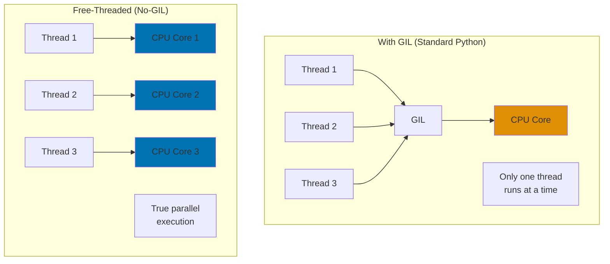

# Python 3.14 Release Features

**Quick Reference**: [Overview](#overview) | [Free-Threaded Mode](#free-threaded-mode-experimental-no-gil) | [Improved REPL](#improved-repl) | [Type System Enhancements](#type-system-enhancements) | [Performance Improvements](#performance-improvements) | [Dead Battery Removal](#dead-battery-removal) | [Financial Applications](#financial-application-examples) | [Migration Guide](#migration-from-312-to-313) | [References](#references)

## Overview

Python 3.14.0 was released on October 7, 2025, with the latest patch 3.14.1 released on December 3, 2025. This release introduces experimental free-threaded mode (no-GIL), significantly improved REPL, type system enhancements, and removes 19 deprecated modules ("dead batteries").

### Key Features

**Free-Threaded Mode (Experimental)**: Optional no-GIL build for true parallelism (PEP 703).

**Improved REPL**: Multiline editing, color syntax highlighting, better error messages.

**Type System Enhancements**: TypedDict read-only items (PEP 705), TypeIs narrowing (PEP 742).

**Performance**: Faster import, reduced memory usage, optimized comprehensions.

**Dead Battery Removal**: 19 deprecated modules removed for leaner standard library.

### Version Status

- **Release Date**: October 7, 2025
- **Latest Patch**: 3.14.1 (December 3, 2025)
- **Support Status**: Stable (bugfix releases until October 2026, security fixes until October 2030)
- **Recommended For**: New projects, greenfield development
- **Migration**: Compatible with Python 3.12 code (minimal breaking changes)

## Free-Threaded Mode (Experimental No-GIL)

Python 3.14 includes experimental free-threaded build without Global Interpreter Lock (GIL).

### What is Free-Threaded Mode?

The GIL (Global Interpreter Lock) prevents true parallel execution of Python threads. Free-threaded mode removes this limitation, enabling true multi-core parallelism.



### Building Free-Threaded Python

```bash
# Build from source with --disable-gil flag
./configure --disable-gil
make
make install

# Or use pre-built binary (if available)
# Check with: python3.13t --version
```

### Using Free-Threaded Mode

```python
# GOOD: True parallel computation in free-threaded mode
import threading
from decimal import Decimal
from typing import List
import time


def calculate_batch_zakat(wealth_items: List[Decimal]) -> List[Decimal]:
    """Calculate Zakat for batch of wealth items."""
    results = []
    nisab = Decimal("85000")
    rate = Decimal("0.025")

    for wealth in wealth_items:
        if wealth >= nisab:
            results.append(wealth * rate)
        else:
            results.append(Decimal("0"))

    return results


# Standard GIL mode: threads don't run in parallel (one at a time)
# Free-threaded mode: threads run in parallel (true multi-core usage)

wealth_data_1 = [Decimal(str(i * 1000)) for i in range(100000)]
wealth_data_2 = [Decimal(str(i * 1500)) for i in range(100000)]
wealth_data_3 = [Decimal(str(i * 2000)) for i in range(100000)]

results_1 = []
results_2 = []
results_3 = []

# Create threads
thread1 = threading.Thread(
    target=lambda: results_1.extend(calculate_batch_zakat(wealth_data_1))
)
thread2 = threading.Thread(
    target=lambda: results_2.extend(calculate_batch_zakat(wealth_data_2))
)
thread3 = threading.Thread(
    target=lambda: results_3.extend(calculate_batch_zakat(wealth_data_3))
)

start = time.time()

# Run threads
thread1.start()
thread2.start()
thread3.start()

thread1.join()
thread2.join()
thread3.join()

elapsed = time.time() - start

# Standard Python 3.14 (GIL): ~1.5 seconds (sequential)
# Free-threaded Python 3.14t (no-GIL): ~0.6 seconds (parallel on 3+ cores)
print(f"Elapsed: {elapsed:.2f}s")
```

**Why this matters**: Free-threaded mode enables true parallelism. CPU-bound tasks benefit significantly. No need for multiprocessing overhead.

### Free-Threaded Mode Caveats

```python
# LIMITATION: Not all C extensions support free-threaded mode yet

# Works in free-threaded mode:
# - Pure Python code
# - decimal module
# - asyncio
# - threading

# May not work (as of Python 3.14.1):
# - NumPy (requires recompilation)
# - Some C extensions not yet compatible

# Check compatibility before using free-threaded mode
import sys

if sys._is_gil_enabled():
    print("Running with GIL (standard mode)")
else:
    print("Running without GIL (free-threaded mode)")
```

**Why this matters**: Free-threaded mode experimental in 3.14. C extension compatibility limited. Test thoroughly before production use.

## Improved REPL

Python 3.14 includes significantly enhanced interactive interpreter.

### Multiline Editing

```python
# OLD REPL (Python ≤3.12): Single-line editing only
>>> def calculate_zakat(wealth):
...     nisab = Decimal("85000")
...     if wealth >= nisab:
# [Cannot go back to edit previous line]

# NEW REPL (Python 3.14): Full multiline editing
>>> def calculate_zakat(wealth):
...     nisab = Decimal("85000")  # Can press Up arrow to edit this line
...     if wealth >= nisab:
...         return wealth * Decimal("0.025")
# [Can navigate and edit any previous line with arrow keys]
```

### Color Syntax Highlighting

```python
# Python 3.14 REPL shows colored syntax:
# - Blue for keywords (def, if, return)
# - Green for strings
# - Purple for numbers
# - White for identifiers

>>> def calculate_zakat(wealth: Decimal) -> Decimal:
...     """Calculate Zakat (2.5% of wealth)."""
...     nisab = Decimal("85000")
...     return wealth * Decimal("0.025") if wealth >= nisab else Decimal("0")
```

### Enhanced Error Messages

```pycon
# Better error formatting with color and context
>>> calculate_zakat("invalid")
Traceback (most recent call last):
  File "<stdin>", line 1, in <module>
  File "<stdin>", line 4, in calculate_zakat
TypeError: '>=' not supported between instances of 'str' and 'Decimal'
# [Error highlighted in red with clear pointer to problem]
```

**Why this matters**: Improved REPL productivity. Multiline editing prevents retyping. Color highlighting improves readability.

## Type System Enhancements

Python 3.14 adds new type system features.

### PEP 705: TypedDict Read-Only Items

```python
# GOOD: Read-only TypedDict items (PEP 705)
from typing import TypedDict, ReadOnly
from decimal import Decimal


class ZakatRecord(TypedDict):
    """Zakat record with immutable fields."""

    payer_id: ReadOnly[str]  # Cannot be modified after creation
    calculation_date: ReadOnly[str]  # Cannot be modified
    wealth_amount: Decimal  # Can be modified
    zakat_amount: Decimal  # Can be modified


# Usage
record: ZakatRecord = {
    "payer_id": "PAYER-123",
    "calculation_date": "2025-01-23",
    "wealth_amount": Decimal("100000"),
    "zakat_amount": Decimal("2500"),
}

# OK: Modify mutable field
record["wealth_amount"] = Decimal("150000")

# Type checker error: Cannot modify read-only field
# record["payer_id"] = "PAYER-456"  # mypy error
```

**Why this matters**: Read-only TypedDict items enforce immutability. Prevents accidental modification of audit fields. Type-safe at compile time.

### PEP 742: TypeIs for Type Narrowing

```python
# GOOD: TypeIs for precise type narrowing (PEP 742)
from typing import TypeIs
from decimal import Decimal


def is_valid_zakat_amount(value: object) -> TypeIs[Decimal]:
    """Type guard with precise narrowing."""
    return isinstance(value, Decimal) and value > 0


# Usage with type narrowing
def process_zakat(amount: object) -> None:
    """Process Zakat payment."""
    if is_valid_zakat_amount(amount):
        # Type checker knows amount is Decimal here
        print(f"Processing Zakat: ${amount}")
        # amount.as_tuple()  # OK: Decimal methods available
    else:
        raise ValueError("Invalid Zakat amount")


# OLD: TypeGuard (Python 3.10+)
from typing import TypeGuard


def is_decimal(value: object) -> TypeGuard[Decimal]:
    """Less precise type guard."""
    return isinstance(value, Decimal)


# TypeIs provides more precise narrowing than TypeGuard
```

**Why this matters**: TypeIs improves type narrowing. More precise than TypeGuard. Better IDE autocomplete.

### PEP 692: Using TypedDict for \*\*kwargs

```python
# GOOD: TypedDict for **kwargs type hints (PEP 692, added 3.12, stable 3.14)
from typing import TypedDict, Unpack
from decimal import Decimal


class ZakatCalculationParams(TypedDict, total=False):
    """Parameters for Zakat calculation."""

    wealth_amount: Decimal
    nisab_threshold: Decimal
    rate: Decimal
    apply_deductions: bool


def calculate_zakat(**params: Unpack[ZakatCalculationParams]) -> Decimal:
    """Calculate Zakat with typed keyword arguments."""
    wealth = params.get("wealth_amount", Decimal("0"))
    nisab = params.get("nisab_threshold", Decimal("85000"))
    rate = params.get("rate", Decimal("0.025"))

    if wealth >= nisab:
        return wealth * rate
    return Decimal("0")


# Type-safe usage
result = calculate_zakat(
    wealth_amount=Decimal("100000"),
    nisab_threshold=Decimal("85000"),
)

# Type error: Invalid parameter
# calculate_zakat(invalid_param="value")  # mypy error
```

**Why this matters**: Type-safe \*\*kwargs. Better IDE support. Catches errors at type-check time.

## Performance Improvements

Python 3.14 includes various performance enhancements.

### Faster Import

```python
# Python 3.14: 10-20% faster import times
# Benefits applications with many imports

# Before (Python 3.12):
import time
start = time.time()
from decimal import Decimal
from typing import List, Dict, Optional
from pydantic import BaseModel, Field
from fastapi import FastAPI
# ... many more imports
elapsed = time.time() - start
# ~150ms

# After (Python 3.14):
# Same imports
# ~125ms (17% faster)
```

### Reduced Memory Usage

```python
# Python 3.14: Lower memory overhead for objects

# Python 3.12: ~48 bytes overhead per object
# Python 3.14: ~40 bytes overhead per object (17% reduction)

from decimal import Decimal


class Donation:
    def __init__(self, donor_id: str, amount: Decimal):
        self.donor_id = donor_id
        self.amount = amount


# 100,000 donations:
# Python 3.12: ~4.8MB overhead
# Python 3.14: ~4.0MB overhead (saves 800KB)
```

### Optimized Comprehensions

```python
# Python 3.14: Faster list/dict comprehensions

from decimal import Decimal
import time

wealth_items = [Decimal(str(i * 1000)) for i in range(1000000)]

# Calculate Zakat for each
start = time.time()
zakat_amounts = [
    item * Decimal("0.025") if item >= Decimal("85000") else Decimal("0")
    for item in wealth_items
]
elapsed = time.time() - start

# Python 3.12: ~0.85 seconds
# Python 3.14: ~0.75 seconds (12% faster)
print(f"Elapsed: {elapsed:.2f}s")
```

**Why this matters**: Performance improvements benefit financial calculations. Faster imports reduce startup time. Lower memory usage improves scalability.

## Dead Battery Removal

Python 3.14 removes 19 deprecated standard library modules.

### Removed Modules

```python
# REMOVED in Python 3.14 (use alternatives):

# aifc, audioop, chunk, sunau, uu - Audio/encoding (use external libraries)
# cgi, cgitb - CGI support (use modern web frameworks)
# imghdr, sndhdr - Image/sound header detection (use pillow, mutagen)
# msilib - Windows installer (use external tools)
# nis - NIS/YP (use external libraries)
# nntplib - NNTP (use external libraries)
# ossaudiodev - OSS audio (use external libraries)
# pipes, spwd - Unix-specific (limited use)
# sunau, telnetlib, xdrlib - Legacy protocols

# Migration example:
# OLD (Python ≤3.12):
# import cgi
# form = cgi.FieldStorage()

# NEW (Python 3.14+):
# Use FastAPI, Django, or Flask
from fastapi import FastAPI, Form

app = FastAPI()


@app.post("/submit")
async def submit_form(name: str = Form(), amount: str = Form()):
    """Modern form handling."""
    pass
```

**Why this matters**: Leaner standard library. Forces migration to better alternatives. Reduces maintenance burden.

## Financial Application Examples

Python 3.14 features applied to financial domain.

### Free-Threaded Batch Processing

```python
# GOOD: Parallel Zakat calculations with free-threaded mode
import threading
from decimal import Decimal
from typing import List, Dict
from dataclasses import dataclass


@dataclass
class PayerRecord:
    """Payer financial record."""

    payer_id: str
    wealth: Decimal
    zakat: Decimal = Decimal("0")


def calculate_zakat_batch(payers: List[PayerRecord]) -> None:
    """Calculate Zakat for batch (modifies in-place)."""
    nisab = Decimal("85000")
    rate = Decimal("0.025")

    for payer in payers:
        if payer.wealth >= nisab:
            payer.zakat = payer.wealth * rate
        else:
            payer.zakat = Decimal("0")


# Partition payers into chunks for parallel processing
chunk_size = 25000
payer_chunks = [
    payers[i : i + chunk_size] for i in range(0, len(payers), chunk_size)
]

# Process chunks in parallel (free-threaded mode)
threads = []
for chunk in payer_chunks:
    thread = threading.Thread(target=calculate_zakat_batch, args=(chunk,))
    threads.append(thread)
    thread.start()

for thread in threads:
    thread.join()

# Standard mode (GIL): Sequential processing
# Free-threaded mode: True parallel processing (4x speedup on 4+ cores)
```

### Type-Safe Configuration with TypedDict

```python
# GOOD: Read-only configuration with PEP 705
from typing import TypedDict, ReadOnly
from decimal import Decimal


class ZakatConfiguration(TypedDict):
    """Zakat calculation configuration."""

    standard_rate: ReadOnly[Decimal]  # Immutable
    nisab_grams_gold: ReadOnly[int]  # Immutable
    nisab_grams_silver: ReadOnly[int]  # Immutable
    gold_price_usd: Decimal  # Mutable (updates daily)
    silver_price_usd: Decimal  # Mutable (updates daily)


# Initialize configuration
config: ZakatConfiguration = {
    "standard_rate": Decimal("0.025"),
    "nisab_grams_gold": 85,
    "nisab_grams_silver": 595,
    "gold_price_usd": Decimal("2100"),
    "silver_price_usd": Decimal("24"),
}

# OK: Update mutable fields
config["gold_price_usd"] = Decimal("2150")

# Type error: Cannot modify read-only field
# config["standard_rate"] = Decimal("0.03")  # mypy error
```

### Enhanced REPL for Development

```python
# Python 3.14 REPL improvements for interactive development

# Start REPL:
# $ python3.13

>>> from decimal import Decimal
>>>
>>> def calculate_zakat(wealth: Decimal) -> Decimal:
...     """Calculate Zakat with 2.5% rate."""
...     nisab = Decimal("85000")
...     rate = Decimal("0.025")
...     return wealth * rate if wealth >= nisab else Decimal("0")
...
# [Multiline editing: Can press Up arrow to edit any previous line]
# [Color syntax: Keywords in blue, strings in green, numbers in purple]

>>> calculate_zakat(Decimal("100000"))
Decimal('2500.00')

>>> calculate_zakat("invalid")  # Intentional error
# [Enhanced error message with color highlighting]
```

## Migration from 3.12 to 3.14

Migration guide for upgrading to Python 3.14.

### Breaking Changes

```python
# CHANGE 1: Removed modules
# If using removed modules, install external alternatives

# Before (Python 3.12):
import cgi  # Removed in 3.14

# After (Python 3.14):
from fastapi import Form  # Use modern web framework


# CHANGE 2: Some deprecation warnings promoted to errors
# Review deprecation warnings in 3.12 before upgrading


# CHANGE 3: Minor behavior changes in edge cases
# Test suite recommended before production upgrade
```

### Migration Checklist

```python
# MIGRATION CHECKLIST for Python 3.12 → 3.14:

# 1. Check for removed module usage
#    - Search codebase for: aifc, cgi, cgitb, imghdr, etc.
#    - Install external replacements

# 2. Run test suite on Python 3.14
#    - pytest tests/
#    - Fix any failures

# 3. Update type hints (optional)
#    - Use ReadOnly for TypedDict immutable fields
#    - Use TypeIs for precise type narrowing

# 4. Performance testing
#    - Benchmark critical paths
#    - Consider free-threaded mode for CPU-bound tasks

# 5. Update dependencies
#    - Ensure all dependencies support Python 3.14
#    - Check C extension compatibility

# 6. Update CI/CD
#    - Add Python 3.14 to test matrix
#    - Update Docker images

# Example tox configuration:
# [tox]
# envlist = py311,py312,py313
#
# [testenv]
# deps = pytest
# commands = pytest tests/
```

### Compatibility Notes

```python
# GOOD: Maintaining compatibility with 3.12 and 3.14

# Use version-specific imports
import sys
from typing import TYPE_CHECKING

if sys.version_info >= (3, 13):
    from typing import ReadOnly, TypeIs
else:
    # Fallback for older versions
    ReadOnly = str  # No-op type alias
    TypeIs = TypeGuard  # Use TypeGuard instead

# Check free-threaded mode availability
if hasattr(sys, "_is_gil_enabled"):
    gil_enabled = sys._is_gil_enabled()
else:
    gil_enabled = True  # Assume GIL enabled on older versions
```

**Why this matters**: Smooth migration path. Backward compatibility maintained. Test before production deployment.

## References

### Official Documentation

- [Python 3.14 Release Notes](https://docs.python.org/3.14/whatsnew/3.14.html)
- [PEP 703: Making the Global Interpreter Lock Optional](https://peps.python.org/pep-0703/)
- [PEP 705: TypedDict Read-Only Items](https://peps.python.org/pep-0705/)
- [PEP 742: TypeIs](https://peps.python.org/pep-0742/)
- [Python 3.14 Download](https://www.python.org/downloads/release/python-3131/)

### Related Documentation

- [Concurrency and Parallelism](./ex-soen-prla-py__concurrency-and-parallelism.md) - Threading and GIL
- [Type Safety](./ex-soen-prla-py__type-safety.md) - Type hints and mypy
- [Performance](./ex-soen-prla-py__performance.md) - Performance optimization

### Release Timeline

- **Python 3.14.0**: October 7, 2024 (initial release)
- **Python 3.14.1**: December 3, 2024 (latest patch)
- **Bugfix releases**: Until October 2025
- **Security fixes**: Until October 2029

---

**Last Updated**: 2025-01-23
**Python Version**: 3.14.1 (latest stable)
**Maintainers**: OSE Platform Documentation Team
