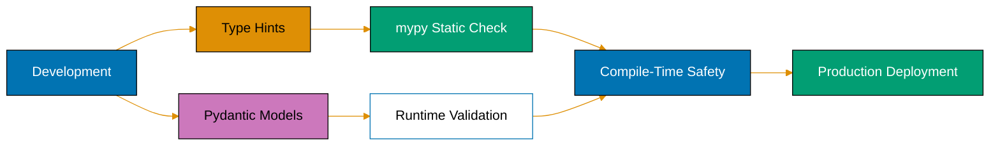
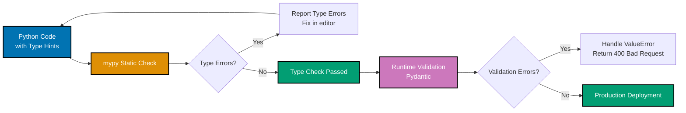
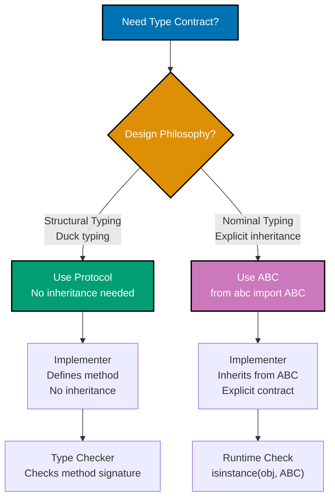

# Python Type Safety

**Quick Reference**: [Overview](#overview) | [Type Hints Basics](#type-hints-basics) | [mypy Configuration](#mypy-configuration) | [Pydantic Models](#pydantic-runtime-validation) | [Generic Types](#generic-types) | [Protocols](#protocol-types) | [TypedDict](#typeddict) | [NewType](#newtype) | [Union & Optional](#union-and-optional) | [Literal Types](#literal-types) | [References](#references)

## Overview

Type safety in Python combines static type checking (mypy) with runtime validation (Pydantic) to catch errors before production. For financial applications handling Zakat calculations, Murabaha contracts, and QardHasan loans, type safety prevents costly errors and documents expectations.

### Why Type Safety Matters for OSE Platform

**Correctness**: Type errors caught during development, not in production.

**Documentation**: Type hints serve as always-accurate documentation.

**Refactoring Confidence**: Type checker verifies changes haven't broken contracts.

**IDE Support**: IntelliSense, autocomplete, and inline error detection.

**Financial Precision**: Decimal types enforced for monetary calculations.

**API Contracts**: Pydantic validates API inputs/outputs automatically.

### Type Safety Strategy



**Two-Layer Defense**:

1. **Static Checking (mypy)**: Analyze code without running it
2. **Runtime Validation (Pydantic)**: Validate data at system boundaries

## Type Hints Basics

Type hints (PEP 484) annotate variables, parameters, and return values.

### Function Signatures

```python
# GOOD: Complete type hints for clarity and static analysis
from decimal import Decimal
from typing import Optional


def calculate_zakat_obligation(
    wealth_amount: Decimal,
    nisab_threshold: Decimal,
    zakat_rate: Decimal = Decimal("0.025"),
) -> Decimal:
    """Calculate Zakat obligation if wealth exceeds nisab.

    Args:
        wealth_amount: Total qualifying wealth
        nisab_threshold: Minimum threshold for Zakat obligation
        zakat_rate: Zakat rate (default 2.5%)

    Returns:
        Zakat amount owed (0 if below nisab)
    """
    if wealth_amount >= nisab_threshold:
        return wealth_amount * zakat_rate
    return Decimal("0")


# BAD: No type hints
def calculate_zakat_obligation(wealth_amount, nisab_threshold, zakat_rate=0.025):
    """BAD: No static analysis, unclear types."""
    if wealth_amount >= nisab_threshold:
        return wealth_amount * zakat_rate  # BAD: Could be float, int, Decimal
    return 0
```

**Why this matters**: Type hints enable mypy to verify correct usage. IDEs provide better autocomplete. Decimal type prevents floating-point errors in financial calculations.

### Variable Annotations

```python
# GOOD: Explicit variable type annotations
from typing import List, Dict
from decimal import Decimal


wealth_items: List[Decimal] = [
    Decimal("50000.00"),
    Decimal("75000.00"),
    Decimal("100000.00"),
]

donor_totals: Dict[str, Decimal] = {
    "DONOR-001": Decimal("5000.00"),
    "DONOR-002": Decimal("7500.00"),
}

current_zakat: Decimal = Decimal("0.00")


# BAD: No type annotations
wealth_items = [50000.00, 75000.00, 100000.00]  # BAD: floats, not Decimal
donor_totals = {"DONOR-001": 5000.00}  # BAD: Type unclear
current_zakat = 0  # BAD: int or Decimal?
```

**Why this matters**: Variable annotations document intent. mypy infers types from usage but explicit annotations prevent drift. Decimal type enforced from initialization.

### Class Attributes

```python
# GOOD: Type hints for class attributes
from dataclasses import dataclass
from decimal import Decimal
from datetime import date


@dataclass
class ZakatCalculation:
    """Zakat calculation with typed attributes."""

    payer_id: str
    calculation_date: date
    wealth_amount: Decimal
    nisab_threshold: Decimal
    zakat_rate: Decimal = Decimal("0.025")

    def calculate_obligation(self) -> Decimal:
        """Calculate Zakat obligation."""
        if self.wealth_amount >= self.nisab_threshold:
            return self.wealth_amount * self.zakat_rate
        return Decimal("0")


# BAD: Untyped class
class ZakatCalculation:
    """BAD: No type information."""

    def __init__(self, payer_id, calculation_date, wealth_amount, nisab_threshold):
        self.payer_id = payer_id  # BAD: Type unclear
        self.calculation_date = calculation_date  # BAD: str? date? datetime?
        self.wealth_amount = wealth_amount  # BAD: float? Decimal?
        self.nisab_threshold = nisab_threshold

    def calculate_obligation(self):  # BAD: Return type unclear
        if self.wealth_amount >= self.nisab_threshold:
            return self.wealth_amount * 0.025
        return 0
```

**Why this matters**: Dataclass type hints generate type-safe `__init__`. mypy verifies attribute access. Clear contracts for class usage.

## mypy Configuration

mypy is the de facto Python static type checker. Configure via `pyproject.toml` or `mypy.ini`.

### Recommended mypy Configuration

```toml
# pyproject.toml
[tool.mypy]
python_version = "3.11"
warn_return_any = true
warn_unused_configs = true
disallow_untyped_defs = true
disallow_any_unimported = true
no_implicit_optional = true
warn_redundant_casts = true
warn_unused_ignores = true
warn_no_return = true
check_untyped_defs = true
strict_equality = true
```

**Configuration explained**:

- `disallow_untyped_defs`: Require type hints on all functions
- `no_implicit_optional`: Prevent accidental `Optional` inference
- `warn_return_any`: Catch functions returning `Any` (untyped)
- `strict_equality`: Prevent comparisons between incompatible types

### Running mypy

```bash
# Check all Python files
mypy src/

# Check specific file
mypy src/domain/zakat/calculator.py

# Check with strict mode
mypy --strict src/

# Generate HTML report
mypy --html-report mypy-report src/
```

### mypy Type Checking Example

```python
# mypy will catch this error
from decimal import Decimal


def calculate_zakat(wealth: Decimal) -> Decimal:
    """Calculate Zakat (2.5% of wealth)."""
    return wealth * Decimal("0.025")


# mypy error: Argument 1 has incompatible type "int"; expected "Decimal"
zakat = calculate_zakat(100000)  # BAD: int instead of Decimal

# GOOD: Correct type
zakat = calculate_zakat(Decimal("100000.00"))
```

**Why this matters**: mypy catches type errors before runtime. Strict configuration prevents gradual type degradation. CI/CD integration ensures all code is type-checked.

### Type Checking Workflow with mypy



**Two-layer type safety**:

1. **Static checking #40;mypy#41;**: Catch type errors at development time
2. **Runtime validation #40;Pydantic#41;**: Validate external data at system boundaries

## Pydantic Runtime Validation

Pydantic provides runtime validation with type hints, essential for API boundaries and data integrity.

### Basic Pydantic Models

```python
# GOOD: Pydantic model with validation
from pydantic import BaseModel, Field, field_validator
from decimal import Decimal
from datetime import date


class ZakatCalculationRequest(BaseModel):
    """Validated Zakat calculation request."""

    payer_id: str = Field(min_length=5, max_length=50, description="Unique payer ID")
    wealth_amount: Decimal = Field(gt=0, description="Total qualifying wealth")
    nisab_threshold: Decimal = Field(gt=0, description="Nisab threshold")
    calculation_date: date = Field(default_factory=date.today)

    @field_validator("payer_id")
    @classmethod
    def validate_payer_id_format(cls, v: str) -> str:
        """Ensure payer ID has correct format."""
        if not v.startswith("PAYER-"):
            raise ValueError("Payer ID must start with PAYER-")
        return v

    @field_validator("wealth_amount", "nisab_threshold")
    @classmethod
    def validate_precision(cls, v: Decimal) -> Decimal:
        """Ensure monetary values have max 2 decimal places."""
        if v.as_tuple().exponent < -2:
            raise ValueError("Monetary values must have max 2 decimal places")
        return v


# Usage: Pydantic validates automatically
request = ZakatCalculationRequest(
    payer_id="PAYER-001",
    wealth_amount=Decimal("100000.00"),
    nisab_threshold=Decimal("85000.00"),
)  # OK

# Raises ValidationError: wealth_amount must be > 0
invalid_request = ZakatCalculationRequest(
    payer_id="PAYER-001",
    wealth_amount=Decimal("-1000.00"),
    nisab_threshold=Decimal("85000.00"),
)
```

**Why this matters**: Pydantic validates at construction time. Field constraints (`gt=0`, `min_length`) declaratively enforce rules. Custom validators handle complex business logic.

### Nested Pydantic Models

```python
# GOOD: Nested models for complex domain objects
from pydantic import BaseModel, Field
from typing import List
from decimal import Decimal


class DonationItem(BaseModel):
    """Individual donation item."""

    donor_id: str = Field(min_length=1)
    amount: Decimal = Field(gt=0)
    category: str = Field(min_length=1)


class DonationCampaign(BaseModel):
    """Donation campaign with nested items."""

    campaign_id: str = Field(min_length=1)
    campaign_name: str = Field(min_length=1, max_length=200)
    target_amount: Decimal = Field(gt=0)
    donations: List[DonationItem] = Field(default_factory=list)

    @property
    def total_donated(self) -> Decimal:
        """Calculate total donations received."""
        return sum(donation.amount for donation in self.donations)

    @property
    def progress_percentage(self) -> Decimal:
        """Calculate campaign progress percentage."""
        if self.target_amount == Decimal("0"):
            return Decimal("0")
        return (self.total_donated / self.target_amount) * Decimal("100")


# Usage: Pydantic validates nested structure
campaign = DonationCampaign(
    campaign_id="CAMP-001",
    campaign_name="Zakat Distribution 2025",
    target_amount=Decimal("500000.00"),
    donations=[
        DonationItem(donor_id="D001", amount=Decimal("5000.00"), category="zakat"),
        DonationItem(donor_id="D002", amount=Decimal("7500.00"), category="sadaqah"),
    ],
)
print(campaign.total_donated)  # Decimal('12500.00')
print(campaign.progress_percentage)  # Decimal('2.50')
```

**Why this matters**: Nested models validate complex structures. Composition builds domain models from smaller validated pieces. Type safety propagates through object graph.

### Pydantic Settings

```python
# GOOD: Pydantic settings for configuration
from pydantic_settings import BaseSettings
from typing import Optional


class ZakatServiceSettings(BaseSettings):
    """Zakat service configuration loaded from environment."""

    database_url: str
    gold_price_api_url: str
    default_nisab_grams: int = 85
    default_zakat_rate: Decimal = Decimal("0.025")
    cache_ttl_seconds: int = 3600
    api_key: Optional[str] = None

    class Config:
        env_file = ".env"
        env_file_encoding = "utf-8"
        env_prefix = "ZAKAT_"  # All env vars start with ZAKAT_


# Usage: Loads from environment variables
# ZAKAT_DATABASE_URL=postgresql://...
# ZAKAT_GOLD_PRICE_API_URL=https://...
# ZAKAT_API_KEY=secret123

settings = ZakatServiceSettings()
# Pydantic validates all settings from environment
```

**Why this matters**: Pydantic Settings validates configuration at startup. Fail fast if configuration is invalid. Environment variable mapping automatic. Type-safe access to settings.

## Generic Types

Generics enable type-safe reusable code.

### Generic Functions

```python
# GOOD: Generic function with TypeVar
from typing import TypeVar, List, Optional


T = TypeVar("T")


def find_by_id(
    items: List[T],
    item_id: str,
    get_id: callable[[T], str],
) -> Optional[T]:
    """Find item by ID in a generic list.

    Args:
        items: List of items to search
        item_id: ID to find
        get_id: Function to extract ID from item

    Returns:
        Found item or None
    """
    for item in items:
        if get_id(item) == item_id:
            return item
    return None


# Usage with type preservation
from dataclasses import dataclass


@dataclass
class DonationCampaign:
    campaign_id: str
    name: str


campaigns: List[DonationCampaign] = get_all_campaigns()
# mypy knows result is Optional[DonationCampaign]
campaign = find_by_id(campaigns, "CAMP-001", lambda c: c.campaign_id)

if campaign is not None:
    print(campaign.name)  # mypy knows campaign is DonationCampaign here
```

**Why this matters**: TypeVar preserves type information through generic functions. mypy tracks types across function calls. Reusable code with type safety.

### Generic Classes

```python
# GOOD: Generic class with TypeVar
from typing import TypeVar, Generic, List, Optional
from decimal import Decimal


T = TypeVar("T")


class Repository(Generic[T]):
    """Generic repository pattern for domain entities."""

    def __init__(self) -> None:
        self._items: List[T] = []

    def add(self, item: T) -> None:
        """Add item to repository."""
        self._items.append(item)

    def find_by_index(self, index: int) -> Optional[T]:
        """Find item by index."""
        if 0 <= index < len(self._items):
            return self._items[index]
        return None

    def get_all(self) -> List[T]:
        """Get all items."""
        return self._items.copy()


# Usage: Type-safe repository instances
from dataclasses import dataclass


@dataclass
class ZakatRecord:
    payer_id: str
    amount: Decimal


zakat_repo: Repository[ZakatRecord] = Repository()
zakat_repo.add(ZakatRecord("PAYER-001", Decimal("2500.00")))

# mypy knows this is Optional[ZakatRecord]
record = zakat_repo.find_by_index(0)

# mypy error: Argument must be ZakatRecord, not str
zakat_repo.add("invalid")  # Type error caught by mypy
```

**Why this matters**: Generic classes provide type-safe containers. Type parameter (`Generic[T]`) specifies element type. Reusable patterns with full type checking.

## Protocol Types

Protocols (PEP 544) enable structural subtyping (duck typing with type checking).

### Defining Protocols

```python
# GOOD: Protocol for structural subtyping
from typing import Protocol
from decimal import Decimal


class FinancialCalculator(Protocol):
    """Protocol for financial calculation services."""

    def calculate(self, base_amount: Decimal) -> Decimal:
        """Calculate financial obligation from base amount."""
        ...


class ZakatCalculator:
    """Zakat calculator (2.5% rate)."""

    def calculate(self, wealth_amount: Decimal) -> Decimal:
        """Calculate Zakat obligation."""
        return wealth_amount * Decimal("0.025")


class TaxCalculator:
    """Tax calculator (variable rate)."""

    def __init__(self, tax_rate: Decimal):
        self.tax_rate = tax_rate

    def calculate(self, income_amount: Decimal) -> Decimal:
        """Calculate tax obligation."""
        return income_amount * self.tax_rate


def apply_calculation(
    calculator: FinancialCalculator,
    amount: Decimal,
) -> Decimal:
    """Apply calculator to amount (accepts any compatible type)."""
    return calculator.calculate(amount)


# Usage: Both calculators satisfy Protocol without inheritance
zakat_calc = ZakatCalculator()
tax_calc = TaxCalculator(Decimal("0.20"))

zakat = apply_calculation(zakat_calc, Decimal("100000.00"))  # OK
tax = apply_calculation(tax_calc, Decimal("50000.00"))  # OK


# mypy error: Missing calculate method
class InvalidCalculator:
    def compute(self, amount: Decimal) -> Decimal:  # BAD: Wrong method name
        return amount * Decimal("0.10")


invalid = InvalidCalculator()
apply_calculation(invalid, Decimal("1000.00"))  # Type error: No calculate method
```

**Why this matters**: Protocols enable duck typing with type safety. No explicit inheritance required. Looser coupling, stronger typing.

### Protocol vs Abstract Base Class Decision



**Decision criteria**:

- **Protocol**: Structural typing, no inheritance, duck typing with type safety
- **ABC**: Nominal typing, explicit inheritance, runtime isinstance checks

## TypedDict

TypedDict defines dictionary shapes with type checking.

### Basic TypedDict

```python
# GOOD: TypedDict for structured dictionaries
from typing import TypedDict
from decimal import Decimal


class ZakatRecordDict(TypedDict):
    """Type-safe dictionary for Zakat records."""

    payer_id: str
    wealth_amount: Decimal
    nisab_threshold: Decimal
    zakat_owed: Decimal


def process_zakat_record(record: ZakatRecordDict) -> None:
    """Process Zakat record with type-safe dictionary access."""
    print(f"Payer: {record['payer_id']}")  # OK
    print(f"Zakat: {record['zakat_owed']}")  # OK

    # mypy error: Key 'invalid_key' not in ZakatRecordDict
    # print(record['invalid_key'])  # Type error


# Usage
record: ZakatRecordDict = {
    "payer_id": "PAYER-001",
    "wealth_amount": Decimal("100000.00"),
    "nisab_threshold": Decimal("85000.00"),
    "zakat_owed": Decimal("2500.00"),
}
process_zakat_record(record)


# mypy error: Missing required key 'zakat_owed'
invalid_record: ZakatRecordDict = {
    "payer_id": "PAYER-001",
    "wealth_amount": Decimal("100000.00"),
    "nisab_threshold": Decimal("85000.00"),
}  # Type error
```

**Why this matters**: TypedDict provides type checking for dictionaries. mypy verifies all required keys present. Catches typos in dictionary access.

### Optional TypedDict Fields

```python
# GOOD: TypedDict with optional fields (Python 3.11+)
from typing import TypedDict, NotRequired
from decimal import Decimal


class DonationRecordDict(TypedDict):
    """Donation record with optional memo field."""

    donor_id: str
    amount: Decimal
    campaign_id: str
    memo: NotRequired[str]  # Optional field


# Usage: memo is optional
donation1: DonationRecordDict = {
    "donor_id": "D001",
    "amount": Decimal("5000.00"),
    "campaign_id": "CAMP-001",
    "memo": "For educational purposes",
}  # OK

donation2: DonationRecordDict = {
    "donor_id": "D002",
    "amount": Decimal("3000.00"),
    "campaign_id": "CAMP-001",
}  # OK: memo omitted
```

**Why this matters**: `NotRequired` marks optional TypedDict fields (Python 3.11+). Explicit optionality prevents missing-key errors. Type-safe flexible dictionaries.

## NewType

NewType creates distinct types from existing types for domain modeling.

### Domain-Specific Types

```python
# GOOD: NewType for domain-specific identifiers
from typing import NewType
from decimal import Decimal

PayerId = NewType("PayerId", str)
CampaignId = NewType("CampaignId", str)
DonorId = NewType("DonorId", str)


def record_zakat_payment(
    payer_id: PayerId,
    amount: Decimal,
) -> None:
    """Record Zakat payment (requires PayerId)."""
    print(f"Recording payment for {payer_id}: ${amount}")


def record_donation(
    donor_id: DonorId,
    campaign_id: CampaignId,
    amount: Decimal,
) -> None:
    """Record donation (requires DonorId and CampaignId)."""
    print(f"Recording donation {donor_id} -> {campaign_id}: ${amount}")


# Usage: Prevents mixing incompatible IDs
payer_id = PayerId("PAYER-001")
donor_id = DonorId("DONOR-001")
campaign_id = CampaignId("CAMP-001")

record_zakat_payment(payer_id, Decimal("2500.00"))  # OK
record_donation(donor_id, campaign_id, Decimal("5000.00"))  # OK

# mypy error: Expected PayerId, got DonorId
record_zakat_payment(donor_id, Decimal("1000.00"))  # Type error

# mypy error: Expected DonorId, got PayerId
record_donation(payer_id, campaign_id, Decimal("1000.00"))  # Type error
```

**Why this matters**: NewType prevents mixing semantically different strings. Type checker enforces domain boundaries. Zero runtime overhead (NewType is compile-time only).

## Union and Optional

Union represents values of multiple types. Optional represents nullable values.

### Union Types

```python
# GOOD: Union for multiple possible types
from typing import Union
from decimal import Decimal


def parse_monetary_value(value: Union[str, int, Decimal]) -> Decimal:
    """Parse monetary value from multiple input types."""
    if isinstance(value, Decimal):
        return value
    elif isinstance(value, str):
        return Decimal(value)
    elif isinstance(value, int):
        return Decimal(str(value))
    else:
        raise TypeError(f"Cannot parse {type(value)} as Decimal")


# Usage: Accepts multiple types
amount1 = parse_monetary_value("100000.00")  # OK: str
amount2 = parse_monetary_value(100000)  # OK: int
amount3 = parse_monetary_value(Decimal("100000.00"))  # OK: Decimal


# mypy error: Argument must be str, int, or Decimal
amount4 = parse_monetary_value([100000])  # Type error: list not allowed
```

**Why this matters**: Union explicitly lists acceptable types. Type narrowing with `isinstance` checks. Clear contracts for flexible APIs.

### Optional Types

```python
# GOOD: Optional for nullable values
from typing import Optional
from decimal import Decimal


def calculate_zakat_with_override(
    wealth_amount: Decimal,
    nisab_threshold: Decimal,
    override_rate: Optional[Decimal] = None,
) -> Decimal:
    """Calculate Zakat with optional rate override."""
    zakat_rate = override_rate if override_rate is not None else Decimal("0.025")

    if wealth_amount >= nisab_threshold:
        return wealth_amount * zakat_rate
    return Decimal("0")


# Usage
zakat1 = calculate_zakat_with_override(
    Decimal("100000.00"),
    Decimal("85000.00"),
)  # Uses default rate

zakat2 = calculate_zakat_with_override(
    Decimal("100000.00"),
    Decimal("85000.00"),
    Decimal("0.030"),  # Override rate
)
```

**Why this matters**: `Optional[T]` is shorthand for `Union[T, None]`. Explicit nullability prevents `None` errors. Type checker enforces `None` checks before use.

### Gradual Typing Adoption Path

```mermaid
%% Color Palette: Blue #0173B2, Orange #DE8F05, Teal #029E73, Purple #CC78BC
graph LR
  A[Existing Untyped<br/>Python Code] --> B[Add Type Hints<br/>to Public APIs]
  B --> C[mypy Basic<br/>Configuration]

  C --> D[Add Type Hints<br/>to Internal Functions]
  D --> E[mypy Strict<br/>Configuration]

  E --> F[Pydantic Models<br/>Runtime Validation]
  F --> G[Fully Type-Safe<br/>Codebase]

  style A fill:#0173B2,stroke:#000,color:#fff,stroke-width:2px
  style B fill:#DE8F05,stroke:#000,color:#fff,stroke-width:2px
  style D fill:#029E73,stroke:#000,color:#fff,stroke-width:2px
  style F fill:#CC78BC,stroke:#000,color:#fff,stroke-width:2px
  style G fill:#029E73,stroke:#000,color:#fff,stroke-width:2px
```



**Gradual adoption strategy**:

1. **Public APIs first**: Add type hints to external interfaces
2. **Basic mypy**: Enable type checking with lenient config
3. **Internal functions**: Expand type coverage incrementally
4. **Strict mypy**: Tighten configuration as coverage increases
5. **Runtime validation**: Add Pydantic for external data
6. **Full type safety**: Achieve comprehensive type coverage

## Literal Types

Literal types restrict values to specific constants.

### Literal for String Constants

```python
# GOOD: Literal for fixed string values
from typing import Literal
from decimal import Decimal


ZakatCategory = Literal["wealth", "gold", "silver", "business", "livestock"]


def calculate_category_zakat(
    category: ZakatCategory,
    base_amount: Decimal,
) -> Decimal:
    """Calculate Zakat based on category-specific rules."""
    if category == "wealth":
        return base_amount * Decimal("0.025")
    elif category == "gold":
        return base_amount * Decimal("0.025")
    elif category == "silver":
        return base_amount * Decimal("0.025")
    elif category == "business":
        return base_amount * Decimal("0.025")
    elif category == "livestock":
        # Livestock has complex nisab rules
        return base_amount * Decimal("0.025")
    else:
        raise ValueError(f"Unknown category: {category}")


# Usage: Only literal values accepted
zakat1 = calculate_category_zakat("wealth", Decimal("100000.00"))  # OK
zakat2 = calculate_category_zakat("gold", Decimal("50000.00"))  # OK

# mypy error: Argument must be one of literal values
zakat3 = calculate_category_zakat("invalid", Decimal("1000.00"))  # Type error
```

**Why this matters**: Literal types prevent typos in string constants. Type checker validates against fixed set of values. Self-documenting valid options.

## References

### Official Documentation

- [PEP 484 - Type Hints](https://peps.python.org/pep-0484/)
- [PEP 544 - Protocols](https://peps.python.org/pep-0544/)
- [mypy Documentation](https://mypy.readthedocs.io/)
- [Pydantic Documentation](https://docs.pydantic.dev/)
- [typing Module](https://docs.python.org/3/library/typing.html)

### Related Documentation

- [Best Practices](./ex-soen-prla-py__best-practices.md) - Python coding standards
- [Idioms](./ex-soen-prla-py__idioms.md) - Pythonic patterns
- [Classes and Protocols](./ex-soen-prla-py__classes-and-protocols.md) - Object-oriented design
- [Domain-Driven Design](./ex-soen-prla-py__domain-driven-design.md) - DDD with Pydantic

### Tools

- [mypy](http://mypy-lang.org/) - Static type checker
- [Pydantic](https://pydantic-docs.helpmanual.io/) - Data validation
- [pyright](https://github.com/microsoft/pyright) - Microsoft's type checker
- [pyre](https://pyre-check.org/) - Facebook's type checker

---

**Last Updated**: 2025-01-23
**Python Version**: 3.11+ (baseline), 3.12+ (stable maintenance), 3.14.x (latest stable)
**Maintainers**: OSE Platform Documentation Team

## Python Type System

```mermaid
%%{init: {'theme':'base', 'themeVariables': { 'primaryColor':'#0173B2','primaryTextColor':'#fff','primaryBorderColor':'#0173B2','lineColor':'#DE8F05','secondaryColor':'#029E73','tertiaryColor':'#CC78BC','fontSize':'16px'}}}%%
flowchart TD
    A[Python Types] --> B[Type Hints<br/>PEP 484]
    A --> C[mypy<br/>Static Checker]
    A --> D[Pydantic<br/>Runtime Validation]

    B --> E[Annotations<br/>def func() -> int]
    C --> F[Gradual Typing<br/>Optional]
    D --> G[Data Validation<br/>Models]

    style A fill:#0173B2,color:#fff
    style B fill:#DE8F05,color:#fff
    style C fill:#029E73,color:#fff
    style D fill:#CC78BC,color:#fff
```
