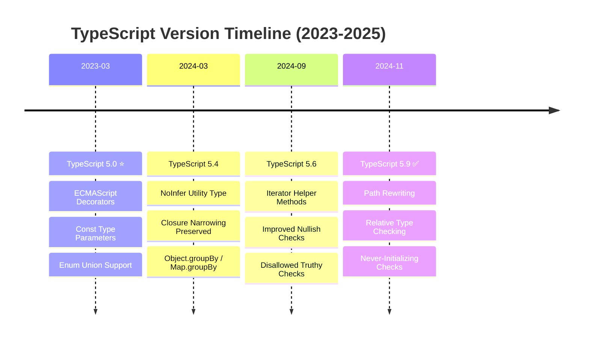
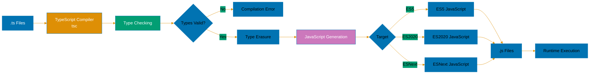

# TypeScript Documentation

Complete TypeScript guide for the Open Sharia Enterprise (OSE) Platform. Covers type safety, domain-driven design, testing, and modern TypeScript practices for financial applications.

## Quick Reference

- [Overview](#overview)
- [Software Engineering Principles](#software-engineering-principles)
- [TypeScript Version Strategy](#typescript-version-strategy)
- [Documentation Structure](#documentation-structure)
- [TypeScript in the Platform](#typescript-in-the-platform)
- [Reproducible TypeScript Development](#reproducible-typescript-development)
- [Cross-Language Comparisons](#cross-language-comparisons)
- [Learning Paths](#learning-paths)
- [Code Examples](#code-examples-from-platform)
- [Tools & Ecosystem](#tools-and-ecosystem)
- [Resources](#resources-and-references)

## Overview

TypeScript is the primary language for OSE Platform development. It provides static typing, modern ECMAScript features, and excellent tooling for building robust financial applications.

### Why TypeScript?

- **Type Safety**: Catch errors at compile time, preventing runtime failures in financial calculations
- **Domain Modeling**: Express complex business rules (Murabaha contracts, Zakat calculations) as types
- **Refactoring Confidence**: Types enable safe refactoring across large codebases
- **Tooling**: Excellent IDE support with autocomplete, inline documentation, and error detection
- **Ecosystem**: Vast npm ecosystem with TypeScript support for frameworks and libraries
- **Developer Experience**: IntelliSense, type inference, and compile-time validation accelerate development

## Prerequisite Knowledge

**REQUIRED**: This documentation assumes you have completed the AyoKoding TypeScript learning path. These are **OSE Platform-specific style guides**, not educational tutorials.

**You MUST understand TypeScript fundamentals before using these standards:**

- **[TypeScript Learning Path](../../../../../apps/ayokoding-web/content/en/learn/software-engineering/programming-languages/typescript/_index.md)** - Complete 0-95% language coverage
- **[TypeScript By Example](../../../../../apps/ayokoding-web/content/en/learn/software-engineering/programming-languages/typescript/by-example/_index.md)** - 75-85 annotated code examples (beginner → advanced)
- **[TypeScript In Practice](../../../../../apps/ayokoding-web/content/en/learn/software-engineering/programming-languages/typescript/in-the-field/_index.md)** - Production patterns and design approaches

**What this documentation covers**: OSE Platform naming conventions, framework choices, repository-specific patterns, how to apply TypeScript knowledge in THIS codebase.

**What this documentation does NOT cover**: TypeScript syntax, language fundamentals, generic patterns (those are in ayokoding-web).

**See**: [Programming Language Documentation Separation Convention](../../../../../governance/conventions/structure/programming-language-docs-separation.md) for content separation rules.

## Coding Standards

**This documentation is the authoritative reference** for TypeScript coding standards in the open-sharia-enterprise platform.

All TypeScript code MUST follow the standards documented here:

1. **[Idioms](ex-soen-prla-ty__idioms.md)** - TypeScript-specific patterns and conventions
2. **[Best Practices](ex-soen-prla-ty__best-practices.md)** - Clean code standards
3. **[Anti-Patterns](ex-soen-prla-ty__anti-patterns.md)** - Common mistakes to avoid

**For Agents**: Reference this documentation when writing TypeScript code. The `swe-programming-typescript` skill provides quick access to these standards.

### Quick Standards Reference

- **Naming Conventions**: See [Best Practices - Code Organization](ex-soen-prla-ty__best-practices.md#code-organization)
- **Error Handling**: See [Error Handling](ex-soen-prla-ty__error-handling.md)
- **Type Safety**: See [Type Safety](ex-soen-prla-ty__type-safety.md)
- **Testing Standards**: See [Test-Driven Development](ex-soen-prla-ty__test-driven-development.md)
- **Security Practices**: See [Security](ex-soen-prla-ty__security.md)

**Related**: [Functional Programming](../../../../../governance/development/pattern/functional-programming.md) - Cross-language FP principles

## Software Engineering Principles

TypeScript development in this platform follows the five software engineering principles from [governance/principles/software-engineering/](../../../../../governance/principles/software-engineering/README.md):

1. **[Automation Over Manual](../../../../../governance/principles/software-engineering/automation-over-manual.md)** - TypeScript automates through ESLint, Prettier, Husky hooks, automated testing with Jest/Vitest, and CI/CD pipelines
2. **[Explicit Over Implicit](../../../../../governance/principles/software-engineering/explicit-over-implicit.md)** - TypeScript enforces through explicit typing, no `any` types, explicit error handling with Result pattern, clear function signatures
3. **[Immutability Over Mutability](../../../../../governance/principles/software-engineering/immutability.md)** - TypeScript encourages immutable patterns through `readonly`, `const`, frozen objects, and functional programming patterns
4. **[Pure Functions Over Side Effects](../../../../../governance/principles/software-engineering/pure-functions.md)** - TypeScript supports through first-class functions, arrow functions, functional core/imperative shell architecture
5. **[Reproducibility First](../../../../../governance/principles/software-engineering/reproducibility.md)** - TypeScript enables through Volta pinning, package-lock.json, strict tsconfig, deterministic builds

**See Also**: [Functional Programming](ex-soen-prla-ty__functional-programming.md) for pure functions patterns, [Best Practices](ex-soen-prla-ty__best-practices.md) for explicit coding standards, [Type Safety](ex-soen-prla-ty__type-safety.md) for immutable type patterns.

## TypeScript Version Strategy



**Platform Strategy**: TypeScript 5.0+ (baseline) → TypeScript 5.4+ (milestone) → TypeScript 5.6+ (stable) → TypeScript 5.9.3+ (latest)

### Current Baseline: TypeScript 5.0+ (Decorators Era)

**Platform Standard**: TypeScript 5.0 is the minimum required version for all TypeScript projects in the platform.

**Rationale**:

- ECMAScript Stage 3 decorators for metadata and dependency injection
- Const type parameters preserve literal types in generic functions
- Enum members as union types for better discriminated unions
- Foundation for modern TypeScript patterns (2023-2026)

### Recommended Version: TypeScript 5.4+ (Inference Control)

**Migration Path**: Projects are encouraged to use TypeScript 5.4+ for enhanced features:

- `NoInfer` utility type prevents unwanted type inference
- Preserved type narrowing in closures eliminates redundant checks
- Native `Object.groupBy` and `Map.groupBy` support
- Improved control flow analysis for complex conditionals

### Current Stable: TypeScript 5.6+ (Strictness & Standards)

**Features**:

- Iterator helper methods (map, filter, take, drop, flatMap)
- Improved truthiness and nullish narrowing
- Disallowed nonsensical comparisons
- Region-priority resolution in Intl APIs

### Latest Release: TypeScript 5.9 (Monorepo Optimization)

**Released**: November 2024 (version 5.9.3 as of January 24, 2026)

**Major Features**:

- Path rewriting for relative imports (`--rewriteRelativeImportExtensions`)
- Relative type checking mode for faster incremental builds
- Never-initializing function checks catch initialization bugs
- Automatic ancestor `tsconfig.json` search

**Development Features**:

- Enhanced path completion for relative imports
- Improved error messages with actionable suggestions
- Better JSDoc support for type inference

## Documentation Structure

### Foundation

| Document                                                             | Description                  | Lines | Topics                                 |
| -------------------------------------------------------------------- | ---------------------------- | ----- | -------------------------------------- |
| [Best Practices](ex-soen-prla-ty__best-practices.md)                 | Core principles and patterns | 1,800 | Clarity, SRP, Immutability, Testing    |
| [Idioms](ex-soen-prla-ty__idioms.md)                                 | TypeScript-specific patterns | 1,152 | Type guards, Utility types, Generics   |
| [Type Safety](ex-soen-prla-ty__type-safety.md)                       | Advanced type patterns       | 763   | Branded types, Discriminated unions    |
| [Error Handling](ex-soen-prla-ty__error-handling.md)                 | Result/Either patterns       | 591   | Custom errors, Async errors            |
| [Interfaces & Types](ex-soen-prla-ty__interfaces-and-types.md)       | Type system deep dive        | 303   | Interfaces, Generics, Mapped types     |
| [Functional Programming](ex-soen-prla-ty__functional-programming.md) | FP in TypeScript             | 187   | Pure functions, Composition, Monads    |
| [Concurrency](ex-soen-prla-ty__concurrency-and-parallelism.md)       | Async patterns               | 169   | Promises, Web Workers, AbortController |
| [Modules](ex-soen-prla-ty__modules-and-dependencies.md)              | Module systems               | 159   | ESM, npm/pnpm/bun, Monorepos           |

### Advanced Topics

| Document                                                          | Description             | Lines | Topics                                      |
| ----------------------------------------------------------------- | ----------------------- | ----- | ------------------------------------------- |
| [Domain-Driven Design](ex-soen-prla-ty__domain-driven-design.md)  | DDD patterns            | 2,200 | Entities, Value Objects, Aggregates, Events |
| [Web Services](ex-soen-prla-ty__web-services.md)                  | API development         | 2,000 | Express, Fastify, NestJS, tRPC, Hono        |
| [Security](ex-soen-prla-ty__security.md)                          | Security best practices | 1,900 | XSS, Injection, Auth, OWASP Top 10          |
| [Performance](ex-soen-prla-ty__performance.md)                    | Optimization            | 1,800 | Profiling, Caching, Database, Async         |
| [Memory Management](ex-soen-prla-ty__memory-management.md)        | V8 GC & Memory          | 1,600 | Heap, GC, Leaks, Streaming                  |
| [Finite State Machines](ex-soen-prla-ty__finite-state-machine.md) | State patterns          | 1,600 | FSM, XState, Payment flows                  |
| [Anti-Patterns](ex-soen-prla-ty__anti-patterns.md)                | Common mistakes         | 1,800 | Type safety, Error handling, Design         |

### Testing & Quality

| Document                                                                         | Description         | Lines | Topics                               |
| -------------------------------------------------------------------------------- | ------------------- | ----- | ------------------------------------ |
| [Testing](ex-soen-prla-ty__testing.md)                                           | Testing foundations | N/A   | Testing pyramid, test types, tooling |
| [Test-Driven Development](ex-soen-prla-ty__test-driven-development.md)           | TDD practices       | 1,800 | Jest, Vitest, Property testing       |
| [Behaviour-Driven Development](ex-soen-prla-ty__behaviour-driven-development.md) | BDD with Gherkin    | 1,500 | Cucumber, Playwright, E2E            |
| [Linting & Formatting](ex-soen-prla-ty__linting-and-formatting.md)               | Code quality        | 1,400 | ESLint 9.x/10.x, Prettier, Hooks     |

### Version-Specific Documentation

| Version                                           | Description       | Key Features                           |
| ------------------------------------------------- | ----------------- | -------------------------------------- |
| [TypeScript 5.0](ex-soen-prla-ty__release-5.0.md) | Baseline version  | Decorators, const type parameters      |
| [TypeScript 5.1](ex-soen-prla-ty__release-5.1.md) | Incremental       | JSDoc improvements, type narrowing     |
| [TypeScript 5.2](ex-soen-prla-ty__release-5.2.md) | Incremental       | Using declarations, decorator metadata |
| [TypeScript 5.4](ex-soen-prla-ty__release-5.4.md) | Milestone version | NoInfer utility, Closure narrowing     |
| [TypeScript 5.6](ex-soen-prla-ty__release-5.6.md) | Stable version    | Iterator helpers, Strict checks        |
| [TypeScript 5.8](ex-soen-prla-ty__release-5.8.md) | Incremental       | Granular checks, require() imports     |
| [TypeScript 5.9](ex-soen-prla-ty__release-5.9.md) | Latest version    | Path rewriting, Relative checks        |

## TypeScript in the Platform

### Primary Use Cases

**Web Applications**:

- React single-page applications with Next.js
- Server-side rendered applications for performance
- Progressive web apps (PWAs) for offline support
- Admin dashboards and internal tools

**Backend Services**:

- RESTful APIs with Express, Fastify, or Hono
- GraphQL APIs with Apollo Server
- tRPC endpoints for end-to-end type safety
- Microservices with NestJS framework

**CLI Tools**:

- ayokoding-cli for content automation and Hugo integration
- rhino-cli for repository management and hygiene
- Build tools and code generators
- Database migration scripts

**Libraries & Packages**:

- Shared utilities in monorepo libs/ directory
- Domain logic packages for reuse across apps
- Type definitions for platform-specific types
- Testing utilities and mocks

### Framework Stack

**Backend Frameworks**:

**Express** (5.2.1 / 4.x) - Minimalist, flexible:

```typescript
import express from "express";

const app = express();

app.get("/zakat/:wealth", (req, res) => {
  const wealth = parseFloat(req.params.wealth);
  const zakat = wealth >= 5000 ? wealth * 0.025 : 0;
  res.json({ wealth, zakat });
});

app.listen(3000);
```

**Fastify** (5.x) - High-performance, schema-based:

```typescript
import Fastify from "fastify";

const fastify = Fastify();

fastify.get<{ Params: { wealth: string } }>("/zakat/:wealth", async (request) => {
  const wealth = parseFloat(request.params.wealth);
  return { wealth, zakat: wealth >= 5000 ? wealth * 0.025 : 0 };
});

fastify.listen({ port: 3000 });
```

**NestJS** (11.x) - Enterprise, dependency injection:

```typescript
import { Controller, Get, Param } from "@nestjs/common";
import { ZakatService } from "./zakat.service";

@Controller("zakat")
export class ZakatController {
  constructor(private readonly zakatService: ZakatService) {}

  @Get(":wealth")
  calculate(@Param("wealth") wealth: string) {
    return this.zakatService.calculate(parseFloat(wealth));
  }
}
```

**tRPC** (11.x) - Type-safe, no codegen:

```typescript
import { initTRPC } from "@trpc/server";

const t = initTRPC.create();

const appRouter = t.router({
  zakat: t.procedure
    .input((val: unknown) => {
      if (typeof val === "number") return val;
      throw new Error("Input must be number");
    })
    .query(({ input }) => ({
      wealth: input,
      zakat: input >= 5000 ? input * 0.025 : 0,
    })),
});

// Client automatically knows types!
```

**Hono** (4.x) - Edge computing, ultra-fast:

```typescript
import { Hono } from "hono";

const app = new Hono();

app.get("/zakat/:wealth", (c) => {
  const wealth = parseFloat(c.req.param("wealth"));
  return c.json({ wealth, zakat: wealth >= 5000 ? wealth * 0.025 : 0 });
});

export default app;
```

**Testing Frameworks**:

**Jest** (30.2.0) - Mature, feature-rich:

```typescript
describe("ZakatCalculator", () => {
  it("calculates 2.5% for wealth above nisab", () => {
    expect(calculateZakat(10000, 5000)).toBe(250);
  });

  it("returns 0 for wealth below nisab", () => {
    expect(calculateZakat(3000, 5000)).toBe(0);
  });
});
```

**Vitest** (4.0.18) - Fast, Vite-powered:

```typescript
import { describe, it, expect } from "vitest";

describe("ZakatCalculator", () => {
  it("handles edge cases", () => {
    expect(calculateZakat(5000, 5000)).toBe(125); // Exactly at nisab
    expect(calculateZakat(0, 5000)).toBe(0);
  });
});
```

**Playwright** (1.57.0) - E2E testing:

```typescript
import { test, expect } from "@playwright/test";

test("donation form submits successfully", async ({ page }) => {
  await page.goto("/donate");
  await page.fill('[name="amount"]', "1000");
  await page.click('button[type="submit"]');
  await expect(page.locator(".success-message")).toBeVisible();
});
```

### Architectural Patterns

**Hexagonal Architecture** (Ports and Adapters):

```typescript
// Domain core (pure TypeScript, no frameworks)
interface ZakatPort {
  calculate(wealth: number): Result<number, Error>;
}

class ZakatCalculator implements ZakatPort {
  calculate(wealth: number): Result<number, Error> {
    if (wealth < 0) return err(new Error("Wealth cannot be negative"));
    const nisab = 5000;
    const amount = wealth >= nisab ? wealth * 0.025 : 0;
    return ok(amount);
  }
}

// Infrastructure adapter (HTTP)
class ZakatHttpAdapter {
  constructor(private calculator: ZakatPort) {}

  async handle(request: Request): Promise<Response> {
    const { wealth } = await request.json();
    const result = this.calculator.calculate(wealth);

    if (!result.ok) {
      return new Response(JSON.stringify({ error: result.error.message }), {
        status: 400,
      });
    }

    return new Response(JSON.stringify({ zakat: result.value }), {
      status: 200,
    });
  }
}
```

**Functional Core, Imperative Shell**:

```typescript
// Functional core (pure functions, no side effects)
function calculateZakat(wealth: number, nisab: number): number {
  return wealth >= nisab ? wealth * 0.025 : 0;
}

function validateWealth(wealth: number): Result<number, Error> {
  if (wealth < 0) return err(new Error("Wealth cannot be negative"));
  if (!Number.isFinite(wealth)) return err(new Error("Wealth must be finite"));
  return ok(wealth);
}

// Imperative shell (side effects at boundaries)
async function processZakatRequest(request: Request): Promise<Response> {
  const { wealth, nisab = 5000 } = await request.json();

  const validatedWealth = validateWealth(wealth);
  if (!validatedWealth.ok) {
    return new Response(JSON.stringify({ error: validatedWealth.error.message }), {
      status: 400,
    });
  }

  const zakat = calculateZakat(validatedWealth.value, nisab);

  await saveToDatabase({ wealth, nisab, zakat }); // Side effect

  return new Response(JSON.stringify({ zakat }), { status: 200 });
}
```

**Event-Driven Architecture**:

```typescript
// Domain events
interface DomainEvent {
  readonly eventId: string;
  readonly occurredAt: Date;
  readonly eventType: string;
}

interface ZakatCalculatedEvent extends DomainEvent {
  readonly eventType: "ZakatCalculated";
  readonly donorId: string;
  readonly wealth: number;
  readonly zakatAmount: number;
}

// Event bus
class EventBus {
  private handlers = new Map<string, Array<(event: DomainEvent) => void>>();

  subscribe(eventType: string, handler: (event: DomainEvent) => void): void {
    const handlers = this.handlers.get(eventType) || [];
    handlers.push(handler);
    this.handlers.set(eventType, handlers);
  }

  publish(event: DomainEvent): void {
    const handlers = this.handlers.get(event.eventType) || [];
    handlers.forEach((handler) => handler(event));
  }
}

// Usage
const eventBus = new EventBus();

eventBus.subscribe("ZakatCalculated", (event) => {
  console.log("Zakat calculated:", event);
  // Send notification, update analytics, etc.
});

const event: ZakatCalculatedEvent = {
  eventId: crypto.randomUUID(),
  occurredAt: new Date(),
  eventType: "ZakatCalculated",
  donorId: "donor-123",
  wealth: 10000,
  zakatAmount: 250,
};

eventBus.publish(event);
```

### Real-World OSE Platform Examples

**Example 1: Zakat Calculation Service**:

```typescript
// Domain model
interface Money {
  readonly amount: number;
  readonly currency: string;
}

interface ZakatCalculationInput {
  wealth: Money;
  nisab: Money;
  rate: number;
}

interface ZakatCalculationResult {
  eligible: boolean;
  zakatAmount: Money;
  remainingWealth: Money;
}

// Pure function
function calculateZakat(input: ZakatCalculationInput): Result<ZakatCalculationResult, Error> {
  if (input.wealth.currency !== input.nisab.currency) {
    return err(new Error("Currency mismatch"));
  }

  const eligible = input.wealth.amount >= input.nisab.amount;
  const zakatAmount: Money = eligible
    ? { amount: input.wealth.amount * input.rate, currency: input.wealth.currency }
    : { amount: 0, currency: input.wealth.currency };

  const remainingWealth: Money = {
    amount: input.wealth.amount - zakatAmount.amount,
    currency: input.wealth.currency,
  };

  return ok({ eligible, zakatAmount, remainingWealth });
}

// API endpoint (Express)
app.post("/api/zakat/calculate", async (req, res) => {
  const result = calculateZakat({
    wealth: req.body.wealth,
    nisab: req.body.nisab,
    rate: 0.025,
  });

  if (!result.ok) {
    res.status(400).json({ error: result.error.message });
    return;
  }

  res.json(result.value);
});
```

**Example 2: Murabaha Contract State Machine**:

```typescript
// States
type MurabahaState = "draft" | "pending-approval" | "approved" | "active" | "completed" | "cancelled";

// Events
type MurabahaEvent =
  | { type: "submit" }
  | { type: "approve" }
  | { type: "reject" }
  | { type: "activate" }
  | { type: "complete" }
  | { type: "cancel" };

// State machine
class MurabahaContract {
  private state: MurabahaState = "draft";

  transition(event: MurabahaEvent): Result<MurabahaState, Error> {
    const nextState = this.getNextState(event);

    if (!nextState.ok) {
      return err(nextState.error);
    }

    this.state = nextState.value;
    return ok(this.state);
  }

  private getNextState(event: MurabahaEvent): Result<MurabahaState, Error> {
    switch (this.state) {
      case "draft":
        return event.type === "submit" ? ok("pending-approval") : err(new Error("Invalid transition"));
      case "pending-approval":
        return event.type === "approve"
          ? ok("approved")
          : event.type === "reject"
            ? ok("draft")
            : err(new Error("Invalid transition"));
      case "approved":
        return event.type === "activate" ? ok("active") : err(new Error("Invalid transition"));
      case "active":
        return event.type === "complete"
          ? ok("completed")
          : event.type === "cancel"
            ? ok("cancelled")
            : err(new Error("Invalid transition"));
      default:
        return err(new Error("Invalid state"));
    }
  }
}
```

**Example 3: Donation Campaign with NestJS**:

```typescript
// Module (NestJS)
@Module({
  imports: [TypeOrmModule.forFeature([Campaign, Donation])],
  controllers: [CampaignController],
  providers: [CampaignService],
})
export class CampaignModule {}

// Service
@Injectable()
export class CampaignService {
  constructor(
    @InjectRepository(Campaign)
    private campaignRepo: Repository<Campaign>,
    @InjectRepository(Donation)
    private donationRepo: Repository<Donation>,
  ) {}

  async createCampaign(dto: CreateCampaignDto): Promise<Campaign> {
    const campaign = this.campaignRepo.create(dto);
    return this.campaignRepo.save(campaign);
  }

  async donate(campaignId: string, amount: number, donorId: string): Promise<Donation> {
    const campaign = await this.campaignRepo.findOne({ where: { id: campaignId } });

    if (!campaign) {
      throw new NotFoundException("Campaign not found");
    }

    const donation = this.donationRepo.create({
      campaign,
      amount,
      donorId,
      createdAt: new Date(),
    });

    return this.donationRepo.save(donation);
  }
}

// Controller
@Controller("campaigns")
export class CampaignController {
  constructor(private readonly campaignService: CampaignService) {}

  @Post()
  create(@Body() dto: CreateCampaignDto) {
    return this.campaignService.createCampaign(dto);
  }

  @Post(":id/donate")
  donate(@Param("id") id: string, @Body() dto: DonateDto) {
    return this.campaignService.donate(id, dto.amount, dto.donorId);
  }
}
```

### Integration with Nx Monorepo

**Project Structure**:

```
apps/
├── oseplatform-web/         # Hugo static site (TypeScript for build scripts)
├── ayokoding-web/            # Hugo static site (TypeScript for build scripts)
├── ayokoding-cli/            # Go CLI tool
└── rhino-cli/               # Go CLI tool

libs/
├── ts-logger/               # Shared logging library
├── ts-config/               # Shared configuration management
├── ts-zakat-calculator/     # Zakat calculation domain logic
├── ts-murabaha-contracts/   # Murabaha contract domain logic
└── ts-waqf-manager/         # Waqf property management
```

**Import Pattern**:

```typescript
// Apps import from libs
import { Logger } from "@open-sharia-enterprise/ts-logger";
import { ConfigService } from "@open-sharia-enterprise/ts-config";
import { ZakatCalculator } from "@open-sharia-enterprise/ts-zakat-calculator";

// Libs can import other libs (no circular dependencies)
// ts-zakat-calculator imports ts-logger
import { Logger } from "@open-sharia-enterprise/ts-logger";

class ZakatCalculator {
  private logger = new Logger("ZakatCalculator");

  calculate(wealth: number): number {
    this.logger.debug(`Calculating zakat for wealth: ${wealth}`);
    return wealth >= 5000 ? wealth * 0.025 : 0;
  }
}
```

**Nx Commands**:

```bash
# Build specific library
nx build ts-zakat-calculator

# Run fast quality gate (pre-push standard)
nx run ts-zakat-calculator:test:quick

# Run isolated unit tests
nx run ts-zakat-calculator:test:unit

# Lint specific library
nx lint ts-zakat-calculator

# Build only affected projects (after git changes)
nx affected -t build

# Run quality gate for affected projects
nx affected -t test:quick

# Visualize dependency graph
nx graph
```

**See**: [Nx Target Standards](../../../../../governance/development/infra/nx-targets.md) for canonical target names.

## Reproducible TypeScript Development

### Version Management with Volta

**Volta** is the recommended tool for pinning Node.js and npm versions across the team.

**Setup Volta**:

```bash
# Install Volta
curl https://get.volta.sh | bash

# Pin Node.js version for project
volta pin node@24.13.1

# Pin npm version
volta pin npm@11.10.1
```

**package.json configuration** (automatically added by Volta):

```json
{
  "volta": {
    "node": "24.13.1",
    "npm": "11.10.1"
  }
}
```

**Benefits**:

- **Team Consistency**: All developers use same Node.js/npm versions
- **Automatic Switching**: Volta switches versions when entering project directory
- **CI/CD Alignment**: Use same versions in continuous integration
- **No Manual Management**: No need to manually install/switch Node versions

### package-lock.json Importance

**Why package-lock.json matters**:

```json
{
  "name": "ose-platform",
  "version": "1.0.0",
  "lockfileVersion": 3,
  "requires": true,
  "packages": {
    "node_modules/typescript": {
      "version": "5.9.3",
      "resolved": "https://registry.npmjs.org/typescript/-/typescript-5.9.3.tgz",
      "integrity": "sha512-..."
    }
  }
}
```

**Critical for reproducibility**:

- **Exact Versions**: Locks exact versions of all dependencies and transitive dependencies
- **Integrity Checks**: SHA-512 hashes verify package contents haven't changed
- **Deterministic Installs**: `npm ci` installs exact versions from lock file
- **Security**: Prevents supply chain attacks through version pinning
- **Team Alignment**: All developers install identical dependency tree

**Best practices**:

```bash
# Always commit package-lock.json
git add package-lock.json
git commit -m "chore: update dependencies"

# Use npm ci in CI/CD (not npm install)
npm ci  # Clean install from lock file

# Update lock file when adding dependencies
npm install new-package
git add package.json package-lock.json
git commit -m "feat: add new-package dependency"
```

### Docker Development Containers

**Dockerfile for reproducible development**:

```dockerfile
FROM node:24.13.1-alpine

# Install system dependencies
RUN apk add --no-cache git

# Set working directory
WORKDIR /app

# Copy package files
COPY package.json package-lock.json ./

# Install dependencies with exact versions
RUN npm ci

# Copy source code
COPY . .

# Build TypeScript
RUN npm run build

# Expose port
EXPOSE 3000

# Start application
CMD ["npm", "start"]
```

**docker-compose.yml for local development**:

```yaml
version: "3.8"

services:
  app:
    build: .
    volumes:
      - .:/app
      - /app/node_modules
    ports:
      - "3000:3000"
    environment:
      - NODE_ENV=development
      - DATABASE_URL=postgresql://postgres:postgres@db:5432/ose_platform

  db:
    image: postgres:16
    environment:
      - POSTGRES_PASSWORD=postgres
      - POSTGRES_DB=ose_platform
    ports:
      - "5432:5432"
```

### Environment Reproducibility

**Create .env.example** (committed to repository):

```bash
# Node.js Environment
NODE_ENV=development

# Database
DATABASE_URL=postgresql://localhost:5432/ose_platform
DATABASE_POOL_SIZE=10

# Redis
REDIS_URL=redis://localhost:6379

# API Keys (use placeholder values)
API_KEY_PLACEHOLDER=your-api-key-here
JWT_SECRET_PLACEHOLDER=your-jwt-secret-here

# Feature Flags
ENABLE_ZAKAT_CALCULATOR=true
ENABLE_MURABAHA_CONTRACTS=true
```

**Setup script** (setup.sh):

```bash
#!/bin/bash
set -e

echo "🔧 Setting up OSE Platform development environment..."

# Check Node.js version
REQUIRED_NODE_VERSION="24.13.1"
CURRENT_NODE_VERSION=$(node -v | cut -d'v' -f2)

if [ "$CURRENT_NODE_VERSION" != "$REQUIRED_NODE_VERSION" ]; then
  echo "❌ Node.js version mismatch!"
  echo "   Required: $REQUIRED_NODE_VERSION"
  echo "   Current: $CURRENT_NODE_VERSION"
  echo "   Install Volta and run: volta pin node@$REQUIRED_NODE_VERSION"
  exit 1
fi

# Copy .env.example if .env doesn't exist
if [ ! -f .env ]; then
  echo "📋 Copying .env.example to .env..."
  cp .env.example .env
  echo "⚠️  Please update .env with your actual values"
fi

# Install dependencies
echo "📦 Installing dependencies..."
npm ci

# Build TypeScript
echo "🔨 Building TypeScript..."
npm run build

# Run database migrations
echo "🗄️  Running database migrations..."
npm run migrate

echo "✅ Setup complete! Run 'npm run dev' to start development server."
```

### Strict tsconfig.json

**Recommended tsconfig.json for reproducibility**:

```json
{
  "compilerOptions": {
    "target": "ES2022",
    "module": "esnext",
    "lib": ["ES2024", "DOM"],
    "moduleResolution": "bundler",
    "strict": true,
    "noUncheckedIndexedAccess": true,
    "exactOptionalPropertyTypes": true,
    "noImplicitReturns": true,
    "noFallthroughCasesInSwitch": true,
    "noUnusedLocals": true,
    "noUnusedParameters": true,
    "skipLibCheck": true,
    "esModuleInterop": true,
    "resolveJsonModule": true,
    "isolatedModules": true,
    "incremental": true,
    "tsBuildInfoFile": ".tsbuildinfo",
    "outDir": "./dist",
    "rootDir": "./src"
  },
  "include": ["src/**/*"],
  "exclude": ["node_modules", "dist", "**/*.test.ts", "**/*.spec.ts"]
}
```

**Strict mode benefits**:

- **noUncheckedIndexedAccess**: Prevents `undefined` access bugs with array/object indexing
- **exactOptionalPropertyTypes**: Distinguishes between `undefined` and missing properties
- **noImplicitReturns**: Ensures all code paths return values
- **noUnusedLocals/Parameters**: Catches dead code

### CI/CD Configuration

**GitHub Actions workflow** (.github/workflows/ci.yml):

```yaml
name: CI

on:
  push:
    branches: [main]
  pull_request:
    branches: [main]

jobs:
  build:
    runs-on: ubuntu-latest

    steps:
      - uses: actions/checkout@v4

      - name: Setup Node.js
        uses: actions/setup-node@v4
        with:
          node-version: "24.13.1"
          cache: "npm"

      - name: Install dependencies
        run: npm ci

      - name: Type check
        run: npm run type-check

      - name: Lint
        run: npm run lint

      - name: Test
        run: npm run test:ci

      - name: Build
        run: npm run build
```

**See**: [Reproducibility First principle](../../../../../governance/principles/software-engineering/reproducibility.md)

## Cross-Language Comparisons

### TypeScript vs Golang

**Type Systems**:

| Feature           | TypeScript                            | Golang                            |
| ----------------- | ------------------------------------- | --------------------------------- |
| Type Safety       | Compile-time only (erased at runtime) | Compile-time + runtime            |
| Structural Typing | ✅ Full support (duck typing)         | ❌ Nominal typing                 |
| Generics          | ✅ Full support (TS 2.1+)             | ✅ Limited support (Go 1.18+)     |
| Union Types       | ✅ Native (type \| type)              | ❌ Interface{} or code generation |
| Null Safety       | ✅ strictNullChecks                   | ❌ nil can be any pointer         |
| Type Inference    | ✅ Sophisticated                      | ✅ Basic                          |

**Example - Sum Type**:

```typescript
// TypeScript: Native union types
type PaymentMethod =
  | { type: "card"; cardNumber: string }
  | { type: "bank"; accountNumber: string }
  | { type: "cash"; amount: number };

function processPayment(method: PaymentMethod): string {
  switch (method.type) {
    case "card":
      return `Processing card: ${method.cardNumber}`;
    case "bank":
      return `Processing bank: ${method.accountNumber}`;
    case "cash":
      return `Processing cash: ${method.amount}`;
  }
}
```

```go
// Golang: Requires interface + type assertions
type PaymentMethod interface {
    Process() string
}

type CardPayment struct {
    CardNumber string
}

func (c CardPayment) Process() string {
    return fmt.Sprintf("Processing card: %s", c.CardNumber)
}

type BankPayment struct {
    AccountNumber string
}

func (b BankPayment) Process() string {
    return fmt.Sprintf("Processing bank: %s", b.AccountNumber)
}
```

**Concurrency Models**:

| Feature               | TypeScript                      | Golang               |
| --------------------- | ------------------------------- | -------------------- |
| Concurrency Primitive | Promises, async/await           | Goroutines, channels |
| Threads               | Single-threaded (event loop)    | M:N threading model  |
| Shared Memory         | ✅ (requires synchronization)   | ✅ (mutex-based)     |
| Message Passing       | ❌ (can simulate with queues)   | ✅ Native (channels) |
| CPU-Bound Tasks       | ❌ Limited (use Worker Threads) | ✅ Excellent         |

**Example - Concurrent Processing**:

```typescript
// TypeScript: Promise.all for concurrency
async function processTransactions(transactions: Transaction[]): Promise<Result[]> {
  const promises = transactions.map((tx) => processTransaction(tx));
  return Promise.all(promises);
}
```

```go
// Golang: Goroutines + channels
func processTransactions(transactions []Transaction) []Result {
    results := make(chan Result, len(transactions))
    var wg sync.WaitGroup

    for _, tx := range transactions {
        wg.Add(1)
        go func(t Transaction) {
            defer wg.Done()
            results <- processTransaction(t)
        }(tx)
    }

    go func() {
        wg.Wait()
        close(results)
    }()

    var output []Result
    for result := range results {
        output = append(output, result)
    }
    return output
}
```

**When to Choose**:

- **TypeScript**: Web applications, full-stack JavaScript, rapid prototyping, extensive npm ecosystem
- **Golang**: CLI tools, high-concurrency services, system programming, microservices

### TypeScript vs Java

**Object-Oriented Programming**:

| Feature          | TypeScript                            | Java                               |
| ---------------- | ------------------------------------- | ---------------------------------- |
| Classes          | ✅ ES6 classes                        | ✅ Full OOP support                |
| Interfaces       | ✅ Structural typing                  | ✅ Nominal typing                  |
| Inheritance      | ✅ Single inheritance + mixins        | ✅ Single inheritance + interfaces |
| Abstract Classes | ✅ Supported                          | ✅ Supported                       |
| Access Modifiers | ✅ public/private/protected (TS only) | ✅ Runtime enforced                |
| Generics         | ✅ Variance annotations (TS 4.7+)     | ✅ Type erasure                    |

**Example - Class Hierarchy**:

```typescript
// TypeScript
abstract class Account {
  constructor(protected balance: number) {}

  abstract calculateProfit(): number;

  deposit(amount: number): void {
    this.balance += amount;
  }
}

class MurabahaAccount extends Account {
  constructor(
    balance: number,
    private profitRate: number,
  ) {
    super(balance);
  }

  calculateProfit(): number {
    return this.balance * this.profitRate;
  }
}
```

```java
// Java
abstract class Account {
    protected double balance;

    public Account(double balance) {
        this.balance = balance;
    }

    abstract double calculateProfit();

    public void deposit(double amount) {
        this.balance += amount;
    }
}

class MurabahaAccount extends Account {
    private double profitRate;

    public MurabahaAccount(double balance, double profitRate) {
        super(balance);
        this.profitRate = profitRate;
    }

    @Override
    double calculateProfit() {
        return balance * profitRate;
    }
}
```

**Ecosystem Maturity**:

| Aspect              | TypeScript                          | Java                             |
| ------------------- | ----------------------------------- | -------------------------------- |
| Package Manager     | npm (11M+ packages)                 | Maven/Gradle (500K+ packages)    |
| Enterprise Adoption | Growing (Microsoft, Google, Airbnb) | Dominant (banks, enterprises)    |
| Learning Curve      | Moderate (JavaScript + types)       | Moderate (verbose syntax)        |
| Build Tooling       | Fast (esbuild, Vite, swc)           | Slower (Maven, Gradle)           |
| Runtime Performance | V8 JIT (fast for single-threaded)   | JVM (excellent for long-running) |

**When to Choose**:

- **TypeScript**: Web frontends, Node.js backends, modern startups, JavaScript ecosystem integration
- **Java**: Legacy enterprise systems, Android development, Spring Boot applications, long-running services

### TypeScript vs Python

**Typing Philosophies**:

| Feature        | TypeScript                | Python                             |
| -------------- | ------------------------- | ---------------------------------- |
| Type System    | Mandatory at compile time | Optional (type hints)              |
| Runtime Checks | ❌ Types erased           | ❌ Types ignored (mypy for static) |
| Type Inference | ✅ Sophisticated          | ✅ Basic (PEP 484)                 |
| Duck Typing    | ✅ Structural typing      | ✅ Native duck typing              |
| Dynamic Typing | ❌ (only with `any`)      | ✅ Default behavior                |

**Example - Optional Typing**:

```typescript
// TypeScript: Types required (with strict mode)
function calculateZakat(wealth: number, nisab: number): number {
  return wealth >= nisab ? wealth * 0.025 : 0;
}

calculateZakat(10000, 5000); // ✅ OK
calculateZakat("10000", 5000); // ❌ Compile error
```

```python
# Python: Types optional (runtime behavior unchanged)
def calculate_zakat(wealth: float, nisab: float) -> float:
    return wealth * 0.025 if wealth >= nisab else 0

calculate_zakat(10000, 5000)  # ✅ OK
calculate_zakat("10000", 5000)  # ✅ Runs (fails at runtime), mypy catches
```

**Runtime Characteristics**:

| Aspect                | TypeScript (Node.js)         | Python                    |
| --------------------- | ---------------------------- | ------------------------- |
| Startup Time          | Fast (JIT compilation)       | Moderate (interpreted)    |
| Memory Usage          | Moderate (V8 heap)           | Higher (dynamic types)    |
| Concurrency           | Event loop (single-threaded) | GIL (limited parallelism) |
| CPU-Bound Performance | Good (V8 optimizations)      | Slower (use NumPy/Cython) |
| I/O-Bound Performance | Excellent (async/await)      | Good (asyncio)            |

**When to Choose**:

- **TypeScript**: Web applications, real-time systems, event-driven architectures, type-safe APIs
- **Python**: Data science, machine learning, scripting, scientific computing, rapid prototyping

### TypeScript vs Elixir

**Concurrency & Fault Tolerance**:

| Feature             | TypeScript                    | Elixir                          |
| ------------------- | ----------------------------- | ------------------------------- |
| Concurrency Model   | Event loop (cooperative)      | Actor model (preemptive)        |
| Process Isolation   | ❌ Shared memory              | ✅ Isolated processes           |
| Fault Tolerance     | Manual error handling         | Supervisor trees (let it crash) |
| Hot Code Swapping   | ❌ Requires restart           | ✅ Native support (OTP)         |
| Distributed Systems | Manual (clustering libraries) | ✅ Built-in (Erlang VM)         |

**Example - Error Handling**:

```typescript
// TypeScript: Explicit error handling
async function fetchDonation(id: string): Promise<Result<Donation, Error>> {
  try {
    const response = await fetch(`/api/donations/${id}`);
    if (!response.ok) {
      return err(new Error(`HTTP ${response.status}`));
    }
    const data = await response.json();
    return ok(data);
  } catch (error) {
    return err(error as Error);
  }
}
```

```elixir
# Elixir: Let it crash philosophy
def fetch_donation(id) do
  case HTTPoison.get("/api/donations/#{id}") do
    {:ok, %{status_code: 200, body: body}} ->
      Jason.decode!(body)
    {:error, reason} ->
      raise "Failed to fetch donation: #{reason}"
  end
end

# Supervisor restarts process on crash
```

**When to Choose**:

- **TypeScript**: Web applications, Node.js ecosystem, JavaScript team expertise, gradual adoption
- **Elixir**: Real-time systems (Phoenix LiveView), high-availability services, distributed systems, fault-tolerant applications

### Decision Matrix

**Choose TypeScript when**:

- Building web frontends (React, Vue, Angular)
- Full-stack JavaScript development (Node.js + browser)
- Team has JavaScript expertise
- Rapid development with npm ecosystem
- Type safety without runtime overhead

**Choose Golang when**:

- Building CLI tools and system utilities
- High-concurrency backend services
- Microservices with low memory footprint
- Simple deployment (single binary)

**Choose Java when**:

- Enterprise applications with Spring ecosystem
- Android development
- Legacy system integration
- Long-running services with JVM optimizations

**Choose Python when**:

- Data science and machine learning
- Scripting and automation
- Scientific computing
- Rapid prototyping

**Choose Elixir when**:

- Real-time web applications
- Distributed, fault-tolerant systems
- High-availability requirements
- Erlang ecosystem integration

## Learning Paths

### Beginner Path

New to TypeScript? Start here:

1. [Best Practices](ex-soen-prla-ty__best-practices.md) - Core principles
2. [Interfaces & Types](ex-soen-prla-ty__interfaces-and-types.md) - Type basics
3. [Error Handling](ex-soen-prla-ty__error-handling.md) - Result pattern
4. [Idioms](ex-soen-prla-ty__idioms.md) - TypeScript patterns
5. [Modules](ex-soen-prla-ty__modules-and-dependencies.md) - Module systems
6. [Test-Driven Development](ex-soen-prla-ty__test-driven-development.md) - Testing basics
7. [Linting & Formatting](ex-soen-prla-ty__linting-and-formatting.md) - Code quality

### Intermediate Path

Comfortable with TypeScript? Level up:

1. [Type Safety](ex-soen-prla-ty__type-safety.md) - Advanced types
2. [Functional Programming](ex-soen-prla-ty__functional-programming.md) - FP patterns
3. [Concurrency](ex-soen-prla-ty__concurrency-and-parallelism.md) - Async patterns
4. [Domain-Driven Design](ex-soen-prla-ty__domain-driven-design.md) - DDD patterns
5. [Web Services](ex-soen-prla-ty__web-services.md) - API development
6. [Performance](ex-soen-prla-ty__performance.md) - Optimization
7. [Behaviour-Driven Development](ex-soen-prla-ty__behaviour-driven-development.md) - BDD
8. [Anti-Patterns](ex-soen-prla-ty__anti-patterns.md) - Avoid mistakes

### Advanced Path

Master-level TypeScript development:

1. [Security](ex-soen-prla-ty__security.md) - Security hardening
2. [Memory Management](ex-soen-prla-ty__memory-management.md) - V8 internals
3. [Finite State Machines](ex-soen-prla-ty__finite-state-machine.md) - Complex state
4. Version-specific docs (5.0, 5.4, 5.6, 5.9) - Latest features
5. Templates - Production patterns

## Code Examples from Platform

All examples use OSE Platform domain: donations, Zakat calculation, Murabaha contracts, campaign management.

### Money Value Object

```typescript
interface Money {
  readonly amount: number;
  readonly currency: string;
}

function createMoney(amount: number, currency: string): Result<Money, Error> {
  if (amount < 0) return err(new Error("Amount cannot be negative"));
  if (!["USD", "EUR", "SAR"].includes(currency)) {
    return err(new Error("Invalid currency"));
  }
  return ok(Object.freeze({ amount, currency }));
}
```

### Zakat Calculation

```typescript
function calculateZakat(wealth: number, nisab: number): number {
  if (wealth < nisab || wealth <= 0) return 0;
  return wealth * 0.025; // 2.5% for standard Zakat
}
```

### Donation Processing with Result Pattern

```typescript
async function processDonation(data: DonationInput): Promise<Result<Donation, Error>> {
  const validation = validateDonation(data);
  if (!validation.ok) return err(validation.error);

  const donation = await saveDonation(validation.value);
  if (!donation.ok) return err(donation.error);

  return ok(donation.value);
}
```

## Tools and Ecosystem

### Core Tools (Latest Versions)

- **TypeScript**: 5.9.3 (latest stable)
- **Node.js**: 24.13.1 LTS (Volta managed)
- **npm**: 11.10.1

### Package Managers

- **npm**: 11.8.0 (default)
- **pnpm**: 10.28.1 (fast, disk-efficient)
- **bun**: 1.3.6 (ultra-fast)

### Testing

- **Jest**: 30.2.0 (mature, feature-rich)
- **Vitest**: 4.0.18 (fast, Vite-powered)
- **Playwright**: 1.57.0 (E2E, component testing)
- **fast-check**: 3.x (property-based testing)
- **Cucumber**: 10.x (BDD with Gherkin)

### Code Quality

- **ESLint**: 9.39.0 / 10.0.0 (flat config)
- **Prettier**: 3.8.0 (formatting)
- **Husky**: 9.x (Git hooks)
- **lint-staged**: 15.x (pre-commit)

### Web Frameworks

- **Express**: 5.2.1 / 4.x (minimalist)
- **Fastify**: 5.x (high-performance)
- **NestJS**: 11.x (enterprise)
- **tRPC**: 11.x (type-safe APIs)
- **Hono**: 4.x (edge computing)

### Monorepo

- **Nx**: 20.x (build system)
- **pnpm workspaces**: Package management

## Resources and References

### Official Documentation

- [TypeScript Handbook](https://www.typescriptlang.org/docs/)
- [TypeScript Release Notes](https://www.typescriptlang.org/docs/handbook/release-notes/overview.html)
- [Node.js Documentation](https://nodejs.org/docs/)

### OSE Platform Conventions

- [File Naming Convention](../../../../../governance/conventions/structure/file-naming.md)
- [Diátaxis Framework](../../../../../governance/conventions/structure/diataxis-framework.md)
- [Functional Programming Principle](../../../../../governance/development/pattern/functional-programming.md)
- [Reproducibility Principle](../../../../../governance/principles/software-engineering/reproducibility.md)

### Related Stack Documentation

- [Golang Documentation](../golang/README.md)
- [Java Documentation](../java/README.md)
- [Elixir Documentation](../elixir/README.md)
- [Python Documentation](../python/README.md)

---

**Last Updated**: 2026-01-24
**TypeScript Version**: 5.0+ (baseline), 5.4+ (milestone), 5.6+ (stable), 5.9.3+ (latest stable)
**Documentation**: Core files and version-specific files organized by category
**Maintainers**: OSE Documentation Team

## TypeScript Type System

```mermaid
%%{init: {'theme':'base', 'themeVariables': { 'primaryColor':'#0173B2','primaryTextColor':'#fff','primaryBorderColor':'#0173B2','lineColor':'#DE8F05','secondaryColor':'#029E73','tertiaryColor':'#CC78BC','fontSize':'16px'}}}%%
flowchart TD
    A[TypeScript Types] --> B[Primitive Types]
    A --> C[Object Types]
    A --> D[Advanced Types]
    A --> E[Utility Types]

    B --> B1[string number<br/>boolean]
    B --> B2[null undefined]
    B --> B3[symbol bigint]

    C --> C1[interface<br/>type alias]
    C --> C2[class<br/>constructor]
    C --> C3[array tuple]

    D --> D1[Union<br/>Type | Type]
    D --> D2[Intersection<br/>Type & Type]
    D --> D3[Conditional<br/>T extends U]
    D --> D4[Mapped Types<br/>Keyof In]

    E --> E1[Partial Required]
    E --> E2[Pick Omit]
    E --> E3[Record Exclude]

    C1 --> F[Zakat Interface]
    D1 --> G[Amount Union]
    E1 --> H[Optional Fields]

    style A fill:#0173B2,color:#fff
    style B fill:#DE8F05,color:#fff
    style C fill:#029E73,color:#fff
    style D fill:#CC78BC,color:#fff
    style E fill:#0173B2,color:#fff
    style F fill:#029E73,color:#fff
```

## Compilation Process


