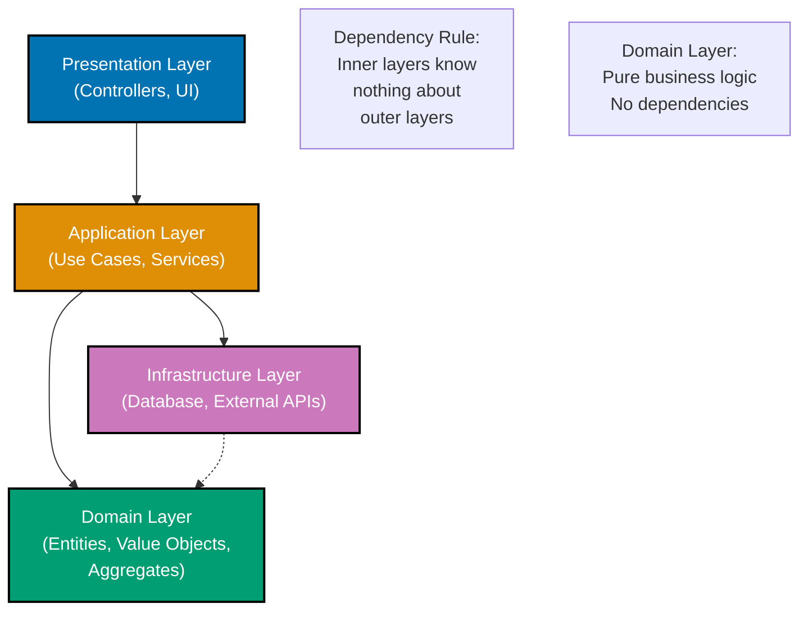
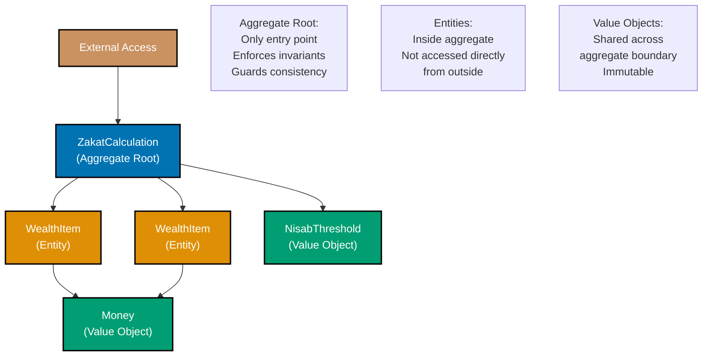
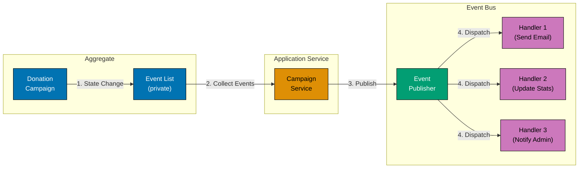
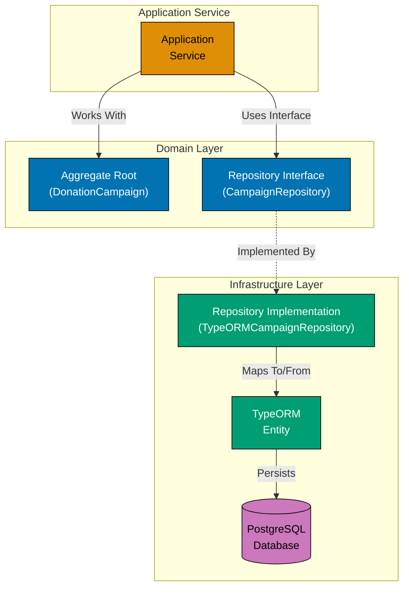

# TypeScript Domain-Driven Design

**Quick Reference**: [Overview](#overview) | [Value Objects](#value-objects) | [Entities](#entities) | [Aggregates](#aggregates) | [Domain Events](#domain-events) | [Repositories](#repositories) | [Domain Services](#domain-services) | [Application Services](#application-services) | [Specifications](#specifications) | [Complete Example](#complete-example-zakat-distribution-system) | [Related Documentation](#related-documentation)

## Overview

Domain-Driven Design (DDD) is a strategic approach to software development that focuses on modeling complex business domains. TypeScript's type system makes it ideal for implementing DDD patterns with compile-time safety.

### Core Concepts

- **Value Objects**: Immutable objects defined by their attributes
- **Entities**: Objects with unique identity and lifecycle
- **Aggregates**: Clusters of entities with consistency boundaries
- **Domain Events**: Significant occurrences in the domain
- **Repositories**: Persistence abstractions for aggregates
- **Domain Services**: Stateless operations on domain objects
- **Application Services**: Orchestration layer for use cases

### DDD Layers Hierarchy



## Value Objects

Value objects are immutable, have no identity, and are defined by their attributes.

### Money Value Object

```typescript
interface MoneyProps {
  readonly amount: number;
  readonly currency: string;
}

class Money {
  private constructor(private readonly props: MoneyProps) {
    Object.freeze(this);
  }

  static create(amount: number, currency: string): Result<Money, Error> {
    if (amount < 0) {
      return err(new Error("Amount cannot be negative"));
    }
    if (!["USD", "EUR", "SAR"].includes(currency)) {
      return err(new Error(`Invalid currency: ${currency}`));
    }
    return ok(new Money({ amount, currency }));
  }

  get amount(): number {
    return this.props.amount;
  }

  get currency(): string {
    return this.props.currency;
  }

  add(other: Money): Result<Money, Error> {
    if (this.currency !== other.currency) {
      return err(new Error("Cannot add money with different currencies"));
    }
    return Money.create(this.amount + other.amount, this.currency);
  }

  subtract(other: Money): Result<Money, Error> {
    if (this.currency !== other.currency) {
      return err(new Error("Cannot subtract money with different currencies"));
    }
    return Money.create(this.amount - other.amount, this.currency);
  }

  multiply(factor: number): Result<Money, Error> {
    return Money.create(this.amount * factor, this.currency);
  }

  equals(other: Money): boolean {
    return this.amount === other.amount && this.currency === other.currency;
  }
}

// Helper types
type Result<T, E = Error> = { readonly ok: true; readonly value: T } | { readonly ok: false; readonly error: E };

function ok<T>(value: T): Result<T, never> {
  return { ok: true, value };
}

function err<E>(error: E): Result<never, E> {
  return { ok: false, error };
}
```

### DonorId Value Object (Branded Type)

```typescript
type Brand<T, B> = T & { __brand: B };
type DonorId = Brand<string, "DonorId">;

function createDonorId(value: string): Result<DonorId, Error> {
  if (!/^DNR-\d{10}$/.test(value)) {
    return err(new Error(`Invalid donor ID format: ${value}`));
  }
  return ok(value as DonorId);
}

function isDonorId(value: unknown): value is DonorId {
  return typeof value === "string" && /^DNR-\d{10}$/.test(value);
}
```

### EmailAddress Value Object

```typescript
interface EmailAddressProps {
  readonly value: string;
}

class EmailAddress {
  private constructor(private readonly props: EmailAddressProps) {
    Object.freeze(this);
  }

  static create(email: string): Result<EmailAddress, Error> {
    const emailRegex = /^[^\s@]+@[^\s@]+\.[^\s@]+$/;
    if (!emailRegex.test(email)) {
      return err(new Error(`Invalid email address: ${email}`));
    }
    return ok(new EmailAddress({ value: email.toLowerCase() }));
  }

  get value(): string {
    return this.props.value;
  }

  equals(other: EmailAddress): boolean {
    return this.value === other.value;
  }
}
```

### NisabThreshold Value Object

```typescript
interface NisabThresholdProps {
  readonly amount: Money;
  readonly calculatedAt: Date;
}

class NisabThreshold {
  private constructor(private readonly props: NisabThresholdProps) {
    Object.freeze(this);
  }

  static create(amount: Money, calculatedAt: Date): Result<NisabThreshold, Error> {
    if (amount.amount <= 0) {
      return err(new Error("Nisab threshold must be positive"));
    }
    return ok(new NisabThreshold({ amount, calculatedAt }));
  }

  get amount(): Money {
    return this.props.amount;
  }

  get calculatedAt(): Date {
    return this.props.calculatedAt;
  }

  isWealthAboveThreshold(wealth: Money): Result<boolean, Error> {
    if (wealth.currency !== this.amount.currency) {
      return err(new Error("Currency mismatch"));
    }
    return ok(wealth.amount >= this.amount.amount);
  }

  equals(other: NisabThreshold): boolean {
    return this.amount.equals(other.amount) && this.calculatedAt.getTime() === other.calculatedAt.getTime();
  }
}
```

## Entities

Entities have unique identity and lifecycle. Equality is based on ID, not attributes.

### Donor Entity

```typescript
type DonorId = Brand<string, "DonorId">;

interface DonorProps {
  readonly donorId: DonorId;
  readonly name: string;
  readonly email: EmailAddress;
  readonly totalDonated: Money;
  readonly registeredAt: Date;
  readonly isAnonymous: boolean;
}

class Donor {
  private constructor(private props: DonorProps) {}

  static create(params: {
    donorId: DonorId;
    name: string;
    email: EmailAddress;
    isAnonymous?: boolean;
  }): Result<Donor, Error> {
    if (params.name.trim().length === 0) {
      return err(new Error("Donor name cannot be empty"));
    }

    const zeroMoney = Money.create(0, "USD");
    if (!zeroMoney.ok) {
      return err(zeroMoney.error);
    }

    return ok(
      new Donor({
        donorId: params.donorId,
        name: params.name,
        email: params.email,
        totalDonated: zeroMoney.value,
        registeredAt: new Date(),
        isAnonymous: params.isAnonymous ?? false,
      }),
    );
  }

  get id(): DonorId {
    return this.props.donorId;
  }

  get name(): string {
    return this.props.name;
  }

  get email(): EmailAddress {
    return this.props.email;
  }

  get totalDonated(): Money {
    return this.props.totalDonated;
  }

  get isAnonymous(): boolean {
    return this.props.isAnonymous;
  }

  recordDonation(amount: Money): Result<void, Error> {
    const newTotal = this.props.totalDonated.add(amount);
    if (!newTotal.ok) {
      return err(newTotal.error);
    }

    this.props = {
      ...this.props,
      totalDonated: newTotal.value,
    };

    return ok(undefined);
  }

  equals(other: Donor): boolean {
    return this.id === other.id;
  }
}
```

### Donation Entity

```typescript
type DonationId = Brand<string, "DonationId">;
type DonationCategory = "zakat" | "sadaqah" | "waqf";

interface DonationProps {
  readonly donationId: DonationId;
  readonly donorId: DonorId;
  readonly amount: Money;
  readonly category: DonationCategory;
  readonly message: string | null;
  readonly createdAt: Date;
  readonly processedAt: Date | null;
}

class Donation {
  private constructor(private props: DonationProps) {}

  static create(params: {
    donationId: DonationId;
    donorId: DonorId;
    amount: Money;
    category: DonationCategory;
    message?: string;
  }): Result<Donation, Error> {
    if (params.amount.amount <= 0) {
      return err(new Error("Donation amount must be positive"));
    }

    return ok(
      new Donation({
        donationId: params.donationId,
        donorId: params.donorId,
        amount: params.amount,
        category: params.category,
        message: params.message ?? null,
        createdAt: new Date(),
        processedAt: null,
      }),
    );
  }

  get id(): DonationId {
    return this.props.donationId;
  }

  get donorId(): DonorId {
    return this.props.donorId;
  }

  get amount(): Money {
    return this.props.amount;
  }

  get category(): DonationCategory {
    return this.props.category;
  }

  get isProcessed(): boolean {
    return this.props.processedAt !== null;
  }

  process(): Result<void, Error> {
    if (this.isProcessed) {
      return err(new Error("Donation already processed"));
    }

    this.props = {
      ...this.props,
      processedAt: new Date(),
    };

    return ok(undefined);
  }

  equals(other: Donation): boolean {
    return this.id === other.id;
  }
}
```

## Aggregates

Aggregates are clusters of entities with consistency boundaries. Only the aggregate root can be accessed from outside.

### Aggregate Boundary with Entities and Value Objects



### ZakatCalculation Aggregate

```typescript
type CalculationId = Brand<string, "CalculationId">;

interface WealthItem {
  readonly category: string;
  readonly amount: Money;
}

interface ZakatCalculationProps {
  readonly calculationId: CalculationId;
  readonly donorId: DonorId;
  readonly wealthItems: readonly WealthItem[];
  readonly nisabThreshold: NisabThreshold;
  readonly calculatedZakat: Money | null;
  readonly calculatedAt: Date;
  readonly status: "draft" | "calculated" | "paid";
}

class ZakatCalculation {
  private constructor(private props: ZakatCalculationProps) {}

  static create(params: {
    calculationId: CalculationId;
    donorId: DonorId;
    nisabThreshold: NisabThreshold;
  }): Result<ZakatCalculation, Error> {
    return ok(
      new ZakatCalculation({
        calculationId: params.calculationId,
        donorId: params.donorId,
        wealthItems: [],
        nisabThreshold: params.nisabThreshold,
        calculatedZakat: null,
        calculatedAt: new Date(),
        status: "draft",
      }),
    );
  }

  get id(): CalculationId {
    return this.props.calculationId;
  }

  get donorId(): DonorId {
    return this.props.donorId;
  }

  get totalWealth(): Result<Money, Error> {
    if (this.props.wealthItems.length === 0) {
      return Money.create(0, "USD");
    }

    const currency = this.props.wealthItems[0].amount.currency;
    let total = 0;

    for (const item of this.props.wealthItems) {
      if (item.amount.currency !== currency) {
        return err(new Error("All wealth items must have same currency"));
      }
      total += item.amount.amount;
    }

    return Money.create(total, currency);
  }

  addWealthItem(category: string, amount: Money): Result<void, Error> {
    if (this.props.status !== "draft") {
      return err(new Error("Cannot add wealth items to non-draft calculation"));
    }

    if (amount.amount <= 0) {
      return err(new Error("Wealth amount must be positive"));
    }

    this.props = {
      ...this.props,
      wealthItems: [...this.props.wealthItems, { category, amount }],
    };

    return ok(undefined);
  }

  calculate(): Result<void, Error> {
    if (this.props.status !== "draft") {
      return err(new Error("Calculation already performed"));
    }

    const totalWealthResult = this.totalWealth;
    if (!totalWealthResult.ok) {
      return err(totalWealthResult.error);
    }

    const totalWealth = totalWealthResult.value;
    const isAboveThresholdResult = this.props.nisabThreshold.isWealthAboveThreshold(totalWealth);

    if (!isAboveThresholdResult.ok) {
      return err(isAboveThresholdResult.error);
    }

    if (!isAboveThresholdResult.value) {
      const zeroResult = Money.create(0, totalWealth.currency);
      if (!zeroResult.ok) {
        return err(zeroResult.error);
      }

      this.props = {
        ...this.props,
        calculatedZakat: zeroResult.value,
        status: "calculated",
      };

      return ok(undefined);
    }

    // Calculate 2.5% zakat
    const zakatResult = totalWealth.multiply(0.025);
    if (!zakatResult.ok) {
      return err(zakatResult.error);
    }

    this.props = {
      ...this.props,
      calculatedZakat: zakatResult.value,
      status: "calculated",
    };

    return ok(undefined);
  }

  markAsPaid(): Result<void, Error> {
    if (this.props.status !== "calculated") {
      return err(new Error("Cannot mark as paid before calculation"));
    }

    if (this.props.calculatedZakat === null) {
      return err(new Error("No zakat amount calculated"));
    }

    this.props = {
      ...this.props,
      status: "paid",
    };

    return ok(undefined);
  }

  get calculatedZakat(): Money | null {
    return this.props.calculatedZakat;
  }

  get status(): "draft" | "calculated" | "paid" {
    return this.props.status;
  }
}
```

### DonationCampaign Aggregate

```typescript
type CampaignId = Brand<string, "CampaignId">;

interface CampaignProps {
  readonly campaignId: CampaignId;
  readonly name: string;
  readonly goal: Money;
  readonly raised: Money;
  readonly donations: readonly DonationId[];
  readonly startDate: Date;
  readonly endDate: Date;
  readonly status: "draft" | "active" | "completed" | "cancelled";
}

class DonationCampaign {
  private constructor(private props: CampaignProps) {}

  static create(params: {
    campaignId: CampaignId;
    name: string;
    goal: Money;
    startDate: Date;
    endDate: Date;
  }): Result<DonationCampaign, Error> {
    if (params.name.trim().length === 0) {
      return err(new Error("Campaign name cannot be empty"));
    }

    if (params.goal.amount <= 0) {
      return err(new Error("Campaign goal must be positive"));
    }

    if (params.startDate >= params.endDate) {
      return err(new Error("End date must be after start date"));
    }

    const zeroMoney = Money.create(0, params.goal.currency);
    if (!zeroMoney.ok) {
      return err(zeroMoney.error);
    }

    return ok(
      new DonationCampaign({
        campaignId: params.campaignId,
        name: params.name,
        goal: params.goal,
        raised: zeroMoney.value,
        donations: [],
        startDate: params.startDate,
        endDate: params.endDate,
        status: "draft",
      }),
    );
  }

  get id(): CampaignId {
    return this.props.campaignId;
  }

  get name(): string {
    return this.props.name;
  }

  get goal(): Money {
    return this.props.goal;
  }

  get raised(): Money {
    return this.props.raised;
  }

  get percentageReached(): number {
    return (this.raised.amount / this.goal.amount) * 100;
  }

  get isGoalReached(): boolean {
    return this.raised.amount >= this.goal.amount;
  }

  activate(): Result<void, Error> {
    if (this.props.status !== "draft") {
      return err(new Error("Can only activate draft campaigns"));
    }

    const now = new Date();
    if (now < this.props.startDate) {
      return err(new Error("Cannot activate campaign before start date"));
    }

    this.props = {
      ...this.props,
      status: "active",
    };

    return ok(undefined);
  }

  addDonation(donationId: DonationId, amount: Money): Result<void, Error> {
    if (this.props.status !== "active") {
      return err(new Error("Campaign is not active"));
    }

    if (amount.currency !== this.goal.currency) {
      return err(new Error("Donation currency must match campaign currency"));
    }

    const newRaised = this.raised.add(amount);
    if (!newRaised.ok) {
      return err(newRaised.error);
    }

    this.props = {
      ...this.props,
      raised: newRaised.value,
      donations: [...this.props.donations, donationId],
    };

    return ok(undefined);
  }

  complete(): Result<void, Error> {
    if (this.props.status !== "active") {
      return err(new Error("Can only complete active campaigns"));
    }

    const now = new Date();
    if (now < this.props.endDate && !this.isGoalReached) {
      return err(new Error("Cannot complete campaign before end date or goal reached"));
    }

    this.props = {
      ...this.props,
      status: "completed",
    };

    return ok(undefined);
  }
}
```

## Domain Events

Domain events represent significant occurrences in the domain.

### Base Domain Event

```typescript
type EventId = Brand<string, "EventId">;

interface DomainEvent {
  readonly eventId: EventId;
  readonly occurredAt: Date;
  readonly eventType: string;
}
```

### Specific Domain Events

```typescript
interface DonationReceivedEvent extends DomainEvent {
  readonly eventType: "DonationReceived";
  readonly donationId: DonationId;
  readonly donorId: DonorId;
  readonly amount: Money;
  readonly category: DonationCategory;
}

interface ZakatCalculatedEvent extends DomainEvent {
  readonly eventType: "ZakatCalculated";
  readonly calculationId: CalculationId;
  readonly donorId: DonorId;
  readonly zakatAmount: Money;
}

interface CampaignGoalReachedEvent extends DomainEvent {
  readonly eventType: "CampaignGoalReached";
  readonly campaignId: CampaignId;
  readonly goal: Money;
  readonly raised: Money;
  readonly reachedAt: Date;
}

type DomainEventUnion = DonationReceivedEvent | ZakatCalculatedEvent | CampaignGoalReachedEvent;
```

### Domain Event Flow



**Key Points**:

- **Aggregate emits events**: State changes produce domain events
- **Service collects events**: After saving aggregate, collect pending events
- **Event bus publishes**: Dispatch events to registered handlers
- **Handlers react independently**: Each handler processes events asynchronously

### Event Factory

```typescript
class DomainEventFactory {
  private static generateEventId(): EventId {
    return `EVT-${Date.now()}-${Math.random().toString(36).substr(2, 9)}` as EventId;
  }

  static createDonationReceivedEvent(params: {
    donationId: DonationId;
    donorId: DonorId;
    amount: Money;
    category: DonationCategory;
  }): DonationReceivedEvent {
    return {
      eventId: this.generateEventId(),
      occurredAt: new Date(),
      eventType: "DonationReceived",
      donationId: params.donationId,
      donorId: params.donorId,
      amount: params.amount,
      category: params.category,
    };
  }

  static createZakatCalculatedEvent(params: {
    calculationId: CalculationId;
    donorId: DonorId;
    zakatAmount: Money;
  }): ZakatCalculatedEvent {
    return {
      eventId: this.generateEventId(),
      occurredAt: new Date(),
      eventType: "ZakatCalculated",
      calculationId: params.calculationId,
      donorId: params.donorId,
      zakatAmount: params.zakatAmount,
    };
  }

  static createCampaignGoalReachedEvent(params: {
    campaignId: CampaignId;
    goal: Money;
    raised: Money;
  }): CampaignGoalReachedEvent {
    return {
      eventId: this.generateEventId(),
      occurredAt: new Date(),
      eventType: "CampaignGoalReached",
      campaignId: params.campaignId,
      goal: params.goal,
      raised: params.raised,
      reachedAt: new Date(),
    };
  }
}
```

### Event Handler

```typescript
type EventHandler<T extends DomainEvent> = (event: T) => Promise<void>;

class EventBus {
  private handlers: Map<string, EventHandler<any>[]> = new Map();

  subscribe<T extends DomainEvent>(eventType: string, handler: EventHandler<T>): void {
    const existing = this.handlers.get(eventType) ?? [];
    this.handlers.set(eventType, [...existing, handler]);
  }

  async publish<T extends DomainEvent>(event: T): Promise<void> {
    const handlers = this.handlers.get(event.eventType) ?? [];
    await Promise.all(handlers.map((handler) => handler(event)));
  }
}

// Example handlers
const eventBus = new EventBus();

eventBus.subscribe<DonationReceivedEvent>("DonationReceived", async (event) => {
  console.log(`Donation received: ${event.amount.amount} ${event.amount.currency}`);
  // Send email, update analytics, etc.
});

eventBus.subscribe<CampaignGoalReachedEvent>("CampaignGoalReached", async (event) => {
  console.log(`Campaign ${event.campaignId} reached its goal!`);
  // Notify stakeholders, trigger completion workflow
});
```

## Repositories

Repositories abstract persistence for aggregates.

### Repository Pattern



**Key Principles**:

- **Interface in domain layer**: Domain defines repository contract
- **Implementation in infrastructure**: Technical details isolated
- **Aggregate-oriented**: One repository per aggregate root
- **Domain model independence**: Aggregate knows nothing about persistence

### Repository Interface

```typescript
interface Repository<T, ID> {
  findById(id: ID): Promise<Result<T | null, Error>>;
  save(entity: T): Promise<Result<void, Error>>;
  delete(id: ID): Promise<Result<void, Error>>;
}
```

### Donor Repository

```typescript
interface DonorRepository extends Repository<Donor, DonorId> {
  findByEmail(email: EmailAddress): Promise<Result<Donor | null, Error>>;
  findAll(): Promise<Result<readonly Donor[], Error>>;
}

class InMemoryDonorRepository implements DonorRepository {
  private donors: Map<DonorId, Donor> = new Map();

  async findById(id: DonorId): Promise<Result<Donor | null, Error>> {
    const donor = this.donors.get(id) ?? null;
    return ok(donor);
  }

  async findByEmail(email: EmailAddress): Promise<Result<Donor | null, Error>> {
    for (const donor of this.donors.values()) {
      if (donor.email.equals(email)) {
        return ok(donor);
      }
    }
    return ok(null);
  }

  async findAll(): Promise<Result<readonly Donor[], Error>> {
    return ok(Array.from(this.donors.values()));
  }

  async save(donor: Donor): Promise<Result<void, Error>> {
    this.donors.set(donor.id, donor);
    return ok(undefined);
  }

  async delete(id: DonorId): Promise<Result<void, Error>> {
    this.donors.delete(id);
    return ok(undefined);
  }
}
```

### Donation Repository

```typescript
interface DonationRepository extends Repository<Donation, DonationId> {
  findByDonor(donorId: DonorId): Promise<Result<readonly Donation[], Error>>;
  findByCategory(category: DonationCategory): Promise<Result<readonly Donation[], Error>>;
  findUnprocessed(): Promise<Result<readonly Donation[], Error>>;
}

class InMemoryDonationRepository implements DonationRepository {
  private donations: Map<DonationId, Donation> = new Map();

  async findById(id: DonationId): Promise<Result<Donation | null, Error>> {
    const donation = this.donations.get(id) ?? null;
    return ok(donation);
  }

  async findByDonor(donorId: DonorId): Promise<Result<readonly Donation[], Error>> {
    const results = Array.from(this.donations.values()).filter((d) => d.donorId === donorId);
    return ok(results);
  }

  async findByCategory(category: DonationCategory): Promise<Result<readonly Donation[], Error>> {
    const results = Array.from(this.donations.values()).filter((d) => d.category === category);
    return ok(results);
  }

  async findUnprocessed(): Promise<Result<readonly Donation[], Error>> {
    const results = Array.from(this.donations.values()).filter((d) => !d.isProcessed);
    return ok(results);
  }

  async save(donation: Donation): Promise<Result<void, Error>> {
    this.donations.set(donation.id, donation);
    return ok(undefined);
  }

  async delete(id: DonationId): Promise<Result<void, Error>> {
    this.donations.delete(id);
    return ok(undefined);
  }
}
```

### ZakatCalculation Repository

```typescript
interface ZakatCalculationRepository extends Repository<ZakatCalculation, CalculationId> {
  findByDonor(donorId: DonorId): Promise<Result<readonly ZakatCalculation[], Error>>;
  findByStatus(status: "draft" | "calculated" | "paid"): Promise<Result<readonly ZakatCalculation[], Error>>;
}

class InMemoryZakatCalculationRepository implements ZakatCalculationRepository {
  private calculations: Map<CalculationId, ZakatCalculation> = new Map();

  async findById(id: CalculationId): Promise<Result<ZakatCalculation | null, Error>> {
    const calculation = this.calculations.get(id) ?? null;
    return ok(calculation);
  }

  async findByDonor(donorId: DonorId): Promise<Result<readonly ZakatCalculation[], Error>> {
    const results = Array.from(this.calculations.values()).filter((c) => c.donorId === donorId);
    return ok(results);
  }

  async findByStatus(status: "draft" | "calculated" | "paid"): Promise<Result<readonly ZakatCalculation[], Error>> {
    const results = Array.from(this.calculations.values()).filter((c) => c.status === status);
    return ok(results);
  }

  async save(calculation: ZakatCalculation): Promise<Result<void, Error>> {
    this.calculations.set(calculation.id, calculation);
    return ok(undefined);
  }

  async delete(id: CalculationId): Promise<Result<void, Error>> {
    this.calculations.delete(id);
    return ok(undefined);
  }
}
```

## Domain Services

Domain services contain business logic that doesn't naturally fit in entities or value objects.

### ZakatCalculationService

```typescript
class ZakatCalculationService {
  constructor(private readonly nisabThreshold: NisabThreshold) {}

  calculateZakat(wealth: Money): Result<Money, Error> {
    const isAboveThresholdResult = this.nisabThreshold.isWealthAboveThreshold(wealth);

    if (!isAboveThresholdResult.ok) {
      return err(isAboveThresholdResult.error);
    }

    if (!isAboveThresholdResult.value) {
      return Money.create(0, wealth.currency);
    }

    return wealth.multiply(0.025);
  }

  isZakatApplicable(wealth: Money): Result<boolean, Error> {
    return this.nisabThreshold.isWealthAboveThreshold(wealth);
  }
}
```

### DonationAllocationService

```typescript
interface AllocationRule {
  readonly category: string;
  readonly percentage: number;
}

class DonationAllocationService {
  allocateFunds(totalAmount: Money, rules: readonly AllocationRule[]): Result<Map<string, Money>, Error> {
    const totalPercentage = rules.reduce((sum, rule) => sum + rule.percentage, 0);

    if (Math.abs(totalPercentage - 100) > 0.01) {
      return err(new Error("Allocation percentages must sum to 100"));
    }

    const allocations = new Map<string, Money>();

    for (const rule of rules) {
      const allocationResult = totalAmount.multiply(rule.percentage / 100);
      if (!allocationResult.ok) {
        return err(allocationResult.error);
      }
      allocations.set(rule.category, allocationResult.value);
    }

    return ok(allocations);
  }
}

// Example usage
const allocationService = new DonationAllocationService();
const donationResult = Money.create(10000, "USD");

if (donationResult.ok) {
  const allocationsResult = allocationService.allocateFunds(donationResult.value, [
    { category: "education", percentage: 40 },
    { category: "healthcare", percentage: 35 },
    { category: "poverty-relief", percentage: 25 },
  ]);

  if (allocationsResult.ok) {
    for (const [category, amount] of allocationsResult.value) {
      console.log(`${category}: ${amount.amount} ${amount.currency}`);
    }
  }
}
```

## Application Services

Application services orchestrate use cases by coordinating domain objects.

### Use Case Execution Flow

```mermaid
%% Color Palette: Blue #0173B2, Orange #DE8F05, Teal #029E73, Purple #CC78BC, Brown #CA9161
sequenceDiagram
    participant C as Controller
    participant UC as Use Case
    participant R as Repository
    participant E as Entity/Aggregate
    participant DS as Domain Service
    participant EB as Event Bus

    C->>UC: execute#40;command#41;
    activate UC

    UC->>R: findById#40;id#41;
    activate R
    R-->>UC: Entity
    deactivate R

    UC->>E: performOperation#40;#41;
    activate E
    E->>DS: calculateBusinessRule#40;#41;
    activate DS
    DS-->>E: Result
    deactivate DS
    E-->>UC: Updated state
    deactivate E

    UC->>R: save#40;entity#41;
    activate R
    R-->>UC: Saved
    deactivate R

    UC->>EB: publish#40;event#41;
    activate EB
    EB-->>UC: Published
    deactivate EB

    UC-->>C: Success result
    deactivate UC

    Note over UC: Use Case orchestrates<br/>domain objects but<br/>contains no business logic

    classDef blue fill:#0173B2,stroke:#000000,color:#FFFFFF,stroke-width:2px
    classDef orange fill:#DE8F05,stroke:#000000,color:#FFFFFF,stroke-width:2px
    classDef teal fill:#029E73,stroke:#000000,color:#FFFFFF,stroke-width:2px
```

### RegisterDonorUseCase

```typescript
interface RegisterDonorCommand {
  readonly name: string;
  readonly email: string;
  readonly isAnonymous?: boolean;
}

class RegisterDonorUseCase {
  constructor(
    private readonly donorRepository: DonorRepository,
    private readonly eventBus: EventBus,
  ) {}

  async execute(command: RegisterDonorCommand): Promise<Result<DonorId, Error>> {
    // Validate email
    const emailResult = EmailAddress.create(command.email);
    if (!emailResult.ok) {
      return err(emailResult.error);
    }

    // Check if donor already exists
    const existingDonorResult = await this.donorRepository.findByEmail(emailResult.value);
    if (!existingDonorResult.ok) {
      return err(existingDonorResult.error);
    }

    if (existingDonorResult.value !== null) {
      return err(new Error("Donor with this email already exists"));
    }

    // Generate donor ID
    const donorIdResult = createDonorId(`DNR-${Date.now()}${Math.floor(Math.random() * 1000)}`);
    if (!donorIdResult.ok) {
      return err(donorIdResult.error);
    }

    // Create donor
    const donorResult = Donor.create({
      donorId: donorIdResult.value,
      name: command.name,
      email: emailResult.value,
      isAnonymous: command.isAnonymous,
    });

    if (!donorResult.ok) {
      return err(donorResult.error);
    }

    // Save donor
    const saveResult = await this.donorRepository.save(donorResult.value);
    if (!saveResult.ok) {
      return err(saveResult.error);
    }

    return ok(donorIdResult.value);
  }
}
```

### ProcessDonationUseCase

```typescript
interface ProcessDonationCommand {
  readonly donorId: string;
  readonly amount: number;
  readonly currency: string;
  readonly category: DonationCategory;
  readonly message?: string;
}

class ProcessDonationUseCase {
  constructor(
    private readonly donorRepository: DonorRepository,
    private readonly donationRepository: DonationRepository,
    private readonly eventBus: EventBus,
  ) {}

  async execute(command: ProcessDonationCommand): Promise<Result<DonationId, Error>> {
    // Validate donor ID
    const donorIdResult = createDonorId(command.donorId);
    if (!donorIdResult.ok) {
      return err(donorIdResult.error);
    }

    // Find donor
    const donorResult = await this.donorRepository.findById(donorIdResult.value);
    if (!donorResult.ok) {
      return err(donorResult.error);
    }

    if (donorResult.value === null) {
      return err(new Error("Donor not found"));
    }

    const donor = donorResult.value;

    // Create money
    const moneyResult = Money.create(command.amount, command.currency);
    if (!moneyResult.ok) {
      return err(moneyResult.error);
    }

    // Generate donation ID
    const donationId = `DON-${Date.now()}-${Math.random().toString(36).substr(2, 9)}` as DonationId;

    // Create donation
    const donationResult = Donation.create({
      donationId,
      donorId: donor.id,
      amount: moneyResult.value,
      category: command.category,
      message: command.message,
    });

    if (!donationResult.ok) {
      return err(donationResult.error);
    }

    const donation = donationResult.value;

    // Process donation
    const processResult = donation.process();
    if (!processResult.ok) {
      return err(processResult.error);
    }

    // Update donor total
    const recordResult = donor.recordDonation(moneyResult.value);
    if (!recordResult.ok) {
      return err(recordResult.error);
    }

    // Save entities
    const saveDonationResult = await this.donationRepository.save(donation);
    if (!saveDonationResult.ok) {
      return err(saveDonationResult.error);
    }

    const saveDonorResult = await this.donorRepository.save(donor);
    if (!saveDonorResult.ok) {
      return err(saveDonorResult.error);
    }

    // Publish event
    const event = DomainEventFactory.createDonationReceivedEvent({
      donationId: donation.id,
      donorId: donor.id,
      amount: moneyResult.value,
      category: command.category,
    });

    await this.eventBus.publish(event);

    return ok(donationId);
  }
}
```

### CalculateZakatUseCase

```typescript
interface CalculateZakatCommand {
  readonly donorId: string;
  readonly wealthItems: Array<{
    category: string;
    amount: number;
    currency: string;
  }>;
}

class CalculateZakatUseCase {
  constructor(
    private readonly donorRepository: DonorRepository,
    private readonly zakatCalculationRepository: ZakatCalculationRepository,
    private readonly nisabThreshold: NisabThreshold,
    private readonly eventBus: EventBus,
  ) {}

  async execute(command: CalculateZakatCommand): Promise<Result<CalculationId, Error>> {
    // Validate donor ID
    const donorIdResult = createDonorId(command.donorId);
    if (!donorIdResult.ok) {
      return err(donorIdResult.error);
    }

    // Find donor
    const donorResult = await this.donorRepository.findById(donorIdResult.value);
    if (!donorResult.ok) {
      return err(donorResult.error);
    }

    if (donorResult.value === null) {
      return err(new Error("Donor not found"));
    }

    // Generate calculation ID
    const calculationId = `CALC-${Date.now()}-${Math.random().toString(36).substr(2, 9)}` as CalculationId;

    // Create calculation
    const calculationResult = ZakatCalculation.create({
      calculationId,
      donorId: donorIdResult.value,
      nisabThreshold: this.nisabThreshold,
    });

    if (!calculationResult.ok) {
      return err(calculationResult.error);
    }

    const calculation = calculationResult.value;

    // Add wealth items
    for (const item of command.wealthItems) {
      const moneyResult = Money.create(item.amount, item.currency);
      if (!moneyResult.ok) {
        return err(moneyResult.error);
      }

      const addResult = calculation.addWealthItem(item.category, moneyResult.value);
      if (!addResult.ok) {
        return err(addResult.error);
      }
    }

    // Calculate zakat
    const calculateResult = calculation.calculate();
    if (!calculateResult.ok) {
      return err(calculateResult.error);
    }

    // Save calculation
    const saveResult = await this.zakatCalculationRepository.save(calculation);
    if (!saveResult.ok) {
      return err(saveResult.error);
    }

    // Publish event if zakat is due
    if (calculation.calculatedZakat && calculation.calculatedZakat.amount > 0) {
      const event = DomainEventFactory.createZakatCalculatedEvent({
        calculationId: calculation.id,
        donorId: donorIdResult.value,
        zakatAmount: calculation.calculatedZakat,
      });

      await this.eventBus.publish(event);
    }

    return ok(calculationId);
  }
}
```

## Specifications

Specifications encapsulate business rules for querying and filtering.

### Specification Pattern

```typescript
interface Specification<T> {
  isSatisfiedBy(candidate: T): boolean;
  and(other: Specification<T>): Specification<T>;
  or(other: Specification<T>): Specification<T>;
  not(): Specification<T>;
}

abstract class BaseSpecification<T> implements Specification<T> {
  abstract isSatisfiedBy(candidate: T): boolean;

  and(other: Specification<T>): Specification<T> {
    return new AndSpecification(this, other);
  }

  or(other: Specification<T>): Specification<T> {
    return new OrSpecification(this, other);
  }

  not(): Specification<T> {
    return new NotSpecification(this);
  }
}

class AndSpecification<T> extends BaseSpecification<T> {
  constructor(
    private readonly left: Specification<T>,
    private readonly right: Specification<T>,
  ) {
    super();
  }

  isSatisfiedBy(candidate: T): boolean {
    return this.left.isSatisfiedBy(candidate) && this.right.isSatisfiedBy(candidate);
  }
}

class OrSpecification<T> extends BaseSpecification<T> {
  constructor(
    private readonly left: Specification<T>,
    private readonly right: Specification<T>,
  ) {
    super();
  }

  isSatisfiedBy(candidate: T): boolean {
    return this.left.isSatisfiedBy(candidate) || this.right.isSatisfiedBy(candidate);
  }
}

class NotSpecification<T> extends BaseSpecification<T> {
  constructor(private readonly spec: Specification<T>) {
    super();
  }

  isSatisfiedBy(candidate: T): boolean {
    return !this.spec.isSatisfiedBy(candidate);
  }
}
```

### Domain Specifications

```typescript
class MinimumDonationAmountSpecification extends BaseSpecification<Donation> {
  constructor(private readonly minimumAmount: Money) {
    super();
  }

  isSatisfiedBy(donation: Donation): boolean {
    return (
      donation.amount.currency === this.minimumAmount.currency && donation.amount.amount >= this.minimumAmount.amount
    );
  }
}

class DonationCategorySpecification extends BaseSpecification<Donation> {
  constructor(private readonly category: DonationCategory) {
    super();
  }

  isSatisfiedBy(donation: Donation): boolean {
    return donation.category === this.category;
  }
}

class ProcessedDonationSpecification extends BaseSpecification<Donation> {
  isSatisfiedBy(donation: Donation): boolean {
    return donation.isProcessed;
  }
}

// Usage example
const minAmountResult = Money.create(100, "USD");
if (minAmountResult.ok) {
  const largeZakatDonations = new MinimumDonationAmountSpecification(minAmountResult.value)
    .and(new DonationCategorySpecification("zakat"))
    .and(new ProcessedDonationSpecification());

  // Filter donations
  const allDonations: Donation[] = []; // from repository
  const matching = allDonations.filter((d) => largeZakatDonations.isSatisfiedBy(d));
}
```

## Complete Example: Zakat Distribution System

```typescript
// Setup
const eventBus = new EventBus();
const donorRepository = new InMemoryDonorRepository();
const donationRepository = new InMemoryDonationRepository();
const zakatCalculationRepository = new InMemoryZakatCalculationRepository();

const nisabThresholdResult = Money.create(3000, "USD");
if (!nisabThresholdResult.ok) {
  throw nisabThresholdResult.error;
}

const nisabThresholdValueResult = NisabThreshold.create(nisabThresholdResult.value, new Date());

if (!nisabThresholdValueResult.ok) {
  throw nisabThresholdValueResult.error;
}

const nisabThreshold = nisabThresholdValueResult.value;

// Use cases
const registerDonorUseCase = new RegisterDonorUseCase(donorRepository, eventBus);
const processDonationUseCase = new ProcessDonationUseCase(donorRepository, donationRepository, eventBus);
const calculateZakatUseCase = new CalculateZakatUseCase(
  donorRepository,
  zakatCalculationRepository,
  nisabThreshold,
  eventBus,
);

// Subscribe to events
eventBus.subscribe<DonationReceivedEvent>("DonationReceived", async (event) => {
  console.log(`✅ Donation received: ${event.amount.amount} ${event.amount.currency}`);
  console.log(`   Category: ${event.category}`);
  console.log(`   Donor: ${event.donorId}`);
});

eventBus.subscribe<ZakatCalculatedEvent>("ZakatCalculated", async (event) => {
  console.log(`📊 Zakat calculated: ${event.zakatAmount.amount} ${event.zakatAmount.currency}`);
  console.log(`   Donor: ${event.donorId}`);
});

// Execute workflow
async function runZakatDistributionExample() {
  // 1. Register donor
  const donorIdResult = await registerDonorUseCase.execute({
    name: "Ahmad Ibrahim",
    email: "ahmad@example.com",
    isAnonymous: false,
  });

  if (!donorIdResult.ok) {
    console.error("Failed to register donor:", donorIdResult.error);
    return;
  }

  const donorId = donorIdResult.value;
  console.log(`👤 Donor registered: ${donorId}`);

  // 2. Process donation
  const donationIdResult = await processDonationUseCase.execute({
    donorId,
    amount: 5000,
    currency: "USD",
    category: "zakat",
    message: "Annual Zakat payment",
  });

  if (!donationIdResult.ok) {
    console.error("Failed to process donation:", donationIdResult.error);
    return;
  }

  console.log(`💰 Donation processed: ${donationIdResult.value}`);

  // 3. Calculate zakat for next year
  const calculationIdResult = await calculateZakatUseCase.execute({
    donorId,
    wealthItems: [
      { category: "savings", amount: 50000, currency: "USD" },
      { category: "investments", amount: 30000, currency: "USD" },
      { category: "gold", amount: 15000, currency: "USD" },
    ],
  });

  if (!calculationIdResult.ok) {
    console.error("Failed to calculate zakat:", calculationIdResult.error);
    return;
  }

  console.log(`🧮 Zakat calculated: ${calculationIdResult.value}`);

  // 4. Retrieve calculation details
  const calculationResult = await zakatCalculationRepository.findById(calculationIdResult.value);
  if (calculationResult.ok && calculationResult.value) {
    const calculation = calculationResult.value;
    console.log(`   Total wealth: ${calculation.totalWealth.ok ? calculation.totalWealth.value.amount : 0} USD`);
    console.log(`   Zakat due: ${calculation.calculatedZakat?.amount ?? 0} USD`);
    console.log(`   Status: ${calculation.status}`);
  }
}

// Run example
runZakatDistributionExample().catch(console.error);
```

## Related Documentation

- **[TypeScript Best Practices](ex-soen-prla-ty__best-practices.md)** - Coding standards
- **[TypeScript Type Safety](ex-soen-prla-ty__type-safety.md)** - Advanced type patterns
- **[Functional Programming Principle](../../../../../governance/development/pattern/functional-programming.md)** - FP principles

---

**Last Updated**: 2025-01-23
**TypeScript Version**: 5.0+ (baseline), 5.4+ (milestone), 5.6+ (stable), 5.9.3+ (latest stable)
**Maintainers**: OSE Documentation Team
