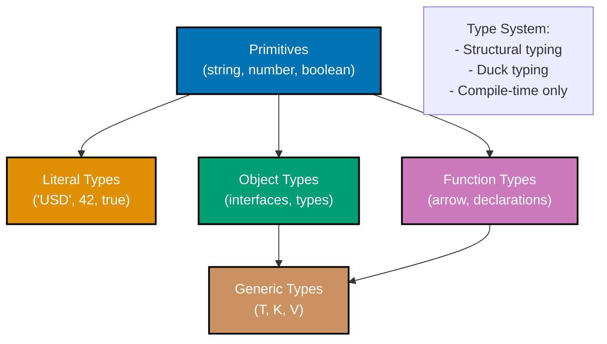
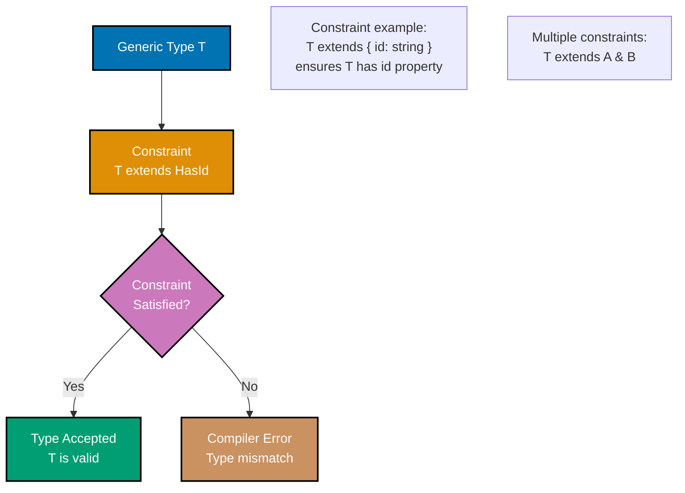
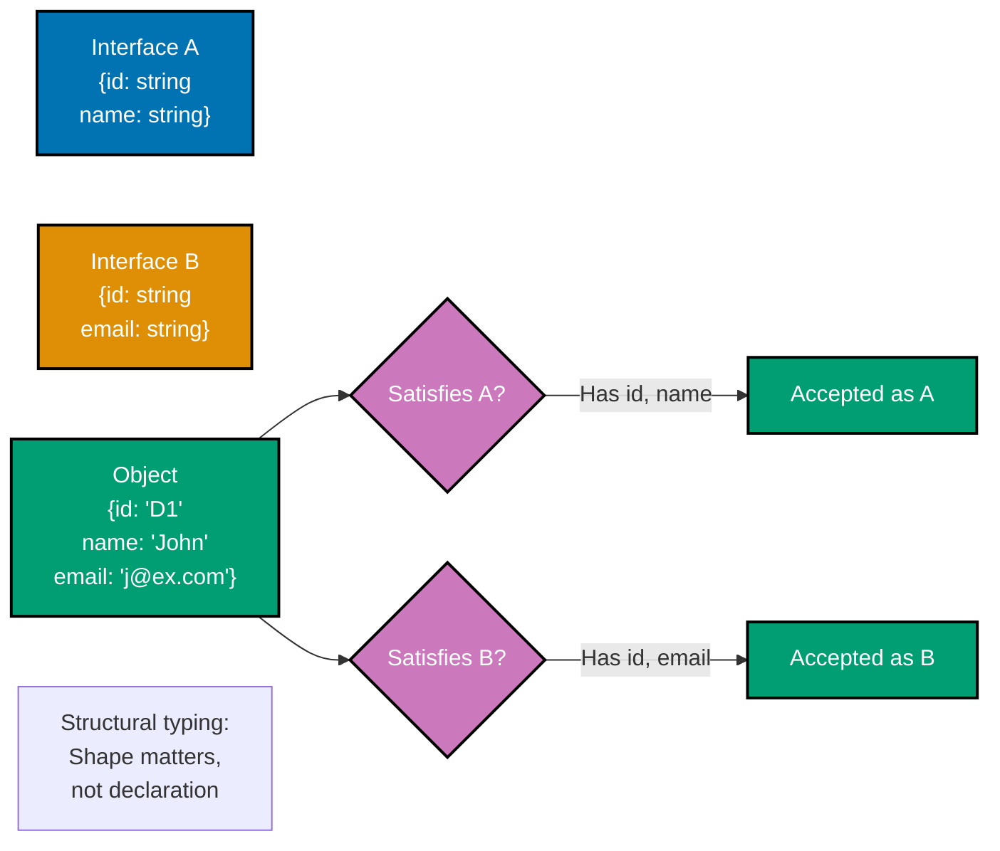

# TypeScript Interfaces and Types

**Quick Reference**: [Overview](#overview) | [Interfaces](#interfaces) | [Type Aliases](#type-aliases) | [Generics](#generics-and-constraints) | [Mapped Types](#mapped-types) | [Index Signatures](#index-signatures) | [Intersection vs Union](#intersection-and-union-types) | [Conditional Types](#conditional-types) | [Related Documentation](#related-documentation)

## Overview

TypeScript provides two primary ways to define object shapes: interfaces and type aliases. Understanding when to use each and how to leverage advanced features like generics and mapped types is essential for type-safe code.

### Type Hierarchy and Relationships



## Interfaces

Interfaces define contracts for object shapes.

### Basic Interfaces

```typescript
interface Money {
  readonly amount: number;
  readonly currency: string;
}

interface Donation {
  readonly donationId: string;
  readonly donorId: string;
  readonly amount: Money;
  readonly category: string;
  readonly createdAt: Date;
}

const donation: Donation = {
  donationId: "DON-001",
  donorId: "DNR-123",
  amount: { amount: 1000, currency: "USD" },
  category: "zakat",
  createdAt: new Date(),
};
```

### Optional Properties

```typescript
interface DonationInput {
  readonly donorId: string;
  readonly amount: number;
  readonly currency: string;
  readonly category: string;
  readonly message?: string; // Optional
  readonly anonymous?: boolean; // Optional
}
```

### Interface Extension

```typescript
interface Timestamped {
  readonly createdAt: Date;
  readonly updatedAt: Date;
}

interface Identifiable {
  readonly id: string;
}

interface Donation extends Timestamped, Identifiable {
  readonly donorId: string;
  readonly amount: Money;
}
```

## Type Aliases

Type aliases create names for any type.

### Basic Type Aliases

```typescript
type DonationId = string;
type Currency = "USD" | "EUR" | "GBP";
type DonationCategory = "zakat" | "sadaqah" | "waqf";

type Money = {
  readonly amount: number;
  readonly currency: Currency;
};
```

### Interfaces vs Type Aliases

```typescript
// Interface - can be extended and merged
interface Donation {
  donationId: string;
  amount: Money;
}

// Type alias - more flexible
type DonationOrError = Donation | Error;
type DonationArray = Donation[];
type DonationMap = Record<string, Donation>;

// Use interfaces for object shapes
// Use type aliases for unions, intersections, utilities
```

## Generics and Constraints

### Generic Type Constraints Flow



### Basic Generics

```typescript
interface Repository<T> {
  findById(id: string): Promise<T | null>;
  save(entity: T): Promise<T>;
  delete(id: string): Promise<void>;
}

class DonationRepository implements Repository<Donation> {
  async findById(id: string): Promise<Donation | null> {
    // Implementation
    return null;
  }

  async save(donation: Donation): Promise<Donation> {
    // Implementation
    return donation;
  }

  async delete(id: string): Promise<void> {
    // Implementation
  }
}
```

### Generic Constraints

```typescript
interface Identifiable {
  id: string;
}

function findById<T extends Identifiable>(items: T[], id: string): T | undefined {
  return items.find((item) => item.id === id);
}

// Multiple constraints
interface Timestamped {
  createdAt: Date;
}

function sortByDate<T extends Timestamped>(items: T[]): T[] {
  return [...items].sort((a, b) => a.createdAt.getTime() - b.createdAt.getTime());
}
```

## Mapped Types

Transform object types systematically.

### Built-in Mapped Types

```typescript
interface Donation {
  donationId: string;
  amount: Money;
  category: string;
}

type PartialDonation = Partial<Donation>;
type ReadonlyDonation = Readonly<Donation>;
type RequiredDonation = Required<Partial<Donation>>;
type DonationKeys = Pick<Donation, "donationId" | "amount">;
```

### Custom Mapped Types

```typescript
type Nullable<T> = {
  [P in keyof T]: T[P] | null;
};

type Optional<T> = {
  [P in keyof T]?: T[P];
};

type DeepReadonly<T> = {
  readonly [P in keyof T]: T[P] extends object ? DeepReadonly<T[P]> : T[P];
};
```

## Index Signatures

### Basic Index Signatures

```typescript
interface ExchangeRates {
  [currency: string]: number;
}

const rates: ExchangeRates = {
  USD: 1.0,
  EUR: 0.85,
  GBP: 0.73,
};
```

### Record Type

```typescript
type Currency = "USD" | "EUR" | "GBP";
type ExchangeRates = Record<Currency, number>;

const rates: ExchangeRates = {
  USD: 1.0,
  EUR: 0.85,
  GBP: 0.73,
};
```

## Intersection and Union Types

### Structural Typing (Duck Typing)



### Intersection Types

```typescript
type Timestamped = {
  createdAt: Date;
  updatedAt: Date;
};

type Identifiable = {
  id: string;
};

type Donation = {
  donorId: string;
  amount: Money;
};

type FullDonation = Donation & Timestamped & Identifiable;
```

### Union Types

```typescript
type PaymentMethod = "cash" | "card" | "bank_transfer";

type Payment = Money | { type: "deferred"; dueDate: Date };

function processPayment(payment: Payment): void {
  if ("type" in payment && payment.type === "deferred") {
    console.log("Deferred until:", payment.dueDate);
  } else {
    console.log("Amount:", payment.amount);
  }
}
```

## Conditional Types

```typescript
type IsString<T> = T extends string ? "yes" : "no";

type ExtractCurrency<T> = T extends { currency: infer C } ? C : never;

interface Money {
  amount: number;
  currency: string;
}

type Currency = ExtractCurrency<Money>; // string
```

## Related Documentation

- **[TypeScript Idioms](ex-soen-prla-ty__idioms.md)** - TypeScript patterns
- **[TypeScript Type Safety](ex-soen-prla-ty__type-safety.md)** - Advanced types
- **[TypeScript Best Practices](ex-soen-prla-ty__best-practices.md)** - Coding standards

---

**Last Updated**: 2025-01-23
**TypeScript Version**: 5.0+ (baseline), 5.4+ (milestone), 5.6+ (stable), 5.9.3+ (latest stable)
**Maintainers**: OSE Documentation Team
