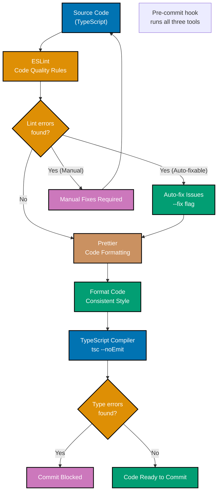
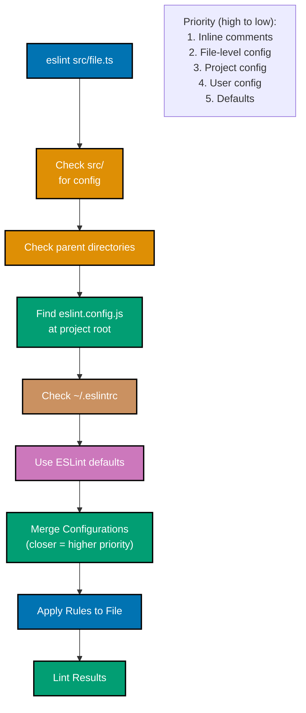
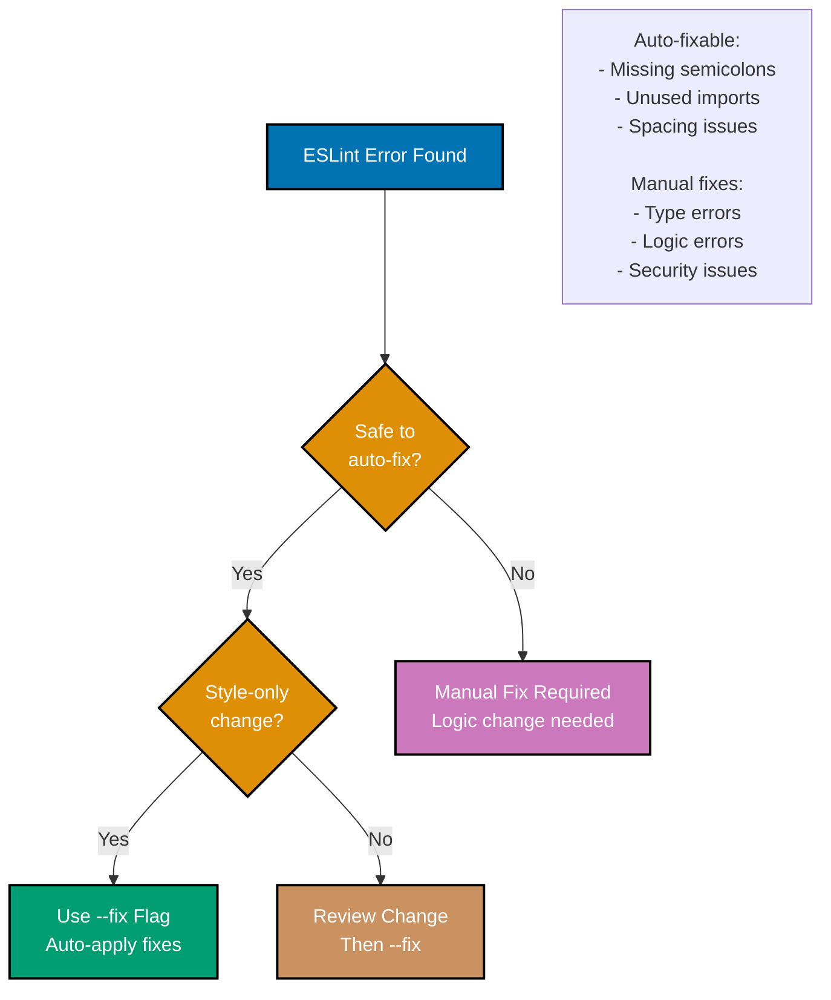
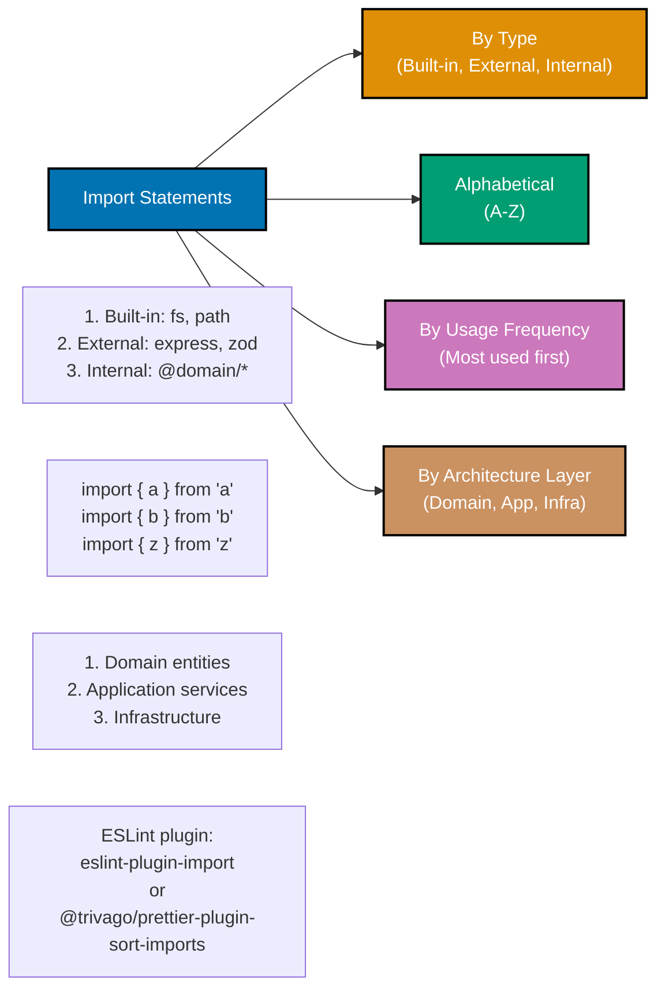

# TypeScript Linting and Formatting

**Quick Reference**: [Overview](#overview) | [ESLint](#eslint-9x10x) | [Prettier](#prettier-3x) | [TSConfig](#tsconfig-strict-mode) | [Pre-commit Hooks](#pre-commit-hooks) | [Related Documentation](#related-documentation)

## Overview

Automated linting and formatting ensure code quality and consistency. ESLint catches errors, Prettier formats code, and Git hooks enforce standards.

### Quality Principles

- **Automated Enforcement**: Hooks prevent bad code from committing
- **Consistent Style**: Prettier removes style debates
- **Catch Errors Early**: ESLint finds bugs before runtime
- **TypeScript Strict**: Strict mode catches more errors

### ESLint → Prettier → TypeScript Pipeline

Understanding the tool integration workflow helps optimize your development setup.



## ESLint 9.x/10.x

### ESLint Configuration Hierarchy

ESLint resolves configuration files following a specific hierarchy. Understanding this helps debug config issues.



### Flat Config Setup (9.x)

```typescript
// eslint.config.js
import eslint from "@eslint/js";
import tseslint from "typescript-eslint";

export default tseslint.config(eslint.configs.recommended, ...tseslint.configs.recommendedTypeChecked, {
  languageOptions: {
    parserOptions: {
      project: true,
      tsconfigRootDir: import.meta.dirname,
    },
  },
  rules: {
    "@typescript-eslint/no-explicit-any": "error",
    "@typescript-eslint/explicit-function-return-type": "warn",
    "@typescript-eslint/no-unused-vars": [
      "error",
      {
        argsIgnorePattern: "^_",
        varsIgnorePattern: "^_",
      },
    ],
    "@typescript-eslint/naming-convention": [
      "error",
      {
        selector: "interface",
        format: ["PascalCase"],
      },
      {
        selector: "typeAlias",
        format: ["PascalCase"],
      },
    ],
    "no-console": ["warn", { allow: ["warn", "error"] }],
  },
});
```

### Custom Rules for Financial Code

```typescript
// eslint.config.js
export default [
  {
    files: ["**/*.ts"],
    rules: {
      // Require explicit types for money
      "@typescript-eslint/explicit-function-return-type": [
        "error",
        {
          allowedNames: ["createMoney", "calculateZakat"],
        },
      ],

      // Ban unsafe type assertions
      "@typescript-eslint/consistent-type-assertions": [
        "error",
        {
          assertionStyle: "as",
          objectLiteralTypeAssertions: "never",
        },
      ],

      // Require validation for external data
      "@typescript-eslint/no-unsafe-argument": "error",
      "@typescript-eslint/no-unsafe-assignment": "error",
      "@typescript-eslint/no-unsafe-call": "error",

      // Prevent floating promises
      "@typescript-eslint/no-floating-promises": "error",
    },
  },
];
```

### Auto-fix vs Manual Fix Decision

When should you use `eslint --fix` vs manual fixes? This decision tree helps optimize your workflow.



## Prettier 3.x

### Import Sorting Strategies

Different strategies for organizing imports affect readability and maintainability.



### Configuration

```javascript
// prettier.config.js
export default {
  semi: true,
  trailingComma: "es5",
  singleQuote: false,
  printWidth: 100,
  tabWidth: 2,
  useTabs: false,
  arrowParens: "always",
  endOfLine: "lf",
};
```

### Integration with ESLint

```typescript
// eslint.config.js
import eslint from "@eslint/js";
import tseslint from "typescript-eslint";
import eslintConfigPrettier from "eslint-config-prettier";

export default tseslint.config(
  eslint.configs.recommended,
  ...tseslint.configs.recommended,
  eslintConfigPrettier, // Disables ESLint rules that conflict with Prettier
);
```

## TSConfig Strict Mode

### Strict Configuration

```json
{
  "compilerOptions": {
    "target": "ES2023",
    "module": "ESNext",
    "moduleResolution": "Bundler",
    "lib": ["ES2023"],
    "outDir": "./dist",
    "rootDir": "./src",

    // Strict type checking
    "strict": true,
    "strictNullChecks": true,
    "strictFunctionTypes": true,
    "strictBindCallApply": true,
    "strictPropertyInitialization": true,
    "noImplicitThis": true,
    "alwaysStrict": true,

    // Additional checks
    "noUnusedLocals": true,
    "noUnusedParameters": true,
    "noImplicitReturns": true,
    "noFallthroughCasesInSwitch": true,
    "noUncheckedIndexedAccess": true,
    "noImplicitOverride": true,
    "noPropertyAccessFromIndexSignature": true,

    // Emit configuration
    "declaration": true,
    "declarationMap": true,
    "sourceMap": true,
    "removeComments": false,

    // Module resolution
    "esModuleInterop": true,
    "allowSyntheticDefaultImports": true,
    "forceConsistentCasingInFileNames": true,
    "resolveJsonModule": true,
    "skipLibCheck": true
  },
  "include": ["src/**/*"],
  "exclude": ["node_modules", "dist", "**/*.test.ts", "**/*.spec.ts"]
}
```

## Pre-commit Hooks

### Husky Setup

```bash
# Install
npm install -D husky lint-staged

# Initialize
npx husky install
npm pkg set scripts.prepare="husky install"
```

### Configure Hooks

```bash
# .husky/pre-commit
#!/usr/bin/env sh
. "$(dirname -- "$0")/_/husky.sh"

npx lint-staged
```

### Lint-staged Configuration

```javascript
// lint-staged.config.js
export default {
  "*.ts": ["eslint --fix", "prettier --write", () => "tsc --noEmit"],
  "*.{json,md,yml}": "prettier --write",
};
```

### Example Workflow

```bash
# Stage files
git add src/donation-service.ts

# Commit triggers hooks
git commit -m "feat: add donation validation"

# Hooks run:
# 1. ESLint fixes issues
# 2. Prettier formats code
# 3. TypeScript checks types
# 4. Auto-stages changes
# 5. Commits if all pass
```

## Related Documentation

- **[TypeScript Best Practices](ex-soen-prla-ty__best-practices.md)** - Coding standards
- **[TypeScript TDD](ex-soen-prla-ty__test-driven-development.md)** - Testing practices

---

**Last Updated**: 2025-01-23
**TypeScript Version**: 5.0+ (baseline), 5.4+ (milestone), 5.6+ (stable), 5.9.3+ (latest stable)
**Tools**: ESLint 9.39.0/10.0.0, Prettier 3.8.0, Husky 9.x, lint-staged 15.x
**Maintainers**: OSE Documentation Team

## TypeScript Quality Tools

```mermaid
%%{init: {'theme':'base', 'themeVariables': { 'primaryColor':'#0173B2','primaryTextColor':'#fff','primaryBorderColor':'#0173B2','lineColor':'#DE8F05','secondaryColor':'#029E73','tertiaryColor':'#CC78BC','fontSize':'16px'}}}%%
flowchart TD
    A[TS Quality] --> B[ESLint<br/>Linting]
    A --> C[Prettier<br/>Formatting]
    A --> D[TypeScript<br/>Type Checking]

    B --> E[@typescript-eslint<br/>TS Rules]
    C --> F[Opinionated<br/>No Config Needed]
    D --> G[strict: true<br/>Maximum Safety]

    style A fill:#0173B2,color:#fff
    style B fill:#DE8F05,color:#fff
    style C fill:#029E73,color:#fff
    style D fill:#CC78BC,color:#fff
```
